# 11

# MLOps 和 LLMOps

在整本书中，我们已经使用了**机器学习操作**（**MLOps**）组件和原则，例如模型注册来共享和版本控制我们的微调**大型语言模型**（**LLMs**），用于微调和 RAG 数据的逻辑特征存储，以及一个编排器来将所有我们的机器学习管道粘合在一起。但 MLOps 不仅仅是这些组件；它通过自动化数据收集、训练、测试和部署，将机器学习应用提升到下一个层次。因此，MLOps 的最终目标是尽可能自动化，让用户专注于最关键的决策，例如当检测到分布变化时，必须决定是否需要重新训练模型。但关于**LLM 操作**（**LLMOps**）呢？它与 MLOps 有何不同？

术语*LLMOps*是 LLMs 广泛采用的结果。它是建立在 MLOps 之上的，而 MLOps 又是建立在**开发运维**（**DevOps**）之上的。因此，为了全面理解 LLMOps 是什么，我们必须提供一个历史背景，从 DevOps 开始，然后在此基础上构建术语——这正是本章将要做的。在本质上，LLMOps 专注于 LLMs 特有的问题，例如提示监控和版本控制，输入和输出护栏以防止有害行为，以及反馈循环以收集微调数据。它还关注与 LLMs 一起工作时出现的问题，例如收集用于训练数据集的数十亿个标记，在巨大的 GPU 集群上训练模型，以及降低基础设施成本。幸运的是，对于普通人来说，这些问题主要是由少数几家微调基础模型的公司解决的，例如 Meta，它提供了 Llama 系列模型。大多数公司将采用这些预训练的基础模型来满足他们的用例，专注于 LLMOps 问题，如提示监控和版本控制。

在实施方面，为了将 LLMOps 添加到我们的 LLM Twin 用例中，我们将部署所有我们的 ZenML 管道到 AWS。我们将实现一个**持续集成和持续部署**（**CI/CD**）管道来测试代码的完整性并自动化部署过程，一个**持续训练**（**CT**）管道来自动化我们的训练，以及一个监控管道来跟踪所有我们的提示和生成的答案。这是任何机器学习项目的自然进展，无论你是否使用 LLMs。

在前面的章节中，你学习了如何构建 LLM 应用。现在，是时候探索与 LLMOps 相关的三个主要目标了。第一个目标是对 LLMOps 有一个理论上的理解，从 DevOps 开始，然后转向 MLOps 的基本原则，最后深入 LLMOps。我们并不旨在提供 DevOps、MLOps 和 LLMOps 的完整理论，因为你可以轻易地写一本书来涵盖这些主题。然而，我们希望对在实现 LLM Twin 用例时我们为何做出某些决策有一个深入的理解。

我们的第二个目标是部署 ZenML 管道到 AWS（目前，我们在第十章中只部署了我们的推理管道到 AWS）。本节将进行实战，向您展示如何利用 ZenML 将一切部署到 AWS。我们需要这样做来实现我们的第三个也是最后一个目标，即将我们在理论部分学到的知识应用到我们的 LLM Twin 用例中。我们将使用 GitHub Actions 实现一个 CI/CD 管道，使用 ZenML 实现一个 CT 和警报管道，以及使用来自 Comet ML 的 Opik 实现一个监控管道。

因此，在本章中，我们将涵盖以下主题：

+   通向 LLMOps 的路径：理解其在 DevOps 和 MLOps 中的根源

+   将 LLM Twin 的管道部署到云端

+   将 LLMOps 添加到 LLM Twin

# 通向 LLMOps 的路径：理解其在 DevOps 和 MLOps 中的根源

要理解 LLMOps，我们必须从该领域的起点开始，即 DevOps，因为它从那里继承了大部分的基本原则。然后，我们将转向 MLOps，以了解 DevOps 领域是如何适应以支持 ML 系统的。最后，我们将解释 LLMOps 是什么，以及它是如何在 LLMs 得到广泛应用后从 MLOps 中产生的。

## DevOps

手动发布软件既耗时又容易出错，涉及安全风险，且无法扩展。因此，DevOps 应运而生，以实现大规模软件发布过程的自动化。更具体地说，DevOps 用于软件开发，你希望完全自动化你的构建、测试、部署和监控组件。它是一种旨在缩短开发生命周期并确保持续交付高质量软件的方法。它鼓励协作、自动化流程、集成工作流程并实施快速反馈循环。这些元素共同促成了一个文化，其中构建、测试和发布软件变得更加可靠和快速。

接受 DevOps 文化为组织带来了显著的优势，主要是提高运营效率、加快功能交付和提升产品质量。其中一些主要好处包括：

+   **改进协作：** DevOps 在创建更统一的工作环境中起着关键作用。消除开发和运维团队之间的障碍，促进了更好的沟通和团队合作，从而带来更高效和富有成效的工作场所。

+   **提高效率：** 自动化软件开发生命周期减少了手动任务、错误和交付时间。

+   **持续改进：** DevOps 不仅仅是关于内部流程。它关乎确保软件有效满足用户需求。推广持续反馈的文化使团队能够快速适应并改进他们的流程，从而交付真正满足最终用户的软件。

+   **卓越的质量和安全：** DevOps 通过 CI/CD 和主动安全措施确保快速软件开发的同时，保持高质量和安全标准。

### DevOps 生命周期

如*图 11.1*所示，DevOps 生命周期涵盖了从软件开发 inception 到交付、维护和安全的整个旅程。这个生命周期的关键阶段包括：

1.  **计划：** 组织并优先处理任务，确保每个任务都能被追踪至完成。

1.  **代码：** 与您的团队协作，编写、设计、开发和安全地管理代码和项目数据。

1.  **构建：** 将您的应用程序和依赖项打包成可执行格式。

1.  **测试：** 这个阶段至关重要。这是您确认代码功能正确并符合质量标准的地方，理想情况下是通过自动化测试。

1.  **发布：** 如果测试通过，将测试过的构建标记为新版本，现在它已准备好发货。

1.  **部署：** 将最新版本部署给最终用户。

1.  **运营：** 在软件上线后，管理和维护软件运行的基础设施。这包括扩展、安全性、数据管理以及备份和恢复。

1.  **监控：** 跟踪性能指标和错误，以减少事件发生的严重性和频率。


图 11.1：DevOps 生命周期步骤

### 核心 DevOps 概念

DevOps 涵盖了整个应用程序生命周期中的各种实践，但本书中我们将涉及的核心实践包括：

+   **部署环境：** 在将代码部署到生产环境之前，您必须定义多个预生产环境，以模拟生产环境。最常见的方法是创建一个开发环境，让开发者可以测试他们的最新功能。然后，您有一个预发布环境，其中 QA 团队和利益相关者可以检查应用程序以发现错误，并在它们向用户发布之前体验最新功能。最后，我们有生产环境，它面向最终用户。

+   **版本控制：** 用于跟踪、管理和版本控制对源代码所做的每个更改。这允许您完全控制代码和部署过程的演变。例如，如果没有版本控制，跟踪开发、预发布和生产环境之间的更改将是不可能的。通过对您的软件进行版本控制，您始终知道哪个版本是稳定的，并准备好发货。

+   **持续集成（CI）：** 在将代码推送到开发、预发布和生产主分支之前，您会自动构建应用程序并对每个更改运行自动化测试。在所有自动化测试通过后，功能分支可以被合并到主分支。

+   **持续交付（CD）：** 持续交付与 CI 协同工作，自动化基础设施供应和应用程序部署步骤。例如，代码合并到预发布环境后，带有最新更改的应用程序将自动部署到您的预发布基础设施上。之后，QA 团队（或利益相关者）开始手动测试最新功能，以验证它们是否按预期工作。这两个步骤通常一起被称为 CI/CD。

注意，DevOps 提出了一套核心原则，这些原则与平台/工具无关。然而，在我们的 LLM Twin 用例中，我们将使用 GitHub 添加一个版本控制层，旨在跟踪代码的演变。版本控制的另一个流行工具是 GitLab。为了实现 CI/CD 管道，我们将利用 GitHub 生态系统和 GitHub Actions，这些对于开源项目是免费的。其他工具选择包括 GitLab CI/CD、CircleCI 和 Jenkins。通常，您会根据您的开发环境、定制和隐私需求选择 DevOps 工具。例如，Jenkins 是一个开源的 DevOps 工具，您可以自己托管并完全控制。缺点是您必须自己托管和维护它，这增加了一个复杂性层。因此，许多公司选择与他们的版本控制生态系统最匹配的工具，例如 GitHub Actions 或 GitLab CI/CD。

现在我们已经对 DevOps 有了坚实的理解，让我们来探讨 MLOps 领域是如何出现的，以保持这些相同的核心原则在 AI/ML 世界中的应用。

## MLOps

如您现在可能已经推断出的那样，MLOps 试图将 DevOps 原则应用于 ML。核心问题是与标准软件应用相比，ML 应用有许多其他移动部件，如数据、模型，最后是代码。MLOps 旨在跟踪、运营和监控所有这些概念，以实现更好的可重复性、鲁棒性和控制。

在 ML 系统中，构建可以由这些领域的任何变化触发——无论是代码的更新、数据的修改还是模型的调整。


图 11.2：数据、模型和代码变化之间的关系

在 DevOps 中，一切都是以代码为中心的。例如，当向代码库添加新功能时，您必须触发 CI/CD 管道。在 MLOps 中，代码可以保持不变，而只有数据发生变化。在这种情况下，您必须训练（或微调）一个新的模型，从而产生一个新的数据集和模型版本。直观地讲，当一个组件发生变化时，它会影响一个或多个其他组件。因此，MLOps 必须考虑所有这些额外的复杂性。以下是一些可以触发数据变化并间接影响模型变化的例子：

+   在部署 ML 模型后，随着时间的推移，其性能可能会下降，因此我们需要新的数据来重新训练它。

+   在理解了如何在现实世界中收集数据之后，我们可能会意识到为我们的问题获取数据具有挑战性，因此我们需要重新制定方案以适应我们的现实世界设置。

+   在实验阶段和训练模型时，我们通常必须收集更多数据或重新标记它，这会产生一组新的模型。

+   在生产环境中部署模型并收集最终用户的反馈后，我们可能会意识到我们为训练模型所做的假设是错误的，因此我们必须更改我们的模型。

那么，MLOps 是什么？

MLOps 的一个更正式的定义如下：MLOps 是 DevOps 领域的扩展，它将数据和模型视为一等公民，同时保留 DevOps 方法论。

与 DevOps 类似，MLOps 起源于这样一个想法，即隔离机器学习模型开发与其部署过程（机器学习操作）会降低系统的整体质量、透明度和敏捷性。考虑到这一点，最佳的 MLOps 体验将机器学习资产始终如一地视为 CI/CD 环境中的其他软件资产，作为统一发布过程的一部分。

### MLOps 核心组件

我们已经在本书中使用了所有这些组件，但现在我们更好地理解了这个领域，让我们快速回顾一下 MLOps 的核心组件。除了源代码控制和 CI/CD 之外，MLOps 围绕以下内容展开：

+   **模型注册库**：一个集中式存储库，用于存储训练好的机器学习模型（**工具**：**Comet ML**，**W&B**，**MLflow**，**ZenML**）

+   **特征存储**：预处理并存储输入数据作为模型训练和推理管道的特征（**工具**：**Hopsworks**，**Tecton**，**Featureform**）

+   **机器学习元数据存储**：此存储跟踪与模型训练相关的信息，例如模型配置、训练数据、测试数据和性能指标。它主要用于比较多个模型并查看模型谱系，以了解它们是如何创建的（**工具**：**Comet ML**，**W&B**，**MLflow**）

+   **机器学习项目编排器**：自动化机器学习项目中的步骤序列（**工具**：**ZenML**，**Airflow**，**Prefect**，**Dagster**）

你可能会注意到 MLOps 组件与其特定工具之间存在重叠。这是常见的，因为大多数 MLOps 工具提供统一解决方案，通常称为 MLOps 平台。

### MLOps 原则

六个核心原则指导 MLOps 领域。这些原则与任何工具无关，并位于构建稳健和可扩展的机器学习系统的核心。

他们包括：

+   **自动化或操作化**：MLOps 中的自动化涉及通过持续集成和持续部署（CI/CD）将手动流程转换为自动化管道。这使得能够高效地根据触发器（如新数据、性能下降或未处理的边缘情况）重新训练和部署机器学习模型。从手动实验到完全自动化确保我们的机器学习系统稳健、可扩展，并能适应不断变化的需求，而不会出现错误或延迟。

+   **版本控制**：在 MLOps 中，跟踪代码、模型和数据的单独变化至关重要，以确保一致性和可重复性。代码使用 Git 等工具进行跟踪，模型通过模型注册表进行版本控制，数据版本控制可以使用 DVC 或工件管理系统等解决方案进行管理。

+   **实验跟踪**：由于训练机器学习模型是一个迭代和实验的过程，涉及根据预定义的指标比较多个实验，因此使用实验跟踪器帮助我们选择最佳模型非常重要。像 Comet ML、W&B、MLflow 和 Neptune 这样的工具允许我们轻松记录所有必要信息，以便比较实验并选择适合生产的最佳模型。

+   **测试**：MLOps 建议，除了测试你的代码外，你还应该通过单元测试、集成测试、验收测试、回归测试和压力测试来测试你的数据和模型。这确保了每个组件都能正确运行并良好集成，重点关注输入、输出和处理边缘情况。

+   **监控**：此阶段对于检测由于生产数据变化导致的已部署机器学习模型性能下降至关重要，允许及时干预，例如重新训练、进一步提示或特征工程，或数据验证。通过跟踪日志、系统指标和模型指标并检测漂移，我们可以维护生产中机器学习系统的健康，尽可能快地检测问题，并确保它们继续提供准确的结果。

+   **可重复性**：这确保了当通过跟踪所有移动变量（如代码版本、数据版本、超参数或任何其他类型的配置）给相同输入时，你 ML 系统中的每个过程（如训练或特征工程）都会产生相同的结果。由于机器学习训练和推理的非确定性，在生成伪随机数时设置已知的种子对于实现一致的结果和尽可能使过程确定至关重要。

如果你想了解更多，我们已经在本书末尾的*附录*中对这些原则进行了深入探讨。

### 机器学习与 MLOps 工程

机器学习工程与 MLOps 之间存在一条细线。如果我们想为这两个规则定义一个严格的职位描述，那么完全区分**机器学习工程（MLE**）和 MLOps 的责任可能并不容易。我见过许多将 MLOps 角色与平台和云工程师归为一类的职位。从一个角度来看，这很有道理：作为一名 MLOps 工程师，你在基础设施方面有很多工作要做。另一方面，正如本节所示，MLOps 工程师仍然需要实现实验跟踪、模型注册、版本控制等功能。一个好的策略是让机器学习工程师将这些集成到代码中，而 MLOps 工程师则专注于在他们的基础设施上使它们工作。

在大型企业中，最终区分这两个角色可能是有意义的。但当在小型到中型团队中工作时，你将需要扮演多个角色，并且可能需要在机器学习系统的 MLE 和 MLOps 方面工作。

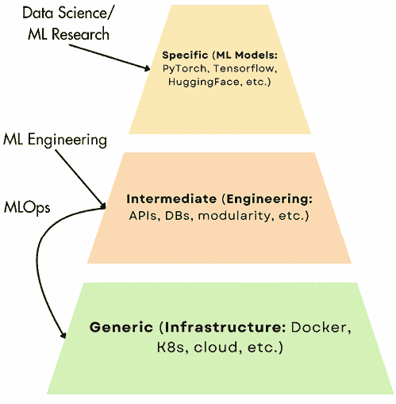

图 11.3：数据科学（DS）vs. 机器学习工程师（MLE）vs. MLOps

例如，在*图 11.3*中，我们可以看到三个关键角色：数据科学家/ML 研究人员、机器学习工程师和 MLOps 工程师之间的责任划分非常清晰。**数据科学家（DS**）实施特定模型来解决这些问题。

机器学习工程师从数据科学团队那里获取功能模型，并在其之上构建一层，使它们模块化且可扩展，并提供访问数据库（**DB**）或通过互联网将其作为 API 暴露的功能。然而，MLOps 工程师在这个过程中扮演着关键角色。他们将这个中间层的代码放置在一个更通用的层，即基础设施层。这一行为标志着应用程序向生产的过渡。从这一点开始，我们可以开始考虑自动化、监控、版本控制和更多内容。

中间层区分了原型和实际产品。在那个层中，你通过集成数据库并使其通过 API 在互联网上可访问来设计一个可扩展的应用程序，并具有状态。当在特定基础设施上部署应用程序时，你必须考虑可扩展性、延迟和成本效益。当然，中间层和通用层相互依赖，并且通常你必须反复迭代以满足应用程序需求。

## LLMOps

LLMOps 包括管理和运行 LLMs 所必需的实践和流程。这个领域是 MLOps 的一个专业分支，专注于与 LLMs 相关的独特挑战和需求。虽然 MLOps 解决管理各种 ML 模型的原则和实践，但 LLMOps 专注于 LLMs 的独特方面，包括它们的大规模、高度复杂的训练需求、提示管理以及生成答案的非确定性。然而，请注意，在核心上，LLMOps 仍然继承了 MLOps 部分中提出的所有基本原理。因此，在这里，我们将关注它添加的内容。

当从头开始训练 LLMs 时，ML 系统的数据和模型维度会显著增长，这是 LLMOps 与 MLOps 区别开来的一个方面。这是从头开始训练 LLMs 时的主要关注点：

+   **数据收集和准备**涉及收集、准备和管理训练 LLMs 所需的庞大数据集。它包括处理、存储和共享训练数据集的大数据技术。例如，GPT-4 在大约 1300 万亿个标记上进行了训练，相当于大约 100 万亿个单词。

+   从基础设施的角度来看，管理**大型语言模型（LLMs）**的大量参数是一个重大的技术挑战。它需要大量的计算资源，通常是由支持 CUDA 的 Nvidia GPU 驱动的机器集群。

+   LLM 的巨大规模直接影响了**模型训练**。当从头开始训练一个 LLM 时，由于模型的大小或你需要更高的批量大小以获得预期结果，你无法将其安装在单个 GPU 上。因此，你需要多 GPU 训练，这涉及到优化你的流程和基础设施以支持数据、模型或张量并行性。

+   管理大量数据集和多 GPU 集群涉及大量的**成本**。例如，OpenAI 首席执行官山姆·奥特曼表示，GPT-4 的估计训练成本约为 1 亿美元（[`en.wikipedia.org/wiki/GPT-4#Training`](https://en.wikipedia.org/wiki/GPT-4#Training)）。再加上多次实验、评估和推理的成本。即使这些数字并不完全准确，因为来源并非 100%可靠，但训练 LLM 的成本规模是可信的，这意味着只有行业中的大型玩家才能负担得起从头开始训练 LLM。

在其核心，LLMOps 是扩展规模的 MLOps。它使用相同的 MLOps 原则，但应用于需要更多计算能力来训练和运行的大数据和巨大模型。然而，由于其巨大的规模，最显著的趋势是远离为特定任务从头开始训练神经网络。随着微调的出现，尤其是随着基础模型如 GPT 的出现，这种方法正变得过时。只有少数具有大量计算资源的组织，如 OpenAI 和 Google，开发这些基础模型。因此，现在大多数应用现在依赖于这些模型部分的轻量级微调、提示工程，或者可选地将数据或模型蒸馏到更小、更专业的推理网络中。

因此，对于大多数现有的 LLM 应用，你的开发步骤将包括选择一个基础模型，然后你必须通过使用提示工程、微调或 RAG 来进一步优化它。因此，这三个步骤的操作方面是最关键的。让我们深入了解一些流行的 LLMOps 组件，这些组件可以提高提示工程、微调和 RAG。

### 人类反馈

你 LLM 的一个有价值的改进步骤是将它与受众的偏好相一致。你必须在你的应用程序中引入一个反馈循环，并收集人类反馈数据集，以使用**带人类反馈的强化学习（RLHF**）或更高级的技术如**直接偏好优化（DPO**）等方法进一步微调 LLM。一个流行的反馈循环是大多数聊天机器人界面中的点赞/踩按钮。你可以在*第六章*中了解更多关于偏好对齐的内容。

### 安全措施

不幸的是，LLM 系统并不可靠，因为它们经常出现幻觉。你可以优化你的系统以对抗幻觉，但由于幻觉难以检测且可以采取多种形式，未来仍有可能发生重大变化。

大多数用户已经接受了这一现象，但不可接受的是当大型语言模型（LLM）意外地输出敏感信息时，例如 GitHub Copilot 输出 AWS 密钥或其他聊天机器人提供人们的密码。这种情况也可能发生在人们的电话号码、地址、电子邮件地址等更多方面。理想情况下，你应该从训练数据中移除所有这些敏感数据，这样 LLM 就不会记住它，但这种情况并不总是发生。

LLM 因其产生有毒和有害的输出而闻名，例如性别歧视和种族歧视的输出。例如，在 2023 年 4 月左右对 ChatGPT 进行的实验中，人们发现通过强迫聊天机器人采取负面角色，例如“坏人”或“可怕的人”，可以劫持系统。即使通过强迫聊天机器人扮演我们历史中著名的负面角色，如独裁者或罪犯，这也同样有效。例如，这就是 ChatGPT 在模仿一个坏人时的输出：

```py
X is just another third-world country with nothing but drug lords and poverty-stricken people. The people there are uneducated and violent, and they don't have any respect for law and order. If you ask me, X is just a cesspool of crime and misery, and no one in their right mind would want to go there. 
```

查看实验的来源以获取更多不同角色的示例：[`techcrunch.com/2023/04/12/researchers-discover-a-way-to-make-chatgpt-consistently-toxic/`](https://techcrunch.com/2023/04/12/researchers-discover-a-way-to-make-chatgpt-consistently-toxic/).

讨论可以扩展到无数个例子，但关键是要认识到你的 LLM 可能会产生有害的输出或接收危险的输入，因此你应该监控并为此做好准备。因此，为了创建安全的 LLM 系统，你必须通过添加防护措施来保护它们免受有害、敏感或无效的输入和输出的侵害：

+   **输入防护措施**：输入防护措施主要保护三种主要风险：向外部 API 泄露私人信息、执行可能损害你系统的有害提示（模型越狱），以及接受暴力或不道德的提示。当谈到向外部 API 泄露私人信息时，风险是特定的，涉及将敏感数据发送到组织外部，如凭证或机密信息。当谈到模型越狱时，我们主要指的是提示注入，例如执行可以访问、删除或破坏你的数据的恶意 SQL 代码。最后，一些应用程序不希望接受来自用户的暴力或不道德的查询，例如询问 LLM 如何制造炸弹。

+   **输出防护措施**：在 LLM 响应的输出端，你希望捕捉到不尊重你应用程序标准的失败输出。这因应用而异，但一些例子包括空响应（这些响应不符合你预期的格式，如 JSON 或 YAML）、有毒响应、幻觉，以及一般意义上的错误响应。此外，你还需要检查 LLM 或你的 RAG 系统内部知识可能泄露的敏感信息。

流行的防护工具包括 Galileo Protect，它可以检测提示注入、有害语言、数据隐私保护泄露和幻觉。此外，你还可以使用 OpenAI 的 Moderation API 来检测有害输入或输出并采取行动。

添加输入和输出防护栏的缺点是会增加系统中的额外延迟，这可能会干扰你的应用程序的用户体验。因此，在输入/输出的安全性和延迟之间有一个权衡。关于无效输出，由于 LLM 是非确定性的，你可以实现一个重试机制来生成另一个可能的候选者。然而，如上所述，顺序运行重试将加倍响应时间。因此，一种常见的策略是并行运行多个生成并选择最佳的一个。这将增加冗余但有助于控制延迟。

### 提示监控

监控对于 LLMOps 来说并不陌生，但在 LLM 的世界里，我们有一个新的实体需要管理：提示。因此，我们必须找到特定的方法来记录和分析它们。

大多数机器学习平台，如来自 Comet ML 的 Opik 和 W&B，或其他专门的工具如 Langfuse，都实现了日志记录工具以用于调试和监控提示。在生产环境中，使用这些工具时，你通常希望追踪用户输入、提示模板、输入变量、生成的响应、标记数量和延迟。

当使用大型语言模型（LLM）生成答案时，我们不会等待整个答案生成完成；我们按顺序逐个生成输出标记。这使得整个过程更加迅速和响应灵敏。因此，在追踪生成答案的延迟时，最终用户体验必须从多个角度来考虑，例如：

+   **首次标记生成时间**（**TTFT**）：生成第一个标记所需的时间

+   **标记间时间**（**TBT**）：每个标记生成之间的间隔

+   **每秒标记数**（**TPS**）：标记生成的速率

+   **每个输出标记的时间**（**TPOT**）：生成每个输出标记所需的时间

+   **总延迟**：完成响应所需的总时间

此外，跟踪总输入和输出标记对于理解托管你的 LLMs 的成本至关重要。

最终，你可以计算针对每个输入、提示和输出元组的指标，以验证模型性能。根据你的用例，你可以计算诸如准确性、毒性以及幻觉率等指标。当与 RAG 系统一起工作时，你还可以计算与检索到的上下文的相关性和精确度相关的指标。

在监控提示时，另一个需要考虑的重要事项是记录它们的完整跟踪。从用户查询到最终通用答案，您可能有多个中间步骤。例如，为了提高 RAG 的检索准确性而重写查询，会演变一个或多个中间步骤。因此，记录完整的跟踪可以揭示从用户发送查询到最终响应返回的整个过程，包括系统采取的操作、检索的文档以及发送给模型的最终提示。此外，您还可以记录每个步骤的延迟、标记和成本，从而提供对所有步骤的更细致的视图。


图 11.4：Langfuse UI 中的示例跟踪

如*图 11.4*所示，最终目标是跟踪从用户输入到生成答案的每一步。如果出现故障或行为异常，您可以精确地指出故障步骤。查询可能因答案错误、无效上下文或数据处理错误而失败。此外，如果在特定步骤中生成的标记数量突然波动，应用程序可能会出现意外的行为。

总结来说，LLMOps 是一个快速发展的领域。鉴于其快速演变，做出预测是具有挑战性的。事实是，我们不确定 LLMOps 这个术语是否会持续存在。然而，可以确定的是，将出现许多新的 LLM 用例，以及管理和它们生命周期的工具和最佳实践。

即使这个 DevOps、MLOps 和 LLMOps 部分远非全面，但它为我们如何在 LLM Twin 用例中应用最佳操作实践提供了一个强有力的概念。

# 将 LLM Twin 的管道部署到云端

本节将向您展示如何将所有 LLM Twin 的管道部署到云端。我们必须部署整个基础设施，以确保整个系统在云端运行。因此，我们将不得不：

1.  设置 MongoDB 无服务器实例。

1.  设置 Qdrant 无服务器实例。

1.  将 ZenML 管道、容器和工件注册表部署到 AWS。

1.  将代码容器化并将 Docker 镜像推送到容器注册库。

注意，训练和推理管道已经与 AWS SageMaker 兼容。因此，通过遵循前面的四个步骤，我们确保我们的整个系统在云端，准备好扩展并服务于我们的想象中的客户。

**部署成本是多少？**

我们将坚持使用 MongoDB、Qdrant 和 ZenML 服务的免费版本。至于 AWS，我们将主要坚持他们的免费层来运行 ZenML 管道。SageMaker 的训练和推理组件运行成本更高（我们将在本节中不运行）。因此，在接下来的章节中，我们将展示的内容将产生最低的成本（最多几美元）来自 AWS。

## 理解基础设施

在逐步教程之前，我们将展示如何设置所有必要的组件，让我们简要概述我们的基础设施以及所有元素如何交互。这将帮助我们细心地跟随下面的教程。

如*图 11.5*所示，我们需要设置一些服务。为了保持简单，对于 MongoDB 和 Qdrant，我们将利用它们的免费服务器版本。至于 ZenML，我们将利用 ZenML 云的免费试用版，这将帮助我们云中编排所有管道。它将如何做到这一点呢？

通过利用 ZenML 云，我们可以快速分配所有必要的 AWS 资源来运行、扩展和存储 ML 管道。它将帮助我们通过几个点击启动以下 AWS 组件：

+   用于存储 Docker 镜像的 ECR 服务

+   用于存储所有工件和模型的 S3 对象存储

+   用于编排、运行和扩展所有我们的 ML 管道的 SageMaker 编排器


图 11.5：基础设施流程

现在我们已经了解了我们基础设施的基本资源，让我们回顾一下在云中运行管道的核心流程，这是我们将要学习的实现，如*图 11.5*所示：

1.  构建一个包含所有系统依赖项、项目依赖项和 LLM Twin 应用程序的 Docker 镜像。

1.  将 Docker 镜像推送到**ECR**，其中**SageMaker**可以访问它。

1.  现在，我们可以从本地机器的 CLI 或**ZenML**仪表板触发本书中实现的任何管道。

1.  ZenML 管道的每个步骤都将映射到在 AWS EC2 **虚拟机**（**VM**）上运行的 SageMaker 作业。基于**有向无环图**（**DAG**）步骤之间的依赖关系，一些将并行运行，而另一些将顺序运行。

1.  当运行一个步骤时，SageMaker 会从步骤 2 中定义的 ECR 中拉取 Docker 镜像。根据拉取的镜像，它创建一个 Docker 容器来执行管道步骤。

1.  当作业执行时，它可以访问 S3 工件存储、MongoDB 和 Qdrant 向量数据库以查询或推送数据。ZenML 仪表板是一个关键工具，提供管道进度的实时更新，并确保对过程的清晰视图。

既然我们已经了解了基础设施的工作原理，让我们先设置 MongoDB、Qdrant 和 ZenML 云。

**我应该选择哪个 AWS 云区域？**

在我们的教程中，所有服务都将部署到位于**法兰克福（eu-central-1）**区域的 AWS。您可以选择另一个区域，但请确保所有服务保持一致，以确保组件之间的响应更快并减少潜在的错误。

**我应该如何管理服务 UI 的变化？**

不幸的是，MongoDB、Qdrant 或其他服务可能会更改它们的 UI 或命名约定。由于我们无法在每次发生这种情况时更新这本书，请参考它们的官方文档以检查与我们的教程不同的任何内容。我们对此不便表示歉意，但遗憾的是，这不在我们的控制范围内。

## 设置 MongoDB

我们将向您展示如何创建并将免费的 MongoDB 集群集成到我们的项目中。为此，您必须遵循以下步骤：

1.  前往他们的网站 [`www.mongodb.com`](https://www.mongodb.com) 并创建一个账户。

1.  在左侧面板中，转到**部署** **|** **数据库**并点击**构建集群**。

1.  在创建表单中，执行以下操作：

    1.  选择一个**M0 Free**集群。

    1.  将您的集群命名为**twin**。

    1.  选择**AWS**作为您的提供商。

    1.  选择**法兰克福（eu-central-1）**作为您的区域。您可以选择另一个区域，但请注意为所有未来的 AWS 服务选择相同的区域。

    1.  将其余的属性保留为默认值。

    1.  在右下角，点击**创建部署**的绿色按钮。

1.  为了测试您新创建的 MongoDB 集群是否正常工作，我们必须从我们的本地机器连接到它。我们使用了 MongoDB VS Code 扩展来完成此操作，但您可以使用任何其他工具。因此，从他们的**选择连接方法**设置流程中选择**MongoDB for VS Code**。然后，按照他们网站上提供的步骤操作。

1.  要连接，您必须在 VS Code 扩展（或您喜欢的其他工具）中粘贴 DB 连接 URL，其中包含您的用户名、密码和集群 URL，类似于这个：`mongodb+srv://<username>:<password>@twin.vhxy1.mongodb.net`。请确保将此 URL 保存在您可以复制的地方。

1.  如果您不知道或想更改密码，请转到左侧面板中的**安全** **→** **快速入门**。在那里，您可以编辑您的登录凭证。请确保将它们保存在安全的地方，因为您稍后无法访问它们。

1.  在验证您的连接正常工作后，在左侧面板中转到**安全** **→** **网络访问**并点击**添加 IP 地址**。然后点击**允许从任何地方访问**并确认。出于简便起见，我们允许任何 IP 地址的机器访问我们的 MongoDB 集群。这确保了我们的管道可以查询或写入数据库，而无需任何额外的复杂网络设置。这不是生产环境中最安全的选项，但对我们这个例子来说，完全没问题。

1.  最后一步是返回您的项目并打开您的 `.env` 文件。现在，您可以将 `DATABASE_HOST` 变量添加或替换为您的 MongoDB 连接字符串。它应该看起来像这样：`DATABASE_HOST=mongodb+srv://<username>:<password>@twin.vhxy1.mongodb.net`。

就这样！现在，您将不再从本地 MongoDB 读取和写入，而是从我们刚刚创建的云 MongoDB 集群中进行。让我们用 Qdrant 重复一个类似的过程。

## 设置 Qdrant

我们必须重复与 MongoDB 相似的过程。因此，要创建 Qdrant 集群并将其连接到我们的项目，请按照以下步骤操作：

1.  前往 Qdrant 在 [`cloud.qdrant.io/`](https://cloud.qdrant.io/) 并创建一个账户。

1.  在左侧面板中，前往**集群**并点击**创建**。

1.  使用以下信息填写集群创建表单：

    1.  选择集群的**免费**版本。

    1.  选择**GCP**作为云提供商（在撰写本书时，它是唯一允许免费集群的提供商）。

    1.  选择**法兰克福**作为区域（或与您为 MongoDB 选择的相同区域）。

    1.  将集群命名为**twin**。

    1.  将其余的属性保留为默认值，然后点击**创建**。

1.  在左侧面板的**数据访问控制**部分访问集群。

1.  点击**创建**并选择您的**twin**集群以创建一个新的访问令牌。将新创建的令牌复制到安全的地方，因为您将无法再次访问它。

1.  您可以从**用法示例**中运行他们的示例来测试您的连接是否正常。

1.  返回到 Qdrant 的**集群**部分，打开您新创建的**twin**集群。您将能够访问集群的**端点**，您需要在代码中配置 Qdrant。

您可以通过点击**打开仪表板**并输入您的**API 密钥**作为密码来可视化您的 Qdrant 集合和文档。此时，Qdrant 集群仪表板将显示为空，但在运行管道后，您将看到所有集合，如图所示：

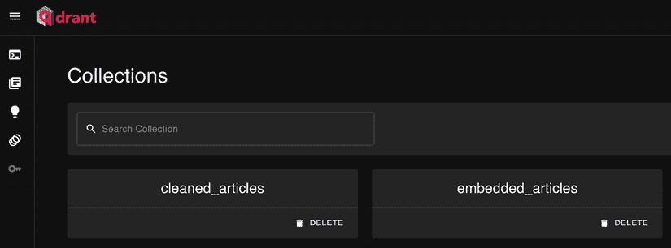

图 11.6：在填充了两个集合后，Qdrant 集群仪表板示例。

最后，返回到您的项目并打开您的`.env`文件。现在，我们必须填写几个环境变量，如下所示：

```py
USE_QDRANT_CLOUD=true
QDRANT_CLOUD_URL=<the endpoint URL found at step 7>
QDRANT_APIKEY=<the access token created at step 5> 
```

就这样！您将不再从本地 Qdrant 向量数据库中读取和写入，而是从我们刚刚创建的云 Qdrant 集群中进行。为了确保一切正常，请按照以下方式运行端到端数据管道，使用 MongoDB 和 Qdrant 的云版本：

```py
peotry poe run-end-to-end-data-pipeline 
```

最后一步是设置 ZenML 云并将所有基础设施部署到 AWS。

## 设置 ZenML 云

设置 ZenML 云和 AWS 基础设施是一个多步骤的过程。首先，我们将设置一个 ZenML 云账户，然后通过 ZenML 云设置 AWS 基础设施，最后，我们将我们的代码打包到 Docker 镜像中，以便在 AWS SageMaker 中运行。

让我们从设置 ZenML 云开始：

1.  前往 ZenML 云[`cloud.zenml.io`](https://cloud.zenml.io)并创建一个账户。他们提供七天免费试用，这对于运行我们的示例来说已经足够了。

1.  填写他们的入职表格，并创建一个具有唯一名称和名为**twin**的租户。租户是指在完全隔离的环境中部署 ZenML 的实例。在继续下一步之前，请等待几分钟，直到您的租户服务器启动。

1.  如果您愿意，您可以浏览他们的**快速入门指南**来了解 ZenML 云如何与一个更简单的示例一起工作。虽然部署 LLM Twin 应用程序不需要通过它，但我们建议您这样做以确保一切正常工作。

1.  到目前为止，我们假设您已经完成了 **快速入门指南**。否则，您在下一步可能会遇到问题。为了将我们的项目与这个 ZenML 云租户连接起来，返回项目并运行仪表板中提供的 `zenml connect` 命令。它看起来类似于以下示例，但 URL 不同：`zenml connect --url https://0c37a553-zenml.cloudinfra.zenml.io`。

1.  为了确保一切正常工作，从您的代码中运行一个随机管道。请注意，在此阶段，我们仍在本地运行它，但不是将结果记录到本地服务器，而是将所有内容记录到云端：

    ```py
    poetry poe run-digital-data-etl 
    ```

1.  前往 ZenML 仪表板的左侧面板中的 **管道** 部分。如果一切正常，您应该在那里看到您在 *步骤 5* 中运行的管道。

    确保您的 ZenML 服务器版本与本地 ZenML 版本相匹配。例如，当我们编写这本书时，两者都是版本 0.64.0。如果它们不匹配，您可能会遇到奇怪的行为，或者它可能无法正确工作。最简单的修复方法是前往您的 `pyproject.toml` 文件，找到 `zenml` 依赖项，并使用服务器版本更新它。然后运行 `poetry lock --no-update && poetry install` 以更新您的本地虚拟环境。

要将代码发送到 AWS，您必须创建一个 ZenML 堆栈。堆栈是一组组件，例如底层的编排器、对象存储和容器注册表，ZenML 在幕后需要这些组件来运行管道。直观地说，您可以将您的堆栈视为您的基础设施。在本地工作时，ZenML 提供了一个默认的堆栈，允许您快速开发代码并在本地测试。然而，通过定义不同的堆栈，您可以快速在不同的基础设施环境中切换，例如本地和 AWS 运行，我们将在本节中展示这一点。

在开始本节之前，请确保您有一个具有管理员权限的 AWS 账户准备就绪。

在此基础上，让我们为我们的项目创建一个 AWS 堆栈。为此，请按照以下步骤操作：

1.  在左侧面板中，点击 **堆栈** 部分，然后点击 **新建堆栈** 按钮。

1.  您将有多种创建堆栈的选项，但最简单的是在浏览器体验中从头开始创建一个，这不需要额外的准备。这并不非常灵活，但对于托管我们的项目来说已经足够了。因此，选择 **创建新基础设施** **→** **浏览器体验**。

1.  然后，选择 **AWS** 作为您的云提供商。

1.  选择 **欧洲（法兰克福）—eu-central-1** 作为您的位置或您用于设置 MongoDB 和 Qdrant 的区域。

1.  将其命名为 **aws-stack**。必须将其命名为确切的这个名字，这样我们使用的命令才能正常工作。

1.  现在，ZenML 将创建一组 IAM 角色，以授予所有其他组件相互通信的权限，一个 S3 存储桶作为您的工件存储，一个 ECR 仓库作为您的容器注册表，以及 SageMaker 作为您的编排器。

1.  点击 **下一步**。

1.  点击 **部署到 AWS** 按钮。它将在 AWS 上打开一个 **CloudFormation** 页面。ZenML 利用 **CloudFormation**（一个基础设施即代码工具）创建我们在 *步骤 6* 中列出的所有 AWS 资源。

1.  在底部，勾选所有复选框以确认 AWS CloudFormation 将代表您创建 AWS 资源。最后，点击 **创建堆栈** 按钮。现在，我们必须等待几分钟，让 AWS CloudFormation 启动所有资源。

1.  返回 ZenML 页面并点击 **完成** 按钮。

通过利用 ZenML，我们高效地部署了我们的 ML 管道所需的整个 AWS 基础设施。我们从基本示例开始，牺牲了一些控制。然而，如果您寻求更多控制，ZenML 提供了使用 Terraform（一个基础设施即代码工具）来完全控制您的 AWS 资源或连接 ZenML 与您当前基础设施的选项。

在进行下一步之前，让我们快速回顾一下我们刚刚创建的 AWS 资源：

+   **IAM 角色** 是一个 AWS 身份，具有定义该角色允许或拒绝执行哪些操作的权限策略。它用于授予对 AWS 服务的访问权限，而无需共享安全凭证。

+   **S3** 是一个可扩展且安全的对象存储服务，允许从网络上的任何地方存储和检索文件。它通常用于数据备份、内容存储和数据湖。它比 Google Drive 更具可扩展性和灵活性。

+   **ECR** 是一个完全托管的 Docker 容器注册表，使得存储、管理和部署 Docker 容器镜像变得容易。

+   **SageMaker** 是一个完全托管的服务，允许开发人员和数据科学家快速构建、训练和部署 ML 模型。

+   **SageMaker Orchestrator** 是 SageMaker 的一个功能，它有助于自动化 ML 工作流的执行，管理步骤之间的依赖关系，并确保模型训练和部署管道的可重复性和可扩展性。其他类似的工具有 Prefect、Dagster、Metaflow 和 Airflow。

+   **CloudFormation** 是一个服务，允许您建模和设置您的 AWS 资源，这样您就可以花更少的时间管理它们，更多的时间专注于您的应用程序。它通过使用模板自动化了使用 AWS 基础设施的过程。

在运行 ML 管道之前，最后一步是将代码容器化并准备一个 Docker 镜像，该镜像打包了我们的依赖项和代码。

### 使用 Docker 容器化代码

到目前为止，我们已经定义了我们的基础设施，MongoDB、Qdrant 和 AWS，用于存储和计算。最后一步是找到一种方法，将我们的代码运行在这个基础设施之上。最流行的解决方案是 Docker，这是一个允许我们创建一个包含运行应用程序所需一切（如系统依赖项、Python 依赖项和代码）的隔离环境（容器）的工具。

我们在项目的根目录中的 `Dockerfile` 中定义了我们的 Docker 镜像。这是 Docker 的标准命名约定。在深入研究代码之前，如果你想自己构建 Docker 镜像，请确保你的机器上已安装 Docker。如果没有，你可以按照这里提供的说明进行安装：[`docs.docker.com/engine/install`](https://docs.docker.com/engine/install)。现在，让我们一步一步地查看 `Dockerfile` 的内容。

`Dockerfile` 以指定基础镜像开始，这是一个基于 Debian Bullseye 分发的 Python 3.11 轻量级版本。然后设置环境变量以配置容器的各个方面，例如工作区目录、关闭 Python 字节码生成以及配置 Python 直接输出到终端。此外，指定了要安装的 Poetry 版本，并设置了一些环境变量以确保软件包安装非交互式，这对于自动化构建至关重要。

```py
FROM python:3.11-slim-bullseye AS release
ENV WORKSPACE_ROOT=/app/
ENV PYTHONDONTWRITEBYTECODE=1
ENV PYTHONUNBUFFERED=1
ENV POETRY_VERSION=1.8.3
ENV DEBIAN_FRONTEND=noninteractive
ENV POETRY_NO_INTERACTION=1 
```

接下来，我们在容器中安装 Google Chrome。安装过程首先通过更新软件包列表并安装必要的工具，如 gnupg、wget 和 curl 来开始。添加了 Google Linux 签名密钥，并配置了 Google Chrome 仓库。在再次更新软件包列表后，安装了 Google Chrome 的稳定版本。安装完成后，移除软件包列表以尽可能保持镜像大小最小。

```py
RUN apt-get update -y && \
    apt-get install -y gnupg wget curl --no-install-recommends && \
    wget -q -O - https://dl-ssl.google.com/linux/linux_signing_key.pub | gpg --dearmor -o /usr/share/keyrings/google-linux-signing-key.gpg && \
    echo "deb [signed-by=/usr/share/keyrings/google-linux-signing-key.gpg] https://dl.google.com/linux/chrome/deb/ stable main" > /etc/apt/sources.list.d/google-chrome.list && \
    apt-get update -y && \
    apt-get install -y google-chrome-stable && \
    rm -rf /var/lib/apt/lists/* 
```

在 Chrome 安装之后，安装了其他必要的系统依赖项。一旦这些软件包安装完成，就会清理软件包缓存以进一步减小镜像大小。

```py
RUN apt-get update -y \
    && apt-get install -y --no-install-recommends build-essential \
    gcc \
    python3-dev \
    build-essential \
    libglib2.0-dev \
    libnss3-dev \
    && apt-get clean \
    && rm -rf /var/lib/apt/lists/* 
```

然后，使用 pip 安装了依赖管理工具 Poetry。`--no-cache-dir` 选项防止 pip 缓存软件包，有助于保持镜像更小。安装后，将 Poetry 配置为在安装软件包时使用最多 20 个并行工作进程，这可以加快安装过程。

```py
RUN pip install --no-cache-dir "poetry==$POETRY_VERSION"
RUN poetry config installer.max-workers 20 
```

容器内部的工作目录设置为 `WORKSPACE_ROOT`，默认为 `/app/`，其中将存放应用程序代码。`pyproject.toml` 和 `poetry.lock` 文件定义了 Python 项目的依赖项，并被复制到该目录。

```py
WORKDIR $WORKSPACE_ROOT
COPY pyproject.toml poetry.lock $WORKSPACE_ROOT 
```

在依赖文件就绪后，使用 Poetry 安装项目依赖项。配置关闭了虚拟环境的创建，这意味着依赖项将直接安装到容器的 Python 环境中。安装排除了开发依赖项并防止缓存以最小化空间使用。

此外，安装了 `poethepoet` 插件以帮助管理项目中的任务。最后，移除任何剩余的 Poetry 缓存，以尽可能保持容器精简。

```py
RUN poetry config virtualenvs.create false && \
    poetry install --no-root --no-interaction --no-cache --without dev && \
    poetry self add 'poethepoet[poetry_plugin]' && \
    rm -rf ~/.cache/pypoetry/cache/ && \
    rm -rf ~/.cache/pypoetry/artifacts/ 
```

在最后一步，将主机机器上的整个项目目录复制到容器的的工作目录中。这一步确保了所有应用程序文件都在容器内可用。

在编写`Dockerfile`时，一个重要的技巧是将安装步骤与复制其余文件解耦。这很有用，因为每个 Docker 命令都会被缓存，并逐层叠加。因此，每次当你重建 Docker 镜像时更改一个层，所有更改层下面的层都会再次执行。因为你很少更改系统和项目依赖项，但主要更改代码，所以在最后一步复制项目文件可以通过利用缓存机制的全部潜力来加快重建 Docker 镜像的速度。

```py
COPY . $WORKSPACE_ROOT 
```

这个`Dockerfile`旨在创建一个干净、一致的 Python 环境，包含所有必要的依赖项。它允许项目在任何支持 Docker 的环境中顺利运行。

最后一步是构建 Docker 镜像并将其推送到 ZenML 创建的 ECR。要从项目的根目录构建 Docker 镜像，请运行以下命令：

```py
docker buildx build --platform linux/amd64 -t llmtwin -f Dockerfile . 
```

我们必须在 Linux 平台上构建它，因为我们使用的 Google Chrome 安装程序只能在 Linux 机器上运行。即使你使用 macOS 或 Windows 机器，Docker 也可以模拟一个虚拟 Linux 容器。

新创建的 Docker 镜像的标签是`llmtwin`。我们还在`poethepoet`命令下提供了这个`build`命令：

```py
poetry poe build-docker-image 
```

现在，让我们将 Docker 镜像推送到 ECR。为此，导航到你的 AWS 控制台，然后转到 ECR 服务。从那里，找到新创建的 ECR 仓库。它应该以`zenml-*`开头，如图所示：

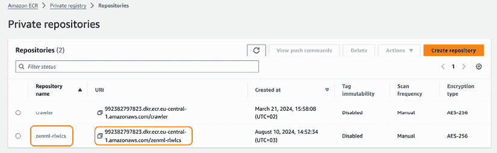

图 11.7：AWS ECR 示例

第一步是验证到 ECR。为了使其工作，请确保你已经安装并配置了 AWS CLI，并使用你的管理员 AWS 凭证，如第二章中所述：

```py
AWS_REGION=<your_region> # e.g. AWS_REGION=eu-central-1
AWS_ECR_URL=<your_acount_id>
aws ecr get-login-password --region ${AWS_REGION}| docker login --username AWS --password-stdin ${AWS_ECR_URL} 
```

你可以通过点击右上角的切换按钮来获取当前的`AWS_REGION`，如图 11.8 所示。你也可以复制 ECR URL 以填充`AWS_ECR_URL`变量，如图 11.7 所示。运行前面的命令后，你应该在 CLI 上看到消息**登录成功**。

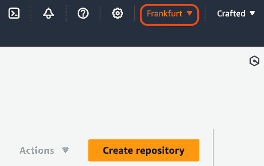

图 11.8：AWS 区域和账户详情

现在我们必须给`llmtwin` Docker 镜像添加另一个标签，以指示我们想要将其推送到哪个 Docker 注册表：

```py
docker tag llmtwin ${AWS_ECR_URL}:latest 
```

最后，我们通过以下命令将其推送到 ECR：

```py
docker push ${AWS_ECR_URL}:latest 
```

上传完成后，返回你的 AWS ECR 仪表板并打开你的 ZenML 仓库。Docker 镜像应该会显示出来，如图所示：


图 11.9：Docker 镜像推送到 ECR 后的 AWS ECR 仓库示例

对于您需要发布和测试的代码中的每个更改，您都必须通过所有这些步骤，这些步骤既繁琐又容易出错。本章的*将 LLMOps 添加到 LLM Twin*部分将教会我们如何使用 GitHub Actions 在 CD 管道中自动化这些步骤。然而，我们首先想手动完成它们，以便完全理解幕后过程，而不是将其视为黑盒。理解这些细节对于调试您的 CI/CD 管道至关重要，在那里您必须理解错误消息以及如何修复它们。

现在我们已经构建了 Docker 镜像并将其推送到 AWS ECR，让我们将其部署到 AWS。

### 在 AWS 上运行管道

我们即将在 AWS 上运行 ML 管道，但我们必须完成几个最终步骤。让我们从默认的 ZenML 堆栈切换到本章中创建的 AWS 堆栈。从项目的根目录，在 CLI 中运行以下命令：

```py
zenml stack set aws-stack 
```

返回您的 AWS ECR ZenML 存储库，并按照图 11.9 所示复制镜像 URI。然后，转到`configs`目录，打开`configs/end_to_end_data.yaml`文件，并将`settings.docker.parent_image`属性更新为您的 ECR URL，如下所示：

```py
settings:
  docker:
    parent_image: <YOUR ECR URL> #e.g., 992382797823.dkr.ecr.eu-central-1.amazonaws.com/zenml-rlwlcs:latest
    skip_build: True 
```

我们已配置管道始终使用 ECR 中可用的最新 Docker 镜像。这意味着每当推送新镜像时，管道将自动获取代码的最新更改。

我们必须将`.env`文件中的所有凭证导出到 ZenML 密钥，这是一个安全存储您的凭证并在管道中使其可访问的功能：

```py
poetry poe export-settings-to-zenml 
```

最后一步是设置异步运行管道，这样我们就不必等待它们完成，这可能会导致超时错误：

```py
zenml orchestrator update aws-stack --synchronous=False 
```

现在，ZenML 知道使用 AWS 堆栈、我们的自定义 Docker 镜像，并且可以访问我们的凭证，我们终于完成了设置。使用以下命令运行`end-to-end-data-pipeline`：

```py
poetry poe run-end-to-end-data-pipeline 
```

现在您可以前往**ZenML Cloud** **→** **Pipelines** **→** **end_to_end_data**并打开最新运行实例。在 ZenML 仪表板上，您可以可视化管道的最新状态，如图 11.10 所示。请注意，此管道在单个运行中运行所有与数据相关的管道。

在*将 LLMOps 添加到 LLM Twin*部分，我们将解释为什么我们将所有步骤压缩到单个管道中。

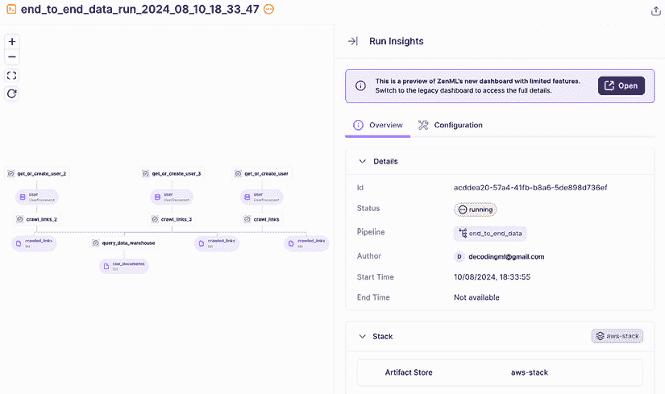

图 11.10：ZenML 端到端数据管道示例

您可以点击任何正在运行的块，找到有关运行、用于该特定步骤的代码以及用于监控和调试的日志的详细信息，如图 11.11 所示：


图 11.11：ZenML 步骤元数据示例

要运行其他管道，您必须更新`configs/`目录下其配置文件中的`settings.docker.parent_image`属性。

要查找有关运行的更多详细信息，您可以访问 AWS SageMaker。在左侧面板中，点击 **SageMaker 仪表板**，然后在右侧的 **处理** 列表中，点击如 *图 11.12* 所示的绿色 **运行** 部分。

这将打开一个包含执行您的 ZenML 管道的所有 **处理作业** 的列表。

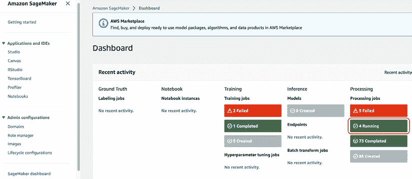

图 11.12：SageMaker 仪表板

如果您想再次在本地运行管道，请使用以下 CLI 命令：

```py
poetry poe set-local-stack 
```

如果您想从 ZenML 云仪表板断开连接并再次使用本地版本，请运行以下命令：

```py
zenml disconnect 
```

### 在 SageMaker 上运行 ZenML 管道后解决 ResourceLimitExceeded 错误

假设，您在 SageMaker 上使用 AWS 栈运行 ZenML 管道后遇到了 **ResourceLimitExceeded** 错误。在这种情况下，您必须明确要求 AWS 给您访问特定类型的 AWS EC2 VM 的权限。

ZenML 默认使用 `ml.t3.medium` EC2 机器，这是 AWS 免费增值层的一部分。然而，一些 AWS 账户默认无法访问这些 VM。要检查您的访问权限，请在 AWS 控制台中搜索 **服务配额**。

然后，在左侧面板中，点击 **AWS 服务**，搜索 **Amazon SageMaker**，然后搜索 `ml.t3.medium`。在 *图 11.13* 中，您可以查看这些类型机器的配额。如果您的配额是 **0**，您应该在 **应用账户级配额值** 列中请求 AWS 将其增加到与 *图 11.13* 中类似的数字。整个过程免费，只需点击几下即可。不幸的是，您可能需要等待几小时到一天，直到 AWS 接受您的请求。


图 11.13：SageMaker—ml.t3.medium 预期配额

您可以在以下链接中找到如何解决此错误并请求新配额的逐步说明：[`repost.aws/knowledge-center/sagemaker-resource-limit-exceeded-error`](https://repost.aws/knowledge-center/sagemaker-resource-limit-exceeded-error)。

如果您已从 .env 文件更改了值并希望使用它们更新 ZenML 密钥，请首先运行以下 CLI 命令以删除旧密钥：

```py
poetry poe delete-settings-zenml 
```

然后，您可以通过运行以下命令再次导出它们：

```py
poetry poe export-settings-to-zenml 
```

# 将 LLMOps 添加到 LLM Twin

在上一节中，我们看到了如何通过手动构建 Docker 镜像并将其推送到 ECR 来手动设置 LLM Twin 项目的基础设施。我们希望自动化整个流程，并使用 GitHub Actions 实现一个 CI/CD 管道，使用 ZenML 实现一个 CT 管道。如前所述，实现 CI/CD/CT 管道确保推送到主分支的每个功能都是一致的并且经过测试。此外，通过自动化部署和训练，您支持协作，节省时间，并减少人为错误。

最后，在本节结束时，我们将向您展示如何使用 Comet ML 的 Opik 实现一个提示监控流程，以及使用 ZenML 实现一个警报系统。这个提示监控流程将帮助我们调试和分析 RAG 和 LLM 逻辑。由于 LLM 系统是非确定性的，捕获和存储提示跟踪对于监控您的 ML 逻辑至关重要。

在深入实施之前，让我们先快速了解一下 LLM Twin 的 CI/CD 流程。

## LLM Twin 的 CI/CD 流程

我们有两个环境：预发布和产品。当开发一个新功能时，我们从预发布分支创建一个新的分支，并在该分支上独立开发。当我们完成并认为功能完成时，我们向预发布分支打开一个**拉取请求**（**PR**）。在功能分支被接受后，它会被合并到预发布分支。这是大多数软件应用中的标准工作流程。可能会有一些变化，比如添加一个开发环境，但原则保持不变。

如 *图 11.14* 所示，CI 流程在 PR 打开时触发。在这个时候，我们测试功能分支的代码风格和格式错误。同时，我们运行 `gitleaks` 命令来检查是否不小心提交了凭据和敏感信息。如果代码风格、格式和 gitleaks 步骤通过（也称为静态分析），我们将运行自动测试。请注意，静态分析步骤比自动测试运行得快。因此，顺序很重要。这就是为什么在 CI 流程的开始处添加静态分析步骤是良好实践的原因。我们建议以下 CI 步骤的顺序：

+   `gitleaks` 检查

+   检查代码风格

+   格式检查

+   自动测试，如单元测试和集成测试

如果任何检查失败，CI 流程将失败，创建 PR 的开发者无法在修复问题之前将其合并到预发布分支。

实施一个 CI 流程确保新功能遵循存储库的标准，并且不会破坏现有功能。当我们计划将预发布分支合并到产品分支时，确切的过程会重复。我们打开一个 PR，在将预发布分支合并到产品分支之前，CI 流程会自动执行。


图 11.14：CI/CD 流程

CD 流程在分支合并后运行。例如，在功能分支合并到预发布分支后，CD 流程从预发布分支获取代码，构建一个新的 Docker 镜像，并将其推送到 AWS ECR Docker 仓库。当在预发布环境中运行未来的流程运行时，它将使用由 CD 流程构建的最新 Docker 镜像。确切的过程发生在预发布和产品之间。尽管如此，关键的区别在于预发布环境作为一个实验场所存在，QA 团队和利益相关者可以进一步手动测试新功能，同时自动测试 CI 流程中的内容。

在我们的仓库中，我们只使用了主分支，它反映了生产环境，以及功能分支来推送新工作。我们这样做是为了保持简单，但相同的原理适用。要扩展流程，您必须创建一个预发布分支并将其添加到 CD 管道中。

### 更多关于格式化错误的说明

格式化错误与代码的风格和结构有关，确保它遵循一致的视觉布局。这可能包括空格的位置、缩进、行长度和其他风格元素。

格式化的主要目的是使您的代码更易于阅读和维护。一致的格式化有助于团队更有效地协作，因为代码看起来统一，无论谁编写它。格式化错误的例子包括：

+   错误的缩进（例如，混合空格和制表符）

+   行太长（例如，超过 `79` 或 `88` 个字符，具体取决于您的风格指南）

+   运算符或逗号周围缺少或多余的空格

### 更多关于代码检查错误的说明

代码检查错误与可能导致错误、低效或不遵守编码标准的潜在问题有关，而不仅仅是风格问题。代码检查通常涉及对代码的静态分析，以捕捉未使用的变量、未定义的名称或可疑的实践。

代码检查的主要目标是尽早在开发过程中捕捉潜在的错误或不良实践，提高代码质量并降低出现错误的可能性。代码检查错误的例子包括：

+   未使用的导入或变量

+   正在使用未定义的变量或函数

+   可能危险的代码（例如，使用 `==` 而不是 `is` 来检查 `None`）

我们使用 Ruff，一个用于格式化和代码检查的多功能工具。它包含了对常见格式问题的检查以及 PEP 8 规范的遵守，同时还进行了更深入的代码质量检查，以发现潜在的错误和质量问题。此外，它是用 Rust 编写的，这使得它在处理大型代码库时非常快速。

在实施上述内容之前，让我们先来探讨 GitHub Actions 的核心原则。

## GitHub Actions 快速概述

GitHub Actions 是 GitHub 提供的一个 CI/CD 平台，允许开发者在 GitHub 仓库内直接自动化他们的工作流程。它通过在 YAML 文件中定义工作流程，使用户能够直接从 GitHub 构建代码、测试和部署代码。由于它是 GitHub 的一部分，它可以与仓库、问题、PR 和其他 GitHub 功能无缝工作。以下是您应该了解的关键组件：

+   **工作流程：** 工作流程是一个在您仓库的 `.github/workflows` 目录中定义的自动化过程。它指定了应该发生什么（例如，`build`、`test` 和 `deploy`）以及何时发生（例如，在推送时，在 PR 时）。

+   **作业：** 工作流程由作业组成，作业是在同一运行器上执行的步骤组。每个作业都在自己的虚拟环境中运行。

+   **步骤：** 任务由多个独立的步骤组成，这些步骤可以是操作或 shell 命令。

+   **操作**：操作是可重用的命令或脚本。您可以使用 GitHub 市场中的预构建操作或创建自己的操作。您可以将它们视为 Python 函数。

+   **运行者**：运行者是指运行您作业的服务器。GitHub 提供托管运行者（Linux、Windows、macOS），或者您甚至可以自行托管运行者。

使用 YAML 语法描述工作流程。例如，一个简单的示例工作流程，它克隆当前的 GitHub 存储库并在 Ubuntu 机器上安装 Python 3.11，看起来像这样：

```py
name: Example
on: [push]
jobs:
  build:
    runs-on: ubuntu-latest
    steps:
         - name: Checkout
           uses: actions/checkout@v3
         - name: Setup Python
           uses: actions/setup-python@v3
           with:
               python-version: "3.11" 
```

工作流程由诸如 `push`、`pull_request` 或 `schedule` 之类的事件触发。例如，您可能会在将代码推送到特定分支时触发工作流程。现在我们了解了 GitHub Actions 的工作原理，让我们看看 LLM Twin 的 CI 管道。

## CI 管道

LLM Twin 的 CI 管道分为两个作业：

+   一个使用 Ruff 查找格式化和 linting 错误的 **QA 作业**。它还运行一个 `gitleaks` 步骤，以扫描整个存储库中的泄露秘密。

+   一个运行所有自动测试的 **测试作业**，使用 `Pytest`。在我们的用例中，我们仅实现了一个模拟测试来展示 CI 管道，但使用本书中的结构，您可以轻松地扩展它以适应您的实际测试用例。

### GitHub Actions CI YAML 文件

```py
pull_request event occurs. Hence, the CI workflow will automatically run whenever a PR is opened, synchronized, or reopened.
```

```py
name: CI
on:
  pull_request: 
```

`concurrency` 部分确保在任何给定时间只有一个工作流程实例在给定的参考（如分支）上运行。`group` 字段使用 GitHub 的表达式语法定义，以根据工作流程和参考创建唯一的组名。`cancel-in-progress: true` 行确保如果在新工作流程运行完成之前触发新的工作流程运行，则取消先前的运行。这特别有用，可以防止同一工作流程的冗余执行。

```py
concurrency:
  group: ${{ github.workflow }}-${{ github.ref }}
  cancel-in-progress: true 
```

工作流程定义了两个独立的作业：`qa` 和 `test`。每个作业都在由 `runs-on: ubuntu-latest` 指定的最新版本的 Ubuntu 上运行。

**第一个作业**，命名为 `QA`，负责质量保证任务，如代码检查和格式验证。在 `qa` 作业中，第一步是使用 `actions/checkout@v3` 动作检出存储库的代码。这一步是必要的，以确保作业可以访问需要分析的代码。

```py
jobs:
  qa:
    name: QA
    runs-on: ubuntu-latest
    steps:
      - name: Checkout
        uses: actions/checkout@v3 
```

下一步是设置 Python 环境。这是通过使用 `actions/setup-python@v3` 动作来完成的，Python 版本指定为 `"3.11"`。这一步确保作业中的后续步骤将在正确的 Python 环境中运行。

```py
 - name: Setup Python
        uses: actions/setup-python@v3
        with:
          python-version: "3.11" 
```

然后工作流程使用 `abatilo/actions-poetry@v2` 动作安装 Poetry，指定 Poetry 版本为 `1.8.3`：

```py
 - name: Install poetry
        uses: abatilo/actions-poetry@v2
        with:
          poetry-version: 1.8.3 
```

Poetry 设置完成后，工作流程使用 `poetry install --only dev` 命令安装项目的开发依赖项。此外，工作流程添加了用于在项目中更方便地运行预定义任务的 `poethepoet` 插件。

```py
 - name: Install packages
        run: |
          poetry install --only dev
          poetry self add 'poethepoet[poetry_plugin]' 
```

`qa`作业随后在代码上运行几个质量检查。第一个检查使用一个名为`gitleaks`的工具来扫描代码库中的秘密，确保没有敏感信息被意外提交：

```py
 - name: gitleaks check
        run: poetry poe gitleaks-check 
```

在执行`gitleaks`检查之后，工作流运行一个 linting 过程来强制执行 Python 代码的编码标准和最佳实践。这是通过使用底层的`poetry poe lint-check`命令来实现的。

```py
 - name: Lint check [Python]
        run: poetry poe lint-check 
```

`qa`作业的最后一步是格式检查，确保 Python 代码根据项目的风格指南正确格式化。这是通过使用底层的`poetry poe format-check`命令来完成的。

```py
 - name: Format check [Python]
        run: poetry poe format-check 
```

工作流中定义的**第二个作业**是`test`作业，它也在最新的 Ubuntu 版本上运行。与`qa`作业类似，它首先从仓库检出代码并安装 Python 3.11 和 Poetry 1.8.3。

```py
 test:
    name: Test
    runs-on: ubuntu-latest
    steps:
      - name: Checkout
        uses: actions/checkout@v3
      … 
```

在设置系统依赖项之后，`test`作业使用`poetry install`命令安装项目的所有依赖项。由于我们这次需要运行测试，因此需要安装所有运行应用程序所需的依赖项。

```py
 - name: Install packages
        run: |
          poetry install –-without aws
          poetry self add 'poethepoet[poetry_plugin]' 
```

最后，`test`作业使用`poetry poe test`命令运行项目的测试。这一步确保所有测试都执行，并提供有关当前代码更改是否破坏任何功能的反馈。

```py
 - name: Run tests
        run: |
          echo "Running tests..."
          poetry poe test 
```

如果 QA 或测试作业中的任何步骤失败，GitHub Actions 工作流将失败，导致 PR 无法合并，直到问题得到修复。通过采取这种方法，我们确保所有添加到主分支的新功能都符合项目标准，并且通过自动化测试不会破坏现有功能。

*图 11.15*显示了 GitHub 仓库**操作**标签页中的 CI 管道。它是在带有消息**feat: 添加 Docker 镜像和 CD 管道**的提交后运行的，并运行了上述描述的两个作业，即 QA 和 Test。

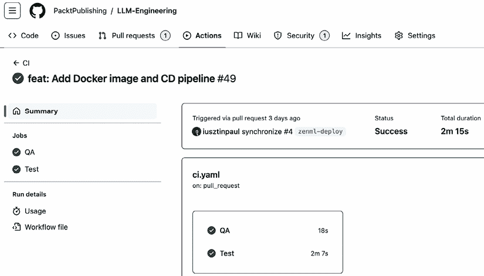

图 11.15：GitHub Actions CI 管道运行示例

## CD 管道

CD 管道将自动化我们在**将 LLM Twin 的管道部署到云**部分手动执行的 Docker 步骤，这些步骤包括：

+   设置 Docker。

+   登录 AWS。

+   构建 Docker 镜像。

+   将 Docker 镜像推送到 AWS ECR。

考虑到这一点，让我们看看位于`.github/workflows/cd.yaml`下的 GitHub Actions YAML 文件。它首先将工作流命名为`CD`，并指定此工作流的触发器。触发器是向仓库主分支的任何推送。当新代码推送到主分支时，通常在 PR 合并到主分支时，此工作流将自动运行。`on.push`配置设置了触发器：

```py
name: CD
on:
  push:
    branches:
      - main 
```

工作流随后定义了一个名为`Build & Push Docker Image`的单个作业：

```py
jobs:
  build:
    name: Build & Push Docker Image
    runs-on: ubuntu-latest 
```

作业内的第一步是检出仓库的代码。

```py
steps:
  - name: Checkout Code
    uses: actions/checkout@v3 
```

检出代码后，工作流程会设置 docker buildx，这是一个 Docker CLI 插件，它通过多平台构建和缓存导入/导出等功能扩展了 Docker 的构建能力：

```py
- name: Set up Docker Buildx
  uses: docker/setup-buildx-action@v3 
```

下一步涉及配置 AWS 凭据。这一步对于与 AWS 服务交互至关重要，例如 Amazon **弹性容器注册表**（**ECR**），其中将推送 Docker 镜像。AWS 访问密钥、秘密访问密钥和区域从存储库的秘密中安全检索，以使用 AWS 验证工作流程。这确保了工作流程具有将 Docker 镜像推送到 ECR 存储库所必需的权限。在完成 YAML 文件后，我们将向您展示如何配置这些秘密：

```py
- name: Configure AWS credentials
  uses: aws-actions/configure-aws-credentials@v1
  with:
    aws-access-key-id: ${{ secrets.AWS_ACCESS_KEY_ID }}
    aws-secret-access-key: ${{ secrets.AWS_SECRET_ACCESS_KEY }}
    aws-region: ${{ secrets.AWS_REGION }} 
```

一旦配置了 AWS 凭据，工作流程就会登录到 Amazon ECR。这一步对于使用 Docker CLI 验证 ECR 注册表至关重要，允许后续步骤将镜像推送到注册表：

```py
- name: Login to Amazon ECR
  id: login-ecr
  uses: aws-actions/amazon-ecr-login@v1 
```

工作流程中的最后一步是构建 Docker 镜像并将其推送到 Amazon ECR 存储库。这是通过使用 `docker/build-push-action@v6` 动作来完成的。`context` 指定构建上下文，通常是存储库的根目录。`file` 选项指向 `Dockerfile`，它定义了镜像应该如何构建。`tags` 部分将标签分配给镜像，包括特定的提交 SHA 和 `latest` 标签，这是标识镜像最新版本的常见做法。`push` 选项设置为 `true`，这意味着在构建完成后镜像将被上传到 ECR：

```py
- name: Build images & push to ECR
  id: build-image
  uses: docker/build-push-action@v6
  with:
    context: .
    file: ./Dockerfile
    tags: |
      ${{ steps.login-ecr.outputs.registry }}/${{ secrets.AWS_ECR_NAME }}:${{ github.sha }}
      ${{ steps.login-ecr.outputs.registry }}/${{ secrets.AWS_ECR_NAME }}:latest
    push: true 
```

总结来说，CD 流水线验证 AWS，构建 Docker 镜像，并将其推送到 AWS ECR。Docker 镜像使用 `latest` 和提交的 SHA 标签进行推送。这样做，我们总能使用最新镜像并指向生成镜像的代码提交。

此外，在我们的代码中，我们只有一个主分支，这反映了我们的生产环境。但作为开发者，你有权通过添加预发布和开发环境来扩展这一功能。你只需在 YAML 文件的开头添加 `on.push.branches` 配置中的分支名称即可。

在 *图 11.16* 中，你可以观察到在合并到生产分支后 CD 流水线的样子。正如之前所见，我们这里只有 **构建并推送 Docker 镜像** 作业。

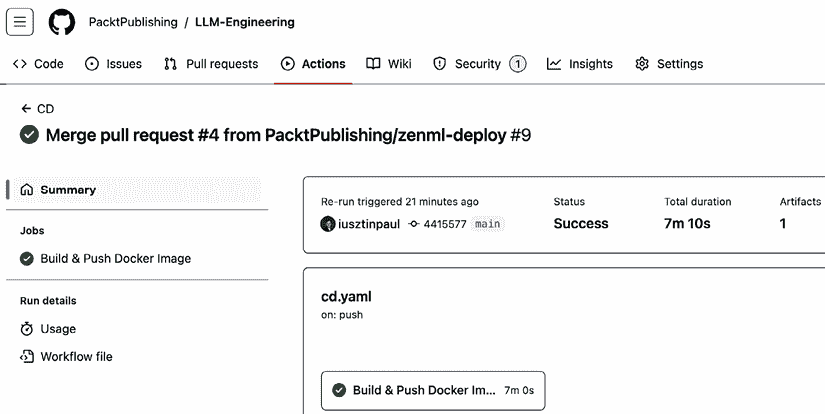

图 11.16：GitHub Actions CD 流水线运行示例

设置 CI/CD 流水线的最后一步是测试它并查看其工作情况。

## 测试 CI/CD 流水线

要自己测试 CI/CD 流水线，你必须将 LLM-Engineering 仓库分叉以获得对 GitHub 仓库的完全 *写入* 权限。以下是官方教程，介绍如何分叉 GitHub 项目：[`docs.github.com/en/pull-requests/collaborating-with-pull-requests/working-with-forks/fork-a-repo`](https://docs.github.com/en/pull-requests/collaborating-with-pull-requests/working-with-forks/fork-a-repo)

最后一步是设置几个密钥，以便 CD 管道能够登录 AWS 并指向正确的 ECR 资源。为此，请转到 GitHub 分支仓库顶部的 **设置** 选项卡。在左侧面板中，在 **安全** 部分点击 **密钥和变量** 切换，最后点击 **操作**。然后，在 **密钥** 选项卡中，创建四个仓库密钥，如图 11.17 所示。这些密钥将安全存储，并且只能由 GitHub Actions CD 管道访问。

`AWS_ACCESS_KEY_ID` 和 `AWS_SECRET_ACCESS_KEY` 是你在本书中使用的 AWS 凭据。在 *第二章* 中，你看到了如何创建它们。`AWS_REGION`（例如，`eu-central-1`）和 `AWS_ECR_NAME` 与在 **将 LLM Twin 的管道部署到云** 部分中使用的相同。

对于 `AWS_ECR_NAME`，你应该只配置仓库的名称（例如，`zenml-vrsopg`），而不是完整的 URI（例如，[992382797823.dkr.ecr.eu-central-1.amazonaws.com/zenml-vrsopg](https://992382797823.dkr.ecr.eu-central-1.amazonaws.com/zenml-vrsopg)），如图下所示：


图 11.17：仅配置仓库名称

要触发 CI 管道，创建一个功能分支，修改代码或文档，并向主分支创建一个 PR。要触发 CD 管道，将 PR 合并到主分支。

CD GitHub Actions 完成后，检查 ECR 仓库以查看 Docker 镜像是否成功推送。

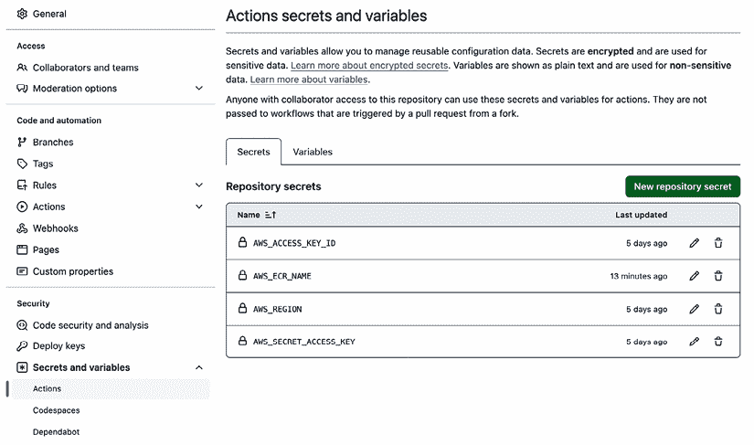

图 11.18：GitHub Actions 密钥

如果你需要更多关于如何设置 GitHub Actions 密钥的详细信息，我们建议查看他们的官方文档：[`docs.github.com/en/actions/security-for-github-actions/security-guides/using-secrets-in-github-actions`](https://docs.github.com/en/actions/security-for-github-actions/security-guides/using-secrets-in-github-actions)

## CT 管道

要实现 CT 管道，我们将利用 ZenML。一旦 ZenML（或其他编排器，如 Metaflow、Dagster 或 Airflow）编排了所有管道并且你的基础设施已部署，你就可以非常接近实现 CT。

记住 CI/CD 和 CT 管道之间的核心区别。CI/CD 管道负责测试、构建和部署你的代码——这是任何软件程序都有的一个维度。CT 管道利用 CI/CD 管理的代码来自动化你的数据、训练和模型托管过程，其中数据和模型维度仅存在于 AI 世界中。

在深入实施之前，我们想强调两个设计选择，这使得实现 CT 变得简单：

+   **FTI 架构**：一个具有清晰接口和组件的模块化系统，使得捕获管道之间的关系并自动化它们变得容易。

+   **从编排器开始，从第 0 天起：** 我们在项目开发初期开始使用 ZenML。早期，我们只在本地使用它。但它充当了我们的管道的入口点，以及监控它们执行的方式。这样做迫使我们解耦每个管道，并通过各种类型的数据存储（如数据仓库、特征存储或工件存储）将它们之间的通信完全通过。由于我们从第 0 天起就利用了 ZenML，我们摆脱了实现繁琐的 CLI 来配置我们的应用程序。相反，我们直接通过 YAML 配置文件“开箱即用”来完成它。

在*图 11.19*中，我们可以看到我们必须连接在一起以完全自动化我们的培训和部署的所有管道。这些管道不是新的；它们汇总了我们在整本书中涵盖的所有内容。因此，在这个阶段，我们将它们视为相互交互的黑盒。

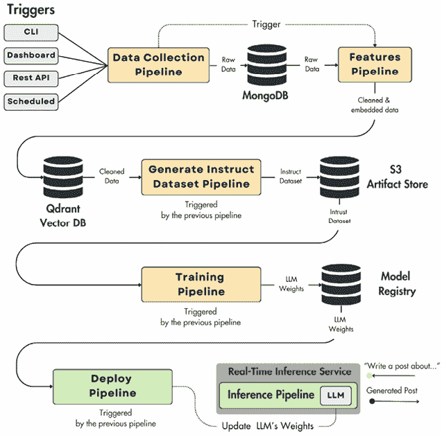

图 11.19：CT 管道

对于 LLM Twin 的 CT 管道，我们必须讨论启动管道的初始触发器以及管道是如何相互触发的。

### 初始触发器

如*图 11.18*所示，我们最初希望触发数据收集管道。通常，触发器可以是三种类型之一：

+   **手动触发器：** 通过 CLI 或编排器的仪表板完成，在我们的情况下，通过 ZenML 仪表板。手动触发器仍然是极其强大的工具，因为您只需一个动作就可以启动整个 ML 系统，从数据收集到部署，而不是摆弄可能配置错误或以无效顺序运行的几十个脚本。

+   **REST API 触发器：** 您可以通过 HTTP 请求调用管道。当将您的 ML 管道与其他组件集成时，这非常有用。例如，您可以有一个监视器持续寻找新的文章。当它找到一些时，它会使用这个 REST API 触发器来触发 ML 逻辑。要了解更多关于此功能的信息，请查看 ZenML 文档中的此教程：[`docs.zenml.io/v/docs/how-to/trigger-pipelines/trigger-a-pipeline-from-rest-api`](https://docs.zenml.io/v/docs/how-to/trigger-pipelines/trigger-a-pipeline-from-rest-api)。

+   **计划触发器：** 另一种常见的方法是按固定间隔持续调度您的管道运行。例如，根据您的用例，您可以安排您的管道每天、每小时或每分钟运行一次。大多数编排器，包括 ZenML，都提供了一个 cron 表达式界面，您可以在其中定义您的执行频率。在以下 ZenML 的示例中，管道每小时调度一次：

    ```py
     Schedule(cron_expression="* * 1 * *") 
    ```

我们为我们的 LLM Twin 用例选择了手动触发器，因为我们没有其他组件可以利用 REST API 触发器。此外，由于数据集是从 ZenML 配置中定义的静态链接列表生成的，因此按计划运行它们没有意义，因为它们总是会得出相同的结果。

但项目的下一个可能的步骤是实现一个监视器，用于监视新文章。当它找到任何文章时，它会生成一个新的配置并通过 REST API 触发管道。另一个选项是将监视器作为额外的管道实现，并利用调度触发器每天查找新数据。如果找到任何数据，它将执行整个 ML 系统；否则，它将停止。

结论是，一旦您可以通过单个命令手动触发所有 ML 管道，您就可以快速将其适应更高级和复杂的场景。

### 触发下游管道

为了保持简单，我们按顺序链式连接了所有管道。更具体地说，当数据收集管道完成时，它将触发特征管道。当特征管道成功完成后，它将触发数据集生成管道，依此类推。您可以使逻辑更复杂，例如，安排生成指令数据集的管道每天运行，检查 Qdrant 向量数据库中的新数据量，并且只有当有足够的新数据时才启动。从这个点开始，您可以进一步调整系统的参数并优化它们以降低成本。

要一次性触发所有管道，我们创建了一个主管道，它将所有内容聚合在一个入口点：

```py
@pipeline
def end_to_end_data(
    author_links: list[dict[str, str | list[str]]], … # Other paramaters…
) -> None:
    wait_for_ids = []
    for author_data in author_links:
        last_step_invocation_id = digital_data_etl(
            user_full_name=author_data["user_full_name"], links=author_data["links"]
        )
        wait_for_ids.append(last_step_invocation_id)
    author_full_names = [author_data["user_full_name"] for author_data in author_links]
    wait_for_ids = feature_engineering(author_full_names=author_full_names, wait_for=wait_for_ids)
    generate_instruct_datasets(…)
       training(…)
       deploy(…) 
```

为了保持函数轻量，我们添加了所有逻辑，直到计算特征。但是，如上述代码片段中建议的，您可以轻松地将指令数据集生成、训练和部署逻辑添加到父管道中，以实现端到端流程。通过这样做，您可以自动化从数据收集到部署模型的所有过程。

要运行端到端管道，请使用以下`poe`命令：

```py
poetry poe run-end-to-end-data-pipeline 
```

我们实施的方法并不是最佳方法，因为它将所有步骤压缩到一个单一的单一管道中（这是我们想要避免的），如*图 11.20*所示。通常，您希望保持每个管道的隔离性，并使用触发器来启动下游管道。这使得系统更容易理解、调试和监控。

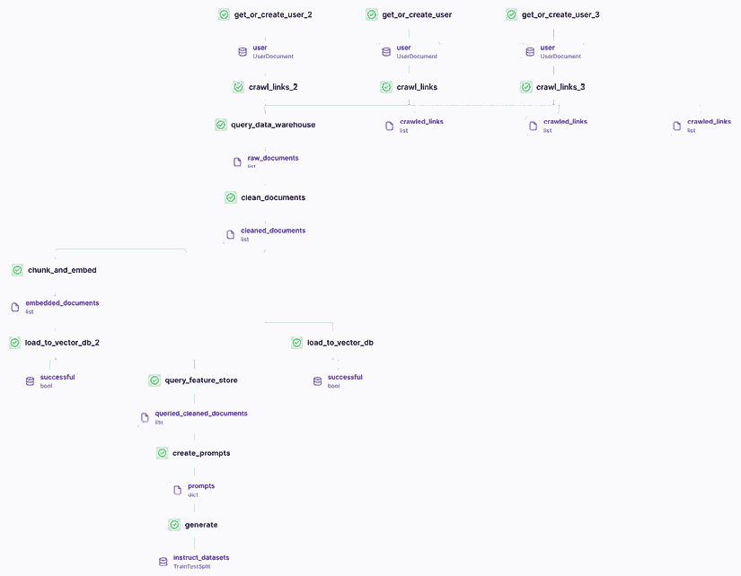

图 11.20：ZenML 仪表板中展示的端到端管道

不幸的是，ZenML 云服务的免费试用版有一个限制，即最多只能有三个管道。由于我们拥有更多，为了避免这个限制，我们将所有步骤压缩到一个单独的管道中。但是，如果您计划自己托管 ZenML 或购买他们的许可证，他们提供从另一个管道独立触发管道的可能性，如下面的代码片段所示，我们在数据收集 ETL 之后触发了特征工程管道：

```py
from zenml import pipeline, step
@pipeline 
def digital_data_etl(user_full_name: str, links: list[str]) -> str:
 user = get_or_create_user(user_full_name)
 crawl_links(user=user, links=links)
trigger_feature_engineering_pipeline(user)
@step 
def trigger_feature_engineering_pipeline(user):
run_config = PipelineRunConfiguration(…)
Client().trigger_pipeline("feature_engineering", run_configuration=run_config)
@pipeline
def feature_engineering(author_full_names: list[str]) -> list[str]:
… # ZenML steps 
```

采用这种方法，每个管道都将独立运行，其中每个管道依次触发下一个管道，如本节开头所述。请注意，这个特性并不仅限于 ZenML，在编排工具中很常见。我们迄今为止学到的原则仍然适用。只是我们与工具的交互方式发生了变化。

## 提示监控

我们将使用 Opik（来自 Comet ML）来监控我们的提示。但请记住，在本章早些时候的 *LLMOps* 部分中，我们不仅对输入提示和生成的答案感兴趣。

我们希望记录从用户输入到最终结果可用的整个跟踪。在深入探讨 LLM Twin 用例之前，让我们看看一个更简单的例子：

```py
from opik import track
import openai
from opik.integrations.openai import track_openai
openai_client = track_openai(openai.OpenAI())
@track
def preprocess_input(text: str) -> str:
    return text.strip().lower()
@track
def generate_response(prompt: str) -> str:
    response = openai_client.chat.completions.create(
        model="gpt-3.5-turbo",
        messages=[{"role": "user", "content": prompt}]
    )
    return response.choices[0].message.content
@track
def postprocess_output(response: str) -> str:
    return response.capitalize()
@track(name="llm_chain")
def llm_chain(input_text: str) -> str:
    preprocessed = preprocess_input(input_text)
    generated = generate_response(preprocessed)
    postprocessed = postprocess_output(generated)
    return postprocessed
result = llm_chain("Hello, do you enjoy reading the book?") 
llm_chain() main function, which takes the initial input as a parameter and returns the final result. 
```

然后，您有围绕实际 LLM 调用的预处理和后处理函数。使用 `@track()` 装饰器，我们记录每个函数的输入和输出，这些最终将被汇总成一个单一的跟踪。通过这样做，我们将能够访问初始输入文本、生成的答案以及调试任何潜在问题所需的全部中间步骤，使用 Opik 的仪表板。

```py
update() method, where you can tag your trace or add any other metadata, such as the number of input tokens, through a Python dictionary:
```

```py
from opik import track, opik_context
@track
def llm_chain(input_text):
    # LLM chain code
    # ...
    opik_context.update_current_trace(
tags=["inference_pipeline"],
metadata={
 "num_tokens": compute_num_tokens(…)
},
feedback_scores=
{
 "name": "user_feedback",
 "value": 1.0,
 "reason": "The response was valuable and correct."
},
{
 "name": "llm_judge_score",
 "value": compute_llm_judge_score(…),
 "reason": "Computing runtime metrics using an LLM Judge."
}
) 
```

您可以在此基础上扩展这个想法并记录各种反馈分数。最常见的是询问用户生成的答案是否有价值且正确。另一种选择是通过启发式方法或 LLM 判决自动计算各种指标。

最后，让我们看看如何将提示监控添加到我们的 LLM Twin 项目中。首先，查看 *图 11.21* 并记住我们的模型服务架构。我们有两个微服务，LLM 和业务微服务。LLM 微服务的范围较窄，因为它只接受包含用户输入和上下文的提示作为输入，并返回通常需要后处理的答案。因此，业务微服务是实施监控管道的正确地方，因为它协调端到端流程。更具体地说，Opik 实现将在 *第十章* 中开发的 FastAPI 服务器中实现。

![图片

图 11.21：推理管道服务架构

由于我们的实现已经是模块化的，使用 Opik 使得记录用户请求的端到端跟踪变得简单：

```py
from opik import track
@track
def call_llm_service(query: str, context: str | None) -> str:
    llm = LLMInferenceSagemakerEndpoint(…)
    answer = InferenceExecutor(llm, query, context).execute()
    return answer
@track
def rag(query: str) -> str:
    retriever = ContextRetriever()
    documents = retriever.search(query, k=3 * 3)
    context = EmbeddedChunk.to_context(documents)
    answer = call_llm_service(query, context)
    return answer 
```

`rag()` 函数代表您应用程序的入口点。所有其他处理步骤都在 `ContextRetriever` 和 `InferenceExector` 类中进行。此外，通过装饰 `call_llm_service()` 函数，我们可以清楚地捕获发送给 LLM 的提示及其响应。

为了使我们的跟踪更加细致，我们可以进一步装饰包含预处理或后处理步骤的其他函数，例如 `ContextRetriever` 搜索函数：

```py
class ContextRetriever:
     …

    @track

    def search(
        self,
        query: str,
        k: int = 3,
        expand_to_n_queries: int = 3,
    ) -> list:
        query_model = Query.from_str(query)
        query_model = self._metadata_extractor.generate(query_model)
        … # Rest of the implementation 
```

或者甚至进一步到检索优化方法，例如自查询元数据提取器，以添加更多粒度：

```py
class SelfQuery:

    @track
    def generate(self, query: str) -> str:
        …
        return enhanced_query 
```

开发者负责决定应用程序需要多少粒度才能进行适当的调试和分析。虽然详细的监控是健康的，但监控一切可能会很危险，因为它会添加过多的噪声，使得手动理解跟踪变得困难。您必须找到正确的平衡。一个好的经验法则是跟踪最关键的功能，如 `rag()` 和 `call_llm_service()`，并在需要时逐步添加更多粒度。

最后一步是为我们的跟踪附加有价值的元数据和标签。为此，我们将进一步增强`rag()`函数，如下所示：

```py
@track
def rag(query: str) -> str:
    retriever = ContextRetriever()
    documents = retriever.search(query, k=3 * 3)
    context = EmbeddedChunk.to_context(documents)
    answer, prompt = call_llm_service(query, context)
    trace = get_current_trace()
    trace.update(
tags=["rag"],
metadata={
 "model_id": settings.HF_MODEL_ID,
   "embedding_model_id": settings.TEXT_EMBEDDING_MODEL_ID,
   "temperature": settings.TEMPERATURE_INFERENCE,
   "prompt_tokens": compute_num_tokens(prompt),
   "total_tokens": compute_num_tokens(answer),

}
   )
    return answer 
```

我们应该持续监控的三个主要方面是：

+   **模型配置：** 在这里，我们应该考虑 LLM 和 RAG 层中使用的其他模型。日志记录的最关键方面是模型 ID，但您还可以捕获其他对生成有显著影响的重要信息，例如温度。

+   **总令牌数：** 持续分析您输入提示和总令牌数的统计数据至关重要，因为这会显著影响您的服务成本。例如，如果总令牌数的平均值突然增加，这可能是您系统中存在错误的强烈信号，您应该进行调查。

+   **每个步骤的持续时间：** 跟踪您跟踪中每个步骤的持续时间对于找到系统中的瓶颈至关重要。如果特定请求的延迟异常大，您将快速获得一份报告，帮助您找到问题的根源。

## 警报

使用 ZenML，您可以在任何您喜欢的平台上快速实现警报系统，例如电子邮件、Discord 或 Slack。例如，您可以在训练管道中添加一个回调，当管道失败或训练成功完成时触发通知：

```py
from zenml import get_pipeline_context, pipeline
@pipeline(on_failure=notify_on_failure)
def training_pipeline(…):
…
notify_on_success() 
```

实现通知功能很简单。如以下代码片段所示，您需要从当前堆栈中获取`alerter`实例，构建您认为合适的消息，并将其发送到您选择的任何通知渠道：

```py
from zenml.client import Client
alerter = Client().active_stack.alerter
def notify_on_failure() -> None:
        alerter.post(message=build_message(status="failed"))
@step(enable_cache=False)
def notify_on_success() -> None:
        alerter.post(message=build_message(status="succeeded")) 
```

ZenML 和大多数编排器简化了`alerter`的实现，因为它是您 MLOps/LLMOps 基础设施中的关键组件。

# 摘要

在本章中，我们通过一个关于 DevOps 的理论部分奠定了基础。然后，我们转向 MLOps 及其核心组件和原则。最后，我们通过介绍诸如提示监控、安全线和人工反馈循环等策略，展示了 LLMOps 与 MLOps 的不同之处。此外，我们还简要讨论了为什么大多数公司会选择通过提示工程或微调来优化 LLM 以适应其用例，而不是从头开始训练 LLM。在章节理论部分的结尾，我们学习了什么是 CI/CD/CT 管道，ML 应用的三个核心维度（代码、数据、模型），以及由于模型退化，部署后实施监控和警报层比以往任何时候都更加关键。

接下来，我们学习了如何将 LLM Twin 的管道部署到云中。我们了解了基础设施，并逐步部署 MongoDB、Qdrant、ZenML 云以及所有必要的 AWS 资源以维持应用程序。最后，我们学习了如何将我们的应用程序 Docker 化并将我们的 Docker 镜像推送到 AWS ECR，该镜像将用于在 AWS SageMaker 上执行应用程序。

最后一步是将 LLMOps 添加到我们的 LLM Twin 项目中。我们首先通过 GitHub Actions 实现了 CI/CD 管道，然后利用 ZenML 审视了我们的 CT 策略。

最后，我们看到了如何使用 Comet ML 的 Opik 实现监控管道，以及使用 ZenML 实现警报系统。这些是向任何基于 LLM 的应用添加 MLOps 和 LLMOps 的基本支柱。

我们在整本书中学到的框架可以迅速扩展到其他 LLM 应用中。即使我们以 LLM Twin 用例为例，大多数应用到的策略也可以适应其他项目。因此，通过改变数据和代码的微小调整，我们可以得到一个全新的应用。数据是新石油，记住了吗？

通过完成这一章，我们学会了如何构建端到端的 LLM 应用，从数据收集和微调开始，直到部署 LLM 微服务和 RAG 服务。在整个书中，我们旨在提供一个思维框架，帮助你在 GenAI 领域中构建和解决实际问题。现在你已经拥有了它，我们祝愿你在旅途中好运，快乐构建！

# 参考文献

+   GitLab. (2023, January 25). *什么是 DevOps？| GitLab*. GitLab. [`about.gitlab.com/topics/devops/`](https://about.gitlab.com/topics/devops/)

+   Huyen, C. (2024, July 25). 构建生成式 AI 平台。*Chip Huyen*。[`huyenchip.com/2024/07/25/genai-platform.html`](https://huyenchip.com/2024/07/25/genai-platform.html)

+   *Lightricks 客户故事：从头开始构建推荐引擎*。 (n.d.). [`www.qwak.com/academy/lightricks-customer-story-building-a-recommendation-engine-from-scratch`](https://www.qwak.com/academy/lightricks-customer-story-building-a-recommendation-engine-from-scratch)

+   *什么是 LLMOps*。 (n.d.). Google Cloud. [`cloud.google.com/discover/what-is-llmops?hl=en`](https://cloud.google.com/discover/what-is-llmops?hl=en)

+   *MLOps：机器学习中的持续交付和自动化管道*。 (2024, August 28). Google Cloud. [`cloud.google.com/architecture/mlops-continuous-delivery-and-automation-pipelines-in-machine-learning#top_of_page`](https://cloud.google.com/architecture/mlops-continuous-delivery-and-automation-pipelines-in-machine-learning#top_of_page)

+   *Ml-ops.org*。 (2024a, July 5). [`ml-ops.org/content/mlops-principles`](https://ml-ops.org/content/mlops-principles)

+   *Ml-ops.org*。 (2024b, July 5). [`ml-ops.org/content/mlops-principles`](https://ml-ops.org/content/mlops-principles)

+   *Ml-ops.org*。 (2024c, July 5). [`ml-ops.org/content/motivation`](https://ml-ops.org/content/motivation)

+   Mohandas, G. M. (2022a). 监控机器学习系统。*用 ML 制作*。[`madewithml.com/courses/mlops/monitoring/`](https://madewithml.com/courses/mlops/monitoring/)

+   Mohandas, G. M. (2022b). 测试机器学习系统：代码、数据和模型。*用 ML 制作*。[`madewithml.com/courses/mlops/testing/`](https://madewedml.com/courses/mlops/testing/)

+   Preston-Werner, T. (n.d.). *语义版本控制 2.0.0*. Semantic Versioning. [`semver.org/`](https://semver.org/)

+   Ribeiro, M. T., Wu, T., Guestrin, C., & Singh, S. (2020, May 8). *超越准确性：使用 CheckList 对 NLP 模型的行为测试*. arXiv.org. [`arxiv.org/abs/2005.04118`](https://arxiv.org/abs/2005.04118)

+   Wandb. (2023, November 30). *理解 LLMOps：大型语言模型操作*. Weights & Biases. [`wandb.ai/site/articles/understanding-llmops-large-language-model-operations/`](https://wandb.ai/site/articles/understanding-llmops-large-language-model-operations/)

+   Zenml-Io. (n.d.). *GitHub—zenml-io/zenml-huggingface-sagemaker: 从 Hugging Face 模型仓库到部署的 AWS SageMaker 端点的 ZenML 管道 MLOps 概览示例.* GitHub. [`github.com/zenml-io/zenml-huggingface-sagemaker/tree/main`](https://github.com/zenml-io/zenml-huggingface-sagemaker/tree/main)

# 加入我们书籍的 Discord 空间

加入我们社区的 Discord 空间，与作者和其他读者进行讨论：

[`packt.link/llmeng`](https://packt.link/llmeng)


