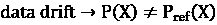
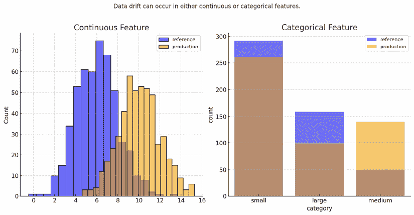

# 附录

# MLOps 原则

构建稳健且可扩展的机器学习系统不仅需要创建强大的模型，还需要对整个机器学习生命周期进行全面的实施方法。让我们探讨指导 MLOps 领域的**六个核心原则**。这些原则与任何工具无关，是构建稳健且可扩展机器学习系统的核心。它们为设计生产就绪的应用程序提供指导，确保在各个阶段的一致性、可靠性和可扩展性。

考虑到这一点，让我们从基础开始：自动化或运营化。

# 1. 自动化或运营化

要采用 MLOps，大多数应用程序会逐步构建三个核心层级，从手动处理到完全自动化：

+   **手动流程**：在开发机器学习应用的早期阶段，该流程是实验性和迭代的。数据科学家手动执行每个管道步骤，例如数据准备和验证、模型训练和测试。在这个阶段，他们通常使用 Jupyter 笔记本来训练他们的模型。这一阶段的输出是用于准备数据和训练模型的代码。

+   **持续** **训练** (**CT**)：下一级涉及自动化模型训练。这被称为持续训练，它会在需要时触发模型重新训练。在这个阶段，你通常会自动化你的数据和模型验证步骤。这一步通常由一个编排工具，如 ZenML，来完成，它将所有代码粘合在一起并在特定的触发器上运行。最常见的触发器是按计划，例如每天或当发生特定事件时，例如新数据上传或监控系统检测到性能下降，这为你提供了适应各种触发器的灵活性。

+   **CI/CD**：在最终阶段，你实施 CI/CD 管道，以实现将你的机器学习代码快速且可靠地部署到生产环境。这一阶段的关键进步是自动构建、测试和部署数据、机器学习模型和训练管道组件。CI/CD 用于快速将新代码推送到各种环境，如预发布或生产环境，确保高效且可靠的部署。

在我们使用**FTI**（**特征**、**训练**、**推理**）架构构建我们的 LLM 系统时，我们可以快速地从手动流程过渡到 CI/CD/CT。在*图 A.1*中，我们可以观察到 CT 流程可以被各种事件触发，例如监控管道检测到的性能下降或一批新数据的到达。此外，*图 A.1*被分为两个主要部分；第一个部分突出了自动化流程，而在底部，我们可以观察到数据科学团队在尝试各种数据处理方法和模型时进行的手动流程。一旦他们通过调整数据处理方式或模型架构来改进模型，他们就会将代码推送到代码仓库，这会触发 CI/CD 流程来构建、测试、打包并将新更改部署到 FTI 管道中。


图 A.1：FTI 架构上的 CI/CD/CT

最后，CT 自动化 FTI 管道，而 CI/CD 构建、测试并将 FTI 管道代码的新版本推送到生产环境中。

# 2. 版本控制

到目前为止，我们已经了解到如果代码、模型或数据发生变化，整个 ML 系统都会发生变化。因此，跟踪和单独版本控制这三个元素至关重要。但我们能采用哪些策略来分别跟踪代码、模型和数据？

+   **代码**通过 Git 进行跟踪，这有助于我们在代码库中添加每个更改时创建一个新的提交（代码的快照）。此外，基于 Git 的工具通常允许我们进行发布，通常包含多个功能和错误修复。虽然提交包含独特的标识符，这些标识符对人类不可解释，但发布遵循基于它们的重大、次要和修补版本的更常见约定。例如，在版本为“v1.2.3”的发布中，1 是主版本，2 是次要版本，3 是修补版本。流行的工具包括 GitHub 和 GitLab。

+   要对**模型**进行版本控制，你可以利用模型注册表来存储、共享和版本化系统中使用的所有模型。它通常遵循与代码发布相同的版本控制约定，定义为**语义版本控制**，它除了主版本、次要版本和修补版本之外，还支持 alpha 和 beta 发布，这些发布向应用程序发出信号。在此阶段，你还可以利用 ML 元数据存储将信息附加到存储的模型上，例如它是在什么数据上训练的、其架构、性能、延迟以及对你特定用例有意义的任何其他信息。这样做可以创建一个清晰的模型目录，可以轻松地在你的团队和公司中导航。

+   版本控制**数据**并不像版本控制代码和模型那样直接，因为它取决于你所拥有的数据类型（结构化或非结构化）以及数据规模（大或小）。例如，对于结构化数据，你可以利用带有版本列的 SQL 数据库来跟踪数据集的变化。然而，其他流行的解决方案基于类似于 Git 的系统，如**数据版本控制**（**DVC**），它跟踪数据集的每一个变化。其他流行的解决方案基于类似于模型注册表的工件，它允许你为你的数据集添加一个虚拟层，跟踪并创建每次对数据进行更改时的新版本。Comet.ml、**W&B**（**权重与偏差**）、ZenML 提供了强大的工件功能。对于所有解决方案，你必须将数据存储在本地或使用如 AWS S3 之类的云对象存储解决方案。这些工具提供了允许你结构化你的数据集和版本、跟踪和访问它们的功能。

# 3. 实验跟踪

训练机器学习模型是一个完全迭代和实验的过程。与传统的软件开发不同，它涉及运行多个并行实验，根据一组预定义的指标进行比较，并决定哪一个应该推进到生产。实验跟踪工具允许你记录所有必要的信息，例如模型预测的指标和可视化表示，以便比较所有实验并轻松选择最佳模型。流行的工具包括 Comet ML、W&B、MLflow 和 Neptune。

# 4. 测试

当测试机器学习系统时，遵循相同的趋势。因此，我们必须在所有三个维度上测试我们的应用程序：数据、模型和代码。我们还必须确保特征、训练和推理管道与外部服务（如特征存储）良好集成，并作为一个系统协同工作。当使用 Python 时，编写测试最常用的工具是`pytest`，我们也推荐使用它。

## 测试类型

在开发周期中，六个主要类型的测试在各个阶段被普遍采用：

+   **单元测试**：这些测试专注于具有单一职责的个别组件，例如一个添加两个张量的函数或一个在列表中查找元素的函数。

+   **集成测试**：这些测试评估系统内集成组件或单元之间的交互，例如数据评估管道或特征工程管道，以及它们如何与数据仓库和特征存储集成。

+   **系统测试**: 系统测试在开发周期中扮演着至关重要的角色，因为它们检查整个系统，包括完整和集成的应用程序。这些测试严格评估系统的端到端功能，包括性能、安全性和整体用户体验——例如，测试整个机器学习管道，从数据摄取到模型训练和推理，确保系统对于给定的输入产生正确的输出。

+   **验收测试**: 这些测试通常被称为**用户验收测试**（UAT），旨在确认系统满足指定的要求，确保其可以部署。

+   **回归测试**: 这些测试检查以前识别的错误，以确保新的更改不会重新引入它们。

+   **压力测试**: 这些测试评估系统在极端条件下的性能和稳定性，例如高负载或资源有限。它们的目的是识别故障点，并确保系统在需求意外激增或不利情况下不会失败。


图 A.2：测试类型

我们故意在先前的图中省略了回归测试，因为它们不是一个独立的测试阶段。相反，回归测试应用于所有级别——单元、集成、系统、验收和压力测试——以确保更改不会重新引入以前的错误。这是一个在这些阶段中的持续过程，而不是一种单独的测试类型，这就是为什么它没有作为一个单独的类别显示。

## 我们要测试什么？

在编写大多数测试时，您将一个组件视为一个黑盒。因此，您能控制的是输入和输出。您想要测试的是对于给定的输入，您是否得到了预期的输出。考虑到这一点，以下是一些您通常应该测试的内容：

+   **输入**: 数据类型、格式、长度和边缘情况（最小/最大、小/大等）

+   **输出**: 数据类型、格式、异常、中间和最终输出

## 测试示例

在测试您的代码时，您可以利用经典软件工程的标准。以下是一些您在编写单元测试时可以包含的代码测试示例，以更好地了解我们在这个阶段想要测试的内容——例如，您想要检查一个句子是否按预期清理。

此外，您还可以查看您的分块算法，并通过使用各种句子和分块大小来断言它是否正常工作。

当我们谈论**数据**测试时，我们主要指的是数据的有效性。您的数据有效性代码通常在从数据仓库摄取原始数据或计算特征后运行。它是特征管道的一部分。因此，通过为您的特征管道编写集成或系统测试，您可以检查系统对有效和无效数据的响应是否正确。

测试数据的有效性很大程度上取决于你的应用程序和数据类型。例如，当处理表格数据时，你可以检查非空值，一个分类变量只包含预期的值，或者一个浮点值始终为正。当处理文本等非结构化数据时，你可以检查长度、字符编码、语言、特殊字符和语法错误。

**模型测试**是最棘手的，因为模型训练是机器学习系统中最非确定性的过程。然而，与传统软件不同，机器学习系统可以成功完成而不会抛出任何错误。然而，真正的问题是它们会产生只有在评估或测试期间才能观察到的错误结果。一些标准的模型测试技术包括检查：

+   输入和模型输出张量的形状

+   在一个批次（或更多）的训练后损失减少

+   在小批次上过度拟合，损失接近 0

+   你的训练管道可以在所有支持的设备上工作，例如 CPU 和 GPU

+   你的早期停止和检查点逻辑正常工作

所有测试都是在 CI 管道内部触发的。如果某些测试成本较高，例如模型测试，你可以在特殊条件下执行它们，例如仅在修改模型代码时。

在光谱的另一端，你也可以对你的**模型**进行**行为测试**，这试图采用代码测试的策略，将模型视为黑盒，在查看输入数据和预期输出时仅关注输入数据。这使得行为测试方法对模型无感知。该领域一篇基础论文是《超越准确性：使用 CheckList 对 NLP 模型进行行为测试》，如果你想要深入了解这个主题，我们推荐这篇论文。然而，作为一个快速概述，该论文提出你应该对你的模型进行三种类型的测试。我们以一个从句子中提取主要主题的模型为例：

+   **不变性**：输入的变化不应该影响输出——例如，以下是基于同义词注入的示例：

    ```py
    model(text="The advancements in AI are changing the world rapidly.")
    # output: ai
    model(text="The progress in AI is changing the world rapidly.")
    # output: ai 
    ```

+   **方向性**：输入的变化应该影响输出——例如，以下是一个我们知道输出应该基于提供的输入而变化的示例：

    ```py
    model(text="Deep learning used for sentiment analysis.")
    # output: deep-learning
    model(text="Deep learning used for object detection.")
    # output: deep-learning
    model(text="RNNs for sentiment analysis.")
    # output: rnn 
    ```

+   **最小功能**：输入和预期输出的最简单组合——例如，以下是一组我们期望模型始终能够正确处理的简单示例：

    ```py
    model(text="NLP is the next big wave in machine learning.")
    # output: nlp
    model(text="MLOps is the next big wave in machine learning.")
    # output: mlops
    model(text="This is about graph neural networks.")
    # output: gnn 
    ```

    关于测试的更多信息，我们推荐阅读 Goku Mohandas 所著的《测试机器学习系统：代码、数据和模型》：[`madewithml.com/courses/mlops/testing/`](https://madewithml.com/courses/mlops/testing/).

# 5. 监控

监控对于任何达到生产阶段的机器学习系统至关重要。传统的软件系统是基于规则和确定性的。因此，一旦构建完成，它将始终按定义工作。不幸的是，机器学习系统并非如此。在实施机器学习模型时，我们没有明确描述它们应该如何工作。我们使用数据来编译一个概率解决方案，这意味着我们的机器学习模型将不断面临降级的风险。这是因为生产中的数据可能与模型训练时的数据不同。因此，交付的模型不知道如何处理这些场景是自然的。

我们不应该试图避免这些情况，而应该制定一个策略来及时捕捉和修复这些错误。直观地说，监控检测到模型性能下降，这会触发一个警报，表明模型应该手动、自动或两者结合重新训练。

*为什么要重新训练模型？* 由于训练数据集的漂移和从生产中输入的内容，模型性能下降，唯一的解决方案是在一个新数据集上调整或重新训练模型，该数据集捕获了生产中的所有新场景。

训练是一个成本高昂的操作，有一些技巧可以避免重新训练，但在描述它们之前，让我们快速了解我们可以监控什么来了解我们的机器学习系统的健康状况。

## 日志

日志记录的方法很简单，即捕获一切，例如：

+   记录系统配置。

+   记录查询、结果以及任何中间输出。

+   记录组件开始、结束、崩溃等情况。

+   确保每个日志条目都带有标签并按一种方式标识，以便阐明其在系统中的来源。

虽然捕获所有活动可以迅速增加日志量，但你可以利用众多工具进行自动日志分析和异常检测，这些工具利用 AI 高效地扫描所有日志，为你提供有效管理日志的信心。

## 指标

为了量化应用程序的健康状况，你必须定义一组指标。每个指标衡量应用程序的不同方面，例如基础设施、数据和模型。

### 系统指标

系统指标基于监控服务级别指标（延迟、吞吐量、错误率）和基础设施健康（CPU/GPU、内存）。这些指标在传统软件和机器学习中都至关重要，因为它们对于理解基础设施是否运行良好以及系统是否按预期工作以提供良好的用户体验至关重要。

### 模型指标

仅监控系统的健康状况不足以识别我们模型中的深层问题。因此，转向下一层指标，这些指标专注于模型的性能至关重要。这包括定量评估指标，如准确率、精确率和 F1 分数，以及受模型影响的业务指标，如投资回报率和点击率。

分析整个部署期间的累积性能指标通常效果不佳。相反，评估与我们的应用相关的特定时间间隔的性能，例如每小时，是至关重要的。因此，在实践中，你会在窗口级别对输入进行窗口化，并计算和汇总指标。这些滑动指标可以提供系统健康状况的更清晰图景，使我们能够更及时地检测问题，而这些问题不会被历史数据所掩盖。

我们可能无法始终访问真实结果来评估模型在生产数据上的性能。这在存在重大延迟或现实生活中的数据需要标注时尤其具有挑战性。为了解决这个问题，我们可以开发一个近似信号来估计模型的性能，或者对一小部分实时数据集进行标注以评估性能。在谈论机器学习监控时，近似信号也被称为**代理指标**，通常由漂移检测方法实现，这些方法将在下一节中讨论。

### Drifts

**Drifts**是代理指标，帮助我们及时检测生产模型中可能存在的问题，而无需任何真实值/标签。*表 A.1*显示了三种类型的漂移。

| **What drifts** | **Description** | **Drift formulation** |
| --- | --- | --- |
|  | 输入（特征） |  |
|  | 输出（真实值/标签） |  |
|  |  |  |

表 A.1：数据、模型和代码更改之间的关系

#### Data drift

数据漂移，也称为特征漂移或协变量偏移，发生在生产数据的分布偏离训练数据分布时，如图 A.3 所示。这种差异意味着模型无法处理特征空间中的变化，导致可能不可靠的预测。漂移可能源于自然现实生活中的变化或系统问题，如数据缺失、管道错误和模式修改。



图 A.3：数据漂移示例

当数据开始漂移时，我们模型性能的下降可能不会立即明显，尤其是如果模型插值效果良好。然而，这提供了一个理想的机会，在漂移影响模型性能之前考虑重新训练。

#### Target drift

除了输入数据（数据漂移）的变化之外，我们还可能遇到输出分布的偏移。这种偏移可能涉及分布形状的变化或在分类任务中类别的增加和删除。虽然重新训练模型可以帮助减少由于目标漂移导致的性能下降，但通过调整头部处理步骤和模型头部以支持输出类的新架构，通常可以预防它。

例如，如果你有一个预测图像是否包含动物或人类的分类器，而你得到的是一些建筑物的图片，你可以调整你的模型以支持未知类别，或者调整模型的头部以添加新的类别以供未来的预测。

#### 概念漂移

除了输入和输出数据的变化，它们之间的关系也可能发生变化。这种现象被称为**概念漂移**，使得我们的模型变得无效，因为之前学会将输入与输出关联的模式已经过时。如图所示，概念漂移可以以各种方式表现出来：

+   随着时间的推移逐渐

+   突然，由于外部事件

+   定期，由于重复发生的事件


图 A.4：概念漂移示例

例如，当在不同的地理区域使用模型时，这种情况会发生。假设你想要构建一个预测某人是否会购买特定汽车的模型。你最初是为美国市场构建的。现在，你想要在欧洲市场使用它，那里的人们倾向于购买更小的汽车，这会在汽车的大小特征和购买车辆的概率输出之间产生漂移。当然，概念漂移可能比这个例子更微妙。

所有这些类型的漂移都可能同时发生，这使得确定漂移的确切来源变得复杂。

#### 如何检测和衡量漂移

既然我们已经识别了各种类型的漂移，了解如何检测和衡量它就变得至关重要。为此，你需要两种类型的窗口：

+   **参考窗口**：这是用作基准来比较生产数据分布以识别漂移的数据点集合。它通常来自训练数据集。

+   **测试窗口**：这是在 ML 系统处于生产状态时收集的数据点。它被与参考窗口比较，以确定是否发生了漂移。

为了衡量漂移，你利用假设检验来验证两个窗口之间分布的变化。例如，你可以使用**科尔莫哥洛夫-斯米尔诺夫**（**KS**）检验来监控单个连续特征。这被称为**单变量**（**1D**）检验。因此，你必须为每个你想要监控的特征运行它。你可以利用卡方单变量检验来监控分类变量，并确定生产中事件的发生频率是否与参考窗口分布一致。

```py
from alibi_detect.cd import KSDrift
cd = KSDrift(X_ref, p_val=.05, preprocess_fn=preprocess_fn, input_shape=(max_len,)) 
```

当使用嵌入表示的文本数据时，我们必须建模一个多元分布，这就是 LLMs 如何处理文本的方式。一种流行的方法是取测试窗口和参考窗口的嵌入，应用降维算法，然后应用如**最大均值差异**（**MMD**）之类的算法。这是一种基于核的方法，通过计算两个窗口嵌入的平均值之间的距离来衡量两个分布之间的距离。

```py
from alibi_detect.cd import MMDDrift
cd = MMDDrift(x_ref, backend='pytorch', p_val=.05)
preds = cd.predict(x) 
```

### 监控与可观察性

监控涉及数据的收集和可视化，而可观察性通过检查系统的输入和输出来提供对系统健康状况的见解。例如，监控使我们能够跟踪特定的指标以检测潜在的问题。

另一方面，如果一个系统生成有关其内部状态的有意义数据，那么它被认为是可观察的，这对于诊断根本原因至关重要。

### 警报

一旦我们定义了我们的监控指标，我们需要一种被通知的方式。最常见的方法是在以下场景下发送警报：

+   一个指标通过了静态阈值的值——例如，当分类器的准确率低于 0.8 时，发送警报。

+   调整检查漂移的统计测试的 p 值。较低的 p 值意味着对生产分布与参考分布不同的置信度更高。

这些阈值和 p 值取决于您的应用。然而，找到正确的值至关重要，您不希望您的警报系统因为误报而过于拥挤。在这种情况下，您的警报系统将不可信，您可能会对系统中的问题反应过度或完全无动于衷。向您的利益相关者发送警报的一些常见渠道包括 Slack、Discord、您的电子邮件和 PagerDuty。系统的利益相关者可以是核心工程师、经理或任何对系统感兴趣的人。

根据警报的性质，您需要采取不同的反应。但在采取任何行动之前，您应该能够检查它并了解导致其发生的原因。您应该检查触发警报的指标、其值、发生的时间以及任何对您的应用有意义的信息。

当模型的表现下降时，第一个冲动是重新训练它。但这是一项昂贵的操作。因此，您首先必须检查数据是否有效，模式是否没有改变，数据点是否不是一个孤立的外部异常。如果这两个条件都不成立，您应该触发训练流程，并在新移动的数据集上训练模型以解决漂移问题。

# 6. 可重现性

**可重现性**意味着在您的机器学习系统中，每个过程都应该在相同的输入下产生相同的结果。这有两个主要方面。

第一，您应该始终知道输入是什么——例如，当训练一个模型时，您可以使用大量的超参数。因此，您需要一种方法来始终跟踪用于生成新资产所使用的资产，例如用于训练模型的哪些数据集版本和配置。

第二个方面是基于机器学习过程的非确定性。例如，当从头开始训练一个模型时，所有权重最初都是随机初始化的。因此，即使您使用相同的 dataset 和超参数，最终得到的模型性能也可能不同。这一方面可以通过在生成随机数之前始终使用一个种子来解决，因为在现实中，我们无法数字上创建随机性，只能创建伪随机数。因此，通过提供种子，我们确保始终产生相同的伪随机数序列。这也可以发生在特征工程步骤中，如果我们用随机值填充值或随机删除数据或标签。但作为一个一般规则，始终尽量使您的过程尽可能确定，如果您必须引入随机性，请始终提供一个您能控制的种子。

# 加入我们书籍的 Discord 空间。

加入我们社区的 Discord 空间，与作者和其他读者进行讨论：

[`packt.link/llmeng`](https://packt.link/llmeng)


[packt.com](https://www.packt.com)

订阅我们的在线数字图书馆，全面访问超过 7000 本书籍和视频，以及领先的工具，帮助您规划个人发展并推进职业生涯。更多信息，请访问我们的网站。

# 为什么订阅？

+   使用来自 4000 多名行业专业人士的实用电子书和视频，节省学习时间，增加编码时间。

+   通过为您量身定制的技能计划提高您的学习效果。

+   每月免费获得一本电子书或视频。

+   完全可搜索，便于快速访问关键信息。

+   复制粘贴、打印和收藏内容。

在[www.packt.com](https://www.packt.com)网站上，您还可以阅读一系列免费的技术文章，注册各种免费通讯，并享受 Packt 书籍和电子书的独家折扣和优惠。

# 您可能还喜欢的其他书籍

如果您喜欢这本书，您可能对 Packt 的其他这些书籍也感兴趣：


**RAG-Driven Generative AI**

Denis Rothman

ISBN: 9781836200918

+   规模化 RAG 管道以高效处理大数据集。

+   采用最小化幻觉并确保准确响应的技术。

+   实施索引技术，通过可追溯和透明的输出提高 AI 的准确性。

+   在各个领域定制和扩展 RAG 驱动的生成式 AI 系统。

+   了解如何使用 Deep Lake 和 Pinecone 进行高效快速的数据检索。

+   控制和构建基于真实世界数据的强大生成式 AI 系统。

+   结合文本和图像数据，以生成更丰富、更有信息量的 AI 响应。


**Building LLM Powered Applications**

Valentina Alto

ISBN: 9781835462317

+   探索 LLM 架构的核心组件，包括编码器-解码器块和嵌入

+   了解 GPT-3.5/4、Llama 2 和 Falcon LLM 等 LLM 的独特功能

+   使用 LangChain 等人工智能编排器，配合 Streamlit 进行前端开发

+   熟悉 LLM 的组件，如记忆、提示和工具

+   学习如何使用非参数知识和向量数据库

+   了解 LFM 对人工智能研究和行业应用的影响

+   通过微调来定制你的 LLM

+   了解 LLM 驱动的应用的伦理影响

# Packt 正在寻找像你这样的作者

如果你对成为 Packt 的作者感兴趣，请访问 [authors.packtpub.com](https://authors.packtpub.com) 并今天申请。我们已与成千上万的开发者和技术专业人士合作，就像你一样，帮助他们将见解分享给全球技术社区。你可以提交一般申请，申请我们正在招募作者的特定热门话题，或者提交你自己的想法。

# 分享你的想法

现在你已经完成了 *《LLM 工程师手册，第一版》*，我们非常想听听你的想法！如果你在亚马逊购买了这本书，请[点击此处直接进入该书的亚马逊评论页面](https://packt.link/r/1836200072)并分享你的反馈或在该购买网站上留下评论。

你的评论对我们和整个技术社区都很重要，并将帮助我们确保我们提供高质量的内容。
