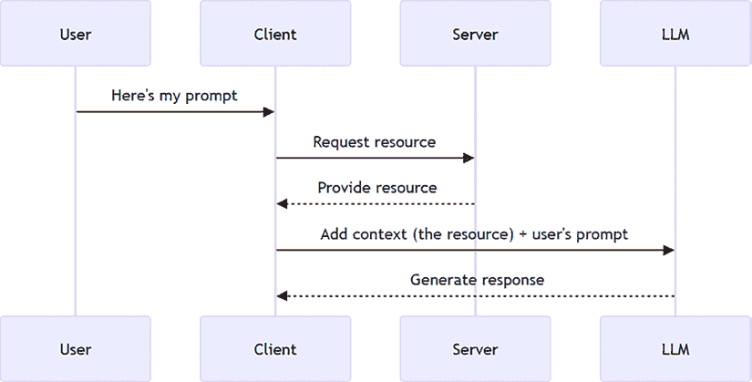
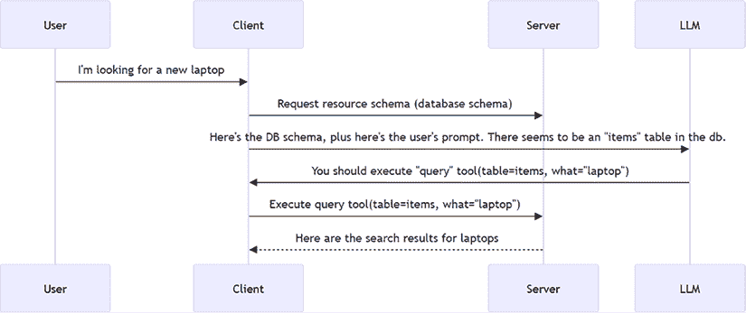
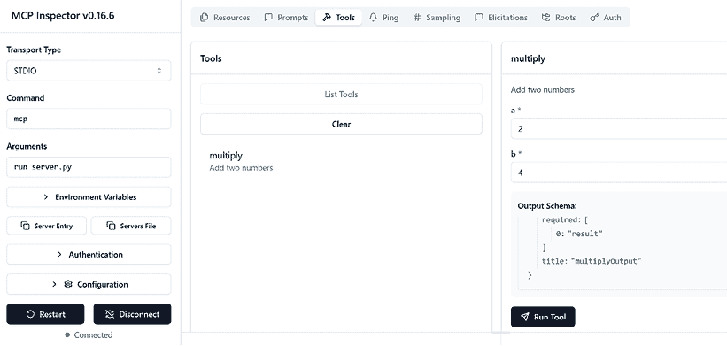

# 3

# 构建和测试服务器

在本章中，我们将介绍构建和测试服务器的基础知识。我们将从一个使用 STDIO 传输的简单服务器开始。STDIO 传输是一种通过标准输入和输出流与服务器通信的简单方式。构建 STDIO 服务器是开始使用 **模型上下文协议**（**MCP**）并了解其工作原理的好方法。还应补充说明，STDIO 传输是与服务器通信的最常见方式，它适用于运行在您的机器上的服务器。

作为本章的一部分，我们还将介绍不同的服务器测试方法。我们构建的内容能够按预期工作是很重要的。我们将介绍可以用于视觉、CLI 和代码中的不同工具。

在本章中，你将学习以下内容：

+   使用 STDIO 传输构建一个简单的服务器

+   描述服务器的核心概念

+   使用不同的工具测试服务器

本章涵盖了以下主题：

+   一个 STDIO 服务器

+   概念

+   运行时

+   测试服务器

+   第一个服务器

# 一个 STDIO 服务器

使用 STDIO 传输意味着服务器通过标准输入和输出流与客户端通信。这意味着服务器可以通过 **标准输入**（**stdin**）从客户端读取输入，并通过 **标准输出**（**stdout**）将输出发送回客户端。好吧，听起来很简单，但它是如何工作的？

MCP 使用 JSON-RPC 2.0 作为其线格式。因此，它需要将流消息转换为 JSON-RPC 格式进行传输，并将接收到的 JSON-RPC 消息转换回流消息。想象以下在终端中的示例：

```py
>> hello world 
```

要在 STDIO 服务器中使用，前面的消息将被转换为 JSON-RPC 格式，看起来像这样：

```py
{
  "jsonrpc": "2.0",
  "method": "sendMessage",
  "params": {
    "message": "hello world"
  },
  "id": 1
} 
```

这是一个有趣的例子，但作为开发者，真正对你来说重要的是两件事：

+   如何构建一个 STDIO 服务器。我们将在接下来的部分中简要展示。

+   为什么这很重要，以及你的服务器是 STDIO 服务器意味着什么。这意味着你的服务器正在你的本地机器上运行，并通过标准输入和输出流与客户端通信。在第四章和第五章中，我们将向你展示如何构建可以与互联网上的服务器通信的服务器。

# 概念

让我们看看服务器可以提供的一些核心概念（如果你愿意称之为功能）。

## 资源

这些是服务器可以提供给客户端的数据和上下文。MCP 的使用方式是客户端在与服务器通信时拥有一个 LLM。在这个用例中，资源作为上下文，可以在提示时添加到 LLM 中。想象以下场景：



图 3.1 – 资源场景

在这种情况下，上下文确保最终用户获得更好的结果，因为服务器的上下文与用户的提示配对，就像简化的**检索增强生成**（**RAG**）模式。也就是说，你将用户的提示与你的数据配对以获得更好的响应。

一个具体实现这种思维方式的方法示例是用户请求产品如下：

**提示**

```py
User: I'm looking for a new laptop 
```



图 3.2 – 资源交互示例

在这个特定的产品查询中，我们首先调用资源来了解要查询哪个表，然后我们让 LLM 确定要调用哪个工具。多亏了调用资源，我们获得了关于选择哪些工具以及使用哪些参数的额外知识。

资源也可以在不使用 LLM 的情况下使用，但你应该这样思考你的服务器：它是为了赋予客户端的 LLM 能力。这意味着你提供的工具、资源和提示应该是有帮助的。

现在我们已经了解了何时使用资源，让我们更多地讨论它们的本质。资源是静态的，可以是服务器可以访问并与客户端共享的任何内容。重要的是要知道，你可以使用或不用模板来请求资源。如果只有一个文件或一个应用程序设置配置，使用一个设置名称，如 `config` 是有意义的：

```py
server.resource(
  "config",
  "config://app",
  async (uri) => ({
    contents: [{
      uri: uri.href,
      text: "App configuration here"
    }]
  })
); 
```

在这里，我们每次都返回相同类型的信息。

然而，如果有许多类型的设置，例如用户设置、日历设置等，创建一个更模板化的版本，如 `settings://{type}` 可能是有意义的：

```py
@mcp.resource("settings://{type}")
def get_setting(type: str) -> str:
    """Get a specific setting"""
    return f"Setting from file {type}!" 
```

设置仍然是不可变的，但有很多，所以我们选择将它们分组在一个命名空间下。

在这种情况下，资源被命名为 `settings` 并接受 `type` 作为参数。例如，`settings://hello` 将匹配此模式。

## 工具

工具是服务器可以执行的功能或能力。工具的例子包括数据处理函数、调用 API 以获取数据的工具等。对于工具，我们需要通过提供模式来定义输入和输出。具体如何操作取决于所使用的运行时，但理念是应该让工具的消费者清楚输入和输出是什么。例如，如果我们有一个接受两个数字并返回其乘积的工具，我们可以这样定义它：

```py
# Add a multiplication tool
@mcp.tool()
def multiply(a: int, b: int) -> int:
    """Multiply two numbers"""
    return a * b 
```

在这个例子中，我们定义了一个名为 `multiply` 的工具，它接受两个数字作为输入并返回它们的乘积。输入和输出使用 Python 类型提示定义。

## 提示

提示是模板化的消息或工作流程，用于指导客户端和服务器之间的交互。一个很好的提示例子是帮助客户端在电子商务应用程序的上下文中编写产品描述或口号的模板。就像资源和工具一样，提示也可以接受输入。以下是一个接受产品名称并返回产品描述的提示示例：

```py
@mcp.prompt()
def describe_product(product: str) -> str:
    return f"Write a product description for {product}" 
```

在这里，我们定义了一个名为 `describe_product` 的提示，它接受一个产品名称作为输入并返回产品描述。输入是通过 Python 类型提示定义的。

既然我们已经知道了我们的服务器可以包含什么，我们还需要了解什么？

# 运行时

目前官方支持 MCP 的运行时包括 TypeScript、Python、.NET、Java 和 Kotlin、Rust 和 Go。更多运行时正在不断增加。有关运行时的最新列表，请参阅此处：[`modelcontextprotocol.io/docs/sdk`](https://modelcontextprotocol.io/docs/sdk)。每个运行时都有自己的 SDK 可以使用。运行时的实现类似，但也有一些差异。

激动吗？让我们开始吧！

# 测试服务器

你有很多工具可以使用来测试服务器。我们为什么要测试呢？因为我们想确保服务器按预期工作。在本章中我们将涵盖的工具如下。

## 检查员

这是一个 CLI 工具，可以提供 UI 和 CLI 界面。后者用于脚本化和自动化。

检查员工具通过 npx 运行一个 Node.js 包，所以请确保你已经安装了 Node.js 运行时。即使你通过 Python 命令运行检查员工具，这也同样适用，因为 Python 会包装对底层 Node.js 进程的调用。

UI 旨在进行手动测试和调试。在这个示例命令中，我们运行了检查员工具。确保你在运行以下命令时站在服务器文件相同的目录中。

Python SDK 安装了一个名为 `mcp` 的可执行文件，它有助于运行服务器：

```py
mcp dev server.py 
```

通过运行此工具，我们可以在视觉模式下测试服务器。以下是检查员工具的截图：



图 3.3 – 检查员工具

确保视觉工具指定以下字段：

+   **传输类型**：**STDIO**

+   **命令**：`mcp`

+   **参数**：`run server.py`

你也可以在 CLI 模式下运行检查员工具。这对于脚本化和自动化很有用。你输入的命令几乎和之前一样，但你需要添加 `--cli` 标志：

```py
npx @modelcontextprotocol/inspector --cli mcp run server.py --method tools/list 
```

这里，我们添加了 `--method` 命令，后面跟着 `tools/list` 参数，表示我们想要列出服务器上的所有工具。

注意，Python 中的 `mcp dev` 包裹了一个 Node.js 工具，即检查员。如果你想完全访问检查员的所有功能，可以直接在 Node.js 和 Python 中运行它，我们推荐这样做（即，像这样运行：`npx @modelcontextprotocol/inspector`）。

## cURL

可以使用标准命令行工具如 cURL 向服务器发送请求。这通常用于测试使用 SSE 或可流式传输 HTTP 作为传输的服务器。也可以使用其他能够发送网络请求的工具。只有当服务器在互联网上运行时，`curl` 命令才会起作用，这对于 SSE 服务器来说是这种情况。对于 STDIO 服务器，你需要使用检查员或自定义客户端来向服务器发送请求。让我们看看一个典型的 `curl` 命令：

```py
curl -X POST -H "Content-Type: application/json" -d '{"method": "tools/list", "params": {}, "id": 1}' http://localhost:3000/sse 
```

在前面的命令中，我们向服务器发送了一个带有`tools/list`方法的`POST`请求。服务器将响应服务器上可用的工具列表。这是使用 CLI 模式的检查器的一个很好的替代方案。

## 测试

可以为服务器编写单元测试。除了使用检查器之外，这是一个很好的实践。测试可以在 CI/CD 管道中运行，并且有助于确保服务器按预期工作。你可以使用你喜欢的任何测试框架，并且你可以向服务器添加资源、工具和提示，然后进行测试。让我们看看一个测试的例子：

```py
@pytest.mark.anyio
async def test_add_tool_decorator(self):
    mcp = FastMCP()
    @mcp.tool()
    def add(x: int, y: int) -> int:
        return x + y
    assert len(mcp._tool_manager.list_tools()) == 1 
```

在前面的例子中，我们做了以下操作：

+   使用`pytest`框架测试服务器

+   创建一个新的服务器实例并添加一个名为`add`的工具

+   测试工具是否已添加到服务器，并且工具的数量等于`1`

这是一个简单的测试，但它展示了你可以如何使用`pytest`来测试服务器。

现在，我们对服务器的概念和功能有了很好的理解；让我们记录下我们将如何构建我们的第一个服务器的计划。

# 第一个服务器

要构建我们的第一个服务器，让我们首先通过构建简单服务器的步骤来了解：

1.  **创建一个新项目**：我们将创建一个包含所需依赖项的新项目，并设置任何环境特定的设置。强烈建议你创建一个虚拟环境，以确保你不会全局安装库。通过使用虚拟环境，每个项目与其他项目隔离，你不必担心可能发生的库版本冲突。

1.  **安装依赖项**：在这里，我们将列出并安装项目的依赖项，这些依赖项当然取决于你使用的运行时。

1.  **添加服务器代码**：这是我们添加服务器功能的地方。作为这部分，我们将讨论功能、输入和输出以及模式。

1.  **使用检查器测试服务器**：检查器是一个帮助你确保新功能正常工作的工具。该工具允许你在 CLI 模式和可视化模式中运行它，其中它显示一个网页浏览器 UI：

    +   CLI 模式适用于 CI/CD 场景，因为它在终端中响应 JSON

    +   当你作为开发者尝试确保服务器按预期工作的时候，可视化模式更为合适

让我们编写一些代码！

## 第 1 步：创建一个新项目

在我们编写任何代码之前，我们需要一个项目。这将为我们成功搭建基础。项目将包含我们编写服务器和定义测试和脚本的所需一切：

1.  创建以下文件夹结构：

    ```py
    ├── src/
    |---- server.py 
    ```

1.  创建虚拟环境：

    ```py
    python -m venv venv 
    ```

1.  激活虚拟环境：

    ```py
    venv\Scripts\activate 
    ```

你应该在终端提示符中看到虚拟环境的名称。这意味着虚拟环境已激活，你安装的任何包都将安装在这个环境中。

太好了，现在我们有了虚拟环境和文件夹结构。接下来，我们需要安装依赖项。

## 第 2 步：安装依赖项

在终端中运行以下命令：

```py
pip install "mcp[cli]" 
```

这将安装 MCP SDK 和 CLI 工具。

## 第 3 步：添加服务器代码

将以下代码添加到`server.py`中：

```py
# server.py
from mcp.server.fastmcp import FastMCP
# Create an MCP server
mcp = FastMCP("Demo")
# Add a multiply tool
@mcp.tool()
def multiply(first: int, second: int) -> int:
    """Multiply two numbers"""
    return first * second
# Add a dynamic greeting resource
@mcp.resource("greeting://{name}")
def get_greeting(name: str) -> str:
    """Get a personalized greeting"""
    return f"Hello, {name}!"
@mcp.prompt()
def review_code(code: str) -> str:
    return f"Please review this code:\n\n{code}" 
```

上述代码执行以下操作：

+   创建一个名为`Demo`的 MCP 服务器实例

+   添加一个名为`multiply`的工具，它接受两个数字作为输入并返回它们的和

+   添加一个名为`greeting`的资源，它接受一个名称作为输入并返回个性化的问候

+   创建一个名为`review_code`的提示，它接受代码片段作为输入并返回代码的审查

## 第 4 步：使用检查器测试服务器

在这里，我们将使用检查器来测试服务器。检查器是一个 CLI 工具，可以提供 UI 和 CLI 界面。后者用于脚本和自动化。UI 用于手动测试和调试：

1.  在终端中运行以下命令：

    ```py
    mcp dev server.py 
    ```

这将在端口`6274`上启动检查器工具。

1.  在您的网络浏览器中导航到`http://localhost:6274`。这应该启动一个带有可视化界面的 Web 服务器，允许您测试示例。

1.  在可视化界面中，确保您填写如下字段：

    +   **命令**：`"mcp"`

    +   **参数**：`"run server.py"`

点击**连接**。

1.  选择**工具**选项卡和**列出工具**，**multiply**应该被列出。点击**multiply**并填写如下字段：

    +   **第一个**：`2`

    +   **第二个**：`4`

您应该在**工具结果**字段中看到结果**8**。

太好了，现在我们有一个正在运行的服务器，我们可以使用检查器来测试它。

## 第 5 步：使用 CLI 模式下的检查器测试服务器

在本小节中，我们将直接在 CLI 模式下运行检查器。检查器是一个 Node.js 应用程序，而`mcp dev`是它的包装器。

在撰写本文时，`mcp dev`不支持检查器提供的所有功能。因此，我们将展示如何直接作为 Node.js 应用程序运行检查器，因为它是用这种方式编写的。

让我们展示一些您可以在检查器中运行的实用命令：

+   **列出工具**：在终端中运行以下命令：

    ```py
    npx @modelcontextprotocol/inspector --cli mcp run server.py --method tools/list 
    ```

这将列出服务器上可用的所有工具，您应该看到以下输出：

```py
{
  "tools": [
    {
      "name": "multiply",
      "description": "Multiply two numbers",
      "inputSchema": {
        "type": "object",
        "properties": {
          "first": {
            "title": "First",
            "type": "integer"
          },
          "second": {
            "title": "Second",
            "type": "integer"
          }
        },
        "required": [
          "first",
          "second"
        ],
        "title": "multiplyArguments"
      },
      "outputSchema": {
        "type": "object",
        "properties": {
          "result": {
            "title": "Result",
            "type": "integer"
          }
        },
        "required": [
          "result"
        ],
        "title": "multiplyOutput"
      }
    }
  ]
} 
```

在这里，您可以看到服务器上的所有工具以 JSON 格式。我们只有一个工具`multiply`，但我们可以看到它有一个`inputSchema`，包含`first`和`second`参数。

+   **调用工具**：在终端中运行以下命令：

    ```py
    npx @modelcontextprotocol/inspector --cli mcp run server.py --method tools/call --tool-name multiply --tool-arg first=2 --tool-arg second=4 
    ```

您应该看到如下响应：

```py
{
  "content": [
    {
      "type": "text",
      "text": "8"
    }
  ],
  "structuredContent": {
    "result": "8"
  },
  "isError": false
} 
```

+   **列出资源**：在终端中运行以下命令：

    ```py
    npx @modelcontextprotocol/inspector --cli mcp run server.py --method resources/list 
    ```

这将列出服务器中可用的所有资源，您应该看到以下输出：

```py
{
  "resources": []
} 
```

空的？原因是资源和模板资源之间有一个区别。以下是列出模板资源的方法：

```py
npx @modelcontextprotocol/inspector --cli mcp run server.py --method resources/templates/list 
```

您应该得到如下响应：

```py
{
  "resourceTemplates": [
    {
      "uriTemplate": "greeting://{name}",
      "name": "get_greeting",
      "description": "Get a personalized greeting"
    }
  ]
} 
```

+   让我们调用我们的模板资源：

    ```py
    npx @modelcontextprotocol/inspector --cli mcp run server.py --method resources/read --uri greeting://chris 
    ```

您应该看到如下响应：

```py
{
  "contents": [
    {
      "uri": "greeting://chris",
      "mimeType": "text/plain",
      "text": "Hello, chris!"
    }
  ]
} 
```

+   让我们使用以下命令列出提示：

    ```py
    npx @modelcontextprotocol/inspector --cli mcp run server.py --method prompts/list 
    ```

您应该看到类似以下输出：

```py
{
  "prompts": [
    {
      "name": "review_code",
      "description": "",
      "arguments": [
        {
          "name": "code",
          "required": true
        }
      ]
    }
  ]
} 
```

+   要调用提示，我们将输入提示名称和`prompts/get`，如下所示：

    ```py
    npx @modelcontextprotocol/inspector --cli mcp run server.py --method prompts/get --prompt-name review_code --prompt-args code="print('Hello World')" 
    ```

您应该看到如下响应：

```py
{
  "messages": [
    {
      "role": "user",
      "content": {
        "type": "text",
        "text": "Please review this code:\n\nprint('Hello World')"
      }
    }
  ]
} 
```

可选地，您可以在`server.py`中添加一个资源，如下所示：

```py
@mcp.resource("command://ping")
def get_echo() -> str:
    """Send pong"""
    return "Pong" 
```

请这样阅读：

```py
npx @modelcontextprotocol/inspector --cli mcp run server.py --method resources/read --uri command://ping 
```

您应该看到如下响应：

```py
{
  "contents": [
    {
      "uri": "command://ping",
      "mimeType": "text/plain",
      "text": "Pong"
    }
  ]
} 
```

注意您如何使用`uri`参数以相同的方式调用资源和资源模板。

# 摘要

在本章中，我们介绍了如何构建您的第一个服务器。对于我们的第一个服务器，我们使用了 STDIO 传输来创建一个旨在在您的机器上运行的服务器。我们还探讨了使用一个名为检查器的工具测试服务器功能的各种方法。检查器工具有两种不同的模式，CLI 模式和视觉模式。前者模式用于 CI/CD 场景，后者用于您作为开发者快速尝试功能。

在我们即将到来的章节中，我们将描述 SSE 传输，如果您希望服务器通过 URL 地址被消费，可以使用它。

# 作业 - 电子商务 STDIO 服务器

对于这个 MCP 服务器，我们将添加可以在电子商务应用程序上下文中使用的功能。因此，服务器需要以下功能。

它将需要以下工具：

+   `get-orders`: 此工具将返回订单列表。可选输入是客户 ID，输出是订单列表。每个订单应包含以下字段：ID、客户 ID、数量、总价和状态。

+   `get-order`: 此工具将返回特定订单。输入是订单 ID，输出是订单。订单应包含以下字段：ID、客户 ID、数量、总价和状态。

+   `place-order`: 此工具将下订单。输入是客户 ID 和购物车 ID。

+   `get-cart`: 此工具将返回一个购物车。

+   `get-cart-items`: 此工具将返回购物车中的项目列表。输入是购物车 ID，输出是项目列表。每个项目应包含以下字段：ID、名称、描述、价格、数量和产品 ID。

+   `add-to-cart`: 此工具将项目添加到购物车。输入是购物车 ID、产品 ID 和数量。输出是成功消息。如果未提供购物车 ID，则工具应创建一个新的购物车并将项目添加到新购物车。输出应包含成功消息和购物车 ID。

+   `products`: 此工具将返回产品列表。可选输入是类别，输出是产品列表。产品应包含以下字段：ID、名称、描述、价格和类别。输出应以 JSON 格式。

+   `product`: 此工具应返回特定产品。输入是产品 ID，输出是产品。产品应包含以下字段：名称、描述、价格、类别和 ID。输出应以 JSON 格式。

+   `categories`: 此工具将返回一个类别列表。输出应以 JSON 格式。类别应包含以下字段：ID、名称和描述。输出应以 JSON 格式。

+   `get-customers`: 此工具将返回客户列表。输出应为 JSON 格式。它应包含以下字段：ID、姓名和电子邮件。

它将需要此资源：

+   `product_catalog`: 此资源将返回目录中的产品列表。可选输入是类别，输出是产品列表。每个产品应包含以下字段：名称、描述和类别。目的是，如果潜在客户想查看它们，资源将返回目录中的产品列表。

如你所见，这将支持一个简单的电子商务应用和一个试图将商品放入购物车或下订单的客户。

你可以在内存数据结构中保持状态。

# 解决方案

你可以在 [`github.com/PacktPublishing/Learn-Model-Context-Protocol-with-Python/blob/main/Chapter03/solutions/README.md`](https://github.com/PacktPublishing/Learn-Model-Context-Protocol-with-Python/blob/main/Chapter03/solutions/README.md) 找到解决方案。

# 问答

以下哪项是服务器可以公开的内容？

+   A: 工具、提示和服务

+   B: 工具和提示

+   C: 提示、工具和资源

你也可以在 [`github.com/PacktPublishing/Learn-Model-Context-Protocol-with-Python/blob/main/Chapter03/solutions/solution-quiz.md`](https://github.com/PacktPublishing/Learn-Model-Context-Protocol-with-Python/blob/main/Chapter03/solutions/solution-quiz.md) 找到解决方案。

# 参考资料

+   **检查工具**: [`github.com/modelcontextprotocol/inspector`](https://github.com/modelcontextprotocol/inspector)

+   **模型上下文协议**: [`github.com/modelcontextprotocol/`](https://github.com/modelcontextprotocol/)

+   **Python SDK**: [`github.com/modelcontextprotocol/python-sdk`](https://github.com/modelcontextprotocol/python-sdk)

|

#### 现在解锁本书的独家优惠

扫描此二维码或访问 [`packtpub.com/unlock`](https://packtpub.com/unlock)，然后通过名称搜索此书。 |  |

| **注意**：在开始之前，请准备好您的购买发票。* |
| --- |
