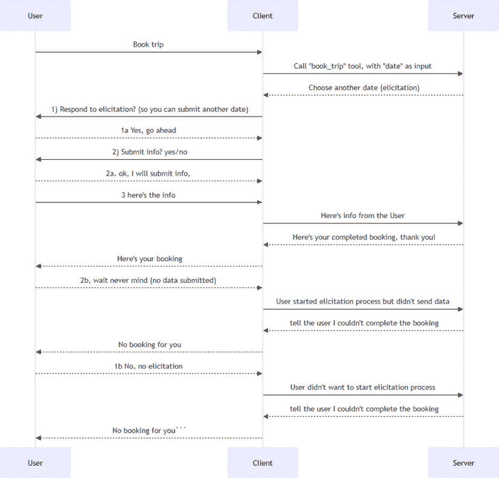
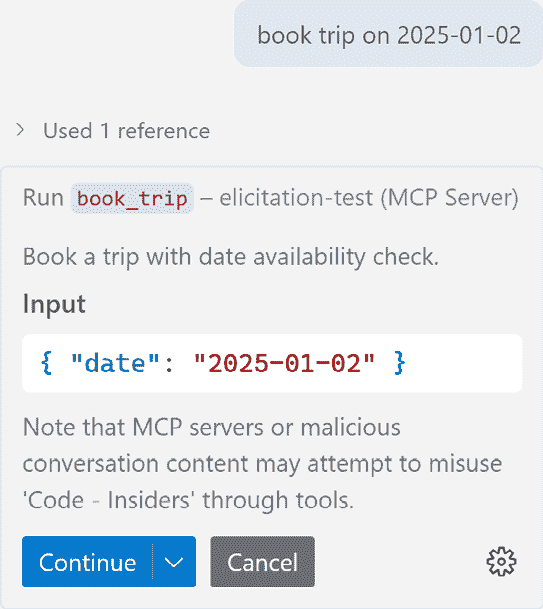
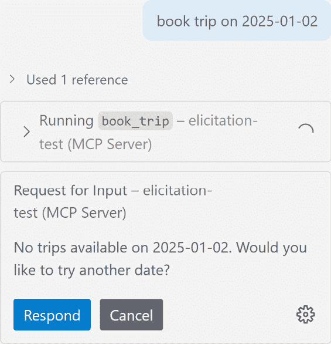
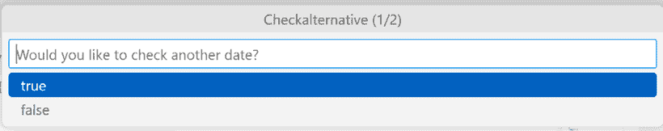
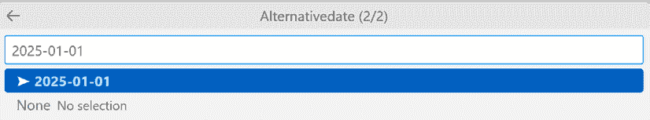
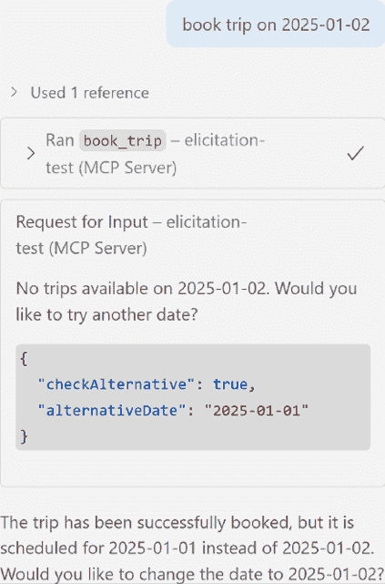

# 10

# 启发式方法

**启发式**意味着获取或产生某物的过程，尤其是信息或反应。

为什么这对 MCP 来说很重要？官方文档中有以下说明：

**模型上下文协议**（**MCP**）为服务器提供了一种标准化的方式，在交互过程中通过客户端请求用户额外的信息。这种流程允许客户端在保持对用户交互和数据共享控制的同时，使服务器能够动态地收集必要的信息。

那么，这意味着什么？这意味着，由于某种原因，服务器发现它需要额外涉及客户端，以便向用户请求更多信息。现在目的更明确了，对吧？

好吧，想象一下以下情况：作为一个用户，你正在尝试预订假日旅行，而你搜索的日期不可用。通过使用启发式方法，你可以改善这种情况——也就是说，作为服务器，你不仅说这次旅行不可用，还努力提出额外的问题，并可能建议这个日期附近的可用日期。现在，你可能会看到，这可能会在许多情况下非常有用，比如增加销售或预订的机会等等。

在本章中，我们将学习以下内容：

+   解释什么是启发式方法

+   学习何时使用它

+   构建启发式集成

本章涵盖了以下主题：

+   为什么需要启发式方法？

+   实现启发式方法

+   启发式流程

+   JSON-RPC 消息

+   实现服务器端功能

+   使用 VS Code 测试启发式方法

# 为什么需要启发式方法？

好吧，我们在本章的开头已经尝试描述了可能促使在 MCP 中使用启发式方法的情况，但让我们尝试总结一些主要动机因素：

+   **任务复杂性**：对于某些任务，在开始时提供所有必要的信息可能根本不可能。这可能是一些用户需要通过工作流程进行选择的情况。例如，用户在购买电影票时可能需要做出多个选择。他们可能一开始只想预订某一天的电影，但随后可能需要被询问是否需要高级座位或其他可定制的选项。或者，考虑预订火车票的情况，你可能需要做出选择，比如是否需要带编号的座位，票是实体票还是电子票，等等。你可以一开始就要求所有这些信息，但这可能会让用户体验变得繁琐，可能更好的做法是先要求较少的输入。

+   **提高网站上的转化率**：另一个角度是公司确保他们有一个更好的*转化率*，这意味着网站上更多的用户成为实际客户。例如，如果用户想要一件红色的毛衣，而您目前没有库存，那么您可能想询问用户是否可以接受其他颜色，或者想要注册等待名单，以便在库存到来时自动订购。这种行为更有可能提高公司的销售额。

+   **提升用户体验**：作为前面角度的合乎逻辑的结论，如果用户遇到的不只是“不”，而是合理的选项，那么整体的用户体验很可能会得到提升。

总的来说，引出可以是一个改善您应用程序的绝佳方式。让我们接下来尝试看看实现方面的内容。

# 实施引出

因此，我们想使用引出——很好。但首先，有一系列我们应该知道的指南。以下是官方文档的说明：

为了信任、安全和安全：

+   服务器*不得*使用引出请求敏感信息

应用程序*应该*：

+   提供一个界面，使服务器请求信息的来源清晰可见

+   允许用户在发送前审查和修改他们的回复

+   尊重用户隐私并提供清晰的拒绝和取消选项

# 引出流程

通常，在引出过程中发生的情况是，服务器决定它没有足够的信息来完成对工具、资源或提示的调用。

需要理解的重要一点是，这个过程是一个两步的过程：

1.  服务器会询问客户端是否可以发起一个针对用户的引出请求。

1.  客户端要求用户提交信息。

用户可以在 1)和 2)中接受或拒绝；请参见以下序列图解释此过程。为了使理解更简单，我们选择了一个预订旅行的过程：



图 10.1 – JSON-RPC 消息

# JSON-RPC 消息

现在我们已经解释了整体流程，让我们看看 JSON-RPC 消息看起来像什么。

就像大多数 MCP 功能一样，在 JSON-RPC 中需要发送和接收特定的消息：

**请求消息**

```py
{
  "jsonrpc": "2.0",
  "id": 1,
  "method": "elicitation/create",
  "params": {
    "message": "Please provide your GitHub username",
    "requestedSchema": {
      "type": "object",
      "properties": {
        "name": {
          "type": "string"
        }
      },
      "required": ["name"]
    }
  }
} 
```

在前面的消息中，我们可以看到`message`包含了我们请求的负载——用户需要做出的选择或对我们请求的解释。`requestedSchema`是一个定义您作为服务器需要什么信息的模式，因此在这里，您需要指定所需项目的名称、类型以及您想要施加的任何其他规则。请参见以下示例模式，其中服务器请求`name`、`email`和`age`。对于每个参数，我们指定了类型和描述，在某些地方，我们还指定了格式甚至验证规则，例如您至少需要 18 岁：

```py
"requestedSchema": {
    "type": "object",
    "properties": {
      "name": {
        "type": "string",
        "description": "Your full name"
      },
      "email": {
        "type": "string",
        "format": "email",
        "description": "Your email address"
      },
      "age": {
        "type": "number",
        "minimum": 18,
        "description": "Your age"
      }
    },
    "required": ["name", "email"]
} 
```

让我们看看一个响应。具体来说，这是一个*接受*类型的响应，其中用户同意提交他们被请求的信息。

**响应消息**

```py
{
  "jsonrpc": "2.0",
  "id": 2,
  "result": {
    "action": "accept",
    "content": {
      "name": "Monalisa Octocat",
      "email": "octocat@github.com",
      "age": 30
    }
  }
} 
```

实际上，用户可以说，“我不想提供这个信息”。如果发生这种情况，那么就会发送一个拒绝类型消息作为响应，看起来是这样的：

**拒绝消息**

```py
{
  "sonrpc": "2.0",
  "id": 2,
  "result": {
    "action": "decline"
  }
} 
```

在这里，很明显用户拒绝提交请求的信息。

第三种响应类型是取消。它与拒绝非常相似，但更像用户通过输入*Escape*、点击关闭对话框来忽略引发对话框，所以这更像用户忽略了交互，而不是明确地说*不*。

## 请求架构类型

我们提到了一般请求架构和示例。然而，支持的类型相当多，了解它们的存在非常重要，这样你才能正确使用它们。这些类型作为引发过程的一部分呈现给用户，这意味着用户可以使用下拉列表、文本输入字段或某些其他 UI 元素来提供信息。

+   `string`：这一类型是关于请求一个字符串。你可以添加相当多的检查。下面是这个架构的样子：

    ```py
    {
        "type": "string",
        "title": "Display Name",
        "description": "Description text",
        "minLength": 3,
        "maxLength": 50,
        "pattern": "^[A-Za-z]+$",
        "format": "email"
    } 
    ```

在这里，你可以看到你可以限制`minLength`和`maxLength`，甚至设置模式，这在你需要请求一个特定的允许结构时非常有用，例如地址、电话号码、社会保险号码等等。

+   `number`：这一类型稍微简单一些，但通过设置最小值和最大值，它有助于用户了解允许和不允许的内容。看看这个架构：

    ```py
    {
        "type": "number", // or "integer"
        "title": "Display Name",
        "description": "Description text",
        "minimum": 0,
        "maximum": 100
    } 
    ```

看看`minimum`和`maximum`值，你可以指定这些值。

+   `boolean`：对于这种类型，想法是让用户回答*是*或*否*。你也可以指定是否应该有一个默认值：

    ```py
    {
        "type": "boolean",
        "title": "Display Name",
        "description": "Description text",
        "default": false
    } 
    ```

+   `enum`：这一类型应该被视为一个选项列表，如果你想让用户在不同的日期之间选择旅行，例如，这可能会很有用：

    ```py
    {
        "type": "string",
        "title": "Display Name",
        "description": "Description text",
        "enum": ["option1", "option2", "option3"],
        "enumNames": ["Option 1", "Option 2", "Option 3"]
    } 
    ```

考虑到这一点，让我们看看我们是否可以使用这些类型中的几个，因为我们将展示下一节中的实现部分。

# 实现服务器端功能

让我们从服务器开始。我们需要知道的是，服务器功能、工具、资源或提示应该运行其过程，如果它检测到需要更多信息，它应该生成一个引发消息。

首先，让我们看看我们如何生成这样的消息。首先，我们有一个`if`语句来检查是否应该生成消息。如果是这样，我们在上下文对象上调用`elicit`，同时提供一个`message`和一个要遵守的`schema`：

```py
class BookingPreferences(BaseModel):
    """Schema for collecting user preferences."""
    checkAlternative: bool = Field(description="Would you like
        to check another date?")
    alternativeDate: str = Field(
        default="2024-12-26",
        description="Alternative date (YYYY-MM-DD)",
    )
def is_available_date -> bool:
    pass
@mcp.tool()
def book_table(date: str,ctx: Context[ServerSession, None]) -> str:
    # 1\. Check if data is available
    if not is_available_date(date):
        result = await ctx.elicit(
            message=(f"No trips available on {date}. Would you
                like to try another date?"),
            schema=BookingPreferences,
        ) 
```

然后应该检查用户和客户端的响应：

```py
if result.action == "accept" and result.data:
    if result.data.checkAlternative:
        return f"[SUCCESS] Booked for {result.data.alternativeDate}"
    return "[CANCELLED] No booking made"
return "[CANCELLED] Booking cancelled" 
```

在这里，你可以看到我们如何调查`action`属性，以查看用户是否接受了主要操作并提交了额外的数据。如果是这样，我们就开始解析所选择的内容。如果没有接受，那么我们就发送一个取消消息。

现在，让我们一起看看：

```py
from pydantic import BaseModel, Field
from mcp.server.fastmcp import Context, FastMCP
from mcp.server.session import ServerSession
mcp = FastMCP(name="Elicitation Example")
class BookingPreferences(BaseModel):
    """Schema for collecting user preferences."""
    checkAlternative: bool = Field(description="Would you like
        to check another date?")
    alternativeDate: str = Field(
        default="2024-12-26",
        description="Alternative date (YYYY-MM-DD)",
    )
@mcp.tool()
async def book_trip(date: str, ctx: Context[ServerSession, None]) -> str:
    """Book a trip with date availability check."""
    # Check if date is available
    if not is_available_date(date):
        # Date unavailable – ask user for alternative
        result = await ctx.elicit(
            message=(f"No trips available on {date}. Would you
                like to try another date?"),
            schema=BookingPreferences,
        )
        if result.action == "accept" and result.data:
            if result.data.checkAlternative:
                return f"[SUCCESS] Booked for
                    {result.data.alternativeDate}"
            return "[CANCELLED] No booking made"
        return "[CANCELLED] Booking cancelled"
    # Date available
    return f"[SUCCESS] Booked for {date}" 
```

现在，让我们继续使用 VS Code 测试激发功能。

# 使用 VS Code 测试激发

要使用 VS Code 测试激发功能，您需要将 MCP 服务器添加到 `mcp.json` 文件的条目中，如下所示：

```py
"server": {
    "type": "sse",
    "url": "http://localhost:8000/sse"
} 
```

然后，在输入以下提示之前，请确保您处于 *Agent* 模式：

```py
Book trip on 2025-02-01 
```

您应该在用户界面中看到以下情况：

1.  **输入提示并工具调用**：在这里，您输入您的请求以预订旅行，系统将其识别为工具调用。您需要批准工具调用才能继续：



图 10.2 – 输入提示并查看工具调用

1.  **批准工具调用**：一旦您批准了工具调用，您应该看到界面告诉您所选数据正在忙碌，您将被要求做出响应，这意味着现在它将带您进入构建激发响应的阶段：



图 10.3 – 批准工具调用

1.  **构建激发响应**：现在您需要根据用户的输入和系统的要求构建一个响应。这涉及到使用您之前定义的激发模式来收集所需的所有额外信息。以下是在用户界面中的样子。在下面的屏幕截图中，您会被问及是否想要做出响应。如果您选择 **true**，它将继续询问您另一个日期；如果不选择，它将停止激发过程：



图 10.4 – 构建激发响应

1.  **对激发做出响应**：一旦您选择继续，您需要填写替代日期，如下所示：



图 10.5 – 对激发做出响应

1.  **最终结果**：因为您已经提交了另一个日期，服务器将检查此响应是否可行。在下面的屏幕截图中，您可以看到这是正确的，并且您收到了预订确认：



图 10.6 – 最终结果

这就完成了服务器端的激发。

## 在客户端实现激发

太好了——现在我们对服务器端有了很好的理解，甚至知道如何使用 VS Code 进行测试。让我们继续实现客户端。

通常，当编写客户端时，您会处理一个 `ClientSession` 对象。这允许您管理到服务器的连接。除了 `read_stream` 和 `write_stream`，您还可以传递 `elicitation_callback` 来处理任何激发事件：

```py
async with ClientSession(
    read_stream,
    write_stream,
    elicitation_callback=elicitation_callback_handler) as session: 
```

让我们看看 `elicitation_callback_handler`：

```py
async def elicitation_callback_handler(context:
    RequestContext[ClientSession, None], params: ElicitRequestParams):
    print(f"[CLIENT] Received elicitation data: {params.message}") 
```

如您所见，此处理程序接受两个参数：请求上下文和诱导请求参数。我们现在需要做的是创建一个客户端响应，并将其发送回服务器。您可以向服务器发送三种可能的响应：

+   `accept`：这意味着我们希望诱导过程继续。如果我们给出这样的响应，我们还应该遵守服务器设定的输入模式。例如，以下答案将符合：

    ```py
    return ElicitResult(action="accept", content={
        "checkAlternative": True,
         "alternativeDate": "2025-01-01"
    }) # should book 1 jan instead of initial 2nd Jan 
    ```

在这里，您可以看到我们首先将`action`属性设置为`accept`，并将`content`设置为有效载荷，其中模式采用`checkAlternative`和`alternativeDate`。注意我们如何硬编码响应。在一个更类似生产的应用程序中，分配给`alternativeDate`的值应该是询问用户输入的结果。

+   `decline`：这意味着我们想要停止诱导过程。我们可以发送这样的响应：

    ```py
    return ElicitResult(action="decline") 
    ```

在这里，我们根本未设置`content`，这使得我们明确表示我们不会提供任何关于下降的额外信息或背景。这种`下降`响应在处理过程的早期就发生了。这可以比作用户简单地说不，而不提供更多细节。

+   `accept`：用户接受响应，但随后拒绝提供替代日期：

    ```py
    # 1\. refuses no select other date
    return ElicitResult(action="accept", content={
        "checkAlternative": False
    }) # should say no booking made, WORKS --> 
    ```

这种下降发生在处理过程的一段时间后，在用户被提供选择替代日期的选项之后。

让我们尝试通过这个序列图来展示所有内容：

``

图 10.7 – 在 Python 客户端中实现诱导的流程

**快速提示**：需要查看此图像的高分辨率版本？请使用下一代 Packt Reader 打开此书或在其 PDF/ePub 副本中查看。

**下一代 Packt Reader**以及此书的**免费 PDF/ePub 副本**包含在您的购买中。扫描二维码或访问[`packtpub.com/unlock`](https://packtpub.com/unlock)，然后使用搜索栏通过名称查找此书。请仔细检查显示的版本，以确保您获得正确的版本。


如您所见，通常，有几个排列组合需要跟踪用户可以在不同阶段取消的情况，但关键是确保客户端能够优雅地处理这些不同场景。

# 摘要

在本章中，我们详细介绍了诱导过程，包括它是如何启动的以及它可能发生的不同场景。我们还探讨了在此过程中可以向服务器发送的各种响应。诱导是指系统积极寻求从用户那里获取更多信息以完成请求或澄清意图。

我们还看到了用户如何在处理的不同阶段接受以及取消。

最后，启发式方法可以是一个强大的工具，用于改善用户交互并确保系统能够有效地满足用户需求。

在下一章中，我们将探讨如何使用各种身份验证方法（如基本认证、JWT 和 OAuth2.1）来保护您的 MCP 服务器和客户端。

# 作业

到目前为止，您已经看到了处理预订场景的代码。现在，您的任务是实现一个场景，其中用户完成预订流程，但被问及他们是否想要成为会员以获得未来预订的折扣。使用以下代码[`github.com/PacktPublishing/Learn-Model-Context-Protocol-with-Python/blob/main/Chapter10/code/README.md`](https://github.com/PacktPublishing/Learn-Model-Context-Protocol-with-Python/blob/main/Chapter10/code/README.md)。

# 解决方案

您可以在[`github.com/PacktPublishing/Learn-Model-Context-Protocol-with-Python/blob/main/Chapter10/solution/README.md`](https://github.com/PacktPublishing/Learn-Model-Context-Protocol-with-Python/blob/main/Chapter10/solution/README.md)找到解决方案。

# 测验

当以下情况发生时，启发式过程在技术上启动：

+   A: 服务器确定需要从用户那里获取更多信息以完成请求。

+   B: 用户提供了需要进一步澄清或详细说明的输入。

+   C: 系统在继续之前需要确认用户的意图。

您可以在[`github.com/PacktPublishing/Learn-Model-Context-Protocol-with-Python/blob/main/Chapter10/solution/solution-quiz.md`](https://github.com/PacktPublishing/Learn-Model-Context-Protocol-with-Python/blob/main/Chapter10/solution/solution-quiz.md)找到解决方案。

|

#### 立即解锁本书的独家优惠

扫描此二维码或访问[`packtpub.com/unlock`](https://packtpub.com/unlock)，然后通过书名搜索此书。 |  |

| **注意**：在开始之前，请准备好您的购买发票。* |
| --- |
