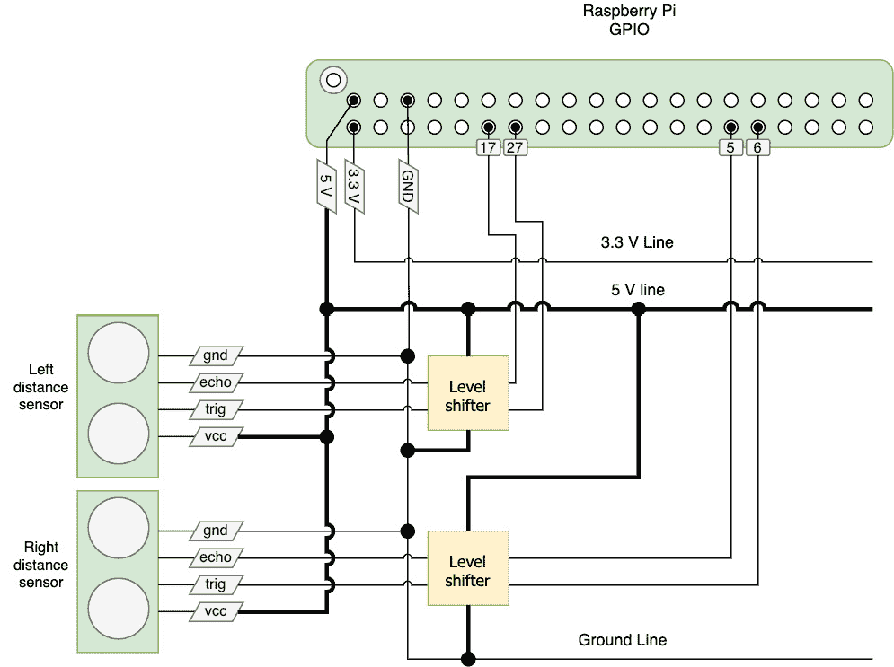
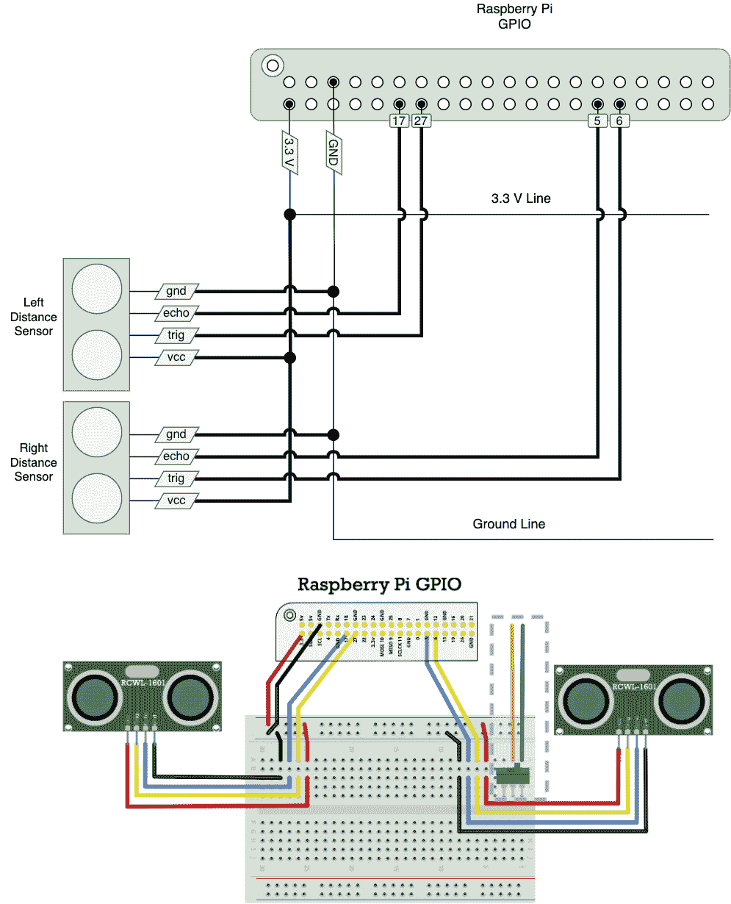
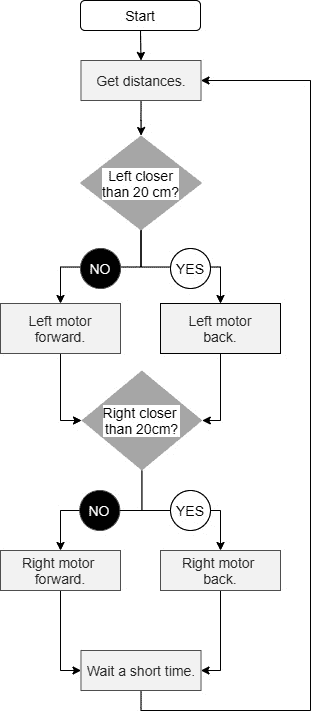

# *第 8 章*：使用 Python 编程距离传感器

在本章中，我们研究距离传感器及其如何用于避免物体。避免障碍物是移动机器人的一项关键特性，因为撞到东西通常不是好事。它也是一种使机器人看起来更智能的行为，好像它正在智能地行动。

在本章中，我们将了解不同类型的传感器，并选择一个合适的类型。然后我们在机器人对象中构建一个层来访问它们，此外，我们创建了一个避免墙壁和物体的行为。

在本章中，你将了解以下主题：

+   在光学传感器和超声波传感器之间进行选择

+   安装和读取超声波传感器

+   避免碰撞 – 编写避免障碍物的脚本

# 技术要求

要完成本章的动手实验，你需要以下设备：

+   Raspberry Pi 机器人和前几章中的代码。

+   需要两个 HC-SR04P、RCWL-1601 或 Adafruit 4007 超声波传感器。它们必须具有 3.3 V 的输出。

+   一个面包板。

+   22 AWG 单芯线或预切割的面包板跳线套件。

+   面包板友好的**单刀双掷（SPDT**）滑动开关。

+   阳性到阴性的跳线，最好是连接在一起的跳线套件。

+   两个用于传感器的支架。

+   一把十字螺丝刀。

+   小型扳手或小钳子。

本章的代码可在 GitHub 上找到：[https://github.com/PacktPublishing/Learn-Robotics-Programming-Second-Edition/tree/master/chapter8](https://github.com/PacktPublishing/Learn-Robotics-Programming-Second-Edition/tree/master/chapter8)。

查看以下视频，了解代码的实际应用：[https://bit.ly/2KfCkZM](https://bit.ly/2KfCkZM)

# 在光学传感器和超声波传感器之间进行选择

在我们开始使用距离传感器之前，让我们了解一下这些传感器实际上是什么，它们是如何工作的，以及一些不同类型的传感器。

感测距离最常见的方法是使用超声波或光。这两种机制的原则是发射一个脉冲，然后感应其反射回波，使用其时间或角度来测量距离，如下面的图所示：


图 8.1 – 在距离传感器中使用脉冲定时

我们专注于测量响应时间，也就是所谓的**飞行时间**的传感器。*图 8.1* 展示了这些传感器如何使用反射时间。

通过对传感器工作原理的基本理解，我们现在将更深入地研究光学传感器和超声波传感器。

## 光学传感器

基于光的传感器，如 *图 8.2* 中的传感器，使用我们看不见的红外激光光。这些设备可以非常小；然而，在强烈的阳光和荧光灯下，它们可能会表现不佳，导致它们行为异常。一些物体反射光线不好或透明，这些传感器无法检测到：


图8.2 – VL530LOx在载板上的应用

在使用红外光束检测比赛时间的比赛中，光束和这些传感器可能会相互干扰。然而，与超声波传感器不同，当放置在机器人不同侧面时，这些不太可能导致错误检测。光学距离传感器可以具有更高的精度，但范围更有限。它们可能很昂贵，尽管市场上也有更便宜的固定范围类型的光传感器。

## 超声波传感器

许多基于声音的距离测量设备使用超声波，其频率超出人类听觉范围，尽管它们可能会打扰一些动物，包括狗。移动电话麦克风和一些相机会将它们的脉冲作为点击声捕捉。超声波设备通常比光学设备大，但由于声音传播速度比光慢且更容易测量，因此它们通常更便宜。对于不反射声音的柔软物体，如织物，这些设备可能更难检测。

*图8.3*展示了HC-SR04，这是一种常见且价格低廉的基于声音的距离传感器：

![图8.3 – HC-SR04

![图B15660_08_03.jpg]

图8.3 – HC-SR04

它们的范围从大约2厘米的最小值延伸到4米。

有许多基于超声波的设备，包括常见的HC-SR04，但并非所有都适合。我们将探讨逻辑水平，因为这是选择购买哪种传感器的一个重要因素。

## 逻辑水平和移位

树莓派上的I/O引脚仅适用于3.3 V的输入。市场上许多设备具有5 V的逻辑，无论是控制它们的输入还是它们的输出。让我们深入探讨我所说的逻辑水平，以及为什么在可能的情况下坚持使用原生电压水平是有意义的。

**电压**是衡量电流量中推动能量的度量。不同的电子设备被设计成能够承受或响应不同的电压水平。通过设备传递过高的电压可能会损坏它。另一方面，传递过低的电压可能导致你的传感器或输出简单地不响应或行为异常。我们处理的是输出高或低电压以表示真/假值的逻辑设备。这些电压必须高于阈值才能为真，低于阈值才能为假。我们必须了解这些电气特性，否则我们可能会损坏设备并无法使它们进行通信。

*图8.4*中的图表显示了不同级别的影响：

![图8.4 – 电压和逻辑水平

![图B15660_08_04.jpg]

图8.4 – 电压和逻辑水平

在 *图8.4* 中，我们展示了一个图表。在 *y* 轴（左侧），它显示了从0到5 V的电压标签。*y* 轴显示了不同的操作条件。图表中有4条虚线穿过。最低的虚线在0.8 V处；低于这个值，输入将被视为逻辑0。下一个线，大约在2.3 V处，是许多3.3 V设备认为逻辑1的地方。3.3 V的线显示了树莓派上逻辑1的预期输入和输出电平。在这条线以上，可能会损坏树莓派。大约在4.2 V处是某些5 V设备期望的逻辑1（尽管一些设备可能允许低至2 V） – 树莓派需要帮助才能与这些设备通信。

沿着图表有5个条形。第一个标记的条形在0处 – 意味着对所有设备都是清晰的逻辑0。下一个条形是树莓派的3.3 V清晰的逻辑1，但它也低于4.2 V，因此一些5 V设备可能不会识别这一点。标记为不清晰的条形在1.8 V处 – 在这个低和高阈值之间的区域，逻辑可能不清晰，应该避免。标记为**模糊逻辑1**的条形高于阈值，但仅略高于，可能会被误解或导致3.3 V设备出现异常结果。最后一个条形在5 V处，这是5 V设备输出的。如果没有电平转换器直接连接到树莓派，这将损坏树莓派。

在 *图8.4* 中，有1.7 V和2.3 V的条形。这些电压非常接近逻辑阈值，可能导致从输入随机数据。避免在所需逻辑电平之间的中间电压。3 V是可以的，但避免1.5 V，因为这可能是模糊的。

重要提示

将超过3.3 V的电压放入树莓派引脚会损坏树莓派。不要在没有逻辑电平转换器的情况下使用5 V设备。

如果你使用5 V的设备，你需要额外的电子设备来接口它们。这些电子设备包含更多的布线和部件，从而增加了机器人的电子成本、复杂度或尺寸：



图8.5 – 将HC-SR04传感器连接到电平转换器

*图8.5* 展示了一个使用需要逻辑电平转换的HC-SR04 5v传感器的机器人布线图。此电路图显示了顶部的树莓派GPIO引脚。从左边的3个引脚来的分别是5 V、3.3 V（写作3v3）和地（GND）线。GPIO引脚下方是3.3 V和5 V线。

在电源线（或轨道）下方是两个电平转换器。进入电平转换器右边的是来自树莓派GPIO引脚5、6、17和27的连接。在这种图表风格中，一个黑点表示一个连接，没有连接的线用桥表示。

图表底部有一条从地线来的地线。这显示为正常，因为额外的电子设备将需要访问地线。

图表的左侧有两个距离传感器，连接到5 V和GND。每个传感器的**触发**和**回声**引脚都连接到电平转换器。不难看出，添加更多需要电平转换器的传感器将使复杂性进一步增加。

幸运的是，现在有其他选项可供选择。在可以使用3.3 V原生设备或使用其供电电压作为逻辑高电平的设备的情况下，选择这些设备是值得的。在为机器人购买电子产品时，仔细考虑机器人主控制器使用的电压（如树莓派），并确认这些电子产品与控制器的电压兼容。

HC-SR04有几个具有这种能力的替代部件。HC-SR04P、RCWL-1601和Adafruit 4007型号输出3.3 V，可以直接连接到树莓派。

## 为什么使用两个传感器？

两个传感器允许行为检测哪一侧更近。有了这个，机器人可以检测开放空间的位置并朝它们移动。*图8.6*显示了这是如何工作的：


图8.6 – 使用两个传感器

在*图8.6*中，第二个机器人可以做出更有趣的决定，因为它有更多来自世界的数据来做出这些决定。

考虑所有这些选项，我建议你使用3.3 V变体，如HC-SR04P/RCWL-1601或Adafruit 4007，因为它们便宜，而且很容易添加两个或更多这样的传感器。

我们已经看到了一些距离传感器的类型，并讨论了为这个机器人所做的权衡和选择。你已经了解了电压级别，以及为什么这是机器人电子设备的一个关键考虑因素。我们还探讨了我们可以使用多少传感器以及我们可以将它们放在哪里。现在让我们看看如何添加它们。

# 连接和读取超声波传感器

首先，我们应该将这些传感器连接到机器人并固定好。然后，我们编写一些简单的测试代码，我们可以在下一节的行为代码上基于这些代码。完成本节后，机器人框图应该看起来像*图8.7*：


图8.7 – 带超声波传感器的机器人框图

此图基于*图6.33*的框图，来自[*第6章*](B15660_06_Final_ASB_ePub.xhtml#_idTextAnchor096)*，构建机器人基础 – 轮子、电源和布线*，通过添加左右超声波传感器。它们都有双向箭头指向树莓派，因为作为主动传感器，树莓派触发传感器测量并读取结果。让我们将传感器连接到机器人底盘。

## 将传感器固定到机器人上

在*技术要求*部分，我添加了一个HC-SR04支架。虽然可以使用CAD和其他零件制造技能制作定制的支架，但使用库存设计更为合理。*图8.8*显示了我在使用的支架：


图8.8 – 带有螺丝和硬件的超声波HC-SR04传感器支架

假设你的底盘足够像我的一样，有安装孔或槽来安装这个支架，那么这些很容易附着到你的机器人上：


图8.9 – 安装传感器支架的步骤

要安装传感器支架，请使用*图8.9*作为以下步骤的指南：

1.  将两个螺栓推入支架上的孔中。

1.  将支架螺丝从机器人前部的孔中穿过。

1.  从机器人下方穿过一个螺母并拧紧。对另一侧重复此操作。

1.  安装两个支架后，机器人应该看起来像这样。

    *图8.10*展示了如何将传感器推入支架：

    

    图8.10 – 将传感器推入支架

1.  看看传感器。两个换能器元件，顶部有网布的圆形罐，将很好地适合支架上的孔。

1.  距离传感器可以直接推入支架，因为它们有摩擦配合。传感器的电气连接器应朝上。

1.  放入两个传感器后，机器人应该看起来像*图8.10*的7号面板。

你现在已经将传感器附着到底盘上了。在我们给它们接电线之前，我们将稍微偏离一下，添加一个有用的电源开关。

## 添加电源开关

在我们再次打开机器人之前，让我们为电机电源添加一个开关。这个开关比反复将电池的接地线拧入端子更方便。我们将看到如何用三个简单步骤来完成这个操作。请跟随：

1.  确保你准备好了以下设备，如图*图8.11*所示：一个面包板，一些魔术贴，一个迷你面包板兼容的SPDT开关，以及一根单芯22 AWG线：

    图8.11 – 添加电源开关所需的物品

1.  现在，使用两块魔术贴将面包板粘贴在机器人电池的顶部，如图*图8.12*所示。魔术贴固定牢固，但需要拆卸机器人时容易移除：


图8.12 – 添加魔术贴条

面包板就位后，我们现在可以添加一个开关。

仔细看看*图8.13*，了解开关的连接细节：


图8.13 – 连接开关

*图8.13*显示了一个电路图，面包板的特写，以及如何在机器人上物理连接的推荐方式。让我们详细看看：

1.  这是一个电路图，显示了电池、开关和电机电源输入连接器。顶部是*电机电源输入*端子。从该端子的正极（+）侧，一根电线沿着左侧下降到电池，显示为交替的粗细条。从电池出发，底部端子是它们的负极。一根电线从这绕到图右侧的开关上。开关的顶部通过一根电线连接到*电机电源输入端子*的负极（-）。这是制作连接的重要图。

1.  在我们实际连接开关之前，值得讨论一下面包板的行列。这个面板显示了面包板的一个特写，其中2行用绿色线条突出显示。绿色线条表明这些行列以5个一组连接。面包板的排列有两个5孔（连接点）的连线组，每个行列（编号1至30）都有一个。中间有一个凹槽将它们分开。

1.  物理布线使用面包板将电线连接到设备。它不会与图精确匹配。左侧显示电机板，从电池的正极（+或VIN）引脚进入，电池位于中间。一根黑色电线从电池进入面包板第3行第*d*列。在第*e*列，一个开关插入面包板，跨越第1、2和3行。一根橙色预切割的22 AWG电线从第2行连接到GND端子，并拧紧。滑动这个开关打开机器人电机的电源。

现在我们已经为我们的机器人提供了电机电池的电源开关，因此我们可以打开电机电源而无需螺丝刀。接下来，我们将使用相同的面包板来布线距离传感器。

## 布线距离传感器

每个超声波传感器有四个连接：

+   一个触发引脚以请求读取

+   一个用于检测返回的回声引脚

+   一个VCC/电压引脚，应为3.3 V

+   一个GND或地线引脚

在进行任何进一步操作之前，请确保整个机器人已经关闭。触发和回声引脚需要连接到树莓派的GPIO引脚。

*图8.14*显示了树莓派GPIO端口的特写，以帮助进行连接：


图8.14 – 树莓派连接

*图8.14*是树莓派GPIO连接器的图视图。这个连接器是位于Pi顶部的两行40个引脚集。许多机器人和小工具都使用它们。引脚编号/名称没有打印在树莓派上，但这个图应该有助于找到它们。

我们使用面包板进行这项布线。*图8.15*显示了所需的连接：



图8.15 – 传感器布线图

从树莓派到面包板，以及从传感器到面包板的线需要公对母跳线。面包板上的线（只有4根）使用短预切割线。*图8.15* 显示了上面的电路图，下面的面包板布线建议。

要布线传感器，请以*图8.15* 为指导，并按照以下步骤操作：

1.  从电源连接开始。一根线从树莓派的3.3 V（通常在图表上写作3v3）引脚连接到面包板上的顶部红色标记轨道。我们可以使用这个红色 *轨道* 进行需要3.3 V的其他连接。

1.  树莓派上的一根线连接到面包板上的黑色或蓝色标记的轨道。我们可以使用这个蓝色 *轨道* 进行需要GND的连接。

1.  从每侧的公对母跳线中拉出一条4芯的线。

1.  对于左侧的传感器，识别四个引脚——VCC、trig、echo和GND。从这个到面包板的连接中，保持4根线在一起很有用。从这个传感器取4个公对母连接器（如果可能的话，在一个连接条中），并将它们插入到板上。

1.  在面包板上，使用预先切割的线将地线连接到蓝色轨道，并将VCC连接到红色轨道。

1.  现在请使用一些跳线将信号连接从trig/echo引脚到树莓派GPIO引脚。

    重要提示

    根据您放置面包板的位置，距离传感器的线可能无法到达。如果是这种情况，将两个公对母线并排放置，并使用一些电工胶带将它们绑在一起。

为了整洁，我喜欢用螺旋线包裹电线；这完全是可选的，但可以减少机器人上的杂乱。

在继续之前，请务必仔细检查您的连接。您已经将距离传感器安装到机器人的硬件中，但为了测试和使用它们，我们需要准备软件组件。

## 安装Python库以与传感器通信

要与GPIO传感器和一些其他硬件一起工作，您需要一个Python库。让我们使用`GPIOZero`库，该库旨在帮助与这种硬件进行接口：

```py
$ pip3 install RPi.GPIO gpiozero
```

现在库已经安装，我们可以编写测试代码。

## 读取超声波距离传感器

要为距离传感器编写代码，了解它们的工作原理很有帮助。如前所述，该系统通过从物体上反射声脉冲并测量脉冲返回时间来工作。

树莓派上的代码向**触发**引脚发送电子脉冲以请求读取。作为对此脉冲的响应，设备发出声脉冲并测量其返回时间。**回声**引脚也使用脉冲进行响应。这个脉冲的长度对应于声音的传播时间。

*图8.16* 中的图表显示了这些的时序：

![Figure 8.16 – 超声波距离传感器的脉冲时序和响应

![img/B15660_08_16.jpg]

Figure 8.16 – 超声波距离传感器的脉冲时序和响应

`GPIOZero` 库可以测量这个脉冲，并将其转换为距离，我们可以在代码中使用它。

如果声音没有很快回声，设备可能无法及时获得返回响应。也许物体超出了传感器的范围，或者有什么东西减弱了声音。

就像我们在之前的伺服电机控制类中所做的那样，我们应该使用注释和描述性名称来帮助我们解释这部分代码。我已经将这个文件命名为 `test_distance_sensors.py`：

1.  首先，导入 `time` 和 `DistanceSensor` 库：

    ```py
    import time
    from gpiozero import DistanceSensor
    ```

1.  接下来，我们设置传感器。我使用了 `print` 语句来显示正在发生的事情。在这些行中，我们为每个距离传感器创建库对象，注册我们连接它们的引脚。确保这些与你的接线匹配：

    ```py
    queue_len parameter. The GPIOZero library tries to collect 30 sensor readings before giving an output, which makes it smoother, but less responsive. And what we'll need for our robot is responsive, so we take it down to 2 readings. A tiny bit of smoothing, but totally responsive.
    ```

1.  这个测试将在我们取消它之前循环运行：

    ```py
    while True:
    ```

1.  我们然后打印出传感器的距离。`.distance` 是一个属性，就像我们在书中早些时候在LED系统上的 `.count` 属性所看到的那样。传感器会持续更新它。我们将其乘以100，因为 `GPIOZero` 的距离是以米为单位的：

    ```py
        print("Left: {l}, Right: {r}".format(
    l=sensor_l.distance * 100, 
            r=sensor_r.distance * 100))
    ```

1.  在循环中稍微休息一下可以防止输出过多，并防止紧密循环：

    ```py
        time.sleep(0.1)
    ```

1.  现在，你可以打开你的Raspberry Pi并上传这段代码。

1.  将物体放在距离传感器4厘米到1米之间的任何地方，如下面的图片所示！[](img/B15660_08_17.jpg)

    图8.17 – 带有物体的距离传感器

    *图8.17* 显示了一个大约10.5厘米远处的传感器上的物体。这个物体是一个小工具箱。重要的是它很坚固，不是布制品。

1.  使用 `python3 test_distance_sensors.py` 在Pi上启动代码。当你移动物体时，你的Pi应该开始输出距离：

    ```py
    pi@myrobot:~ $ python3 test_distance_sensors.py 
    Prepare GPIO Pins
    Left: 6.565688483970461, Right: 10.483658125707734
    Left: 5.200715097982538, Right: 11.58136928065528
    ```

1.  因为它在循环中，你需要按 *Ctrl* + *C* 来停止程序运行。

1.  你会看到这里有很多小数位，这在这里并不太有帮助。首先，设备不太可能那么精确，其次，我们的机器人不需要亚厘米级的精度来做出决策。我们可以在循环中修改打印语句，使其更有帮助：

    ```py
    :.2f changes the way text is output, to state that there are always two decimal places. Because debug output can be essential to see what is going on in the robot, knowing how to refine it is a valuable skill.
    ```

1.  使用这个更改运行代码会得到以下输出：

```py
pi@myrobot:~ $ python3 test_distance_sensors.py 
Prepare GPIO Pins
Left: 6.56, Right: 10.48
Left: 5.20, Right: 11.58
```

你已经证明了距离传感器正在工作。除此之外，我们还探索了如何调整传感器的输出以进行调试，这在制作机器人时你会做得多得多。为了确保你走在正确的道路上，让我们排除任何出现的问题。

## 故障排除

如果这个传感器没有按预期工作，请尝试以下故障排除步骤：

+   线路中有什么东西热吗？用拇指和食指捏住线，将其夹在传感器之间。*不应该有任何东西是热的，甚至温暖*！如果是这样，请取出电池，关闭Raspberry Pi，并彻底检查所有线路与 *图8.12* 的对比。

+   如果有语法错误，请将代码与示例进行对比。你应该已经使用 `pip3` 安装了Python库，并且正在使用 `python3` 运行。

+   如果你仍然收到错误或无效的值，请检查代码和缩进。

+   如果值始终为`0`，或者传感器没有返回任何值，那么您可能已经交换了触发和回声引脚。尝试在代码中交换触发/回声引脚编号并再次测试。*不要*在实时 Pi 上交换电缆！一次只对一个设备这样做。

+   如果您仍然没有获取到任何值，请确保您已经购买了 3.3 V 兼容的系统。HC-SR04 模型与裸 Raspberry Pi 不兼容。

+   如果值偏离太远或漂移，请确保您正在测试的表面是坚硬的。柔软的表面，如衣物、窗帘或您的手，不如玻璃、木材、金属或塑料反应灵敏。墙壁效果很好！

+   不正确值的另一个原因是表面可能太小。确保您的表面相当宽。任何小于约 5 平方厘米的物体可能更难测量。

+   作为最后的手段，如果其中一个传感器看起来正常，而另一个传感器有问题，那么可能是一个设备出现了故障。尝试交换传感器来检查这一点。如果结果不同，那么可能是一个传感器出现了问题。如果结果相同，那么可能是接线或代码出现了问题。

您现在已经对距离传感器进行了故障排除，并确保它正常工作。您已经看到它输出值以表明它正在工作，并使用物体测试了它的响应。现在，让我们提高一步，编写一个避免障碍的脚本。

# 避免墙壁 – 编写避免障碍的脚本

现在我们已经测试了两个传感器，我们可以将它们集成到我们的机器人类中，并为它们制作避障行为。这个行为循环读取传感器，然后根据结果选择相应的行为。

## 将传感器添加到机器人类中

因此，在我们可以在行为中使用传感器之前，我们需要将它们添加到`Robot`类中，为每个侧面分配正确的引脚编号。这样，如果引脚编号更改或传感器的接口更改，行为就不需要更改：

1.  要使用`DistanceSensor`对象，我们需要从`gpiozero`导入它；新的代码以粗体显示：

    ```py
    from Raspi_MotorHAT import Raspi_MotorHAT
    from gpiozero import DistanceSensor
    ```

1.  我们在机器人类中为每个侧面创建一个`DistanceSensor`对象的实例。我们需要在机器人的构造函数中设置这些。我们使用与测试中相同的引脚编号和队列长度：

    ```py
    class Robot:
        def __init__(self, motorhat_addr=0x6f):
            # Setup the motorhat with the passed in address
            self._mh = Raspi_MotorHAT(addr=motorhat_addr)
            # get local variable for each motor
            self.left_motor = self._mh.getMotor(1)
            self.right_motor = self._mh.getMotor(2)
            # Setup The Distance Sensors
            self.left_distance_sensor = DistanceSensor(echo=17, trigger=27, queue_len=2)
            self.right_distance_sensor = DistanceSensor(echo=5, trigger=6, queue_len=2)
            # ensure the motors get stopped when the code exits
            atexit.register(self.stop_all)
    ```

将此添加到我们的机器人层中，使其对行为可用。当我们创建我们的机器人时，传感器将测量距离。让我们创建一个使用它们的动作。

## 制作避障行为

本章全部关于获取行为；机器人如何驾驶和避免（大多数）障碍？传感器的规格限制了它，对于较小的物体或外壳柔软/毛茸茸的物体，如家具，可能无法检测到。让我们先从我们在*图 8.18*中想要表达的意思开始画起：


图 8.18 – 避障基础知识

在我们的例子（*图8.18*）中，一个基本的机器人检测到墙壁，转向避开，直到检测到另一面墙壁，然后再次避开。我们可以利用这一点来尝试制作我们的第一次避障行为尝试。

### 首次尝试避障

为了帮助我们理解这个任务，以下图表显示了该行为的流程图：

![图8.19 – 避障流程图



图8.19 – 避障流程图

*图8.19*中的流程图从顶部开始。

此图表描述了一个循环，执行以下操作：

1.  **开始**框进入**获取距离**框，该框获取每个传感器的距离。

1.  我们测试左侧传感器是否读取的距离小于20厘米（一个合理的阈值）：

    a) 如果是，我们将左侧电机设置为反向，使机器人避开障碍物。

    b) 否则，我们驱动左侧电机向前。

1.  我们现在检查右侧传感器，如果距离小于20厘米，则将其向后设置，否则向前设置。

1.  程序等待一小段时间，然后再次循环。

我们将此循环放在`run`方法中。与此相关需要一些小的设置。我们需要将俯仰和倾斜设置为`0`，以免遮挡传感器。我已经将此代码放在`simple_avoid_behavior.py`中：

1.  首先导入机器人，并使用`sleep`进行计时：

    ```py
    from robot import Robot
    from time import sleep
    ...
    ```

1.  以下类是我们行为的基础。在行为中存储了一个机器人对象。设置了一个速度，可以调整以使机器人行驶更快或更慢。太快，它反应的时间就会减少：

    ```py
    ...
    class ObstacleAvoidingBehavior:
        """Simple obstacle avoiding"""
        def __init__(self, the_robot):
            self.robot = the_robot
            self.speed = 60
            ...
    ```

1.  现在以下方法根据传感器检测到的距离为每个电机选择速度。较近的传感器距离会避开障碍物：

    ```py
        ...
        def get_motor_speed(self, distance):
            """This method chooses a speed for a motor based on the distance from a sensor"""
            if distance < 0.2:
                return -self.speed
            else:
                return self.speed
        ...
    ```

1.  `run`方法是核心，因为它包含主循环。我们将俯仰和倾斜机构放在中间，以免遮挡传感器：

    ```py
        ...
        def run(self):
            self.robot.set_pan(0)
            self.robot.set_tilt(0)
    ```

1.  现在，我们开始主循环：

    ```py
            while True:
                # Get the sensor readings in meters
                left_distance = self.robot.left_distance_sensor.distance
                right_distance = self.robot.right_distance_sensor.distance
                ...
    ```

1.  我们随后在控制台打印出我们的读数：

    ```py
                ...
                print("Left: {l:.2f}, Right: {r:.2f}".format(l=left_distance, r=right_distance))
                ...
    ```

1.  现在，我们使用`get_motor_speed`方法中的距离，并将其发送到每个电机：

    ```py
                ...
                # Get speeds for motors from distances
                left_speed = self.get_motor_speed(left_distance)
                self.robot.set_left(left_speed)
                right_speed = self.get_motor_speed(right_distance)
                self.robot.set_right(right_speed)
    ```

1.  由于这是我们主要的循环，我们在再次循环之前会等待一小段时间。下面是设置和起始行为：

    ```py
                ...
                # Wait a little
                sleep(0.05)
    bot = Robot()
    behavior = ObstacleAvoidingBehavior(bot)
    behavior.run()
    ```

这个行为的代码现在已经完成，可以运行。是时候尝试一下了。为了测试，设置一个测试空间，宽度为几平方米。避免传感器无法检测到的障碍物，如软垫家具或细小的障碍物，如椅子腿。我使用了文件夹和塑料玩具箱来制作这些课程。

将代码发送到机器人并尝试运行。它会行驶直到遇到障碍物，然后转向避开。这有点效果；你可以调整速度和阈值，但行为会在角落里卡住，并且会感到困惑。

也许现在是考虑更好的策略的时候了。

### 更复杂的物体避障

之前的行为可能会让机器人陷入停滞。它面对一些障碍物时显得犹豫不决，偶尔还会撞到其他物体。它可能无法及时停止或转向避开物体。让我们制作一个行驶更平稳的更好版本。

那么，我们的策略是什么呢？好吧，让我们从最靠近障碍物的传感器和最远的传感器来思考。我们可以计算出最靠近它的电机的速度，远离它的电机的速度，以及一个时间延迟。我们的代码使用时间延迟来决定是否从墙上转向，时间因素控制我们转多远。这减少了任何抖动。让我们对最后的行为做一些修改：

1.  首先，将`simple_avoid_behavior.py`文件复制到一个名为`avoid_behavior.py`的新文件中。

1.  我们将不再需要`get_motor_speed`，所以将其删除。我们用名为`get_speeds`的函数来替换它。这个函数接受一个参数，`nearest_distance`，它应该是读数较低的距离传感器：

    ```py
    ...
        def get_speeds(self, nearest_distance):
            if nearest_distance >= 1.0:
                nearest_speed = self.speed
                furthest_speed = self.speed
                delay = 100
            elif nearest_distance > 0.5:
                nearest_speed = self.speed
                furthest_speed = self.speed * 0.8
                delay = 100
            elif nearest_distance > 0.2:
                nearest_speed = self.speed
                furthest_speed = self.speed * 0.6
                delay = 100
            elif nearest_distance > 0.1:
                nearest_speed = -self.speed * 0.4
                furthest_speed = -self.speed
                delay = 100
            else: # collison
                nearest_speed = -self.speed
                furthest_speed = -self.speed
                delay = 250
            return nearest_speed, furthest_speed, delay
    ...
    ```

    这些数字都是为了微调。关键因素是，根据距离，我们让远离障碍物的电机减速，如果我们太靠近，它会驶离。基于时间延迟，并且知道哪个电机是哪个，我们可以控制我们的机器人。

1.  大部分剩余的代码保持不变。这是你之前已经见过的`run`函数：

    ```py
        ...
        def run(self):
            # Drive forward
            self.robot.set_pan(0)
            self.robot.set_tilt(0)
            while True:
                # Get the sensor readings in meters
                left_distance = self.robot.left_distance_sensor.distance
                right_distance = self.robot.right_distance_sensor.distance            # Display this
                self.display_state(left_distance, right_distance)
                ...
    ```

1.  现在它使用`get_speeds`方法来确定最近和最远的距离。注意，我们取两个距离中的`min`，即最小值。我们得到两个电机的速度和一个延迟，然后打印出变量，这样我们就可以看到发生了什么：

    ```py
    .format (which we used previously). Putting the letter prefix f in front of a string allows us to use local variables in curly brackets in the string. We are still able to use .2f to control the number of decimal places.
    ```

1.  现在，我们检查哪一侧更近，左边还是右边，并设置正确的电机：

    ```py
                ...
                # Send this to the motors
                if left_distance < right_distance:
                    self.robot.set_left(nearest_speed)
                    self.robot.set_right(furthest_speed)
                else:
                    self.robot.set_right(nearest_speed)
                    self.robot.set_left(furthest_speed)
                ...
    ```

1.  我们不是固定睡眠一段时间，而是根据`delay`变量中的时间睡眠。延迟是以毫秒为单位的，所以我们需要将其乘以得到秒数：

    ```py
                ...
                # Wait our delay time
                sleep(delay * 0.001)
    ...
    ```

1.  代码的其他部分保持不变。你可以在[https://github.com/PacktPublishing/Learn-Robotics-Programming-Second-Edition/tree/master/chapter8](https://github.com/PacktPublishing/Learn-Robotics-Programming-Second-Edition/tree/master/chapter8)找到这个文件的完整代码。

当你运行这段代码时，你应该看到更平滑的避开行为。你可能需要调整时间和值。最后两个条件，反转和反转转向，可能需要调整。如果机器人拉回不够，则将时间设置得更高，如果它转得太远，则设置得更低。

尽管如此，这种行为仍然存在缺陷。它根本不会构建地图，也没有反向传感器，所以当它避开前面的物体时，它可以相当快地反向撞到后面的物体。增加更多的传感器可以解决一些这些问题。然而，我们仍然不能构建地图，因为我们的机器人没有传感器来准确确定它转了多少圈或行驶了多少距离。

# 摘要

在本章中，我们为我们的机器人添加了传感器。这是一个重要的步骤，因为它使机器人能够自主行动，独立行为并对其环境做出某种反应。你已经学会了如何为我们的机器人添加距离感应，以及可用的不同类型的传感器。我们看到了使它工作并测试这些传感器的代码。然后我们创建了避免墙壁的行为，并研究了如何制作一个简化但存在缺陷的行为，以及一个更复杂、更平滑的行为将如何使系统更好。

通过这次经验，你可以考虑如何将其他传感器与你的机器人接口，以及一些简单的代码来与之交互。你可以从传感器输出数据，以便调试其行为并创建一个行为，使机器人能够自行进行简单的导航。

在下一章中，我们将进一步探讨使用编码器驱动预定路径和直线，以确保机器人移动得更加准确。我们使用编码器来比较电机的输出与预期的目标，以获得更精确的转向。

# 练习

1.  一些机器人只需要一个传感器就能应对。你能想到一种只用一个传感器可靠地避开障碍物的方法吗？

1.  我们有一个俯仰/倾斜机构，我们稍后会用它来安装摄像头。考虑在这个机构上放置一个传感器，以及如何将其整合到行为中。

1.  在本章中，我们创建的机器人行为可以反向变成其他事物。你该如何解决这个问题呢？或许可以制定一个计划并尝试去构建它。

# 进一步阅读

请参考以下链接获取更多信息：

+   RCWL-1601 与 HC-SR04 非常相似。HC-SR04 数据表提供了关于其范围的 useful 信息。你可以在 [https://www.mouser.com/ds/2/813/HCSR04-1022824.pdf](https://www.mouser.com/ds/2/813/HCSR04-1022824.pdf) 找到数据表。

+   ModMyPi 有一个教程，介绍了另一种连接原始 HC-SR04 类型传感器的方法，以及如何进行电平转换其 IO：[https://www.modmypi.com/blog/hc-sr04-ultrasonic-range-sensor-on-the-raspberry-pi](https://www.modmypi.com/blog/hc-sr04-ultrasonic-range-sensor-on-the-raspberry-pi)。

+   Raspberry Pi Tutorials 还提供了一个面包板布局和 Python 脚本，使用 `RPi.GPIO` 而不是 `gpiozero`，请参阅 [https://tutorials-raspberrypi.com/raspberry-pi-ultrasonic-sensor-hc-sr04/](https://tutorials-raspberrypi.com/raspberry-pi-ultrasonic-sensor-hc-sr04/)。

+   我们已经开始在 Raspberry Pi 上使用许多引脚。在尝试确定使用哪些引脚时，我强烈建议访问 Raspberry Pi GPIO [https://pinout.xyz/](https://pinout.xyz/)。

+   我们简要提到了调试输出和改进它。W3schools 提供了一个关于 Python 格式字符串的交互式指南 [https://www.w3schools.com/python/ref_string_format.asp](https://www.w3schools.com/python/ref_string_format.asp)。

+   在更多有趣或复杂的对象行为方面，有许多学术文章可供参考。我建议阅读*简单、实时障碍物避障算法*([https://pdfs.semanticscholar.org/519e/790c8477cfb1d1a176e220f010d5ec5b1481.pdf](https://pdfs.semanticscholar.org/519e/790c8477cfb1d1a176e220f010d5ec5b1481.pdf))，以深入了解这些行为。
