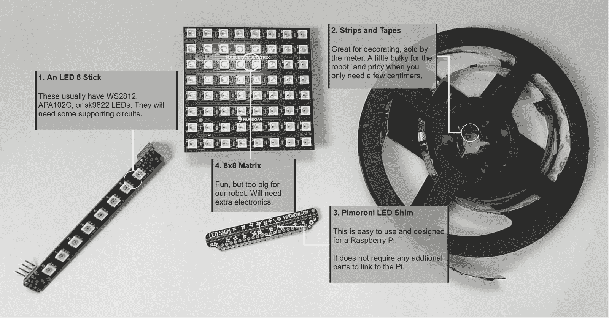
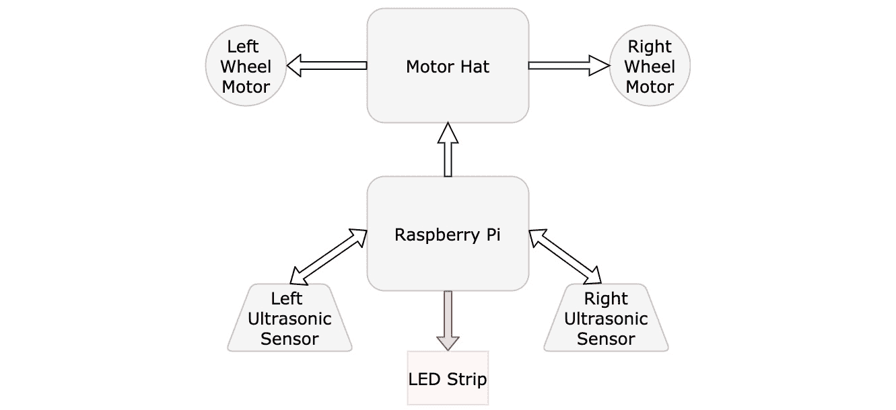
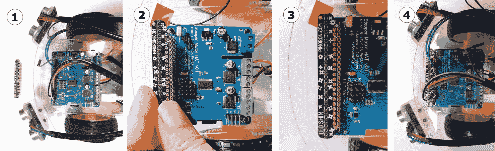
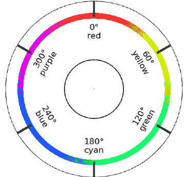
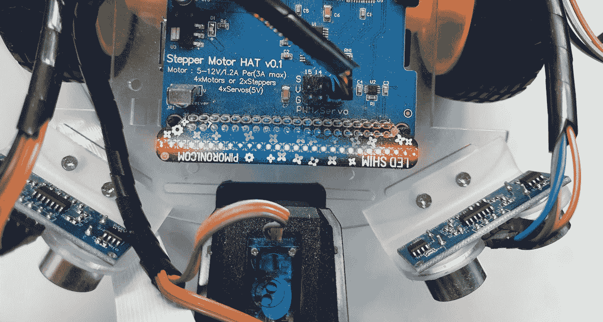

# **第9章**：在Python中编程RGB灯带

LED灯光可以与机器人一起使用，用于调试和提供反馈，以便机器人上运行的代码可以显示其状态。彩色RGB LED允许你混合光的红色、绿色和蓝色成分，以制作多种颜色，为机器人增添亮度和色彩。我们之前并没有过多关注使其看起来有趣，所以这次我们将专注于这一点。

通过混合不同的LED序列，可以实时传达信息。你可以使用它们的开关状态、亮度或颜色来表示信息。这种反馈比文本流更容易阅读，这有助于在机器人上添加传感器时。这也意味着机器人上的代码可以显示状态，而无需依赖SSH终端来完成。

在本章中，我们将学习以下内容：

+   什么是RGB灯带？

+   比较灯带技术

+   将灯带连接到Raspberry Pi

+   让机器人显示代码对象

+   使用灯带调试避障行为

+   使用LED制作彩虹显示

# 技术要求

要构建这个项目，你需要以下材料：

+   一台可以访问互联网并连接Wi-Fi的电脑

+   机器人、Raspberry Pi和上一章的代码

+   Pimoroni LED SHIM

本章的代码可在GitHub上找到：[https://github.com/PacktPublishing/Learn-Robotics-Fundamentals-of-Robotics-Programming-Second-Edition/blob/master/chapter9](https://github.com/PacktPublishing/Learn-Robotics-Fundamentals-of-Robotics-Programming-Second-Edition/blob/master/chapter9)。

查看以下链接中的视频，以查看代码的实际应用：[https://bit.ly/39vglXm](https://bit.ly/39vglXm)。

# 什么是RGB灯带？

使用灯光显示数据可以是一种简单而灵活的方式，将数据传递给用户，而无需连接完整的显示屏。例如，单个灯光可以打开或关闭，以指示机器人是否已开启或简单传感器的状态。多彩灯光可以改变颜色以显示更多细节，指示机器人处于几种不同的状态。在本章中，RGB代表红-绿-蓝，因此通过控制灯光中这些颜色通道的强度级别，可以显示多种颜色。我们将在“RGB值”部分稍后探讨这是如何发生的。

添加多个灯光可以显示更多数据。这些可以是灯带（一排灯光）、面板/矩阵、环形以及其他有趣的形状。

# 比较灯带技术

对于灯光和灯带，存在许多竞争技术。对于灯的类型，如旧灯泡这样的白炽灯，往往消耗大量电力，占用太多空间，在机器人中不实用。荧光灯，如厨房灯带或卷曲紧凑型灯，需要复杂的电源系统，也占用太多空间。电致发光线，也称为EL线，通常用于装饰物体，通过轮廓来装饰；它看起来很有趣，但控制起来很棘手。**发光二极管**（**LED**）技术功耗低，通常体积小，易于控制，这使得它非常适合我们这样的机器人。LED也很便宜。

在我们这个案例中，最有用的一种，我们将在本章中使用，是可寻址RGB LED。可寻址意味着条带中的每个单独的LED都可以设置为不同的颜色和亮度，从而在条带上形成颜色序列。为了简化，我们将使用一种内置控制器的类型。

*图9.1* 展示了我实验过的几种可寻址RGB LED配置类型：



图9.1 – 可寻址RGB LED的类型

所有这些LED控制器都接收一系列数据。一些类型，如Neopixel、WS2812、SK9822、APA102C、DotStar和2801类型，取它们需要的红、绿、蓝组件，然后将剩余的数据传递给下一个LED。设计师将这些LED排列成条带、环形或方形矩阵，将它们串联起来以利用它们传递数据的方式。LED灯带可以是刚性棒或卷轴上的柔性条带。对于我们的机器人来说，8个或更多的LED就能构成一个很好的显示屏。

还有一些完全不同的技术，例如Pimoroni的LED SHIM和彩色LED矩阵，使用移位寄存器。Pimoroni LED SHIM是LED灯带中最容易使用的一种（与Raspberry Pi一起使用）。它包含一个控制器（IS31FL3731），通过I2C数据总线进行控制。Pimoroni LED SHIM有24个LED，这已经足够满足我们的需求。它不需要额外的电源处理，并且也广泛可用。

我们机器人使用I2C数据总线来控制电机，它通过拥有不同的地址，愉快地与其他设备共享，例如LED SHIM。I2C指令以设备地址发送，后面跟着一个要写入的I2C寄存器和它的值。

由于其简单性和与我们的机器人的兼容性，我将继续本章，使用Pimoroni LED SHIM。这种产品在大多数国家都可以从Mouser Electronics、Pimoroni、Adafruit和SparkFun购买。

## RGB值

红色、绿色和蓝色可以混合成几乎任何颜色组合。系统用RGB值来表示这些颜色。RGB是您看到的几乎所有（如果不是所有）彩色显示屏所使用的相同原理。电视、移动电话和计算机屏幕都使用这个。多色LED使用相同的原理来产生多种颜色。代码通常指定混合每种颜色的数量，如下面的图所示：


图9.2 – RGB颜色空间 [SharkD / CC BY-SA (https://creativecommons.org/licenses/by-sa/3.0)]

*图9.2*中的图显示了RGB颜色立方体。它有箭头显示增加红色、绿色和蓝色各成分的轴。立方体的暴露表面显示了颜色组合在立方体内混合时的不同色调和强度。

底部前右角是蓝色，顶部前右角是青色（混合蓝色和绿色），底部前左角是紫色（混合红色和蓝色），底部远左角是红色（没有绿色或蓝色），顶部远左角是黄色（高红色和绿色，没有蓝色）。

随着每个值的增加，我们通过混合得到不同的颜色。顶部前左角将是三个中的最大值——白色。底部后右角将是三个中的最小值——黑色。裁剪图显示了以分数表示的强度颜色。

在我们的代码中，我们将使用从0（完全关闭）到255（全强度）的数字，中间的值表示许多级别的强度。颜色通过相加混合，所以将所有颜色在全亮度下相加得到白色。

虽然理论上这可以提供许多颜色，但在实践中，250和255之间的强度差异在大多数RGB LED上是不可辨别的。

您已经看到了一些LED技术以及如何混合它们颜色的信息。我们还决定使用哪种技术，即Pimoroni LED SHIM。由于我们将将其连接到我们的机器人上，请购买一个并在下一节回来。

# 将灯条连接到Raspberry Pi

在我们编写代码在LED SHIM上显示颜色序列之前，我们需要将其连接到我们机器人上的Raspberry Pi。完成本节后，机器人框图将看起来像*图9.3*：



图9.3 – 带有LED灯条的机器人框图

现在的框图显示了LED灯条连接到Raspberry Pi，其中有一个箭头指示从Raspberry Pi到灯条的信息流。灯条被突出显示为系统的新增部分。让我们看看它是如何工作的。

## 将LED灯条连接到机器人

Pimoroni LED SHIM很容易连接到Raspberry Pi。我们将其放在电机控制器上，带有其旁路引脚，这样我们就可以看到顶部的灯光。看看*图9.4*看看如何：



图9.4 – 安装LED

使用以下步骤用*图9.4*来安装条带：

1.  条带很小。将条带与从电机HAT顶部来的排针对齐。你需要拔掉已经插入Raspberry Pi的线来添加SHIM。

1.  较宽的部分应该从HAT上突出出来。轻轻地将SHIM推到引脚上，一开始只推一点，沿着条带工作，直到所有引脚都进入孔中——它稍微有点硬，但应该能抓牢。

1.  一旦所有引脚都插入，均匀地按下SHIM，使引脚大部分突出。

1.  现在，你需要更换电线。请参考[*第8章*](B15660_08_Final_ASB_ePub.xhtml#_idTextAnchor150)中的*图8.15*，*使用Python编程距离传感器*，以获取距离传感器的接线信息。

现在你已经连接了LED SHIM，这个机器人就准备好发光了。让我们来编程它。

# 使机器人显示代码对象

虽然我们是在围绕Pimoroni LED SHIM构建，但我们已经看到还有其他类型的RGB LED系统。由于我们可能稍后会用不同的系统替换SHIM，因此在LEDs上制作一个接口是个好主意。就像电机的接口一样，这可以解耦硬件处理和行为制作。

## 创建LED接口

那么，我们希望LEDs具有什么样的接口呢？首先，我们希望它们在机器上作为`robot.leds`可用。我们希望清除LEDs（将它们全部关闭），将每个单独的LED设置为不同的颜色，并将一组/范围的LED设置为颜色列表。

代码告诉我们有多少LEDs很有用，所以如果数量发生变化，动画或显示仍然有意义。

对于颜色，我们使用三个值——`r`、`g`和`b`——来表示红色、绿色和蓝色成分。Python有一个名为`color`的类型作为参数，这是一个`(r, g, b)`的元组。

条带上的LED是可寻址的，因此我们的代码使用从`0`开始的LED编号。

因此，从结构上讲，我们的代码从`robot.leds`开始。`leds`将是现有`robot`类的一个成员。它是一个具有以下成员的对象：

+   `set_one(led_number, color)`: 这将`led_number`处的单个LED设置为指定的颜色。

+   `set_range(led_range, color)`: 这将Python可迭代对象`led_range`定义的所有LED设置为`color`。Python可迭代对象可以是LED编号列表`[0, 3]`，或者可以使用`range`函数创建的范围。例如，`range(2,8)`创建列表`[2, 3, 4, 5, 6, 7]`。

+   `set_all(color)`: 这将所有LED设置为指定的颜色。

+   `clear()`: 这会将所有LED清除为黑色，将它们全部关闭。

+   `show()`: 所有其他方法都准备了一个显示，允许你设置LED的组合。直到你的代码调用此方法之前，LED设备上不会更新任何内容。此方法反映了大多数LED条带期望从一个数据流中设置所有LED的方式。

+   `count`: 这保存了条带中LED的数量。

记住前面的要点，让我们为LED SHIM编写这段代码：

1.  首先，我们需要安装LED SHIM库。因此，在Raspberry Pi上，输入以下内容：

    ```py
    pi@myrobot:~ $ pip3 install ledshim
    ```

1.  我们的代码必须首先导入此设置并设置设备。将以下代码放入`leds_led_shim.py`（以设备类型命名）：

    ```py
    import ledshim to set the device up.We have set up a property for the number of LEDs in our LED class, called `count`. This property can be read like a variable but is read-only, and our code can't accidentally overwrite it.  
    ```

1.  现在，我们创建与条带交互的方法。设置单个LED相当直接：

    ```py
    (r, g, b), the LED SHIM library expects them to be separate parameters. Python has a trick for expanding a tuple into a set of parameters by using an asterisk with the variable name. This expansion is what *color means on the second line.The LED SHIM code raises `KeyError` if the user attempts to set an LED out of range.
    ```

1.  设置多个LEDs在我们的代码中也是一个简单的包装器：

    ```py
        def set_range(self, led_range, color):
            ledshim.set_multiple_pixels(led_range, color)
    ```

1.  我们还希望有一种方法来设置所有的LEDs。此代码与设置单个LED的代码类似：

    ```py
        def set_all(self, color):
            ledshim.set_all(*color)
    ```

1.  让我们添加一个清除LEDs的方法：

    ```py
        def clear(self):
            ledshim.clear()
    ```

1.  最后，我们需要`show`代码，将我们配置的颜色发送到LEDs。Pimoroni LED SHIM库使得这个过程非常简单：

    ```py
        def show(self):
            ledshim.show()
    ```

我们已经安装了LED SHIM库，并为我们自己创建了一个接口。我们可以使用这个接口与LEDs通信，并且它被设计成可以替换为不同类型LED设备的兼容代码。现在，我们将这个LED接口在我们的`Robot`对象中可用。

## 将LEDs添加到Robot对象中

接下来，我们更新我们的`robot.py`文件以处理LED系统。为此，我们执行以下操作：

1.  首先，将`leds_led_shim`文件添加到导入中（新的代码用粗体表示）：

    ```py
    from Raspi_MotorHAT import Raspi_MotorHAT
    from gpiozero import DistanceSensor
    import atexit
    import leds_led_shim
    ```

1.  接下来，我们在`Robot`的构造函数（`init`）方法中添加SHIM的一个实例（新的代码用粗体表示）：

    ```py
    class Robot:
        def __init__(self, motorhat_addr=0x6f):
           # Setup the motorhat with the passed in address
           self._mh = Raspi_MotorHAT(addr=motorhat_addr)
           # get local variable for each motor
           self.left_motor = self._mh.getMotor(1)
           self.right_motor = self._mh.getMotor(2)
           # Setup The Distance Sensors
           self.left_distance_sensor = DistanceSensor(echo=17, trigger=27, queue_len=2)
            self.right_distance_sensor = DistanceSensor(echo=5, trigger=6, queue_len=2)
            # Setup the Leds
            self.leds = leds_led_shim.Leds()
    ```

1.  由于我们需要停止的不仅仅是电机，我们将在`atexit`调用中将`stop_motors`替换为新的`stop_all`方法，以停止其他设备（如LEDs）：

    ```py
            # ensure everything gets stopped when the code exits
            atexit.register(self.stop_all)
    ```

1.  创建`stop_all`方法，该方法停止电机并清除LEDs：

    ```py
        def stop_all(self):
            self.stop_motors()
            # Clear the display
            self.leds.clear()
            self.leds.show()
    ```

    重要提示

    完整的代码可以在[https://github.com/PacktPublishing/Learn-Robotics-Fundamentals-of-Robotics-Programming-Second-Edition/blob/master/chapter9](https://github.com/PacktPublishing/Learn-Robotics-Fundamentals-of-Robotics-Programming-Second-Edition/blob/master/chapter9)找到。

我们现在已将LED支持添加到`Robot`类中，使之前设计的接口可用，并确保在机器人代码退出时清除LEDs。接下来，我们将开始测试和打开LEDs。

## 测试一个LED

我们已经安装了一些硬件及其库，并添加了代码以使这些内容在我们的机器人中可用。然而，在我们继续之前，我们应该确保一切都能通过测试正常工作。这是一个找到任何问题并进行故障排除的好地方。

让我们尝试测试一个单个LED。我们还没有探索的一个关于我们的机器人运行Python的方面是它可以运行Python **REPL** – **读取、评估、打印循环**。这意味着你可以启动Python并立即输入要运行的代码。我们将使用这个来测试我们的LEDs：

1.  将`leds_led_shim.py`和`robot.py`代码复制到Raspberry Pi上。

1.  通过SSH连接到机器人，并输入`python3`。Raspberry Pi应该这样响应：

    ```py
    pi@myrobot:~ $ python3
    Python 3.7.3 (default, Apr  3 2019, 05:39:12) 
    [GCC 8.2.0] on linux
    Type "help", "copyright", "credits" or "license" for more information.
    >>>
    ```

1.  让我们准备好我们的`robot`库以便使用。输入以下粗体显示的部分：

    ```py
    >>> import robot
    >>> r = robot.Robot()
    ```

1.  现在，尝试打开一个LED，将其设置为红色：

    ```py
    >>> r.leds.set_one(0, (255, 0, 0))
    ```

1.  嗯 – 没有发生任何事情。记住，我们需要调用`leds.show`来显示我们的设置：

    ```py
    >>> r.leds.show()
    ```

    你现在应该看到一个红色的LED。

1.  让我们尝试将另一种颜色设置为紫色，通过混合红色和蓝色LED：

    ```py
    leds.show to send the colors to the LED device.
    ```

1.  要停止此会话，请在空行上按 *Ctrl* +*D*。`atexit` 代码会自动关闭所有LED。

现在，你应该已经看到LED工作并点亮成多种颜色。这表明到目前为止的代码是好的。如果不是，请参阅以下部分。如果一切正常，请跳到 *测试所有LED* 部分。

### 故障排除

如果你在尝试点亮LED时遇到问题，可以采取一些故障排除步骤。

如果运行代码出现错误，请执行以下操作：

+   确认你已经启用了I2C（如[*第7章*](B15660_07_Final_ASB_ePub.xhtml#_idTextAnchor131)，*驱动和转向 – 使用Python移动电机*所示）。

+   使用 `sudo i2cdetect -y 1`，如[*第7章*](B15660_07_Final_ASB_ePub.xhtml#_idTextAnchor131)，*驱动和转向 – 使用Python移动电机*所示。你应该看到地址为 `74` 的LED。

+   确认你已经使用 `pip3` 安装了 `ledshim` Python包。

+   仔细检查代码中的错误和错误。如果是GitHub上的代码，请创建一个问题！

如果LED根本不亮，请执行以下操作：

+   尝试运行SHIM附带示例代码，[https://github.com/pimoroni/led-shim/tree/master/examples](https://github.com/pimoroni/led-shim/tree/master/examples)。

+   确保你已按照 *图9.4* 所示正确安装LED。

+   确保你已均匀地将LED条推到引脚上。

+   你记得使用 `leds.show()` 吗？

通过遵循这些故障排除提示，你将消除这个系统中最常见的问题。你现在应该有一个工作的LED，并且能够进入下一节。

测试所有LED

现在，我们可以尝试使用 `set_all` 方法。我们将制作一些简单的在LED上闪烁几种不同颜色的东西。创建一个名为 `leds_test.py` 的文件：

1.  首先，我们需要导入。我们需要导入我们的 `R` 库和 `time` 来动画化：

    ```py
    from robot import Robot
    from time import sleep
    ```

1.  现在，让我们设置我们的机器人，以及一些命名颜色：

    ```py
    bot = Robot()
    red = (255, 0, 0)
    blue = (0, 0, 255)
    ```

1.  下一个部分是主循环。它交替两种颜色，使用 `sleep`：

    ```py
    set_all method to set all the LEDs to red and call the show method to send it to the device. The code uses sleep to wait for half a second, before switching to blue. Important noteThe complete code is at [https://github.com/PacktPublishing/Learn-Robotics-Fundamentals-of-Robotics-Programming-Second-Edition/blob/master/chapter8/leds_test.py](https://github.com/PacktPublishing/Learn-Robotics-Fundamentals-of-Robotics-Programming-Second-Edition/blob/master/chapter8/leds_test.py).
    ```

1.  当你将这些文件上传到Raspberry Pi后，输入以下命令以显示红/蓝交替LED显示：

    ```py
    pi@myrobot:~ $ python3 leds_test.py
    ```

1.  在终端中按 *Ctrl* + *C* 停止运行。

我们现在已经展示了所有LED都在工作。这也展示了它们在不同颜色之间切换，使用时间产生一个非常简单的动画。我们可以在此基础上构建，产生更多有趣的颜色和动画应用，但首先，我们将转向学习更多关于混合颜色的知识。

# 使用LED制作彩虹显示

现在，我们可以用这些做一些有趣的事情。我们将扩展上一章中的避障行为，以显示对应于读取距离的彩虹条形图。我们也可以用这个来传感。在我们将运动与动画链接之前，彩虹是如何形成的？

## 颜色系统

RGB是硬件期望的颜色。然而，RGB在表达中间颜色或创建它们之间的渐变时不太方便。在视觉上看起来接近的颜色在RGB中可能有点远。正因为如此，还有其他颜色系统。

我们使用的另一种颜色系统是**色调、饱和度和亮度**（**HSV**）。在本章中，我们使用HSV来制作彩虹型显示，并在后续章节中进行计算机视觉时，帮助我们的代码检测对象。

### 色调

想象将光谱的颜色放置在一个圆圈上，从红色到橙色，橙色到黄色，黄色到绿色，绿色到蓝色，蓝色到紫色，然后回到红色。**色调**表示这个圆圈上的一个点。它不影响颜色的亮度或其鲜艳程度。*图9.5*展示了我们如何在色轮上表示这些点：



图9.5 – 色调色轮

在*图9.5*中，圆圈显示在0度左右，可以看到红色色调。圆圈上的罗盘指针对应不同的颜色。当你从一个色调移动到另一个色调时，颜色会混合。你可能在一个绘画或绘图计算机程序的颜色轮装置中见过类似的东西。这种连续的轮状设置让我们能够制作彩虹。

### 饱和度

如果你选择一种颜色，比如红色，它可以是一种灰暗的/暗淡的红色，或者是一种鲜艳、强烈的红色。**饱和度**是颜色鲜艳程度的表达。当你接近零时，它只产生灰色调。当我们增加饱和度时，颜色开始出现——首先是淡色调，然后是海报色，然后是高饱和度尺度上的醒目的危险标志或纯色。

### 亮度

颜色的**亮度**是其亮度。它从0的黑色，通过到颜色的非常暗的版本，到一个非常亮的颜色。请注意，这并不接近白色（换句话说，粉红色），而是一个非常亮的红色。要制作白色，你还需要降低饱和度。其他颜色系统（如HSL）指定一个*光*成分，这样可以使事物变得白色。

### 将HSV转换为RGB

在一个颜色系统转换到另一个颜色系统之间有复杂的公式。然而，Python可以自己完成这种转换。

我们将使用`colorsys.hsv_to_rgb`来完成这种转换。它接受三个HSV成分作为介于0和1之间的分数，包括1。

在色调成分的情况下，0是圆圈的起点，0.5代表180度，半圆，而1是完全绕回到360度，即整个圆圈。

饱和度成分在0时为灰色，完全未饱和，而在1时为最鲜艳的颜色。

亮度成分在0时为黑色，完全黑暗，而在1时是最亮的——一个完全发光的颜色。

要制作明亮的青色，我们需要将色调移动到大约0.6的位置，饱和度为1.0，亮度也为1.0：

```py
cyan = colorsys.hsv_to_rgb(0.6, 1.0, 1.0)
```

然而，这还不够。`colorsys`调用的输出是一个元组，包含三个项目，用于R、G和B组件。

输出组件也是以0到1.0为单位的。大多数RGB系统期望值在0到255之间。为了使用它们，我们需要通过乘以它们将这些值转换回来：

```py
cyan_rgb = [int(c * 255) for c in cyan]
```

在上一行中，我们遍历每个组件`c`，并将其乘以255。通过在Python中用方括号将`for`循环放在那里，我们可以遍历元素，并将结果放回列表中。

现在你已经知道了如何将HSV值转换为RGB值，让我们使用这些信息来制作彩虹。

## 在LED上制作彩虹

我们可以利用我们对颜色系统的理解，在LED上制作彩虹：



图9.6 – 机器人上显示彩虹的LED

*图9.6*显示了在机器人上连接的LED上显示的彩虹。

让我们开始吧！创建一个名为`led_rainbow.py`的新文件：

```py
import colorsys
def show_rainbow(leds, led_range):
    led_range = list(led_range)
    hue_step = 1.0 / len(led_range)
    for index, led_address in enumerate(led_range):
        hue = hue_step * index
        rgb = colorsys.hsv_to_rgb(hue, 1.0, 0.6)
        rgb = [int(c*255) for c in rgb]
        leds.set_one(led_address, rgb)
```

让我们逐行分析这个文件：

+   这段代码首先导入`colorsys`。

+   我们定义了一个函数`show_rainbow`，它接受两个参数，一个指向我们的LED系统（这通常会被赋予`robot.leds`）和一个要设置的LED范围。

+   因为我们想知道我们的LED范围长度，所以我们需要确保它是一个列表，因此我们在函数的第一行进行了转换。

+   对于彩虹，色调值应该扫过一个完整的圆圈。在Python中，`colorsys`提供的是0到1的值。我们希望为范围中的每个LED前进一个分数步。通过将1.0除以范围中的LED数量，我们得到这个分数。

+   然后我们遍历LED。`enumerate`给我们一个索引，而`led_address`递增。这段代码对范围没有做出任何假设，因此它可以使用任意LED列表。

+   然后我们将`hue_step`和`index`相乘以给出`hue`值，这是使用1.0的正确分数。下一行将这个值转换为具有固定饱和度和亮度值的RGB值。

+   由于`colorsys`输出介于0和1之间的值，代码需要将这个值乘以255，并将结果数字转换为整数：`rgb = [int(c*255) for c in rgb]`。

+   代码使用`leds.set_one`方法与这个RGB值和LED地址一起使用。

让我们用名为`test_rainbow.py`的文件来测试这个：

```py
from time import sleep
from robot import Robot
from led_rainbow import show_rainbow
bot = Robot()
while True:
    print("on")
    show_rainbow(bot.leds, range(bot.leds.count))
    bot.leds.show()
    sleep(0.5)
    print("off")
    bot.leds.clear()
    bot.leds.show()
    sleep(0.5)
```

这与我们的之前的红蓝测试非常相似。然而，在第一部分，我们使用了`show_rainbow`函数，该函数是从`led_rainbow`模块导入的。它传递了机器人的LED，并创建了一个覆盖所有LED的范围。

代码等待半秒钟，然后清除LED半秒钟。这些都在循环中，以产生开/关彩虹效果。用`python3 test_rainbow.py`启动它，并在看到它工作后使用*Ctrl* + *C*停止它。

现在你已经看到了一些简单的动画和多色LED的使用，我们可以通过让LED对传感器做出反应来将这个提升到下一个层次。

# 使用灯带调试避障行为

彩虹中的LED很有趣，颜色切换看起来也很漂亮。然而，LED也可以用于实际目的。在[*第8章*](B15660_08_Final_ASB_ePub.xhtml#_idTextAnchor150)，“使用Python编程距离传感器”中，我们向我们的机器人添加了传感器以避免障碍物。你可以在PuTTY窗口中跟随操作，通过读取数字来查看传感器正在检测什么。但我们可以做得更好；有了灯光条，我们可以在机器人上放置信息，告诉我们它正在检测什么。

在本节中，我们将LED输出与行为值关联起来，首先是通过基本照明，然后是通过制作一些彩虹颜色。

## 将基本LED添加到避免行为中

在我们变得花哨并重新引入彩虹之前，让我们先从基本版本开始。这里的意图是制作两个位于LED条左右两侧的*指示*条。对于每条条，当相应的距离传感器检测到更近的障碍物时，更多的LED将被点亮。我们将使这些条进入中间，这样当单个外部的LED被点亮时，障碍物就远离。当一侧的大多数或所有LED都被点亮时，障碍物就非常接近。

我们需要向我们的避免行为添加一些部分：

+   一些用于设置LED显示的变量，以及我们的距离如何映射到它

+   一种将距离转换为要显示的LED数量的方法

+   使用前面提到的项目在LED上显示我们传感器状态的方法

+   从行为的主循环中调用`display_state`方法

让我们看看如何结合前面的要点。打开你在[*第8章*](B15660_08_Final_ASB_ePub.xhtml#_idTextAnchor150)，“使用Python编程距离传感器”中制作的`avoid_behavior.py`文件，并跟随操作：

1.  在我们可以在这种行为中使用LED之前，我们需要将它们分开成条。在`ObstacleAvoidingBehavior`的`__init__`方法中添加以下内容：

    ```py
            # Calculations for the LEDs
            self.led_half = int(self.robot.leds.leds_count/2)
    ```

1.  接下来，我们需要为感应时的LED选择一种颜色。我选择了红色。我鼓励你尝试另一种颜色：

    ```py
            self.sense_colour = 255, 0, 0
    ```

1.  在设置好变量之后，让我们添加一个将距离转换为LED的方法。我在`__init__`方法之后添加了这个方法：

    ```py
        def distance_to_led_bar(self, distance):
    ```

1.  距离是以米为单位的，1.0代表1米，所以从1.0减去距离会反转这个值。`max`函数将返回两个值中的较大值，在这里它被用来确保我们不会低于零：

    ```py
    # Invert so closer means more LED's. 
            inverted = max(0, 1.0 - distance)
    ```

1.  现在，我们将这个数字乘以0到1之间的某个分数，乘以`self.led_half`的值，以得到要使用的LED数量。我们将其向上取整，并用`int(round())`将其转换为整数，因为我们只能打开整数的LED。向上取整意味着在我们的乘法之后，如果我们得到一个如3.8这样的值，我们将它向上取整到4.0，然后将其转换为整数以点亮四个LED。我们给这个数加1，这样至少总有一个LED被点亮，然后返回它：

    ```py
            led_bar = int(round(inverted * self.led_half))
            return led_bar
    ```

1.  下一个方法是一个更复杂的方法；它将创建两个条。让我们首先声明该方法并清除LED：

    ```py
        def display_state(self, left_distance, right_distance):
            # Clear first
            self.robot.leds.clear()
    ```

1.  对于左侧条形，我们将左侧传感器的距离转换为LED数量，然后创建一个从0到这个数量的范围。它使用`set_range`方法将一组LED设置为`sense_color`。请注意，你的LED可能方向相反，在这种情况下，在这个`display`方法中交换`left_distance`和`right_distance`：

    ```py
            # Left side
            led_bar = self.distance_to_led_bar(left_distance)
            self.robot.leds.set_range(range(led_bar), self.sense_colour)
    ```

1.  右侧稍微复杂一些；在转换为LED数量后，我们需要为LED创建一个范围。变量`led_bar`保存要点亮的LED数量。为了点亮条形的右侧，我们需要从这个LED数量中减去，以找到第一个LED，并从那里创建一个到总长度的范围。我们必须从长度中减去1 – 否则它将多计算1个LED：

    ```py
            # Right side
            led_bar = self.distance_to_led_bar(right_distance)
            # Bit trickier - must go from below the leds count up to the leds count.
            start = (self.robot.leds.count – 1) - led_bar
            self.robot.leds.set_range(range(start, self.robot.leds.count - 1), self.sense_colour)
    ```

1.  接下来，我们想要展示我们现在制作的显示：

    ```py
            # Now show this display
            self.robot.leds.show()
    ```

1.  然后，我们在行为中的`run`方法内部调用`display_state`来在LED上显示我们的读数。这里有一些上下文中的几行，其中额外的一行被突出显示：

    ```py
                # Get the sensor readings in meters
                left_distance = self.robot.left_distance_sensor.distance
                right_distance = self.robot.right_distance_sensor.distance
                # Display this
                self.display_state(left_distance, right_distance)
                # Get speeds for motors from distances
                nearest_speed, furthest_speed, delay = self.get_speeds(min(left_distance, right_distance))
    ```

保存此代码，将其发送到Raspberry Pi并运行。当它在运行时，你应该能够看到LED根据距离点亮成条形。这既令人满意，也很好地感受到了机器人正在检测的内容。让我们通过添加彩虹让它更有趣。

## 添加彩虹

我们可以使用我们的LED彩虹灯来让我们的距离感应演示变得更加有趣：


图9.7 – 距离传感器彩虹条

*图9.7*显示了每个距离传感器的彩虹条的照片。这是一个很好的LED动画视觉演示。

由于我们添加了一个用于显示彩虹的库，我们可以在这里重用它。让我们看看如何做：

1.  打开上一节中的`avoid_behaviour.py`代码。

1.  在顶部，导入`led_rainbow`以便我们可以使用它：

    ```py
    from robot import Robot
    from time import sleep
    from led_rainbow import show_rainbow
    ```

1.  我们现有的代码显示了左侧的条形。在这里，我们不需要条形，而是显示一个彩虹。我们需要确保至少有一个项目：

    ```py
         # Left side
         led_bar = self.distance_to_led_bar(left_distance)
         show_rainbow(self.robot.leds, range(led_bar))
    ```

1.  再次，右侧将稍微复杂一些；因为我们想让彩虹朝相反方向延伸，所以我们需要让彩虹的范围也倒计数。Python的`range`函数，连同`start`和`end`参数，还有一个步长参数。通过将步长设置为-1，我们可以在范围内倒计数：

    ```py
            start = (self.robot.leds.count – 1) - led_bar
            right_range = range(self.robot.leds.count - 1, start, -1)
            show_rainbow(self.robot.leds, right_range)
    ```

1.  上传此代码并运行它，条形图将显示彩虹颜色而不是纯色。

你已经从单个LED变成了多个LED。通过一些对颜色系统的处理，我们能够生成彩虹并使用它来显示行为的状态。

# 摘要

在本章中，你学习了如何与RGB LED交互和使用，以及如何选择和购买与Raspberry Pi兼容的RGB LED灯带。你学习了如何为机器人上的LED编写代码，使用它们与机器人行为结合。你还看到了HSV颜色系统是如何工作的，它可以用来生成彩虹。

你可以将这里使用的技术用于向机器人添加基于LED的状态显示，并编写将它们与行为链接的代码。

在下一章中，我们将探讨伺服电机并构建一个用于移动传感器的云台机构。

# 练习

1.  尝试混合不同的RGB颜色，或者查找一种颜色，并使用`set_one`，`set_all`或`set_range`来点亮该颜色的LED。

1.  使用`show_left_rainbow`和`show_right_rainbow`函数，在`behaviour_path`代码中使机器人转向时点亮对应侧的彩虹。

1.  通过创建一个计时器循环并递增索引或改变范围，可以动画显示彩虹或使它们在LED条上*扫描*。试试这个方法。

1.  HSV颜色模型的其他部分能否用来制作亮度变化的闪烁LED灯带？

# 进一步阅读

请参考以下内容获取更多信息：

+   *《通过探索学习电子学》*，*查尔斯·普拉特*，*Make Community, LLC*：我刚刚开始用开关和面包板介绍一些基本的电子学知识。要真正感受电子学的魅力，*《通过探索学习电子学》*是一本极好的入门书籍。

+   对于更高级的电子学，尝试阅读*《发明者实用电子学，第四版》*，*保罗·舍尔茨*，*西蒙·蒙克*，*麦格劳-希尔教育TAB*：这本书提供了电子学的实用构建块，可以用来将机器人控制器与几乎任何设备接口或构建新的传感器。

+   `colorsys`库，像大多数Python核心库一样，有一个很好的参考：[https://docs.python.org/3/library/colorsys.html](https://docs.python.org/3/library/colorsys.html)。

+   Pimoroni有一些使用LED SHIM的演示，可以在[https://github.com/pimoroni/led-shim/tree/master/examples](https://github.com/pimoroni/led-shim/tree/master/examples)找到。这些可能很有趣，可以改编到我们的LED层。
