# *第11章*：使用Python编程编码器

在机器人技术中，感知电机轴和轮子的运动是有用的。我们曾在[*第7章*](B15660_07_Final_ASB_ePub.xhtml#_idTextAnchor131)中让机器人沿着路径行驶，*使用Python驱动和转向——移动电机*，但机器人不太可能一直保持在轨道上。检测这一点并行驶特定距离对于创建行为是有用的。本章将探讨传感器的选择，以及如何编程机器人以直线行驶和行驶特定距离。然后我们来看看如何进行特定的转弯。请注意，本章确实包含数学内容。但别担心，你会轻松跟上。 

在本章中，你将学习以下主题：

+   使用编码器测量行驶的距离

+   将编码器连接到机器人上

+   在Python中检测行驶的距离

+   在直线上驾驶

+   驾驶特定距离

+   进行特定的转弯

# 技术要求

在我们开始之前，请确保你拥有以下部件：

+   Raspberry Pi机器人和上一章的代码：[https://github.com/PacktPublishing/Learn-Robotics-Programming-Second-Edition/tree/master/chapter10](https://github.com/PacktPublishing/Learn-Robotics-Programming-Second-Edition/tree/master/chapter10)。

+   两个带槽的速度传感器编码器。搜索带槽速度传感器、Arduino速度传感器、LM393速度传感器或光电中断传感器模块。包含术语*3.3 V*以确保其兼容性。参见*我们使用的编码器*部分中的图片。

+   长的公对母跳线。

+   使用直尺来测量你机器人轮子的尺寸——或者更好的是，如果你能使用的话，使用卡尺。

本章的代码可在GitHub上找到：[https://github.com/PacktPublishing/Learn-Robotics-Programming-Second-Edition/tree/master/chapter11](https://github.com/PacktPublishing/Learn-Robotics-Programming-Second-Edition/tree/master/chapter11)。

查看以下视频以查看代码的实际运行效果：[https://bit.ly/2XDFae0](https://bit.ly/2XDFae0)

# 使用编码器测量行驶的距离

**编码器**是随部件运动而改变值的传感器。它们检测轴的位置或轴旋转的次数。这些可以是旋转的或沿直线轨道感应的。

感知某物行驶的距离也被称为**里程计**，这些传感器也可以称为**转速表**，或简称**转速计**。在*技术要求*部分建议的传感器也可能在搜索中显示为**Arduino转速计**。

## 机器使用编码器的位置

我们的机器人使用电子传感器。汽车和大型商用车辆使用电子或机械传感器作为速度表和转速表。

打印机和扫描仪将编码器与直流电机结合使用，作为步进电机的替代品。感应机器人转动过的弧度是伺服机构的一个基本组成部分，我们在[*第10章*](B15660_10_Final_ASB_ePub.xhtml#_idTextAnchor192)中看到了它，*使用Python控制伺服电机*。高端音频或电气测试/测量系统在控制旋钮中使用这些。这些是自包含的模块，看起来像音量旋钮，但用户可以无限旋转它们。

在对编码器有基本了解之后，现在让我们来看看它们的一些类型。

## 编码器的类型

*图11.1*显示了四种不同的编码器传感器，每个传感器都使用不同的机制来测量运动（1–3），以及面板4中的编码器轮和条：

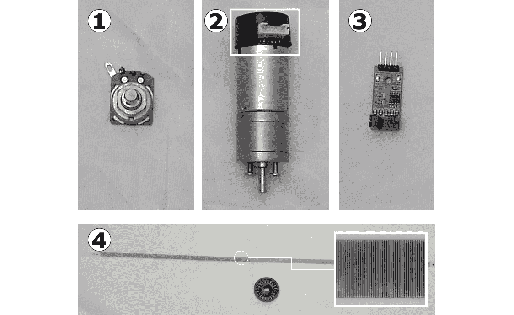

图11.1 – 编码器传感器

这些传感器分为几个类别，如图11.1所示，并对应以下要点：

1.  这是一个**可变电阻器**。这些模拟设备可以测量转动，但通常不允许连续旋转。它们在金属或电阻轨道上有机械刷，可能会磨损。这严格来说不是一个编码器，但很方便。在Raspberry Pi上，它们需要模拟到数字转换，所以不适合这个应用。伺服电机也使用这些。

1.  这台电机包括由白色框突出的磁感应编码器，称为**霍尔效应传感器**。轮或条上的磁铁在传感器旁边通过，导致传感器值高低变化。

1.  这是一个标准的光学传感器。使用带有红外光束通过的槽，它们感应光束被中断。计算机轨迹球、打印机和机器人使用这些。这些产生一系列脉冲。由于光束被中断，我们称它们为**光断路器**、**光学编码器**或**光电断路器**。我们将使用这种类型。

1.  这显示了用于光学传感器的槽轮和槽条。带状条适合线性编码，而轮适合编码转动。它们都有透明和不透明部分。人们使用光传感器和光/暗单元来制作变体，但这些比较少见。

看过一些编码器的类型后，让我们更仔细地看看它们是如何表示速度和运动的。

## 编码绝对或相对位置

**相对编码器**可以编码位置的变化量 – 例如，我们顺时针或逆时针移动了一定数量的步数，或者沿着一个轴向前/向后移动，例如。它们只能通过计数通过的槽的数量来测量相对于上次测量的位置。这些也可以称为**增量编码器**。它们在硬件上既便宜又简单。相对编码器的限制在于它们记住前一个位置以创建下一个，并累积错误。

另一种类型是**绝对编码器**。这些可以沿或围绕轴编码位置到精确的位置。绝对编码器不需要有关先前位置的信息，但可能需要校准以确定编码如何与实际世界位置匹配。

以下图示展示了不同类型之间的比较：

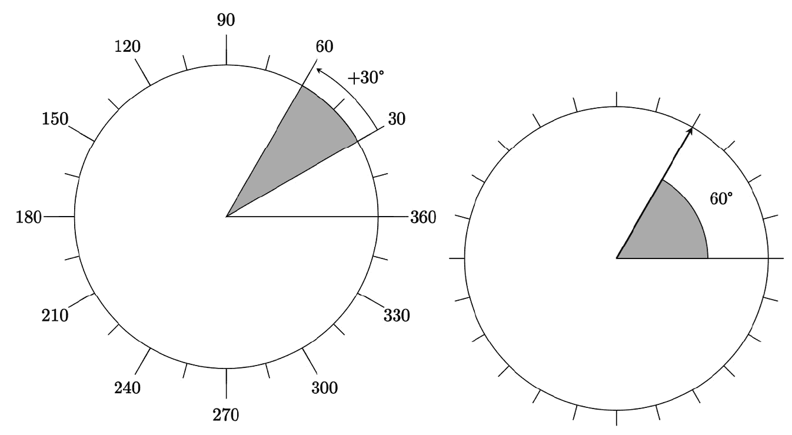

图11.2 – 比较绝对和相对传感

*图11.2*中的图示说明了这种差异。左边的圆圈代表从记忆中的30度位置移动了30度。这

的工作原理，假设原始记忆中的位置是准确的。每次测量时，都会测量一个移动。右边的圆圈显示了从零点60度的位置。如果一个传感器可以告诉你某物在哪里，那么它是绝对的。如果你可以告诉你它移动了多少，那么它是相对的。

在粗略的形式中，可变电阻也可以是绝对编码器，如用于伺服电机以感知其位置的编码器。绝对位置编码可以通过轮或条上的光学或磁性标记来完成，从而实现绝对定位的极高精度。这些传感器可能体积庞大或昂贵，或需要许多输入。绝对编码器条或轮也被称为刻度尺。

## 编码方向和速度

基本相对编码衡量传感器通过的轮槽数量。这给出了速度和距离。通过使用稍微分开的两个传感器，你还可以编码方向。*图11.3*展示了这是如何工作的：

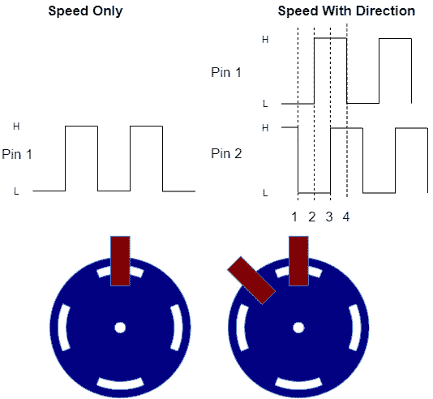

图11.3 – 使用多个传感器编码速度和方向

左边的系统编码速度。当槽通过传感器时，它们会产生电子脉冲。每个脉冲都有一个**上升**沿，它上升，以及一个**下降**沿，它下降。为了计数脉冲数，我们可以计数这些边缘。如果你用一个有方向的系统驱动电机，你可以使用像这样的单个传感器系统，正如我们将在我们的机器人中做的那样。

右边的轮通过添加第二个传感器来编码方向。槽边缘将在周期中的不同点改变传感器值，我们将其标记为**1**、**2**、**3**、**4**。序列的方向指示轮的方向，以及其速度。由于有四个相位，这被称为正交编码。

工业机器人使用**记录和回放**接口。用户会按下记录按钮，推动一个机器人，例如一个手臂，通过一系列动作，然后按下停止按钮。用户已经记录了这一系列动作，他们可以要求机器人回放这些动作。

要构建具有这种记录和回放系统的机器人，或鼠标/轨迹球，方向是必要的信息，因此需要额外的复杂性来编码方向。

在我们的机器人中，我们将使用更便宜、更简单的选项，使用单个传感器仅测量相对速度。在我们的代码中，我们将假设每个车轮的速度传感器是按照我们驾驶的方向移动的。

## 我们使用的编码器

我们将在[*第6章*](B15660_06_Final_ASB_ePub.xhtml#_idTextAnchor096)“构建机器人基础 – 轮子、电源和布线”中添加的编码器轮上使用光学编码器，这些编码器轮的形状正好适合我们添加的编码器轮上方。这些编码器有数字输出，我们可以通过Python从它们计数脉冲来感知轮子转动的距离。*图11.4* 显示了我推荐的两类传感器：

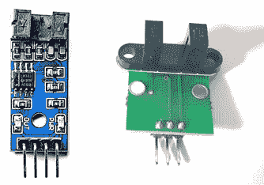

图11.4 – 我们推荐的传感器类型

左边是FC-03光电中断模块，右边是Waveshare光电中断模块。具有3.3 V供电电压规范的模块是合适的。使用仅5 V的模块将需要电平转换器和额外的布线，如[*第8章*](B15660_08_Final_ASB_ePub.xhtml#_idTextAnchor150)“使用Python编程距离传感器”中所述。

我们将使用安装在电机轴上的编码器轮。这些轮子与车轮对齐。如果编码器轮的转速与车轮不同，我们需要考虑这一点。有一些条件它们无法考虑，例如打滑，以及车轮和轮胎的大小。安装在单独的惰轮上的编码器可以提供更好的数据，但它们连接到机器人并保持与地面的接触会更复杂。

现在，你已经看到了编码器能做什么，通过计算轮子转动的次数来确定你走了多远，你也看到了一些编码器的类型以及应该购买哪种（3.3 V）。你还快速地了解了它们是如何通过计数脉冲来工作的。在下一节中，我们将把它们集成到机器人中。

# 将编码器连接到机器人

我们的机器人现在变得相当忙碌，我们的树莓派位于编码器槽口之上。由于槽口位于树莓派下方，我们应该在将树莓派放回之前稍微提前布线。在拧紧树莓派后，我们将编码器连接到其GPIO，以及电源和地线。

*图11.5* 展示了在连接编码器后机器人的框图：

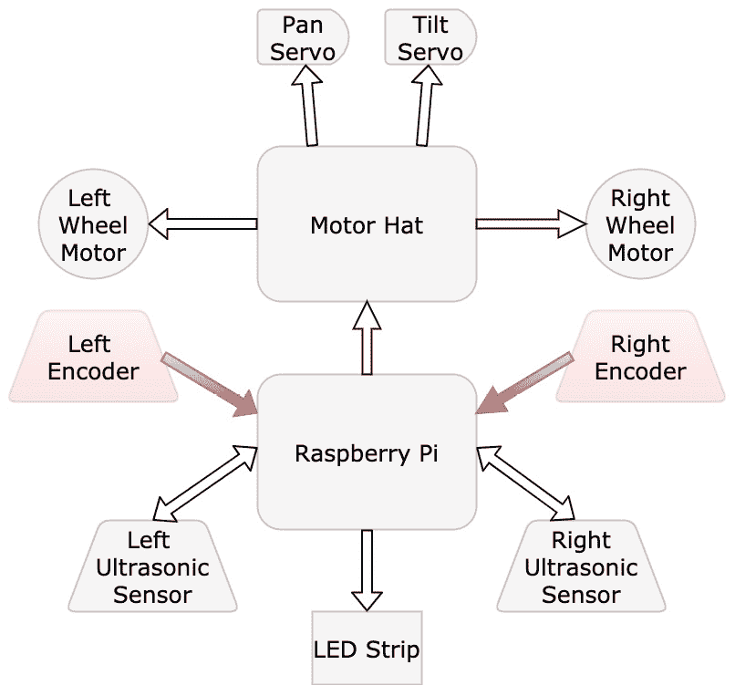

图11.5 – 带有编码器的机器人框图

这个框图添加了一个左编码器和右编码器，每个编码器都有一个箭头表示信息流，将它们连接到树莓派。突出显示的元素是新的。

在我们开始更改机器人和使其更难观察之前，我们需要知道编码器轮的槽口数量，以备后用：


图11.6 – 编码器轮

我展示在 *图11.6* 中的编码器轮最终有20个槽口。确保你使用你的编码器轮的槽口数量。

## 准备编码器

在我们能够使用编码器传感器之前，我们需要准备并安装它们。由于编码器将放在树莓派下方，我们现在应该将公对母跳线连接到传感器上。我建议用一小段绝缘胶带覆盖树莓派下方的任何突出来的电气接触点：


图11.7 – 带有电缆连接的传感器

显著的是，电缆应插入到图11.7所示的接地（**GND**）、电压（**3 V**、**Vin**或**VCC**）和数字输出（**D0**/**OUT**）。如果存在，不要连接模拟输出（**A0**）引脚。如果可能，接地引脚应具有最深的颜色，或电压应是最浅的颜色。为了帮助保持清晰，我建议在信号线的末端缠绕一小段绝缘胶带。

重要提示

由于这些传感器的引脚配置可能不同，在将传感器放在树莓派下方之前，先拍一张传感器引脚标签的参考照片。

## 抬起树莓派

编码器传感器需要放在树莓派下方，因此需要轻轻地抬起树莓派（不要弄断电线）以适应它们。图11.8中的照片序列显示了如何抬起它：

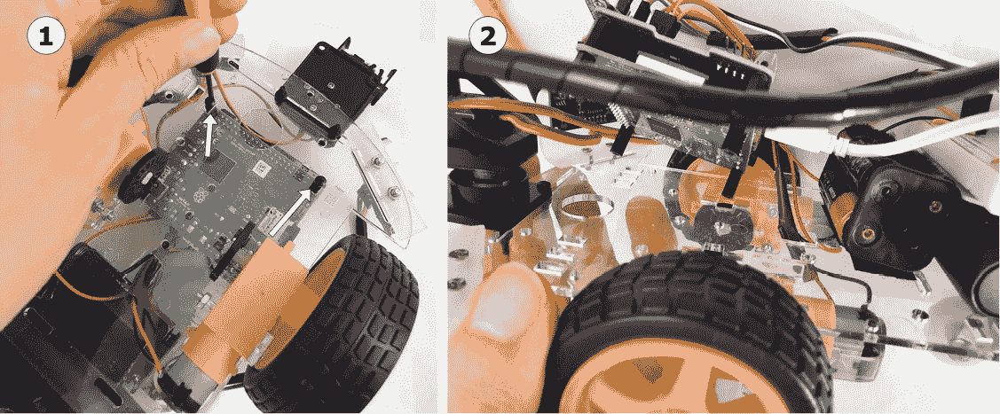

图11.8 – 拧下并抬起树莓派

参考图11.8并执行以下步骤：

1.  您需要小心地拧下固定树莓派到底盘的螺栓。将螺丝放在一边，以便在机器人上更换树莓派，这样它可以轻轻地抬起。

1.  轻轻地将树莓派从机器人上抬起，不要弄断电线。照片显示了您的机器人应有的样子。

太好了！现在树莓派已经抬起，下面有空间安装编码器。

## 将编码器安装到底盘上

现在您已经连接了编码器，可以将它们安装到机器人底盘上。作为指导，图11.9显示了一个裸露的底盘，每种类型的传感器都已安装到位，以显示您应该将其推入的位置：

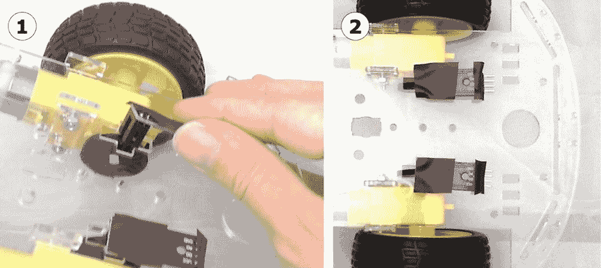

图11.9 – 安装编码器传感器

参考图11.9并完成以下步骤：

1.  轻轻地将编码器推入编码器轮周围的槽中。

1.  传感器应该摩擦地装入编码器轮子上的槽中，并保持在原位。

一旦这些安装到位，您就可以拧上螺丝，将树莓派固定到底盘上。您可能需要不同尺寸的垫圈来适应它。

重要提示

在此阶段，检查所有连接是否都已恢复原位。电机电线可能已经松动了。

在将编码器安装好并将树莓派放回原位后，您就可以开始连接电线了。

## 将编码器连接到树莓派的电线

我们现在可以使用面包板开始为传感器制作电线连接。我们将使用电路图来指导我们的连接。

*图11.10*显示了这些传感器的连接：

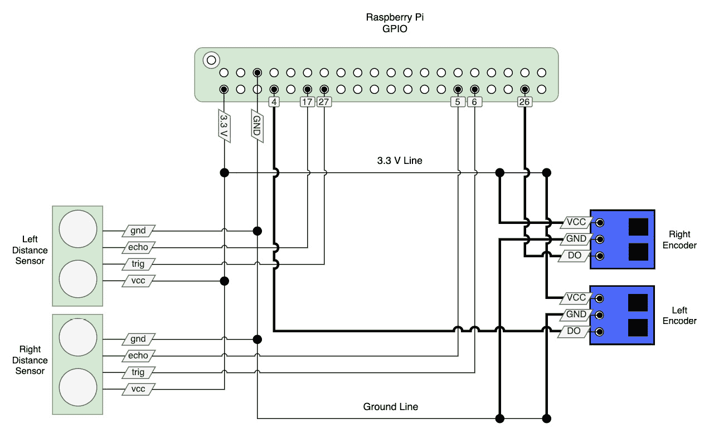

图11.10 – 将编码器连接到树莓皮的电路

*图11.10*显示了将编码器连接到树莓派的电路。这个图表是从[*第8章*](B15660_08_Final_ASB_ePub.xhtml#_idTextAnchor150)中看到的电路继续的，*使用Python编程距离传感器*。新的连接有更粗的电线。

在*图11.10*的右侧是左右编码器模块。传感器将有一个**VCC**、**VIN**、**3 V**或仅**V**标签。将其连接到3.3 V线。找到标记为**GND**、**0V**或仅**G**的GND引脚，并将其连接到面包板上的黑色/蓝色带。编码器还有一个标记为**DO**（数字输出）、**SIG**（信号）或仅**S**的引脚，连接到用于数字信号的GPIO引脚。我们将传感器的数字输出连接到GPIO引脚4（左侧编码器）和26（右侧编码器）。

一些编码器传感器有额外的连接，例如**模拟输出**（**AO**），我们不会使用它，并将其保持未连接状态。

让我们执行以下步骤：

1.  将传感器的引脚连接到面包板上。注意传感器的标签——有些有不同的引脚顺序。

1.  将树莓派的GPIO引脚4和26连接到面包板上。

1.  使用预切割的电线制作面包板的电源连接。

    重要提示

    这个机器人上的线对线点数使得添加新的连接或维修变得困难。尽管这超出了本书的范围，但制作定制的**印刷电路板**（**PCBs**）可以使这堆电缆变得整洁得多。PCBs也更坚固，占用的空间更小。然而，改变它却要付出代价。

有可能通过跳过面包板，将传感器直接连接到树莓派；然而，面包板有助于分配电源连接并分组传感器连接。

我们在这个繁忙的机器人和其他连接的上下文中制作这个电路。如果传感器到机器人的电缆不够长，请使用一套额外的公对母电缆，使用与[*第10章*](B15660_10_Final_ASB_ePub.xhtml#_idTextAnchor192)中看到的超声波扫描相同的技巧。

在本节中，你已经学会了如何连接传感器，并使它们准备好编程。在下一节中，我们将编写一些代码来测试这些传感器，然后测量距离。

# 在Python中检测行驶的距离

使用编码器传感器设备需要我们计数脉冲。在本节中，我们将创建代码来打开电机并计数一段时间内的脉冲。代码验证传感器是否正确连接。然后我们将此代码作为行为集成到机器人类中。

## 介绍日志记录

到目前为止，在我们的Python代码中，我们一直在使用`print`来输出信息，以查看我们的机器人正在做什么。这没问题，但如果打印出我们可能想要检查的所有内容，打印可能会变得令人难以承受。日志记录允许我们仍然显示信息，但我们可以控制显示多少。通过导入`logging`模块，我们可以利用这一点。

首先，有日志级别，包括`debug`、`info`、`warning`和`error`。在修复问题或最初开发时，`debug`很有用——它可以显示一切——而`info`则用于显示比这少一点。`warning`和`error`级别仅保留用于那些类型的问题，因此当您对某些代码有相当信心时，您可以仅过滤到这个级别。`logging.basicConfig`函数允许我们配置日志级别和其他日志参数；您需要配置日志记录以启用`info`和`debug`日志。

您可以使用日志记录做的另一件事是使用`logging.getLogger`函数使用不同命名的记录器。这允许您为不同的模块设置不同的级别。使用命名记录器有助于在您使用的库模块中启用`debug`，同时在主模块上保持`info`。

在本章的代码中，我们将开始使用日志记录和控制日志级别，以获取更多关于示例正在做什么的详细信息，可以随意打开和关闭部分。当我们介绍PID控制器时，这确实非常有用。我们可以在下一节中使用此日志记录来显示传感器脉冲计数。

## 简单计数

此代码计算每个轮子的信号引脚上升和下降的周期数，并在测试传感器时打印计数。运行此代码可以验证我们的传感器连接是否正常工作，让我们进行故障排除并继续前进。它还为跟踪轮子运动奠定了代码基础。我们运行电机大约1秒钟。请注意，此代码假设您是从[*第10章*](B15660_10_Final_ASB_ePub.xhtml#_idTextAnchor192)的代码开始的，即*使用Python控制伺服电机*：

重要提示

您可以在[https://github.com/PacktPublishing/Learn-Robotics-Programming-Second-Edition/blob/master/chapter11/test_encoders.py](https://github.com/PacktPublishing/Learn-Robotics-Programming-Second-Edition/blob/master/chapter11/test_encoders.py)找到以下代码。

1.  让我们创建一个名为`test_encoders.py`的文件，从常用的机器人类、`import`和`time`开始，并添加日志记录：

    ```py
    from robot import Robot
    import time
    import logging
    ...
    ```

1.  接下来，我们为GPIO Zero输入设备添加一个导入。我们可以使用它设置的引脚来计数脉冲：

    ```py
    ...
    from gpiozero import DigitalInputDevice
    logger = logging.getLogger("test_encoders")
    ...
    ```

    我们还设置了一个与文件名匹配的系统日志记录器。

1.  编码器生成脉冲；我们想要计数它们并跟踪它们的状态。我们使用多个它们。从一开始就创建一个类似乎是一个正确的策略。从这里，我们可以将我们的I/O引脚号传递给构造函数。它需要做的第一件事是设置脉冲计数器：

    ```py
    ...
    class EncoderCounter(object):
        def __init__(self, pin_number):
            self.pulse_count = 0
            ...
    ```

1.  仍然在构造函数中，我们需要设置设备和如何使用它来计数脉冲。设备有一个`.pin`对象，我们使用引脚号来设置它。`.pin`有一个`when_changed`事件，我们可以将处理程序放入其中，以便每次引脚改变时都会调用它。对于每个槽，引脚从上到下（上升和下降）变化：

    ```py
          ...
          self.device = DigitalInputDevice(pin=pin_number)
          self.device.pin.when_changed = self.when_changed
      ...
    ```

1.  我们需要为我们的类定义一个`when_changed`方法来将一个值添加到`pulse_count`。此方法必须尽可能小/快，因为GPIO Zero在后台为每次脉冲变化调用它。它需要一个`time_ticks`参数和一个`state`参数。我们不会使用`time_ticks`，所以用下划线标记：

    ```py
        ...
        def when_changed(self, _, state):
            self.pulse_count += 1
    ...
    ```

1.  我们可以设置我们的`robot`对象并为每侧的传感器创建一个`EncoderCounter`。我们将设备连接到引脚`4`和`26`：

    ```py
    ...
    bot = Robot()
    left_encoder = EncoderCounter(4)
    right_encoder = EncoderCounter(26)
    ...
    ```

1.  要显示值，而不是仅仅使用`sleep`，我们循环，检查结束时间。在我们记录任何内容之前，`logging.basicConfig`设置日志参数。我们启动电机并进入主循环：

    ```py
    ...
    stop_at_time = time.time() + 1
    logging.basicConfig(level=logging.INFO)
    bot.set_left(90)
    bot.set_right(90)
    while time.time() < stop_at_time:
        ...
    ```

    在这个循环中，我们记录了两个传感器的读数。

1.  由于紧密循环可能会导致事物损坏（例如GPIO Zero从传感器线程调用我们的代码），它应该稍微休眠一下：

    ```py
    f prefix lets us format variables into a string.
    ```

您可以将此代码发送到机器人并运行它。现在您可以看到机器人通过编码器的值偏斜。输出应该看起来有点像这样：

```py
pi@myrobot:~ $ python3 test_encoders.py
INFO:test_encoders:Left: 0 Right: 0
INFO:test_encoders:Left: 0 Right: 1
INFO:test_encoders:Left: 2 Right: 2
INFO:test_encoders:Left: 3 Right: 4
INFO:test_encoders:Left: 5 Right: 7
INFO:test_encoders:Left: 8 Right: 10
INFO:test_encoders:Left: 10 Right: 14
...
INFO:test_encoders:Left: 56 Right: 74
```

编码器正在计数，这表明机器人左轮移动较少，右轮移动较多，并向左偏斜。`INFO:test_encoders:`部分是由日志引入的，显示日志级别和记录器名称。距离是以编码器*脉冲*计算的，每个计数事件为一个脉冲。

您现在已经尝试了这段代码，但如果您有任何问题，请参考故障排除部分。

### 故障排除

如果在运行此代码时遇到问题，请尝试以下步骤：

+   确保您从[*第10章*](B15660_10_Final_ASB_ePub.xhtml#_idTextAnchor192)，*使用Python控制伺服电机*的代码开始。如果您从当前章节下载了代码，您可能会看到与编码器已设置的代码的GPIO冲突。

+   如果编码器值保持在零，请关闭Raspberry Pi，然后返回并仔细检查您的布线和引脚编号使用情况。

+   检查您的布线 - 如果有任何东西过热，请立即断开电源并验证您的布线。

您已经在机器人上测试了编码器，看到它们移动时屏幕上的反馈。这表明它们在添加到`Robot`对象后可以用于更有趣的机器人行为。

## 将编码器添加到`Robot`对象中

要在其他代码或行为中使用此传感器，我们应该将其移动到`Robot`对象中。然后我们可以将我们的代码导入到`Robot`对象中，并使用正确的引脚设置两个侧面。您还需要添加一些清理代码以处理程序。

### 提取类

我们已经创建了`EncoderCounter`类，您可以从`test_encoders.py`复制到`encoder_counter.py`文件中（[https://github.com/PacktPublishing/Learn-Robotics-Programming-Second-Edition/blob/master/chapter11/encoder_counter.py](https://github.com/PacktPublishing/Learn-Robotics-Programming-Second-Edition/blob/master/chapter11/encoder_counter.py)）。此代码需要导入`DigitalInputDevice`，相同的构造函数，以及`when_changed`处理程序：

1.  让我们先添加导入和类声明。`EncoderCounter`类与上一节以相同的方式开始：

    ```py
    from gpiozero import DigitalInputDevice
    class EncoderCounter:
        def __init__(self, pin_number):
            self.pulse_count = 0
    ```

1.  我添加了一个`direction`成员来处理反转：

    ```py
            self.direction = 1
    ```

1.  构造函数(`__init__`)通过设置设备和分配`when_changed`处理器来完成：

    ```py
          self.device = DigitalInputDevice(pin=pin_number)
          self.device.pin.when_changed = self.when_changed
    ```

1.  我们的`when_changed`处理器应该添加方向而不是1，这样它可以向上或向下计数：

    ```py
        def when_changed(self, time_ticks, state):
            self.pulse_count += self.direction
    ```

1.  我们还应该有一个设置此方向的方法，这样我们就可以断言以验证我们的设置，如果不满足给定文本中的条件，则抛出异常——这是一种便宜但粗暴的方法，以确保输入值有意义：

    ```py
        def set_direction(self, direction):
            """This should be -1 or 1."""
            assert abs(direction)==1, "Direction %s should be 1 or -1" % direction
            self.direction = direction
    ```

1.  一个重置方法意味着我们可以处理在运动之间的计数器重启：

    ```py
        def reset(self):
            self.pulse_count = 0
    ```

1.  为了清理，我们需要一种方法来停止计数器，这样它们就不会再次调用处理器：

    ```py
        def stop(self):
            self.device.close()
    ```

在编码器库准备就绪后，我们可以在代码中使用它。库意味着我们可以在不同的地方重用我们的编码器计数器，也可以用具有相似属性的另一个设备替换它。为了使它对许多行为可用，将其导入到机器人库中会很有用。

### 将设备添加到机器人对象

我们已经使用`Robot`对象作为处理硬件和行为的代码之间的主要接口。

我们将修改来自[*第10章*](B15660_10_Final_ASB_ePub.xhtml#_idTextAnchor192)，*使用Python控制伺服电机*的`robot.py`代码([https://github.com/PacktPublishing/Learn-Robotics-Programming-Second-Edition/blob/master/chapter10/robot.py](https://github.com/PacktPublishing/Learn-Robotics-Programming-Second-Edition/blob/master/chapter10/robot.py))以添加传感器：

1.  首先导入`EncoderCounter`：

    ```py
    ...
    import leds_led_shim
    from servos import Servos
    from encoder_counter import EncoderCounter
    ...
    ```

1.  在`__init__`构造方法中，我们需要设置左右编码器。我就在距离传感器之后做了这件事：

    ```py
            ...
            # Setup The Distance Sensors
    self.left_distance_sensor = DistanceSensor(echo=17, trigger=27, queue_len=2)
            self.right_distance_sensor = DistanceSensor(echo=5, trigger=6, queue_len=2)
            # Setup the Encoders
            self.left_encoder = EncoderCounter(4)
            self.right_encoder = EncoderCounter(26)
            ...
    ```

1.  为了确保当我们的`Robot`对象停止时，代码清理了编码器处理器，我们在`stop_all`方法中调用编码器的`stop`方法：

    ```py
            ...
            # Clear the display
            self.leds.clear()
            self.leds.show()
            # Clear any sensor handlers
            self.left_encoder.stop()
            self.right_encoder.stop()
            ...
    ```

带有编码器的`robot.py`的完整代码在GitHub上([https://github.com/PacktPublishing/Learn-Robotics-Programming-Second-Edition/blob/master/chapter11/robot.py](https://github.com/PacktPublishing/Learn-Robotics-Programming-Second-Edition/blob/master/chapter11/robot.py))。我们现在可以使用它来构建一个测量毫米距离的行为。为此，我们将了解编码器脉冲与移动毫米距离之间的关系。

## 将脉冲转换为毫米

为了计算实际距离，我们需要车轮的大小。我们无法计算滑动，但我们可以找出车轮转动了多少，这与编码器相同。使用车轮的直径，我们可以计算出它转动了多远。使用尺子或卡尺，测量车轮的直径，如图*图11.11*所示：

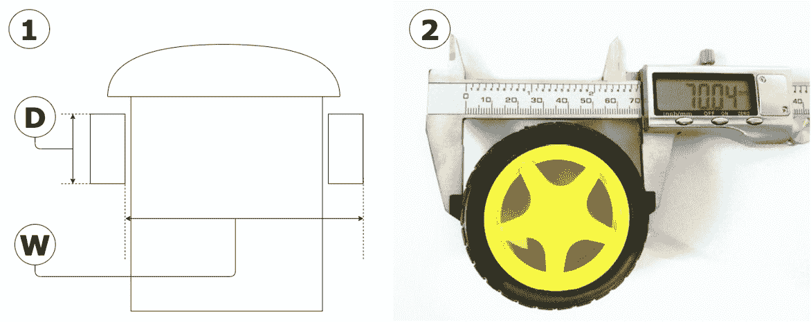

图11.11 – 测量车轮

所需的测量值如图*图11.11*所示：

1.  您需要测量轮子的直径，如图中标记的**D**，以及车轮之间的距离，**W**。距离**W**相当于机器人上两个电机驱动轮的中点到中点的宽度。它更容易测量，如图所示，一个轮子的右侧，一直延伸到另一个轮子的右侧——这将与中点到中点相同。我的测量结果是大约130毫米。

1.  您可以使用卡尺测量**D**，如图所示，通过将其套在轮子最宽的部分。我的轮子测量结果是70毫米，最接近的毫米。

我们知道编码器上有多少个槽，我们预计每个槽有两个脉冲（上升和下降），因此我们可以将槽的数量乘以2，这就是轮子整个转动的刻度数——在我的情况下，这是40。

圆周率π，或，是轮子直径与周长的比值。要得到周长，我们将直径乘以π，得到，其中*D*是直径。我们可以将π除以每转的总刻度数，然后当我们乘以计数的刻度数*T*，然后是直径*D*，我们得到轮子行驶的距离*d*：

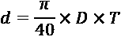

那么，我们如何将其转换为代码？请参考以下步骤：

1.  创建一个名为`test_distance_travelled.py`的新文件。在文件的顶部，我们需要导入`math`进行计算，`Robot`对象，以及`time`：

    ```py
    from robot import Robot
    import time
    import math
    import logging
    logger = logging.getLogger("test_distance_travelled")
    ...
    ```

1.  接下来，我们定义我们的常数——轮子的直径和每转的刻度数。请使用您获得的数据，而不是我这里显示的值：

    ```py
    ...
    wheel_diameter_mm = 70.0
    ticks_per_revolution = 40.0
    ...
    ```

1.  创建一个函数，将计数的刻度转换为距离。由于毫米的分数不适用于这种测量，因此将其转换为整数。由于转换的一部分不会改变，我们也将其作为常数：

    ```py
    ...
    ticks_to_mm_const = (math.pi / ticks_per_revolution) * wheel_diameter_mm
    def ticks_to_mm(ticks):
        return int(ticks_to_mm_const * ticks)
    ...
    ```

1.  接下来，我们定义我们的机器人，设置停止时间，并启动电机：

    ```py
    ...
    bot = Robot()
    stop_at_time = time.time() + 1
    logging.basicConfig(level=logging.INFO)
    bot.set_left(90)
    bot.set_right(90)
    ...
    ```

1.  在循环中，我们通过调用`ticks_to_mm`函数在脉冲计数上显示距离：

    ```py
    ...
    while time.time() < stop_at_time:
        logger.info("Left: {} Right: {}".format(
            ticks_to_mm(bot.left_encoder.pulse_count),
            ticks_to_mm(bot.right_encoder.pulse_count)))    time.sleep(0.05)
    ```

当上传到机器人并运行时，输出看起来像这样：

```py
pi@myrobot:~ $ python3 test_distance_travelled.py
INFO:test_distance_travelled:Left: 0 Right: 0
INFO:test_distance_travelled:Left: 5 Right: 0
INFO:test_distance_travelled:Left: 16 Right: 10
INFO:test_distance_travelled:Left: 32 Right: 21
...
...
INFO:test_distance_travelled:Left: 368 Right: 384
INFO:test_distance_travelled:Left: 395 Right: 417
```

这个输出显示了左右两侧行驶的明显差异。右侧电机比左侧电机移动得稍快。这种差异会累积，使机器人转向。因此，在下一节中，让我们使用这些信息来调整方向。

# 直线行驶

到现在为止，您已经看到了输出中的差异——即，一个偏差。在我的左侧，在400毫米内大约落后于右侧20毫米，这是一个正在上升的错误。根据您的电机，您的机器人可能也有一些偏差。机器人完美直线行驶的情况很少见。我们使用传感器来纠正这一点。

小贴士

这种行为在木地板或MDF板上效果更好，而在地毯上效果较差。

这种校正仍然是死计算；在表面上滑动或测量不正确仍然可能导致偏离航向。我们如何使用电机和编码器来纠正航向并直线行驶？

## 使用 PID 调整偏航

一个用于自我校正转向和直线行驶的行为需要调整电机速度，直到车轮转动的量相同。如果车轮很快转动的量相同，那么它们将补偿主要的航向偏差。

我们的机器人将使用编码器传感器来测量每只轮子转过的程度。然后我们可以考虑这些差异来调整电机控制，并尝试保持电机以相同的速度运行。

这个技巧是找出测量值差异与调整电机速度之间的关系。这使我们转向查看一个将误差映射到调整和输出值的 PID 系统。

直线行驶需要一个闭环 **反馈** 环。*图 11.12* 展示了这个环是如何工作的：

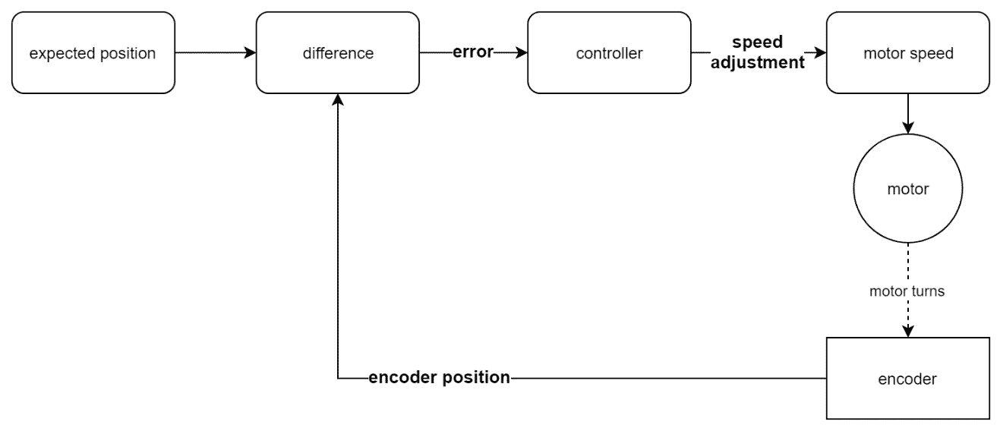

图 11.12 – 电机速度的闭环控制

我们从一个*预期位置*或**设定点**开始。*编码器位置*提供来自现实世界的反馈数据。我们得到设定点和编码器位置之间的差异，我们称之为*误差*。代码将此输入到*控制器*中，生成*速度调整*。然后系统将应用此调整到*电机速度*，使电机转动更多或更少，改变编码器的反馈。

要直线行驶，我们取左电机值并减去右电机以获得编码器差异。我们的*预期位置*是 0。我们的*误差*是编码器之间的差异。然后我们可以使用控制器调整速度。

我们使用 **PID** 控制器来调整电机的速度；这有三个组成部分：

+   **比例**（**P**）：误差值乘以一个常数。这可以纠正即时误差。

+   **积分**（**I**）：到目前为止误差值的总和，乘以一个常数。这可以纠正持续误差。

+   **导数**（**D**）：这取最后误差值和现在的差异，并乘以一个常数。这是为了稍微对抗突然的变化。

通过调整常数，我们可以*调整*每个因素对控制器结果的影响程度。我们不会使用导数组件来调整我们的行为，这相当于将其常数设置为 0。

积分可以给机器人一些自调功能，但需要一个非常小的常数，因为高值可能会使机器人开始摇摆。我们将调整加到一个电机的速度上，并从另一个电机中减去。

右电机速度如下：

```py
...
integral_sum = integral_sum  + error
right_motor_speed = speed + (error * proportional_constant) + (integral_sum * integral_constant)
...
```

我们需要一个未使用的电机速度容量，以便能够稍微加速。如果速度太接近 100%，我们会得到剪辑。具有剪辑的积分行为可能会使机器人行为相当奇怪，所以要注意 100% 的剪辑！

小贴士

为 PID 调整留出空间 - 不要超过 80% 的电机速度。

现在我们对 PID 控制器的工作原理有了些了解，让我们在代码中构建一个。

## 创建一个 Python PID 控制器对象

PID 控制器代码是制作直线的基本机器人构建块，我们将在后续的相机驱动章节中再次使用它。你将在许多机器人系统中使用这里的基本概念：

1.  我们在几个地方使用这个，所以让我们创建一个简化的 PID 控制对象。我把这个放在一个名为 `pid_controller.py` 的文件中。注意，这只是一个 `proportional_constant` 作为 `pK` 和 `integral_constant` 作为 `iK`。如果你愿意，你可以这样做。我在代码示例中使用了较长的名称，以便更容易阅读。

1.  以下代码处理两个组件的值。处理积分的效果是增加积分总和：

    ```py
    ...
        def handle_proportional(self, error):
            return self.proportional_constant * error
        def handle_integral(self, error):
            self.integral_sum += error
            return self.integral_constant * self.integral_sum
    ...
    ```

1.  以下代码块处理误差以生成调整：

    ```py
    p and i; since we log these values, we can configure logging to show them when debugging and tuning the controller.
    ```

在 PI 代码就绪后，我们就可以制作一个能够将误差与先前值结合，并按比例缩放以使其在某种运动环境中有用的机器人。我们将在下一节中使用这个 PID 控制器来调整直线。

## 编写直线行驶的代码

我把这个命名为 `straight_line_drive.py` ([https://github.com/PacktPublishing/Learn-Robotics-Programming-Second-Edition/blob/master/chapter11/straight_line_drive.py](https://github.com/PacktPublishing/Learn-Robotics-Programming-Second-Edition/blob/master/chapter11/straight_line_drive.py))：

1.  让我们导入 `Robot` 对象、`time` 和我们新的 PI 控制器。我们将设置日志记录以获取 PID 控制器的调试信息。你可以将其调整回 `INFO` 或者在太多的情况下删除该行：

    ```py
    from robot import Robot
    from pid_controller import PIController
    import time
    import logging
    logger = logging.getLogger("straight_line ")
    logging.basicConfig(level=logging.INFO)
    logging.getLogger("pid_controller").setLevel(logging.DEBUG)
    ```

1.  也设置 `Robot` 对象，并设置一个稍长的 `stop_at_time` 值，这样我们的机器人可以行驶得更远：

    ```py
    bot = Robot()
    stop_at_time = time.time() + 15
    ...
    ```

1.  以 `80` 的主速度值开始，并将两个电机都设置为这个值：

    ```py
    ...
    speed = 80
    bot.set_left(speed)
    bot.set_right(speed)
    ...
    ```

1.  在进入主循环之前，设置控制器。你可能需要调整这些常数。注意积分常数的值有多小：

    ```py
    ...
    pid = PIController(proportional_constant=5, integral_constant=0.3)
    ...
    ```

1.  在循环中，我们稍微 `sleep` 一下，这样我们的编码器就有东西可以测量。通常，不使用 `sleep` 来给其他事物运行机会的“紧密”循环也是一个坏主意。获取编码器值并计算误差：

    ```py
    ...
    while time.time() < stop_at_time:
        time.sleep(0.01)
        # Calculate the error
        left = bot.left_encoder.pulse_count
        right = bot.right_encoder.pulse_count
        error = left - right
        ...
    ```

1.  这个误差需要由控制器处理，并用于生成 `right_speed`：

    ```py
        ...
        # Get the speed
        adjustment = pid.get_value(error)
        right_speed = int(speed + adjustment)
        left_speed = int(speed - adjustment)
        ...
    ```

1.  我们可以在这里记录调试信息。注意我们有两个级别：用于错误和调整的调试，以及用于速度的信息。当前配置设置为 `INFO`，除非修改，否则我们不会看到调试信息：

    ```py
        ...
        logger.debug(f"error: {error} adjustment: {adjustment:.2f}")
        logger.info(f"left: {left} right: {right}, left_speed: {left_speed} right_speed: {right_speed}")
        ...
    ```

1.  然后我们将电机速度设置为调整后的值并完成循环：

    ```py
        ...
        bot.set_left(left_speed)
        bot.set_right(right_speed)
    ```

当我们运行这个程序时，机器人应该会沿着一条相当直的路线行驶。它可能一开始不稳定，但应该会逐渐调整到一个恒定的值：

```py
pi@myrobot:~ $ python3 straight_line_drive.py
DEBUG:pid_controller:P: 0, I: 0.00
INFO:straight_line:left: 3 right: 3, left_speed: 80 right_speed: 80
DEBUG:pid_controller:P: 0, I: 0.00
INFO:straight_line:left: 5 right: 5, left_speed: 80 right_speed: 80
DEBUG:pid_controller:P: -4, I: -0.20
INFO:straight_line:left: 5 right: 6, left_speed: 84 right_speed: 75
DEBUG:pid_controller:P: 0, I: -0.20
...
INFO:straight_line:left: 13 right: 15, left_speed: 89 right_speed: 71
DEBUG:pid_controller:P: -8, I: -1.40
INFO:straight_line:left: 15 right: 17, left_speed: 89 right_speed: 70
DEBUG:pid_controller:P: -8, I: -1.80
INFO:straight_line:left: 17 right: 19, left_speed: 89 right_speed: 70
DEBUG:pid_controller:P: -8, I: -2.20
INFO:straight_line:left: 19 right: 21, left_speed: 90 right_speed: 69
...
DEBUG:pid_controller:P: 0, I: 0.60
INFO:straight_line:left: 217 right: 217, left_speed: 79 right_speed: 80
DEBUG:pid_controller:P: 0, I: 0.60
INFO:straight_line:left: 219 right: 219, left_speed: 79 right_speed: 80
DEBUG:pid_controller:P: 0, I: 0.60
INFO:straight_line:left: 221 right: 221, left_speed: 79 right_speed: 80
DEBUG:pid_controller:P: 0, I: 0.60
INFO:straight_line:left: 223 right: 223, left_speed: 79 right_speed: 80
```

机器人启动时没有误差，因为电机开始工作，但右边速度更快。在 13 个脉冲时，控制器将调整拉得很高。注意 `P` 如何跳跃，但 `I` 在一段时间后会稳定在一个恒定值，这将使机器人保持直线。

调整 `P` 和 `I` 常数以及循环时间可能会导致更早的纠正——初始编码器值太小，没有实际用途。

注意，这仍然可能导致偏离正确方向；它考虑了减少偏航，但可能调整得太晚，无法停止小的 *S* 形或其他错误。然而，这比不调整要直得多。调整 PID 可以帮助解决这个问题。

## 故障排除此行为

如果机器人摇摆或无法直线行驶，以下是一些步骤：

+   如果机器人补偿得太慢，增加比例组件。

+   如果机器人大幅超出（即，它先向一个方向偏移，然后向另一个方向偏移），则减少比例和积分 PID 组件的大小。

+   如果机器人产生越来越大的摇摆，积分过高，右边的速度可能超过 100。降低积分组件，也许还有请求的速度。

+   你可以将 `straight_line` 记录器或 `basicConfig` 设置为调试，以查看错误值。

当直线行驶和驾驶工作正常后，你现在已经纠正了偏航问题和两侧的差异。你现在可以在此基础上构建；让我们取一个已知的距离并驾驶到那里，然后停止。

# 驾驶特定距离

对于驾驶特定距离，我们再次使用 PI 控制器，并将距离测量纳入我们的编码器对象。我们计算左轮为了给定距离需要转动的脉冲数，然后使用这个值而不是超时组件。

## 将单位转换重构到 EncoderCounter 类

我们希望 `EncoderCounter` 类中的编码器转换能够用于这些行为。重构是移动代码或改进代码的同时保留其功能的过程。在这种情况下，转换距离是使用编码器的一个目的，因此将此代码移入其中是有意义的：

1.  打开你的 `encoder_counter.py` 类。首先，我们需要导入 `math`：

    ```py
    from gpiozero import DigitalInputDevice
    import math
    ...
    ```

1.  在类顶部，将 `ticks_to_mm_const` 添加为类变量（而不是实例变量）以使用它而无需任何类的实例。最初将其设置为 none，以便我们可以计算它：

    ```py
    ...
    class EncoderCounter:
        ticks_to_mm_const = None # you must set this up before using distance methods
         ...
    ```

1.  在我们的类中，我们想要直接从编码器获取车轮行驶的距离，以毫米为单位。将以下内容添加到文件末尾：

    ```py
    ticks_to_mm_const from the class and not self (the instance). 
    ```

1.  我们还想要计算相反的值：从毫米距离计算出的脉冲数。为此，将毫米距离除以我们乘以的相同常数。这被设置为 `staticmethod`，因此它不需要后续代码使用实例：

    ```py
        ...
        @staticmethod
        def mm_to_ticks(mm):
            return mm / EncoderCounter.ticks_to_mm_const
        ...
    ```

1.  在文件中添加设置常数的途径（用于不同的机器人配置）：

    ```py
        ...
        @staticmethod
     def set_constants(wheel_diameter_mm, ticks_per_revolution):
         EncoderCounter.ticks_to_mm_const = (math.pi / ticks_per_revolution) * wheel_diameter_mm
        ...
    ```

当你保存后，`EncoderCounter`现在可以转换距离和编码器刻度。我们现在需要设置特定机器人的轮子直径。

## 设置常数

到目前为止，我们可以在我们的行为中使用我们的机器人度量。现在，我们想让`Robot`对象存储我们的测量并将它们注册到编码器中。我们可以通过两个简单的步骤来完成：

1.  在`robot.py`中，在构造函数之前，指定一些这些数字：

    ```py
    ...
    class Robot:
        wheel_diameter_mm = 70.0
        ticks_per_revolution = 40.0
        wheel_distance_mm = 140.0
        def __init__(self, motorhat_addr=0x6f):
            ...
    ```

1.  将这些与编码器注册：

    ```py
            ...
            # Setup the Encoders
            EncoderCounter.set_constants(self.wheel_diameter_mm, self.ticks_per_revolution)
            self.left_encoder = EncoderCounter(4)
            self.right_encoder = EncoderCounter(26)
            ....
    ```

准备好常数后，我们已经使编码器准备好测量距离。我们可以使用这一点来创建一个行驶距离的行为。

## 创建行驶距离行为

我会把这段代码放入`drive_distance.py`：

1.  首先导入`EncoderCounter`以使用其度量，`PIController`和`Robot`对象，并设置一个记录器：

    ```py
    from robot import Robot, EncoderCounter
    from pid_controller import PIController
    import time
    import logging
    logger = logging.getLogger("drive_distance")
    ...
    ```

1.  定义`drive_distance`函数，它接受一个机器人实例，一个以刻度为单位的距离，以及一个默认为80的可选速度。我们首先创建一个主电机和副电机以及控制器决策：

    ```py
    set_left and set_right functions in variables – we can just call the variables like functions. 
    ```

1.  现在我们有一个明确的主电机和副电机。设置一个`PIController`并启动两个电机：

    ```py
        ...
        controller = PIController(proportional_constant=5, integral_constant=0.3)
        # start the motors and start the loop
        set_primary(speed)
        set_secondary(speed)
        ...
    ```

1.  现在，我们处于驾驶距离循环中。我们应该继续循环，直到两个编码器都达到正确的距离。我们需要在循环的其余部分之前暂停，以便我们有数据用于计算：

    ```py
        ...
        while primary_encoder.pulse_count < distance or secondary_encoder.pulse_count < distance:
            time.sleep(0.01)
            ...
    ```

1.  获取错误并将其输入控制器：

    ```py
            ...
            # How far off are we?
            error = primary_encoder.pulse_count - secondary_encoder.pulse_count
            adjustment = controller.get_value(error)
            ...
    ```

1.  我们可以将这些发送到电机并调试数据。因为调整是一个非整数，所以我们使用`{:.2f}`允许两位小数：

    ```py
    ... 
            # How fast should the motor move to get there?
            set_primary(int(speed - adjustment))
            set_secondary(int(speed + adjustment))
            # Some debug
    logger.debug(f"Encoders: primary: {primary_encoder.pulse_count}, secondary: {secondary_encoder.pulse_count}," 
                        f"e:{error} adjustment: {adjustment:.2f}")
            logger.info(f"Distances: primary: {primary_encoder.distance_in_mm()} mm, secondary: {econdary_encoder.distance_in_mm()} mm")
    ...
    ```

1.  设置机器人，让它计算你想让它走多远，然后让它开始移动：

    ```py
    ...
    logging.basicConfig(level=logging.INFO)
    bot = Robot()
    distance_to_drive = 1000 # in mm - this is a meter
    distance_in_ticks = EncoderCounter.mm_to_ticks(distance_to_drive)
    drive_distance(bot, distance_in_ticks)
    ```

1.  我们让机器人清理（`atexit`）停止电机。

当你运行这个程序时，机器人会行驶一米然后停止。我的机器人在停止时看起来是这样的：

```py
INFO:drive_distance:Distances: primary: 997 mm, secondary: 991 mm
INFO:drive_distance:Distances: primary: 1002 mm, secondary: 1002 mm
```

有2毫米的超调，这可能在舍入值和检测时间中丢失。我们不能制作部分刻度。

你现在已经看到了如何使机器人行驶特定的距离（或者非常接近它），同时试图保持直线行驶。你已经结合了你在本章中构建的测量和PID调整工具。但如果我们想转弯并测量这些呢？我们将在下一节中介绍。

# 进行特定转弯

我们可以用我们的编码器完成的下一个任务是进行特定的转弯。当机器人转弯时，每个轮子都在通过一个弧线。*图11.13*说明了这一点：

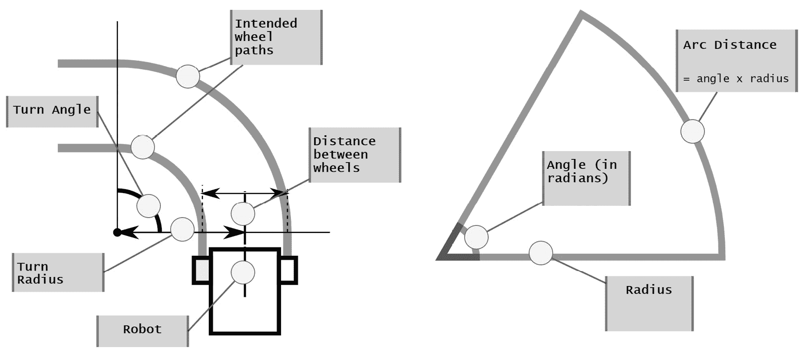

图11.13 – 说明通过弧线转弯时的轮子运动

内轮比外轮行驶的距离短，根据差速转向的基本原理，这就是我们如何转弯。为了进行精确转弯，我们需要计算这两个距离或它们之间的比率。*图11.14*显示了轮子和转弯之间的关系：

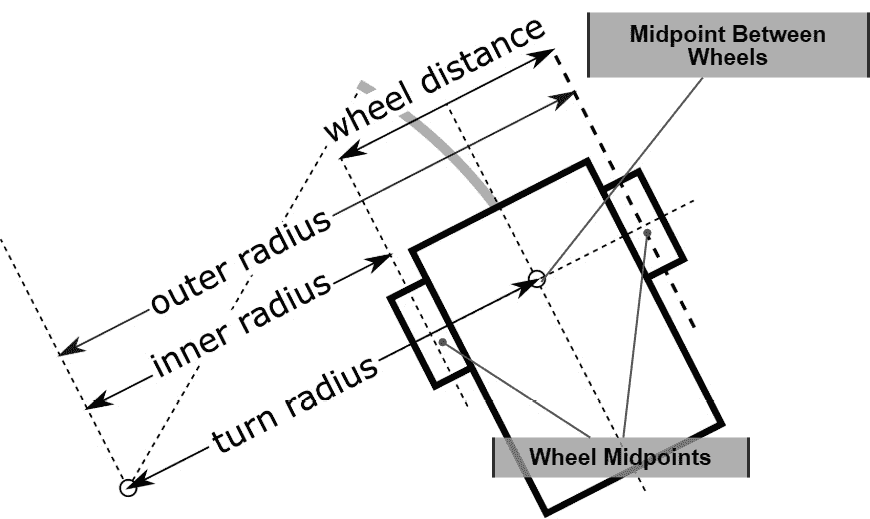

图11.14 – 将轮子与转向半径相关联

如果我们将转弯半径视为设置机器人中间的位置，那么内轮的转弯半径是转弯半径与轮距一半的差值：

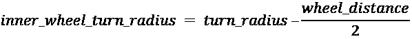

外轮的转弯半径是转弯半径加上轮距的一半：

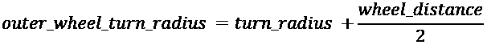

我们将我们的转向角度转换为弧度，然后我们可以将这个角度乘以每个轮子的半径，以得到每个轮子需要移动的距离：


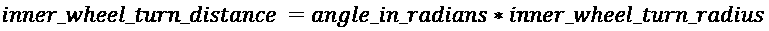

Python有数学函数可以将度数转换为弧度。

让我们将这些函数转换为一些代码，通过尝试在正方形内行驶，并测量90度的转弯来演示它：

1.  从`drive_distance.py`的副本开始，并将其命名为`drive_square.py`。添加`math`导入，如下所示：

    ```py
    from robot import Robot, EncoderCounter
    from pid_controller import PIController
    import time
    import math
    import logging
    logger = logging.getLogger("drive_square")
    ...
    ```

1.  我们可以修改此文件的末尾来声明我们想要做什么。命名你计划拥有的函数，然后实现它们以适应。我们还将其缩小到略小于一米的尺寸。为了测试半径，我在机器人的轮距上增加了100毫米。任何小于轮距和转弯中心的东西都在轮子之间而不是轮子外面：

    ```py
    ...
    bot = Robot()
    distance_to_drive = 300 # in mm
    distance_in_ticks = EncoderCounter.mm_to_ticks(distance_to_drive)
    radius = bot.wheel_distance_mm + 100 # in mm
    radius_in_ticks = EncoderCounter.mm_to_ticks(radius)
    ...
    ```

1.  由于我们在正方形内行驶，我们想要行驶四次。对于直线，让每个轮子行驶相同的距离，然后以半径为圆心画90度的弧。我已经降低了弧的速度，以减少打滑问题：

    ```py
    ...
    for n in range(4):
        drive_distances(bot, distance_in_ticks, distance_in_ticks)
        drive_arc(bot, 90, radius_in_ticks, speed=50)
    ```

1.  让我们回到文件顶部，将我们的驱动距离方法升级为一次驱动两个距离，一个用于每个轮子。我已经将`drive_distance`函数重命名为`drive_distances`：

    ```py
    ...
    def drive_distances(bot, left_distance, right_distance, speed=80):
        ...
    ```

1.  根据我们想要转向的角度，任一电机都可以作为外电机，驱动更长的距离。由于速度有一个上限，我们根据更长的距离来选择我们的主电机和副电机。将设置主/副电机的代码替换为以下内容：

    ```py
    abs, the absolute value, to decide, because a longer distance in reverse should *still* be the primary motor. So, to determine how far the secondary wheel should go, we compute a ratio – to multiply with speed now, and later the primary encoder output. 
    ```

1.  由于我们多次使用此方法，重置编码器计数。我在设置`PIController`之前放置了这个：

    ```py
        ...
        primary_encoder.reset()
        secondary_encoder.reset()

        controller = PIController(proportional_constant=5, integral_constant=0.2)
        ...
    ```

1.  由于我们可能正在向任何方向行驶，设置编码器方向。Python有一个`copysign`方法来确定值的符号。然后，启动电机：

    ```py
    ...
        # Ensure that the encoder knows which way it is going
        primary_encoder.set_direction(math.copysign(1, speed))
        secondary_encoder.set_direction(math.copysign(1, secondary_speed))
        # start the motors, and start the loop
        set_primary(speed)
        set_secondary(int(secondary_speed))
    ...
    ```

1.  当我们开始这个循环时，我们再次需要意识到一个或两个电机可能正在倒退。我们再次使用`abs`来去除符号：

    ```py
    ...
        while abs(primary_encoder.pulse_count) < abs(primary_distance) or abs(secondary_encoder.pulse_count) < abs(secondary_distance):
            time.sleep(0.01)
    ...
    ```

1.  计算副电机的误差取决于两个距离之间的比率：

    ```py
    ...
            # How far off are we?
            secondary_target = primary_encoder.pulse_count * primary_to_secondary_ratio
            error = secondary_target - secondary_encoder.pulse_count
            adjustment = controller.get_value(error)
            ...
    ```

1.  这仍然通过`pid`进行相同的调整计算；然而，这种调整也可能导致方向上的变化。现在，我们设置副电机的速度：

    ```py
          ...
          # How fast should the motors move to get there?
          set_secondary(int(secondary_speed + adjustment))
          secondary_encoder.set_direction(math.copysign(1, secondary_speed+adjustment))
          # Some debug
          logger.debug(f"Encoders: primary: {primary_encoder.pulse_count}, secondary: {secondary_encoder.pulse_count}, e:{error} adjustment: {adjustment:.2f}")
          logger.info(f"Distances: primary: {primary_encoder.distance_in_mm()} mm, secondary: {secondary_encoder.distance_in_mm()} mm")
          ...
    ```

1.  您可以扩展我们为了二级速度和目标必须考虑的调试。现在，因为我们追求精确度，主电机可能会在二级电机之前达到目标，并且没有设置为反向。所以，当它达到目标时停止这个电机，并将二级电机的基准速度设置为零，这意味着只有如果有调整，则适用。注意，我们在这里仍然使用绝对值：

    ```py
            ...
            # Stop the primary if we need to
            if abs(primary_encoder.pulse_count) >= abs(primary_distance):
                logger.info("primary stop")
                set_primary(0)
                secondary_speed = 0
            ...
    ```

我们已经完成了驾驶距离函数。我们可以使用它来直线行驶，或者为每个轮子提供单独的目标距离，并使用它来弧形行驶。我们将在下一节中利用这一点。

## 编写`drive_arc`函数

这里我们将角度转换为弧度，确定内半径，并为每个轮子设置驾驶距离。将此代码添加到`drive_square_behaviour.py`中，在`drive_distances`函数之后：

1.  从函数定义和有用的文档字符串开始：

    ```py
    ...
    def drive_arc(bot, turn_in_degrees, radius, speed=80):
        """ Turn is based on change in heading. """
        ...
    ```

1.  我们将机器人的宽度转换为tick，这是距离的内部测量单位，并使用其中的一半来获取轮子半径。我们还确定哪个是内轮：

    ```py
        ...
        # Get the bot width in ticks
        half_width_ticks = EncoderCounter.mm_to_ticks(bot.wheel_distance_mm/2.0)
        if turn_in_degrees < 0:
            left_radius = radius - half_width_ticks
            right_radius = radius + half_width_ticks
        else:
            left_radius = radius + half_width_ticks
            right_radius = radius - half_width_ticks
        logger.info(f"Arc left radius {left_radius:.2f}, right_radius {right_radius:.2f}")
        ...
    ```

1.  我们显示调试信息，以了解半径是多少。将此与弧度转弯结合，以获取距离。我们将转弯的绝对值转换为度数。我们不想反向进入转弯，而是要向相反方向转弯：

    ```py
        ...
        radians = math.radians(abs(turn_in_degrees))
        left_distance = int(left_radius * radians)
        right_distance = int(right_radius * radians)
        logger.info(f"Arc left distance {left_distance}, right_distance {right_distance}")
        ...
    ```

1.  最后，将这些距离输入到`drive_distances`函数中：

    ```py
        ...
        drive_distances(bot, left_distance, right_distance, speed=speed)
    ...
    ```

机器人应该能够以正方形形状行驶。它仍然可能因为打滑或测量不准确而错过目标。需要调整比例和积分控制值。

检查`drive_distances`和`drive_arc`的完整代码，可能会明显看出在确定内/外和主/次部分方面存在一些重复，如果您选择，可以进行重构。

如果通过角落反向行驶，此代码可能表现不正确。

# 摘要

在本章中，我们看到了如何将轮编码器传感器集成到我们的机器人中，并使用它们来确定每个轮子转过的距离。我们看到了如何使用这个方法通过使用简化的PID控制器将机器人引导到更直的路径上，然后使用这个方法行驶特定距离。然后我们将计算进一步，以轮子移动来计算转弯，并使用这个方法在正方形中驾驶机器人。

PID控制器可以在许多需要应用测量值与期望值之间差异的情况中使用，您已经看到了如何将其与传感器结合使用。您可以使用相同的系统来控制连接到热传感器的加热元件。您还可以使用编码器以一定的精度移动机器人，因为在伺服电机中使用的运动范围有限，这没有意义。

在接下来的几章中，我们将探索为我们的机器人提供更多交互性和智能行为，包括使用Raspberry Pi摄像头进行视觉处理、使用Mycroft进行语音处理，以及使用智能手机远程驾驶或选择机器人的模式。

# 练习

1.  尝试调整不同的日志级别和不同命名的记录器，调整机器人行为产生的输出量。

1.  对于 PID 行为，调整 PID 参数，尝试为比例或积分使用高值，并观察这如何影响机器人的行为。你能将这和 `matplotlib` 中的绘图结合起来观察 PID 行为吗？

1.  有几种方法可以改进驱动距离代码。将 **PID** 控制器应用于主驱动的移动距离可以使它更精确地接近确切的行驶距离。检测到任一编码器没有移动可以用作在超时后停止代码，这样它就不会在停止前行驶。试试这个。

1.  你现在可以使用这段代码来制作更多的几何形状或跟随没有线的路径。尝试添加高级左转/右转 90 度函数作为直角路径构建的构建块，然后使用这些来制作路径。

1.  考虑将这里的编码传感器与距离传感器结合起来；可能开始记住墙壁之间的距离。

# 进一步阅读

请参考以下信息获取更多信息：

+   PID 控制是一个深奥的主题。它是自平衡机器人、无人机和其他自主控制系统中的关键领域。这里有一系列优秀的视频，你可以进一步探索这些内容：

    YouTube: Brian Douglas – *PID 控制 – 简要介绍*: [https://www.youtube.com/watch?v=UR0hOmjaHp0](https://www.youtube.com/watch?v=UR0hOmjaHp0)

+   我已经大大简化了一些角落转弯算法。一篇关于如何使用这些算法赢得比赛的文章对更详细的方法进行了阐述：

    GW Lucas – *使用基于 PID 的技术进行竞技里程计和回声定位:* [*http*://www.seattlerobotics.org/encoder/200108/using_a_pid.html](http://www.seattlerobotics.org/encoder/200108/using_a_pid.html)
