# *第12章*：使用Python进行IMU编程

现代机器人需要知道它们相对于世界的位置。在[*第11章*](B15660_11_Final_ASB_ePub.xhtml#_idTextAnchor219)，*使用Python编程编码器*中，我们探讨了编码器如何获得机器人移动或转向的概览。然而，这种转向是相对于机器人的位置，没有绝对参考。轮胎打滑可能导致错误读数。在本章中，你将看到机器人读取其位置变化和测量其运动的其他方法。

从原则上讲，一个**惯性测量单元**（**IMU**）可以提供绝对位置测量并且不会滑动。在实践中，它们很复杂。本章是向你的机器人添加IMU的小型实用之旅。在本章中，我将介绍IMU的组件。你还将学习如何焊接，以便为扩展板添加引脚，这项技能将为你打开机器人部件的广阔世界。

我们将编写一些代码来尝试各种功能，并查看传感器提供的输出类型。然后我们将对传感器数据进行动画可视化。到本章结束时，你将能够使用这些高级传感器，有一些焊接经验，并组装仪表盘来监控传感器。随着你在机器人领域的进一步研究，你会发现，如果你想要看到机器人能看到的内容，动画仪表盘将是至关重要的。

在本章中，我们将涵盖以下主要主题：

+   了解更多关于惯性测量单元的信息

+   焊接 – 将引脚连接到IMU

+   将IMU连接到机器人上

+   读取温度

+   读取陀螺仪

+   读取加速度计

+   读取磁力计

# 技术要求

对于本章，你需要以下物品：

+   来自[*第7章*](B15660_07_Final_ASB_ePub.xhtml#_idTextAnchor131)，*使用Python驱动和转向 – 移动电机*的机器人

+   来自[*第11章*](B15660_11_Final_ASB_ePub.xhtml#_idTextAnchor219)，*使用Python编程编码器*的机器人代码，可以在[https://github.com/PacktPublishing/Learn-Robotics-Programming-Second-Edition/tree/master/chapter11](https://github.com/PacktPublishing/Learn-Robotics-Programming-Second-Edition/tree/master/chapter11)找到。

+   一个带有引脚的ICM20948扩展板，例如Pimoroni PIM448模块

+   焊接铁和支架

+   焊接铁尖端清洁线

+   焊料 – 应该是电子用的含助焊剂的焊料

+   焊接吸锡器

+   一个用于焊接的明亮工作台

+   通风空间或抽风机

+   安全眼镜

+   面包板

+   2.5毫米支撑套件

+   雌性到雌性杜邦跳线

要获取本章的完整代码，请访问[https://github.com/PacktPublishing/Learn-Robotics-Programming-Second-Edition/tree/master/chapter12](https://github.com/PacktPublishing/Learn-Robotics-Programming-Second-Edition/tree/master/chapter12)。

查看以下视频以查看代码的实际应用：[https://bit.ly/38FJgsr](https://bit.ly/38FJgsr)

# 了解更多关于IMU的信息

IMU是一组设计用于感知机器人在3D空间中运动的传感器。这些设备在无人机中很常见，在基于地面的机器人中很有用，对于平衡机器人至关重要。IMU不是一个单独的传感器，而是一组设计用于一起使用且其读数可以组合的传感器。

这些设备体积很小，但其根源在于具有大型旋转陀螺仪的飞行硬件。IMU使用**微机电系统**（**MEMS**）技术将机械装置放置在微尺度芯片上。它们确实有微小的运动部件，并使用电子传感器来测量它们的运动。

由于一些测量是模拟的（见[*第2章*](B15660_02_Final_ASB_ePub.xhtml#_idTextAnchor033)，*探索控制器和I/O*），IMU模块通常包括一个**模拟到数字转换器**（**ADC**）并通过I2C进行通信。

IMU上存在不同的传感器组合。这些传感器如下：

+   一个温度传感器，用于考虑温度对其他传感器的影响

+   一个陀螺仪，用于测量旋转速率

+   一个加速度计，用于测量加速度或力

+   一个磁力计，用于测量磁场，可以作为指南针使用

随着我们与这些传感器类型之一一起工作，我们将更多地了解它们及其特性。

现在我们对IMU有了基本的了解，让我们学习如何选择一个。

## 建议的IMU型号

IMU可以通过单独的加速度计、陀螺仪和磁力计以及转换传感器输出的设备来构建。为了减少所需的布线和空间，我建议使用包含所有设备的板或单芯片解决方案。出于同样的原因，我推荐使用I2C或串行IMU。

IMU系统使用**自由度**（**DOF**）来表示有多少个传感器轴存在。一个9自由度系统为每个传感器提供三个轴（X、Y和Z）。

BNO传感器更容易编写代码，但由于它们使用I2C总线的方式，与树莓派不兼容，并且可能需要一个中间接口芯片。

另一个需要考虑的是是否有文档（readme文件和手册）以及一个支持从Python控制设备的库。以下图片显示了一个建议的IMU模块：


图12.1 – ICM20948的照片

上一张图片是ICM20948的PIM448模块板，这是一个广泛支持的9自由度传感器，适用于Python库。它还包含一个温度传感器。它也分布得很好。由于IMU是复杂的设备，我强烈建议选择PIM448作为本章的选择。

现在我们已经探讨了IMU设备是什么以及如何选择一个，是时候用一项新技能：焊接，为我们的机器人准备一个PIM448了。

# 焊接 – 将引脚连接到IMU

大多数IMU模块，包括建议的PM448，可能都会附带一个包装袋中的引脚，您需要将其焊接在板上。如果您想焊接这些引脚，您将需要一点点的指导：

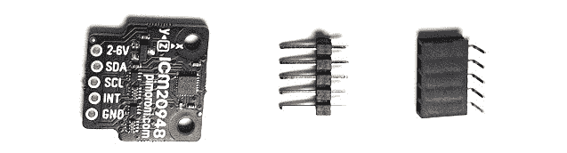

图12.2 – 带有引脚的裸PIM448

前面的图片显示了从袋中取出的PIM448。左边是只有孔而没有接头的ICM20948板。中间是公接头，而母接头在右边。我们将使用公接头，因为这些在焊接时更容易固定在位。

如我们在*技术要求*部分中提到的，你需要一个烙铁和焊料、烙铁支架、安全眼镜、吸尘器或通风良好的空间、额外的面包板和一个明亮的工作空间。焊接会产生烟雾，你不想吸入。

在这个阶段戴上你的安全眼镜。加热烙铁；根据烙铁的不同，这可能需要几分钟。同时准备好一些焊料。

## 制作焊点

现在，你就可以进行焊接了。

以下图片显示了焊接模块的三个阶段：

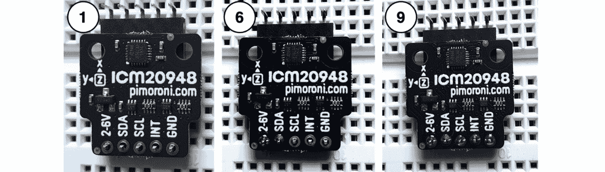

图12.3 – 焊接PIM448的阶段

要制作一个焊点，在查看前面的图片的同时执行以下步骤：

1.  我们需要确保在焊料干燥的过程中，该部分不会移动。前面的图片显示了PIM448排放在公接头处，推入底部的面包板上，顶部是母接头。将部件固定在位的一个好方法是将接头的长边放入面包板中，我们的设备放在上面。由于我们正在连接公接头，我们将使用母接头来支撑另一侧。

1.  焊接烙铁尖端应大约在300°C时加热并上锡。在尖端熔化一点焊料以测试它是否足够温暖。在你能够焊接之前，你需要将尖端上锡。上锡是将一小层焊料放在烙铁上，以提高其热导率并保护尖端免受氧化（当加热时生锈）。要上锡，将一点焊料推入烙铁的尖端，它将粘附在上面。焊料应该能够自由熔化。

1.  确保尖端清洁 – 在烙铁加热时，将烙铁尖端推入黄铜清洁剂中，在电线中做擦拭动作。

1.  加热接头和焊盘（引脚穿过的环形部分）。我们将从标有**2-6V**的引脚开始。加热引脚和焊盘以避免干焊，因为焊料不会正确地流过焊盘。干焊既电学上又机械上都很脆弱。

1.  大约一秒后，轻轻地将一点焊料喂入引脚的另一侧；当引脚足够热时，焊料会熔化并流过焊盘，形成一个圆形帐篷状。这正好足够。你会看到焊剂树脂从焊料中流出。

1.  前面的图片显示了下一步的中间步骤。在这里，我已经焊接了两个引脚；从现在开始事情会变得容易，因为板子不能移动。继续到下一个引脚并重复 – 加热引脚和焊盘，然后加入焊料。

1.  如果你添加了太多的焊锡，请使用吸锡器移除多余的焊锡。按下活塞，将吸锡器靠近接头，熔化焊锡，然后按下活塞的释放按钮，使其吸走任何焊锡。你可以用少一点的焊锡重新制作这个接头。

1.  如果你发现你用一小团焊锡连接了两个引脚（短路了它们），你可以用烙铁在引脚之间划下来再次分开它们。你可能还需要移除任何多余的焊锡，如*步骤7*中提到的。

1.  对剩余的引脚重复前面的步骤。前面图像的右侧显示了所有引脚焊接后你的IMU应该看起来是什么样子。

    重要提示

    为了安全起见，确保你在做其他任何事情之前将烙铁放回支架上并关闭烙铁。烙铁是一个危险的设备，如果无人看管可能会导致烧伤或火灾。

1.  一旦部件冷却，从面包板上拔下它。可选地，你可以使用异丙醇和棉签清除焊膏残留物，以获得更好的外观。

在我们接线之前，请进行以下检查：

+   你已经将所有五个引脚焊接到位。

+   每个焊接的引脚都像是一个银色的“帐篷”形状。气泡/圆形或扁平形状是不正确的，你需要再次进行那个连接。

+   没有两个引脚有焊锡*桥接* – 连接引脚的焊锡团。

恭喜你 – 你已经焊接了你的第一个部件！当你构建更多的机器人和电子设备时，你将需要再次使用这项技能。现在你已经焊接了ICM20948模块，让我们将其连接到你的机器人上。

# 将IMU连接到机器人

在我们能够使用IMU并为它编写代码之前，我们必须将其牢固地安装在机器人上，并接线以便树莓派能够与之通信。

## 物理放置

IMU磁力计对磁场敏感，需要远离电机。因此，它应该位于机器人上方的茎上。

IMU的朝向对于其他实验来说至关重要：


图12.4 – 将IMU与机器人对齐

IMU顶部有一个图示。前面的图示显示了该图示应该如何与机器人对齐。X轴应该朝前，Z轴应该朝上，IMU上的小正方形应该朝上。最后，Y轴应该指向左侧。

该传感器使用I2C。I2C对线缆距离敏感，因此我们应该将其安装在树莓派和电机控制板上方，那里的线缆距离较短。以下图像显示了你需要为此步骤准备的部件：


图12.5 – 安装IMU所需的部件

对于这个步骤，你需要前面图像中显示的部件：

+   IMU，带有安装好的引脚

+   许多长支架，M2.5

+   1x M2.5螺母

我们将使用支架将这些部件组装成一个长柱，如下面的图像所示：


图12.6 – 连接支架柱

以下步骤旨在与前图一起使用，以帮助您安装IMU：

1.  如前图所示，您只需将一个支柱的螺纹拧入另一个支柱的插座中，即可得到一个长支柱。这应该给IMU一点距离，使其能够站在机器人上方。目标是在电缆长度下方：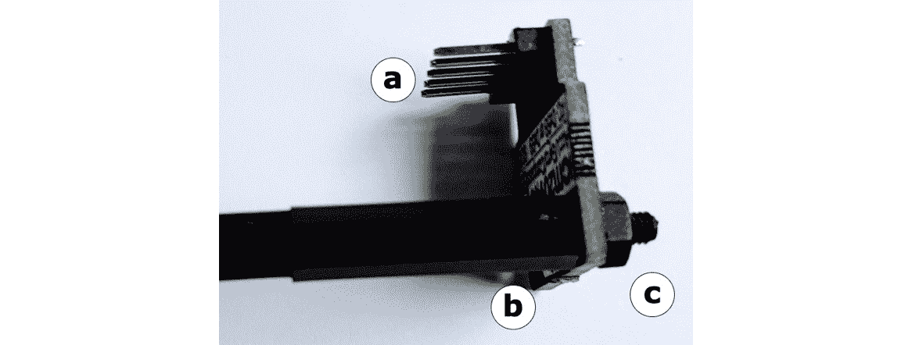

    图12.7 – 将IMU拧到支柱上

1.  如前图所示，将支柱螺纹穿过IMU上与轴标记相对的孔 *(a)*。引脚头 *(b)* 应向下面对支柱。螺纹非常紧，但应该能穿过。使用顶部的螺母 *(c)* 来固定它：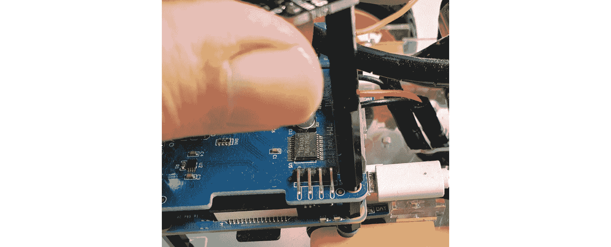

    图12.8 – 将IMU支柱拧到Raspberry Pi上

1.  前一张图片显示了IMU支柱拧在从电机板伸出的螺纹上。我们建议在[*第6章*](B15660_06_Final_ASB_ePub.xhtml#_idTextAnchor096)，*机器人构建基础 – 轮子、电源和接线*中提到的电机板后左边的I2C连接器。我们可以将IMU支柱拧到靠近该孔的孔中：

    图12.9 – 准备接线的IMU

1.  上一张图片显示了ICM20948连接到支柱上，您需要将螺栓拧入电机板的顶部，其引脚已准备好接线。调整它，使X轴指向前方，Y轴指向左侧，同时拧紧顶部的螺母。越接近与机器人成方形，结果越好！

您现在已将IMU安装在机器人上。您已对其轴进行了对齐，因此我们知道我们的传感器会有什么表现。现在，我们已安装了此IMU模块，它已牢固地安装到位，但如果我们需要这样做，它可以被卸下。该模块现在已准备好接线。

## 将IMU连接到Raspberry Pi

接下来，您需要将IMU连接到Raspberry Pi的I2C引脚。虽然这似乎是一项简单的工作，但您必须小心，因为一些连接不是直接通过的。

电机板方便的I2C分线器应该会使这项工作更容易一些：

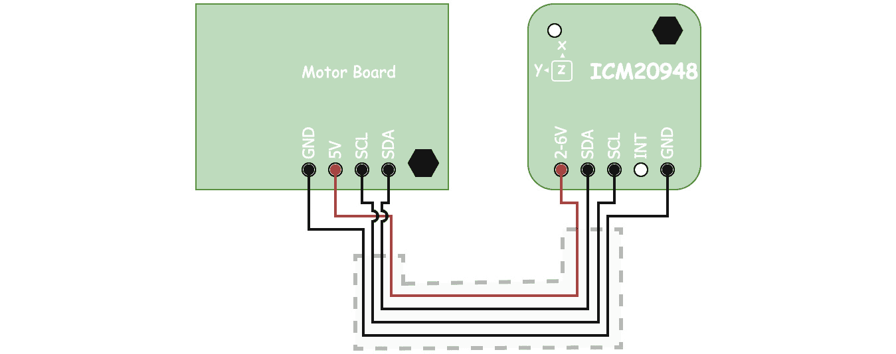

图12.10 – ICM20948的接线

如前图所示，接线相当直接：IMU的**GND**连接到电机板I2C分线器的**GND**，**SDA**连接到**SDA**，**SCL**连接到**SCL**，**2-6V**连接到**5V**（在2-6V范围内）。

**GND** 从电机板左侧延伸到IMU右侧。四根线中有一处弯曲，**5V** 线穿过此处。

实际上，我们会使用四根线的跳线带，如前图中的虚线所示。连接到IMU的一端会直接穿过。连接到电机板的一端有电源线穿过其他线：


图12.11 – 连接到电机板的ICM20948 IMU

在前面的图像中，我使用了一段短的女性到女性的跳线来建立连接。IMU 板与其预定方向成 90 度，以便更清晰地布线；它应该有 X 面向前。注意，线中有扭曲，所以 GND 线（这里为白色）最终结束在另一侧的 GND 引脚上。执行以下步骤来建立这些连接：

1.  小心地将四根线的带子拉掉。目标是找到深色用于 GND 和亮/鲜艳的颜色用于 5V 线。

1.  将一侧直接插入 IMU，确保跳过 `INT` 引脚。

1.  当你将线拉到下面的电机板时，请转一个小弯，使电缆朝相反的方向。

1.  首先插入 GND，以设置方向。

1.  然后插入 5V 线，这将需要跨越其他两根线。

1.  最后两根线现在应该已经正确放置，用于 SDA 和 SCL；将它们都插入。

1.  使用线颜色确保您已正确连接。

    我们不打算使用 `INT` 引脚。这个引脚的设计是用来向 Pi 发送一个 *中断*，以通知我们存在运动，用于唤醒运动类型的行为。然而，这超出了本书的范围。

    现在我们已经将这个传感器连线并连接到我们的机器人上，您就可以编写一些代码了。我们将从读取温度开始。

    # 读取温度

    在设备连线并连接后，您可能想要在上面尝试一些代码来确认我们可以与该设备通信并从中获取数据。让我们安装一些工具并使其工作。

    ## 安装软件

    在我们开始与该设备交互之前，就像大多数设备一样，我们将安装一个辅助库来与之通信。我推荐的 ICM20948 模块供应商 Pimoroni 已经为 Python 制作了一个方便的库。我建议从 GitHub 下载他们的最新版本。

    执行以下步骤来安装它：

    在机器人上启动 Raspberry Pi。这个 Pi 应该之前用于电机板和 LED 填片，并且已启用 I2C。如果没有，请回到 [*第 7 章*](B15660_07_Final_ASB_ePub.xhtml#_idTextAnchor131)，*用 Python 驱动和转向 – 移动电机*，并遵循准备 I2C 的步骤。

1.  输入 `i2cdetect -y 1` 以检查您是否正确安装了设备。输出应该看起来像这样：

    ```py
    pi@myrobot:~ $ i2cdetect -y 1
         0  1  2  3  4  5  6  7  8  9  a  b  c  d  e  f
    00:          -- -- -- -- -- -- -- -- -- -- -- -- -- 
    10: -- -- -- -- -- -- -- -- -- -- -- -- -- -- -- -- 
    20: -- -- -- -- -- -- -- -- -- -- -- -- -- -- -- -- 
    30: -- -- -- -- -- -- -- -- -- -- -- -- -- -- -- -- 
    40: -- -- -- -- -- -- -- -- -- -- -- -- -- -- -- -- 
    50: -- -- -- -- -- -- -- -- -- -- -- -- -- -- -- -- 
    60: -- -- -- -- -- -- -- -- 68 -- -- -- -- -- -- 6f 
    70: 70 -- -- -- -- -- -- —             
    ```

1.  地址为 0x68 的设备是我们的新设备。如果您看不到这个，请关闭 Raspberry Pi 的电源并检查您的连线。其他两个设备（0x6f 和 0x70）是电机板和 LED 填片。

1.  现在，我们可以安装这个库：

    ```py
    pi@myrobot:~ $ git clone https://github.com/pimoroni/icm20948-python
    pi@myrobot:~ $ cd icm20948-python/
    pi@myrobot:~ $ sudo ./install.sh
    pi@myrobot:~ $ cd
    ```

1.  您现在已经验证了 ICM20948 设备位于机器人的 I2C 总线上，并安装了 Pimoroni Python 库，以便与之通信。您现在可以开始与之通信了。

我们还将添加一些新的软件来实时可视化我们的数据。有一个名为 **Visual Python** （**VPython**）的系统，它被设计用来实时创建图表和 3D 表示：

```py
pi@myrobot:~ $ pip3 install git+https://github.com/orionrobots/vpython-jupyter.git
```

现在，设备和库应该已经安装。如果您没有成功，请尝试查看下一节的 *故障排除* 部分。

## 故障排除

在这个早期阶段可能会出错。如果您到目前为止还没有让事情工作，请尝试按照以下步骤操作：

1.  在这里，`i2cdetect` 阶段必须工作并显示设备在 0x68。如果没有，请检查您的接线。*这里不应该有任何东西是热的*。

1.  确保您已经完成了所有的焊接检查。

1.  如果库安装失败，请确保您已连接到互联网。您可能需要最新的 Raspbian 版本才能使其工作。

现在您已经安装了设备并检查了常见问题，我们可以尝试使用它进行第一次实验并读取温度传感器。

## 读取温度寄存器

在本节中，我们将为 IMU 设置一个接口，然后添加来自 Raspberry Pi 的温度数据的实时图表。

### 创建接口

就像其他传感器和输出一样，我们必须创建一个接口，因为市场上有很多 IMU 设备。然而，相同的接口允许我们更换它们，而无需重写使用该接口的其他行为：

1.  创建一个名为 `robot_imu.py` 的文件。

1.  首先导入 Pimoroni 设备库 – 如果您使用其他 IMU 设备，这将是不同的：

    ```py
    from icm20948 import ICM20948
    ```

1.  我们将创建一个 IMU 类来表示我们的设备。这设置了一个单个 IMU：

    ```py
    class RobotImu:
        def __init__(self):
            self._imu = ICM20948()
    ```

1.  对于这个练习，我们只需要温度。让我们简单地包装一下：

    ```py
        def read_temperature(self):
            return self._imu.read_temperature()
    ```

使用这个，接口就准备好了。现在，我们可以用它来读取设备的温度。

### 什么是 VPython？

VPython 或 Visual Python 是一个旨在在 Python 中创建视觉（甚至是 3D）显示的系统。它来自一个科学社区，并将在本章的整个过程中非常有用。它将输出发送到浏览器，并且使用在此安装的特定版本，它可以在 Raspberry Pi 上运行，同时在计算机或智能手机上显示输出。

它有几个小问题，其中之一是启动时间较慢，但结果是值得的。

### 绘制温度图表

通过使用图表是观察温度变化的好方法。

让我们使用 VPython 并创建一个显示我们 IMU 模块温度的图表：

1.  创建一个名为 `plot_temperature.py` 的文件。

1.  首先导入 VPython 和我们的机器人 IMU 接口：

    ```py
    vpython by importing it as vp.
    ```

1.  我们将在图表上绘制温度与时间的关系，因此我们需要一个时间参考。此外，我们将使用日志记录来查看发生了什么：

    ```py
    import time
    import logging
    ```

1.  让我们配置日志记录，以便我们可以看到所有 `INFO` 级别的日志：

    ```py
    logging.basicConfig(level=logging.INFO)
    ```

1.  创建我们的 IMU 实例：

    ```py
    imu = RobotImu()
    ```

1.  我们希望从图表中获得一些东西。由于 X 轴是时间，以秒为单位，将最小值设置为 `0`，最大值设置为 `60`，将显示一分钟的数据。我们还想让图表滚动，以便在记录超过一分钟的数据后显示新数据：

    ```py
    vp.graph(xmin=0, xmax=60, scroll=True)
    temp_graph = vp.gcurve()
    ```

1.  现在我们有了时间参考，让我们在进入循环之前记录开始时间：

    ```py
    start = time.time()
    ```

1.  主循环是一个`while true`类型的循环。然而，我们需要使用`vp.rate`来让VPython知道我们正在动画化，并为我们的系统设置一个帧/更新率：

    ```py
    while True:
        vp.rate(100)
    ```

1.  现在，我们可以捕捉我们的温度，同时，我们还可以记录这个：

    ```py
        temperature = imu.read_temperature()
        logging.info("Temperature: {}".format(temperature))
    ```

1.  要将这个数据放入图表中，我们需要获取X轴的经过时间。我们可以通过从当前时间减去开始时间来获取这个时间：

    ```py
        elapsed = time.time() - start
    ```

1.  最后，我们需要将这个数据绘制到我们的温度图表中，其中经过的时间作为`x`轴，温度作为`y`轴：

    ```py
        temp_graph.plot(elapsed, temperature)
    ```

绘制温度的代码现在已生效。让我们在树莓派上运行这个代码。

### 运行温度绘图器

在我们将文件复制到树莓派之后，我们需要遵循几个步骤来运行它。我们的树莓派是无头服务器，因此我们需要远程查看VPython。为此，我们需要让VPython知道我们在做什么，并使用网络端口使其视图可用。然后我们可以使用浏览器查看它。让我们看看如何：

1.  在树莓派的SSH会话中，输入以下命令：

    ```py
    $ VPYTHON_PORT=9020 VPYTHON_NOBROWSER=true python3 plot_temperature.py
    ```

    我们选择了端口`9020`，这有点随意，但应该高于`1000`。我们将在本书的后面使用其他端口上的其他网络服务，而这个数字远远超出了它们的范围。当运行时，它应该记录一些消息来告诉你它已准备好：

    ```py
    INFO:vpython.no_notebook:Creating server
    http://localhost:9020
    INFO:vpython.no_notebook:Server created
    INFO:vpython.no_notebook:Starting serve forever loop
    INFO:vpython.no_notebook:Started
    ```

    注意，它显示的是本地主机地址。我们打算远程使用它。

1.  接下来，将你的浏览器（Chrome、Firefox或Safari）从桌面指向树莓派，并带有端口号。在我的情况下，根据我的机器人的主机名，这将是在`http://myrobot.local:9020`。

1.  现在，请准备好稍等片刻——VPython设置可能需要一点时间。之后，你会看到你的图表或任何错误/问题。

当它运行时，你会得到温度传感器的读数图表。你可以通过小心地将手指放在传感器上（PIM448上的大黑方块）来实验，并观察图表如何随着这个动作而上升/下降。你也可以找到冷或热的物体，比如吹风机，看看它是如何操纵的。然而，要小心不要让机器人弄湿，并且不要让金属接触引脚：

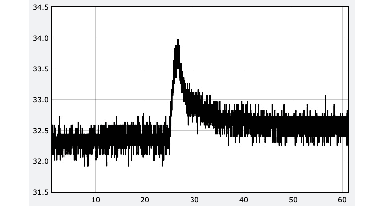

图12.12 – 温度图表

前面的图像是一个显示温度（Y轴）与时间（X轴）的图表。粗黑线表示当前的温度读数。它波动很大——这是一个噪声系统。

我在大约25秒时将手指放在传感器上。如图所示的前一个图表，环境温度为31度，上升至略低于34度。需要几秒钟才能升温。如果我将手指放在那里更长时间，它会增加更多。我有一个风扇，所以有一个急剧的下降——根据你的条件，可能会有更慢的下降。代码也将温度记录到控制台：

```py
INFO:root:Temperature 32.43858387995327
INFO:root:Temperature 32.726120945278105
INFO:root:Temperature 32.726120945278105
INFO:root:Temperature 32.39066103573247
INFO:root:Temperature 32.39066103573247
INFO:root:Temperature 32.63027525683649
```

在这里，小数位有很多噪声，你可以忽略它们。当你关闭这个浏览器标签时，代码将停止绘图。

重要提示

关于测试温度的警告：不要在传感器上放置金属物体——这可能会短路引脚并损坏机器人。也不要在上面放置湿物体。非常冷的对象上可能会有冷凝。水甚至可能短路引脚并损坏传感器，以及可能损坏树莓派。

## 故障排除

我们正在将两个新的组件拉入我们的机器人代码中，因此可能会出错。以下是一些需要检查的事项：

1.  请注意，VPython可能运行缓慢，因此启动可能需要很长时间。尝试在30秒后刷新浏览器标签。

1.  使用VPython，显示错误消息可能需要很长时间。在尝试新代码时需要耐心。

1.  如果您看到I/O或通信错误，请仔细检查IMU的接线。请回到*安装软件故障排除*部分以获取措施。如果在将手指放在传感器上时推挤一根线，或者更糟糕的是，如果尝试用金属物体冷却它并短路引脚，也可能发生I/O错误。不要在传感器上放置金属物体！

1.  类似地，如果您看到导入错误，请检查您在导入中是否没有打字错误，并确保您已经检查了*安装软件故障排除*部分。

1.  如果温度读数需要时间才能改变，请注意IMU有一些绝缘/热阻，因此需要一段时间才能升温（但会升温）和降温。板子也有热质量，这意味着它会全部升温或降温，从而减慢达到您所测量温度所需的时间。

1.  温度读数不准确可能有几个原因。一方面，IMU可以产生一些热量——我们已经提到了热质量。它可以应用一个校准偏移值来使其更准确，但不要期望它能够完美地与温度计匹配到几分之一度。它当然应该能够将手指或手掌注册为接近37度，但在实践中，只要耐心，我通常能达到大约36点多。

我们现在的示例正在工作，但我们可以使启动测试更容易一些。

## 简化VPython命令行

在本章中，我们将大量使用VPython，并且我们不希望每次运行Python文件时都输入一大堆设置。让我们创建一个别名（命令行快捷方式）来节省我们每次都输入这些内容的时间：

1.  让我们为当前会话设置它。`alias`命令创建了一个别名，我们可以在以后再次使用。在这里，它被命名为`vpython`。它包含设置和`python3`命令：

    ```py
    pi@myrobot:~ $ alias vpython="VPYTHON_PORT=9020 VPYTHON_NOBROWSER=true python3"
    ```

1.  为了在某个时候再次使用它，我们将将其放入当前用户的`.bashrc`文件中——这是一个Raspbian在您`ssh`登录时自动运行的文件：

    ```py
    pi@myrobot:~ $ echo 'alias vpython="VPYTHON_PORT=9020 VPYTHON_NOBROWSER=true python3"' >>~/.bashrc
    ```

    将某物包裹在`echo`中会将文本写出来而不是运行命令。`>>`将此追加到文件中——在这种情况下，是`.bashrc`文件。`~`标记选择当前用户的家目录。

1.  您可以使用`vpython plot_temperature.py`重新运行温度演示。

在本节中，你从IMU设备接收数据，并看到了它对温度的反应。这证实了IMU正在响应。你记录了数据，并绘制了图表，在这个过程中介绍了VPython系统，它可以作为一个强大的图形显示系统。我们将在本章中使用IMU和VPython做更多的事情。接下来，我们将查看陀螺仪，以便我们可以看到我们的机器人是如何旋转的。

# 在Python中读取陀螺仪

在本节中，我们将使用IMU中的陀螺仪。我们将用它来近似机器人在三维空间中的朝向。

但在我们这样做之前，让我们先了解一下。

## 理解陀螺仪

陀螺仪测量旋转为角度变化率，可能是每秒多少度。在每次测量中，它可以确定绕每个轴的旋转速度：

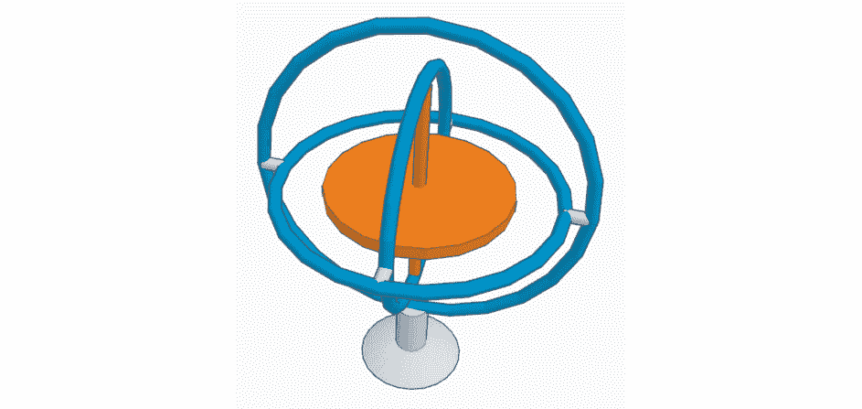

图12.13 – 陀螺仪示意图

传统的陀螺仪是一个机械系统，如前图所示。它有一个陀螺仪——一组同心环——通过枢轴连接，这样它们就可以绕X轴、Y轴和Z轴旋转。中间有一个旋转的质量，称为转子。当转子旋转时，移动把手（如图中底部所示）不会影响旋转的质量，它保持其朝向，陀螺仪允许它自由旋转。

在MEMS陀螺仪的情况下，它会使一个微小的质量快速来回移动（振荡）。当陀螺仪的朝向改变时，质量仍然会朝另一个方向移动。这种运动会改变传感器检测到的电场。在原始朝向中，这种运动看起来像是一种力，称为科里奥利力。

在我们能够编写一些代码来与陀螺仪一起工作之前，我们需要理解坐标系——在机器人和VPython中。

### 表示坐标和旋转系统

我们将在本章中使用坐标和旋转系统。以下图表应该能帮助你理解它们：

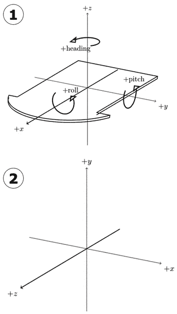

图12.14 – 机器人本体坐标系

前面的图表显示了我们将要使用的不同坐标系统。让我们看看它的不同部分：

1.  这是机器人的**本体坐标系**——一个带有三个轴箭头的机器人3D草图。首先，是X轴，它指向机器人的前方。绕这个X轴旋转被称为**翻滚**。然后是Y轴，它指向机器人的左侧（当你观察机器人时是你的右手）。绕这个轴旋转被称为**俯仰**。最后，指向机器人上方的是Z轴。绕这个轴旋转被称为**航向**或**偏航**。

    旋转的方向很重要。这里有一个经验法则：伸出你的右手，将拇指竖起。如果你的拇指指向轴线，那么拳头上的手指就是旋转的方向。

1.  这是VPython的**世界坐标系**。我们在VPython中在这里显示3D图像。VPython的坐标系是机器人身体系统的旋转。

    在前面的图中，Y轴向上，X轴向右，Z轴向前。

我们将用X、Y和Z分量来表示3D坐标——这被称为**向量**。

当我们将测量值应用于VPython系统中的事物时，我们将使我们的视图与机器人坐标系对齐。当我们谈论相对于另一个坐标系的坐标系时，这被称为**姿态**。这是机器人相对于VPython坐标系的姿态。

让我们用一点代码来帮助我们表示这个：

1.  创建一个名为`robot_pose.py`的文件。

1.  我们正在操作VPython视图，因此我们需要导入它，如下所示：

    ```py
    import vpython as vp
    ```

1.  然后，我们可以添加我们的函数来设置视图；我将其命名为`robot_view`：

    ```py
    def robot_view():
    ```

1.  在这个函数中，我们需要设置VPython用于控制相机方向的两个属性：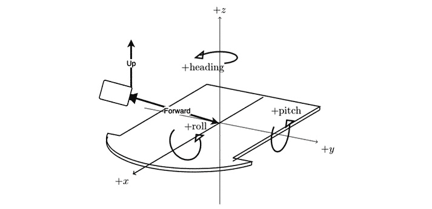

    ```py
    vp.scene.forward = vp.vector(-3, -1, -1) 
    ```

1.  一个轴告诉我们沿着哪个方向看，但不知道哪个方向是*向上*的。我们需要相机将其对“向上”的定义与机器人（Z轴向上）对齐；否则，向量可能会颠倒或偏斜：

    ```py
        vp.scene.up = vp.vector(0, 0, 1)
    ```

我们将在后面的章节中更多地使用这个姿态；然而，现在，看到Z轴现在是向上的，以及我们围绕不同轴旋转的位置是有用的。

现在，让我们设置陀螺仪以进行读取。

## 将陀螺仪添加到界面中

在我们可以读取陀螺仪之前，我们需要将其添加到我们的`robot_imu.py`接口中：

1.  我们将处理来自IMU的一些x、y和z组。我们将导入一个向量类型来存储这些。我在这里突出显示了新代码：

    ```py
    from icm20948 import ICM20948
    from vpython import vector
    ```

1.  向量是三个分量坐标系统的表示。现在，我们需要从底层IMU库中获取陀螺仪数据并将其存储在向量中：我们使用的`ICM20948`库没有返回仅陀螺仪数据的调用，但它有一个返回加速度计和陀螺仪数据的调用。

    这个`ICM20948`库将数据作为六个项目的列表返回。在Python中，当解包返回值时，下划线字符`_`可以表示忽略的内容。

1.  我们现在可以将三个陀螺仪值放入一个体向量中返回：

    ```py
            return vector(x, y, z)
    ```

IMU库现在已准备好供我们从中读取陀螺仪数据。接下来，我们将读取它并在图表上绘制数据。

## 绘制陀螺仪

正如我们之前提到的，陀螺仪测量旋转速率。它在每个轴上以每秒度数进行测量。

让我们绘制这个设备的输出图：

1.  创建一个名为`plot_gyroscope.py`的文件。

1.  我们将从导入、设置日志和IMU开始，就像我们之前做的那样：

    ```py
    import vpython as vp
    import logging
    import time
    from robot_imu import RobotImu
    logging.basicConfig(level=logging.INFO)
    imu = RobotImu()
    ```

1.  我们为陀螺仪输出的三个轴设置三个图表——X轴旋转、Y轴旋转和Z轴旋转。请注意，我们给每个图表分配了不同的颜色：

    ```py
    vp.graph(xmin=0, xmax=60, scroll=True)
    graph_x = vp.gcurve(color=vp.color.red)
    graph_y = vp.gcurve(color=vp.color.green)
    graph_z = vp.gcurve(color=vp.color.blue)
    ```

    这三个图表将叠加在同一行上。

1.  现在，我们需要设置一个开始时间，启动一个循环，并测量经过的时间：

    ```py
    start = time.time()
    while True:
        vp.rate(100)
        elapsed = time.time() – start
    ```

1.  我们现在可以读取IMU并将三个读数放入图表中：

    ```py
        gyro = imu.read_gyroscope()
        graph_x.plot(elapsed, gyro.x)
        graph_y.plot(elapsed, gyro.y)
        graph_z.plot(elapsed, gyro.z)
    ```

1.  上传文件并使用 `vpython plot_gyroscope.py` 运行它们。

1.  等待一分钟或更长时间，然后将浏览器指向 `myrobot.local:9020` ——这可能需要最多1分钟才能出现。

1.  开始移动机器人——抬起它并尝试在每个三个轴上倾斜。您应该看到以下图表：

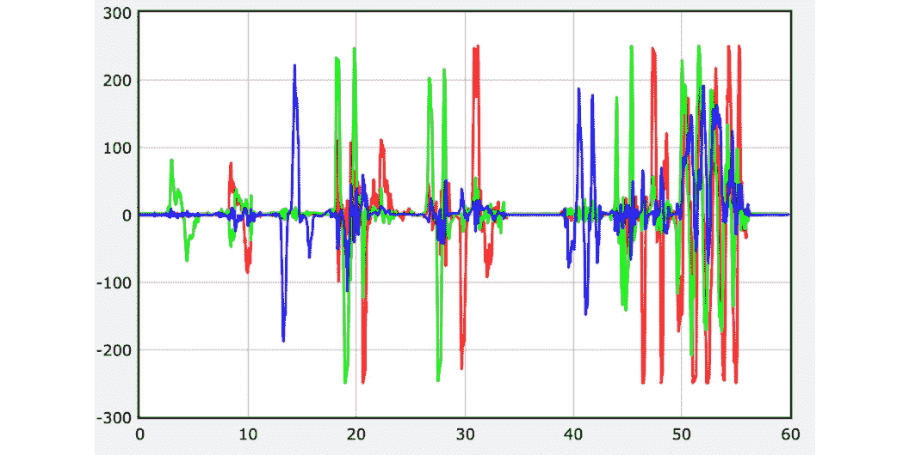

图12.16 – 陀螺仪数据的VPython图表

前面的图表包含三条线。Y轴显示每秒的移动速率（以度为单位），而X轴显示自程序开始以来的时间（以秒为单位）。屏幕上的图表以红色、绿色和蓝色显示。

当您进行移动时，图表会急剧上升，然后回到零。尝试将机器人的前部（鼻子）向下推；这在Y轴上是正的。绿色线条应该上升（在前面的图表中大约在3秒处）。如果您保持它在那里，线条将变平。当您将机器人放平时，线条上会有一个负的绿色峰值。现在，尝试通过围绕X轴旋转来抬起左手边，在您的图表上创建一个正的红色峰值。当您将其放平时，您将得到一个负峰值。接下来，尝试将机器人向左转；这将创建一个正的蓝色峰值。现在，如果您将其向右转，将创建一个负的蓝色峰值。围绕轴移动以了解这些测量值。

除非您一直在旋转机器人，否则您可能会发现保持任何转向力相当困难；这表明陀螺仪数据是转向速率，而不是方向的测量。更有用的事情是近似机器人的航向。当我们深入了解时，我们将学习如何使用陀螺仪数据来完成这项工作。

在本节中，您已经看到了陀螺仪以及它是如何通过一个展示这一原理的图表来测量旋转速率的。现在，让我们继续学习加速度计，以便我们可以看到作用在我们机器人上的力！

# 在Python中读取加速度计

在本节中，我们将学习如何使用加速度计来测量作用在机器人上的力，以及最常见的向下方向。让我们更深入地了解它，然后编写一些代码来查看它是如何工作的。

## 理解加速度计

加速度计测量加速度或速度的变化，包括大小和方向。它是通过提供三个值来做到这一点的——每个轴（X、Y和Z）一个值：

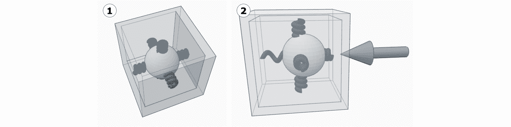

图12.17 – 加速度计概念 – 带弹簧的质量

前面的图示显示了加速度计的概念视图。让我们更详细地看看它：

1.  这显示了一个球（一个质量）被六个弹簧悬挂在盒子中。当盒子上没有力时，球保持在中间。

1.  这显示了当大箭头推动它时，这个系统是如何表现的。质量通过向右移动保持惯性，压缩右边的弹簧并拉伸左边的弹簧。

测量质量的位置显示了加速度的方向和大小。一个MEMS加速度计与这个设备类似，由一个微小的硅质量和弹簧构成。它测量随着质量移动而变化的电场。

在地球上，质量受到重力的向下拉力。这个系统表现得像一个力在支撑盒子向上，所以加速度计通常会记录一个向上的力。我们可以使用这个测量来确定向下方向，并感知机器人的倾斜。

## 将加速度计添加到界面中

让我们从向我们的`RobotImu`库添加加速度计测量开始：

1.  打开`robot_imu.py`文件。

1.  添加以下代码进行读取：

    ```py
        def read_accelerometer(self):
            accel_x, accel_y, accel_z, _, _, _ = self._imu.read_accelerometer_gyro_data()
            return vector(accel_x, accel_y, accel_z)
    ```

    这使用与陀螺仪相同的库调用；然而，现在它丢弃最后三个数据项，而不是前三个。

现在加速度计已经准备好读取，我们可以将其渲染出来，使数据可见。

## 将加速度计显示为向量

加速度是一个向量；它指向一个三维空间，具有方向和大小。展示这一点的一个好方法是在三维空间中画一个箭头。为了明确这个向量的位置，我们可以为X、Y和Z轴各画一个指示器：

1.  创建一个名为`accelerometer_vector.py`的文件。从一些简单的导入开始，包括机器人视图、日志设置和初始化IMU：

    ```py
    import vpython as vp
    import logging
    from robot_imu import RobotImu
    from robot_pose import robot_view
    logging.basicConfig(level=logging.INFO)
    imu = RobotImu()
    ```

1.  让我们从我们倾向于观察机器人的角度来看看：

    ```py
    robot_view()
    ```

1.  现在，我们想要定义四个箭头。VPython箭头沿着一个轴指向，可以设置其颜色和长度：

    ```py
    accel_arrow = vp.arrow(axis=vp.vector(0, 0, 0))
    x_arrow = vp.arrow(axis=vp.vector(1, 0, 0),
                       color=vp.color.red)
    y_arrow = vp.arrow(axis=vp.vector(0, 1, 0), 
                       color=vp.color.green)
    z_arrow = vp.arrow(axis=vp.vector(0, 0, 1), 
                       color=vp.color.blue)
    ```

1.  现在，我们可以开始主循环：

    ```py
    while True:
        vp.rate(100)
    ```

1.  读取加速度计并记录：

    ```py
        accel = imu.read_accelerometer()
        print(f"Accelerometer: {accel}")
    ```

1.  因为颠簸可能会使我们的刻度失效，我们将向量归一化，使其长度为1。我们需要将这个放入箭头轴中：

    ```py
        accel_arrow.axis = accel.norm()
    ```

1.  将此上传到Raspberry Pi，并用`vpython accelerometer_vector.py`启动它。将你的浏览器指向它，以查看以下输出：![img/B15660_12_18.jpg]

    图12.18 - 加速度计向量

    上一张图显示了三个彩色箭头——红色代表X轴（指向观察者），绿色代表Y轴（指向左侧），蓝色代表Z轴（指向上方）。有一个灰色箭头显示了加速度计向量。加速度计向上，这显示了它如何对抗重力而保持向上。

1.  现在，如果你倾斜机器人，箭头也会倾斜以显示相对于机器人的向上方向。你可以以几种方式倾斜机器人，看看感觉如何。

这很令人兴奋——你现在已经展示了相对于你的机器人，向上的方向在哪里。为了使用这个来旋转物体，我们需要将这个向量转换为俯仰角和横滚角，我们将在深入研究时学习如何做到这一点。

在本节中，你已经学会了如何从加速度计组件读取数据并将其显示为向量。现在，我们将继续学习IMU的下一个元素，即磁力计，并读取作用于我们系统的磁场。

# 使用磁力计

磁力计在3D空间中读取磁场强度以产生一个向量。你编写的代码可以使用这个向量来找到磁北极，就像指南针一样。在本节中，我们将更详细地了解这个设备，学习如何从它那里获取读数，并查看它产生的向量。

在一个磁铁很少的空间里可能很有用。让我们更深入地了解磁力计。

## 理解磁力计

指南针通过使用磁化的针或圆盘来测量地球磁场中的航向。以下是一张指南针的图片：


图12.19 – 一个传统的指南针

之前图像中显示的指南针有一个在中心针上平衡的旋转磁化圆盘。这种类型的是一个小型*按钮指南针*，直径约为25毫米。

我们选择的IMU包含一个称为**磁力计**的设备。这个设备可以电子感应磁场，并可以用作指南针。

大多数磁力计通过一个材料传递电流，当它暴露在磁场中时会产生电流，如下面的图示所示：

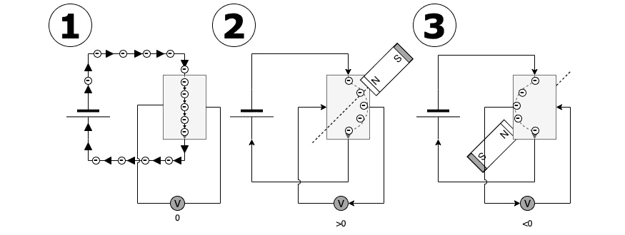

图12.20 – 一个霍尔效应传感器的风格化图片

以下图示展示了这一过程的例子：

1.  这个电路从电池（左侧）通过一个导电板（灰色矩形）传递电流。箭头显示了在电路中移动的电子（负电荷载体），它们从板的顶部直接移动到底部。板两侧的小圆圈内有V，是一个电压（电流量）传感器，连接到板的两侧。电压传感器读数为0，因为没有电流流向传感器。

1.  一个磁铁在板的上方，使电子偏转到一个方向。它们使板的这一侧带负电荷，另一侧带正电荷。这种电荷差异使电压通过传感器流动，如箭头所示。下面的读数现在高于零。

1.  将磁铁放在传感器的另一侧会改变磁场；电子偏转到另一侧，导致反向电压流动。指向仪表的箭头方向相反，读数显示电压低于零。

这被称为霍尔效应。通过测量三个板，你可以测量三维空间中的磁场。磁力计对磁场和金属物体很敏感。

另一个特点是，在某些IMU中，磁力计的轴与其他设备不同：

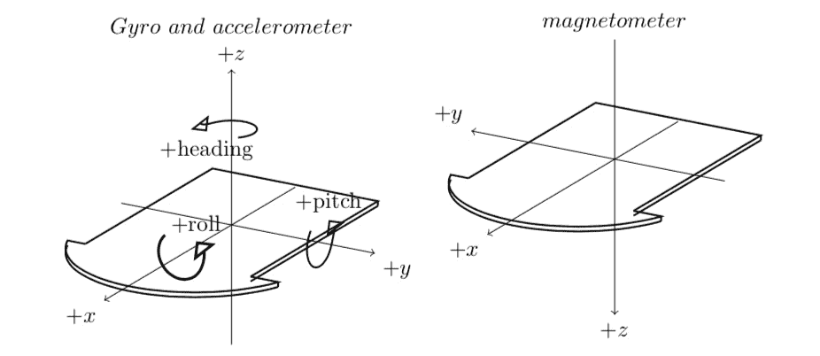

图12.21 – 磁力计的轴

在前面的图中，我们之前查看的轴在左侧显示为陀螺仪和加速度计的轴。在右侧，我们可以看到磁力计的轴。在这里，我们可以看到Z轴向下，Y轴现在向后。这就像我们在X轴周围旋转了180度。

现在，让我们添加一些代码，以便我们可以读取这些信息。

## 添加磁力计接口

我们将以相同的方式封装这个，即通过将其添加到我们的接口库中：

1.  打开`robot_imu.py`文件。

1.  在`RobotIMU`类中，在`read_gyroscope`方法之后，添加新的读取方法：

    ```py
        def read_magnetometer(self):
    ```

1.  与加速度计和陀螺仪不同，它从底层的设备库中读取数据。我们将这个封装起来并返回一个向量。为了进行180度的俏皮旋转，我们取反Y和Z轴：

    ```py
            mag_x, mag_y, mag_z = self._imu.read_magnetometer_data()
            return vector(mag_x, -mag_y, -mag_z)
    ```

现在这个接口已经准备好使用，让我们获取一些读数。

## 显示磁力计读数

我们可以可视化的方法之一是将磁力计输出转换为向量，如下所示：

1.  创建一个名为`magnetometer_vector.py`的文件。

1.  添加熟悉的导入和设置：

    ```py
    import vpython as vp
    import logging
    from robot_imu import RobotImu
    from robot_pose import robot_view
    logging.basicConfig(level=logging.INFO)
    imu = RobotImu()
    robot_view()
    ```

1.  现在，我们将创建一个表示磁力计读数的箭头，以及参考X、Y和Z轴：

    ```py
    mag_arrow = vp.arrow(pos=vp.vector(0, 0, 0))
    x_arrow = vp.arrow(axis=vp.vector(1, 0, 0), color=vp.color.red)
    y_arrow = vp.arrow(axis=vp.vector(0, 1, 0), color=vp.color.green)
    z_arrow = vp.arrow(axis=vp.vector(0, 0, 1), color=vp.color.blue)
    ```

1.  接下来，我们开始主循环：

    ```py
    while True:
        vp.rate(100)
    ```

1.  现在，我们可以读取磁力计：

    ```py
        mag = imu.read_magnetometer()
    ```

1.  最后，让我们设置一个与这个向量匹配的箭头轴。我们可以使用`.norm()`方法来归一化这个向量。我们还需要打印数据：

    ```py
        mag_arrow.axis = mag.norm()
        print(f"Magnetometer: {mag}")
    ```

1.  将此发送到机器人，并使用常规的VPython设置运行它。你应该会看到以下内容：


图12.22 – 磁力计的读数

前面的图像显示了一个画布，其中X轴用指向前的红色箭头表示，Z轴用指向上的蓝色箭头表示，Y轴用指向右的绿色箭头表示。还有一个表示磁力计向量的灰色箭头，它指向后方（仅XZ轴）。

你的箭头可能指向的方向与我的不同。这是因为它很可能指向你的IMU上的插针头位置。为什么是这样？

插针头通常由磁性金属制成。你可以亲自检查一下，用磁铁看看它是否粘附在插针头上（使用一些备件或断电时进行此操作）。你也应该能够观察到这对箭头的影响。你也可以拿一些金属，比如螺丝刀，在磁力计周围挥动。这应该会让结果四处飞溅。

之后，我们需要补偿附近金属的影响，因为它可能会产生很大的偏移，大到足以完全压倒地球相对较弱的地磁场。

# 摘要

在本章中，你学习了如何读取惯性测量单元上的四个传感器，以及如何显示或绘制数据。然后你有了第一次焊接经验——这是制作机器人的关键技能。你还学习了关于机器人坐标系的内容。

在本书的后面部分，我们将更深入地探讨如何将IMU传感器编织在一起，以获得机器人方向的近似值。

在下一章中，我们将探讨计算机视觉；也就是说，如何从摄像头中提取信息并使机器人对其所看到的内容做出反应。

# 练习

+   在温度图表中，你会在图表和输出中注意到很多噪声。Python的`round`函数接受一个数字和要保留的小数位数，默认为0。使用这个函数将温度四舍五入到更合理的值。

+   尝试将加速度计的值放入一个X、Y和Z图中，就像我们为陀螺仪所做的那样。当你移动机器人时，观察图表中的变化。它是平滑的，还是有噪声？

+   陀螺仪的值能否以向量的形式显示？

+   是否有其他可以焊接的传感器，你可能觉得对你的机器人使用很有趣？

# 进一步阅读

请参考以下链接，获取有关本章所涵盖内容的更多信息：

+   想要了解更多关于VPython的信息，请查看[https://www.glowscript.org/docs/VPythonDocs/index.html](https://www.glowscript.org/docs/VPythonDocs/index.html)提供的详细帮助文档。

+   Paul McWarter使用IMU的Arduino实验：[https://toptechboy.com/arduino-based-9-axis-inertial-measurement-unit-imu-based-on-bno055-sensor/](https://toptechboy.com/arduino-based-9-axis-inertial-measurement-unit-imu-based-on-bno055-sensor/)。

+   Adafruit提供了使用其库与IMU配合使用的指南：[https://learn.adafruit.com/adafruit-sensorlab-magnetometer-calibration](https://learn.adafruit.com/adafruit-sensorlab-magnetometer-calibration)。

+   Google的这个YouTube讲座包含了关于*Android设备上的传感器融合：运动处理革命*主题的极好信息：[https://www.youtube.com/watch?v=C7JQ7Rpwn2k](https://www.youtube.com/watch?v=C7JQ7Rpwn2k)。
