# 第十七章：*第14章*：使用Python进行相机线跟踪

在上一章中，我们学习了如何使用相机来追踪和跟踪物体。在本章中，我们将扩展相机代码以创建线感应行为。

我们将探讨机器人使用线跟踪的地方以及它的有用性。我们还将了解不同机器人中跟踪路径的不同方法，以及它们的权衡。你将看到如何构建一个简单的线跟踪轨道。

我们将了解一些不同的算法来使用，然后选择一个简单的算法。我们将制作一个数据流图来查看其工作原理，收集样本图像进行测试，并根据样本图像调整其性能。在这个过程中，我们将看到更多处理计算机视觉和从中提取有用数据的方法。

我们将增强我们的PID代码，将我们的线检测算法集成到机器人驾驶行为中，并看到机器人使用这种方式运行。本章结束时，我们将讨论如何进一步发展这一想法。

在本章中，我们将涵盖以下主要主题：

+   线跟踪简介

+   制作线跟踪测试轨道

+   线跟踪计算机视觉流程

+   使用测试图像尝试计算机视觉

+   使用PID算法进行线跟踪

+   再次找到线条

# 技术要求

对于本章，你需要以下物品：

+   机器人及其代码来自[*第13章*](B15660_13_Final_ASB_ePub.xhtml#_idTextAnchor283)，*机器人视觉 – 使用Pi相机和OpenCV*

+   一些白色或黑色绝缘胶带

+   一些A2纸或板子 – 与绝缘胶带相反的颜色

+   一把剪刀

+   良好的照明

本节代码可在[https://github.com/PacktPublishing/Learn-Robotics-Programming-Second-Edition/tree/master/chapter14](https://github.com/PacktPublishing/Learn-Robotics-Programming-Second-Edition/tree/master/chapter14)找到。

查看以下视频以查看代码的实际应用：[https://bit.ly/3slLzbQ](https://bit.ly/3slLzbQ)

# 线跟踪简介

在我们开始编写代码之前，让我们了解一下线跟踪机器人的行为，这些系统在哪里以及如何使用它们，以及不同的实现技术。

## 什么是线跟踪？

一些机器人需要在任务中保持特定的路径。对于机器人来说，导航线条比规划整个房间或建筑物的地图要简单。

简而言之，线跟踪是指能够自主地跟随标记路径。这些可以是视觉标记，例如蓝色胶带或黑色道路上的一条白色线条。当机器人沿着线条行驶时，它将不断寻找前方线条的位置，并纠正航向以跟随该线条。

在机器人竞赛中，沿着线条进行比赛是一个常见的挑战，准确性之后速度至关重要。

## 工业应用

线路跟踪行为最常见的使用场景是工业领域。被称为**自动导引车**（**AGVs**）的机器人需要因多种原因遵循既定路径。这些任务可以是仓库机器人保持在堆叠产品通道之间的轨道上，或者工厂机器人保持在远离其他工作区域的路径上。线路可能标记了存储货架和装货区或机器人充电站和机器人工作区之间的路线：

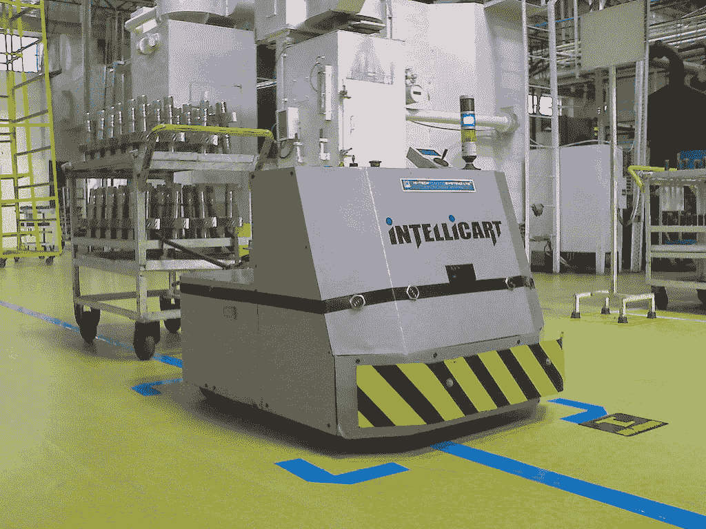

图14.1 – IntellCart – Mukeshhrs的线路跟踪工业机器人[公有领域]

如*图14.1*所示的IntelliCart使用明亮的蓝色引导胶带，尽管在大多数工业应用中，机器人使用地板下的磁轨。

路线可能包括选择点，从特定位置发出多条线路。根据其任务，机器人可能需要额外的线索来感知它已经到达这些点。工程师可以为完全自动化的系统设置重复路径。

这些明确的标记意味着你可以设置安全边界，并清楚地了解人类和机器人是否互动；这意味着机器人很少会在人们不太了解的区域外操作。

## 线路跟踪类型

线路跟踪和相关系统有几个主要分支。

**视觉线路跟踪**是目前最常见且易于设置的线路跟踪技术。它由机器人检测到的涂画、绘制或贴上的视觉线路组成。光学线路简单，但表面污垢和光照条件可能会使其不可靠。检测方式主要分为以下几类：

+   **通过光传感器检测**：在这种情况下，我们将小型传感器附着在机器人底部靠近线路的位置。它们被调整以输出二进制开/关信号或模拟信号。它们通常有灯光照射到表面。这些传感器体积小且价格低廉，但需要额外的I/O。

+   **通过摄像头检测**：如果你已经使用摄像头，并且有I/O引脚，这将节省空间。它简化了安装和布线的复杂性。然而，这需要在软件复杂性上做出权衡，因为你的机器人需要计算机视觉算法来分析这些。

**磁性线路跟踪**用于需要保护线路免受外界因素影响的情况。对于这种变化的某些变体，你可以引导机器人在多条路径上。以下是一些变体：

+   在地板上运行磁条，可以让霍尔效应传感器（如[*第12章*](B15660_12_Final_ASB_ePub.xhtml#_idTextAnchor251)，*使用Python进行IMU编程*）检测磁条的位置。一系列这样的传感器可以确定线路的方向并跟随它。这比画线路更容易更改，但可能成为绊脚石。

+   在地板上或其下方运行带有电流的电线，可以达到相同的效果。通过多条电线和一些不同的电路，系统可以将机器人引导到不同的路径上。

+   在地板下隐藏线条消除了绊倒危险，但意味着您需要在工业机器人跟随的路径上为人类画上警告标记。

现在，您已经看到了两种主要的线跟踪类型；值得提一下其他一些在现实世界中确定机器人路径的方法：

+   **信标**：超声波、发光或无线电发射的信标可以放置在环境中以确定机器人的路径。这些可能是激光或其他光线的反射器。

+   **视觉线索**：如果您在墙壁和柱子上放置二维码或其他可见标记，它们可以编码一个精确的位置。

您已经看到了机器人如何通过可见线条和隐藏线条（如地板下的电线和磁传感器）进行线感应。因为它更容易，我们将使用可见线条。

简单的光学传感器需要额外的布线，但如果我们已经有一个能够做到这一点的相机，为什么不利用它呢？

在本章中，我们将专注于使用我们已有的相机和视觉轨道进行跟踪，并跟随那里的线条。我们将接受代码的复杂性，同时简化我们机器人的硬件方面。

现在您已经对不同的线跟踪类型及其使用场合有了些了解，让我们创建一个机器人可以跟随的测试轨道。

# 制作一条线跟踪测试轨道

由于您将使您的机器人跟随一条线，我们需要从一个要跟随的线条部分开始。该轨道最初将用于测试我们的线检测算法，然后当我们打开电机并开始沿着线条行驶时，可以将其扩展到更令人兴奋的轨道。在本节中，我将向您展示的是易于制作和可扩展的。它允许您尝试不同的线条形状和曲线，并观察机器人如何响应。

您甚至可以尝试不同的颜色和对比度选项。

## 准备测试轨道材料

以下照片显示了所需的主要材料：

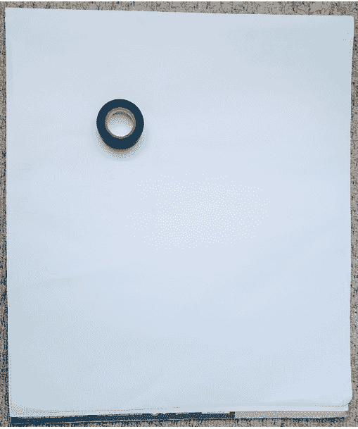

图14.2 – 制作测试轨道的材料

*图14.2*中的照片显示了一卷黑色电气胶带铺在一张大白纸上。对于本节，您需要以下材料：

+   一些A2纯白色纸张或板。

+   一些黑色电气绝缘胶带或油漆工胶带。确保这种胶带是不透明的。

+   一把剪刀。

如果它们是白色涂漆的，您可以用板子替换纸张。

您也可以通过使用黑色或深色纸张和白色胶带来更换物品。这种胶带必须是半透明的，以便与背景形成良好的强烈对比。

## 制作一条线

将纸张平铺。然后，用胶带在纸张中间画一条线：

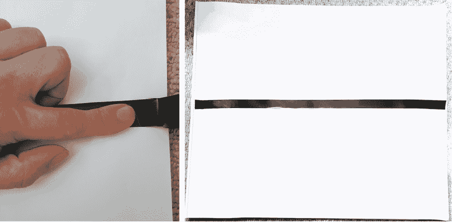

图14.3 – 在纸张上平滑胶带

*图14.3*中的照片显示了带有胶带线条的纸张和我用手指抚平胶带的情景。确保将胶带抚平。你不需要担心使其完全笔直，因为这个系统的整个目的就是在线条弯曲时也能跟随线条。

一旦你在纸上贴上几段这样的胶带，为什么不制作一些有趣的部件，比如以下图中的那些：

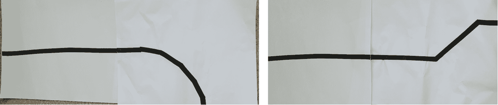

图14.4 – 一些与直线相邻的不同形状

如*图14.4*所示，你可以尝试曲线和故意不完全直的线条。你可以将这些线条与直线结合起来，形成整个区域，就像一个机器人火车套装！这些线条在后续调整和玩转跟随代码时将会很有趣。

现在我们已经准备好了测试轨道，我们可以考虑如何视觉处理线条。

# 跟随线条的计算机视觉流程

正如我们在之前的计算机视觉任务中所做的那样，我们将将其视为一个流程。在我们这样做之前，有许多使用计算机视觉跟踪线条的方法。

## 摄像头线条跟踪算法

我们有兴趣选择其中最简单的一个，但就像往常一样，总有一个权衡，那就是其他算法可以处理更复杂的情况或比我们的算法更好地预测曲线。

这里是一些我们可以使用的方法：

+   **使用边缘检测**: 可以运行边缘检测算法，例如Canny边缘检测器，对图像进行处理，将找到的任何过渡转换为边缘。如果我们想使用这个系统，OpenCV内置了边缘检测系统。该系统可以检测从暗到亮和从亮到暗的边缘。它对不太尖锐的边缘更加宽容。

+   **沿线条寻找差异**: 这就像 cheeky 边缘检测，但只针对特定的一行。通过在图像中每一行的每个像素之间找到差异，任何边缘都会显示出显著差异。它比Canny算法简单且成本低；它可以处理任意方向的边缘，但需要尖锐的对比度。

+   **寻找亮度和使用绝对亮度区域作为线条**: 这非常简单，但过于简单，难以给出好的结果。它对反转不敏感，但不需要跟踪边缘，因此不需要尖锐的对比度。

使用前面三种方法中的一种，你可以在一个图片区域找到线条，并直接瞄准那里。这意味着你将无法预先预测路线变化。这是最简单的方法。所选区域可能是屏幕底部的单行。

或者，你可以使用前面的方法来检测摄像头图像中的线条并为其绘制轨迹。这更复杂，但更能应对更陡峭的转弯。

值得注意的是，我们可以使用Pi摄像头的原始YUV数据制作一个更高效但更复杂的算法。为了简单起见，我们将坚持使用简单的算法。随着你在复杂性和理解上的进一步交易，你可以找到更快、更准确的方法。

我们系统的另一个主要限制是摄像头的视野宽度。你可以使用镜头让摄像头捕捉更宽的视觉范围，这样机器人就不会经常丢失线条。

我们将使用的方法是沿着线条寻找差异，因为它简单且能够应对不同的线条颜色。我们还将简单地沿着单列查找，这导致数学更加直接。

## 管道

我们可以将数据处理方式视为一个管道。在我们这样做之前，让我们快速解释一下离散差异。每个像素的亮度是一个介于0（黑色）和255（白色）之间的数字。为了得到差异，你从每个像素减去它右侧的像素：

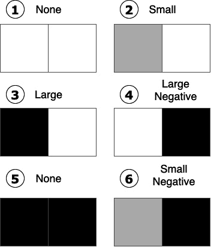

图14.5 – 像素之间的离散差异

在*图14.5*中，有六组不同色调的像素：

1.  第一幅图显示了两个白色像素。它们之间没有差异。

1.  当灰色像素后面跟着白色像素时，会产生一个小的差异。

1.  黑色像素后面跟着白色像素会产生一个大的差异。

1.  白色像素后面跟着黑色像素会产生一个大的负差异。

1.  黑色像素后面跟着黑色像素不会产生差异。

1.  灰色像素后面跟着黑色像素会产生一个小的负差异。

应该很容易看出，对比度高的线条边缘会产生最大的差异，无论是正的还是负的。我们的代码将寻找这些差异。

下面的图示展示了我们如何处理该方法的摄像头数据：


图14.6 – 寻找线条的图像处理管道

在*图14.6*中，我们展示了寻找跟随线条的过程。它从**摄像头**开始，我们从320×240像素分辨率的摄像头**捕获图像**。管道中的下一步是将图像**转换为灰度** – 我们现在只对亮度感兴趣。

由于图像可能有噪声或颗粒，我们**模糊**它；这并不是严格必要的，这取决于你从哪个清晰的环境中拍照。

我们从这个图像中**切出候选行**；这个行不应该太高，因为那条线可能太远，或者根据摄像头的位置，地平线以上可能有随机的东西。行也不应该太低，因为它会离机器人太近，以至于它无法及时反应。在**切出候选行**框上方是一个示例，展示了切出的行和它来自的图像。

我们然后将这一行视为一组数字，并**获取它们之间的离散差异**。在**离散差异**框上方的图表显示，当行从浅灰色变为黑色时，出现一个大的负峰值，随后当行再次从黑色变为浅灰色时，出现一个大的正峰值。注意，图表的大部分显示为零线，因为颜色块之间没有差异。

下一步是**找到最大和最小位置**，具体来说是在行中的哪个位置。我们想要的是高于零的最高点的位置/索引和低于零的最低点的位置/索引。现在我们知道了我们线条的边界可能在哪里。

我们可以通过将这些边界**之间的位置**相加并除以2来找到线条的中心，这将是一个相对于相机图像中间的*X*位置。

现在，您已经看到了一些测试图像的流程。是时候获取一些自己的测试图像，并尝试使用一些代码来运行这个算法了。

# 尝试使用测试图像进行计算机视觉

在本节中，我们将探讨如何以及为什么使用测试图像。我们将为这种行为编写我们的第一段代码，并在机器人的相机测试图像上尝试它。这些测试将为我们使用代码来控制机器人做准备。

## 为什么使用测试图像？

到目前为止，我们的计算机视觉工作都是直接与机器人行为一起编写的；这是它们的目标，但有时，您可能想要单独尝试视觉处理代码。

可能您想要让它工作或找出其中的错误，或者您可能想要看看您是否可以使代码更快并对其进行计时。为此，在机器人控制系统之外运行该特定代码是有意义的。

使用测试图像也是合理的。因此，您不必运行相机并需要光照条件，您可以使用您已经捕捉到的测试图像，并将它们与您从它们期望的结果进行比较。

对于性能测试，尝试同一图像100次或同一组图像将给出一致的结果，以便性能指标有意义。避免每次都使用新数据，因为这些可能会导致意外或可能是有噪声的结果。然而，添加新的测试图像以查看会发生什么是非常有趣的。

既然我们现在知道了为什么使用它们，让我们尝试捕捉一些测试图像。

## 捕捉测试图像

您可能还记得，在前一章中，我们使用`raspistill`来捕捉图像。我们在这里也将这样做。首先，我们想要将我们的相机放置到一个新的位置，朝下，这样我们就可以俯视线条。

本节需要从第[*第13章*](B15660_13_Final_ASB_ePub.xhtml#_idTextAnchor283)的设置中获取，*使用Pi相机和OpenCV进行机器人视觉*，以及从[*第9章*](B15660_09_Final_ASB_ePub.xhtml#_idTextAnchor171)的代码，*在Python中编程RGB条带*。

将电机功率打开到Raspberry Pi上，然后在机器人上的Raspberry Pi上通过`ssh`会话，输入以下命令：

1.  我们通过键入`python3`开始Python：

    ```py
    pi@myrobot:~ $ python3
    Python 3.7.3 (default, Dec 20 2019, 18:57:59) 
    [GCC 8.3.0] on linux
    Type "help", "copyright", "credits" or "license" for more information.
    >>> 
    ```

1.  现在，我们需要导入我们的机器人对象并创建它，以便我们可以与之交互：

    ```py
    >>> import robot
    ```

1.  让我们创建机器人对象：

    ```py
    >>> r = robot.Robot()
    ```

1.  现在，使用此方法将水平伺服机构设置为中间位置：

    ```py
    >>> r.set_pan(0)
    ```

    水平伺服机构应该使相机居中。

1.  接下来，我们将倾斜伺服机构设置为向下，以便观察线条：

    ```py
    >>> r.set_tilt(90)
    ```

    伺服机构应该在这里直视下方。它不应该过度拉伸或发出咔哒声。

1.  现在，您可以通过按*Ctrl* + *D*退出Python（并释放电机）。

    相机面向下方。现在您可以关闭电机开关，并将这个机器人放到您的测试轨道上。尽量将机器人定位，使相机正好位于线条上方。

1.  在`ssh`终端中，键入以下内容以捕获测试图像：

    ```py
    $ raspistill -o line1.jpg
    ```

您现在可以使用FileZilla（正如本书前面的章节所讨论的）将此图像下载到您的PC上。下一张图显示了一个测试图像，也用于前面的示例：

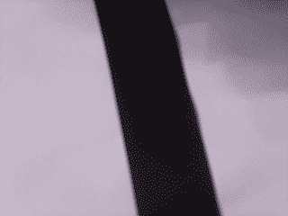

图14.7 – 一条线的测试图像

*图14.7* 展示了我的一张测试图像。请注意，线条大致从图片中间开始，但并不精确，也不需要精确。还要注意，光线有点粗糙，产生了阴影。这些值得注意，因为它们可能会使系统混淆。

从不同的角度捕捉机器人几条线的图像，稍微向左或向右偏离相机。

现在我们有了测试图像，我们可以编写代码来测试它们！

## 编写Python代码以找到线条的边缘

我们准备开始编写代码，使用我们的测试图像和前面的流程图。我们可以使结果非常直观，以便我们可以看到算法正在做什么。

提示

在计算机视觉中，使用最低的分辨率来完成工作是有用的。每个额外的像素都会增加更多的内存和处理能力。在320*200的分辨率下，这是76,800个像素。树莓派相机可以以1920 x 1080的分辨率记录 – 2,073,600个像素 – 这是27倍的数据！我们需要它快速，所以我们保持低分辨率。

本节中的代码将在树莓派上运行，但您也可以在安装了Python 3、NumPy、Matplotlib和Python OpenCV的PC上运行：

1.  创建一个名为`test_line_find.py`的文件。

1.  我们将需要导入NumPy以数值处理图像，OpenCV以操作图像，以及Matplotlib以绘制结果：

    ```py
    import cv2
    import numpy as np
    from matplotlib import pyplot as plt
    ```

1.  现在，我们加载图像。OpenCV可以加载`jpg`图像，但如果在加载过程中出现问题，它会产生一个空图像。因此，我们需要检查它是否加载了某些内容：

    ```py
    line1.jpg and is in the same directory that we will run this file from.
    ```

1.  捕获的图像将是相机的大默认分辨率。为了保持快速，我们将它调整到更小的图像：

    ```py
    resized = cv2.resize(image, (320, 240))
    ```

1.  我们还只想使用灰度；对于这个练习，我们不感兴趣的其他颜色：

    ```py
    gray = cv2.cvtColor(resized, cv2.COLOR_BGR2GRAY)
    ```

1.  现在，我们将选择行；目前，我们将使用180，因为这在240像素高的图像上相当低。图像是存储的，使得行0是顶部。请注意，我们正在告诉NumPy将其转换为`int32`类型：

    ```py
    int32 with a sign (plus or minus) so that our differences can be negative.
    ```

1.  我们可以为这一行的每个像素获取差异列表。NumPy使这变得容易：

    ```py
    diff = np.diff(row)
    ```

1.  我们将要绘制这个`diff`列表。我们需要将*x*轴设置为像素编号；让我们创建一个从0到该范围的NumPy范围：

    ```py
    x = np.arange(len(diff))
    ```

1.  让我们绘制`diff`变量与像素索引（`x`）的关系图，并将结果保存：

    ```py
    not_blurred. This is because we've not added the optional blurring step. With the graph, we'll be able to see the difference. 
    ```

指向我的测试图片，我得到了以下图表：


图14.8 – 无模糊差异图

图14.8中的图表以列数作为*x*轴，差异作为*y*轴。线条中有很多噪声。有两个明显的峰值 – 一个在约列145的零线以下，一个在约240的线上方。这里的噪声不会对此产生太大影响，因为峰值非常明显：

1.  让我们尝试添加模糊以查看这如何改变事情。对代码进行以下更改。粗体区域显示更改的部分：

    ```py
    gray = cv2.cvtColor(resized, cv2.COLOR_BGR2GRAY)
    blurred = cv2.blur(gray, (5, 5))
    row = blurred[180].astype(np.int32)
    diff = np.diff(row)
    ```

    在此代码中，我们添加了额外的模糊步骤，模糊5x5块稍微一点。

1.  为了我们可以看到不同的图表，让我们更改输出文件的名称：

    ```py
    plt.savefig("blurred.png")
    ```

稍微模糊应该可以减少噪声，同时不会太多地影响我们的尖锐峰值。确实，以下图显示了这是多么有效：

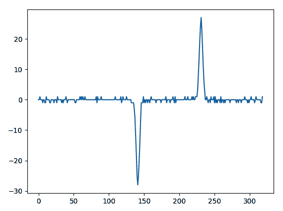

图14.9 – 模糊后的diff图

图14.9中的图表与图14.8相似。坐标轴相同，并且有相同的峰值。然而，在0附近的线条周围的噪声少得多，这表明模糊使差异更清晰。关于这个问题，我认为不会改变结果太多。从峰值的位置和大小来看，我会说不会太多。因此，我们可以将其从最终跟踪中省略，以获得额外的速度。每个操作都会花费一点时间。

现在我们有了两个峰值，让我们使用它们来找到线条的位置。

## 从边缘定位线条

那些峰值是我们线条边缘的标记。要找到某物的中间位置，你将其左右坐标相加，然后除以2：

1.  首先，我们必须获取坐标。让我们编写代码来请求最大值和最小值。我们将在分析代码和图表输出代码之间添加此代码：

    ```py
    diff = np.diff(row)
    min_d and max_d, abbreviating the difference as d. Note that they cannot be called min and max as those names already belong to Python.
    ```

1.  这些是值，但不是位置。我们现在需要找到位置索引。NumPy有一个`np.where`函数可以从数组中获取索引：

    ```py
    where function returns an array of answers for each dimension – so, although diff is a one-dimensional array, we will still get a list of lists. The first [0] selects this first dimension's results list, and the second [0] selects the first item in the results. Multiple results mean it's found more than one peak, but we assume that there's only one for now.
    ```

1.  要找到中间位置，我们需要将它们相加然后除以2：

    ```py
    middle = (highest + lowest) // 2
    ```

1.  现在我们已经找到了它，我们应该以某种方式显示它。我们可以在图上用三条线绘制这个图表。Matplotlib可以为图表指定颜色和样式。让我们从中间线开始：

    ```py
    max_d and min_d for the Y coordinates, so the line draws from the highest peak to the lowest. The r- style specifier means to draw a solid red line.
    ```

1.  我们可以为`highest`和`lowest`位置做同样的事情，这次使用`g--`为绿色虚线：

    ```py
    plt.plot([lowest, lowest], [max_d, min_d], "g--")
    plt.plot([highest, highest], [max_d, min_d], "g--")
    ```

1.  就像我们对模糊处理所做的那样，让我们更改输出图的名称，以便我们可以进行比较：

    ```py
    plt.savefig("located_lines.png")
    ```

运行此代码应输出以下图：

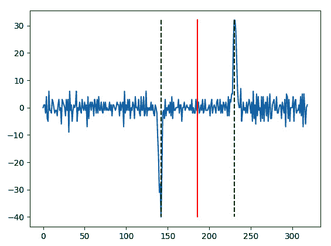

图14.10 – 显示最高、最低和中间线的图

*图14.10*中的图表显示我们已经找到了中线以及两个清晰的峰值。这段代码看起来对我们的机器人是可用的。

然而，当事情并不那么清晰时会发生什么？

## 尝试没有清晰线条的测试图片

让我们看看我们的线条查找代码在非常不同的测试图片上的表现。我们将看到这里会发生什么，这样我们就不那么惊讶于机器人的行为，并排除一些简单的错误。

例如，把我们的线条放在一个非常嘈杂的表面上，比如地毯上？或者没有线条的纸张，或者没有线条的地毯呢？

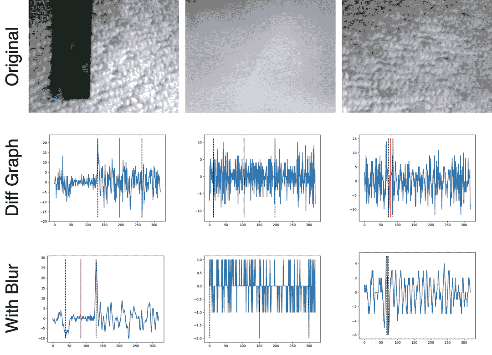

图14.11 – 在更嘈杂条件下的差分图

通过像*图14.11*中的一系列图表，我们对我们系统了解了很多。

最上面的三张图片显示了原始照片。接下来的三张图表显示了在没有模糊的情况下寻找差异和中线时的图像外观。最下面的三张图表显示了启用模糊时会发生什么。

首先，当事情变得像第一张图片那样嘈杂（这已经超出了循线应该应对的范围），模糊使得找到线条和随机伪影之间的差异；尽管如此，在第二个图表中，一个具有类似向下峰值大小的随机伪影是一个接近的竞争者。在这种情况下，制作更大的*Y*模糊可能会平滑掉那个伪影，只留下线条。

仔细观察，那些图表的刻度尺也不相同。普通纸张图表在没有模糊的情况下测量+10/-10的峰值，而在模糊的情况下为+1/-1。因此，当差异如此之低时，我们甚至应该寻找峰值吗？地毯-only图表中的情况也类似。

我们可以对系统进行一些更改，使其将这些视为非线条。最简单的是添加一个条件，过滤掉-5以上的最小值和10以下的最大值。我说-5，因为否则会完全过滤掉第一张图中的线条。然而，更大的模糊区域可能会有所帮助。

根据条件的嘈杂程度，我们可能需要启用模糊。在光线充足的轨道上，模糊可能不是必需的。

下一个图表显示了我们的线条在地毯上，模糊设置为（5，40），进一步在行之间模糊并过滤掉更多的噪声：

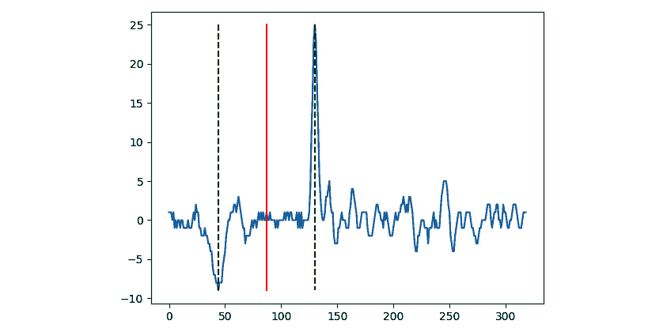

图14.12 – 带有更大模糊的地毯上的线条

*图14.12*中的图表比之前有更少的噪声，模糊处理大大平滑了噪声尖峰，而实际的线条尖峰仍然存在。我们只会在嘈杂的环境中这样做，因为它可能会使速度变慢。

如您所见，在测试图像上测试代码使我们对我们系统了解了很多。通过拍摄相同的照片并尝试不同的参数和管道更改，您可以针对不同的场景进行优化。随着您在计算机视觉方面的实验越来越多，养成这个习惯。

现在我们已经尝试在我们的测试图像上运行我们的视觉处理代码，是时候将其应用于机器人行为上了！

# 使用PID算法的循线

在本节中，我们将结合之前看到的视觉处理、PID控制循环和相机流，以及在第13章中看到的[*第13章*](B15660_13_Final_ASB_ePub.xhtml#_idTextAnchor283)，*机器人视觉 - 使用Pi相机和OpenCV*。请从该章节中的代码开始。

你将需要的文件如下：

+   `pid_controller.py`

+   `robot.py`

+   `servos.py`

+   `camera_stream.py`

+   `image_app_core.py`

+   `leds_led_shim.py`

+   `encoder_counter.py`

+   模板文件夹

我们将使用相同的模板来显示这个，但我们将添加一种快速而巧妙的方法，将OpenCV上的`diff`图渲染到输出帧上。Matplotlib对于这个来说太慢了。

## 创建行为流程图

在我们构建新的行为之前，创建一个数据流图将帮助我们了解处理数据后数据发生了什么。

系统看起来很熟悉，因为它与我们第13章中制作的非常相似[*第13章*](B15660_13_Final_ASB_ePub.xhtml#_idTextAnchor283)，*机器人视觉 - 使用Pi相机和OpenCV*。看看下面的图：

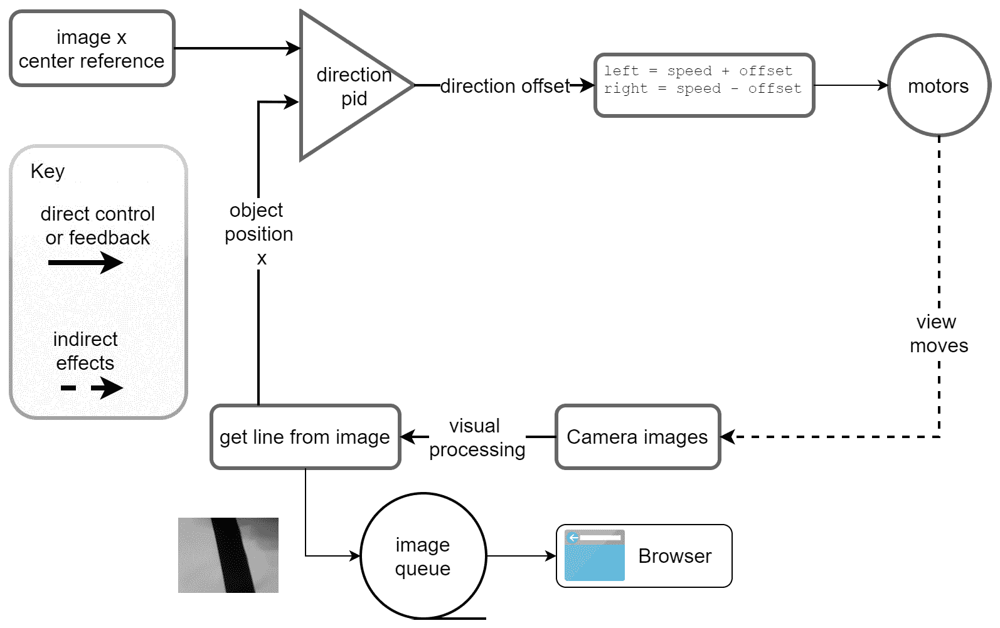

图14.13 – 跟线行为

在*图14.13*中，相机图像通过到**从图像获取线**块。该块输出对象的*X*位置（线的中间），它进入我们的PID。请注意，图像数据也从获取线到图像队列，这样你就可以在浏览器中看到这些数据。

PID控制还取一个参考中间点，即相机的中间。它使用这些之间的误差来计算偏移，并使用该偏移来驱动电机。

该图显示了带有反馈线到摄像头的电机，因为这些移动的间接影响是视图发生变化，所以我们将看到不同的线。

在此之前，我们将使我们的PID控制器变得更聪明一些。

## 将时间添加到我们的PID控制器

我们的机器人行为包括处理帧，然后在过程完成一个周期时将错误数据发送到PID。一个周期中有很多事情发生，时间可能会变化。当我们创建积分时，我们一直像时间恒定一样添加数据。为了得到一个更准确的图像，我们应该乘以时间：

1.  打开`pid_controller.py`文件。

1.  在`handle_integral`方法中，将参数更改为接受`delta_time`：

    ```py
        def handle_integral(self, error, delta_time):
    ```

1.  然后我们将使用这个方法来添加积分项：

    ```py
                self.integral_sum += error * delta_time
    ```

1.  我们通常使用`get_value`方法来更新PID；然而，由于我们已经有使用这个方法的代码，我们应该让它对这些代码的行为保持不变。为此，我们将添加一个`delta_time`参数，但默认值为`1`：

    ```py
        def get_value(self, error, delta_time=1):
    ```

1.  当这个`get_value`方法调用`handle_integral`时，它应该始终传递新的`delta_time`参数：

    ```py
            p = self.handle_proportional(error)
            i = self.handle_integral(error, delta_time)
            logger.debug(f"P: {p}, I: {i:.2f}")
            return p + i
    ```

虽然这不是一个很大的变化，但它意味着我们可以计算PID代码更新之间的时间变化。

我们现在可以在我们的行为中使用这个方法。

## 编写初始行为

我们可以将所有这些元素组合起来，创建我们的循线行为：

1.  创建一个名为`line_follow_behavior.py`的文件。

1.  首先，我们需要导入`image_app_core`、NumPy、OpenCV、摄像头流、PID控制器和机器人。我们还有`time`模块，这样我们就可以稍后计算时间差：

    ```py
    import time
    from image_app_core import start_server_process, get_control_instruction, put_output_image
    import cv2
    import numpy as np
    import camera_stream
    from pid_controller import PIController
    from robot import Robot
    ```

1.  让我们创建行为类。构造函数，就像之前一样，接受机器人作为参数：

    ```py
    class LineFollowingBehavior:
        def __init__(self, robot):
            self.robot = robot
    ```

1.  现在，我们需要在构造函数中添加变量来跟踪我们的行为。首先，我们应该设置我们将要查找差异的行和阈值（低于该阈值我们不将其视为线条）：

    ```py
            self.check_row = 180
            self.diff_threshold = 10
    ```

1.  就像我们之前的摄像头行为一样，我们有一个中心点的设定值，一个变量来表示电机是否应该运行，以及一个前进的速度：

    ```py
            self.center = 160
            self.running = False
            self.speed = 60
    ```

1.  我们将要创建一些有趣的显示。我们也会在这里存储我们计划使用的颜色——一个绿色的十字准线，红色用于中线，浅蓝色用于图表。这些是BGR格式，因为OpenCV期望这样：

    ```py
            self.crosshair_color = [0, 255, 0]
            self.line_middle_color = [128, 128, 255]
            self.graph_color = [255, 128, 128]
    ```

    这就是行为构造函数的完整内容。

1.  现在，我们需要控制变量来表示系统是否正在运行或应该退出。这段代码应该很熟悉，因为它与其他摄像头控制行为相似：

    ```py
        def process_control(self):
            instruction = get_control_instruction()
            if instruction:
                command = instruction['command']
                if command == "start":
                    self.running = True
                elif command == "stop":
                    self.running = False
                if command == "exit":
                    print("Stopping")
                    exit()
    ```

1.  接下来，我们将创建`run`方法，它将执行主要的PID循环并驱动机器人。我们将倾斜伺服器设置为`90`，将俯仰伺服器设置为`0`，这样它就会直视下方。我们也会设置摄像头：

    ```py
        def run(self):
            self.robot.set_pan(0)
            self.robot.set_tilt(90)
            camera = camera_stream.setup_camera()
    ```

1.  现在，我们为方向设置PID。这些值不是最终的，可能需要调整。我们有一个低比例值，因为方向误差与电机速度相比可能相当大：

    ```py
            direction_pid = PIController( proportional_constant=0.4, integral_constant=0.01, windup_limit=400)
    ```

1.  我们暂停一秒钟，以便摄像头可以初始化，伺服器达到其位置：

    ```py
            time.sleep(1)
            self.robot.servos.stop_all()
            print("Setup Complete")
    ```

    我们停止伺服器，这样一旦它们达到位置，就不会再消耗更多电力。

1.  由于我们将跟踪时间，我们在这里存储最后的时间值。时间是秒为单位的浮点数：

    ```py
            last_time = time.time()
    ```

1.  我们启动摄像头循环并将帧传递给`process_frame`方法（我们很快就会编写）。我们还可以处理控制指令：

    ```py
            for frame in camera_stream.start_stream(camera):
                x, magnitude = self.process_frame(frame)
                self.process_control()
    ```

    从处理一个帧中，我们期望得到一个*X*值，幅度是差异中的最高值和最低值之间的差异。峰值之间的差距有助于检测它是否真的是线条而不是噪声。

1.  现在，对于移动，我们需要检查机器人是否正在运行，以及我们找到的幅度是否大于阈值：

    ```py
                if self.running and magnitude > self.diff_threshold:
    ```

1.  如果是这样，我们开始PID行为：

    ```py
    dt. This error and time delta are fed to the PID, getting a new value. So, we are ready for the next calculation: last_time now gets the new_time value.
    ```

1.  我们现在记录这个信息并使用这个值来改变机器人的航向。我们将电机速度设置为基本速度，然后添加或减去电机的PID输出：

    ```py
                    print(f"Error: {direction_error}, Value:{direction_value:2f}, t: {new_time}")
                    self.robot.set_left(self.speed - direction_value)
                    self.robot.set_right(self.speed + direction_value)
    ```

1.  现在我们已经处理了检测到线条时会发生什么。那么，当我们没有检测到线条时呢？`else`会停止电机运行并重置PID，这样它就不会累积异常值：

    ```py
                else:
                    self.robot.stop_motors()
                    if not self.running:
                        direction_pid.reset()
                    last_time = time.time()
    ```

    注意我们在这里仍然在更新最后的时间。否则，在停止和开始之间会有很大的差距，这会导致PID输入异常值。

1.  接下来，我们需要填写处理框架时发生的事情。让我们添加我们的 `process_frame` 方法：

    ```py
        def process_frame(self, frame):
            gray = cv2.cvtColor(frame, cv2.COLOR_BGR2GRAY)
            blur = cv2.blur(gray, (5, 5))
            row = blur[self.check_row].astype(np.int32)
            diff = np.diff(row)
            max_d = np.amax(diff, 0)
            min_d = np.amin(diff, 0)
    ```

    这段代码看起来都应该很熟悉；这是我们之前为测试代码编写的代码。

1.  我们应该测试看看我们的读数是否使我们位于零线的两侧，并且我们找到了两个不同的位置。最大值不应该低于零，最小值也不应该高于它。如果它们失败了，就停止在这里——主循环将考虑这不是一条线：

    ```py
            if max_d < 0 or min_d > 0:
                return 0, 0
    ```

1.  我们将像之前一样找到行上的位置，以及它们的中间点：

    ```py
            highest = np.where(diff == max_d)[0][0]
            lowest = np.where(diff == min_d)[0][0]
            middle = (highest + lowest) // 2
    ```

1.  这样我们就可以用它来确定我们得到了一个正匹配，我们将计算最小值和最大值之间差异的幅度，确保我们没有捕捉到微弱的东西：

    ```py
            mag = max_d - min_d
    ```

1.  我们希望在这里向用户展示一些有用的信息。因此，这个方法调用了一个 `make_display` 方法，就像其他相机行为一样。我们传递一些变量到这个显示上进行绘图：

    ```py
            self.make_display(frame, middle, lowest, highest, diff)
    ```

1.  然后，我们返回中间点和幅度：

    ```py
            return middle, mag
    ```

1.  这段代码将驱动我们的机器人，但如果我们不能看到正在发生的事情，我们将很难调整它。所以，让我们创建一个 `make_display` 方法来处理这个问题：

    ```py
    frame, the middle position for the line, the lowest difference position in the line, the highest difference position, and diff as the whole difference row.
    ```

1.  我们在显示中首先想要的是中心参考。让我们在中心和选定的行上制作一个十字准线：

    ```py
            cv2.line(frame, (self.center - 4, self.check_row), (self.center + 4, self.check_row), self.crosshair_color)
            cv2.line(frame, (self.center, self.check_row - 4), (self.center, self.check_row + 4), self.crosshair_color)
    ```

1.  接下来，我们用另一种颜色显示我们找到的中间位置：

    ```py
            cv2.line(frame, (middle, self.check_row - 8), (middle, self.check_row + 8), self.line_middle_color)
    ```

1.  为了找到它，我们还围绕它绘制了 `lowest` 和 `highest` 的条形图，颜色不同：

    ```py
            cv2.line(frame, (lowest, self.check_row - 4), (lowest, self.check_row + 4), self.line_middle_color)
            cv2.line(frame, (highest, self.check_row - 4), (highest, self.check_row + 4), self.line_middle_color)
    ```

1.  现在，我们将要在一个新的空框架上绘制 `diff`。让我们创建一个空框架——这只是一个 NumPy 数组：

    ```py
            graph_frame = np.zeros((camera_stream.size[1], camera_stream.size[0], 3), np.uint8)
    ```

    数组维度是行然后是列，所以我们将摄像机的 *X* 和 *Y* 值交换。

1.  然后，我们将使用一个方法来制作一个简单的图表。我们将在下面进一步实现它。它的参数是要绘制图表的框架和图表的 *Y* 值。简单的图表方法暗示了 *X* 值为列号：

    ```py
            self.make_cv2_simple_graph(graph_frame, diff)
    ```

1.  现在我们有了框架和图表框架，我们需要将它们连接起来，就像我们在颜色检测代码中的框架一样：

    ```py
            display_frame = np.concatenate((frame, graph_frame), axis=1)
    ```

1.  我们现在可以对这些字节进行编码并将它们放入输出队列：

    ```py
            encoded_bytes = camera_stream.get_encoded_bytes_for_frame(display_frame)
            put_output_image(encoded_bytes)
    ```

1.  我们接下来需要实现的是这个 `make_cv2_simple_graph` 方法。它有点厚颜无耻，但在 *x* 轴上绘制了 *Y* 点之间的线条：

    ```py
        def make_cv2_simple_graph(self, frame, data):
    ```

1.  我们需要存储我们最后所在的位置，这样代码就可以相对于这个位置绘制下一个值，从而得到一个线图。我们从项目 0 开始。我们还为图表设置了一个稍微任意的中间 *Y* 点。记住，我们知道 `diff` 值可以是负数：

    ```py
            last = data[0]
            graph_middle = 100
    ```

1.  接下来，我们应该枚举要绘制的数据，以便绘制每个项目：

    ```py
            for x, item in enumerate(data):
    ```

1.  现在，我们可以从上一个项目 *Y* 位置绘制到下一个 *X* 位置的当前位置的线条。注意我们是如何通过图表中间偏移每个项目的：

    ```py
                cv2.line(frame, (x, last + graph_middle), (x + 1, item + graph_middle), self.graph_color)
    ```

1.  然后我们需要更新最后一个项目到当前这个：

    ```py
                last = item
    ```

    好了——几乎完成了；这将把图表绘制在我们的框架上。

1.  我们的行为已经完成；我们只需要外部代码来运行它！这段代码也应该类似于之前的相机示例：

    ```py
    color_track_behavior.html template here.
    ```

您现在可以将其上传到您的机器人。然后，打开电机并运行它。因为这是基于网络的，请将浏览器指向 `http://myrobot.local:5001`。

您应该看到以下内容：

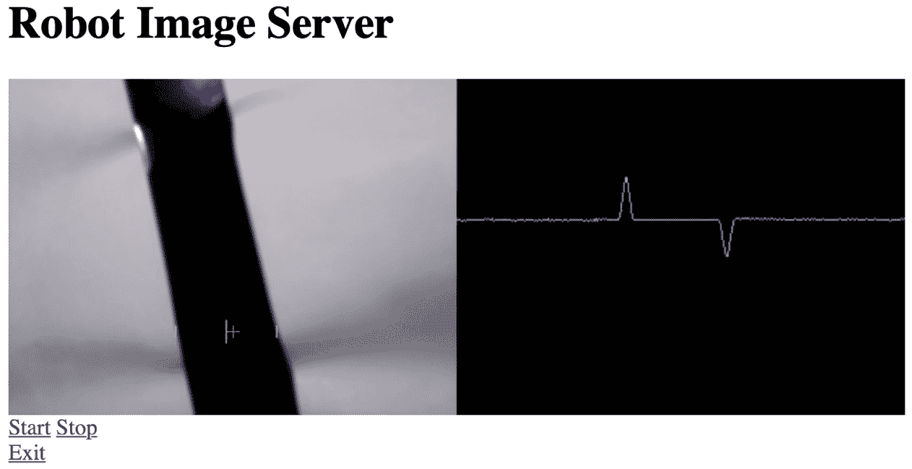

图 14.14 – 跟随线条行为输出的截图

*图 14.14* 中的截图显示了上方两张图片的标题。在左边是线条的相机图片。在这个框架上画了一个绿色的十字线，显示了中心点位置。还有一个大红色的条形，显示了线条的中间，以及这个条形两侧的两个较短的红色条形，显示了线条的两侧。在右边是绘制模糊后强度差异的图表。图表中可见上峰值和下峰值。

在此之下是 **开始**、**停止** 和 **退出** 按钮。

将机器人放置在直线上，光线充足。如果看起来像前面的显示，请按 **开始** 按钮以查看它运行。它应该开始不稳定地沿着线条行驶。

## 调整 PID

在尝试跟踪曲线线条并找到其极限时，您可以稍微大胆一些。机器人有时会超调或欠调，这就是 PID 调节发挥作用的地方：

+   如果它似乎转得太慢，尝试稍微增加比例常数。相反，如果它过度转向，尝试稍微降低比例常数。

+   如果存在轻微的连续误差，尝试增加积分常数。

PID 调节是一个重复的过程，需要大量的耐心和测试。

## 故障排除

如果行为不太正常，请尝试以下步骤：

+   如果将倾斜伺服设置为 90 度时看起来不垂直向下，可能没有正确校准。将 `deflect_90_in_ms` 值参数更改为 `Servos` 对象 – 以 0.1 的增量增加，以使其达到 90 度。

+   如果它难以获得清晰的线条，请确保光线充足，它所在的表面是平坦的，例如纸张，并且线条对比度良好。

+   如果它仍然难以找到线条，以 5 为增量增加垂直模糊量。

+   如果它难以按时转向直线，尝试以 10 为增量降低速度。

+   如果您发现相机在水平方向上晃动，可以从 `line_follow_behavior` 中移除 `self.robot.servos.stop_all()` 这一行。注意：这会以牺牲电机电池寿命为代价。

+   如果机器人发现太多其他随机垃圾而不是线条，尝试增加垂直模糊度。此外，尝试以 1 或 2 的步长增加阈值。亮度对比度越尖锐，您需要做的就越少。

+   确保您已经双重检查了代码，并且您已经在这里以及从 [*第 13 章*](B15660_13_Final_ASB_ePub.xhtml#_idTextAnchor283)，*机器人视觉 – 使用 Pi 相机和 OpenCV* 中找到了之前的例子。

# 再次找到线条

需要考虑的一个重要问题是，如果机器人失去了线条，它应该做什么。回到我们工业环境的例子，这可能是一个安全措施。

我们当前的机器人会停止。这需要你将其放回线路。然而，当你这样做时，机器人会立即开始移动。这种行为对我们的小型机器人来说很好，但对于大型机器人来说可能是一个危险隐患。

你可以考虑的另一种行为是旋转，直到机器人再次找到线路。丢失线路可能是由于机器人不足/过度转向而偏离线路且无法再次找到它，或者可能是由于机器人已经超过了线路的末端。这种行为可能适合小型机器人竞赛。

我们需要仔细考虑这类事情以及你会在哪里使用这个机器人。请注意，对于竞赛型机器人或工业机器人，它们将具有多个不同角度的传感器或更宽角度的传感器——因此，它们不太可能像我们这样丢失线路。此外，对于更大的机器人来说，即使缓慢旋转也可能非常危险。因此，让我们实现一个简单的附加安全特性。

当它找不到线路时，它不会只是停止电机；它将运行标志设置为false，因此你需要手动再次启动它：

1.  再次打开`line_follow_behavior.py`文件。

1.  前往`run`方法并找到`else:`语句。

1.  现在，我们可以修改这个声明的内容：

    ```py
                else:
                    self.robot.stop_motors()
    running is false, we now set running to False every time. We also reset the PID every time.
    ```

将代码保存到机器人中，并运行它直到它丢失线路。这可能是因为偏离了路线或到达了线路的末端。机器人应该停止。它应该在尝试再次移动之前等待你按下启动按钮。请注意，你需要将其放回线路并按下启动按钮才能再次移动。

这个机器人现在处理丢失线路条件更加可预测。

# 概述

在本章中，你看到了如何使用摄像头检测线路以及如何绘制显示它所发现的数据的图表。然后你看到了如何将数据放入驾驶行为中，以便机器人跟随线路。你增加了你的OpenCV知识，并且我向你展示了一种将图表放入摄像头流输出渲染的帧中的巧妙方法。你看到了如何调整PID以使线路跟随更准确，以及如何确保当机器人丢失线路时它能够可预测地停止。

在下一章中，我们将看到如何通过语音代理Mycroft与我们的机器人进行通信。你将向树莓派添加麦克风和扬声器，然后添加语音识别软件。这将使我们能够向树莓派发出语音命令以发送到机器人，而Mycroft将响应以让我们知道它所做的一切。

# 练习

现在我们已经使这个系统工作，我们可以通过以下方式增强系统并使其更有趣：

+   你能否在`make_display`方法中使用`cv2.putText`在帧上绘制如PID数据之类的值？

+   考虑将PID和误差数据与时间写入文件，然后将其加载到另一个Python文件中，使用Matplotlib显示发生了什么。这种变化可能会使回顾时的不足/过度转向更加清晰。

+   你可以修改电机处理代码，当线条靠近中间时加速，远离中间时减速。

+   一个重要的改进是检查两行并找出它们之间的角度。这样你就知道线条离中间有多远，同时你也知道线条的方向，可以利用这一点来进一步引导你的转向。

这些练习应该会给你一些有趣的玩法和实验你在这章中学到的构建和知识的方法。

# 进一步阅读

以下内容可以帮助你进一步了解跟随线条：

+   在Pi Wars传奇人物布莱恩·斯塔基的博客中了解Go语言在树莓派上处理线的替代方法：[https://blog.usedbytes.com/2019/02/autonomous-challenge-blast-off/](https://blog.usedbytes.com/2019/02/autonomous-challenge-blast-off/).

+   这里还有一个使用类似我们方法但更为复杂的跟随线条的机器人：[https://www.raspberrypi.org/blog/an-image-processing-robot-for-robocup-junior/](https://www.raspberrypi.org/blog/an-image-processing-robot-for-robocup-junior/).
