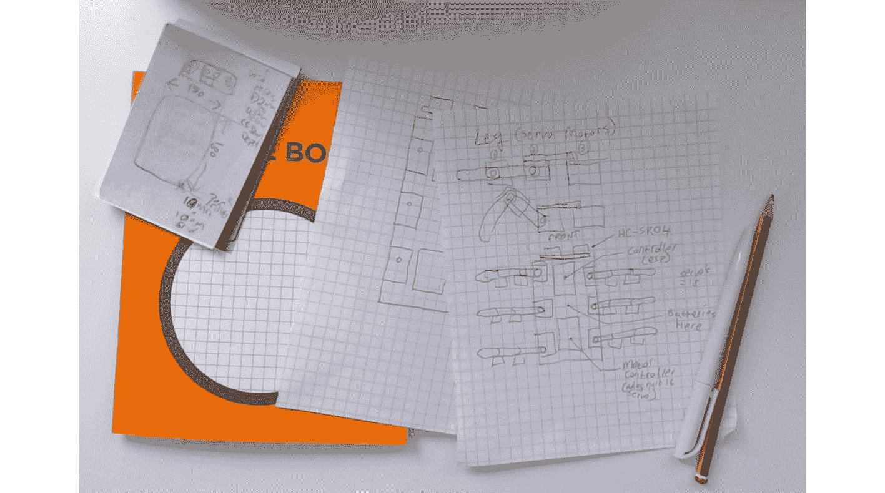
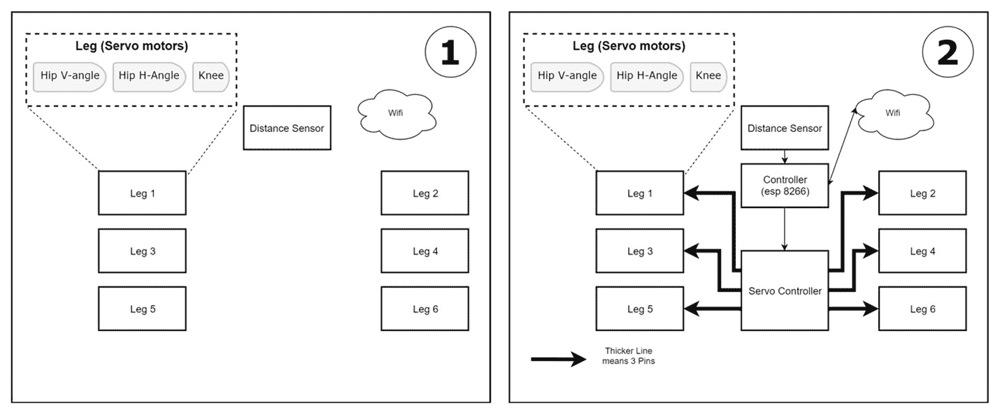

# *第19章*：规划你的下一个机器人项目——整合所有内容

在这本书的整个过程中，你现在已经看到了如何规划、设计、构建和编程一个机器人。我们已经涵盖了多个起始主题，并有一些实际操作经验，一个展示基本原理的例子，以及一些关于如何改进它们的想法。在这一章中，我们将思考你的下一个机器人。我们将回答以下问题：你将如何规划和设计它？你可能需要研究哪些技能并进行实验？你将构建什么？

本章我们将涵盖以下主题：

+   可视化你的下一个机器人——它将是什么样子？

+   制作方块图——确定输入/输出以及所需的部件

+   选择部件——在选择机器人部件时，你会考虑哪些权衡？

+   规划机器人的代码——这个机器人可能需要哪些软件层和组件，哪些行为会很有趣？

+   让世界知道——你将如何与感兴趣的人分享你的计划或你的机器人？

# 技术要求

对于这一章，我建议使用一些绘图工具，如下所示：

+   笔/铅笔

+   纸张——草图本（或者也许是一些坐标纸）很好，但是信封的背面也行

+   一台连接互联网并可以访问[https://app.diagrams.net/](https://app.diagrams.net/)的电脑

# 可视化你的下一个机器人

当我们开始这本书时，在[*第2章*](B15660_02_Final_ASB_ePub.xhtml#_idTextAnchor033)，*探索机器人构建模块——代码和电子学*中，我们首先学习了如何将机器人视为一个草图。我建议你快速绘制草图，不要担心它们是否粗糙和草图化——在早期规划阶段这是完美的。使用铅笔或钢笔，然后稍后转向更正式的方块和布局图。

每个机器人都是从一点灵感开始的。可能有一个你想要尝试的比赛；也许你看到了一些东西，比如另一个机器人或你想要模仿的动物（螃蟹非常迷人！）。其他的灵感可能来自于看到一些独特的新部件，或者想要学习/玩耍一项新技能。你甚至可能已经列出了一个你想要尝试构建的令人惊叹的机器人清单。

在构建机器人之前，列出一张简短的要点清单，说明它将做什么，它将有哪些传感器/输出，以及它可能需要处理的事情。这份清单让你能够集中精力。以下是一个例子，这是我为我看到的SpiderBot项目所做的，见[*第10章*](B15660_10_Final_ASB_ePub.xhtml#_idTextAnchor192)，*使用Python控制伺服电机*。这是我为其规划要做的：

+   它将有六条腿（是的——一只昆虫，而不是蜘蛛）。

+   我将用它来尝试腿和步态。

+   它将能够避开墙壁。

你的快速草图可能首先是一个基本的六腿棍状图，一端有一些正方形来表示超声波传感器，也许还有几条带注释的箭头来描述它们的意义。你已经在[*第二章*](B15660_02_Final_ASB_ePub.xhtml#_idTextAnchor033)中详细看到了这种技术，*探索机器人构建模块 – 代码与电子学*。以下照片展示了一个简单的设计：

图19.1 – 在纸上绘制你的想法

如*图19.1*所示，我首选的第一幅草图是用圆珠笔在坐标纸上绘制的，但我会用我有的任何纸张。

可以用2D、3D或轮廓草图来可视化机器人。这里有一些提示：

+   轻轻绘制，然后在你对设计更有信心时用更坚定的笔触继续绘制。

+   用任何想到的东西大量标注。

+   不要担心比例、尺寸或完美的绘图；这只是为了捕捉想法。你会在稍后充实它们并做出更坚定的决定。

+   给图片标注日期并给它一个工作名称是个好主意，即使你以后有更好的名字。

+   随意将块状表示法与草图视觉版本结合使用。

+   在某个地方随身携带一支圆珠笔/铅笔和记事本/便条纸，这样你就可以快速记下想法。如果你附近有白板，那将非常出色。铅笔可以让你擦除并重写，圆珠笔则容易放在包或口袋里。

+   首先记下大的想法；回来补充细节。很容易陷入某个方面的细节中，忘记其他部分，时间不够用。你总是可以做一个小的笔记来提醒自己。

你可以在机器人构建的任何时间回顾这个过程，也许当你有更多想法时，当你遇到需要解决的问题时，或者当你想要细化它时。大多数想法都是从一些项目符号和一个草草的草图开始的；等待使用电脑或试图完美绘制它，会分散你心中已经有的下一个绝妙想法——先把它记下来。

现在你已经大致有了它的草图，并在纸上写了一个基本计划，我们可以开始用块状图来正式化它。

# 制作块状图

回想一下，在[*第二章*](B15660_02_Final_ASB_ePub.xhtml#_idTextAnchor033)，*探索机器人构建模块 – 代码与电子学*，以及整本书中，我们创建的块状图展示了我们那里构建的机器人。你可以用这种方式表示任何机器人。这个图就是你在其中为每个输入和输出创建一个块，然后创建控制器和接口块来连接它们的图。不要担心图是否完美；主要目的是图片传达了哪些部分你需要连接到其他部分。也很有可能，最初的图在构建机器人和遇到你之前未意识到的限制时需要一些修改。

下面是SpiderBot的块状图的两个阶段：

图19.2 – SpiderBot块状图阶段

在 *图 19.2* 中，我最初知道每条腿有三个电机，但除此之外并不多。所以我画了那些块，以及我希望它拥有的距离传感器和Wi-Fi连接。

在下一步的图中，我添加了我要使用的控制器，并在图上进行了粗略的连接。这些只是块，这不是电路图。这些是用 [app.diagrams.net](http://app.diagrams.net) 拼凑起来的。请注意，随着你对你的机器人和其控制器了解得更多，事情仍然可能发生变化。

你还可以考虑为附加组件和子组件制作图表。任何看起来复杂的部件可能都需要一个更详细的图表来探索它。重要的是要把这样的想法从你的脑海中转移到纸上，这样它们就会更清晰，这样你就不会忘记它们，这样你也许能够发现缺陷。

另一个需要考虑的块图是软件图，我们将在 *规划机器人的代码* 部分讨论。

现在，你已经有了机器人的粗略草图和块图，你可以开始选择你用来构建机器人的部件了。

# 选择部件

在整本书中，我们探讨了不同类型传感器、不同底盘套件、控制器等之间的权衡。这些权衡包括重量、复杂性、可用性（你不想有一个无法替代的部分），以及成本，这些内容在[*第 6 章*](B15660_06_Final_ASB_ePub.xhtml#_idTextAnchor096)中详细讨论，*构建机器人基础——轮子、电源和布线*。

如果某个套件启发了机器人——例如，SpiderBot 是由六足机器人套件启发的；你的可能是机器人臂或履带式轨道套件——这可能会限制你需要做出的其他部分选择。我需要支持 18 个伺服电机；然而，我有一个 16 个电机的控制器可用，所以我选择了使用中央控制器的两个 **输入/输出** （**I/O**） 引脚来连接剩余的两个伺服电机。这增加了软件复杂性，尽管如此。

另一个权衡是主控制器。我知道我想要 SpiderBot 具有Wi-Fi功能，但它不会进行视觉处理，所以一个小型、便宜且低功耗的控制器，如ESP8266，是一个很好的选择。

对于电源，我知道所有这些伺服电机将需要大量的电流，但它无法承载很大的重量，因此需要一个更专业的 **锂聚合物** （**LiPo**） 电池，以及一个充电/保护电路。

选择部件的关键阶段是测试安装它们。

### 测试安装图

在选择零件时，考虑它们如何组合在一起：是否有明确的路径将电机控制器与你的主要控制器连接？这两个组件是否曾一起使用过，或者你是否准备好应对制作新接口的复杂性？根据你认为将要购买的零件，收集它们的尺寸，并尝试制作一个测试装配图，就像我们在[*第6章*](B15660_06_Final_ASB_ePub.xhtml#_idTextAnchor096)，*构建机器人基础 – 轮子、电源和布线*中做的那样。在购买新零件之前，尽量进行测试装配。

### 购买零件

当时的问题是要找到批发商来购买它。我有一些当地的推荐（例如[coolcomponents.co.uk](http://coolcomponents.co.uk)，[shop.pimoroni.com](http://shop.pimoroni.com)，和[thepihut.com](http://thepihut.com))，随着你组装更多，你也会在你的地区找到这些。寻找当地的Pimoroni、SparkFun、Raspberry Pi和Adafruit批发商将帮助你找到合适的商店。

你可以在你所在的地区的亚马逊、阿里巴巴或eBay上找到模块，但一定要清楚你购买的是什么，以及你将获得多少支持。你可以在Element14、Mouser、RS和Digi-Key等大型批发商那里找到单个零件；尽管他们通常没有很多预建的模块，但他们很可靠，拥有庞大的目录。

零件大多在网上销售。可能会有一些街边销售电子和机械零件的商家，但这越来越少了。

你也可以使用现有库存的零件，随着你组装机器人，你会逐渐积累这些零件。你可以将玩具转换成机器人底盘，这种做法被称为玩具黑客。机器人构建者可以从旧打印机和中机电系统中（小心操作）回收电机和传感器。在这种情况下，测试装配图将帮助你看到你可能需要更改什么才能使回收的零件工作。

### 组装你的机器人

现在，你准备好组装你的新机器人了。[*第6章*](B15660_06_Final_ASB_ePub.xhtml#_idTextAnchor096)，*构建机器人基础 – 轮子、电源和布线*，[*第7章*](B15660_07_Final_ASB_ePub.xhtml#_idTextAnchor131)，*驱动和转向 – 使用Python移动电机*，以及[*第12章*](B15660_12_Final_ASB_ePub.xhtml#_idTextAnchor251)，*使用Python进行IMU编程*中的基本焊接指南将帮助你入门。然而，[*第18章*](B15660_18_Final_ASB_ePub.xhtml#_idTextAnchor428)，*将你的机器人编程技能提升到更高水平*中建议的额外阅读和技能将为你提供更多组装机器人的选项。

现在你已经准备好了零件，并且开始组装机器人，接下来要考虑的是机器人的代码。

# 规划机器人的代码

我们在[*第2章*](B15660_02_Final_ASB_ePub.xhtml#_idTextAnchor033)，“探索机器人构建块——代码和电子”，开始以层来规划代码，然后在[*第7章*](B15660_07_Final_ASB_ePub.xhtml#_idTextAnchor131)，“驱动和转向——使用Python移动电机”的“机器人对象”部分进一步探讨了这一点。

让我们回顾一下我们如何使用层来规划代码结构。

### 系统层

通用思路是在系统中创建代码层，如下面的图所示：

图19.3 – 机器人软件层

如**图19.3**所示，有一些推荐的层级，如下所示：

+   在堆栈的底部，我们一直在使用的`gpiozero`库或该生态系统的各种Arduino库。这一层可能包括I/O控制、总线层和网络堆栈。

+   下一层是**库和中间件**。这些软件可能来自第三方——例如，用于与特定硬件接口的高级库。中间件层还包括你编写的抽象，例如使两轮机器人表现出相同的行为，即使第三方库不同。在同一层上还有算法和库。OpenCV存在于这一层，来自社区。你的**比例-积分-微分**（**PID**）算法或物体识别管道可能属于这一层。这一层有构建应用程序和行为的组件。

+   顶层是将一切粘合在一起。通过算法将硬件传感器输入转换为硬件电机输出，以及令人愉悦的控制界面或仪表板。顶层是创建机器人的行为和应用程序的地方。

对于一个基本的机器人，这些层中的组件可以是函数或类。对于更复杂的机器人，这些可能是不同的软件组件，它们在一个共享的软件总线上进行通信（例如消息队列或连接的服务）。我们已构建的库将适用于许多小型轮式机器人（在中间层）。随着你对这个库的实践经验增加，这个库将需要改进。如果你将行为与硬件关注点分开，你可以为新传感器和输出适配行为。

使用图表来绘制块和层，以表达这些边界在哪里。预期你将编写模块和块，并将它们链接起来以推理每个部分。在思考制作令人愉悦的LED图案（在行为层）时，不应该有必要陷入**串行外设接口**（**SPI**）数据总线事务的细节（在供应商硬件层）。

一旦你考虑了层和一些粗略的组件，你将需要思考如何使用数据流图来处理它们之间的信息流动。

### 数据流图

你还可以使用图表从数据流的角度探索行为，例如在[*第13章*](B15660_13_Final_ASB_ePub.xhtml#_idTextAnchor283)的*机器人视觉——使用树莓派摄像头和OpenCV*中使用的PID和反馈图表来表示行为。我们也使用这种图表风格来表示颜色对象和面部跟踪行为，作为显示图像转换的数据管道。不要期望一个图表就能捕捉整个故事；有时，需要几个图表来接近行为的不同方面。

在这里花时间考虑一些棘手的问题，比如如果传感器/运动关系复杂，可能需要的额外数学。你可能不会第一次就做对，所以构建它并推理为什么它的行为与你的预期不同将是必要的。在设计这个阶段，上网寻找类似的工作或阅读许多推荐书籍将有助于更深入地了解你所尝试的事情。在大多数情况下，坚持不懈会得到回报。

### 正式图表

对于流程图或统一建模语言（**UML**）类型等图表，有正式的表示方法。了解和学习这些作为资源来绘制图表是值得的。[app.diagrams.net](http://app.diagrams.net)软件有一个很好的图表元素库。图表最重要的方面是传达信息——你应该尝试以对你来说有意义的方式表达你头脑中的想法，或者在未来6个月或你的团队（如果你有的话）看来有意义。

有时，构建简单的行为会给你一个库来使用，以便构建更复杂和有趣的行为。我们的直线驱动行为是构建方形行驶行为的基石。

### 编程机器人

你现在可以编程机器人了，但要做好准备，要经历几个规划、实施、测试和学习的循环。不要因为测试失败而气馁，因为这些是学习最好的机会。大部分的学习都是在规划和确定测试失败中完成的。如果一切第一次就成功了，那么它不太可能给你留下深刻的印象。本书中的每一个行为都让我尝试了多次才正确；调整它们是一个试错的过程。

你已经规划了代码，现在正在构建机器人。你如何让世界知道你在制作东西并寻求帮助？

# 让世界知道

你肯定会关于如何进行和需要解决的问题有所疑问——也许你在构建之前就已经遇到了这些问题。当你有问题或者已经取得了一些小进展时，就是时候上网并与机器人社区建立联系了，正如在[*第18章*](B15660_18_Final_ASB_ePub.xhtml#_idTextAnchor428)的*在线机器人构建社区*部分所示，*进一步拓展你的机器人编程技能*。

使用Twitter和Stack Overflow提问或甚至回答其他机器人建造者的提问。利用YouTube分享你的创作或建造故事，并观看他人的建造项目。你不需要等到拥有一个完美无瑕的产品后再分享。分享你所采取的步骤、你所遇到的挫折，甚至是你从失败中学到的经验。失败的情况往往能成为最好的故事。这些故事可能正是其他人继续坚持复杂建造项目的动力。

结合使用YouTube、Instructables和在线博客来练习新技能，或者——更好的是——去附近的创客空间、Coder Dojo或Raspberry Jam与其他也在创造和学习的人一起练习新技能。

成为机器人建造者会使你成为一个终身学习者；关于这个主题，总有更多东西要学习，这不仅是因为它仍然是一个研究热点。人们在推动机器人领域人类知识的边界。你可以在成为导师和帮助者的同时，推动你的技能和知识边界，扩展他人能够做到的边界。也许你会想出套件、模块和代码来降低入门门槛，你也可能找到使用机器人或构建传感器的创新方法，从而推动人类知识的边界。无论哪种方式，与机器人社区互动都是令人兴奋、令人耳目一新的，并让你不断寻找新事物去尝试。

在实验室条件下测试你的机器人是可以的，但最严格的测试是在户外，在比赛和演示中进行的。在这些情况下，你会发现新的错误，找到需要解决的新问题，并建立一个机器人建造者朋友和同行的网络。机器人有一个刻板印象，认为它是一个非常孤独的爱好或职业，但情况不必如此，因为有许多人在创造东西，所以和这些人一起做吧。

与团队一起建造可以非常有益且具有挑战性。这将使你能够创造出比独自一人更雄心勃勃的建造项目。参与任何社区，尤其是本地社区，可能是你找到团队成员的最佳机会。

你现在已经了解了如何接触更广泛的机器人建造者世界，并找到帮助、灵感和竞争。你看到了机器人可以成为一种协作和社交的爱好。也许你也受到了启发，想要开始自己的机器人博客或YouTube频道。我期待着在社区中见到你！

# 摘要

你现在已经在这本书中看到了如何建造和编程你的第一个机器人。你已经看到了如何了解更多信息以及如何扩展你的知识。在本章的最后，我们总结了你所学的知识，并建议如何利用这些知识来计划、建造和编程你的下一个机器人，以及如何带它去巡展并成为机器人社区的一员。

你已经看到了如何设计和规划一个机器人，以及如何构建、编程和测试一个机器人。你已经学习了硬件技能，例如焊接，简单的软件，例如移动机器人，并且对复杂领域如计算机视觉和惯性测量有了一定的接触。你已经排除了错误，做出了权衡，精细调整了系统，并学会了如何进行备份。你制作了用户界面，实现了智能行为，并使用智能手机控制了机器人。

你已经到达了这本书的结尾，但我希望这仅仅是你的机器人之旅的开始。
