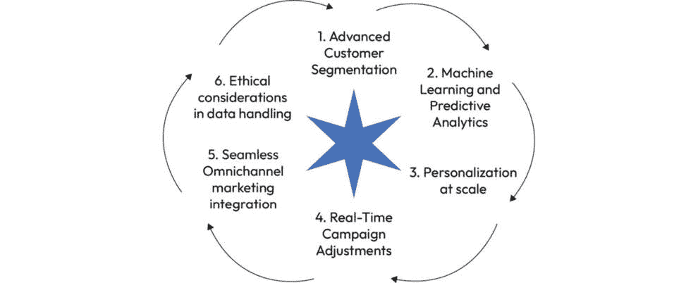
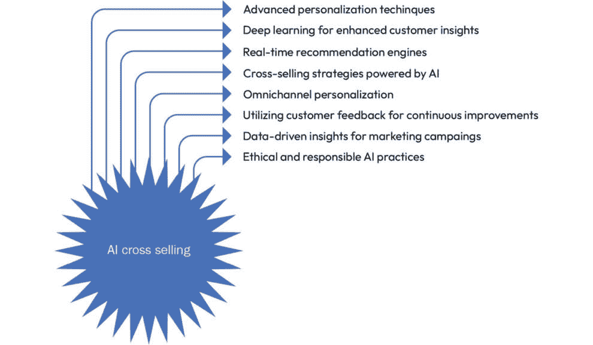
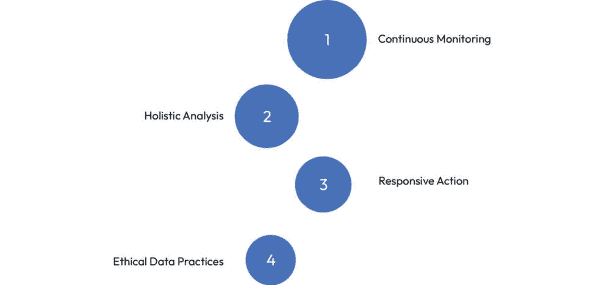

# 5

# 使用 Dynamics 365 AI 进行营销优化

在数字营销不断发展的领域，通过 Microsoft Dynamics 365 等平台整合 **人工智能** (**AI**) 正在营销策略中引起重大转变。在本章中，我们深入探讨 AI 在营销领域的变革性影响，强调这项技术如何重塑营销工作，使其更加有效和以数据驱动。

我们的探索从 *AI 驱动的客户细分和营销活动定位* 开始。本节将探讨 Dynamics 365 AI 如何利用高级算法分析大量客户数据。通过这种方式，它超越了传统的人口统计学细分，考虑了客户的行为和偏好。这种方法使得营销活动更加精准高效，满足不同客户群体的特定需求和兴趣。

进一步推进，本章讨论了 *个性化推荐和交叉销售机会*。在这里，重点在于 Dynamics 365 AI 如何利用客户互动数据来提出个性化的产品推荐。这种能力对于识别潜在的销售机会、提升客户体验和增强交叉销售策略的有效性至关重要。

现代营销的关键组成部分是社交媒体的战略性使用。因此，我们专门用一大节来介绍 *社交媒体情感分析和品牌感知洞察*。Dynamics 365 AI 分析社交媒体数据的能力对于理解品牌在公共领域的认知至关重要。本节将探讨 AI 工具如何解析社交媒体趋势、标签和情感，为企业在营销和品牌管理中的决策提供关键洞见。

本章以 *营销洞察领域的真实案例和最佳实践* 作为结尾。本节将展示不同公司如何成功地将 Dynamics 365 AI 整合到其营销策略中。这些真实案例将作为 AI 在营销中能力的实际示例，提供关于有效实施和最佳实践的洞见。

总体而言，本章旨在提供一份全面详细的指南，介绍如何利用 Dynamics 365 AI 进行营销优化。从深入的客户洞察到高级的参与策略，本章将突出 AI 在数字营销中设定的新标准，帮助企业在其营销活动中取得更大的成功。随着我们深入探讨每个主题，读者将更清晰地了解 AI 在营销中的强大影响，为数字市场中的创新和增长开辟新的机遇。

下面是本章涵盖的主题列表：

+   AI 驱动的客户细分和营销活动定位

+   个性化推荐和交叉销售机会

+   社交媒体情绪分析和品牌认知洞察

+   实际案例和营销洞察的最佳实践

# 驱动 AI 的客户细分和活动定位

在现代营销领域，Dynamics 365 AI 已经成为了一个颠覆性的力量，特别是在客户细分和活动定位方面。本节深入探讨了 Dynamics 365 AI 的细微功能，展示了它如何通过其先进的 AI 功能改变目标营销的格局。

图 5.1 – 客户细分和活动定位概述

## 高级客户细分

Dynamics 365 AI 通过利用 **深度机器学习**（**DML**）算法，革新了传统的客户细分方法。这些算法超越了基本的人口统计信息，并筛选包括购买模式、互动历史和社交媒体互动在内的复杂数据集。这种分析水平使得 Dynamics 365 AI 能够根据各种行为和心理因素识别复杂的客户细分。

例如，一家使用 Dynamics 365 AI 的企业可以不仅仅根据年龄或地理位置来细分客户，还可以根据他们与品牌的互动模式来细分，例如在特定产品类别中频繁在线购买或对某些类型的营销内容的响应。

## 机器学习和预测分析

Dynamics 365 AI 的优势在于其 **机器学习**（**ML**）模型，这些模型通过学习新数据不断进化。这些模型分析历史客户数据以预测未来的行为和偏好。Dynamics 365 AI 有效地预测趋势和购买模式，使企业能够主动调整其营销策略。

一个实际应用可以是预测对某些产品需求的激增。Dynamics 365 AI 可以在客户行为中识别这一趋势的早期迹象，使企业能够相应地调整其库存水平和营销策略。

## 规模化个性化

Dynamics 365 AI 在大规模个性化营销方面表现出色。它使企业能够为不同的客户细分创建高度定制的内容和优惠。这种个性化是数据驱动的，确保每位客户都能收到与其兴趣和行为最相关的营销材料。

例如，Dynamics 365 AI 可以帮助一家零售商向那些一直对健身相关产品表现出持续兴趣的客户发送个性化的体育设备折扣优惠，从而增加购买的可能性。

## 实时活动调整

Dynamics 365 AI 的实时分析能力允许动态调整营销活动。如果某个特定活动未按预期表现，AI 可以快速分析反馈和交互数据以调整活动的方向。这种敏捷性确保了营销工作的响应性和有效性。

## 无缝全渠道营销集成

Dynamics 365 AI 的一个基本特征是其能够无缝集成到全渠道营销策略中。它确保了所有渠道（无论是电子邮件、社交媒体还是店内互动）的客户细分和定位的一致性。这种一致性对于统一客户体验和在各个平台上强化营销信息至关重要。

## 数据处理中的道德考量

权力越大，责任越大。Dynamics 365 AI 处理大量的客户数据，因此需要遵守道德准则和隐私法规。Dynamics 365 AI 设计了内置的合规性功能，以确保企业能够在利用 AI 能力的同时保持客户信任并满足监管要求。

总之，Dynamics 365 AI 正在重塑企业处理客户细分和活动定位的方式。通过提供先进的、AI 驱动的洞察力和实时数据分析，它使企业能够执行更有效、个性化和响应性的营销策略。随着我们继续在数字时代前进，Dynamics 365 AI 作为企业创新和提升营销工作的关键工具而脱颖而出。

# 个性化推荐和交叉销售机会

在今天快速发展的数字市场中，个性化战略和交叉销售是企业的关键差异化因素。Dynamics 365 AI 在这个领域发挥着至关重要的作用，提供了强大的工具来提供个性化推荐和识别有利的交叉销售机会。本节深入探讨了 Dynamics 365 AI 的复杂功能以及如何利用这些功能来增强销售策略和客户参与度。

图 5.2 – AI 跨销概述

## 先进的个性化技术

Dynamics 365 AI 个性化能力的心脏是一个复杂的机器学习框架。该系统处理和分析大量的客户数据，包括交易历史、浏览模式和跨各种渠道的参与指标。通过利用这些数据，Dynamics 365 AI 可以创建详细的客户档案，然后用于定制产品推荐和优惠。例如，一家在线时尚零售商可以利用 Dynamics 365 AI 向刚刚将连衣裙添加到购物车的客户推荐匹配的配饰，基于他们之前的购买和查看项目。

## 深度学习以增强客户洞察

Dynamics 365 AI 使用**深度学习**（DL）算法来深入了解个别客户的偏好和行为。这些洞察不仅包括简单的购买历史，还包括对客户评论、评分甚至社交媒体互动的分析。通过理解客户偏好的细微差别，Dynamics 365 AI 可以定制高度相关和吸引人的产品推荐，显著提高提升销售和交叉销售的可能性。

## 实时推荐引擎

Dynamics 365 AI 中的实时推荐引擎是一个亮点功能。随着客户与企业的数字平台互动，AI 系统会动态更新并展示推荐，使购物体验更加互动和响应。这一功能确保了在客户最有可能做出购买决策的时刻，他们能够看到相关的建议。

## 由人工智能驱动的交叉销售策略

Dynamics 365 AI 通过智能推荐互补的产品和服务来增强交叉销售的努力。通过分析购买模式和客户偏好，AI 可以识别出经常一起购买或可能对客户感兴趣的产品。例如，在电子产品网站上购买高端笔记本电脑的客户可能会看到笔记本电脑包、外置硬盘或高级软件订阅的推荐，从而提升他们的购买体验并增加**平均订单价值**（AOV）。

## 全渠道个性化

Dynamics 365 AI 的个性化覆盖所有客户接触点，确保无论客户是在网上购物、通过移动应用还是实体店购物，都能获得一致且无缝的体验。这种全渠道个性化方法在当今的零售环境中至关重要，因为客户期望在所有平台上获得统一的购物体验。

## 利用客户反馈进行持续改进

Dynamics 365 AI 还将客户反馈纳入其学习周期。评分、评论和客户反馈被分析，以持续优化和改进推荐算法。这种方法确保了推荐在一段时间内保持相关性和有效性，适应不断变化的客户偏好和市场趋势。

## 市场营销活动的数据驱动洞察

除了提升个人客户体验外，Dynamics 365 AI 还提供了有价值的洞察，这些洞察可以指导更广泛的营销策略。通过分析不同推荐类型的效果和客户反应，企业可以调整他们的营销活动、促销和产品开发策略，更好地满足客户需求。

## 道德和负责任的 AI 实践

在部署 AI 进行个性化和交叉销售时，Dynamics 365 AI 遵守伦理 AI 原则，确保客户数据的负责任使用。该平台旨在遵守数据隐私法规，在利用数据获取业务洞察的同时，与客户建立信任。

由 Dynamics 365 AI 驱动的个性化推荐和战略交叉销售正在改变企业与客户互动和销售的方式。通过提供与个人客户偏好和行为相一致的建议，Dynamics 365 AI 不仅推动销售，而且显著提升了客户体验。随着我们进入数字时代，个性化以及战略交叉销售将继续是企业保持竞争力并维持强大客户关系的关键。Dynamics 365 AI 在这一努力中扮演着强大的工具角色，提供先进、数据驱动的解决方案，以适应现代、动态的营销策略。

# 社交媒体情绪分析和品牌感知洞察

在数字时代，社交媒体是客户洞察的宝库，而理解社会情绪对于品牌管理至关重要。Dynamics 365 AI 凭借强大的社交媒体情绪分析和品牌感知洞察工具，踏入这一领域。本节探讨了 Dynamics 365 AI 如何处理和解读社交媒体数据，为业务提供其品牌公众认知的关键洞察。

## 利用社交媒体数据

社交媒体平台充满了客户意见、评论和讨论。Dynamics 365 AI 通过聚合和分析来自各种社交媒体渠道的数据，挖掘这一庞大资源。它采用先进的**自然语言处理**（**NLP**）来解读与品牌或产品相关的社交媒体帖子及评论背后的语气、上下文和情绪。

## 情绪分析和情感智能

该功能的核心理念是情绪分析，它将社交媒体内容分类为正面、负面或中性。Dynamics 365 AI 不仅超越了简单的关键词分析；它通过解读细微差别和上下文来准确理解情绪。这个过程涉及分析诸如俚语、表情符号甚至讽刺等语言元素，提供对公众情绪的全面视角。

## 实时品牌感知跟踪

Dynamics 365 AI 提供品牌感知的实时洞察。企业可以监控其营销活动、产品发布或企业公告如何被受众接收。这种即时反馈对于调整策略、解决公众关注的问题或利用积极情绪至关重要。

## 预测分析助力主动式品牌管理

Dynamics 365 AI 中的预测分析使企业能够预见品牌感知的潜在变化。通过分析社会情绪中的趋势和模式，公司可以预测并准备应对客户态度的变化，从而进行主动的品牌管理。

预测分析利用历史数据和统计算法来预测未来的结果。它涵盖了各种方法和模型，每种都适合不同类型的数据、业务需求和预测目标。理解预测分析技术的多样性对于希望做出数据驱动决策的企业至关重要。以下是不同类型预测分析的概述。

### 回归分析

+   **线性回归**：这种方法基于一个或多个预测变量预测连续的因变量。它假设预测变量和结果之间存在线性关系。线性回归广泛用于预测销售、收入和其他财务指标。

+   **逻辑回归**：与线性回归不同，逻辑回归用于二元结果（例如，是/否、赢/输）。它估计事件发生的概率，例如客户流失或贷款违约的可能性。

### 时间序列分析

时间序列分析基于先前观察到的、与时间相关的值来预测未来的值。它在金融市场分析、经济预测和库存研究中特别有用。时间序列分析可以解释趋势、季节性变化和周期性模式。

### 决策树

决策树是一种非线性预测建模技术，它将数据划分为分支以表示不同的决策路径。它们在分类问题中非常有用，例如识别客户细分或预测哪些客户最有可能购买特定产品。

### 随机森林

决策树的一个扩展，随机森林使用多个决策树来提高预测准确性。通过汇总各种树的输出，随机森林减少了过拟合的风险，并且在分类和回归任务中都非常有用。

### 神经网络和深度学习

**神经网络**（**NNs**），受人类大脑结构的启发，特别擅长处理大型数据集中的复杂模式。深度学习（DL），神经网络的一个子集，使用多层处理来提取特征并执行分类任务。这些方法在图像和语音识别、自然语言处理和复杂的时间序列预测方面表现出色。

### 支持向量机

**支持向量机**（**SVMs**）是一组用于分类和回归分析的**监督学习**（**SL**）方法。支持向量机可以建模非线性关系，在高维空间中尤其有用，这使得它在文本分类、图像识别和生物信息学中非常有效。

### 集成方法

集成方法，如提升和袋装，结合多个模型的预测以提高准确性。例如，梯度提升调整先前模型中的错误，新模型专注于难以预测的实例。集成方法非常灵活，可以增强分类和回归模型的性能。

### 聚类技术

虽然在传统意义上不是预测性的，但如 K-means 或层次聚类等聚类技术可以通过识别数据中的自然分组来告知预测模型。这些见解可以进一步指导针对更细微预测的针对性预测模型。

### 异常检测

异常检测识别出不符合预期模式的数据中的异常值。这对于欺诈检测、网络安全和检测系统故障至关重要。技术范围从统计方法到复杂的机器学习算法。

### 生存分析

生存分析模型关注事件发生的时间，即事件发生前的持续时间。它在医学研究中广泛用于评估治疗效果，在工程中用于可靠性分析，在客户分析中用于预测客户流失。

每种预测分析类型都有其优势和适用范围，选择它们取决于具体业务问题、可用数据的性质以及期望的结果。对这些方法的细微理解使企业能够有效地利用其数据，解锁推动战略决策和竞争优势的见解。

## 将客户反馈纳入策略

从社交媒体情感分析中获得的认识不仅用于即时反应，也用于长期策略。Dynamics 365 AI 帮助业务理解客户期望和偏好，指导产品开发、营销策略和客户服务方法。

## 案例研究 – 零售品牌利用社交媒体情感分析

一个领先的零售品牌使用 Dynamics 365 AI 在重大产品发布期间分析社交媒体情感。通过监控实时社交媒体讨论，他们发现了一个关于产品可持续性的担忧。通过针对性的沟通和政策变化迅速解决这一问题，他们改善了公众的看法，避免了潜在的公关危机。

### 社交媒体情感分析的最佳实践

有效使用社交媒体情感分析涉及几个最佳实践，如下面的图表所示：

图 5.3 – 社交媒体情感分析的最佳实践

让我们更详细地看看这些：

1.  **持续监控**：定期跟踪社交媒体情感，而不仅仅是特定活动或事件期间。

1.  **全面分析**：将情感分析视为更广泛的市场研究策略的一部分，将其与其他数据源结合以获得完整图景。

1.  **响应行动**：在放大积极趋势的同时，准备好快速响应负面情绪。

1.  **道德数据实践**：确保遵守数据隐私法规和数据分析中的道德标准。

Dynamics 365 AI 提供的社会媒体情绪分析和品牌认知洞察是当今数字营销领域的宝贵工具。它们为企业提供了公众舆论的实时脉搏，使企业能够积极主动和有响应地管理其品牌。通过利用这些工具，公司不仅可以保护和提升其品牌形象，还可以使战略与客户需求和市场需求更加紧密地一致。随着社交媒体继续成为客户表达的主导平台，AI 在解释和利用这些数据方面的作用将越来越成为全球企业至关重要的因素。

# 营销洞察力的现实世界示例和最佳实践

在展示 Dynamics 365 AI 在营销中的实际应用时，本节深入探讨了三个复杂且详细的使用案例。每个案例研究都展示了 AI 驱动的营销洞察力的战略实施以及随之而来的业务转型。

## 示例 1 – 时尚电商平台的超个性化营销活动

*背景*：一家领先的专注于时尚的电子商务平台希望通过超越基于通用人口统计学的目标来改进其营销方法。

### Dynamics 365 AI 的应用

利用 Dynamics 365 AI，该平台开发了一个多层次的客户细分模型。该模型使用 AI 分析客户数据，包括过去的购买记录、浏览行为和社交媒体互动。Dynamics 365 AI 不仅识别了广泛的客户细分市场，还在其客户群中识别了微细分市场，例如“环保意识买家”或“趋势驱动的年轻人”。

### 结果

利用这些微细分市场，平台推出了超个性化的营销活动。例如，环保意识买家收到了可持续时尚商品的精选推荐。这种方法导致这些细分市场的客户参与率提高了 45%，销售额增长了 25%。详细的细分也使平台能够识别新兴的时尚趋势，在市场上获得竞争优势。

## 示例 2 – 医疗保健提供商网络的优化患者接触

*背景*：一个医疗保健提供商网络旨在提高其患者参与度和预防保健项目。

### Dynamics 365 AI 的应用

该网络使用 Dynamics 365 AI 分析患者数据，包括健康历史、与先前接触项目的互动以及人口统计信息。AI 有助于识别最有可能从特定预防保健项目中受益的患者。

### 结果

为不同的患者群体开发了定制的外展活动。例如，有慢性病史的患者收到了个性化的提醒和教育内容，关于如何管理他们的状况。这种针对性的方法导致预防保健计划的患者注册增加了 30%，患者健康状况显著改善。

## 示例 3 - SaaS 公司的市场扩张策略

*背景*: 一家 **软件即服务** (**SaaS**) 公司希望将其市场范围扩展到新的行业。

### Dynamics 365 AI 的应用

公司利用 Dynamics 365 AI 进行了全面的市场分析，确定了其软件能够解决特定痛点的行业。AI 系统分析了行业趋势、竞争对手的存在和潜在客户需求。

### 结果

基于人工智能洞察，公司为针对医疗保健和教育等行业的特定行业开发了定制软件解决方案，并推出了行业特定的营销活动。这种战略方法导致了成功的市场渗透，这些新领域的客户获取增加了 50%，在这些行业中品牌认知显著提升。

### 利用 Dynamics 365 AI 营销洞察的最佳实践

+   **全面数据集成**: 确保所有客户互动点都集成到 Dynamics 365 AI 中，以获得完整的客户行为视图

+   **持续模型训练和更新**: 定期用新数据和反馈更新 AI 模型，以保持洞察的相关性和准确性

+   **数据伦理使用**: 遵守数据隐私法律和伦理标准，确保客户数据被负责任和透明地使用

+   **跨职能协作**: 在营销、销售和 IT 部门之间协作，以有效地利用人工智能洞察力制定全面的营销策略

+   **监控和调整策略**: 持续监控人工智能驱动的活动的性能，并准备好根据实时数据和不断变化的市场动态调整策略

详细的使用案例和概述的最佳实践展示了 Dynamics 365 AI 在转变营销策略中的巨大潜力。通过采用数据驱动的方法，公司可以实现更个性化、有效和高效的营销努力。这些现实世界的例子为希望利用人工智能进行营销优化的企业提供了指南，为提高客户参与度和商业成功提供了路线图。

# 摘要

随着我们探索以人工智能驱动的营销变革世界的结束，很明显，Dynamics 365 AI 已经成为重塑企业如何制定和执行其营销策略的基石。在整个旅程中，我们深入了解了人工智能在客户细分、活动定位、个性化推荐以及社交媒体情绪分析在品牌认知中的关键作用。

Dynamics 365 AI 在剖析和分析复杂客户数据方面的先进能力为客户细分开辟了新的维度。通过超越传统的人口统计因素，包括行为和心理因素，企业现在可以以前所未有的精确度针对其营销活动。这种精细化的定位不仅最大化了活动的效果，还确保了有效资源的利用。

在 Dynamics 365 AI 的推动下，向个性化客户体验的转变标志着客户参与的新时代。通过利用预测分析提供定制化产品建议，企业将偶然浏览者转变为忠实客户，从而加深客户关系并开辟新的收入来源。

Dynamics 365 AI 在监控和解读庞大而复杂的社会媒体世界中的角色尤其具有影响力。对情感和趋势的实时分析使企业能够立即了解其品牌地位，从而能够迅速调整策略并在数字领域保持积极的品牌形象。

来自各个行业的真实案例，从时尚零售到医疗保健，展示了人工智能驱动营销策略的实际应用和成功。这些案例研究不仅验证了人工智能在市场营销中的有效性，还成为了宝贵的最佳实践和洞察来源。

如全面数据集成、持续模型训练、道德数据使用、跨职能协作以及基于实时数据的营销策略适应性等关键实践，已成为最大化人工智能在市场营销中益处的必要条件。

总结来说，人工智能在市场营销中的应用，尤其是通过 Dynamics 365 AI，不仅仅是现有实践的增强，而是为了在日益数字化的世界中保持竞争力所必需的演变。随着人工智能的持续进步，其在塑造有效、个性化和动态营销策略方面的影响力变得越来越不可或缺。这次探索证明了人工智能在市场营销中的力量，为未来营销策略更加适应性强、洞察力深和以客户为中心的景象提供了一个窗口。

下一章讨论了人工智能在金融分析中的作用，包括人工智能如何改善财务预测和欺诈检测程序，以及如何帮助管理财务风险。

# 问题

1.  Dynamics 365 AI 如何增强营销目的的客户细分？

1.  预测分析在 Dynamics 365 AI 提供的个性化推荐中扮演什么角色？

1.  Dynamics 365 AI 如何利用社交媒体情感分析来提升品牌认知？

1.  在本章中讨论了哪些利用人工智能在市场营销中的关键最佳实践？

# 答案

1.  Dynamics 365 AI 通过分析广泛的客户数据，包括购买模式、在线行为和社交媒体互动，增强了客户细分。它不仅超越了传统的人口统计信息，还基于行为、偏好和需求来识别特定的客户群体，从而实现更精准和有效的营销活动。

1.  Dynamics 365 AI 中的预测分析通过分析历史客户数据来预测未来的购买行为和偏好。这使得企业能够提供个性化的产品建议和推荐，从而提升客户体验并增加销售的可能性。

1.  Dynamics 365 AI 利用社交媒体情感分析来监控和解读社交媒体平台上关于品牌的公众意见和讨论。它采用自然语言处理技术将情感分类为正面、负面或中性，为品牌提供实时洞察，并使企业能够据此调整其策略。

1.  关键的最佳实践包括跨客户接触点的全面数据集成、持续训练和更新 AI 模型、遵守道德数据使用和隐私法律、促进部门间的跨职能协作，以及根据实时 AI 驱动的洞察定期监控和调整营销策略。
