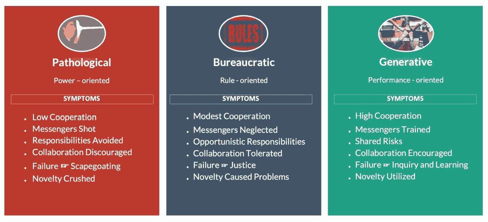
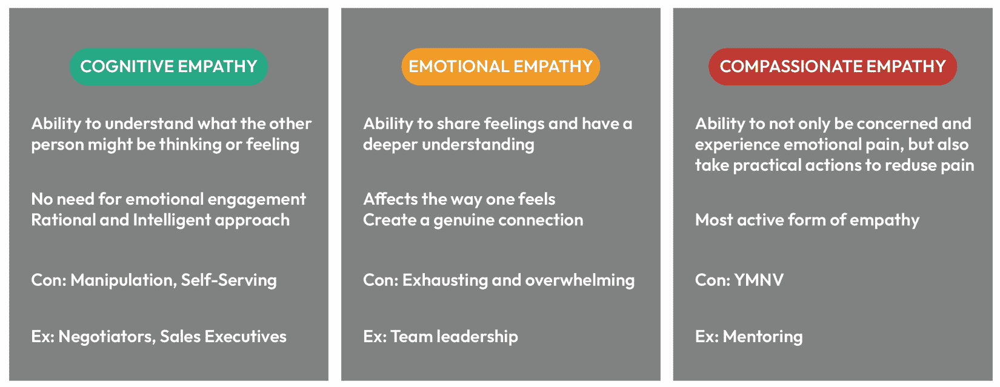
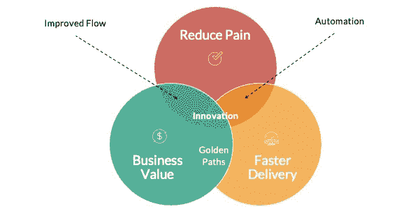
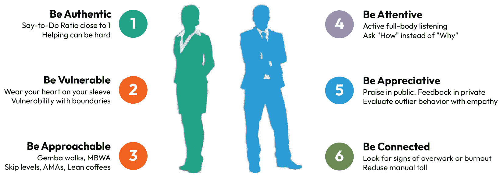
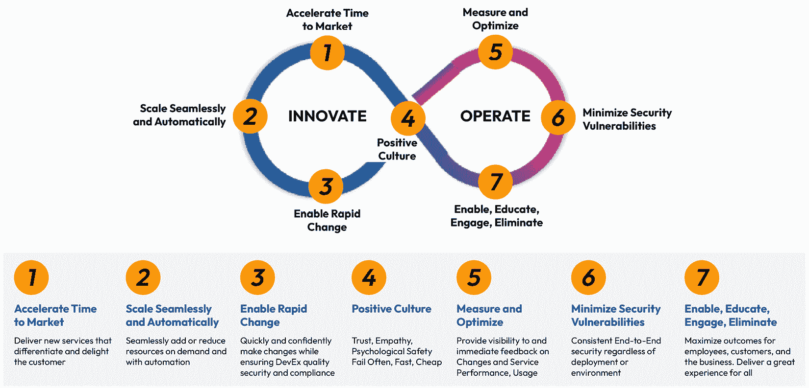
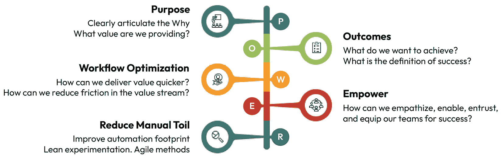

# 3

# 文化转型与领导力

在平台工程和 DevOps 领域开启文化转型和同理心领导的旅程，需要的不仅仅是技术敏锐度；它要求思维方式的转变和采用支持创新、心理安全和持续学习与改进文化的战略框架。本章深入探讨了创造这种转型环境的本质，提供了指导领导者和管理团队穿越现代企业复杂性的原则和实践见解。这是关于培养一个创新蓬勃发展、挑战被接受、每个团队成员都感到被重视并能够充分发挥其潜能的空间。

我们将探讨文化转型和同理心领导在推动成功的平台工程计划中的关键作用。我们将研究平台工程如何作为创新的催化剂，赋予团队更有效地构建和交付的能力。最后，我们将讨论如何融入和整合支持组织变革的战略框架——增强商业价值、促进心理安全和创造持续创新的条件。

发现这些元素如何培养一种推动平台工程和 DevOps 领域技术卓越和以人为本的工作场所的组织文化。通过将领导风格与工程挑战——如管理复杂的团队结构、确保无缝协作和导航技术权衡——对齐，这种转型赋予领导者培养创新、增强团队合作和实施有效变革管理的能力。这些原则使组织能够在平衡技术决策与商业目标的同时，促进员工参与和福祉，最终创建具有弹性、适应性和成功性的组织。

我们将涵盖以下主要主题：

+   在以数字优先的世界中文化演变的紧迫性

+   同理心——组织价值的核心

+   领导力作为同理心变革的催化剂

+   协调文化转型——战略框架的力量

# 技术要求

虽然本章没有具体的技术先决条件，但对组织文化、领导原则、变革管理以及精益、敏捷和 DevOps 方法论的坚实基础理解将增强对战略见解和转型策略的欣赏。

# 在以数字优先的世界中文化演变的紧迫性

企业必须重新评估他们的方法和组织文化，以确保快速高效的价值创造，并在当今的数字领域中蓬勃发展。特别是平台工程和 DevOps 行业，正在推动这一变革。我们敦促企业采用更敏捷、生成性的文化，以适应数字时代，并摆脱等级制度规范。这种转变对于公司在新的数字现实中脱颖而出至关重要。

例如，*2020-21 年敏捷文化状态报告*显示，拥有强大敏捷文化的组织在商业绩效上实现了高达 235%的改善。同样，培养生成性文化的公司在员工士气和创新方面报告了显著更高的水平。Pivotal Software 的转型是一个强有力的例子——通过敏捷方法和协作环境，Pivotal 增强了其开发流程，能够迅速响应市场变化和客户需求。另一个例子是 FREITAG，它实施了敏捷管理以增强灵活性和适应性。这些案例展示了敏捷和生成性文化如何推动技术卓越、促进创新，并在快速发展的数字领域中构建韧性。

为了有效地实施这种变革，认识到并理解现有的组织文化至关重要。确定您的组织目前所处的位置将为培养促进商业成功的生成性文化提供一个清晰的起点。

## 认识组织文化

组织面临着坚持过时方法或拥抱变革性变化的重大决策。**Westrum 的文化类型学**为理解塑造组织团队合作、信息流动和创新的方法提供了宝贵的见解。三种不同的文化——*病态的*、*官僚的*和*生成性的*——帮助组织做出明智的选择，并创造一个推动增长和创新的氛围。对于领导者来说，认识到他们的组织在 Westrum 的类型学中的位置是文化演变的第一步关键。这为向更开放、动态和协作的组织文化战略转变奠定了基础。这种转型对于利用平台工程和 DevOps 的广泛能力至关重要，这些方法本质上在适应性强、响应快、生成性强的文化中蓬勃发展。让我们来看看不同的文化：

+   **病态的文化**滋生恐惧、部门化功能以及一种*责备*文化，抑制创造力和协作。病态的组织将坏消息的传递者视为问题，并在他们有机会被听到之前就将其摒弃。在这种文化中，新想法被压制，以替罪羊和恐惧为手段。这种创新抑制在以适应性为关键的技术驱动市场中可能是灾难性的。

+   **官僚文化**，具有僵化的层级结构和严格的规则遵守，提供了结构但阻碍了敏捷性和创新。官僚文化允许协作，但仅限于严格的界限内，仅导致机会主义合作。

+   **生成性文化**建立在信任、开放沟通和共同目标之上，营造了一个有利于创新、从失败中学习和集体庆祝成就的环境。这种文化重视传递坏消息的人，因为他们对于快速解决问题和持续改进至关重要。生成性组织鼓励协作努力和共同承担责任。生成性文化拥抱新颖性和创新精神。

列表中解释的三个不同文化的主要方面总结在下图：

图 3.1：领导者必须将组织文化从病态转变为生成性

显然，向 Westrum 谱系的生成性端的文化转变对于组织保持竞争力和前瞻性至关重要。

## 生成性文化的益处

在竞争性创新的先锋中，生成性文化是组织在数字时代茁壮成长的理想状态。在这里，集体关注转向绩效、适应性和平台工程和 DevOps 原则的无缝集成。这种文化的益处不仅仅是累加的；它们是指数级的：

+   **增强的创新**：生成性文化是创新的沃土。鼓励冒险和对待失败的无责备方法释放了创造力，并允许新想法蓬勃发展。这种环境允许快速原型设计、迭代开发和从概念到市场解决方案的快速过渡。

+   **增强的协作**：这些文化打破壁垒，促进跨学科方法，使不同的技能集汇聚在一起。这种协作导致全面解决问题，其中集体专业知识推动卓越成果。

+   **增加的敏捷性**：生成性文化等同于敏捷性。凭借其扁平的层级和简化的决策流程，组织可以迅速应对市场变化、技术进步和不断变化的客户需求。

+   **更高的员工参与度**：当员工在一个重视他们的贡献并促进他们发展的文化中工作时，参与度会大幅提升。参与度高的员工不仅更有效率；他们是公司及其目标的倡导者，以内在动机推动前进。

+   **弹性和可持续性**：具有生成性文化的组织能够更好地抵御市场动荡和中断。其文化 DNA 中内置的弹性确保了可持续性，因为它们擅长从经验中学习，并在挑战中变得更强大。

+   **吸引和留住人才**：一种生成性文化是顶级人才的灯塔。专业人士寻求那些承诺成长、学习和产生积极影响的环境。通过倡导这种文化，组织成为人才磁铁，保留和吸引该领域的最佳人才。

+   **以客户为中心的解决方案**：文化中嵌入同理心方法的产品和服务天生就是以客户为中心的。这种与客户需求的契合往往导致更高的满意度和忠诚度，从而转化为长期的成功。

转型到生成性文化不仅仅是一种改变，它是一个向组织启迪的演变。它为公司不仅生存，而且在快速演变的生态系统中领先和设定节奏奠定了基础，在这个生态系统中，能够快速高效适应的人将定义技术和服务交付的未来。

例如，考虑 Netflix。在其文化转型之前，Netflix 以更层级化的结构运营，特点是严格的管理实践和有限的员工自主权。这种环境往往抑制了创新和对市场变化的响应。认识到这些限制，Netflix 经历了一次重大的文化转变，拥抱了基于信任和持续反馈的生成性文化。这种转型赋予了团队快速创新和做出数据驱动决策的能力，使 Netflix 能够超越竞争对手，并以其敏捷、以客户为中心的方法重新定义娱乐行业。通过培养基于信任和持续反馈的生成性文化，Netflix 赋予了其团队快速创新和做出数据驱动决策的能力。这种文化转变使 Netflix 不仅能够领先于其竞争对手，而且能够重新定义娱乐行业。

组织必须理解，采用生成性文化需要对企业精神进行再工程，以复制这种成功。领导者必须有意创造一个体现生成性理念并展现信任、倡导开放对话的愿景。以下部分概述了促进这种变革的战略步骤。

## 转型到生成性文化的策略

转型到生成性文化不仅仅是采用一套新的政策；它是对企业精神的根本性再工程。它需要领导层的有意为之、坚定不移的承诺，以及赋予组织每一层级行动路线图的能力。

领导者必须创造一个能够体现生成性理念、使其具体和相关的愿景。他们必须以身作则，展示他们希望灌输的生成性特质，包括展现信任、倡导开放对话，并体现他们倡导的变化。

转型必须包含以下战略要点：

+   **建立开放的沟通渠道**：营造一个信息自由流动的环境，鼓励透明度和建立信任。开放的论坛和定期的市政厅会议可以民主化信息，并帮助拆除病态文化中特有的**需要知道**障碍。

+   **重新定义失败**：将组织对失败的应对方式从归咎于个人转变为学习。引入类似于敏捷回顾的**失败总结**协议，从中提取教训并庆祝这些教训作为组织持续学习循环中的宝贵情报。

+   **倡导协作**：通过促进跨职能团队和跨学科项目来打破壁垒。使用共享目标来统一不同的群体，使它们与加强生成模型协作精神的共同目标保持一致。

+   **奖励创新**：建立识别和奖励创新的系统。通过创建**创新实验室**或**黑客马拉松**来鼓励实验，在这些活动中可以探索新颖的想法，而无需承受立即回报的压力。

+   **领导力培训**：实施专注于生成行为的领导力发展计划。为领导者提供指导而非命令、激励而非强制的技能。

+   **渐进式变革和快速胜利**：从小规模的渐进式变革开始，迅速展示生成文化的益处。这些快速胜利可以在整个组织中建立势头和承诺。

+   **衡量进步**：定义清晰的指标来衡量文化转变。使用调查、反馈工具和文化审计来衡量组织的脉搏，并根据需要调整策略。

这种演变具有挑战性。它需要毅力，因为文化惯性可能是一个强大的对手。然而，回报——一个敏捷、有弹性的组织，准备进行创新和增长——远远超过了舒适区的惯性。

为了支持这种演变，利用 Jira、Linear 或 Asana 等工具进行透明的项目跟踪，以及 Slack 或 Microsoft Teams 等工具促进开放、实时的沟通，可以帮助团队更有效地协作。回顾会议提供了持续学习和过程改进的机会，强化了心理安全感。然而，在 DevOps 环境中采用这些策略可能会面临挑战，例如长期建立的团队对变化的抵制。为了克服这一点，领导者应引入渐进式变革，突出快速胜利，并在决策早期就涉及团队成员以建立信任并减少担忧。以同理心解决担忧并展示这些工具和技术的好处，可以确保更平滑的采用并促进持续的文化转型。

在执行这些策略时，确保它们不是简单的勾选练习，而是真诚努力改变组织 DNA 的一部分。随着文化从病态转变为生成性，平台工程和 DevOps 实践将蓬勃发展，开辟新的增长领域，并使组织能够在以数字为先的世界中繁荣发展。

现在我们已经探讨了生成性文化的益处和策略，是时候深入探讨在您的组织中培养这种变革性精神的可操作步骤，让您能够以创新和韧性领导。

## 培养生成性文化——领导者的战略举措

要有效地过渡到生成性文化，需要战略性和持续的努力。以下可操作的任务和相应的见解提供了一个深刻变革的框架。

+   **教育和统一领导层**：首先确保领导者了解生成性文化的原则并与变革愿景保持一致。为他们提供知识和工具来倡导这种转型，并将他们的激励措施与转型成功对齐。这一基础步骤确保领导层的支持，形成统一战线，引导和激励组织中的其他成员通过文化转型。

+   **制定组织文化路线图**：领导者必须为成功的组织文化转型制定清晰的路线图。这个路线图应概述具体目标，分配责任，并确定每个转型阶段的文化指标。广泛沟通这个路线图至关重要，以便每位员工都了解目的地和未来的旅程，培养信任和支持。这个路线图应是一个灵活的、活生生的文件，可以适应实施过程中面临的不断变化挑战。关键绩效指标，如员工参与度评分、跨职能协作指标和创新率，可以用来跟踪向生成性文化转型的进展。

+   **建立文化变革小组**：建立文化变革小组对于引领变革至关重要。这个团队由来自组织各个层级和职能的成员组成，充当文化使者的角色。他们促进开放讨论，倡导生成性文化，并提供多样化的视角。这种包容性确保变革在整个组织中产生共鸣。领导者可以通过培养对文化转型的所有权，有效地在整个组织中传播生成性原则。

+   **实施文化反馈循环**：要真正发展公司的文化，必须有一个机制，用于持续的对话和反馈，重视来自组织各个层面的意见。领导者可以通过定期的调查、开放的论坛或专门的持续反馈渠道来建立文化反馈循环。可以使用诸如 Confluence（用于共享知识）、Slack 或 Microsoft Teams（用于实时讨论）以及与协作平台集成的 Pulse 调查等工具，有效地收集和采取反馈措施，确保团队之间的协调一致。关键的是，领导者必须以响应性对待反馈，推动文化向前发展并加强生成性文化的原则：透明度、协作和持续学习。这不仅有利于公司，还能激励员工参与并贡献于公司的发展。

这些战略举措为敏捷、创新和有弹性的文化铺平了道路。蓝图是可执行的，由致力于在快节奏的数字时代茁壮成长的生成性文化的领导者推动。真正的文化变革是一个迭代的过程，需要参与和持续的努力，而不是强加。因此，领导者必须精心培养文化，保持持续的沟通，共享经验和价值观。他们必须在坚持愿景的同时，展现出愿意面对挑战时调整策略和方法的意愿，确保文化转型与不断变化的情况和目标保持一致。最终结果是，一种推崇创新、敏捷和深厚社区感的文化，使组织能够利用数字时代的机遇。领导者应该拥抱这些战略举措，培养一种能够预见并利用变化以持续创新和增长的生成性文化。

反思这些策略，很明显，培养生成性文化不仅关乎流程和框架，还关乎推动成功的要素——人的因素。理解和将同理心融入组织实践中对于实现这种转型至关重要。让我们探讨同理心如何成为组织价值的核心，塑造成功和创新的职场。

# 同理心——组织价值的核心

在今天这个快节奏且错综复杂的世界里，同理心是一种至关重要的人类特质，在组织成功和创新中发挥着重要作用。它是塑造促进协作、理解和与用户建立深刻联系的职场的基础。在平台工程中，同理心弥合了技术解决方案与开发人员和用户现实需求之间的差距，指导着创建简化工作流程、提高生产力和解决团队面临的日常挑战的平台。

## 同理心作为人际互动的连接组织

同理心对于平台工程中的有效协作和创新至关重要。它不仅仅是一种个人美德，还是一种基本组织原则，确保平台工程师构建的系统与用户的真实需求保持一致——无论是开发者、运维团队还是商业利益相关者。同理心将平台工程师与同事面临的挑战联系起来，引导决策优先考虑可用性和生产力，而不是技术便利性，这对于有意义的互动至关重要。

同理心在平台工程中工具和系统的创建中扮演着关键角色。它指导设计过程，确保开发出的解决方案真正支持开发者和其他利益相关者。这意味着理解开发者面临的独特挑战，并设计出简化他们工作流程的解决方案，即使这可能会给平台工程师带来复杂性。最终结果是，平台优先考虑开发者的需求，提高生产力，减少繁琐工作，并促进创新。

在平台工程中，同理心不是一次性考虑的因素，而是一种持续的影响，影响着生命周期的每个阶段。在构思阶段，同理心通过用户体验研究、利益相关者访谈和协作会议推动开发者反馈的融入。反馈循环和开发者调查帮助团队将设计与其实际需求对齐。在代码审查中，同理心确保了尊重的、建设性的反馈，在团队内部建立了信任。在 DevOps 实践中，同理心通过创建黄金路径——优化工作流程以简化交付管道并最小化摩擦——培养了一种共享责任的文化。

而不是假设开发者可能需要什么，同理心要求平台工程师构建针对明确的开发者痛点的系统。例如，一个**内部开发者平台（IDP**）可能集成诸如环境自助配置或用于管道可见性的仪表板等功能——这些功能基于来自开发团队的直接反馈而设计。这种以同理心驱动的做法赋予开发者专注于构建面向客户的软件应用，而不是导航基础设施挑战的能力。

最终，平台工程产品——如内部开发者平台（IDPs）、黄金路径和安全的软件供应链——成为开发者成功的基础。这些工具不仅具有功能性，还具有变革性，通过解决现实世界的需求来提升开发过程。同理心是连接技术设计与人类体验的桥梁，确保平台直观、易用且具有影响力。

平台工程团队培养同理心文化，并促进持续改进和更深层次的协作。反馈对于理解开发者的挑战、推动迭代以完善解决方案以及建立平台团队和开发者之间的持久伙伴关系变得极为宝贵。同理心将平台工程转变为技术卓越和人际连接的推动者，为创新和韧性设定了新的标准。

要充分理解同理心的深远影响，探索其各种形式及其在组织中的表现至关重要。理解同理心的范围可以阐明其在塑造技术和商业实践中的关键作用。

## 同理心的范围——理解其对技术和商业的影响

同理心是一个总称，人们可以体验到不同类型的同理心。在任何组织中，同理心都会在认知、情感和同情心等不同层面上体现。这个范围代表了同理心可以激发的不同程度的理解、感受和行动，每种都在塑造商业实践和技术进步中扮演着独特的角色：

+   **认知同理心**，即对他人视角的智力理解，是用户中心技术的基石。它使设计师和工程师能够站在用户的角度，预见需求偏好，而无需分享他们的情感。这种同理心对于定制与多样化用户群体产生共鸣的用户体验（UXs）和用户界面（UIs）至关重要，使技术对所有人来说既可访问又有趣。在平台工程中，认知同理心在设计 API 或开发者平台时至关重要。例如，平台工程师可能会创建一个 API，将多个底层工具的复杂性抽象成一个单一、结构良好、直观的端点。提供这样的 API 简化了开发者的工作流程，使他们能够专注于交付价值，而不是与碎片化的系统斗争。认知同理心使平台工程师能够预见开发者的需求，并设计符合他们偏好和工作流程的系统。

+   **情感同理心**涉及分享他人的感受，建立更深层次的情感联系。在客户服务和用户支持的情况下，情感同理心可以将标准互动转变为非凡的互动。具有情感同理心的代表能够真正理解客户的挫败感或喜悦，从而带来更满意和建立忠诚度的服务体验。这是支持电话解决了一个问题，而另一个问题则解决了问题，并让客户感到真正被听到和重视的区别。情感同理心在平台工程团队管理事件或升级期间的开发者挫败感时尤为重要。考虑一个场景，开发者面临由管道故障引起的关键故障。具有情感同理心的平台工程师可以与团队互动，解决他们的挫败感，承认问题造成的压力，并协作解决问题。通过这样做，他们建立了信任，并在平台工程师和开发者之间强化了伙伴关系的感觉，营造了一个积极和支持性的工作环境。

+   **同理心**更进一步，促使个人采取行动以减轻他人的痛苦。对于平台工程来说，这转化为主动解决问题和创新，以减少用户的痛点。同理心驱使团队通过反馈循环识别问题，并积极设计并实施提高用户满意度和忠诚度的解决方案。这种同理心超越了理解和感受——它涉及到采取行动来解决他人的痛苦或挑战。平台工程团队中的产品经理通过倾听开发者关于繁琐的工作流程和资源限制的反馈，然后倡导解决方案，体现了同理心的同理心。例如，他们可能会优先考虑构建自助工具，如提供仪表板，让开发者能够独立解决问题，而无需等待运营支持。即使面临资源挑战，他们倡导和实施此类解决方案的能力也展示了同理心的可操作性，直接提高开发者的满意度和生产力。

下图总结了上述讨论：

图 3.2：同理心的类型

理解并利用这一同理心范围，组织能够满足并超越期望，创造既技术先进又深具人性化的产品和服务。领导者可以通过在团队中识别和培养同理心来解锁前所未有的创新水平、客户满意度和商业价值。

同理心不是一个静态的概念，而是一种动态的力量，它塑造了平台工程团队如何互动、构建和交付。通过利用认知、情感和同理心的同理心，组织可以创建满足技术要求以及依赖它们的团队更深层次、以人为中心的需要的平台和流程。

### 平台工程植根于同理心

平台工程依赖于同理心，弥合了它所创建的系统与依赖这些系统的人——主要是开发者和运维团队——之间的差距。同理心驱使平台工程师设计出减少复杂性、简化工作流程并使团队能够更有效地交付价值的解决方案。

平台工程中的同理心转化为实际的好处，推动业务价值、更快交付和减少痛点，如下面的图表所示：

图 3.3：平台工程植根于同理心

平台工程中的同理心通常关注于最小化内部用户（如开发者）经历的痛点。例如，认知负荷是跨不同系统工作的开发者面临的常见挑战。同理心驱动的举措，如创建**黄金路径**有助于缓解这一挑战。黄金路径是标准化、预先优化的工作流程或流程，指导开发者快速、可靠地完成日常任务——如设置 CI/CD 管道或部署应用程序——而不必导航不必要的复杂性。这些路径减少了认知负担，促进了一致性，并让开发者能够专注于编写代码和尝试新想法。

同理心方法也扩展到自动化。平台工程师通过自动化重复和易出错的任务来减少人工劳动并提高系统可靠性。例如，使用像 PagerDuty 这样的工具自动化事件管理流程或与 Prometheus 集成主动监控可以减少**平均恢复时间**（**MTTR**），使团队能够更快、更轻松地响应问题。这种自动化和同理心设计的组合确保即使在高压情况下，开发者也能保持动力。

平台工程团队通常依赖用户的直接反馈来推动这些改进。例如，一个平台工程团队在一家大型银行实施了开发者反馈循环，以完善他们的内部开发者门户。通过了解用户的具体挫折——例如缓慢的入职流程或不足的文档——他们引入了诸如自助配置和动态 API 目录等功能。这些变化使开发者能够独立解决问题，从而提高整个组织的满意度和生产力。

同理心通过减少与实验相关的摩擦，也促进了创新。当开发者知道他们有自动化的安全网——例如强大的版本控制和快速回滚能力——他们会更有信心尝试新的方法。这最小化了失败的风险，并鼓励创造性问题解决，从而推动组织创新。

最终，平台工程中的同理心不仅仅是关于技术改进——它关于创造一个开发者感到支持和赋权以做到最好工作的环境。通过关注以用户为中心的解决方案，减少认知负荷，并实现无缝的工作流程，同理心成为组织增长和创新的催化剂。

在确立了同理心的变革力量之后，是时候深入探讨其实际应用了。让我们探讨如何在平台工程和 DevOps 中有效地实施同理心，以创造有意义的和有影响力的技术解决方案。

## 同理心在行动中

在平台工程和 DevOps 中，同理心的实际应用不仅仅是理论上的——它是与实践者和最终用户产生共鸣的变革性技术的核心。通过将同理心转化为具体行动，团队将他们的工作从机械提升到有意义，创造与人类需求和经验深度契合的系统和解決方案。

+   **同理心自动化**：在平台工程中自动化重复性任务是一种充满同情的行为，它释放了创造性能量。流程的简化使得同事们能够专注于创新、解决问题和成长。同理心自动化不仅仅是关于效率，更是关于改善日常生活。它营造了一个支持性的环境，在那里团队士气和生产力蓬勃发展。

+   **黄金路径——交付的同理心高速公路**：平台工程中的黄金路径是经过优化、预定义的工作流程，它们在产品开发过程中减少了开发者的压力和摩擦。通过简化复杂的过程，如 CI/CD 管道或基础设施配置，它们使开发者能够专注于编写高质量的代码，而不是导航操作挑战。虽然黄金路径不会直接改变产生的软件，但它们使团队能够更高效地工作，并自信地进行实验，从而实现更快的迭代和更多创新性的解决方案。它们的发展反映了组织减少认知负荷和重视团队时间和技能的承诺。

+   **战略颠覆以促进组织福祉**：由富有同情心的同理心推动，战略颠覆重新定义了组织对待变革的方式。它将个人的福祉置于雄心勃勃的转型中心。平台工程团队通过改进内部工具和工作流程，提高开发者的生产力并减少内在痛点。虽然这些努力可能不会直接塑造付费客户消费的产品，但它们使开发者能够更快地构建高质量的软件，最终有助于提升最终用户的体验和更创新的客户面向解决方案。在这方面，平台工程通过提高幸福感和减少内在痛点，革命性地改变了产品和工作文化。这种以人为本的颠覆导致了一个富有成效和快乐的组织，团队成员感到真正受到支持，用户感到被深刻理解。

以同理心对待每个项目的平台工程师展现出无与伦比的技能和人性。他们推动变革，将技术变成一种提升生活品质和重塑体验的艺术。他们的同理心工艺超越了技术界限，成为以人为本的创新灯塔。

平台工程师通过构建工具、框架和工作流程来放大团队的生产力和创造力，从而实现这一点。他们的努力通常体现在内部开发者平台、自助解决方案和自动化流程中，这些流程减少了日常运营中的摩擦。他们拥抱透明沟通，记录最佳实践，并通过定期的协作会议或内部技术讲座来促进知识共享，成为他人的典范。通过建立一个让团队成员感到支持和赋权的包容性生态系统，平台工程师在整个组织中产生了创新和效率的涟漪效应。这些集体努力展示了同理心在工程中的深远影响，为领导力进一步放大这些价值观奠定了基础。

在下一节中，我们将探讨同理心领导力如何催化这种变革性变化，将以人为本的管理与科技创新相结合。

# 领导力作为同理心变革的催化剂

同理心领导力是以人为本的管理和科技创新的完美融合。这是一种将人们的需求和商业需求同等考虑的领导风格。这种方法通过将同理心定位为领导者效能和影响力的本质，超越了传统的范式。

同理心领导者拥有一种至关重要的能力，能够建立情感联系，在组织中培养信任和价值观的文化。它将领导力从权威地位提升到深刻影响和共鸣的地位。通过培养同理心领导力，组织可以确保个人感到被重视和认可，从而实现强大且可持续的以人为本的企业增长。

在平台工程和 DevOps 中，领导者通过将团队努力与战略目标对齐，营造了推动持续创新的协作环境。平台工程管理中的同理心体现在解决开发者的痛点、促进心理安全以及创建简化工作流程的工具上。这些努力影响了可衡量的输出，如开发者生产力、系统可靠性和上市时间改进。

在管理层级，同理心涉及以战略视角导航现代商业的更广泛复杂性。组织领导者必须在市场趋势与支撑企业成功的根本人文因素之间取得平衡，确保愿景与执行的协调一致。他们的关注范围扩展到培养鼓励所有团队创新的文化，将战略目标与组织的集体能力相结合。

这两个层级的领导都需要同理心，但它们的范围不同：平台工程管理推动团队内的战术效率和创新能力，而管理层级确保以人为本的价值观与整体商业目标的一致性。

## 成为一位同理心领导者

成为一位同理心领导者可能看起来像是一条充满挑战的旅程，但这是通过有意识的实践所能实现的转变。为了揭开这一过程的神秘面纱，我们提供了六个易于理解的步骤，每个步骤都是一个简单的行动，以培养一种既深刻又具有影响力的领导风格。

+   **保持真诚**：信誉是通过行动而非言语获得的。作为领导者，保持真诚和真实至关重要。精确及时地履行承诺，将言语与行动相一致，以建立信任。尽可能使言出必行的比例接近一，展示对承诺的真诚承诺。真正的真诚需要努力和行动。真诚的领导者通过行动来支持他们的言语，建立承诺和信任的文化，这是领导力的基石。

+   **展现脆弱**：有效的领导需要在与界限内展现脆弱，并拥抱从逆境中学习和成长所需的勇气。真诚和开放是现代领导者的重要特质，它们在团队内部建立了深刻的联系和信任。个人轶事和团队参与不是弱点，而是培养深刻联系和信任的强项。领导者通过培养开放性、坦率和透明沟通，与团队建立真诚的联系。

+   **平易近人**：与团队直接互动的领导者能够获得对团队动态、创新和障碍的第一手见解。为了营造开放沟通的环境，领导者应该平易近人，通过举办**问我任何问题**（**AMA**）会议、组织“精益咖啡”会议和跨级别对话来打破障碍。鼓励开放对话可以带来有价值的见解，推动组织向前发展。

+   **关注**：任何寻求领导者的团队成员都在通过克服他们的恐惧来展现勇气。领导者必须提供全神贯注的注意，并创造一个开放和诚实的对话环境来处理他们的担忧。他们必须练习积极倾听，以展示他们对完全理解团队的承诺。与其问“为什么”，这可能具有评判性，不如问“如何”，这有助于揭示挑战的根源。通过这种方式，领导者可以在他们的组织中创造和培养心理安全感的环境。

+   **感激**：公开表达感激之情，让团队知道他们的努力没有被人忽视。深思熟虑并私下提供反馈，确保它是建设性和同理心的。在识别和评估异常行为时表现出同理心，确保即使需要纠正方向，领导者也能以关怀和尊重的方式实施。

+   **保持联系**：与团队保持一致，留意过度工作和倦怠的迹象，并努力减少人工劳动。一个保持联系的领导者会主动关注团队的福祉，采取措施预防倦怠的发生。通过保持对团队的工作量和压力水平的参与，你展示了对他们健康和职业生涯长久的承诺。

你不需要领导头衔就能以同理心领导。你在逆境中改善人类生活质量的行动使你成为领导者。以下图示概述了领导者可以采取的六个基本步骤来培养同理心，在他们团队中培养同理心，并推动变革性成功。

图 3.4：成为同理心领导者的六个简单步骤

领导力不在于头衔，而在于你行动的影响力。同理心领导者引导团队穿越不确定性，推动创新，并创造一个促进变革性成功的环境。致力于这些简单的步骤可以在你的专业领域引发重大变革。建立心理安全感的文化是至关重要的，庆祝失败对于平台工程中的创新至关重要。同理心领导的原则不仅仁慈，而且具有战略意义。

支持这一方法的关键组成部分之一是心理安全感。让我们探讨为什么心理安全感对创新至关重要，以及它在平台工程中的核心作用。

## 心理安全感 – 创新的基石

心理安全感对现代组织实践至关重要，尤其是在平台工程和 DevOps 等高风险职能中。它鼓励一种协作文化，赋予个人发表意见、分享想法、表达担忧和承认错误的权利，而不必担心报复。这个基础对于培养任何企业的创新和成功至关重要。

例如，谷歌对高绩效团队的研究发现，心理安全感是影响团队有效性的最关键因素。在平台工程背景下，缺乏心理安全感可能导致对有缺陷代码部署的担忧被压制，最终导致长时间停机或安全漏洞。相反，培养心理安全感使工程师能够主动识别和解决问题，从而产生可衡量的成果，如更快的故障响应时间、减少系统停机时间和增加部署频率。通过营造一个开放对话和协作的安全空间，组织可以释放团队的全部潜力，推动运营卓越和创新。

领导者在培养这种文化中扮演着至关重要的角色。这始于他们的心态：将组织视为一个集体，每个声音都拥有价值，好奇心胜过即时判断，学习被庆祝为执行。富有同理心的领导者认识到，心理安全感是创新种子萌芽的肥沃土壤。他们明白，他们如何应对失败、处理冲突以及设定沟通的基调，直接塑造了团队在承担智力风险时的舒适度。

通过营造一个团队成员可以承认自己不知道的环境，组织迈出了学习更多的第一步。当领导者拆除恐惧的障碍时，他们使团队摆脱了从众的枷锁。这样做，他们能够激发深度的创造性思维和协作，推动突破性的解决方案。那些真诚努力构建心理安全工作场所的领导者，正在构建平台工程未来的基石，创新并最终取得胜利。

建立这种文化的关键方面在于组织如何对待失败。拥抱和庆祝失败可以成为创新和增长的强大催化剂。让我们探讨如何将失败视为学习和改进的机会，从而在任何组织中推动韧性和创造力。

## 拥抱和庆祝失败

接受失败是任何组织中创新、学习和韧性的强大催化剂。一种将失败视为成功阶梯的文化，可以培养一个增长和持续改进的环境。通过将我们的心态从将失败视为挫折转变为将其视为验证学习，我们鼓励组织采取计算风险并探索新的可能性。

在工程环境中，如 MTTR（平均修复时间）、变更失败率和错误预算燃烧率等指标，为监控和庆祝容错能力提供了具体的方法。例如，低 MTTR 表明团队有效地从失败中学习并快速恢复，同时跟踪变更失败率突出了部署过程中的改进领域。同样，错误预算燃烧率确保了创新和系统稳定性之间的平衡，使团队能够在不妨碍可靠性的情况下采取计算风险。这些指标量化了韧性，并帮助团队可视化培养容错文化的进展。

领导者可以通过实施定期的同理心和团队动态评估来进一步强化这种方法。例如，进行无责分析的重点回顾或使用团队调查来衡量心理安全和信任水平，这些简单的练习可以为组织接受失败的准备情况提供宝贵的见解。评估失败经验分享和整合到流程中的频率的清单有助于领导者持续关注增长和创新。

接受一个团队的失败是整个组织的学习机会这一观念的领导者，鼓励了一种集体增长和知识共享的文化。这种方法与 DevOps 和平台工程原则相一致，其中构建、衡量和学习的迭代过程是基础。企业可以通过强调从错误中学习并关注团队成长，来打造具有韧性和创新性的团队，从而推动成功。

在假设驱动型开发中，只有一些实验会成功——团队将失败的概率纳入创新的成本中。当一个假设没有产生预期的结果时，组织应将其作为学习机会来改进未来的项目。惩罚团队是适得其反的。从分析失败中获得的见解可以指导未来的项目。

完美就像地平线——不可触及，但持续追求。追求卓越是一个持续的过程，而不是一个最终目标。组织必须接受这一概念，为员工创造一个安全的空间，让他们表达创造力，提出新想法，并挑战现状，而不必担心负面后果。这样做会导致创新和增长的文化。

在追求卓越的旅途中，认识到进步往往源于接受不完美是至关重要的。组织常常挣扎于一个误解，即每个流程都必须完美无缺才能实施自动化。然而，完美并不是进步的先决条件。例如，一些公司推迟自动化工作流程，因为某些步骤对于当前工具来说仍然过于复杂。更有效的方法是首先自动化简单、重复的任务，让人类处理细微或复杂的步骤。这种混合方法可以加速运营效率，让员工能够专注于更高价值的活动，从而培养创造力和创新。通过接受渐进式改进而不等待无法达到的完美，组织可以释放出巨大的价值。

领导者必须保护他们的团队免受失败负面后果的影响，并创造一个鼓励创新的信任文化。当员工感到受到支持时，他们更有可能参与推动组织前进的行为，而不是退回到自我保护模式，这可能导致增长停滞。优先保护团队免受失败的领导者能够培养一种安全感，使员工能够承担计算风险并取得成功。

然而，希望接受失败的领导者也必须意识到他们的决策对心理安全的影响。如裁员等突然的决定可能会破坏信任和安全，这对于鼓励人们承担风险至关重要。这样的行动可能会创造一种恐惧文化，导致士气、生产力和创新下降。此外，它还可能将一种生成性文化转变为病态文化，这与平台工程和 DevOps 的目标背道而驰。

有效的领导者必须以同理心领导，将失败转化为成长的机会。创造一个让员工感到安全分享他们失败的环境，将使组织能够充分利用其员工的潜力，并将失败转化为强大的学习经验，从而推动成功。

在平台工程中，接受失败是至关重要的。敏捷和 DevOps 方法都是建立在这一基础之上的。失败是快速迭代和持续反馈的基石。它是推动具有前瞻性组织持续创新和竞争优势的动力。

让我们激励团队欣赏从失败中获得的教训。每个团队成员都应该感到安全和被重视，并为集体成功做出贡献。

消除“失败不是选项”的神话

在精益实验的世界里，有些人称之为失败，而富有同理心的领导者则将其视为意料之外的结果。挑战对完美无缺的不切实际渴望——100%的在线时间，零缺陷——这些是否现实，或者它们是否阻碍了创新？如果每个结果都教会我们新的东西，那难道不是一种成功吗？问问自己，追求完美的过程何时实际上成为了进步的障碍？

具有同理心的领导者在营造这种环境方面起着至关重要的作用。同理心领导力不仅限于理解；它涉及创造一个培养氛围，让每个人都感到受到重视，能够安全地表达自己的想法并从失败中学习。让我们来看看同理心领导者如何通过他们独特的方法推动创新。

## 具有同理心的领导者在培养创新中的作用

具有同理心的领导力不仅仅是理解你的团队；它关乎创造一个让每个人都感到被重视的培养环境。优先考虑同理心的领导者培养心理安全感，这对于促进创造力和创新至关重要。他们鼓励团队成员在没有负面后果的恐惧下交流他们的想法、担忧和问题。将失败视为集体学习和成长的机遇。同理心领导者创造一个重视反馈并共同改进的文化。

具有同理心的领导者首先要有自我意识和情绪智力。他们管理自己的情绪，认识到在职场中人的因素的重要性，创造一个积极、开放和协作的氛围。他们承认每个人的独特经验和见解都有助于构建一个多样化、丰富和富有创新性的组织。

在不确定时期，具有同理心的领导者是团队的灯塔。他们通过展示对团队抱负的真正兴趣、表现出脆弱并培养一个可以自由分享想法而无需批评的环境来建立信任。这种信任是重视创新文化的基石。当团队成员知道他们的声音很重要，并且得到支持时，他们会受到激励，超越他们的舒适区。

在技术和平台工程迅速重塑商业格局的世界中，具有同理心的领导力是一个强大的盟友。它确保技术进步不会掩盖变革的人性方面。通过同理心，领导者可以发挥团队的全部潜力，以人性化和洞察力强的方法指导平台工程努力，不仅满足而且超越期望。

具有同理心的领导力只是开始。组织需要强大的战略框架才能在数字时代真正转型并蓬勃发展。现在介绍 POWER 框架，这是一种变革性战略，将创新与运营卓越相结合，将愿景转化为现实。让我们来看看这个框架如何使您的组织能够敏捷和有远见地领导。

# 操纵文化转型——战略框架的力量

在数字时代导航需要一种可以将愿景转化为现实的战略框架。这样的框架使组织能够引导变革而不是被动反应。平台工程就是一个典型的例子，它将创新与无懈可击的运营相结合，以推动增长和创造价值。正是在这个范式下，运营卓越变得灵活多变。

在本节中，我们将讨论文化转型中 POWER 框架的关键方面。我们将探讨如何通过加速上市时间、无缝扩展和拥抱快速变化来利用平台工程推动创新。我们还将关注通过培养信任和同理心、确保心理安全以及建立快速反馈循环来营造积极的氛围。此外，我们还将涵盖运营的测量和优化，强调持续反馈和改进，同时将安全集成到开发生命周期中。最后，我们将探讨通过赋能、教育、参与和消除创新障碍来赋予团队权力的意义。理解这些要素将帮助您掌握如何利用 POWER 框架引导您的组织走向持续创新和运营卓越。

## 利用平台工程释放创新

平台工程不仅仅是关于构建和运营系统——它关乎创造一个创新如同呼吸般自然的环境。这一努力始于加速上市时间——迅速、精确且相关地交付。这种加速并不仅仅是匆忙发布，而是一种对速度的精心提升，确保解决方案及时、以客户为中心，且质量上乘。

接下来，我们必须无缝且自动地实现扩展。无缝且自动的扩展不仅仅是关于增长；它关乎智能扩展，其中系统实时适应，轻松响应用户需求和市场需求的变化。这是自动化之优雅与设计之坚固的交汇点。技术必须坚固、有弹性和灵活，使企业能够在不经历颠覆性系统重整的痛苦中成长。

快速变化是创新的血液。在平台工程的理念中，我们拥抱并欢迎变化，允许团队精确地调整方向，确保适应性成为组织运营的有机部分。通过实现快速且自信的调整，无论是响应新的见解、变化的趋势还是意外的挑战，确保组织保持积极主动和反应迅速——在面对波动时保持韧性。

这些步骤的支撑是培养积极的氛围。信任、同理心、心理安全和快速反馈循环是培养创新思维、将想法转化为行动的要素。这就是如何将积极的氛围融入每个团队互动、每个项目、每个倡议——使其成为组织 DNA 的一部分。

测量和优化运营是对卓越的持续承诺。这是一个反馈和增强的持续循环，确保系统不仅运行，而且进化，由数据驱动并由经验磨炼。

在威胁如同影随形的世界里，最小化安全漏洞至关重要。通过将安全嵌入到开发生命周期中，我们确保稳健性是默认的，而不是事后考虑。

最后，我们必须赋能、教育、参与和消除——这是赋予团队权力、用知识启迪、有目的地参与以及消除创新障碍的响亮号召。这是领导者催化行动、团队拥有自己的转型之旅的地方。

下图说明了推动平台工程创新的核心理念：加速上市时间、无缝扩展、实现快速变化、培养积极文化、衡量和优化运营、最小化安全漏洞、赋能团队。

图 3.5：利用平台工程释放创新

这种系统思维体现了一个持续、动态的过程，让人联想到熟悉的 DevOps 循环，但范围更广。**创新**和**运营**取代了传统的**开发**和**运维**，反映了一种更包容的方法。创新不再是开发者的专属领域；它是组织中每个个体的职责。同样，运营是一种集体努力，确保服务交付的可持续性和质量。

平台工程倡导创新和运营卓越的共享责任。*创新-运营循环*是对 DevOps 方法的微妙致敬，它呼应了其原则，但将其扩展到促进更广泛的、全组织的持续改进和卓越承诺。POWER 框架作为战略指南，加速了业务价值的交付。它将平台工程转化为一种变革性战略，将技术、流程和人员塑造成一个统一的力量，交付明确的价值。

## **POWER 框架**

在一个快速转型的组织中，战略方向对于加速交付业务价值至关重要。**POWER 框架**是这一需求的答案。它是现代企业复杂性的指南针，将平台工程转化为一种变革性战略。它是一种将技术、流程和人员塑造成一个旨在交付明确价值的统一力量的思维方式。POWER 框架包括以下内容：

+   **目的**：任何变革性旅程的起点都是“为什么”。目的是导航平台工程努力的指南针，确保每一次技术追求或流程创新都与组织的总体使命保持一致。它关乎提供与市场趋势和定义公司存在的内在目标产生共鸣的价值。通过将目的嵌入工作流程，团队可以确保他们的努力对业务目标有实质性贡献。例如，将平台目标与客户满意度指标对齐，确保工程输出直接影响用户价值。

+   **成果**：平台工程的最终目标不是单纯地部署技术，而是实现推动业务向前发展的有意义成果。成果是目的的具体体现，是衡量成功与否的标准。它们将抽象的目标转化为具体的目标，开辟了一条清晰、可量化且不懈追求的道路。在实践中，这些包括可衡量的改进，如减少系统停机时间、增加部署频率或提高开发者生产力。使用 DORA 指标（部署频率、变更的领先时间）等工具可以帮助团队关注对业务最重要的成果。

+   **工作流程优化**：效率至关重要，但不能以牺牲效果为代价。平台工程中的工作流程优化意味着简化流程以更快地交付价值，减少价值流中的摩擦，并优化从构思到客户的价值流动。这是一项细致的任务编排，确保每个步骤都经过精心打磨，以产生最大影响并最小化浪费。价值流图等技术以及 Planview 等工具有助于识别和解决瓶颈。例如，自动化重复性任务，如 CI/CD 部署，使团队能够更快地交付同时保持质量。

+   **赋权**：当每个成员都获得赋权时，团队的真正潜力才会得到释放。在平台工程中，赋权涉及为团队配备诸如自助开发者门户等工具，并赋予他们做出决策的自主权。赋权确保开发者能够创新，而不会受到依赖或瓶颈的阻碍，培养一种所有权和责任的文化。例如，引入资源供应仪表板允许开发者独立部署资源，从而加速开发周期。

+   **减少人工劳动**：自动化是现代平台工程的核心，但其真正目的是减少人工劳动。这不仅仅是为了方便的追求，而是一种战略性的举措，旨在解放人类智慧，进行更高层次的思考。这一原则在 Terraform 等基础设施即代码工具或自动化测试管道等工具中得到了体现。减少人工劳动使团队能够专注于创造力、创新和战略问题解决，同时消除重复性、易出错的任务。通过消除重复性任务，我们让创造力和战略得以繁荣，为创新和增长铺平道路。

POWER 框架的每个组件都是商业价值机器上的齿轮，旨在创造一个平台工程不仅是功能而是战略优势的生态系统。这是一种渗透到组织每一层的思维方式，赋予团队权力，优化工作流程，并以目的和精确性实现技术承诺。

*图 3.6* 突出了 POWER 框架，详细说明了其基本支柱：目的、成果、工作流程优化、赋能和减少人工劳动，作为组织卓越的驱动因素。

图 3.6：POWER 框架

### 案例研究 – POWER 框架的应用

一家金融科技公司采用了 POWER 框架来克服其基础设施扩展和提升开发者生产力的挑战。以下是他们应用每个组件的方式：

+   **目的**：团队将平台工程的努力与公司使命相结合，即提供无缝、可靠的金融交易。他们优先考虑那些提高交易可用性和开发者体验的项目，确保他们的工作与更广泛的组织目标产生共鸣。

+   **成果**：为了衡量成功，他们定义了明确的目标，包括部署频率提高 20%和变更提前期减少 30%。他们使用 DORA 指标跟踪进度，确保他们的努力直接与可衡量的改进相关。

+   **工作流程优化**：团队通过价值流图识别了 CI/CD 管道中的瓶颈。他们实施了 Argo Workflows 来自动化部署流程，减少摩擦，并实现更快、更可靠的发布。

+   **赋能**：团队使用 Backstage 开发了一个自助开发者门户，允许开发者独立配置资源和管理部署。这消除了对运维团队的依赖，增加了自主性并减少了等待时间。

+   **减少人工劳动**：团队采用了 Terraform 进行基础设施即代码，自动化了云资源的配置和管理。这减少了重复性基础设施任务所花费的时间，使工程师能够专注于战略项目。

### 可衡量的成果和持续反馈

实施 POWER 框架导致部署频率提高了 25%，平均修复时间（MTTR）减少了 40%。与开发者的月度反馈循环确保了持续改进和与不断变化的需求保持一致。通过采用 POWER 框架，金融科技公司创建了一个可扩展、有弹性和高效的平台，赋予了开发者权力并与组织目标保持一致。

**POWER 框架**是一个革命性的工具，它将平台工程定位为战略思维的灯塔。它敦促领导者认识到技术与人智慧的融合是通往创新系统化、领导力开明化以及成功源于深思熟虑、富有同理心的战略的未来基石。通过采用 POWER 框架，领导者可以找到卓越的蓝图，创造一个平台工程成为可持续创新和竞争优势驱动力的发展环境。

### 结合其他变革框架

将 POWER 框架与像**科特的 8 步变革模型**和**麦肯锡 7-S 框架**这样的著名变革模型相结合，为组织转型创造了一个多维度的战略，它与平台工程和 DevOps 倡议无缝对接。这种整合确保了变革的追求不仅是顺序性的，而且是全面的，认识到变革的多面性。

**目标**成为指导原则，类似于科特创造紧迫感和麦肯锡的共享价值观，强调了动员和团结团队朝着共同目标前进的使命。POWER 框架确保组织的脉搏与变革的节奏同步，以清晰和坚定的信念推动每一个倡议向前发展。

**成果**是可衡量的基准，反映了科特的愿景和策略以及麦肯锡的系统，其中战略目标和可衡量的结果定义了平台工程项目的成功。通过明确界定目标，POWER 框架将愿景转化为行动，设定了既雄心勃勃又可实现的目标，并确保每一次技术进步都为组织的总体目标做出贡献。

POWER 框架中的**工作流程优化**利用精益原则来最小化浪费和最大化价值，反映了平台工程的持续改进精神。这种简化还得到了科特促进行动的理念和麦肯锡框架内的结构对齐的进一步巩固，确保每个流程都经过优化以达到最佳性能。

在**赋能**中，我们将科特（Kotter）的广泛行动赋能和麦肯锡（McKinsey）的风格和人员要素相结合，创造了一种自主和果断行动的文化。POWER 框架认识到，为了平台工程能够蓬勃发展，团队需要创新和做出有影响力的决策的工具和权力。

关注**减少人工劳动**与精益对效率的追求以及 DevOps 内在的技术敏捷性相呼应。它反映了一种从机械任务到认知、创新工作的战略转变，提高了工作满意度，并激发了创造性问题解决。

这种策略并不只是建议采用一个新的框架；它倡导一种变革性的范式，并呼吁领导者重新调整他们的方法。将 POWER 框架与这些既定的变革模型相结合，为领导者提供了一套动态的工具，用于管理变革。它提供了一个细致入微的组织视角，将运营方面与现代化平台工程所要求的敏捷性和创新性相一致。

### POWER 框架的益处

关注目的驱动行动和结果导向策略的 POWER 框架在塑造组织文化方面至关重要。它是一个催化剂，激发创新并培养一种生成性文化——一个让想法茁壮成长、协作盛行的肥沃环境。

在平台工程中，应用 POWER 框架可以加速开发周期并提高交付速度，确保业务价值持续且以与市场需求相匹配的速度交付。该框架通过简化工作流程和赋权团队建立了一个敏捷性和适应性的基础——这是在当今不断发展的技术环境中必要的立场。

此外，POWER 框架在培养心理安全感方面发挥着关键作用。它鼓励一种富有同理心的领导风格，专注于减少人工劳动，从而创造一个更快乐的职场环境，团队成员可以无惧参与，无拘无束地创新，并带着自信，他们的福祉是首要考虑的。

对于领导者来说，POWER 框架是无价的。它提供了一个清晰、可操作的行动蓝图，用于推动变革，而不仅仅是流程调整。它转变了组织的理念，引导它走向一种生成性文化，其中持续改进、员工满意度和运营卓越成为常态。

事实上，POWER 框架不仅仅关乎改变开发或运营——它关乎改变生活。它重新定义了领导者的角色，从仅仅是任务的监督者转变为成为以人为中心、技术先进的职场的前瞻性建筑师。这样做确保了组织不仅在竞争激烈的企业领域生存，而且能够繁荣发展。

# 摘要

本章强调了文化转型和同理心领导力的力量，通过使用如 POWER 这样的战略框架来导航现代企业的复杂性。构建生成性文化的支柱包括目标、成果、工作流程优化、赋权和减少人工劳动。这些元素重新定义了领导力，并创造了一种促进创新、培养心理安全并拥抱失败作为学习和成长途径的组织文化。现在，我们将深入探讨平台工程生态系统，通过技术将这些原则付诸实践。

这段旅程为领导者提供了工具和洞察力，以在他们的组织中创造一种变革性的、生成性的文化。

行动呼吁

**培养同理心领导力**：首先，通过同理心的视角评估你的领导方法。在你的组织中开展研讨会和培训课程，培养所有级别的同理心领导力。鼓励领导者练习积极倾听和脆弱性，并优先考虑他们团队的福祉，为心理安全和开放的文化定下基调。

**采用并适应 POWER 框架**：根据 POWER 原则评估你当前的组织框架和流程。确定整合和改进的领域。逐步实施框架，确保 POWER 的每个方面都与你的组织目标保持一致。这样，你将培养一种有利于创新和运营卓越的文化。

**拥抱并从失败中学习**：制定政策和实践，将失败视为必要的学习机会。建立论坛或渠道，让团队可以分享他们的意外结果和获得的见解，促进整个组织心态的转变，将失败视为通往成功和创新的垫脚石。

# 进一步阅读

+   Westrum, R. “组织文化的类型。” *医疗保健质量与安全*，第 13 卷，第 suppl_2 期，2004 年 12 月 1 日，第 ii22–ii27 页，[`doi.org/10.1136/qshc.2003.009522`](https://doi.org/10.1136/qshc.2003.009522)。

+   2020-21 敏捷文化状态报告 - [`www.agilebusiness.org/static/d33daf7d-d4ad-4fb1-80d9a2ff857ffb9d/State-of-Agile-Culture-Report-2020-21.pdf`](https://www.agilebusiness.org/static/d33daf7d-d4ad-4fb1-80d9a2ff857ffb9d/State-of-Agile-Culture-Report-2020-21.pdf)。

+   Schaefer, Edward. “敏捷理念。” *敏捷理念*，2023 年 7 月 10 日，[`agile-ideation.com/blog/generative-culture-cornerstone-values`](https://agile-ideation.com/blog/generative-culture-cornerstone-values)。

+   Leleux, Benoit F. 等。“Freitag: 设计敏捷公司（视频案例） - IMD 商学院管理领导力课程。”*IMD 商学院管理领导力课程*，2024 年 9 月 18 日，[www.imd.org/research-knowledge/agility/case-studies/freitag-designing-the-agile-company-video-case/](http://www.imd.org/research-knowledge/agility/case-studies/freitag-designing-the-agile-company-video-case/).

+   Gulati, Ranjay，Allison Ciechanover 和 Jeff Huizinga。“Netflix：文化和敏捷性的创新方法。”哈佛商学院案例 420-055，2019 年 9 月，[`hbsp.harvard.edu/product/420055-PDF-ENG`](https://hbsp.harvard.edu/product/420055-PDF-ENG).

+   Edmondson, A. C., Higgins, M., Singer, S., & Weiner, J. (2016). 理解医疗和教育组织中心理安全感：一个比较视角。*《人类发展研究》*，13(1)，65–83。[`doi.org/10.1080/15427609.2016.1141280`](https://doi.org/10.1080/15427609.2016.1141280).

# 加入拥有 44,000 多名订阅者的 CloudPro 时事通讯

想了解云计算、DevOps、IT 管理、网络等领域正在发生什么？扫描二维码订阅**CloudPro**，我们的每周时事通讯，为 44,000 多名希望保持信息灵通并走在曲线前面的技术专业人士提供信息。

[`packt.link/cloudpro`](https://packt.link/cloudpro)
