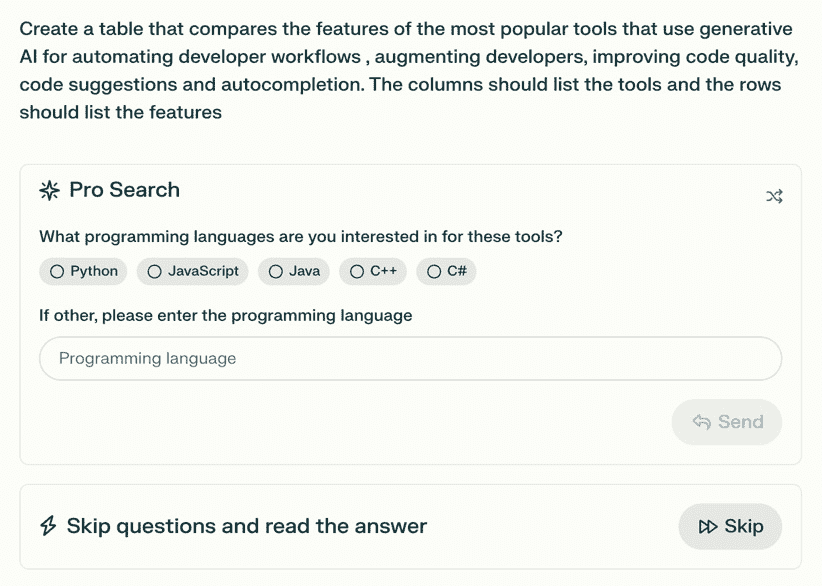

# 5

# 将人工智能融入平台工程

将**人工智能（AI**）融入平台工程代表了我们处理技术生态系统和运营效率方式的地震式转变。本章致力于揭示生成式人工智能在精炼、优化和革命化平台工程策略中所扮演的多方面角色。

通过整合人工智能，组织可以超越传统边界，实现更动态、响应更快、更智能的系统，推动企业向更高水平的创新和运营灵活性发展。

我们将深入研究人工智能不仅仅是工具，而是平台工程演变中的关键要素，提供可操作的见解和战略优势，重塑技术和商业格局。

在本章中，我们将探讨平台工程如何响应人工智能革命，重点关注拥抱生成式人工智能的变革潜力。我们将研究将人工智能集成到平台工程工作流程中的实际、真实世界的案例，突出其可以带来的具体利益和效率。最后，我们将讨论组织在将人工智能融入平台生态系统时面临的常见挑战，并提出克服这些障碍的策略，以释放人工智能的全部价值。

我们将涵盖以下主要主题：

+   拥抱平台工程中的 AI 革命

+   生成式人工智能系统的战略实施

+   生成式人工智能的实际应用和案例

+   导航人工智能集成复杂性

# 技术要求

虽然本章不需要特定的技术技能，但了解人工智能的基础知识，包括生成式人工智能，是有益的。从业务应用的角度区分人工智能、机器学习、人工神经网络、深度学习、生成式人工智能和**大型语言模型（LLMs**）的能力将增强对内容的理解。此外，熟悉第 1 至 4 章涵盖的主题对于充分欣赏本章的讨论至关重要。

# 拥抱平台工程中的 AI 革命

平台工程随着生成式人工智能技术的出现而发生了根本性的变革。这种变化不仅是一种进步，而是一种完全的转变，它重新定义了平台的发展、维护和扩展方式。生成式人工智能为工程过程带来了速度、精度和适应性，推动了数字基础设施的边界。这是一场革命，承诺将推动创新并开启新的可能性。这种范式转变可以通过比较传统的平台工程实践与受 AI 赋能的实践来最好地理解，突出 AI 带来的革命性影响。

| **特性** | **传统** **平台工程** | **AI 驱动** **平台工程** |
| --- | --- | --- |
| 开发速度 | 依赖于人工编码和流程，往往导致更长的开发周期。 | 通过自动化和人工智能辅助的代码生成加速开发，显著缩短上市时间。 |
| 运营效率 | 依赖于人工监控和维护，可能资源密集且容易出错。 | 利用人工智能进行预测性维护和自动化监控，提高效率并减少停机时间。 |
| 可扩展性 | 扩展需要人工干预和规划，可能导致瓶颈。 | 人工智能通过预测需求和自动调整资源实现动态扩展，确保无缝的可扩展性。 |
| 错误检测和质量 | 依赖于人工测试和审查，可能错过微小的错误或不效率。 | 采用人工智能驱动的工具进行实时错误检测和代码质量分析，提高可靠性。 |
| 创新能力 | 创新受限于人工流程和人类团队的操作速度。 | 人工智能促进了快速原型设计和实验，培养了一种创新和持续改进的文化。 |

表 5.1：传统平台工程与人工智能驱动平台工程的特性比较

通过将深度学习和机器学习功能集成到平台运营中，企业可以实时预测和克服挑战。这提高了效率，同时也确保了弹性和面向未来的解决方案。利用生成式人工智能的组织将获得竞争优势，加速在不断演变的数字景观中的战略目标。

## 人工智能作为平台工程的前沿

人工智能通过使平台能够更高效和主动地运行，正在改变和重新定义平台工程。它对平台工程产生了多方面的影响，并在引领行业走向一个适应性、前瞻性对平台成功至关重要的未来中发挥着关键作用。

以下是人工智能增强平台工程的一些方式：

+   **开发流程自动化**：人工智能，包括生成式人工智能，帮助自动化开发流程的特定方面，如代码建议、测试用例生成和部署配置，显著提高生产力。虽然 GitHub Copilot、Amazon Q Developer 和 Tabnine 等 AI 工具通过提供上下文代码建议和自动化重复编码步骤来加速任务，但人类监督仍然是必要的，以优化输出、处理错误和优化性能。这些工具作为加速器而不是替代品，使工程师能够专注于更高价值的任务，如战略和创新。此外，TensorFlow 和 PyTorch 等框架促进了机器学习模型的集成，而 Jenkins 和 GitLab 等 CI/CD 平台则集成了由 AI 驱动的测试和部署，使开发周期更加高效和可靠。这种协作方法促进了更快的发展和高品质，同时强调了人类专业知识的重要贡献。

+   **预测性维护和实时优化**：人工智能技术，尤其是机器学习模型，在预测性维护方面表现出色，通过分析大量运营数据来检测异常并预测潜在问题，在这些问题升级为系统故障之前。这种主动方法提高了平台可靠性并最小化了停机时间，这对于依赖持续运营的企业至关重要。Azure Machine Learning、AWS SageMaker 和 Splunk 等工具促进了异常检测和预测分析，确保系统弹性。此外，由 AI 驱动的优化系统实时适应工作负载变化和运营条件，提高效率和资源利用率。TensorFlow 和 PyTorch 等框架通过提供高级算法来支持实时决策，而 GitLab Duo 和 Red Hat Ansible 等工具简化了 AI 集成到运营流程中。这些能力确保平台保持稳健、响应迅速并与业务需求保持一致。

+   **增强的安全协议**：人工智能是网络安全的关键资产，利用机器学习和高级算法比传统方法更快地识别和响应威胁。SentinelOne 等工具实时分析大量数据集以检测异常和减轻风险。**长短期记忆**（**LSTM**）网络和 Transformer 等深度学习模型预测恶意活动模式，使主动防御机制成为可能。Splunk 和 Datadog 等平台将这些模型集成以监控行为、标记异常活动并加强网络以抵御攻击。在云环境中，OpenTofu 等工具分析访问模式以防止违规。通过持续学习和适应，由 AI 驱动的安全系统确保平台弹性和效率，保护组织免受不断发展的网络风险。

+   **用户体验定制**：人工智能通过分析交互、偏好和反馈来创建个性化的数字旅程，从而增强用户体验。例如，Netflix 使用人工智能算法根据观看历史推荐内容，提高用户参与度和留存率。同样，亚马逊利用机器学习定制产品推荐，推动客户满意度和销售额。人工智能还支持动态用户界面调整，例如 YouTube 的基于人工智能的推荐系统会根据个人观看习惯进行调整。Adobe Sensei 等工具通过根据用户行为优化产品展示，在电子商务平台上实现实时定制。这些应用通过为每个用户提供独特定制的体验来提高平台可用性，并促进更深层次的客户关系和忠诚度。

+   **战略决策**：人工智能通过分析大量数据集来揭示可操作的见解，从而赋予战略决策能力，这些见解从市场趋势到客户偏好不等。例如，Tableau 和 Power BI 中使用的机器学习模型能够实现实时数据可视化和趋势分析，帮助组织快速适应市场变化。例如，沃尔玛利用人工智能优化库存水平，通过预测需求模式来减少浪费并确保库存可用。Salesforce Einstein 集成的预测工具等人工智能驱动的工具帮助领导者识别新兴机会并减轻风险。像摩根大通这样的公司使用人工智能分析市场动态，并指导金融领域的投资策略。这种数据驱动的方法确保决策与战略目标一致，提高敏捷性并促进长期业务增长。

+   **推动可持续性**：人工智能，尤其是机器学习算法，通过优化资源利用和减少浪费来推动环境可持续性。例如，AWS 自动扩展和 Google Cloud 的 Active Assist 等工具利用人工智能根据需求动态分配云资源，从而降低能耗和运营成本。此外，人工智能系统分析数据中心中的能源使用模式，使数据中心能够采用更创新的冷却和电力管理方法，以降低碳足迹。像微软这样的公司通过利用人工智能驱动的洞察力，通过优化供应链物流和资源配置来实现碳负增长目标。通过采用这些人工智能解决方案，组织可以将自己的运营与全球可持续性倡议相一致，同时提高效率并降低成本。

随着人工智能技术的进步，它们与平台工程相结合，创造出自主和自适应的生态系统。平台未来的发展方向将推动创新，创造新的商业机会，并自动化任务。这将重新定义行业标准，使组织必须拥抱这些技术进步。人工智能预示着一个新时代，在这个时代，平台被设计来引领和改变行业。拥抱这一变革的组织可以保持在技术演变的尖端，并利用人工智能的巨大机会，特别是生成式人工智能，以增强平台工程。

要充分欣赏生成式人工智能在各个行业中的实际应用和真实世界用例，展示其在各个行业中的变革性影响，了解生成式人工智能系统的核心组件及其战略实施至关重要。

# 生成式人工智能系统的战略实施

组织需要对生成式人工智能系统的关键要素有深入的理解，并采取战略性的方法在平台工程中实施。这些组件是人工智能驱动系统的基石，使数字平台内实现智能功能和变革能力。通过战略性地实施这些要素，组织可以充分发挥生成式人工智能的潜力，革命性地改变其运营框架，确保效率和适应不断变化的技术环境。

## 生成式人工智能系统的关键要素

要充分利用人工智能的变革潜力，组织必须将生成式人工智能整合到其平台工程中。以下是生成式人工智能系统在整合过程中不可或缺的关键要素：

+   **数据管理和质量**：数据是生成式人工智能的基础。数据的质量、粒度和时效性直接影响结果。强大的数据管理框架确保准确性和完整性。先进的数据收集技术保持高标准。数据匿名化过程对于隐私和合规至关重要。采用结构化数据管道的组织在模型性能上可看到高达 30%的提升，而定期审计数据质量可以将错误减少 90%。

+   **机器学习模型**：生成式人工智能系统依赖于机器学习模型来理解大量数据。这些模型需要适当的算法选择、持续训练和再训练以适应不断变化的情况。如深度学习和强化学习等高级技术增强了模型做出复杂决策和自主改进的能力。在多种操作场景下严格测试这些模型的准确性和有效性至关重要。例如，强化学习模型在决策过程中将错误率降低了 25-35%，而采用定期再训练周期的组织在静态模型上实现了高达 40%的准确性提升。

+   **集成架构**：为了有效集成人工智能，需要一个强大的架构。它应该是灵活和可扩展的，以促进轻松更新和实时调整。与遗留系统的无缝集成也是必不可少的，需要定制的适配器或中间件解决方案，这些解决方案可以在不同的技术和协议之间进行转换。正确实施这一点对于人工智能的成功实施至关重要。灵活的集成可以将部署时间缩短 50-70%，而连接传统和现代系统的中间件解决方案可以将停机时间减少 40%。

+   **自动化框架**：人工智能驱动的自动化通过减少对人工干预的需求显著提高了操作流程。人工智能被用于处理各个领域的常规任务，例如网络管理、用户支持和应用程序部署。这些框架执行任务并从每次迭代中学习，以持续优化流程和提高效率。这种自适应自动化加快了操作速度，识别并解决系统内的低效问题，并使组织能够改善其运营。自动化框架最多可减少 70%的人工干预，从而实现 30-50%更快的任务执行时间和提高的工作流程效率。

+   **可扩展性和维护性**：人工智能系统必须高效扩展以应对不断变化的需求和市场波动。这意味着在高峰时段扩大规模以处理更大的工作量，在非高峰时段缩减规模以节省资源。定期更新软件和硬件组件对于保持这些系统的安全性和效率是必要的。持续的监控和预测性维护技术可以在问题影响系统性能之前检测并解决潜在问题。采用预测性维护的组织报告了 50%的停机时间减少，而可扩展的系统通过动态工作量调整减少了 20-30%的资源浪费。

+   **安全考虑因素**：人工智能集成带来了独特的安全挑战，尤其是对于生成式人工智能，它容易受到对抗性操纵等攻击。攻击者可以微妙地改变输入数据来欺骗模型，导致有害的输出。与传统的 IT 系统不同，生成式人工智能对复杂数据模型的依赖创造了特定的漏洞。为了减轻这些风险，对抗性训练有助于提高模型的弹性，而同态加密允许在加密数据上执行计算以保护敏感信息。异常检测算法，如 Splunk 中的算法，几乎可以实时地识别异常行为，从而提高响应时间。生成式人工智能还面临模型反演攻击，其中敏感数据可以被推断出来。例如，差分隐私策略可以模糊个体贡献以维持模型效用。定期的审计、基于角色的访问控制和强大的加密进一步保护系统免受威胁。通过实施这些措施，组织可以有效地应对生成式人工智能的安全风险，构建弹性且值得信赖的平台，同时保护敏感操作。

这些核心组件是战略资产，当有效实施和管理时，可以提高平台的运营效率和创新能力。接下来，我们将探讨在平台工程中战略性地实施人工智能，以进一步优化性能。

## 在平台工程中战略性地实施人工智能

在平台工程中实施生成式人工智能是一项战略性的努力，需要细致的规划和分阶段的执行。以下是组织应采取的详细步骤，以成功地将生成式人工智能技术融入其平台运营。

### 评估与规划

组织必须首先全面评估其技术基础设施、数据系统和员工能力。这次评估确定了人工智能改进的区域和潜在的集成挑战。在规划阶段，组织必须设定可衡量的目标，例如降低运营成本或提高客户满意度，并制定一个战略路线图，概述关键里程碑、资源分配和时间表。集成如 Grafana、Prometheus 和 Elastic 堆栈等可观察性工具可以通过提供对系统性能、资源利用和潜在瓶颈的实时洞察来增强这一评估。这些工具确保对人工智能驱动的平台工程系统进行持续监控，帮助组织保持与战略目标的对齐。

### 渐进式集成

团队应逐步集成生成式 AI 以降低风险和管理复杂性。从特定流程或业务领域的试点项目开始，作为一个控制测试环境来完善 AI 功能。逐步扩展成功的试点项目，将所学知识应用于更广泛的实施，以证明技术的有效性，并在用户和利益相关者中建立信心。

### 培训和支持

有效的 AI 培训计划对于最大化生产力至关重要。它们应涵盖 AI 工具带来的技术方面和运营变化。应提供全面的支持，包括技术团队和详细的文档，以培养对新技术的积极态度。通过教育和支持赋权用户，以确保更平滑的采用。

### 评估和扩展

对 AI 系统进行持续评估对于衡量其与初始目标的影响至关重要。建立关键绩效指标以跟踪有效性、用户参与度和**投资回报率**（**ROI**）。使用评估来识别成功和改进领域。从评估中获得的认识指导 AI 功能的扩展，以实现更广泛的影响。在扩展过程中优化 AI 运营，以确保成本效益和与业务目标的契合度。

### 适应性和进化

AI 不断进化，因此保持 AI 解决方案的更新以保持竞争力至关重要。组织必须通过更新 AI 模型和算法、采用新的 AI 技术以及修订集成策略来主动学习和创新，以快速应对市场变化。通过保持适应性，企业可以确保其 AI 系统保持有效性，并为组织提供持续的价值。

### 可持续性和道德治理

随着 AI 成为平台运营的组成部分，组织必须优先考虑道德治理和可持续性。实施道德 AI 框架对于确保 AI 运营中的公平性、透明度和问责制至关重要。此外，组织领导者必须考虑可持续性实践，以最大限度地减少 AI 系统对环境的影响，例如优化能源使用和选择环保的基础设施选项。

将生成式 AI 集成到平台工程中需要明确的实施步骤，以优化最大影响。采用这些实践将开启一个运营卓越和创新的新时代。这个基础为更深入地考察生成式 AI 在各个行业的实际应用和用例奠定了基础。我们将探讨生成式 AI 如何通过提高效率、安全性和战略敏捷性来转变平台运营。

# 生成式 AI 的实际应用和用例

生成式人工智能不仅仅是一项技术进步；它是解锁平台工程中无与伦比的创新和效率的关键。在本节中，我们将探讨生成式人工智能如何通过推动技术进步和创造前所未有的机会来改变平台工程。

我们将了解如何将生成式人工智能集成到运营中，增强能力，并在组织中促进创新。通过理解这些应用，我们将获得自动化任务、优化部署并推动 DevOps 和平台工程可能性的边界的能力。

## 自动化开发工作流程

生成式人工智能的采用标志着一个新的时代，在这个时代中，人类智慧和人工智能的融合显著提升了开发工作流程中的生产力和创造力。这种融合提高了效率，并改变了开发者创建和维护软件的方式。以下是一些加快开发速度、提高代码质量和协作的方法。

## 增强开发者能力

生成式人工智能扩展了开发者的技能，使他们能够快速构思。这些工具作为按需专家提供编码助手，使复杂编码对所有技能水平都变得可访问。协作式人工智能助手，如**GitHub Copilot**和**Amazon Q Developer**（之前称为 CodeWhisperer），通过自然语言交互帮助团队完成日常开发任务。这些工具利用**自然语言处理**（**NLP**）模型，通过将开发者输入分解为标记、理解语法和语义以及与广泛的代码示例训练数据集匹配来分析开发者输入。基于上下文和输入，AI 生成与开发者意图相符的相关代码片段或建议。例如，当提示“用 Python 创建一个 REST API 端点”时，NLP 模型识别任务，检索相关模式，并生成一个功能性的代码块。这种能力允许开发者快速原型化新功能，避免手动编码过程中的障碍，在不同编程语言之间转换代码，并指导云资源配置。这些工具通过利用 AI 显著提高了生产力，并为创新和高价值工作腾出时间。

## 提高代码质量

在**谷歌的 Gemini**和亚马逊的 Q Developer 等平台上集成 AI，重新定义了代码质量，自动化生成清洁、高效的代码，重构和部署前的健壮性测试。这些工具通过识别性能瓶颈、安全漏洞和过时的依赖项来优化代码库。例如，这些平台可以通过分析代码中嵌入的数据库查询来检测漏洞，如 SQL 注入风险，并建议使用参数化查询或输入清理技术。它们还通过诸如环路复杂度等指标来衡量代码质量，确保代码更易于测试和调试，以及可维护性指数，量化代码库的可理解性、可修改性或可扩展性。通过提供可操作的见解，例如建议减少冗余循环或标记已弃用的库，这些工具帮助开发者节省时间，增强安全性，并确保代码的可维护性。这种方法改变了软件开发，使组织能够保持安全、最新和高效，同时生产出精简、健壮的系统。

## 头脑风暴和问题解决

AI 驱动的工具通过提出大量解决方案和方法，对问题解决做出了重大贡献。这种能力在头脑风暴会议中非常有价值，因为 AI 生成的想法的广度可以激发创新解决方案。Google Gemini 和**AskCodi**是头脑风暴和问题解决的优秀工具。它们提供开发者可能未曾想到的见解和建议，帮助他们提出创新解决方案。

## 代码建议和自动补全

Tabnine 和 AskCodi 等工具重新定义了代码建议和自动补全的领域。这些工具从庞大的代码库中学习，提供有洞察力的建议，简化编码过程，并将开发者体验提升到新的高度。

## 转变开发者工作流程

生成式 AI 可以从构思到生产彻底改变开发者工作流程。GitHub Copilot、Amazon Q Developer、Google Gemini 和 GitLab Duo 等 AI 辅助工具集成到开发过程中，提供了一个生成代码、解释、文档和单元测试的交互式环境。这简化了过程，减少了上下文切换，并集中了开发。

## 思维速度的 AI

为了评估生成式 AI 对开发者工作流程的深远影响，我们提示 ChatGPT、Microsoft Copilot、Google Gemini 和 Perplexity AI 创建了一个比较表，列出了最流行的提高代码质量和生产力的工具。我们的动机是量化 AI 工具在自动化和显著减少技术研究、比较分析、建议和头脑风暴等任务的价值实现时间上的效率和精确度。

为了达到这个目的，我们使用以下提示进行了实验：

```py

Create a table that compares the features of the most popular tools that use generative AI for automating developer workflows, augmenting developers, improving code quality, code suggestions, and auto-completion. The columns should list the tools, and the rows should list the features
```

每个生成式 AI 模型都在几秒钟内生成了结果。另一方面，我们花了几天时间来研究、分析和整理本节所需的必要信息。然后，我们专注于这些 AI 模型的准确性，并评估它们与开发者特定需求互动和适应的能力。

### ChatGPT 4

这里是 ChatGPT-4o 生成的表格：

| **特性/工具** | **GitHub Copilot** | **Amazon CodeWhisperer** | **Tabnine** | **Kite** |
| --- | --- | --- | --- | --- |
| AI 技术 | OpenAI Codex | 定制的 AWS 模型 | GPT-3 & 定制模型 | 深度学习模型 |
| 代码建议 | 是 | 是 | 是 | 是 |
| 自动补全 | 广泛 | 广泛 | 广泛 | 广泛 |
| 集成 | VS Code, Neovim, 等. | Eclipse, VS Code, IntelliJ | 所有主要 IDE | VS Code, IntelliJ, 其他 |
| 支持的语言 | 广泛（50+种语言） | Java, Python, JS | JavaScript, Python, Java, 等. | Python, JavaScript |
| 代码重构 | 有限 | 是 | 是 | 是 |
| 内联文档 | 是 | 是 | 是 | 是 |
| 安全特性 | 安全建议 | 安全扫描 | 基本级 | 没有报告 |
| 从用户代码中学习 | 是 | 有限 | 是 | 有限 |
| 定价 | GitHub 订阅的一部分 | 预览期间免费 | 免费和付费计划 | 免费和付费计划 |
| 实时协作 | 否 | 否 | 否 | 否 |
| 使用洞察与分析 | 否 | 是 | 否 | 是 |

表 5.2：由 ChatGPT-4o 创建的领先生成式 AI 工具在开发者工作流程中的比较特性列表

该表格提供了一个全面的概述，展示了各种工具的广泛理解，包括它们的集成能力、AI 技术使用和语言支持等功能。这个输出展示了 ChatGPT 在多个方面提供详细、广泛见解的优势。

### Microsoft Copilot

这里是 Microsoft Copilot 生成的表格：

| **特性/功能** | **GitHub Copilot** | **Google Gemini** | **Amazon CodeWhisperer** | **AskCodi** | **Tabnine** |
| --- | --- | --- | --- | --- | --- |
| 代码生成和补全 | 是 | 是 | 是 | 是 | 是 |
| 优化和重构 | 是 | 是 | 是 | 否 | 否 |
| 测试生成 | 是 | 是 | 是 | 是 | 否 |
| 文档和知识查找 | 是 | 是 | 是 | 是 | 否 |
| 协作辅助 | 是 | 是 | 是 | 是 | 是 |
| 云集成和指导 | 是 | 是 | 是 | 否 | 否 |
| 错误检测 | 否 | 否 | 是 | 否 | 否 |
| 代码审查 | 否 | 否 | 是 | 否 | 否 |
| 代码优化 | 否 | 否 | 是 | 否 | 否 |
| 重构 | 否 | 否 | 是 | 否 | 否 |
| 自然语言查询 | 是 | 是 | 是 | 是 | 是 |

表 5.3：由 Microsoft Copilot 创建的领先生成式 AI 工具在开发者工作流程中的比较特性列表

Microsoft Copilot 的输出侧重于与各种 IDE 和语言的无缝集成，强调了其分析开发环境所需的各种功能和能力。此表反映了该工具的适应性和在不同平台间促进开发者任务的作用。

### Google Gemini

Google Gemini 的表格仅限于对技术的概述性功能比较，但响应速度最快。

| **功能** | **Amazon CodeWhisperer** | **GitHub Copilot** | **Tabnine** | **Bardeen** |
| --- | --- | --- | --- | --- |
| 代码生成 | 是 | 是 | 是 | 是 |
| 代码补全 | 是 | 是 | 是 | 是 |
| 上下文感知建议 | 是 | 是 | 是 | 是 |
| 多语言支持 | 有限 | 是 | 是 | 有限 |
| 与 IDE 的集成 | Visual Studio Code、AWS IDEs | 各种 IDE | 各种 IDE | 各种集成 |
| 重点关注 | 代码生成和优化 | 通用代码补全和建议 | AI 驱动的代码补全 | 使用生成式 AI 的流程自动化 |
| 学习曲线 | 需要熟悉 AWS 服务 | 需要 GitHub 账户 | 需要熟悉 IDE 集成 | 需要最小化设置 |

表 5.4：Google Gemini 创建的用于开发者工作流程的领先生成式 AI 工具的比较功能列表

### Perplexity AI

Perplexity AI 的 Pro 版本通过请求额外的澄清来脱颖而出，强调了其理解和适应特定用户输入的能力，如*图 5.1*所示。



图 5.1 – Perplexity AI Pro 请求澄清以改善响应质量

这种交互性确保了输出快速且精确地符合用户需求，展示了在软件开发环境中 AI 应用的更复杂应用。为了在各种模型之间保持一致性，我们选择了跳过问题直接给出答案的选项。

| **功能** | **GitHub Copilot** | **Visual Studio**IntelliCode** | **Tabnine** | **OpenAI GPT-3** |
| --- | --- | --- | --- | --- |
| 使用的 AI 模型 | OpenAI 的 Codex | 专有 AI 模型 | GPT-3 | GPT-3 |
| 支持的编程语言 | Python、JavaScript、TypeScript、Ruby 等 | 多种语言 | Python、JavaScript、C++等 | 多种语言 |
| 集成 | Visual Studio Code 等 IDE | Visual Studio | 各种 IDE | 通过 API 进行自定义集成 |
| 代码建议 | 实时代码分析和建议 | 预测性代码补全 | 上下文代码补全 | 上下文代码建议 |
| 代码自动补全 | 是 | 是 | 是 | 通过 API 调用是 |
| 功能性 | 代码生成、翻译、快速原型设计 | 个性化建议、代码质量提升 | 深度上下文理解、错误检测 | 代码自动补全、自然语言理解 |
| 学习能力 | 从项目数据库中学习 | 从用户代码模式中学习 | - | - |
| 安全和隐私 | 提到了潜在的安全风险 | - | - | - |
| 成本 | 某些用户免费，否则每月 10 美元 | - | - | 需要 API 密钥，价格不一 |
| 额外功能 | 协作工具，版本历史跟踪 | 检测代码中的潜在问题 | 代码生成，代码翻译 | 可定制的集成 |

表 5.5：Perplexity AI 创建的用于开发者工作流程的领先生成式 AI 工具的比较功能列表

Perplexity AI 的输出不仅展示了工具的精确度，还展示了其定制的潜力，以满足特定用户的需求并增强其辅助的相关性。

## 分析

我们的实验表明，虽然 ChatGPT、Microsoft Copilot、Google Gemini 和 Perplexity AI 等生成式 AI 模型都能提供快速响应，但它们的输出在细节和重点方面存在显著差异。例如，这些模型中没有哪一个认识到 Amazon CodeWhisperer 现在被称为 Amazon Q Developer，而且这些模型对最受欢迎的工具也没有达成一致。此外，Perplexity AI 有一些空单元格，这表明其比较分析存在差距，而 Microsoft Copilot 的响应仅限于是/否单元格，缺乏其他模型提供的细微细节。这种差异强调了选择适合特定任务的正确工具的必要性，因为每个 AI 模型都有其优势和局限性。这也突出了全面评估和交叉引用的重要性，以确保全面和准确的见解。

为了评估 ChatGPT、Microsoft Copilot、Google Gemini 和 Perplexity AI 等生成式 AI 模型的能力，我们使用了一套基于三个主要标准的受控测试：准确性（生成输出的精确性和正确性）、处理时间（生成响应的速度）和集成难度（工具如何无缝地融入平台工程工作流程）。这些基准测试使我们可以对每个模型在实际场景中的优势和劣势进行对比分析。

| **标准** | **ChatGPT** | **Microsoft Copilot** | **Google Gemini** | **Perplexity AI** |
| --- | --- | --- | --- | --- |
| 精确度 | 85% – 响应中的高细节 | 70% – 限制于是/否答案 | 80% – 平衡但通用 | 65% – 不一致且有差距 |
| 处理时间 | 每个查询约 3 秒 | 每个查询约 2 秒 | 每个查询约 4 秒 | 每个查询约 2.5 秒 |
| 集成难度 | 中等 – 需要定制 | 高 – 在 Microsoft 生态系统中无缝 | 中等 – 初期工具 | 低 – 集成工具有限 |
| 优点 | 详细的解释 | 快速的响应速度 | 广泛的功能支持 | 多源聚合 |
| 弱点 | 偶尔不准确 | 缺乏细微的细节 | 响应时间较长 | 某些任务中缺少数据 |

表 5.6：根据关键性能标准比较领先 AI 助手的比较

这项分析强调了选择正确工具的重要性，因为没有任何一个模型在所有领域都表现出色。然而，需要注意的是，这些工具持续改进和演变。定期进行的改进和增强意味着它们今天的功能可能已经超过了我们在实验期间观察到的。

在对平台工程进行工具选择或增强工作流程的综合研究时，我们可能需要多个 AI 助手。然而，一个单一、高度集成的工具对于直接帮助开发者来说是最优的。在开发过程中利用多个 AI 工具可能会产生矛盾，增加摩擦并降低效率，因为开发者可能最终不得不在过多的信息中导航，而不是进行富有成效的编码。因此，战略性地选择工具对于有效地利用 AI 而不增加额外负担至关重要。

## 基础设施管理中的 AI

将 AI 与基础设施管理相结合，显著改变了 IT 运营，使系统更加智能、高效和自适应。虽然并非所有现有工具都内置 AI 功能，但有一些新兴技术和集成将 AI 驱动的功能引入了基础设施管理领域。以下是一些促进这一变革的准确工具和框架的示例：

+   **GitLab Duo**：GitLab Duo，特别是 Duo Workflows，是基础设施管理中主动使用 AI 的典范。Duo 结合了 AI 辅助的代码生成和跨**软件开发生命周期（SDLC）**的集成。它通过推荐基础设施代码片段和促进开发和运维团队之间的无缝协作来增强自动化。Duo Workflows 还进一步集成了 AI 驱动的编排，使组织能够主动应对系统需求并简化 CI/CD 管道。

+   **Red Hat Ansible Lightspeed 与 IBM watsonx Code Assistant**：虽然 Ansible 本身不包含 AI 功能，但与 IBM watsonx 集成的 Lightspeed 增加了生成 AI 功能，用于创建 playbook。这种集成通过利用 AI 生成和优化自动化脚本来简化 playbook 的创建。组织可以利用这一点来减少开发稳健自动化工作流程所需的时间，使基础设施管理更加高效且错误率更低。

+   **Terraform（通过 AI 集成）**：虽然 Terraform 缺乏原生 AI 功能，但 GitHub Copilot 或 GitLab Duo 等 AI 工具可以帮助编写和优化 Terraform 配置。通过使用 AI 生成的基础设施代码，组织可以以更高的准确性和效率自动化资源分配。与监控和预测分析工具的第三方集成还可以实现主动的基础设施扩展和优化。

+   **GitHub 高级安全和动作（带外部 AI）**: GitHub 高级安全提供由 CodeQL 驱动的代码扫描，增强了基础设施管理工作流程中的安全性。虽然不是由 AI 驱动的，但 GitHub Actions 工作流程可以与外部 AI 驱动的监控、警报和自动化工具集成。这些集成将智能引入部署编排和事件响应等流程。

+   **使基础设施中的 AI 成为可能的框架和 API**: 例如，用于 Kubernetes 的**Kubeflow**和用于管理机器学习工作流程的**MLflow**等框架有助于将 AI 与基础设施管理联系起来。AWS SageMaker 和 Google AI Platform 等 API 可以集成到 DevOps 管道中，引入预测分析、异常检测和优化，提高运营效率。

尽管仍在发展中，AI 在基础设施管理中的作用展示了其简化工作流程、提高安全性和优化资源利用的潜力。通过利用具有准确 AI 能力的工具并整合框架到现有工作流程中，组织可以为下一代智能 IT 运营做好准备。

## 通过 AI 增强安全性

AI 已经改变了数字安全，创造了一个强大且弹性的生态系统。它有助于保护软件供应链，积极对抗网络威胁，并实施全面的安全解决方案。AI 预测漏洞，减轻风险，保护数字资产，培养一个值得信赖的生态系统。这一转变正在重新定义安全范式，并催化组织变革。这一旅程的每一步都增加了价值，并对我们的数字世界产生了重大影响。

## 安全的软件供应链

安全的软件供应链对于企业保护其数字资产和维护其软件产品的完整性至关重要。虽然并非所有工具都原生集成 AI 功能，但 AI 集成方面的进步已经增强了软件开发和部署过程。接下来，我们将讨论 AI 对安全供应链的贡献的准确示例，并突出可操作的实践：

+   **静态代码分析中的 AI**: 由 AI 驱动的静态代码分析工具，如 GitLab Duo，通过在开发早期阶段识别漏洞和建议代码改进，实现了“左移”方法。Duo 将生成式 AI 集成到 IDE 和 CI/CD 管道中，使开发者能够在问题升级之前解决安全问题、代码质量问题和合规性问题。这降低了将漏洞引入生产环境的风险，并加速了交付时间表。

+   **AI 驱动的合规性管理**: GitLab 包含合规性功能，扫描软件许可证并评估与合规性基线相比的 **通用漏洞和暴露**（CVEs）数量。尽管这些功能本身不使用 AI，但 GitLab Duo 等 AI 集成增强了合规性管理，通过提供智能推荐以确保法规一致性并减少人工监督。

+   **使用第三方工具的容器安全**: 平台如 **Red Hat OpenShift** 和 **VMware Tanzu** 可以与工具如开源容器安全扫描器 Clair 集成。虽然 Clair 本身不使用 AI，但组织可以将这些平台与 AI 驱动的监控解决方案如 **Sysdig Secure** 或 **Deep Instinct** 结合，以自动化检测和缓解容器化应用程序中的漏洞。

+   **GitHub 高级安全集成**: GitHub 的高级安全功能使用 CodeQL 扫描漏洞，并允许第三方与 AI 功能的工具集成以增强扫描。虽然 GitHub Copilot 是一种用于编码辅助的生成式 AI 解决方案，但它通过基于 AI 的推荐引导开发者高效地解决检测到的问题，从而补充高级安全功能。

+   **CI/CD 管道中的 AI**: AI 在优化 CI/CD 工作流程中至关重要，它通过将预测分析和异常检测集成到管道中。例如，**Harness** 工具利用 AI 监控部署、分析模式并防止风险更新，确保安全稳定的发布。

+   **由 AI 增强的左移实践**: 在安全的软件开发生命周期（SDLC）中，左移方法是通过将 AI 工具直接嵌入到开发者环境中来推动的。这些例子包括实时代码分析、AI 辅助的测试用例生成以及集成到 CI/CD 工作流程中的漏洞管理。这些实践使开发者能够主动解决问题，提高软件质量和安全性。

AI 在安全软件供应链中的作用不仅限于检测，还包括积极的预防和实时监控。通过将 AI 集成到 SDLC 中，企业可以创建弹性、合规和安全系统，保护其数字资产并加快上市时间。

## 积极的网络安全

今天网络安全威胁格局的复杂性要求先进的、积极的解决方案。虽然一些平台如 Splunk、Elastic 和 Datadog 集成了 AI 功能，但它们在网络安全中的作用仅限于生成见解和协助日志分析，而不是直接的网络安全功能。为了有效地应对复杂的威胁，AI 驱动的工具采取积极的立场，专注于分析网络流量模式并关联数据以识别和缓解风险。以下示例突出了 AI 驱动的工具和技术如何应用于网络安全的不同层面，以增强今天复杂数字环境中的威胁检测、预防和响应：

+   **AI 驱动的网络流量分析**：高级算法通过使用历史数据建立正常行为的基线来分析流量模式。AI 模型检测到异常，如不寻常的访问模式、高数据传输速率或异常的设备交互，这些都可能表明潜在的攻击。例如，**入侵检测系统（IDS）**如**Darktrace**和**Vectra AI**使用机器学习模型分析来自日志文件、设备遥测和数据包捕获的数据。这些工具可以标记出表明**高级持续性威胁（APTs）**或内部风险的偏差。

+   **端点保护工具**：例如**SentinelOne**和**CrowdStrike**这样的工具利用 AI 通过监控设备遥测和用户行为来保护端点。这些解决方案应用异常检测算法来识别不寻常的活动，如未经授权的文件访问或网络内的横向移动。通过关联数据源，如端点日志和系统活动，AI 驱动的端点保护可以主动检测恶意软件、勒索软件和钓鱼攻击，在造成重大损害之前进行防范。

+   **网络安全中的 AI 技术**：AI 技术如监督学习可以识别已知的攻击模式，而无监督学习则可以在没有先验签名的情况下检测新型威胁。以适应性著称的强化学习模型，通过优化其实时检测能力来应对不断发展的威胁。这些技术提高了威胁检测的准确性，并最小化了误报，从而提升了事件响应的效率。

+   **网络安全弹性的预测分析**：AI 还推动了预测分析，使企业能够通过分析大量数据集中的趋势来预测潜在的威胁。例如，**Cortex XSOAR**、**PhishEr Plus**和**FortiSOAR**等工具将预测洞察集成到安全编排工作流程中，从而加快风险缓解。企业可以通过识别脆弱点和潜在的攻击向量，有效地分配资源并加强其防御。

+   **可视化检测工作流程**：AI 增强的工作流程通常从从不同来源（例如，日志、遥测和网络数据包）的数据摄取开始。例如，Darktrace 通过建立网络遥测的行为基线来检测异常，Vectra AI 识别出表明横向移动的不寻常通信模式，而 Cortex XSOAR 则整合不同的数据源以优先处理警报并自动化响应工作流程。数据经过预处理、过滤后输入到机器学习模型中，以建立行为基线。异常触发警报，促使人工分析师或自动化系统进行调查和响应。这些步骤创建了一个反馈循环，持续优化 AI 的准确性和适应性。

将人工智能融入网络安全策略使组织能够领先于不断发展的威胁，从被动安全措施转变为主动安全措施。通过利用人工智能驱动的工具和工作流程，企业可以增强其网络安全弹性，并在不断变化的威胁环境中保护其数字资产。

## 综合安全解决方案

人工智能正在改变网络监控、入侵检测和网络安全以外的关键安全领域。它被集成到各种技术中以保护平台和资产。

人工智能驱动的**视频管理系统（VMSs）**正在革新物理安全。例如，**Avigilon**和**Milestone Systems**等解决方案使用计算机视觉和深度学习算法实时识别和标记可疑活动。这提供了宝贵的见解和早期预警，使安全团队能够在问题升级之前主动应对潜在的安全漏洞。这些人工智能驱动的 VMSs 不断学习和适应环境，成为组织监控和应对潜在威胁的必备工具。

人工智能还在革新访问控制和身份管理。生物识别认证系统，如面部识别和指纹扫描仪，现在集成了人工智能驱动的功能，以增强安全性和便利性。这些解决方案准确且快速地验证个人身份，降低未经授权访问的风险，同时简化授权人员的进入流程。

此外，人工智能在确保**物联网（IoT）**设备安全方面发挥着至关重要的作用。随着连接设备数量的持续增长，网络犯罪分子的攻击面呈指数级扩大。人工智能驱动的物联网安全平台分析网络流量、设备行为和上下文数据，以实时检测和缓解威胁，识别异常和漏洞。这有助于组织维护物联网生态系统的完整性，并抵御新兴的威胁。

组织应采用能够使用基于设备行为模式和上下文数据的机器学习模型进行实时设备认证的解决方案，以有效地在物联网安全中实施人工智能。例如，异常检测算法可以即时监控设备活动的偏差，如意外的通信模式或未经授权的访问尝试，标记潜在的安全漏洞。利用人工智能驱动的身份和访问管理工具确保只有经过验证的设备和用户才能访问物联网网络，增强安全性同时最大限度地减少误报。将这些方法与持续学习模型相结合，确保对物联网生态系统中不断发展的威胁具有适应性保护。

将 AI 集成到物理和物联网安全中比检测和响应能力更全面。AI 驱动的预测分析通过分析历史数据、环境因素和其他相关信息，转变了风险评估和管理。AI 系统提供了对潜在漏洞及其影响的宝贵见解，使主动风险管理成为可能。

威胁领域不断演变，这使得组织采用全面且适应性强的安全解决方案至关重要。AI 驱动的技术可以帮助组织在物理和网络安全威胁发生之前，通过主动识别和减轻风险来保持领先。

对于希望现代化其安全策略的企业来说，集成 AI 驱动的解决方案应成为首要任务。这为保护其平台、资产和数字基础设施提供了显著优势。然而，在平台工程中实施 AI 可能具有挑战性，并带来其自身的风险，需要仔细规划和稳健的执行来管理和减轻这些风险。

探索更多：生成式 AI 的实际应用

我们邀请您扩展我们在“**思维速度的 AI**”部分概述的实验，并将相同的方法论应用于“**AI 在基础设施管理**”和“**通过 AI 增强安全**”部分列出的其他关键领域。调整原始提示以适应这些环境，并发现生成式 AI 如何改变这些领域。这次探索将加深您对 AI 能力的理解，并使您能够利用尖端技术简化并确保您的运营，通过 AI 驱动的洞察力增强您的战略举措。

# 探索 AI 集成的复杂性

将生成式 AI 集成到平台工程中提供了显著的好处，但也带来了重大的挑战。主要关注点是数据隐私和安全，因为 AI 系统处理敏感和专有信息。组织还必须应对复杂且不断变化的监管环境，确保跨司法管辖区合规。道德考量至关重要，以避免意外后果，如偏见和缺乏透明度。本节将解决这些挑战，并提出减轻风险的策略，使领导者能够负责任和有效地利用 AI。

## 数据隐私和安全担忧

随着生成式 AI 技术越来越集成到平台工程中，数据隐私和安全的含义重大，特别是可能出现的漏洞。必须实施策略来有效保护敏感信息。为了解决这些担忧，组织在实施生成式 AI 时应关注以下关键领域的几个关键数据隐私和安全方面：

+   **数据泄露的脆弱性**：生成式 AI 系统处理和存储大量数据，其中一些数据非常敏感或属于专有信息。它们的复杂性可能引入漏洞，使其成为网络攻击的潜在目标。组织必须实施强大的网络安全措施，例如加密、安全访问协议和入侵检测系统（IDS），以防止未经授权的访问和数据泄露。

+   **隐私合规性**：随着全球数据隐私法规的不断演变，合规性成为一个关键挑战。生成式 AI 系统必须设计和运营以符合欧洲的通用数据保护条例（GDPR）、加州的消费者隐私法案（CCPA）和其他地区法规。这包括实施设计时的数据保护、定期进行隐私影响评估，并确保数据处理实践透明且负责任。

+   **数据匿名化技术**：生成式 AI 应用应采用高级数据匿名化技术，从数据集中移除个人标识符并减轻隐私风险。然而，在确保匿名性的同时保持数据的效用可能具有挑战性，因为过度匿名化的数据可能会失去对训练 AI 模型的有效性。

+   **AI 与同意**：在 AI 系统中使用个人数据引发了关于同意的问题。当个人数据用于训练或操作 AI 系统时，组织必须从个人那里获得明确的同意，尤其是在可能影响个人权利或自由的应用中。关于数据的使用、存储和共享的明确沟通对于维护信任和合规至关重要。

+   **AI 模型的安全性**：除了数据安全之外，AI 模型本身也可能成为攻击目标。例如，模型反演或对抗性攻击可以利用 AI 算法中的弱点来提取敏感信息或操纵模型行为。保护 AI 模型需要确保它们所使用的数据和模型本身的安全，包括实施检测和应对 AI 系统攻击的措施。

+   **持续监控和审计**：鉴于生成式 AI 系统的动态特性，持续的监控和定期的安全审计对于确保隐私和安全措施的有效性至关重要。这包括审查访问控制、评估数据保护策略，并根据新的威胁更新安全协议。AI 驱动的工具通过分析用户行为、检测未经授权的访问尝试，并提供实时洞察，确保跨多云环境的数据流和访问控制得到全面的安全保障。

解决这些数据隐私和安全问题需要多方面的方法，包括技术解决方案、组织政策和遵守法律标准。通过优先考虑数据保护和道德考量，组织可以建立信任，并确保其在平台工程中使用生成式 AI 增强能力的同时，不损害安全或隐私。

## 监管和合规问题

生成式 AI 在平台工程中的快速发展和集成引入了一个复杂的监管和合规挑战网络。随着政府和国际机构努力跟上技术创新的步伐，组织必须在一个不断变化的监管环境中导航。为了有效地应对这些挑战，组织必须考虑几个关键的合规和监管责任领域：

+   **理解多样化的监管环境**：生成式 AI 应用通常跨越多个司法管辖区，每个地区都有自己关于数据隐私、AI 使用和网络安全的一套规则和标准。公司需要熟悉它们运营地区的特定法规，例如欧盟的 GDPR，它对数据使用和个人隐私施加了严格的指导方针。保持合规需要对这些法规有深入的理解，并迅速适应监管变化。

+   **行业特定法规**：根据行业不同，可能需要额外的监管层来管理 AI 技术的部署。例如，医疗行业面临严格的关于患者数据和医疗设备的法规，而金融行业必须遵守旨在防止欺诈并确保透明度的法律。理解和遵守这些行业特定法规对于在专业领域成功和合法使用生成式 AI 至关重要。

+   **认证和标准合规性**：AI 系统通常需要满足特定标准并获得认证，以建立信任并确保质量。这些可能包括 AI 安全、伦理和互操作性的标准。遵守 ISO 和 IEEE 等国际标准可以表明对最佳实践和质量保证在 AI 开发和部署中的承诺。

+   **知识产权问题**：随着 AI 系统能够创造内容或发明新产品，知识产权（IP）问题变得越来越复杂。组织必须应对 AI 生成输出的法律影响，确定所有权并确保其使用 AI 不会侵犯现有的知识产权。

+   **责任和问责制**：在人工智能系统造成伤害或经济损失的情况下确定责任是一个重大的法律挑战。组织必须建立明确的问责制框架，以解决其人工智能系统行为可能导致的潜在损害或法律诉讼。这包括制定稳健的风险管理策略和责任保险政策，以覆盖与人工智能相关的风险。

+   **与监管机构的互动**：与监管机构的积极互动可以帮助组织影响人工智能法规的发展，并确保其利益和关切得到解决。参与行业团体、政策讨论和公众咨询还可以提供对即将到来的监管变化的见解，使公司能够做好准备并适应。

组织必须应对平台工程中的监管和合规问题，以确保生成式人工智能应用的合法性和伦理完整性。合规框架、法律教育和积极参与监管发展是必要的投资，这些投资将创新的人工智能使用与法律要求相一致，并与伦理标准相符合。组织可以通过利用诸如**OneTrust**（用于隐私合规）或**BigID**（用于数据治理）等工具来简化合规工作。这些工具以及人工智能驱动的解决方案可以通过分析数据流、识别潜在违规行为并生成可操作的报告来自动化合规监控，从而高效地满足监管要求。

通过整合这些工具和实践，组织可以降低法律风险并促进负责任的人工智能采用。这不仅仅是满足法律要求，更是确保社会信任和问责制。这种积极主动的方法强调了组织需要考虑其人工智能驱动举措的更广泛的伦理和社会影响，在创新与公平和公正之间取得平衡。这是一个重大的责任，不应被轻视。

## 伦理和社会影响

在平台工程中部署生成式人工智能不仅带来了技术和监管挑战，还带来了深刻的伦理和社会影响。由于这些技术可以影响企业内部的重要决策和运营，因此有意识地部署它们的责任也在增加。让我们深入探讨生成式人工智能的伦理考量和社会影响，强调负责任创新和部署策略的必要性：

+   **偏见和公平性**：人工智能系统可能会延续偏见并导致不公平的结果，这通常是由于训练人工智能模型所使用的数据造成的，这些数据可能反映了历史不平等或偏见。为确保公平性，对人工智能系统进行严格的测试和持续监控是必要的，以识别和减轻偏见。组织必须致力于开发包容性和公平的人工智能，以防止对任何群体的歧视。

+   **透明度和可解释性**：随着 AI 系统越来越多地参与决策过程，利益相关者需要决策的透明度。为了在 AI 中保持信任和问责制，其开发者必须开发可解释的 AI，提供其决策的可理解原因。这对于员工和客户对 AI 生成的决策有信心并理解其基础是必要的。

+   **隐私和监控**：生成式 AI 处理大量数据的能力引发了重大的隐私担忧。能够访问敏感个人和公司数据的 AI 系统存在隐私泄露和监控的高风险。组织必须遵守严格的数据保护标准，并在使用 AI 时优先考虑隐私权，以防止未经授权的访问和滥用。

+   **对就业的影响**：生成式 AI 的自动化能力可以通过使某些角色变得冗余同时创造新的角色，显著改变就业市场。道德组织必须积极应对这些变化，为受影响的员工提供再培训和技能提升的机会。这种方法可以减轻对就业的负面影响，同时构建一个未来准备好的劳动力队伍。

+   **社会影响和责任**：生成式 AI 有可能影响超出单个组织的社会结构和规范。AI 的道德部署应考虑长期社会结果，包括加剧不平等或社会动态变化的潜力。公司有责任评估这些更广泛的影响，并努力寻求有利于整个社会的解决方案。

+   **治理和伦理框架**：为了解决这些伦理挑战，需要包括伦理指南、监督机制和定期审计在内的强大治理框架。这些框架应与包括伦理学家、社会学家和受影响社区代表在内的多元化利益相关者合作制定，以确保对 AI 治理的全面和公正方法。

通过仔细考虑这些复杂性——数据隐私和安全、不断变化的监管环境以及伦理影响——组织可以在平台工程中创新、高效和负责任地整合生成式 AI。实施全面战略以应对这些挑战，确保 AI 的部署不仅增强运营能力，而且符合伦理标准和公众期望。理解这些因素将极大地帮助您为组织制定更好的 AI 政策，并促进负责任的 AI。这种积极主动的方法使组织处于技术进步的前沿，准备好利用 AI 的全部潜力，同时防范其风险。

# 摘要

本章展示了将生成式人工智能融入平台工程的变革潜力，展示了人工智能如何提升平台战略并简化多个维度的运营。从增强决策到加强安全协议，平台工程中的 AI 应用优化了现有流程，并为软件开发和基础设施管理的创新方法打开了大门。整合 AI 可以帮助组织实现效率、敏捷性和响应性，在技术景观中树立新的标准。

行动呼吁

+   **试点 AI 驱动项目**：在您的当前平台运营中识别机会，让您的团队能够整合 AI。从专注于自动化任务、增强安全措施、提高弹性和持续评估其性能的试点项目开始。这些试点将为在整个组织中扩展 AI 整合奠定基础，与您的领导层一起培养创新和持续改进的文化。

+   **投资于 AI 技能发展**：随着 AI 成为平台工程的关键组成部分，投资于团队技能提升变得至关重要。提供培训和资源，帮助您的员工有效理解和实施 AI 技术，确保您的组织始终处于创新的前沿。

+   **建立 AI 伦理和治理**：制定和实施政策指南，以确保在您的组织中负责任地使用 AI。重点在于创建促进透明度、公平性和问责制的伦理 AI 框架，同时防范偏见，并确保 AI 驱动的解决方案与组织价值观和法律标准相一致。

在下一章中，我们将深入探讨高级生成式人工智能技术，这些技术将进一步扩展本章讨论的能力。这次探索将加深我们对 AI 潜力的理解，并为我们提供复杂的工具和方法，以革命性地改变平台工程。
