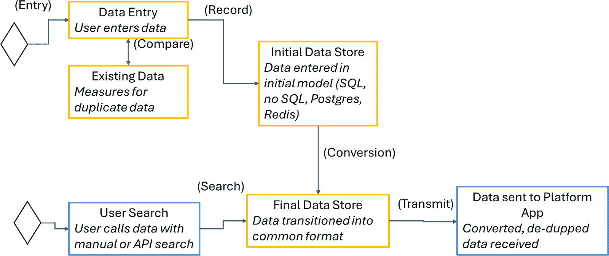
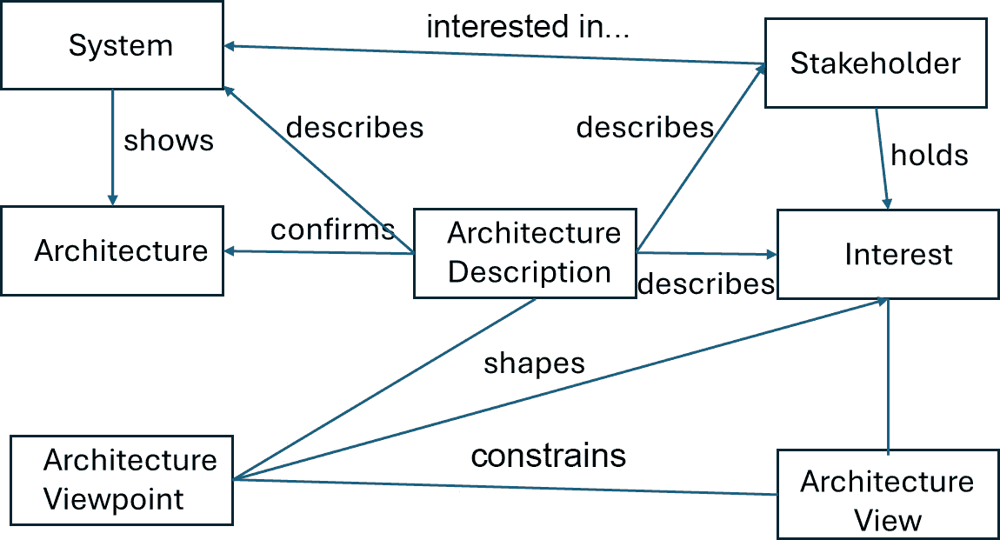

# 6

# 工程平台数据管理

围绕成功的平台进行操作可能很困难。使成功转型更容易的一种方法是在流程早期考虑数据。没有数据，任何平台都不会成功。成功的数据管理始于考虑有效的策略，这些策略有助于实现商业价值。当一个人仔细规划数据集成、管理文化、考虑生成式 AI 解决方案，并通过架构和运营推动成功时，这些策略才是最好的。

在本章中，我们将探讨有效数据管理的关键策略，重点关注推动效率和可靠性的最佳实践和经过验证的技术。我们将研究如何通过协调数据恢复、生产和交付流程来优化数据策略，从而提供有意义的商业价值。此外，我们还将探讨如何使平台数据架构与运营目标保持一致，以最大化性能，实现更高的回报并支持可持续增长。

我们将涵盖以下主要主题：

+   数据在平台工程中的关键作用

+   平台工程中的数据策略

+   在平台工程中实施数据

+   通过数据策略实现成果

+   数据在创造商业价值中的作用

+   成功数据驱动型企业的案例研究和实例

+   平台工程中的数据架构

+   数据运维 - 简化数据管理和运营

# 数据在平台工程中的关键作用

在现代数字景观中，数据是企业生命的源泉，推动创新、效率和战略决策。在探索平台工程中的 AI 之后，我们现在关注数据——这是推动 AI 和支撑商业成功的关键组成部分。理解数据与平台工程之间的密切关系对于最大限度地发挥它们的潜力以创造巨大的商业价值至关重要。

数据与平台工程的融合是一个强大的概念，它推动了显著的商业价值。数据，常被称为新的黄金，通过提供洞察力来支持明智的决策和战略规划，为现代企业提供动力。将数据集成到平台工程中是将原始数据转化为可操作情报的过程。在**机器学习（ML）**中的数据需要训练、测试和生产元素才能成功，而管理这些元素是第一步。良好的数据实践有助于确保人工智能和机器学习项目的成功。拥有强大的数据基础，人工智能和机器学习模型可以有效地运行，并可能导致最佳结果。

## 数据在人工智能和商业成功中的核心作用

数据是人工智能的基础，为 AI 算法的学习、适应和预测提供原材料。高质量、结构良好的数据对于训练准确和可靠的人工智能模型至关重要。强大的数据基础设施对于成功的人工智能项目至关重要，因为它可以防止低劣的结果和错失机会。

数据对于实现业务目标同样至关重要。它提供了对客户行为、市场趋势和运营效率的洞察，有助于战略决策和流程优化。最终，数据成为推动业务成功的战略资产。基于数据的决策通过用事实证据取代直觉，导致更准确的预测、改进的风险管理和优化的资源分配，从而改变组织。预测分析可以提前识别趋势和问题，采取主动措施以节省时间和资源。将数据分析集成到平台工程中，使组织能够持续改进运营，提升客户体验，并推动业务增长。这种方法确保每个决策都有可靠的数据支持，减少不确定性并提高整体业务绩效。每个步骤都需要收集数据，将其与基线进行比较分析，并将其应用于机器学习算法。

## 数据与平台工程之间的相关性

平台工程创建基础设施和工具，以高效地管理和处理大量数据。它涉及设计和实施可扩展、弹性强且灵活的平台，以支持数据密集型应用。这些平台确保不同系统之间数据流的顺畅，确保分析决策所需的信息易于获取。

组织必须优先考虑平台工程，以构建强大的数据基础设施来支持复杂的人工智能应用。这包括设计可扩展、弹性强的平台，整合多样化的数据源，促进高级分析，并确保数据安全和合规。平台工程使先进的策略如**数据运营（DataOps**）成为可能，这是一种结合数据工程和运营的方法，以简化数据管理。数据运营确保数据一致、高质量且易于获取，使组织能够做出更快、更可靠的基于数据的决策。

提高平台工程中的运营效率至关重要。数据分析帮助组织了解其运营情况，定位瓶颈，并识别改进领域。实时监控和分析提供对系统性能的即时反馈，允许快速调整并最小化停机时间。数据驱动的预测性维护预测设备故障和计划维护，防止昂贵的中断，延长设备使用寿命并确保可靠的服务。让我们了解一些策略，通过这些策略数据可以集成到平台工程中。

# 平台工程中的数据策略

由于人工智能、机器学习和大数据技术，数据在平台工程中的作用将扩大。数据量的增加需要有效的管理和分析，成为关键的业务差异化因素。将稳健的数据策略整合到平台工程中的组织将利用其数据资产获得有价值的见解，推动战略决策和商业成功。适应数据驱动的格局对于平台工程的未来至关重要，需要持续进化以满足数字时代的需求。

在确立数据在人工智能和平台工程中的重要性之后，我们必须探索可以整合到平台工程实践中的有效数据策略。这些策略包括选择合适的工具和技术、优化流程、通过数据集成推动创新，以及培养优先考虑数据驱动决策的文化。以下表格概述了关键数据管理策略，比较了它们的复杂性、成本和典型用例，以帮助组织选择最适合其需求的有效方法。

| **策略** | **复杂性** | **成本** | **用例** |
| --- | --- | --- | --- |
| 工具和技术 | 中等 | 低到高 | 数据湖、数据仓库、分析平台 |
| 流程优化 | 对于治理中等，对于自动化高 | 低 | 数据治理框架、质量标准、自动化工作流 |
| 提高运营效率 | 低 | 中等 | 实时监控、运营中心、透明度 |
| 数据集成 | 高 | 中等 | 隔离消除、统一视图 |
| 培养文化 | 高 | 低 | 灵活的基础、回顾、创新优先、可观察性 |

表 6.1：按复杂性、成本和用例比较数据管理策略

在这个基础上，让我们更深入地探讨如何选择合适的工具和技术来支持平台生态系统内的有效数据管理。

## 工具和技术选择

工具和技术的选择对于有效的数据管理至关重要。组织必须选择与其特定需求和目标一致解决方案。这可能包括数据湖、数据仓库、**提取、转换、加载**（**ETL**）工具和高级分析平台。确保这些工具无缝集成到平台工程生态系统中对于维护数据完整性和可访问性至关重要。

如何为您的组织选择合适的数据管理工具？关键是理解您的数据需求、可扩展性需求和集成能力。选择正确的工具确保您的数据基础设施稳固，并能够支持高级分析和人工智能应用。

## 流程优化

优化数据处理过程涉及实施数据收集、存储和分析的最佳实践。这包括采用数据治理框架、建立数据质量标准以及自动化数据处理流程。数据治理框架为数据收集和使用设定了指南，确保数据质量和合规性。建立数据质量标准涉及定义和维护数据的准确性、一致性和可靠性。自动化数据处理流程减少人工干预，最小化错误，并加速洞察力的交付。

您的组织如何简化数据处理流程以提高效率并减少错误？答案在于采用自动化工作流程、实施严格的数据质量检查以及持续监控数据处理流程以识别和解决低效问题。一些有助于确保工作流程效率的关键工具包括 Azure Data Factory、Luigi 和 Google Cloud Composer，尤其是在数据流方面。编排的关键目标包括工作流程自动化、错误处理、治理实践、数据可扩展性和对所有数据实践的总体可观察性。

## 提高运营效率

数据在平台工程中提高运营效率方面发挥着关键作用。通过利用数据分析，组织可以全面了解其运营，识别瓶颈和改进领域。这种洞察力使工作流程优化成为可能，减少了冗余并提高了生产力。

例如，实时监控和分析可以立即提供系统性能的反馈，允许快速调整并最小化停机时间。由数据驱动的预测性维护可以预见潜在的设备故障，并在问题出现之前安排维护，从而防止昂贵的中断。这种主动的维护方法延长了设备的使用寿命，并确保了持续、可靠的服务。

## 通过数据集成推动创新

在平台工程中整合数据策略是推动创新的有力因素。高质量数据的访问使组织能够尝试新想法、验证假设并快速迭代。这种环境培养了一种创新文化，鼓励团队探索和开发尖端解决方案。

数据集成也有助于不同部门之间的协作，打破信息孤岛，并使问题解决方法更加全面。平台工程通过提供数据的统一视图，确保所有利益相关者都能访问他们需要的信息以有效创新。这种协作氛围加速了新产品和服务的开发，推动了竞争优势和市场领导地位。

## 培养数据驱动文化

将数据与平台工程相结合为做出明智的、实时的决策提供了基础。这种变革性方法使领导者能够基于经验证据制定策略，从而实现更准确的预测、改进的风险管理和优化资源配置。培养一种重视数据驱动决策的文化对于成功的数据策略整合至关重要。这包括推广数据素养、促进数据团队和业务团队之间的协作，以及支持持续学习和开发。领导层为数据为中心的文化定下了基调，强调数据作为战略资产，并赋权每个人为它的成功做出贡献。

例如，预测分析可以在问题变得关键之前识别趋势和潜在问题，从而采取主动措施节省时间和资源。通过将数据分析嵌入到平台工程的核心，组织可以持续优化其运营，提升客户体验，并推动业务增长。这种方法确保每个决策都有坚实的数据支持，减少不确定性，并提高整体业务绩效。

您的组织如何培养一种重视数据驱动决策的文化？答案在于推广数据素养、鼓励跨职能协作，并支持持续学习和开发。通过强调跟上最新数据趋势和技术的重要性，您可以保持团队对您平台工程数据策略成功的参与和承诺。

随着我们深入实施平台工程中的数据策略，我们将探讨这些策略如何推动商业价值、数据架构的基本组成部分以及 DataOps 的作用。现实世界的例子和案例研究将说明将数据与平台工程相结合的变革性影响，提供实用的见解和可操作的指导。这次探索将激发并激励您利用数据来推动您平台工程项目的成功。一旦决定了一种战略方法，一个关键要素就变成了如何通过指标驱动的方法让数据驱动该战略。

# 在平台工程中实施数据

您的组织如何更好地利用数据的力量来增强人工智能能力并推动商业成功？从上一章关于人工智能中获得的知识为理解数据在平台工程中的关键作用奠定了基础。随着我们继续前进，理解和利用数据的关键作用对于任何希望在竞争激烈、数据为中心的世界中繁荣发展的组织至关重要。

数据是成功平台工程的基础资产和要素。将其整合到平台战略中可以增强决策能力，推动创新，并确保运营效率。通过反思这些见解并采用数据驱动的方法，组织可以解锁新的创新、效率和竞争优势水平。在接下来的章节中，我们将在此基础上继续构建，提供在平台工程中整合数据策略、架构和运营的见解。这段旅程将为您提供利用数据全部潜力的知识和工具，并将其转化为推动业务成功的强大动力。

## 实施数据策略以实现最佳平台工程

在快速发展的数字领域中，将数据策略整合到平台工程中不仅是一种竞争优势，也是一种战略必要性。数据驱动的平台对于成功部署 AI 和 ML 模型至关重要，依赖于大量高质量的数据。本节探讨了平台工程的关键数据策略，它们对推动业务价值的影响以及最佳实践。

## 平台工程中的关键数据策略

有效的数据策略是最大化平台工程潜力的核心。这些策略涵盖了数据管理的各个方面，从收集和存储到分析和利用。以下是组织应考虑的一些关键数据策略。

### 精通数据集成和互操作性

在数据孤岛环境中，无缝数据集成和互操作性对于组织至关重要。公司可以通过结合来自不同来源的数据，创建支持实时分析和明智决策的统一视图。实现无缝数据流动有助于全面理解业务运营和客户行为。在数据集成和互操作性方面的精通确保平台保持敏捷、可扩展，并准备好利用新兴数据源。

### 数据治理和质量管理的卓越

创建可靠的 AI 模型和有洞察力的分析依赖于坚实的数据治理和质量管理。严格的数据治理框架对于确保数据准确性、一致性和安全性至关重要。组织必须投资于严格的数据质量管理流程，包括清洗、验证和丰富。高质量的数据为 AI 提供可靠的输入，从而实现有效的分析和战略决策。通过纪律性的治理实践维护数据完整性，建立利益相关者的信任并确保符合监管要求。

检查数据的目标应包括早期错误检测、提高整体质量、降低收集和分析数据的成本、通过速度提高效率以及构建可扩展的流程。确定初始步骤依赖于需求评估，通常导致工具选择。开源工具包括 Great Expectations、dbt 和 Talend，而一些付费工具包括 Informatica Cloud Data Quality、RightData 和 Deepchecks。

### 加强数据安全和隐私

在数据泄露日益增多和严格的法规（如 GDPR）环境下，加强数据安全和隐私保护至关重要。实施高级安全措施，如加密、访问控制和定期审计，对于保护数据免受未经授权的访问和泄露至关重要。确保数据隐私涉及匿名化敏感数据并保持数据使用的透明度。优先考虑数据安全和隐私不仅能够防范法律和财务后果，还能培养客户信任。可靠的数据安全和隐私方法为数据驱动型项目奠定了坚实的基础。

### 将高级分析和 AI 集成到创新中

在平台工程中利用高级分析和集成 AI 提供更深入的见解并促进创新。部署 AI 模型分析大数据集、识别模式和做出预测，将数据转化为可操作的情报。高级分析工具使组织能够进行复杂分析，从预测建模到自然语言处理。

AI 集成实现了自动化决策，提高了运营效率并减少了人为错误。例如，AI 驱动的推荐系统定制客户体验，而预测性维护模型优化资产管理。将高级分析和 AI 嵌入平台工程有助于组织推动持续创新并保持竞争优势。

# 通过数据策略实现成果

在平台工程中实施有效的数据策略可以帮助组织以几种方式实现其战略成果：

+   **提升决策能力**：数据驱动决策具有变革性，使组织能够基于实证证据而非直觉制定策略。利用实时数据分析可以导致更准确的预测、更优越的风险管理和优化资源配置。预测分析可以在问题变得关键之前识别趋势和潜在问题，从而采取主动措施节省时间和资源。

    当组织将数据分析嵌入其核心运营时，他们不断优化流程、提升客户体验并推动业务增长。基于数据的决策减少了不确定性并提高了整体业务绩效。

+   **激发创新和竞争优势**：有效的数据策略使组织能够快速实验、创新和迭代。高质量数据的访问使团队能够测试新想法、验证假设，并改进产品和服务的质量。这种创新文化对于在快速变化的市场中保持竞争力至关重要。

    例如，金融机构利用数据分析开发新的金融产品、优化定价策略和改进风险管理，展示了数据驱动实验如何推动持续改进和市场领导力。

+   **提高运营效率**：数据策略通过提供对流程效率和低效的见解来简化运营。实时数据分析可以识别瓶颈、预测设备故障和优化资源配置。这种积极主动的运营管理方法可以降低成本、最小化停机时间并提高生产力。

    实施预测分析和实时监控系统可以提供优化工作流程和防止中断所需的见解，显著提高运营效率。

+   **转变客户体验**：数据驱动平台使组织能够提供个性化的无缝客户体验。通过分析客户数据，企业可以定制产品和服务以满足个人偏好和需求，提高客户满意度和忠诚度。电子商务平台利用数据分析推荐产品、优化定价和个性化营销信息，体现了这种转型。

    集成人工智能驱动的推荐系统和高级分析可以提供现代客户期望的个性化服务，增强整体客户体验。

接下来，我们将学习一些最佳实践以实现最佳结果。

## 将数据策略与平台工程相结合的最佳实践

将数据策略与平台工程相结合需要一种全面和系统的方法。一些策略既适用于平台工程，也适用于更广泛的组织。例如，成功的平台需要在平台边界之外拥有良好的数据实践来处理客户数据、治理标准和其他元素。以下是确保平台成功整合的五项最佳实践：

+   **培养数据驱动文化**：建立数据驱动文化对于数据策略的成功实施至关重要。在组织内推广数据素养、鼓励数据与业务团队之间的协作，以及支持持续学习和开发是关键步骤。领导层必须树立榜样，确保数据被视为一项战略资产。

    鼓励跨职能协作、提供数据素养培训以及庆祝数据驱动成功有助于在整个组织中嵌入这种思维模式。

+   **投资可扩展和灵活的基础设施**：构建可扩展和灵活的数据基础设施对于支持数据密集型应用和未来增长至关重要。投资于能够处理大量数据并支持实时分析的基础设施，如云解决方案、数据湖和数据仓库，是必不可少的。

    现代云基础设施提供了支持先进数据策略和人工智能集成的可扩展性和灵活性，确保组织能够适应不断变化的数据需求。

+   **实施稳健的数据治理框架**：稳健的数据治理框架确保数据准确性、一致性和安全性。建立明确的数据管理政策和程序，包括数据质量标准、数据管理角色和合规要求，对于维护数据完整性至关重要。

    定期审查和更新数据治理政策确保其符合当前的监管要求并支持高质量的数据管理，这对于成功的平台工程至关重要。具体框架和基础可以在*第二章*和*第九章*中找到。

+   **利用高级分析工具**：高级分析工具对于从数据中提取可操作见解至关重要。投资于支持预测分析、机器学习和实时数据处理工具，使组织能够执行复杂分析、识别模式并做出数据驱动的决策。

    定期评估和升级分析能力确保与业务需求和科技进步保持一致，最大化数据驱动项目的潜力。关于更广泛的评估，请参阅*第四章*。

+   **确保数据安全和隐私**：在数字时代，保持稳健的数据安全和隐私至关重要。实施高级安全措施，如加密、访问控制和定期审计，可以保护数据免受未经授权的访问和泄露。确保遵守数据隐私法规可以赢得客户的信任并防止法律后果。

    定期评估安全实践并紧跟最新的安全技术及监管要求，可以保护数据资产并支持数据驱动策略的完整性。关于更广泛的讨论，请参阅*第七章*。

在平台工程中整合有效的数据策略对于发挥人工智能的潜力并推动商业成功至关重要。通过关注关键数据策略，如数据集成、治理、安全和高级分析，组织可以将数据转化为推动创新、增强决策和提升运营效率的战略资产。

随着我们继续探索数据在平台工程中的作用，我们将更深入地探讨数据架构和 DataOps，提供实用的见解和真实世界的例子，说明这些策略的变革性影响。在平台工程中掌握数据始于认识到其重要性，并实施与组织目标和科技进步相一致的最佳实践。下一步是将这些策略通过数据转化为商业价值。

# 数据在创造商业价值中的作用

在当前的商业环境中，数据不仅仅是一个工具，它是一个战略资产，能够推动显著的商业成果。数据对商业运营、决策和创新战略的影响不容小觑。当数据得到有效利用时，它可以改变组织，使它们能够更高效地运营，迅速应对市场变化，并向客户提供卓越的价值。

## 数据对商业成果的战略影响

数据对商业成果的战略影响是多方面的。从根本上讲，数据提供了做出明智决策、优化运营和推动创新的见解。利用数据做出决策使企业能够实时发现机会和威胁，从而采取积极主动的战略和运营方法。分析大量数据以提取可操作的见解可以显著提升竞争优势。

在竞争激烈的市场中，那些利用数据洞察客户行为、市场趋势和运营效率的企业，比竞争对手处于更有利的地位。数据驱动的组织是敏捷的、反应迅速的，并且能够基于实证证据而非直觉做出决策。数据在风险管理中也发挥着关键作用。通过分析历史数据，企业可以识别模式并预测潜在风险，从而实施预防措施。这种风险管理的前瞻性方法减轻了潜在威胁，并确保了业务的连续性和弹性。

## 将数据计划与商业目标对齐

组织必须将他们的数据计划与整体商业目标对齐，以充分利用数据。这种对齐确保数据努力集中于实现可衡量的商业成果，而不是独立于战略目标运作。这一过程的第一步是明确界定商业目标，并确定用于衡量成功的**关键绩效指标**（**KPIs**）。

组织应随后制定支持这些目标的数据战略。这包括确定必要的数据来源，建立数据治理框架，并实施适当的工具和技术。应根据数据倡议对业务成果的潜在影响进行优先排序，确保资源分配给最关键的项目。此外，培养组织内的数据驱动文化至关重要。这包括推广数据素养，鼓励数据团队和业务团队之间的协作，以及在组织文化中嵌入数据驱动决策。领导层在倡导数据倡议和营造以数据为中心的文化方面发挥着关键作用。

## 利用人工智能和数据创造商业价值

人工智能和数据紧密相连，数据为人工智能模型提供动力。通过整合人工智能和数据，可以通过自动化流程、改善决策和提供个性化客户体验来解锁巨大的商业价值。人工智能需要高质量的数据来学习和做出预测。通过利用人工智能，企业可以分析复杂的数据集，识别模式，并得出见解以优化运营、降低成本和提高效率。

例如，人工智能驱动的预测分析可以预测客户需求，帮助优化库存水平并减少浪费。人工智能驱动的推荐系统可以个性化营销活动，提高客户参与度和销售额。根据客户数据提供定制化体验可以提升满意度和忠诚度。学习最佳人工智能实践涉及审查案例研究以获取反馈，找到成功元素，并将失败视为改进的途径。

# 成功数据驱动型企业的案例研究和实例

几家领先公司已成功利用数据和人工智能的力量来推动商业价值。让我们探讨四个显著的例子。

## Netflix – 利用数据驱动的见解革命娱乐业

Netflix 是一家利用数据革命娱乐行业的公司的典范。通过分析用户数据，Netflix 提供高度个性化的内容推荐，增强用户体验并提高观众参与度。公司利用数据来指导内容创作，确保新剧集和电影与观众产生共鸣。来自各个领域的数据驱动着平台战略，从开发和营销领域。

Netflix 的数据驱动方法扩展到其营销策略。通过分析观看模式和用户偏好，Netflix 可以有效地调整其营销活动以针对特定细分市场。这种以数据为中心的策略有助于 Netflix 在流媒体行业中的主导地位，展示了数据对商业成功产生的深远影响。此外，Netflix 利用 A/B 测试来确定最有效的用户界面、促销策略和内容交付方法。这种细致的分析确保平台的每个方面都针对用户参与和满意度进行了优化。

此外，Netflix 利用预测分析来预测观看趋势并高效管理内容许可协议。这种主动方法使 Netflix 能够在竞争对手之前获得潜在热门剧集和电影的权利，确保拥有丰富且吸引人的内容库。整合高级分析和机器学习模型使 Netflix 能够在日益拥挤的市场中保持竞争优势。

## 亚马逊 – 用数据驱动策略重新定义零售

亚马逊在零售领域的成功主要归功于其数据驱动的方法。同样，类似于 Netflix，拥有成功的数据策略成为整体平台成功的关键。公司收集并分析大量关于客户行为、购买模式和行业趋势的数据。这些数据用于优化库存管理、个性化产品推荐，并提升整体购物体验。亚马逊的推荐引擎，由人工智能驱动，分析客户数据以推荐可能引起每位购物者兴趣的产品。这种个性化的方法不仅提高了销售额，也提升了客户满意度。此外，数据分析帮助亚马逊简化供应链，降低成本并确保产品及时交付。

此外，亚马逊采用预测分析来预测需求并更有效地管理库存水平。通过预测客户需求，亚马逊可以减少缺货和库存过剩的情况，优化供应链，并降低运营成本。这种战略性地使用数据确保亚马逊在客户满意度和运营效率方面保持领先地位。

**亚马逊网络服务**（**AWS**），公司的另一分支，展示了数据驱动策略如何多样化商业模式并推动创新。AWS 提供利用数据分析的云计算解决方案，使全球企业能够利用大数据和人工智能的力量。这有助于亚马逊的收入增长，并将公司定位为全球科技行业的关键参与者。

## Databricks – 统一数据与 AI 以推动商业创新

Databricks 处于统一数据和人工智能以推动商业创新的尖端。该公司的平台整合了数据工程、数据科学和机器学习，使组织能够大规模构建和部署 AI 模型。在这种情况下，交付的平台已成为一个以允许用户摄取和修改数据为重点的产品。Databricks 的统一方法简化了数据管理、加速了分析并增强了团队合作。

通过利用 Databricks，组织可以释放其数据的全部潜力，推动创新并实现显著的商业成果。该平台处理大规模数据处理和高级分析的能力使其成为寻求利用人工智能和数据力量的公司的宝贵资产。Databricks 还通过提供一个统一的工作空间，使数据工程师、科学家和分析人员可以无缝协作，从而支持协作项目。这种协作环境促进了创新并加速了以人工智能驱动的解决方案的开发。

Databricks 已经使许多组织通过数据和人工智能转型其运营。例如，全球企业使用 Databricks 优化供应链、增强客户洞察和简化产品开发。通过提供强大且可扩展的平台，Databricks 使这些公司能够有效地执行其数据战略，从而产生可衡量的商业价值。

## Uber – 交通运输中的数据驱动转型

Uber 利用数据和人工智能已经改变了交通行业。该公司的平台收集了大量的数据，包括乘车模式、司机行为和客户偏好。这些数据用于优化路线、预测需求和设定动态定价。这些有效的数据元素是成功平台的基础。Uber 的 AI 驱动算法分析实时数据，以高效地匹配乘客和司机，减少等待时间并提高服务质量。此外，数据分析帮助 Uber 确定扩展领域、优化司机激励措施并提高整体运营效率。Uber 以数据驱动的做法使其能够快速扩展并在市场上保持竞争优势。

Uber 致力于利用数据，这扩展到了其在安全和合规性方面的努力。通过分析司机和乘客的行为，Uber 可以识别潜在的安全风险并实施缓解措施。这种积极主动的方法增强了用户信任并确保了合规性，这对于可持续增长至关重要。

此外，Uber 的高级分析能力使公司能够持续创新。例如，数据洞察推动了 UberPOOL 的开发，这是一种拼车服务，它将同方向旅行的乘客匹配起来。通过优化车辆利用率和降低乘客成本，UberPOOL 展示了数据驱动策略如何导致新的商业模式和收入来源。

## 这些案例研究中的战略洞察

Netflix、Amazon、Databricks 和 Uber 的成功故事展示了数据与人工智能在推动商业价值中的关键作用。以数据为中心的方法可以提供显著的竞争优势，改善客户体验，并提高运营效率。例如，Netflix 的个性化推荐和 Amazon 的优化供应链展示了数据驱动策略的变革力量。投资于数据和人工智能的组织能够更好地应对复杂性，适应市场变化，并交付卓越的客户价值。

## 数据作为战略资产

当与业务目标一致、利用人工智能并培养数据驱动文化时，数据作为战略资产可以推动商业价值。这种战略影响赋予公司做出明智决策、创新和保持竞争力的能力。在平台工程中探索数据架构和 DataOps 提供了实际见解和真实世界的例子，展示了有效数据管理和高级分析对变革性影响的实例。在平台工程中掌握数据需要持续学习、适应和对卓越的承诺。在下一节中，我们将探讨一个稳健且精心规划的数据架构如何改善平台工程，以加速商业价值的交付。

# 平台工程中的数据架构

架构应始终设计在平台内分配数据的形式。应回到康威定律的早期评估，确保设计的结构能够得到更广泛组织的支持。数据必须以公司能够使用和理解的方式通过架构流动。第一步是设计一个可靠、可扩展的架构。这有助于确定平台数据管理的关键组件和最佳实践。一旦数据开始流动，应确保数据质量、治理实践和安全。最后，本节以一些工具的例子结束，特别是那些在生成式人工智能中可以帮助数据解决方案的工具。对于特定的架构模式，请参考*第二章*。

与平台的其他任何方面一样，数据管理需要合理的架构来展示路径。数据架构不仅考虑静态数据，还考虑动态数据以及这些状态之间的转换。更先进的架构将数据视为不仅仅是单一元素，而是众多潜在的数据源和报告。在现代物联网世界中整合所有这些元素需要周密的规划。

## 数据架构设计

设计一个可靠且可扩展的架构侧重于这两个关键组件。可靠性确保平台在数据用户、数据提供者和平台团队之间的稳定性。这些可靠的讨论应侧重于不同利益相关者之间的协议，这些协议通常通过建立明确的 SLA（服务水平协议）来确认，以展示可靠性水平。这些措施可以包括技术规范，如更新率、停机时间、吞吐量、数据包大小和加密标准。每一项协议都有助于使平台数据以比其他替代方案更高的速率更易于访问。提高可靠性可以解决传输数据的准确性、数据与原始来源的匹配程度以及数据变化或这些数据点的扩展发生的时间点。

当使用 5V（*速度、数量、价值、多样性和真实性*）来检查可靠的大数据平台时，你必须确保不仅传输，而且准确的数据能够到达用户。以下列表突出了这些大数据组件的一些特征：

+   **速度**：数据在系统内创建的速度以及创建的数据移动到下一个元素的速度。例如，交通摄像头记录特定位置的 所有事件，但可能不会立即将数据传递给报告元素。

+   **数量**：来自多个来源生成的大量数据，包括社交媒体、商业交易和用户界面。大量数据允许高级分析揭示小数据集中可能不明显的变化模式。

+   **价值**：数据中的每个元素对公司业务的影响程度。大多数大数据价值来自于实现模式识别以生成见解来提高性能、运营和其他可量化收益的能力。

+   **多样**：系统内收集的不同类型数据的数量。现代系统收集基于文本的输入、流媒体视频和其他因素。数据可以是结构化、半结构化或非结构化的。数据管理工具必须能够处理在常见仪表板和可视化中存在的多种类型的数据。

+   **真实性**：收集数据的品质和准确性。数据通常包含来自多个来源的错误、不一致性和其他不确定性。例如，地址、姓名或其他与个人相关的信息可能会出现错误。你可能会看到街道号码颠倒的地址、拼写错误的街道名称或其他不良输入。

满足这些 5 个“V”的数据在可靠性方面可能难以处理。对平台内收集的数据的影响可能会频繁地影响速度、体积和真实性。如果一个平台支持同一应用程序上的多个用户，并且团队每天部署多次，那么速度就会受到影响。当你添加这些系统的运营管理时，开发和运营方面的用户量可能会驱动具有挑战性的对齐。最后，由于存在多个版本运行、不同的测试测量和运营数据，数据真实性可能会受到挑战。管理大数据的一种方法是实现可扩展的解决方案。

可扩展性是平台数据架构的另一个组件。一旦你实现了初始可靠性，就应该引入可扩展性的措施。通过提供额外的选项，可扩展性增强了可靠性。当平台扩展时，会引入其他格式来管理数据。一个常见的例子是在数据达到完整系统之前，通过结构化数据流来设置更早的停止点。平台上的测试场景可以使用代表真实数据的捕获数据，而不需要流式访问。一个例子是管理用户请求、保护病例管理数据并提供临床服务的医疗保健系统，所有这些都受到**个人可识别信息**（**PII**）和医疗受限数据的约束。一个可扩展的测试解决方案可以分割数据，防止关键数据到达其他数据存储。

## 建模数据管理

建模一个可靠且可扩展的架构可能涉及使用诸如**统一建模语言**（**UML**）之类的建模语言。UML 是 2005 年由对象管理组发布的一个通用建模工具，后来作为**国际标准化组织**（**ISO**）标准发布。这些标准将每个项目分解为一个带有附件的对象，通过类关联，并组织成组件。这些分组在架构图中代表功能。UML 中的项目通过**关联**、**继承**和**聚合**相互关联。作为一个简单的例子，一个特定诊所的所有医疗记录可能被更广泛的保险所关联和继承，而特定个人或医疗案例的所有实例可能被聚合。以下图像展示了 UML 中的数据输入架构。



图 6.1：数据转换架构的 UML 示例

图表显示了如何将输入和搜索对齐到公共模式中。大多数工具都提供将设计架构转换为其他格式的选项。挑战在于确保正确的关键对以正确的方式呈现。例如，Keycloak 允许将用户组从一个数据库转移到另一个数据库，将来自先前 SSO 解决方案的用户更新到新的解决方案。然而，在转换过程中，Keycloak 经常在用户组名称中添加反斜杠。这阻止了它们到达相同区域，尽管转移的用户仍然可以使用 Keycloak。这种类型的转换错误强化了数据管理中清晰模式和转换的名称。

另一种建模选项涉及**开放组架构框架**（**TOGAF**）。TOGAF 首次于 1995 年作为美国国防部项目的一部分被引入。该语言旨在解决四个目标：

+   提高投资回报率

+   使用更具成本效益的资源

+   避免供应商锁定

+   建立共同语言

与 UML 一样，该语言相对简单易用，但可以获得额外的认证。TOGAF 使用连续跟踪的三个支柱、一个架构发展模型和企业架构领域。以下图示展示了 TOGAF 可能如何展示数据格式内的交互：



图 6.2：TOGAF 架构模型

你可以看到感兴趣的系统、平台如何通过在多个点与利益相关者建立联系来展示架构。这些联系展示了哪些区域在推动设计向前发展时对哪些因素有控制权。平台工程最重要的东西是能够使用业务、数据、应用程序和技术架构的领域来绘制需求。TOGAF 擅长在领域之间建模流程，使其成为某些数据问题的自然选择。

TOGAF 的另一个关键点是架构中的每个元素都有四个方面：

+   **主动**：每次接收到数据时，都必须发生一个动作。

+   **被动**：数据被收集并保留，直到接收到外部的行动号召。

+   **行为**：收集到的数据移动到某个存储点或仓库。

+   **动机**：数据对象被分配一个动机，以确定它们何时必须从主动状态转变为被动状态或表现出动机。

使用 TOGAF 的弱点是它需要比 UML 更深入的知识来开发全面的架构。如果你有很多时间，这可以很好地工作，但在快速项目中可能会很具挑战性。一个建议是开始使用 UML 建模结构，随着数据的收集，逐渐扩展到更完整的 TOGAF 模型。

## 数据架构最佳实践

在考虑一些最佳实践时，你应该回到康威，确保建模反映业务实践，并且提出的结构不会与现有路径相冲突。如果路径差异过大，即使是优秀的数据也可能无法提供给平台内的个人。数据架构应努力确定文档和质量的重点领域，性能监控，测试和可扩展性。

最佳实践始于如何记录数据架构。前几节提到了使用 UML 或 TOGAF 等格式，但这扩展到了具有视觉表示的清晰术语。例如，如果有日期或时间格式，所有条目都应遵循一个共同的标准。如果一个数据集使用 MM/DD/YYYY（02/10/2012）的结构，而另一个使用 DD，Mon，Year（10 Feb 2012）的结构，那么在对齐记录时可能会有困难。在模式中选择的每个格式都应基于一个清晰的理由，说明为什么收集了特定的方案。这可以从一个声明的状态，如日期，到从其他已设定销售标准和库存编号的组件中摄取。

下一个领域是从初始文档到创建高质量数据。正如初始数据的标准已经设定，那些质量标准也应该存在于相同的文档中。确保高质量数据的快速列表是所有数据都是完整的、唯一的、及时的、有效的、准确的和一致的。平台中的质量可能通过验证用户、测试结构的链接或与现有数据库的比较来防止重复。在使用平台时，你可以允许访客用户，但不想这些用户在申请过程中提交合并票据。同时，访客用户可能被允许无限制地开发，但不能将数据移动到测试环境中。在质量验证期间对数据来源进行资格认证和验证可以帮助防止错误数据进入生产环境。

数据版本化发生在多个领域。数据可以限制在特定的收集集中，作为多个集中的时间序列进行评估，或通过传感器进行区分。通常评估多个路径以确定特定实现的最佳数据版本化。大多数平台数据实现更喜欢使用具有恒定数据流的流式方法，因此一旦经过质量检查，新数据将成为整体流的一部分。在确定初始数据集、测试集和随后用于机器学习的生产数据时，使用单独的数据版本最为合适。可以定期使用不同的集合来检查机器学习模型在质量、回归或偏差方面的错误。

我们的第三个最佳实践领域涉及性能监控。有效的监控遵循可观察性的最佳实践，包括设定明确的目标、自动化数据收集、创建可扩展性和使用警报来通知异常。明确的目标需要明确的指标，例如吞吐量中的数据量、所需字段和验证用户。所需字段可能仅是关键 ID 字段，也可能扩展到其他项目，如价格、库存数量和库存率。所需字段应始终输入，并允许扩展提交的数据，但不能更改现有元素。这些第一个字段允许可扩展性，因为数据可以是最低的计算消耗，也可以是最高之一，这取决于所需的有效性。例如，如果主要数据源存档视频剪辑，并且每个剪辑都必须运行以验证是否发生 AI 提交，这些检查可能很困难。验证数据与现有库存的重复条目要容易得多。

从监控过渡到测试应解决如何在初始摄取期间测试数据以及数据存储在平台中的情况。并非所有数据始终保持一致，系统应测试以确保数据符合新的规范。在平台内进行数据测试的一个简单检查是仅调用最新数据。以下示例显示了一些可能仅从 SQL 数据库中调用特定时间段内数据的初始代码：

```py

with data
      as (select *,row_number() over(partition by subject order by createddatetime) as rnk from t
               )
        ,cte
       as(select id,subject,createddatetime as begin_date, createddatetime,cast(1 as int) as grp from data
          where rnk=1
          union all
        select b.id
               ,b.subject
              ,b.createddatetime
              ,case when datediff(minute,a.createddatetime,b.createddatetime) > 5 then b.createddatetime
              else
               a.createddatetime
               end as createddatetime
           ,case when datediff(minute,a.createddatetime,b.createddatetime) > 5 then a.grp+1
               else
             A.grp
            end as grp
       from cte a
       join t b
           on a.id+1=b.id
          and a.subject=b.subject
          )
 select * from cte order by 1
```

这段代码检查平台中的所有数据，并为每个在 5 分钟内发布数据的主题创建组。通过主题创建不同的组，因此 A 条目在一个集合中分组，B 条目在另一个集合中。这些区分器可以轻松集成并扩展到各种编码工具和 API。

更多测试格式在*第九章*中进行了广泛介绍。有一些独特的测试领域是针对数据的。数据测试通常涉及生产实例中的三种不同类型。这些测试旨在衡量通过应用程序输入的数据是否正确，如下所述：

+   **标准测试**：预期的输入产生预期的输出。如果你输入用户名和密码，你期望要么进入应用程序，要么被告知用户名不存在。

+   **边界测试**：这些测试形成多个事件的边缘情况。前一段落的例子是输入非标准格式的数据，应用程序拒绝数据。

+   **错误测试**：这是标准测试的对立面，这些测试要求应用程序在输入错误数据时通知。一个例子是将库存编号输入为非标准格式，或者输入一个不存在的库存编号。

数据测试应寻找一些非常具体的数据库项。简短列表包括数据模式、表结构、列、主键 ID、元素内的存储宏、服务器验证和数据重复。评估宏的一个常见需求是 SQL 注入格式，其中可以在数据库中输入代码，当表运行时，代码将被执行。这些恶意代码项可以删除其他数据元素、破坏格式，并给开发者带来非常困难的一天。在测试中使用数据时，建议使用软件从已知模式生成假表。这确保测试过程得到验证，但不会破坏实际数据。许多 AI/ML 流程在生成大型、替代数据库用于测试方面相当高效。类似于版本控制方法，元数据目录可用于比较各种集合。元数据确保数据目录测量相似特征并提供比较元素。有效的目录还允许可扩展性和元素之间的比较。

数据架构的最终最佳实践是确保可扩展性。这似乎是一个简单的方法：确保有足够的计算和存储来管理数据库。其他问题可能涉及用户数量、连续使用和在第 *第二章* 中讨论的 SOLID 原则。可扩展性的一个例子可能是限制订单号或库存号到一定数量的字符。当业务超过初始限制或需要额外功能时，调整这些因素以进行扩展可能需要完整的数据库修订。例如，如果库存号设置为九位数字，字符四和五之间有一个连字符，则在末尾添加三位代码可能很困难。你总是可以添加额外的列，但这又会导致完整的数据库修订。这些架构最佳实践与在您的平台上进行有效的 DataOps 密切相关。

# DataOps – 简化数据管理和操作

DataOps 将 DevOps 的最佳实践与流程、反馈和改进数据工程实践相结合。由于 DevOps 主要关注产品的交付，DataOps 通常可以是整体商业策略的一个子集，在生产阶段是必需的，但在开发和测试阶段可能会落后。在测试功能早期就纳入数据管理确保最佳数据可用于支持分析、机器学习（ML）和持续改进模型。与其他领域类似，构建有效的 DataOps 专注于关键领域，如协作、自动化和可观察性。

## DataOps 的重要性

当开始数据操作之旅时，许多最佳实践与 MLOps、DevOps、AIOps、FinOps 或其他任何运营思维构建领域的最佳实践是共通的。每一次运营之旅都应该从明确的目标、跨职能团队、对自动化的承诺和可观察性开始。这些因素通过数据驱动的语言得到补充，例如自动化数据管道、控制数据版本、强调质量以及维护数据安全，尤其是在处理更敏感的数据量时。

您可以为数据操作定义与任何其他运营因素类似的目标。在*第九章*中，我们详细探讨了构建指标和服务级别协议以支持各种操作。对于数据，最好的衡量标准是将这些项目与标准、边界和错误使用案例的测试进行比较。您应确保用户可以访问数据，数据符合质量标准，并且应用程序继续正常运行。跨职能团队随后使用这些数据以确保成功。在这种情况下，跨职能意味着包括开发人员、数据库工程师和分析师在同一范围内。为了保持团队规模小，这些数据库专家通常被视为支持团队，可供提问和支持应用程序，但不是开发团队成员。随着平台的扩展，相关的数据库通常也会扩展。

在推出平台时，需要考虑的一个要素是您是否打算管理数据，还是允许用户根据应用程序的需求管理数据。有些结构管理每个开发方面，而有些则使用第三方软件。有一些标准的数据库工具提供了更好的操作和管理选项，例如 Oracle 数据库、MongoDB、Amazon RDS 或 Dynamo DB、SAP SE 或 Snowflake。根据您的数据库需求，它们各有不同的优势和劣势。一个常见的需求是在运营中实现自动化。

## 数据库管道

数据库管道应以 DevOps 方式构建，以摄取新数据。根据您的平台用例，您可能需要处理流数据、来自零售网络服务的自动化条目或其他格式。与应用程序管道有阶段一样，自动化数据管道也有阶段，具体如下：

+   **数据摄取**：从数据库、微服务、API 和应用程序中初步收集数据。

+   **数据处理**：在确保数据符合质量标准的同时，对数据进行清理、验证、转换和丰富。

+   **数据存储**：在数据库、数据仓库、数据湖或其他架构中存储数据的过程，以便在需要时能够轻松访问。

+   **数据分析**：评估数据以确定大量摄取元素的趋势，尤其是在考虑大数据输入时。

+   **数据可视化**：将摄入的数据转换为易于可视化的格式，以便用户观察活动、激活警报通知并应对新出现的需求。

数据管道以批处理或实时过程处理数据。在批处理过程中，数据存储到某个时间点或大小，然后进行处理。在实时过程中，所有数据立即被摄入到数据库中。在两种情况下，通常使用两种格式，**提取-转换-加载**（**ETL**）或**提取-加载-转换**（**ELT**）。两者之间的区别在于转换是在主数据库中发生，还是在其到达之前发生。如果平台上有多名开发者，使用 ETL 格式可能更容易。

您可以使用管道元素来持续监控数据漂移和分布变化。这些变化可能影响下游的机器学习模型或分析仪表板。例如，如果您正在监控城市环境中的电力使用情况，异常的天气模式可能会影响数据。如果您正在使用一个时间回归模型，比较一个季节的平均基线与下一个季节的平均基线，事件的影响可能会交替基线。这可能会导致预防性维护或平台可扩展性的变化。当处理冷锋时，分析仪表板可能会显示电力使用量的显著增加，但这种增加在之前的季节或年份中不会重复。一旦摄入数据，就需要考虑该数据的安全性和可观察性。

## 数据安全和可观察性

数据安全和可观察性与后面章节中提到的解决方案类似，以最大化平台性能。数据安全是必须的，但应在整体平台格式中考虑。实施加密和单点登录（SSO）技术确保数据在平台安全架构内得到保护。当从外部来源输入数据时，最大的挑战就会出现。上一节简要提到了 ETL 方法，确保数据在将其元素带入系统之前符合质量标准。早期解决质量问题是防止 SQL 注入等最简单故障的方法，然后允许交付高质量解决方案。

安全的下一步应该是考虑如果损坏的数据进入系统会发生什么。您应该始终能够从热存储、温存储或冷存储中恢复以前的数据模型。这对依赖实时通信的企业来说可能具有挑战性。例如，在销售活动启动后，丢失 30 分钟的客户数据可能是灾难性的。除了丢失销售外，客户可能因为需要重新提交数据而不高兴，库存库存可能会阻止订单履行。

数据运营的可观察性以两种方式发生。就像安全是为了发出信号和防护一样，数据可观察性也应该如此。信号标准在新的数据被摄取或数据不符合质量标准时发出通知。防护元素防止不良数据进入平台，并在尝试进入时发出通知。大多数数据库管理工具都提供了一种观察数据的方法。这些工具可以与在第九章中引入的可观察性标准相结合。

# 摘要

本章从之前对生成式 AI 工具的使用扩展到数据一旦进入平台后如何使用这些数据。这首先认识到数据在平台中的重要性。虽然平台的基本功能解决了许多问题，但这些问题的解决通常是无力的，直到数据被添加。添加数据意味着构建一个有效的策略来以各种格式摄取和管理数据。有效的策略展示了如何为业务最大化价值，并且我们展示了几个案例研究，其中企业将良好的实践转化为实际美元。

一旦制定出策略，就必须开发一个支持这些实践的建筑。本章展示了构建架构的过程，介绍了几种建模语言，并提出了管理技术。在平台的早期阶段实施良好的数据实践支持数据运营管理，在整个平台中与静态数据和动态数据一起工作。下一章将应用这些初始平台阶段，并开始应用安全、合规性和风险管理技术，以确保您的平台安全可靠。

行动呼吁

+   理解平台成功所需的数据，并实施策略。

+   设计支持您组织和平台架构。

+   在日常运营中应用有效的操作技术来摄取和管理数据。
