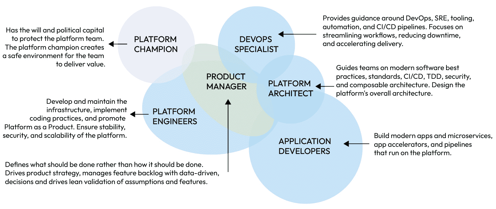
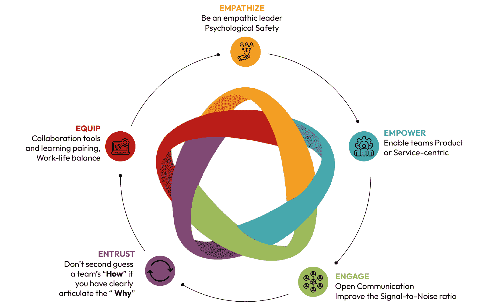

# 10

# 构建高性能平台团队

在平台工程中建立高性能团队对于持续创新和运营卓越至关重要。本章将指导您创建、培养和维护这样的团队，确保您的组织达到行业标准并设定新的基准。利用实用有效的**5Es 框架**——**同理心**、**赋权**、**参与**、**信任**和**装备**——我们将探讨持续保持高性能的策略。

在本章中，我们将探讨构建和维持高性能平台工程团队的关键组成部分。我们将从检查构成有效团队基础的基本角色和组织结构开始。接下来，我们将深入研究招聘策略，强调招聘与组织目标一致的优秀人才所需的技能、能力和方法。最后，我们将讨论如何通过持续学习、适应性领导和培养认可和成长的文化来维持长期的高性能。

我们将涵盖以下主要内容：

+   高性能平台工程团队的结构

+   为高性能团队招聘

+   培养和发展团队

+   持续高性能

+   职业发展和进步

本章的见解和实践指导将改变您构建和维持高性能平台工程团队的方式。这是您推动持久成功并将组织提升到新高度的指南。

# 技术要求

本章不需要特定的技术技能，但受益于对平台工程原则、团队动态和组织行为的扎实掌握。理解组织结构、团队拓扑和文化动态将增强内容的应用。熟悉招聘、团队发展和绩效管理方面的行业实践是有价值的。对平台工程和团队动态的先验知识，如前几章所述，对于充分理解所提供的见解至关重要。

# 高性能平台工程团队的结构

在当今竞争激烈的数字景观中，平台工程团队的结构对于组织成功至关重要。一个设计良好的团队可以提高效率和创新能力，并与业务目标无缝对接，推动变革性成果。让我们探讨高性能平台工程团队的关键要素，提供可操作的见解，以革新您组织的平台能力。通过实施这些战略组成部分，领导者可以培养一个持续交付卓越成果并推动组织达到新高度的团队。

## 团队构成和角色

图 10.1：高性能平台工程团队的构成

高绩效平台工程团队的成功取决于明确定义的角色和精心概述的职责和期望。在以下子节中，我们将探讨平台工程团队中的几个关键角色，并提供利用这些角色推动组织成功的可操作见解。

### 平台倡导者

**平台倡导者**是一个关键角色，负责创造一个创新蓬勃发展的环境，使平台团队能够有效运作：

+   **职责**：平台倡导者在最高组织层面代表团队发声，确保获得必要资源，并推动与公司更广泛目标一致的战略举措。他们穿梭于内部政治之中，确保平台团队能够免受不必要的障碍，并专注于创造价值。

+   **技能**：关键技能包括战略愿景、领导力、影响力以及对组织景观的深入了解。他们还必须擅长利益相关者管理，并能够向高级管理人员阐述平台的价值。

+   **见解**：平台倡导者应定期促进跨部门会议，以增强与更广泛商业目标的协调。这种做法确保平台团队的倡议能够很好地整合到公司的战略路线图中。

### 产品经理

**产品经理**是平台团队的战略家，确保团队的努力与市场需求和组织目标保持一致：

+   **职责**：产品经理负责定义需要实现的目标，管理产品战略，维护功能待办事项列表，并通过数据驱动的决策验证功能。他们必须弥合技术执行与商业战略之间的差距，确保平台的发展能够满足用户需求和商业目标。

+   **技能**：必备技能包括产品管理、战略规划、数据分析以及出色的沟通能力。他们必须能够将复杂的技术概念转化为商业价值，反之亦然。

+   **见解**：将持续客户反馈循环纳入产品开发过程，确保平台保持相关性和价值。这种迭代方法有助于团队保持敏捷性和对市场变化的响应能力。

### 平台工程师

**平台工程师**是开发者生产力的建筑师，负责构建、维护和演进平台，使团队能够快速且可靠地交付：

+   **职责**：这些工程师设计和实施工具，如**Backstage**、**GitHub/GitLab**和**CI/CD 管道**，为开发者创造黄金路径。他们还推广**平台即产品**的概念，确保平台稳健、安全，并能够扩展以满足未来的需求。他们的工作通常与基础设施团队重叠，特别是在管理复杂的云环境方面。

+   **技能**：熟练掌握编码、基础设施管理、SRE 原则和自动化工具是必不可少的。熟悉开发者体验平台和云原生技术对于简化工作流程和增强平台可用性至关重要。

+   **见解**：定期提升技能和与新兴技术的实际操作经验使平台工程师能够提供尖端解决方案，确保开发者满意度和组织敏捷性。*平台即产品*关注将平台视为内部客户（开发者）的产品，强调可用性、反馈循环和持续改进，这是最大化生产力和促进创新的关键。

### DevOps 专家

**DevOps 专家**是运营效率的推动者，通过设计支持多个团队的可扩展解决方案，连接开发和运营：

+   **职责**：DevOps 专家通过整合 Jenkins、Kubernetes 和 Terraform 等工具，创建并维护黄金路径，设计满足多个团队需求的 CI/CD 管道，解决复杂的身份验证和**基于角色的访问控制**（RBAC）挑战，并构建提供可操作见解的仪表板，以监控和优化。他们的角色超越了单个团队，专注于提供可扩展、标准化的解决方案，以简化组织内的工作流程。

+   **技能**：在 DevOps 工具、基础设施自动化、**持续集成/持续交付**（CI/CD）和安全最佳实践方面的专业知识至关重要。对多团队开发工作流程和跨职能协作的深入了解使他们能够满足更广泛的组织需求。

+   **见解**：通过建立和维护内部实践社区，DevOps 专家可以共享标准化的工作流程、治理政策和最佳实践，促进开发团队的一致性和效率。这种协作方法支持运营卓越并加速大规模交付。

### 平台架构师

**平台架构师**负责设计平台的架构框架，确保其支持可扩展性、安全性和可维护性：

+   **职责**：平台架构师提供关于软件最佳实践、CI/CD、**测试驱动开发**（TDD）和安全的指导。他们还设计平台的整体架构，确保其可以高效且安全地扩展。

+   **技能**：关键技能包括软件架构、安全最佳实践和 TDD。他们必须预见潜在的扩展性问题，并设计减轻这些风险的解决方案。

+   **见解**：与应用开发者的协作对于确保架构决策的实用性和与团队的技术能力和限制相一致至关重要。

### 应用开发者

平台团队中的应用开发者专注于构建旨在提高开发人员生产力和简化工作流程的内部工具和服务：

+   **职责**：他们创建符合开发团队需求的内部应用程序、微服务、应用加速器和 CI/CD 流水线。他们的目标是提供可重用、可扩展和高效的解决方案，使其他开发者能够更快地交付业务价值。

+   **技能**：精通应用程序开发、微服务架构和流水线创建是必不可少的。熟悉开发者体验工具和内部平台需求对于提供有影响力的解决方案至关重要。

+   **洞察**：通过黑客马拉松和协作创新项目培养创造力，使应用开发者能够不断改进内部工具和服务，确保它们在支持不断变化的开发者需求方面保持相关性和有效性。

定义和优化平台工程团队中的角色对于推动效率、创新和与业务目标的一致性至关重要。我们应该为每个角色招募具备必要技术技能并与组织战略愿景相一致的个人。在这些角色中培养协作和持续发展确保平台工程团队能够以最佳性能运行，提供卓越的价值并推动组织成功。

然而，即使是最有技能的团队，如果没有正确的组织结构也会力不从心。这些角色运作的框架是使高性能、敏捷性和战略一致成为可能的基础。

## 利用行业框架和指南

构建高性能的平台工程团队从成熟的行业框架和最佳实践中受益匪浅。在这个领域内，两个备受推崇的资源是**团队拓扑**框架和 CNCF 平台工程团队指南：

+   **团队拓扑**：由 Matthew Skelton 和 Manuel Pais 撰写，这个框架介绍了四种基本团队类型和三种交互模式，旨在简化团队结构并增强协作。*使能团队*和*平台团队*的概念对平台工程尤其相关。它们提供了关于如何构建团队以专注于提供自助能力和简化开发者工作流程的指导。采用这些原则确保团队与组织目标保持一致，促进创新并最小化摩擦。

+   **CNCF 平台工程指南**：这些指南强调创建**内部开发者平台**（**IDPs**），集中工具和工作流程。通过将黄金路径、自动化和治理集成到一个统一的界面中，IDPs 推动了开发团队的一致性和效率。CNCF 方法还强调了将平台视为产品的重要性，关注开发者满意度和可衡量的成果。

通过整合这些框架，组织可以优化团队一致性，提高协作，并交付强大、可扩展的平台。这种方法使平台团队能够在遵守行业最佳实践和培养持续改进文化的同时，达到最佳性能。

## 组织模型

选择合适的组织模型对于平台工程团队的成功至关重要。所选的结构直接影响团队的效率、敏捷性和与业务目标的一致性。最常见的三种组织模型是**集中式**、**分散式**和**混合式**。

### 集中式团队

集中式团队在单一部门内整合平台工程资源。这种模型确保了一致性并简化了决策过程。让我们仔细看看：

+   **优势**：

    +   **一致性和标准化**：集中式团队在组织内实施一致的标准和最佳实践，最小化变异性并减少集成问题。这种一致性确保所有流程都遵循最高的质量标准，培养了一种卓越文化。

    +   **简化协调**：有一个控制点，更容易协调项目和高效分配资源。集中式决策加速了战略举措的实施，消除了不同方法造成的摩擦。

    +   **专注的专业知识**：在一个领域集中专业知识可以培养深入的专业化和知识共享。这种集中导致团队内技能集更加丰富，推动创新和技术卓越。

+   **挑战**：

    +   **潜在瓶颈**：集中式团队可能成为瓶颈，由于资源过载而减慢响应时间。这可能会抑制创新并阻碍在快速发展的数字环境中快速部署关键解决方案。

    +   **降低敏捷性**：这种结构可能需要更多的灵活性来快速响应不同业务单位的独特需求。集中式模型有时可能导致一刀切的方法，这可能只适用于某些场景。

**注意**

谷歌的集中式模型通过一致性的实践和工具，增强了质量和可靠性，确保在整个组织中保持高标准。通过集中其平台工程团队，谷歌可以实施统一的标准和最佳实践，提高其平台服务的质量和可靠性。

当标准化和一致性至关重要时，集中式模型效果最佳。然而，领导者必须保持警惕，防止瓶颈并确保集中式结构不会扼杀创新。定期审查工作流程和资源分配可以减轻这些风险。

### 去中心化团队

去中心化团队将平台工程资源嵌入到各个业务单元中，提供更大的灵活性和定制化解决方案。让我们来分析一下：

+   **优势**：

    +   **增强的敏捷性**：去中心化团队能够快速响应各自业务单元的具体需求，实现快速迭代和适应，这对于在动态市场中保持竞争力至关重要。

    +   **自主性**：赋予各个业务单元自主权可以培养所有权感和责任感。这种自主性可以提升动力和创新，因为团队感觉更直接地与他们的工作成果相关联。

    +   **更紧密的合作**：靠近最终用户可以更好地理解并符合业务单元的目标。这种与利益相关者的直接互动确保了开发出的解决方案高度相关且以用户为中心。

+   **挑战**：

    +   **不一致性**：没有强大的中央治理，去中心化团队可能会发展出不同的实践和工具，导致集成挑战。这种缺乏标准化可能会增加复杂性和效率风险。

    +   **沟通障碍**：确保去中心化团队之间有效沟通和协作可能很复杂。脱节的团队可能需要帮助分享知识和在共同目标上达成一致。

注意

亚马逊的“两比萨团队”模式促进了敏捷性和响应性。每个团队都足够小，以保持敏捷并专注于实现特定的业务成果，这使得亚马逊能够保持高水平创新和速度。

在优先考虑速度和定制化的环境中，去中心化模型蓬勃发展。然而，领导者必须实施强大的沟通和治理框架，以保持团队对齐和一致性。定期的跨团队会议和集成报告系统有助于弥合潜在差距。

### 混合模型

混合模型结合了集中监督和去中心化执行，旨在平衡两种方法的优点。让我们更好地理解它们：

+   **优势**：

    +   **战略监督**：一个中央团队提供治理、设定标准并确保组织内部的一致性。这种战略监督有助于将去中心化努力与更广泛的组织目标对齐。

    +   **运营灵活性**：去中心化执行允许业务单元快速适应本地需求，同时遵守总体标准。这种平衡确保团队可以快速创新，同时保持高质量和一致性。

+   **挑战**：

    +   **复杂的治理**：在集中控制和分布式自主之间取得平衡需要强大的治理框架。有效的治理必须确保分布式团队遵守战略目标，同时不扼杀敏捷性。

    +   **协调努力**：有效的沟通和协调机制对于避免不一致和低效至关重要。领导者必须建立明确的决策和冲突解决程序。

注意

Pivotal 的混合方法在一致性和本地化敏捷性之间取得平衡，提供战略监督，同时允许业务单元适应和创新。这种方法确保所有团队与公司的战略目标保持一致，同时保持灵活性以应对特定挑战。

混合模型提供了两者的最佳之处，结合了集中式模型的战略一致性和分布式团队的敏捷性。然而，它们需要复杂的治理和沟通方法才能有效运作。领导者必须培养透明度和协作的文化，以确保所有团队和谐地朝着共同目标努力。

最终，组织模型的选择——无论是集中式、分布式还是混合式——取决于您组织的具体需求、文化、规模和复杂性。了解这些因素在选择适合长期成功的正确模型时至关重要。

### 选择正确的模型

选择合适的模型涉及评估您组织的规模、复杂性和需求：

+   **组织规模和复杂性**：规模较大、复杂度较高的组织可能从结合集中式治理和分布式执行的混合模型中受益。这种方法可以满足各个业务单元的多样化需求，同时保持战略一致性。

+   **业务需求**：评估您的业务单元的具体需求和它们对响应性和定制化的需求。了解每个单元的独特需求可以指导模型的选择。

+   **现有文化**：考虑您当前的组织文化以及它与集中式、分布式或混合式方法的契合度。文化契合度对于任何组织模型的成功实施至关重要。

当为平台工程选择组织模型时，组织必须评估其规模、复杂性和文化，以确保与运营需求相一致。以下是一个决策矩阵，以指导此过程：

| **标准** | **集中式模型** | **分布式模型** | **混合式模型** |
| --- | --- | --- | --- |
| 规模 | 适用于小型到中型组织，团队数量较少，需要简化的治理 | 适用于拥有自主团队的较大组织 | 适用于平衡集中控制和团队自主权的中小型组织 |
| 复杂性 | 适用于简单、复杂度较低的平台，依赖性最小 | 有效地管理高度复杂、特定领域的需求 | 适用于需要标准化和定制的复杂平台 |
| 文化 | 与等级或治理导向的文化一致 | 与创新和自主的文化相匹配 | 与重视治理和团队灵活性的协作文化相匹配 |
| 利益 | 确保一致的治理、工具集和流程 | 赋权团队快速创新和适应 | 提供集中控制和团队敏捷性的平衡 |
| 挑战 | 瓶颈风险和较慢的适应性 | 工具和流程碎片化的可能性 | 需要清晰的沟通和强大的协调机制 |

表 10.1：集中式、分散式和混合平台团队模型的比较

这里有一些选择正确模型示例：

+   拥有较少的开发团队和有限资源的初创公司可能会选择集中式模型以确保一致性和简单性。

+   一家拥有多个团队在全球范围内工作，专注于特定领域平台的企业可能会从允许自主性和敏捷性的分散式模型中受益。

+   一家正在扩展其运营的中型公司可能会发现混合模型最为有效，它平衡了一致性和灵活性。

一旦选择了正确的模型，我们就应该确保其有效实施。

### 实施策略

明确的沟通、强大的治理和灵活性对于有效实施所选模型至关重要：

+   **明确的沟通**：在集中式领导和分散式团队之间建立透明的沟通渠道，以确保一致性和协作。定期的更新和反馈循环可以确保所有利益相关者都得到通知并保持参与。

+   **强大的治理**：实施强大的治理框架以保持一致性和标准，同时允许灵活性。治理应促进而不是阻碍团队绩效。

+   **灵活性和适应性**：准备好根据反馈和不断发展的业务需求调整模型。持续改进应该是你组织策略的核心原则。

为你的平台工程团队选择合适的组织模型以最大化其价值交付。结构应与你的战略目标一致并提高运营效率。评估你组织的需要并有效实施所选模型，以创建一个高绩效的平台工程团队，该团队能够交付价值并与你的业务成果保持一致。

## 与业务成果对齐团队

将平台工程团队与业务成果对齐确保每一项努力都能推动组织成功。这种对齐最大化了影响，优化了资源利用，并增强了业务间的协作。接下来，我们将探讨保持战略重点的关键要素、确保对齐的领导力的基本作用以及衡量和维持绩效的最佳实践。这些领域至关重要，因为它们确保平台工程倡议直接贡献于组织的更广泛目标，推动技术卓越和商业成功。

### 战略重点

与业务目标对齐确保平台工程努力具有战略重点和价值驱动。以下重点领域说明了战略对齐如何提高效率、优化资源并加强跨职能协作：

+   **战略相关性**：平台团队应专注于提供间接支持战略目标的解决方案，例如提高开发者效率、缩短上市时间以及促进创新。例如，实施自助式 CI/CD 管道的平台团队可以减少开发者的等待时间，从而更快地交付与产品发布时间表一致的功能。团队的不对齐，如投资开发团队未使用的利基工具，可能会浪费资源并阻碍组织目标。

+   **资源优化**：通过优先考虑如标准化开发工作流程的黄金路径等倡议，平台团队确保资源分配给具有最大组织影响力的解决方案。一个不匹配的例子是，在现成的解决方案可以更快且成本更低地提供相同价值时，仍将资源投入到定制工具的建设中。

+   **增强协作**：清晰的定位促进了平台团队和业务单元之间的协同效应。例如，平台团队与产品经理合作创建支持敏捷发布日程的部署管道，确保双方成功。相反，缺乏协作可能导致延误、重复工作或无法满足用户需求的工具。

保持战略重点是至关重要的，因为不对齐的努力通常会导致投资浪费、效率降低和错失创造价值的机会。以产品为中心的敏捷方法使平台团队能够与不断变化的企业优先事项保持一致，这需要强有力的领导来指导优先事项、促进协作并保持与业务目标的对齐。

### 领导力的作用

领导力在保持对齐中起着关键作用。领导者必须明确阐述战略目标，并将它们转化为平台工程团队可执行的目标。以下原则有助于确保团队保持专注、参与并战略对齐：

+   **愿景和方向**：领导者必须提供一个与组织战略目标一致的清晰愿景。这个愿景指导团队的努力，并确保他们战略上保持一致。

+   **一致的沟通**：领导者必须定期向团队传达战略重点。这种持续的对话使团队保持专注并了解他们的工作如何影响更广泛的组织。

+   **赋权**：领导者必须赋权团队做出支持业务目标的决定。这种自主性培养了所有权和责任感。

### 对齐策略

实施结构化的目标设定和绩效测量确保持续对齐：

+   **SMART 目标**：建立**具体、可衡量、可实现、相关和时限性**（**SMART**）的目标。SMART 目标为团队提供了明确的方向和可衡量的目标。

+   **OKRs**：使用**目标与关键结果**（**OKRs**）来使团队努力与组织目标保持一致。OKRs 提供了一个框架，用于设定和跟踪既雄心勃勃又可实现的目标。

+   **KPIs**：定义**关键绩效指标**（**KPIs**），以衡量平台工程努力对业务目标的影响。KPIs 提供了可衡量的指标来评估绩效和对齐。

### 反馈与适应

保持定期的反馈循环和适应，以确保随着时间的推移保持对齐。以下方法支持持续改进和战略重点：

+   **定期审查**：进行定期的绩效审查以评估目标进展。这些审查提供了重新对齐努力和解决任何偏差的机会。

+   **反馈循环**：有效的反馈循环使平台团队保持响应性和持续改进。Grafana 或 Power BI 等工具中的自动化仪表板提供了对平台使用和开发者满意度的实时洞察。每周的回顾会议通过解决成功和挑战来促进持续学习。

+   **持续改进**：培养持续改进的文化。鼓励团队定期评估他们的流程并调整以增强对齐和绩效。

将平台工程团队与业务成果对齐是一个持续的过程，需要清晰的愿景、强大的领导力和持续适应。领导者通过关注战略相关性、优化资源和促进合作来确保成功。使用 SMART 目标、OKRs 和 KPIs，以及反馈文化，使平台工程保持敏捷并与不断变化的企业需求保持一致。

当我们审视现实世界的成功故事时，这些原则变得生动起来。Netflix 特别提供了一个引人入胜的例子，说明了如何将平台工程努力与业务成果对齐可以推动持续创新、可扩展性和全球成功。

### 案例研究 – Netflix

Netflix 对基础设施和工具的创新方法为运营卓越提供了宝贵的经验教训，但也突显了 DevOps 实践与现代平台工程之间的区别。以下是对其策略和与平台工程相关的见解的重新审视。

#### 模块化工具和运营敏捷性

Netflix 以构建模块化、面向开发者的工具而闻名，例如 **Chaos Monkey** 和更广泛的 **Simian Army**，用于测试系统弹性和故障处理。虽然这些工具是高级 DevOps 实践的标志，但将它们集成到一个可以被团队普遍消费的平台中——这是平台工程的标志——仍然是一个独立的挑战。Netflix 的成功在于通过其 *运营你所构建的* 文化培养团队自主性和责任感，这确保了开发者对其代码承担端到端的责任。

#### 云采用和工具赋能

Netflix 迁移到 **Amazon Web Services**（**AWS**）实现了快速全球扩展和运营效率。然而，这一决定突显了潜在风险，例如过度依赖单一云服务提供商，这可能导致成本管理或服务可用性的漏洞。平台工程团队将专注于通过实施云无关的工具、集中治理和通过 IDP 提供消费限制来减轻这些风险。

#### 可衡量的收益

由于迁移和实施高级平台工程实践，Netflix 实现了几个重大、可衡量的成果，这些成果直接促进了其运营效率和商业成功，包括以下内容：

+   **订阅者增长**：到 2024 年初，Netflix 增加了 930 万订阅者，实现了自 2020 年以来的最强开局。

+   **全球影响力**：到 2023 年，Netflix 在全球拥有 2.383 亿订阅者。

+   **运营效率**：在云迁移后，Netflix 大约拥有 70 名运营工程师，消除了传统网络运营中心的需求。

#### 平台工程在 Netflix 生态系统中的作用

虽然 Netflix 在模块化 DevOps 工具方面表现出色，但平台工程的视角会强调将这些工具整合到统一的界面中，以形成连贯的工作流程，确保组织内的采用和可用性，如下例所示：

+   构建将弹性测试集成到 CI/CD 管道中的黄金路径，以确保团队间的一致采用。

+   创建一个集中式门户，开发者可以无缝访问部署工具、混沌工程框架和监控仪表板。

+   虽然自主性推动了 Netflix 的创新，但可能需要在团队间保持一致性方面出现挑战。平台工程可以通过平衡自主性与集中指导来解决这一问题，确保工具和流程与组织目标一致，同时不扼杀创新。

#### 关键要点

支撑 Netflix 成功的原则为任何寻求构建有弹性、创新平台工程团队的组织提供了宝贵的见解。以下是 Netflix 方法的关键要点：

+   **清晰的愿景和方向**：将团队努力与战略业务目标对齐，推动专注的执行。

+   **赋权与自主性**：分散的决策制定促进了创新和敏捷性。

+   **持续改进**：定期的绩效测量和反馈确保对齐和适应性。

+   **集中可访问性**：将模块化工具集成到一个单一的开发者中心平台上，以推动可用性和一致性。

+   **指导而非障碍**：通过包括内置最佳实践的工具来赋权团队，这些最佳实践涉及安全性、可扩展性和合规性。

+   **云无关策略**：通过云无关解决方案和治理减少对单一云服务提供商的依赖。

+   **自主性与对齐**：在确保与组织目标对齐的同时，通过明确的标准和工作流程培养团队自主性。

Netflix 的策略展示了 DevOps 和弹性工程实践如何为运营成功奠定基础，而平台工程则通过创建统一、可扩展的系统来进一步提升这一成就，这些系统增强了可用性和效率。通过将混沌猴子等工具集成到标准化工作流程中，并通过集中平台使它们普遍可访问，平台工程确保最佳实践在团队中得到一致应用。这种方法促进了创新和自主性，并加强了与组织目标的对齐，使 Netflix 能够在快速发展的技术环境中保持其竞争优势。

将平台工程团队与业务成果对齐最大化影响并推动组织成功。明确的目标、赋权以及持续的反馈循环确保战略对齐和高性能。下一步涉及战略招聘实践，以构建一支高性能的平台工程团队，这包括识别关键技能、实施有效的招聘策略以及培养多样性和包容性。

# 招聘高性能团队

构建一支高性能的平台工程团队对于组织成功至关重要。这始于招聘具有技术专长和促进协作与创新的软技能的个人。本节重点介绍识别关键技能、实施有效策略和促进招聘多样性。通过将招聘实践与组织目标对齐，领导者可以吸引并留住人才，以推动变革性成果。

## 识别关键技能和胜任力

组建一支高性能的平台工程团队需要战略性地理解关键技能和胜任力。以下是领导者应关注的、用于识别和吸引合适人才的、关键的技术和软技能。

### 基础技能和胜任力

成功的平台工程团队不仅依赖于技术专长，还依赖于共同的思维方式和文化价值观。以下品质对于工程师有效地贡献并推动长期平台成功至关重要：

+   **理解成果**：工程师必须深入理解业务成果及其重要性。这确保了技术解决方案与战略目标一致，并为组织带来实际价值。

+   **承诺**：对团队成功和平台作为产品的承诺至关重要。对平台长期成功有投资的工程师能够更有意义地贡献，并激励他们推动持续改进。

+   **构建者而非英雄**：重点应放在长期解决方案上，而不是救火。工程师应积极构建具有弹性的系统，防止问题发生，而不是在问题出现时做出反应。

+   **失败的能力**：拥有一种允许快速、频繁且低成本失败的文化至关重要。工程师必须舒适地公开分享他们的失败，从中学习和成长，从而营造一个持续改进的环境。

+   **创业精神**：工程师应该舒适于快速实验和快速转向。这种创业心态鼓励团队内的创新和敏捷性。

+   **技术态度**：对新技术的采用、重构、**基础设施即代码**（**IaC**）和编码的舒适度至关重要。工程师必须跟上最新的进展，以保持平台的前沿性和竞争力。

### 技术技能

技术熟练度是高性能平台工程团队的核心。以下是非协商技能，每个团队成员都必须具备：

+   **云原生技术**：掌握 Kubernetes、Docker 和无服务器计算等工具和平台是必不可少的。熟悉 AWS、Azure 或 Google Cloud 等云平台对于构建可扩展和高效的系统至关重要。

+   **CI/CD**：使用 Jenkins、GitLab CI 和 CircleCI 等工具的 CI/CD 管道的专业知识确保了软件更新的快速、可靠和自动化部署。

+   **自动化**：在 Ansible、Terraform 和 Puppet 等自动化框架方面的熟练度简化了基础设施管理，减少了错误，并提高了效率。

+   **编程和脚本**：在编程语言（例如 Python、Go 和 Java）和脚本语言（例如 Bash 和 PowerShell）方面的强大技能使工程师能够开发稳健的解决方案并自动化重复性任务。

+   **安全**：对安全最佳实践和工具的深入了解对于确保平台完整性和合规性以及防范潜在漏洞和威胁是必要的。

### 软技能

软技能同样重要，可以培养协作和创新团队环境。以下能力确保技术专长转化为有效的团队合作和问题解决：

+   **沟通**：清晰表达想法并与团队成员和利益相关者有效合作的能力是基本要求。这确保了每个人都保持一致，并朝着共同的目标努力。

+   **问题解决**：强大的分析能力对于快速、高效地识别和解决问题至关重要。工程师必须能够进行批判性思维，并为复杂问题开发创造性的解决方案。

+   **适应性**：技术领域不断演变。工程师必须具有适应性，愿意学习新技术和方法，并能够应对组织变化。

+   **团队合作**：在团队中有效工作、支持并从同事那里学习是至关重要的。协作的心态确保团队能够紧密合作，共同应对挑战。

理解关键技能和能力是至关重要的，观察行业领导者如何实施这些原则可以提供有价值的见解。让我们来探讨一些公司采用的策略，以培养高绩效团队并取得卓越成果。

## 一些公司采取的方法

检查顶级公司如何进行团队建设，为构建高绩效平台工程团队提供了宝贵的经验教训。以下是一些行业领导者用来构建有效、有弹性的团队的战略：

+   **亚马逊**：亚马逊在其招聘过程中优先考虑解决问题的能力和文化契合度，使用行为面试问题来评估候选人过去处理复杂情况的能力。公司重视以客户为中心的方法，并寻求在快节奏、不断变化的环境中茁壮成长的候选人。亚马逊强调学习和好奇心的重要性，确保其工程师不断努力改进和创新。

+   **谷歌**：谷歌在其招聘过程中强调技术实力和协作技能的结合。它专注于展示在软件工程、云计算和自动化方面有坚实基础，以及出色的沟通和团队合作能力的候选人。这种方法确保新员工能够有效地为技术和团队动态做出贡献。

+   **IBM**：IBM 采用全面的方法来识别关键技能，将技术评估与软技能评估相结合。他们使用模拟和角色扮演练习来观察候选人在现实世界场景中的表现。IBM 对多元化和包容性的承诺在其招聘实践中得到体现，旨在建立反映其全球客户群多样性的团队。

+   **Meta**: Meta 在其招聘过程中优先考虑技术技能和文化契合度。面试过程包括多个阶段，包括简历筛选、招聘人员电话筛选、技术电话筛选和现场面试。在现场面试期间，候选人面临严格的技术和行为问题。Meta 强调系统和产品设计技能，特别是对于高级职位，关注可扩展性、可靠性和效率。行为面试评估文化契合度、问题解决能力和领导力。Meta 寻找积极主动、适应性强且能够在协作环境中茁壮成长的候选人。

+   **微软**: 微软专注于招聘具有成长心态和技术卓越的人才。他们的面试包括编码挑战和基于场景的问题，以评估候选人的问题解决能力和适应性。微软还强烈强调多样性和包容性，确保他们的团队能够从各种观点和想法中受益。

+   **VMware (Pivotal)**: VMware（前身为 Pivotal）关注候选人的复杂问题解决能力以及他们在组织中的文化契合度。他们的招聘流程包括编码挑战、系统设计面试和行为面试。VMware 强调持续学习和创新，并寻求对技术充满热情、渴望推动变革的候选人。他们重视协作心态和跨职能团队中良好合作的能力。VMware 还优先考虑多样性和包容性，确保他们的团队能够从各种观点和想法中受益。

这些例子展示了有针对性的招聘实践如何提升团队的表现。有了这些见解，让我们来探讨一些具体的策略，以有效地招聘和整合人才，打造一支高绩效的平台工程团队。

## 有效的招聘策略

为高绩效的平台工程团队吸引和招聘顶尖人才需要战略性的、明确的方法。以下是一些可操作的战略，可以作为领导者构建和培养卓越团队的指南手册。通过实施这些策略，组织可以确保他们招聘到正确的人来推动创新、效率和增长。

### 制定全面的职位描述

清晰详细的职位描述是有效招聘的基础。在撰写吸引合适候选人的平台工程职位描述时，重要的是要关注吸引正确候选人的要素，并设定明确的期望。考虑以下关键组成部分：

+   **主要职责**: 明确界定角色的主要任务和责任，强调它们对组织的影响。这有助于候选人了解期望是什么，以及他们的贡献将如何推动业务成果。

+   **所需技能**：列出该职位所需的技能，包括云原生技术、CI/CD、自动化、编程和安全等方面的专业知识。

+   **公司文化**：突出公司的文化、价值观以及使其成为优秀工作场所的特点。这种策略有助于吸引不仅技术精湛而且文化适应性强的候选人。

### 结构化面试和技术评估

使用结构化面试和技术评估确保对候选人能力和适应性的公平和全面评估：

+   **结构化面试**：制定一致的评估技术技能和文化适应性的问题。使用行为面试技巧来了解候选人过去如何处理情况。这些问题可以包括关于问题解决、团队合作和适应性的问题。

+   **技术评估**：使用编码挑战、技术测试和问题解决情景来评估候选人的技术能力。这些评估应模拟候选人在该角色中可能面临的真实世界任务和挑战。

Atlassian 的多阶段招聘流程

Atlassian 采用严格的分阶段招聘流程，包括初步筛选、技术评估和行为面试，以确保与他们的协作和创新文化保持一致，吸引并留住顶尖人才。这个过程筛选出不符合基本要求的候选人，评估编码技能和问题解决能力，并评估以往经验和团队合作能力。这种方法有助于 Atlassian 构建技术强大、团结协作的团队。

### 利用行为和情境问题

行为和情境问题可以深入了解候选人的能力和在团队中的适应性：

+   **行为问题**：这些问题通过评估过去的行为来预测未来的表现。例如，“*请告诉我一次你在项目中面临重大挑战并如何克服它的经历*”和“*描述一次你必须与一个难以相处的* *团队成员* *紧密合作的情况。””

+   **情境问题**：这些问题通过呈现假设情景来帮助候选人了解他们将如何处理特定情况。例如，“*你会如何处理关键系统故障？*”和“*你会采取哪些步骤将新技术整合到现有的* *平台中？*”

### 多样性和包容性策略

多样性和包容性对于培养创新和支持性工作环境至关重要。为了构建一个更加多元化和包容的平台工程团队，组织应采用旨在促进公平和代表性的有意招聘实践。以下策略支持公平和欢迎的招聘流程：

+   **偏见培训**：为招聘经理提供培训，以识别和减轻无意识偏见。这确保了公平的招聘过程并促进了多样性。

+   **包容性的职位描述**：在职位描述中使用包容性语言，以吸引多样化的候选人。避免使用性别化的语言和可能使特定群体望而却步的短语。

+   **多元化的面试小组**：确保面试小组的多元化，以提供不同的视角并减少偏见。这也向候选人表明，公司重视多元化和包容性。

示例 – IBM 的全面方法

IBM 实施了诸如无意识偏见培训和多元化招聘小组等多元化倡议，从而打造了一个更具包容性的劳动力，推动了创新和员工满意度。这种承诺加强了 IBM 在技术和平台工程领域的领导者地位。

IBM 积极寻求来自不同背景和经验的候选人，利用高级分析跟踪多元化指标并确保与多元化目标保持一致。通过培养包容性文化，IBM 利用多样化的视角来推动创新并改善组织内的决策。

### 持续改进和反馈循环

招聘策略应根据反馈和变化的需求进行演变。以下方法有助于优化流程并提升候选人的体验：

+   **定期审查**：定期审查招聘流程，以确定改进领域。使用如招聘时间、招聘质量、候选人满意度等指标来评估有效性。

+   **候选人反馈**：收集候选人在招聘过程中的反馈。这可以提供关于哪些方面做得好以及哪些方面需要改进的宝贵见解。

+   **适应和创新**：关注最新的招聘趋势和技术。调整您的策略以纳入新工具和技术，以增强招聘流程。

通过拥抱持续改进和反馈循环，组织可以优化其招聘流程并打造更强大的团队。像 Meta 和 VMware 这样的公司已经有效地实施了这些策略，为现实世界实践如何推动成功提供了宝贵的见解。

### 案例研究 – Meta 的严格筛选流程

Meta 的招聘流程通过多个阶段评估候选人的技术技能和文化契合度，包括技术电话筛选、现场面试（涉及系统和产品设计问题）以及行为评估。这种方法确保了对候选人技术能力的全面评估，并与 Meta 的文化保持一致。

流程从初步简历筛选开始，随后是招聘人员的电话筛选，讨论候选人的背景和兴趣。技术电话筛选在实时协作环境中评估编码技能和解决问题的能力。现场面试包括多轮系统和产品设计面试，而行为面试则侧重于文化契合度以及与 Meta 核心价值观的一致性。

这种方法选择最合格且与文化相匹配的候选人，强调现实世界的问题解决能力和适应性，这对于保持 Meta 的创新优势至关重要。Meta 通过关注技术卓越和文化适应性，构建与公司价值观一致的团结团队。

### 案例研究 - VMware 的协作招聘方法

VMware 在其招聘过程中强调解决问题的技能和文化适应性，包括编码挑战、系统设计面试和行为面试。公司寻求充满激情、具有创新精神并能推动变革和持续学习的候选人。

候选人将经历一个包括现实世界编码挑战的初步筛选，随后是系统设计面试，以评估他们构建可扩展、安全和高效解决方案的能力。行为面试旨在评估解决问题的技能和文化适应性。VMware 重视对学习充满热情、具有协作心态并能成为与公司价值观和文化一致的技能熟练团队的候选人。

VMware 的方法优先考虑文化适应性和持续改进，确保团队具有创新性、团结性和支持性，并为公司的成功做出贡献。

十个有效的面试问题

考虑将这些十个人生深刻且引人深思的问题纳入结构化的有效面试流程。这些问题评估技术技能和文化适应性，为面试过程提供了巨大的价值：

**技术问题解决**：“描述你在之前的工作中解决的一个复杂技术问题。问题是什么，你是如何处理的，结果如何？”

**系统设计**：“你将如何为新平台功能设计一个可扩展和可靠的微服务架构？请解释你的思考过程和你会使用的科技。”

**云原生专业知识**：“讨论一个你使用云原生技术（例如，Kubernetes 和 Docker）的项目。你遇到了哪些挑战，你是如何克服它们的？”

**自动化和 CI/CD**：“解释你与 CI/CD 管道的经验。你在过去的项目中是如何实施和优化这些流程的？”

**安全实践**：“你在工作中遵循哪些安全最佳实践？你能提供一个例子，说明你是如何确保平台或应用程序的安全的吗？”

**团队协作**：“描述一个你必须与一个难以相处的团队成员密切合作的情况。你是如何处理这种情况的，结果如何？”

**适应性和学习**：“你是如何保持对新技术和行业趋势的了解的？你能提供一个例子，说明你最近学习并应用的新技术吗？”

**内部创业精神**：“请告诉我一个你必须快速实验和调整方法的时间。你是如何管理这个过程，以及结果如何？”

**失败与改进**：“描述一个你失败的项目或任务。你是如何处理失败的，你从中学到了什么，以及你是如何将这些经验应用到未来的项目中？”

**文化契合度和价值观**：“我们公司的哪些文化和价值观最与你产生共鸣？你如何看待自己对我们文化的贡献和提升？”

## 多元化、公平性和包容性

**多元化、公平性和包容性**（**DEI**）在构建高绩效团队和推动创新中起着至关重要的作用。拥抱多元化的视角有助于更好地解决问题和做出决策，最终有助于组织成功。通过优先考虑 DEI，组织可以释放其员工的全部潜力，并确保招聘过程的公平和公正。

### 多元化团队的重要性

多元化团队带来了丰富的视角和经验，这些经验推动了创新和创造力。通过包括来自不同背景的个人，组织可以从多个角度应对挑战，从而得出更稳健的解决方案。在平台工程团队中培养多元化和包容性不仅支持公平性，也推动了可衡量的商业效益。以下成果突出了构建多元化、包容性团队的价值：

+   **增强问题解决能力**：多元化的团队能够通过带来各种视角和方法来更好地解决复杂问题。这种思维多样性增强了创造力，并导致更多创新性的解决方案。

+   **提高员工满意度**：一个包容的工作环境，让所有员工都感到被重视和尊重，可以提高士气并保持员工的留存。当员工看到自己在组织中得到了代表和赞赏时，他们更有可能参与并承诺。

+   **更好的决策**：研究表明，多元化的团队能够做出更好的决策，因为它们考虑了更全面的因素和潜在的结果。这导致更有效和战略性的决策。

### 具体的包容性招聘流程策略

组织必须实施策略，积极促进多元化并减少偏见，以创建一个包容的招聘流程。为了创建一个更公平和包容的招聘流程，组织应实施有针对性的策略，以减少这种偏见并支持公平评估。以下实践可以显著提高招聘中的多元化和公平性：

+   **通过培训减少偏见**：为招聘经理提供培训，以识别和对抗无意识的偏见。这确保了公平的招聘过程并促进了多元化。偏见培训帮助管理者了解他们的隐性偏见，并制定策略来对抗它们，从而实现更公平的招聘决策。

+   **撰写包容性职位描述**：在职位描述中使用包容性语言以吸引多元化的候选人库。避免使用性别化的语言和可能使某些群体望而却步的短语。包容性的职位描述向潜在候选人表明，该组织重视多元化，并致力于创建一个包容的工作环境。研究表明，女性和**代表性不足的少数群体**（**URMs**）往往对自己的资格更加挑剔，如果不符合所有列出的要求，可能会选择不申请。包括鼓励符合大部分但不是所有标准的候选人申请的声明，可以帮助减轻这种影响。

+   **确保多元化的面试小组**：组建多元化的面试小组以提供不同的观点并减少偏见。多元化的小组更有能力评估来自不同背景的候选人，从而实现更平衡、公平的招聘决策。

+   **实施盲招聘实践**：通过实施盲招聘流程，从简历中移除姓名和其他识别细节，以减少偏见。这种做法确保了关注候选人的技能和资格，从而导致了更客观的招聘结果。

+   **标准化面试以确保公平性**：使用结构化面试和标准化问题以确保一致性和公平性。这种方法最小化了无意识偏见，并确保所有候选人都根据相同的客观标准进行评估。

### 案例研究 – VMware 对多元化、公平性和包容性的承诺

VMware 在其招聘流程中强烈强调多元化、公平性和包容性，并实施了几项措施以确保公平和包容的流程。VMware 是以下最佳实践的强有力例证，展示了组织如何将多元化和包容性融入其招聘流程：

+   **多元化的招聘小组**：VMware 确保其面试小组具有多元化，包括来自不同背景和经验的人士。这有助于在评估过程中提供不同的观点，并降低偏见的风险。

+   **偏见培训**：VMware 为其招聘经理提供全面的偏见培训，以帮助他们识别和减轻无意识偏见。这种培训是公司致力于创建包容性工作环境承诺的重要组成部分。

+   **包容性招聘实践**：VMware 通过有针对性的招聘努力积极吸引多元化的候选人库。公司与多元化的专业组织合作，并参加专注于技术领域代表性不足群体的活动。

VMware 通过实施这些策略，创造了一个更加包容和平等的人才招聘流程。对多元化、公平性和包容性的承诺加强了公司的员工队伍，从而提高了创新水平和员工满意度。

### 解决招聘过程中的隐含偏见

虽然显性偏见通常会被识别出来，但隐性偏见可能会持续存在并影响招聘过程。承认和解决这些挑战对于确保公平的环境至关重要：

+   **隐性偏见**：无意识的偏见可能会对代表性不足群体的候选人评估产生负面影响。这可能导致不公平的评估和错失招聘有才能个人的机会。

+   **系统性障碍**：系统性障碍，如缺乏进入专业网络和教育机会，可能会在招聘过程中使某些群体处于不利地位。组织必须积极拆除这些障碍，并创造一个更加公平的招聘过程。

#### 克服这些挑战的策略

组织可以实施几种策略来克服这些挑战，并创造一个更加包容的招聘过程：

+   **积极招聘**：积极寻找并招聘来自代表性不足群体的候选人。与多元化的专业组织合作，并参加关注技术多样性的活动。

+   **导师计划**：实施导师计划以支持代表性不足群体员工的职业发展。这些计划有助于缩小差距，并提供成长和晋升的机会。

+   **包容性文化**：营造一个所有员工都感到被重视和尊重的包容性文化。这包括提供持续的 DEI 培训，以及创造开放对话和反馈的机会。

在招聘过程中拥抱多样性、公平性和包容性不仅是一个道德要求，也是一个战略要求。通过营造包容的环境和实施公平的招聘实践，组织可以释放员工队伍的全部潜力，推动创新，并确保可持续的成功。领导者可以通过强调多元化团队的重要性，并细致地解决招聘过程中面临的挑战，来创造一个更加包容和公平的工作环境。在下一节中，我们将探讨团队发展的实用策略，重点关注营造学习文化、管理绩效和促进职业发展。

# 培养和发展团队

建立一支高绩效的平台工程团队不仅仅是招聘合适的人才；它需要对这些人才进行战略性的培养和发展。5E 框架——*共鸣*、*赋权*、*参与*、*信任*和*装备*——提供了一种全面的方法来培养一个繁荣、创新和有弹性的团队。本节深入探讨 5E 框架，强调其对团队发展的影响以及领导者如何实施它以推动成功。

## 共鸣

与团队产生共鸣是有效领导力的基础。一个富有同理心的领导者能够理解团队成员的需求、挑战和抱负，从而营造一个心理安全和信任的文化：

+   **心理安全感**：建立一个安全的环境，让团队成员在没有受到评判或报复的恐惧下舒适地表达想法、担忧和错误，这是至关重要的。这种开放性鼓励创造力和创新。Pivotal，现在是 VMware 的一部分，以其心理安全感文化而闻名。通过营造一种将失败视为学习机会而不是挫折的环境，Pivotal 能够保持高水平的创新和员工满意度。

+   **理解个人需求**：定期的个别会议和反馈会话帮助领导者保持对团队成员个人需求和动机的敏感，从而提供定制化的支持和开发机会。在 Netflix，管理者经常与团队成员进行坦诚的对话，了解他们的职业抱负和挑战，营造一个支持和以增长为导向的环境。

## 激励

激励涉及使团队能够对其工作负责并做出推动组织前进的决策。激励的团队能够更加投入、有动力和高效。以下方法突出了领先公司如何培养自主权和所有权：

+   **授权**：信任团队成员承担重大责任和决策权，培养了一种所有权和责任感的感觉。这种授权对于在团队中培养领导者至关重要。例如，Atlassian 通过分散决策权来赋予其工程团队权力，允许他们管理自己的项目并自由创新。

+   **产品或服务导向**：鼓励团队从产品或服务导向的角度思考，了解他们的工作对组织和客户更广泛的影响。这种关注点使他们的努力与战略目标保持一致。Spotify 的自主小队是一个典型的例子，团队被赋予自主权来管理他们的产品，推动创新和问责制。

## 参与

参与度关乎在团队内部培养开放沟通和协作。参与度高的团队在面对挑战时更加团结、创新和有韧性。以下实践有助于培养支持生产力和参与度的沟通环境：

+   **开放沟通**：促进一种透明度文化，信息自由流动，团队成员感到被听到。定期的团队会议、市政厅会议和反馈渠道对于维持这种沟通至关重要。微软定期的“脉搏”调查有助于衡量员工情绪并鼓励开放对话，从而持续提高团队参与度。

+   **提高信号与噪声比**：确保沟通清晰、简洁、相关，减少干扰和误解。可以显著提高团队效率的工具和实践。例如，Trello 利用其平台保持沟通的组织性和专注性，减少噪声并提高生产力。

## 信任

信任你的团队意味着赋予他们自主权来决定如何实现目标。这种信任促进创新和强烈的责任感。以下实践有助于领导者培养使命感，同时给予团队自由以取得卓越成就：

+   **定义“为什么”**：明确阐述任务和项目背后的目的和目标。当团队成员理解“为什么”时，他们就能更好地确定“如何做”并朝着有意义的成果努力。亚马逊的领导原则强调领导者传达更广泛的目的和愿景的重要性，确保团队一致性和积极性。

+   **避免微观管理**：允许团队成员以自己的方式处理工作。这种自主权鼓励创造性问题解决并提高士气。GitLab 的远程工作文化和对员工自我管理的信任展示了减少微观管理如何导致高绩效和职业满意度。

## 装备

为团队配备正确的工具、资源和培训对于他们的成长和成功至关重要。一个装备精良的团队能力强、自信，并准备好应对任何挑战。以下策略有助于创造一个让团队能够繁荣成长的环境：

+   **协作工具和学习资源**：提供访问最新工具和技术，这些工具和技术有助于协作和生产力。投资于持续学习机会，如研讨会、课程和认证。Salesforce 通过 Trailhead 提供广泛的学习资源，确保员工能够在其角色中表现出色。

+   **工作与生活平衡**：支持健康的工作与生活平衡，以防止倦怠并确保持续的生产力。灵活的工作安排和健康计划可以显著提高团队福祉。Adobe 通过其健康计划和灵活的工作政策关注工作与生活平衡，这对保持高员工满意度和绩效水平至关重要。

5E 框架提供了一个强大、全面的团队培养和发展方法。通过同理团队成员，赋予他们所有权，通过开放沟通吸引他们，信任他们的自主权，并为他们提供必要的工具和资源，领导者可以创造一个让团队繁荣的环境。实施 5E 框架可以提升团队绩效并推动组织成功，使其成为任何有远见的领导者不可或缺的策略。

图 10.2：5E 框架

## 实施五要素框架

在平台工程团队中推广五要素框架可以将其转变为一个高绩效、创新和团结的单位。以下是一个公司如何实施此框架的全面示例，突出了采取的具体行动和每一步带来的好处。

1.  **同理心**

    **行动**：与团队成员建立定期的单独会议和反馈会议，了解他们的需求、挑战和职业抱负。

    **实施**:

    +   **心理安全感**：为团队成员创造一个安全的空间，让他们可以无惧评判地表达自己的想法和担忧。领导者可以通过定期检查和开放政策来实现这一点。

    +   **理解个人需求**：利用这些会议收集关于什么激励每个团队成员以及他们在工作中遇到的任何障碍的见解。

    **好处**:

    +   **增加信任和开放性**：团队成员感到更自在地分享想法和担忧，从而提高参与度和协作。

    +   **定制支持**：领导者可以提供个性化的支持和开发机会，帮助每个团队成员成长并发挥最佳表现。

1.  **赋权**

    **行动**：委派重大责任和决策权给团队成员，以培养所有权和责任感的感觉。

    **实施**:

    +   **委派权力**：分配关键项目，并允许团队成员做出关键决策。鼓励他们采取主动并领导努力。

    +   **以产品或服务为中心的焦点**：鼓励团队从产品或服务的角度思考，理解他们的工作对组织及其客户的影响。

    **好处**:

    +   **增强的动机**：当团队成员感到赋权时，他们更有动力和参与度。

    +   **改进创新**：赋权的团队更有可能进行实验和创新，推动持续改进和创造力。

1.  **参与**

    **行动**：在团队内部培养开放沟通和协作，确保每个人都对齐并朝着共同的目标努力。

    **实施**:

    +   **开放沟通**：定期举行团队会议和市政厅会议，并创建反馈渠道，确保信息自由流动，每个人的声音都被听到。

    +   **提高信号与噪声比**：使用工具和实践简化沟通，使其清晰、简洁且相关。

    **好处**:

    +   **更好的协调**：清晰和开放的沟通确保每个人都站在同一起跑线上，共同朝着共同的目标努力。

    +   **更高的参与度**：定期的互动和反馈机制保持团队参与度和动力。

1.  **授权**

    **行动**：为团队成员提供自主权，决定如何实现他们的目标，从而培养创新和责任感。

    **实施**:

    +   **定义“为什么”**：明确阐述任务和项目背后的目的和目标。确保团队成员了解他们工作的更广泛影响。

    +   **避免微观管理**：允许团队成员自由选择他们的工作方法。信任他们能够在没有持续监督的情况下交付结果。

    **好处**：

    +   **增强创新**：自主性鼓励创造性问题解决和创新思维。

    +   **增加责任**：团队成员对自己的工作感到更有责任感，这导致质量更高、效率更高。

1.  **装备**

    **行动**：为团队成员提供他们成长和成功所需的工具、资源和培训。

    **实施**：

    +   **协作工具和学习资源**：确保团队能够访问促进协作和生产力最新工具和技术。投资于持续学习机会，如研讨会、课程和认证。

    +   **工作与生活平衡**：支持灵活的工作安排和健康计划，以防止倦怠并确保持续的生产力。

    **好处**：

    +   **增强能力**：访问正确的工具和资源使团队成员能够更高效、更有效地完成任务。

    +   **持续生产力**：支持工作与生活平衡有助于防止倦怠，并确保团队成员保持生产力和参与度。

通过实施 5E 框架，一家公司可以将其平台工程团队转变为一个高性能、创新和团结的单元。该框架中的每一项行动都针对特定需求，并营造一个团队成员可以茁壮成长的环境。结果是，一个有能力、自信、深度参与和有动力的团队，能够推动组织成功。采用 5E 框架是一个战略性的举措，将对团队和组织产生重大利益。接下来，我们将探讨长期维持这种高性能的策略。

# 维持高性能

5E 框架赋予我们构建和培养高性能团队的能力。实现并维持高性能需要持续的关注和战略性行动。高性能要求持续致力于促进团队成长、创新和韧性。让我们探讨确保持续高性能的具体策略。这些见解将为您提供工具，以保持您的平台工程团队充满活力并持续交付卓越成果。

## 持续学习和开发

为您的团队投资于持续学习和开发，以维持高性能是至关重要的。

**行动**：实施持续培训计划，鼓励专业认证，并提供访问最新行业资源的途径。

**实施**：

+   **持续培训计划**：定期安排关于最新技术和方法的研讨会和研讨会，确保团队成员跟上行业趋势。

+   **专业认证**：鼓励团队成员追求相关认证，并为这些努力提供财务支持。

+   **获取行业资源**：订阅行业期刊、在线课程和会议。创建一个团队成员可以轻松访问的资源库。

例如，谷歌对持续学习的重视已深深植根于其文化之中。谷歌提供各种培训项目，并鼓励员工将 20%的时间用于其常规工作之外的项目，从而促进创新和持续技能提升。

**好处**：

+   **技能提升**：持续学习使团队技能保持敏锐和相关性，使他们能够有效地应对新兴挑战

+   **创新**：接触新想法和技术可以激发团队内的创新和创造性问题解决

+   **员工留存**：提供成长机会使员工保持参与度并减少流失

## 绩效指标和反馈

定期绩效评估和反馈对于维持高绩效至关重要。

**行动**：建立明确的绩效指标并定期进行绩效评估。

**实施**：

+   **明确的绩效指标**：为个人和团队定义 SMART 目标

+   **定期绩效评估**：安排每季度或每半年进行一次绩效评估，以提供建设性反馈并设定新目标

+   **360 度反馈**：纳入来自同事、下属和管理者的反馈，以提供全面的绩效视角

例如，Netflix 使用一个独特的反馈系统，员工会定期从同事和领导那里收到反馈。这个系统促进了持续改进和问责制的文化。

**好处**：

+   **客观评估**：清晰的指标和定期审查确保绩效评估客观、公平

+   **持续改进**：定期反馈有助于识别改进领域并提供实现它的指导

+   **与目标一致**：绩效指标使个人和团队的努力与组织目标保持一致，推动持续进步

## 识别和奖励卓越

认可和奖励团队成员的贡献对于维持高士气和动力至关重要。

**行动**：实施一个认可和奖励计划，以认可个人和团队的成就。

**实施**：

+   **认可计划**：建立认可卓越表现的计划，如月度员工奖或团队会议中的公开认可

+   **激励计划**：提供与绩效指标和成就挂钩的奖金、晋升或其他激励措施

+   **庆祝里程碑**：庆祝项目完成、周年纪念和其他重要里程碑，以建立成就感与团队精神

例如，Salesforce 有一个全面的认可计划，包括即时奖金、团队庆祝活动和正式奖项。该计划有效地保持了高员工参与度和满意度。

**好处**：

+   **增加动力**：认可和奖励提升士气并激励员工保持高绩效

+   **增强参与度**：定期认可贡献可以培养归属感和参与感

+   **积极文化**：认可和庆祝的文化加强团队凝聚力和忠诚度

## 适应性领导和敏捷性

能够适应变化情况并促进团队敏捷性的领导力对于持续的高性能至关重要。

**行动**：培养适应性领导技能并在团队中推广敏捷思维。

**实施**：

+   **领导力培训**：提供专注于适应性领导、情商和变革管理的培训计划

+   **敏捷方法**：实施敏捷方法，如 Scrum 或 Kanban，以增强灵活性和响应性

+   **赋权决策**：鼓励团队成员做出决策并采取主动，培养敏捷性和适应性文化

例如，Spotify 在其工程团队中使用敏捷方法，允许快速适应市场变化并持续交付高质量产品。这种方法对于保持其竞争优势至关重要。

**好处**：

+   **增强灵活性**：适应性领导和敏捷方法使团队能够快速应对变化和挑战

+   **改善决策**：赋权团队做出决策可以培养所有权感和责任感

+   **持续创新**：敏捷性促进持续实验和创新，这对于长期成功至关重要

## 建立协作文化

协作文化对于培养团队协作和创新至关重要。

**行动**：推广增强协作和团队合作的实践。

**实施**：

+   **团队建设活动**：定期组织团队建设活动以加强团队成员之间的关系和信任

+   **协作工具**：提供便于沟通和协作的工具和平台

+   **跨职能团队**：鼓励组建跨职能团队，为问题解决带来多元化的视角

例如，Atlassian 通过其团队建设活动和使用 Confluence 和 Jira 等工具来简化项目管理协作，强调协作。

**好处**：

+   **增强团队合作**：协作文化促进更好的团队合作和协同效应

+   **增加创新**：多元化的视角和协作努力导致更多创新解决方案

+   **更强的关系**：定期的团队建设活动加强团队内部的关系和信任

## 提高心理安全和信任

心理安全和信任是高效团队的基础。

**行动**：营造一个团队成员可以安全表达想法和承担风险的环境。

**实施**：

+   **开放沟通渠道**: 确保团队成员可以无惧地表达担忧和想法的开放沟通渠道

+   **鼓励脆弱性**: 领导者应通过承认错误并鼓励从失败中学习来树立脆弱性的榜样

+   **定期检查**: 定期检查以衡量团队士气并及时解决任何问题

例如，Pivotal，现在是 VMware 的一部分，因其对心理安全的强烈重视而受到认可，允许团队成员在没有报复恐惧的情况下承担风险和创新。

**益处**:

+   **更高的参与度**: 当团队成员感到心理安全时，他们更有可能全身心投入并贡献最佳想法

+   **增强创新**: 安全的环境鼓励冒险和实验，从而产生创新解决方案

+   **更强的团队凝聚力**: 信任孕育了一个支持和团结的团队环境

## 建立工作与生活和谐与福祉

工作与生活平衡对于保持高绩效和预防倦怠至关重要。

**行动**: 实施支持工作与生活平衡和员工福祉的政策。

**实施**:

+   **灵活的工作时间**: 提供灵活的工作时间以帮助员工平衡工作与个人承诺

+   **健康计划**: 提供支持身体、心理和情感健康的计划

+   **休假政策**: 确保有利的休假政策，让员工能够充电并预防倦怠

例如，Adobe 通过其健康计划和灵活的工作政策关注工作与生活平衡，这对保持高员工满意度和绩效水平至关重要。

**益处**:

+   **减少倦怠**: 支持工作与生活平衡有助于预防倦怠并确保持续的生产力

+   **改善福祉**: 健康计划有助于提高员工的整体健康和满意度

+   **更高的留存率**: 感受到工作与生活平衡支持的员工更有可能长期留在公司

组织必须致力于持续学习、绩效管理、认可、适应性领导、协作、心理安全和工作与生活平衡，以实现高绩效。实施这些策略确保平台工程团队长期保持动力、创新和高绩效，推动持续的结果并培养一个繁荣和有弹性的组织文化。

虽然可以通过持续学习和反馈保持高绩效，但提供清晰的职业晋升机会对于保持团队参与度、动力和与长期组织目标保持一致同样至关重要。

# 职业发展和晋升

维持高性能不仅超越了日常的成功——它需要为个人成长制定清晰的路径。通过提供明确的职业发展机会，组织可以留住顶尖人才并培养长期承诺。在平台工程中，职业发展应持续与技术精通和领导潜力保持一致。在本章和本书中，我们提供了在面试中表现出色并为平台工程角色做准备的基本策略。这些见解旨在确保合适的人加入你的团队，并拥有在团队中成长和繁荣的工具，这是职业发展和进步的最终目标。

为了帮助你在平台工程职业中取得进步，以下六个可操作的步骤可以帮助你持续发展和成长。这些被许多领域的专业人士成功使用的策略将帮助你建立长期职业增长和进步的坚实基础。

## 拥抱终身学习

在平台工程领域，技术和最佳实践快速演变，持续学习的价值不容小觑。这不仅关乎跟上这些变化，还要以持续增长和改进的心态拥抱它们。以下是一些保持领先的实际方法：

+   **技术认证**：追求行业认可的技术认证，如 AWS 认证解决方案架构师、Google Cloud 专业认证或 Kubernetes 管理员。这些认证展示了你对掌握关键工具和技术的承诺。

+   **专业技能发展**：识别在你所在行业中获得认可的新兴技术（例如，基础设施即代码、SRE 实践或 AI/ML 集成），并投入时间学习它们。保持相关性意味着适应新的进步。

+   **内部知识共享**：积极参与内部知识共享活动，如午餐学习会、黑客马拉松或技术论坛。这有助于你学习和在团队中建立声誉。

## 寻求导师和指导

职业发展很少是单打独斗的旅程。这是关于与导师和教练建立关系，无论是在组织内部还是外部，他们都能提供你加速职业发展的指导和支持：

+   **内部导师制**：识别能够引导你通过复杂的技术挑战和领导力发展的资深工程师或平台领导者。寻求定期的反馈，并开放接受建设性的批评——这是成长的关键部分。

+   **同行导师制**：不要忽视同行导师的价值。与同行进行代码审查、结对编程和技术讨论可以磨练你的技能，并建立相互学习的合作关系。

+   **跨部门指导**：超越你直接所在的团队。理解他们的工作如何与其他业务领域（例如产品开发、销售和客户成功）整合的平台工程师可以获得更广阔的视角，并成为更有价值的领导者。

## 担当责任并展现主动性

在正式获得领导头衔之前，提升职业发展往往需要展现领导力。这关乎在承担的每一项任务中承担责任和展现主动性。以下是如何脱颖而出的方法：

+   **领导项目**：自愿承担项目中的领导角色，即使这些角色超出了你的直接职责。这展示了你的主动性以及管理复杂性的能力。

+   **解决超出你职责范围的问题**：识别团队流程中的差距或低效之处——无论是与自动化、DevOps 流水线低效，还是跨职能沟通相关——并提出解决方案。领导者是主动解决问题的。

+   **推动创新**：提出并实施可以提高平台性能的新工具、框架或实践。持续贡献创新的工程师表明他们已准备好职业发展。

## 与经理共同制定清晰的成长路径

与经理拥有结构化的成长计划至关重要。以下是如何充分利用这种关系的方法：

+   **定期进行职业对话**：确保你至少每季度与经理安排一次职业讨论。利用这些对话来明确目标，包括短期技术技能和长期领导能力。

+   **设定可衡量的目标**：与经理合作设定 SMART 目标，这些目标与你的职业抱负相一致。这可能包括掌握特定技术或领导关键项目。

+   **跟踪你的进度**：记录你的成就、获得的技能和完成的项目。这有助于绩效评估，强化你的成长轨迹，并在你准备晋升时提供有形的证据。

## 将领导力视为前进的道路

并非每位工程师都追求领导角色，但对于那些追求的人来说，有一些关键的步骤要采取：

+   **技术领导力**：首先成为团队在复杂技术挑战方面的首选资源。这并不意味着你是房间里最聪明的人，而是要成为最可靠和最具协作精神的。

+   **软技能发展**：领导力与软技能一样重要，与技术能力一样重要。专注于发展沟通、同理心和冲突解决技能，这些在管理团队中至关重要。

+   **以身作则**：无论你是否处于正式的领导职位，展示良好的工作态度、责任感以及积极的态度，都会让你脱颖而出，成为他人愿意追随的领导者。

## 利用本书中的工具实现职业成功

如本章前几节及全书所述，我们提供了大量关于如何在平台工程角色中脱颖而出的指导，从面试准备到绩效指标。以下是如何将这些见解应用于您的职业成长的一个提醒：

+   **通过面试**：参考之前关于行为和技术面试策略的部分。练习编码挑战、掌握系统设计问题并准备阐述您的解决问题的方法，这将使您在候选人中脱颖而出。

+   **专注于关键技能**：如招聘部分所述，掌握关键的平台工程技能，如云原生技术、自动化和 CI/CD 管道，将加速您的职业发展。

+   **适应与创新**：请记住，职业成长不仅仅是掌握现在，还要适应未来趋势，如 AI/ML 技术。保持好奇心，保持灵活性，并不断寻找在您角色内进行创新的方法。

通过拥抱持续学习、寻求指导、承担责任并建立清晰的成长路径，作为平台工程师的您，可以开启新的晋升机会。当与技术精通和软技能相结合时，领导角色可以进一步推动您的职业成长。这些步骤，结合本书中提出的见解和策略，为平台工程领域的长期成功提供了一条路线图。

掌握平台工程的道路在于技术上的卓越和培养韧性、适应性和领导力。有了这些工具，工程师可以推动个人和组织的成功。记住，您的成长是一个旅程，每一步都让您更接近成为团队和组织需要的领导者。

# 摘要

本章概述了构建和维持高性能平台工程团队的基本策略。从有效构建团队到招聘合适的人才和培养持续增长，我们提供了一套全面的指南，以实现卓越。实施 5E 框架为长期成功奠定基础，而持续学习、适应性领导力和认可及心理安全感的文化确保了持续的绩效。我们还探讨了如何提升您的职业发展并培养引导这些高绩效团队取得更大成功的领导技能。

行动呼吁

**嵌入持续学习**：实施促进团队内持续教育和技能发展的计划和倡议。鼓励追求认证、参加行业会议和参与内部知识分享会。

**培养协作文化**：建立一个开放沟通、心理安全和团队合作的常态环境。利用支持团队合作和确保所有声音都被听到的工具和实践，从而促进更加创新和团结的团队。

**采用敏捷和适应性领导实践**：发展强调灵活性、响应性和赋权的领导技能。实施敏捷方法以增强团队的适应性和决策能力，确保你的团队能够迅速应对不断变化的环境。

在下一章中，我们将连接本书中讨论的所有洞察力和策略。我们将反思我们的转型之旅，并理解这一切如何汇聚成一个连贯的方法，以在平台工程中实现持久的成功。
