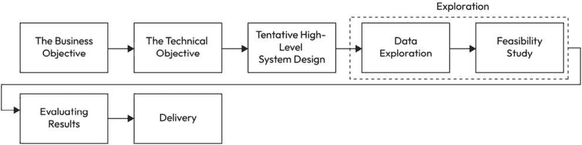

# 激活文本分类：利用传统机器学习技术

在本章中，我们将深入探讨文本分类的迷人世界，这是自然语言处理（**NLP**）和机器学习（**ML**）的基础任务，涉及将文本文档分类到预定义的类别中。随着数字文本数据量的指数级增长，准确且高效地分类文本的能力对于广泛的应用变得越来越重要，例如情感分析、垃圾邮件检测和文档组织。本章为来自不同背景和技能水平的读者提供了一个关于文本分类中使用的核心概念、方法和技术的全面概述。

我们将首先探讨各种文本分类任务的类型及其独特特征，提供对每种类型所面临的挑战和机遇的见解。接下来，我们将介绍**N-gram**的概念，并讨论它们如何作为文本分类的特征被利用，不仅捕捉单个单词，还捕捉文本中的局部上下文和单词序列。然后，我们将研究广泛使用的**词频-逆文档频率**（**TF-IDF**）方法，该方法根据单词在文档中的频率和在整个语料库中的频率分配权重，展示了其在区分分类任务中相关单词方面的有效性。

随后，我们将深入研究强大的**Word2Vec**算法及其在文本分类中的应用。我们将讨论**Word2Vec**如何创建捕获语义意义和关系的密集向量表示，以及这些嵌入如何作为特征来提高分类性能。此外，我们还将介绍如**连续词袋模型**（**CBOW**）和 Skip-Gram 等流行架构，提供对它们内部工作原理的更深入理解。

最后，我们将探讨主题建模的概念，这是一种在文档集合中揭示隐藏主题结构的技巧。我们将研究如**潜在狄利克雷分配**（**LDA**）等流行算法，并描述主题建模如何应用于文本分类，从而发现文档之间的语义关系并提高分类性能。

在本章中，我们旨在提供对文本分类中使用的潜在概念和技术的深入理解，为您提供解决现实世界文本分类问题的知识和技能。

本章将涵盖以下主题：

+   文本分类的类型

+   基于 N-gram 的文本分类

+   基于 TF-IDF 的文本分类

+   Word2Vec 及其在文本分类中的应用

+   主题建模

+   回顾我们的用例 - 在 Jupyter 笔记本中为 NLP 分类设计的机器学习系统

# 技术要求

为了有效地阅读和理解这一章，对各种技术领域的坚实基础是必不可少的。对NLP、ML和线性代数的基本概念有深刻的理解至关重要。熟悉文本预处理技术，如分词、停用词去除以及词干提取或词形还原，对于理解数据准备阶段是必要的。

此外，理解基本的ML算法，如逻辑回归和**支持向量机**（**SVMs**），对于实现文本分类模型至关重要。最后，熟悉评估指标，如准确率、精确率、召回率和F1分数，以及过拟合、欠拟合和超参数调整等概念，将有助于更深入地理解文本分类中的挑战和最佳实践。

# 文本分类的类型

文本分类是一个NLP任务，其中ML算法根据文本的内容将其分配到预定义的类别或标签。它涉及在标记数据集上训练一个模型，以便它能够准确预测未见或新的文本输入的类别。文本分类方法可以分为三种主要类型——**监督学习**、**无监督学习**和**半监督学习**：

+   **监督学习**：这种文本分类涉及在标记数据上训练模型，其中每个数据点都与一个目标标签或类别相关联。然后，该模型使用这些标记数据来学习输入文本和目标标签之间的模式和关系。文本分类的监督学习算法示例包括朴素贝叶斯、SVMs以及卷积神经网络（**CNNs**）和循环神经网络（**RNNs**）等神经网络。

+   **无监督学习**：这种文本分类涉及将文本文档聚类或分组到类别或主题中，而不需要任何关于类别或标签的先验知识。当没有可用的标记数据或当类别或主题的数量未知时，无监督学习非常有用。文本分类的无监督学习算法示例包括K-means聚类、LDA和**层次狄利克雷过程**（**HDP**）。

+   **半监督学习**：这种文本分类结合了监督学习和无监督学习的方法。它涉及使用少量标记数据来训练模型，然后使用该模型来分类剩余的无标签数据。然后，该模型使用无标签数据来提高其分类性能。当标记数据稀缺或难以获得时，半监督学习非常有用。文本分类的半监督学习算法示例包括**自训练**、**协同训练**和**多视角学习**。

这些文本分类类型各有其优势和劣势，适用于不同类型的应用。了解这些类型有助于为特定问题选择适当的方法。在以下小节中，我们将详细解释这些方法。

## 监督学习

监督学习是一种机器学习类型，其中算法从标注数据中学习以预测新、未见数据的标签。

在文本分类的背景下，监督学习涉及在标注数据集上训练模型，其中每个文档或文本样本都被标注为相应的类别或类别。然后，该模型使用这些训练数据来学习文本特征与其相关标签之间的模式和关系：

1.  在监督文本分类任务中，第一步是获取一个标注数据集，其中每个文本样本都被标注为相应的类别或类别。

    标注数据集被认为具有最高可靠性。通常，它是通过让主题专家手动审查文本并为每个项目分配适当的类别来获得的。在其他情况下，可能存在用于生成标签的自动化方法。例如，在网络安全领域，你可能收集历史数据然后分配标签，这些标签可能收集每个项目之后的成果——也就是说，该操作是否合法。由于大多数领域都存在此类历史数据，因此这些数据也可以作为可靠的标注集。

1.  下一步是对文本数据进行预处理，以准备建模。这可能包括诸如分词、词干提取或词形还原、去除停用词以及其他文本预处理技术。

1.  在预处理之后，文本数据被转换为数值特征，通常使用诸如词袋模型或TF-IDF编码等技术。

1.  然后，使用这些数值特征在标注数据集上训练监督学习算法，如逻辑回归、SVM或神经网络。

一旦模型被训练，就可以使用它来根据学习到的文本特征与其相关标签之间的模式和关系来预测新、未见文本数据的类别或类别。

监督学习算法通常用于文本分类任务。让我们看看一些常用的用于文本分类的监督学习算法。

### 朴素贝叶斯

朴素贝叶斯是一种概率算法，常用于文本分类。它基于贝叶斯定理，该定理表明，给定一些观察到的证据（在这种情况下，文档中的单词），假设（在这种情况下，文档属于特定类别）的概率与证据在假设下给出的概率成正比，乘以假设的先验概率。朴素贝叶斯假设在类别标签给定的情况下，特征（单词）之间是相互独立的，这也是其名称中“朴素”部分的原因。

### 逻辑回归

逻辑回归是一种用于二元分类问题（即只有两个可能类别的問題）的统计方法。它使用逻辑函数来模拟文档属于特定类别的概率，该函数将任何实值输入映射到0到1之间的值。

### SVM

SVM是一种强大的分类算法，在各种应用中使用，包括文本分类。SVM通过找到最佳分离数据的超平面来工作。在文本分类中，特征通常是文档中的词语，而超平面用于将所有可能的文档空间划分为对应不同类别的不同区域。

所有这些算法都可以使用标记数据进行训练，其中训练集中的每个文档的类别标签都是已知的。一旦训练完成，该模型就可以用来预测新、未标记文档的类别标签。模型的性能通常使用准确率、精确率、召回率和F1分数等指标进行评估。

## 无监督学习

无监督学习是一种机器学习类型，其中数据未标记，算法被留给自行寻找模式和结构。在文本分类的背景下，当没有标记数据可用或目标是发现文本数据中的隐藏模式时，可以使用无监督学习方法。

一种常见的用于文本分类的无监督学习方法是**聚类**。聚类算法根据文档的内容将相似的文档分组在一起，而不需要任何关于每个文档内容的先验知识。聚类可以用来识别文档集合中的主题，或将相似的文档分组在一起进行进一步分析。

另一种流行的用于文本分类的无监督学习算法是**LDA**。LDA是一种概率生成模型，假设语料库中的每个文档都是主题的混合，每个主题是词语的概率分布。LDA可以用来发现文档集合中的潜在主题，即使主题没有明确标记。

最后，词嵌入是一种流行的无监督学习技术，用于文本分类。词嵌入是词语的密集向量表示，根据它们出现的上下文捕获其语义意义。它们可以用来识别相似词语，并找出词语之间的关系，这对于文本相似性和推荐系统等任务可能很有用。常见的词嵌入模型包括Word2Vec和GloVe。

Word2Vec是一种流行的算法，用于生成词嵌入，即在高维空间中词语的向量表示。该算法由Google的研究团队在2013年开发，由Tomas Mikolov领导。Word2Vec背后的主要思想是，在相似上下文中出现的词语往往具有相似的意义。

该算法以大量文本语料库作为输入，并为词汇表中的每个单词生成一个向量表示。这些向量通常是高维的（例如，100或300维），可用于执行各种NLP任务，如情感分析、文本分类和机器翻译。

Word2Vec使用了两种主要架构：**CBOW**和**skip-gram**。在CBOW架构中，算法试图根据上下文单词的窗口预测目标词。在skip-gram架构中，算法试图根据目标词预测上下文词。训练目标是最大化目标词或上下文词在给定输入下的可能性。

Word2Vec在NLP社区中得到广泛应用，并在各种基准测试中显示出最先进的性能。它也被用于许多实际应用中，如推荐系统、搜索引擎和聊天机器人。

## 半监督学习

半监督学习是介于监督学习和无监督学习之间的机器学习范式。它利用标记数据和未标记数据的组合进行训练，这在底层模型需要昂贵或耗时的标记数据时特别有用。这种方法允许模型利用未标记数据中的信息来提高其在分类任务上的性能。

在文本分类的背景下，当我们拥有有限的标记文档但大量未标记文档时，半监督学习可以是有益的。目标是利用未标记数据中包含的信息来提高分类器的性能。

有几种常见的半监督学习算法，包括标签传播和Co-training。我们将在下一节中更详细地讨论这些算法。

### Label propagation

Label propagation是一种基于图的半监督学习算法。它使用标记和未标记数据点构建一个图，每个数据点表示为一个节点，边表示节点之间的相似性。该算法通过根据它们的相似性从标记节点传播标签到未标记节点来工作。

关键思想是相似的数据点应该有相似的标签。算法首先为未标记的节点分配初始标签概率，通常基于它们与标记节点的相似性。然后，一个迭代过程将把这些概率传播到整个图中，直到收敛。最终的标签概率用于对未标记的数据点进行分类。

### Co-training

Co-training 是另一种半监督学习技术，它在数据的不同视角上训练多个分类器。视角是特征的一个子集，对于学习任务来说是足够的，并且给定类别标签时是条件独立的。基本思想是使用一个分类器的预测来标记一些未标记的数据，然后使用这些新标记的数据来训练另一个分类器。这个过程是迭代进行的，每个分类器通过改进另一个分类器来提高性能，直到满足停止条件。

要在特定领域应用半监督学习，让我们考虑一个医学领域，我们希望将科学文章分类到不同的类别中，例如**心脏病学**、**神经病学**和**肿瘤学**。假设我们有一小部分标记的文章和一大群未标记的文章。

一种可能的方法是创建一个文章图，其中节点代表文章，边代表文章之间的相似性。相似性可以基于各种因素，例如使用的单词、覆盖的主题或文章之间的引用网络。在传播标签后，我们可以根据最终的标签概率对未标记的文章进行分类。

或者，我们可以通过将特征分为两个视角来使用 co-training，例如文章的摘要和全文。我们将训练两个分类器，每个视角一个，并迭代地使用另一个分类器在未标记数据上的预测来更新分类器。

在这两种情况下，目标都是利用未标记数据中的信息来提高特定领域的分类器性能。

在本章中，我们将详细阐述监督文本分类和主题建模。

## 使用 one-hot 编码向量表示进行句子分类

One-hot 编码向量表示是一种表示分类数据（如单词）为二进制向量的方法。在文本分类的上下文中，one-hot 编码可以用来将文本数据表示为分类模型的数值输入特征。以下是使用 one-hot 编码向量进行文本分类的详细解释。

### 文本预处理

第一步是预处理文本数据，如前一章所述。预处理的主要目标是将原始文本转换为更结构化和一致的格式，以便机器学习算法可以轻松理解和处理。以下是文本预处理对于 one-hot 编码向量分类的几个原因：

+   **噪声减少**：原始文本数据通常包含噪声，例如拼写错误、拼写错误、特殊字符和格式不一致。预处理有助于清理文本，减少可能对分类模型性能产生负面影响的噪声。

+   **降维**：one-hot 编码向量表示具有高维度，因为数据集中每个唯一的单词对应一个单独的特征。预处理技术，如停用词去除、词干提取或词形还原，可以帮助减少词汇表的大小，从而降低特征空间的维度。这可以提高分类算法的效率并降低过拟合的风险。

+   **一致的表示**：将所有文本转换为小写并应用词干提取或词形还原确保具有相同意义或词根形式的单词在 one-hot 编码向量中保持一致表示。这可以帮助分类模型从数据中学习到更有意义的模式，因为它不会将同一单词的不同形式视为不同的特征。

+   **处理无关信息**：预处理可以帮助移除无关信息，如 URL、电子邮件地址或数字，这些信息可能不会对分类任务做出贡献。移除此类信息可以提高模型专注于文本中有意义单词和模式的能力。

+   **提高模型性能**：预处理文本数据可以提高分类模型的表现，因为模型将从更干净、更有结构的数据集中学习。这可能导致准确率的提高以及对新、未见文本数据的泛化能力。

一旦我们预处理完文本，我们就可以开始提取文本中的单词了。我们称这个任务为词汇构建。

### 词汇构建

构建一个包含预处理文本中所有唯一单词的词汇表。为词汇表中的每个单词分配一个唯一的索引。

词汇构建是准备文本数据以进行 one-hot 编码向量分类的一个关键步骤。词汇是预处理文本数据中所有唯一单词（标记）的集合。它作为创建每个文档的 one-hot 编码特征向量的基础。以下是 one-hot 编码向量分类的词汇构建过程的详细说明：

1.  **创建一组唯一单词**：在预处理文本数据后，从所有文档中收集所有单词并创建一组唯一单词。这个集合将代表词汇表。词汇表中单词的顺序不重要，但必须跟踪分配给每个单词的索引，因为它们将用于稍后创建 one-hot 编码向量。

    例如，考虑以下预处理数据集由两个文档组成：

    +   **文档 1**： “apple banana orange”

    +   **文档 2**： “banana grape apple”

    该数据集的词汇表将是 {“apple”， “banana”， “orange”， “grape”}。

1.  **为单词分配索引**：一旦你有了唯一单词的集合，为词汇表中的每个单词分配一个唯一的索引。这些索引将用于创建每个文档的 one-hot 编码向量。

    使用前面的示例，你可能分配以下索引：

    +   “apple”：0

    +   “banana”：1

    +   “orange”：2

    +   “grape”：3

### One-hot 编码

使用构建的词汇表和分配的索引，你现在可以为数据集中的每个文档创建独热编码的向量。创建独热编码向量的一个简单方法就是使用**词袋模型**。对于文档中的每个单词，找到它在词汇表中的对应索引，并在独热编码向量中设置该索引的值为 1。如果一个单词在文档中多次出现，其在独热编码向量中的对应值仍然为 1。向量中的所有其他值都将为 0。

例如，使用之前提到的词汇表和索引，文档的独热编码向量如下所示：

+   **文档 1**: [1, 1, 1, 0]（存在苹果、香蕉和橙子）

+   **文档 2**: [1, 1, 0, 1]（存在苹果、香蕉和葡萄）

一旦我们得到了每个文档对应的值，我们就可以创建一个特征矩阵，其中以独热编码的向量作为行，每一行代表一个文档，每一列代表词汇表中的一个单词。这个矩阵将被用作文本分类模型的输入。例如，在之前的例子中，两个文档的特征向量如下所示：

|  | 苹果 | 香蕉 | 橙子 | 葡萄 |
| --- | --- | --- | --- | --- |
| 文档 1 | 1 | 1 | 1 | 0 |
| 文档 2 | 1 | 1 | 0 | 1 |

表 5.1 – 两个文档的样本独热编码向量

请注意，通过文本预处理，拥有一个更小的词汇表有助于提高模型性能。此外，如果需要，我们可以在提取的特征向量上执行特征选择方法（如本书之前所述），以提高我们的模型性能。

虽然从单词创建独热编码向量很有用，但有时我们需要考虑两个单词相邻的存在。例如，“非常好”和“不好”可能有不同的含义。为了达到这个目标，我们可以使用 N-grams。

### N-grams

N-grams 是 bag-of-words 模型的一种推广，它通过考虑连续的 *n* 个单词的顺序来考虑单词的顺序。N-gram 是从给定文本中连续的 *n* 个项目（通常是单词）的序列。例如，在句子“The cat is on the mat”中，2-grams（双词）将是“The cat”，“cat is”，“is on”，“on the”，和“the mat”。

使用 N-grams 可以帮助捕捉局部上下文和单词关系，这可能会提高分类器的性能。然而，它也增加了特征空间的维度，这可能会在计算上变得昂贵。

### 模型训练

在特征矩阵上训练一个机器学习模型，如逻辑回归、SVM 或神经网络，以学习独热编码文本特征与目标标签之间的关系。该模型将学会根据文档中特定单词的存在与否来预测类别标签。一旦我们决定了训练过程，我们需要执行以下任务：

+   **模型评估**：使用适当的评估指标评估模型性能，例如准确率、精确率、召回率、F1分数或混淆矩阵，并使用交叉验证等技术来获得模型在未见数据上的可靠性能估计。

+   **模型应用**：将训练好的模型应用于新的、未见过的文本数据。使用相同的词汇表对新的文本数据进行预处理和独热编码，然后使用模型预测类别标签。

使用独热编码向量进行文本分类的一个潜在局限性是它们没有捕捉到单词顺序、上下文或单词之间的语义关系。这可能导致性能不佳，尤其是在更复杂的分类任务中。在这种情况下，更高级的技术，如词嵌入（例如Word2Vec或GloVe）或深度学习模型（例如CNNs或RNNs），可以提供更好的文本数据表示。

总结来说，使用独热编码向量进行文本分类涉及预处理文本数据、构建词汇表、将文本数据表示为独热编码特征向量、在特征向量上训练机器学习模型，以及评估和应用模型到新的文本数据。独热编码向量表示是一种简单但有时有限的文本分类方法，对于复杂任务可能需要更高级的技术。

到目前为止，我们已经学习了使用N-gram对文档进行分类。然而，这种方法有一个缺点。文档中频繁出现的大量单词并不增加我们模型的价值。为了改进模型，已经提出了使用TF-IDF进行文本分类的方法。

# 使用TF-IDF进行文本分类

独热编码向量是进行分类的好方法。然而，它的一个弱点是它没有考虑不同文档中不同单词的重要性。为了解决这个问题，使用**TF-IDF**可能会有所帮助。

TF-IDF是一种数值统计量，用于衡量一个词在文档集合中相对于整个文档集合的重要性。它有助于反映文档中单词的相关性，不仅考虑了单词在文档中的频率，还考虑了单词在整个文档集合中的稀有度。一个词的TF-IDF值与其在文档中的频率成正比，但会因该词在整个文档集合中的频率而抵消。

下面是计算TF-IDF所涉及的数学公式的详细解释：

+   **词频（TF）**：一个词*t*在文档*d*中的TF表示该词在文档中出现的次数，除以文档中单词的总数。TF可以使用以下公式计算：

![<math xmlns="http://www.w3.org/1998/Math/MathML" display="block"><mrow><mrow><mrow><mi>T</mi><mi>F</mi><mo>(</mo><mi>t</mi><mo>,</mo><mi>d</mi><mo>)</mo><mo>=</mo><mo>(</mo><mi>N</mi><mi>u</mi><mi>m</mi><mi>b</mi><mi>e</mi><mi>r</mi><mi>o</mi><mi>f</mi><mi>t</mi><mi>i</mi><mi>m</mi><mi>e</mi><mi>s</mi><mi>w</mi><mi>o</mi><mi>r</mi><mi>d</mi><mo>′</mo><mi>t</mi><mo>′</mo><mi>a</mi><mi>p</mi><mi>p</mi><mi>e</mi><mi>a</mi><mi>r</mi><mi>s</mi><mi>i</mi><mi>n</mi><mi>g</mi><mi>d</mi><mi>o</mi><mi>c</mi><mi>u</mi><mi>m</mi><mi>e</mi><mi>n</mi><mi>t</mi><mo>′</mo><mi>d</mi><mo>′</mo><mo>)</mo><mo>/</mo><mo>(</mo><mi>T</mi><mi>o</mi><mi>t</mi><mi>a</mi><mi>l</mi><mi>n</mi><mi>u</mi><mi>m</mi><mi>b</mi><mi>e</mi><mi>r</mi><mi>o</mi><mi>f</mi><mi>w</mi><mi>o</mi><mi>r</mi><mi>d</mi><mi>s</mi><mi>i</mi><mi>n</mi><mi>g</mi><mi>o</mi><mi>c</mi><mi>u</mi><mi>m</mi><mi>e</mi><mi>n</mi><mi>t</mi><mo>′</mo><mi>d</mi><mo>′</mo><mo>)</mo></mrow></mrow></mrow></math>](img/259.png)

TF 衡量一个单词在特定文档中的重要性。

+   **逆文档频率（IDF）**：单词 *t* 的 IDF 反映了该单词在整个文档集合中的稀有度。IDF 可以使用以下公式计算：

    IDF(t) = log ((集合中文档的总数) / (包含单词′t′的文档数))

    对数用于减弱 IDF 成分的效应。如果一个单词在许多文档中出现，其 IDF 值将更接近 0，而如果一个单词在较少的文档中出现，其 IDF 值将更高。

+   **TF-IDF 计算**：文档中单词 *t* 的 TF-IDF 值可以通过将文档中该单词的 TF 与整个文档集合中该单词的 IDF 相乘来计算：

结果的 TF-IDF 值表示一个单词在文档中的重要性，同时考虑其在文档中的频率和在整个文档集合中的稀有度。高 TF-IDF 值表示在特定文档中更重要的单词，而低 TF-IDF 值表示在所有文档中都很常见或在特定文档中很罕见的单词。

让我们考虑一个简单的例子，将电影评论分为两类：正面和负面。我们有一个包含三个电影评论及其相应标签的小数据集，如下所示：

+   **文档 1（正面）**：“我喜欢这部电影。表演很棒，故事很吸引人。”

+   **文档 2（负面）**：“这部电影很无聊。我不喜欢这个故事，表演也很糟糕。”

+   **文档 3（正面）**： “一部令人惊叹的电影，拥有精彩的故事和出色的表演。”

现在，我们将使用TF-IDF对一篇新的、未见过的电影评论进行分类：

+   **文档 4（未知）**： “故事很有趣，表演也很出色。”

这里是我们需要执行的步骤，以便让分类器预测我们文档的类别：

1.  **步骤 1 – 预处理文本数据**：对所有文档中的单词进行分词、转换为小写、去除停用词，并应用词干提取或词形还原：

    +   **文档 1**： “love movi act great stori captiv”

    +   **文档 2**： “movi bore not like stori act terribl”

    +   **文档 3**： “amaz movi wonder stori brilliant act”

    +   **文档 4**： “stori interest act good”

1.  **步骤 2 – 创建词汇表**：将预处理文档中的所有唯一单词合并：

    词汇表：{"love", "movi", "act", "great", "stori", "captiv", "bore", "not", "like", "terribl", "amaz", "wonder", "brilliant", "interest", "good"}

1.  **步骤 3 – 计算TF和IDF值**：计算每个文档中每个单词的TF和IDF。

    例如，对于文档 4 中的单词“stori”，我们有以下内容：

4. **步骤 4 – 计算TF-IDF值**：计算每个文档中每个单词的TF-IDF值。

对所有文档中的所有单词重复此过程，并创建一个包含TF-IDF值的特征矩阵。

5. **步骤 5 – 训练分类器**：将数据集分为训练集（文档 1 到 3）和测试集（文档 4）。使用训练集的TF-IDF特征矩阵及其相应的标签（正面或负面）来训练一个分类器，例如逻辑回归或SVM。

6. **步骤 6 – 预测类别标签**：使用相同的词汇对新的电影评论（文档 4）进行预处理和计算 TF-IDF 值。使用训练好的分类器根据文档 4 的 TF-IDF 特征向量预测其类别标签。

例如，如果分类器预测文档 4 为正面标签，分类结果如下：

+   **文档 4（**预测**）**：“正面”

通过遵循这些步骤，您可以使用 TF-IDF 表示来根据文档中相对于整个文档集合的词的重要性对文本文档进行分类。

总结来说，TF-IDF 值是通过 TF 和 IDF 的数学公式计算得出的。它作为衡量一个词在文档中相对于整个文档集合重要性的指标，同时考虑了该词在文档中的频率以及在整个文档中的稀有度。

# 使用 Word2Vec 进行文本分类

执行文本分类的一种方法是将词转换为嵌入向量，以便可以使用这些向量进行分类。Word2Vec 是执行此任务的一种知名方法。

## Word2Vec

Word2Vec 是一组基于神经网络的模型，用于创建词嵌入，这些嵌入是词在连续向量空间中的密集向量表示。这些嵌入根据词在文本中出现的上下文捕获词的语义意义和关系。Word2Vec 有两种主要架构。如前所述，设计用来学习词嵌入的两种主要架构是 **CBOW** 和 **skip-gram**。两种架构都是通过预测周围上下文中的词来学习词嵌入的：

+   **CBOW**：CBOW 架构旨在根据周围上下文词预测目标词。它以上下文词嵌入的平均值作为输入，并预测目标词。CBOW 训练速度快，适用于小型数据集，但对于不常见的词可能不够准确。

    在 CBOW 模型中，目标是最大化观察目标词给定上下文词的平均对数概率：

![<math xmlns="http://www.w3.org/1998/Math/MathML" display="block"><mrow><mrow><mrow><msub><mrow><mi>O</mi><mi>b</mi><mi>j</mi><mi>e</mi><mi>c</mi><mi>t</mi><mi>i</mi><mi>v</mi><mi>e</mi></mrow><mrow><mi>C</mi><mi>B</mi><mi>o</mi><mi>w</mi></mrow></msub><mo>=</mo><mfrac><mn>1</mn><mi>T</mi></mfrac><mrow><munder><mo>∑</mo><mrow><mi>c</mi><mi>o</mi><mi>n</mi><mi>t</mi><mi>e</mi><mi>x</mi><mi>t</mi></mrow></munder><mrow><mi>l</mi><mi>o</mi><mi>g</mi></mrow></mrow><mo>(</mo><mi>P</mi><mo>(</mo><mi>t</mi><mi>a</mi><mi>r</mi><mi>g</mi><mi>e</mi><mi>t</mi><mo>|</mo><mi>c</mi><mi>o</mi><mi>n</mi><mi>t</mi><mi>e</mi><mi>x</mi><mi>t</mi><mo>)</mo><mo>)</mo></mrow></mrow></mrow></math>](img/264.png)

这里，T 是文本中的总词数，P(target | context) 是在给定上下文词的情况下观察目标词的概率，它使用 softmax 函数计算：

![<math xmlns="http://www.w3.org/1998/Math/MathML" display="block"><mrow><mrow><mi>P</mi><mfenced open="(" close=")"><mrow><mi>t</mi><mi>a</mi><mi>r</mi><mi>g</mi><mi>e</mi><mi>t</mi><mo>|</mo><mi>c</mi><mi>o</mi><mi>n</mi><mi>t</mi><mi>e</mi><mi>x</mi><mi>t</mi></mrow></mfenced><mo>=</mo><mfrac><msup><mi>e</mi><mrow><msubsup><mi mathvariant="bold">v</mi><mrow><mi>t</mi><mi>a</mi><mi>r</mi><mi>g</mi><mi>e</mi><mi>t</mi></mrow><mi>T</mi></msubsup><msub><mrow><mo>∙</mo><mi mathvariant="bold">v</mi></mrow><mrow><mi>c</mi><mi>o</mi><mi>n</mi><mi>t</mi><mi>e</mi><mi>x</mi><mi>t</mi></mrow></msub></mrow></msup><mrow><msub><mo>∑</mo><mi>i</mi></msub><msup><mi>e</mi><mrow><msubsup><mi mathvariant="bold">v</mi><mi>i</mi><mi>T</mi></msubsup><msub><mrow><mo>∙</mo><mi mathvariant="bold">v</mi></mrow><mrow><mi>c</mi><mi>o</mi><mi>n</mi><mi>t</mi><mi>e</mi><mi>x</mi><mi>t</mi></mrow></msub></mrow></msup></mrow></mfrac></mrow></mrow></math>](img/265.png)

这里， 是目标词的输出向量（词嵌入）， 是上下文词的平均输入向量（上下文词嵌入），分母中的求和遍历了词汇表中的所有词。

+   **Skip-gram**：skip-gram 架构旨在根据目标词预测周围的上下文词。它以目标词嵌入作为输入并预测上下文词。Skip-gram 在大型数据集上表现良好，并能更准确地捕捉不常见词的意义，但与 CBOW 相比，它可能训练速度较慢。

    在 skip-gram 模型中，目标是最大化在给定目标词的情况下观察上下文词的平均对数概率：

![<mml:math xmlns:mml="http://www.w3.org/1998/Math/MathML" xmlns:m="http://schemas.openxmlformats.org/officeDocument/2006/math" display="block"><mml:mi>O</mml:mi><mml:mi>b</mml:mi><mml:mi>j</mml:mi><mml:mi>e</mml:mi><mml:mi>c</mml:mi><mml:mi>t</mml:mi><mml:mi>i</mml:mi><mml:mi>v</mml:mi><mml:msub><mml:mrow><mml:mi>e</mml:mi></mml:mrow><mml:mrow><mml:mi>S</mml:mi><mml:mi>k</mml:mi><mml:mi>i</mml:mi><mml:mi>p</mml:mi><mml:mo>-</mml:mo><mml:mi>G</mml:mi><mml:mi>r</mml:mi><mml:mi>a</mml:mi><mml:mi>m</mml:mi></mml:mrow></mml:msub><mml:mo>=</mml:mo><mml:mfrac><mml:mrow><mml:mn>1</mml:mn></mml:mrow><mml:mrow><mml:mi>T</mml:mi></mml:mrow></mml:mfrac><mml:mrow><mml:munder><mml:mo stretchy="false">∑</mml:mo><mml:mrow><mml:mi>c</mml:mi><mml:mi>o</mml:mi><mml:mi>n</mml:mi><mml:mi>t</mml:mi><mml:mi>e</mml:mi><mml:mi>x</mml:mi><mml:mi>t</mml:mi></mml:mrow></mml:munder><mml:mrow><mml:mi mathvariant="normal">l</mml:mi><mml:mi mathvariant="normal">o</mml:mi><mml:mi mathvariant="normal">g</mml:mi><mml:mo>⁡</mml:mo><mml:mo>(</mml:mo><mml:mi>P</mml:mi><mml:mfenced separators="|"><mml:mrow><mml:mi>c</mml:mi><mml:mi>o</mml:mi><mml:mi>n</mml:mi><mml:mi>t</mml:mi><mml:mi>e</mml:mi><mml:mi>x</mml:mi><mml:mi>t</mml:mi></mml:mrow><mml:mrow><mml:mi>t</mml:mi><mml:mi>a</mml:mi><mml:mi>r</mml:mi><mml:mi>g</mml:mi><mml:mi>e</mml:mi><mml:mi>t</mml:mi></mml:mrow></mml:mfenced><mml:mo>)</mml:mo></mml:mrow></mml:mrow></mml:math>](img/268.png)

在这里，T 是文本中的总单词数，P(context | target) 是在给定目标词的情况下观察上下文词的概率，该概率使用 softmax 函数计算：

![<math xmlns="http://www.w3.org/1998/Math/MathML" display="block"><mrow><mrow><mi>P</mi><mfenced open="(" close=")"><mrow><mi>c</mi><mi>o</mi><mi>n</mi><mi>t</mi><mi>e</mi><mi>x</mi><mi>t</mi><mo>|</mo><mi>t</mi><mi>a</mi><mi>r</mi><mi>g</mi><mi>e</mi><mi>t</mi></mrow></mfenced><mo>=</mo><mfrac><msup><mi>e</mi><mrow><msubsup><mi mathvariant="bold">v</mi><mrow><mi>c</mi><mi>o</mi><mi>n</mi><mi>t</mi><mi>e</mi><mi>x</mi><mi>t</mi></mrow><mi>T</mi></msubsup><msub><mrow><mo>∙</mo><mi mathvariant="bold">v</mi></mrow><mrow><mi>t</mi><mi>a</mi><mi>r</mi><mi>g</mi><mi>e</mi><mi>t</mi></mrow></msub></mrow></msup><mrow><msub><mo>∑</mo><mi>i</mi></msub><msup><mi>e</mi><mrow><msubsup><mi mathvariant="bold">v</mi><mi>i</mi><mi>T</mi></msubsup><msub><mrow><mo>∙</mo><mi mathvariant="bold">v</mi></mrow><mrow><mi>t</mi><mi>a</mi><mi>r</mi><mi>g</mi><mi>e</mi><mi>t</mi></mrow></msub></mrow></msup></mrow></mfrac></mrow></mrow></math>](img/269.png)

在这里，是上下文词的输出向量（上下文词嵌入），是目标词的输入向量（词嵌入），分母中的求和遍历词汇表中的所有词。

CBOW和skip-gram的训练过程都涉及遍历文本，并使用**随机梯度下降**（**SGD**）和反向传播来更新输入和输出权重矩阵，以最小化预测词和实际词之间的差异。学习到的输入权重矩阵包含词汇表中每个词的词嵌入。

### 使用Word2Vec进行文本分类

使用Word2Vec进行文本分类涉及使用Word2Vec算法创建词嵌入，然后训练一个机器学习模型来根据这些嵌入对文本进行分类。以下步骤详细概述了该过程，包括数学方面：

1.  **文本预处理**：通过分词、小写化、去除停用词以及词干提取或词形还原来清洁和预处理文本数据。

1.  **训练Word2Vec模型**：在预处理后的文本数据上训练一个Word2Vec模型（无论是CBOW还是Skip-Gram），以创建词嵌入。Word2Vec算法学习根据上下文（CBOW）预测目标词，或者根据目标词预测上下文词（skip-gram）。训练目标是最大化在给定目标词的情况下观察上下文词的平均对数概率：

![<math xmlns="http://www.w3.org/1998/Math/MathML" display="block"><mrow><mrow><mi>O</mi><mi>b</mi><mi>j</mi><mi>e</mi><mi>c</mi><mi>t</mi><mi>i</mi><mi>v</mi><mi>e</mi><mo>=</mo><mfrac><mn>1</mn><mi>T</mi></mfrac><mrow><munder><mo>∑</mo><mrow><mi>c</mi><mi>o</mi><mi>n</mi><mi>t</mi><mi>e</mi><mi>x</mi><mi>t</mi></mrow></munder><mrow><mi mathvariant="normal">l</mi><mi mathvariant="normal">o</mi><mi mathvariant="normal">g</mi><mo>(</mo><mi>P</mi><mfenced open="(" close=")"><mrow><mi>c</mi><mi>o</mi><mi>n</mi><mi>t</mi><mi>e</mi><mi>x</mi><mi>t</mi><mo>|</mo><mi>t</mi><mi>a</mi><mi>r</mi><mi>g</mi><mi>e</mi><mi>t</mi></mrow></mfenced><mo>)</mo></mrow></mrow></mrow></mrow></math>](img/272.png)

在这里，*T* 是文本中的总单词数，*P(context | target)* 是在给定目标词的情况下观察上下文词的概率，这使用softmax函数来计算：

![<math xmlns="http://www.w3.org/1998/Math/MathML" display="block"><mrow><mrow><mi>P</mi><mfenced open="(" close=")"><mrow><mi>c</mi><mi>o</mi><mi>n</mi><mi>t</mi><mi>e</mi><mi>x</mi><mi>t</mi><mo>|</mo><mi>t</mi><mi>a</mi><mi>r</mi><mi>g</mi><mi>e</mi><mi>t</mi></mrow></mfenced><mo>=</mo><mfrac><msup><mi>e</mi><mrow><msubsup><mi mathvariant="bold">v</mi><mrow><mi>c</mi><mi>o</mi><mi>n</mi><mi>t</mi><mi>e</mi><mi>x</mi><mi>t</mi></mrow><mi>T</mi></msubsup><msub><mrow><mo>∙</mo><mi mathvariant="bold">v</mi></mrow><mrow><mi>t</mi><mi>a</mi><mi>r</mi><mi>g</mi><mi>e</mi><mi>t</mi></mrow></msub></mrow></msup><mrow><msub><mo>∑</mo><mi>i</mi></msub><msup><mi>e</mi><mrow><msubsup><mi mathvariant="bold">v</mi><mi>i</mi><mi>T</mi></msubsup><msub><mrow><mo>∙</mo><mi mathvariant="bold">v</mi></mrow><mrow><mi>t</mi><mi>a</mi><mi>r</mi><mi>g</mi><mi>e</mi><mi>t</mi></mrow></msub></mrow></msup></mrow></mfrac></mrow></mrow></math>](img/273.png)

在这里，是上下文词的输出向量（上下文词嵌入），是目标词的输入向量（词嵌入），分母中的求和遍历了词汇表中的所有单词。

3. **创建文档嵌入**：对于数据集中的每个文档，通过计算文档中单词的词嵌入的平均值来计算文档嵌入：

![<math xmlns="http://www.w3.org/1998/Math/MathML" display="block"><mrow><mrow><mi>D</mi><mi>o</mi><mi>c</mi><mi>u</mi><mi>m</mi><mi>e</mi><mi>n</mi><mi>t</mi><mi>E</mi><mi>m</mi><mi>b</mi><mi>e</mi><mi>d</mi><mi>d</mi><mi>i</mi><mi>n</mi><mi>g</mi><mo>=</mo><mfrac><mn>1</mn><mi>N</mi></mfrac><mrow><munder><mo>∑</mo><mi>i</mi></munder><msub><mrow><mi mathvariant="normal">W</mi><mi mathvariant="normal">o</mi><mi mathvariant="normal">r</mi><mi mathvariant="normal">d</mi><mi mathvariant="normal">E</mi><mi mathvariant="normal">m</mi><mi mathvariant="normal">b</mi><mi mathvariant="normal">e</mi><mi mathvariant="normal">d</mi><mi mathvariant="normal">d</mi><mi mathvariant="normal">i</mi><mi mathvariant="normal">n</mi><mi mathvariant="normal">g</mi></mrow><mi mathvariant="normal">i</mi></msub></mrow></mrow></mrow></math>](img/276.png)

在这里，N是文档中的单词数量，求和遍历文档中的所有单词。请注意，根据我们的经验，使用Word2Vec进行文本分类的方法仅在文档长度较短时才有效。如果你有较长的文档或文档中有相反的词语，这种方法表现不佳。一个替代方案是将Word2Vec和CNN结合使用来获取词嵌入，然后将这些嵌入作为CNN的输入。

4. **模型训练**：使用文档嵌入作为特征来训练一个机器学习模型，如逻辑回归、SVM或神经网络，用于文本分类。该模型学习根据文档嵌入预测类别标签。

5. **模型评估**：使用适当的评估指标（如准确率、精确率、召回率、F1分数或混淆矩阵）评估模型的性能，并使用交叉验证等技术来获得模型在未见数据上的可靠性能估计。

6. **模型应用**：将训练好的模型应用于新的、未见过的文本数据。使用相同的Word2Vec模型和词汇表对新的文本数据进行预处理和计算文档嵌入，并使用该模型预测类别标签。

总结来说，使用Word2Vec进行文本分类涉及使用Word2Vec算法创建词嵌入，平均这些嵌入以创建文档嵌入，并训练一个机器学习模型根据这些文档嵌入对文本进行分类。Word2Vec算法通过最大化观察给定目标词的上下文词的平均对数概率来学习词嵌入，在这个过程中捕捉词语之间的语义关系。

## 模型评估

评估文本分类模型的性能对于确保它们达到期望的准确性和泛化水平至关重要。通常使用多种指标和技术来评估文本分类模型，包括准确率、精确率、召回率、F1分数和混淆矩阵。让我们更详细地讨论这些指标：

+   **准确性**：准确性是分类任务中最直接的指标。它衡量所有分类记录中正确分类的记录数量。它被定义为如下：

![<math xmlns="http://www.w3.org/1998/Math/MathML" display="block"><mrow><mrow><mi>A</mi><mi>c</mi><mi>c</mi><mi>u</mi><mi>r</mi><mi>a</mi><mi>c</mi><mi>y</mi><mo>=</mo><mfrac><mrow><mo>(</mo><mi>T</mi><mi>r</mi><mi>u</mi><mi>e</mi><mi>P</mi><mi>o</mi><mi>s</mi><mi>i</mi><mi>t</mi><mi>i</mi><mi>v</mi><mi>e</mi><mi>s</mi><mo>+</mo><mi>T</mi><mi>r</mi><mi>u</mi><mi>e</mi><mi>N</mi><mi>e</mi><mi>g</mi><mi>a</mi><mi>t</mi><mi>i</mi><mi>v</mi><mi>e</mi><mi>s</mi><mo>)</mo></mrow><mrow><mo>(</mo><mi>T</mi><mi>r</mi><mi>u</mi><mi>e</mi><mi>P</mi><mi>o</mi><mi>s</mi><mi>i</mi><mi>t</mi><mi>i</mi><mi>v</mi><mi>e</mi><mi>s</mi><mo>+</mo><mi>T</mi><mi>r</mi><mi>u</mi><mi>e</mi><mi>N</mi><mi>e</mi><mi>g</mi><mi>a</mi><mi>t</mi><mi>i</mi><mi>v</mi><mi>e</mi><mi>s</mi><mo>+</mo><mi>F</mi><mi>a</mi><mi>l</mi><mi>s</mi><mi>e</mi><mi>P</mi><mi>o</mi><mi>s</mi><mi>i</mi><mi>t</mi><mi>i</mi><mi>v</mi><mi>e</mi><mi>s</mi><mo>+</mo><mi>F</mi><mi>a</mi><mi>l</mi><mi>s</mi><mi>e</mi><mi>N</mi><mi>e</mi><mi>g</mi><mi>a</mi><mi>t</mi><mi>i</mi><mi>v</mi><mi>e</mi><mi>s</mi><mo>)</mo></mrow></mfrac></mrow></mrow></math>](img/277.png)

虽然准确性容易理解，但它可能不是不平衡数据集的最佳指标，因为在不平衡数据集中，多数类可以主导指标的值。

+   **精确度**：精确度衡量正确识别的正例与模型预测为正的总实例的比例。它也被称为**阳性预测值**（**PPV**）。在关联到错误正例成本较高的场景中，精确度非常有价值。精确度被定义为如下：

[[OMML-EQ-21D]]

+   **召回率**：召回率，也称为灵敏度或**真正例率**（**TPR**），评估正确识别的正例与总实际正例的比例。当错误负例的成本很高时，召回率非常有用。数学上，它被定义为如下：

[[OMML-EQ-22D]]

+   **F1 分数**：F1 分数是精确度和召回率的调和平均值，将这两个指标整合为一个统一的价值。在不平衡数据集的上下文中，它是一个重要的指标，因为它考虑了错误正例和错误负例。F1 分数从 0 到 1 变化，1 代表最佳结果，F1 分数的数学表达式如下：

![<math xmlns="http://www.w3.org/1998/Math/MathML" display="block"><mrow><mrow><mi>F</mi><mn>1</mn><mi>S</mi><mi>c</mi><mi>o</mi><mi>r</mi><mi>e</mi><mo>=</mo><mn>2</mn><mfrac><mrow><mi>P</mi><mi>r</mi><mi>e</mi><mi>c</mi><mi>i</mi><mi}s</mi><mi>i</mi><mi>o</mi><mi>n</mi><mo>∙</mo><mi>R</mi><mi>e</mi><mi>c</mi><mi>a</mi><mi>l</mi><mi>l</mi></mrow><mrow><mi>P</mi><mi>r</mi><mi>e</mi><mi>c</mi><mi>i</mi><mi}s</mi><mi>i</mi><mi>o</mi><mi>n</mi><mo>+</mo><mi>R</mi><mi>e</mi><mi>c</mi><mi>a</mi><mi>l</mi><mi>l</mi></mrow></mfrac></mrow></mrow></math>](img/278.png)

当处理多类分类问题时，我们有F1微平均和F1宏平均。F1微平均和F1宏平均是计算多类或多标签分类问题F1分数的两种方法。它们以不同的方式聚合精确度和召回率，导致对分类器性能的不同解释。让我们更详细地讨论每种方法：

+   **F1宏平均**：F1宏平均独立计算每个类的F1分数，然后取这些值的平均值。这种方法将每个类视为同等重要，不考虑类不平衡。从数学上讲，F1宏平均定义为以下：

在这里，*n* 是类的数量，而  是第i个类的F1分数。

F1宏平均特别适用于当你想要评估分类器在所有类上的性能而不给多数类赋予更多权重时。然而，当类分布高度不平衡时，它可能不适用，因为它可能会提供一个过于乐观的模型性能估计。

+   **F1微平均**：另一方面，F1微平均通过计算所有类的全局精确度和召回率值来聚合所有类的贡献以计算F1分数。它通过考虑每个类中的实例数量来考虑类不平衡。从数学上讲，F1微平均定义为以下：

    

    这里，全局精度和全局召回率的计算方法如下：

F1 微型评估器在您希望评估分类器的整体性能并考虑类别分布时非常有用，尤其是在处理不平衡数据集时。

总结来说，F1宏平均和F1微平均是计算多类或多标签分类问题F1分数的两种方法。F1宏平均将每个类别视为同等重要，不考虑类别分布，而F1微平均通过考虑每个类别的实例数量来考虑类别不平衡。F1宏平均和F1微平均的选择取决于具体问题以及是否将类别不平衡视为一个重要的考虑因素。

### 混淆矩阵

混淆矩阵作为一种表格形式的表示，展示了分类模型做出的真实阳性、真实阴性、假阳性和假阴性预测的数量。这个矩阵提供了对模型有效性的细致视角，使得可以全面理解其优势和劣势。

对于二元分类问题，混淆矩阵的排列如下：

| **实际/预测** | **(预测) 阳性** | **(预测) 阴性** |
| --- | --- | --- |
| (实际) 阳性 | 真阳性 | 假阴性 |
| (实际) 阴性 | 假阳性 | 真阴性 |

表5.2 – 混淆矩阵 – 通用视图

对于多类分类问题，混淆矩阵扩展到包括每个类别的真实和预测计数。对角线元素代表正确分类的实例，而偏对角线元素代表错误分类。

总结来说，评估文本分类模型涉及使用各种指标和技术，如准确率、精确率、召回率、F1分数和混淆矩阵。选择适当的评估指标取决于具体问题、数据集特征以及假阳性和假阴性之间的权衡。使用多个指标评估模型可以提供对其性能的更全面理解，并有助于指导进一步的改进。

## 过拟合和欠拟合

过拟合和欠拟合是机器学习模型训练过程中，包括文本分类模型训练中常见的两个问题。它们都与模型对新、未见数据的泛化能力有关。本节将解释过拟合和欠拟合的发生情况以及如何防止它们。

### 过拟合

过拟合发生在模型过度适应训练数据的复杂性时。在这种情况下，模型捕捉到噪声和随机波动，而不是辨别基本模式。因此，尽管模型可能在训练数据上表现出高性能，但当应用于未见数据（如验证集或测试集）时，其有效性会降低。

为了避免文本分类中的过拟合，可以考虑以下策略：

+   **正则化**：引入正则化技术，例如  或 L2正则化，这会在损失函数中添加惩罚，从而阻止模型过于复杂。

+   **早停法**：在此方法中，我们监控模型在验证集上的性能，一旦验证集上的性能开始变差，即使训练集上的模型性能在提高，我们也停止训练过程。这有助于我们防止过拟合。

+   **特征选择**：通过选择最有信息量的特征或使用PCA或LSA等降维技术来减少用于分类的特征数量。

+   **集成方法**：通过结合多个模型，例如袋装法或提升法，通过平均它们的预测来减少过拟合。

+   **交叉验证**：使用k折交叉验证来获得对未见数据上模型性能的更可靠估计，并相应地微调模型超参数。

接下来，我们将介绍欠拟合问题。

### 欠拟合

当模型过于简单且无法捕捉数据中的潜在模式时，就会发生欠拟合。因此，模型在训练和测试数据上的性能都较低。模型过于简单，无法表示数据的复杂性，并且无法很好地泛化。

为了避免在文本分类中发生欠拟合，可以考虑以下策略：

+   **增加模型复杂性**：使用更复杂的模型，例如更深的神经网络，以捕捉数据中的更复杂模式。

+   **特征工程**：创建新的、有信息量的特征，帮助模型更好地理解文本数据中的潜在模式，例如添加N-gram或使用词嵌入。

+   **超参数调整**：优化模型超参数，例如学习率、层数或隐藏单元数，以提高模型从数据中学习的能力。我们将在下一节中解释超参数调整以及执行此任务的不同方法。

+   **增加训练数据**：如果可能，收集更多标记数据用于训练，因为更多的例子可以帮助模型更好地学习潜在模式。

+   **减少正则化**：如果模型过度正则化，考虑减少正则化强度，使模型变得更加复杂，更好地拟合数据。

总结来说，过拟合和欠拟合是文本分类中常见的两个问题，它们会影响模型泛化到新数据的能力。避免这些问题涉及平衡模型复杂性、使用适当的特征、调整超参数、应用正则化和监控模型在验证集上的性能。通过解决过拟合和欠拟合问题，可以提高文本分类模型的表现和泛化能力。

## 超参数调整

构建一个有效的分类模型的一个重要步骤是超参数调整。超参数是在训练之前定义的模型参数；它们在训练过程中不会改变。这些参数决定了模型架构和行为。可以使用的某些超参数包括学习率和迭代次数。它们可以显著影响模型的表现和泛化能力。

文本分类中超参数调整的过程涉及以下步骤：

1.  **定义超参数及其搜索空间**：确定您想要优化的超参数，并指定每个超参数的可能值范围。文本分类中常见的超参数包括学习率、层数、隐藏单元数量、dropout率、正则化强度以及特征提取参数，如N-gram或词汇大小。

1.  **选择搜索策略**：选择一种探索超参数搜索空间的方法，例如网格搜索、随机搜索或贝叶斯优化。网格搜索系统地评估所有超参数值的组合，而随机搜索在搜索空间内随机采样组合。贝叶斯优化使用概率模型来指导搜索，根据模型的预测平衡探索和利用。

1.  **选择评估指标和方法**：选择一个最能代表您文本分类任务目标的性能指标，例如准确率、精确率、召回率、F1分数或ROC曲线下的面积。同时，选择一个评估方法，如k折交叉验证，以获得模型在未见数据上的性能的可靠估计。

1.  **执行搜索**：对于每个超参数值的组合，在训练数据上训练一个模型，并使用所选的指标和评估方法评估其性能。记录最佳性能的超参数组合。

1.  **选择最佳超参数**：搜索完成后，选择在评估指标上产生最佳性能的超参数组合。使用这些超参数在整个训练集上重新训练模型。

1.  **在测试集上评估**：使用保留的测试集评估最终模型在优化超参数下的性能，以获得其泛化能力的无偏估计。

超参数调整通过找到在所选评估指标上产生最佳模型性能的参数组合来影响模型的性能。调整超参数可以帮助解决诸如过拟合和欠拟合等问题，平衡模型复杂性，并提高模型对新数据的泛化能力。

超参数调整是文本分类中的一个关键过程，涉及在选择的评估指标上搜索最优模型参数组合以最大化性能。通过仔细调整超参数，你可以提高文本分类模型的性能和泛化能力。

## 应用文本分类的附加主题

在现实世界中，应用文本分类涉及各种实际考虑和挑战，这些挑战源于现实世界数据的性质和问题要求。一些常见问题包括处理不平衡数据集、处理噪声数据和选择合适的评估指标。

让我们更详细地讨论这些内容。

### 处理不平衡数据集

文本分类任务经常遇到不平衡数据集的问题，其中某些类别的实例数量明显多于其他类别。这种不平衡可能导致模型偏向，擅长预测多数类，但在准确分类少数类方面表现不佳。为了处理不平衡数据集，可以考虑以下策略：

+   **重采样**：你可以对少数类进行过采样，对多数类进行欠采样，或者使用两者的组合来平衡类别分布。

+   **加权损失函数**：在损失函数中为少数类分配更高的权重，使模型对少数类的误分类更加敏感。

+   **集成方法**：使用关注少数类的集成技术，如袋装或提升。例如，你可以使用带有袋装的随机欠采样或成本敏感的提升算法。

+   **评估指标**：选择对类别不平衡不那么敏感的评估指标，如精确度、召回率、F1分数或ROC曲线下的面积，而不是准确度。

+   **处理噪声数据**：现实世界的文本数据通常很嘈杂，包含拼写错误、语法错误或不相关信息。噪声数据可能会对文本分类模型的性能产生负面影响。

为了处理噪声数据，可以考虑以下策略：

+   **预处理**：通过纠正拼写错误、删除特殊字符、扩展缩写词和将文本转换为小写来清洗文本数据。

+   **停用词去除**：移除没有太多意义的常见词，例如“the”、“is”、“and”等。

+   **词干提取或词形还原**：将单词还原为其基本形式，以最小化形态变化的影响。

+   **特征选择**：使用如卡方检验或互信息等技术来选择最有信息量的特征，减少噪声或不相关特征的影响

无论我们是否在处理不平衡数据，我们都需要评估我们的模型，选择合适的指标来评估我们的模型非常重要。接下来，我们将解释如何选择最佳的指标来评估我们的模型。

### 选择合适的评估指标

选择合适的评估指标对于衡量您的文本分类模型性能和指导模型改进至关重要。

选择评估指标时考虑以下因素：

+   **问题要求**：选择与您的文本分类任务具体目标一致的指标，例如最小化误报或误判

+   **类别不平衡**：对于不平衡的数据集，使用考虑类别不平衡的指标，如精确率、召回率、F1分数或ROC曲线下的面积，而不是准确率

+   **多类或多标签问题**：对于多类或多标签分类任务，使用如微平均和宏平均F1分数等指标，这些指标根据问题的要求以不同的方式聚合精确率和召回率

总结来说，文本分类中的实际考虑因素包括处理不平衡数据集、处理噪声数据以及选择合适的评估指标。解决这些问题可以帮助提高文本分类模型的表现力和泛化能力，并确保它们满足问题的具体要求。

# 主题建模——无监督文本分类的一个特定用例

主题建模是一种无监督机器学习技术，用于在大量文档集中发现抽象主题或主题。它假设每个文档可以表示为多个主题的混合，每个主题表示为词分布。主题建模的目的是找到潜在的主题及其词分布，以及每个文档的主题比例。

有几种主题建模算法，但其中最受欢迎和最广泛使用的是LDA。我们将详细讨论LDA，包括其数学公式。

## LDA

LDA是一种生成概率模型，它假设每个文档的以下生成过程：

1.  选择文档中的词数。

1.  从参数α的Dirichlet分布中选择文档的主题分布（θ）。

1.  对于文档中的每个词，执行以下操作：

    1.  从主题分布（θ）中选择一个主题（z）。

    1.  从所选主题（φ）的词分布中选择一个词（w），该词分布是该主题的词分布，由参数β的Dirichlet分布抽取。

生成过程是LDA（Latent Dirichlet Allocation）用来从假设的主题中逆向工程原始文档的理论模型。

LDA 的目标是找到最佳解释观察到的文档的主题-单词分布 (*φ*) 和文档-主题分布 (*θ*)。

从数学上讲，LDA 可以用以下符号描述：

+   *M*: 文档数量

+   *N*: 文档中的单词数量

+   *K*: 主题数量

+   *α*: 文档-主题分布的 Dirichlet 先验，它影响文档内主题的稀疏性

+   *β*: 主题-单词分布的 Dirichlet 先验，它影响主题内单词的稀疏性

+   *θ*: 文档-主题分布（M × K 矩阵）

+   *φ*: 主题-单词分布（K × V 矩阵，其中 V 是词汇量）

+   *z*: 每个文档中每个单词的主题分配（M × N 矩阵）

+   *w*: 文档中观察到的单词（M × N 矩阵）

在给定主题-单词分布 (*φ*) 和文档-主题分布 (*θ*) 的情况下，文档中主题分配 (*z*) 和单词 (*w*) 的联合概率可以表示如下：

![<math xmlns="http://www.w3.org/1998/Math/MathML" display="block"><mrow><mrow><mi>P</mi><mfenced open="(" close=")"><mrow><mi>z</mi><mo>,</mo><mi>w</mi><mo>|</mo><mi>θ</mi><mo>,</mo><mi>φ</mi></mrow></mfenced><mo>=</mo><mrow><munderover><mo>∏</mo><mrow><mi>i</mi><mo>=</mo><mn>1</mn></mrow><mi>M</mi></munderover><mrow><munderover><mo>∏</mo><mrow><mi>j</mi><mo>=</mo><mn>1</mn></mrow><mi>M</mi></munderover><mrow><mi>P</mi><mfenced open="(" close=")"><mrow><msub><mi>w</mi><mrow><mi>i</mi><mi>j</mi></mrow></msub><mo>|</mo><mi>φ</mi><mo>,</mo><msub><mi>z</mi><mrow><mi>i</mi><mi>j</mi></mrow></msub></mrow></mfenced><mi>P</mi><mfenced open="(" close=")"><mrow><msub><mi>z</mi><mrow><mi>i</mi><mi>j</mi></mrow></msub><mo>|</mo><msub><mi>θ</mi><mi>i</mi></msub></mrow></mfenced></mrow></mrow></mrow></mrow></mrow></math>](img/286.png)

LDA 的目标是最大化在 Dirichlet 先验 α 和 β 下观察到的单词的概率：

![<mml:math xmlns:mml="http://www.w3.org/1998/Math/MathML" xmlns:m="http://schemas.openxmlformats.org/officeDocument/2006/math" display="block"><mml:mi>P</mml:mi><mml:mfenced separators="|"><mml:mrow><mml:mi>w</mml:mi></mml:mrow><mml:mrow><mml:mi>α</mml:mi><mml:mo>,</mml:mo><mml:mi>β</mml:mi></mml:mrow></mml:mfenced><mml:mo>=</mml:mo><mml:mrow><mml:mo stretchy="false">∫</mml:mo><mml:mrow><mml:mrow><mml:mo stretchy="false">∫</mml:mo><mml:mrow><mml:mi>P</mml:mi><mml:mfenced separators="|"><mml:mrow><mml:mi>w</mml:mi></mml:mrow><mml:mrow><mml:mi>θ</mml:mi><mml:mo>,</mml:mo><mml:mi>φ</mml:mi></mml:mrow></mml:mfenced><mml:mi>P</mml:mi><mml:mfenced separators="|"><mml:mrow><mml:mi>θ</mml:mi></mml:mrow><mml:mrow><mml:mi>α</mml:mi></mml:mrow></mml:mfenced><mml:mi>P</mml:mi><mml:mfenced separators="|"><mml:mrow><mml:mi>φ</mml:mi></mml:mrow><mml:mrow><mml:mi>β</mml:mi></mml:mrow></mml:mfenced><mml:mi>d</mml:mi><mml:mi>θ</mml:mi><mml:mi>d</mml:mi><mml:mi>φ</mml:mi></mml:mrow></mml:mrow></mml:mrow></mml:mrow></mml:math>](img/287.png)

然而，由于对潜在变量 θ 和 φ 的积分，直接计算似然是不切实际的。因此，LDA 使用近似推理算法，如吉布斯采样或变分推理，来估计后验分布 *P*(θ | w, α, β) 和 *P*(φ | w, α, β)。

一旦估计了后验分布，我们就可以获得文档-主题分布（θ）和主题-词分布（φ），这些可以用来分析发现的主题及其词分布，以及每个文档的主题比例。

让我们考虑一个简单的主题建模示例。

假设我们有一组三个文档：

+   **文档 1**：“我喜欢和朋友们踢足球。”

+   **文档 2**：“足球比赛激烈而兴奋。”

+   **文档 3**：“我的新笔记本电脑电池寿命和性能惊人。”

我们希望在这个文档集中发现两个主题（K = 2）。以下是我们需要执行的步骤：

1.  **预处理**：首先，我们需要预处理文本数据，这通常涉及分词、停用词去除和词干提取/词形还原（这在本章前面已经解释过）。在这个例子中，为了简单起见，我们将跳过这些步骤，并假设我们的文档已经预处理过。

1.  **初始化**：选择狄利克雷先验的初始值 α 和 β。例如，我们可以设置 α = [1, 1] 和 β = [0.1, 0.1, ..., 0.1]（假设一个 V 维向量，每个词汇的值为 0.1）。

1.  **随机主题分配**：随机为每个文档中的每个词分配一个主题（1 或 2）。

1.  **迭代推理（例如，吉布斯采样或变分推理）**：迭代更新主题分配和主题-词分布以及文档-主题分布（φ 和 θ），直到收敛或达到固定的迭代次数。这个过程细化了分配和分布，最终揭示了潜在的主题结构。

1.  **解释**：在算法收敛或达到最大迭代次数后，我们可以通过查看每个主题的最可能词和每个文档的最可能主题来解释发现的主题。

    对于我们的例子，LDA 可能会发现以下主题：

    +   **主题 1**：{"足球", “踢球”, “朋友们”, “比赛”, “激烈”, “兴奋”}

    +   **主题 2**：{"笔记本电脑", “电池”, “寿命”, “性能”}

    使用这些主题，文档-主题分布（θ）可能看起来像这样：

    +    = [0.9, 0.1]（文档 1 有 90% 关于主题 1，10% 关于主题 2）

    +    = [0.8, 0.2]（文档2有80%关于主题1，20%关于主题2）

    +    = [0.1, 0.9]（文档3有10%关于主题1，90%关于主题2）

在这个例子中，主题1似乎与足球和体育相关，而主题2似乎与技术和小工具相关。每个文档的主题分布显示，文档1和2主要关于足球，而文档3是关于技术的。

请注意，这是一个简化的例子，现实世界的数据需要更复杂的预处理和更多的迭代次数以收敛。

我们现在可以讨论在工作和研究环境中构建完整项目的范式。

## 实际世界中的NLP文本分类机器学习系统设计

本节将专注于我们讨论的各种方法的实际实施。它将围绕Python代码展开，作为完整的管道。

为了提供一个全面的学习体验，我们将讨论典型机器学习项目的整个旅程。*图5.1*展示了机器学习项目的不同阶段：

图5.1 – 典型机器学习项目的范式

让我们以类似行业典型项目的方式分解这个问题。

### 商业目标

无论是商业还是研究环境中的机器学习项目，都源于一个原始目标，这个目标通常是定性的而不是技术的。

这里有一个例子：

1.  “我们需要知道哪些患者处于更高的风险。”

1.  “我们希望最大化我们广告的参与度。”

1.  “我们需要自动驾驶汽车在有人走到它前面时发出警报。”

接下来是技术目标。

### 技术目标

原始目标需要被翻译成技术目标，如下所示：

1.  “我们将处理每位患者的医疗记录，并基于实现风险的历史构建一个风险估计器。”

1.  “我们将收集去年所有广告的数据，并构建一个回归器来根据广告的特征估计参与度水平。”

1.  “我们将收集由汽车前摄像头拍摄的一组图像，并将这些图像展示给访问我们网站的在线用户，告诉他们这是出于安全原因，并且他们需要点击显示人类的区域以证明他们不是机器人。然而，在实践中，我们将收集他们的自由标签用于训练，开发一个用于人类的计算机视觉分类器，而不会给他们任何信用。”

虽然原始的商业或研究目标是一个开放性问题，但技术目标反映了一个可执行的计划。然而，请注意，任何给定的技术目标只是与原始商业或研究目标一致的多项潜在解决方案之一。理解原始目标并将其转化为技术目标是技术权威（如CTO、ML经理或高级开发者）的责任。此外，技术目标可能会在后续阶段进行细化甚至替换。形成技术目标之后的下一步是为其制定计划。

### 初步的高级系统设计

为了实现技术目标，我们需要制定一个计划来决定哪些数据将被用于输入到ML系统中，以及ML系统的预期输出是什么。在项目的早期阶段，可能会有几个被认为是能够指示所需输出的潜在数据来源。

在前面提到的三个示例之后，以下是一些数据描述的示例：

1.  输入数据将是**patient_records** SQL表的A、B和C列，风险将评估为*1/N*，其中*N*是从给定时刻到患者在急诊室出现所经过的天数。

1.  输入数据将是广告的几何和颜色描述，参与度将是广告每天收到的点击次数。

1.  输入数据是用于输入到计算机视觉神经网络分类器的汽车前摄像头图像，输出数据将是图像是否捕捉到人。

### 选择度量标准

在定义一个潜在的解决方案方法时，应额外注意确定最佳的度量标准来关注，也称为目标函数或误差函数。这是评估解决方案成功与否的度量标准。将此度量标准与原始的商业或研究目标联系起来是很重要的。

根据前面的示例，我们可能有以下内容：

1.  最小化70百分位置信区间。

1.  最小化平均绝对误差。

1.  在固定召回率的情况下最大化精度。这个固定的召回率理想情况下将由业务领导或法律团队决定，形式为“系统必须至少捕获99.9%的人站在车前的案例。”

现在我们有一个初步的计划，我们可以探索数据并评估设计的可行性。

### 探索

探索分为两个部分——探索数据和探索设计的可行性。让我们更深入地了解一下。

#### 数据探索

数据并不总是完美适合我们的目标。我们在前面的章节中讨论了一些数据不足之处。特别是，自由文本通常因存在许多异常现象而臭名昭著，如编码、特殊字符、拼写错误等。在探索我们的数据时，我们希望揭露所有这些现象，并确保数据可以被转换成服务于目标的形式。

#### 可行性研究

在这里，我们希望前瞻性地识别计划设计预期成功的代理。虽然对于某些问题有已知的预期成功的代理，但在商业和特别是研究环境中，大多数问题需要大量的经验和独创性来提出初步的成功代理。

一个非常简单的案例是一个只有一个输入变量和一个输出变量的简单回归问题。比如说，自变量是你流媒体服务目前拥有的活跃观众数量，因变量是公司服务器达到最大容量的风险。初步的设计计划将是构建一个估算任何给定时刻风险的回归器。一个成功的回归器可行性的强大代理可能是计算历史数据点的线性相关性。基于样本数据计算线性相关性既简单又快捷，如果其结果接近1（或在我们的业务问题不同的情况下为-1），那么这意味着线性回归器肯定能成功，因此，它是一个很好的代理。然而，请注意，如果线性相关性接近0，这并不一定意味着回归器会失败，只是线性回归会失败。在这种情况下，应该推迟到不同的代理。

在*回顾我们的用例 - 在Jupyter Notebook中进行NLP分类的机器学习系统设计*部分，我们将回顾我们的代码解决方案。我们还将提出一种评估文本分类器可行性的方法。该方法旨在模拟输入文本与输出类别之间的关系。但由于我们希望该方法适用于文本变量而不是数值变量，我们将回到原点，计算输入文本与输出类别之间的统计依赖性度量。统计依赖性是变量之间关系的最基本度量，因此不需要它们中的任何一个必须是数值的。

假设**可行性研究**成功，我们可以继续实施机器学习解决方案。

## 实施机器学习解决方案

这部分是机器学习开发者的专业知识发挥作用的环节。对于这一过程有不同的步骤，开发者会根据问题选择哪些步骤是相关的——无论是数据清洗、文本分割、特征设计、模型比较还是指标选择。

我们将在回顾我们已解决的特定用例时详细阐述这一点。

### 评估结果

我们根据选择的指标来评估解决方案。这部分需要一些经验，因为机器学习开发者通常会随着时间的推移而变得更好。这项任务的主要陷阱是设置结果客观评估的能力。这种客观评估是通过将完成的模型应用于它之前从未“见过”的数据来完成的。但往往那些刚开始应用机器学习的人会发现，在看到保留集的结果后，他们的设计得到了改进。这导致了一个反馈循环，其中设计实际上被调整以适应不再保留的集。虽然这确实可以改进模型和设计，但它削弱了提供模型在现实世界中实施时表现客观预测的能力。在现实世界中，它将看到真正保留且未进行过拟合的数据。

### 已完成并交付

通常情况下，当设计完成、实施完成，并且结果令人满意时，工作就会呈现在商业实施中，或者在研究环境中，用于发表。在商业环境中，实施可以采取不同的形式。

其中一种最简单的形式是，输出被用来提供业务洞察。其目的是展示。例如，当评估营销活动对销售增长贡献了多少时，机器学习团队可能会计算该贡献度量的估计值，并将其呈现给管理层。

另一种实施形式是在实时仪表板中。例如，模型计算患者进入急诊室的预测风险，并且它每天都会这样做。结果被汇总，并在医院仪表板上展示一个图表，以显示未来30天内每天预计进入急诊室的人数。

一种更高级且更常见的形式是，当数据输出被引导以便可以输入到下游任务中时。然后，模型将在生产中实施，成为更大生产管道中的一个微服务。一个例子是，当分类器评估你公司Facebook页面上每篇帖子时。当它识别出冒犯性语言时，它会输出一个检测信号，然后将其传递到管道中的另一个系统，该系统会删除该帖子并可能阻止该用户。

#### 代码设计

代码的设计应在工作完成后符合代码的目的。根据之前提到的不同实施形式，某些实施要求特定的代码结构。例如，当完成的代码在更大的、已经存在的管道中交付给生产时，生产工程师将决定对机器学习团队的限制。这些限制可能涉及计算和时序资源，但也会涉及代码设计。通常，基本的代码文件，如`.py`文件，是必要的。

就像代码用于展示的情况一样，例如在展示营销活动贡献性的例子中，Jupyter Notebook 可能是更好的选择。

Jupyter Notebook 可以提供非常丰富和有教育意义的信息。因此，许多机器学习开发者在探索阶段开始他们的项目时，会选择使用 Jupyter Notebook。

接下来，我们将在一个 Jupyter Notebook 中回顾我们的设计。这将使我们能够将整个流程封装在一个单一的连贯文件中，该文件旨在向读者展示。

# 在 Jupyter Notebook 中回顾我们的用例 – NLP 分类机器学习系统设计

在本节中，我们将通过一个动手示例进行操作。我们将遵循之前提出的步骤来阐述问题、设计解决方案和评估结果。本节描绘了机器学习开发者在行业中的典型项目中所经历的过程。有关更多信息，请参阅笔记本 [https://colab.research.google.com/drive/1ZG4xN665le7X_HPcs52XSFbcd1OVaI9R?usp=sharing](https://colab.research.google.com/drive/1ZG4xN665le7X_HPcs52XSFbcd1OVaI9R?usp=sharing)。

### 商业目标

在这个场景中，我们为一家金融新闻机构工作。我们的目标是实时发布有关公司和产品的新闻。

### 技术目标

CTO 从商业目标中推导出几个技术目标。其中一个目标是针对机器学习团队的：在实时金融推文流中，检测讨论公司或产品信息的推文。

## 流程

让我们回顾流程的不同部分，如图 *图 5**.2* 所示：

图 5.2 – 典型机器学习流程的结构

注意

图 *图 5**.2* 中的流程阶段将在以下小节中探讨

## 代码设置

在这部分代码中，我们设置了关键参数。我们选择将它们作为代码的一部分，因为这是一段用于展示的指导性代码。在代码预期用于生产的情况中，可能更好的做法是将参数托管在一个单独的 `.yaml` 文件中。这也会适应开发阶段的重度迭代，因为它将允许你在不改变代码的情况下迭代不同的代码参数，这通常是期望的。

关于这些值的选择，应该强调的是，其中一些值应该优化以适应解决方案的优化。我们在这里选择了固定度量值以简化过程。例如，用于分类的特征数量在这里是一个固定数量，但它也应该优化以适应训练集。

### 数据收集

这一部分加载数据集。在我们的案例中，加载函数很简单。在其他商业案例中，这部分可能相当大，因为它可能包括一系列被调用的SQL查询。在这种情况下，可能最好在单独的`.py`文件中编写一个专用函数，并通过导入部分调用它。

### 数据处理

在这里，我们以适合我们工作方式格式化数据。我们也首次观察了一些数据。这使我们能够了解其性质和质量。

我们在这里采取的一个关键行动是定义我们关心的类别。

### 预处理

正如我们在[*第4章*](B18949_04.xhtml#_idTextAnchor113)中讨论的那样，预处理是管道的关键部分。例如，我们注意到许多推文中都包含URL，我们选择将其删除。

### 初步数据探索

在这一点上，我们已经观察了文本的质量和类别的分布。这就是我们探索数据可能的其他特征的地方，这些特征可能意味着其质量或其指示所需类别的能力。

### 特征工程

接下来，我们开始处理文本。我们试图将每个观察到的文本表示为一组数值特征。这样做的主要原因是因为传统的机器学习模型是设计用来接受数字作为输入，而不是文本。例如，一个常见的线性回归或逻辑回归模型是应用于数字，而不是单词、类别或图像像素。因此，我们需要为文本提供一个数值表示。当与**语言模型**如**BERT**和**GPT**一起工作时，这种设计限制被解除。我们将在接下来的章节中看到这一点。

我们将文本分割成N-gram，其中*N*是代码的一个参数。在这个代码中*N*是固定的，但应该优化以最好地适应训练集。

一旦文本被分割成N-gram，它们就被建模为数值。当选择二进制（即**独热编码**）方法时，代表某些N-gram的数值特征，如果观察到的文本包含该N-gram，则得到“1”，否则得到“0”。请参见*图5.3*以获取示例。如果选择BOW方法，则特征值是N-gram在观察到的文本中出现的次数。这里没有实现的一种常见特征工程方法是**TF-IDF**。

仅使用单语词我们可以得到以下结果：

输入句子：“filing submitted。”

| **N-gram** | **“report”** | **“filing”** | **“submitted”** | **“product”** | **“quarterly”** | **其他单语词** |
| --- | --- | --- | --- | --- | --- | --- |
| 特征值 | 0 | 1 | 1 | 0 | 0 | （0的） |

图5.3 – 通过单语词编码将输入文本句子转换为数值表示

以下图显示了使用单语词和双语词得到的结果：

| **N-gram** | **“report”** | **“filing”** | **“filing submitted”** | **“report news”** | **“submitted”** | **其他N-gram** |
| --- | --- | --- | --- | --- | --- | --- |
| 特征值 | 0 | 1 | 1 | 0 | 1 | （0的） |

图5.4 – 通过将输入文本句子划分为单词和双词并通过独热编码进行转换，将其转换为数值表示

注意，在代码的这个阶段，数据集还没有被划分为训练集和测试集，预留集（也称为测试集）尚未排除。这是因为二进制和BOW特征工程方法不依赖于底层观察之外的数据。对于TF-IDF来说，情况则不同。每个特征值都是使用整个数据集的文档频率来计算的。

### 探索新的数值特征

现在我们已经将文本表示为特征，我们可以对其进行数值探索。我们可以查看其频率和统计信息，并了解其分布情况。

### 划分训练/测试集

这是我们必须暂停并划分预留集（也称为测试集，有时也称为验证集）的部分。由于这些术语在不同的来源中有不同的用法，重要的是要解释一下，我们所说的测试集实际上是一个预留集。预留集是我们专门用于评估解决方案性能的数据子集。它被预留出来以模拟当系统在实际世界中实施并遇到新数据样本时预期的结果。

我们如何知道何时划分预留集？

如果我们“过早”地划分它，例如在加载数据后立即进行，那么我们保证将其保留为预留集，但可能错过数据中的差异，因为它不会参与初步探索。如果我们“过晚”地划分它，我们的设计决策可能会因为它们而变得有偏见。例如，如果我们根据包括将要预留的集的结果选择一个机器学习模型而不是另一个，那么我们的设计就会针对那个集，从而阻止我们对该模型进行客观评估。

然后，我们需要在第一个将输入到设计决策中的动作之前执行测试集。在下文中，我们将进行统计分析，然后我们可以将其输入到特征选择中。由于该选择应该与预留集无关，因此我们将从这部分开始排除该集。

### 初步统计分析与可行性研究

这是我们在几页前讨论的探索阶段的第二部分。第一部分是数据探索，我们在代码的前几部分实现了它。现在我们已经将文本表示为数值特征，我们可以进行可行性研究。

我们试图衡量文本输入和类别值之间的统计依赖性。同样，动机是模仿线性相关在回归问题中提供的代理。

我们知道，对于两个随机变量，*X* 和 *Y*，如果它们在统计上独立，那么我们得到以下结果：

或者，我们得到以下结果：

这发生在每个产生非零概率的 *x, y* 值上。

相反，我们可以使用贝叶斯定理：

现在，让我们考虑任意两个不一定相互独立的随机变量。我们想要评估这两个变量之间是否存在统计关系。

让一个随机变量代表我们的任何数值特征，另一个随机变量代表输出类别，取值为0或1。假设特征工程方法是二元的，因此特征也取值为0或1。

观察最后一个等式，左侧的表达式展示了 *X* 和 *Y* 之间关系能力的非常强大的度量：

![<math xmlns="http://www.w3.org/1998/Math/MathML" display="block"><mrow><mrow><mrow><mfrac><mrow><mi>P</mi><mo>(</mo><mi>f</mi><mi>e</mi><mi>a</mi><mi>t</mi><mi>u</mi><mi>r</mi><mi>e</mi><mo>=</mo><mi>x</mi><mo>|</mo><mi>c</mi><mi>l</mi><mi>a</mi><mi>s</mi><mi>s</mi><mo>=</mo><mi>y</mi><mo>)</mo></mrow><mrow><mi>P</mi><mo>(</mo><mi>f</mi><mi>e</mi><mi>a</mi><mi>t</mi><mi>u</mi><mi>r</mi><mi>e</mi><mo>=</mo><mi>x</mi><mo>)</mo></mrow></mfrac><mo>,</mo><mi>x</mi><mo>,</mo><mi>y</mi><mi>b</mi><mi>e</mi><mi>l</mi><mi>o</mi><mi>n</mi><mi>g</mi><mi>t</mi><mi>o</mi><mo>{</mo><mn>0,1</mn><mo>}</mo><mo>.</mo></mrow></mrow></mrow></math>](img/295.png)

它之所以强大，是因为如果特征对类别值完全没有指示性，那么在统计上，我们说这两个是统计独立的，因此这个度量将等于 1。

相反，这个度量与 1 之间的差异越大，这个特征与这个类别之间的关系就越强。当我们对我们设计的**可行性研究**进行评估时，我们希望看到数据中存在与输出类别有统计关系的特征。

因此，我们计算每个特征和每个类别的每一对特征的表达式的值。

我们展示了类别“0”的最具指示性的术语，类别“0”是指不表明公司或产品信息的推文类别，我们还展示了类别“1”中最具指示性的术语，这意味着当一条推文讨论公司或产品信息时。

这证明给我们看，确实存在一些文本术语可以指示类别值。这是可行性研究的明确和清晰的成功。我们可以继续前进，并期待在实现分类模型时取得有成效的结果。

作为一个附带说明，请记住，与大多数评估一样，我们刚才提到的只是文本预测类别的潜在性的一个充分条件。如果它失败了，这并不一定意味着没有可行性。就像当 *X* 和 *Y* 之间的线性相关性接近 0 时，这并不意味着 *X* 不能推断 *Y*。这只意味着 *X* 不能通过线性模型推断 *Y*。线性是一个为了简化问题而做出的假设，如果它成立。

在我们提出的方法中，我们做出了两个关键假设。首先，我们假设特征设计非常特别的方式，对于 N-gram 分区是某个特定的 *N*，对于值的定量方法是二进制。第二个是，我们执行最简单的统计依赖性评估，即单变量统计依赖性。但可能只有更高阶的，比如单变量，才会对结果类别有统计依赖性。

在进行文本分类的可行性研究时，如果方法尽可能简单同时覆盖尽可能多的“信号”，那么这是理想的。我们在这个例子中设计的方法是在多年的不同集合和不同问题设置的经验基础上得出的。我们发现它非常准确地击中了目标。

## 特征选择

通过**可行性研究**，我们经常一石二鸟。因为一个成功的**可行性研究**不仅可以帮助我们确认计划，而且经常暗示我们应该采取的下一步。正如我们所看到的，一些特征是类别指示性的，我们学会了哪些是最重要的。这使我们能够减少分类模型需要划分的特征空间。我们通过保留每个类别中最具指示性的特征来实现这一点。我们选择保留的特征数量理想情况下应由计算约束（例如，过多的特征会导致模型计算时间过长）、模型能力（例如，由于共线性，过多的特征可能无法被模型很好地处理）以及训练结果的优化来决定。在我们的代码中，我们固定了这个数字，以使事情变得快速简单。

应该强调的是，在许多机器学习模型中，特征选择是模型设计的一个固有部分。例如，对于**最小绝对收缩和选择算子**（**LASSO**），范数的超参数缩放器会影响哪些特征得到零系数，从而被“排除”。有时可能且建议跳过这一部分的特征选择过程，保留所有特征，并让模型自行进行特征选择。当所有被评估和比较的模型都具有这一特性时，建议这样做。

记住，在这个阶段，我们只是在观察训练集。既然我们已经决定保留哪些特征，我们就需要将这个选择应用到测试集上。

这样，我们的数据已经为机器学习建模做好了准备。

### 遍历机器学习模型

为了选择最适合这个问题的模型，我们必须训练几个模型，并查看哪一个表现最好。

我们应该强调，我们可以做很多事情来尝试确定给定问题的最佳模型选择。在我们的案例中，我们只选择评估少数几个模型。此外，为了使事情简单快捷，我们选择不使用综合交叉验证方法来优化每个模型的超参数。我们只是使用每个模型默认设置将其拟合到训练集。一旦我们确定了我们想使用的模型，我们就通过交叉验证优化其在训练集上的超参数。

通过这样做，我们确定了最佳模型。

## 生成所选模型

在这里，我们优化所选模型超参数，并将其拟合到我们的训练集。

### 生成训练结果 – 设计选择

在这个阶段，我们首次观察模型的性能结果。这个结果可以用来将洞察力反馈到设计选择和选择的参数中，例如特征工程方法、特征选择中保留的特征数量，甚至预处理方案。

重要注意事项

注意，当将训练集结果中的洞察力反馈到解决方案的设计中时，你冒着过度拟合训练集的风险。你可以通过训练集和测试集结果之间的差距来判断你是否这样做。

虽然预期这些结果之间存在差距，有利于训练结果，但较大的差距应被视为一个警报，表明设计不是最优的。在这种情况下，应使用基于代码的系统参数重新设计该设计，以确保做出公平的选择。甚至可以从训练集中划分出另一个半保留集，通常称为验证集。

### 生成测试结果 – 展示性能

就这些！

现在由于设计已经优化，并且我们对其满足我们的目标有信心，我们可以将其应用于我们的保留集并观察测试结果。这些结果是我们对系统在现实世界中表现如何的最客观预测。

如前所述，我们应该避免让这些结果影响我们的设计选择。

# 摘要

在本章中，我们开始对文本分类进行了全面的探索，这是自然语言处理（NLP）和机器学习（ML）不可或缺的方面。我们深入研究了各种文本分类任务，每个任务都提出了独特的挑战和机遇。这种基础理解为有效地解决广泛的应用奠定了基础，从情感分析到垃圾邮件检测。

我们探讨了N-gram在捕捉文本中的局部上下文和词序列中的作用，从而增强了用于分类任务的特性集。我们还阐明了TF-IDF方法的力量，Word2Vec在文本分类中的作用，以及CBOW和skip-gram等流行架构，为您提供了对这些机制的深入理解。

然后，我们介绍了主题建模，并探讨了如何将LDA等流行算法应用于文本分类。

最后，我们介绍了一种在商业或研究环境中领导NLP-ML项目的专业范式。我们讨论了项目目标和设计方面，然后深入到系统设计。我们通过代码实现了一个真实世界的示例，并对其进行了实验。

本质上，本章旨在通过涉及该领域的核心概念、方法和技术，使你对文本分类和主题建模有一个全面的理解。所传授的知识和技能将使你能够有效地处理和解决现实世界的文本分类问题。

在下一章中，我们将介绍文本分类的高级方法。我们将回顾深度学习方法，如语言模型，讨论其理论和设计，并展示代码中的实际系统设计。
