# 4

# 使用 PowerPoint 的文档母版创建可访问的讲义和备注

我们之前提到，PowerPoint 的 **s** **幻灯片母版**常常被用户忽视，但我必须说，**讲义母版**和**备注母版**是许多用户不知道的功能。这是很遗憾的，因为大多数情况下，它们可以让用户在更短的时间内让他们的 PowerPoint 文件更高效地工作，而不必为他们的演示文稿和文档需求创建单独的文件。

PowerPoint 的两个文档母版与幻灯片母版的工作方式类似。它们允许您确定您可能希望为您的观众制作的文档的整体外观，这样您就可以保持品牌形象，同时避免创建 Word 文档的义务。您应该考虑为参与者创建一个文档，而不是像在*第二章*中“清理您的幻灯片内容”部分讨论的那样，在幻灯片中填充文本。

再次强调，我们的目标是帮助您格式化讲义母版和备注母版，以便您可以从演示文稿文件中快速生成文档。这意味着在您下一次演示之前不需要创建多个文件。您的 PowerPoint 文件将配置为，您可以在演讲时查看您的演示文稿备注，使用格式化的讲义母版创建一个带有幻灯片图像和笔记线条的简单文档，并使用备注母版创建一个包含幻灯片图像和备注文本的更复杂的文档，供观众阅读。

在这两种情况下，您都可以轻松打印文档或将它们导出为 `.pdf` 文件。因此，在本章中，我们将讨论以下主题：

+   为简单文档配置讲义母版

+   为完整讲义配置备注母版

+   使您的演示文稿可访问

+   打印您的文档

+   将您的文档导出为 `.pdf` 文件

# 技术要求

PowerPoint 的文档母版可以在应用程序的所有版本中找到。本章讨论的主题可以应用于 PowerPoint 的所有桌面版本，尽管如果您不使用 PowerPoint 的 **Microsoft 365 (M365)** 订阅模式，您可能会遇到一些差异。

# 为简单文档配置讲义母版

讲义母版允许您为简单的文档需求创建一个品牌外观。尽管许多用户不知道这个特定的母版，但许多人已经在使用打印讲义时使用了它的视图，每页有六个幻灯片缩略图供观众查看。让我们看看您如何格式化它，以便您的打印输出或 `.pdf` 文件将带有品牌，并且观众可以在每一页看到您公司的信息。

要访问讲义母版，您需要使用 **视图** 选项卡（**1**）并选择 **讲义母版**（**2**）（*图 4.1*）：

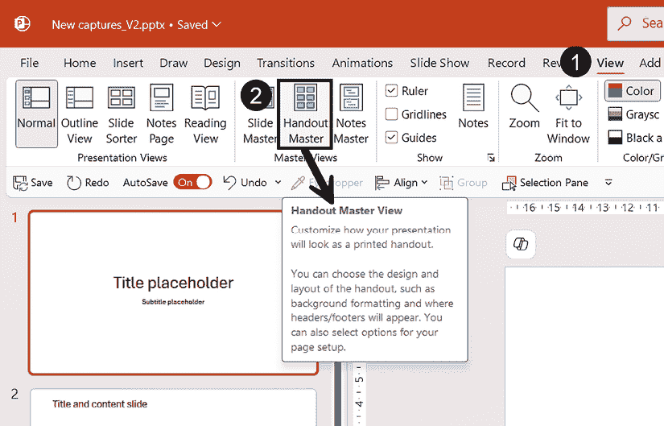

图 4.1 – 访问讲义母版

无论何时您不确定一个按钮会做什么，请花时间阅读每次您悬停在它上面时提供的工具提示，这样您将获得简短的描述，例如*图 4.1*中为**手册主视图**提供的描述。

您随后会进入**手册主视图**标签页，在那里您将能够进行所有必要的格式更改（*图 4.2*）：

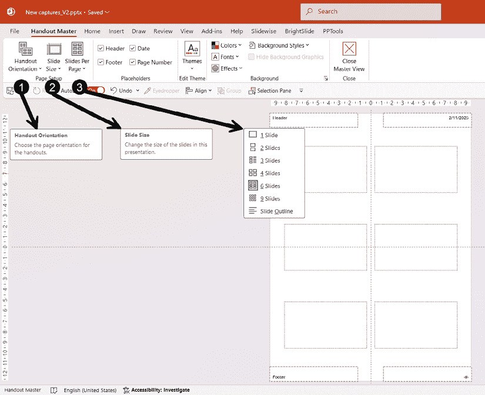

图 4.2 – 手册主页面设置

 **快速提示**：需要查看此图像的高分辨率版本？在下一代 Packt Reader 中打开此书或在其 PDF/ePub 副本中查看。

 **下一代 Packt Reader**随本书免费赠送。扫描二维码或访问[`packtpub.com/unlock`](https://packtpub.com/unlock)，然后使用搜索栏通过名称查找此书。请仔细检查显示的版本，以确保您获得正确的版本。

让我们先从讨论功能区上的前三个按钮开始：

1.  **手册方向**：您可以决定格式化手册，使内容以纵向或横向显示。您需要记住，如果您在手册主视图中更改页面方向，它也会应用于下一节中将要讨论的备注主视图。

1.  **幻灯片大小**：尽管此选项显示在您的**手册主视图**中，但请注意，如果您在此处更改它，它也会更改您演示文稿中幻灯片的大小。

    如果您仍在考虑是否应该考虑使用标准 4:3 幻灯片大小，这在旧版 PowerPoint 版本中是默认设置，我会说您只需要评估您的演示文稿将在何时何地显示。在大多数面对面和虚拟环境中，您的观众将在通常显示现代宽屏 16:9 宽高比的设备上观看您的演示文稿。宽屏格式还有优势，可以为您的内容提供更多空间，帮助您创建在幻灯片组件之间有足够空白空间的更好视觉效果。

1.  **每页幻灯片数量**：此选项允许您选择您希望在页面上显示多少个幻灯片缩略图。正如您在*图 4.2*中可以看到的，显示选项比著名的**每页 6 个幻灯片**要多。关键是选择在您做其他任何事情之前最适合您需求的选项。原因很简单：更改每页幻灯片的数量不会创建不同的品牌布局。您需要手动调整根据您选择的显示方式添加的任何额外图形元素。无论您选择哪种布局，幻灯片缩略图区域都不能移动或调整大小——它们显示为带有虚线边的矩形。

在更改任何页面设置后，您可以决定是否保留或删除页面上的任何占位符，并配置**背景**组中的任何选项（*图 4.3*）：

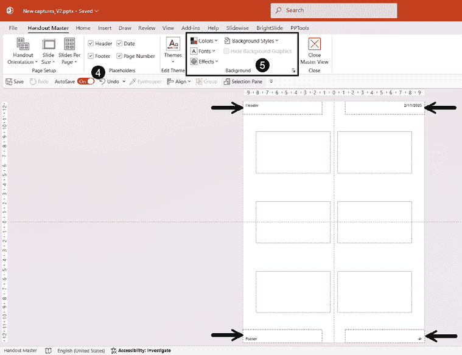

图 4.3 – 手册主布局和背景设置

1.  **占位符**：此组允许您删除或添加任何占位符。如果您在**手册主布局**页面上直接删除了其中一个，您可以通过勾选相应的复选框简单地将它添加回来。所有四个占位符都可以移动或调整大小，并格式化文本。我们将在本节稍后看到如何包括页眉和页脚内容。

1.  **背景**组：这是您可以选择颜色调色板和字体以与演示文稿中的选择保持一致的地方。不幸的是，即使您在幻灯片主布局中创建并应用了自定义颜色调色板或字体对，它也不会自动应用于手册主布局，但您可以从两个列表中轻松应用它们。如果您不记得如何创建自定义颜色或字体对，请再次查看 *第三章*。

现在我们已经介绍了手册布局的基础知识，接下来在接下来的两个部分中，我们将看到如何添加图形元素以帮助您使手册看起来更专业，并正确添加任何页眉和页脚到您的文档中。

## 向您的手册主布局添加图形元素

从手册主布局中，您可以在选择每页显示的幻灯片数量后添加任何您想要的图形元素。探索您的**插入**选项卡中可用的内容，并发挥创意！如果您想的话，可以复制您在组织 Word 文档中通常使用的任何外观。

这里是一个虚构的示例，说明您的手册主布局可能看起来像什么（*图 4.4*）：

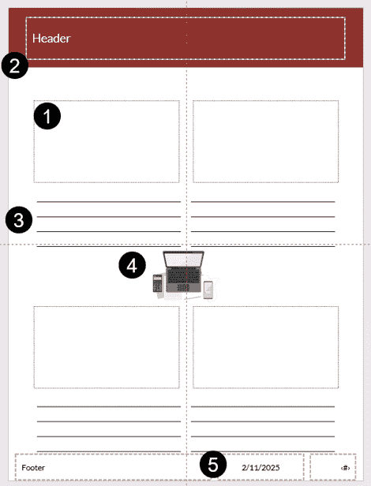

图 4.4 – 格式化手册主布局的示例

这里是我们遵循的步骤，在 *图 4.4* 中添加图形到手册主布局：

1.  我们首先选择了每页**4 张幻灯片**的布局。

1.  然后，我们更改了页眉的字体大小和颜色，并调整了占位符的大小以覆盖页面的大部分宽度。我们还添加了一个彩色矩形，并使用了在**主页**或**形状格式**选项卡中可用的**发送到后台**功能。

1.  我们在每个缩略图下方添加了水平线以容纳注释。如果您决定绘制线条，一个提高生产力的技巧是先创建前四条线，然后选择它们，按住 *Ctrl* + *Shift* 键盘键，然后点击并拖动它们到右边以创建第二组线条。现在选择两组线条，再次按住快捷键并拖动到页面底部。您还可以插入一个表格，并移除左侧和右侧的线条，使其看起来像手动绘制的线条。

1.  然后，我们添加了一个微软的库存插图。为此，转到功能区上的**插入**选项卡，然后单击**图片**按钮并选择**股票图片...**。在股票库窗口中，您可以从顶部选择几个标签页。在我们的示例中，我们导航到**插图**标签页。这个插图可以很容易地被任何公司标志或与您的内容相关的任何视觉元素所替换。

1.  最后，日期占位符被移动到页面底部并进行了格式化。完成操作后，别忘了关闭讲义母版视图。

## 添加您的页眉和页脚内容

就像在幻灯片母版中一样，您不应该在母版视图中添加您的内 容。要正确添加您的讲义页眉和页脚信息，您需要转到**插入**选项卡 | **页眉和页脚** | **备注和讲义**选项（*图 4.5*）。

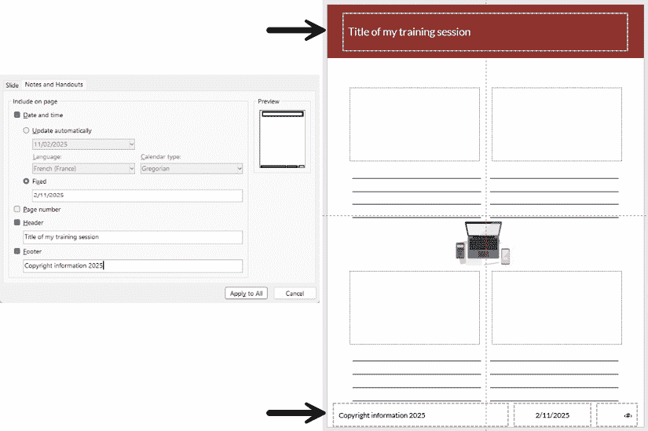

图 4.5 – 在您的讲义中插入页眉和页脚信息

您可以选择添加一个将自动更新或固定的日期。默认情况下，**页码**复选框是勾选的，这是一个很好的选择，因为我们正在创建文档，而不是幻灯片。

在我们的示例中，我们还添加了在**预览**中已精确表示的页眉和页脚占位符中的内容。唯一剩下要做的就是点击**应用到所有**按钮，这样所有页面都会以相同的方式显示。

如您所见，创建一个看起来专业的讲义不需要花费很长时间。您只需要选择能够很好地代表您的内容，同时与您的企业外观或品牌指南保持一致的元素。然而，如果您需要创建一个包含不仅仅是幻灯片缩略图的文档，下一节关于笔记母版的内容将非常有价值。

# 配置笔记母版以生成完整的讲义

笔记母版允许您为需要幻灯片图像及其下方备注的文档创建一个品牌化的外观。备注是从**正常**视图中每个幻灯片下方的备注窗格中捕获的。大多数情况下，备注是用于演讲者的，但这并不意味着它们不能用于您的观众。有一些解决方案允许您创建一个可以包含演讲者备注和讲义备注的文件，但让我们先从您应该在笔记母版中进行的更改开始。

要访问笔记母版，您需要使用**视图**选项卡并选择**笔记母版**（*图 4.6*）：

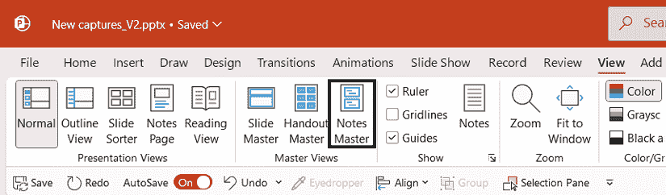

图 4.6 – 访问笔记母版

然后，您将获得**笔记母版**视图，您将能够进行所有必要的更改来自定义文档的外观（*图 4.7*）：

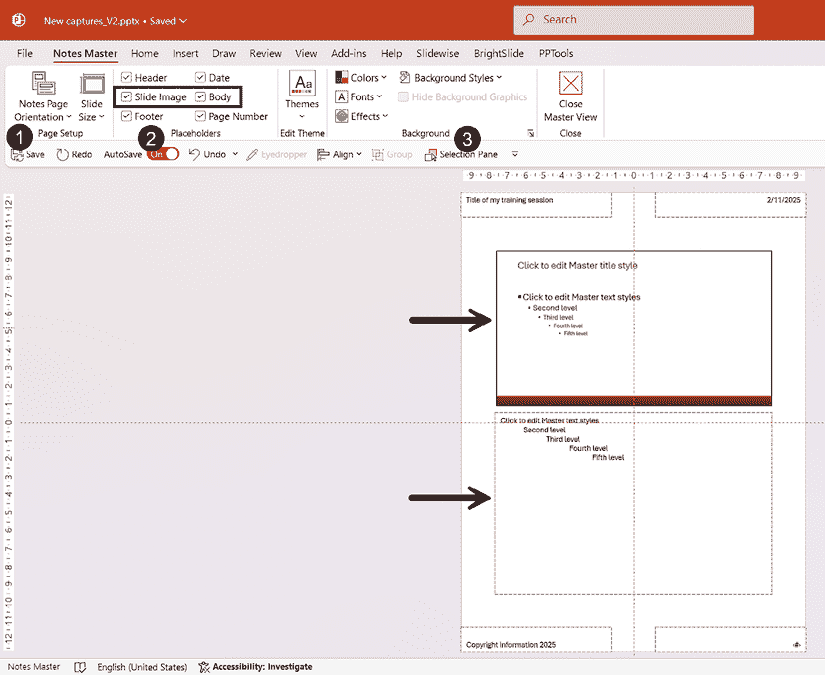

图 4.7 – 笔记母版视图

这里是**笔记母版**视图中的一些功能，可以帮助您自定义文档：

+   在**页面设置**组中，你可以像在讲义主模板中一样更改**笔记页面方向**或**幻灯片大小**（**1**）。如果你更改页面方向，请记住它也会更改你的讲义方向，如果你添加了任何图形元素，这可能会显著改变其外观。幻灯片大小也是如此：更改此设置将更改整个演示文稿的大小，这可能不是你想要的。

+   **占位符**组看起来与讲义主模板中的相似，尽管我们现在有一个用于**幻灯片图像**的复选框和一个用于**正文**的复选框（**2**）。正如你所看到的，除了*图 4.7*中的箭头外，这两个占位符占据了页面的大部分空间。优点是它们可以被移动和调整大小，帮助我们为文档创建一个自定义的外观。

+   当你在**背景**组（**3**）中时，你会注意到即使你在讲义主模板中选择了**颜色**和**字体**选项，你仍需要在这个视图中再次进行设置。只需选择你已创建的任何自定义调色板和字体对，并将它们应用到你的笔记主模板中。

现在我们已经介绍了如何访问笔记主模板及其功能和布局，我们可以继续学习如何对其进行自定义。

## 自定义你的笔记主模板

**笔记主模板**视图中的所有占位符都可以移动、调整大小和格式化。你只需选择它们，并使用任何可用的格式化工具进行更改，无论是在**主页**选项卡上还是在点击占位符时出现的**形状格式**上下文选项卡上。不幸的是，即使你已经自定义了讲义主模板，你仍需要在笔记主模板中从头开始。如果你对两个主模板的外观完全相同并不重要，那么就继续进行所有必要的更改。如果你很重要，并且想节省时间，请继续阅读。

再看看*图 4.4*中的格式化讲义主模板。你可以看到我们增加了页眉的宽度，在其下方添加了一个彩色矩形，将日期移至底部，并在所有占位符中更改了字体格式。除了页眉和页脚信息外，**笔记主模板**视图中没有保留任何内容——如果你忘记了如何添加页眉和页脚信息，请回到*图 4.5*。

自从这本书的第一版以来，我很高兴地报告说，我们可以通过从**讲义主模板**视图复制图形元素和格式化占位符并将它们粘贴到**笔记主模板**视图中来节省一些时间。以下是你可以遵循的步骤（*图 4.8*）：

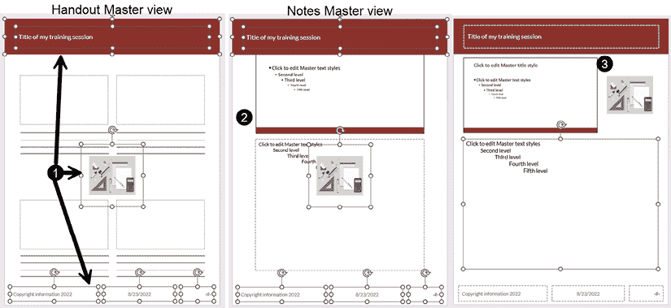

图 4.8 – 从讲义主模板到笔记主模板的复制和粘贴元素

+   打开**讲义主模板**视图，选择图形元素和格式化占位符，复制它们，然后关闭视图。（**1**）

+   打开**备注母版**视图，删除现有的页眉和页脚占位符，并将从讲义中复制的内容粘贴进去（**2**）。

+   对幻灯片图像和主体占位符进行必要的调整，包括位置和大小，并确保粘贴的图形元素也正确地进行了大小和分层（**3**）。

请注意，如果占位符被删除，并且您通过在**备注母版**视图（见*图 4.7*）中勾选**占位符**组中的复选框来重新添加它们，它们将以默认格式添加，而不是自定义格式。

如果您的讲义母版格式保持完好，您可以从那里复制并粘贴，以避免手动格式化一切。

剩下的唯一事情就是根据您的需求调整主体占位符的字体大小。如果您是为您的观众制作文档，12 磅的字体大小通常对每个人来说都很容易阅读，并且更容易容纳所有支持幻灯片的文本。

## 适应您的演示文稿文件以用于讲义和交付笔记

有时候您可能需要有自己的演示文稿笔记并为您的观众或参与者创建一个完整的讲义。有些人可能会被诱惑复制他们的 PowerPoint 文件，以便他们有一个用于演示和一个用于文档的。这确实有效，但如果您知道您需要经常更新内容，这可能成为一个耗时巨大的任务。相反，您可能想考虑尝试我们不时使用的这两个技巧。

### 在新部分中复制您的幻灯片

第一个技巧只需在您标记为`讲义`的新部分中复制您的演示文稿幻灯片，并确保该部分是您的演示文稿中的第一个部分。当您选择那些*讲义*幻灯片时，您然后可以打印选择的内容或创建一个从*#1*开始的页码的`.pdf`文件。如果您隐藏该部分中的幻灯片，您的演示文稿将从**演示**部分的第一个幻灯片开始。

完成此操作的步骤如下：

在您的幻灯片之前添加一个部分；在您的第一张幻灯片之前右键单击，然后点击**添加部分**。然后，给它起一个名字；您可以使用`讲义`。点击**重命名**以确认更改（*图 4.9*）：

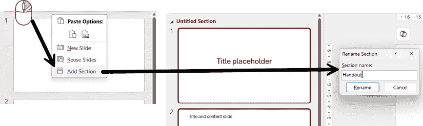

图 4.9 – 在您的 PowerPoint 文件中添加和命名一个部分

创建一个部分还有一个优点，那就是通过点击**讲义**部分名称，您可以简单地选择所有您的演示文稿幻灯片。现在，您可以复制（*Ctrl + C*）幻灯片，并在幻灯片导航窗格中的部分之后直接粘贴它们（*Ctrl + V*）。然后，您将得到一个具有相同名称的部分；右键单击它，以便能够选择**重命名部分**（*图 4.10*）。

正如您所看到的，此菜单为您提供许多其他选项，以帮助您管理您的部分，熟悉它们将有助于提高您的效率：

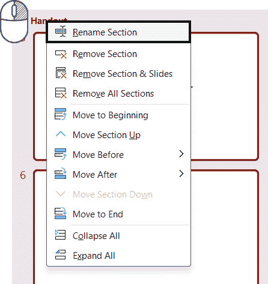

图 4.10 – 重命名部分和其他选项

你现在可以为第一部分的幻灯片添加观众的笔记，并为**演示**部分的幻灯片添加你自己的笔记。你也可以删除讲义中不需要的任何幻灯片。这样做的好处是只需管理一个文件，并且可以轻松地通过在部分之间进行简单的复制/粘贴来调整任何幻灯片的内容。

当你想要演示你的演示文稿时，确保为你的讲义部分使用**隐藏幻灯片**命令，这样它们就不会在幻灯片放映时显示。

**重要提示**

当使用这个技巧时，你应该避免在演示过程中显示幻灯片编号，因为编号将从隐藏幻灯片之后的幻灯片编号开始。如果你想知道如何在演示过程中跟踪你的幻灯片，你可以阅读*第十三章*。这个功能将帮助你跟踪你的演示，而无需显示幻灯片编号。

这种方法易于复制和处理，对于可能需要处理该文件的人来说也很容易。然而，如果你是唯一使用该文件的人，并且现在对各种母版更熟悉，你可以尝试下一个破解方法。

### 破解备注母版以生成演讲者和观众笔记

当你在**备注母版**视图中时，**幻灯片图像**占位符会自动从你的幻灯片中填充，而**正文**占位符则从你在**正常**视图中添加到幻灯片下方的笔记中。如果你在演示过程中需要空间来记录笔记，并且打印或创建`.pdf`文件时需要为观众提供信息，你需要欺骗 PowerPoint 来完成这个任务。

我们将使用以下步骤来完成这项任务：

1.  打开**备注母版**视图，并将**正文**占位符移动到画布的左侧或右侧，在灰色区域（*图 4.11*），然后关闭**备注母版**视图：

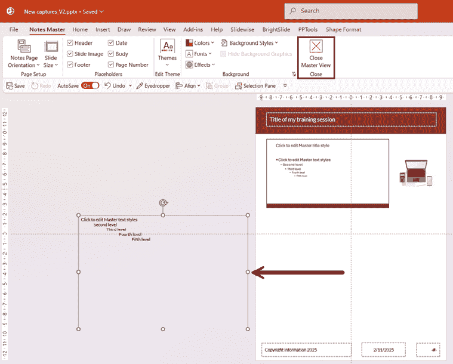

图 4.11 – 将“正文”占位符移出“备注母版”

1.  当处于**普通**视图时，您可以在幻灯片下的**笔记**面板中开始输入您的个人笔记，但您可以通过转到**视图**选项卡并单击**演示文稿视图**组中的**笔记页**来简单地切换到**笔记页**视图（*图 4.12*）。您将看到来自笔记大师的**正文**占位符，其中包含您的个人笔记或**点击此处添加文本**提示，覆盖灰色区域。现在您可以在页面上的幻灯片图像下方有一个空白区域来添加您的讲义文本。如果您使用**文本框**，它将根据您包含在其中的文本进行缩放。如果您绘制一个形状，您可以定义确切的尺寸和位置，并移除填充和轮廓，将文本对齐到形状的左上角。如果您想为人们提供自己的笔记行，您可以添加一个没有左右边框的简单单列表格：

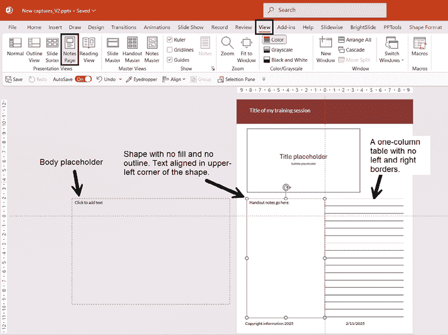

图 4.12 – 在笔记页视图中自定义您的文档

1.  在**笔记页**视图中创建的设计需要复制并粘贴到所有其他页面上，或者您可以根据每张幻灯片图像下需要包含的信息创建各种布局。

如您所见，您可以轻松创建一个演示文稿文件，它将服务于双重目的：作为您演示的视觉工具，以及为您的观众提供完整的讲义。如果您想看看它将是什么样子，*图 4.13*显示了**笔记页**视图、幻灯片中的**演示者视图**以及已适应各种用途的幻灯片的**打印预览**：

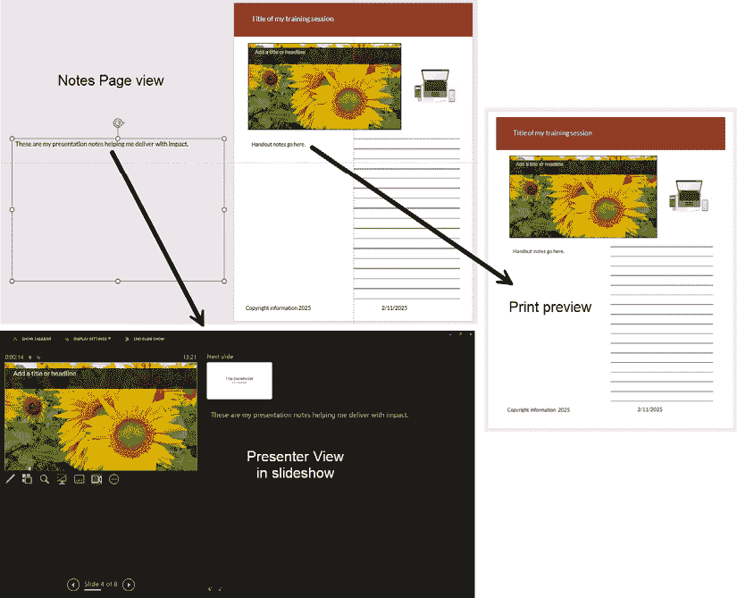

图 4.13 – 笔记大师操作结果

如果您想知道**演示者视图**是什么以及如何使用它，它将在*第十三章*中介绍。

使用讲义和笔记模板可以帮助您创建易于访问的文档，但 PowerPoint 中还有一个功能可以帮助您验证幻灯片的访问性问题，我们将在下一节简要介绍。

# 使您的演示文稿易于访问

使文档和演示文稿更具可访问性是确保有残疾的用户可以使用他们能用的各种设备（如**屏幕阅读器**）访问您的内 容。无论您的国家是否有法律或官方指南，都没有理由回避使您的文档和演示文稿可访问，因为微软已经包含了一个伟大的功能来帮助您做到这一点：**可访问性检查器**。这个功能早在**Office 2010**时就已经可用，尽管当时它不太用户友好。如果您使用的是任何现代支持的版本（Office 2021 和 2024，或 Office for M365），您将获得一个更友好的界面，帮助您跟踪可访问性问题所在以及如何解决它们。请注意，以下屏幕截图是在 PowerPoint for M365 中完成的 – 其他版本可能看起来不同或没有相同的功能。

自从本书的第一版以来，我必须说微软为那些没有任何先前可访问性知识的人添加了许多改进的体验，以帮助他们更好地创建可访问的演示文稿。这将帮助您纠正影响使用屏幕阅读器或视力不佳或色盲人士的问题。

要在您的演示文稿中显示**可访问性助手**面板，您可以在状态栏中点击**可访问性**（**1**）以打开面板及其上下文选项卡（**2**）（*图 4.14*）：

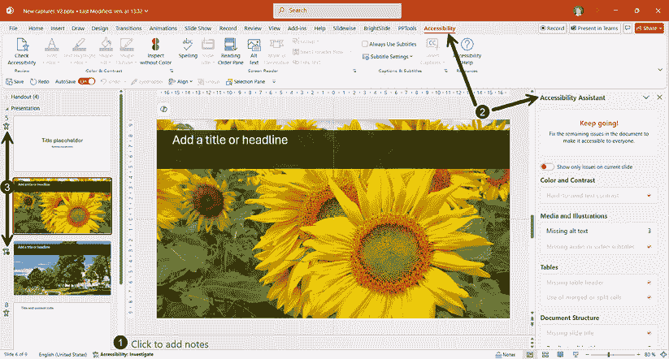

图 4.14 – PowerPoint 中的可访问性面板及其上下文选项卡

您也可以通过点击**审阅**选项卡然后点击**检查可访问性**按钮来显示它。但有一个新功能，在本书的这一版编写时仍在预览中，允许您点击任何幻灯片缩略图旁边的**可访问性**图标来查看该特定幻灯片上需要关注的内容（**3**）（*图 4.14*）。

让我们看看改进的**可访问性助手**面板，它将帮助您纠正演示文稿中的问题。面板的顶部和底部在*图 4.15*中并排显示：

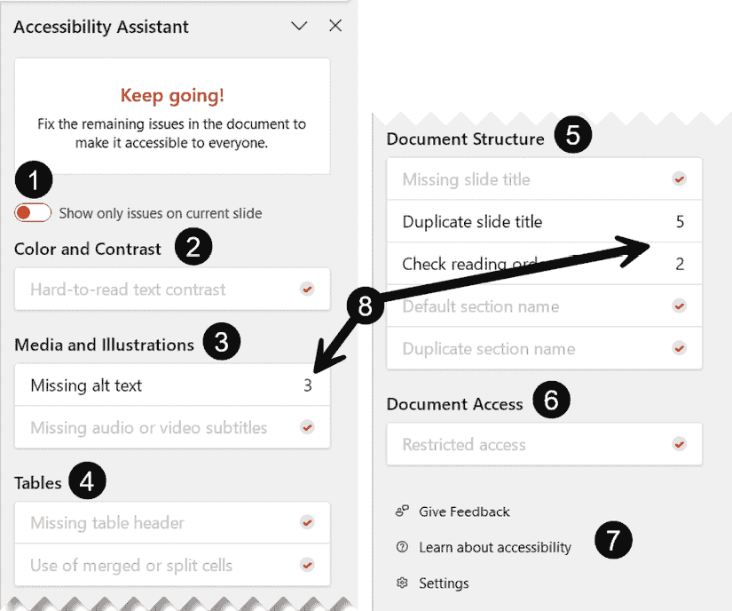

图 4.15 – PowerPoint 中的可访问性面板及其问题类别

下面是每个类别的简要描述：

1.  **仅显示当前幻灯片上的问题**切换：它允许您查看所选幻灯片的问题列表。如果您通过点击幻灯片缩略图旁边的可访问性图标显示面板，它将自动打开。

1.  **颜色和对比度**：当您的文本难以阅读但并非完全不可靠时，它将突出显示问题。勾选标记表示未找到问题。在撰写本版时，某些占位符中的文本存在未由**访问性检查器**捕获的对比度问题。请注意**标题**、**内容**、**图表**和**文本**占位符中的对比度问题。如果您在彩色形状上放置文本框，则此功能将无法正常工作 – 文本必须添加到形状本身。

1.  **媒体和插图**：它将警告您关于视觉对象缺少**替代文本**以及缺少音频或视频**字幕**。

1.  **表格**：助手将警告您，如果您的演示文稿文件中的表格没有标题行或合并或拆分单元格。

1.  **文档结构**：此类别是为了确保屏幕阅读器有一个易于理解的阅读体验。幻灯片标题和部分会被大声读出。想象一下，如果屏幕阅读器在整个部分中重复相同的标题，或者如果您的幻灯片上的对象不是按正确顺序读取的，将会多么混乱！

1.  **文档访问**：它验证您的文件是否有任何**信息权限管理**（**IRM**）或其他对屏幕阅读器造成问题的限制。

1.  **提供反馈、了解访问性、设置**：**访问性助手**面板中最后三个链接是提供关于 PowerPoint 的 Microsoft 反馈的工具（例如，报告功能未按预期工作），访问**帮助**面板了解更多关于访问性的信息，以及访问**PowerPoint 选项**中的访问性设置 – 这就是您可以在幻灯片缩略图旁边激活**访问性**图标的地方。

1.  **问题数量或勾选标记**：如果潜在问题旁边显示勾选标记，则表示没有问题。数字表示您演示文稿或特定幻灯片中的问题实例。当您点击问题类型时，它将显示潜在解决方案以及如何解决问题。

如果您首先关注**访问性助手**面板，您会发现大部分建议的解决方案都是您在**访问性**上下文选项卡中也能找到的工具。这里有一个我想指出的工具：**无颜色检查**（*图 4.16*）：

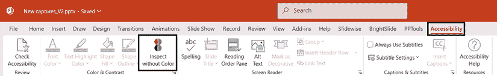

图 4.16 – 访问性选项卡中的“无颜色检查”功能

此功能允许您通过以灰度显示您的幻灯片来检查您是否仅依靠颜色来传达信息。例如，如果您决定通过仅使用不同的颜色来对幻灯片上的形状进行分类，您就会意识到如果颜色不被感知，这将变得难以理解。提高可访问性的常见方法之一是使用不同的形状和相关的颜色。

我鼓励您访问“进一步阅读”部分中分享的 Microsoft 支持网站文章，以了解更多关于在各类文档类型中需要考虑的辅助功能。

让我们继续讨论在配置了模板并检查了可访问性问题后如何打印文档。

# 打印您的文档

您可能想知道我为什么要介绍如何打印文档，尤其是考虑到大多数用户已经这样做了很长时间。尽管每个人都知道他们可以从**文件 | 打印**选项或*Ctrl + P* 打印，但许多人忽略了 PowerPoint 打印选项中隐藏的一些不错的功能，您应该了解这些功能。这些功能就是我将在本节中介绍的内容。

当您处于**打印**选项视图（*图 4.17*）时，您可以更改的不仅仅是副本数量和打印机属性：

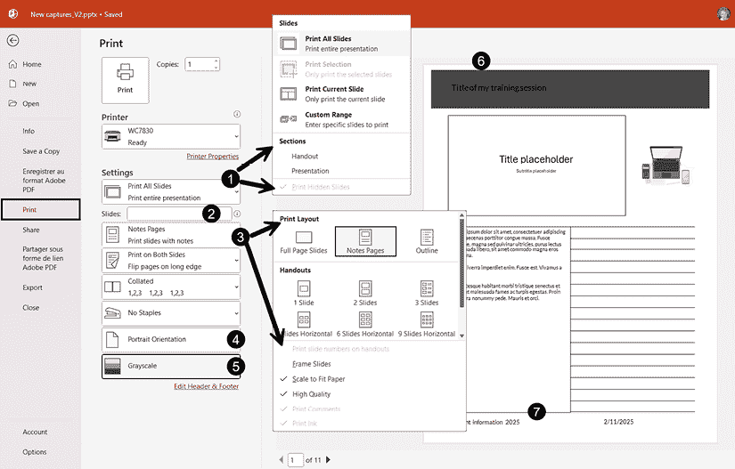

图 4.17 – PowerPoint 的打印选项视图

让我们回顾一下您可能多年来错过的关键设置：

+   选择您需要打印的内容可能您已经知道，但当我们查看下拉列表的底部时，我们有两个隐藏的宝藏（**1**）。第一个是打印演示文稿中特定**部分**的可能性。如果您已经实施了将所有幻灯片复制到单独部分以制作讲义的先前策略，您可以使用此设置轻松地仅打印该部分。如果您决定隐藏一些幻灯片但希望它们出现在打印输出中，**打印隐藏幻灯片**命令将处于活动状态，因此您可以决定是否包含它们。如果文件中已创建自定义演示，特定的部分也将允许您打印这些内容。您可以在*第十章*中了解更多关于自定义演示的信息。

+   在幻灯片范围字段（**2**）中，请记住您可以选择特定的幻灯片或幻灯片范围。例如，如果您想打印 2、4 和 6 号幻灯片，您将在字段中输入`2;4;6`。对于幻灯片范围，如 2 到 6，您将输入`2-6`。

+   您可以选择打印布局，在**全页幻灯片**和**备注页**之间进行选择，或者选择**讲义**布局（**3**）。别忘了查看列表底部的选项，以包含您想要添加的任何元素，以及您想要用于打印文档的设置。

+   在**纵向**和**横向**之间更改文档方向是直接的（**4**）。然而，您需要记住，如果您在这里更改文档方向，它也会更改讲义和备注模板的方向。如果您在模板中包含了任何图像或插图，更改文档方向将不可避免地在这个过程中扭曲它们。

+   关于**灰度**（**5**）的一些建议：如果您在单色打印机（黑白）上打印，使用灰度将得到更好的结果，但这也意味着您应该检查预览中文本对比度看起来如何。当我们查看*图 4.17*中的**6**时，我们可以看到标题几乎看不见。而查看**7**时，我们确实看到了用于备注文档的形状的轮廓。如果发生这种情况，请按照*图 4.18*中给出的步骤进行操作。

我鼓励您更仔细地探索您的**打印**设置，以确保您能获得最佳质量的文档。

## 解决灰度中的文本对比度问题

我提到了在灰度打印时可能出现文本颜色对比度问题的可能性。有时标题在深色背景上以深色显示，或者占位符或文本框中的文本无法阅读，形状的边框可能比预期的更暗。以下部分将向您展示如何解决这些问题。

### 打印手册或备注文档时的问题

手册和备注文档中的文本对比度问题通常来自文档母版。这是因为页面上显示的幻灯片是灰度幻灯片的图像。我们将像以下截图（*图 4.18*）所示修复此问题：

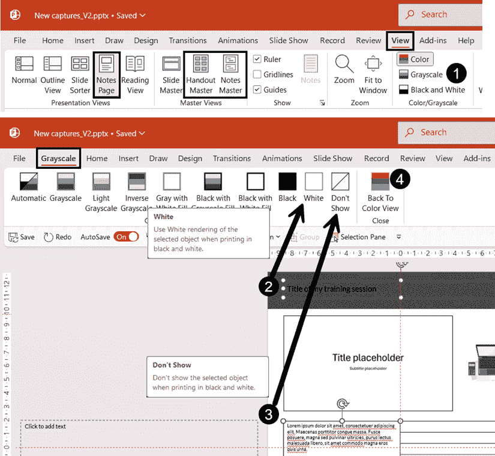

图 4.18 – 在灰度中更改设置以纠正打印问题

为了纠正这个问题，您需要按照以下步骤进行：

1.  确保您处于**备注页**视图或打开文档母版视图（**备注母版**或**讲义母版**）。然后点击**灰度**。

1.  **灰度**选项卡变为活动状态。选择对比度较差的对象，并使用功能区上的命令之一更改其颜色。在我们的例子中，**白色**产生最佳效果。如工具提示所示，它仅在打印黑白时调整颜色。

1.  如果有对象显示不应可见的轮廓，请选择它并点击**不显示**命令。

1.  点击**返回到彩色视图**以关闭**灰度**选项卡。

如果您处于文档母版视图，请关闭它，然后返回打印。现在，您修复的所有文本元素在打印预览中将显示适当的对比度，且没有轮廓。

### 打印幻灯片时的问题

如果您需要打印全页幻灯片，我建议您查看所有幻灯片的打印预览。根据内容创建的方式，您在以灰度打印时可能会遇到文本对比度问题。如果您遇到任何确实存在文本对比度问题的幻灯片，请退出打印视图，并重复前面描述的两个步骤以访问**灰度**视图。您将能够看到需要调整颜色以用于打印目的的对象。

您现在可以更好地了解可以调整哪些打印选项以获得最佳质量的文档。许多人已经停止打印文档，要么是因为环保原因，要么是因为他们发送了数字副本。下一节将帮助您了解 PowerPoint 中可用的各种 PDF 导出设置。

# 将您的文档导出为 .pdf 文件

PDF 导出功能已在 Office 应用程序中可用多年，但许多用户并不知道这些设置如何帮助他们生成各种类型的 PDF 文档。

要创建 PDF 文档，您需要使用 **文件** 选项卡进入后台视图。从那里，如果您文件保存在云端存储，您可以使用 **保存副本**；如果是本地文件，则使用 **另存为**。我首选的方法是 **导出** 功能（*图 4.19*）：

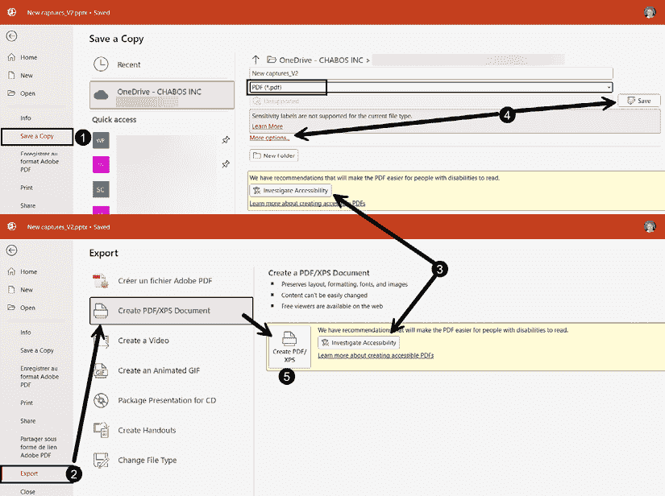

图 4.19 – 从 PowerPoint 文件创建 PDF

1.  您可以使用 **保存副本** 命令，并在文件类型下拉列表中选择 **PDF**。

1.  您还可以使用 **导出** 命令，然后选择 **创建 PDF/XPS 文档** 选项。

1.  在这两种情况下，如果您缺少任何元素以创建可访问的 PDF，您可能会看到一个 **检查可访问性** 按钮。

1.  当您在 **保存副本** 部分点击 **保存** 按钮时，如果您的目标没有改变，它将自动在 PowerPoint 文件相同的文件夹中创建 `.pdf` 文件。这可能看起来是一种快速高效的方法，但它将自动创建包含全页幻灯片的文档。要能够更改文档格式，您需要点击文件格式下方的 **更多选项...** 链接。

1.  在 **导出** 部分点击 **创建 PDF/XPS** 按钮将使您通过一次鼠标点击获得更多灵活性。

经过前面的步骤后，您将获得 **发布为 PDF 或 XPS** 窗口，该窗口将提供通过 **选项** 按钮访问额外发布选项的权限（*图 4.20*）：

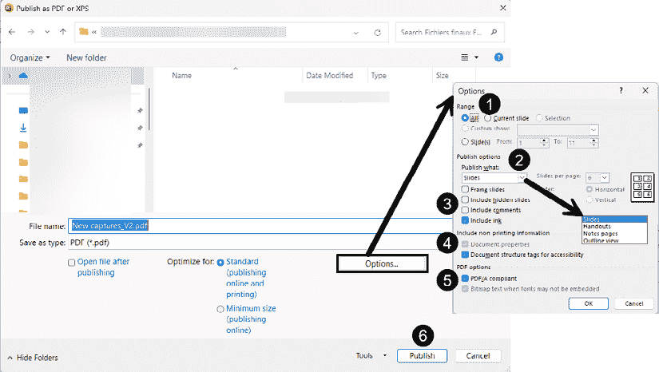

图 4.20 – PDF 发布选项

让我们来看看您可用的选项列表，以满足您的需求：

1.  在 **范围** 部分，您可以决定您想要在 `.pdf` 文件中的哪些幻灯片。如果您在文件中创建了任何 **自定义演示**，您也可以选择一个来创建特定的 `.pdf` 文件。

1.  在 **发布选项** 中，您可以配置的第一个元素是您是否想创建 **幻灯片**、**讲义** 或 **备注页** 的 `.pdf` 文件。当选择 **讲义** 时，灰色选项将变为活跃状态，允许您选择每页的幻灯片数量以及它们的打印顺序。

1.  以下四个复选框为您提供选项，以打印一些特定元素，例如您添加的任何隐藏幻灯片、注释或墨迹笔记。

1.  **包含非打印信息**部分通常默认选中了选项。您应保持原样，以确保人们可以在属性中追踪`.pdf`文件的创建过程，并使您的文档通过结构标签对屏幕阅读器友好。

1.  在**PDF 选项**部分，第一个选项应该被添加以确保您的`.pdf`文件在未来无论使用什么应用程序或其版本都能保持可读性——在较新版本中应默认选中。第二个选项默认选中以确保您使用的任何字体都能正确显示，即使它们无法嵌入。

1.  当您已验证所有选项后，剩下的唯一操作就是点击**发布**按钮。

如果您在演示文稿文件中使用了可变字体类型，当您将文件保存为 PDF 时可能会遇到字体渲染问题。正如在*第二章*中提到的，帮助您理解潜在字体问题的最佳资源是 Julie Terberg 关于选择字体的白皮书。在*进一步阅读*部分查找她的 PDF 链接。

您现在对如何从演示文稿文件中创建更好的文档以及如何使您的内容更具可访问性有了更清晰的理解。在*第五章*中，我们将学习如何借助 Copilot for M365 开始一个演示文稿。

# 摘要

在本章中，我们讨论了 PowerPoint 的文档母版，以帮助您从主要演示文稿文件中创建讲义和笔记，以及如何打印它们并创建 PDF 文档。您现在拥有足够的知识来利用这些母版，以便创建专业外观的文档和视觉幻灯片用于您的演示。

我将在幻灯片母版中重复上一章的内容：即使您认为这会花费您太多时间，我也可以保证这是值得的。花些时间正确格式化文档母版，从长远来看会节省您的时间。将所有需要的内容放在一个格式正确的文件中，也会让您免于管理多个文件的烦恼。

在下一章中，您将学习关于 Microsoft 365 Copilot 以及它在 PowerPoint 中的功能。我们将讨论良好提示的基础，这是如果您希望 AI 生成更相关内容并借助 Copilot 开始创建内容所必需的技能。利用 AI 是一个*聪明的起点*，可以加快演示文稿创建过程，但我们也会讨论其在设计最佳实践方面的局限性。

# 进一步阅读

+   关于可访问性检查器的更多信息：[`support.microsoft.com/en-us/office/improve-accessibility-with-the-accessibility-checker-a16f6de0-2f39-4a2b-8bd8-5ad801426c7f`](https://support.microsoft.com/en-us/office/improve-accessibility-with-the-accessibility-checker-a16f6de0-2f39-4a2b-8bd8-5ad801426c7f)

+   关于无障碍助手附加信息：[`support.microsoft.com/en-us/topic/improve-accessibility-in-your-documents-with-the-accessibility-assistant-f01562ca-0119-40ad-8dd6-f6223df50bef`](https://support.microsoft.com/en-us/topic/improve-accessibility-in-your-documents-with-the-accessibility-assistant-f01562ca-0119-40ad-8dd6-f6223df50bef)

+   关于如何编写替代文本的信息：[`support.microsoft.com/en-us/office/everything-you-need-to-know-to-write-effective-alt-text-df98f884-ca3d-456c-807b-1a1fa82f5dc2`](https://support.microsoft.com/en-us/office/everything-you-need-to-know-to-write-effective-alt-text-df98f884-ca3d-456c-807b-1a1fa82f5dc2)

+   关于如何使您的内容对每个人可访问的附加信息：[`support.microsoft.com/en-us/office/make-your-content-accessible-to-everyone-ecab0fcf-d143-4fe8-a2ff-6cd596bddc6d`](https://support.microsoft.com/en-us/office/make-your-content-accessible-to-everyone-ecab0fcf-d143-4fe8-a2ff-6cd596bddc6d)

+   朱莉·特伯格关于在 PDF 格式中选择字体的白皮书：[`designtopresent.com/2024/07/31/choosing-fonts-for-powerpoint-templates-august-2024/`](https://designtopresent.com/2024/07/31/choosing-fonts-for-powerpoint-templates-august-2024/)

|

#### 现在解锁此书的独家优惠

扫描此二维码或访问 `packtpub.com/unlock` ，然后通过书名搜索此书。 |  |

| **注意** *：在开始之前准备好您的购买发票。* |
| --- |
