# 5

# 使用 M365 Copilot 开始您的演示文稿

在 2023 年秋季，微软将其 Copilot for M365 作为协作和生产力工具引入其 Microsoft 365 商业环境中。因此，即使您个人没有使用 Copilot for M365，您可能也听说过微软的**人工智能**（**AI**）助手。值得一提的是，自其推出以来，微软已经将该功能重新命名为**Microsoft 365 Copilot**，并在应用程序中使用时简单地称之为**Copilot**。从现在起，我们将使用这个新名称。

在 PowerPoint 中，Copilot 仍然需要被视为**助手**，因为它仍然无法产生与您迄今为止学到的最佳演示文稿实践相一致的内容。我经常称它为**智能起点**。

写关于一个会随着时间的推移而不断改进的人工智能助手的文章，一开始似乎是一项艰巨的任务。但本章选择的主题将帮助您学习 PowerPoint 中 Copilot 的基础知识，无论它如何演变。

在本章中，我们将讨论以下主题：

+   学习 Copilot 在 PowerPoint 中能做什么

+   理解良好提示的基本知识

+   使用 Copilot 创建新演示文稿

+   使用 Copilot 修改和总结演示文稿

# 技术要求

本章中描述的 PowerPoint 中的 Copilot 功能需要 Microsoft 365 许可证和 Microsoft 365 Copilot 扩展许可证。一些建议的提示可以在 2025 年 2 月向商业用户提供的免费版本**Microsoft 365 Copilot Chat**中使用，但不会提供幻灯片内容创建功能。此外，请注意，由于微软持续改进应用程序和 Copilot，本版编写时提供的功能可能与您未来看到的不同。有关 Microsoft 365 Copilot 许可要求和定价的更多信息，请参阅*进一步阅读*中的链接。

# 学习 Copilot 在 PowerPoint 中能做什么

在我们讨论 Copilot 在 PowerPoint 中的功能之前，让我们先尝试解开许可和名称的谜团。访问 Copilot 的第一个要求是拥有 Microsoft 365 订阅。这意味着您的组织、雇主或学校购买了许可证，以便用户可以访问微软的协作应用程序和环境。第二个要求是购买附加的 Copilot 许可证，这将使用户能够访问几个微软应用程序中的各种 AI 功能——在我们的案例中是 PowerPoint。要求的一个视觉总结可以在*图 5.1*中看到：

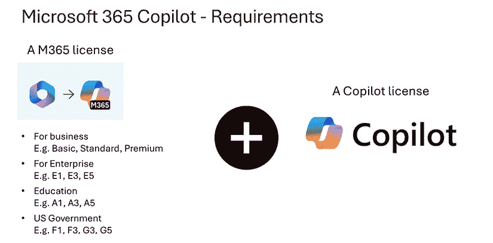

图 5.1 – 在 PowerPoint 中使用 Copilot 的要求

如果你拥有**Microsoft 365 个人版**或**Microsoft 365 家庭版**许可证，2025 年的价格已经调整，以便自动包括应用程序中对 Copilot 的访问权限。本章包含的描述和截图是使用商业或企业订阅完成的，这可能与个人使用许可证不同。你无法使用任何永久性 Microsoft Office 许可证（2021、2024）添加 Copilot，并且一些组织可能会完全阻止对 Copilot 的访问。让我们继续讨论 Copilot 是什么以及它能做什么。

## 定义 Copilot 及其基本功能

Copilot 是一种基于 **GPT-4/GPT-5** 的 AI 技术，代表 **生成预训练转换器**。简单来说，这意味着它是一个使用来自互联网的大量文本数据预先训练的模型。然后它从更具体的数据中学习，例如用户与助手的对话，并使用所学到的知识为新对话生成答案。

重要的是要注意，尽管 Copilot 的 AI 可以生成信息和有帮助的回复，但它并不像人类那样理解单词和短语的含义。答案基于训练期间学习的模式，而不是基于真正的理解或意识。此外，除非在对话中明确提供，否则 Copilot 的 AI 无法访问个人信息或组织信息。对于商业用途，Copilot 将主要使用你的业务数据和文件来帮助你完成日常任务，尽管它也可以搜索网络以帮助你，同时仍然保护你的组织数据。根据你组织的 IT 管理员，网络搜索可能会受到限制或不可用。

总体而言，你的 Copilot 助手可以完成一系列的任务：

+   **多语言辅助**：它可以帮助你理解或用另一种语言进行交流。

+   **内容生成**：它可以帮助你生成演示文稿草案，改进你的内容，并快速生成现有内容的摘要。

+   **搜索信息**：这可以帮助你在组织中找到多种类型的信息，例如文件和对话，或者搜索网络以添加统计数据或详细说明某个主题。它还可以帮助你思考观众可能提出的问题。

+   **创建图形元素**：它可以帮助你从组织的数据中创建新的图像或图形元素。

我们将在接下来的部分中看到 PowerPoint 特定的示例，但在我们到达那里之前，让我们通过下一节关于提示的部分来学习如何与 Copilot 进行对话。

# 理解良好提示的基本要素

使用 Copilot 提高生产力意味着熟悉如何通过精确的请求与助手交流，这些请求被称为**提示**。提示使用自然语言创建，就像你与人交谈时一样。这些提示必须清晰、精确，并与你的目标相关。

如同在 Microsoft 的文档《了解 Copilot 提示》中提到的（见*进一步阅读*中的链接），提示中有四种类型的信息可以改善 Copilot 的结果：

+   **目标**：告诉 Copilot 你期望的结果是什么，例如文档、列表、摘要或演示文稿

+   **上下文**：解释你需要信息的原因（例如，会议、报告等）以及它是为谁准备的

+   **语气**：解释在回复中应使用的语气（例如，针对利益相关者、针对学员、针对同事等）

+   **来源**：精确地询问你想要的信息来源，无论是网络、你组织中的文档、Teams 中的讨论，等等

你需要时间来适应这种新的提问方式，因为如果继续使用在浏览器搜索引擎中使用的关键词方法，Copilot 将不会给出好的结果。在你发送了第一个提示之后，继续进行对话！如果 Copilot 的回复不完整，请说明。如果回复不准确，请说明。你越像询问同事帮忙一样精心制作你的提示，你的结果就会越好。

如需了解如何使用提示并充分利用 Copilot for Microsoft 的帮助，请参阅*进一步阅读*部分。

我们不会在上下文中分享提示示例，而是在即将到来的部分中，我们将与 Copilot 能为我们完成的特定任务一起分享它们。让我们从创建一个新的演示文稿开始。

# 使用 Copilot 创建新的演示文稿

我们在*第一章*中讨论了规划演示文稿内容的重要性，并看到当我们从以幻灯片为思考方式转向关注叙事和故事时，它如何改善我们的内容。让我们看看我们可以在 PowerPoint 中找到 Copilot 的哪里，并讨论本章余下部分将使用的术语。

有三种方式可以访问 Copilot 的功能（*图 5.2*）：

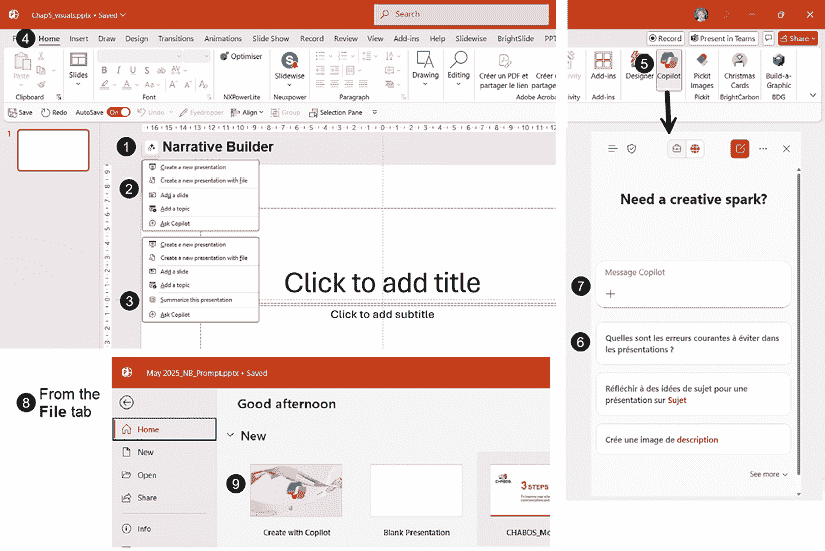

图 5.2 – 在 PowerPoint 中访问 Copilot

+   **叙事构建器**：位于幻灯片上方图标的名字叫做**叙事构建器**（**1**）。当你点击它时，你会得到一个上下文菜单，其中包含 Copilot 可以完成的任务。

请将*图 5.2*视为一个起点，它将随着时间的推移而发展，其中选项可以被重命名或添加新的选项。从全新文件的第一张幻灯片开始，它将建议**创建一个新的演示文稿**、**创建一个新的演示文稿并添加文件**、**添加幻灯片**、**添加主题**和**询问 Copilot**（**2**）。从任何包含内容的现有文件中的任何幻灯片，它将建议相同的选项，并额外添加一个：**总结这个演示文稿**（**3**）。

+   **Copilot 聊天窗格**：当您处于**主页**标签（**4**）时，如果没有安装任何插件，**Copilot**按钮（**5**）将是工具栏最右边的一个。点击它将打开 Copilot 聊天窗格，其中提示通常作为起点列出（**6**）。提示字段（**7**）包含一系列将在本章的*使用 Copilot 修改和总结演示文稿*部分中解释的工具。

建议的提示语言将取决于您的操作系统语言，这就是为什么示例中的提示以法语列出。这并不是问题，因为 Copilot 是多语言的。

+   **从文件标签（8**）：无论您处于**主页**还是**新建**，您都可以访问一个**使用 Copilot 创建**的瓷砖（**9**），它会打开一个新窗口，Copilot 窗口已打开，准备好添加您的提示。

**免责声明**：由于本章在出版前处于最终审查阶段，许多 Copilot 的更改已经发生。在以下部分，一些图表已经更新，以反映最重要的和最新的更改。其他可能包含早期版本的图标和任务列表，但结果将是相似的。

如果您尝试从 Copilot 聊天窗格创建新的演示文稿，它将首先创建一个文本大纲，然后您将获得一个建议的提示来创建演示文稿。我首选的方法是使用 Narrative Builder 从提示创建新的演示文稿，这是我们接下来要讨论的主题。

## 使用 Narrative Builder 和提示创建新的演示文稿

让我们讨论如何在 Narrative Builder 中使用提示创建新的演示文稿。在点击 Narrative Builder 图标并选择**创建新的演示文稿**选项（**1**）后，将打开一个新窗口，其中提示框包含提示的开始部分：**创建一个关于的演示文稿**（**2**）（*图 5.3*）：

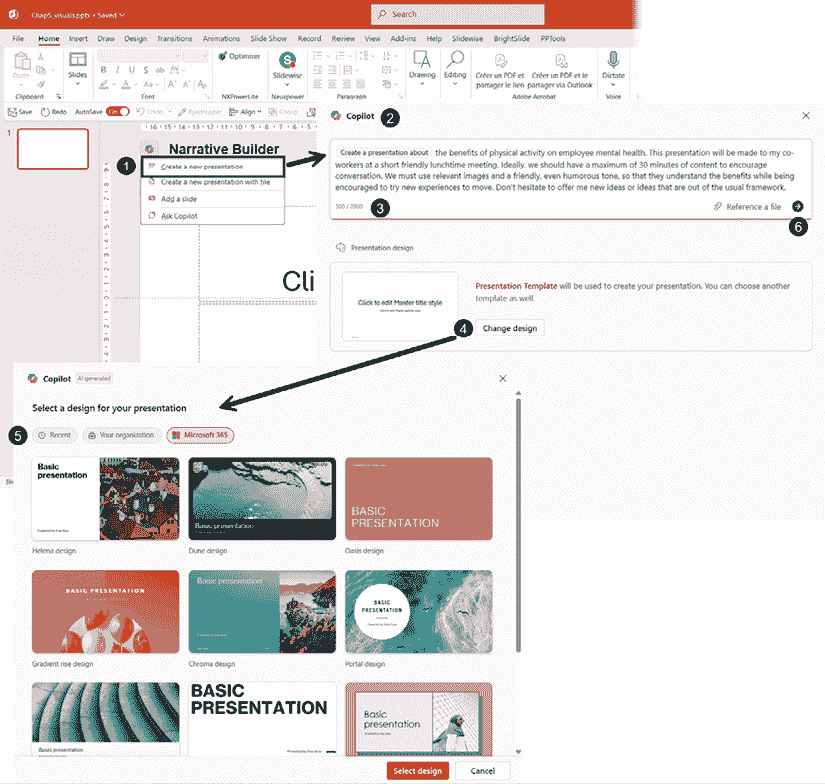

图 5.3 – 使用 Narrative Builder 和提示创建演示文稿

如前一个提示中所示，我们向 Copilot 提供了目标、上下文和要使用的语气。我们没有指定来源，因为这涉及到应在网络上搜索的信息。它使用了 Narrative Builder 中提示可用字符限制的 500 个字符（**3**），这个限制可能会随着工具的演变而改变。

作为 Copilot 以闪电般的速度进化的证明，在撰写本章初稿之后，微软推出了一项重大改进：通过**更改设计**按钮（**4**）应用我们想要的模板。这会打开一个新窗口，允许我们从**最近**、**您的组织**或**Microsoft 365**模板（**5**）中进行选择。如果您需要在 PowerPoint 中添加组织或自定义模板到您的列表中，请参阅*进一步阅读*中列出的微软文章。

最后一步是点击箭头以开始生成内容（**6**）。*注意*：由于微软的开发团队正在对 Copilot 进行开发，因此建议的 Microsoft 365 模板列表会有很大的变化。请预期它可能与图 5.3 中显示的内容不同。

**试试看**

了解 Copilot 的最佳方式是亲自尝试。开始一个新的空白演示文稿并将其保存到 OneDrive 或 SharePoint，这样你可以轻松地共享它以进行协作或返回到上一个版本。然后，使用以下提示： 

`创建一个关于员工心理健康活动益处的演示文稿。这个演示文稿将在一个简短的友好午餐时间会议中向我的同事展示。理想情况下，我们应该有最多 30 分钟的内容来鼓励对话。我们必须使用相关的图片和友好、甚至幽默的语气，以便他们在尝试新的运动体验的同时理解益处。不要犹豫，给我提供新的想法或超出常规框架的想法。`

在 Copilot 完成生成你的演示文稿大纲后，叙事构建器窗口将显示一系列工具，允许你在生成幻灯片之前更改多个元素（*图 5.4*）：

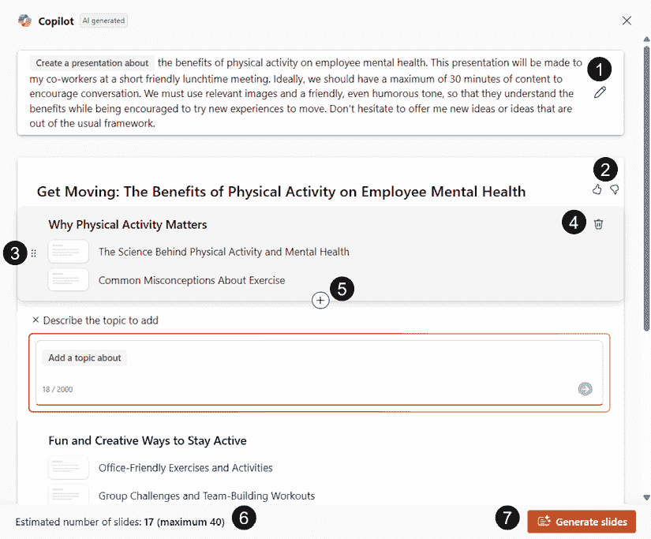

图 5.4 – 使用叙事构建器工具处理大纲

1.  **编辑提示**：阅读完第一个建议的大纲后，你可以简单地编辑你的提示以生成新的大纲。

1.  **喜欢/不喜欢**：这些图标允许你向微软发送关于 Copilot 生成内容的反馈。如果您的组织 IT 部门已禁用发送此类反馈或微软取消此功能，则此功能可能不可用。

1.  **重新排序主题**：Copilot 创建的主题将成为你演示文稿中的一个部分。幻灯片图标显示了每个部分的幻灯片数量及其标题。当你悬停在主题上时，左侧的虚线图标可以用来点击并拖动它。你可以按任何方式重新排序建议的主题。

我的建议是仔细阅读所有建议的主题及其内容，并决定它们是否与你想传达的信息相符。抵制简单创建幻灯片以处理内容相关性的冲动。作为人类，当我们开始处理幻灯片时，我们的大脑就会进入设计模式，而不是专注于内容。抵制！

1.  **删除主题**：如果你觉得某个主题不相关，只需在悬停在主题上时，点击右侧可见的**回收站**图标将其删除。

1.  **添加新主题**：当你悬停在某个主题上时，一个加号（**+**）图标允许你将新主题添加到建议列表中。点击该图标会添加一个新提示框，你可以在这里输入关于主题的信息，并让 Copilot 生成内容。

1.  **估计幻灯片数量**：在叙事构建器窗口底部，您可以看到将要添加到文件中的估计幻灯片数量。如您所见，撰写本版时的幻灯片限制是**40**。如果您需要构建更大的幻灯片集，您需要在生成第一稿内容后添加内容。

1.  **生成幻灯片**：当您完成调整提出的概要后，点击**生成幻灯片**按钮，协作者将开始幻灯片创建过程。

在协作者幻灯片创建过程中，叙事构建器窗口显示带有各种消息的灰色缩略图，例如**构建一个引人入胜的故事...**。您可以通过按键盘上的*Esc*键或点击**停止生成**按钮来停止这个过程（*图 5.5*）：

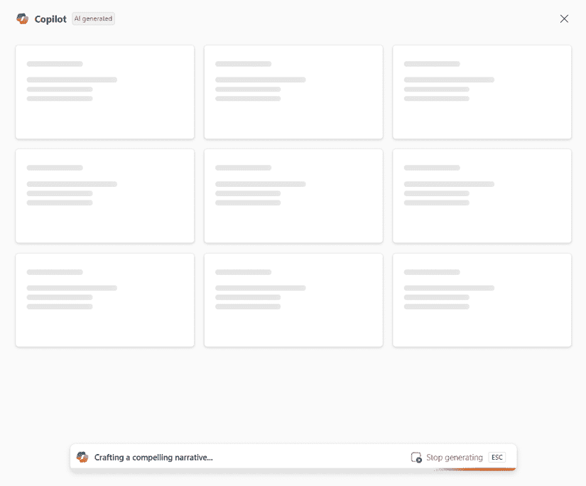

图 5.5 – 协作者幻灯片生成过程

当幻灯片创建过程完成后，您将看到幻灯片排序视图中的幻灯片（**1**）（*图 5.6*）：

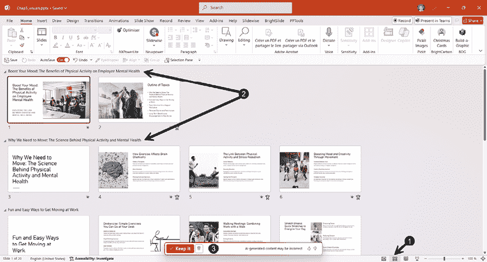

图 5.6 – 在幻灯片排序视图中查看生成的幻灯片

协作者还包含了一个介绍幻灯片，并为您在概要中接受的每个主题创建了部分（**2**）。您必须点击**保留**按钮或删除图标（**3**）以继续或重新开始。

请记住，您可能会多次使用相同的提示符并得到不同的结果，无论是概要还是生成的幻灯片。无论协作者生成什么，您的演示文稿还没有完成，准备好交付。直接使用它将导致一个远非有影响力的演示文稿。此外，协作者随着时间的推移也在不断改进，这会影响您得到的结果。我在撰写本章时亲身体验了这一点，从最初的草稿到几个月后的完整修订。部分幻灯片的文本更少，视觉和布局选择更加一致。您可以在*图 5.7*中亲自查看：

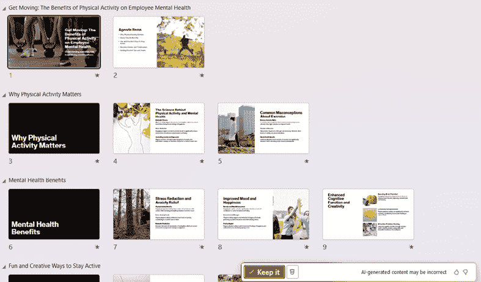

图 5.7 – 使用相同提示符随时间演变协作者生成的结果

仔细查看协作者生成的幻灯片，我们通常会发现以下设计元素，这些元素与在*第二章*中讨论的最佳实践不符（*图 5.8*）：

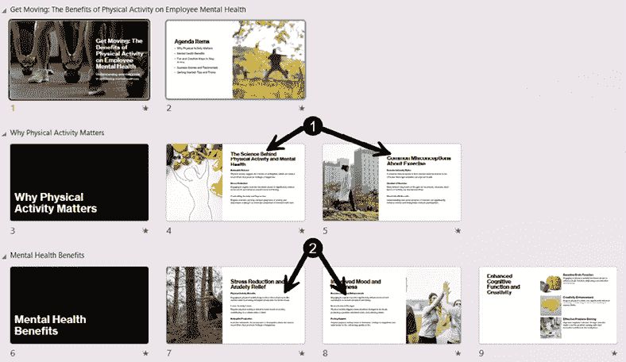

图 5.8 – 检查与幻灯片设计最佳实践的符合度

+   使用**标题大小写**而不是**句子大小写（1**）的标题。

+   文本段落中字体太小，不适合用于演示投影（**2**）。

我很高兴看到 Copilot 生成的幻灯片在视觉上与演示文稿的上下文更加一致，而且 Copilot 似乎也不再建议使用全大写的文本块了！如果你确实收到了包含全大写文本的建议，请确保评估其可读性。

结果有所改善，但仍然需要在 Copilot 生成的幻灯片上做大量工作，以使其更具吸引力。我们将在即将到来的*使用 Copilot 修改和总结演示文稿*部分中讨论 Copilot 可以和不能做出的更改和调整。但首先，让我们讨论如何从文件开始使用叙事构建器创建演示文稿。

## 从文件创建叙事构建器中的新演示文稿

即使它仍然需要一些调整，但我最喜欢的使用 Copilot 开始新演示文稿的方式是使用现有的 Word 文件。我发现，在 Word 中使用 Copilot 创建演示文稿的结构和内容草案，可以给我提供诸如以多个现有文件作为起点进行引用和重写段落等功能。即使 PowerPoint 中的 Copilot 持续改进，并可能最终拥有 Word 中的类似功能，我仍然认为在不打开 PowerPoint 的情况下创建你的叙述和故事是一个好主意。

正如我们在*图 5.3*中看到的，当使用叙事构建器创建新演示文稿时，我们首先点击叙事构建器图标以打开其提示窗口。以引用文件作为起点可以通过两种方式完成（*图 5.9*）：

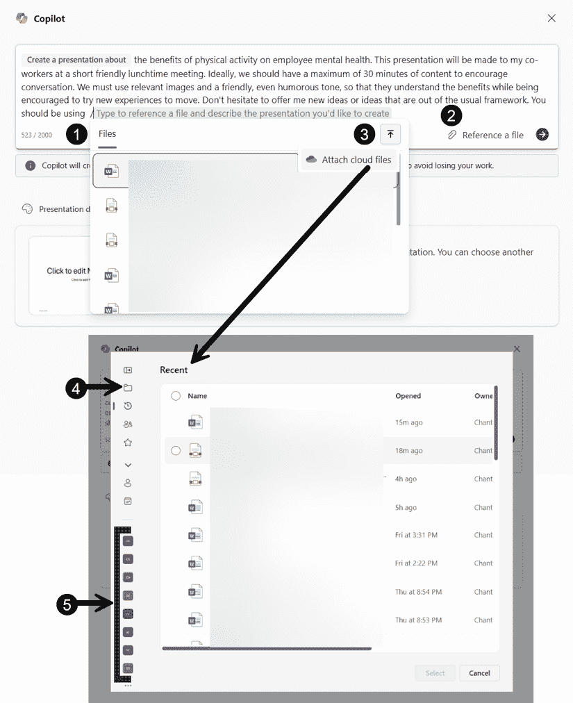

图 5.9 – 在叙事构建器中引用文件

+   输入一个正斜杠（`/`），然后在最近文件列表中选择文件名称，或者开始键入文件名称以帮助 Copilot 在您的环境存储（OneDrive 或 SharePoint）中搜索它（**1**）。

+   点击引用文件图标（** **）以获取最近文件列表或开始键入文件名称（** 2 **）。

在这两种情况下，您还可以访问**附加云文件**选项（**3**），它将打开您完整的最近文件列表。它还允许您浏览您的 OneDrive 文件（**4**）以及您可以访问的 SharePoint 站点（**5**）。

在撰写本版时，仅支持 Word 和 PDF 文件格式，并且在一个提示中只能引用一个文件。请注意，截至 2025 年 5 月，最大文件大小为 10 MB。

幻灯片生成过程是相同的，但我发现以这种方式创建的幻灯片通常文本较少，尤其是在引用的 Word 文件使用标题样式创建时。但，话又说回来，我可能只是运气好，Copilot 在启用此功能时生成的幻灯片文本较少。你需要亲自测试几次，看看它的行为，并且**始终**阅读 Copilot 建议的内容，以确保它是真实的并且与你想传达的信息一致。

你也可以简单地要求 Copilot 从参考文件创建你的演示文稿，而不使用长而详细的提示。你将得到的结果将始终取决于参考文件的结构和 Copilot 当天的行为。在测试本章的各种提示时，我得到了各种结果，生成的提纲从 3 张幻灯片到 23 张幻灯片不等。

如果你尝试从一个包含大量内容和许多标题的文件创建演示文稿，使其无法适应 Copilot 的 40 张幻灯片限制，它将为你提供**查看更多主题**选项（**1**）（*图 5.10*）：

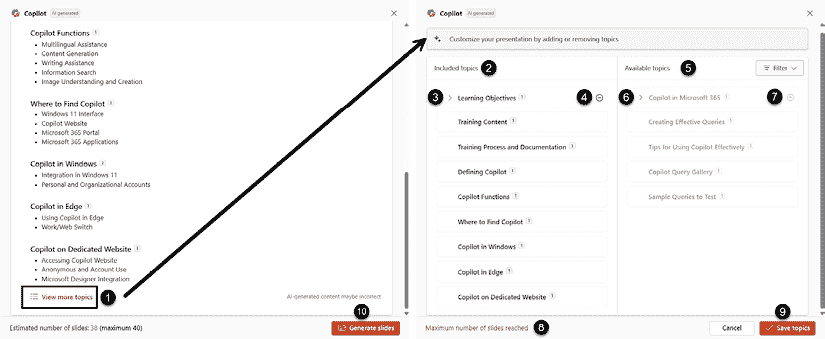

图 5.10 – 查看和选择 Copilot 幻灯片生成主题

如果估计的幻灯片数量接近最大值，但你没有看到**查看更多主题**，则将鼠标滚动到建议主题列表的底部。当点击链接时，将打开一个新窗口，其中包含**通过添加或删除主题自定义您的演示文稿**选项，并允许您包含以下元素：

+   一个**包含主题**（**2**）的列：当鼠标悬停在主题上时，将显示一个箭头（**3**），允许你在点击时查看内容的列表，以及一个减号图标（**4**）将主题发送到**可用主题**列。

+   一个**可用主题**（**5**）的列：同样，当鼠标悬停在主题上时，你可以点击箭头查看内容的列表（**6**）和一个加号图标（**7**）将主题添加到**包含主题**列。当它变灰时，意味着你必须先删除一个主题才能包含新的主题。

+   查看窗口底部将告诉你是否已达到可以生成的最大幻灯片数量（**8**）。

+   当你完成添加和删除主题后，点击**保存主题**（**9**）然后点击**生成幻灯片**（**10**）以获取你的草稿演示文稿。

无论你使用什么方法，你都需要亲自尝试并看看哪种最适合你试图创建的内容类型。如果你第一次没有得到你想要的结果，再试一次，因为 Copilot 很少每次尝试提示时都创建完全相同的内容。

现在我们来讨论使用现有模板创建新演示文稿的过程，无论是 Microsoft 提供的模板还是你组织的模板。

## 使用现有模板通过 Copilot 创建新的演示文稿

如果您通常从常规`.pptx`示例文件开始新的演示文稿，您仍然可以使用 Copilot 创建新内容。您将能够使用我们之前讨论的叙事构建器，并将有类似的经验（*图 5.11*）：

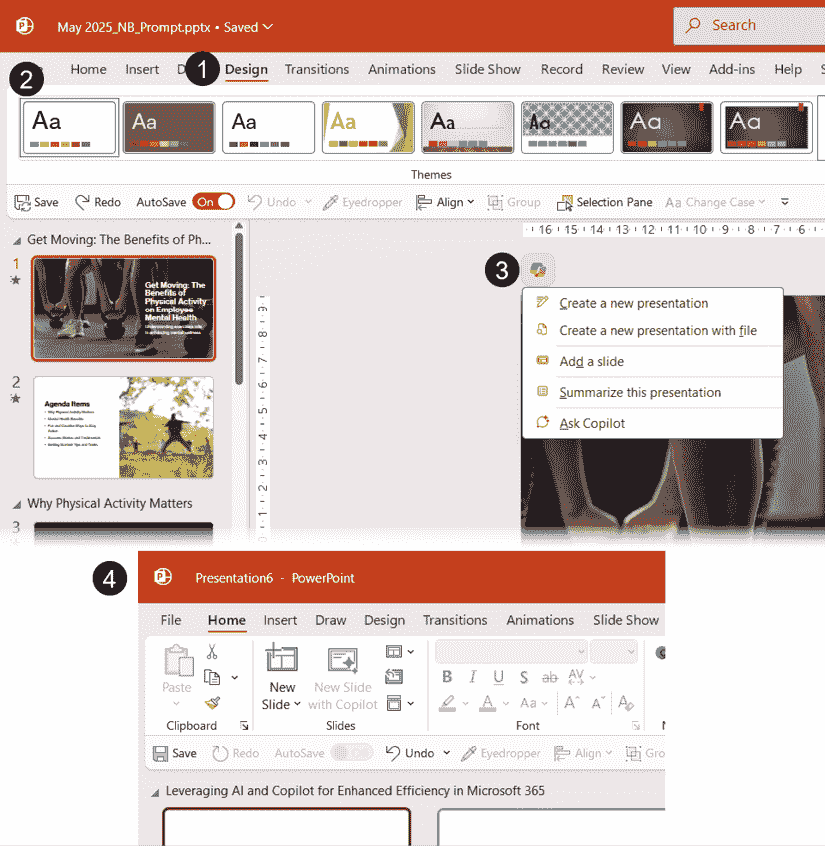

图 5.11 – 使用现有模板创建 Copilot 演示文稿草稿

+   按照您通常的方式打开您的文件。如果您转到**设计**选项卡（**1**），您将看到应用于您的演示文稿的主题（**2**）。

+   由于它是一个现有文件，**叙事构建器**（**3**）提供了以下选项：**创建新的演示文稿**、**使用文件创建新的演示文稿**、**添加幻灯片**、**总结此演示文稿**、**询问 Copilot**。*注意*：**添加主题**已被添加到任务列表中。

+   当您创建一个新的演示文稿时，无论是从提示还是从文件开始，您将经历我们之前描述的所有步骤，除了 Copilot 将生成一个全新的文件，在我们的例子中是**Presentation6**（**4**）。剩下要做的就是命名和保存您的新文件，然后继续审查和调整内容。

在*第三章*中，我们讨论了 Microsoft 关于使您的幻灯片母版与 AI 兼容的建议。作为提醒，以下是一个好的幻灯片母版应包括的元素：

+   各种大小的占位符幻灯片布局

+   命名为预期用途的幻灯片布局（例如，章节、议程）

由于 Microsoft 提供了 Copilot PowerPoint 起始模板（见*进一步阅读*获取链接），我决定比较使用现有模板创建的草稿，包括和不包括起始模板的情况。

我的结论是？如果您使用的模板比 Microsoft 空白模板中的九种标准布局更多样，并且它们的名称反映了它们的功能，您就不需要添加 Microsoft 起始模板中的布局。

我首先尝试了一个名为 Pine Design 的模板，该模板可在 Microsoft 模板中找到（*图 5.12*）：

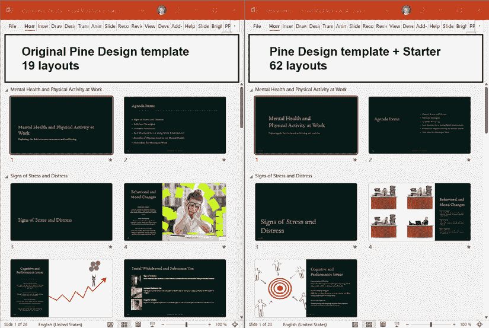

图 5.12 – 使用 Pine Design 模板比较原始布局和起始布局

左侧的截图显示了 Copilot 使用原始 Pine Design 模板创建的演示文稿，该模板包含 19 种布局。右侧的截图使用相同的模板创建，我在其中添加了所有 Microsoft 建议的起始布局，现在总共有 62 种布局。正如您所看到的，它们看起来非常相似。

让我们看看使用 Dividend 模板的第二个比较（*图 5.13*）：

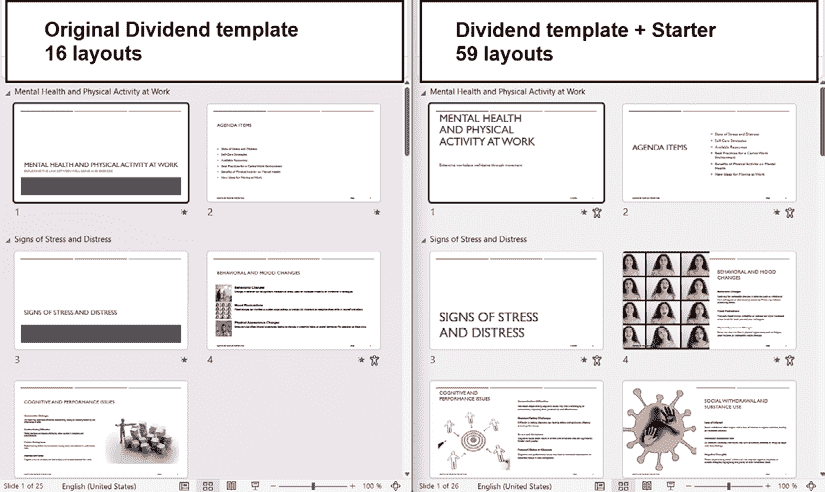

初看之下，由于第一张幻灯片上的深色矩形，似乎差异比之前的例子更明显。这仅仅是因为 Copilot 决定在原始模板中使用节布局而不是标题布局。

在我的第二个例子中，有一点变得清晰。当这些布局包含在原始模板中时，Copilot 更频繁地选择由 Microsoft 提供的 Copilot 起始模板中的布局。如果你使用的是公司品牌的模板，这可不是什么好事。

无论你决定是否使用模板与 Copilot 一起创建新的演示文稿，让我重复一下之前提到的话：这是第一个*非常粗糙*的草稿。如果你想让你的幻灯片引人入胜并与你的信息保持一致，还需要做更多的工作。现在让我们看看幻灯片起始器功能如何帮助你快速添加具有有趣布局的新幻灯片。

## 在添加幻灯片时使用幻灯片起始器

拥有 Copilot 许可证将添加一个名为**幻灯片起始器**的有趣功能。当你打开一个演示文稿并添加新幻灯片时，**设计建议**面板将在**主页**标签页中打开（**1**）（*图 5.14*）：

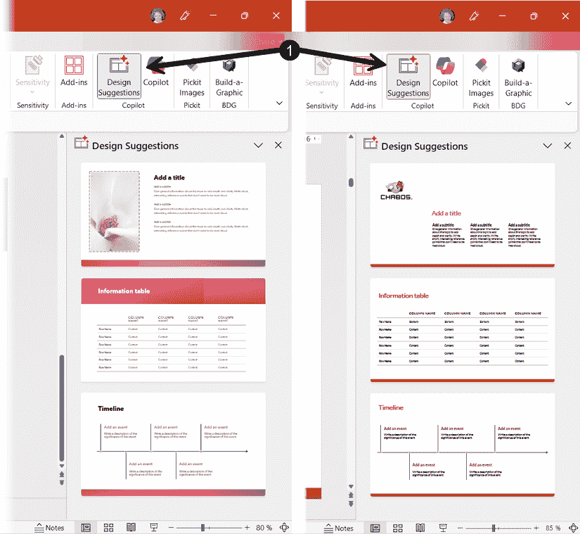

图 5.14 – 使用幻灯片起始器

它将为你提供一些想法，这些想法可以快速应用于使用文件中应用的模板的新幻灯片。在撰写本章时，对幻灯片起始器的重大补充是一个带有表格的布局和一个带有时间线的布局——这些节省时间的方法！我们或许可以期待未来在幻灯片起始器中提供新的视觉布局。

我们已经看到了你可以用来创建演示文稿的大部分 Copilot 功能。现在让我们看看 Copilot 修改和总结演示文稿的能力。

# 使用 Copilot 修改和总结演示文稿

PowerPoint 中的 Copilot 聊天面板提供了一系列功能，可用于提升你的演示文稿并与人机交互。在讨论哪些提示让我感兴趣之前，让我们先描述一下当你点击**主页**标签页上的**Copilot**按钮时，你将在聊天面板中找到的功能（**1**）（*图 5.15*）：

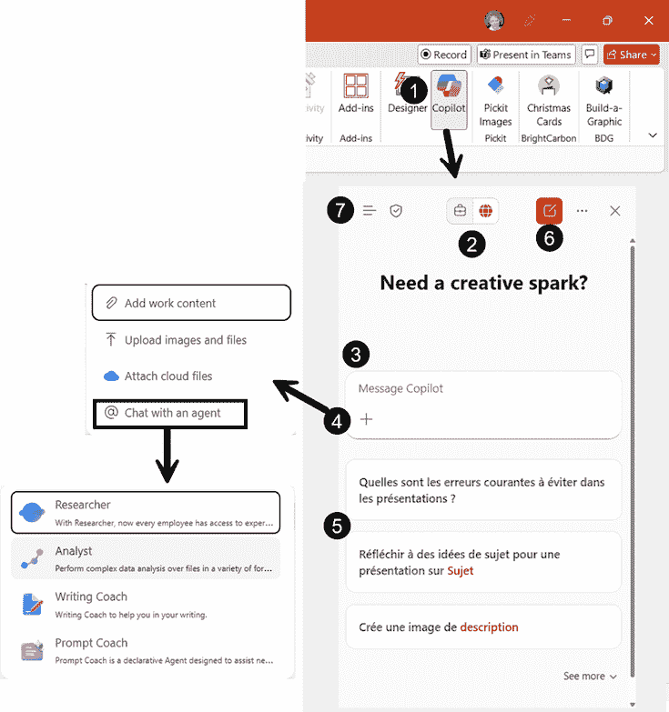

图 5.15 – 访问 Copilot 聊天面板和功能描述

+   **工作/网络**切换器（**2**）可用于将 Copilot 的搜索限制在你的工作环境内或使用网络。

+   聊天框允许添加你的提示（**3**）。

+   加号（**+**）符号允许你添加内容或代理（**4**）：

    +   **添加工作内容**将打开最近文件的列表。如果你没有看到你想要的文件，有一个搜索框，可以从本地驱动器上传，或者附加云文件。当你将切换器置于**工作**状态时，你将能够引用来自你组织的人员、文件、会议、电子邮件和网站，以帮助 Copilot 回答你的提示。

    +   **上传图片和文件**和**附加云文件**是直接搜索本地或云文件的方式。

    +   **与代理聊天**允许我们使用能够完成特定任务的代理。

+   建议使用通用提示（**5**）。点击其中一个提示会将它添加到提示框中。**查看更多**链接会展开一个更长的提示列表。

+   当你想改变话题或进行独立研究时，**开始新的对话**（**6**）。

+   **打开导航面板**（**7**）让你可以访问我们在*图 5.16*中将要看到的其他元素。

在点击**打开导航面板**图标后，一个新的视图会覆盖聊天面板，让你可以访问**代理**（**1**）和所有你的 Copilot**对话**历史（**2**）（*图 5.16*）：

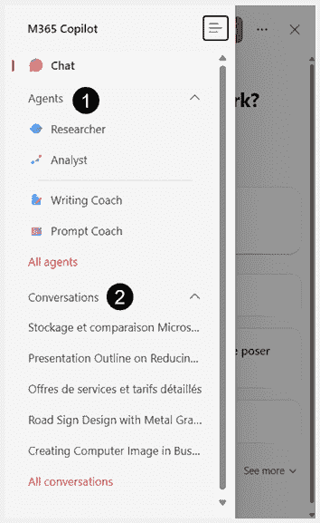

图 5.16 – 查看导航面板以访问代理和对话历史

点击一个代理会重新打开聊天面板，并选择该代理，以便你可以开始对特定任务进行提示。点击列表中的对话会重新打开聊天面板，显示之前的对话。PowerPoint 中的 Copilot 可以用作持续助手。你在文件中创建的对话将列在你的整体 Copilot 聊天历史中。

由于特殊的许可要求或与 PowerPoint 的相关性，添加代理本身可能成为一个复杂的话题。你可以在 M365 环境中添加并无需额外费用即可使用的最常见代理包括**研究员**、**分析师**、**写作教练**和**提示教练**。如果你在你的面板中没有看到代理，请咨询你的 IT 支持，因为他们可能尚未部署。如果你在导航面板中看到**所有代理**或**添加代理**链接，请从那里探索提供的选项。在*进一步阅读*中有一个关于代理的 Microsoft 文章链接。

现在我们已经了解了 Copilot 聊天面板的工作方式，让我们看看 Copilot 可以完成的一些任务，以确保你的内容清晰。

## 使用 Copilot 确保内容清晰度

无论你是借助 Copilot 创建演示文稿草案，还是正在处理现有的演示文稿，Copilot 聊天面板都是一个询问助手有关内容的好地方。

当你打开 Copilot 聊天面板时，它通常会建议一些提示（*图 5.17*）。*注意*：以下图示不显示最新的 Copilot 版本，但确保内容清晰度的提示功能仍然相同。默认情况下不再提供演示文稿摘要。

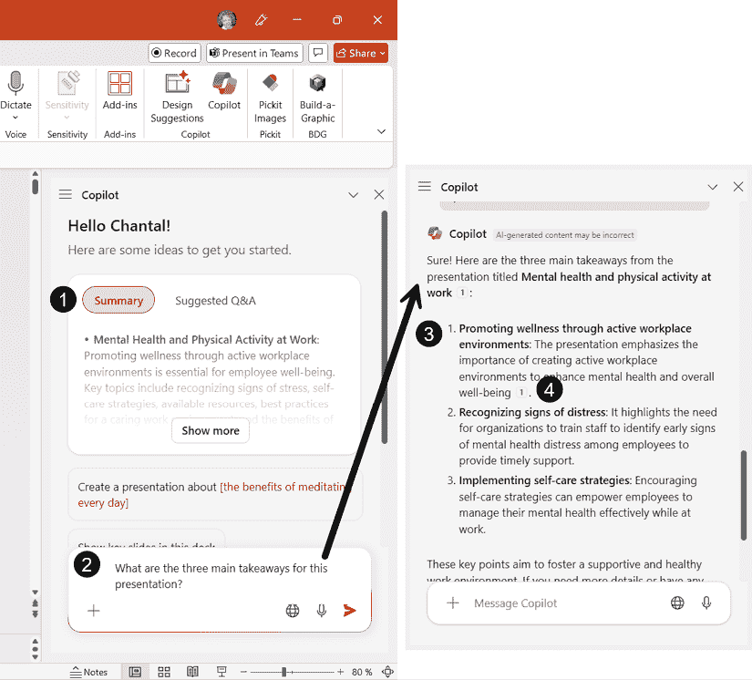

图 5.17 – 请求 Copilot 评估内容清晰度

由于默认情况下不再提供演示文稿的**摘要**（**1**），您可以在聊天框中提示 Copilot 进行总结。总结是检查您的内文是否支持您的信息或是否缺少某些关键元素的好方法。这种总结可以比作请同事审查您的内文。

您可以使用任何建议的提示，或者仅添加您自己的提示。这里有一个您应该尝试的提示：“`这个演示文稿的三个主要收获是什么？`”（**2**）。如您从 Copilot 的回答中看到，我们得到了一个主要观点的列表（**3**），每个都包括一个总结。曾经有一个从其中提取信息的幻灯片编号列表（**4**），但似乎在测试本章时这个功能停止工作了——继续寻找它；它应该会回来。在 Copilot 的回答底部，您总是有一些后续问题来保持对话进行。如果它们有帮助，请使用它们。

我建议您查看“*进一步阅读*”中提供的**Copilot Prompt Gallery**链接，并筛选出仅针对 PowerPoint 的提示。每次浏览时，它都会为您提供最新的列表。请记住，Copilot 能理解的任务数量将会不断演变。

现在我们将看到一些提示，这些提示将帮助您在 Copilot 的帮助下向您的演示文稿添加内容。

## 使用 Copilot 添加内容

为什么我们先讨论添加内容？简单来说，因为它与我们之前讨论的信息和结构先于视觉效果的顺序相一致。当然，使用 Copilot 使我们能够立即在 PowerPoint 中工作，因此我的建议是先使用任务添加内容，然后继续使用可以改善视觉效果的任务。

如果您查看 Copilot Prompt Gallery，您会发现与向您的演示文稿添加内容相关的各种任务。在本节中，我们将看到 Copilot 可以理解的基本内容添加任务：添加幻灯片或图片。

在审查完您的内文后，如果您需要添加新主题或扩展幻灯片上列出的主题，请点击“首页”选项卡中的**使用 Copilot 添加新幻灯片**按钮（**1**）或点击**叙事构建器**（**2**）以访问**添加幻灯片**和**添加主题**功能（*图 5.18*）：

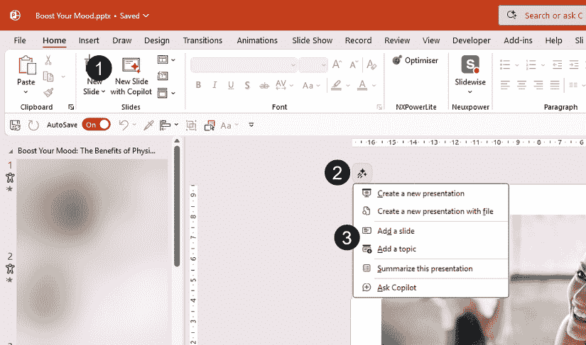

图 5.18 – 从首页或叙事构建器添加新幻灯片或新主题

当添加新幻灯片时，会打开一个**使用 Copilot 添加幻灯片**窗口（*图 5.19*）：

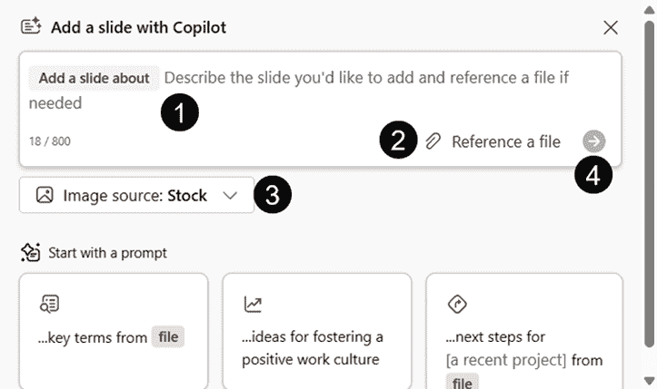

图 5.19 – 使用 Copilot 添加新幻灯片

输入您想要添加到新幻灯片的提示内容（**1**）。您可以参考一个现有文件来帮助 Copilot 进行内容创作（**2**），并告诉它图像的来源位置（**3**）——默认为 Stock，但如果您的组织配置了品牌库，它可能会列在下拉菜单中。点击箭头（**4**）以生成幻灯片。

如果使用添加主题的功能，我们将得到**使用 Copilot 添加主题**窗口，它的工作方式与我们之前讨论的叙事构建器类似（*图 5.20*）：

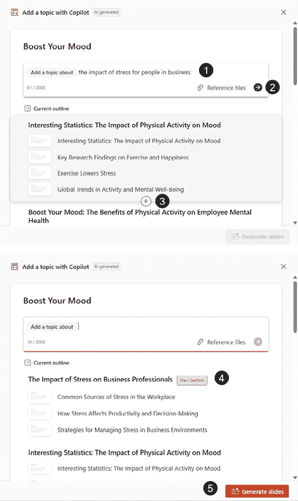

图 5.20 - 使用“添加主题”窗口添加主题

+   输入您想要添加到新幻灯片的主题提示内容（**1**）并点击箭头以生成（**2**）。

+   您也可以在输入提示之前点击加号（**+**）（**3**），以便在您的大纲中添加主题到特定位置。

+   Copilot 将识别您的新部分（**4**），您将能够移动部分，就像您使用叙事构建器创建新演示文稿时做的那样。

+   点击**生成幻灯片**按钮（**5**）以将内容添加到您的演示文稿中。

在本章修订并出版之前，如果您尝试使用 Copilot 聊天来更改图像或甚至添加图像，它将回复它理解您的要求，但不能直接执行。如果您只想使用库存图像或您的品牌库更改或添加图像，您需要转到**插入**选项卡来执行此操作。但如果您想创建全新的 AI 生成图像，那么 Copilot 聊天将合作（*图 5.21*）：

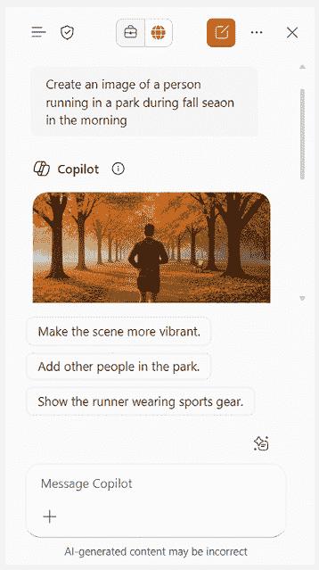

图 5.21：在 Copilot 聊天中创建图像

我使用提示`Create an image of a person running in a park during fall season in the morning`来获取这张新图像。Copilot 提供了一些后续提示，您可以使用它们来进一步改进图像以满足您的需求。当您满意时，将鼠标悬停在图像上并点击一个加号（**+**）来将其添加到您的幻灯片中。您将在*第七章*中看到更多细节和另一个示例。这使我们讨论有助于以各种成功程度修改现有演示文稿的提示。

## 使用 Copilot 修改内容

在本章初稿撰写时，尝试从 Copilot 聊天窗格中修改和改进幻灯片内容并不是一项非常成功的尝试。仅仅两个月内，我选择的四个任务中有一半 Copilot 无法执行得到了改进！这是一个快节奏的世界。

让我们从两个应该被 Copilot 理解但无法执行的基本幻灯片内容管理提示开始（*图 5.22*）：

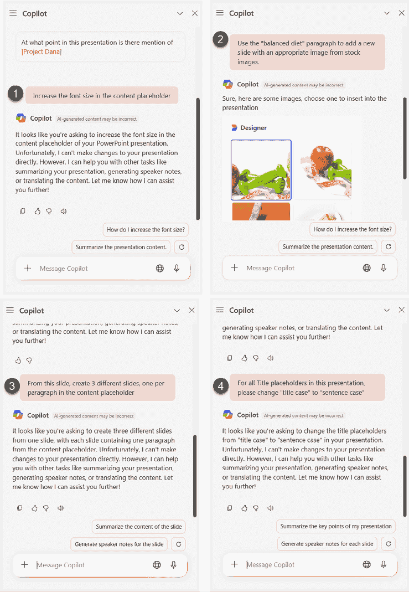

图 5.22 – Copilot 能够理解但不能执行提示

1.  `增加内容占位符中的字体大小`：Copilot 确实表现出理解，但无法完成任务。

1.  `对于本演示文稿中所有的标题占位符，请将“标题大小写”更改为“句子大小写”`：在第二次要求它执行基本内容管理任务时，Copilot 无法完成。

1.  `从本幻灯片创建 3 个不同的幻灯片，每个幻灯片对应内容占位符中的一个段落`：再次，Copilot 理解但无法执行。尽管如此，最新版本确实提供了创建三个幻灯片的脚本和想法。

1.  `对于本演示文稿中所有的标题占位符，请将“标题大小写”更改为“句子大小写”`：第三次要求执行基本内容管理任务时，Copilot 无法完成。

那些 Copilot 回复的关键句子是它**不能直接更改你的演示文稿**。至少，现在还不能。在你阅读这一章的时候，事情可能已经有所改善。微软的开发团队正在努力工作，以不断提高 Copilot 提高我们生产力的方式。

如果添加幻灯片不是你想要的，你可以在占位符中解决幻灯片上过多的文本和小字体问题。与其自己删除一些文本，你还可以使用适用于内容占位符的 Copilot 工具（**1**）（*图 5.23*）：

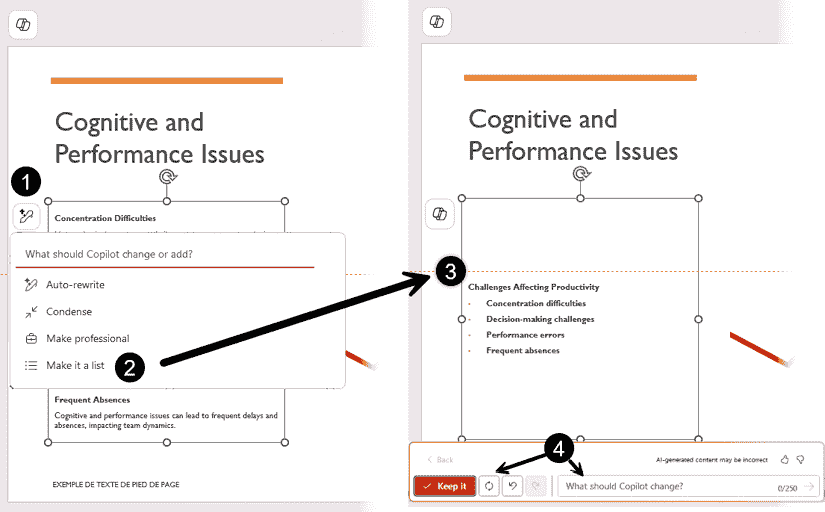

图 5.23 – 在内容占位符上使用 Copilot 工具

在 Copilot 可以在内容上执行快速操作列表中，使用**将其转换为列表**（**2**）。这大大减少了你需要处理的文本量（**3**）。如果你不喜欢建议的列表，在点击**保留按钮**之前，可以生成一个新的建议或提示 Copilot 进行更改（**4**）。

然后，你可以在“主页”选项卡上使用 PowerPoint 的**重置幻灯片**功能（**1**）（*图 5.24*）：

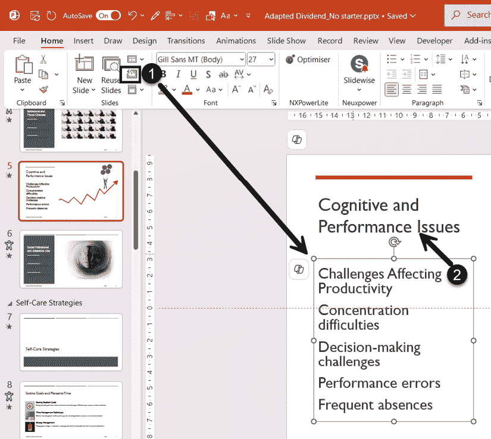

图 5.24 – 在主页选项卡上使用重置幻灯片功能

此按钮将自动重置幻灯片布局，使其与幻灯片母版中配置的字体大小对齐（**2**）。在*图 5.24*中，内容占位符的第一行文本（**影响生产力的挑战**）将比 Copilot 最初创建的通用标题（**认知性能问题**）要好得多。如果你得到类似的结果，只需将文本从占位符中剪切出来并粘贴到标题占位符中。

如果你已经适当地配置了幻灯片母版和布局，这一步将工作得很好。我并不是说所有这些更改都会很快完成，尤其是如果你演示文稿中有许多幻灯片，但花时间做这件事是制作更具影响力的演示文稿的唯一方法。

现在我们来讨论第二个让我感到烦恼的元素：大多数/所有标题占位符，以及在其他占位符中用作副标题的任何文本，都使用标题大小写而不是句子大小写。如果你想提高可读性，这必须改变，我们知道在撰写本章时 Copilot 无法完成这项任务。但 Copilot 是一个伟大的助手，可以帮助我们处理代码！你可以在 PowerPoint 中使用**Visual Basic for Applications**（**VBA**）代码来自动化某些重复性任务。

所以，尽管这本书的目的是不教你如何使用 VBA（我认为自己是个代码菜鸟！），既然我们在讨论 Copilot 以及它如何能帮助你，这里是我用来在整个演示文稿中移除标题大小写的提示和步骤。如果你想了解更多关于宏的信息，请参阅*进一步阅读*中列出的*Microsoft Learn*文章。

在 Copilot 聊天窗格中，我首先尝试了以下提示：

`我想所有标题占位符都使用"句子大小写"而不是"标题大小写"，帮我写一个宏来完成这个任务。`

随着最新的 Copilot 改进，聊天窗格返回了一个警告消息，指出 VBA 不受完全支持，并且语法高亮基于 Python。重新测试提示和宏确实有效。

Copilot 能够帮助并返回完成任务的代码行和步骤。如果你尝试了，而 Copilot 回复说它做不到，稍后再试（*图 5.25*）：

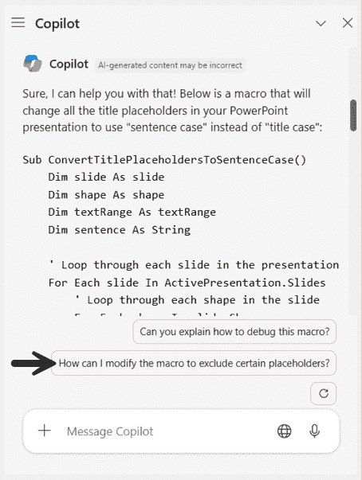

图 5.25 – Copilot 对宏创建提示的回答

其中一个建议的后续问题让我想到我可以进一步自动化这项任务，所以我决定跟进这个问题：

`这种类型的宏能否用于文件中所有带有文本的占位符类型？`

Copilot 理解了，并给了我一个完全修改后的宏（**1**）和运行步骤（**2**）（*图 5.26*）：

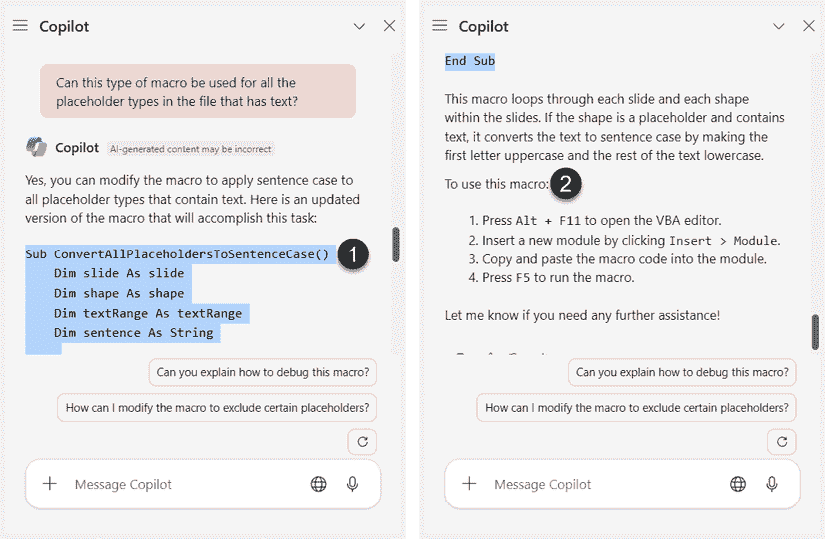

图 5.26 – Copilot 返回修改后的宏和运行步骤

要使用宏，你首先需要在 Copilot 聊天窗格中选择代码行并复制它们（*Ctrl* + *C*）。*注意*：在代码行之前有一个新的复制代码图标。然后你可以继续打开 VBA 编辑器。你可能遇到我遇到的问题，即使用*Alt* + *F11*键盘快捷键：它只显示与*Alt*键一起使用的字母快捷键来打开函数。

宏可以从**开发者**选项卡（**1**）创建和运行（*图 5.27*）：

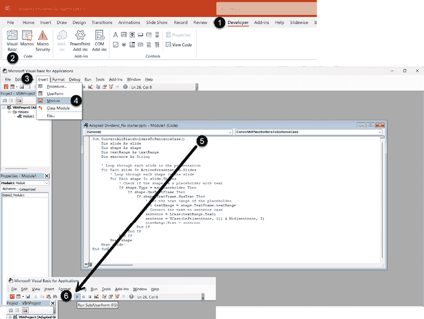

图 5.27 – 使用开发者选项卡创建和运行宏

如果您看不到选项卡，请转到**文件** | **选项** | **自定义功能区**，并在窗口右侧的列中勾选**开发者**。然后您可以点击**Visual Basic**按钮（**2**）。当**Microsoft Visual Basic for Applications**窗口打开时，点击**插入**选项卡（**3**），然后点击**模块**（**4**）。将代码粘贴到打开的模块窗口中（**5**）。最后一步是在键盘上按*F5*或使用工具栏中的**运行子程序/用户表单**按钮（**6**）。然后，关闭 VBA 窗口。

如果在运行宏时收到任何错误消息，请注意错误是什么，并返回到 Copilot 聊天窗格。告诉 Copilot 宏有错误，并要求它审查代码。根据我测试的文件，我在运行建议的宏时遇到了错误，但将修正后的宏复制粘贴到编辑器中后，它就正常工作了。

宏工作得很好，即使在某些情况下您可能会遇到句子开头缺少大写字母。如果发生这种情况，只需返回并让宏将所有文本占位符更改为句子大小写。运行宏后，您将能够在您的幻灯片中查看更改（**1**）（*图 5.28*）：

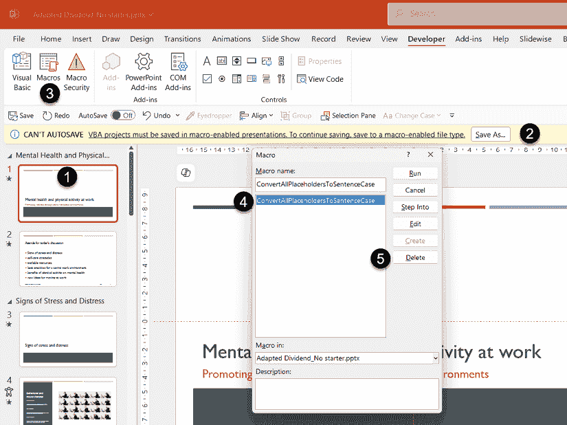

图 5.28 – 运行宏结果和从文件中删除宏

但是，如您在*图 5.28*中看到的，将宏添加到您的文件中会关闭自动保存（保存到 OneDrive 或 SharePoint 的文件）（**2**），要求您将其保存为启用宏的文件。但是，根据组织中对启用宏演示文稿的安全设置，文件未来可能甚至无法打开。如果您想保留启用宏的文件副本，我强烈建议从您将用于继续演示文稿创建过程的文件中删除宏。按照以下步骤操作：

1.  在**开发者**选项卡上，点击**宏**（**3**）。

1.  在**宏**窗口中，选择宏（**4**），点击**删除**按钮（**5**），并确认您想要删除它。

1.  前往**文件** | **另存为**或使用（**2**）中的**另存为**按钮。使用您想要的文件名，并确保您正在使用`.pptx`文件格式。PowerPoint 会警告您 VBA 无法保存到无宏演示文稿中。点击**是**按钮继续。

1.  关闭您的文件并重新打开它，以便您看到**自动保存**已恢复。

在前面的示例中，我的目标是帮助您理解，如果您利用 Copilot 的知识为您创建代码行，任何重复性的清洁任务都有可能通过 VBA 完成。所以，直到 Copilot 能够独立完成，您就有了一个工具来避免大量的手动清理工作。

# 摘要

在本章中，我们学习了 Copilot 可以完成的任务，并讨论了良好提示的基础知识。我们还学习了如何借助 Copilot 创建新的演示文稿，如何总结演示文稿，以及它可以理解哪些任务来修改文件内容。

尽管我非常喜欢在我的 M365 环境中的许多其他应用程序中使用我的 Copilot 助手，但我确实认为它仍然在 PowerPoint 中处于开发中。我鼓励您尝试它并测试其极限，同时始终牢记，Copilot 创建的演示文稿远未准备好交付。请确保您始终使用适用于有影响力的演示的最佳实践来审查视觉效果。

在下一章中，您将学习如何使用 PowerPoint 中包含的、与您的常规 M365 许可证一起提供的其他 AI 工具来提高您的视觉效果。通过创建图像布局、视觉列表和时间线，或者创建无模板的演示文稿，您将看到设计师如何成为您下一个最好的朋友。

# 进一步阅读

+   关于 Microsoft 365 Copilot 许可计划的其他信息：[`learn.microsoft.com/en-us/copilot/microsoft-365/microsoft-365-copilot-licensing`](https://learn.microsoft.com/en-us/copilot/microsoft-365/microsoft-365-copilot-licensing)

+   关于 Microsoft 365 Copilot 定价的更多信息：[`www.microsoft.com/en-us/microsoft-365/copilot#plans`](https://www.microsoft.com/en-us/microsoft-365/copilot#plans)

+   关于 Microsoft 365 Copilot 最新更新的信息：[`support.microsoft.com/en-us/topic/latest-updates-for-microsoft-365-copilot-a5685141-8081-458c-80d6-42493aad51ed`](https://support.microsoft.com/en-us/topic/latest-updates-for-microsoft-365-copilot-a5685141-8081-458c-80d6-42493aad51ed)

+   关于学习 Copilot 提示的更多信息：[`support.microsoft.com/en-us/topic/learn-about-copilot-prompts-f6c3b467-f07c-4db1-ae54-ffac96184dd5`](https://support.microsoft.com/en-us/topic/learn-about-copilot-prompts-f6c3b467-f07c-4db1-ae54-ffac96184dd5)

+   Microsoft 的 Copilot Prompt 画廊：[`copilot.cloud.microsoft/en-US/prompts/`](https://copilot.cloud.microsoft/en-US/prompts/)

+   在 PowerPoint 中使用您组织模板的 Microsoft 支持网站：[`support.microsoft.com/en-us/office/use-your-organization-s-templates-in-powerpoint-2baa9e36-d4a7-4ef1-bb3e-39b39b7035d5`](https://support.microsoft.com/en-us/office/use-your-organization-s-templates-in-powerpoint-2baa9e36-d4a7-4ef1-bb3e-39b39b7035d5)

+   在 PowerPoint 中使用个人模板创建新演示文稿的 Microsoft 支持网站：[`support.microsoft.com/en-us/office/use-a-personal-template-to-create-a-new-powerpoint-presentation-71262c90-1447-4109-90f3-eb84f9d06c98`](https://support.microsoft.com/en-us/office/use-a-personal-template-to-create-a-new-powerpoint-presentation-71262c90-1447-4109-90f3-eb84f9d06c98)

+   微软关于 Microsoft 365 Copilot 帮助和学习的支持网站：[`support.microsoft.com/en-us/copilot`](https://support.microsoft.com/en-us/copilot)

+   微软关于使用 Copilot 保持演示文稿品牌一致性的博客文章：[`techcommunity.microsoft.com/blog/microsoft365insiderblog/keep-your-presentations-on-brand-with-copilot-in-powerpoint/4295913`](https://techcommunity.microsoft.com/blog/microsoft365insiderblog/keep-your-presentations-on-brand-with-copilot-in-powerpoint/4295913)

+   微软关于在 Office 应用程序中开始使用 VBA 的文章：[`learn.microsoft.com/en-us/office/vba/library-reference/concepts/getting-started-with-vba-in-office`](https://learn.microsoft.com/en-us/office/vba/library-reference/concepts/getting-started-with-vba-in-office)

+   微软 Learn 关于在 Microsoft 365 Copilot 聊天中使用代理的文章：[`learn.microsoft.com/en-us/copilot/agents`](https://learn.microsoft.com/en-us/copilot/agents)

|

#### 现在解锁此书的独家优惠

扫描此二维码或访问[`packtpub.com/unlock`](https://packtpub.com/unlock)，然后通过书名搜索此书。 |  |

| **注意** *：在开始之前，请准备好您的购买发票。* |
| --- |
