# 6

# 使用人工智能改善您的视觉

在本章中，我们将使用在 M365 版本的 PowerPoint 中已经可用几年的 AI 工具来创建吸引人的内容。微软的开发团队使得他们的应用程序套件能够理解用户试图做什么，并提出解决方案以帮助加快某些任务的流程。这些功能不需要 M365 Copilot 许可证！

尽管有许多利用 AI 的功能，但本章将重点介绍**PowerPoint 设计师**。基本上，设计师是一个会分析您正在做什么并自动提出专业外观设计理念的功能。并非所有建议的内容都与演示文稿的最佳实践一致，但它会为您提供一个良好的起点或成为灵感的来源。

到现在为止，我的目标必须很清楚，那就是让需要快速创建视觉吸引力和影响力的演示文稿的商业用户获得力量。向您介绍设计师将帮助您减少创建各种演示文稿元素所需的时间。在本章中，我们将讨论以下主题：

+   使用设计师创建出色的图像布局

+   使用设计师创建视觉列表和时间线

+   使用设计师想法从头开始创建演示文稿主题

# 技术要求

本章需要拥有 Microsoft 365 订阅并开启**可选的连接体验**——我们将在下一节讨论这个话题。由于订阅模式意味着应用程序会持续更新，更新频率可能由您的 IT 部门控制，或者您是否选择了**微软的内部者计划**，请阅读“进一步阅读”部分中提到的*微软支持*文章的要求部分。

# 使用设计师创建出色的图像布局

从我能记事起，我就听到用户在抱怨当他们被要求创建演示文稿时不知道从哪里开始。即使我已经解释了一个简单的规划内容的过程，但这并不意味着你会觉得创建视觉元素很容易。这就是为什么使用最新版本的 PowerPoint 并启用设计师功能将是一个优势。

## 设置设计师

在我们深入探讨在幻灯片中添加图像时可能获得的优秀设计理念之前，让我们确保设计师在您的应用程序中处于活动状态。作为微软的连接服务的一部分，这些服务利用 AI 并在连接到互联网时运行，您可能想要检查 PowerPoint 的一些选项。您需要访问**文件 | 选项 | 一般**选项，并查看**隐私设置**（**1**）和**PowerPoint 设计师**（**2**）部分（*图 6.1*）：

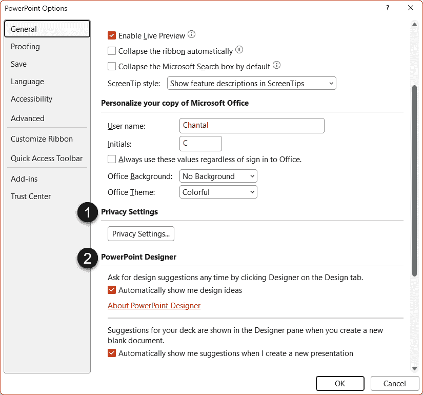

图 6.1 – 访问 PowerPoint 选项

在 **PowerPoint 设计师**部分，您将找到两个复选框，允许您决定是否希望设计想法自动显示以及是否希望为新演示文稿提供建议。如果这些选项变灰，您需要点击**隐私设置...**按钮。

在打开的**隐私设置**窗口中，您应该找到一个**启用可选的连接体验**复选框（ *图 6.2* ）。如果不可用，您需要与您的 IT 部门联系。您可以通过该窗口提供的任何链接了解更多有关这些设置的信息。

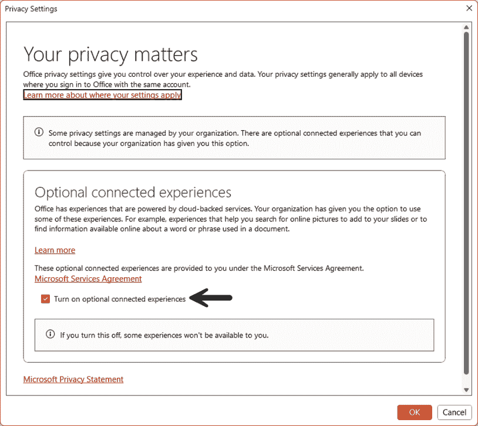

图 6.2 – 启用可选的连接体验

确保您的设置允许您使用设计师后，让我们继续了解如何使用此功能。

## 使用图像与设计师一起使用

让我们开始向空白幻灯片添加一些图像，以查看设计师的功能（ *图 6.3* ）：

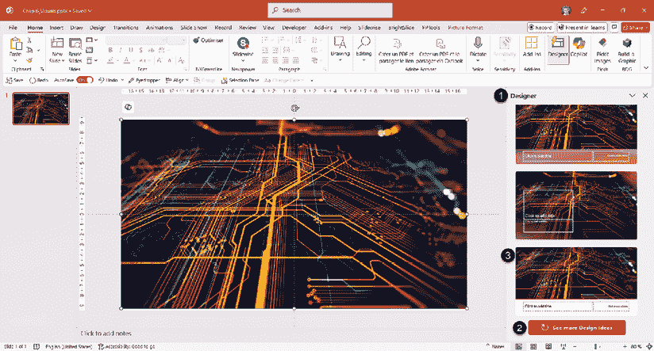

图 6.3 – 设计师为标题幻灯片上的一个图像提供设计想法

 **快速提示**：需要查看此图像的高分辨率版本？请在新一代 Packt Reader 中打开此书或在其 PDF/ePub 版本中查看。

 **新一代 Packt Reader** 和此书的**免费 PDF/ePub 版本**包含在您的购买中。扫描二维码或访问 [`packtpub.com/unlock`](https://packtpub.com/unlock)，然后使用搜索栏通过名称查找此书。请仔细检查显示的版本，以确保您获得正确的版本。

在空白标题幻灯片上，从**Microsoft 的股票图像**库中添加一张图像。如果您不熟悉 Microsoft 的股票图像，请参阅*第七章*，在*使用和自定义股票图像和其他图形*部分。如图 *图 6.3* 所示，**设计师**面板（ **1** ）应自动打开，显示标题幻灯片上一个图像的设计想法。滚动到列表底部可以访问**查看更多设计想法**按钮（ **2** ），为您提供更多布局选择。要将设计应用到您的幻灯片上，请点击您选择的布局（ **3** ）。

注意，如果您拥有 M365 Copilot 许可证，您的“设计”按钮将被标记为**设计建议**。

如果**设计师**面板没有打开，您可以使用位于**主页**选项卡或**设计**选项卡最右侧的**设计师**按钮。

当您向幻灯片添加第二张图像时，设计师将为您提供新的布局想法，始终考虑应用的幻灯片布局。在 *图 6.4* 中，向**标题幻灯片**添加了第二张图像。如您所见，新的布局以各种方式使用这两张图像，始终保留**标题**和**副标题**占位符：

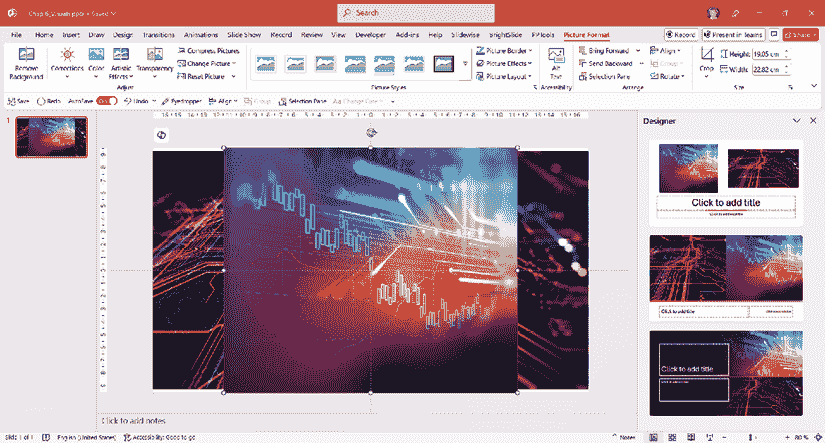

图 6.4 – 添加两张图像生成新的图像布局

如果你决定在幻灯片上已有图像的情况下更改布局，设计师会简单地调整想法以适应新的布局。在以下示例中，**标题幻灯片**布局被修改为**标题和内容**（**1**），设计想法会自动调整（**2**）（*图 6.5*）：

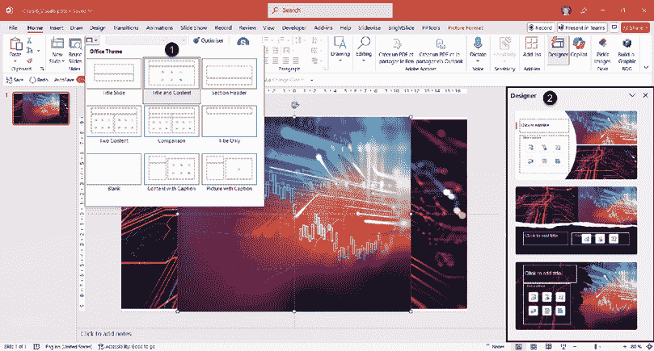

图 6.5 – 更改幻灯片布局生成新的设计想法

自从本书第一版以来，你可以添加以获取设计想法的图像数量已经有所变化。你可以在幻灯片上添加多达六张图像，并从设计师那里获得非常有趣的布局（*图 6.6*）：

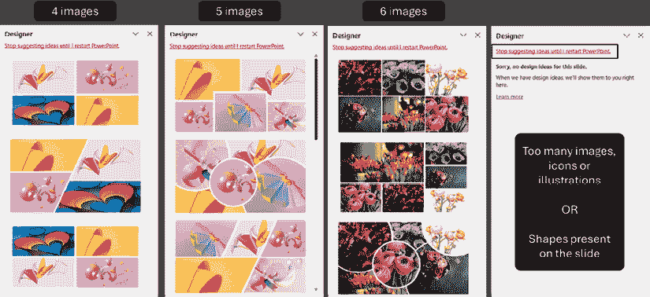

图 6.6 – 设计师在幻灯片上可以处理的图像数量

当**设计师**面板显示**对不起，此幻灯片没有设计想法**的消息时，这意味着你已经达到了图像、图标或插图的最大数量，或者你的幻灯片上有一个形状。首先使用设计师创建图像布局，然后添加幻灯片上所需的任何形状。一个很好的改进是**停止建议想法直到我重新启动 PowerPoint**链接。这样你就可以避免每次添加图像时都打开**设计师**面板。你可以从**首页**或**设计**选项卡中的**设计师**按钮手动打开它。

让设计师处理你的图像布局意味着它们会自动裁剪。如果你对某些裁剪结果不满意，有方法可以自己进行调整。在以下示例（*图 6.7*）中，选择了设计师布局用于六张图像：

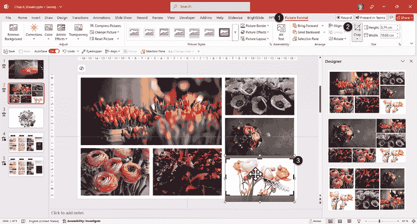

图 6.7 – 调整图像裁剪

如果我想调整图像的裁剪方式，我需要选择它，打开**图片格式**选项卡（**1**），然后点击**裁剪**按钮（**2**）。当鼠标指针放在图像上时，它变成一个四向箭头，允许你移动图像以显示裁剪掉的部分（**3**）。当你对新的裁剪满意时，只需点击图像外的任何地方或**裁剪**按钮。

设计师背后的 AI 正在随着微软对工具的工作而不断进化。它也被用作使用 M365 Copilot 时的辅助工具，帮助你添加与整体配色方案和你的内容相匹配的幻灯片图像。它越来越擅长识别图像上的焦点，例如人脸，以避免以尴尬的方式裁剪。当使用公司模板时，设计师甚至会提供与你的模板设置相一致的布局。

使用设计师，您现在只需点击几下就能创建看起来很棒的图像布局。如果您使用的是微软的股票图片，库中的任何图形元素或视频都可以使用。

## 使用设计师改进 Copilot 生成的幻灯片

正如我们在上一章中讨论的，M365 Copilot 可以帮助您创建演示文稿的初稿。

就像任何其他 AI 工具一样，它并不总是返回优秀的内容，但它可以成为激发您灵感的途径。在*第七章*中，我们还将看到如何自定义股票图片库中的元素。在下一节中，我们将看到设计师如何读取您的幻灯片上的文字并提供视觉设计理念。

# 使用设计师创建视觉列表和时间线

许多时候，我听到客户告诉我他们没有时间搜索视觉元素，所以他们只是在自己的幻灯片上添加了文本或关键词。但现在，每个 Microsoft 365 用户都可以从设计师那里获得帮助，设计师将搜索您的文字以匹配相关的图片。不再有只有文本在幻灯片上的借口！让我们看看设计师如何将您的文字转换为视觉元素的几个例子。

## 列表中的设计理念

在 PowerPoint 中创建项目符号列表是我们做了很长时间的事情。对于这个例子以及接下来的例子，我还会向您展示设计师如何通过使用模板底部带有简单彩色矩形的幻灯片来保持品牌设计理念。

在*图 6.8*中，我们有一个**标题和内容**布局，包含三个简短的句子列表（**1**）：**更新您的软件**，**更新您的系统**，和**重启您的计算机**。根据您的设置，**设计师**面板（**2**）可能会自动打开，但如果它没有打开，您可以在**主页**标签的右侧点击**设计师**按钮，或者在**设计**标签的右侧边缘点击（**3**）以打开面板：

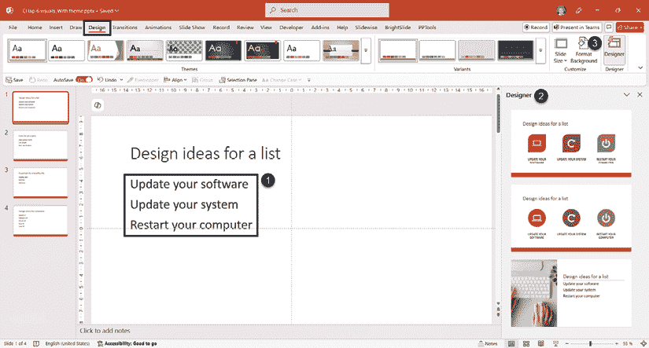

图 6.8 – 列表文本的设计理念

如您所见，设计理念列表不仅提供了视觉上吸引人的幻灯片，还提供了与主题相得益彰的图标或图像。如果选择第二个（*图 6.9*），我们可以看到与简短句子相关的图标。我还可以确认所选的图标颜色来自我的模板调色板。我唯一会改变的设计理念是第一个图标（**1**），因为计算机图标并不能很好地代表软件。如果您在图标库中使用*软件*关键词进行搜索，一个好的替代品可能是一个看起来像应用程序窗口的图标（**2**）。

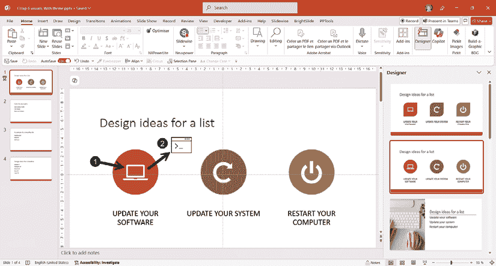

图 6.9 – 将图标应用于幻灯片的设计理念

如果图标与您对主题的看法不符，它可以很容易地被更改（*图 6.10*）：

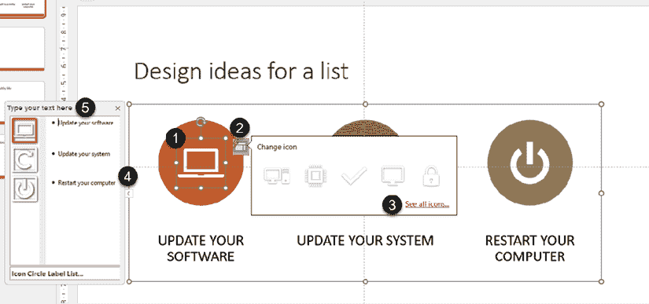

图 6.10 – 更改设计想法布局中提供的图标

点击图标（**1**）并使用**更改图标**功能（**2**）。然后你可以从系统提供的简短列表中选择另一个图标，或者点击**查看所有图标…**链接（**3**）来访问整个库。很多时候，设计师会使用**SmartArt**来建议一个新的视觉列表。如果你在选定的占位符左侧看到一个小箭头（**4**），点击它将打开**文本窗格**（**5**）。

设计师可以创建一个你可能在标准布局中看不到的新 SmartArt 类型。如果你提供了一个你喜欢的，请确保保留包含幻灯片副本的资源文件，这样你就可以轻松地在将来重复使用它。

因此，不要只使用文本幻灯片，花点时间浏览设计想法列表，并滚动到面板底部，在那里你会看到一个**查看更多设计想法**按钮（**1**）（*图 6.11*）：

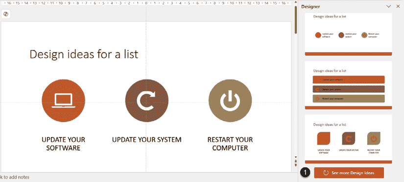

图 6.11 – 使用查看更多设计想法按钮

这将为你提供更多选择的想法。

让我们继续讨论创建时间表的设计想法。

## 来自日期的设计想法

设计师功能还可以帮助你创建项目时间表。从一系列日期开始，你将获得设计想法（*图 6.12*）：

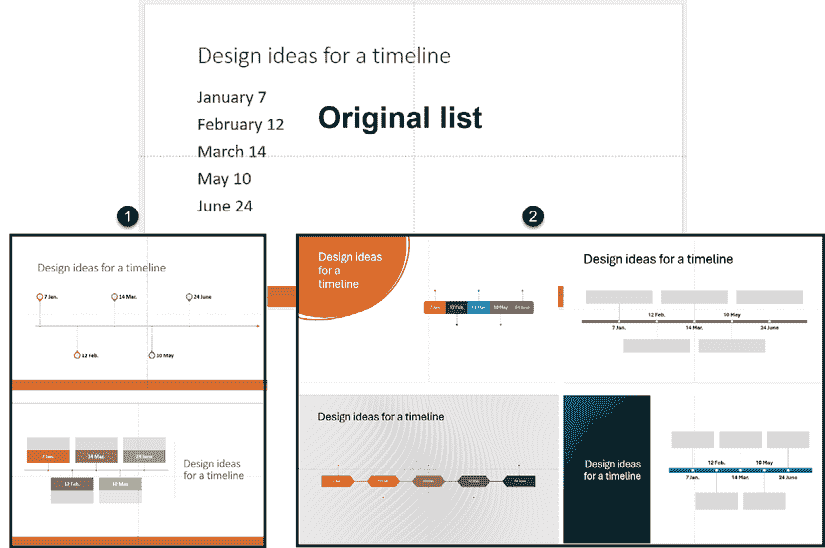

图 6.12 – 带模板和不带模板的时间表设计想法

你可以看到我输入一系列日期后提供的布局示例。我发现设计想法列表可能会随着时间的推移和是否使用模板或空白幻灯片而有所不同。在左侧（**1**）是使用模板时设计师的结果。在右侧（**2**），我们可以看到我使用空白幻灯片时提供的几个想法示例。再次提醒，如果你发现了一个你喜欢的布局想法，请确保保留副本并在自己的模板中重复使用。

如果你必须遵守严格的公司模板，我不会建议使用缺少公司模板设计元素的布局。相反，将 SmartArt 复制并粘贴到自己的品牌幻灯片中。在其他情况下，我会考虑它，因为它创造了一个视觉差异，有助于保持观众的兴趣。但请记住，许多建议的元素可能需要调整字体大小和对比度，或者如果它们不增加幻灯片的任何价值，则需要移除背景图像。

如果你需要在幻灯片中选择不同的设计，请保持一致，并在每次想要显示类似内容时使用它。在这个例子中，如果我必须在一个演示文稿中显示多个时间表，我会为每个时间表使用相同的布局。

因为当用户尝试设计者时，AI 会每天学习，微软的开发团队也在不断改进引擎，所以我们在演示文稿创建过程中会不断对这一功能的效率感到惊讶。

在本节中，我们看到了设计者功能如何提供与当前模板相匹配的想法。但如果你没有模板怎么办？或者，你正在创建一个一次性演示文稿，但没有模板怎么办？这就是下一节的主题，我们将看到设计者如何帮助你为你的演示文稿创建主题。

# 使用设计者想法从头开始创建演示文稿主题

你被要求就一个特殊主题进行演示，但你没有模板。当然，当截止日期紧迫时，人们会来找你。不用担心——你可以通过从一个空白演示文稿开始，并让设计者为你提供模板来加快创建过程。我可以看到人们对此皱起了眉头，尤其是在大公司里，他们有团队来创建企业模板，或者有预算来雇佣设计公司来做这件事。但对于没有团队和预算的小组织来说，设计者主题想法可以救命。

它的工作方式非常简单。从一个空白演示文稿开始，并在**设计者**面板（**1**）中激发你的设计灵感（*图 6.13*）：

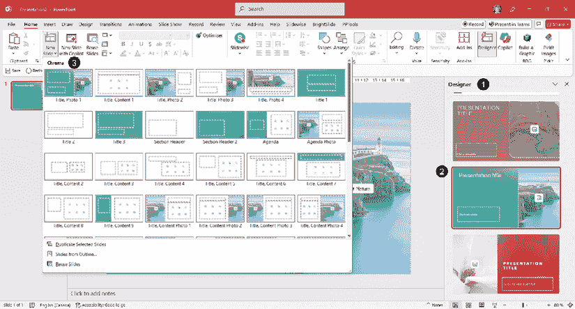

图 6.13 – 为新的空白演示文稿提供的设计想法

当你应用其中一个设计（**2**），并在**主页**选项卡（**3**）中点击**新建幻灯片**时，你会意识到已经应用了一个模板，并且标准布局与空白演示文稿设计不同。好消息是，微软已经开始提供新的设计者想法模板，它们包含更多样化的布局，这使得它们与 Copilot 配合得更好。如果你已经阅读了*第三章*，你就知道幻灯片母版是如何工作的，并且如果你想要的话，你可以调整布局、颜色和字体。如果你想的话，**设计者**面板会一直为你提供设计想法，并且它们将与你所选择的主题相匹配。

如果你在你的幻灯片上输入一个标题，设计者会尝试与你的主题相关。例如，我输入了标题“财务结果”（*图 6.14*），并得到了一系列设计想法：

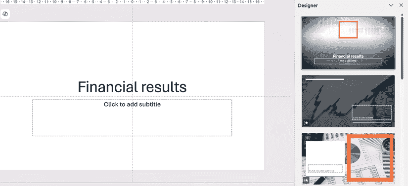

图 6.14 – 从标题中获取的设计主题想法

确保向下滚动列表，甚至使用底部的按钮来查看更多设计想法。你不会总是得到一份出色的结果列表，但通常它可以帮助你获得一个适合你的标题幻灯片的图像。

当您决定应用某个主题时，请先查看幻灯片布局。如果它们没有意义，或者您觉得调整它们的幻灯片母版将是一项大量工作，请不要使用设计师主题。当设计师没有提供任何值得使用的主题想法时，考虑回到微软提供的模板和主题。当您没有模板可用时，它们也可以是一个明智的开始，并且可能更快地定制。

正如您所看到的，借助设计师的想法，开始一个新的演示文稿主题可以很容易。有时它会为您提供有用的主题，有时则不会。只需确保您对颜色对比和字体可读性保持批判性的眼光，并根据您的需求调整提供的布局。

# 摘要

在本章中，我们讨论了 PowerPoint 的设计师功能，这些功能可以帮助您快速创建视觉冲击力强的幻灯片。您现在可以利用此功能为包含许多图片的幻灯片创建出色的布局，将项目符号列表改为更具视觉吸引力的样式，开始一个新的演示文稿，并利用设计师的主题想法。

除非您已经有了微软 365 订阅，否则没有理由只创建只有文字的乏味幻灯片，或者没有设计的空白 PowerPoint 演示文稿，因为您觉得自己缺乏创意，或者设计上有困难。但我确实需要提醒您一件事：如果您跳过所有规划步骤，只添加缺乏结构的内 容，使用设计师的设计想法可能有助于使您的幻灯片看起来不错，但并不一定有助于传达清晰的信息或使您的演示更具影响力。

在下一章中，我们将讨论如何在您的演示文稿中添加和修改各种视觉元素，例如地图、SmartArt 和微软的股票图片库。您还将学习如何使用应用程序内的一些工具创建新的形状。

# 进一步阅读

+   微软设计师支持文章（参见*要求*部分）：[`support.microsoft.com/en-us/office/create-professional-slide-layouts-with-designer-53c77d7b-dc40-45c2-b684-81415eac0617`](https://support.microsoft.com/en-us/office/create-professional-slide-layouts-with-designer-53c77d7b-dc40-45c2-b684-81415eac0617)

|

#### 现在解锁这本书的独家优惠

扫描此二维码或访问 [`packtpub.com/unlock`](https://packtpub.com/unlock)，然后通过名称搜索此书。 |  |

| **注意** *：在开始之前准备好您的购买发票。* |
| --- |
