# 7

# 添加和修改视觉元素

即使我们已经讨论了 AI 如何帮助我们开始或改进我们的演示文稿，我们作为内容创作者，需要不断思考如何使我们的演示文稿更具影响力和视觉吸引力。PowerPoint 有许多功能可以帮助你，从其界面开始。

如果你已经阅读了*第一章*，你可能会记得我提到在规划幻灯片内容时考虑图像或视觉的重要性。现在是时候开始使用一些 PowerPoint 功能，将句子和项目符号转换为相关的视觉元素，这些元素将吸引人们的注意力，并让观众记住。

我的目的是帮助你发现一些不太为人所知的工具，因此我不会专注于添加简单的形状或插入未定制的库存图片。在本章中，我们将讨论以下主题：

+   插入和修改地图

+   将项目符号转换为 SmartArt

+   使用**编辑点**创建新形状

+   使用合并工具创建新形状

+   使用和自定义库存图片和其他图形

# 技术要求

本章讨论的大多数主题不需要拥有**Microsoft 365 (M365**)订阅，因为工具和功能已在 PowerPoint 的先前版本中介绍。我将标识仅在 M365 中存在的功能。此外，请注意，由于 PowerPoint 的订阅版本持续更新，某些功能在您的应用程序版本中可能看起来并不完全相同。

# 插入和修改地图

当我说你需要在创建演示文稿时开始视觉化思考，我的意思是停止在创建内容时自动导航。你需要传达的任何内容都需要被检查，以寻求创建它的视觉方式。让我们看看一个可以通过 PowerPoint 的一个功能（仅限**M365**和**Office 2024**）大大改进的内容示例（**M365**和**Office 2024**仅限）：插入地图。对于*图 7.1*中的幻灯片示例，我创建了一个表格，显示了到 2043 年将有超过六百万人口的四个加拿大省份：

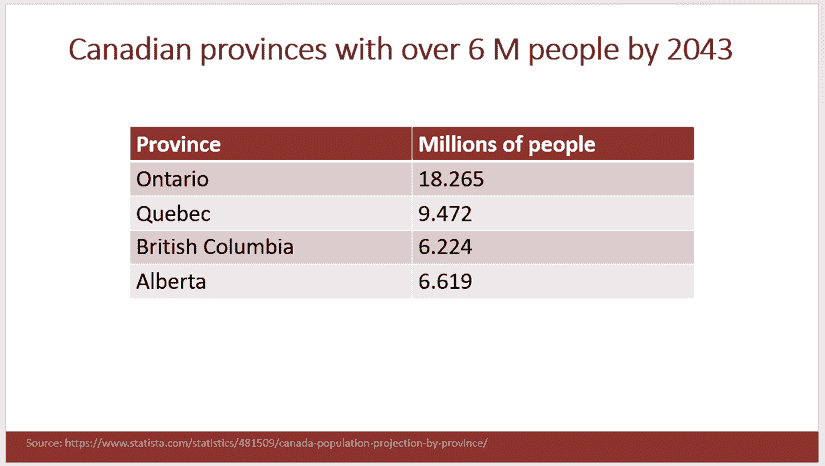

图 7.1 – 列出四个加拿大省份及其到 2043 年的人口表格

这本身不是一个糟糕的幻灯片，但它确实缺乏视觉吸引力。相反，我们可以利用 PowerPoint 的地图功能，使加拿大内的每个省份都可见，就像*图 7.2*中所示：

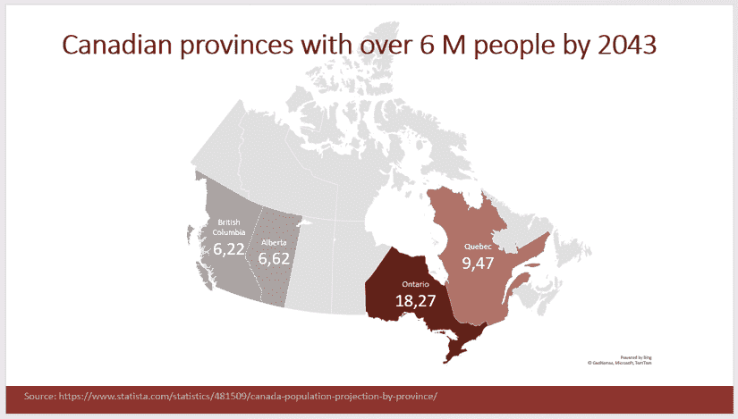

图 7.2 – 在加拿大地图上显示的人口信息

如您所见，通过显示到 2043 年该国人口最多的地区，它增加了数据的趣味性，我们甚至可以使用不同的阴影来使哪个省份将拥有最多人口一目了然。因此，您不仅可以简单地列出数据，还可以使用视觉元素来帮助讲述您想要传达的故事。

由于您不能在 PowerPoint 中直接将表格转换为图表，让我们继续下一步骤，创建您自己的地图（*图 7.3*）：

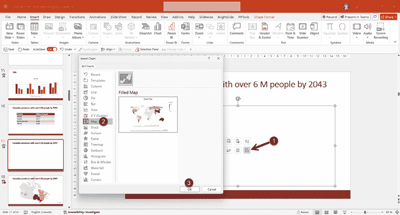

图 7.3 – 在幻灯片的内容占位符中添加图表

+   选择表格中的数据并复制它（*Ctrl* + *C*）。

+   插入一个具有**标题和内容**布局的新幻灯片，然后在内容占位符中点击**图表**图标（**1**）。然后，在**插入图表**窗口中选择**地图**（**2**），并点击**确定**（**3**）。

+   占位符现在将包括一个世界地图（**1**）（*图 7.4*）：

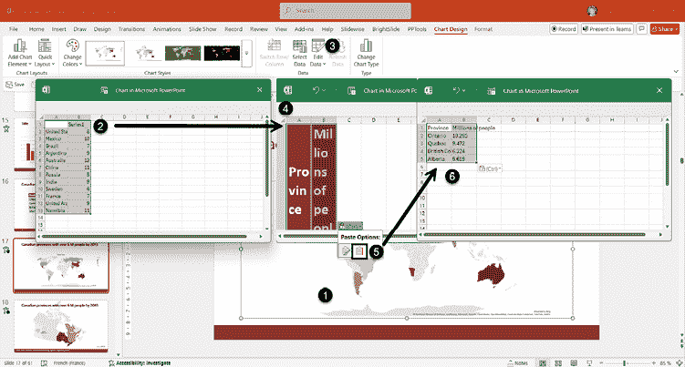

图 7.4 – 更改插入地图的默认数据

 **快速提示**：需要查看此图像的高分辨率版本？在下一代 Packt Reader 中打开此书或在其 PDF/ePub 复制中查看。

 **快速提示**：需要查看此图像的高分辨率版本？在下一代 Packt Reader 中打开此书或在其 PDF/ePub 复制中查看。

+   应该出现一个 Excel 窗口，显示国家列表和数据；选择数据并删除它（**2**）。如果您看不到 Excel 数据，请点击功能区中的**编辑数据**按钮（**3**）。现在您可以将数据粘贴到第一个单元格中（*Ctrl* + *V*）（**4**），然后点击**粘贴选项**图标（**5**）以确保数据使用目标格式。这将移除表格格式（**6**）。

+   现在您可以关闭 Excel 数据窗口，开始格式化您的新地图。

根据我的优秀技术审稿人 Fiona 的测试，在美加以外的地理区域添加地图图表可能具有挑战性。PowerPoint 地图图表依赖于 Bing Maps，可能无法识别非正式或历史区域。与其使用英国，不如尝试英格兰、苏格兰、威尔士和北爱尔兰。在爱尔兰，使用县而不是省份。如果您来自其他国家并且有困难，您可以尝试使用格式 *full country name – county*。

理想情况下，我们应该至少移除**图表标题**（**1**）选项，因为幻灯片的标题已经提供了足够的信息（*图 7.5*）：

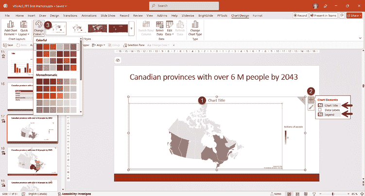

图 7.5 – 移除地图的标题和图例

+   要这样做，您必须点击图表右侧的加号（ **+** ）标志（ **2** ）并取消选中**图表标题**。在我的例子中，我还取消了**图例**的选中，因为我想要在地图上显示省份的名称。

+   如果您对地图的颜色不满意，可以点击工具栏上的**更改颜色**按钮（ **3** 在 *图 7.5* 中）来做出更改。

快速格式化您想在地图上显示的所有信息的一种简单方法是打开格式化面板（ *图 7.6* ）。

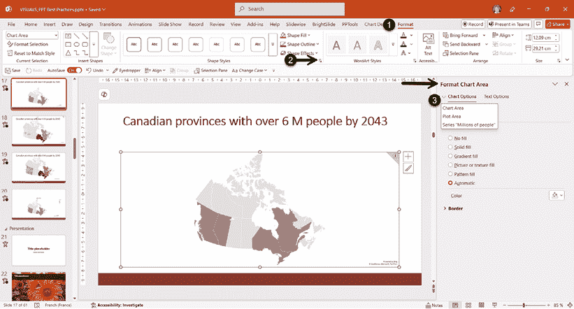

图 7.6 – 打开格式化面板以快速格式化图表区域

要这样做，您需要切换到**格式**选项卡（ **1** ）并点击工具栏上的**对话框启动器**图标（ **2** ）以显示格式化面板，默认情况下应显示**格式化图表区域**。然后，您可以使用**图表选项**下拉菜单（ **3** ）选择您需要格式化的图表区域。

当从**图表选项**列表中选择**系列选项**时，格式化面板显示您可以自定义的三种选项类型的图标（ *图 7.7* ）：

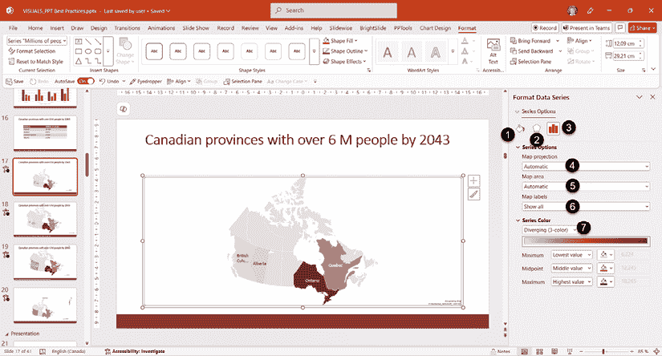

图 7.7 – 使用系列选项面板调整地图

+   **填充与线条** ( **1** ), **效果** ( **2** ), 和 **系列选项** ( **3** ): 选择**系列选项**以进行任何所需的调整。

+   **地图投影** ( **4** ): 这允许您根据现有的各种地图投影样式更改地图的视图。使用**自动**可能适合大多数用途。如果您有特定需求，请研究各种样式。

+   **地图区域** ( **5** ): 这允许您选择要显示的地图区域。测试下拉列表中的选项，看看哪个最适合您想要传达的信息。同时，始终牢记哪种表示方式对您的观众来说最有意义。

+   **地图标签** ( **6** ): 这允许您选择显示的标签。在我的例子中，我使用了**显示全部**，以便省份的名称显示在地图上，帮助那些可能不熟悉加拿大省份的观众。不过，这个选项有一个缺点：您将无法编辑地图标签的大小。我们将在本节稍后看到另一个选项。

+   **系列颜色** ( **7** ): 这允许您在两种或三种颜色渐变之间进行选择。在我的例子中，我选择了**发散**（ **3 色** ），这让我可以为每个数据点选择一种颜色。

当使用**系列颜色**选项时，如果您无法使地图颜色改变得足够好，请查看 Excel 数据表，确保数字使用了正确的十进制点（点或逗号）。

现在我们已经用我们的颜色和省份标签定制了地图，是时候添加数据了（ *图 7.8* ）：

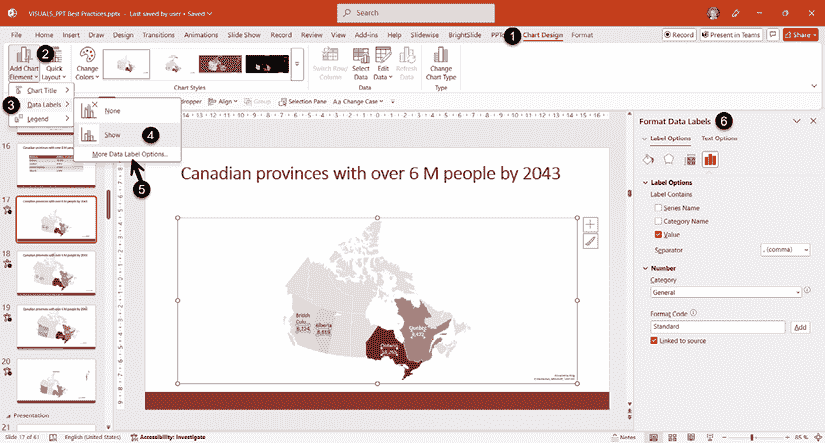

图 7.8 – 在地图上添加数据标签

+   要这样做，当地图在幻灯片上被选中时，点击功能区上的**图表设计**上下文标签（**1**），以便你可以访问**添加图表元素**按钮（**2**）。接下来，选择**数据标签**（**3**），然后**显示**（**4**）。**更多数据标签选项…**（**5**）选项打开**格式数据标签**（**6**）面板。我们现在可以看到显示在省份名称下面的数据。

在这个阶段，你可能想要考虑的两件事是格式化数字以减少小数位数和增加地图的大小。这是我们通过*图 7.9* 实现的：

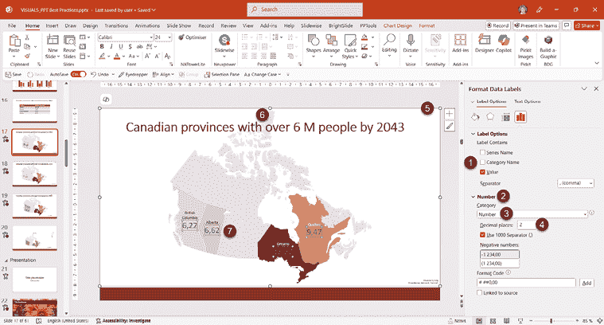

图 7.9 – 格式化数据标签和增加地图大小

+   如果你想为你的标签添加一个**类别名称**（**1**）的值，以便你可以格式化字体大小和颜色，你需要勾选这个复选框。记住，如果文本框太小，你可能会有显示类别和数据的问题。如果是这种情况，不要使用图表选项添加名称和值。只需使用可以轻松修改或动画化的常规文本框。

+   打开**数字**类别（**2**），以便你可以将其更改为**数字**（**3**），并将小数位数减少到`2`（**4**）。这将提高你在演示文稿中数据的可读性。但我们需要进行其他更改以提高其可读性，所以请继续阅读！

+   通过选择并拖动一个角手柄（**5**）来增加地图的大小，并将其调整到幻灯片可以容纳的大小。在我的例子中，北领地的部分与标题重叠，所以我使用了**格式**标签中的**向后发送** | **发送到后面**选项（**6**）来确保标题仍然容易阅读。

+   现在，我们必须注意标签的字体大小。由于我们已经处理了标签选项，你的数据元素应该在地图上被选中（**7**）。你可以简单地回到**主页**标签并更改字体大小；如果空间允许，我建议你使用至少**24 点**来使数据更容易阅读。

**警告**

当你在图表中更改数据标签的字体大小时，不幸的是，PowerPoint 会将颜色更改为默认灰色。为了绕过这个问题，你需要选择这个颜色导致对比度问题的特定数据，并选择另一种颜色。

如果你尝试添加包含较小县、省或国家的地图，你可能会遇到地图标签显示不正确的问题。为了避免这种限制，可以不显示地图标签，并使用叠加在地图上的文本框。

如你所见，PowerPoint 提供了一种很好的方式来将有关地区或国家的数据置于上下文中。如果你使用的是比 Office 2024 更早的未连接版本的 PowerPoint，你将需要寻找其他替代方案来使用地图。

在下一节中，我们将讨论另一种将你的项目符号转换为 SmartArt 的方法，以使你的内容更具视觉性。

# 将项目符号转换为 SmartArt

我也是那些觉得**SmartArt**功能需要升级的用户之一。毕竟，它是在微软在**Office 2007**中将菜单替换为功能区时引入的，并且从那时起就没有得到太多改进。但我也觉得任何创建演示文稿的人都不应该需要付出太多努力来制作他们的内容，这就是为什么使用 SmartArt 可以是一个好的起点，以减少你使用的项目符号数量。

当然，如果你使用的是带有 M365 的 PowerPoint 订阅模式，你可以利用如*第六章*中讨论的**设计师**功能。但即便如此，有时设计想法可能不符合你对视觉效果的预期。

那就是使用**转换为 SmartArt 图形**功能可能有所帮助的时候（*图 7.10*）：

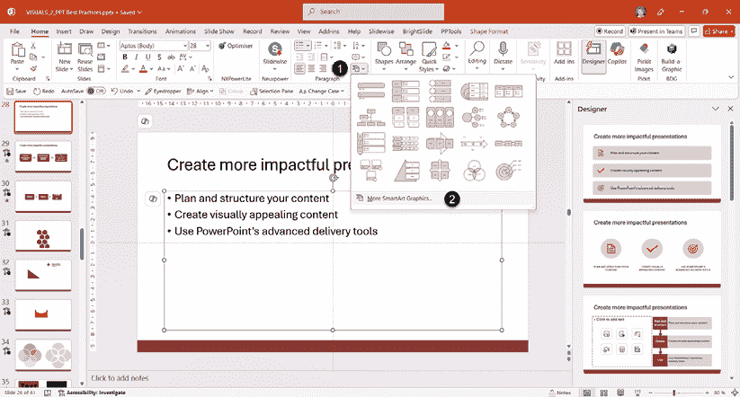

图 7.10 – 使用“转换为 SmartArt 图形”功能

+   当你在包含项目符号的幻灯片上时，首先选择内容占位符 – 简单点击占位符的虚线边框即可选中它。然后，在**主页**选项卡中，在**段落**组中，查找**转换为 SmartArt 图形**图标（**1**）。

+   你可以从下拉列表中的简短列表中进行选择，该列表提供了你转换后的项目符号列表的实时预览，或者点击**更多 SmartArt 图形…**（**2**）来浏览你可以从中选择的完整列表。

当选择浏览完整的图形列表时，将打开**选择 SmartArt 图形**窗口（*图 7.11*）：

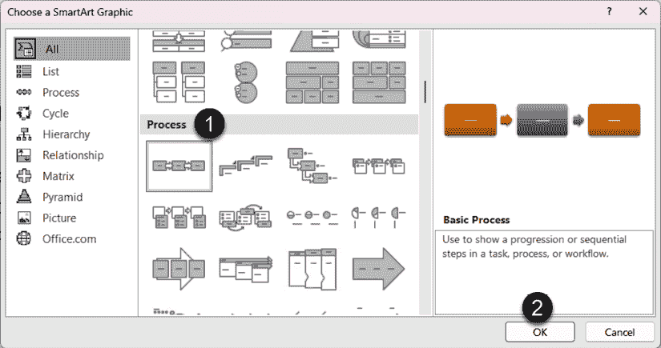

图 7.11 – 选择 SmartArt 布局

+   你可以浏览所有 SmartArt 布局的列表，或者按类别浏览。不要只考虑视觉将如何看起来，还要考虑任何布局是否会使你的信息传达得更合理。在我的例子中，我使用了一个标题为**创建更具影响力的演示文稿**的幻灯片和一个我认为应该被视为过程的子弹列表。因此，我可以决定使用**过程**类别（**1**）中的任何布局来帮助使我的列表更具视觉吸引力，并点击**确定**（**2**）将其应用到我的内容上。

一旦应用了 SmartArt 布局，你将获得两个新的选项卡来自定义其外观（*图 7.12*）：

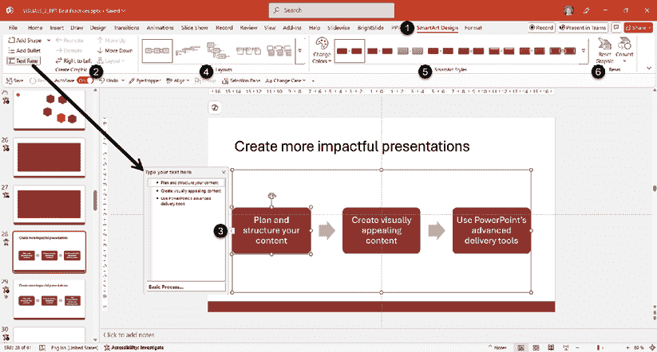

图 7.12 – SmartArt 设计选项卡中的工具

+   在**SmartArt 设计**选项卡（**1**）中，你可以访问许多工具来帮助你创建整体外观并在形状中包含文本。

+   在**创建图形**组（**2**）中，您将找到帮助您在布局中添加或删除形状的工具，或者将它们提升或降低以创建子类别的工具。可用的工具将取决于您选择的布局。尽管您可以使用该组中的按钮使**文本窗格**框可见，但它也可以通过 SmartArt 布局左边的箭头（**3**）打开。**文本窗格**框可用于同时输入新文本和创建新形状，或者编辑形状中的文本。如果您使用的是层次结构 SmartArt，您还可以提升和降低元素，这意味着您可以通过键盘上的*Tab*键或*Shift* + *Tab*键来增加或减少所选项目符号或形状的级别。

+   **布局**组（**4**）提供了访问布局画廊的权限，当您悬停在任何一个布局上时，都会提供实时预览，如果您想更改它，还可以访问整个布局列表。

+   如果您想更改 SmartArt 中形状的颜色方案或应用的效果，请使用**SmartArt 样式**组（**5**）中的功能。

+   在**重置**组（**6**）中，如果您对所做的所有更改不满意，可以轻松地将布局恢复到其原始外观。只需单击**重置图形**按钮即可。至于**转换**按钮，它允许您返回到您的项目符号列表或将 SmartArt 转换为单独的形状。本节稍后将展示 SmartArt 到形状转换的示例。

在 SmartArt**格式**选项卡上，您将看到许多也可以在**开始**和**形状格式**选项卡中找到的格式化工具（*图 7.13*）：

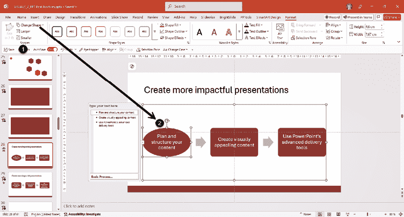

图 7.13 – SmartArt 格式选项卡中的工具

+   **形状**组（**1**）在您想要进一步自定义 SmartArt 时有一些有趣的工具。这就是您可以通过在**更改形状**画廊中选择新形状或决定通过使用**更大**或**更小**工具来更改布局中一个或多个形状的大小来更改布局中部分形状的形状（**2**）的地方。

如您所见，SmartArt 可以是一种帮助您减少设计时间同时使内容更视觉化的好方法。是的，仍然有文本，但使用视觉布局而不是项目符号可以帮助您的观众更好地理解概念或记住您的内容。我还推荐您阅读*进一步阅读*部分中的 Nolan Haims 的*更好的牌堆*，以便您获得更多关于如何使您的项目符号更视觉化的灵感，也许之后可以将 SmartArt 图形作为起点。

你也可以将 SmartArt 图形作为你某些内容的起点。而不是因为看不到适合你需求的布局而从零开始创建布局，我将向你展示如何利用“**转换为形状**”工具。以下示例来自我为一个会议创建的幻灯片，我想以形状的结构化布局显示在演示中遇到的挑战（*图 7.14*）：

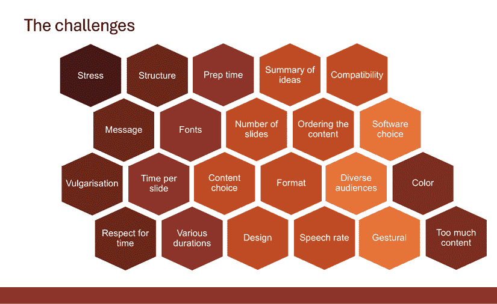

图 7.14 – 结构化六边形的布局

有一个带有六边形的 SmartArt 布局，但它只允许你垂直添加形状。但无论如何，我还是用它作为起点来节省一些时间。以下是我之前示例中使用的布局的步骤，但请记住，你可以使用任何 SmartArt 布局来完成相同的事情并节省大量设计时间：

+   在“SmartArt 设计”选项卡（**2**）中使用“**交替六边形**”SmartArt（**1**）和“**转换为形状**”工具（**3**）（*图 7.15*）：

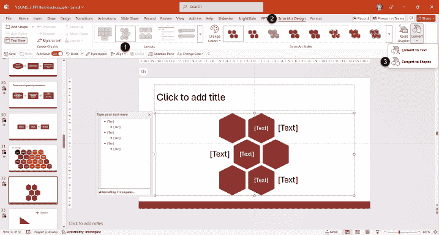

图 7.15 – 使用“SmartArt 转换为形状”工具

+   转换后，我们在幻灯片上留下一个矩形，需要解散它才能看到所有单独的形状。要做到这一点，转到“**形状格式**”选项卡（**1**），然后点击“**分组**”|“**取消组合**”（**2**）。现在你将在幻灯片上拥有所有单独的形状（**3**）。对于我的需求，我在继续之前删除了空白的矩形（*图 7.16*）：

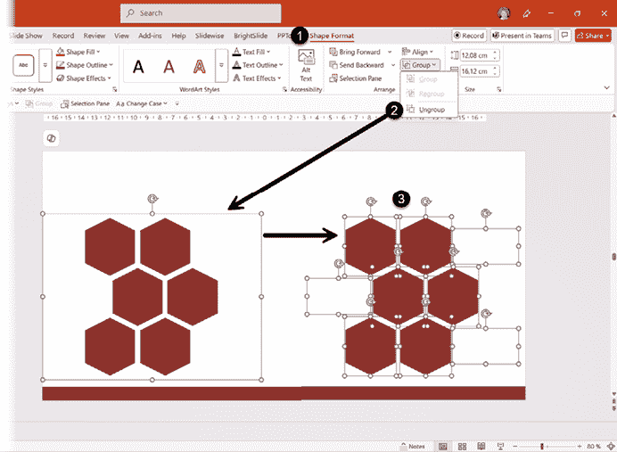

图 7.16 – 解散形状

+   你可以删除矩形，然后选择所有剩余的形状以便你可以复制它们（*图 7.17*）：

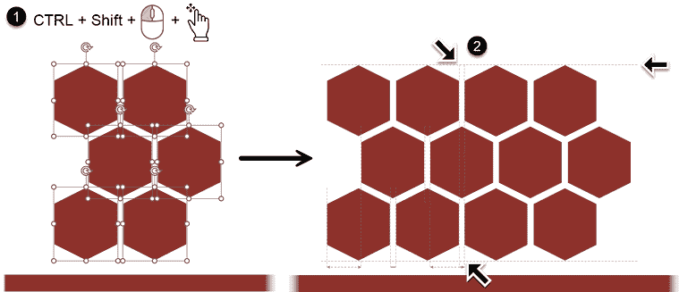

图 7.17 – 使用键盘键和鼠标复制并对齐一组形状

+   在使用左鼠标按钮拖动形状的同时按住 *Ctrl* + *Shift* 键（**1**）。*Ctrl* 键用于复制，而 *Shift* 键将帮助在拖动形状时将水平移动约束为直线。当你开始看到细点线（**2**），称为**智能向导**时，你就会知道在哪里停止，当向导显示两组形状之间相同的空间时。

你可能意识到，因为我无需手动创建每个六边形并对齐它们，所以我节省了很多时间。所以，尽管我提到 SmartArt 需要一点现代化，但正如你所见，布局仍然可以作为创建各种视觉元素的起点。

在 PowerPoint 中绘制形状已经是一种使你的内容更具视觉性的方法几十年了。但如果默认的形状没有帮助怎么办？有一种方法可以使用“**编辑点**”工具修改默认形状，这是我们下一节的主题。

# 使用“编辑点”创建新形状

PowerPoint 中有许多默认的形状可供选择，但这并不意味着它们总是能满足您的需求。这时，**编辑点**工具就可以帮您解决问题！尽管它已经可用超过 20 年，但许多用户仍然不知道它的存在。访问**编辑点**有两种方法：

+   访问**编辑点**的第一种方法是选择一个形状（**1**），点击**形状格式**选项卡，然后转到**编辑形状** | **编辑点**（*图 7.18*）：

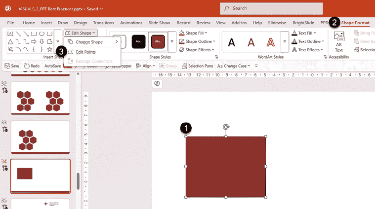

图 7.18 – 通过形状格式选项卡访问编辑点

+   第二种方法是右键单击形状并点击**编辑点**（*图 7.19*）：

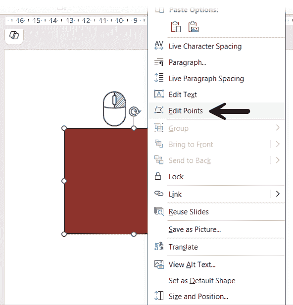

图 7.19 – 通过右键单击形状访问编辑点

无论您选择哪种方法，您的形状现在将在两个线段相交或曲线结束的地方显示黑色圆点，具体取决于您幻灯片上的形状。每个这样的圆点都是一个**顶点**，您可以拖动它们来改变它们的位置。白色方块是帮助您添加或更改段曲线的把手。在我为*图 7.20*创建的示例中，我使用了一个矩形，将右上角的顶点移动，并给它添加了一个曲线：

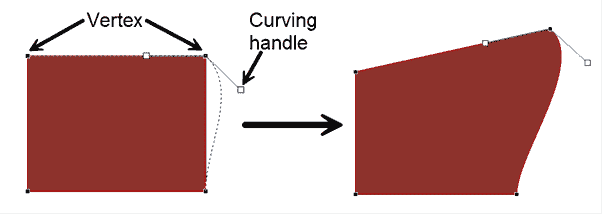

图 7.20 – 使用编辑点重塑矩形

使用**编辑点**进行顶点重定位和曲线段弯曲只是您可以进行的修改之一。如果您在**编辑点**模式下右键单击一个段，您将可以访问一个上下文菜单，允许您对形状进行更多修改，例如添加一个点或删除一个段。您的鼠标光标形状将变为带有矩形的加号（**+**）符号，正如在*图 7.21*中看到的超大规模示例（**1**）：

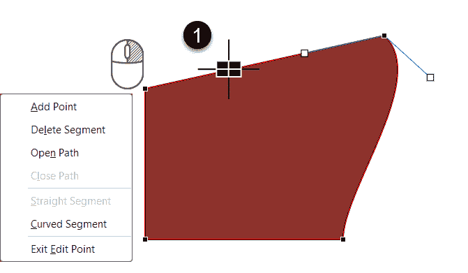

图 7.21 – 在点击段后右键单击菜单

菜单中的操作可能会根据您点击的段落而变为灰色，如果您在顶点点上右键单击，您将获得针对点特定的操作列表。如果您是键盘快捷键爱好者，我建议您查看“进一步阅读”部分中列出的微软文章。如果您不了解**自由形状**工具，这篇文章也会帮助您了解更多相关信息。

我可以继续添加静态图像来尝试传达您可以使用**编辑点**做的一切，但最好的学习方法是亲自实验。如果您一直开着 PowerPoint，我建议您花点时间尝试我刚刚向您展示的基本操作。这可能会给您未来的演示文稿带来一些灵感。

**编辑点**不是在 PowerPoint 中创建新形状的唯一方法，这是下一节的主题，即合并工具。

# 使用合并工具创建新形状

如果您是按时间顺序阅读这本书的，您现在可能已经到了一个有很多创意想法来使您的演示文稿更具视觉吸引力的地方。同时，您可能也会觉得在 PowerPoint 中相同的旧标准形状列表中感到困惑，认为您将不得不联系一位图形设计师来创建您心中的内容。

在寻求帮助之前，请先阅读本节！**合并形状**工具可能正是您所需要的。我将通过三个可能对任何商业演示文稿都有帮助的特定示例向您展示如何使用此工具。

但首先，让我们探索您可以在哪里找到**合并形状**工具以及创建新形状时有哪些选项可用。正如其名所示，您需要在您的幻灯片上选择至少两个形状来激活此工具（*图 7.22*）：

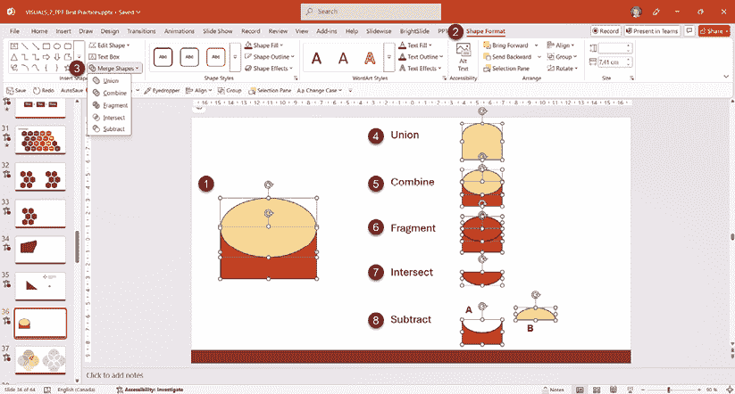

图 7.22 – 激活并找到合并形状工具

选择您的幻灯片上的形状（**1**），然后点击**形状格式**选项卡（**2**）以找到**合并形状**工具（**3**）。当您打开下拉列表时，您将找到以下选项：

+   **联合**（**4**）

+   **组合**（**5**）

+   **碎片**（**6**）

+   **相交**（**7**）

+   **减去**（**8**）

您得到的结果始终取决于您选择形状的顺序。*图 7.22*中的**联合**形状（**4**）是先选择较浅的椭圆，然后选择矩形的组合结果。对于**减去**选项（**8**），形状**A**是先选择矩形，然后选择椭圆的结果，而**B**是先选择椭圆，然后选择矩形的组合结果。当您悬停在选项列表上时，您将获得结果的实时预览。如果您发现结果不是您预期的，无论是形状还是最终颜色，您可以取消选择形状，并按不同的顺序重新选择它们。

**合并形状选择技巧**

预测使用**合并形状**工具将得到的结果可能会让人困惑。但我会与您分享我认为听到的最好的类比，以帮助您理解这个概念，这是我从朋友迈克·帕克森在*亿级图形*那里听到的。您需要将您的形状想象成使用面团和饼干模具。决定哪个形状将是面团——您将首先选择的形状——以及哪个形状（们）将是饼干模具。这样做将帮助您在脑海中想象出将被移除或切割的部分。

现在您已经知道了如何激活工具，在哪里找到它，以及有哪些选项可用，让我们继续探讨在演示文稿中使用示例。

## 分割维恩图

显示各种组件之间的相交关系通常是通过使用 **维恩图** 来实现的。创建一个完美对齐的维恩图的最快方法是使用 **SmartArt** 中的 **维恩图** 布局。但是，如果你需要强调一个或多个相交部分，或者甚至使用微妙的动画来使相交部分在特定顺序中突出显示呢？我们可以尝试手动绘制单独的相交部分，但这并不是最有效的方法。相反，使用 **Venn 图** SmartArt 布局上的 **转换为形状** 和 **取消组合** 工具。

如果你没有从头开始阅读这一章，你可以回到 *图 7.15* 来回顾如何转换和取消组合 SmartArt 布局。

在 *图 7.23* 中，你可以看到左侧的取消组合的维恩图（ **1** ）：

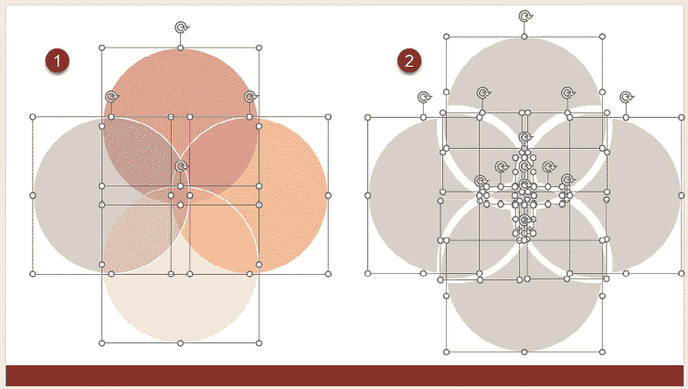

图 7.23 – 转换、取消组合和分割 SmartArt 布局

在右侧（ **2** ），你可以看到应用了 **合并形状** 工具的 **片段** 选项后的结果形状。*我确实增加了形状之间的间距，以便你能够看到它们都是独立的部件。* 你可以为形状应用各种颜色，以帮助你关注特定的数据。你拥有比简单地使用原始 SmartArt 布局更灵活的视觉效果，而无需花费大量时间来创建它。你可以使用任何具有重叠形状的 SmartArt 来完成类似的事情。

现在，让我们看看如何使用 **合并形状** 工具创建特殊的文字效果。

## 创建特殊文字

如果你曾经尝试过在不了解 **合并形状** 工具的情况下创建带有特殊运动效果的字母，我相当确信你不得不花费大量时间创建单独的文本框，也许还会因为某些形状效果没有显示在你的字母上而感到困惑。

再次，让我们使用 **合并形状** 工具，这样你就不必花费太多时间来创建美观的效果。你可以按照 *图 7.24* 中显示的步骤进行：

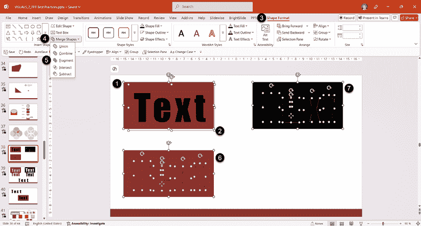

图 7.24 – 使用合并形状创建字母形状

+   在你的幻灯片中插入一个形状，并用你想要的文字颜色填充，或者任何其他颜色都可以（ **1** ）。然后，添加一个文本框并格式化文字的字体、大小和颜色（ **2** ）。

+   选择两个形状，然后转到 **形状格式** 选项卡（ **3** ），点击 **合并形状**（ **4** ），然后选择 **片段**（ **5** ）。

+   如果你首先选择形状，然后选择文本框，你将拥有形状颜色的段落（ **6** ）。

+   如果你首先选择文本框，然后选择形状，你将拥有原始文本框中字体颜色的段落（ **7** ）。

在这两种情况下，你只需要将字母形状移开，并使用形状格式化工具来创建所需的效果。如果你不熟悉形状格式化工具，你可以通过在功能区上点击**形状效果**按钮在**形状格式**选项卡中找到它们。

在*图 7.25*中，你可以看到我应用了**斜面**效果在较浅的文字（**1**）上，以及**反射**效果在较深的文字（**2**）上：

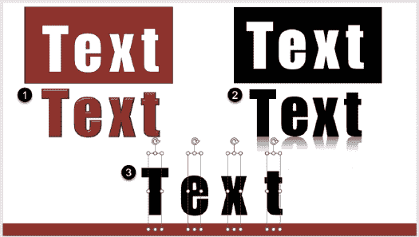

图 7.25 – 应用形状效果到字母片段

为了帮助你理解使用这种方法的优势，我还添加了具有相同字母、相同字体类型和大小（**3**）的单独文本框。它们应用了反射效果，但并不明显。如果你使用形状而不是文本框来输入单独的字母，你可以创建一些效果，但这仍然不如使用合并工具高效。

这里是一个如何使用相同的过程通过图像来创造性的例子（*图 7.26*）：

图 7.26 – 使用片段选项在图像上创建文本效果

+   添加一张全屏图像和覆盖其上的文本框 – 使用大字体以获得更好的效果。确保你有第二张将在最后一步使用的图像副本。

+   首先选择图像，然后选择文本框，转到**形状格式**选项卡，使用**合并形状** | **片段**来创建单独的字母。

+   删除带有剪贴字母的图像，添加原始图像，并将其发送到背景。根据需要调整字母的大小，并应用图像效果，例如斜面，然后 voilà！你现在有一个只花了几分钟就创建的美丽幻灯片效果。

我给出了使用**合并形状**工具的**片段**选项的一些具体效果的例子，这样你就可以轻松地在将来使用它们。但不要忘记，你也可以使用其他选项创建许多创意形状。熟悉工具的最好方法是尝试它们。

在本章的最后部分，我们将讨论如何将 PowerPoint 的股票图像选项作为起点，以及如何根据我们的需求自定义图像和图形。

# 使用和自定义股票图像和其他图形

如果你长时间使用 PowerPoint，你可能还记得剪贴画库，这是微软多年来在 Office 套件中提供的图形元素集合。随着设计预期的演变，它变得过时了，在大多数情况下在商业环境中不被认为是专业的。

随着 M365 订阅模式的引入，Microsoft 恢复了一整套全新的**库存图片**，我必须说它们看起来非常好。它还定期添加新的元素。如果你有 Office 2021/2024 版本，你将能够访问库存图片，尽管你不会得到完整的选项，因为此许可证不会获得功能更新。如果你是 PowerPoint for the web 的用户，它通过 Microsoft 账户连接到网站，但没有 M365 许可证，你将获得一个不包含被认为是高级内容的元素的库存图片子集。

你可能想知道你如何被允许使用库存图片和图形。好消息是：只要你有 Office 2021/2024 或 M365 许可证，并且你将它们用于 Word 文档、Excel 工作簿、SharePoint 网站或 PowerPoint 演示文稿中，无论是以幻灯片形式交付还是导出为 `.pdf` 文件，你就可以使用**库存图片**内容，甚至可以用于商业用途。你不被允许做的两件事如下：

+   将材料复制并粘贴到非 Microsoft 应用程序中（例如，网站）

+   将创意材料保存为图像或视频文件以在其他地方使用

如果你想查看有关此主题的 Microsoft 文章，请查看“进一步阅读”部分提供的链接。

要访问**库存图片**，你需要转到**插入**选项卡（**1**），然后单击**图片**（**2**）并选择**库存图片…**（**3**），或者你可以单击内容占位符中的**图片**图标（**4**）从列表中选择**库存图片**（*图 7.27*）：

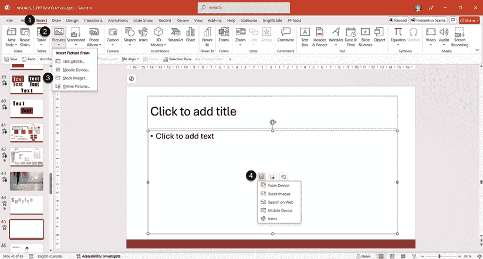

图 7.27 – 插入库存图片

你将打开一个新窗口，其中包含七个内容类别可供选择。对于每个类别，创意内容都被分类到各种类别中，并且可以通过关键词进行搜索。请注意，关键词需要添加到你的应用程序语言中。让我们看看每个类别的示例（*图 7.28*）：

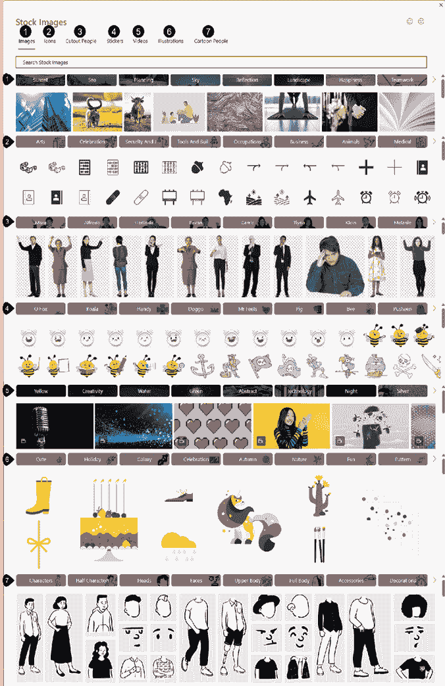

图 7.28 – 库存图片中的七种创意内容类别

1.  **图片**：这些是高质量的图片。

1.  **图标**：这些是看起来现代的图标，易于调整大小和重新着色。

1.  **剪影人物**：这些是没有背景的人物照片。

1.  **贴纸**：这些是类似社交媒体上的卡通图形。

1.  **视频**：这些是不同运动水平的短视频。

1.  **插图**：这些是易于调整大小和重新着色的矢量图形。

1.  **卡通人物**：这些是具有各种部分的卡通人物形象。

从**Stock Images**插入创意内容很容易，但您的任务是确保您包含的元素与您的信息以及您想要在演示文稿中呈现的整体外观相一致。如果您拥有 Copilot 许可证，您还可能想尝试要求它创建新的图片。

### 利用 Copilot 添加新图片

尽管我们在*第五章*中讨论了 Copilot，但在这里添加如何利用 Copilot 在您的演示文稿中创建新图片的方法是有用的。

从 Copilot 聊天开始，添加一个创建图片的提示。提供关于上下文、设置和风格的具体细节。在我的例子中，我使用了：`创建一个商务环境中桌子上电脑的图片`（**1**）（*图 7.29*）：

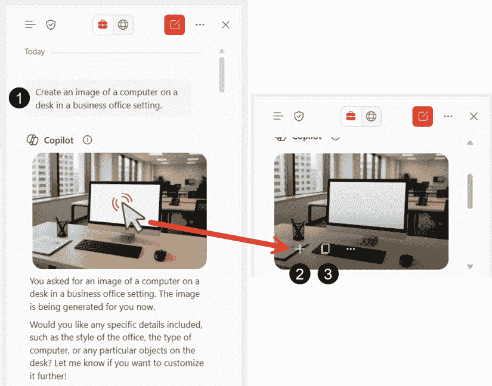

图 7.29 - 使用 Copilot 创建图片

当图片生成后，您可以通过点击**+**符号（**2**）将其插入到您的幻灯片中，或者点击复制图标（**3**）。

通过在聊天框中添加您的请求，持续提示以调整图片以满足您的需求（**1**）（*图 7.30*）：

图 7.30 – 使用自定义或建议的提示来细化图片

您还可以使用建议的提示来要求 Copilot 调整图片（**2**）。

添加到幻灯片中的图片被处理得与任何 Stock Images 创意内容相同，这意味着您可以自定义或调整它。让我们从 PowerPoint 中可用的图片格式工具开始。

## 使用图片格式工具

当您从**Stock Images**插入图片时，您将能够访问许多可以帮助您将其适应演示文稿需求的工具。在我给出一些示例之前，让我们先快速概述所有这些工具（*图 7.31*）：

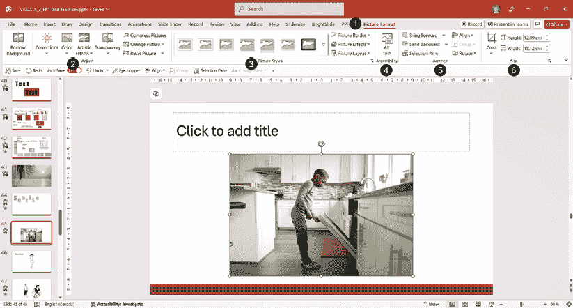

图 7.31 – 图片格式工具概览

+   当您选择了一张图片时，您将看到**图片格式**选项卡（**1**）。

+   在**调整**功能组（**2**）中，您将找到帮助您更改图片视觉外观的工具。我们将在接下来的示例中看到其中的一些。

+   在**图片样式**功能组（**3**）中，您可以访问一个预定义样式的库，并且可以自定义边框并应用各种效果到您的图片上。

+   **可访问性**功能组（**4**）为您提供了一个按钮，允许您快速为您的图片添加替代文本。这是一个您应该在所有演示文稿中使用的功能，以确保您的内容对使用屏幕阅读器的人是可访问的。

+   **排列**功能组（**5**）包含帮助您在幻灯片上堆叠、对齐和旋转所有对象的工具，而**选择面板**帮助您查看幻灯片上所有对象的列表。

+   在**大小**功能组（**6**）中，您可以访问帮助您裁剪图片和调整其大小的工具。

当您在**库中的图片**插入图像或剪除人物时，您将看到**图片格式**选项卡（**1**）。此选项卡中的许多工具都易于使用；您只需要亲自尝试它们。以下是一些如何以创意方式使用其中一些工具的示例，以便您能够构建更具影响力的演示文稿。

### 移除图像的背景

如果您已经如*第一章*中所述正确规划了内容，您应该对您想要在演示文稿中包含的视觉元素有所想法。您不必浪费大量时间寻找完美的图像，您可以搜索包含您正在寻找的元素的图像，并使用 PowerPoint 中的**移除背景**工具来丢弃不需要的部分。

当使用**移除背景**工具时，为了获得最佳效果，您需要一张您想要提取的元素与图像其余部分对比鲜明的照片。如果您的图像由太多元素组成，或者您想要提取的主题的边缘被其余内容模糊，您将不得不付出更多的努力，结果可能不会如您所愿。

在以下示例（*图 7.32*）中，我插入了一张**库中的图片**中可用的带有模糊背景的鸟的图片（**1**）。然后，我转到**图片格式**选项卡（**2**），并点击了**移除背景**工具（**3**）：

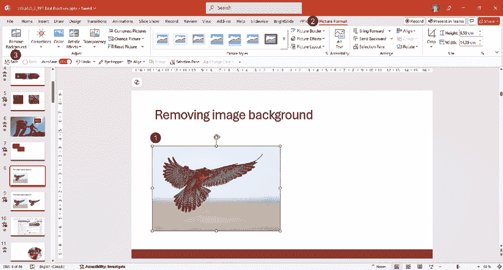

图 7.32 – 查找“移除背景”工具

在*图 7.33*中，您现在有一个名为**背景移除**的新选项卡（**1**）：

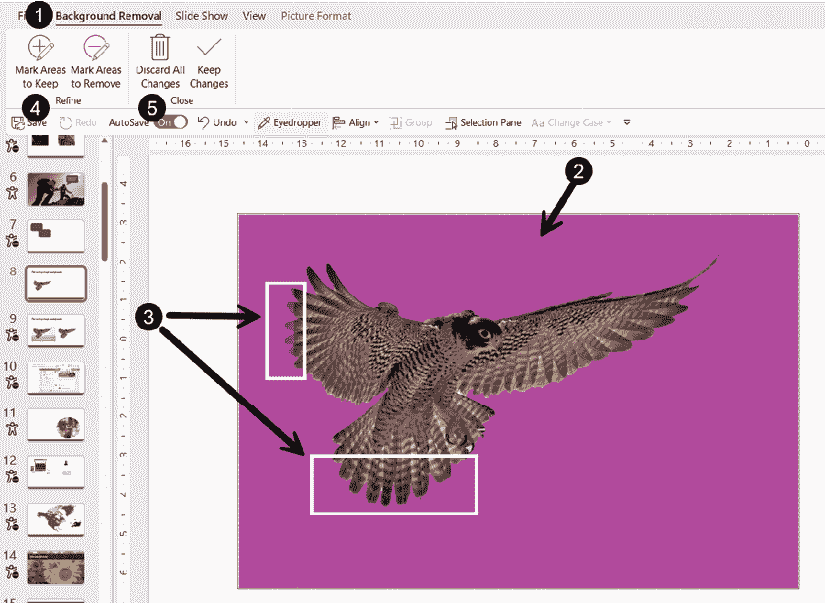

图 7.33 – 使用背景移除工具

工具确定的背景在您的计算机上呈现为洋红色或闪亮的粉色，这表示将要移除的区域。在我的例子中，它看起来像图像中的灰色区域（**2**）。您需要对此步骤给予密切的关注，因为您主题的某些区域可能没有被包含在保留的内容中。在我的例子中，有五个洋红色的翼尖和缺失的白色尾尖（**3**），这意味着如果我不进行调整，鸟儿看起来就不会很好。

这时您需要使用**背景移除**选项卡中的**精修**组中的工具（**4**）：

+   **标记保留区域**：如果您点击此按钮，当您将鼠标悬停在图像上时，鼠标光标将变成铅笔形状。您需要左键单击并绘制您想要包含的部分——释放左鼠标按钮时，它将绘制一条绿色线条，该线条随后消失。

+   在处理过程中，您可能会看到主题的边缘发生变化，包括或排除其部分，因为系统试图找到您在图像其他地方刚刚包含的像素颜色。因此，您需要从一个主题与背景对比鲜明且不包含太多细节的图像开始。

+   **标记要移除的区域**：如果您有不想包含的区域，或者在前一个过程中被包含的区域，此工具允许您标记它们。这与保留区域的过程相同，只是您所画的线是红色的。您还需要注意在此步骤中进行的任何其他选择更改。

在这两种情况下，您不需要精确地绘制整个区域——您只需在需要包含或排除的颜色上画一条线即可。在**关闭**组（**5**）中，如果您对结果不满意，可以选择**丢弃所有更改**，或者选择**保留更改**以确认背景的移除。按键盘上的*Esc*键也会保留您所做的更改。

这里是我示例中使用的图像的结果（*图 7.34*）：

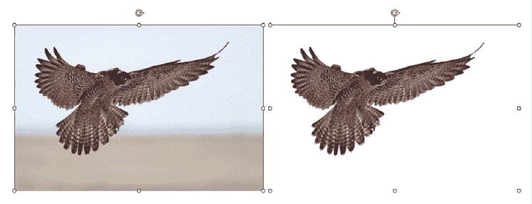

图 7.34 – 使用背景移除工具前后的图像

除了能够在演示文稿中使用无背景的图像外，使用**背景移除**工具还可以帮助您创建特殊效果。

如果您需要一个更强大的工具来从更复杂的图像中移除背景，您最好寻找在线解决方案。**Photoroom**有四个许可级别，从免费到企业级需求。

有时候，您可能不需要移除图像的背景，但仍希望对特定区域进行更近距离的聚焦。这就是下一节中各种裁剪工具可以派上用场的时候。

### 使用各种图像裁剪工具

当您想要调整图像大小并更改其焦点时，裁剪工具可以成为您的最佳助手。当您在幻灯片上选择图像时，它位于**图片格式**选项卡（**1**）中（*图 7.35*）：

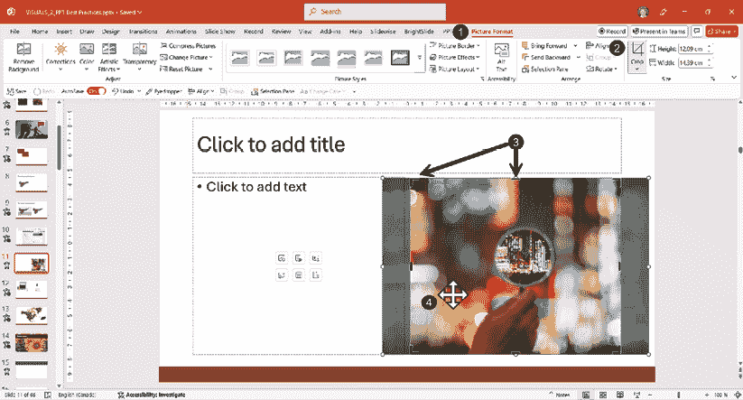

图 7.35 – 在图像上使用裁剪工具

当您单击**裁剪**按钮（**2**）时，您将看到黑色角和侧边手柄，允许您决定图像的哪个区域将被显示（**3**）。在我的示例中，我移除了图像的左右部分，使其与左侧的占位符大小相同。

当您将鼠标悬停在图像上时，您的鼠标光标变成一个四向箭头（**4**），允许您将其定位，以便正确显示焦点元素。要确认更改，只需再次单击**裁剪**按钮（**2**），按键盘上的*Esc*键，或单击所选图像之外即可。

在创建内容时，还有两个可能有用的裁剪选项：**裁剪到形状**和**宽高比**（*图 7.36*）：

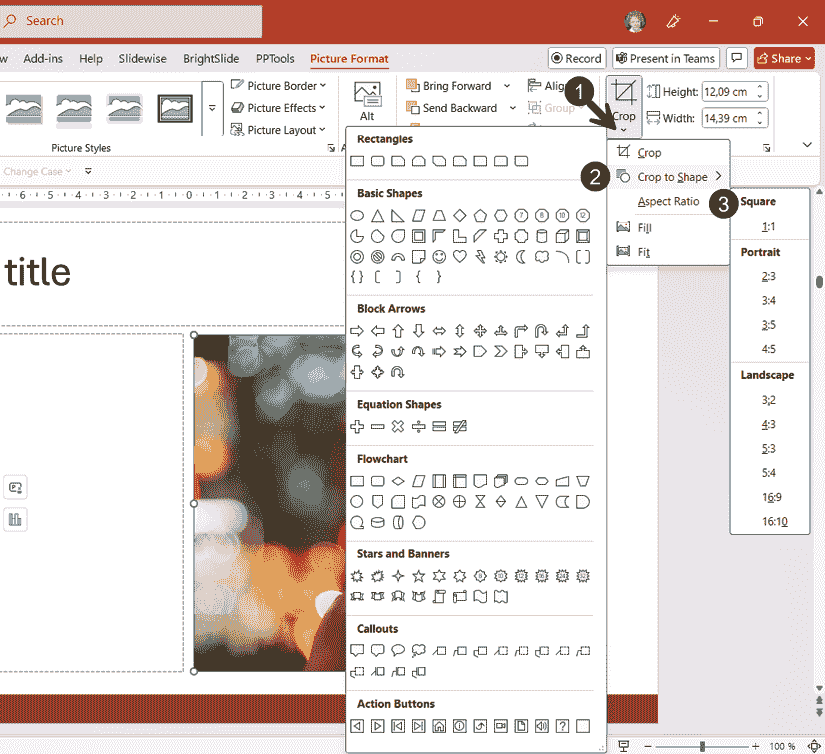

图 7.36 – 访问裁剪到形状和宽高比选项

要访问它们，您首先需要在您的幻灯片上选择至少一张图片，然后点击**图片格式**选项卡下方的**裁剪**按钮旁边的**小箭头**（**1**）。

+   当您选择**裁剪到形状**选项（**2**）时，您将看到所有 PowerPoint 中可用的基本形状的画廊，以便选择。选择一个形状时，它会自动裁剪您的图像并更改其形状。如果您决定所有图像都需要以特殊形状显示，这将很方便。您还可以将此裁剪选项应用于幻灯片母版中的布局中的**图像占位符**，以便自动化您的设计选择。如果您需要复习布局和占位符，可以参考*第三章*。

+   **宽高比**选项（**3**）为您提供了一组常见的宽高比供您选择，这允许您减少手动裁剪。

当您需要在一个幻灯片上构建所有图像都具有相同宽高比且图像数量超过**设计器**功能所能处理的布局时，此选项非常有用。您可以制作所有图像为正方形，宽高比为 1:1，然后使用对齐工具快速将它们显示在幻灯片上。

在结束本章之前，我们将了解如何自定义图标和插图，这是在**股票图片**中可用的两种创意内容元素。

## 自定义图标或插图

在本节开始时，我们看到了**股票图片**中可用的七种创意内容类型。现在我们将了解如何自定义**图标**和**插图**，以便它们与您的演示文稿的整体外观很好地融合。

在以下示例中，我插入了一台可以自定义的计算机（*图 7.37*）：

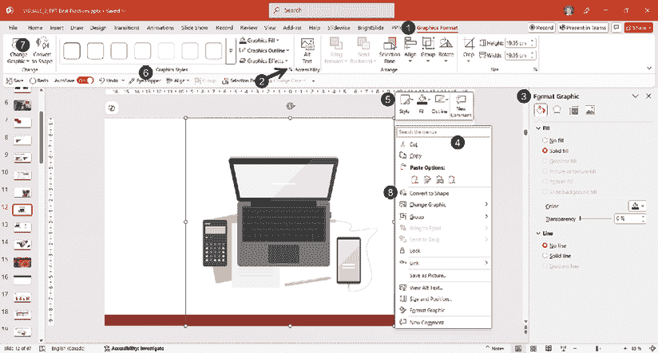

图 7.37 – 访问图形格式化工具

您可以从**图形格式**选项卡（**1**）访问格式化工具，点击功能区上的**对话框启动器**图标（**2**）以打开**格式图形**面板（**3**），然后右键单击插图以访问上下文菜单中的选项（**4**）。此最后操作还会使浮动格式化工具可用（**5**）。

根据您插入的插图，您将能够更改图形中某些元素的填充颜色，通过选择对比度高的轮廓颜色来改变外观，并使用**图形样式**组中的功能应用图形效果（**6**）。您只需尝试更改几个选项，看看您插入的插图如何反应。如果这样做不足以满足您的定制需求，那么您需要点击功能区或上下文菜单中的**转换为形状**（**7**）。

此操作会导致形状取消分组，以便每个形状都可以应用自定义格式（*图 7.38*）：

图 7.38 – 使用“转换为形状”在插图上的结果

在取消组合后，您可以使用每个形状的形状格式化工具，甚至删除或移动其中一些。正如您所看到的，浏览**股票图片**中提供的创意内容可以是一个很好的起点，帮助您节省一些设计时间。只需使用本节中介绍的工具来定制和调整它们以满足您的需求。

在取消组合插图以获得单独的形状后，您甚至可以更进一步，使用本章前面部分讨论过的**编辑点**和**合并形状**工具。如果您开始使用这些工具的力量，可能性将是无限的！

我刚才描述的步骤也可以用于**股票图片**中提供的图标，因为它们就像插图一样；这两个类别都被认为是易于调整大小和格式的矢量对象。您需要额外一步来访问单个形状（*图 7.39*）：

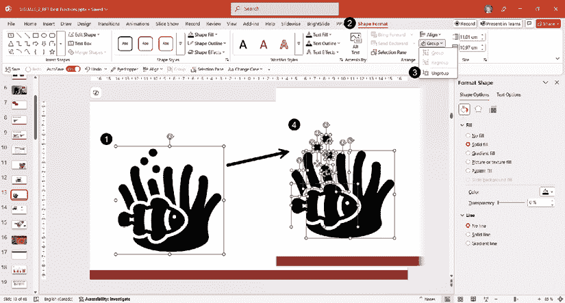

图 7.39：取消组合转换后的图标

在添加**股票图片**中的图标后，确保它被选中（**1**），然后转到**形状格式**选项卡（**2**）以访问**取消组合**（**3**）。这将使您能够访问形状（**4**），允许您删除、移动或更改其中任何一个的颜色。

如果您还没有尝试本章中描述的工具，我强烈建议您留出一些时间来尝试。熟悉您不熟悉的功能和工具的唯一方法是通过实践。

# 摘要

在本章中，我们讨论了如何通过添加地图和使用和自定义 SmartArt 来在您的幻灯片上创建更具视觉吸引力的元素。我们还学习了如何使用**编辑点**和**合并形状**来创建自己的形状，并自定义 Microsoft 在**股票图片**库中提供的创意内容。

您现在已经拥有了足够关于工具和特性的知识，可以开始创建自己的视觉内容或调整 PowerPoint 中提供的任何默认元素。是的，您可能会在某些时候感到被可能性所淹没。毕竟，我们的大脑并没有一个可以开启或关闭的创造性开关！

只需给自己一些时间来熟悉这些工具，并且不要觉得您需要一次性改变所有的视觉元素。这里有一个挑战：在您的下一次演讲之前，安排更多的时间来设计，并设定目标使用本章中学到的一种技术。随着您对工具和功能的熟悉程度提高，您可以在内容中实施更多的视觉变化。

在下一章中，我们将讨论如何添加和修改多媒体元素。您将学习如何在演示文稿中包含视频和音频，使用一些基本的编辑工具，并使用 PowerPoint 创建视频。

# 进一步阅读

+   关于**《更好的讲台》**，由**诺兰·海姆斯**所著：[`thebetterdeckdeck.com/`](http://thebetterdeckdeck.com/)

+   **编辑点**键盘快捷键：[`support.microsoft.com/en-us/office/draw-or-edit-a-freeform-shape-44d7bb9d-c05c-4e1c-a486-e35fc322299b`](https://support.microsoft.com/en-us/office/draw-or-edit-a-freeform-shape-44d7bb9d-c05c-4e1c-a486-e35fc322299b)

+   库存图片的使用条款和许可，用简单语言说明：[`support.microsoft.com/en-us/topic/what-am-i-allowed-to-use-premium-creative-content-for-0de69c76-ff2b-473e-b715-4d245e39e895`](https://support.microsoft.com/en-us/topic/what-am-i-allowed-to-use-premium-creative-content-for-0de69c76-ff2b-473e-b715-4d245e39e895)

|

#### 现在解锁此书的独家优惠

扫描此二维码或访问[`packtpub.com/unlock`](https://packtpub.com/unlock)，然后通过书名搜索此书。 |  |

| **注意** *：开始之前，请准备好您的购买发票。* |
| --- |
