# 8

# 添加和修改多媒体元素

在视觉内容创建方面，到目前为止，我们已经了解了一些 PowerPoint 的功能，它们利用了人工智能，以及其他帮助我们使用视觉元素而不是文本和项目符号的功能。现在是时候通过学习如何包含多媒体元素来进一步提升您的演示技巧了。

添加多媒体元素将有助于使您的演示文稿更具影响力，通过提供内容多样性，同时通过简短视频而不是长篇文字说明，使某些主题更容易学习。

在本章中，我们将讨论以下主题：

+   插入和格式化视频

+   插入和格式化音频

+   使用**Cameo**功能

+   插入用于演示的截图或屏幕录制

+   从演示文稿创建视频文件或 GIF

# 技术要求

本章讨论的大部分主题不需要 M365 订阅，因为工具和功能已在 PowerPoint 的先前版本中介绍。我将标识哪些功能仅在 M365 中可用。此外，请注意，由于 PowerPoint 的订阅版本正在持续更新，因此某些功能在您应用的版本中可能看起来并不完全相同。

# 插入和格式化视频

将视频插入到您的演示文稿中可能看起来是一项艰巨的任务，主要原因通常是许多用户感到被所有可用的格式和与所使用 PowerPoint 版本兼容性问题所压倒。因此，让我们首先定义支持的文件格式。

## 支持的视频文件格式

在 PowerPoint 中选择视频文件格式曾经有如此多的变量！支持的文件格式高度依赖于几个因素，包括安装的 Microsoft Office 版本、我们是否使用 Windows 或 Mac、安装的操作系统版本以及演示文稿将在哪种设备上查看。好消息是，PowerPoint 的现代版本（2021、2024 和 M365）简化了该列表的复杂性。

**警告**

如果您仍在使用**Office 2010**（支持已于 2020 年 10 月结束）或**Office 2013**（支持已于 2023 年 4 月结束），您正在使您的计算机面临重大的安全风险。对于**Office 2016**和**Office 2019**，支持结束计划于 2025 年 10 月，而**Office 2021**的支持结束计划于 2026 年 10 月。我最好的建议是投资于一个最新的版本，例如**Office 2024**（一次性购买，支持至 2029 年 10 月），或一个**M365**订阅，这样您就可以始终使用功能和安全性的最新版本。如果您仍在使用**Windows 7**（支持已于 2020 年 1 月结束）或**Windows 8.1**（支持已于 2023 年 1 月结束），您也处于风险之中。计划于 2025 年 10 月结束对**Windows 10**用户的支持，这意味着只有**Windows 11**将得到支持。

仍然有相当多的视频文件格式在流传——请参阅*进一步阅读*部分中的 Microsoft 文章，但请记住，我们想要确保我们演示文稿中包含的视频能在大多数设备上播放，并且被大多数操作系统支持。以下是可以查找的两个格式：

+   在 Windows、macOS、Office for iOS 和 Office for Android 上支持 `.mp4` 格式

+   在 Windows 和 macOS 上支持 `.avi` 格式

有些人可能会说我在这里跳过了很多技术细节，他们是对的。我只是遵守了对所有需要保持事情简单化的商人的承诺。如果您在演示文稿中插入上述任何一种视频文件格式，您很可能会避免遇到问题。

如果您遇到任何问题，例如您的硬件不支持在演示文稿中播放视频，请查看*进一步阅读*部分中列出的其他 Microsoft 资源，以获取有价值的信息。

现在您对视频文件格式有了更多了解，我们可以继续学习如何在演示文稿中插入视频。

## 插入视频文件

在您的演示文稿中使用视频可以是很有价值的，无论是为了帮助您讲述更强大的故事，还是为了比文本描述更快地演示一个手动过程。无论如何，请确保您选择一个相关且简短的视频。在我们的快节奏世界中，人们的注意力跨度很大，所以我建议保持您的视频简短。多长才算合适？一个节奏快的视频可能能让您的观众保持专注长达 2 分钟，但目标是 30 到 60 秒。如果您展示的是一个较长的过程，我们将在下一节中看到如何使用格式化工具将文件裁剪成更短的片段。

在您的演示文稿中插入视频可以通过三个 PowerPoint 占位符之一或使用**插入**选项卡来完成。我们将看到这两种方法。

### 从占位符插入

我已经创建了一个幻灯片布局，其中包含三种类型的占位符，您可以从这些占位符中插入视频文件到您的演示文稿中（*图 8.1*）。让我们看看如何：

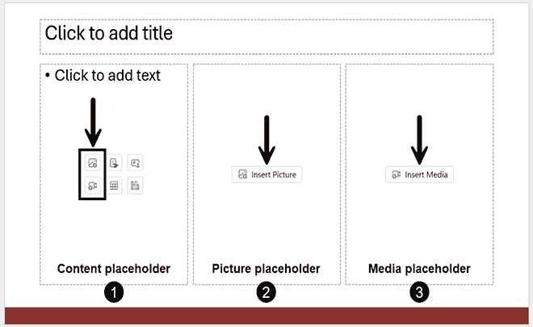

图 8.1 – 包含内容、图片和媒体占位符的幻灯片

+   从内容占位符（**1**），点击相机图标会打开一个窗口，让您从电脑中浏览文件。这意味着如果您已将云存储同步到文件资源管理器，您也可以从同一个窗口访问这些文件。如果您点击图片图标，它将打开一个列表，您可以通过它访问**库存图片**，其中有一个**视频**标签，如*第七章*中所述。

+   从图片占位符（**2**），点击**插入图片**也会提供对**库存图片**库的访问。

+   从媒体占位符（**2**），点击**插入媒体**会打开与内容占位符相同的窗口，以选择您的文件。

**重要提示**

从占位符图标添加的视频不会受到占位符大小的限制，就像我们为图片占位符所看到的那样。它们通常会被添加为全幻灯片大小的视频。你需要使用视频格式化工具并做一些手动工作来调整它们的大小。*图 8.1*中的幻灯片示例在现实生活中的条件下可能不是一个高效的布局。

如果你需要回顾占位符的相关内容，请参阅*第三章*。在下节中，我们还将再次讨论如何从**股票图片**库中插入媒体。

当你提前计划幻灯片布局时，将视频添加到演示文稿中只需两步：一步选择布局，另一步点击适当的图标。但如果你不经常使用视频，你可以简单地使用你文件中的任何布局的**插入**选项卡。

### 从你的电脑或股票图片中插入视频

你可能并不总是为视频计划幻灯片布局。如果是这种情况，只需使用任何布局，然后点击**插入**选项卡（**1**），然后点击功能区上的**视频**按钮（**2**），以获取**从以下位置插入视频**列表（*图 8.2*）：

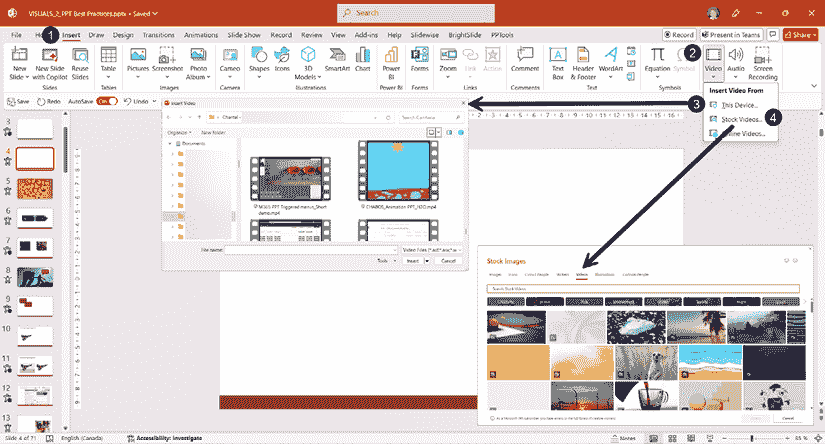

图 8.2 – 使用插入选项卡从你的设备或股票图片中添加视频

根据你的电脑屏幕大小或分辨率，你可能无法直接在功能区看到**视频**按钮；寻找**媒体**按钮，然后在下拉菜单中点击**视频**。

然后，你可以选择**此设备…**（**3**）并从打开的**插入视频**窗口中选择一个视频文件。只需在任意网络服务器或同步云文件上本地浏览。

当你选择**股票视频…**（**4**）时，它将在**视频**选项卡中打开**股票图片**库。列表中的每个缩略图都有一个小的相机图标，表明它是一个视频文件。

需要指出的是，当你从占位符或使用**插入** | **视频**选项插入视频时，视频文件将成为你的 PowerPoint 文件的一部分。你可以在任何电脑上使用你的演示文稿文件，因为它包含了你的视频，尽管你需要测试播放以确保你的演示文稿可以顺畅运行。但这确实意味着视频的大小会被添加到整个演示文稿文件的大小中，如果你嵌入了一个大视频文件，这可能会导致文件变得非常大。我们将在本章后面讨论如何处理文件大小。

### 链接到视频文件

当从你的设备插入视频文件时，**插入视频**窗口确实还有一个隐藏的选项（*图 8.3*）：

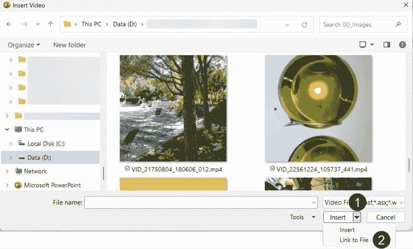

图 8.3 – 在插入视频窗口中链接到文件

在点击**插入**按钮而不是点击它右侧的小箭头（**1**）以打开包含**链接到文件**选项（**2**）的下拉列表之前，你需要这样做。这个选项正是它所说的那样——链接到一个文件，这可以减小你的演示文稿文件大小。但是有一个注意事项：如果你的视频文件从原始位置移动或重命名，你会收到一个错误消息。使用链接功能最安全的方法是始终将视频文件放在与你的演示文稿文件相同的文件夹中。如果你需要在另一台电脑上展示，你需要确保你正在访问包含视频文件的文件夹，无论你使用的是 USB 便携设备还是云存储。

### 插入在线视频

我还想向您展示一个最终的插入视频功能，这个功能也来自**插入**标签页，通过点击**视频**按钮（**2**）——**在线视频…**（**3**）选项（*图 8.4*）：

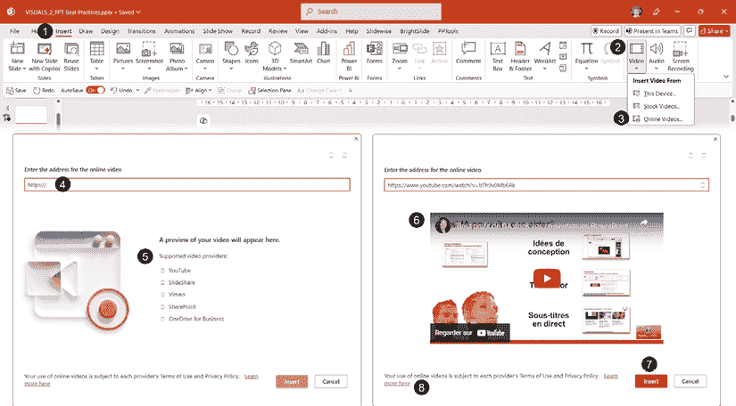

图 8.4 – 将在线视频插入到你的幻灯片中

 **快速提示**：需要查看此图像的高分辨率版本吗？在下一代 Packt 阅读器中打开此书或在其 PDF/ePub 副本中查看。

 **新一代 Packt 阅读器**以及本书的**免费 PDF/ePub 副本**包含在您的购买中。扫描二维码或访问[`packtpub.com/unlock`](https://packtpub.com/unlock)，然后使用搜索栏通过名称查找此书。请仔细检查显示的版本，以确保您获得正确的版本。

选择**在线视频…**会打开一个新窗口，其中有一个字段，你可以粘贴你的视频地址（**4**），以及一个包含**支持的视频提供商**（**5**）的列表。自从本书第一版编写以来，有一个很好的补充，那就是可以链接到 SharePoint 站点或 OneDrive for Business 上的视频。

例如，我复制了我 YouTube 频道上的一段视频地址（**6**）来展示显示的内容。当你点击**插入**按钮（**7**）时，视频就会在幻灯片上可用。你需要调整其大小，静态图像看起来会有像素化，但在幻灯片放映视图中看起来会非常完美。如果你决定在演示中展示在线视频，有三个重要的事项需要考虑：

+   视频并未包含在你的文件中。它链接到互联网上的地址。如果你在一个没有 Wi-Fi 或有线网络访问的环境中展示，它将无法播放。

+   当在网络上链接视频时，您需要确保您有权展示该视频。如果这不是您的内容，请确保阅读网站上的**使用条款**和**隐私政策**细节。在*进一步阅读*部分查看 Microsoft 支持文章或点击窗口中的**了解更多信息**链接（**8**）。

+   如果您将在线视频设置为全幻灯片，当它到达结束时，点击视频不会带您进入下一张幻灯片！当使用**演示者视图**（见*第十三章*），您可以在网格视图中访问您的幻灯片并点击下一张幻灯片。如果您不使用演示者视图，请计划将视频大小调整为小于幻灯片大小，这样您就可以将鼠标光标移到幻灯片上并点击以访问您的下一个视觉元素。

需要记住的是，在线视频无法使用 PowerPoint 的视频格式功能进行编辑或格式化，这是我们下一个章节的主题。

## 格式化视频文件

在将视频文件插入到您的演示文稿中后，当您在幻灯片上选择它时，您将获得许多格式化功能。在我给您提供一些示例之前，让我们先快速概述一下**视频格式**选项卡中的工具（**1**）：

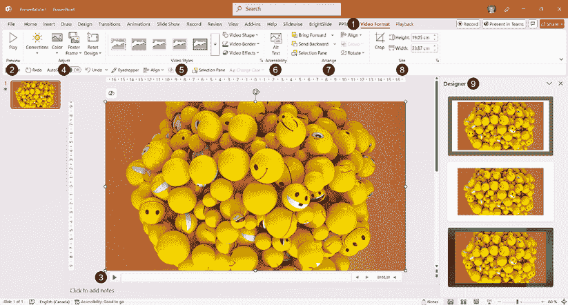

图 8.5 – 使用视频格式选项卡中的格式化功能

+   在**预览**组中，您可以使用**播放**按钮（**2**）来开始和暂停您的视频。您还可以使用幻灯片底部视频上的播放按钮（**3**）。

+   在**调整**组（**4**）中，您可以使用帮助您校正亮度和对比度以及重新着色视频的工具。我们将在接下来的示例中讨论**海报框架**和**重置设计**。

+   **视频样式**组（**5**）为您提供预定义样式的库，您可以自定义形状和边框，并应用各种效果到您的视频上。

+   **可访问性**组（**6**）为您提供快速添加 Alt 文本到视频的按钮。这是一个您应该在所有演示中使用的功能，以确保您的内容对使用屏幕阅读器的人是可访问的。

+   在**排列**组（**7**）中，您有与上一章中图片可用的相同工具。它们帮助您在幻灯片上分层、对齐和旋转所有对象。您还可以从该功能组打开**选择**面板。

+   在**大小**组（**8**）中，您可以访问帮助您裁剪和调整视频大小的工具。

+   除非您已禁用**设计器**（**9**），否则如果您已插入视频且演示模板兼容，您也应该看到设计想法。

此选项卡中的许多工具都易于使用；您只需要亲自尝试它们。以下是一些如何使用其中一些工具的示例，以帮助您根据需要修改视频。

### 为您的视频选择海报框架

海报框架是我们播放视频之前看到的静态图像。让我们看看帮助您控制该静态图像将显示什么选项（*图 8.6*）：

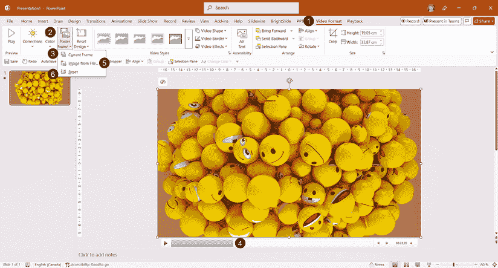

图 8.6 – 更改视频海报框架的选项

+   确保您的视频已选中，并打开**视频格式**选项卡（**1**）。

+   点击**海报框架**按钮（**2**）。

+   **当前帧**选项（**3**）允许您在某个图像（**4**）上暂停视频，并将其用作静态图像。当海报框架中有人面部表情不佳时，此选项可能很有用。您还可以选择**从文件中图片…**（**5**）并选择您在企业库中的图像。

+   **重置**选项（**6**）简单地擦除您对海报框架所做的更改，将视频恢复到其原始显示状态。

更改海报框架可能有用的情况示例是，如果您有一个企业视频，并且更愿意在播放之前看到一个大型的标志或办公室的图像作为静态图像。如果您不喜欢在播放视频之前看到的图像，请更改它！

让我们继续更改视频的形状和焦点。

### 更改视频的形状和裁剪

在演示中使用视频时，您不需要保持它们的原始矩形形状。我通过首先在幻灯片上插入三个视频来创建一个示例，这导致视频层层叠加并覆盖整个幻灯片。为了节省时间，我通过一键（**1**）应用设计理念来调整视频在幻灯片上的大小和位置（*图 8.7*）：

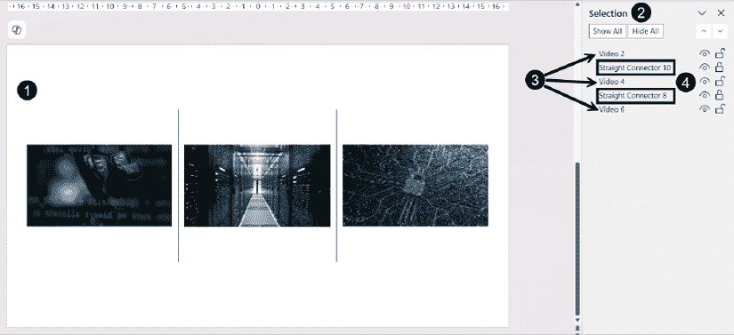

图 8.7 – 应用设计理念创建的幻灯片布局上的三个视频

在**选择**面板（**2**）中，我们可以看到我们添加了三个视频（**3**）和两个直线连接器（**4**）。

如果您不记得如何显示**选择**面板，请回到*第三章*，在*使用锁定功能为占位符或对象*部分。

设计师是一个快速更改布局的有效方式，但很多时候它会添加与演示设计不匹配的装饰形状。当您添加了设计师的装饰项目，例如前一个例子中的直线连接器时，如果它们在您的设计中不是必需的，您只需在**选择**面板中选择它们，然后在键盘上按**删除**键。默认情况下，设计师添加的对象始终处于锁定状态，但您可以在**选择**面板中使用锁图标轻松解锁它们。提醒一下，设计师及其设计理念仅作为带有 M365 许可证的连接服务提供。

要更改视频的形状，你首先需要确保它被选中，这样你才能访问**视频格式**选项卡（**1**）（*图 8.8*）：

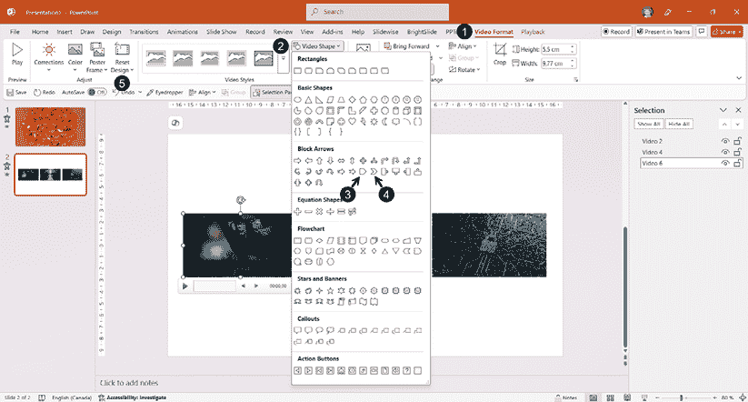

图 8.8 – 更改视频的形状

+   点击**视频形状**按钮（**2**）并从图库中选择任何形状。

+   我的下一个例子是用五边形（**3**）和两个箭头形状（**4**）创建的。

+   如果你关于形状改变了主意，你总是可以点击**重置设计**按钮（**5**）

如果你明智地选择你的视频并为每个视频赋予一个传达过程的形状，它们可以展示你解释的每个步骤。这种例子在*图 8.9*中展示：

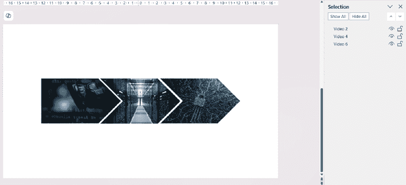

图 8.9 – 三个形状为五边形和两个箭头的视频，以展示一个过程

更改视频的形状可能并不总是满足你的需求。如果你只想有一个正方形而不是矩形怎么办？这就是裁剪工具能帮到你的时候（*图 8.10*）：

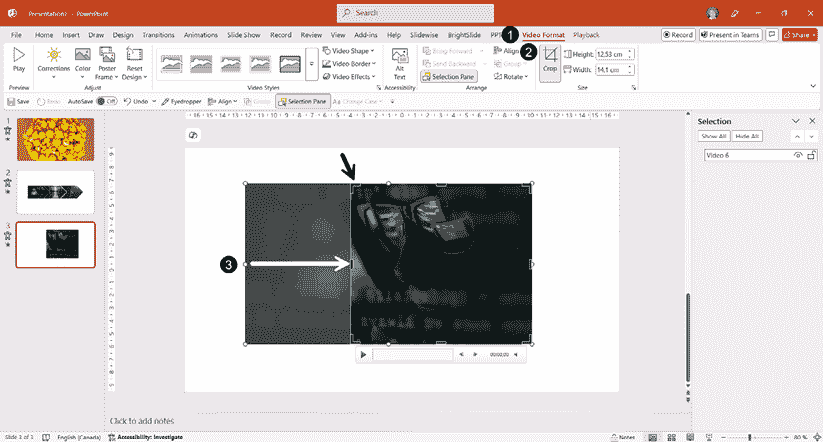

图 8.10 – 在视频上使用裁剪工具

+   当视频被选中时，如果它尚未显示，请点击**视频格式**选项卡（**1**）。

+   点击**裁剪**按钮（**2**）。使用边框上的任何黑色裁剪手柄在播放时隐藏视频的一部分。在示例中，左侧的手柄（**3**）被移动到右侧，这样视频就会变成一个正方形。

需要注意的是，如果在裁剪视频后你改变了主意，你需要回到**裁剪**按钮，移动手柄或将其他元素滑动到焦点区域。使用**重置设计**按钮对裁剪没有影响。即使**重置设计 & 大小**按钮移除了裁剪，它也会恢复视频的原始大小，这可能会比你的幻灯片大小更大。了解这种行为将帮助你根据视频决定什么最适合你。

现在我们已经看到了一些视频的格式化选项，是时候讨论播放选项了。

### 更改一些视频播放设置

当视频被选中（**1**）时，有一个第二个选项卡允许我们进行更改。让我们快速看一下**播放**选项卡（**2**）的选项（*图 8.11*）：

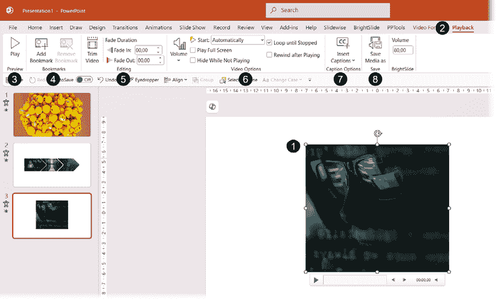

图 8.11 – 视频播放选项卡选项

+   **预览**组（**3**）有一个**播放**按钮，允许你开始或暂停视频。

+   **书签**组（**4**）用于添加可以在高级动画序列中使用的书签。一个例子将在*第九章*中给出。

+   在**编辑**组（**5**）中，你有修剪视频和添加简单淡入淡出效果的工具。

+   **视频选项**组（**6**）允许您对音量、控制视频何时开始以及设置视频如何播放进行各种更改。请注意，从您的设备插入的视频的默认播放方式是**点击顺序**，而不是**自动**。请确保根据您的期望结果进行选择。

+   **字幕选项**组（**7**）允许您上传`.vtt`格式的字幕文件。如果您想使您的演示文稿更具可访问性，这一步不应被忽视。它允许人们在视频播放时阅读所说的词语。这与字幕不同，字幕可以在您的现场演示中用来向观众展示您所说的词语。

+   在**保存**组（**8**）中，**另存为**按钮是一个快速将视频保存为单独`.mp4`视频的方法。请注意，在 PowerPoint 中进行的任何格式或播放更改都不会反映在媒体文件中——您得到的是原始格式和持续时间。

从之前列出的各种选项中，我们首先将更详细地查看**编辑**组中的**裁剪视频**功能。正如其名称所暗示的，它可以帮助您裁剪视频的开始或结束部分。它不能替代专业的视频编辑软件，但在您没有其他软件只有 PowerPoint 或没有创意团队支持的情况下，它可以作为一个快速修复方案。

要访问裁剪选项，您需要首先选择一个视频并转到**播放**选项卡（**1**），然后点击**裁剪视频**（**2**）（*图 8.12*）。让我们探索如何裁剪我们的示例视频：

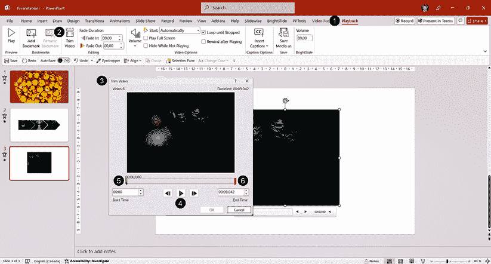

图 8.12 – 访问和使用裁剪视频功能

+   在**裁剪视频**对话框的标题栏下方，您将找到视频的名称及其持续时间。在我们的示例中，我们看到**视频 6**和**持续时间：00:09,042**。

+   您可以使用播放箭头或上一帧或下一帧箭头（**4**）来帮助您找到您想要开始和结束视频的位置。

+   一个更快的方法是点击并拖动左侧的起始标记（**5**），在界面上呈绿色，并观看预览窗口以停止移动到您想要开始的位置。您也可以用相同的方法操作右侧的结束标记（**6**），在界面上呈红色，以选择您想要停止视频的位置。

移动两个标记后，您将看到新的剪辑持续时间（**1**），以及精确的**开始时间**（**2**）和**结束时间**（**3**）详细信息（*图 8.13*）：

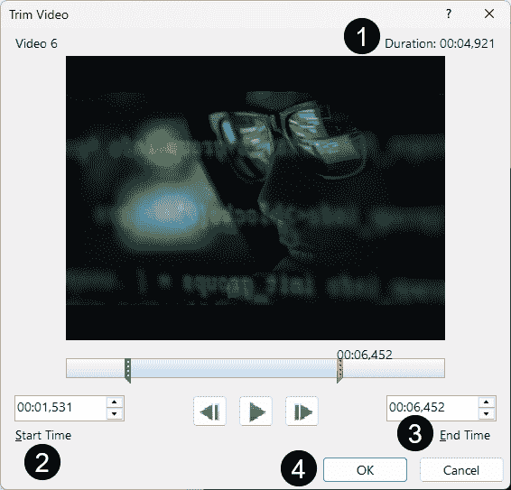

图 8.13 – 裁剪视频的开始和结束时间

剩下的唯一操作就是点击**确定**按钮（**4**）以确认更改。

最后，让我们更仔细地看看**播放**选项卡中可用的**视频选项**设置，以便您更好地了解您可以更改的内容以及原因（*图 8.14*）：

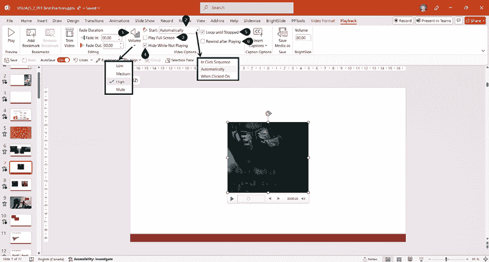

图 8.14 – 播放选项卡中视频选项的概述

+   **音量**按钮（**1**）允许你为你的剪辑选择音量级别。在大多数情况下使用**高**设置可能是最好的，这给你或虚拟演示时的观众提供了调整演讲者音量的机会。如果自动勾选了**静音**设置旁边的复选框，通常是因为剪辑没有声音。

+   **开始**选项（**2**）通常设置为**自动**，这意味着当你在幻灯片放映过程中到达该幻灯片时，视频会自动开始。点击箭头会弹出一个列表，允许你选择另一个设置。"**点击顺序**"意味着你可以在动画序列中启动视频，这使得使用演示文稿遥控器变得容易。"**点击时**"选项需要你点击视频或播放器来启动它。我们将在下一章中看到一个视频动画设置的例子。

+   **全屏播放**选项（**3**），当勾选时，确保在幻灯片放映模式下视频将全屏播放。如果你想在幻灯片上显示多个视频，如菜单，你可以使用此选项确保一次只关注一个全屏视频。

+   **不播放时隐藏**选项（**4**）允许你在播放视频之前将其隐藏。请注意！如果你选择了此选项并且**点击时**启动选项，你将永远无法点击视频。

+   **循环播放直到停止**选项（**5**）如果你想要确保一个短剪辑在你点击它暂停或切换到另一个幻灯片之前一直播放，这是一个不错的选择。

+   **播放后倒带**选项（**6**）可以在你想要确保视频在播放结束后返回第一帧或海报帧时使用。

现在我们已经看到了在演示文稿中插入和格式化视频的基础知识，让我们继续学习如何插入和格式化音频剪辑。

# 插入和格式化音频

在某些情况下，在你的演示文稿中使用音频特别有用，但我经常听到用户因为所有格式和兼容性问题而感到困惑，就像我们之前讨论视频时那样。再次强调，让我们首先定义支持的文件格式。

## 支持的音频文件格式

由于音频和视频的版本和兼容性问题相似，我不会重复在视频部分所做的介绍。我将在*进一步阅读*部分再次引用讨论视频和音频格式的 Microsoft 文章。如果你想确保包含在演示文稿中的音频文件在大多数设备上播放，并且被大多数操作系统支持，以下是你可以查找的三个格式：

+   `.mp3`格式在 Windows、macOS、iOS 和 Android 上受支持

+   `.mp4`格式在 Windows、macOS 和 iOS 上受支持

+   `.wav`格式在 Windows、macOS 和 Android 上受支持

再次提醒，我跳过了许多技术细节。但正如微软在其自己的支持文章中提到的，知道文件名就足够查找正确的文件或必要时使用文件转换器。如果您将上述音频文件格式之一插入到您的演示文稿中，您很可能会避免遇到问题。如果您遇到任何问题，*进一步阅读*部分中列出的微软资源将帮助您。

现在您对音频文件格式有了更多了解，我们可以继续在演示文稿中插入音频。

## 插入音频文件

在您的演示文稿中使用音频可以是很有价值的，无论是帮助您讲述更强大的故事，还是帮助您的观众通过聆听相关音频更好地理解。也有时候，当演示文稿在没有演讲者观看时，需要音频来添加旁白。正如我们之前提到的视频一样，音频应该是相关且简短的。

在您进行演示时使用音频，我建议将音频剪辑的长度控制在视频长度以下，因为观众只有听的内容——少于 30 秒将是一个很好的目标。如果您使用 PowerPoint 创建培训，您应该计划显示静态幻灯片少于一分钟或使用顺序动画，以便内容看起来更加吸引人和生动。

您不能从占位符中插入音频。您需要使用 **插入**选项卡（**1**）（*图 8.15*）：

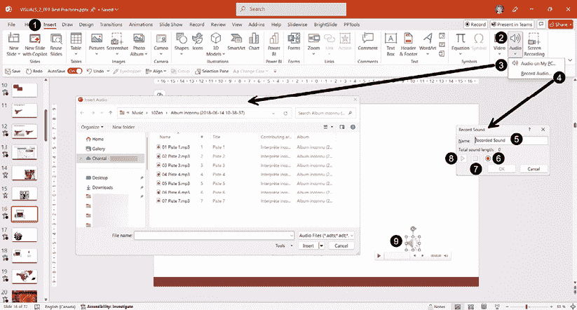

图 8.15 – 在演示文稿中插入音频

+   当您点击 **音频**按钮（**2**）时，您将打开一个包含两个选项的列表。如果您看不到按钮，请查找 **媒体**。

+   点击 **我的电脑上的音频…**（**3**）选项将打开一个窗口，以便在您的电脑上浏览文件。

+   点击 **录制音频…**（**4**）选项将打开 **录音声音**对话框，您可以在其中为您的录音命名（**5**）。准备好后，使用录音按钮（**6**）启动它，完成时使用停止按钮（**7**），使用播放按钮（**8**）来收听您的录音，然后点击 **确定**按钮将其插入到您的幻灯片中。

如果您想录音，请确保您的电脑连接了麦克风。这将提高录音的质量。

+   在从您的电脑插入音频文件或录制剪辑后，您将在您的幻灯片上看到一个音频图标（**9**），下面是播放选项的播放器。

当您的音频文件已插入并且已选中您的幻灯片（**1**）时，您将可以访问两个新的选项卡：**音频格式**（**2**）和**播放**（**3**）（*图 8.16*）：

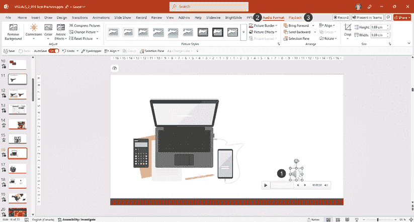

图 8.16 – 选择音频文件可访问音频格式和播放选项卡

让我们看看在 **音频格式**选项卡中哪些元素可能有用。

## 格式化音频文件

在**音频格式**选项卡中，你看到的功能组与我们在上一章讨论图片格式时看到的一样。这主要是因为你的音频文件图标被视为图片对象。由于图标通常在演示过程中被隐藏，你不需要在这个选项卡上花费任何时间。但我将向你展示一个可能对某些演示有趣的技巧。

如果你的主题需要你在幻灯片上播放几个音频剪辑，你可以通过使用**更改图片**按钮（**1**），用图片（**2**）或图标（**3**）替换音频图标来实现。这样做会为你提供一个很好的视觉线索来选择你想要播放的音频（*图 8.17*）：

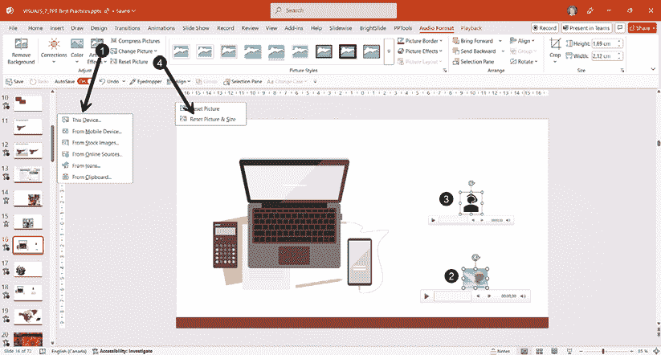

图 8.17 – 用图片或图标替换音频剪辑图标

如果你使用的图标或图片看起来像是被裁剪过的，你可能需要使用**重置图片**（**4**）然后**重置图片和大小**（**4**）来将其恢复到原始大小比例。这种行为已经演变为保持音频图标的比例，而不是其替代图像或图标。

注意，在替换原始图标后，你将无法将其重置回原始图标。但你可以回到微软图标库并搜索与原始图标相似的图标内容；使用`audio`关键字会得到很好的结果。

大多数情况下，你不需要在**音频格式**选项卡中更改任何内容，你可以直接打开**播放**选项卡，这是下一节的主题。

### 更改一些音频播放设置

当选择音频剪辑（**1**）时，会有第二个选项卡允许我们进行更改。让我们快速查看**播放**选项卡（**2**）的界面（*图 8.18*）：

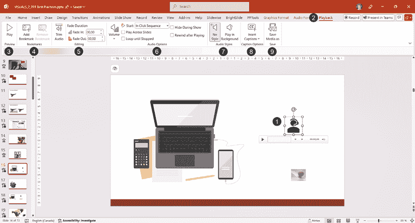

图 8.18 – 音频播放选项卡

+   **预览**组（**3**）有一个**播放**按钮，允许你开始或暂停音频。

+   **书签**组（**4**）用于添加可以在高级动画序列中使用的书签。

+   在**编辑**组（**5**）中，你有一些工具可以修剪音频并添加简单的淡入和淡出效果。

+   **音频选项**组（**6**）允许你对音频音量、开始时间和播放方式进行各种更改。只有两个选项与我们在上一节*格式化视频文件*中讨论的不同：

    +   **跨幻灯片播放**是一个允许声音在背景中播放的选项。

    +   **在演示时隐藏**是如果你想确保音频图标在演示过程中不可见时使用的选项。在正常视图下，图标也可以被拖到幻灯片外部，但这样做可能会在编辑幻灯片时根据你使用的缩放比例而难以看到。

+   在**音频样式**组（**7**）中，你有两个按钮：

    +   **无样式**：一键将音频选项重置为默认设置

    +   **背景播放**：一键设置音频在所有幻灯片中播放，例如背景音乐

+   **字幕选项**组（**8**）允许你上传`.vtt`格式的字幕文件。如果你想使你的演示文稿更具可访问性，这一步不应被忽视。它允许人们阅读音频中说的单词。*注意*：字幕将只在你添加音频的幻灯片上显示。

+   在**“保存”**组（**9**）中，**“另存为”**按钮是一个快速保存音频到幻灯片上作为其自己的`.mp3`文件的途径。请注意，在 PowerPoint 中进行的任何格式或播放更改都不会反映在媒体文件中——你将获得原始格式和时长。

现在我们来看看 PowerPoint 的修剪工具，它可以帮助你调整音频时长以适应你的需求。

### 使用修剪音频工具

**修剪音频**工具的工作方式与之前讨论的**修剪视频**工具大致相同。与**修剪视频**工具一样，它并不能替代专业的音频编辑软件应用，但在没有其他软件（除了 PowerPoint）或创意团队支持的情况下，它可以作为一个快速修复方案。

要访问修剪选项，你需要首先选择一个音频文件，然后转到**“播放”**选项卡（**1**），然后点击**“修剪音频”**（**2**）（*图 8.19*）：

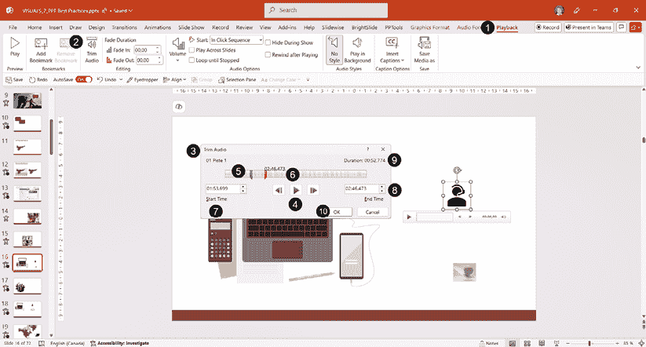

图 8.19 – 访问和使用修剪音频功能

在**“修剪音频”**对话框的标题栏（**3**）下方，你可以找到音频的名称及其时长。让我们看看如何修剪音频：

+   你可以使用播放箭头或上一个或下一个帧箭头（**4**）来帮助你找到你想要开始和结束音频的位置。显然，确保你有耳机或你的扬声器是开启的，以便听到音频。

+   要修剪剪辑的开头，你需要点击并拖动左侧的起始标记（**5**），在界面上显示为绿色。由于你没有音频轨道的视觉预览，你需要使用播放按钮来检查它是否在需要的时候开始播放。

+   你也可以用右侧的结束标记（**6**），在界面上显示为红色，来选择你想要停止音频的位置。这同样是一个试错过程，特别是如果你的音频剪辑较长。你不能在音频波形上放大。

+   在这种情况下，你可能想要通过使用箭头或甚至手动输入时间到字段中来对**“开始时间”**（**7**）和**“结束时间”**（**8**）设置进行微调。

+   移动两个标记后，你将看到新的剪辑时长（**9**）。你只需通过点击**“确定”**按钮（**10**）来确认你的更改。

如果你的文件较长，在 PowerPoint 中剪辑音频可能需要更多劳动，但如果你没有其他软件或创意团队来帮助你，这仍然值得。请记住，这本身并不会改变你的文件——它只会改变播放的开始和结束时间。

微软通过允许演示者将实时相机流插入幻灯片，引入了一种新的方式来提高演示文稿的互动性。这将是下一节的主题。

# 使用 Cameo 功能

我们必须不断寻找新的方法来吸引我们的观众，使用**Cameo**功能在某些情况下可能很有趣。此功能在 PowerPoint 的桌面和网页版本以及 Teams 中的 PowerPoint Live 中可供 M365 订阅者使用。简而言之，Cameo 允许你将实时相机流嵌入到你的幻灯片中。我认为在虚拟演示或在大型场所中，当一些观众可能看不清楚你时，增加演示者可见性是有价值的。它还可以用来聚焦在手语翻译者身上，这是一个更加包容和易于接触的绝佳方式。

要访问此功能，你需要点击**插入**选项卡（**1**）（*图 8.20*）：

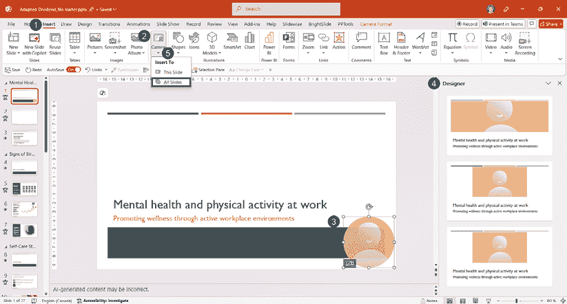

图 8.20 – 访问 Cameo 并插入相机对象

如果你点击**Cameo**按钮（**2**），它将自动在幻灯片的右下角添加一个相机对象（**3**），并可能打开**设计器**面板（**4**）以建议包含相机流的设计想法。

如果你点击**Cameo**按钮下方的箭头，你可以选择将相机对象添加到**所有幻灯片**（**5**）或**此幻灯片**。

由于它是一个幻灯片上的相机对象，这意味着你也会为其获得格式化功能。当你在幻灯片上选择**Cameo**（**1**）时，你会看到一个**相机格式**选项卡（**2**）。让我们回顾一下你可以用来格式化相机对象的工具（*图 8.21*）：

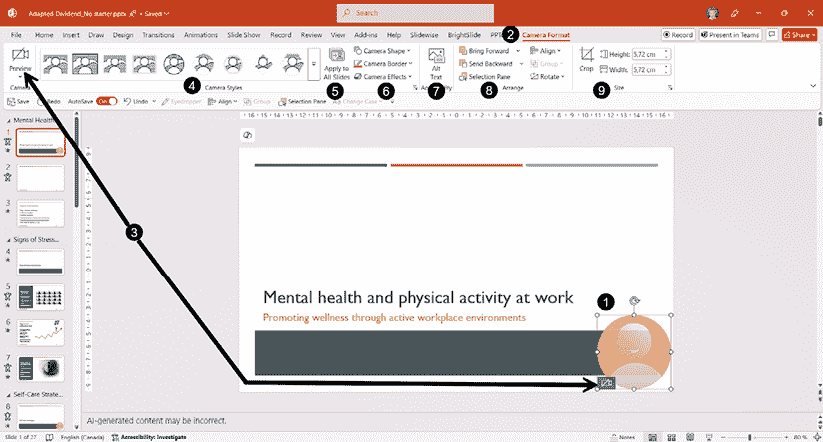

图 8.21 – 使用 Cameo 格式化工具

+   如果你点击**相机**组中的**预览**按钮或 Cameo 左下角的相机图标（**3**），你可以预览你的相机。如果你有多个相机，例如内置笔记本电脑摄像头和一个 USB 摄像头，将会有一个预览下拉菜单，你可以从中选择你想要使用的相机。

+   在**相机样式**组（**4**）中，你可以访问一些可以应用于你的 Cameo 对象的样式。将鼠标光标悬停在每一个上，会实时预览它将看起来是什么样子。只需点击你想要应用到你的相机对象上的样式即可。

+   如果你只将 Cameo 添加到一张幻灯片，并决定想要在所有幻灯片上包含它，只需简单地使用**应用到所有幻灯片**按钮（**5**）。摄像头流对象将以相同的位置、大小和格式添加到你的所有幻灯片上。

+   *提示*：在使用**应用到所有幻灯片**按钮之前，确保对位置、大小或格式进行任何更改，以避免进行大量手动工作。

+   *警告*：如果你多次点击**应用到所有幻灯片**按钮，它将在多个 Cameo 对象上叠加。

+   你还可以使用**摄像头形状**、**摄像头边框**和**摄像头效果**（**6**）来改变 Cameo 的视觉外观。尝试一些选项看看它们的样子，但请记住，这些应用于你的实时摄像头流，因此没有必要过度使用效果。

+   由于对象被视为类似于视频，因此还有一个**替代文本**选项（**7**）。确保使用屏幕阅读器的人会知道这是你摄像头的实时流，或者将其标记为装饰性元素，这样屏幕阅读器就不会尝试描述该对象。

+   **排列**（**8**）和**大小**（**9**）组具有与格式化图片、形状或视频时相同的可用功能。

如果你只想在特定的幻灯片上使用 Cameo 对象，首先进行任何所需的格式更改，然后将它们复制并粘贴到其他幻灯片上，这样你就不需要每次都重新进行格式设置。你也可以通过使用一些可以将 Cameo 移动到每个幻灯片上所需位置的幻灯片切换和动画来发挥创意。正如你所见，在某些情况下，添加 Cameo 将有助于提高观众的参与度。

如果你曾经希望能够在演示文稿中轻松地使用屏幕截图或简短的屏幕演示，下一节正是你可以帮助你在 PowerPoint 中正确完成这一点的部分。

# 插入截图或屏幕录制进行演示

有时候，展示一个应用程序或网站的图片比用文字解释一切要容易得多。这时，你应该转到**插入**选项卡（**1**）来使用**截图**功能（**2**）（*图 8.22*）：

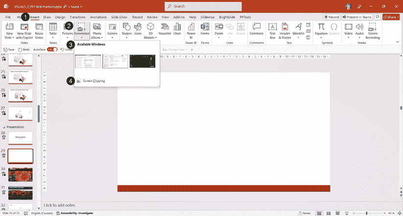

图 8.22 – 在 PowerPoint 中使用截图功能

+   点击**截图**按钮后，**可用窗口**部分（**3**）会显示你电脑上所有活动的窗口。如果你在启用该功能之前花时间打开你想要抓取截图的确切应用程序、文档或网站，插入截图就像点击你想要包含在幻灯片上的预览一样简单。

+   **屏幕剪辑**选项（**4**）将允许你使用鼠标光标抓取特定区域。以下是步骤：

    +   打开你想要抓取特定部分以包含在 PowerPoint 中的窗口，并将 PowerPoint 窗口置于其上方。

    +   当你点击**屏幕截图**时，它将 PowerPoint 窗口缩小以显示其后的下一个窗口。你的鼠标光标变成一个加号（**+**），屏幕呈现半透明的白色阴影。

    +   点击并拖动你的鼠标光标到你想要选择的区域，然后释放。

    +   屏幕截图已插入到你的幻灯片中。

无论你插入的是整个窗口还是截图，都很容易在上面添加注释或标注，甚至可以使用动画来帮助引导观众的视线聚焦于图片的关键元素。与一些屏幕捕获应用程序相比，如 TechSmith 的 Snagit 和 Windows 的截图工具，**截图**功能可能较为轻量，但如果只需要捕获几张图片，它仍然可以节省大量时间。

当静态图像不足以表达时，PowerPoint 也提供了屏幕录制功能。在**插入**选项卡（**1**）中，寻找**屏幕录制**按钮，或者在选项卡最右侧查找**媒体**（**2**）（*图 8.23*）：

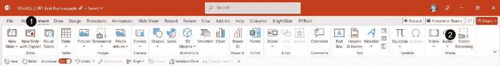

图 8.23 – 查找屏幕录制功能

为了准备你的屏幕录制，你需要确保你想要演示的窗口位于 PowerPoint 窗口的后面。一旦你点击**屏幕录制**按钮，PowerPoint 窗口将被最小化，一个录制工具栏将显示在你的屏幕顶部中央（*图 8.24*中的**1**）。在我创建的示例中，你可以看到一个部分 Microsoft Teams 窗口，可以用来演示如何使用频道：

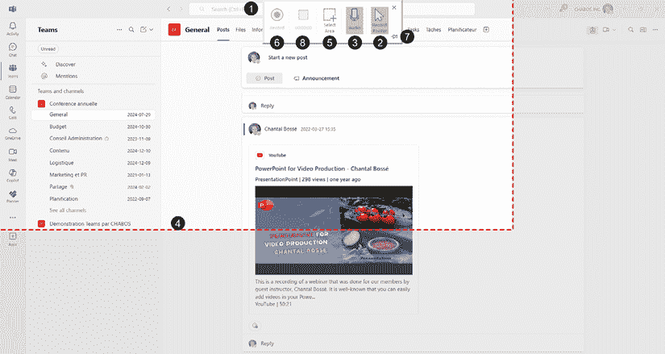

图 8.24 – 使用屏幕录制功能

+   你需要做的第一件事是决定你是否想使用**记录指针**（**2**）和**音频**（**3**）。这些按钮默认情况下是阴影/激活状态，但你可以点击任何一个来避免录制声音或指针。

+   接下来，移动你的鼠标光标，你会看到它看起来像加号（**+**），允许你点击并拖动到你想要捕获的区域。录制区域将有一个虚线红色轮廓（**4**）。如果你想更改选择，点击**选择区域**按钮（**5**）以使虚线轮廓消失，允许你选择新的区域。

+   最后，你点击**记录**按钮（**6**）开始录制。你将看到一个带有重要快捷键的大倒计时方块：*Windows 键* + *Shift* + *Q*。这个组合键将允许你在不需要再次尝试通过将鼠标光标移动到屏幕顶部中间来使录制工具栏可见的情况下停止录制。有一个小图钉图标（**7**）可以让你保持工具栏可见，以便看到**停止**按钮（**8**），但这意味着你也会在录制中看到工具栏；如果你不想编辑视频，这不是一个好的选项。如果你有两个屏幕，请在你的第二个屏幕上准备你的内容，这样你可以选择它并避免录制工具栏覆盖它。

+   在录制过程中，**记录**按钮变为**暂停**按钮，但由于它在开始录制后会消失，你需要让它重新出现，并在你的录制中也有完整的工具栏。相反，如果你想暂停录制，请使用这个快捷键：*Windows 键* + *Shift* + *R*。

+   一旦停止录制，视频片段就会插入到你的幻灯片中。它看起来就像任何视频文件一样，具有其播放选项。它也可以使用与视频格式相同的工具进行格式化。

**试试看**

要熟悉**截图**和**屏幕录制**工具的最佳方式是亲自尝试它们，尤其是由于在书中展示操作不如观看录制演示完整。如果你在阅读步骤时还没有尝试过，我建议你现在就试试。这将使步骤在你最终需要使用这些功能时更加清晰和容易记住。

现在你已经学会了如何在演示文稿中插入视频并从 PowerPoint 内部快速录制演示，接下来让我们进入下一节，学习如何创建视频和 GIF。

# 从演示文稿创建视频文件或 GIF

在创建你的演示文稿后，将其重新用于易于在许多平台上观看的视频格式，同时帮助保护你的内容免受他人不受欢迎的重复使用，这可能也是一个好主意，以便你可以有一个视频片段插入回演示文稿。正如你所看到的，可能性是无限的，而且很容易创建。

## 将演示文稿导出为视频

当你完成创建你的演示文稿，或者你需要视频的小幻灯片集时，你需要点击**文件**选项卡来查看所谓的**后台**视图（*图 8.25*）：

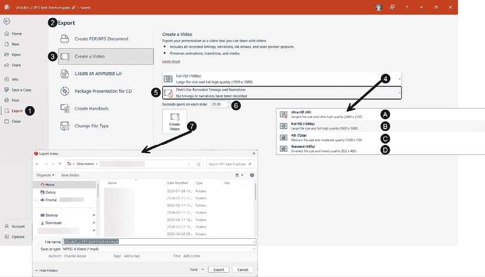

图 8.25 – PowerPoint 创建视频的后台视图

+   首先，点击左侧的**导出**菜单（**1**），以便访问**导出**面板（**2**）。

+   然后，点击**创建视频**（**3**）以访问设置。导出过程将保留您在演示文稿中包含的所有内容。如果您不熟悉动画和过渡，*第九章*将会有所帮助。

+   选择视频分辨率（**4**）——用简单的话说，就是您想要生成的视频质量。在下拉列表中，您将看到以下选项：

    +   **超高清（4K）**（**A**）：这是最高质量和最大的文件大小。除非您计划在 4K 设备上播放视频，否则不需要使用此设置导出。

    +   **全高清** **（1080p）**（**B**）：这是高质量和大文件大小。此选项满足大多数情况的需求。

    +   **高清（720p）**（**C**）：这是中等质量和中等文件大小。如果您想在网站上添加视频，这是最佳设置。使用更高质量可能会影响网页上的观看体验。

    +   **标准（480p）**（**D**）：这是最低质量和最小的文件大小。除非文件大小是一个主要问题，否则不应使用。

+   如果您没有自动过渡或旁白，系统将显示**不使用记录的时间和时间**设置（**5**）。如果您有，它将自动设置为**使用记录的时间和时间**。

+   当您没有记录任何时间或旁白时，**每张幻灯片花费的秒数**（**6**）将被应用；默认每张幻灯片为五秒。幻灯片上的时间也取决于幻灯片上的动画数量，因此如果动画超过五秒，导出将尊重动画的时间设置。如果没有动画，则应用此设置。

+   当一切设置就绪后，点击**创建视频**按钮（**7**），以便访问**导出视频**窗口，允许您更改保存`.mp4`文件的名称和文件夹。

导出完成后，您将有一个视频文件可以分享或将其插入到您的演示文稿中。如果您需要一个更短的媒体文件，那么您可以从 PowerPoint 创建 GIF 文件，这是下一节的主题。

## 创建动画 GIF

在社交媒体上共享短视频剪辑已成为一种普遍的做法。如果您将它们导出为 GIF 文件，您可以将一些动画幻灯片用于社交媒体账户或作为营销材料。

要访问此功能，您首先需要点击**文件**标签以访问**后台**视图（*图 8.26*）：

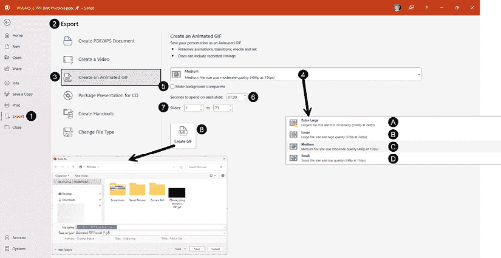

图 8.26 – PowerPoint 创建 GIF 的后台视图

+   首先，点击左侧的**导出**菜单选项（**1**），以便访问**导出**面板（**2**）。

+   然后，点击**创建动画 GIF**（**3**）以访问设置。导出过程保留动画、过渡以及你选择的幻灯片中的任何媒体。

+   选择 GIF 文件的**质量**（**4**）。默认设置是**中等**，这适合许多用户的需求，特别是由于动画 GIF 被认为是动画文件的重型类别。在下拉列表中，你会看到以下选项：

    +   **超大**（**A**）：这是最高质量和最大文件大小的文件。如果你绝对需要这种质量级别，请确保用很少的幻灯片创建文件，以避免巨大的导出时间。

    +   **大**（**B**）：这是一个高质量和大文件大小的文件。

    +   **中等**（**C**）：这是中等质量和中等文件大小的文件。如果你想轻松地在大多数平台上使用文件，这是最佳设置。

    +   **小**（**D**）：这是最低质量和最小文件大小的文件。除非文件大小是主要问题，否则不应使用。

+   你有一个**使背景透明**的设置（**5**），如果你只想保留幻灯片内容，这个设置非常有价值。

+   每张幻灯片上花费的**秒数**（**6**）允许你决定动画的速度。

+   通过在第一和第二字段输入连续幻灯片的编号来选择你想要包含在文件中的幻灯片数量（**7**）。记住，幻灯片越多，文件就越大。记住，GIF 文件通常只有几秒钟长，所以没有必要使用很多。

+   最后一步是点击**创建 GIF**按钮（**8**），这样你就可以访问**导出视频**窗口，允许你更改`.gif`文件保存的名称和文件夹。

导出完成后，你将有一个动画 GIF 文件可以分享或将其插入到你的演示文稿中。这可以是一种分享内容片段以增加可见性的好方法。

# 摘要

在本章中，我们讨论了如何添加和修改多媒体元素，如视频、音频文件、屏幕截图和屏幕录制，并将文件导出为视频或 GIF，然后可以将其插入到你的演示文稿文件中。

你现在对工具和功能有了足够的了解，可以开始在演示文稿中使用更多媒体元素。当你认为创建图形元素来展示流程或清晰地解释你的想法需要很长时间时，停下来思考使用其他类型的媒体，这将帮助观众更快地理解你的概念。

我们为更吸引人和有影响力的演示文稿添加了一个新的构建块。记住，尽管在微软的**股票图片库**中有大量的创意内容，但你总是可以用你的智能手机创建自己的内容。但如果你的视觉元素用于大型营销活动，那么聘请专业人士创建相关视频可能更明智。

在下一章中，我们将讨论如何高效地使用过渡和动画。你将学习如何创建有趣的视觉效果，这些效果能够服务于你的信息，以及如何使用更高级的动画技术。

# 进一步阅读

+   支持的音频和视频文件格式：[`support.microsoft.com/en-us/office/video-and-audio-file-formats-supported-in-powerpoint-d8b12450-26db-4c7b-a5c1-593d3418fb59`](https://support.microsoft.com/en-us/office/video-and-audio-file-formats-supported-in-powerpoint-d8b12450-26db-4c7b-a5c1-593d3418fb59)

+   *提高 PowerPoint 中音频和视频播放及兼容性的技巧*：[`support.microsoft.com/en-us/office/tips-for-improving-audio-and-video-playback-and-compatibility-in-powerpoint-a3458b91-684a-4104-9a3f-697967a34755`](https://support.microsoft.com/en-us/office/tips-for-improving-audio-and-video-playback-and-compatibility-in-powerpoint-a3458b91-684a-4104-9a3f-697967a34755)

+   *您遇到视频或音频播放问题了吗？*：[`support.microsoft.com/en-us/office/are-you-having-video-or-audio-playback-issues-e0a94444-8ea7-4a00-974b-6ad0d6edc4b1#codecs`](https://support.microsoft.com/en-us/office/are-you-having-video-or-audio-playback-issues-e0a94444-8ea7-4a00-974b-6ad0d6edc4b1#codecs)

+   插入来自网站的视频的支持文章：[`support.microsoft.com/en-us/office/insert-a-video-from-youtube-or-another-site-8340ec69-4cee-4fe1-ab96-4849154bc6db?ui=en-us&rs=en-us&ad=us#OfficeVersion=Newer_versions`](https://support.microsoft.com/en-us/office/insert-a-video-from-youtube-or-another-site-8340ec69-4cee-4fe1-ab96-4849154bc6db?ui=en-us&rs=en-us&ad=us#OfficeVersion=Newer_versions)

|

#### 现在解锁此书的独家优惠

扫描此二维码或访问[`packtpub.com/unlock`](https://packtpub.com/unlock)，然后通过书名搜索此书。 |  |

| **注意** *：在开始之前，请准备好您的购买发票。* |
| --- |
