# 10

# 将灵活性和互动性融入您的演示

创建精心规划的视觉元素是件好事，但能够构建灵活的内容，帮助您与观众互动，对您和观众来说都更好！是的——这确实需要更多的规划，但回报可能非常巨大。它可以帮助您更有信心，知道您总是有正确的视觉元素来回答问题，并且它有助于保持观众的参与度，因为他们意识到他们可以要求您回到某个主题。

创建包含灵活元素的更大演示，甚至可能允许您重用更多内容，而不是不断创建新的演示。在阅读本章的主题后，您将做出判断，我们将讨论以下内容：

+   在演示中使用导航元素

+   创建自定义演示

+   使用缩放功能导航内容

+   创建触发菜单

# 技术要求

本章讨论的大多数主题不需要**M365 订阅**，因为工具和功能已在 PowerPoint 的先前版本中引入。**缩放**功能现在与所有由 Microsoft 支持的 Office 桌面版本兼容。

注意，由于 PowerPoint 的订阅版本持续更新，某些功能可能在您的应用程序版本中看起来并不完全相同。

# 在演示中使用导航元素

演示中的导航意味着我们点击一个对象或移动鼠标光标到其上以访问其他内容。这要求您在演示过程中能够舒适地点击这些幻灯片对象，无论是使用鼠标还是带有鼠标光标控制的遥控器。您还需要提前规划您的导航，以确保如果您访问其他内容，您有返回到您所展示幻灯片的可能性。

本节将帮助您创建导航。在本章的后面部分，我们将讨论**缩放**功能，它允许以更简单的方式创建导航。让我们从我们的第一个部分开始，关于动作按钮的使用。

## 使用动作按钮导航

如果您不知道在 PowerPoint 中哪里可以找到**动作按钮**，您可以从**主页**选项卡（**1**）点击**形状**按钮（**2**） – 如果您看不到它，可能是由于您的屏幕尺寸或分辨率，因此请寻找**绘图**按钮。您也可以使用**插入**选项卡（**3**）并点击**形状**按钮（**4**）。两者都会打开形状库，其中**动作按钮**（**5**）将出现在最后一个部分。您可能需要向下滚动才能看到**动作按钮**（*图 10.1*）：

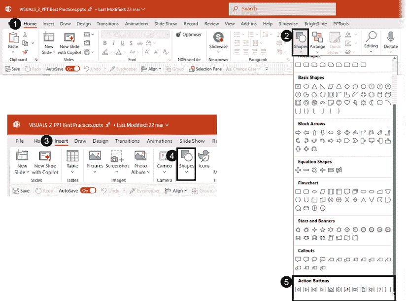

图 10.1 – 从“主页”或“插入”选项卡访问动作按钮

当您选择任何按钮时，您可以在幻灯片上绘制对象，就像在库中的任何其他形状一样。但它为您提供了访问特殊设置的权限——这是我们下一节的主题。

## 创建您的导航按钮

在形状库中（*图 10.2*）有 12 个预设动作按钮可用：

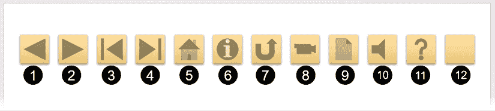

图 10.2 – 可用 12 个预设动作按钮

在讨论它们的设置之前，我们先描述一下它们是什么：

+   **返回或上一页**（**1**）：一个按钮，具有指向上一张幻灯片的超链接。除非您正在为自动展示机创建演示文稿，否则我不建议使用它，因为它会增加视觉杂乱，但不会增加太多价值。

+   **前进或下一页**（**2**）：一个按钮，具有指向下一张幻灯片的超链接。对于上一个按钮的评论同样适用。

+   **转到开头**（**3**）：一个按钮，具有指向您演示文稿第一张幻灯片的超链接。如果您在第一张幻灯片上创建了特殊的交互式菜单，这个按钮可能非常有用。

+   **转到末尾**（**4**）：一个按钮，具有指向您演示文稿最后一张幻灯片的超链接。如果您时间紧迫，想要快速访问结束语，这个按钮可能非常有用。

+   **主页**（**5**）：一个按钮，具有指向您演示文稿第一张幻灯片的超链接。它与*#3*中的超链接类型相同，因此您可以选择您喜欢的视觉样式。由于目标幻灯片编号可以更改，您可以使用此动作按钮链接到任何用作仪表板以选择其他内容的幻灯片编号。

+   **获取信息**（**6**）：一个按钮，允许您配置访问额外信息的设置。您在设置窗口中选择动作类型。

+   **返回**（**7**）：一个按钮，具有指向最后查看的幻灯片的超链接。如果您在演示文稿中构建了广泛的导航，并且需要返回到不是上一页或下一页的幻灯片，这个按钮可能非常宝贵。PowerPoint 会记住您之前所在的幻灯片编号，并在您点击按钮时带您回到那里。

+   **视频**（**8**）、**文档**（**9**）、**声音**（**10**）和**帮助**（**11**）：这些按钮会触发打开设置窗口，但尚未配置任何内容。如果它们的图标符合您的需求，并且您想要轻松访问设置，它们将非常有用。

+   **空白**（**12**）：这个按钮可以像之前的按钮一样描述，但您可以使用各种形状格式化工具对其进行格式化，以满足您的需求。

绘制之前描述的任何按钮后，您将获得**动作设置**窗口（**1**），在那里您将找到两个选项卡：**鼠标点击**和**鼠标悬停**（**2**）。两个选项卡的设置相同。**鼠标点击**用于您想要点击对象以产生动作时，而**鼠标悬停**配置当鼠标光标悬停在链接对象上时的动作，无需点击（**图 10.3**）：

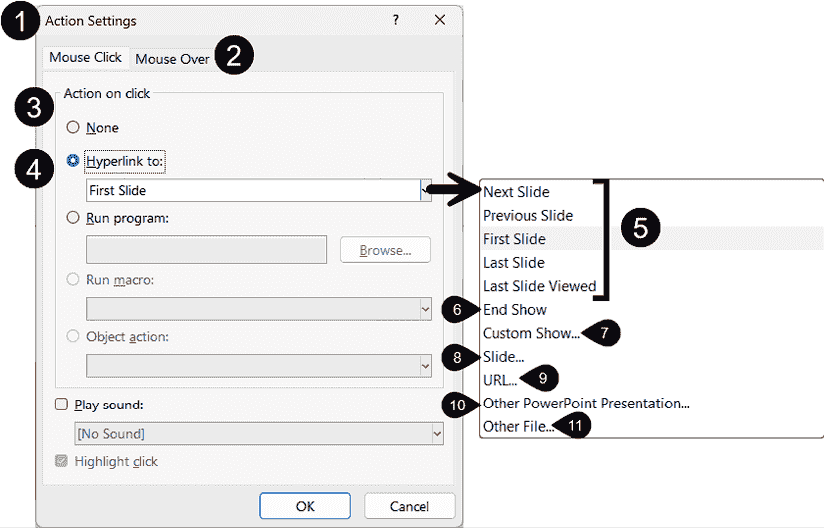

图 10.3 – 动作设置窗口中的选项

尽管在**动作设置**窗口的**点击动作**（**3**）部分有五个设置选项，但我们将重点关注**链接到：**（**4**）选项，因为讨论的主题是在我们的演示文稿中创建导航和交互。前五个选项（**5**）为它们提供了一些预设的动作按钮。至于其他六个选项，它们可以用于没有预设的动作按钮，或者用于自定义那些有预设的动作按钮。让我们看看它们各自的作用：

+   **结束放映**（**6**）：这允许您配置一个结束演示的对象。

+   **自定义放映…**（**7**）：这允许您链接到一组预定的特定幻灯片。自定义放映将是本章的第二个主要内容。

+   **幻灯片...**（**8**）：这允许您链接到演示文稿中的特定幻灯片。例如，您可以使用此设置访问一个隐藏幻灯片。要返回您之前的位置，您需要计划使用具有**最后查看的幻灯片**设置的某个对象。

+   **URL…**（**9**）：这允许您在特定页面上打开一个网页。当您不再需要该页面时，您可以简单地关闭它以返回到您的幻灯片放映。

+   **其他 PowerPoint 演示文稿…**（**10**）：这允许您在您正在演示的演示文稿上方打开另一个演示文稿。结束第二个演示文稿将带您回到第一个幻灯片放映。

+   **其他文件…**（**11**）：这允许您打开另一种类型的文件，例如 Word 文档、Excel 电子表格或 PDF。如果您有打开文件的软件，它将在演示文稿上方打开。

要测试您的动作按钮，您需要处于幻灯片放映模式。

**试试看**

理解动作按钮的最好方法是立即尝试使用它们。这里有一个您可以尝试的快速练习：

1.  创建几个幻灯片，每个幻灯片要么有一个独特的标题，要么有不同的形状。

1.  插入以下动作按钮：**返回主页**和**返回**。您可以在每个幻灯片上复制和粘贴它们，或者您可以将它们添加到幻灯片母版中，这样它们就会出现在您添加到演示文稿的所有布局中。

1.  添加一个隐藏幻灯片，并从演示文稿的第一个幻灯片添加一个动作按钮，链接到该隐藏幻灯片。

1.  开始放映幻灯片，并尝试在幻灯片之间导航。

动作按钮是快速在你的演示文稿中实现简单导航系统的良好起点。但你也可以在其他类型的对象上创建超链接——我们将在接下来的部分中展示几个例子。

## 使用其他幻灯片对象进行导航

在你的演示文稿中创建导航系统不需要使用动作按钮；你可以在幻灯片上的任何可点击对象上使用。你甚至可以使用添加到幻灯片母版的形状，这样它们就变成了所有幻灯片上的可点击导航系统。

让我们从这样一个例子开始，你团队中有四张团队成员的照片幻灯片。他们在公司活动中发言，你希望能够轻松访问他们的幻灯片。已经添加了四个幻灯片来表示演讲者的内容。还需要计划一个返回演讲者选择幻灯片的**返回**按钮，但你被要求不要使用可见的动作按钮（*图 1 0.4*）：

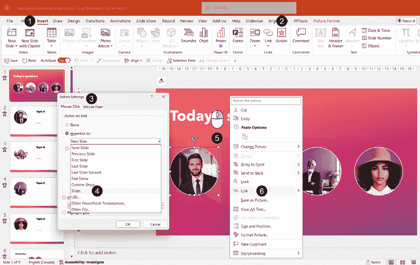

图 10.4 – 从插入选项卡或上下文菜单添加超链接到图片

要在选定的对象上插入超链接（在我们的例子中，是第一个演讲者的图片），你可以这样做：

+   转到**插入**选项卡（**1**）

+   点击**动作**按钮（**2**）

+   在**动作设置**窗口（**3**）中，在**链接到**下拉列表中选择**幻灯片…**（**4**）。你也可以*右键点击*图片（**5**）并在上下文菜单中选择**链接**（**6**）。

在这两种情况下，都会打开一个新窗口，允许你选择幻灯片编号（*图 10.5*）：

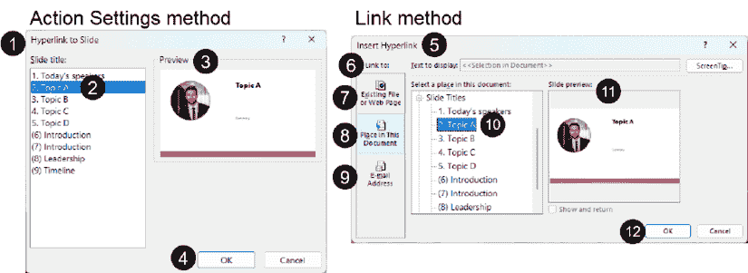

图 10.5 – 选择特定的幻灯片来创建超链接

假设你使用了**动作设置**方法：

+   **链接到幻灯片**窗口（**1**）很简单：你选择与第一个演讲者内容对应的幻灯片编号（**2**）——列表显示了每个幻灯片标题占位符的内容，确认了为每个幻灯片使用不同标题的重要性。

在幻灯片列表中，任何括号内的数字都表示这些幻灯片是隐藏的。

+   在**预览**（**3**）中确认它是正确的，然后点击**确定**按钮来确认（**4**）。

+   超链接方法窗口标记为**插入超链接**（**5**）。

+   左侧的**链接到**面板（**6**）允许你使用以下方式创建超链接：

    +   **现有文件或网页**（**7**）

    +   **在此文档中的位置**（**8**）选项——这是我们例子中需要的选项

    +   或者，设置一个使用电子邮件地址（**9**）的超链接，当点击对象时在默认电子邮件应用程序中启动新消息

+   继续我们的例子，我们需要选择一个幻灯片（**10**），检查**幻灯片预览**（**11**），然后点击**确定**（**12**）来确认超链接。

如果你已遵循这些步骤，你现在已将菜单幻灯片的第一张图片链接到第二张幻灯片。请确保重复之前的步骤，将剩余的图片链接到它们各自的幻灯片。现在，让我们创建我们的隐形**返回**按钮，以便我们有一个简单的方法始终返回到第一张幻灯片。

在我的例子中，小圆圈被用作幻灯片左下角的设计元素（*图 10.6*）：

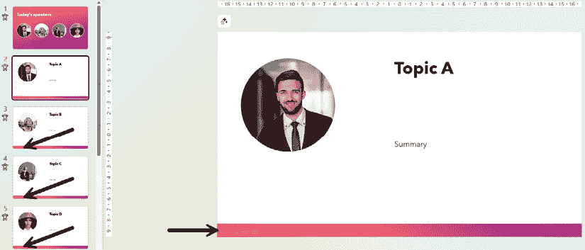

图 10.6 – 使用设计元素作为可点击按钮

这些圆圈可以成为微妙的导航元素。如果你决定为自己使用这种技术，只要事先练习足够，这是一个很好的规划额外内容而不让听众明显察觉的方法。如果你想为使用该文件的其他人部署此技术，你需要提前让他们了解其工作原理，以便他们也能练习。

确保导航按钮在所有幻灯片中都可用，而无需进行大量复制粘贴步骤的最好方法是，在幻灯片母版或幻灯片母版视图中特定布局中添加它们。

在我的例子中，我打开了**幻灯片母版**并执行以下操作（*图 10.7*）：

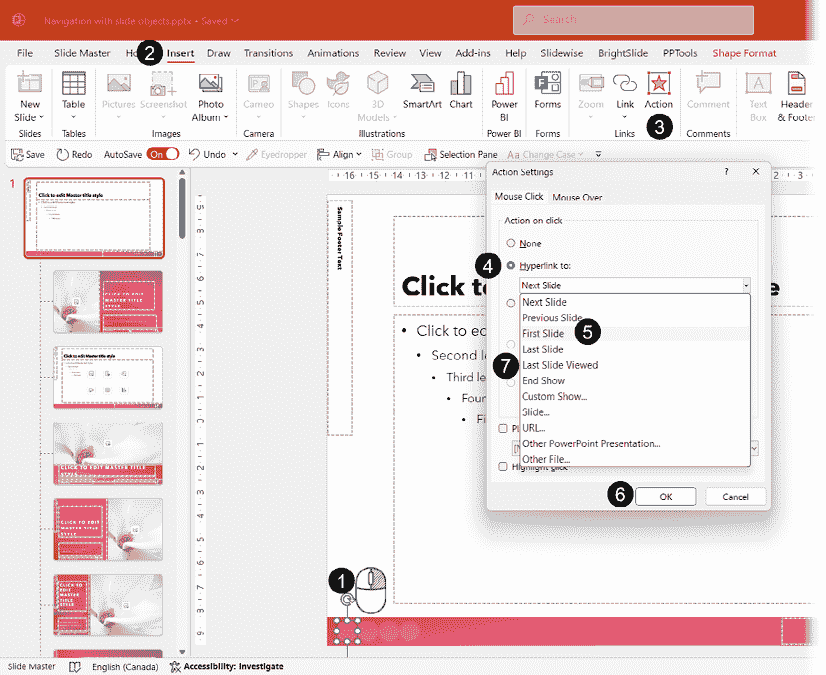

图 10.7 – 在幻灯片母版视图中向幻灯片元素添加超链接

+   首先，*右键单击*一个形状（**1**）并转到**插入**选项卡（**2**）

+   点击**动作**（**3**）并打开**链接到**列表（**4**）。

+   选择**第一张幻灯片**（**5**）并通过点击**确定**（**6**）确认你的选择。

+   经过多年，我也养成了使用第二个形状并使用**最后查看的幻灯片**超链接（**7**）的习惯，以确保如果需要展示其他内容，例如隐藏的幻灯片，我可以轻松返回并继续我的演示。在幻灯片母版上从左侧第二个圆圈添加此类链接，可以让你轻松访问它。

向幻灯片母版添加隐藏链接通常会影响所有布局，但并不总是如此，正如我们在*第三章*中讨论的那样。如果你使用了 Copilot 建议的较新主题，请确保检查幻灯片母版视图中出现的所有布局。其中许多包含额外的形状，有助于创建新设计，并且它们会隐藏添加到母版中的任何导航元素。

如果你选择向一个或多个特定布局添加隐藏导航，请确保为它们标记，这样在长长的布局列表中就很容易选择了。随着 Copilot 的引入，我们了解到建议的布局数量大幅增加。确保任何与导航相关的布局可以快速找到，对于保持演示设计效率至关重要。

您可以计划尽可能多的隐藏链接，但请记住，您的链接方案越复杂，使用它所需的练习就越多。就像操作按钮一样，了解您演示文稿中的超链接的最佳方式是亲自尝试。如果您已创建了之前的链接方案，请将您的演示文稿置于幻灯片放映模式并尝试链接。首先点击一位演讲者的图片，并练习使用隐藏链接返回到菜单幻灯片。

之前的例子作为一个学习环境，如本书中的例子是有意义的，但在现实世界中则不太现实。如果四位演讲者有很多幻灯片，那么利用我们将在下一节讨论的自定义放映将更加高效。

# 创建自定义放映

**自定义放映**是创建和展示较大演示文稿文件子集的一种方式。在过去，我曾使用它们为销售人员创建复杂的营销仪表板，甚至创建了一个允许我根据特定主题或持续时间选择内容的培训仪表板。

让我们继续使用之前使用的相同示例，但这次使用包含更多幻灯片的演示文稿。我们将想要为每位演讲者创建一个自定义放映，然后更改菜单幻灯片上的超链接。

创建了部分是为了在截图（*图 10.8*）中更容易看到每位演讲者的幻灯片数量：

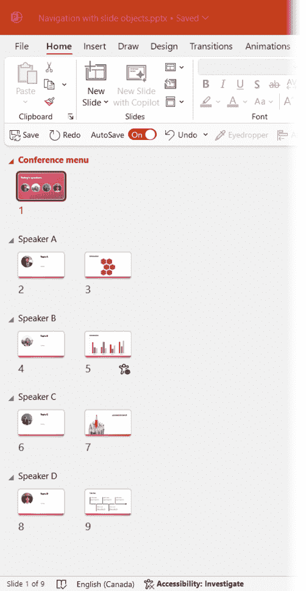

图 10.8 – 在幻灯片排序视图中以四个部分展示演讲者幻灯片

要创建自定义放映，您需要转到**幻灯片放映**选项卡（**1**），然后单击**自定义放映**按钮（**2**）以访问**自定义放映…**功能（**3**）（*图 10.9*）：

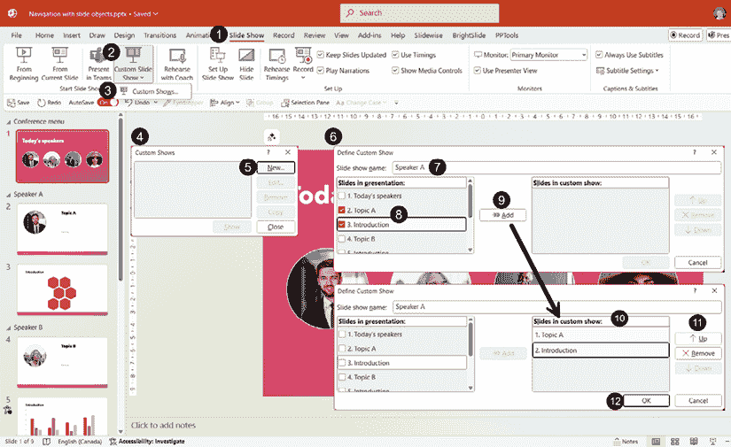

图 10.9 – 从幻灯片放映选项卡访问自定义放映…

从**自定义放映**窗口（**4**），通过单击**新建…**按钮（**5**）进入**定义自定义放映**窗口（**6**）。以下是您需要设置的元素以创建自定义放映：

+   在**幻灯片放映名称：**字段（**7**）中为自定义放映命名。

+   点击您想要包含其中的幻灯片的**复选框**（**8**）——如果您在标题占位符中有简单的部分名称且没有记录要包含在每个自定义放映中的幻灯片编号，这一步将很困难。

+   点击**添加**按钮（**9**）将幻灯片包含到**自定义放映中的幻灯片：**字段（**10**）中。

+   您可以选择此字段中包含的任何幻灯片来激活**上**、**下**和**删除**按钮（**11**），以适应幻灯片集和顺序。

+   点击**确定**（**12**）以确认您的自定义放映。

重复步骤以创建本例所需的四个自定义放映。完成后，您的**自定义放映**窗口（**1**）应看起来像这样（*图 10.10*）：

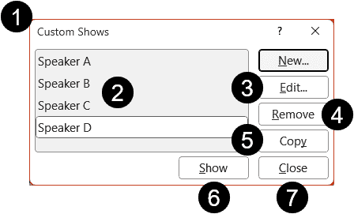

图 10.10 – 自定义节目窗口选项

您将看到您的自定义节目列表（**2**）可以使用以下任何按钮进行一些更改：

+   **编辑…**按钮（**3**）用于更改自定义节目中包含的幻灯片或它们的顺序。

+   **删除**按钮（**4**）用于删除您不再需要的自定义节目。

+   **复制**按钮（**5**）允许您复制现有的自定义节目，然后使用**编辑…**（**3**）来重命名和更改内容或其顺序。当您需要创建只有少数更改的长自定义节目时，这非常有用。

+   **显示**按钮（**6**）以幻灯片放映模式启动所选的自定义节目，以便您可以查看它。

+   完成更改后，如果您不想查看任何自定义节目，只需单击**关闭**按钮（**7**）。

现在是时候回到演示文件的第一页幻灯片，并对我们之前添加的链接进行一些更改了。第一步是*右键单击*一个演讲者图片（**1**），然后点击**编辑链接**（**2**）（*图 10.11*）：

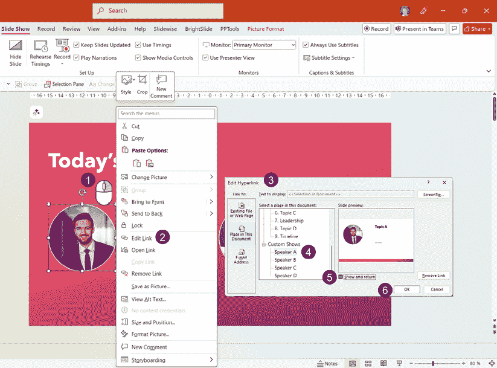

图 10.11 – 编辑现有的超链接以指向自定义节目

从**编辑超链接**窗口（**3**），您需要执行以下操作：

+   滚动幻灯片列表以查看您新创建的**自定义节目**（**4**）列表。选择与您的图片相对应的一个。

+   点击**显示并返回**复选框（**5**）。这是使您的链接过程高效的一个非常重要的步骤。这样做意味着当您到达自定义节目的最后一页幻灯片时，幻灯片放映会返回到您的第一页幻灯片。不需要其他**返回**按钮或链接幻灯片对象。

+   单击**确定**（**6**）以确认超链接更改。

对剩余的图片重复相同的过程，这将为您提供一个高效的选板，同时减少您需要创建的导航元素数量。我们使用了多演讲者事件示例，但这个概念可以应用于许多类型的演示，例如培训内容。

如果您有一个包含您主题中所有幻灯片的非常大的文件，您可以通过简单地从**幻灯片放映**选项卡（**1**）开始自定义节目来避免每次演示时都创建单独的文件。您可以直接从**自定义幻灯片放映**按钮（**2**）开始自定义节目，并从列表中选择任何现有自定义节目以开始您的演示（**3**）（*图 10.12*）：

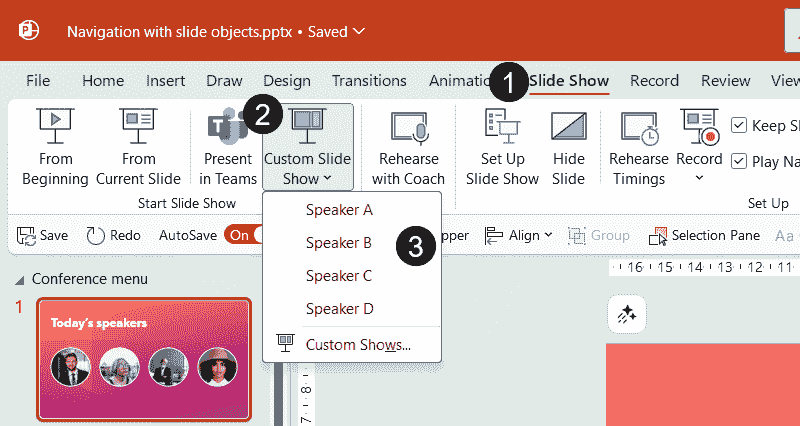

图 10.12 – 在幻灯片放映模式下开始自定义节目

如你所见，将交互性融入你的演示文稿可以通过 PowerPoint 中已经可用多年的功能来实现！如果你是 Office 2021、Office 2024 或 M365 用户，你应该考虑使用下一节中讨论的较新的功能——Zoom。

# 使用 Zoom 功能导航你的内容

微软将其 **Zoom** 功能描述为使你的演示文稿更加动态和有趣的方式。我称之为类固醇般的超链接，因为你可能再也不需要使用之前章节中描述的功能了。

单词 *zoom* 在 PowerPoint 界面中被大量使用。**Zoom** 功能指的是创建到其他幻灯片或部分的超链接，不要与应用于幻灯片对象的 **Zoom** 动画（**Zoom** 动画）、应用于幻灯片的 **Zoom** 过渡（**Zoom** 过渡）以及用于放大你的幻灯片视图的工具（也称为 *Zoom*）混淆。

自从 **Zoom** 功能被引入以来，我必须说我节省了很多设计时间，同时仍然创建了交互式内容。PowerPoint 中有三种类型的缩放：

+   **总结缩放**允许你通过几点击快速创建导航页面。它添加一个带有 Zoom 对象的新幻灯片，链接到所选部分。

+   **部分缩放**允许你从演示文稿文件中的现有部分创建导航页面。它向现有幻灯片添加一个 Zoom 对象。

+   **幻灯片缩放**允许你快速创建到演示文稿中特定幻灯片的链接。它向现有幻灯片添加一个 Zoom 对象。

让我们从以下部分的一个如何创建总结性缩放的例子开始。

## 创建总结性缩放

我建议你打开一个已经包含几个幻灯片的文件来跟随本功能的解释，或者你可以简单地选择 Microsoft 提供的模板或主题文件之一。

要插入总结性缩放，只需转到 **插入** 选项卡（**1**），然后单击 **Zoom** 按钮（**2**），并选择 **总结缩放**（**3**）（*图 10.13*）：

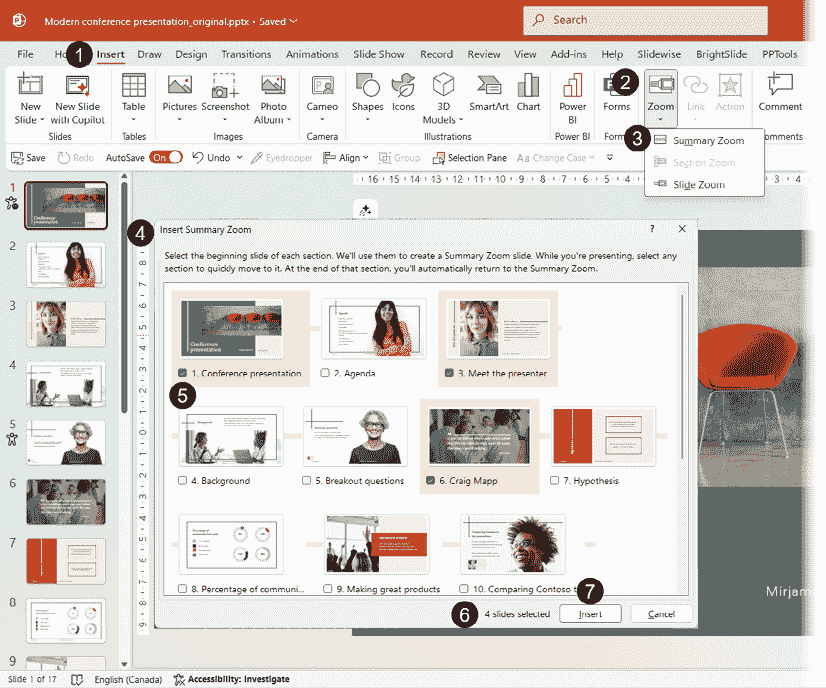

图 10.13 – 插入总结性缩放

在 **插入总结缩放** 窗口（**4**）中，选择你想要开始导航到部分的幻灯片的所有复选框（**5**）。你可以检查所选幻灯片的数量（**6**），然后单击 **插入** 按钮（**7**）。

PowerPoint 自动插入一个 *新的总结幻灯片*（**1**）（*图 10.14*）：

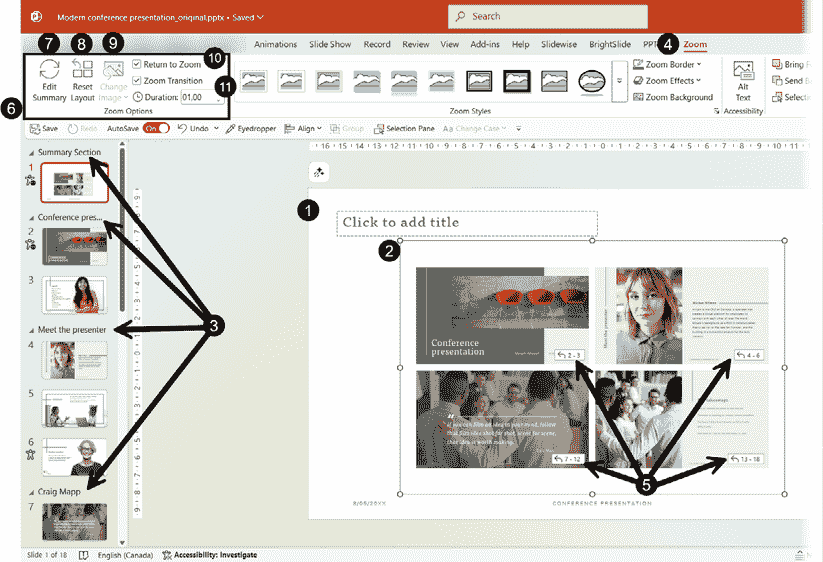

图 10.14 – 插入总结缩放幻灯片并创建部分

 **快速提示**：需要查看此图像的高分辨率版本？在下一代 Packt Reader 中打开此书或在其 PDF/ePub 版本中查看。

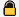 **新一代 Packt Reader**随本书免费赠送。扫描二维码或访问[`packtpub.com/unlock`](https://packtpub.com/unlock)，然后使用搜索栏通过名称查找此书。请仔细检查显示的版本，以确保您获得正确的版本。

根据您使用的模板或主题，如果您总结幻灯片包含不想要的占位符，更改总结幻灯片的布局可能是个明智的选择。在我们的示例中，*缩放幻灯片对象*（**2**）包含之前选择的四个幻灯片缩略图——它可以根据您的需求进行调整大小。正如您所看到的，*部分*也会自动创建（**3**）。

选择**缩放幻灯片对象**（**2**）后，打开**缩放**选项卡（**4**）以访问选项和格式化工具。一个小工具提示标识了每个部分中包含的幻灯片编号（**5**）。由于此选项卡中的格式化选项与之前章节中讨论的许多其他选项类似（例如，形状、图片等），我们只讨论**缩放选项**类型（**6**）：

+   **编辑总结**（**7**）：您可以通过删除部分或添加您刚刚创建的新部分来编辑您的总结幻灯片，而无需从头开始整个过程。

+   **重置布局**（**8**）：您可以单独移动、调整大小和编辑每个部分的缩略图。如果您想回到 PowerPoint 提供的原始布局，请点击此按钮。

+   **更改图片**（**9**）：如果您在总结中选择了其中一个缩略图，此按钮将可用。它允许您更改其图片，如果您不想使用该部分的第一个幻灯片的图片。

+   **返回缩放**（**10**）：此复选框默认选中，当链接到自定义演示时，其行为与上一节中讨论的**显示并返回**功能完全相同。如果您取消勾选它，这意味着在完成一个部分后，您将不会返回到您的总结幻灯片。

+   **缩放过渡**和**持续时间**（**11**）：这些选项在点击缩略图后提供缩放效果以到达某个部分及其持续时间；取消勾选**缩放过渡**复选框将移除该效果。我建议您考虑的唯一更改是增加持续时间，而不是减少它。非常短的持续时间会增加某些人产生运动病症状的可能性。

在不更改任何选项的情况下，您就可以使用您的缩放功能了。如果您已经跟随操作，只需进入幻灯片放映模式并尝试即可。**总结缩放**是当您有一个包含许多幻灯片的演示文稿时的一个优秀选择，即使您还没有在其中创建任何部分。当您已经创建了部分时，PowerPoint 会识别它们，并在您插入总结缩放时自动选择每个部分的第一个幻灯片。

当你在**幻灯片预览**视图中点击幻灯片缩略图时看到的缩放效果与 PowerPoint（Office 2021、Office 2024、M365）的桌面版本兼容。如果你计划使用 PowerPoint 的网页版进行演示，你将能够浏览各个部分，但不会有缩放效果。如果你计划在 Teams 中使用 PowerPoint Live，**总结缩放**将完全不可用，尽管任何其他链接对象都将允许你按计划导航。

如果你不需要总结幻灯片，但希望方便地访问你已经在演示文稿中创建的部分，那么这就是你需要使用部分缩放，下一节的主题的时候。

## 插入部分缩放

假设你在演示文稿的末尾有一个隐藏的资源部分，以防你需要额外的内容来回答问题或支持你的观点。访问这些内容的简单方法是使用**部分缩放**。这要求你计划在哪里包含它是有意义的。如果你已经学习了*第一章*中描述的主题，你应该已经有了很好的想法。

让我们使用以下示例在幻灯片**9**（**1**）上插入部分缩放，我们可能需要我们的资源（*图 10.15*）：

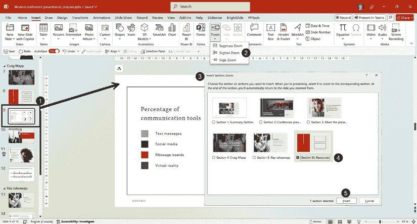

图 10.15 – 在特定幻灯片上插入部分缩放

你需要在**插入**选项卡中点击**缩放**按钮，并选择**部分缩放**（**2**），以访问**插入部分缩放**窗口（**3**）。选择**资源**部分（**4**），然后点击**插入**按钮（**5**）。

添加部分缩放的另一种方法是，在幻灯片窗格中点击**部分名称**（**1**）的同时按住鼠标左键，将部分拖动到幻灯片上（*图 10.16*）：

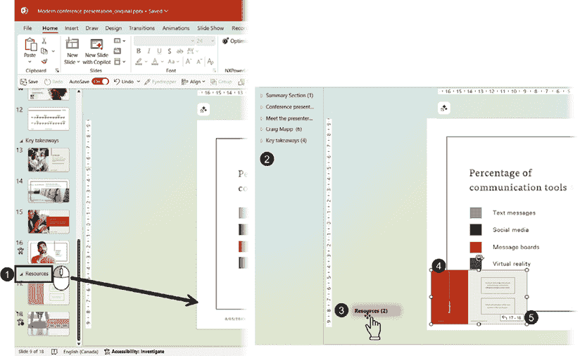

图 10.16 – 部分缩放幻灯片对象及其选项和格式化工具

当你开始拖动部分时，你首先会看到所有部分都折叠（**2**），同时你的鼠标光标变成带有括号中幻灯片数量的部分名称标签（**3**）。

在你的幻灯片上释放鼠标左键后，你会得到一个**部分缩放**幻灯片对象（**4**），它可以被移动和调整大小。当**缩放**选项卡处于活动状态时，它显示包含在该部分中的幻灯片编号（**5**）。**缩放**选项卡包含与**总结缩放**相同的选项和格式化工具。默认情况下，在显示部分后，你会返回到你的幻灯片。

部分缩放易于插入和使用，因此现在你知道如何操作后，不要犹豫，计划更多可以用来回答问题或展示额外信息的内容，因为你比预期的有更多时间。

当您只需要访问一个幻灯片时，您不需要为它创建一个单独的部分。您可以直接使用幻灯片缩放，这是我们下一节的主题。

## 插入幻灯片缩放

如果您有多个不相关的幻灯片用作额外内容或资源，您可以使用**幻灯片缩放**。它的工作方式与刚刚提到的**章节缩放**完全相同，只是链接仅指向一个幻灯片。

您可以再次转到**插入** | **缩放**，但这次选择**幻灯片缩放**以访问一个窗口，允许您选择要插入的幻灯片编号。我更喜欢的方法是点击并拖动幻灯片缩略图从幻灯片面板拖到幻灯片上。结果是带有提示信息的**幻灯片缩放**幻灯片对象（**1**），提示信息显示我们将要导航的**幻灯片编号**（**2**）。

虽然在**缩放选项**（**3**）中有一个重要的区别：未选中**返回缩放**选项！如果您的目的是轻松返回到之前的幻灯片，请确保勾选该框（*图 10.17*）：

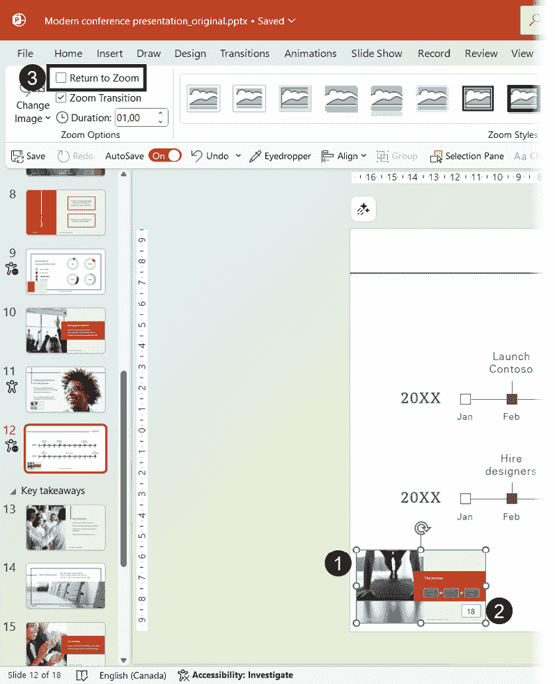

图 10.17 – 插入幻灯片缩放

您现在已经了解了如何使用三个缩放功能快速在演示文稿中创建导航系统的基本知识。交付此类演示文稿可以简单到只需点击您的遥控器或使用键盘点击通过您的演示文稿。您将按顺序浏览总结缩放中存在的所有部分。但如果您在幻灯片中包含了章节或幻灯片缩放，请记住您需要点击它们才能访问其内容。如果您希望以这种方式发展演示文稿的交互性，我建议您从具有鼠标控制的遥控器开始练习。

您可以随意调整 Zoom 幻灯片对象的尺寸，但也许您的目标是拥有一个完全隐藏的菜单，只有在需要时才能访问。这正是本章最后一节我们将要探讨的内容。

# 创建触发菜单

现在您已经看到了许多可以帮助您创建更具交互性演示文稿的功能，让我们在幻灯片缩放和触发动画的帮助下创建一个高级交互式菜单。这种技术的结果是，当点击我幻灯片上的一个不可见的形状（**1**）时，一个**带有两个幻灯片缩放的菜单**（**2**）将从幻灯片的左侧（**3**）移动过来，以便访问任一幻灯片（*图 10.18*）：

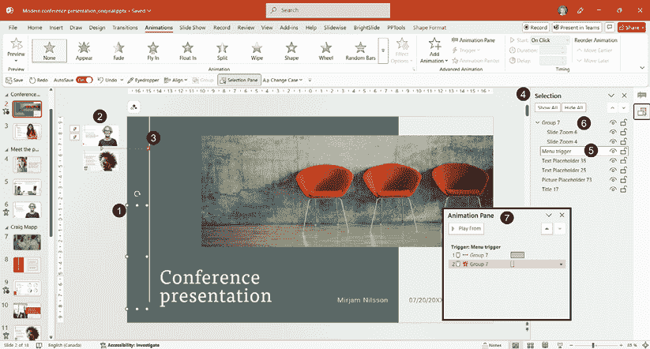

图 10.18 – 使用隐藏的幻灯片缩放菜单

如您在**选择**面板（**4**）中看到的，不可见的形状已被重命名为**菜单触发器**（**5**），而**幻灯片缩放**是**组 7**（**6**）的一部分。动画面板将有一个包含两个触发动画的列表（**7**）：一个用于运动路径，一个用于退出淡出。

由于我们在前面的章节中已经讨论了创建此示例所包含的所有组件，我想稍微挑战你一下，尝试重新创建它。以下都是创建一个可以通过触发器显示的隐藏菜单的步骤。试一试，然后查看*进一步阅读*部分，以获取教程视频的链接。以下是步骤：

1.  选择一个你想访问隐藏菜单的幻灯片。

1.  插入两个幻灯片缩放，调整它们的大小，并将它们移动到幻灯片左侧的灰色区域之外。确保选择了**返回缩放**选项。

1.  将两个幻灯片缩放对象组合在一起。

1.  插入一个用作点击元素的形状。如果你想使其不可见，请移除其轮廓并使用与背景相同的颜色，或者使填充色达到 99%的透明度。不要使用 100%的透明度，因为它已知会导致超链接停止工作，而且它是否会发生并不总是可预测的。你也可以选择让它保持可见，但将其包含在你的设计中。

1.  打开**选择**面板，将形状重命名，以便在动画对象时容易找到它。

1.  将运动路径添加到幻灯片缩放组，使其向右移动，以便它结束在幻灯片区域。点击**触发器**以选择将用于启动动画的形状。

1.  将淡出动画添加到幻灯片缩放组中。再次点击**触发器**并选择上一步相同的形状。

1.  测试你的动画。

使用触发器和缩放的高级动画技巧可以是一种非常创造性的方式来访问你计划但只想按需访问的额外内容。如果你开始使用本章中讨论的几个主题来制作你的演示，你将极大地提高观众的参与度。

# 摘要

在本章中，我们看到了如何在演示中创建和使用各种导航元素，创建自定义演示，以便我们可以轻松访问幻灯片子集而无需创建新文件。我们还讨论了使用各种**缩放**功能快速创建更多互动内容，以及如何使用触发器创建隐藏的**缩放**菜单。

成为更灵活和互动的演示者是你应该考虑的事情。有机会摆脱严格线性的交付风格对观众来说会更有吸引力。多年来，我一直在我的演示中包含灵活性和互动性，即使我不得不使用超链接、触发器和自定义演示来计划和创建一切。尽管这非常耗时，但我总是得到观众的回报，他们问我是否可以回到前面的部分或幻灯片，因为他们意识到我没有陷入线性的幻灯片放映中。

现在 PowerPoint 为我们提供了更多功能来加快处理过程，没有足够的时间考虑灵活和互动的内容不再是借口，尤其是如果你想在你所在的行业中脱颖而出，并被视为专家。这确实需要你进行更多规划和练习，但你将获得观众满意度的提升，这可能会对你的演示产生重大影响。

在下一章——本书内容创作部分的最后一章中——我们将讨论 PowerPoint 第三方插件，这些插件可以帮助你改进工作流程或添加应用中未包含的功能。

# 进一步阅读

+   *微软支持*关于动作设置的文章：[`support.microsoft.com/en-us/office/add-commands-to-your-presentation-with-action-buttons-7db2c0f8-5424-4780-93cb-8ac2b6b5f6ce`](https://support.microsoft.com/en-us/office/add-commands-to-your-presentation-with-action-buttons-7db2c0f8-5424-4780-93cb-8ac2b6b5f6ce)

+   触发菜单的视频教程链接：[`youtu.be/f48e-dmYkSY`](https://youtu.be/f48e-dmYkSY)

|

#### 现在解锁此书的独家优惠

扫描此二维码或访问[`packtpub.com/unlock`](https://packtpub.com/unlock)，然后通过书名搜索此书。 |  |

| **注意** *：在开始之前准备好您的购买发票。* |
| --- |
