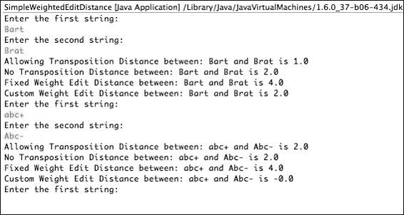

# 第六章：第6章：字符串比较和聚类

在本章中，我们将介绍以下食谱：

+   距离和邻近度 – 简单编辑距离

+   加权编辑距离

+   杰卡德距离

+   Tf-Idf距离

+   使用编辑距离和语言模型进行拼写校正

+   案例恢复校正器

+   自动短语补全

+   使用编辑距离进行单链和完全链聚类

+   潜在狄利克雷分配（LDA）用于多主题聚类

# 简介

本章首先通过使用标准的中立语言技术比较字符串。然后，我们将使用这些技术构建一些常用的应用。我们还将探讨基于字符串之间距离的聚类技术。

对于一个字符串，我们使用规范定义，即字符串是一系列字符的序列。因此，显然，这些技术适用于单词、短语、句子、段落等，所有这些你都在前面的章节中学过如何提取。

# 距离和邻近度 – 简单编辑距离

字符串比较是指用于衡量两个字符串之间相似度的技术。我们将使用距离和邻近度来指定任何两个字符串的相似程度。任何两个字符串越相似，它们之间的距离就越小，因此一个字符串到自身的距离是0。一个相反的度量是邻近度，这意味着任何两个字符串越相似，它们的邻近度就越大。

我们首先将研究简单的编辑距离。简单的编辑距离通过需要多少次编辑将一个字符串转换为另一个字符串来衡量距离。1965年由Levenshtien提出的一个常见的距离度量允许删除、插入和替换作为基本操作。加入转置称为Damerau-Levenshtien距离。例如，`foo` 和 `boo` 之间的距离是1，因为我们正在查看将 `f` 替换为 `b` 的替换操作。

### 注意

更多关于距离度量的信息，请参考维基百科上的距离文章 [http://en.wikipedia.org/wiki/Distance](http://en.wikipedia.org/wiki/Distance)。

让我们看看一些可编辑操作的更多示例：

+   **删除**：`Bart` 和 `Bar`

+   **插入**：`Bar` 和 `Bart`

+   **替换**：`Bar` 和 `Car`

+   **转置**：`Bart` 和 `Brat`

## 如何做到这一点...

现在，我们将通过一个简单的例子来运行编辑距离：

1.  使用命令行或你的集成开发环境（IDE）运行 `SimpleEditDistance` 类：

    ```py
    java –cp lingpipe-cookbook.1.0.jar:lib/lingpipe-4.1.0.jar com.lingpipe.cookbook.chapter6.SimpleEditDistance

    ```

1.  在命令提示符下，你将被提示输入两个字符串：

    ```py
    Enter the first string:
    ab
    Enter the second string:
    ba
    Allowing Transposition Distance between: ab and ba is 1.0
    No Transposition Distance between: ab and ba is 2.0

    ```

1.  你将看到允许转置和不允许转置的字符串之间的距离。

1.  通过一些更多示例来了解它是如何工作的——首先手动尝试，然后验证你是否得到了最优解。

## 它是如何工作的...

这段代码非常简单，它所做的只是创建两个 `EditDistance` 类的实例：一个允许转置，另一个不允许转置：

```py
public static void main(String[] args) throws IOException {

  EditDistance dmAllowTrans = new EditDistance(true);
  EditDistance dmNoTrans = new EditDistance(false);
```

剩余的代码将设置输入/输出路由，应用编辑距离，并将它们打印出来：

```py
BufferedReader reader = new BufferedReader(new InputStreamReader(System.in));
while (true) {
  System.out.println("Enter the first string:");
  String text1 = reader.readLine();
  System.out.println("Enter the second string:");
  String text2 = reader.readLine();
  double allowTransDist = dmAllowTrans.distance(text1, text2);
  double noTransDist = dmNoTrans.distance(text1, text2);
  System.out.println("Allowing Transposition Distance " +" between: " + text1 + " and " + text2 + " is " + allowTransDist);
  System.out.println("No Transposition Distance between: " + text1 + " and " + text2 + " is " + noTransDist);
}
}
```

如果我们想要的是邻近度而不是距离，我们只需使用`proximity`方法而不是`distance`方法。

在简单的`EditDistance`中，所有可编辑的操作都有一个固定的成本1.0，也就是说，每个可编辑的操作（删除、替换、插入，以及如果允许的话，置换）都被计为1.0。因此，在我们找到`ab`和`ba`之间的距离的例子中，有一个删除和一个插入，它们各自的成本都是1.0。因此，如果禁止置换，`ab`和`ba`之间的距离是2.0，如果允许置换，则是1.0。请注意，通常，将一个字符串编辑成另一个字符串会有多种方式。

### 注意

虽然`EditDistance`使用起来相当简单，但实现起来并不简单。这是Javadoc对这个类所说的话：

*实现说明：这个类使用动态规划实现编辑距离，时间复杂度为O(n * m)，其中n和m是被比较的序列的长度。使用三个晶格切片的滑动窗口而不是一次性分配整个晶格，所需的空间是两个比较字符序列中较短的长度整数数组的长度。*

在接下来的章节中，我们将看到如何为每个编辑操作分配不同的成本。

## 参见

+   有关`EditDistance`的更多详细信息，请参阅LingPipe Javadoc [http://alias-i.com/lingpipe/docs/api/com/aliasi/spell/EditDistance.html](http://alias-i.com/lingpipe/docs/api/com/aliasi/spell/EditDistance.html)。

+   有关距离的更多详细信息，请参阅[http://alias-i.com/lingpipe/docs/api/com/aliasi/util/Distance.html](http://alias-i.com/lingpipe/docs/api/com/aliasi/util/Distance.html)的Javadoc。

+   有关邻近度的更多详细信息，请参阅[http://alias-i.com/lingpipe/docs/api/com/aliasi/util/Proximity.html](http://alias-i.com/lingpipe/docs/api/com/aliasi/util/Proximity.html)的Javadoc。

# 加权编辑距离

加权编辑距离本质上是一种简单的编辑距离，不同之处在于编辑操作允许与每种编辑操作关联不同的成本。我们在前面的菜谱中确定的编辑操作是替换、插入、删除和置换。此外，还可以与精确匹配相关联一个成本，以增加匹配的权重——这可能在需要编辑时使用，例如字符串变异生成器。编辑权重通常按对数概率缩放，以便你可以分配一个编辑操作的似然性。权重越大，该编辑操作的可能性就越大。由于概率介于0和1之间，对数概率或权重将在负无穷大到零之间。有关更多信息，请参阅`WeightedEditDistance`类的Javadoc [http://alias-i.com/lingpipe/docs/api/com/aliasi/spell/WeightedEditDistance.html](http://alias-i.com/lingpipe/docs/api/com/aliasi/spell/WeightedEditDistance.html)。

在对数尺度上，加权编辑距离可以通过将匹配权重设置为0，将替换、删除和插入权重设置为-1，将转置权重设置为-1或负无穷大（如果我们想关闭转置操作）来推广，以产生与之前配方中简单编辑距离完全相同的结果。

我们将在其他配方中查看加权编辑距离在拼写检查和中文分词中的应用。

在本节中，我们将使用`FixedWeightEditDistance`实例并创建一个扩展`WeightedEditDistance`抽象类的`CustomWeightEditDistance`类。`FixedWeightEditDistance`类使用每个编辑操作的权重进行初始化。`CustomWeightEditDistance`类扩展`WeightedEditDistance`并为每个编辑操作的权重有规则。删除字母数字字符的权重为-1，而对于所有其他字符，即标点符号和空格，它为0。我们将设置插入权重与删除权重相同。

## 如何实现...

让我们扩展我们之前的例子，并查看一个同时运行简单编辑距离和我们的加权编辑距离的版本：

1.  在您的IDE中运行`SimpleWeightedEditDistance`类，或在命令行中键入：

    ```py
    java -cp lingpipe-cookbook.1.0.jar:lib/lingpipe-4.1.0.jar com.lingpipe.cookbook.chapter6.SimpleWeightedEditDistance

    ```

1.  在命令行中，您将被提示输入两个字符串：输入这里显示的示例或选择您自己的：

1.  如您所见，这里还展示了两种其他的距离度量：固定权重编辑距离和自定义权重编辑距离。

1.  尝试其他示例，包括标点符号和空格。

## 它是如何工作的...

我们将实例化一个具有一些任意选择的权重的`FixedWeightEditDistance`类：

```py
double matchWeight = 0;
double deleteWeight = -2;
double insertWeight = -2;
double substituteWeight = -2;
double transposeWeight = Double.NEGATIVE_INFINITY;
WeightedEditDistance wed = new FixedWeightEditDistance(matchWeight,deleteWeight,insertWeight,substituteWeight,transposeWeight);
System.out.println("Fixed Weight Edit Distance: "+ wed.toString());
```

在这个例子中，我们将删除、替换和插入的权重设置为相等。这非常类似于标准的编辑距离，除了我们将编辑操作相关的权重从1修改为2。将转置权重设置为负无穷大实际上完全关闭了转置操作。显然，删除、替换和插入的权重不必相等。

我们还将创建一个`CustomWeightEditDistance`类，该类将标点符号和空白视为匹配，即插入和删除操作（对于字母或数字，成本保持为-1）为零成本。对于替换，如果字符仅在大小写上不同，则成本为零；对于所有其他情况，成本为-1。我们还将通过将其成本设置为负无穷大来关闭转置操作。这将导致`Abc+`与`abc-`匹配：

```py
public static class CustomWeightedEditDistance extends WeightedEditDistance{

  @Override
  public double deleteWeight(char arg0) {
    return (Character.isDigit(arg0)||Character.isLetter(arg0)) ? -1 : 0;

  }

  @Override
  public double insertWeight(char arg0) {
    return deleteWeight(arg0);
  }

  @Override
  public double matchWeight(char arg0) {
    return 0;
  }

  @Override
  public double substituteWeight(char cDeleted, char cInserted) {
    return Character.toLowerCase(cDeleted) == Character.toLowerCase(cInserted) ? 0 :-1;

  }

  @Override
  public double transposeWeight(char arg0, char arg1) {
    return Double.NEGATIVE_INFINITY;
  }

}
```

这种自定义加权编辑距离在比较字符串时特别有用，在这些字符串中会遇到一些微小的格式变化，例如从`Serpin A3`到`serpina3`变化的基因/蛋白质名称，但指的是同一事物。

## 参考以下内容

+   对于比较蛋白质名称，存在一个T&T（Tsuruoka和Tsujii）的编辑距离规范，请参阅[http://alias-i.com/lingpipe/docs/api/com/aliasi/dict/ApproxDictionaryChunker.html#TT_DISTANCE](http://alias-i.com/lingpipe/docs/api/com/aliasi/dict/ApproxDictionaryChunker.html#TT_DISTANCE)。

+   更多关于`WeightedEditDistance`类的详细信息可以在Javadoc页面[http://alias-i.com/lingpipe/docs/api/com/aliasi/spell/WeightedEditDistance.html](http://alias-i.com/lingpipe/docs/api/com/aliasi/spell/WeightedEditDistance.html)上找到。

# Jaccard距离

Jaccard距离是一种非常流行且高效的方法，用于比较字符串。Jaccard距离在令牌级别上操作，首先对两个字符串进行分词，然后通过将共同令牌的数量除以令牌总数来比较这两个字符串。在[第1章](part0014_split_000.html#page "第1章。简单分类器")中“使用Jaccard距离消除近似重复项”的配方中，我们应用了距离来消除近似重复的推文。这个配方将更详细地介绍，并展示它是如何计算的。

0的距离是一个完美匹配，即字符串共享它们所有的术语，而1的距离是一个完美不匹配，即字符串没有共同的术语。记住，相似度和距离是加法逆元，因此相似度也介于1到0之间。相似度为1是完美匹配，相似度为0是完美不匹配：

```py
proximity  = count(common tokens)/count(total tokens)
distance = 1 – proximity
```

令牌是由`TokenizerFactory`生成的，该工厂在构建时传入。例如，让我们使用`IndoEuropeanTokenizerFactory`并查看一个具体示例。如果`string1`是`fruit flies like a banana`，而`string2`是`time flies like an arrow`，那么`string1`的令牌集将是`{'fruit', 'flies', 'like', 'a', 'banana'}`，而`string2`的令牌集将是`{'time', 'flies', 'like', 'an', 'arrow'}`。这两个令牌集的共同术语（或交集）是`{'flies', 'like'}`，这些术语的并集是`{'fruit','flies', 'like', 'a', 'banana', 'time', 'an', 'arrow'}`。现在，我们可以通过将共同术语的数量除以术语总数来计算Jaccard相似度，即2/8，等于0.25。因此，距离是0.75（1 - 0.25）。显然，通过修改类初始化时使用的分词器，Jaccard距离是可以调整的。例如，可以使用一个大小写归一化的分词器，使得`Abc`和`abc`被视为等效。同样，一个词干提取分词器会将单词`runs`和`run`视为等效。我们将在下一个距离度量中看到类似的能力，即Tf-Idf距离。

## 如何实现...

下面是如何运行`JaccardDistance`示例：

1.  在Eclipse中运行`JaccardDistanceSample`类，或在命令行中输入：

    ```py
    java -cp lingpipe-cookbook.1.0.jar:lib/lingpipe-4.1.0.jar com.lingpipe.cookbook.chapter6.JaccardDistanceSample

    ```

1.  如前所述的食谱，你将被提示输入两个字符串。我们将使用的第一个字符串是`Mimsey Were the Borogroves`，这是一个优秀的科幻短篇小说标题，第二个字符串`All mimsy were the borogoves,`是启发它的《Jabberwocky》中的实际行：

    ```py
    Enter the first string:
    Mimsey Were the Borogroves
    Enter the second string:
    All mimsy were the borogoves,

    IndoEuropean Tokenizer
    Text1 Tokens: {'Mimsey''Were''the'}
    Text2 Tokens: {'All''mimsy''were''the''borogoves'}
    IndoEuropean Jaccard Distance is 0.8888888888888888

    Character Tokenizer
    Text1 Tokens: {'M''i''m''s''e''y''W''e''r''e''t''h''e''B''o''r''o''g''r''o''v''e'}
    Text2 Tokens: {'A''l''l''m''i''m''s''y''w''e''r''e''t''h''e''b''o''r''o''g''o''v''e''s'}
    Character Jaccard Distance between is 0.42105263157894735

    EnglishStopWord Tokenizer
    Text1 Tokens: {'Mimsey''Were'}
    Text2 Tokens: {'All''mimsy''borogoves'}
    English Stopword Jaccard Distance between is 1.0

    ```

1.  输出包含使用三个不同分词器的标记和距离。`IndoEuropean`和`EnglishStopWord`分词器非常接近，显示出这两行相距甚远。记住，两个字符串越接近，它们之间的距离就越小。然而，字符分词器却显示出这些行在字符比较的基础上彼此更接近。分词器在计算字符串之间的距离时可以产生很大的差异。

## 它是如何工作的...

代码很简单，我们只需覆盖`JaccardDistance`对象的创建。我们将从三个分词工厂开始：

```py
TokenizerFactory indoEuropeanTf = IndoEuropeanTokenizerFactory.INSTANCE;

TokenizerFactory characterTf = CharacterTokenizerFactory.INSTANCE;

TokenizerFactory englishStopWordTf = new EnglishStopTokenizerFactory(indoEuropeanTf);
```

注意，`englishStopWordTf`使用一个基础分词工厂来构建自身。如果有关于这里发生的事情的问题，请参阅[第2章](part0027_split_000.html#page "第2章. 查找和使用单词"), *查找和使用单词*。

接下来，构建了Jaccard距离类，它接受一个分词工厂作为参数：

```py
JaccardDistance jaccardIndoEuropean = new JaccardDistance(indoEuropeanTf);
JaccardDistance jaccardCharacter = new JaccardDistance(characterTf);

JaccardDistance jaccardEnglishStopWord = new JaccardDistance(englishStopWordTf);
```

剩余的代码只是我们的标准输入/输出循环和一些打印语句。就是这样！接下来，我们将探讨更复杂的字符串距离度量方法。

# Tf-Idf距离

`TfIdfDistance`类提供了字符串之间一个非常有用的距离度量。实际上，它与流行的开源搜索引擎Lucene/SOLR/Elastic Search中的距离度量密切相关，其中被比较的字符串是针对索引中文档的查询。Tf-Idf代表查询和文档共享的**词频（TF**）乘以**逆文档频率（IDF**）的核心公式。这个方法的一个非常酷的特点是，在距离比较中，常见的术语（例如，`the`）在文档中非常频繁，因此会被降权，而罕见的术语在距离比较中会被提升。这可以帮助将距离集中在文档集合中真正具有区分性的术语上。

不仅`TfIdfDistance`对于搜索引擎类应用很有用，它对于聚类以及任何需要文档相似性而不需要监督训练数据的任何问题也非常有用。它有一个理想的特性；分数被归一化到0到1之间的分数，并且对于固定的文档`d1`和不同长度的文档`d2`，不会使分配的分数过载。根据我们的经验，如果你试图对文档对的质量进行排名，不同文档对的分数相当稳健。

### 注意

注意，存在一系列称为Tf-Idf距离的不同距离。这个类中的Tf-Idf距离被定义为对称的，这与为信息检索目的定义的典型Tf-Idf距离不同。

Javadoc中有大量信息值得一看。然而，对于这些配方的目的，你需要知道的是，Tf-Idf距离对于按单词逐个查找相似文档是有用的。

## 如何实现...

为了保持事情有点趣味性，我们将使用我们的`TfIdfDistance`类在推文中构建一个非常简单的搜索引擎。我们将执行以下步骤：

1.  如果你还没有这样做，运行[第1章](part0014_split_000.html#page "Chapter 1. Simple Classifiers")中的`TwitterSearch`类，*简单分类器*，获取一些推文来玩耍，或者使用我们提供的数据。我们将使用运行`Disney World`查询找到的推文，它们已经位于`data`目录中。

1.  在命令行中输入以下内容——这使用我们的默认设置：

    ```py
    java -cp lingpipe-cookbook.1.0.jar:lib/lingpipe-4.1.0.jar:lib/opencsv-2.4.jar com.lingpipe.cookbook.chapter6.TfIdfSearch
    Reading search index from data/disney.csv
    Getting IDF data from data/connecticut_yankee_king_arthur.txt
    enter a query:

    ```

1.  输入一个具有一些可能单词匹配的查询：

    ```py
    I want to go to disney world
    0.86 : I want to go to Disneyworld
    0.86 : I want to go to disneyworld
    0.75 : I just want to go to DisneyWorld...
    0.75 : I just want to go to Disneyworld ???
    0.65 : Cause I wanna go to Disneyworld.
    0.56 : I wanna go to disneyworld with Demi
    0.50 : I wanna go back to disneyworld
    0.50 : I so want to go to Disneyland I've never been. I've been to Disneyworld in Florida.
    0.47 : I want to go to #DisneyWorld again... It's so magical!!
    0.45 : I want to go to DisneyWorld.. Never been there :( #jadedchildhood

    ```

1.  就这样。尝试不同的查询并玩转分数。然后，查看源代码。

## 它是如何工作的...

这段代码是构建搜索引擎的一种非常简单的方式，而不是一种很好的构建方式。然而，它是一种探索搜索上下文中字符串距离概念的好方法。在本书的后面，我们将根据相同的距离度量进行聚类。从`src/com/lingpipe/cookbook/chapter6/TfIdfSearch.java`中的`main()`类开始：

```py
public static void main(String[] args) throws IOException {
  String searchableDocs = args.length > 0 ? args[0] : "data/disneyWorld.csv";
  System.out.println("Reading search index from " + searchableDocs);

  String idfFile = args.length > 1 ? args[1] : "data/connecticut_yankee_king_arthur.txt";
  System.out.println("Getting IDF data from " + idfFile);
```

此程序可以接受命令行提供的以`.csv`格式搜索数据的文件，以及一个用作训练数据源的文本文件。接下来，我们将设置一个分词器工厂和`TfIdfDistance`。如果你不熟悉分词器工厂，可以参考[第2章](part0027_split_000.html#page "Chapter 2. Finding and Working with Words")中的*修改分词器工厂*配方，*修改分词器工厂*，以获取解释：

```py
TokenizerFactory tokFact = IndoEuropeanTokenizerFactory.INSTANCE;
TfIdfDistance tfIdfDist = new TfIdfDistance(tokFact);
```

然后，我们将通过在训练文本上分割"."来获取将成为IDF组件的数据，这近似于句子检测——我们本可以像在[第5章](part0061_split_000.html#page "Chapter 5. Finding Spans in Text – Chunking")中的*文本中的跨度检测*配方中那样进行适当的句子检测，但我们选择尽可能简化示例：

```py
String training = Files.readFromFile(new File(idfFile), Strings.UTF8);
for (String line: training.split("\\.")) {
  tfIdfDist.handle(line);
}
```

在`for`循环内部，有`handle()`，它使用语料库中标记分布的知识来训练类，句子作为文档。通常情况下，文档的概念要么比通常所说的`document`小（句子、段落和单词），要么更大。在这种情况下，文档频率将是标记所在的句子数量。

接下来，加载我们正在搜索的文档：

```py
List<String[]> docsToSearch = Util.readCsvRemoveHeader(new File(searchableDocs));
```

控制台已设置用于读取查询：

```py
BufferedReader reader = new BufferedReader(new InputStreamReader(System.in));
while (true) {
  System.out.println("enter a query: ");
  String query = reader.readLine();
```

接下来，每个文档都会用`TfIdfDistance`与查询进行评分，并放入`ObjectToDoubleMap`中，以跟踪其接近度：

```py
ObjectToDoubleMap<String> scoredMatches = new ObjectToDoubleMap<String>();
for (String [] line : docsToSearch) {
  scoredMatches.put(line[Util.TEXT_OFFSET], tfIdfDist.proximity(line[Util.TEXT_OFFSET], query));
}
```

最后，`scoredMatches`按接近度顺序检索，并打印出前10个示例：

```py
List<String> rankedDocs = scoredMatches.keysOrderedByValueList();
for (int i = 0; i < 10; ++i) {
  System.out.printf("%.2f : ", scoredMatches.get(rankedDocs.get(i)));
  System.out.println(rankedDocs.get(i));
}
}
```

虽然这种方法非常低效，因为每个查询都会遍历所有训练数据，进行显式的`TfIdfDistance`比较，并将其存储起来，但这并不是在小数据集和比较度量上玩耍的一个坏方法。

## 还有更多...

关于`TfIdfDistance`有一些值得强调的微妙之处。

### 监督训练和无监督训练之间的差异

当我们训练`TfIdfDistance`时，与本书中其他部分使用的训练相比，有一些重要的差异。这里所做的训练是无监督的，这意味着没有人类或其他外部来源标记数据以获得预期的结果。本书中大多数训练配方使用的是人工标注的或监督数据。

### 在测试数据上训练是可以的

由于这是无监督数据，没有要求训练数据必须与评估或生产数据不同。

# 使用编辑距离和语言模型进行拼写纠正

拼写纠正会接受用户输入的文本并提供一个纠正后的形式。我们大多数人通过智能手机或Microsoft Word等编辑器熟悉自动拼写纠正。显然，网上有很多拼写纠正失败的有趣例子。在这个例子中，我们将构建自己的拼写纠正引擎，并查看如何调整它。

LingPipe的拼写纠正基于一个噪声信道模型，该模型模拟用户错误和预期用户输入（基于数据）。预期用户输入由字符语言模型模拟，错误（或噪声）由加权编辑距离模拟。拼写纠正是通过`CompiledSpellChecker`类完成的。这个类实现了噪声信道模型，并提供了给定实际接收到的消息的最可能消息的估计。我们可以通过以下方式表达这个公式：

```py
didYouMean(received) = ArgMaxintended P(intended | received) 
= ArgMaxintended P(intended,received) / P(received) 
= ArgMaxintended P(intended,received) 
= ArgMaxintended P(intended) * P(received | intended)
```

换句话说，我们将首先通过创建一个n-gram字符语言模型来创建预期信息的模型。语言模型存储了已见短语的统计信息，也就是说，它本质上存储了n-gram出现的次数。这给了我们`P(intended)`。例如，`P(intended)`是字符序列`the`出现的可能性。接下来，我们将创建信道模型，它是一个加权编辑距离，并给出错误被输入为该预期文本的概率。再次举例，当用户意图输入`the`时，错误`teh`出现的可能性有多大。在我们的情况下，我们将使用加权编辑距离来建模可能性，其中权重按对数概率缩放。请参考本章前面的*加权编辑距离*配方。

创建编译型拼写检查器的通常方法是通过`TrainSpellChecker`的一个实例。编译拼写检查器训练类并重新读取的结果是一个编译型拼写检查器。`TrainSpellChecker`通过编译过程创建基本模型、加权编辑距离和标记集。然后我们需要在`CompiledSpellChecker`对象上设置各种参数。

可以可选地指定一个分词工厂来训练对标记敏感的拼写检查器。通过分词，输入进一步规范化，在输入中所有未用空格分隔的标记之间插入单个空格。然后，在编译期间输出标记，并重新读入编译型拼写检查器。标记集的输出可能会被修剪，以移除任何低于给定计数阈值的标记。在没有标记的情况下，阈值没有意义，因为我们只有字符可以计数。此外，已知标记集可以用来限制在拼写校正期间建议的替代拼写集，只包括观察到的标记集中的标记。

这种拼写检查方法与纯基于字典的解决方案相比具有几个优点：

+   上下文是有用的模型。如果下一个词是`dealership`，则`Frod`可以被更正为`Ford`；如果下一个词是`Baggins`——来自《指环王》三部曲的角色，则可以被更正为`Frodo`。

+   拼写检查可能对领域敏感。与基于字典的拼写检查相比，这种方法的一个重大优点是，校正是由训练语料库中的数据驱动的。因此，在法律领域，`trt`将被更正为`tort`，在烹饪领域为`tart`，在生物信息学领域为`TRt`。

## 如何做到这一点...

让我们看看运行拼写检查所涉及的步骤：

1.  在您的IDE中运行`SpellCheck`类，或在命令行中输入以下内容——请注意，我们使用`–Xmx1g`标志分配了1GB的堆空间：

    ```py
    java -Xmx1g -cp lingpipe-cookbook.1.0.jar:lib/lingpipe-4.1.0.jar:lib/opencsv-2.4.jar com.lingpipe.cookbook.chapter6.SpellCheck 

    ```

1.  请耐心等待；拼写检查器需要一分钟左右的时间来训练。

1.  现在，让我们输入一些拼写错误的单词，例如`beleive`：

    ```py
    Enter word, . to quit:
    >beleive
    Query Text: beleive
    Best Alternative: believe
    Nbest: 0: believe Score:-13.97322991490364
    Nbest: 1: believed Score:-17.326215342327487
    Nbest: 2: believes Score:-20.8595682233572
    Nbest: 3: because Score:-21.468056442099623

    ```

1.  如您所见，我们得到了输入文本的最佳替代方案以及一些其他替代方案。它们按照成为最佳替代方案的可能性进行排序。

1.  现在，我们可以尝试不同的输入并看看这个拼写检查器做得如何。尝试在输入中输入多个单词，看看它的表现：

    ```py
    The rain in Spani falls mainly on the plain.
    Query Text: The rain in Spani falls mainly on the plain.
    Best Alternative: the rain in spain falls mainly on the plain .
    Nbest: 0: the rain in spain falls mainly on the plain . Score:-96.30435947472415
    Nbest: 1: the rain in spain falls mainly on the plan . Score:-100.55447634639404
    Nbest: 2: the rain in spain falls mainly on the place . Score:-101.32592701496742
    Nbest: 3: the rain in spain falls mainly on the plain , Score:-101.81294112237359

    ```

1.  此外，尝试输入一些专有名词，看看它们是如何被评估的。

## 它是如何工作的...

现在，让我们看看是什么让这一切运转。我们将从设置`TrainSpellChecker`开始，它需要一个`NGramProcessLM`实例、`TokenizerFactory`和一个设置编辑操作（如删除、插入、替换等）权重的`EditDistance`对象：

```py
public static void main(String[] args) throws IOException, ClassNotFoundException {
  double matchWeight = -0.0;
  double deleteWeight = -4.0;
  double insertWeight = -2.5;
  double substituteWeight = -2.5;
  double transposeWeight = -1.0;

  FixedWeightEditDistance fixedEdit = new FixedWeightEditDistance(matchWeight,deleteWeight,insertWeight,substituteWeight,transposeWeight);
  int NGRAM_LENGTH = 6;
  NGramProcessLM lm = new NGramProcessLM(NGRAM_LENGTH);

  TokenizerFactory tokenizerFactory = IndoEuropeanTokenizerFactory.INSTANCE;
  tokenizerFactory = new com.aliasi.tokenizer.LowerCaseTokenizerFactory(tokenizerFactory);
```

`NGramProcessLM`需要知道在数据建模中要采样的字符数。在这个例子中已经为加权编辑距离提供了合理的值，但它们可以进行调整以帮助特定数据集的变体：

```py
TrainSpellChecker sc = new TrainSpellChecker(lm,fixedEdit,tokenizerFactory);
```

`TrainSpellChecker`现在可以构建，接下来，我们将从Project Gutenberg加载150,000行书籍。在搜索引擎的上下文中，这些数据将是您的索引中的数据。

```py
File inFile = new File("data/project_gutenberg_books.txt");
String bigEnglish = Files.readFromFile(inFile,Strings.UTF8);
sc.handle(bigEnglish);
```

接下来，我们将从字典中添加条目以帮助处理罕见单词：

```py
File dict = new File("data/websters_words.txt");
String webster = Files.readFromFile(dict, Strings.UTF8);
sc.handle(webster);
```

接下来，我们将编译`TrainSpellChecker`，以便我们可以实例化`CompiledSpellChecker`。通常，`compileTo()`操作的输出会被写入磁盘，`CompiledSpellChecker`会从磁盘读取并实例化，但这里使用的是内存选项：

```py
CompiledSpellChecker csc = (CompiledSpellChecker) AbstractExternalizable.compile(sc);
```

注意，在以后可能需要添加更多数据的情况下，也有一种将数据反序列化为`TrainSpellChecker`的方法。`CompiledSpellChecker`将不接受进一步的训练实例。

`CompiledSpellChecker`承认许多在训练期间不相关但在使用时相关的微调方法。例如，它可以接受一组不应编辑的字符串；在这种情况下，单个值是`lingpipe`：

```py
Set<String> dontEdit = new HashSet<String>();
dontEdit.add("lingpipe");
csc.setDoNotEditTokens(dontEdit);
```

如果这些标记在输入中看到，它们将不会被考虑进行编辑。这可能会对运行时间产生巨大影响。这个集合越大，解码器运行得越快。如果执行速度很重要，请将不允许编辑的标记集合配置得尽可能大。通常，这是通过从编译后的拼写检查器中提取对象以反映射，并保存计数高的标记来完成的。

在训练期间，分词器工厂被用来将数据归一化为由单个空格分隔的标记。它不在编译步骤中序列化，因此如果需要在不允许编辑的标记中实现标记敏感性，则必须提供：

```py
csc.setTokenizerFactory(tokenizerFactory);
int nBest = 3;
csc.setNBest(64);
```

nBest参数用于设置在修改输入时要考虑的假设数量。尽管输出中的`nBest`大小设置为3，但在从左到右探索最佳编辑时，建议允许更大的假设空间。此外，该类有方法来控制允许哪些编辑以及如何评分。请参阅教程和Javadoc以了解更多信息。

最后，我们将进行控制台I/O循环以生成拼写变体：

```py
BufferedReader reader = new BufferedReader(new InputStreamReader(System.in));
String query = "";
while (true) {
  System.out.println("Enter word, . to quit:");
  query = reader.readLine();
  if (query.equals(".")){
    break;
  }
  String bestAlternative = csc.didYouMean(query);
  System.out.println("Best Alternative: " + bestAlternative);
  int i = 0;
  Iterator<ScoredObject<String>> iterator = csc.didYouMeanNBest(query);
  while (i < nBest) {
    ScoredObject<String> so = iterator.next();
    System.out.println("Nbest: " + i + ": " + so.getObject() + " Score:" + so.score());
    i++;
  }
}
```

### 提示

我们已经在这个模型中包含了一个字典，我们只需将字典条目像其他任何数据一样输入到训练器中。

可能值得通过训练字典中的每个单词多次来增强字典。根据字典的计数，它可能占主导地位或被源训练数据所支配。

## 参见

+   拼写校正教程更完整，涵盖了在[http://alias-i.com/lingpipe/demos/tutorial/querySpellChecker/read-me.html](http://alias-i.com/lingpipe/demos/tutorial/querySpellChecker/read-me.html)的评估。

+   `CompiledSpellChecker` 的 Javadoc 可以在 [http://alias-i.com/lingpipe/docs/api/com/aliasi/spell/CompiledSpellChecker.html](http://alias-i.com/lingpipe/docs/api/com/aliasi/spell/CompiledSpellChecker.html) 找到。

+   关于拼写检查器如何工作的更多信息可以在教材《语音与语言处理》中找到，作者为 *Jurafsky*，*Dan*，和 *James H. Martin*，出版于 *2000* 年，由 *Prentice-Hall* 出版。

# 恢复大小写的纠正器

恢复大小写的拼写纠正器，也称为真大小写纠正器，它只恢复大小写，不改变其他任何内容，也就是说，它不会纠正拼写错误。这在处理来自转录、自动语音识别输出、聊天记录等低质量文本时非常有用，这些文本包含各种大小写挑战。我们通常希望增强这些文本以构建更好的基于规则或机器学习系统。例如，新闻和视频转录（如字幕）通常存在错误，这使得使用这些数据来训练命名实体识别变得更加困难。大小写恢复可以用作跨不同数据源的规范化工具，以确保所有数据的一致性。

## 如何做到这一点...

1.  在您的 IDE 中运行 `CaseRestore` 类，或在命令行中输入以下内容：

    ```py
    java -cp lingpipe-cookbook.1.0.jar:lib/lingpipe-4.1.0.jar com.lingpipe.cookbook.chapter6.CaseRestore 

    ```

1.  现在，让我们输入一些混乱的大小写或单大小写输入：

    ```py
    Enter input, . to quit:
    george washington was the first president of the u.s.a
    Best Alternative: George Washington was the first President of the U.S.A
    Enter input, . to quit:
    ITS RUDE TO SHOUT ON THE WEB
    Best Alternative: its rude to shout on the Web

    ```

1.  如您所见，混乱的大小写得到了纠正。如果我们使用更现代的文本，如当前报纸数据或类似的内容，这将直接适用于案例归一化的广播新闻转录或字幕。

## 它是如何工作的...

该类的工作方式与拼写纠正类似，其中我们有一个由语言模型指定的模型和一个由编辑距离度量指定的信道模型。然而，距离度量只允许大小写变化，即大小写变体为零成本，所有其他编辑成本都设置为 `Double.NEGATIVE_INFINITY`：

我们将关注与之前配方不同的地方，而不是详述所有源代码。我们将使用来自 Project Gutenberg 的某些英文文本来训练拼写检查器，并使用 `CompiledSpellChecker` 类中的 `CASE_RESTORING` 编辑距离：

```py
int NGRAM_LENGTH = 5;
NGramProcessLM lm = new NGramProcessLM(NGRAM_LENGTH);
TrainSpellChecker sc = new TrainSpellChecker(lm,CompiledSpellChecker.CASE_RESTORING);
```

再次强调，通过调用 `bestAlternative` 方法，我们将得到恢复大小写文本的最佳估计：

```py
String bestAlternative = csc.didYouMean(query);
```

就这些了。大小写恢复变得简单。

## 参见

+   Lucian Vlad Lita 等人于 2003 年发表的论文 [http://www.cs.cmu.edu/~llita/papers/lita.truecasing-acl2003.pdf](http://www.cs.cmu.edu/~llita/papers/lita.truecasing-acl2003.pdf) 是关于真大小写的良好参考。

# 自动短语补全

自动短语补全与拼写纠正不同，它会在用户输入的文本中找到一组固定短语中最可能的补全。

显然，自动短语补全在网络上无处不在，例如在 [https://google.com](https://google.com)。例如，如果我输入 `anaz` 作为查询，Google 会弹出以下建议：


注意，应用程序在执行补全的同时也在进行拼写检查。例如，最高建议是**amazon**，尽管到目前为止的查询是**anaz**。考虑到以**anaz**开头的短语报告的结果数量可能非常小，这并不令人惊讶。

接下来，请注意，它不是进行单词建议，而是短语建议。一些结果，如**amazon prime**，是两个单词。

自动补全和拼写检查之间的重要区别在于，自动补全通常在一系列固定的短语上操作，这些短语必须与补全的开始部分匹配。这意味着，如果我输入查询`我想找到anaz`，将没有建议的补全。网页搜索的短语来源通常是查询日志中的高频查询。

在LingPipe中，我们使用`AutoCompleter`类，它维护一个包含计数的短语字典，并根据加权编辑距离和短语可能性提供基于前缀匹配的建议补全。

自动补全器为给定前缀找到最佳评分的短语。短语与前缀的分数是短语分数和前缀与短语任何前缀的最大分数的总和。短语分数只是其最大似然概率估计，即其计数的对数除以所有计数的总和。

谷歌和其他搜索引擎很可能使用它们的查询计数作为最佳评分短语的数据。由于我们没有查询日志，我们将使用关于美国人口超过10万的城市的人口普查数据。短语是城市名称，它们的计数是它们的人口。

## 如何做...

1.  在你的IDE中运行`AutoComplete`类，或者在命令行中输入以下命令：

    ```py
    java -cp lingpipe-cookbook.1.0.jar:lib/lingpipe-4.1.0.jar com.lingpipe.cookbook.chapter6.AutoComplete 

    ```

1.  输入一些美国城市名称并查看输出。例如，输入`new`将产生以下输出：

    ```py
    Enter word, . to quit:
    new
    |new|
    -13.39 New York,New York
    -17.89 New Orleans,Louisiana
    -18.30 Newark,New Jersey
    -18.92 Newport News,Virginia
    -19.39 New Haven,Connecticut
    If we misspell 'new' and type 'mew' instead, 
    Enter word, . to quit:
    mew 

    |mew |
    -13.39 New York,New York
    -17.89 New Orleans,Louisiana
    -19.39 New Haven,Connecticut

    ```

1.  输入我们初始列表中不存在的城市名称将不会返回任何输出：

    ```py
    Enter word, . to quit:
    Alta,Wyoming
    |Alta,Wyoming|

    ```

## 它是如何工作的...

配置自动补全器与配置拼写检查非常相似，除了我们不会训练语言模型，而是提供一个固定短语列表和计数、编辑距离指标和一些配置参数。这段代码的初始部分只是读取一个文件并设置短语到计数的映射：

```py
File wordsFile = new File("data/city_populations_2012.csv");
String[] lines = FileLineReader.readLineArray(wordsFile,"ISO-8859-1");
ObjectToCounterMap<String> cityPopMap = new ObjectToCounterMap<String>();
int lineCount = 0;
for (String line : lines) {
if(lineCount++ <1) continue;
  int i = line.lastIndexOf(',');
  if (i < 0) continue;
  String phrase = line.substring(0,i);
  String countString = line.substring(i+1);
  Integer count = Integer.valueOf(countString);

  cityPopMap.set(phrase,count);
}
```

下一步是配置编辑距离。这将衡量目标短语的前缀与查询前缀的接近程度。这个类使用固定的权重编辑距离，但通常可以使用任何编辑距离：

```py
double matchWeight = 0.0;
double insertWeight = -10.0;
double substituteWeight = -10.0;
double deleteWeight = -10.0;
double transposeWeight = Double.NEGATIVE_INFINITY;
FixedWeightEditDistance editDistance = new FixedWeightEditDistance(matchWeight,deleteWeight,insertWeight,substituteWeight,transposeWeight);
```

自动完成有一些参数可以调整：编辑距离和搜索参数。编辑距离的调整方式与拼写时相同。返回的最大结果数量更多的是一个应用程序的决定，而不是调整的决定。话虽如此，较小的结果集计算速度更快。最大队列大小表示在自动完成器中进行修剪之前，假设集可以变得有多大。尽可能将 `maxQueueSize` 设置得低，同时仍然能够良好地执行以提高速度：

```py
int maxResults = 5;
int maxQueueSize = 10000;
double minScore = -25.0;
AutoCompleter completer = new AutoCompleter(cityPopMap, editDistance,maxResults, maxQueueSize, minScore);
```

## 参见

+   查看位于 [http://alias-i.com/lingpipe/docs/api/com/aliasi/spell/AutoCompleter.html](http://alias-i.com/lingpipe/docs/api/com/aliasi/spell/AutoCompleter.html) 的 `AutoCompleter` 类的 Javadoc。

# 使用编辑距离进行单链接和完全链接聚类

聚类是将一组对象根据它们的相似性进行分组的过程，即使用某种距离度量。聚类背后的想法是，聚类内的对象彼此靠近，但不同聚类中的对象彼此较远。我们可以非常广泛地将聚类技术分为层次（或聚合）技术和分区技术。层次技术首先假设每个对象都是它自己的聚类，然后合并聚类直到满足停止标准。

例如，一个停止标准可以是每个聚类之间的固定距离。分区技术则相反，它首先将所有对象分组到一个聚类中，然后不断分割直到满足停止标准，比如聚类数量。

我们将在接下来的几个菜谱中回顾层次技术。LingPipe 将提供两种聚类实现：单链接聚类和完全链接聚类；生成的聚类形成了一个被称为输入集划分的结果。如果集合中的每个元素恰好是划分中一个集合的成员，那么一组集合就是另一个集合的划分。用数学术语来说，构成划分的集合是成对不相交的，并且它们的并集是原始集合。

聚类器接收一组对象作为输入，并返回一组对象的集合作为输出，即在代码中，`Clusterer<String>` 有一个 `cluster` 方法，它作用于 `Set<String>` 并返回 `Set<Set<String>>`。

层次聚类器扩展了 `Clusterer` 接口，并且也作用于一组对象，但它返回的是 `Dendrogram` 而不是一组对象的集合。Dendrogram 是一个二叉树，表示正在聚类的元素，每个分支上附有距离，这表示两个子分支之间的距离。对于 `aa`、`aaa`、`aaaaa`、`bbb`、`bbbb` 这些字符串，基于编辑距离的单链接层次树如下所示：

```py
3.0
 2.0
 1.0
 aaa
 aa
 aaaaa
 1.0
 bbbb
 bbb

```

上述树状图是基于单链接聚类，它将任意两个元素之间的最小距离作为相似度的度量。因此，当`{'aa','aaa'}`与`{'aaaa'}`合并时，分数是2.0，通过向`aaa`添加两个`a`。完整链接聚类考虑任意两个元素之间的最大距离，这将是一个3.0，通过向`aa`添加三个`a`。单链接聚类倾向于创建高度分离的聚类，而完整链接聚类倾向于创建更紧密集中的聚类。

从树状图中提取聚类有两种方法。最简单的方法是设置一个距离界限，并保持所有形成的聚类都小于或等于这个界限。另一种构建聚类的方法是继续切割距离最高的聚类，直到获得指定数量的聚类。

在这个例子中，我们将查看使用编辑距离作为距离度量的单链接和完整链接聚类。我们将尝试通过`EditDistance`聚类城市名称，最大距离为4。

## 如何做到这一点…

1.  在你的集成开发环境（IDE）中运行`HierarchicalClustering`类，或者在命令行中输入以下内容：

    ```py
    java -cp lingpipe-cookbook.1.0.jar:lib/lingpipe-4.1.0.jar com.lingpipe.cookbook.chapter6.HierarchicalClustering

    ```

1.  输出是针对相同底层集合的多种聚类方法。在这个菜谱中，我们将交错源代码和输出。首先，我们将创建我们的字符串集合：

    ```py
    public static void main(String[] args) throws UnsupportedEncodingException, IOException {

      Set<String> inputSet = new HashSet<String>();
      String [] input = { "aa", "aaa", "aaaaa", "bbb", "bbbb" };
      inputSet.addAll(Arrays.asList(input));
    ```

1.  接下来，我们将使用`EditDistance`设置单链接实例，并为前面的集合创建树状图并打印出来：

    ```py
    boolean allowTranspositions = false;
    Distance<CharSequence> editDistance = new EditDistance(allowTranspositions);

    AbstractHierarchicalClusterer<String> slClusterer = new SingleLinkClusterer<String>(editDistance);

    Dendrogram<String> slDendrogram = slClusterer.hierarchicalCluster(inputSet);

    System.out.println("\nSingle Link Dendrogram");
    System.out.println(slDendrogram.prettyPrint());
    ```

1.  输出将如下所示：

    ```py
    Single Link Dendrogram

    3.0
     2.0
     1.0
     aaa
     aa
     aaaaa
     1.0
     bbbb
     bbb

    ```

1.  接下来，我们将创建并打印出相同集合的完整链接处理：

    ```py
    AbstractHierarchicalClusterer<String> clClusterer = new CompleteLinkClusterer<String>(editDistance);

    Dendrogram<String> clDendrogram = clClusterer.hierarchicalCluster(inputSet);

    System.out.println("\nComplete Link Dendrogram");
    System.out.println(clDendrogram.prettyPrint());
    ```

1.  这将生成相同的树状图，但得分不同：

    ```py
    Complete Link Dendrogram

    5.0
     3.0
     1.0
     aaa
     aa
     aaaaa
     1.0
     bbbb
     bbb

    ```

1.  接下来，我们将生成单链接情况下控制聚类数量的聚类：

    ```py
    System.out.println("\nSingle Link Clusterings with k Clusters");
    for (int k = 1; k < 6; ++k ) {
      Set<Set<String>> slKClustering = slDendrogram.partitionK(k);
      System.out.println(k + "  " + slKClustering);
    }
    ```

1.  这将生成以下结果——对于完整链接，给定输入集将相同：

    ```py
    Single Link Clusterings with k Clusters
    1  [[bbbb, aaa, aa, aaaaa, bbb]]
    2  [[aaa, aa, aaaaa], [bbbb, bbb]]
    3  [[aaaaa], [bbbb, bbb], [aaa, aa]]
    4  [[bbbb, bbb], [aa], [aaa], [aaaaa]]
    5  [[bbbb], [aa], [aaa], [aaaaa], [bbb]]

    ```

1.  以下代码片段是没有任何最大距离的完整链接聚类：

    ```py
    Set<Set<String>> slClustering = slClusterer.cluster(inputSet);
    System.out.println("\nComplete Link Clustering No " + "Max Distance");
    System.out.println(slClustering + "\n");
    ```

1.  输出将如下所示：

    ```py
    Complete Link Clustering No Max Distance
    [[bbbb, aaa, aa, aaaaa, bbb]]

    ```

1.  接下来，我们将控制最大距离：

    ```py
    for(int k = 1; k < 6; ++k ){
      clClusterer.setMaxDistance(k);
      System.out.println("Complete Link Clustering at " + "Max Distance= " + k);

      Set<Set<String>> slClusteringMd = clClusterer.cluster(inputSet);
      System.out.println(slClusteringMd);
    }
    ```

1.  以下是在完整链接情况下限制最大距离的聚类效果。请注意，这里的单链接输入将所有元素都放在3号聚类中：

    ```py
    Complete Link Clustering at Max Distance= 1
    [[bbbb, bbb], [aaa, aa], [aaaaa]]
    Complete Link Clustering at Max Distance= 2
    [[bbbb, bbb], [aaa, aa], [aaaaa]]
    Complete Link Clustering at Max Distance= 3
    [[bbbb, bbb], [aaa, aa, aaaaa]]
    Complete Link Clustering at Max Distance= 4
    [[bbbb, bbb], [aaa, aa, aaaaa]]
    Complete Link Clustering at Max Distance= 5
    [[bbbb, aaa, aa, aaaaa, bbb]] 

    ```

1.  就这样！我们已经练习了LingPipe聚类API的大部分功能。

## 还有更多…

聚类对用于比较聚类的`Distance`非常敏感。请参阅10个实现类的Javadoc以获取可能的变体。`TfIdfDistance`在聚类语言数据时非常有用。

K-means（++）聚类是基于特征提取器的聚类。这是Javadoc对它的描述：

> *K-means聚类*可以被视为一种迭代方法，用于最小化项目与其聚类中心之间的平均平方距离…*

## 参见…

+   有关包括评估细节的详细教程，请访问[http://alias-i.com/lingpipe/demos/tutorial/cluster/read-me.html](http://alias-i.com/lingpipe/demos/tutorial/cluster/read-me.html)

# 多主题聚类的潜在狄利克雷分配（LDA）

**潜在狄利克雷分配**（**LDA**）是一种基于文档中出现的标记或单词进行文档聚类的统计技术。聚类，如分类，通常假设类别是互斥的。LDA的巧妙之处在于它允许文档同时属于多个主题，而不仅仅是单个类别。这更好地反映了推特可以关于*迪士尼*和*沃尔玛世界*等众多主题的事实。

LDA的另一个巧妙之处，就像许多聚类技术一样，是它是无监督的，这意味着不需要监督训练数据！最接近训练数据的是必须事先指定主题的数量。

LDA可以是一种探索数据集的好方法，其中你不知道自己不知道什么。它也可能很难调整，但通常，它会做一些有趣的事情。让我们让系统运行起来。

对于每个文档，LDA根据该文档中的单词为其分配属于某个主题的概率。我们将从已转换为标记序列的文档开始。LDA使用标记的计数，而不关心这些单词出现的上下文或顺序。LDA对每个文档操作的模式被称为“词袋”，以表示顺序并不重要。

LDA模型由固定数量的主题组成，每个主题都被建模为单词上的分布。在LDA下，文档被建模为主题上的分布。主题分布和文档分布上都有一个狄利克雷先验。如果你想了解更多关于幕后发生的事情的信息，请查看Javadoc、参考教程和研究文献。

## 准备工作

我们将继续使用推文的`.csv`数据。参考[第1章](part0014_split_000.html#page "第1章. 简单分类器")，*简单分类器*，了解如何获取推文，或使用书中的示例数据。食谱使用`data/gravity_tweets.csv`。

这个食谱紧密遵循[http://alias-i.com/lingpipe/demos/tutorial/cluster/read-me.html](http://alias-i.com/lingpipe/demos/tutorial/cluster/read-me.html)中的教程，该教程比我们在食谱中讲述的细节要多得多。LDA部分在教程的末尾。

## 如何操作...

本节将对`src/com/lingpipe/cookbook/chapter6/Lda.java`进行源代码审查，并引用`src/com/lingpipe/cookbook/chapter6/LdaReportingHandler.java`辅助类，该类将在我们使用其部分内容时进行讨论：

1.  `main()`方法的顶部从标准`csv reader`获取数据：

    ```py
    File corpusFile = new File(args[0]);
     List<String[]> tweets = Util.readCsvRemoveHeader(corpusFile);
    ```

1.  接下来，我们将逐行处理一堆配置。`minTokenCount` 过滤掉算法中看到少于五次的标记。随着数据集变大，这个数字可以更大。对于1100条推文，我们假设至少五次提及有助于减少Twitter数据的整体噪声：

    ```py
    int minTokenCount = 5;
    ```

1.  `numTopics` 参数可能是最重要的配置值，因为它告知算法要找到多少个主题。这个数字的变化可以产生非常不同的主题。你可以尝试一下。选择10意味着1100条推文总体上谈论了10件事情。这显然是错误的；也许100更接近实际情况。1100条推文可能有超过1100个主题，因为一条推文可能属于多个主题。尝试调整它：

    ```py
    short numTopics = 10;
    ```

1.  根据Javadoc，`documentTopicPrior` 的一个经验规则是将它设置为主题数量的5倍（如果主题很少，则更少；通常最大值为0.1）：

    ```py
    double documentTopicPrior = 0.1;
    ```

1.  对于 `topicWordPrior`，一个通常有用的值如下：

    ```py
    double topicWordPrior = 0.01;
    ```

1.  `burninEpochs` 参数设置在采样之前要运行多少个epoch。将其设置为大于0具有一些期望的特性，即避免样本之间的相关性。`sampleLag` 控制在烧毁完成后多久取一次样，而 `numSamples` 控制要取多少个样本。目前，将取2000个样本。如果 `burninEpochs` 是1000，那么将取3000个样本，采样间隔为1（每次）。如果 `sampleLag` 是2，那么将有5000次迭代（1000次烧毁，每2个epoch取2000个样本，总共4000个epoch）。请参考Javadoc和教程了解更多关于这里发生的事情：

    ```py
    int burninEpochs = 0;
    int sampleLag = 1;
    int numSamples = 2000;
    ```

1.  最后，`randomSeed` 初始化 `GibbsSampler` 中的随机过程：

    ```py
    long randomSeed = 6474835;
    ```

1.  `SymbolTable` 已经构建完成；这将存储字符串到整数的映射，以便于高效处理：

    ```py
    SymbolTable symbolTable = new MapSymbolTable();
    ```

1.  接下来是一个分词器，使用我们标准的分词器：

    ```py
    TokenzierFactory tokFactory = IndoEuropeanTokenizerFactory.INSTANCE;
    ```

1.  然后，打印出LDA的配置：

    ```py
    System.out.println("Input file=" + corpusFile);
    System.out.println("Minimum token count=" + minTokenCount);
    System.out.println("Number of topics=" + numTopics);
    System.out.println("Topic prior in docs=" + documenttopicPrior);
    System.out.println("Word prior in topics=" + wordPrior);
    System.out.println("Burnin epochs=" + burninEpochs);
    System.out.println("Sample lag=" + sampleLag);
    System.out.println("Number of samples=" + numSamples);
    ```

1.  然后，我们将创建一个文档和标记的矩阵，这些矩阵将被输入到LDA中，以及一个关于有多少标记存在的报告：

    ```py
    int[][] docTokens = LatentDirichletAllocation.tokenizeDocuments(IdaTexts,tokFactory,symbolTable, minTokenCount);
    System.out.println("Number of unique words above count" + " threshold=" + symbolTable.numSymbols());
    ```

1.  接下来，将进行一个合理性检查，通过报告总标记数：

    ```py
    int numTokens = 0;
    for (int[] tokens : docTokens){
      numTokens += tokens.length;
    }
    System.out.println("Tokenized.  #Tokens After Pruning=" + numTokens);
    ```

1.  为了在epoch/samples上获得进度报告，创建了一个处理程序来传递所需的消息。它接受 `symbolTable` 作为参数，以便在报告中重新创建标记：

    ```py
    LdaReportingHandler handler = new LdaReportingHandler(symbolTable);
    ```

1.  在 `LdaReportingHandler` 中，搜索访问的方法遵循以下步骤：

    ```py
    public void handle(LatentDirichletAllocation.GibbsSample sample) {
      System.out.printf("Epoch=%3d   elapsed time=%s\n", sample.epoch(), Strings.msToString(System.currentTimeMillis() - mStartTime));

      if ((sample.epoch() % 10) == 0) {
        double corpusLog2Prob = sample.corpusLog2Probability();
        System.out.println("      log2 p(corpus|phi,theta)=" + corpusLog2Prob + "   token cross" + entropy rate=" + (-corpusLog2Prob/sample.numTokens()));
      }
    }
    ```

1.  在所有这些设置之后，我们将运行LDA：

    ```py
    LatentDirichletAllocation.GibbsSample sample = LatentDirichletAllocation.gibbsSampler(docTokens, numTopics,documentTopicPrior,wordPrior,burninEpochs,sampleLag,numSamples,new Random(randomSeed),handler);
    ```

1.  等等，还有更多！然而，我们几乎完成了。我们只需要一个最终报告：

    ```py
    int maxWordsPerTopic = 20;
    int maxTopicsPerDoc = 10;
    boolean reportTokens = true;
    handler.reportTopics(sample,maxWordsPerTopic,maxTopicsPerDoc,reportTokens);
    ```

1.  最后，我们将运行这段代码。输入以下命令：

    ```py
    java -cp lingpipe-cookbook.1.0.jar:lib/lingpipe-4.1.0.jar:lib/opencsv-2.4.jar com.lingpipe.cookbook.chapter6.LDA

    ```

1.  看一下结果的输出样本，以确认配置和搜索epoch的早期报告：

    ```py
    Input file=data/gravity_tweets.csv
    Minimum token count=1
    Number of topics=10
    Topic prior in docs=0.1
    Word prior in topics=0.01
    Burnin epochs=0
    Sample lag=1
    Number of samples=2000
    Number of unique words above count threshold=1652
    Tokenized.  #Tokens After Pruning=10101
    Epoch=  0   elapsed time=:00
     log2 p(corpus|phi,theta)=-76895.71967475882 
     token cross-entropy rate=7.612683860484983
    Epoch=  1   elapsed time=:00

    ```

1.  在完成epoch后，我们将得到关于找到的主题的报告。第一个主题以按计数排序的词汇列表开始。请注意，该主题没有标题。通过扫描计数高且Z得分高的词汇，我们可以推断出主题“意义”。在这种情况下，有一个单词`movie`的Z得分为4.0，`a`得分为6.0，向下看列表，我们看到`good`的得分为5.6。Z得分反映了单词与得分更高的主题的非独立性；这意味着该单词与主题的关联更加紧密。查看`LdaReportingHandler`的源代码以获取确切的定义：

    ```py
    TOPIC 0  (total count=1033)
               WORD    COUNT        Z
    --------------------------------------------------
              movie      109       4.0
            Gravity       73       1.9
                  a       72       6.0
                 is       57       4.9
                  !       52       3.2
                was       45       6.0
                  .       42      -0.4
                  ?       41       5.8
               good       39       5.6
    ```

1.  上述输出相当糟糕，其他主题看起来也好不到哪里去。下一个主题没有更多潜力，但一些明显的问题是由于分词引起的：

    ```py
    TOPIC 1  (total count=1334)
     WORD    COUNT        Z
    --------------------------------------------------
     /      144       2.2
     .      117       2.5
     #       91       3.5
     @       73       4.2
     :       72       1.0
     !       50       2.7
     co       49       1.3
     t       47       0.8
     http       47       1.2

    ```

1.  穿上我们系统调优者的帽子，我们将调整分词器为`new RegExTokenizerFactory("[^\\s]+")`分词器，这实际上清理了聚类，将聚类数量增加到25，并应用`Util.filterJaccard(tweets, tokFactory, .5)`来移除重复项（从1100减少到301）。这些步骤并不是一次一个完成的，这是一个配方，所以我们展示了实验的结果。没有评估工具，所以这是一个通过做出改变，看看输出是否更好，等等的过程。在这样一个开放性问题中，聚类评估和调优是出了名的困难。输出看起来稍微好一些。

1.  在浏览主题时，我们了解到其中仍然有很多低价值词汇充斥着主题，但“主题18”看起来有些希望，因为“最佳”和“永远”这两个词的Z得分较高：

    ```py
    OPIC 18  (total count=115)
     WORD    COUNT        Z
    --------------------------------------------------
     movie       24       1.0
     the       24       1.3
     of       15       1.7
     best       10       3.0
     ever        9       2.8
     one        9       2.8
     I've        8       2.7
     seen        7       1.8
     most        4       1.4
     it's        3       0.9
     had        1       0.2
     can        1       0.2

    ```

1.  进一步查看输出结果，我们会看到一些在“主题18”上得分较高的文档：

    ```py
    DOC 34
    TOPIC    COUNT    PROB
    ----------------------
     18        3   0.270
     4        2   0.183
     3        1   0.096
     6        1   0.096
     8        1   0.096
     19        1   0.096

    Gravity(4) is(6) the(8) best(18) movie(19) I've(18) seen(18) in(3) a(4)

    DOC 50
    TOPIC    COUNT    PROB
    ----------------------
     18        6   0.394
     17        4   0.265
     5        2   0.135
     7        1   0.071

    The(17) movie(18) Gravity(7) has(17) to(17) be(5) one(18) of(18) the(18) best(18) of(18) all(17) time(5)

    ```

1.  两个选项对于一个“史上最佳电影”主题来说似乎都合理。然而，要警告的是，其他主题/文档作业相当糟糕。

实事求是地说，我们并不能真正宣称在这个数据集上取得了胜利，但我们已经阐述了LDA的工作原理及其配置。LDA并没有取得巨大的商业成功，但它为美国国家卫生研究院和其他客户产生了有趣的概念级实现。LDA是一个调优者的天堂，有很多方式可以玩转生成的聚类。查看教程和Javadoc，并分享你的成功故事。
