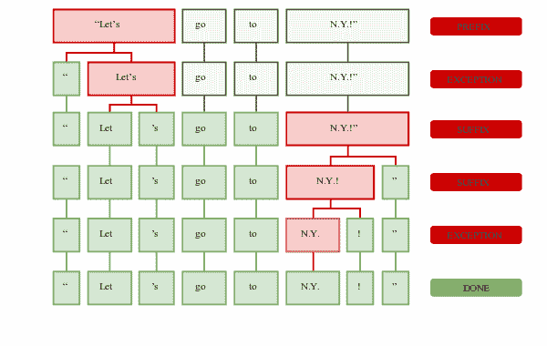
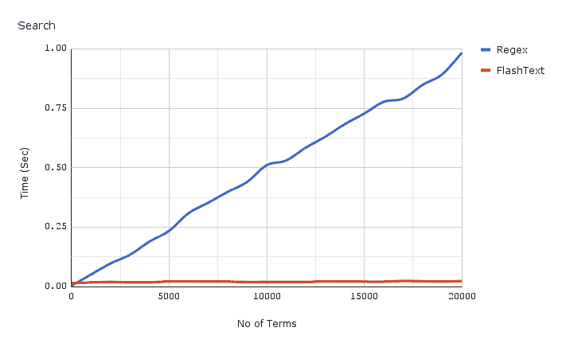
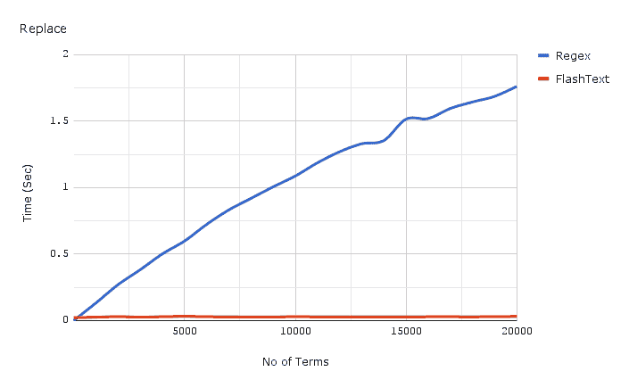

# 第二章：整理你的文本

数据清洗是自然语言处理（**NLP**）中最重要且耗时的工作之一：

“有这样一个笑话，80%的数据科学是数据清洗，20%是抱怨数据清洗。”

– Kaggle创始人兼首席执行官安东尼·戈德布卢姆在[Verge访谈](https://www.theverge.com/2017/11/1/16589246/machine-learning-data-science-dirty-data-kaggle-survey-2017)中提到

在本章中，我们将讨论一些最常见的文本预处理想法。这项任务是普遍的、繁琐的、不可避免的。大多数在数据科学或NLP领域工作的人都知道，这是一个被低估的价值增加。其中一些任务在单独使用时效果不佳，但在正确的组合和顺序中使用时具有强大的效果。由于该领域有两个世界的丰富历史，本章将介绍几个新词和工具。它从传统NLP和机器学习两个领域借鉴。我们将遇到spaCy，这是一个用于Python的自然语言处理的快速行业级工具包。我们将用它进行分词、句子提取和词形还原。

我们将学习使用正则表达式函数，这对于文本挖掘很有用。Python的正则表达式替换对于较大的数据集来说可能很慢。相反，我们将使用FlashText进行替换和扩展。

这是唯一一本涵盖FlashText的书籍。更广泛地说，我们将分享你如何开始思考操纵和清洗文本。这不是对任何一种技术的深入覆盖，而是为你提供一个起点，让你思考哪些可能对你有效。

# 常规任务 - 面包和黄油

有几个著名的文本清洗想法。它们都已经进入了今天最流行的工具中，如NLTK、Stanford CoreNLP和spaCy。我喜欢spaCy的两个主要原因：

+   这是一个行业级NLP，与NLTK不同，NLTK主要是为了教学。

+   它具有良好的速度与性能权衡。spaCy是用Cython编写的，这使得它具有类似C的性能，同时使用Python代码。

spaCy正在积极维护和开发，并集成了大多数挑战的最佳可用方法。

到本节结束时，你将能够做到以下几件事情：

+   理解分词并使用spaCy手动进行

+   理解为什么停用词去除和大小写标准化是有效的，以spaCy为例

+   区分词干提取和词形还原，以spaCy词形还原为例

# 加载数据

我一直喜欢亚瑟·柯南·道尔的*福尔摩斯探案集*。让我们下载这本书并保存在本地：

```py
url = 'http://www.gutenberg.org/ebooks/1661.txt.utf-8'
file_name = 'sherlock.txt'
```

让我们实际下载文件。你只需要做一次，但这个下载实用程序也可以在下载其他数据集时使用：

```py
import urllib.request
# Download the file from `url` and save it locally under `file_name`:
with urllib.request.urlopen(url) as response:
    with open(file_name, 'wb') as out_file:
        data = response.read() # a `bytes` object
        out_file.write(data)
```

接下来，让我们检查在Jupyter笔记本内部是否正确放置了文件，使用shell语法。这种在Windows和Linux上运行基本shell命令的能力非常有用：

```py
!ls *.txt
```

上述命令返回以下输出：

```py
sherlock.txt
```

文件包含来自Project Gutenberg的标题和页脚信息。我们对此不感兴趣，并将丢弃版权和其他法律声明。这是我们想要做的：

1.  打开文件。

1.  删除标题和页脚信息。

1.  将新文件保存为`sherlock_clean.txt`。

我打开了文本文件，发现我需要删除前33行。让我们使用shell命令来完成这个任务——这些命令在Jupyter笔记本中的Windows上也同样适用。你现在还记得这个吗？继续前进：

```py
!sed -i 1,33d sherlock.txt
```

我使用了`sed`语法。`-i`标志告诉你要进行必要的更改。`1,33d`指示你删除第1到33行。

让我们再次检查一下。我们期望这本书现在以标志性的书名/封面开始：

```py
!head -5 sherlock.txt
```

这显示了这本书的前五行。它们正如我们所预期的那样：

```py
THE ADVENTURES OF SHERLOCK HOLMES

   by

   SIR ARTHUR CONAN DOYLE
```

我看到了什么？

在我继续进行任何NLP任务前的文本清理之前，我想花几秒钟快速看一下数据本身。我在以下列表中记下了我注意到的一些事情。当然，更敏锐的眼睛能看到比我更多的东西：

+   日期以混合格式书写：*1888年3月20日*；时间也是如此：*三点钟*。

+   文本在大约70列处换行，所以没有一行可以超过70个字符。

+   有很多专有名词。这些包括像*Atkinson*和*Trepoff*这样的名字，以及像*Trincomalee*和*Baker Street*这样的地点。

+   索引使用罗马数字，如*I*和*IV*，而不是*1*和*4*。

+   有很多对话，如*你有全权*，周围没有叙述。这种叙事风格可以自由地从叙述切换到对话驱动。

+   由于道尔写作的时代，语法和词汇稍微有些不寻常。

这些主观观察有助于理解文本的性质和边缘情况。让我们继续，并将这本书加载到Python中进行处理：

```py
# let's get this data into Python

text = open(file_name, 'r', encoding='utf-8').read() # note that I add an encoding='utf-8' parameter to preserve information

print(text[:5])
```

这返回了前五个字符：

```py
THE A
```

让我们快速验证一下我们是否已将数据加载到有用的数据类型中。

要检查我们的数据类型，请使用以下命令：

```py
print(f'The file is loaded as datatype: {type(text)} and has {len(text)} characters in it')
```

前面的命令返回以下输出：

```py
The file is loaded as datatype: <class 'str'> and has 581204 characters in it
```

在处理字符串方面，Py2.7和Py3.6之间有一个重大的改进。现在它们默认都是Unicode。

在Python 3中，`str`是Unicode字符串，这对于非英语文本的NLP来说更方便。

这里有一个小的相关示例，以突出两种方法之间的差异：

```py
from collections import Counter
Counter('Möbelstück')

In Python 2: Counter({'\xc3': 2, 'b': 1, 'e': 1, 'c': 1, 'k': 1, 'M': 1, 'l': 1, 's': 1, 't': 1, '\xb6': 1, '\xbc': 1})
In Python 3: Counter({'M': 1, 'ö': 1, 'b': 1, 'e': 1, 'l': 1, 's': 1, 't': 1, 'ü': 1, 'c': 1, 'k': 1})
```

# 探索加载的数据

我们能看到多少个独特的字符？

作为参考，ASCII中有127个字符，所以我们预计这最多有127个字符：

```py
unique_chars = list(set(text))
unique_chars.sort()
print(unique_chars)
print(f'There are {len(unique_chars)} unique characters, including both ASCII and Unicode character')
```

前面的代码返回以下输出：

```py
   ['\n', ' ', '!', '"', '$', '%', '&', "'", '(', ')', '*', ',', '-', '.', '/', '0', '1', '2', '3', '4', '5', '6', '7', '8', '9', ':', ';', '?', '@', 'A', 'B', 'C', 'D', 'E', 'F', 'G', 'H', 'I', 'J', 'K', 'L', 'M', 'N', 'O', 'P', 'Q', 'R', 'S', 'T', 'U', 'V', 'W', 'X', 'Y', 'Z', 'a', 'b', 'c', 'd', 'e', 'f', 'g', 'h', 'i', 'j', 'k', 'l', 'm', 'n', 'o', 'p', 'q', 'r', 's', 't', 'u', 'v', 'w', 'x', 'y', 'z', 'à', 'â', 'è', 'é']
   There are 85 unique characters, including both ASCII and Unicode character
```

对于我们的机器学习模型，我们通常需要单词以单个标记或单个单词的形式出现。让我们在下一节中解释这意味着什么。

# 分词

给定一个字符序列和一个定义的文档单元，分词是将它切分成称为标记的片段的任务，也许同时丢弃某些字符，如标点符号。

这里是一个分词的示例：

```py
Input: Friends, Romans, Countrymen, lend me your ears;
Output:       .
```

实际上，有时区分标记和单词是有用的。但在这里，为了便于理解，我们将它们互换使用。

我们将把原始文本转换为单词列表。这应该保留文本的原始顺序。

有几种方法可以做到这一点，所以让我们尝试其中几种。我们将从头开始编写两个方法来建立我们的直觉，然后检查spaCy如何处理分词。

# 直观 – 通过空格拆分

以下代码行简单地通过空格 `' '` 将整个文本主体进行分割或 *拆分*：

```py
words = text.split()
print(len(words))

   107431
```

让我们预览列表中的一个较大片段：

```py
print(words[90:200])  #start with the first chapter, ignoring the index for now
   ['To', 'Sherlock', 'Holmes', 'she', 'is', 'always', 'THE', 'woman.', 'I', 'have', 'seldom', 'heard', 'him', 'mention', 'her', 'under', 'any', 'other', 'name.', 'In', 'his', 'eyes', 'she', 'eclipses', 'and', 'predominates', 'the', 'whole', 'of', 'her', 'sex.', 'It', 'was', 'not', 'that', 'he', 'felt', 'any', 'emotion', 'akin', 'to', 'love', 'for', 'Irene', 'Adler.', 'All', 'emotions,', 'and', 'that', 'one', 'particularly,', 'were', 'abhorrent', 'to', 'his', 'cold,', 'precise', 'but', 'admirably', 'balanced', 'mind.', 'He', 'was,', 'I', 'take', 'it,', 'the', 'most', 'perfect', 'reasoning', 'and', 'observing', 'machine', 'that', 'the', 'world', 'has', 'seen,', 'but', 'as', 'a', 'lover', 'he', 'would', 'have', 'placed', 'himself', 'in', 'a', 'false', 'position.', 'He', 'never', 'spoke', 'of', 'the', 'softer', 'passions,', 'save', 'with', 'a', 'gibe', 'and', 'a', 'sneer.', 'They', 'were', 'admirable', 'things', 'for']
```

这里标点符号的拆分方式并不理想。它经常与单词本身一起出现，例如 `Adler**.**` 结尾的全停点和 `emotions**,**` 中的逗号。很多时候，我们希望单词与标点符号分开，因为单词在大多数数据集中比标点符号传达的意义更多。

让我们看看一个更短的例子：

```py
'red-headed woman on the street'.split()
```

以下是从前面代码中得到的输出：

```py
['red-headed', 'woman', 'on', 'the', 'street']
```

注意到单词 *red-headed* 没有被拆分。这可能是我们想要保留的，也可能不是。我们将回过头来讨论这个问题，所以请记住这一点。

解决这个标点符号挑战的一种方法简单地提取单词并丢弃其他所有内容。这意味着我们将丢弃所有非ASCII字符和标点符号。

# 诡计 – 通过单词提取拆分

单词提取可以通过几种方式完成。反过来，我们可以使用单词提取将单词拆分成标记。我们将探讨正则表达式，或正则表达式进行单词提取。它是一种由用户定义的模式驱动的字符串搜索机制。

# 介绍正则表达式

正则表达式一开始可能有点挑战性，但它们非常强大。它们是通用的抽象，并且可以在Python以外的多种语言中使用：

```py
import re
re.split('\W+', 'Words, words, words.')
> ['Words', 'words', 'words', '']
```

正则表达式 `\W+` 表示 *一个单词字符（A-Z等）重复一次或多次：*

```py
words_alphanumeric = re.split('\W+', text)
print(len(words_alphanumeric), len(words))
```

前面代码的输出是 `(109111, 107431)`。

让我们预览一下我们提取的单词：

```py
print(words_alphanumeric[90:200])
```

以下是从前面代码中得到的输出：

```py
   ['BOHEMIA', 'I', 'To', 'Sherlock', 'Holmes', 'she', 'is', 'always', 'THE', 'woman', 'I', 'have', 'seldom', 'heard', 'him', 'mention', 'her', 'under', 'any', 'other', 'name', 'In', 'his', 'eyes', 'she', 'eclipses', 'and', 'predominates', 'the', 'whole', 'of', 'her', 'sex', 'It', 'was', 'not', 'that', 'he', 'felt', 'any', 'emotion', 'akin', 'to', 'love', 'for', 'Irene', 'Adler', 'All', 'emotions', 'and', 'that', 'one', 'particularly', 'were', 'abhorrent', 'to', 'his', 'cold', 'precise', 'but', 'admirably', 'balanced', 'mind', 'He', 'was', 'I', 'take', 'it', 'the', 'most', 'perfect', 'reasoning', 'and', 'observing', 'machine', 'that', 'the', 'world', 'has', 'seen', 'but', 'as', 'a', 'lover', 'he', 'would', 'have', 'placed', 'himself', 'in', 'a', 'false', 'position', 'He', 'never', 'spoke', 'of', 'the', 'softer', 'passions', 'save', 'with', 'a', 'gibe', 'and', 'a', 'sneer', 'They', 'were', 'admirable']
```

我们注意到 `Adler` 不再与标点符号一起出现。这正是我们想要的。任务完成了吗？

我们在这里做了什么权衡？为了理解这一点，让我们看看另一个例子：

```py
words_break = re.split('\W+', "Isn't he coming home for dinner with the red-headed girl?")
print(words_break)
```

以下是从前面的代码中得到的输出：

```py
 ['Isn', 't', 'he', 'coming', 'home', 'for', 'dinner', 'with', 'the', 'red', 'headed', 'girl', '']
```

我们将 `Isn't` 拆分为 `Isn` 和 `t`。如果你处理的是电子邮件或推特数据，这就不太好了，因为你会有很多这样的缩写和缩写。作为一个小烦恼，我们在末尾有一个额外的空标记 `''`。同样，因为我们忽略了标点符号，`red-headed` 被拆分为两个单词：`red` 和 `headed`。如果我们只有标记化版本，我们就没有简单的方法来恢复这种联系。

我们可以在我们的分词策略中编写自定义规则来覆盖这些边缘情况的大部分。或者，我们可以使用已经为我们编写好的东西。

# spaCy 用于分词

spaCy 使用前面的 `.load` 语法加载英语 *模型*。这告诉 spaCy 使用哪些规则、逻辑、权重和其他信息：

```py
 %%time
 import spacy
 # python -m spacy download en
 # uncomment above line to download the model
 nlp = spacy.load('en')
```

虽然我们在这本书中只使用 `'en'` 或英语示例，但 spaCy 支持更多语言的这些功能。我已使用他们的多语言分词器为印地语，并且对结果感到满意：

`%%time` 语法测量你在 Jupyter Notebook 运行时执行的单元格的 CPU 和 Wall 时间。

```py
doc = nlp(text)
```

这创建了一个 spaCy 对象，`doc`。该对象存储了预先计算的语料库特征，包括标记。一些 NLP 库，尤其是在 Java 和 C 生态系统中，在调用特定功能时计算语料库特征，如标记、词元和词性。相反，spaCy 在将 `text` 传递给它时，在初始化时计算所有这些特征。

spaCy 预先计算了大多数语料库特征——你只需要从对象中检索它们。

我们可以通过调用对象迭代器来检索它们。在下面的代码中，我们调用迭代器并将其 *列表化*：

```py
print(list(doc)[150:200])
```

下面的输出是前面代码的结果：

```py
[whole, of, her, sex, ., It, was, not, that, he, felt,
   , any, emotion, akin, to, love, for, Irene, Adler, ., All, emotions, ,, and, that,
   , one, particularly, ,, were, abhorrent, to, his, cold, ,, precise, but,
   , admirably, balanced, mind, ., He, was, ,, I, take, it, ,]
```

便利的是，spaCy 将所有标点符号和单词都分词。它们作为单独的标记返回。让我们尝试一下我们之前不喜欢的例子：

```py
words = nlp("Isn't he coming home for dinner with the red-headed girl?")
print([token for token in words])
> [Is, n't, he, coming, home, for, dinner, with, the, red, -, headed, girl, ?]
```

这里是观察结果：

+   spaCy 正确地将 `Isn't` 分割为 `Is` 和 `n't`。

+   `red-headed` 被分割成三个标记：`red`、`-` 和 `headed`。由于标点信息没有丢失，如果我们想的话，可以恢复原始的 `red-headed` 标记。

# spaCy 分词器是如何工作的？

最简单的解释来自 spaCy 文档（[spacy-101](https://spacy.io/usage/spacy-101)）本身。

首先，原始文本在空白字符上分割，类似于 text.split (`' '`)。然后，分词器从左到右处理文本。在每个子字符串上，它执行两个检查：

+   *子字符串是否匹配分词器的异常规则？* 例如，*don't* 不包含空格，但应该分割成两个标记，*do* 和 *n't*，而 *U.K.* 应始终作为一个标记。

+   *前缀、后缀或中缀可以被分割开吗？* 例如，如逗号、句号、连字符或引号之类的标点符号：



# 句子分词

我们也可以使用 spaCy 一次提取一句话，而不是一次提取一个单词：

```py
sentences = list(doc.sents)
print(sentences[14:18])
```

下面的输出是前面代码的结果：

```py
 [she is always THE woman., I have seldom heard
   him mention her under any other name., In his eyes she eclipse
   and predominates the whole of her sex., It was not that he felt
   any emotion akin to love for Irene Adler.]
```

# 停用词去除和大小写转换

这些简单的想法在许多任务中都很普遍，并且相当有效。它们特别有助于在处理文档时减少唯一标记的数量。

spaCy 已经将每个标记标记为停用词或非停用词，并将其存储在每个标记的 `is_stop` 属性中。这使得它在文本清理中非常方便。让我们快速看一下：

```py
sentence_example = "the AI/AGI uprising cannot happen without the progress of NLP"
[(token, token.is_stop, token.is_punct) for token in nlp(sentence_example)]

   [(the, True, False),
    (AI, False, False),
    (/, False, True),
    (AGI, True, False),
    (uprising, False, False),
    (can, True, False),
    (not, True, False),
    (happen, False, False),
    (without, True, False),
    (the, True, False),
    (progress, False, False),
    (of, True, False),
    (NLP, True, False)]
```

回到我们的夏洛克示例，让我们看看前几行是否算作停用词：

```py
for token in doc[:5]:
   print(token, token.is_stop, token.is_punct)   

Output:
   THE False False
   ADVENTURES False False
   OF False False
   SHERLOCK False False
   HOLMES False False
```

有趣的是，虽然*the*和*of*被标记为停用词，但`THE`和`OF`没有被标记。这不是一个错误，而是设计上的选择。spaCy不会自动移除因为大小写或标题化而不同的单词。

相反，我们可以在将原始文本传递给spaCy之前将其转换为小写，以强制这种行为：

```py
text_lower = text.lower()  # native python function
doc_lower = nlp(text_lower)
for token in doc_lower[:5]:
   print(token, token.is_stop)

Output:
 the True
 adventures False
 of True
 sherlock False
 holmes False
```

让我们看看spaCy字典中存在哪些停用词，然后如何以编程方式扩展：

```py
from spacy.lang.en.stop_words import STOP_WORDS
f'spaCy has a dictionary of {len(list(STOP_WORDS))} stop words'

   'spaCy has a dictionary of 305 stop words'
```

我们希望根据我们的领域和问题来扩展停用词字典。例如，如果你使用这段代码来处理NLP书籍的文本，我们可能希望将诸如`NLP`、*Processing*、`AGI`、*Data*等词添加到停用词列表中。

spaCy有一个直观的`.add()` API来做这件事：

```py
domain_stop_words = ["NLP", "Processing", "AGI"]
for word in domain_stop_words:
   STOP_WORDS.add(word)
```

让我们尝试运行之前相同的示例，并添加这些停用词：

```py
[(token, token.is_stop, token.is_punct) for token in nlp(sentence_example)]
```

以下是从运行前面的代码中得到的输出：

```py
    [(the, True, False),
    (AI, False, False),
    (/, False, True),
    (AGI, True, False),
    (uprising, False, False),
    (can, True, False),
    (not, True, False),
    (happen, False, False),
    (without, True, False),
    (the, True, False),
    (progress, False, False),
    (of, True, False),
    (NLP, True, False)]
```

正如预期的那样，`NLP`和`AGI`现在也被标记为停用词。

让我们提取出不是停用词的字符串标记到一个Python列表或类似的数据结构中。

一些在文本预处理之后的NLP任务期望字符串标记而不是spaCy标记对象作为数据类型。为了演示，这里同时移除停用词和标点符号：

```py
[str(token) for token in nlp(sentence_example) if not token.is_stop and not token.is_punct]
 ['AI', 'uprising', 'happen', 'progress']
```

或者只是移除停用词，同时保留标点符号：

```py
[str(token) for token in nlp(sentence_example) if not token.is_stop]
['AI'], '/', 'uprising', 'happen', 'progress']
```

# 词干提取和词形还原

词干提取和词形还原是非常流行的两种方法，用于减少语料库的词汇量。

**词干提取**通常指的是一种粗略的启发式过程，它通过截断单词的末尾来希望大多数时候正确地实现这一目标，并且通常包括移除派生词缀。

**词形还原**通常指的是使用词汇和词形分析来正确地处理事物，通常旨在仅删除屈折词尾，并返回单词的基本或词典形式，这被称为词元。

如果遇到token saw，词干提取可能只返回s，而词形还原会尝试返回see或saw，这取决于token的使用是作为动词还是名词。

- 克里斯托弗·曼宁博士等，2008年，[[IR-Book](https://nlp.stanford.edu/IR-book/html/htmledition/stemming-and-lemmatization-1.html)]

(克里斯·曼宁是斯坦福大学计算机科学和语言学系的机器学习教授)

# spaCy用于词形还原

spaCy仅支持词形还原。如spaCy创建者马特·霍尼巴尔在GitHub上的[问题#327](https://github.com/explosion/spaCy/issues/327)中讨论的那样，词干提取器很少是一个好主意。

我们希望将`meet/NOUN`与`meeting/VERB`区别对待。与旨在*教授和介绍*尽可能多的NLP思想的斯坦福NLTK不同，spaCy对词干提取持反对意见。

当你使用 `nlp` 对象处理文本时，spaCy 会默认为你进行词形还原。这些信息存储在每个标记的 `lemma` 属性中。spaCy 存储内部哈希或标识符，它存储在 `token.lemma` 中。这个数字哈希对我们没有意义。这种数字表示有助于 spaCy 比其其他 Python 组件更快地访问和操作信息。

属性末尾的下划线，例如 `lemma_`，告诉 spaCy 我们正在寻找的是可读性强的内容：

```py
lemma_sentence_example = "Their Apples & Banana fruit salads are amazing. Would you like meeting me at the cafe?"
[(token, token.lemma_, token.lemma, token.pos_ ) for token in nlp(lemma_sentence_example)]

Printing this gives the following output: 

   [(Their, '-PRON-', 561228191312463089, 'ADJ'),
    (Apples, 'apples', 14374618037326464786, 'PROPN'),
    (&, '&', 15473034735919704609, 'CCONJ'),
    (Banana, 'banana', 2525716904149915114, 'PROPN'),
    (fruit, 'fruit', 17674554054627885835, 'NOUN'),
    (salads, 'salad', 16382906660984395826, 'NOUN'),
    (are, 'be', 10382539506755952630, 'VERB'),
    (amazing, 'amazing', 12968186374132960503, 'ADJ'),
    (., '.', 12646065887601541794, 'PUNCT'),
    (Would, 'would', 6992604926141104606, 'VERB'),
    (you, '-PRON-', 561228191312463089, 'PRON'),
    (like, 'like', 18194338103975822726, 'VERB'),
    (meeting, 'meet', 6880656908171229526, 'VERB'),
    (me, '-PRON-', 561228191312463089, 'PRON'),
    (at, 'at', 11667289587015813222, 'ADP'),
    (the, 'the', 7425985699627899538, 'DET'),
    (cafe, 'cafe', 10569699879655997926, 'NOUN'),
    (?, '?', 8205403955989537350, 'PUNCT')]
```

这里有很多事情在进行中。让我们来讨论它们。

# -PRON-

spaCy 有一个稍微有些令人烦恼的词形还原（回想一下，词形还原是词形还原的输出）: -PRON-。这被用作所有代词（如 `Their`、`you`、`me` 和 `I`）的词形。其他 NLP 工具将这些词形还原为 `I` 而不是占位符，如 `-PRON-`。

# 不区分大小写

在检查停用词时，spaCy 并没有自动将我们的输入转换为小写。另一方面，词形还原为我们做了这件事。它将 "Apple" 转换为 "apple"，将 "Banana" 转换为 "banana"。

这就是 spaCy 使我们的生活变得更轻松的一种方式，尽管有些不一致。当我们移除停用词时，我们希望保留 "THE ADVENTURES OF SHERLOCK HOLMES" 中的 THE，同时移除 "the street was black" 中的 *the*。在词形还原中，通常情况相反；我们更关心词语在上下文中的使用方式，并相应地使用正确的词形。

# 转换 - 会议到会议

词形还原（Lemmatization）意识到了词语在上下文中的语言角色。"Meeting" 转换为 "meet" 因为它是一个动词。spaCy 为我们提供了部分词性标注和其他语言特征供我们使用。我们很快就会学习如何查询这些信息。

# spaCy 与 NLTK 和 CoreNLP 的比较

以下是对 NLTK 和 CoreNLP 的比较：

| **特性** | **Spacy** | **NLTK** | **CoreNLP** |
| --- | --- | --- | --- |
| 原生 Python 支持/API | Y | Y | Y |
| 多语言支持 | Y | Y | Y |
| 分词 | Y | Y | Y |
| 词性标注 | Y | Y | Y |
| 句子分割 | Y | Y | Y |
| 依存句法分析 | Y | N | Y |
| 实体识别 | Y | Y | Y |
| 集成词向量 | Y | N | N |
| 情感分析 | Y | Y | Y |
| 语义消歧 | N | N | Y |

# 修正拼写

最常见的文本挑战之一是纠正拼写错误。当数据由非专业用户输入时，这一点尤其正确，例如，运输地址或类似内容。

让我们来看一个例子。我们希望将 Gujrat、Gujart 和其他小错误拼写更正为 Gujarat。根据你的数据集和专业知识水平，有几种好的方法可以做到这一点。我们将讨论两种或三种流行的方法，并讨论它们的优缺点。

在我开始之前，我们需要向传奇人物 [Peter Norvig 的拼写纠正](https://norvig.com/spell-correct.html) 表示敬意。关于如何 *思考* 解决问题和 *探索* 实现方法，它仍然值得一读。即使他重构代码和编写函数的方式也是教育性的。

他的拼写纠正模块不是最简单或最好的方法。我推荐两个包：一个侧重于简单性，一个侧重于给您所有刀、铃和哨子来尝试：

+   **[FuzzyWuzzy](https://github.com/seatgeek/fuzzywuzzy)** 使用简单。它给出两个字符串之间简单的相似度评分，上限为 100。数字越高，表示单词越相似。

+   **[Jellyfish](https://github.com/jamesturk/jellyfish)** 支持六种编辑距离函数和四种音标编码选项，您可以根据您的用例使用它们。

# FuzzyWuzzy

让我们看看我们如何使用 FuzzyWuzzy 来纠正我们的拼写错误。

使用以下代码在您的机器上安装 FuzzyWuzzy：

```py
import sys

!{sys.executable} -m pip install fuzzywuzzy
# alternative for 4-10x faster computation: 

# !{sys.executable} -m pip install fuzzywuzzy[speedup]
```

FuzzyWuzzy 有两个主要的模块将非常有用：fuzz 和 process。让我们首先导入 fuzz：

```py
from fuzzywuzzy import fuzz
# Trying the ratio and partial_ratio 
fuzz.ratio("Electronic City Phase One", "Electronic City Phase One, Bangalore")

fuzz.partial_ratio("Electronic City Phase One", "Electronic City Phase One, Bangalore")

```

我们可以看到，比率函数被前面地址中使用的尾随 `Bangalore` 搅乱了，但实际上这两个字符串指的是同一个地址/实体。这被 `partial_ratio` 捕获。

你看到没有，`ratio` 和 `partial_ratio` 都对单词的顺序很敏感？这对于比较遵循某种顺序的地址很有用。另一方面，如果我们想比较其他东西，例如人名，可能会得到反直觉的结果：

```py
fuzz.ratio('Narendra Modi', 'Narendra D. Modi')

fuzz.partial_ratio('Narendra Modi', 'Narendra D. Modi')

```

如您所见，仅仅因为我们有一个额外的 `D.` 标记，我们的逻辑就不再适用了。我们想要的是对顺序不那么敏感的东西。FuzzyWuzzy 的作者已经为我们解决了这个问题。

FuzzyWuzzy 支持将我们的输入在空格上进行标记化，并删除标点符号、数字和非 ASCII 字符的功能。然后这被用来计算相似度。让我们试试这个：

```py
fuzz.token_sort_ratio('Narendra Modi', 'Narendra D. Modi')

fuzz.token_set_ratio('Narendra Modi', 'Narendra D. Modi')

```

这对我们来说将完美无缺。如果我们有一个选项列表，并且我们想找到最接近的匹配项，我们可以使用 process 模块：

```py
from fuzzywuzzy import process
query = 'Gujrat'

choices = ['Gujarat', 'Gujjar', 'Gujarat Govt.']

# Get a list of matches ordered by score, default limit to 5
print(process.extract(query, choices))
# [('Gujarat', 92), ('Gujarat Govt.', 75), ('Gujjar', 67)]

# If we want only the top one result to be # returned:
process.extractOne(query, choices)
# ('Gujarat', 92)
```

让我们看看另一个例子。在这里，我们将 `Bangalore` 拼写错误为 `Banglore` – 我们缺少一个 `a`：

```py
query = 'Banglore'
choices = ['Bangalore', 'Bengaluru']
print(process.extract(query, choices))
# [('Bangalore', 94), ('Bengaluru', 59)]
process.extractOne(query, choices)
# ('Bangalore', 94)
```

让我们以一个在线购物中常见的搜索拼写错误为例。用户将 `chilli` 拼写为 `chili`；注意缺少的 `l`：

```py
query = 'chili'
choices = ['chilli', 'chilled', 'chilling']
print(process.extract(query, choices))
# [('chilli', 91), ('chilling', 77), ('chilled', 67)]
process.extractOne(query, choices)
# ('chilli', 91)
```

# Jellyfish

Jellyfish 支持几乎所有流行编辑距离函数的合理快速实现（回想一下编辑距离函数是如何告诉你两个序列/字符串相似度的）。虽然 FuzzyWuzzy 主要支持 Levenshtein 距离，但这个包支持一些更多的字符串比较工具：

+   Levenshtein 距离

+   Damerau-Levenshtein 距离

+   Jaro 距离

+   Jaro-Winkler 距离

+   匹配评分方法比较

+   Hamming 距离

此外，它还支持英语的**音标编码**。

使用以下代码在您的机器上安装 Jellyfish：

```py
import sys
# !{sys.executable} -m pip install jellyfish
```

让我们尝试导入包并设置一些示例来尝试：

```py
import jellyfish

correct_example = ('Narendra Modi', 'Narendra Modi')
damodardas_example = ('Narendra Modi', 'Narendra D. Modi')
modi_typo_example = ('Narendra Modi', 'Narendar Modi')
gujarat_typo_example = ('Gujarat', 'Gujrat')

examples = [correct_example, damodardas_example, modi_typo_example, gujarat_typo_example]
```

我们希望尝试所有示例中的多个距离函数。更聪明的方法是为此构建一个实用函数。我们现在就来做这件事：

```py
def calculate_distance(function, examples=examples):
    for ele in examples:
        print(f'{ele}: {function(*ele)}')
```

注意`calculate_distance`函数接受距离函数作为输入。我们可以将`examples`保留为从我们在全局命名空间中之前声明的什么中隐式选择。

Levenshtein距离，这可能是最著名的字符串相似度函数，有时与编辑距离函数同义，但我们将这视为编辑距离函数家族的一个特定实现：

```py
calculate_distance(jellyfish.levenshtein_distance) 
# ('Narendra Modi', 'Narendra Modi'): 0
# ('Narendra Modi', 'Narendra D. Modi'): 3
# ('Narendra Modi', 'Narendar Modi'): 2
# ('Gujarat', 'Gujrat'): 1
```

Damerau–Levenshtein距离在Levenshtein编辑操作（插入、删除和替换）中添加了交换。让我们尝试这个，看看是否对我们有什么影响：

```py
calculate_distance(jellyfish.damerau_levenshtein_distance)
# ('Narendra Modi', 'Narendra Modi'): 0
# ('Narendra Modi', 'Narendra D. Modi'): 3
# ('Narendra Modi', 'Narendar Modi'): 1
# ('Gujarat', 'Gujrat'): 1
```

我们注意到`Narendra`和`Narendar`的距离值从`3`变为`2`。这是因为我们现在至少将`a`与`r`或反之进行交换。其他字符是替换，所以1+1=2。

我们接下来要尝试的距离函数是汉明距离。这计算了将一个字符串转换为另一个字符串所需的最小替换次数：

```py
calculate_distance(jellyfish.hamming_distance)
# ('Narendra Modi', 'Narendra Modi'): 0
# ('Narendra Modi', 'Narendra D. Modi'): 7
# ('Narendra Modi', 'Narendar Modi'): 2
# ('Gujarat', 'Gujrat'): 4
```

**Jaro和Jaro-Winkler**返回相似度值——而不是不相似度。这意味着完美匹配返回1.0，而完全不相关的匹配往往会接近0：

```py
calculate_distance(jellyfish.jaro_distance)
# ('Narendra Modi', 'Narendra Modi'): 1.0
# ('Narendra Modi', 'Narendra D. Modi'): 0.9375
# ('Narendra Modi', 'Narendar Modi'): 0.9743589743589745
# ('Gujarat', 'Gujrat'): 0.8968253968253969
```

尝试Jaro相似度的另一种变体，即Jaro-Winkler，我们得到以下结果：

```py
calculate_distance(jellyfish.jaro_winkler)
# ('Narendra Modi', 'Narendra Modi'): 1.0
# ('Narendra Modi', 'Narendra D. Modi'): 0.9625
# ('Narendra Modi', 'Narendar Modi'): 0.9846153846153847
# ('Gujarat', 'Gujrat'): 0.9277777777777778
```

这些技术非常实用且多样化。然而，它们对书面文本的过度强调为英语创造了一个独特的问题。我们不会像说话那样写英语。这意味着我们没有捕捉到所有相似性的范围。为了解决这个挑战，这是在非母语英语使用者的聊天机器人中通常遇到的挑战，我们可以查看单词的音位相似性，这正是我们接下来要做的。

# 音位词相似度

我们说一个词的方式构成了它的音位。音位是语音信息。例如，在许多源自英国口音中，如印度口音中，soul和sole听起来相同。

很常见，单词可能因为打字员试图让它**听起来正确**而稍微拼错。在这种情况下，我们利用这种音位信息将这个错误拼写的单词映射回正确的拼写。

# 什么是音位编码？

我们可以将一个单词转换为其发音的表示。当然，这可能会因口音和转换技术而有所不同。

然而，随着时间的推移，已经出现了两种或三种流行的方法，我们可以这样做。每种方法都接受一个字符串并返回一个编码表示。我鼓励您在Google上搜索这些术语：

+   **美国Soundex（20世纪30年代**）：在流行的数据库软件中实现，如PostgreSQL、MySQL和SQLite

+   **NYSIIS（纽约州身份和情报系统）（20世纪70年代**）

+   Metaphone（20世纪90年代）

+   **匹配评分码（20世纪初期**）

让我们快速预览一下同样的内容：

```py
jellyfish.soundex('Jellyfish')
# 'J412'
```

对于NYSIIS，我们将使用以下方法：

```py
jellyfish.nysiis('Jellyfish')
# 'JALYF'
```

使用稍微更新一点的 metaphone，我们得到以下输出：

```py
jellyfish.metaphone('Jellyfish')
# 'JLFX'
```

匹配率编码器给出了以下输出：

```py
jellyfish.match_rating_codex('Jellyfish')
# 'JLYFSH'
```

我们现在可以使用之前看到的字符串比较工具来比较两个字符串的音位。

```py
Metaphone + Levenshtein
```

例如，`write` 和 `right` 应该具有零音位 Levenshtein 距离，因为它们的发音相同。让我们来试试看：

```py
jellyfish.levenshtein_distance(jellyfish.metaphone('write'), jellyfish.metaphone('right'))# 

```

这正如预期的那样工作。让我们将一些例子添加到我们的旧例子列表中：

```py
examples+= [('write', 'right'), ('Mangalore', 'Bangalore'), ('Delhi', 'Dilli')] # adding a few examples to show how cool this is
```

让我们将这个封装成一个实用函数，就像我们之前做的那样。现在我们将使用两个函数参数：`phonetic_func` 和 `distance_func`：

```py
def calculate_phonetic_distance(phonetic_func, distance_func, examples=examples):
    print("Word\t\tSound\t\tWord\t\t\tSound\t\tPhonetic Distance")
    for ele in examples:
        correct, typo = ele[0], ele[1]
        phonetic_correct, phonetic_typo = phonetic_func(correct), phonetic_func(typo)
        phonetic_distance = distance_func(phonetic_correct, phonetic_typo)
        print(f'{correct:<10}\t{phonetic_correct:<10}\t{typo:<20}\t{phonetic_typo:<10}\t{phonetic_distance:<10}') 

calculate_phonetic_distance(phonetic_func=jellyfish.metaphone, distance_func=jellyfish.levenshtein_distance)        
```

这将返回以下表格：

```py
Word               Sound           Word                    Sound           Phonetic Distance
Narendra Modi   NRNTR MT        Narendra Modi           NRNTR MT        0         
Narendra Modi   NRNTR MT        Narendra D. Modi        NRNTR T MT      2         
Narendra Modi   NRNTR MT        Narendar Modi           NRNTR MT        0         
Gujarat         KJRT            Gujrat                  KJRT            0         
write           RT              right                   RT              0         
Mangalore       MNKLR           Bangalore               BNKLR           1         
Delhi           TLH             Dilli                   TL              1         
```

注意德里（Delhi）和达利（Dilli）被分开，这并不好。另一方面，纳伦德拉（Narendra）和纳伦达尔（Narendar）被标记为零编辑距离相似，这相当酷。让我们尝试不同的技术，看看效果如何。

**美国 Soundex**

我们注意到 Soundex 能够识别常见的发音相似的单词，并为它们提供单独的音位编码。这使得我们可以区分 `right` 和 `write`。

这只适用于美国/英语单词。例如，印度名字如 `Narendra Modi` 和 `Narendra D. Modi` 现在被认为是相似的：

```py
calculate_phonetic_distance(phonetic_func=jellyfish.soundex, distance_func=jellyfish.levenshtein_distance)        
```

注意以下表格中与之前代码的变化：

```py
Word            Sound           Word                    Sound           Phonetic Distance
Narendra Modi   N653            Narendra Modi           N653            0         
Narendra Modi   N653            Narendra D. Modi        N653            0         
Narendra Modi   N653            Narendar Modi           N653            0         
Gujarat         G263            Gujrat                  G263            0         
write           W630            right                   R230            2         
Mangalore       M524            Bangalore               B524            1         
Delhi           D400            Dilli                   D400            0    
```

# 运行时间复杂度

我们现在有找到单词正确拼写或标记它们为相似的能力。在处理大型语料库时，我们可以提取所有唯一的单词，并将每个标记与每个其他标记进行比较。

这将需要 O(n²)，其中 *n* 是语料库中唯一标记的数量。这可能会使大型语料库的处理过程变得太慢。

另一个选择是使用标准词典，并扩展你的语料库。如果词典有 *m* 个独特的单词，这个过程现在将是 O(m∗n)。假设 m << n，这将比之前的方法快得多。

# 使用 FlashText 清理语料库

但是，对于一个包含数百万份文档和数千个关键词的网页规模语料库呢？由于正则表达式的线性时间复杂度，它可能需要几天时间才能完成这样的精确搜索。我们如何改进这一点？

我们可以使用 FlashText 来处理这个非常具体的用例：

+   几百万份文档和数千个关键词

+   精确关键词匹配 - 要么替换，要么搜索这些关键词的存在

当然，这个问题有几种不同的可能解决方案。我推荐这个方案，因为它简单，专注于解决一个问题。它不需要我们学习新的语法或设置特定的工具，如 ElasticSearch。

以下表格展示了使用 Flashtext 与编译正则表达式进行搜索的比较：



以下表格展示了使用 FlashText 与编译正则表达式进行替换的比较：



我们注意到，虽然正则表达式的运行时间几乎呈线性增长，但Flashtext则相对平稳。现在，我们知道我们需要Flashtext来提高速度和扩展性。FlashText得到了社区的广泛喜爱。使用者包括[NLProc](https://github.com/NIHOPA/NLPre) – 来自国家卫生研究院的自然语言处理预处理工具包。

按照以下说明将FlashText安装到您的机器上。

首先，我们将在我们的conda环境中安装pip。我们将从我们的笔记本中这样做：

```py
# import sys
# !{sys.executable} -m pip install flashtext
```

FlashText的源代码可在GitHub上找到（[https://github.com/PacktPublishing/Natural-Language-Processing-with-Python-Quick-Start/tree/master/Chapter02](https://github.com/PacktPublishing/Natural-Language-Processing-with-Python-Quick-Start/tree/master/Chapter02)），文档导航和使用都很简单。在这里，我们只考虑两个基本示例。让我们找出在语料库中查找关键词的语法：

```py
from flashtext.keyword import KeywordProcessor
keyword_processor = KeywordProcessor()
keyword_processor.add_keyword('Delhi', 'NCR') # notice we are adding tuples here
keyword_processor.add_keyword('Bombay', 'Mumbai')
keywords_found = keyword_processor.extract_keywords('I love the food in Delhi and the people in Bombay')
keywords_found
# ['NCR', 'Mumbai']
```

现在我们就替换它们怎么样？

```py
from flashtext.keyword import KeywordProcessor
keyword_processor = KeywordProcessor()
keyword_processor.add_keyword('Delhi', 'NCR')
keyword_processor.add_keyword('Bombay', 'Mumbai')
replaced_sentence = keyword_processor.replace_keywords('I love the food in Delhi and the people in Bombay')
replaced_sentence
# 'I love the food in NCR and the people in Mumbai'
```

不幸的是，目前FlashText只支持英语。正则表达式可以根据特殊字符如`^,$,*,\d`来搜索关键词，这些在FlashText中是不支持的。因此，为了匹配像`word\dvec`这样的部分单词，我们仍然需要使用正则表达式。然而，FlashText在提取完整的单词如`word2vec`方面仍然非常出色。

# 摘要

本章涵盖了大量的新内容。我们首先对文本进行了语言处理。我们遇到了**spaCy**，随着我们在本书中的深入，我们将继续深入研究。我们涵盖了以下语言学基础概念：分词（使用和未使用spaCy进行），去除停用词，大小写标准化，词形还原（我们跳过了词干提取） – 使用spaCy及其特性，如`*-PRON-*`

但我们除了进行文本清理之外，还能用spaCy做什么？我们能构建一些东西吗？当然可以！

我们不仅可以用spaCy的管道扩展我们的简单语言文本清理，还可以进行词性标注、命名实体识别和其他常见任务。我们将在下一章中探讨这一点。

我们探讨了拼写纠正或最接近的单词匹配问题。在这个背景下，我们讨论了**FuzzyWuzzy**和**Jellyfish**。为了确保我们可以扩展到超过几百个关键词，我们还研究了**FlashText**。我鼓励您深入研究这些优秀的库，以了解最佳软件工程实践。

在下一章中，我们将与其他语言工具结合，构建一个端到端的玩具程序。
