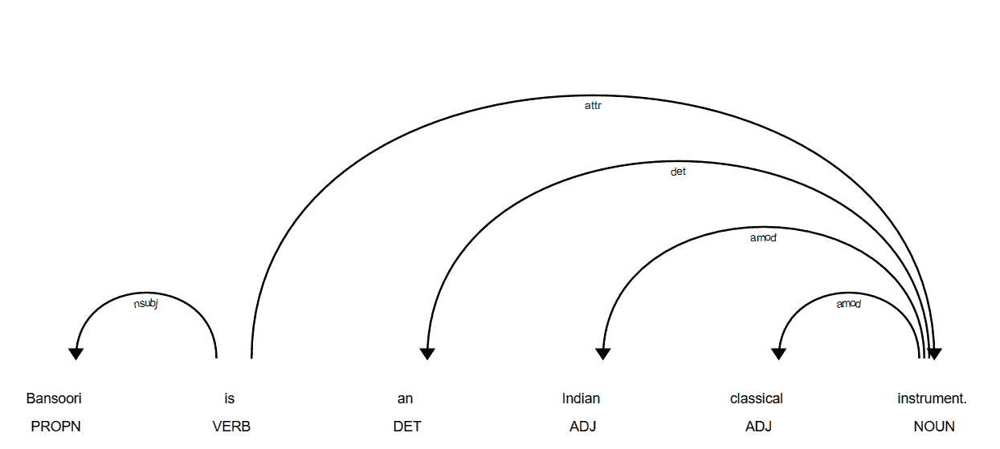
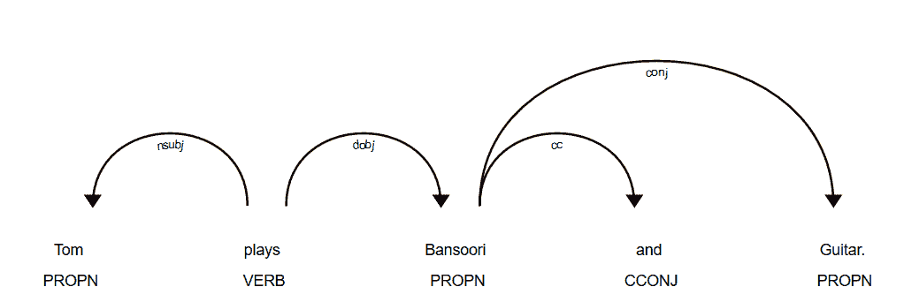
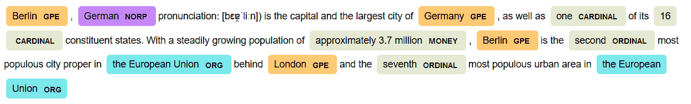

# 第三章：利用语言学

在本章中，我们将选择一个简单的用例，看看我们如何解决它。然后，我们再次执行这个任务，但是在一个略微不同的文本语料库上。

这有助于我们了解在自然语言处理中使用语言学时的构建直觉。在这里，我将使用spaCy，但您可以使用NLTK或等效工具。它们的API和风格存在程序性差异，但基本主题保持不变。

在上一章中，我们第一次尝试处理自由文本。具体来说，我们学习了如何将文本标记为单词和句子，使用正则表达式进行模式匹配，以及进行快速替换。

通过做所有这些，我们以文本的*字符串*作为主要表示形式。在本章中，我们将使用*语言*和*语法*作为主要表示形式。

在本章中，我们将学习以下主题：

+   spaCy，工业用自然语言库

+   自然语言处理管道，以及一些英语语法

+   关于我们可以用语言学做什么的现实生活示例

# 语言学与自然语言处理

**T**his部分致力于向您介绍在语言学几十年的发展中一直存在的思想和工具。介绍这种思想的最传统方式是先提出一个想法，详细地讨论它，然后把这些都放在一起。

这里，我将反过来这样做。我们将解决两个问题，在这个过程中，我们将查看我们将使用的工具。而不是向您介绍一个8号扳手，我给您提供了一个汽车引擎和工具，我将在使用它们时介绍这些工具。

大多数自然语言处理任务都是在顺序管道中解决的，一个组件的结果会输入到下一个组件。

存储管道结果和中间步骤的数据结构种类繁多。在这里，为了简单起见，我将只使用spaCy中已有的以及原生的Python数据结构，如列表和字典。

在这里，我们将解决以下源于现实生活的挑战：

+   从任何文档中删除姓名，例如，为了符合GDPR规定

+   从任何文本中制作测验，例如，从维基百科文章中

# 开始使用

您可以通过`conda`或`pip`安装spaCy。由于我处于`conda`环境中，我将使用`conda`安装，如下所示：

```py
# !conda install -y spacy 
# !pip install spacy
```

让我们下载spaCy提供的英语语言模型。我们将使用`en_core_web_lg`（末尾的`lg`代表*大型*）。这意味着这是spaCy为通用目的发布的最全面和性能最好的模型。

您只需做一次：

```py
!python -m spacy download en_core_web_lg
```

如果您在下载时遇到任何错误，您可以使用较小的模型代替。

对于Windows Shell，您可以使用管理员权限执行`python -m spacy download en`。从Linux终端，您可以使用`sudo python -m spacy download en`。

让我们先处理一下导入：

```py
import spacy
from spacy import displacy # for visualization
nlp = spacy.load('en_core_web_lg')
spacy.__version__
```

我在这里使用的是来自conda的`version 2.0.11`版本，但您可以使用任何高于2.0.x的版本。

# 介绍textacy

Textacy是一套非常被低估的工具集，它围绕spaCy构建。其标语清楚地告诉你它做什么：*NLP，spaCy前后*。它实现了使用spaCy底层工具的工具，从用于生产的数据流实用程序到高级文本聚类功能。

你可以通过`pip`或`conda`安装textacy。在`conda`中，它可在`conda-forge`频道而不是主`conda`频道中找到。我们通过添加`-c`标志和之后的频道名称来实现这一点：

```py
# !conda install -c conda-forge textacy 
# !pip install textacy
import textacy
```

既然我们已经完成了设置并且安装问题已经解决，那么让我们为下一节中的挑战做好准备。

# 使用命名实体识别进行姓名红字

本节挑战在于将自由文本中所有的人名替换为[REDACTED]。

假设你是欧洲银行公司的初级工程师。为了准备**通用数据保护条例**（**GDPR**），银行正在从所有旧记录和特殊内部通讯（如电子邮件和备忘录）中清除客户的姓名。他们要求你这么做。

你可以采取的第一种方法是查找客户的姓名，并将每个姓名与所有电子邮件进行匹配。这可能会非常慢且容易出错。例如，假设银行有一个名叫John D'Souza的客户——你可能会在电子邮件中简单地称他为DSouza，因此D'Souza的精确匹配永远不会从系统中清除。

在这里，我们将使用自动NLP技术来帮助我们。我们将使用spaCy解析所有电子邮件，并将所有人的姓名简单地替换为标记[REDACTED]。这将至少比匹配数百万个子字符串快5-10倍。

我们将使用《哈利·波特与密室》的一小段摘录作为例子，讨论流感：

```py
text = "Madam Pomfrey, the nurse, was kept busy by a sudden spate of colds among the staff and students. Her Pepperup potion worked instantly, though it left the drinker smoking at the ears for several hours afterward. Ginny Weasley, who had been looking pale, was bullied into taking some by Percy."
```

让我们用spaCy解析文本。这运行了整个NLP管道：

```py
doc = nlp(text)
```

`doc`现在包含文本的解析版本。我们可以用它来做任何我们想做的事情！例如，以下命令将打印出所有检测到的命名实体：

```py
for entity in doc.ents:
    print(f"{entity.text} ({entity.label_})")
```

```py
Pomfrey (PERSON)
Pepperup (ORG)
several hours (TIME)
Ginny Weasley (PERSON)
Percy (PERSON)
```

spaCy对象`doc`有一个名为`ents`的属性，用于存储所有检测到的实体。为了找到这个，spaCy为我们做了几件幕后工作，例如：

+   **句子分割**，将长文本分割成更小的句子

+   **分词**，将每个句子分割成单独的单词或标记

+   **移除停用词**，移除像*a, an, the,*和*of*这样的词

+   **命名实体识别**，用于统计技术，以找出文本中的哪些*实体*，并用实体类型进行标记

让我们快速看一下`doc`对象：

```py
doc.ents
> (Pomfrey, Pepperup, several hours, Ginny Weasley, Percy)
```

`doc`对象有一个名为`ents`的特定对象，简称实体。我们可以使用这些来查找文本中的所有实体。此外，每个实体都有一个标签：

在 spaCy 中，所有信息都是通过数字哈希存储的。因此，`entity.label` 将是一个数字条目，例如 378，而 `entity.label_` 将是可读的，例如，`PERSON`。

```py
entity.label, entity.label_
> (378, 'PERSON')

```

在 spaCy 中，所有可读的标签也可以使用简单的 `spacy.explain(label)` 语法进行解释：

```py
spacy.explain('GPE')
> 'Countries, cities, states'
```

使用 spaCy 的 NER，让我们编写一个简单的函数来将每个 PERSON 名称替换为 [已删除]：

```py
def redact_names(text):
    doc = nlp(text)
    redacted_sentence = []
    for token in doc:
        if token.ent_type_ == "PERSON":
            redacted_sentence.append("[REDACTED]")
        else:
            redacted_sentence.append(token.string)
    return "".join(redacted_sentence)

```

函数接收一个字符串作为文本输入，并使用我们之前加载的 `nlp` 对象在 `doc` 对象中解析它。然后，它遍历文档中的每个标记（记得标记化吗？）。每个标记都被添加到一个列表中。如果标记具有人的实体类型，则将其替换为[已删除]。

最后，我们通过将这个列表转换回字符串来重建原始句子：

作为练习，尝试直接编辑原始字符串来完成这个挑战，而不是创建一个新的字符串。

```py
redact_names(text)

> 'Madam [REDACTED], the nurse, was kept busy by a sudden spate of colds among the staff and students. Her Pepperup potion worked instantly, though it left the drinker smoking at the ears for several hours afterward. [REDACTED][REDACTED], who had been looking pale, was bullied into taking some by [REDACTED]

```

如果您试图进行符合 GDPR 的编辑，前面的输出仍然是一个漏洞百出的水龙头。通过使用两个 [已删除] 块而不是一个，我们正在披露姓名中的单词数量。如果我们将此用于其他上下文，例如删除地点或组织名称，这可能会非常有害。

让我们修复这个问题：

```py
def redact_names(text):
    doc = nlp(text)
    redacted_sentence = []
    for ent in doc.ents:
        ent.merge()
    for token in doc:
        if token.ent_type_ == "PERSON":
            redacted_sentence.append("[REDACTED]")
        else:
            redacted_sentence.append(token.string)
    return "".join(redacted_sentence)
```

我们通过从管道中单独合并实体来实现这一点。注意，这里有两行额外的代码，它们在所有找到的实体上调用 `ent.merge()`。`ent.merge()` 函数将每个 *实体* 中的所有标记合并为一个单独的标记。这就是为什么它需要在每个实体上调用：

```py
redact_names(text)
> 'Madam [REDACTED], the nurse, was kept busy by a sudden spate of colds among the staff and students. Her Pepperup potion worked instantly, though it left the drinker smoking at the ears for several hours afterward. [REDACTED], who had been looking pale, was bullied into taking some by [REDACTED].
```

实际上，这个输出仍然可能是不完整的。您可能想在这里删除性别，例如，*女士*。由于我们已经在披露称号，即 *护士*，透露性别使得阅读此文档的人（甚至机器）更容易推断出来。

练习：删除对姓名的任何性别代词。

提示：查找共指消解以帮助您完成此操作。

# 实体类型

spaCy 支持我们在 `nlp` 对象中加载的大语言模型中的以下实体类型：

| 类型 | 描述 |
| --- | --- |
| 人 | 包括虚构人物 |
| NORP | 国籍或宗教或政治团体 |
| FAC | 建筑物、机场、高速公路、桥梁等 |
| 组织 | 公司、机构、机构等 |
| GPE | 国家、城市、州 |
| 地点 | 非GPE地点、山脉、水体 |
| 产品 | 物体、车辆、食物等（不包括服务） |
| 事件 | 命名的飓风、战役、战争、体育赛事等 |
| 艺术作品 | 书籍、歌曲等的标题 |
| 法律 | 被制成法律的命名文件 |
| 语言 | 任何命名语言 |
| 日期 | 绝对或相对日期或时间段 |
| 时间 | 小于一天的时间单位 |
| 百分比 | 包括 *%* |
| 货币 | 包括单位的货币值 |
| 数量 | 如重量或距离的度量 |
| 序数词 | *第一*、*第二*等 |
| 基数 | 不属于其他类型的数词 |

让我们看看一些现实世界句子中先前实体类型的例子。我们还将使用`spacy.explain()`来解释所有实体，以快速建立对这些事物如何工作的心理模型。

由于我懒惰，我会写一个可以反复使用的函数，这样我就可以专注于学习，而不是为不同的例子调试代码：

```py
def explain_text_entities(text):
    doc = nlp(text)
    for ent in doc.ents:
        print(f'{ent}, Label: {ent.label_}, {spacy.explain(ent.label_)}')
```

让我们先用几个简单的例子试一试：

```py
explain_text_entities('Tesla has gained 20% market share in the months since')

Tesla, Label: ORG, Companies, agencies, institutions, etc.
20%, Label: PERCENT, Percentage, including "%"
the months, Label: DATE, Absolute or relative dates or periods
```

让我们看看一个稍微长一点的句子和东方例子：

```py
explain_text_entities('Taj Mahal built by Mughal Emperor Shah Jahan stands tall on the banks of Yamuna in modern day Agra, India')

Taj Mahal, Label: PERSON, People, including fictional
Mughal, Label: NORP, Nationalities or religious or political groups
Shah Jahan, Label: PERSON, People, including fictional
Yamuna, Label: LOC, Non-GPE locations, mountain ranges, bodies of water
Agra, Label: GPE, Countries, cities, states
India, Label: GPE, Countries, cities, states
```

有趣的是，模型将`泰姬陵`弄错了。泰姬陵显然是一座世界著名的纪念碑。然而，模型犯了一个可信的错误，因为`泰姬陵`也是一位蓝调音乐家的艺名。

在大多数生产用例中，我们使用自己的注释来对内置的spaCy模型进行特定语言的微调。这将教会模型，对我们来说，泰姬陵几乎总是指一座纪念碑，而不是一位蓝调音乐家。

让我们看看模型在其他例子中是否会重复这些错误：

```py
explain_text_entities('Ashoka was a great Indian king')
Ashoka, Label: PERSON, People, including fictional
Indian, Label: NORP, Nationalities or religious or political groups
```

让我们尝试一个不同含义的阿育王的不同句子：

```py
explain_text_entities('The Ashoka University sponsors the Young India Fellowship')
Ashoka University, Label: ORG, Companies, agencies, institutions, etc.
the Young India Fellowship, Label: ORG, Companies, agencies, institutions, etc.
```

在这里，spaCy能够利用单词`大学`来推断Ashoka是一个组织的名字，而不是印度历史上的阿育王。

它还确定`Young India Fellowship`是一个逻辑实体，并且没有将`India`标记为地点。

看几个这样的例子有助于形成关于我们能做什么和不能做什么的心理模型。

# 自动问题生成

你能自动将一个句子转换成问题吗？

例如，*马丁·路德·金是一位民权活动家和熟练的演说家*，变为*马丁·路德·金是谁？*

注意，当我们把一个句子转换成问题，答案可能不再在原始句子中。对我来说，那个问题的答案可能不同，这没关系。我们在这里不是追求答案。

# 词性标注

有时，我们希望快速从大量文本中提取关键词或关键短语。这有助于我们在心理上描绘出文本的主题。这在分析文本，如长电子邮件或论文时尤其有用。

作为一种快速的方法，我们可以提取所有相关的*名词*。这是因为大多数关键词实际上是以某种形式存在的名词：

```py
example_text = 'Bansoori is an Indian classical instrument. Tom plays Bansoori and Guitar.'
```

```py
doc = nlp(example_text)
```

我们需要名词块。名词块是名词短语——不是单个单词，而是一个短语，用来描述名词。例如，*蓝天*或*世界最大的企业集团*。

要从文档中获取名词块，只需迭代`doc.noun_chunks`：

```py
for idx, sentence in enumerate(doc.sents):
    for noun in sentence.noun_chunks:
        print(f'sentence{idx+1}', noun)

sentence1 Bansoori
sentence1 an Indian classical instrument
sentence2 Tom
sentence2 Bansoori
sentence2 Guitar
```

我们的示例文本有两个句子，我们可以从每个句子中提取名词短语块。我们将提取名词短语而不是单个单词。这意味着我们能够提取*一个印度古典乐器*作为一个名词。这非常有用，我们将在稍后看到原因。

接下来，让我们快速浏览一下示例文本中所有的词性标签。我们将使用动词和形容词来编写一些简单的生成问题的逻辑：

```py
for token in doc:
    print(token, token.pos_, token.tag_)

Bansoori PROPN NNP
is VERB VBZ
an DET DT
Indian ADJ JJ
classical ADJ JJ
instrument NOUN NN
. PUNCT .
Tom PROPN NNP
plays VERB VBZ
Bansoori PROPN NNP
and CCONJ CC
Guitar PROPN NNP
. PUNCT .
```

注意，在这里，*工具*被标记为名词，而*印度人*和*古典的*被标记为形容词。这很有道理。此外，*班苏里*和*吉他*被标记为专有名词，或称PROPN。

**普通名词与专有名词的区别**：名词用来命名人、地点和事物。普通名词用来命名一般项目，例如服务员、牛仔裤和国家。专有名词用来命名特定事物，例如罗杰、李维斯和印度。

# 创建一个规则集

在使用语言学时，你经常会编写自定义规则。这里有一个数据结构建议，可以帮助你存储这些规则：字典列表。每个字典可以包含从简单的字符串列表到字符串列表的各种元素。避免在字典内部嵌套字典列表：

```py
ruleset = [
    {
        'id': 1, 
        'req_tags': ['NNP', 'VBZ', 'NN'],
    }, 
    {
        'id': 2, 
        'req_tags': ['NNP', 'VBZ'],
    }
    ]
```

在这里，我编写了两个规则。每个规则只是存储在`req_tags`键下的词性标签集合。每个规则由我将要在特定句子中查找的所有标签组成。

根据`id`，我将使用硬编码的问题模板来生成我的问题。在实践中，你可以也应该将问题模板移动到你的规则集中。

接下来，我需要一个函数来提取所有与特定标签匹配的标记。我们通过简单地遍历整个列表并匹配每个标记与目标标签来完成这项工作：

```py
def get_pos_tag(doc, tag):
    return [tok for tok in doc if tok.tag_ == tag]
```

关于运行时复杂度：

这很慢，是O(n)。作为一个练习，你能想到一种方法将其减少到O(1)吗？

提示：你可以预先计算一些结果并将它们存储起来，但这会以更多的内存消耗为代价。

接下来，我将编写一个函数来使用前面的规则集，并使用问题模板。

这里是我将为每个句子遵循的广泛概述：

+   对于每个规则ID，检查所有必需的标签（`req_tags`）是否满足条件

+   找到第一个匹配的规则ID

+   找到匹配所需词性标签的单词

+   填写相应的问题模板并返回问题字符串

```py
def sent_to_ques(sent:str)->str:
    """
    Return a question string corresponding to a sentence string using a set of pre-written rules
    """
    doc = nlp(sent)
    pos_tags = [token.tag_ for token in doc]
    for idx, rule in enumerate(ruleset):
        if rule['id'] == 1:
            if all(key in pos_tags for key in rule['req_tags']): 
                print(f"Rule id {rule['id']} matched for sentence: {sent}")
                NNP = get_pos_tag(doc, "NNP")
                NNP = str(NNP[0])
                VBZ = get_pos_tag(doc, "VBZ")
                VBZ = str(VBZ[0])
                ques = f'What {VBZ} {NNP}?'
                return(ques)
        if rule['id'] == 2:
            if all(key in pos_tags for key in rule['req_tags']): #'NNP', 'VBZ' in sentence.
                print(f"Rule id {rule['id']} matched for sentence: {sent}")
                NNP = get_pos_tag(doc, "NNP")
                NNP = str(NNP[0])
                VBZ = get_pos_tag(doc, "VBZ")
                VBZ = str(VBZ[0].lemma_)
                ques = f'What does {NNP} {VBZ}?'
                return(ques)
```

在每个规则ID匹配中，我会做更多的事情：我会丢弃除了第一个匹配之外的所有匹配项，对于我收到的每个词性标签。例如，当我查询`NNP`时，我稍后会选择带有`NNP[0]`的第一个元素，将其转换为字符串，并丢弃所有其他匹配项。

虽然这对于简单句子来说是一个非常好的方法，但当遇到条件语句或复杂推理时，这种方法就会失效。让我们运行前面函数中的每个句子，看看我们会得到什么问题：

```py
for sent in doc.sents:
    print(f"The generated question is: {sent_to_ques(str(sent))}")

Rule id 1 matched for sentence: Bansoori is an Indian classical instrument.
The generated question is: What is Bansoori?
Rule id 2 matched for sentence: Tom plays Bansoori and Guitar.
The generated question is: What does Tom play?
```

这相当不错。在实践中，你可能需要一个更大的集合，可能需要10-15个规则集和相应的模板，才能对*什么？*问题有足够的覆盖。

可能还需要几个规则集来涵盖*何时*、*谁*和*哪里*类型的问题。例如，*谁演奏班苏里？*也是从前面代码中的第二个句子中得出的有效问题。

# 使用依存句法进行问答生成

这意味着词性标注和基于规则的引擎在处理这些问题时可以具有很大的覆盖率和合理的精确度，但维护、调试和泛化这个系统仍然会有些繁琐。

我们需要一个更好的工具集，它更少依赖于*标记*的状态，而更多地依赖于它们之间的关系。这将允许你改变关系来形成问题。这就是依存句法分析的作用所在。

什么是依存句法分析器？

"依存句法分析器分析句子的语法结构，建立“头部”词与修饰这些头部词的词之间的关系。"

- 来自 [斯坦福NNDEP项目](https://nlp.stanford.edu/software/nndep.html)

依存句法分析器帮助我们理解句子各部分之间相互作用的多种方式。例如，名词是如何被形容词修饰的？

```py
for token in doc:
    print(token, token.dep_)

Bansoori nsubj
is ROOT
an det
Indian amod
classical amod
instrument attr
. punct
Tom nsubj
plays ROOT
Bansoori dobj
and cc
Guitar conj
. punct
```

其中一些术语足够简单，可以猜测，例如，`ROOT`是依存树可能开始的地方，`nsubj`是名词或名词主语，而`cc`是连词。然而，这仍然是不完整的。幸运的是，spaCy包括了巧妙的`explain()`函数来帮助我们解释这些：

```py
for token in doc:
    print(token, token.dep_, spacy.explain(token.dep_))
```

这给我们以下解释性文本：

```py
Bansoori nsubj nominal subject
is ROOT None
an det determiner
Indian amod adjectival modifier
classical amod adjectival modifier
instrument attr attribute
. punct punctuation
Tom nsubj nominal subject
plays ROOT None
Bansoori dobj direct object
and cc coordinating conjunction
Guitar conj conjunct
. punct punctuation
```

这为我们提供了一个很好的起点，可以Google一些语言学特定的术语。例如，*conjunct*通常用于连接两个子句，而*attribute*只是强调名词主语属性的一种方式。

名词主语通常是名词或代词，它们反过来又是行为者（通过动词）或具有属性（通过属性）。

# 可视化关系

spaCy有一个内置工具称为**displacy**，用于显示简单但清晰且强大的可视化。它提供两种主要模式：命名实体识别和依存句法。在这里，我们将使用`dep`，或依存模式：

```py
displacy.render(doc, style='dep', jupyter=True)
```

让我们快速研究第一句话：我们可以看到**instrument**是**amod**，即由**Indian classical**形容词修饰。我们之前已经把这个短语作为名词块提取出来：



这意味着当我们从这个句子中提取名词短语块时，spaCy已经在幕后完成了依存句法分析。

此外，注意箭头的方向，当NOUN（instrument）被ADJ（形容词）修饰时。它是ROOT动词（is）的`attr`属性。

我把第二句话的依存可视化留给你来完成：



这简单句子的逻辑树结构是我们将利用来简化问题生成的。为此，我们需要两个重要的信息

+   主要动词，也称为ROOT

+   这个ROOT动词所作用的主语

让我们编写一些函数来提取这些依存实体，以spaCy标记格式，而不将它们转换为字符串。

# 介绍textacy

或者，我们可以从textacy本身导入它们：

```py
from textacy.spacier import utils as spacy_utils
```

在Jupyter Notebook中，你可以通过在Jupyter Notebook本身中使用`??`语法来看到文档字符串和函数实现：

```py
??spacy_utils.get_main_verbs_of_sent

# Signature: spacy_utils.get_main_verbs_of_sent(sent)
# Source:   
# def get_main_verbs_of_sent(sent):
#     """Return the main (non-auxiliary) verbs in a sentence."""
#     return [tok for tok in sent
#             if tok.pos == VERB and tok.dep_ not in constants.AUX_DEPS]
# File:      d:\miniconda3\envs\nlp\lib\site-packages\textacy\spacier\utils.py
# Type:      function
```

通常，当你问某人一个问题，他们通常是在询问一些信息，例如，*印度的首都是什么？*有时，他们也可能是在询问某个特定的行为，例如，*你周日做了什么？*

回答“什么”意味着我们需要找出动词所作用的对象。这意味着我们需要找到动词的主语。让我们用一个更具体但简单的例子来探讨这个问题：

```py
toy_sentence = 'Shivangi is an engineer'
doc = nlp(toy_sentence)
```

这句话中的实体是什么？

```py
displacy.render(doc, style='ent', jupyter=True)
```


之前提到的例子可能会为较小的en模型返回ORG。这就是为什么使用`en_core_web_lg`很重要的原因。它提供了更好的性能。

让我们尝试柏林维基百科条目的前几行：

```py
displacy.render(nlp("Berlin, German pronunciation: [bɛɐ̯ˈliːn]) is the capital and the largest city of Germany, as well as one of its 16 constituent states. With a steadily growing population of approximately 3.7 million, Berlin is the second most populous city proper in the European Union behind London and the seventh most populous urban area in the European Union"), style='ent', jupyter=True)
```



让我们找出这个句子中的主要动词：

```py
verbs = spacy_utils.get_main_verbs_of_sent(doc)
print(verbs)
>> [is]
```

那么，这个动词的名词主语是什么？

```py
for verb in verbs:
    print(verb, spacy_utils.get_subjects_of_verb(verb))
>> is [Shivangi]
```

你会注意到这合理地重叠了我们从词性标注中提取的名词短语。然而，也有一些是不同的：

```py
print([(token, token.tag_) for token in doc])
>>[(Shivangi, 'NNP'), (is, 'VBZ'), (an, 'DT'), (engineer, 'NN')]
```

作为练习，将这种方法扩展到至少添加*谁*、*哪里*和*何时*问题，这是一个最佳实践。

# 提升水平——提问和回答

到目前为止，我们一直在尝试生成问题。但如果你试图为学生制作自动测验，你还需要挖掘正确的答案。

在这种情况下，答案将是动词的宾语。动词的宾语是什么？

在句子“Give the book to me”中，“book”是动词“give”的直接宾语，“me”是间接宾语。

– 来自剑桥英语词典

拉丁语中，宾语是动词作用的对象。这几乎总是我们“什么”问题的答案。让我们写一个问题来找到任何动词的宾语——或者，我们可以从`textacy.spacier.utils.`中提取它：

```py
spacy_utils.get_objects_of_verb(verb)
>> [engineer]
```

让我们对所有的动词都这样做：

```py
for verb in verbs:
    print(verb, spacy_utils.get_objects_of_verb(verb))
>> is [engineer]
```

让我们看看我们的函数从示例文本中的输出。首先是句子本身，然后是根动词，然后是那个动词的词形，接着是动词的主语，最后是动词的宾语：

```py
doc = nlp(example_text)
for sentence in doc.sents:
    print(sentence, sentence.root, sentence.root.lemma_, spacy_utils.get_subjects_of_verb(sentence.root), spacy_utils.get_objects_of_verb(sentence.root))

>> Bansoori is an Indian classical instrument. is be [Bansoori] [instrument]
>> Tom plays Bansoori and Guitar. plays play [Tom] [Bansoori, Guitar]
```

让我们把前面的信息整理成一个整洁的函数，然后我们可以重用它：

```py
def para_to_ques(eg_text):
    doc = nlp(eg_text)
    results = []
    for sentence in doc.sents:
        root = sentence.root
        ask_about = spacy_utils.get_subjects_of_verb(root)
        answers = spacy_utils.get_objects_of_verb(root)

        if len(ask_about) > 0 and len(answers) > 0:
            if root.lemma_ == "be":
                question = f'What {root} {ask_about[0]}?'
            else:
                question = f'What does {ask_about[0]} {root.lemma_}?'
            results.append({'question':question, 'answers':answers})
    return results
```

让我们在我们的示例文本上运行它，看看它会去哪里：

```py
para_to_ques(example_text)
>> [{'question': 'What is Bansoori?', 'answers': [instrument]},
>> {'question': 'What does Tom play?', 'answers': [Bansoori, Guitar]}]
```

这在我看来似乎是正确的。让我们在更大的句子样本上运行这个。这个样本具有不同复杂程度和句子结构：

```py
large_example_text = """
Puliyogare is a South Indian dish made of rice and tamarind. 
Priya writes poems. Shivangi bakes cakes. Sachin sings in the orchestra.

Osmosis is the movement of a solvent across a semipermeable membrane toward a higher concentration of solute. In biological systems, the solvent is typically water, but osmosis can occur in other liquids, supercritical liquids, and even gases.
When a cell is submerged in water, the water molecules pass through the cell membrane from an area of low solute concentration to high solute concentration. For example, if the cell is submerged in saltwater, water molecules move out of the cell. If a cell is submerged in freshwater, water molecules move into the cell.

Raja-Yoga is divided into eight steps. The first is Yama. Yama is nonviolence, truthfulness, continence, and non-receiving of any gifts.
After Yama, Raja-Yoga has Niyama. cleanliness, contentment, austerity, study, and self - surrender to God.
The steps are Yama and Niyama. 
"""
```

让我们在整个大型示例文本上运行它：

```py
para_to_ques(large_example_text)

>> [{'question': 'What is Puliyogare?', 'answers': [dish]},
 {'question': 'What does Priya write?', 'answers': [poems]},
 {'question': 'What does Shivangi bake?', 'answers': [cakes]},
 {'question': 'What is Osmosis?', 'answers': [movement]},
 {'question': 'What is solvent?', 'answers': [water]},
 {'question': 'What is first?', 'answers': [Yama]},
 {'question': 'What is Yama?',
  'answers': [nonviolence, truthfulness, continence, of]},
 {'question': 'What does Yoga have?', 'answers': [Niyama]},
 {'question': 'What are steps?', 'answers': [Yama, Niyama]}]
```

# 整合并结束

语言学非常强大。我在这里只给你尝到了它巨大效用的一小部分。我们研究了两个激励用例和许多强大的想法。对于每个用例，我在这里列出了相关的想法：

1.  +   修改姓名：

        +   命名实体识别

    +   提问和回答生成：

        +   词性标注

        +   词形还原

        +   依存句法分析

# 摘要

我们现在有了一种生成问题和答案的方法。你打算问用户什么问题？你能将我们的答案与用户的答案进行匹配吗？

当然，精确匹配是完美的。但我们也应该寻找*意义*匹配，例如，*蛋糕*与*糕点*，或者*诚实*与*真诚*。

我们可以使用同义词词典——但如何将其扩展到句子和文档中呢？

在下一章中，我们将使用文本表示来回答所有这些问题。
