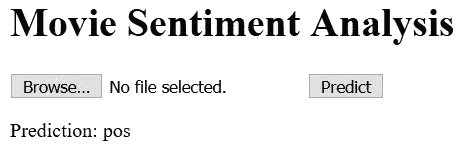

# 网络部署

到目前为止，我们一直专注于让某件事第一次工作，然后进行增量更新。这些更新几乎总是针对更好的技术和更好的可用性。但是，我们如何向用户展示它们呢？一种方法是通过REST端点。

在本章中，我们将涵盖以下主题：

+   训练模型，并为数据I/O编写一些更简洁的实用工具

+   建立预测函数，与训练分离

+   使用Flask REST端点公开我们所涵盖的内容

# 网络部署

这是黑客马拉松版本，更有经验的工程师会注意到我们为了节省开发者时间而忽略了大量最佳实践。为了自我辩护，我确实添加了相当实用的日志记录功能。

我们将从我们之前讨论使用机器学习方法进行文本分类的地方开始。我们留下了一些未解决的问题：

+   **模型持久化**：我如何将模型、数据和代码写入磁盘？

+   **模型加载和预测**：我如何从磁盘加载模型数据和代码？

+   **Flask用于REST端点**：我如何通过网络公开加载的模型？

如果你从这个章节中学到了什么，应该是前面的三个问题。如果你对如何解决这三个问题有一个清晰和完整的概念，那么你的战斗就赢了。

我们将使用scikit-learn模型以及我们熟悉的基于TF-IDF的管道进行这个演示。

# 模型持久化

第一个挑战是将模型数据和代码写入磁盘。让我们先从训练管道开始。

让我们先把导入的部分处理掉：

```py
import gzip
import logging
import os
from pathlib import Path
from urllib.request import urlretrieve
import numpy as np
import pandas as pd
from sklearn.externals import joblib
from sklearn.feature_extraction.text import CountVectorizer, TfidfTransformer
from sklearn.linear_model import LogisticRegression as LR
from sklearn.pipeline import Pipeline
from tqdm import tqdm
```

让我们编写一些从文本文件中读取数据以及如果不存在则下载它们的实用工具：

让我们先为我们的使用设置一个下载进度条。我们将通过在`tqdm`包上构建一个小抽象来实现这一点：

```py
class TqdmUpTo(tqdm):
    def update_to(self, b=1, bsize=1, tsize=None):
        if tsize is not None:
        self.total = tsize
        self.update(b * bsize - self.n)
```

让我们使用前面的`tqdm`进度信息来定义一个下载实用工具：

```py
def get_data(url, filename):
    """
    Download data if the filename does not exist already
    Uses Tqdm to show download progress
    """
    if not os.path.exists(filename):
        dirname = os.path.dirname(filename)
        if not os.path.exists(dirname):
            os.makedirs(dirname)
        with TqdmUpTo(unit="B", unit_scale=True, miniters=1, desc=url.split("/")[-1]) as t:
            urlretrieve(url, filename, reporthook=t.update_to)
```

注意到这个实用工具使用`os`而不是`pathlib`，这在文本的其他部分是首选的。这既是为了多样性，也是因为`os`在Python 2中同样有效，而`pathlib`最好与Python 3.4或更高版本一起使用。作为提醒，这本书假设你正在使用Python 3.6代码。

现在我们已经有一个`get_data`实用工具，让我们编写一个`read_data`实用工具，它针对我们的特定数据集进行了定制：

```py
def read_data(dir_path):
    """read data into pandas dataframe"""
    def load_dir_reviews(reviews_path):
         files_list = list(reviews_path.iterdir())
         reviews = []
         for filename in files_list:
         f = open(filename, "r", encoding="utf-8")
         reviews.append(f.read())
         return pd.DataFrame({"text": reviews})
    pos_path = dir_path / "pos"
    neg_path = dir_path / "neg"
    pos_reviews, neg_reviews = load_dir_reviews(pos_path), load_dir_reviews(neg_path)
    pos_reviews["label"] = 1
    neg_reviews["label"] = 0
    merged = pd.concat([pos_reviews, neg_reviews])
    df = merged.sample(frac=1.0) # shuffle the rows
    df.reset_index(inplace=True) # don't carry index from previous
    df.drop(columns=["index"], inplace=True) # drop the column 'index'
    return df
```

pandas DataFrames使我们的代码更容易阅读、管理和调试。此外，这个函数实际上使用Python嵌套函数来提高代码重用性。注意，对于正面和负面评论，我们都使用同一个内部函数来为我们执行I/O。

现在让我们导入这些实用工具：

```py
from utils import get_data, read_data
```

我已经从Python 3的`logging`模块定义了一个日志记录器，包括文件处理程序和控制台处理程序。由于这是一个众所周知且已确立的最佳实践，我在这里将跳过它，直接使用日志记录器：

```py
data_path = Path(os.getcwd()) / "data" / "aclImdb"
logger.info(data_path)
```

`data_path` 变量现在包含了从 `aclImdb` 提取的文件夹和文件。请注意，这个提取不是通过代码完成的，而是由用户在代码外部完成的。

这是因为从 `*.tar.gz` 或 `*.tgz` 的提取是依赖于操作系统的。现在你应该注意到的另一件事是我们已经从带有穿插打印语句和预览的笔记本转向了本节中的 Python 脚本。

我们必须下载压缩文件——它略大于 110 MB——如果目标位置不存在：

```py
if not data_path.exists():
    data_url = "http://files.fast.ai/data/aclImdb.tgz"
    get_data(data_url, "data/imdb.tgz")
```

在尝试读取之前，先离线提取文件：

```py
train_path = data_path / "train"
# load data file as dict object
train = read_data(train_path)
```

`train` 变量现在是一个包含两列的 DataFrame：原始 *文本* 和 *标签*。标签是 `pos` 或 `neg`，分别代表正面或负面。标签表示评论的整体情感。我们将这些分开成两个变量：`X_train` 和 `y_train`：

```py

# extract the images (X) and labels (y) from the dict
X_train, y_train = train["text"], train["label"]
```

接下来，让我们定义我们想要执行的操作 `Pipeline`。使用 TF-IDF 表示的逻辑回归模型是训练模型最简单、最快的方式，并且性能相当不错。我们在这里将使用它，但你实际上可以（并且通常应该）用你在测试数据上性能最好的任何东西来替换它：

```py
lr_clf = Pipeline(
 [("vect", CountVectorizer()), ("tfidf", TfidfTransformer()), ("clf", LR())]
)
lr_clf.fit(X=X_train, y=y_train)
```

一旦我们调用 `.fit` 函数，我们就已经训练了我们的文本分类管道。

熟悉 Python 的人可能会记得 pickle 或 cPickle。Pickle 是一个 Python 原生的工具，用于将对象和其他 Python 数据结构以二进制形式保存到磁盘，以便稍后重用。`joblib` 是 pickle 的改进！

`joblib` 是一个改进，因为它还缓存了 *带有数据的代码*，这对于我们的用例来说非常棒。我们不必担心在 Web API 层定义管道。它不再与我们的特定模型绑定，这意味着我们可以通过简单地更改底层的 `joblib.dump` 文件来持续发布更好的版本。

作为对经典 Python pickle 的致敬，我们将给这个缓存的代码和 `model.pkl` 数据文件赋予 `.pkl` 扩展名：

```py
# save model
joblib.dump(lr_clf, "model.pkl")
```

就这样！我们现在已经将我们的代码和数据逻辑写入了一个单一的二进制文件。

我们实际上会如何使用它呢？让我们看看下一步。

# 模型加载和预测

下一个挑战实际上是加载我们的 pickle 文件中的模型并使用它进行预测。

让我们先从从磁盘加载模型开始：

```py
from sklearn.externals import joblib
model = joblib.load("model.pkl")
```

`model` 变量现在应该暴露出原始 `lr_clf` 对象所拥有的所有函数。在所有这些方法中，我们感兴趣的是 `predict` 函数。

但在我们使用它之前，让我们从磁盘加载一些文件来进行预测：

```py
# loading one example negative review
with open(r".\\data\\aclImdb\\train\neg\\1_1.txt", "r") as infile:
    test_neg_contents = infile.read()

# loading one example positive review
with open(r".\\data\\aclImdb\\train\pos\\0_9.txt", "r") as infile:
    test_pos_contents = infile.read()
```

我们现在可以将这些变量作为一个列表传递给 `predict` 方法：

```py
predictions = model.predict([test_neg_contents, test_pos_contents])
```

此时 `predictions` 变量包含什么内容？

它是一个列表吗？是一个 numpy 数组？或者只是一个整数？

你可以通过以下代码进行检查：

```py
print(predictions)
> [0 1]

for p in predictions:
    print("pos" if p else "neg")

> neg
> pos
```

如我们所见，预测结果是一个整数列表，与我们读取训练文件中的`y_train`变量方式相同。让我们继续将在这里学到的知识应用到网络界面和REST端点中。

# Flask用于Web部署

让我们先处理导入：

```py
import logging
import flask
import os
import numpy as np
from flask import Flask, jsonify, render_template, request
from sklearn.externals import joblib
```

我假设作为程序员，你可以在本书之外掌握Flask基础知识。即便如此，为了完整性，我添加了与我们相关的主要思想：

+   主要的Web应用程序定义在`Flask`模块中，该模块是从Flask导入的。

+   `jsonify`将任何JSON友好的字典转换为可以返回给用户的JSON。

+   `render_template`是我们向用户公开HTML页面和Web界面的方式。

让我们先声明我们的应用程序：

```py
app = Flask(__name__)
```

接下来，我们将使用`route`函数装饰我们的Python函数，并将它们公开为REST端点。让我们先公开一个始终开启的简单状态端点，并在服务运行时返回200。

```py
@app.route("/status", methods=["GET"])
def get_status():
    return jsonify({"version": "0.0.1", "status": True})
```

`methods`变量通常是一个包含值`GET`、`POST`或两者的字符串列表。GET用于不需要用户信息的HTTP(S) GET调用，除了GET调用中已经包含的信息。HTTP POST调用从客户端（如浏览器）向服务器提供额外数据。

这可以通过在浏览器中点击`/status`端点来访问。

尝试一下。

哎呀！我们忘记先运行应用程序本身了。

让我们继续以调试模式运行应用程序。调试模式允许我们添加和编辑代码，并在每次保存时自动加载代码：

```py
if __name__ == "__main__":
    # load ml model from disk
    model = joblib.load("model.pkl")
    # start api
    app.run(host="0.0.0.0", port=8000, debug=True)
```

注意，我们像之前一样从`joblib`加载了`model`变量。这段代码位于`api.py`文件的末尾。这非常草率，没有并发支持，也没有与nginx集成，但所有这些都适合这个演示。

现在我们从浏览器中点击`localhost:8000/status`端点会发生什么？

我们得到了状态码200，数据字段包含我们的JSON版本和*状态*信息。太好了。

让我们继续添加我们的`/predict`端点。以下是此函数将执行的步骤概述：

1.  它将检查这确实是一个POST方法。如果是，它将从`flask.request.files`中的`*file*`键提取文件信息。

1.  然后，它将此文件写入磁盘并再次读取，然后将字符串文本作为列表的单个元素传递给`model.predict`。

1.  最后，它将在可选删除写入磁盘的文件后，将结果返回到Web界面中的HTML：

```py
@app.route("/predict", methods=["POST"])
def make_prediction():
    if request.method == "POST":
        # get uploaded file if it exists
        logger.debug(request.files)
        f = request.files["file"]
        f.save(f.filename) # save file to disk
        logger.info(f"{f.filename} saved to disk")
        # read file from disk
        with open(f.filename, "r") as infile:
            text_content = infile.read()
            logger.info(f"Text Content from file read")
        prediction = model.predict([text_content])
        logger.info(f"prediction: {prediction}")
        prediction = "pos" if prediction[0] == 1 else "neg"
        os.remove(f.filename)
    return flask.render_template("index.html", label=prediction)
```

显然，如果我们只是稍后删除它，将文件写入磁盘的步骤是多余的。在实践中，我保留文件在磁盘上，因为这有助于调试，在某些情况下，也有助于理解用户在实际使用中如何使用API。

在前面的代码片段中，你可能已经注意到我们返回了一个带有 `label` 值的 `index.html` 文件。这个标签是作为 `Jinja2` 模板的一部分设置的。变量在 `index.html` 本身中使用，并在渲染页面时更新其值。

这是我们将要使用的 `index.html`：

```py
<html>
<head>
<title>Text Classification model as a Flask API</title>
<meta charset="utf-8">
<meta name="viewport" content="width=device-width, initial-scale=1">
</head>

<body>
<h1>Movie Sentiment Analysis</h1>
<form action="/predict" method="post" enctype="multipart/form-data">
 <input type="file" name="file" value="Upload">
 <input type="submit" value="Predict"> 
 <p>Prediction:  {{ label }} </p>
</form>
</body>
</html>
```

这就是 HTML 的样子：



预测：pos 实际上是来自我之前上传到这个页面的文件的结果。这由实际 HTML 中的 `` 语法标记：

```py
Prediction:  {{ label }} 
```

因此，我们在基于 Flask 的网络部署部分看到了一些内容：

+   你如何在 Flask 网络服务器上接收上传的文件？

+   你如何使用网络界面上传文件？

+   另外，作为额外奖励：用于显示返回答案的 Jinja 模板

值得注意的是，我们可以通过分离返回值使这个功能更加通用。这将用于人类用户，我们返回 HTML，以及用于机器用户，我们返回 JSON。我将这个函数重构作为你的练习。

显然，我们也可以用 Django 或任何其他网络框架来做这件事。我选择 Flask 的唯一原因是为了演示目的，并且它非常轻量级，没有关注模型-视图-控制器分离。

# 摘要

本章的关键要点应该是任何机器学习模型都可以像其他任何代码片段一样部署。唯一的区别是我们必须留出空间以便能够从磁盘再次加载模型。为此，首先，我们需要训练一个模型，并将模型代码和权重使用 `joblib` 写入磁盘。然后，我们需要构建一个预测函数，这个函数与训练是分开的。最后，我们通过使用 Flask 和 Jinja2 HTML 模板来展示我们所做的工作。
