# 第1章. 神经网络入门

在本章中，我们将介绍神经网络及其设计目的。本章作为后续章节的基础层，同时介绍了神经网络的基本概念。在本章中，我们将涵盖以下内容：

+   人工神经元

+   权重和偏差

+   激活函数

+   神经元层

+   Java中的神经网络实现

# 发现神经网络

当我们听到**神经网络**这个词时，我们会在脑海中自然地浮现出一个大脑的图像，确实如此，如果我们把大脑看作是一个庞大而自然的神经网络的话。然而，关于**人工神经网络**（**ANNs**）又是怎样的呢？好吧，这里有一个与自然相对的词，鉴于“人工”这个词，我们首先想到的可能是人工大脑或机器人的形象。在这种情况下，我们也在处理创建一个类似于并受人类大脑启发的结构；因此，这可以被称为人工智能。

现在对于刚刚接触ANN的读者来说，可能会想这本书是教我们如何构建智能系统，包括一个能够使用Java代码模拟人类思维的的人工大脑，不是吗？令人惊讶的答案是肯定的，但当然，我们不会涵盖创造像《黑客帝国》三部曲电影中的人工思考机器这样的东西；读者将获得设计人工神经网络解决方案的流程指导，这些解决方案能够从原始数据中抽象知识，利用整个Java编程语言框架。

# 为什么是人工神经网络？

我们在谈论神经网络之前，不能不了解它们的起源，包括这个术语。尽管NN（神经网络）比ANN（人工神经网络）更通用，涵盖了自然神经网络，但在这本书中，NN和ANN被用作同义词。那么，实际上ANN究竟是什么呢？让我们探索一下这个术语的历史。

在20世纪40年代，神经生理学家Warren McCulloch和数学家Walter Pitts设计了第一个人工神经元的数学实现，将神经科学基础与数学运算相结合。当时，人类大脑主要被研究以了解其隐藏和神秘的行为，尤其是在神经科学领域。已知的自然神经元结构包括一个细胞核，树突接收来自其他神经元的传入信号，以及轴突激活信号到其他神经元，如下面的图所示：

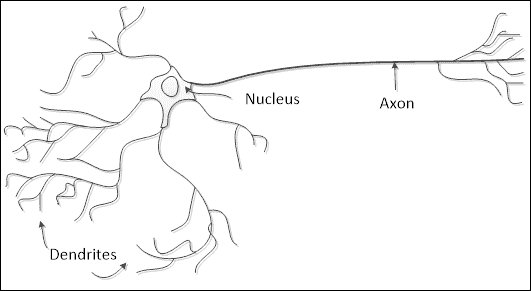

McCulloch和Pitts的创新之处在于神经元模型中包含的数学成分，假设神经元是一个简单的处理器，将所有传入的信号求和，并激活一个新信号到其他神经元：

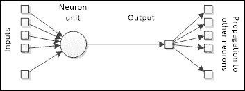

此外，考虑到大脑由数十亿个神经元组成，每个神经元与其他数万个神经元相互连接，从而形成数万亿个连接，我们正在谈论一个巨大的网络结构。基于这一事实，麦卡洛克和皮茨设计了一个简单的神经元模型，最初是为了模拟人类视觉。当时可用的计算器或计算机非常罕见，但能够很好地处理数学运算；另一方面，即使像视觉和声音识别这样的任务，如果没有使用特殊框架，也难以编程，这与数学运算和函数不同。尽管如此，人脑在声音和图像识别方面的效率比复杂的数学计算要高，这一事实确实让科学家和研究人员感到好奇。

然而，一个已知的事实是，人类大脑执行的所有复杂活动都是基于学习知识，因此为了克服传统算法方法在处理人类容易解决的问题时遇到的困难，人工神经网络被设计成具有通过其刺激（数据）学习如何自行解决某些任务的能力：

| 人类快速可解任务 | 计算机快速可解任务 |
| --- | --- |
| 图像分类语音识别面部识别基于经验预测事件 | 复杂计算语法错误纠正信号处理操作系统管理 |

## 神经网络的排列方式

考虑到人脑的特点，可以说人工神经网络（ANN）是一种受自然界启发的途径，其结构也是如此。一个神经元连接到许多其他神经元，这些神经元又连接到其他神经元，因此形成一个高度互联的结构。本书后面将展示，这种神经元之间的连接性是学习能力的来源，因为每个连接都可以根据刺激和期望的目标进行配置。

## 最基本的元素——人工神经元

让我们探索最基本的人工神经网络元素——人工神经元。自然神经元已被证明是信号处理器，因为它们在树突中接收微弱的信号，这些信号可以根据其强度或大小在轴突中触发信号。因此，我们可以将神经元视为在输入端有一个信号收集器，在输出端有一个激活单元，可以触发将被转发到其他神经元的信号，如图所示：

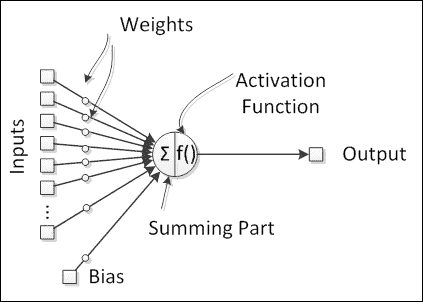

### 小贴士

在自然神经元中，存在一个阈值电位，当达到这个电位时，轴突会放电并将信号传播到其他神经元。这种放电行为通过激活函数来模拟，这已被证明在表示神经元中的非线性行为方面是有用的。

## 为神经元注入生命——激活函数

这个激活函数是根据所有输入信号的求和来触发神经元的输出的。从数学上讲，它为神经网络处理添加了非线性，从而为人工神经元提供了非线性行为，这在模拟自然神经元的非线性特性时非常有用。激活函数通常在输出端被限制在两个值之间，因此是一个非线性函数，但在某些特殊情况下，它也可以是一个线性函数。

虽然任何函数都可以用作激活函数，但让我们集中关注常用的那些：

| 函数 | 公式 | 图表 |
| --- | --- | --- |
| Sigmoid | 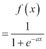 | 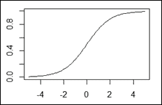 |
| 双曲正切 | 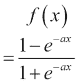 | 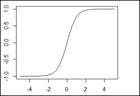 |
| 硬限制阈值 | 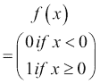 | 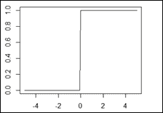 |
| 线性 | 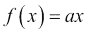 | 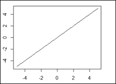 |

在这些方程和图表中，系数a可以作为激活函数的设置。

## 灵活的值 – 权重

当神经网络结构可以固定时，权重代表神经元之间的连接，并且它们有能力放大或衰减传入的神经信号，从而修改它们，并具有影响神经元输出的能力。因此，神经元的激活不仅依赖于输入，还依赖于权重。假设输入来自其他神经元或外部世界（刺激），权重被认为是神经网络神经元之间建立的联系。由于权重是神经网络的一个内部组件，并影响其输出，因此它们可以被认为是神经网络的知识，前提是改变权重将改变神经网络的输出，即对外部刺激的回答。

## 一个额外的参数 – 偏置

对于人工神经元来说，拥有一个独立的组件向激活函数添加额外信号是有用的：**偏置**。这个参数的作用像一个输入，除了它是由一个固定的值（通常是1）刺激，并且这个值乘以一个相关的权重。这个特性有助于神经网络知识表示作为一个更纯粹的非线性系统，前提是当所有输入都为零时，那个神经元不一定会产生零的输出，相反，它可以根据相关的偏置权重产生不同的值。

## 构成整体的各个部分 – 层

为了抽象出与我们的思维相似的处理层次，神经元被组织成层次。输入层接收来自外部世界的直接刺激，输出层触发将直接影响外部世界的动作。在这些层次之间，存在多个隐藏层，从外部世界的角度来看，它们是不可见的（隐藏的）。在人工神经网络中，一个层次的所有组成神经元具有相同的输入和激活函数，如图所示：

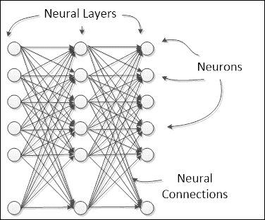

神经网络可以由几个相互连接的层次组成，形成所谓的**多层网络**。神经网络层可以被分类为*输入*、*隐藏*或*输出*。

在实践中，增加一个额外的神经网络层次可以增强神经网络表示更复杂知识的能力。

### 小贴士

任何神经网络至少都有一个输入/输出层，无论层数多少。在多层网络的情况下，输入和输出之间的层被称为**隐藏层**

## 了解神经网络架构

神经网络可以有不同的布局，这取决于神经元或层次如何相互连接。每个神经网络架构都是为了特定的目标而设计的。神经网络可以应用于许多问题，并且根据问题的性质，神经网络应该被设计得更加高效地解决这个问题。

神经网络架构的分类有两方面：

+   神经元连接

+   单层网络

+   多层网络

+   信号流

+   前馈网络

+   反馈网络

## 单层网络

在这种架构中，所有神经元都布局在同一级别，形成一个单独的层次，如图所示：

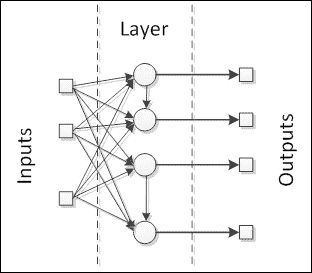

神经网络接收输入信号并将它们输入到神经元中，神经元随后产生输出信号。神经元可以高度相互连接，有或没有循环。这些架构的例子包括单层感知器、Adaline、自组织映射、Elman和Hopfield神经网络。

## 多层网络

在这个类别中，神经元被分为多个层次，每个层次对应于一个共享相同输入数据的神经元并行布局，如图所示：

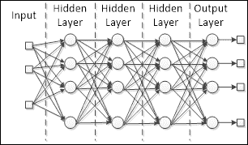

径向基函数和多层感知器是这个架构的好例子。这类网络特别适用于将实际数据逼近到专门设计用来表示该数据的函数。此外，由于它们具有多个处理层次，这些网络适合于从非线性数据中学习，能够更容易地分离它或确定再现或识别这些数据的知识。

## 前馈网络

神经网络中信号的流动可以是单向的，也可以是循环的。在前一种情况下，我们称神经网络架构为前馈，因为输入信号被输入层接收；然后，在处理之后，它们被转发到下一层，正如多层部分中的图所示。多层感知器和径向基函数也是前馈网络的良好例子。

## 反馈网络

当神经网络具有某种内部循环时，这意味着信号被反馈到一个已经接收并处理过该信号的神经元或层，这种网络是反馈类型的。参见以下反馈网络图：

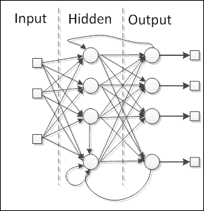

在网络中添加循环的特殊原因是为了产生动态行为，尤其是在网络处理涉及时间序列或模式识别的问题时，这些问题需要内部记忆来强化学习过程。然而，这种网络特别难以训练，因为在训练过程中最终会出现递归行为（例如，一个其输出被反馈到其输入的神经元），除了为训练安排数据之外。大多数反馈网络是单层，例如Elman和Hopfield网络，但也可以构建循环多层网络，例如回声和循环多层感知器网络。

# 从无知到知识——学习过程

神经网络通过调整神经元之间的连接来学习，即权重。如神经结构部分所述，权重代表神经网络知识。不同的权重会导致网络对相同的输入产生不同的结果。因此，神经网络可以通过根据学习规则调整其权重来提高其结果。学习的一般方案如图所示：

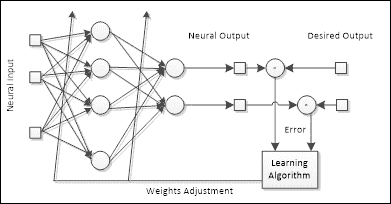

上图所示的过程被称为**监督学习**，因为存在一个期望的输出，但神经网络也可以通过输入数据来学习，而不需要任何期望的输出（监督）。在[第2章](ch02.xhtml "第2章。让神经网络学习")《让神经网络学习》中，我们将更深入地探讨神经网络的学习过程。

# 让编码开始！神经网络在实践中的应用

在本书中，我们将使用Java编程语言来实现神经网络的全过程。Java是一种在20世纪90年代由Sun Microsystems的一小群工程师创建的面向对象编程语言，后来在2010年代被Oracle收购。如今，Java存在于我们日常生活中的许多设备中。

在面向对象的语言，如Java中，我们处理类和对象。类是现实世界中某物的蓝图，而对象是这个蓝图的实例，就像一辆车（类指的是所有和任何车辆）以及我的车（对象指的是特定的车辆——我的车）。Java类通常由属性和方法（或函数）组成，这些方法包括**面向对象编程**（**OOP**）概念。我们将简要回顾所有这些概念，而不会深入探讨它们，因为这本书的目标只是从实际的角度设计和创建神经网络。以下四个概念在此过程中相关且需要考虑：

+   **抽象**：将现实世界问题或规则转录到计算机编程领域，只考虑其相关特征，忽略通常阻碍发展的细节。

+   **封装**：类似于产品的封装，通过这种方式，一些相关特性被公开披露（公共方法），而其他特性则在其领域内保持隐藏（私有或受保护），从而避免误用或信息过多。

+   **继承**：在现实世界中，多个类对象以分层的方式共享属性和方法；例如，车辆可以是汽车和卡车的超类。因此，在OOP中，这个概念允许一个类从另一个类继承所有功能，从而避免代码的重写。

+   **多态性**：几乎与继承相同，但不同之处在于具有相同签名的方 法在不同的类上表现出不同的行为。

使用本章中介绍的神经网络概念和OOP概念，我们现在将设计实现神经网络的第一个类集。如所见，神经网络由层、神经元、权重、激活函数和偏差组成。关于层，有三种类型：输入、隐藏和输出。每一层可能有一个或多个神经元。每个神经元要么连接到神经输入/输出，要么连接到另一个神经元，这些连接被称为权重。

需要强调的是，神经网络可能有许多隐藏层或没有隐藏层，因为每层的神经元数量可能不同。然而，输入和输出层的神经元数量与神经输入/输出的数量相同。

因此，让我们开始实施。最初，我们将定义以下类：

+   **神经元**：定义人工神经元

+   **神经网络层**：抽象类，定义神经元层

+   **输入层**：定义神经网络的输入层

+   **隐藏层**：定义输入和输出之间的层

+   **输出层**：定义神经网络的输出层

+   **输入神经元**：定义神经网络输入处的神经元

+   **神经网络**：将所有前面的类组合成一个ANN结构

除了这些类之外，我们还应该为激活函数定义一个 `IActivationFunction` 接口。这是必要的，因为 `Activation` 函数将像方法一样行为，但它们需要作为神经元属性被分配。因此，我们将定义实现此接口的激活函数类：

+   Linear

+   Sigmoid

+   Step

+   HyperTan

我们的第一章编码几乎完成了。我们需要定义两个额外的类。一个用于处理可能抛出的异常（`NeuralException`），另一个用于生成随机数（`RandomNumberGenerator`）。最后，我们将这些类分开到两个包中：

+   `edu.packt.neuralnet`：对于与神经网络相关的类（`NeuralNet`、`Neuron`、`NeuralLayer` 等）

+   `edu.packt.neuralnet.math`：对于与数学相关的类（`IActivationFunction`、`Linear` 等）

为了节省空间，我们不会写出每个类的完整描述，而是将重点放在最重要的类的关键特性上。然而，读者可以查看代码的 Javadoc 文档，以获取更多关于实现的细节。

# 神经元类

这是本章代码的非常基础类。根据理论，人工神经元有以下属性：

+   输入

+   权重

+   偏置

+   激活函数

+   输出

同样重要的是定义一个将在未来的示例中很有用的属性，即激活函数之前的输出。然后我们有以下属性的实现：

```py
public class Neuron {
  protected ArrayList<Double> weight;
  private ArrayList<Double> input;
  private Double output;
  private Double outputBeforeActivation;
  private int numberOfInputs = 0;
  protected Double bias = 1.0;
  private IActivationFunction activationFunction;
  …
}
```

当实例化一个神经元时，我们需要指定将要为其提供值的输入数量，以及它应该使用的激活函数。因此，让我们看看构造函数：

```py
public Neuron(int numberofinputs,IActivationFunction iaf){
    numberOfInputs=numberofinputs;
    weight=new ArrayList<>(numberofinputs+1);
    input=new ArrayList<>(numberofinputs);
    activationFunction=iaf;
}
```

注意，我们为偏置定义了一个额外的权重。一个重要的步骤是神经元的初始化，即权重如何获得它们的第一个值。这通过 `init()` 方法定义，其中权重通过 `RandomNumberGenerator static` 类随机生成值。注意需要防止尝试设置超出权重数组范围的值：

```py
public void init(){
  for(int i=0;i<=numberOfInputs;i++){
    double newWeight = RandomNumberGenerator.GenerateNext();
    try{
      this.weight.set(i, newWeight);
    }
    catch(IndexOutOfBoundsException iobe){
      this.weight.add(newWeight);
    }
  }
}
```

最后，让我们看看在 `calc()` 方法中如何计算输出值：

```py
public void calc(){
  outputBeforeActivation=0.0;
  if(numberOfInputs>0){
    if(input!=null && weight!=null){
      for(int i=0;i<=numberOfInputs;i++){
        outputBeforeActivation+=(i==numberOfInputs?bias:input.get(i))*weight.get(i);
      }
    }
  }
  output=activationFunction.calc(outputBeforeActivation);
}
```

注意，首先，所有输入和权重的乘积（偏置乘以最后一个权重 `– i==numberOfInputs`）被求和，这个值被保存在 `outputBeforeActivation` 属性中。激活函数使用这个值来计算神经元的输出。

# 神经层类

在这个类中，我们将把在同一层中排列的神经元分组。此外，还需要定义层之间的链接，因为一个层将值传递给另一个层。因此，该类将具有以下属性：

```py
public abstract class NeuralLayer {
  protected int numberOfNeuronsInLayer;
  private ArrayList<Neuron> neuron;
  protected IActivationFunction activationFnc;
  protected NeuralLayer previousLayer;
  protected NeuralLayer nextLayer;
  protected ArrayList<Double> input;
  protected ArrayList<Double> output;
  protected int numberOfInputs;
…
}
```

注意，这个类是抽象的，可以实例化的层类有 `InputLayer`、`HiddenLayer` 和 `OutputLayer`。为了创建一个层，必须使用这些类中的一个构造函数，它们的工作方式相当相似：

```py
public InputLayer(int numberofinputs);
public HiddenLayer(int numberofneurons,IActivationFunction iaf,
int numberofinputs);
public OutputLayer(int numberofneurons,IActivationFunction iaf,
int numberofinputs);
```

层以及神经元一样被初始化和计算，它们也实现了`init()`和`calc()`方法。受保护的签名保证只有子类可以调用或覆盖这些方法：

```py
protected void init(){
  for(int i=0;i<numberOfNeuronsInLayer;i++){
    try{
      neuron.get(i).setActivationFunction(activationFnc);
      neuron.get(i).init();
    }
    catch(IndexOutOfBoundsException iobe){
      neuron.add(new Neuron(numberOfInputs,activationFnc));
      neuron.get(i).init();
    }
  }
}
protected void calc(){
  for(int i=0;i<numberOfNeuronsInLayer;i++){
    neuron.get(i).setInputs(this.input);
    neuron.get(i).calc();
    try{
      output.set(i,neuron.get(i).getOutput());
     }
     catch(IndexOutOfBoundsException iobe){
       output.add(neuron.get(i).getOutput());
     }
   }
  }
```

# 激活函数接口

在我们定义`NeuralNetwork`类之前，让我们看看一个带有接口的Java代码示例：

```py
public interface IActivationFunction {
  double calc(double x);
  public enum ActivationFunctionENUM {
    STEP, LINEAR, SIGMOID, HYPERTAN
  }
}
```

`calc()`签名方法由实现此接口的特定激活函数使用，例如`Sigmoid`函数：

```py
public class Sigmoid implements IActivationFunction {
    private double a=1.0;
public Sigmoid(double _a){this.a=_a;}
@Override
    public double calc(double x){
        return 1.0/(1.0+Math.exp(-a*x));
    }
}
```

这是多态的一个例子，其中类或方法可以呈现不同的行为，但仍然在相同的签名下，允许灵活的应用。

# 神经网络类

最后，让我们定义神经网络类。到目前为止，我们知道神经网络将神经元组织成层，每个神经网络至少有两个层，一个用于收集输入，一个用于处理输出，以及可变数量的隐藏层。因此，我们的`NeuralNet`类将具有这些属性，以及其他与神经元和`NeuralLayer`类类似的属性，例如`numberOfInputs`、`numberOfOutputs`等：

```py
public class NeuralNet {
    private InputLayer inputLayer;
    private ArrayList<HiddenLayer> hiddenLayer;
    private OutputLayer outputLayer;
    private int numberOfHiddenLayers;
    private int numberOfInputs;
    private int numberOfOutputs;
    private ArrayList<Double> input;
    private ArrayList<Double> output;
…
}
```

这个类的构造函数比之前的类有更多的参数：

```py
public NeuralNet(int numberofinputs,int numberofoutputs,
            int [] numberofhiddenneurons,IActivationFunction[] hiddenAcFnc,
            IActivationFunction outputAcFnc)
```

假设隐藏层的数量是可变的，我们应该考虑到可能存在许多隐藏层或没有隐藏层，在每个隐藏层中将有可变数量的隐藏神经元。因此，处理这种可变性的最佳方式是将每个隐藏层中的神经元数量表示为整数向量（参数`numberofhiddenlayers`）。此外，还需要为每个隐藏层以及输出层定义激活函数，为此提供参数`hiddenActivationFnc`和`outputAcFnc`。

为了在本章中节省空间，我们不会展示这个构造函数的完整实现，但我们可以展示定义层及其之间链接的示例。首先，根据输入的数量定义输入层：

```py
input=new ArrayList<>(numberofinputs);
inputLayer=new InputLayer(numberofinputs);
```

隐藏层的定义将取决于其位置，如果它紧接在输入层之后，其定义如下：

```py
hiddenLayer.set(i,new HiddenLayer(numberofhiddenneurons[i], hiddenAcFnc[i],
           inputLayer.getNumberOfNeuronsInLayer()));
    inputLayer.setNextLayer(hiddenLayer.get(i));
```

否则，它将获取前一个隐藏层的引用：

```py
hiddenLayer.set(i, new HiddenLayer(numberofhiddenneurons[i],             hiddenAcFnc[i],hiddenLayer.get(i-1).getNumberOfNeuronsInLayer()));
hiddenLayer.get(i-1).setNextLayer(hiddenLayer.get(i));
```

对于输出层，其定义与后一种情况非常相似，只是涉及到`OutputLayer`类，以及可能不存在隐藏层的事实：

```py
if(numberOfHiddenLayers>0){
  outputLayer=new OutputLayer(numberofoutputs,outputAcFnc,
    hiddenLayer.get(numberOfHiddenLayers-1).getNumberOfNeuronsInLayer() );
    hiddenLayer.get(numberOfHiddenLayers-1).setNextLayer(outputLayer);
}else{
    outputLayer=new OutputLayer(numberofinputs, outputAcFnc, numberofoutputs);
    inputLayer.setNextLayer(outputLayer);
}
```

`calc()`方法执行从输入到输出端的信号前向流动：

```py
public void calc(){
  inputLayer.setInputs(input);
  inputLayer.calc();
  for(int i=0;i<numberOfHiddenLayers;i++){
    HiddenLayer hl = hiddenLayer.get(i);
    hl.setInputs(hl.getPreviousLayer().getOutputs());
    hl.calc();
  }
  outputLayer.setInputs(outputLayer.getPreviousLayer().getOutputs());
  outputLayer.calc();
  this.output=outputLayer.getOutputs();
}
```

在附录C中，我们向读者展示了类的完整文档，包括它们的UML类图和包图，这无疑将有助于作为本书的参考。

# 是时候玩耍了！

现在，让我们应用这些类并获取一些结果。以下代码有一个`test`类，一个包含`NeuralNet`类对象`nn`的`main`方法。我们将定义一个简单的神经网络，包含两个输入，一个输出，以及一个包含三个神经元的隐藏层：

```py
public class NeuralNetConsoleTest {
  public static void main(String[] args) {
    RandomNumberGenerator.seed=0;

    int numberOfInputs=2;
    int numberOfOutputs=1;
    int[] numberOfHiddenNeurons= { 3 };
    IActivationFunction[] hiddenAcFnc = { new Sigmoid(1.0) } ;
    Linear outputAcFnc = new Linear(1.0);
    System.out.println("Creating Neural Network...");
    NeuralNet nn = new NeuralNet(numberOfInputs,numberOfOutputs,
          numberOfHiddenNeurons,hiddenAcFnc,outputAcFnc);
    System.out.println("Neural Network created!");
    nn.print();
    …
}
```

仍然在这个代码中，让我们给神经网络输入两组数据，看看它会产生什么输出：

```py
  double [] neuralInput = { 1.5 , 0.5 };
  double [] neuralOutput;
  System.out.println("Feeding the values ["+String.valueOf(neuralInput[0])+" ; "+
                String.valueOf(neuralInput[1])+"] to the neural network");
  nn.setInputs(neuralInput);
  nn.calc();
  neuralOutput=nn.getOutputs();

  neuralInput[0] = 1.0;
  neuralInput[1] = 2.1;
  ...
  nn.setInputs(neuralInput);
  nn.calc();
  neuralOutput=nn.getOutputs();
```

这段代码给出了以下输出：

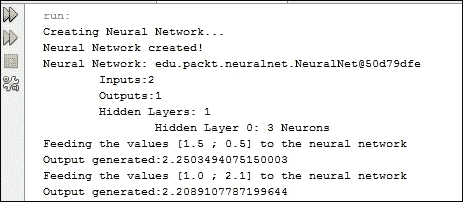

需要记住的是，每次代码运行时，它都会生成新的伪随机权重值，除非你使用相同的种子值。如果你按照这里提供的方式准确运行代码，控制台将显示相同的值：

# 摘要

在本章中，我们介绍了神经网络的基本概念，包括它们是什么，它们用于什么，以及它们的基本概念。我们还看到了用Java编程语言实现的一个非常基础的神经网络实例，其中我们通过编码每个神经网络元素来将理论神经网络概念应用于实践。在继续学习高级概念之前，理解基本概念非常重要。这同样适用于用Java实现的代码。

在下一章中，我们将深入探讨神经网络的学习过程，并通过简单的例子来探索不同的学习类型。
