# 第4章。自组织映射

在本章中，我们介绍了一种适合无监督学习的神经网络架构：自组织映射，也称为Kohonen网络。这种特定类型的神经网络能够对数据记录进行分类，而不需要任何目标输出或找到数据在较小维度上的表示。在本章中，我们将探讨如何实现这一点，以及证明其能力的示例。本章的子主题如下：

+   神经网络无监督学习

+   竞争学习

+   Kohonen 自组织映射

+   一维SOMs

+   二维SOMs

+   无监督学习解决的问题

+   Java 实现

+   数据可视化

+   实际问题

# 神经网络无监督学习

在[第2章](ch02.xhtml "第2章。让神经网络学会学习")中，我们在《让神经网络学会学习》中已经了解了无监督学习，现在我们将更详细地探讨这种学习范式的特征。无监督学习算法的使命是在数据集中找到模式，其中参数（在神经网络的情况下为权重）在没有误差度量（没有目标值）的情况下进行调整。

虽然监督算法提供与所提供数据集相当的输出，但无监督算法不需要知道输出值。无监督学习的基础是受神经学事实的启发，即，在神经学中，相似的刺激产生相似的响应。因此，将此应用于人工神经网络，我们可以这样说，相似的数据产生相似的结果，因此这些结果可以被分组或聚类。

尽管这种学习可以应用于其他数学领域，例如统计学，但其核心功能旨在为机器学习问题，如数据挖掘、模式识别等设计。神经网络是机器学习学科的一个子领域，只要它们的结构允许迭代学习，它们就提供了一个很好的框架来应用这一概念。

大多数无监督学习应用都旨在聚类任务，这意味着相似的数据点将被聚在一起，而不同的数据点将形成不同的簇。此外，无监督学习适合的一个应用是降维或数据压缩，只要在大量数据集中可以找到更简单、更小的数据表示。 

# 无监督学习算法

无监督算法不仅限于神经网络，K-means、期望最大化以及矩方法也是无监督学习算法的例子。所有学习算法的一个共同特征是当前数据集中变量之间没有映射；相反，人们希望找到这些数据的不同含义，这就是任何无监督学习算法的目标。

在监督学习算法中，我们通常有较少的输出，而对于无监督学习，需要产生一个抽象的数据表示，这可能需要大量的输出，但除了分类任务外，它们的含义与监督学习中的含义完全不同。通常，每个输出神经元负责表示输入数据中存在的特征或类别。在大多数架构中，不是所有输出神经元都需要同时激活；只有一组受限的输出神经元可能会被激活，这意味着该神经元能够更好地表示被馈送到神经网络输入的大部分信息。

### 小贴士

无监督学习相对于监督学习的一个优点是，它对学习大量数据集所需的计算能力较低。时间消耗呈线性增长，而监督学习的时间消耗呈指数增长。

在本章中，我们将探讨两种无监督学习算法：竞争学习和Kohonen自组织映射。

## 竞争学习

如其名所示，竞争学习处理输出神经元之间的竞争，以确定哪个是胜者。在竞争学习中，胜者神经元通常是通过比较权重与输入（它们具有相同的维度）来确定的。为了便于理解，假设我们想要训练一个具有两个输入和四个输出的单层神经网络：

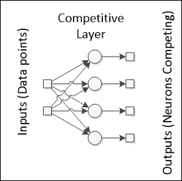

每个输出神经元都与这两个输入相连，因此对于每个神经元都有两个权重。

### 小贴士

对于这种学习，从神经元中移除了偏差，因此神经元将只处理加权的输入。

竞争是在数据被神经元处理之后开始的。胜者神经元将是其权重与输入值*接近*的那个。与监督学习算法相比的一个额外区别是，只有胜者神经元可以更新其权重，而其他神经元保持不变。这就是所谓的**胜者全得**规则。这种意图是将神经元*更靠近*导致其赢得竞争的输入值。

考虑到每个输入神经元*i*通过权重*wij*与所有输出神经元*j*相连，在我们的情况下，我们会有一组权重：


假设每个神经元的权重与输入数据的维度相同，让我们在一张图中考虑所有输入数据点以及每个神经元的权重：

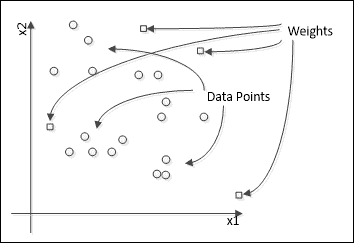

在这张图表中，让我们将圆圈视为数据点，将正方形视为神经元权重。我们可以看到，某些数据点与某些权重更接近，而其他数据点则更远，但更接近其他权重。神经网络在输入和权重之间的距离上执行计算：


这个方程式的结果将决定一个神经元相对于其竞争对手有多强。权重距离输入较小的神经元被认为是赢家。经过多次迭代后，权重被驱动到足够接近数据点，使得相应的神经元更有可能获胜，以至于变化要么太小，要么权重处于锯齿形设置中。最后，当网络已经训练好时，图表将呈现出另一种形状：

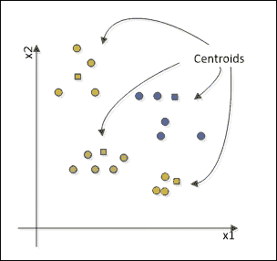

如所见，神经元围绕能够使相应神经元比竞争对手更强的点形成中心。

在无监督神经网络中，输出的数量完全是任意的。有时只有一些神经元能够改变它们的权重，而在其他情况下，所有神经元可能对相同的输入有不同的反应，导致神经网络无法学习。在这些情况下，建议审查输出神经元的数量，或者考虑另一种无监督学习类型。

在竞争学习中，有两个停止条件是可取的：

+   预定义的周期数：这防止我们的算法在没有收敛的情况下运行时间过长

+   权重更新的最小值：防止算法运行时间超过必要

## 竞争层

这种类型的神经网络层是特定的，因为输出不一定与神经元的输出相同。一次只有一个神经元被激活，因此需要特殊的规则来计算输出。因此，让我们创建一个名为 `CompetitiveLayer` 的新类，它将继承自 `OutputLayer` 并从两个新属性开始：`winnerNeuron` 和 `winnerIndex`：

```py
public class CompetitiveLayer extends OutputLayer {
    public Neuron winnerNeuron;
    public int[] winnerIndex;
//…
}
```

这种新的神经网络层将覆盖 `calc()` 方法并添加一些特定的新方法来获取权重：

```py
@Override
public void calc(){
  if(input!=null && neuron!=null){
    double[] result = new double[numberOfNeuronsInLayer];
    for(int i=0;i<numberOfNeuronsInLayer;i++){
      neuron.get(i).setInputs(this.input);
     //perform the normal calculation
      neuron.get(i).calc();
      //calculate the distance and store in a vector
      result[i]=getWeightDistance(i);
      //sets all outputs to zero
      try{
        output.set(i,0.0);
      }
      catch(IndexOutOfBoundsException iobe){
        output.add(0.0);
      }
    }
    //determine the index and the neuron that was the winner
    winnerIndex[0]=ArrayOperations.indexmin(result);
    winnerNeuron=neuron.get(winnerIndex[0]);
    // sets the output of this particular neuron to 1.0
    output.set(winnerIndex[0], 1.0);
  }
}
```

在接下来的章节中，我们将定义 Kohonen 类，用于 Kohonen 神经网络。在这个类中，将有一个名为 `distanceCalculation` 的 `enum`，它将包含不同的距离计算方法。在本章（和本书）中，我们将坚持使用欧几里得距离。

### 小贴士

创建了一个名为 `ArrayOperations` 的新类，以提供便于数组操作的函数。例如，获取最大值或最小值的索引或获取数组的一个子集等功能都实现在这个类中。

特定神经元的权重与输入之间的距离是通过 `getWeightDistance( )` 方法计算的，该方法在 `calc` 方法内部被调用：

```py
public double getWeightDistance(int neuron){
  double[] inputs = this.getInputs();
  double[] weights = this.getNeuronWeights(neuron);
  int n=this.numberOfInputs;
  double result=0.0;
  switch(distanceCalculation){
    case EUCLIDIAN:
    //for simplicity, let's consider only the euclidian distance
    default:
      for(int i=0;i<n;i++){
        result+=Math.pow(inputs[i]-weights[i],2);
      }
      result=Math.sqrt(result);
  }
  return result;
}
```

`getNeuronWeights( )` 方法返回与数组中传入的索引对应的神经元的权重。由于它很简单，并且为了节省空间，我们邀请读者查看代码以检查其实现。

# Kohonen 自组织映射

这种网络架构是由芬兰教授 Teuvo Kohonen 在 80 年代初创建的。它由一个单层神经网络组成，能够在一维或二维中提供数据的 *可视化*。

在这本书中，我们还将使用 Kohonen 网络作为没有神经元之间链接的基本竞争层。在这种情况下，我们将将其视为零维（0-D）。

理论上，Kohonen 网络能够提供数据的 3-D（甚至更多维度）表示；然而，在像这本书这样的印刷材料中，不重叠数据就无法展示 3-D 图表，因此在这本书中，我们将只处理 0-D、1-D 和 2-D Kohonen 网络。

Kohonen **自组织映射**（**SOM**），除了传统的单层竞争神经网络（在本书中，0-D Kohonen 网络）外，还增加了邻域神经元的概念。一维 SOM 考虑到竞争层中神经元的索引，让神经元在学习阶段发挥相关的作用。

SOM 有两种工作模式：映射和学习。在映射模式下，输入数据被分类到最合适的神经元中，而在学习模式下，输入数据帮助学习算法构建 *映射*。这个映射可以解释为从某个数据集的降维表示。

## 扩展神经网络代码到 Kohonen

在我们的代码中，让我们创建一个新的类，它继承自 `NeuralNet`，因为它将是一种特定的神经网络类型。这个类将被命名为 Kohonen，它将使用 `CompetitiveLayer` 类作为输出层。以下类图显示了这些新类的排列方式：

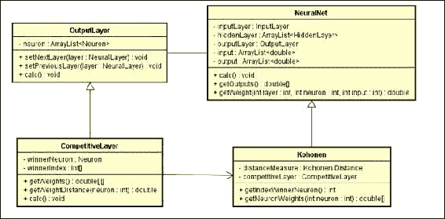

本章涵盖了三种类型的 SOM：零维、一维和二维。这些配置在 `enum MapDimension` 中定义：

```py
public enum MapDimension {ZERO,ONE_DIMENSION,TWO_DIMENSION};
```

Kohonen 构造函数定义了 Kohonen 神经网络的维度：

```py
public Kohonen(int numberofinputs, int numberofoutputs, WeightInitialization _weightInitialization, int dim){
  weightInitialization=_weightInitialization;
  activeBias=false;
  numberOfHiddenLayers=0; //no hidden layers
//…
  numberOfInputs=numberofinputs;
  numberOfOutputs=numberofoutputs;
  input=new ArrayList<>(numberofinputs);
  inputLayer=new InputLayer(this,numberofinputs);
// the competitive layer will be defined according to the dimension passed in the argument dim
  outputLayer=new CompetitiveLayer(this,numberofoutputs, numberofinputs,dim);
  inputLayer.setNextLayer(outputLayer);
  setNeuralNetMode(NeuralNetMode.RUN);       
  deactivateBias();
}
```

## 零维 SOM

这是一个纯竞争层，其中神经元的顺序无关紧要。如邻域函数等特征不被考虑。在学习阶段，只有获胜神经元的权重受到影响。映射将仅由未连接的点组成。

以下代码片段定义了一个零维 SOM：

```py
int numberOfInputs=2;
int numberOfNeurons=10;
Kohonen kn0 = new Kohonen(numberOfInputs,numberOfNeurons,new UniformInitialization(-1.0,1.0),0);
```

注意传递给参数 dim 的值 `0`（构造函数的最后一个参数）。

## 一维 SOM

这种架构与上一节中介绍的 **竞争学习** 网络类似，增加了输出神经元之间的邻域关系：

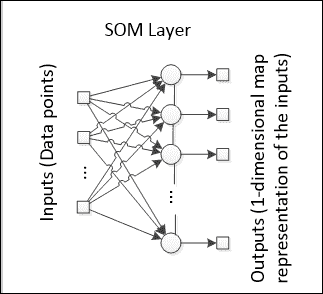

注意，输出层上的每个神经元都有一个或两个邻居。同样，触发最大值的神经元更新其权重，但在 SOM 中，邻域神经元也会以较小的速率更新其权重。

邻域效应将激活区域扩展到地图的更宽区域，前提是所有输出神经元都必须观察到一种组织，或者在一维情况下，观察到一条路径。邻域函数还允许更好地探索输入空间的特点，因为它迫使神经网络保持神经元之间的连接，因此除了形成的聚类之外，还会产生更多信息。

在输入数据点和神经权重的关系图中，我们可以看到由神经元形成的路径：

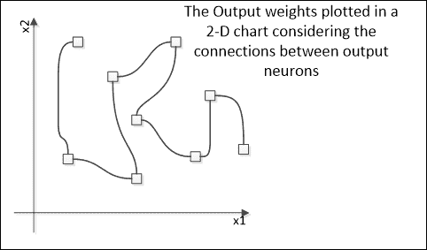

在这里展示的图表中，为了简单起见，我们只绘制了输出权重来展示地图是如何在一个（在这种情况下）2-D空间中设计的。经过多次迭代训练后，神经网络收敛到一个最终形状，代表所有数据点。有了这个结构，一组数据可能会使Kohonen网络在空间中设计出另一种形状。这是一个很好的降维例子，因为当多维数据集被展示给自组织映射时，能够产生一条单线（在1-D SOM中）来总结整个数据集。

要定义一维SOM，我们需要将值`1`作为参数`dim`传递：

```py
Kohonen kn1 = new Kohonen(numberOfInputs,numberOfNeurons,new UniformInitialization(-1.0,1.0),1);
```

## 二维SOM

这是最常用的架构，以直观的方式展示Kohonen神经网络的强大功能。输出层是一个包含M x N神经元的矩阵，像网格一样相互连接：

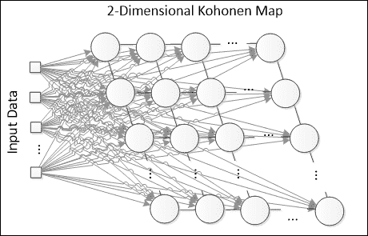

在2-D SOM中，每个神经元现在最多有四个邻居（在正方形配置中），尽管在某些表示中，对角线神经元也可能被考虑，从而最多有八个邻居。六边形表示也很有用。让我们看看一个3x3 SOM图在2-D图表中的样子（考虑两个输入变量）：

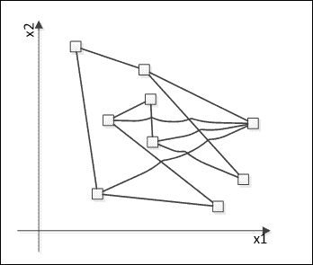

最初，未经训练的Kohonen网络显示出非常奇怪和扭曲的形状。权重的塑造将完全取决于将要馈送到SOM的输入数据。让我们看看地图开始组织自己的一个例子：

+   假设我们有一个如以下图表所示的密集数据集：

+   应用SOM后，2-D形状逐渐变化，直到达到最终配置：

2-D SOM的最终形状可能不总是完美的正方形；相反，它将类似于可以从数据集中绘制出的形状。邻域函数是学习过程中的一个重要组成部分，因为它近似了图中的邻近神经元，并将结构移动到一个更*有组织*的配置。

### 小贴士

图表上的网格只是更常用和更具教育意义的。还有其他方式来展示SOM图，比如U矩阵和聚类边界。

## 二维竞争层

为了更好地在网格形式中表示二维竞争层的神经元，我们正在创建 CompetitiveLayer2D 类，该类继承自 `CompetitiveLayer`。在这个类中，我们可以以 M x N 神经元网格的形式定义神经元的数量：

```py
public class CompetitiveLayer2D extends CompetitiveLayer {

    protected int sizeMapX; // neurons in dimension X
    protected int sizeMapY; // neurons in dimension Y

    protected int[] winner2DIndex;// position of the neuron in grid

    public CompetitiveLayer2D(NeuralNet _neuralNet,int numberOfNeuronsX,int numberOfNeuronsY,int numberOfInputs){
        super(_neuralNet,numberOfNeuronsX*numberOfNeuronsY,
numberOfInputs);
        this.dimension=Kohonen.MapDimension.TWO_DIMENSION;
        this.winnerIndex=new int[1];
        this.winner2DIndex=new int[2];
        this.coordNeuron=new int[numberOfNeuronsX*numberOfNeuronsY][2];
        this.sizeMapX=numberOfNeuronsX;
        this.sizeMapY=numberOfNeuronsY;
        //each neuron is assigned a coordinate in the grid
        for(int i=0;i<numberOfNeuronsY;i++){
            for(int j=0;j<numberOfNeuronsX;j++){
                coordNeuron[i*numberOfNeuronsX+j][0]=i;
                coordNeuron[i*numberOfNeuronsX+j][1]=j;
            }
        }
    }
```

2D 竞争层的坐标系类似于笛卡尔坐标系。每个神经元在网格中都有一个位置，索引从 `0` 开始：

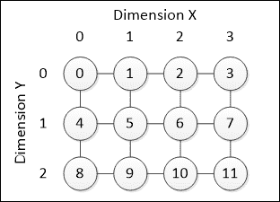

在上面的插图上，12 个神经元被排列在一个 3 x 4 的网格中。在这个类中添加的另一个特性是按网格中的位置索引神经元。这允许我们获取神经元的子集（和权重），例如整个特定的行或列：

```py
public double[] getNeuronWeights(int x, int y){
  double[] nweights = neuron.get(x*sizeMapX+y).getWeights();
  double[] result = new double[nweights.length-1];
  for(int i=0;i<result.length;i++){
    result[i]=nweights[i];
  }
  return result;
}

public double[][] getNeuronWeightsColumnGrid(int y){
  double[][] result = new double[sizeMapY][numberOfInputs];
  for(int i=0;i<sizeMapY;i++){
    result[i]=getNeuronWeights(i,y);
  }
  return result;
}

public double[][] getNeuronWeightsRowGrid(int x){
  double[][] result = new double[sizeMapX][numberOfInputs];
  for(int i=0;i<sizeMapX;i++){
    result[i]=getNeuronWeights(x,i);
  }
  return result;
}
```

## SOM 学习算法

自组织图旨在通过聚类触发相同响应的输出数据点来对输入数据进行分类。最初，未训练的网络将产生随机输出，但随着更多示例的呈现，神经网络会识别哪些神经元被激活得更频繁，然后改变它们在 SOM 输出空间中的 *位置*。此算法基于竞争学习，这意味着获胜神经元（也称为最佳匹配单元或 BMU）将更新其权重及其邻居的权重。

下面的流程图说明了 SOM 网络的学习过程：


学习过程有点类似于第 2 章[“让神经网络学习”](ch02.xhtml "Chapter 2. Getting Neural Networks to Learn")和第 3 章[“感知器和监督学习”](ch03.xhtml "Chapter 3. Perceptrons and Supervised Learning")中提到的算法。三个主要区别是 BMU 的确定基于距离、权重更新规则以及没有错误度量。距离意味着更近的点应该产生相似的输出，因此，确定最低 BMU 的标准是距离某些数据点较近的神经元。通常使用欧几里得距离，本书中我们将为了简单起见应用它：


权重到输入距离是通过 `CompetitiveLayer` 类的 `getWeightDistance( )` 方法计算的，针对特定的神经元 i（参数神经元）。该方法已在上面描述。

## 邻近神经元的影响 – 邻域函数

权重更新规则使用一个邻域函数 *Θ(u,v,s,t)*，该函数说明了邻居神经元 u（BMU 单元）与神经元 *v* 的接近程度。记住，在多维 SOM 中，BMU 神经元与其邻居神经元一起更新。这种更新还依赖于一个邻域半径，该半径考虑了 epoch 的数量 s 和参考 epoch *t*：


在这里，*du,v* 是网格中神经元 u 和 v 之间的神经元距离。半径的计算方法如下：


这里，是初始半径。epoch 数（s）和参考 epoch (*t*) 的影响是减小邻域半径，从而减小邻域的影响。这很有用，因为在训练的初期，权重需要更频繁地更新，因为它们通常随机初始化。随着训练过程的继续，更新需要变得较弱，否则神经网络将永远改变其权重，永远不会收敛。


邻域函数和神经元距离在 `CompetitiveLayer` 类中实现，`CompetitiveLayer2D` 类有重载版本：

| 竞争层 | 竞争层2D |
| --- | --- |

|

```py
public double neighborhood(int u, int v, int s,int t){
  double result;
  switch(dimension){
case ZERO:
  if(u==v) result=1.0;
  else result=0.0;
  break;
case ONE_DIMENSION:
default:
  double exponent=-(neuronDistance(u,v)
/neighborhoodRadius(s,t));
  result=Math.exp(exponent);
  }
  return result;
}
```

|

```py
@Override
public double neighborhood(int u, int v, int s,int t){
  double result;
  double exponent=-(neuronDistance(u,v)
/neighborhoodRadius(s,t));
  result=Math.exp(exponent);
  return result;
}
```

|

|

```py
public double neuronDistance(int u,int v){
  return Math.abs(coordNeuron[u][0]-coordNeuron[v][0]);
}
```

|

```py
@Override
public double neuronDistance(int u,int v){
  double distance=
Math.pow(coordNeuron[u][0]
-coordNeuron[v][0],2);
  distance+=
Math.pow(coordNeuron[u][1]-coordNeuron[v][1],2);
  return Math.sqrt(distance);
}
```

|

邻域半径函数对两个类都是相同的：

```py
public double neighborhoodRadius(int s,int t){
  return this.initialRadius*Math.exp(-((double)s/(double)t));
}
```

## 学习率

随着训练的进行，学习率也会变得较弱：


参数是初始学习率。最后，考虑到邻域函数和学习率，权重更新规则如下：


在这里，*X* *[k]* 是第 *k* 个输入，而 *W* *[kj]* 是连接第 *k* 个输入到第 *j* 个输出的权重。

## 竞争学习的新类

现在我们有了竞争层、Kohonen 神经网络，并定义了邻域函数的方法，让我们创建一个新的竞争学习类。这个类将继承自 `LearningAlgorithm`，并将接收 Kohonen 对象进行学习：

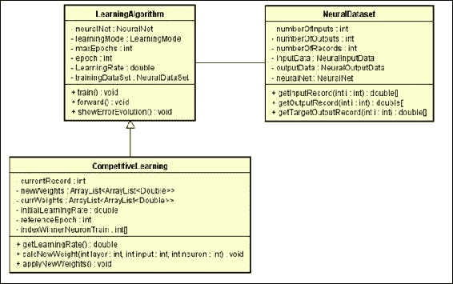

如 [第2章](ch02.xhtml "第2章。让神经网络学习") 所见，*让神经网络学习* 一个 `LearningAlgorithm` 对象接收一个用于训练的神经网络数据集。此属性由 `CompetitiveLearning` 对象继承，它实现了新的方法和属性以实现竞争学习过程：

```py
public class CompetitiveLearning extends LearningAlgorithm {
    // indicates the index of the current record of the training dataset  
    private int currentRecord=0;
    //stores the new weights until they will be applied
    private ArrayList<ArrayList<Double>> newWeights;
    //saves the current weights for update
    private ArrayList<ArrayList<Double>> currWeights;
    // initial learning rate
    private double initialLearningRate = 0.3;
    //default reference epoch
    private int referenceEpoch = 30;
    //saves the index of winner neurons for each training record
    private int[] indexWinnerNeuronTrain;
//…
}
```

与之前的算法不同，学习率现在会在训练过程中变化，并且将通过 `getLearningRate( )` 方法返回：

```py
public double getLearningRate(int epoch){
  double exponent=(double)(epoch)/(double)(referenceEpoch);
  return initialLearningRate*Math.exp(-exponent);
}
```

此方法用于 `calcWeightUpdate( )`：

```py
@Override
public double calcNewWeight(int layer,int input,int neuron)
            throws NeuralException{
//…
  Double deltaWeight=getLearningRate(epoch);
  double xi=neuralNet.getInput(input);
  double wi=neuralNet.getOutputLayer().getWeight(input, neuron);
  int wn = indexWinnerNeuronTrain[currentRecord];
  CompetitiveLayer cl = ((CompetitiveLayer)(((Kohonen)(neuralNet))
                   .getOutputLayer()));
  switch(learningMode){
    case BATCH:
    case ONLINE: //The same rule for batch and online modes
      deltaWeight*=cl.neighborhood(wn, neuron, epoch, referenceEpoch) *(xi-wi);
      break;
  }
  return deltaWeight;
}
```

`train( )` 方法也针对竞争学习进行了调整：

```py
@Override
public void train() throws NeuralException{
//…
  epoch=0;
  int k=0;
  forward();
//…
  currentRecord=0;
  forward(currentRecord);
  while(!stopCriteria()){
    // first it calculates the new weights for each neuron and input
    for(int j=0;j<neuralNet.getNumberOfOutputs();j++){
      for(int i=0;i<neuralNet.getNumberOfInputs();i++){
        double newWeight=newWeights.get(j).get(i);
        newWeights.get(j).set(i,newWeight+calcNewWeight(0,i,j));
      }
    }   
    //the weights are promptly updated in the online mode
    switch(learningMode){
      case BATCH:
        break;
      case ONLINE:
      default:
        applyNewWeights();
    }
    currentRecord=++k;
    if(k>=trainingDataSet.numberOfRecords){
      //for the batch mode, the new weights are applied once an epoch
      if(learningMode==LearningAlgorithm.LearningMode.BATCH){
        applyNewWeights();
      }
      k=0;
      currentRecord=0;
      epoch++;
      forward(k);
//…
    }
  }
}
```

方法 `appliedNewWeights( )` 的实现与上一章中介绍的方法类似，只是没有偏差，只有一个输出层。

**游戏时间**：SOM应用实战。现在是时候动手实现Java中的Kohonen神经网络了。自组织映射有许多应用，其中大多数应用在聚类、数据抽象和降维领域。但聚类应用最有趣，因为它们有许多可能的应用。聚类的真正优势在于无需担心输入/输出关系，解决问题者可以专注于输入数据。一个聚类应用的例子将在[第7章](ch07.xhtml "第7章。聚类客户档案")中探讨，即*聚类客户档案*。

## 可视化SOMs

在本节中，我们将介绍绘图功能。在Java中，可以通过使用免费提供的包`JFreeChart`（可以从[http://www.jfree.org/jfreechart/](http://www.jfree.org/jfreechart/)下载）来绘制图表。此包附在本章的源代码中。因此，我们设计了一个名为**Chart**的类：

```py
public class Chart {
  //title of the chart
  private String chartTitle;
  //datasets to be rendered in the chart
  private ArrayList<XYDataset> dataset = new ArrayList<XYDataset>();
  //the chart object
  private JFreeChart jfChart;
  //colors of each dataseries
  private ArrayList<Paint> seriesColor = new ArrayList<>();
  //types of series (dots or lines for now)    
  public enum SeriesType {DOTS,LINES};
  //collections of types for each series
  public ArrayList<SeriesType> seriesTypes = new ArrayList<SeriesType>();

//…
}
```

本类实现的方法用于绘制线图和散点图。它们之间的主要区别在于线图在一个x轴（通常是时间轴）上绘制所有数据系列（每个数据系列是一条线）；而散点图则在二维平面上显示点，表示其相对于每个轴的位置。下面的图表图形地显示了它们之间的区别以及生成它们的代码：

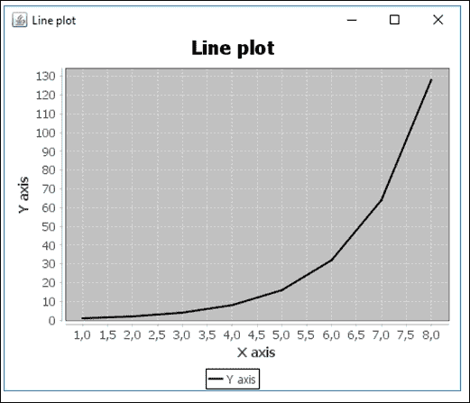

```py
int numberOfPoints=10;

double[][] dataSet = {
{1.0, 1.0},{2.0,2.0}, {3.0,4.0}, {4+.0, 8.0},{5.0,16.0}, {6.0,32.0},
{7.0,64.0},{8.0,128.0}};

String[] seriesNames = {"Line Plot"};
Paint[] seriesColor = {Color.BLACK};

Chart chart = new Chart("Line Plot", dataSet, seriesNames, 0, seriesColor, Chart.SeriesType.LINE);

ChartFrame frame = new ChartFrame("Line Plot", chart.linePlot("X Axis", "Y Axis"));

frame.pack();
frame.setVisibile(true);
```

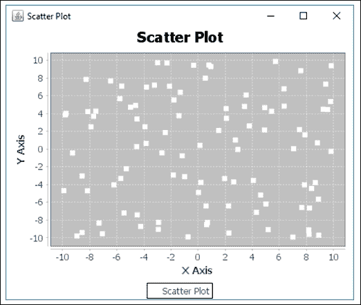

```py
int numberOfInputs=2;
int numberOfPoints=100;

double[][] rndDataSet =
RandomNumberGenerator
.GenerateMatrixBetween
(numberOfPoints
, numberOfInputs, -10.0, 10.0);
String[] seriesNames = {"Scatter Plot"};
Paint[] seriesColor = {Color.WHITE};

Chart chart = new Chart("Scatter Plot", rndDataSet, seriesNames, 0, seriesColor, Chart.SeriesType.DOTS);

ChartFrame frame = new ChartFrame("Scatter Plot", chart.scatterPlot("X Axis", "Y Axis"));

frame.pack();
```

我们省略了图表生成代码（方法`linePlot( )`和`scatterPlot( )`）；然而，在`Chart.java`文件中，读者可以找到它们的实现。

## 绘制二维训练数据集和神经元权重

现在我们有了绘制图表的方法，让我们绘制训练数据集和神经元权重。任何二维数据集都可以以与上一节图示相同的方式绘制。要绘制权重，我们需要使用以下代码获取Kohonen神经网络的权重：

```py
CompetitiveLayer cl = ((CompetitiveLayer)(neuralNet.getOutputLayer()));
double[][] neuronsWeights = cl.getWeights();
```

在竞争学习中，我们可以通过视觉检查权重如何在数据集空间中移动。因此，我们将添加一个方法（`showPlot2DData( )`）来绘制数据集和权重，一个属性（`plot2DData`）来保存对`ChartFrame`的引用，以及一个标志（`show2DData`）来决定是否在每个epoch显示绘图：

```py
protected ChartFrame plot2DData;

public boolean show2DData=false;

public void showPlot2DData(){
  double[][] data= ArrayOperations. arrayListToDoubleMatrix( trainingDataSet.inputData.data);
  String[] seriesNames = {"Training Data"};
  Paint[] seriesColor = {Color.WHITE};

  Chart chart = new Chart("Training epoch n°"+String.valueOf(epoch)+" ",data,seriesNames,0,seriesColor,Chart.SeriesType.DOTS);
  if(plot2DData ==null){
    plot2DData = new ChartFrame("Training",chart.scatterPlot("X","Y"));
  }

  Paint[] newColor={Color.BLUE};
  String[] neuronsNames={""};
  CompetitiveLayer cl = ((CompetitiveLayer)(neuralNet.getOutputLayer()));
  double[][] neuronsWeights = cl.getWeights();
  switch(cl.dimension){
    case TWO_DIMENSION:
      ArrayList<double[][]> gridWeights = ((CompetitiveLayer2D)(cl)). getGridWeights();
      for(int i=0;i<gridWeights.size();i++){
        chart.addSeries(gridWeights.get(i),neuronsNames, 0,newColor, Chart.SeriesType.LINES);
      }
      break;
    case ONE_DIMENSION:
      neuronsNames[0]="Neurons Weights";
      chart.addSeries(neuronsWeights, neuronsNames, 0, newColor, Chart.SeriesType.LINES);
      break;
    case ZERO:
      neuronsNames[0]="Neurons Weights";
    default:
      chart.addSeries(neuronsWeights, neuronsNames, 0,newColor, Chart.SeriesType.DOTS);
  }
  plot2DData.getChartPanel().setChart(chart.scatterPlot("X", "Y"));
}
```

此方法将在每个epoch结束时从`train`方法中调用。一个名为**sleep**的属性将决定图表显示多少毫秒，直到下一个epoch的图表替换它：

```py
if(show2DData){
  showPlot2DData();
  if(sleep!=-1)
    try{ Thread.sleep(sleep); }
    catch(Exception e){}
}
```

## 测试Kohonen学习

现在让我们定义一个Kohonen网络并看看它是如何工作的。首先，我们创建一个零维度的Kohonen：

```py
RandomNumberGenerator.seed=0;
int numberOfInputs=2;
int numberOfNeurons=10;
int numberOfPoints=100;

// create a random dataset between -10.0 and 10.0   
double[][] rndDataSet = RandomNumberGenerator. GenerateMatrixBetween(numberOfPoints, numberOfInputs, -10.0, 10.0);

// create the Kohonen with uniform initialization of weights        
Kohonen kn0 = new Kohonen(numberOfInputs,numberOfNeurons,new UniformInitialization(-1.0,1.0),0);

//add the dataset to the neural dataset
NeuralDataSet neuralDataSet = new NeuralDataSet(rndDataSet,2);

//create an instance of competitive learning in the online mode
CompetitiveLearning complrn=new CompetitiveLearning(kn0,neuralDataSet, LearningAlgorithm.LearningMode.ONLINE);

//sets the flag to show the plot
complrn.show2DData=true;

try{
// give names and colors for the dataset
  String[] seriesNames = {"Training Data"};
  Paint[] seriesColor = {Color.WHITE};
  //this instance will create the plot with the random series
  Chart chart = new Chart("Training",rndDataSet,seriesNames,0, seriesColor);
  ChartFrame frame = new ChartFrame("Training", chart.scatterPlot("X", "Y"));
  frame.pack();
  frame.setVisible(true);

  // we pass the reference of the frame to the complrn object
  complrn.setPlot2DFrame(frame);
  // show the first epoch
  complrn.showPlot2DData();
//wait for the user to hit an enter
  System.in.read();
//training begins, and for each epoch a new plot will be shown
  complrn.train();
}
catch(Exception ne){

}
```

运行此代码后，我们得到第一个绘图：


随着训练的开始，权重开始分布在输入数据空间中，直到最终通过在输入数据空间中均匀分布而收敛：


对于一维，让我们尝试一些更有趣的东西。让我们创建一个基于余弦函数并带有随机噪声的数据集：

```py
int numberOfPoints=1000;
int numberOfInputs=2;
int numberOfNeurons=20;
double[][] rndDataSet;

for (int i=0;i<numberOfPoints;i++){
  rndDataSet[i][0]=i;            
  rndDataSet[i][0]+=RandomNumberGenerator.GenerateNext();
  rndDataSet[i][1]=Math.cos(i/100.0)*1000;            
  rndDataSet[i][1]+=RandomNumberGenerator.GenerateNext()*400;
}
Kohonen kn1 = new Kohonen(numberOfInputs,numberOfNeurons,new UniformInitialization(0.0,1000.0),1);
```

通过运行相同的先前代码并将对象更改为*kn1*，我们得到一条连接所有权重点的线：

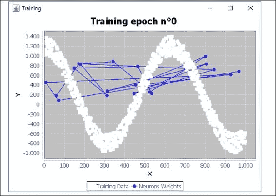

随着训练的继续，线条倾向于沿着数据波组织：


如果你想更改初始学习率、最大时期数和其他参数，请查看`Kohonen1DTest.java`文件。

最后，让我们看看二维的Kohonen图。代码将略有不同，因为现在，我们不是给出神经元的数量，而是要通知Kohonen构建者我们神经网络网格的维度。

这里使用的数据集将是一个带有随机噪声的圆：

```py
int numberOfPoints=1000;
for (int i=0;i<numberOfPoints;i++){
  rndDataSet[i][0]*=Math.sin(i);            
  rndDataSet[i][0]+=RandomNumberGenerator.GenerateNext()*50;
  rndDataSet[i][1]*=Math.cos(i);            
  rndDataSet[i][1]+=RandomNumberGenerator.GenerateNext()*50;
}
```

现在我们来构建二维的Kohonen：

```py
int numberOfInputs=2;
int neuronsGridX=12;
int neuronsGridY=12;
Kohonen kn2 = new Kohonen(numberOfInputs,neuronsGridX,neuronsGridY,new GaussianInitialization(500.0,20.0));
```

注意，我们使用的是均值为500.0和标准差为20.0的`GaussianInitialization`，这意味着权重将在位置(500.0,500.0)生成，而数据则围绕(50.0,50.0)中心：

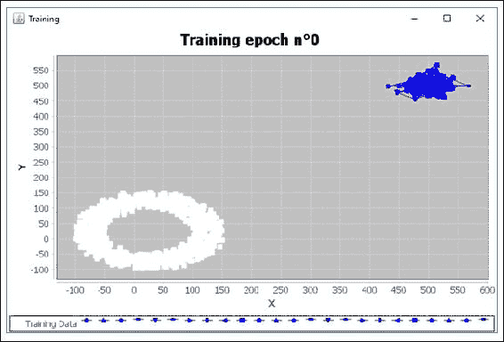

现在我们来训练神经网络。在最初的几个时期，神经元权重迅速移动到圆圈中：


到了训练结束时，大多数权重将分布在圆周上，而在中心将有一个空隙，因为网格将被完全拉伸开：


# 摘要

在本章中，我们看到了如何在神经网络上应用无监督学习算法。我们介绍了一种新的、适合该目的的架构，即Kohonen的自组织图。无监督学习已被证明与监督学习方法一样强大，因为它们只关注输入数据，无需建立输入输出映射。我们通过图形展示了训练算法如何能够将权重驱动到输入数据附近，从而在聚类和降维中发挥作用。除了这些例子之外，Kohonen SOMs还能够对数据簇进行分类，因为每个神经元将针对特定的输入集提供更好的响应。
