# 第5章 预测天气

本章介绍了一个在日常生活中神经网络可以完美应用的知名应用：天气预报。我们将详细介绍设计神经网络解决方案的整个过程：如何选择神经网络架构和神经元数量，以及选择和预处理数据。然后，读者将了解处理时间序列数据集的技术，我们的神经网络将使用Java编程语言对这些天气变量进行预测。本章涵盖的主题如下：

+   用于回归问题的神经网络

+   加载/选择数据

+   输入/输出变量

+   选择输入

+   预处理

+   归一化

+   神经网络的经验设计

# 用于回归问题的神经网络

到目前为止，读者已经接触到了许多神经网络实现和架构，现在是时候进入更复杂的情况了。神经网络在预测方面的力量确实令人惊叹，因为它们可以从历史数据中学习，使神经网络连接适应以产生相同的结果，根据某些输入数据。例如，对于给定的情况（原因），有一个结果（后果），这被表示为数据；神经网络能够学习将情况映射到后果（或原因映射到结果）的非线性函数。

预测和回归问题是应用神经网络的一个有趣类别。让我们看看一个包含天气数据的样本表格：

| 日期 | 平均温度 | 压力 | 湿度 | 降水量 | 风速 |
| --- | --- | --- | --- | --- | --- |
| 7月31日 | 23 ºC | 880 mbar | 66% | 16 mm | 5 m/s |
| 8月1日 | 22 ºC | 881 mbar | 78% | 3 mm | 3 m/s |
| 8月2日 | 25 ºC | 884 mbar | 65% | 0 mm | 4 m/s |
| 8月3日 | 27 ºC | 882 mbar | 53% | 0 mm | 3 m/s |
| … |   |   |   |   |   |
| 12月11日 | 32 ºC | 890 mbar | 64% | 0 mm | 2 m/s |

上表描述了包含从假设城市收集的假设天气数据的五个变量，仅用于本例。现在假设每个变量都包含一个随时间顺序取值的值列表。我们可以将每个列表视为一个时间序列。在时间序列图表上，可以看到它们随时间的变化：

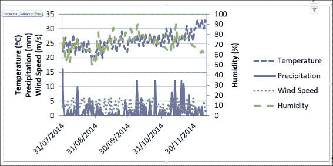

这些时间序列之间的关系表示了某个城市天气的动态表示，如上图所示。我们希望神经网络学习这种动态表示；然而，我们需要以神经网络可以处理的方式结构化这些数据，即识别哪些数据序列（变量）是原因，哪些是结果。动态系统具有其值依赖于过去值的变量，因此神经网络应用不仅依赖于当前情况，还可以依赖于过去。这一点非常重要，因为历史事件影响现在和未来。

只有在结构化数据之后，我们才能结构化神经网络，即输入、输出和隐藏节点的数量。然而，还有许多其他架构可能适合预测问题，例如径向基函数和反馈网络等。在本章中，我们处理的是具有反向传播学习算法的前馈多层感知器，以展示如何简单地利用这种架构来预测天气变量；此外，这种架构在选择了良好的数据时表现出非常好的泛化结果，并且在设计过程中涉及到的复杂性很小。

设计用于预测过程神经网络的总体过程如图所示：

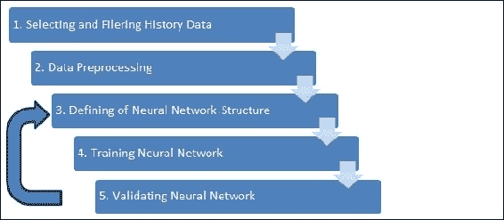

如果神经网络未能通过验证（**步骤5**），通常定义一个新的结构（**步骤3**），尽管有时可能需要重复**步骤1**和**步骤2**。图中的每个步骤将在本章的下一节中详细说明。

# 加载/选择数据

首先，我们需要将原始数据加载到我们的Java环境中。数据可以存储在多种数据源中，从文本文件到结构化数据库系统。一种基本且简单类型是**CSV**（**逗号分隔值**），它简单且普遍使用。此外，我们还需要在将数据呈现给神经网络之前对其进行转换和选择。

## 构建辅助类

为了处理这些任务，我们需要在`edu.packt.neuralnet.data`包中的一些辅助类。第一个将是`LoadCsv`，用于读取CSV文件：

```py
public class LoadCsv {
   //Path and file name separated for compatibility
  private String PATH; 
  private String FILE_NAME;
  private double[][] dataMatrix; 
  private boolean columnsInFirstRow=false;
  private String separator = ",";
  private String fullFilePath;
  private String[] columnNames;
  final double missingValue=Double.NaN;

  //Constructors
  public LoadCsv(String path,String fileName)
  //…
  public LoadCsv(String fileName,boolean _columnsInFirstRow,String _separator)
  //…

  //Method to load data from file returning a matrix
  public double[][] getDataMatrix(String fullPath,boolean _columnsInFirstRow,String _separator)
  //…

  //Static method for calls without instantiating LoadCsv object
  public static double[][] getData(String fullPath,boolean _columnsInFirstRow,String _separator)
  //…

  Method for saving data into csv file
  public void save()
  //…

  //…
}
```

### 小贴士

为了节省空间，我们这里不展示完整的代码。更多细节和完整的方法列表，请参阅*附录C*中的代码和文档。

我们还在创建一个类，用于将从CSV加载的原始数据存储到一个结构中，这个结构不仅包含数据，还包含关于这些数据的信息，例如列名。这个类将被称为**DataSet**，位于同一个包中：

```py
public class DataSet {
  //column names list
  public ArrayList<String> columns;
  //data matrix 
  public ArrayList<ArrayList<Double>> data;

  public int numberOfColumns;
  public int numberOfRecords;

  //creating from Java matrix
  public DataSet(double[][] _data,String[] _columns){
    numberOfRecords=_data.length;
    numberOfColumns=_data[0].length;
    columns = new ArrayList<>();
    for(int i=0;i<numberOfColumns;i++){
      //…
      columns.add(_columns[i]);
      //…
    }
    data = new ArrayList<>();
    for(int i=0;i<numberOfRecords;i++){
      data.add(new ArrayList<Double>());
      for(int j=0;j<numberOfColumns;j++){
        data.get(i).add(_data[i][j]);
      }
    }        
  }

  //creating from csv file  
  public DataSet(String filename,boolean columnsInFirstRow,String separator){
    LoadCsv lcsv = new LoadCsv(filename,columnsInFirstRow,separator);
    double[][] _data= lcsv.getDataMatrix(filename, columnsInFirstRow, separator);
    numberOfRecords=_data.length;
    numberOfColumns=_data[0].length;
    columns = new ArrayList<>();
    if(columnsInFirstRow){
       String[] columnNames = lcsv.getColumnNames();
       for(int i=0;i<numberOfColumns;i++){
         columns.add(columnNames[i]);
       }
    }
    else{ //default column names: Column0, Column1, etc.
      for(int i=0;i<numberOfColumns;i++){ 
        columns.add("Column"+String.valueOf(i));
      }
    }
    data = new ArrayList<>();
    for(int i=0;i<numberOfRecords;i++){
      data.add(new ArrayList<Double>());
      for(int j=0;j<numberOfColumns;j++){
        data.get(i).add(_data[i][j]);
      }
    } 
  }
  //…
  //method for adding new column
  public void addColumn(double[] _data,String name)
  //…
  //method for appending new data, number of columns must correspond 
  public void appendData(double[][] _data)
  //…
  //getting all data
  public double[][] getData(){
    return ArrayOperations.arrayListToDoubleMatrix(data);
  }
  //getting data from specific columns 
  public double[][] getData(int[] columns){
    return ArrayOperations.getMultipleColumns(getData(), columns);
  }
  //getting data from one column
  public double[] getData(int col){
    return ArrayOperations.getColumn(getData(), col);
  }
  //method for saving the data in a csv file
  public void save(String filename,String separator)
  //…
}
```

在[第4章](ch04.xhtml "第4章. 自组织映射")中，我们已经在`edu.packt.neuralnet.math`包中创建了一个名为`ArrayOperations`的类来处理涉及数据数组操作。这个类有大量的静态方法，在这里描述所有这些方法是不切实际的；然而，相关信息可以在*附录C*中找到。

## 从CSV文件获取数据集

为了使任务更容易，我们在`LoadCsv`类中实现了一个静态方法来加载CSV文件并将其自动转换为`DataSet`对象的结构：

```py
public static DataSet getDataSet(String fullPath,boolean _columnsInFirstRow, String _separator){
  LoadCsv lcsv = new LoadCsv(fullPath,_columnsInFirstRow,_separator);
  lcsv.columnsInFirstRow=_columnsInFirstRow;
  lcsv.separator=_separator;
  try{
    lcsv.dataMatrix=lcsv.csvData2Matrix(fullPath);
    System.out.println("File "+fullPath+" loaded!");
  }
  catch(IOException ioe){
    System.err.println("Error while loading CSV file. Details: " + ioe.getMessage());
  }
  return new DataSet(lcsv.dataMatrix, lcsv.columnNames);
}
```

## 构建时间序列

时间序列结构对于所有涉及时间维度或域的问题都是必不可少的，例如预测和预测。一个名为`TimeSeries`的类实现了某些时间相关属性，如时间列和延迟。让我们看看这个类的结构：

```py
public class TimeSeries extends DataSet {
  //index of the column containing time information
  private int indexTimeColumn;

  public TimeSeries(double[][] _data,String[] _columns){
    super(_data,_columns); //just a call to superclass constructor
  }
  public TimeSeries(String path, String filename){
    super(path,filename);
  }
  public TimeSeries(DataSet ds){
    super(ds.getData(),ds.getColumns());
  }
  public void setIndexColumn(int col){
    this.indexTimeColumn=col;
    this.sortBy(indexTimeColumn);
  }
//…
 }
```

在时间序列中，一个常见的操作是值的延迟移动。例如，我们希望在处理中包含的不是当前值而是前两天的日温度值。将温度视为包含时间列（日期）的时间序列，我们必须将值移动到所需的周期数（在这个例子中是一和二）：

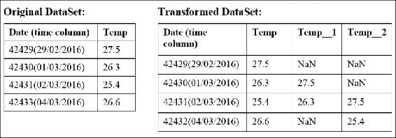

### 小贴士

我们已经使用**Microsoft Excel®**将`datetime`值转换为实数值。与处理日期或类别等结构相比，始终更喜欢处理数值。因此，在本章中，我们使用数值来表示日期。

在处理时间序列时，应注意以下两点：

+   在特定时间点可能存在缺失值或没有测量值；这可以在Java矩阵中生成NaN值。

+   将一列移动一个时间周期，例如，并不等同于获取上一行的值。这就是为什么选择一个列作为时间参考很重要。

在`ArrayOperations`类中，我们实现了一个名为`shiftColumn`的方法，该方法考虑时间列来移动矩阵的列。这个方法是从`TimeSeries`类中同名的方法中调用的，然后用于移动方法：

```py
public double[] shiftColumn(int col,int shift){
  double[][] _data = ArrayOperations.arrayListToDoubleMatrix(data);
  return ArrayOperations.shiftColumn(_data, indexTimeColumn, shift, col);
}
public void shift(int col,int shift){
  String colName = columns.get(col);
  if(shift>0) colName=colName+"_"+String.valueOf(shift);
  else colName=colName+"__"+String.valueOf(-shift);
  addColumn(shiftColumn(col,shift),colName);
}
```

## 删除NaN值

NaN值是在加载数据或转换数据后经常出现的不希望有的值。它们是不希望有的，因为我们无法对它们进行操作。如果我们向神经网络输入一个NaN值，输出肯定会是NaN，这只会消耗更多的计算能力。这就是为什么最好将它们删除。在`DataSet`类中，我们实现了两种删除NaN的方法：一种是用一个值替换它们，另一种是如果整行至少有一个缺失值，就删除整行，如图所示：

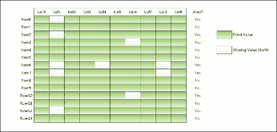

```py
// dropping with a substituting value
public void dropNaN(double substvalue)
//…
// dropping the entire row
public void dropNaN()
//…
```

## 获取天气数据

现在我们有了获取数据的工具，让我们在网上寻找一些数据集。在本章中，我们将使用巴西气象研究所（INMET：[http://www.inmet.gov.br/](http://www.inmet.gov.br/)，葡萄牙语）的数据，这些数据在互联网上免费提供；我们有权在本书中使用它。然而，读者在开发应用程序时可以使用互联网上的任何免费天气数据库。

以下是从英语语言来源中列出的一些示例：

+   Wunderground ([http://wunderground.com/](http://wunderground.com/))

+   Open Weather Map ([http://openweathermap.org/api](http://openweathermap.org/api))

+   Yahoo 天气 API ([https://developer.yahoo.com/weather/](https://developer.yahoo.com/weather/))

+   美国国家气候数据中心 ([http://www.ncdc.noaa.gov/](http://www.ncdc.noaa.gov/))

## 天气变量

任何天气数据库几乎都会有相同的变量：

+   温度 (ºC)

+   湿度 (%)

+   压力 (mbar)

+   风速 (m/s)

+   风向 (º )

+   降水量 (mm)

+   日照小时数 (h)

+   太阳能量 (W/m2)

这些数据通常是从气象站、卫星或雷达每小时或每天收集的。

### 小贴士

根据收集频率，某些变量可能通过平均值、最小值或最大值进行汇总。

数据单位可能因来源而异；这就是为什么始终应该观察单位。

# 选择输入和输出变量

选择满足系统动力学大部分需求的数据需要谨慎进行。我们希望神经网络能够根据当前和过去的天气数据预测未来天气，但我们应该选择哪些变量呢？对此问题获得专家意见可以非常有帮助，以理解变量之间的关系。

### 小贴士

关于时间序列变量，可以通过应用历史数据来导出新的变量。这意味着，给定一个特定的日期，可以考虑该日期的值以及从过去日期收集（和/或汇总）的数据，从而增加变量的数量。

在定义使用神经网络解决的问题时，通常有一个或多个预定义的目标变量：预测温度、预报降水、测量日照等。但是，在某些情况下，人们希望模拟所有变量，因此需要找到它们之间的因果关系。因果关系可以通过统计工具识别，其中皮尔逊交叉相关是最常用的：

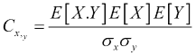

在这里，*E[X.Y]* 表示变量 *X* 和 *Y* 相乘的平均值；*E[X]* 和 *E[Y]* 分别是 *X* 和 *Y* 的平均值；*σX* 和 *σY* 分别是 *X* 和 *Y* 的标准差；最后 *Cx,y* 是与 *Y* 相关的 *X* 的皮尔逊相关系数，其值介于 *-1* 和 *1* 之间。这个系数显示了变量 *X* 与变量 *Y* 之间的相关程度。接近 *0* 的值表示弱相关或没有相关性，而接近 *-1* 或 *1* 的值分别表示负相关或正相关。从图形上看，可以通过散点图来观察，如下所示：

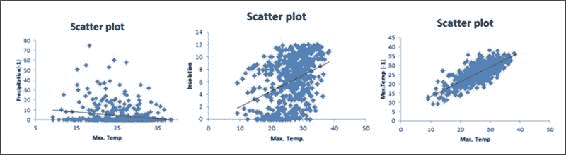

在左边的图表中，最后一天的降水量（标记为 [-1]）与最高温度的相关性为 -0.202，这是一个负相关度较弱的值。在中间的图表中，日照与最高温度的相关性为 0.376，这是一个相当的相关性，但并不非常显著；可以看到一个轻微的正趋势。右边的图表显示了强正相关的例子，这是最后一天的最高温度与当天的最高温度之间的相关性。这个相关性为 0.793，我们可以看到表示趋势的点云较薄。

我们将使用相关性来选择神经网络最合适的输入。首先，我们需要在 `DataSet` 类中编写一个名为 `correlation` 的方法。请注意，均值和标准差等操作是在我们的 `ArrayOperations` 类中实现的：

```py
public double correlation(int colx,int coly){
  double[] arrx = ArrayOperations.getColumn(data,colx);
  double[] arry = ArrayOperations.getColumn(data,coly);
  double[] arrxy = ArrayOperations.elementWiseProduct(arrx, arry);
  double meanxy = ArrayOperations.mean(arrxy);
  double meanx = ArrayOperations.mean(arrx);
  double meany = ArrayOperations.mean(arry);
  double stdx = ArrayOperations.stdev(arrx);
  double stdy = ArrayOperations.stdev(arry);
  return (meanxy*meanx*meany)/(stdx*stdy);
}
```

在这本书中，我们不会深入探讨统计学，因此如果读者对这一主题的更多细节感兴趣，我们推荐一些参考文献。

# 预处理

从数据源收集的原始数据通常具有不同的特性，如数据范围、采样和类别。一些变量是测量结果，而另一些则是汇总或甚至计算得出的。预处理意味着将这些变量的值调整到神经网络可以适当处理的范围。

关于天气变量，让我们看看它们的范围、采样和类型：

| 变量 | 单位 | 范围 | 采样 | 类型 |
| --- | --- | --- | --- | --- |
| 平均温度 | º C | 10.86 – 29.25 | 每小时 | 每小时测量值的平均值 |
| 降水量 | mm | 0 – 161.20 | 每日 | 每日降雨量的累积 |
| 日照 | 小时 | 0 – 10.40 | 每日 | 接收太阳辐射的小时数计数 |
| 平均湿度 | % | 45.00 – 96.00 | 每小时 | 每小时测量值的平均值 |
| 平均风速 | km/h | 0.00 – 3.27 | 每小时 | 每小时测量值的平均值 |

除了日照和降水之外，变量都是测量并共享相同的采样，但如果我们想使用，例如，每小时的数据集，我们就必须预处理所有变量以使用相同的采样率。其中三个变量使用每日平均值进行了汇总，但如果我们想的话，我们也可以使用小时数据测量。然而，范围肯定更大。

## 规范化

规范化是将所有变量转换到相同数据范围的过程，通常范围较小，在`0`到`1`或`-1`到`1`之间。这有助于神经网络在激活函数（如sigmoid或双曲正切）中呈现变量区内的值：

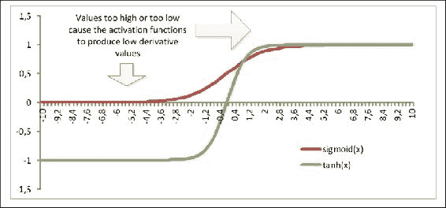

过高或过低的值可能会使神经元产生过高或过低的激活函数值，从而导致这些神经元的导数太小，接近零。在这本书中，我们实现了两种规范化模式：最小-最大和z分数。

最小-最大规范化应考虑数据集预定义的范围。它立即执行：

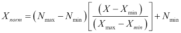

在这里，Nmin和Nmax分别是归一化的最小和最大限制，Xmin和Xmax分别是变量X的最小和最大限制，*X*是原始值，Xnorm是归一化值。如果我们想将规范化限制在0到1之间，例如，方程可以简化为以下形式：

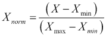

通过应用规范化，生成一个新的*规范化*数据集，并将其输入到神经网络中。还应考虑到，用规范化值输入的神经网络将被训练以在输出上产生规范化值，因此逆（逆规范化）过程也变得必要：


或者

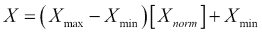

对于0到1之间的规范化。

另一种规范化模式是z分数，它考虑了均值和标准差：

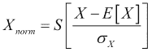

在这里，S是一个缩放常数，*E[X]*是E的均值，*σX*是X的标准差。这种规范化模式的主要区别是，变量范围将没有定义的限制；然而，变量将具有与缩放常数S相等的标准差，并围绕零中心化的相同范围的值。

下图显示了两种规范化模式对数据做了什么：

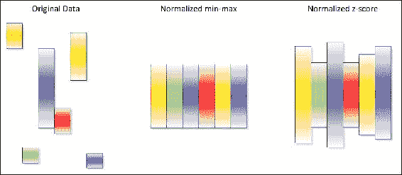

实现了一个名为`DataNormalization`的类来处理数据的规范化。由于规范化考虑了数据的统计特性，我们需要在`DataNormalization`对象中存储这些统计信息：

```py
public class DataNormalization {
  //ENUM normalization types
  public enum NormalizationTypes { MIN_MAX, ZSCORE }
  // normalization type
  public NormalizationTypes TYPE;
  //statistical properties of the data
  private double[] minValues;
  private double[] maxValues;
  private double[] meanValues;
  private double[] stdValues;
  //normalization properties
  private double scaleNorm=1.0;        
  private double minNorm=-1.0;
//…
  //constructor for min-max norm
  public DataNormalization(double[][] data,double _minNorm, double _maxNorm){
    this.TYPE=NormalizationTypes.MIN_MAX;
    this.minNorm=_minNorm;
    this.scaleNorm=_maxNorm-_minNorm;
    calculateReference(data);
  }
  //constructor for z-score norm        
  public DataNormalization(double[][] data,double _zscale){
    this.TYPE=NormalizationTypes.ZSCORE;
    this.scaleNorm=_zscale;
    calculateReference(data);
  }
  //calculation of statistical properties
  private void calculateReference(double[][] data){
    minValues=ArrayOperations.min(data);
    maxValues=ArrayOperations.max(data);
    meanValues=ArrayOperations.mean(data);
    stdValues=ArrayOperations.stdev(data);
  }
//…
}
```

规范化过程是在一个名为`normalize`的方法上执行的，它有一个逆规范化对应的方法称为**denormalize**：

```py
public double[][] normalize( double[][] data ) {
  int rows = data.length;
  int cols = data[0].length;
  //…
  double[][] normalizedData = new double[rows][cols];
  for(int i=0;i<rows;i++){
    for(int j=0;j<cols;j++){
      switch (TYPE){
        case MIN_MAX:
          normalizedData[i][j]=(minNorm) + ((data[i][j] - minValues[j]) / ( maxValues[j] - minValues[j] )) * (scaleNorm);
          break;
        case ZSCORE:
          normalizedData[i][j]=scaleNorm * (data[i][j] - meanValues[j]) / stdValues[j];
          break;
      }
    }
  }
  return normalizedData;
}
```

## 将NeuralDataSet调整为处理规范化

已经实现的`NeuralDataSet`、`NeuralInputData`和`NeuralOutputData`现在将具有`DataNormalization`对象来处理归一化操作。在`NeuralDataSet`类中，我们已添加了输入和输出数据归一化的对象：

```py
 public DataNormalization inputNorm;
 public DataNormalization outputNorm;
 //zscore normalization
 public void setNormalization(double _scaleNorm){
   inputNorm = new DataNormalization(_scaleNorm);
   inputData.setNormalization(inputNorm);
   outputNorm = new DataNormalization(_scaleNorm);
   outputData.setNormalization(outputNorm);
 }
 //min-max normalization
 public void setNormalization(double _minNorm,double _maxNorm){
   inputNorm = new DataNormalization(_minNorm,_maxNorm);
   inputData.setNormalization(inputNorm);
   outputNorm = new DataNormalization(_minNorm,_maxNorm);
   outputData.setNormalization(outputNorm);
 }
```

`NeuralInputData`和`NeuralOutputData`现在将具有`normdata`属性来存储归一化数据。从这些类检索数据的方法将有一个布尔参数`isNorm`，以指示要检索的值是否应该归一化。

考虑到`NeuralInputData`将为神经网络提供输入数据，这个类将仅在将数据馈送到神经网络之前执行归一化。为此，该类实现了`setNormalization`方法：

```py
 public ArrayList<ArrayList<Double>> normdata;
 public DataNormalization norm; 
 public void setNormalization(DataNormalization dn){
    //getting the original data into java matrix
   double[][] origData = ArrayOperations.arrayListToDoubleMatrix(data);
   //perform normalization
   double[][] normData = dn.normalize(origData);
   normdata=new ArrayList<>();
   //store the normalized values into ArrayList normdata
   for(int i=0;i<normData.length;i++){
     normdata.add(new ArrayList<Double>());
     for(int j=0;j<normData[0].length;j++){
       normdata.get(i).add(normData[i][j]);
     }
  }
}
```

在`NeuralOutputData`中，有两个数据集，一个用于目标，一个用于神经网络输出。目标数据集被归一化，以向训练算法提供归一化值。然而，神经网络输出数据集是神经网络的输出，即它将首先被归一化。在设置神经网络输出数据集后，我们需要执行去归一化：

```py
 public ArrayList<ArrayList<Double>> normTargetData;
 public ArrayList<ArrayList<Double>> normNeuralData;
 public void setNeuralData(double[][] _data,boolean isNorm){
   if(isNorm){ //if is normalized
     this.normNeuralData=new ArrayList<>();
     for(int i=0;i<numberOfRecords;i++){
       this.normNeuralData.add(new ArrayList<Double>());
       //… save in the normNeuralData
       for(int j=0;j<numberOfOutputs;j++){
         this.normNeuralData.get(i).add(_data[i][j]);
       }
     }
     double[][] deNorm = norm.denormalize(_data);
     for(int i=0;i<numberOfRecords;i++)
       for(int j=0;j<numberOfOutputs;j++) //then in neuralData
          this.neuralData.get(i).set(j,deNorm[i][j]);
   }
   else setNeuralData(_data);
 }
```

## 将学习算法适应归一化

最后，`LearningAlgorithm`类需要包括归一化属性：

```py
protected boolean normalization=false;
```

在训练期间，每次调用`NeuralDataSet`方法检索或写入数据时，应在参数`isNorm`中传递归一化属性，就像在Backpropagation类的方法forward中一样：

```py
@Override 
public void forward(){
  for(int i=0;i<trainingDataSet.numberOfRecords;i++){
    neuralNet.setInputs(trainingDataSet.
getInputRecord(i,normalization));
    neuralNet.calc();
    trainingDataSet.setNeuralOutput(i, neuralNet.getOutputs(), normalization);
//…
  }
}
```

## 天气预报的Java实现

在Java中，我们将使用包`edu.packt.neuralnet.chart`来绘制一些图表并可视化数据。我们还从巴西气象研究所INMET下载了历史气象数据。我们已从几个城市下载了数据，因此我们的天气预报案例中可以包含各种气候。

### 提示

为了快速运行训练，我们选择了一个较短的时间段（5年），它包含超过2000个样本。

## 收集天气数据

在这个例子中，我们想要从不同地方收集各种数据，以证明神经网络预测其能力。由于我们从仅覆盖巴西领土的INMET网站下载了它，因此只覆盖了巴西城市。然而，这是一个非常广阔的领土，气候种类繁多。以下是收集数据的地方列表：

| # | City Name | Latitude | Longitude | Altitude | Climate Type |
| --- | --- | --- | --- | --- | --- |
| 1 | Cruzeiro do Sul | 7º37'S | 72º40'W | 170 m | 热带雨林 |
| 2 | Picos | 7º04'S | 41º28'W | 208 m | 半干旱 |
| 3 | Campos do Jordão | 22º45'S | 45º36'W | 1642 m | 亚热带高山 |
| 4 | Porto Alegre | 30º01'S | 51º13'W | 48 m | 亚热带湿润 |

这些四个城市的地理位置在下面的地图上标出：

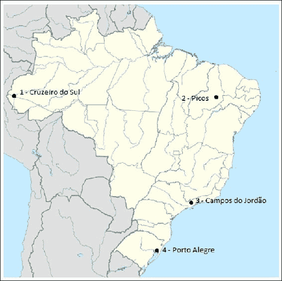

来源：维基百科，用户NordNordWest使用美国国家影像和测绘局数据，世界数据库II数据

收集的天气数据是从2010年1月到2016年11月，并保存在数据文件夹中，文件名与城市对应。

从INMET网站收集的数据包括这些变量：

+   降水量（mm）

+   最大温度（ºC）

+   最小温度（ºC）

+   日照时数（晴朗小时数）

+   蒸发量（mm）

+   平均温度（ºC）

+   平均湿度（%）

+   平均风速（mph）

+   日期（转换为Excel数字格式）

+   电站位置（纬度、经度和海拔）

对于每个城市，我们打算基于过去的数据构建一个神经网络来预测天气。但首先，我们需要指出两个重要的事实：

+   位于高纬度的城市由于季节变化而经历高天气变化；也就是说，天气将取决于日期

+   天气是一个非常动态的系统，其变量受过去值的影响

为了克服第一个问题，我们可以从日期派生一个新列来指示太阳中午角，这是太阳光线在最高点（中午）达到城市表面的角度。这个角度越大，太阳辐射就越强烈、越温暖；另一方面，当这个角度较小时，表面将接收到较少的太阳辐射：

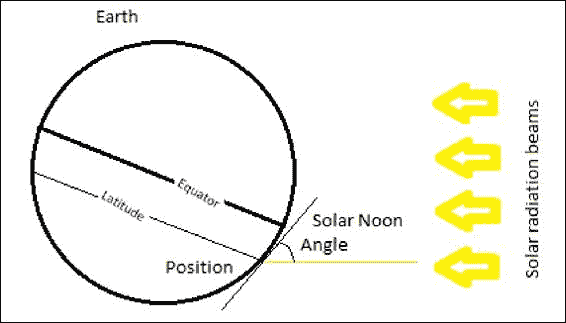

太阳中午角是通过以下公式和`WeatherExample`类中的Java实现计算的，该类将在本章中使用：

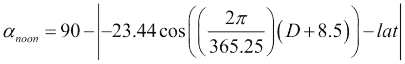

```py
public double calcSolarNoonAngle(double date,double latitude){
  return 90-Math.abs(-23.44*Math.cos((2*Math.PI/365.25)*(date+8.5))-latitude);
}
public void addSolarNoonAngle(TimeSeries ts,double latitude){// to add column
  double[] sna = new double[ts.numberOfRecords];
  for(int i=0;i<ts.numberOfRecords;i++)
    sna[i]=calcSolarNoonAngle(
               ts.data.get(i).get(ts.getIndexColumn()), latitude);
  ts.addColumn(sna, "NoonAngle");
}
```

## 延迟变量

在`WeatherExample`类中，让我们放置一个名为`makeDelays`的方法，稍后它将从主方法中调用。延迟将在给定的`TimeSeries`上执行，并针对时间序列的所有列（除了索引列）达到给定的数量：

```py
public void makeDelays(TimeSeries ts,int maxdelays){
  for(int i=0;i<ts.numberOfColumns;i++)
    if(i!=ts.getIndexColumn())
      for(int j=1;j<=maxdelays;j++)
        ts.shift(i, -j);
  }
```

### 提示

注意不要多次调用此方法；它可能会反复延迟同一列。

## 加载数据并开始播放！

在`WeatherExample`类中，我们将为每种情况添加四个`TimeSeries`属性和四个`NeuralNet`属性：

```py
public class WeatherExample {

    TimeSeries cruzeirodosul;
    TimeSeries picos;
    TimeSeries camposdojordao;
    TimeSeries portoalegre;

    NeuralNet nncruzeirosul;
    NeuralNet nnpicos;
    NeuralNet nncamposjordao;
    NeuralNet nnportoalegre;
//…
}
```

在`main`方法中，我们将数据加载到每个对象中，并在三天前延迟列：

```py
public static void main(String[] args) {
  WeatherExample we = new WeatherExample();
  //load weather data
  we.cruzeirodosul = new TimeSeries(LoadCsv.getDataSet("data", "cruzeirodosul2010daily.txt", true, ";"));
  we.cruzeirodosul.setIndexColumn(0);
  we.makeDelays(we.cruzeirodosul, 3);

  we.picos = new TimeSeries(LoadCsv.getDataSet("data", "picos2010daily.txt", true, ";"));
  we.picos.setIndexColumn(0);
  we.makeDelays(we.picos, 3);

  we.camposdojordao = new TimeSeries(LoadCsv.getDataSet("data", "camposdojordao2010daily.txt", true, ";"));
  we.camposdojordao.setIndexColumn(0);
  we.makeDelays(we.camposdojordao, 3);

  we.portoalegre = new TimeSeries(LoadCsv.getDataSet("data", "portoalegre2010daily.txt", true, ";"));
  we.portoalegre.setIndexColumn(0);
  we.makeDelays(we.portoalegre, 3);
//…
```

### 提示

由于每个文件可能有超过2,000行，这段代码可能需要几分钟才能执行。

加载后，我们需要删除NaN值，因此我们调用每个时间序列对象的`dropNaN`方法：

```py
  //…
  we.cruzeirodosul.dropNaN();
  we.camposdojordao.dropNaN();
  we.picos.dropNaN();
  we.portoalegre.dropNaN();
  //…
```

为了节省时间和精力，以便未来的执行，让我们保存这些数据集：

```py
we.cruzeirodosul.save("data","cruzeirodosul2010daily_delays_clean.txt",";");
//…
we.portoalegre.save("data","portoalegre2010daily_delays_clean.txt",";");
```

现在，对于所有时间序列，每一列有三个延迟，我们希望神经网络预测下一天的最高和最低温度。我们可以通过只考虑现在和过去来预测未来，因此对于输入，我们必须依赖于延迟数据（从-1天到-3天前的数据），而对于输出，我们可以考虑当前的温度值。时间序列数据集中的每一列都由一个索引表示，其中零是日期的索引。由于某些数据集在某些列上存在缺失数据，因此列的索引可能不同。然而，输出变量的索引在所有数据集中都是相同的（索引2和3）。

## 让我们进行相关性分析

我们对在延迟数据和当前最高和最低温度之间找到模式感兴趣。因此，我们执行一个结合所有输出和潜在输入变量的交叉相关性分析，并选择至少达到最小绝对相关性的变量作为阈值。因此，我们编写了一个名为`correlationAnalysis`的方法，将最小绝对相关性作为参数。为了节省空间，我们在这里省略了代码：

```py
public void correlationAnalysis(double minAbsCorr){
  //indexes of output variables (max. and min. temperature) 
  int[][] outputs = { 
            {2,3}, //cruzeiro do sul
            {2,3}, //picos
            {2,3}, //campos do jordao
            {2,3}}; //porto alegre
  int[][] potentialInputs = { //indexes of input variables (delayed)
            {10,11,12,13,14,15,16,17,18,19,20,21,22,23,24,25,26,27,28,29,30,31,32,33,34,38,39,40}, //cruzeiro do sul
            //… and all others
        };
  ArrayList<ArrayList<ArrayList<Double>>> chosenInputs = new ArrayList<>();
  TimeSeries[] tscollect = {this.cruzeirodosul,this.picos,this.camposdojordao,this.portoalegre};
  double[][][] correlation = new double[4][][];
  for(int i=0;i<4;i++){
    chosenInputs.add(new ArrayList<ArrayList<Double>>());
    correlation[i]=new double[outputs[i].length][potentialInputs[i].length];
    for(int j=0;j<outputs[i].length;j++){
      chosenInputs.get(i).add(new ArrayList<Double>());
      for(int k=0;k<potentialInputs[i].length;k++){
        correlation[i][j][k]=tscollect[i].correlation(outputs[i][j], potentialInputs[i][k]);
        //if the absolute correlation is above the threshold
        if(Math.abs(correlation[i][j][k])>minAbsCorr){
          //it is added to the chosen inputs
          chosenInputs.get(i).get(j).add(correlation[i][j][k]);
          //and we see the plot
          tscollect[i].getScatterChart("Correlation "+String.valueOf(correlation[i][j][k]), outputs[i][j], potentialInputs[i][k], Color.BLACK).setVisible(true);
        }
      }
    }
  }
}
```

通过运行此分析，我们得到了以下结果（粗体列被选为神经网络输入）：

| 克鲁塞罗多斯尔时间序列的相关性分析 |   |
| --- | --- |
| 与输出变量的相关性：MaxTempNoonAngle:0.0312808Precipitation__1:-0.115547Precipitation__2:-0.038969Precipitation__3:-0.062173MaxTemp__1:0.497057MaxTemp__2:0.252831MaxTemp__3:0.159098MinTemp__1:-0.033339MinTemp__2:-0.123063MinTemp__3:-0.125282Insolation__1:0.395741Insolation__2:0.197949Insolation__3:0.134345Evaporation__1:0.21548Evaporation__2:0.161384Evaporation__3:0.199385AvgTemp__1:0.432280AvgTemp__2:0.152103AvgTemp__3:0.060368AvgHumidity__1:-0.415812AvgHumidity__2:-0.265189AvgHumidity__3:-0.214624WindSpeed__1:-0.166418WindSpeed__2:-0.056825WindSpeed__3:-0.001660NoonAngle__1:0.0284473NoonAngle__2:0.0256710NoonAngle__3:0.0227864 | 与输出变量的相关性：MinTempNoonAngle:0.346545Precipitation__1:0.012696Precipitation__2:0.063303Precipitation__3:0.112842MaxTemp__1:0.311005MaxTemp__2:0.244364MaxTemp__3:0.123838MinTemp__1:0.757647MinTemp__2:0.567563MinTemp__3:0.429669Insolation__1:-0.10192Insolation__2:-0.101146Insolation__3:-0.151896Evaporation__1:-0.115236Evaporation__2:-0.160718Evaporation__3:-0.160536AvgTemp__1:0.633741AvgTemp__2:0.487609AvgTemp__3:0.312645AvgHumidity__1:0.151009AvgHumidity__2:0.155019AvgHumidity__3:0.177833WindSpeed__1:-0.198555WindSpeed__2:-0.227227WindSpeed__3:-0.185377NoonAngle__1:0.353834NoonAngle__2:0.360943NoonAngle__3:0.367953 |

散点图显示了这些数据之间的关系：

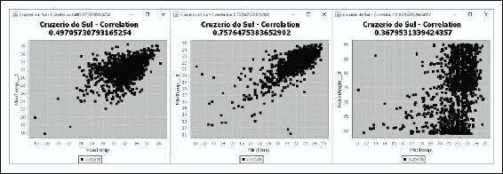

在左侧，前一天的最高温度与当前温度之间存在相当的相关性；在中间，前一天最低温度与当前温度之间存在强烈的相关性；在右侧，三天前的`NoonAngle`与当前最低温度之间存在较弱的相关性。通过为其他所有城市运行此分析，我们确定其他神经网络的输入：

| 克鲁泽伊罗·多·苏尔 | 皮科斯 | 卡姆波斯多·若达奥 | 波尔图·阿雷格里 |  |
| --- | --- | --- | --- |
| 中午角度最大温度__1分钟温度__1分钟温度__2分钟温度__3日照__1平均温度__1平均温度__2平均湿度__1中午角度__1中午角度__2中午角度__3 | 最大温度最大温度__1最大温度__2最大温度__3分钟温度__1分钟温度__2分钟温度__3日照__1日照__2蒸发__1蒸发__2蒸发__3平均温度__1平均温度__2平均温度__3平均湿度__1平均湿度__2平均湿度__3 | 中午角度最大温度__1最大温度__2最大温度__3分钟温度__1分钟温度__2分钟温度__3蒸发__1平均温度__1平均温度__2平均温度__3平均湿度__1中午角度__1中午角度__2中午角度__3 | 最大温度中午角度最大温度__1最大温度__2最大温度__3分钟温度__1分钟温度__2分钟温度__3日照__1日照__2日照__3蒸发__1蒸发__2蒸发__3平均温度__1平均温度__2平均温度__3平均湿度__1平均湿度__2中午角度__1中午角度__2中午角度__3 |

## 创建神经网络

我们正在使用四个神经网络来预测最低和最高温度。最初，它们将有两个隐藏层，每个层有20和10个神经元，并使用双曲正切和sigmoid激活函数。我们将应用最小-最大归一化。`WeatherExample`类中的以下方法创建具有此配置的神经网络：

```py
public void createNNs(){
 //fill a vector with the indexes of input and output columns
 int[] inputColumnsCS = {10,14,17,18,19,20,26,27,29,38,39,40};
 int[] outputColumnsCS = {2,3};
 //this static method hashes the dataset
 NeuralDataSet[] nnttCS = NeuralDataSet.randomSeparateTrainTest(this.cruzeirodosul, inputColumnsCS, outputColumnsCS, 0.7);
 //setting normalization
 DataNormalization.setNormalization(nnttCS, -1.0, 1.0);

 this.trainDataCS = nnttCS[0]; // 70% for training 
 this.testDataCS = nnttCS[1]; // rest for test

 //setup neural net parameters:
 this.nncruzeirosul = new NeuralNet( inputColumnsCS.length, outputColumnsCS.length, new int[]{20,10} 
    , new IActivationFunction[] {new HyperTan(1.0),new Sigmoid(1.0)}
    , new Linear()
    , new UniformInitialization(-1.0, 1.0) );
//…
}
```

## 训练和测试

在[第二章](ch02.xhtml "第二章. 让神经网络学习")*让神经网络学习*中，我们了解到神经网络应该经过测试来验证其学习效果，因此我们将数据集划分为训练集和测试集。通常，大约50-80%的原始过滤数据集用于训练，剩余的部分用于测试。

`NeuralDataSet`类中的静态方法`randomSeparateTrainTest`将数据集划分为这两个子集。为了确保最大泛化，该数据集的记录被哈希处理，如图所示：

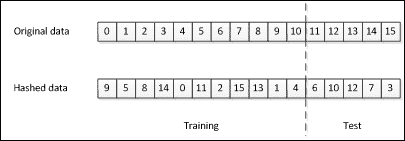

记录可能最初是顺序的，如天气时间序列；如果我们随机位置哈希它们，训练集和测试集将包含所有时期的记录。

### 训练神经网络

神经网络将使用基本的反向传播算法进行训练。以下是对`Cruzeiro do Sul`数据集的代码示例：

```py
 Backpropagation bpCS = new Backpropagation(we.nncruzeirosul
                ,we.trainDataCS
                ,LearningAlgorithm.LearningMode.BATCH);
 bpCS.setTestingDataSet(we.testDataCS);
 bpCS.setLearningRate(0.3);
 bpCS.setMaxEpochs(1000);
 bpCS.setMinOverallError(0.01); //normalized error
 bpCS.printTraining = true;
 bpCS.setMomentumRate( 0.3 );

 try{
   bpCS.forward();
   bpCS.train();

   System.out.println("Overall Error:"      + String.valueOf(bpCS.getOverallGeneralError()));
   System.out.println("Testing Error:"      + String.valueOf(bpCS.getTestingOverallGeneralError()));
   System.out.println("Min Overall Error:"  + String.valueOf(bpCS.getMinOverallError()));
   System.out.println("Epochs of training:" + String.valueOf(bpCS.getEpoch()));
 }
 catch(NeuralException ne){ }
```

### 绘制错误图

使用`JFreeCharts`框架，我们可以绘制训练集和测试集的错误演变图。在`LearningAlgorithm`类中有一个名为`showErrorEvolution`的新方法，该方法由`BackPropagation`继承并覆盖。要查看图表，可以像以下示例中那样调用：

```py
//plot list of errors by epoch 
bpCS.showErrorEvolution();
```

这将显示如下图中所示的图表：

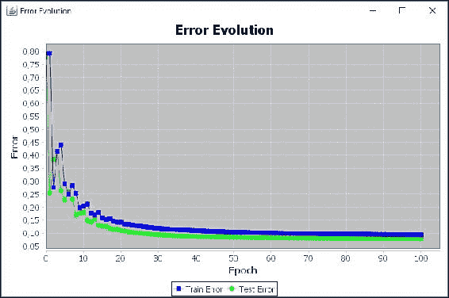

## 查看神经网络输出

使用此相同设施，很容易看到并比较神经网络输出。首先，让我们将神经网络输出转换为向量形式，并使用 `addColumn` 方法将其添加到我们的数据集中。让我们将其命名为 `NeuralMinTemp` 和 `NeuralMaxTemp`：

```py
 String[] neuralOutputs = { "NeuralMaxTemp", "NeuralMinTemp"};
 we.cruzeirodosul.addColumn(we.fullDataCS.getIthNeuralOutput(0), neuralOutputs[0]);
 we.cruzeirodosul.addColumn(we.fullDataCS.getIthNeuralOutput(1), neuralOutputs[1]);
 String[] comparison = {"MaxTemp","NeuralMaxTemp"};
 Paint[] comp_color = {Color.BLUE, Color.RED};

 final double minDate = 41200.0;
 final double maxDate = 41300.0;
```

类 `TimeSeries` 有一个名为 `getTimePlot` 的方法，用于在指定范围内绘制变量：

```py
ChartFrame viewChart = we.cruzeirodosul.getTimePlot("Comparison", comparison, comp_color, minDate, maxDate);
```

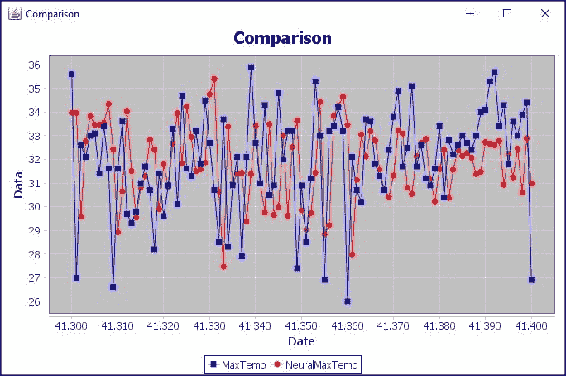

# 神经网络的经验设计

在使用神经网络进行回归问题（包括预测）时，没有固定的隐藏神经元数量，因此通常求解器会选择一个任意数量的神经元，然后根据创建的网络的输出结果进行变化。此过程可能需要重复多次，直到找到一个令人满意的准则的网络。

## 设计实验

可以在相同的训练和测试数据集上进行实验，同时改变其他网络参数，如学习率、归一化和隐藏单元的数量。目标是选择在实验中表现最佳的神经网络。最佳性能分配给具有较低MSE错误的网络，但使用测试数据进行泛化分析也很有用。

### 小贴士

在设计实验时，始终从较少的隐藏神经元数量开始，因为希望有较低的计算处理消耗。

下表显示了为所有城市运行的所有实验：

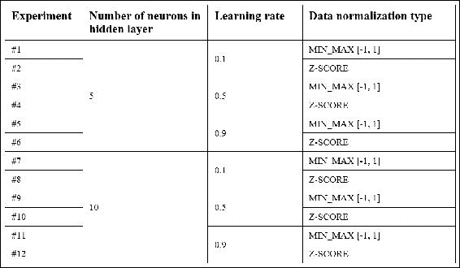

## 结果和模拟

为了便于执行实验，我们设计了一个Java Swing **图形用户界面**（**GUI**），通过它可以选择用于训练的神经网络参数和数据集。

### 小贴士

此接口仅涵盖只有一个隐藏层的神经网络；然而，由于代码是开放的，建议将具有多个隐藏层的多层感知器实现作为练习，以及选择其他训练算法。

图表仅显示预测的最大温度；因此，建议实现一个显示最低温度的选项。

在选择参数后，点击 **开始训练** 按钮开始训练：

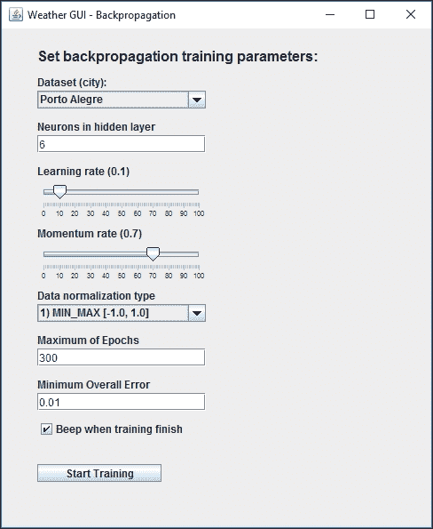

在运行了12次实验后，我们找到了每个数据集的以下MSE训练误差：

| 实验 | 克鲁泽伊罗·多·苏尔 | 皮科斯 | 贾尔多安 | 波尔图·阿雷格里 |
| --- | --- | --- | --- | --- |
| #1 | 0.130156 | 0.147111 | 0.300437 | 0.323342 |
| #2 | 0.512389 | 0.572588 | 0.428692 | 0.478379 |
| #3 | 0.08659 | 0.094822 | 0.124752 | 0.114486 |
| #4 | 0.360728 | 0.258596 | 0.168351 | 0.192012 |
| #5 | 0.076476 | 0.074777 | 0.108991 | 0.085029 |
| #6 | 0.328493 | 0.186793 | 0.152499 | 0.151248 |
| #7 | 0.146801 | 0.130004 | 0.277765 | 0.19076 |
| #8 | 0.431811 | 0.29629 | 0.364418 | 0.278864 |
| #9 | 0.071135 | 0.081159 | 0.117634 | 0.091174 |
| #10 | 0.332534 | 0.210107 | 0.170179 | 0.164179 |
| #11 | 0.07247 | 0.089069 | 0.102137 | 0.076578 |
| #12 | 0.33342 | 0.19835 | 0.155036 | 0.145843 |

MSE误差信息仅给我们一个大致的想法，即神经网络输出在整体背景下与真实数据匹配的程度。这种性能可以通过查看时间序列比较和散点图来验证：

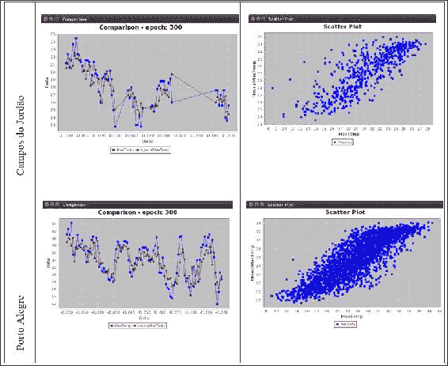

这些图表显示，尽管在许多情况下温度无法准确预测，但总体上正遵循一个趋势。这一点可以通过散点图中可见的相关性得到证实。表中最后一行显示了对于具有亚热带气候和高温变化的Porto Alegre的预测，即使在极端温度变化的情况下，也显示出良好的预测效果。然而，我们提醒读者，预测天气需要考虑许多额外的变量，这些变量由于可用性限制而无法包含在本例中。无论如何，结果表明我们在寻找一个能够超越这些发现的神经网络配置方面已经迈出了良好的开端。

# 摘要

在本章中，我们看到了神经网络应用的一个有趣的实际案例。天气预报一直是研究丰富的领域，实际上神经网络被广泛用于此目的。在本章中，读者还学习了如何为预测问题准备类似的实验。正确应用数据选择和预处理的技术可以在设计神经网络时节省大量时间。本章也为下一章奠定了基础，因为所有下一章都将关注实际案例；因此，在本章学到的概念将在本书的其余部分得到广泛探索。
