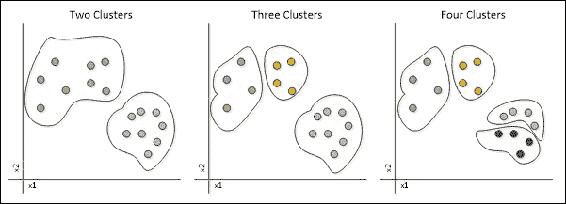
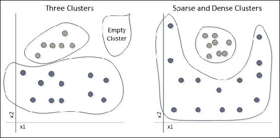
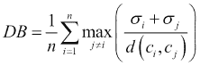
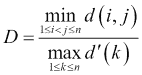
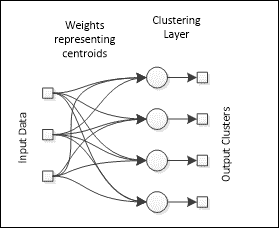
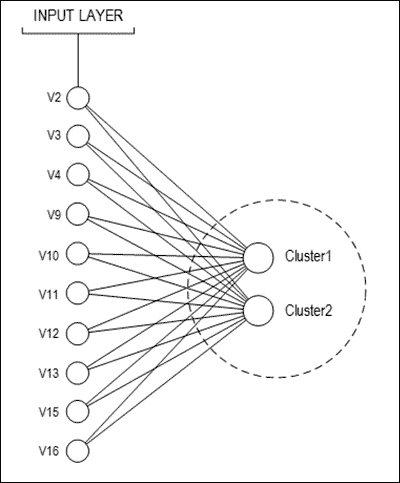
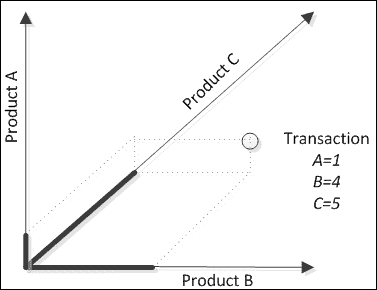

# 第7章. 聚类客户画像

神经网络在应用无监督学习时的一项令人惊叹的能力是它们发现隐藏模式的能力，即使专家也可能毫无头绪。在本章中，我们将通过一个实际应用来探索这一迷人的特性，该应用旨在通过交易数据库中提供的客户和产品聚类来寻找。我们将回顾无监督学习和聚类任务。为了演示这个应用，读者将获得一个关于客户画像及其在Java中实现的实际示例。本章的主题包括：

+   聚类任务

+   聚类分析

+   聚类评估

+   应用无监督学习

+   径向基函数神经网络

+   用于聚类的Kohonen网络

+   处理数据类型

+   客户画像

+   预处理

+   Java实现

+   信用分析和客户画像

# 聚类任务

聚类是数据分析中更广泛任务集的一部分，其目标是把看起来相似、彼此更相似的数据元素分组或归类。聚类任务完全基于无监督学习，因为不需要包含任何目标输出数据来找到聚类；相反，解决方案设计者可以选择他们想要将记录分组的聚类数量，并检查算法对此的反应。

### 小贴士

聚类任务似乎与分类任务重叠，但关键区别在于聚类中不需要在运行聚类算法之前有一个预定义的类别集合。

当几乎没有关于如何将数据分组的信息时，人们可能会希望应用聚类。在提供数据集的情况下，我们希望我们的神经网络能够识别出组和它们的成员。虽然这在二维数据集中看起来很容易且直观，如图所示，但随着维数的增加，这项任务就不再那么简单，需要算法解决方案：



在聚类中，聚类的数量不是由数据决定的，而是由希望聚类数据的分析师决定的。在这里，*边界*与分类任务的边界略有不同，因为它们主要取决于聚类的数量。

## 聚类分析

聚类任务中的一个困难，也是无监督学习任务中的一个困难，是对结果的准确解释。虽然在监督学习中有一个定义明确的目标，我们可以从中推导出误差度量或混淆矩阵，但在无监督学习中，质量的评估完全不同，并且完全依赖于数据本身。验证标准涉及指数，这些指数断言数据在聚类中的分布有多好，以及来自专家的外部意见，这些意见也是质量的一个衡量标准。

### 小贴士

为了说明一个例子，让我们假设一个基于植物特征（大小、叶色、结果实期等）进行聚类任务，而一个神经网络错误地将仙人掌和松树分到了同一个簇中。一个植物学家当然不会支持基于他们在该领域的专业知识，这种分组没有任何意义。

聚类过程中有两个主要问题。一个是某个神经网络的输出永远不会被激活，这意味着一个簇没有任何数据点与之关联。另一个是非线性或稀疏簇的情况，这些簇可能会错误地分成几个簇，而实际上可能只有一个。



## 聚类评估和验证

不幸的是，如果神经网络聚类效果不佳，就需要重新定义簇的数量或进行额外的数据预处理。为了评估聚类数据的好坏，可以应用 Davies-Bouldin 和 Dunn 指数。

Davies-Boudin 指数考虑簇的质心来寻找簇和簇成员之间的簇间和簇内距离：



其中 *n* 是簇的数量，ci 是簇 i 的质心，σi 是簇 *i* 中所有元素的平均距离，而 d(ci,cj) 是簇 *i* 和 *j* 之间的距离。DB 指数的值越小，神经网络在聚类方面的表现越好。

然而，对于密集和稀疏簇，DB 指数不会提供太多有用的信息。这种限制可以通过 Dunn 指数来克服：



其中 *d(i,j)* 是簇 *i* 和 *j* 之间的簇间距离，而 *d'(k)* 是簇 *k* 的簇内距离。在这里，Dunn 指数越高，聚类效果越好，因为尽管簇可能很稀疏，但它们仍然需要被分组在一起，高簇内距离将表示数据分组不良。

## 实现

在 `CompetitiveLearning` 类中，我们将实现以下指标：

```py
public double DBIndex(){
  int numberOfClusters = this.neuralNet.getNumberOfOutputs();
  double sum=0.0;
  for(int i=0;i<numberOfClusters;i++){
    double[] index = new double[numberOfClusters];
    for(int j=0;j<numberOfClusters;j++){
      if(i!=j){
        //calculate the average distance for cluster i
        Double Sigmai=averageDistance(i,trainingDataSet);
        Double Sigmaj=averageDistance(j,trainingDataSet);
        Double[] Centeri=neuralNet.getOutputLayer().getNeuron(i).getWeights();
        Double[] Centerj=neuralNet.getOutputLayer().getNeuron(j).getWeights();
        Double distance = getDistance(Centeri,Centerj);
        index[j]=((Sigmai+Sigmaj)/distance);
      }
    }
    sum+=ArrayOperations.max(index);
  }
  return sum/numberOfClusters;
}

public double Dunn(){
  int numberOfClusters = this.neuralNet.getNumberOfOutputs();
  ArrayList<double> interclusterDistance;
  for(int i=0;i<numberOfClusters;i++){
    for(int j=i+1;j<numberOfClusters;j++){
      interClusterDistance.add(minInterClusterDistance (i,j,trainingDataSet);
    }
  }
  ArrayList<double> intraclusterDistance;
  for(int k=0;k<numberOfClusters;k++){
    intraclusterDistance.add(maxIntraClusterDistance(k, trainingDataSet);
  }
  return ArrayOperations.Min(interclusterDistance)/ ArrayOperations.Max(intraclusterDistance);
}
```

## 外部验证

在某些情况下，聚类已经有了预期的结果，例如植物聚类的例子。这被称为外部验证。可以将无监督学习的神经网络应用于已经分配了值的聚类数据。与分类的主要区别在于，目标输出不被考虑，因此算法本身预期仅基于数据绘制边界线。

# 应用无监督学习

在神经网络中，有许多架构实现了无监督学习；然而，本书的范围将仅涵盖在第 4 章（[第 4 章](ch04.xhtml "第 4 章. 自组织映射"）中开发的 Kohonen 神经网络，*自组织映射*。

## Kohonen 神经网络

Kohonen网络，在[第4章](ch04.xhtml "第4章. 自组织映射")中有所介绍，*自组织映射*现在以修改后的方式被使用。Kohonen可以在一维或二维输出中产生一个形状，但在这里我们感兴趣的是聚类，这可以简化为一维。

### 小贴士

实际上，在这个框架中实现的Kohonen神经网络考虑了零维、一维和二维，其中零表示输出神经元之间没有连接，一表示它们形成一条线，二表示一个网格。对于本章的示例，我们需要一个没有连接输出神经元的Kohonen网络，因此维度将为零。

此外，聚类之间可能有关联也可能无关，因此在本章中可以暂时忽略神经元的邻近性，这意味着只有一个神经元会被激活，而其邻居将保持不变。因此，神经网络将调整其权重以匹配数据到一系列聚类：



训练算法将是竞争学习，其中输出最大的神经元将调整其权重。到训练结束时，神经网络的所有聚类都应被定义。请注意，输出神经元之间没有链接，这意味着输出只有一个活动输入。

# 配置文件

无监督学习中的一个有趣任务是信息的配置文件或聚类，在本章中是客户和产品。给定一个数据集，人们希望找到具有相似特征的记录组。例如，购买相同产品的客户或通常一起购买的产品。这项任务为商业主带来了许多好处，因为他们可以了解他们拥有的客户和产品组，从而能够更准确地针对他们。

## 预处理

如[第6章](ch06.xhtml "第6章. 疾病诊断分类")中所示，*疾病诊断分类*事务数据库可以包含数值数据和分类数据。每当面对一个分类未缩放变量时，我们需要使用`CategoricalDataSet`类将其拆分为变量可能取的值的数量。例如，假设我们有以下客户购买事务列表：

| 交易ID | 客户ID | 产品 | 折扣 | 总计 |
| --- | --- | --- | --- | --- |
| 1399 | 56 | 牛奶，面包，黄油 | 0.00 | 4.30 |
| 1400 | 991 | 干酪，牛奶 | 2.30 | 5.60 |
| 1401 | 406 | 面包，香肠 | 0.00 | 8.80 |
| 1402 | 239 | 奶椒酱，香料 | 0.00 | 6.70 |
| 1403 | 33 | 火鸡 | 0.00 | 4.50 |
| 1404 | 406 | 火鸡，黄油，香料 | 1.00 | 9.00 |

可以很容易地看出，产品是不加缩放的分类数据，并且对于每一笔交易，购买的产品数量是未定义的，客户可能购买一个或多个。为了将此数据集转换为数值数据集，需要进行预处理。对于每个产品，将在数据集中添加一个变量，结果如下：

| 客户 ID | 牛奶 | 面包 | 黄油 | 干酪 | 香肠 | 奇普otle酱 | 调味品 | 火鸡 |
| --- | --- | --- | --- | --- | --- | --- | --- | --- |
| 56 | 1 | 1 | 1 | 0 | 0 | 0 | 0 | 0 |
| 991 | 1 | 0 | 0 | 1 | 0 | 0 | 0 | 0 |
| 406 | 0 | 1 | 1 | 0 | 1 | 0 | 1 | 1 |
| 239 | 0 | 0 | 0 | 0 | 0 | 1 | 1 | 0 |
| 33 | 0 | 0 | 0 | 0 | 0 | 0 | 0 | 1 |

为了节省空间，我们忽略了数值变量，并考虑客户购买的产品存在与否作为 *1* 和 *0*。另一种预处理可能考虑值的出现次数，因此不再二进制，而是离散的。

## Java实现

在本章中，我们将探讨将Kohonen神经网络应用于基于从Proben1（卡片数据集）收集的客户信息的客户聚类。

## 卡片 – 信用分析用于客户画像

卡片数据集总共由16个变量组成。其中15个是输入，1个是输出。出于安全考虑，所有变量名都已更改为无意义的符号。此数据集带来了各种变量类型的良好混合（连续型、具有少量值的分类型，以及具有更多值的分类型）。以下表格显示了数据的摘要：

| 变量 | 类型 | 值 |
| --- | --- | --- |
| V1 | 输出 | 0; 1 |
| V2 | 输入 #1 | b, a |
| V3 | 输入 #2 | 连续 |
| V4 | 输入 #3 | 连续 |
| V5 | 输入 #4 | u, y, l, t. |
| V6 | 输入 #5 | g, p, gg |
| V7 | 输入 #6 | c, d, cc, i, j, k, m, r, q, w, x, e, aa, ff |
| V8 | 输入 #7 | v, h, bb, j, n, z, dd, ff, o |
| V9 | 输入 #8 | 连续 |
| V10 | 输入 #9 | t, f |
| V11 | 输入 #10 | t, f |
| V12 | 输入 #11 | 连续 |
| V13 | 输入 #12 | t, f |
| V14 | 输入 #13 | g, p, s |
| V15 | 输入 #14 | 连续 |
| V16 | 输入 #15 | 连续 |

为了简化，我们没有使用输入 *v5-v8* 和 *v14*，以避免过多地增加输入数量。我们应用了以下转换：

| 变量 | 类型 | 值 | 转换 |
| --- | --- | --- | --- |
| V1 | 输出 | 0; 1 | - |
| V2 | 输入 #1 | b, a | b = 1, a = 0 |
| V3 | 输入 #2 | 连续 | - |
| V4 | 输入 #3 | 连续 | - |
| V9 | 输入 #8 | 连续 | - |
| V10 | 输入 #9 | t, f | t = 1, f = 0 |
| V11 | 输入 #10 | t, f | t = 1, f = 0 |
| V12 | 输入 #11 | 连续 | - |
| V13 | 输入 #12 | t, f | t = 1, f = 0 |
| V15 | 输入 #14 | 连续 | - |
| V16 | 输入 #15 | 连续 | - |

提出的神经网络拓扑结构如下所示：



存储的示例数量为690个，但其中37个示例存在缺失值。这37条记录被丢弃。因此，使用了653个示例来训练和测试神经网络。数据集的划分如下：

+   **训练**: 583条记录

+   **测试**: 70条记录

用于聚类相似行为的Kohonen训练算法依赖于一些参数，例如：

+   归一化类型

+   学习率

需要考虑的是，Kohonen训练算法是无监督的。因此，当输出未知时使用此算法。在卡片示例中，数据集中有输出值，它们将在这里仅用于验证聚类。但在传统的聚类情况下，输出值是不可用的。

在这个特定案例中，因为输出是已知的，作为分类，聚类质量可以通过以下方式来验证：

+   敏感性（真阳性率）

+   特异性（真阴性率）

+   总准确率

在Java项目中，这些值的计算是通过一个名为`NeuralOutputData`的类来完成的，该类是在[第6章](ch06.xhtml "第6章。疾病诊断分类")，*疾病诊断分类*中之前开发的。

进行多次实验以尝试找到最佳的神经网络来聚类客户档案是一种好的做法。将生成10个不同的实验，并且每个实验都将使用之前提到的质量率进行分析。以下表格总结了将遵循的策略：

| 实验 | 学习率 | 归一化类型 |
| --- | --- | --- |
| #1 | 0.1 | MIN_MAX |
| #2 | Z_SCORE |
| #3 | 0.3 | MIN_MAX |
| #4 | Z_SCORE |
| #5 | 0.5 | MIN_MAX |
| #6 | Z_SCORE |
| #7 | 0.7 | MIN_MAX |
| #8 | Z_SCORE |
| #9 | 0.9 | MIN_MAX |
| #10 | Z_SCORE |

创建`ClusterExamples`类是为了运行每个实验。除了在[第4章](ch04.xhtml "第4章。自组织映射")中处理数据，*自组织映射*还解释了如何创建Kohonen网络以及如何通过欧几里得距离算法对其进行训练。

以下代码片段展示了其部分实现：

```py
// enter neural net parameter via keyboard (omitted)

// load dataset from external file (omitted)

// data normalization (omitted)

// create ANN and define parameters to TRAIN:
CompetitiveLearning cl = new CompetitiveLearning(kn1, neuralDataSetToTrain, LearningAlgorithm.LearningMode.ONLINE);
  cl.show2DData=false;
  cl.printTraining=false;
  cl.setLearningRate( typedLearningRate );
  cl.setMaxEpochs( typedEpochs );
  cl.setReferenceEpoch( 200 );
  cl.setTestingDataSet(neuralDataSetToTest);

// train ANN
try {
System.out.println("Training neural net... Please, wait...");
  cl.train();
  System.out.println("Winner neurons (clustering result [TRAIN]):");
  System.out.println( Arrays.toString( cl.getIndexWinnerNeuronTrain() ) );

} catch (NeuralException ne) {
  ne.printStackTrace();
}
```

在使用`ClusteringExamples`类运行每个实验并保存混淆矩阵和总准确率后，可以观察到实验#4、#6、#8和#10具有相同的混淆矩阵和准确率。这些实验使用了z-score来归一化数据：

| 实验 | 混淆矩阵 | 总准确率 |
| --- | --- | --- |
| #1 | [[14.0, 21.0][18.0, 17.0]] | 44.28% |
| #2 | [[11.0, 24.0][34.0, 1.0]] | 17.14% |
| #3 | [[21.0, 14.0][17.0, 18.0]] | 55.71% |
| #4 | [[24.0, 11.0][1.0, 34.0]] | 82.85% |
| #5 | [[21.0, 14.0][17.0, 18.0]] | 55.71% |
| #6 | [[24.0, 11.0][1.0, 34.0]] | 82.85% |
| #7 | [[8.0, 27.0][7.0, 28.0]] | 51.42% |
| #8 | [[24.0, 11.0][1.0, 34.0]] | 82.85% |
| #9 | [[27.0, 8.0][28.0, 7.0]] | 48.57% |
| #10 | [[24.0, 11.0][1.0, 34.0]] | 82.85% |

因此，实验#4、#6、#8或#10构建的神经网络可能被用来达到超过80%的准确率以进行客户财务聚类。

## 产品分析

使用代码提供的交易数据库，我们已将大约650笔购买交易编译成一个大的矩阵交易 *x* 产品，其中每个单元格中都有对应交易中购买的相应产品的数量：

| #Trns. | Prd.1 | Prd.2 | Prd.3 | Prd.4 | Prd.5 | Prd.6 | Prd.7 | … | Prd.N |
| --- | --- | --- | --- | --- | --- | --- | --- | --- | --- |
| 1 | 56 | 0 | 0 | 3 | 2 | 0 | 0 | … | 0 |
| 2 | 0 | 0 | 40 | 0 | 7 | 0 | 19 | … | 0 |
| … | … | … | … | … | … | … | … | … | … |
| n | 0 | 0 | 0 | 0 | 0 | 0 | 0 | … | 1 |

让我们考虑这个矩阵是在一个 N 维超空间中的表示，每个产品作为一个维度，交易作为点。为了简单起见，让我们考虑一个三维的例子。一个给定的交易将每个产品的购买数量放置在每个维度的对应点上。



策略是聚类这些交易，以找到哪些产品通常一起购买。因此，我们将使用 Kohonen 神经网络来找到产品簇中心的定位。

我们的数据库由一家服装店和27个注册产品的样本组成：

| 1 长裙 A | 19 带拉链的整体 | 43 百慕大 M |
| --- | --- | --- |
| 3 长裙 B | 22 肩部整体 | 48 条纹裙 |
| 7 短裙 A | 23 长印花裙 | 67 无袖衫肩带 |
| 8 印花裙 | 24 印花短裙 | 68 牛仔裤 M |
| 9 女士无袖衫 | 28 短裤 M | 69 XL 短裙 |
| 13 短裤 S | 31 无袖短裙 | 74 条纹无袖衫 S |
| 16 儿童整体 | 32 短裙肩部 | 75 条纹无袖衫 M |
| 17 短裤 | 34 短裙 B | 76 条纹无袖衫 L |
| 18 印花整体 | 42 两件套上衣 | 106 直筒裙 |

## 有多少个簇？

有时在聚类算法中确定要找到多少个簇可能很困难。确定最佳选择的某些方法包括信息准则，如 **赤池信息准则** (**AIC**), **贝叶斯信息准则** (**BIC**), 以及从中心到数据的马氏距离。我们建议读者如果对这些准则的更多细节感兴趣，请查阅参考文献。

为了对产品进行测试，我们也应该使用 `ClusteringExamples` 类。为了简单起见，我们使用三个和五个簇进行测试。对于每个实验，epoch 数为 *1000*，学习率为 *0.5*，归一化类型为 `MIN_MAX (-1; 1)`。一些结果如下表所示：

| 簇数量 | 前十五个元素组成的簇 | 购买产品总和 |
| --- | --- | --- |
| 3 | 0, 1, 2, 2, 2,2, 2, 2, 2, 2,2, 2, 0, 0, 2, | 973, 585, 11, 5, 2,4, 11, 6, 3, 2,2, 2, 669, 672, 7, |
| 5 | 0, 1, 4, 4, 4,4, 4, 4, 4, 4,4, 4, 0, 0, 4, | 973, 585, 11, 5, 2,4, 11, 6, 3, 2,2, 2, 669, 672, 7, |

观察前表，我们注意到当产品组合的总和超过600时，它们会聚集在一起。否则，当总和在500到599之间时，会形成另一个簇。最后，如果总和较低，会创建一个大簇，因为数据集由许多客户购买不超过20件商品的案例组成。

### 小贴士

如前一章所建议，我们建议您探索`ClusteringExamples`类，并创建一个GUI以轻松选择神经网络参数。您应该尝试通过继承概念重用代码。

另一个技巧是进一步探索产品特征示例：调整神经网络训练参数、簇的数量，或者开发其他分析聚类结果的方法。

# 摘要

在本章中，我们展示了使用Kohonen神经网络的客户特征应用。与分类任务不同，聚类任务不考虑对所需输出的先前知识；相反，希望神经网络找到簇。然而，我们已经看到验证技术可能包括外部验证，这可以与所谓的*目标输出*进行比较。客户特征分析很重要，因为它为业务所有者提供了关于客户更准确和干净的信息，没有*人为干预*指出哪些客户属于某个群体或另一个群体，正如在监督学习中发生的那样。这就是无监督学习的优势，使数据能够完全自行得出结果。
