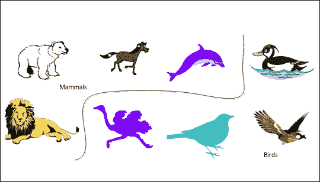
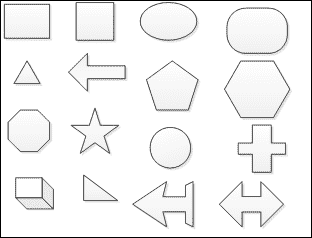
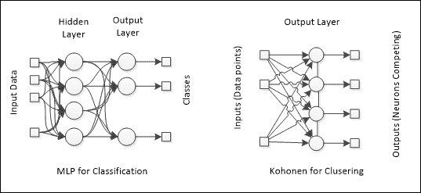
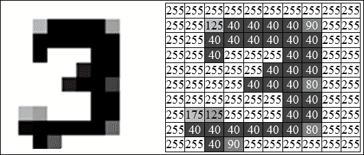
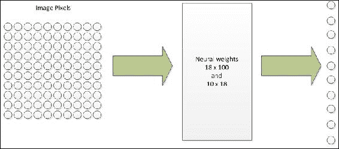
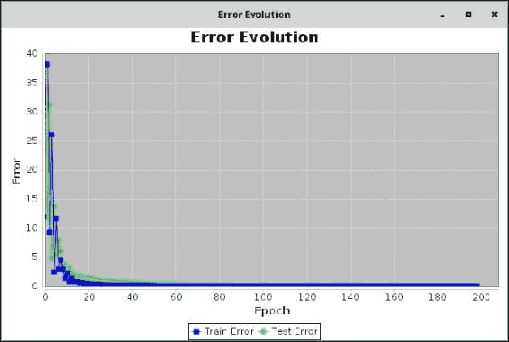
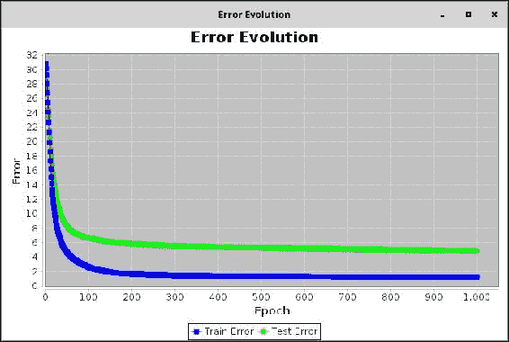

# 第8章 文本识别

我们都知道人类阅读和识别图像的速度比任何超级计算机都快。然而，到目前为止，我们已经看到神经网络在监督学习和非监督学习两种方式下都表现出惊人的学习能力。在本章中，我们提出了一个涉及光学字符识别示例的额外模式识别案例。神经网络可以被训练来严格识别图像文件中写下的数字。本章的主题包括：

+   模式识别

+   定义好的类

+   未定义的类

+   模式识别中的神经网络

+   MLP

+   OCR问题

+   预处理和类定义

+   Java实现

+   数字识别

# 模式识别

模式是一组看起来彼此相似的数据和元素，它们可以系统地发生并时不时地重复。这是一个可以通过聚类进行无监督学习解决的问题；然而，当存在标记数据或数据有定义好的类别时，这个问题可以通过监督方法解决。我们作为人类，比我们想象的更经常地执行这个任务。当我们看到物体并将它们识别为属于某个类别时，我们实际上是在识别一个模式。此外，当我们分析图表、离散事件和时间序列时，我们可能会发现某些事件序列在特定条件下系统性地重复的证据。总之，模式可以通过数据观察来学习。

模式识别任务的例子包括但不限于：

+   形状识别

+   物体分类

+   行为聚类

+   语音识别

+   OCR

+   化学反应分类法

## 定义好的类

在一个为特定领域预定义的类列表中，每个类都被视为一个模式；因此，每个数据记录或发生的事件都被分配了这些预定义类中的一个。

### 小贴士

类的预定义通常可以由专家执行或基于应用领域的先前知识。此外，当我们希望数据严格分类到预定义的类别之一时，我们希望应用定义好的类。

一个使用定义好的类的模式识别示例是图像中的动物识别，如图下所示。然而，模式识别器应该被训练来捕捉所有正式定义类的特征。在示例中，展示了八种动物图像，属于两个类别：哺乳动物和鸟类。由于这是一个监督学习模式，神经网络应该提供足够多的图像，以便它能够正确地分类新的图像。



当然，有时分类可能会失败，主要是因为图像中可能被神经网络捕捉到的相似隐藏模式，以及形状中存在的小细节。例如，海豚有鳍，但它仍然是一种哺乳动物。有时，为了获得更准确的分类，有必要应用预处理并确保神经网络将接收允许进行分类的适当数据。

## 未定义的类

当数据未标记且没有预定义的类别集时，这是一个无监督学习场景。形状识别是一个很好的例子，因为形状可能是灵活的，并且具有无限数量的边、顶点或绑定。



在上面的图像中，我们可以看到一些形状，我们想要将它们排列，以便相似的形状可以分组到同一个簇中。基于图像中存在的形状信息，模式识别器很可能会将矩形、正方形和三角形分类到同一个组。然而，如果信息以图形的形式呈现给模式识别器，而不是图像，而是带有边和顶点坐标的图形，分类可能会略有变化。

总结来说，模式识别任务可能使用监督学习和无监督学习模式，这基本上取决于识别的目标。

# 模式识别中的神经网络

对于模式识别，可以应用的神经网络架构有MLPs（监督学习）和Kohonen网络（无监督学习）。在第一种情况下，问题应设置为一个分类问题，即数据应转换为*X-Y*数据集，其中对于*X*中的每个数据记录，在*Y*中应有相应的类别。如[第3章](ch03.xhtml "第3章。感知器和监督学习")中所述，*感知器和监督学习*和[第6章](ch06.xhtml "第6章。疾病诊断分类")中所述，*疾病诊断分类*，对于分类问题，神经网络的输出应包含所有可能的类别，这可能需要预处理输出记录。

对于其他情况，无监督学习，不需要对输出应用标签，但输入数据应该适当结构化。为了提醒您，以下图中展示了两种神经网络的架构：



## 数据预处理

如前所述，在[第6章](ch06.xhtml "第6章。疾病诊断分类")中，*疾病诊断分类*和[第7章](ch07.xhtml "第7章。客户档案聚类")中，*客户档案聚类*，我们必须处理所有可能类型的数据，即数值（连续和离散）和分类（有序或未缩放的）。

然而，在这里我们有在多媒体内容上执行模式识别的可能性，例如图像和视频。那么，多媒体能否被处理？这个问题的答案在于这些内容在文件中的存储方式。例如，图像是用称为像素的小彩色点表示的。每种颜色都可以用RGB表示法编码，其中红色、绿色和蓝色的强度定义了人眼能看到的所有颜色。因此，一个100x100像素的图像将会有10,000个像素，每个像素有红色、绿色和蓝色的三个值，总共30,000个点。这就是神经网络中图像处理的挑战。

一些方法，我们将在下一章中回顾，可以减少这个巨大的维度数。之后，图像可以被视为一个由数值连续值组成的大矩阵。

为了简化，我们将在本章中仅应用小尺寸的灰度图像。

## 文本识别（光学字符识别）

许多文档现在正被扫描并存储为图像，这使得将文档转换回文本成为必要，以便计算机应用编辑和文本处理。然而，这一功能涉及许多挑战：

+   文本字体的多样性

+   文本大小

+   图像噪声

+   手稿

尽管如此，人类可以轻松地解释和阅读即使在质量较差的图像中产生的文本。这可以解释为人类已经熟悉文本字符和他们的语言中的单词。某种方式，算法必须熟悉这些元素（字符、数字、信号等），以便在图像中成功识别文本。

## 数字识别

尽管市场上有很多OCR工具，但算法正确识别图像中的文本仍然是一个巨大的挑战。因此，我们将限制我们的应用在一个更小的领域，这样我们会面临更简单的问题。因此，在本章中，我们将实现一个神经网络来识别图像上表示的0到9的数字。此外，为了简化，图像将具有标准化的和小尺寸。

## 数字表示

我们在灰度图像中应用了标准的10x10（100像素）尺寸，每个图像有100个灰度值：



在前面的图像中，我们有一个表示左侧数字3的草图以及对应相同数字的灰度值矩阵，以灰度形式呈现。

我们应用这种预处理是为了在这个应用中表示所有十个数字。

## Java实现

为了识别光学字符，我们产生了用于训练和测试神经网络的训练数据。在这个例子中，考虑了从0（超级黑色）到255（超级白色）的数字。根据像素分布，为每个数字数据创建了两个版本：一个用于训练，另一个用于测试。这里将使用第3章中介绍的分类技术，*感知器和监督学习*和第6章中介绍的分类技术，*疾病诊断分类*。

## 生成数据

使用Microsoft Paint®绘制了从零到九的数字。这些图像已被转换为矩阵，以下图像显示了其中的一些示例。所有介于零到九之间的像素值都是灰度值：


对于每个数字，我们生成了五个变体，其中一个是完美的数字，其余的包含噪声，无论是通过绘制还是通过图像质量。

将每个矩阵行合并成向量（D[train]和D[test]），形成用于训练和测试神经网络的模式。因此，神经网络的输入层将由101个神经元组成。

输出数据集由十个模式表示。每个模式都有一个更具有表达力的值（一个）其余的值都是零。因此，神经网络的输出层将有十个神经元。

## 神经网络架构

因此，在这个应用中，我们的神经网络将有100个输入（对于10x10像素大小的图像）和十个输出，隐藏神经元的数量不受限制。我们在包examples.chapter08中创建了一个名为`DigitExample`的类来处理这个应用。神经网络架构是根据以下参数选择的：

+   **神经网络类型**：MLP

+   **训练算法**：反向传播

+   **隐藏层数量**：1

+   **隐藏层中的神经元数量**：18

+   **迭代次数**：1000

+   **最小总体误差**：0.001



## 实验

现在，就像之前展示的其他情况一样，让我们找到最佳神经网络拓扑结构，通过训练多个网络来实现。实现这一目标的策略总结在下表中：

| 实验 | 学习率 | 激活函数 |
| --- | --- | --- |
| #1 | 0.3 | 隐藏层：SIGLOG |
| 输出层：LINEAR |
| #2 | 0.5 | 隐藏层：SIGLOG |
| 输出层：LINEAR |
| #3 | 0.8 | 隐藏层：SIGLOG |
| 输出层：LINEAR |
| #4 | 0.3 | 隐藏层：HYPERTAN |
| 输出层：LINEAR |
| #5 | 0.5 | 隐藏层：SIGLOG |
| 输出层：LINEAR |
| #6 | 0.8 | 隐藏层：SIGLOG |
| 输出层：LINEAR |
| #7 | 0.3 | 隐藏层：HYPERTAN |
| 输出层：SIGLOG |
| #8 | 0.5 | 隐藏层：HYPERTAN |
| 输出层：SIGLOG |
| #9 | 0.8 | 隐藏层：HYPERTAN |
| 输出层：SIGLOG |

以下`DigitExample`类代码定义了如何创建一个从数字数据读取的神经网络：

```py
// enter neural net parameter via keyboard (omitted)

// load dataset from external file (omitted)

// data normalization (omitted)

// create ANN and define parameters to TRAIN: 
Backpropagation backprop = new Backpropagation(nn, neuralDataSetToTrain, LearningAlgorithm.LearningMode.BATCH);
backprop.setLearningRate( typedLearningRate );
backprop.setMaxEpochs( typedEpochs );
backprop.setGeneralErrorMeasurement(Backpropagation.ErrorMeasurement.SimpleError);
backprop.setOverallErrorMeasurement(Backpropagation.ErrorMeasurement.MSE);
backprop.setMinOverallError(0.001);
backprop.setMomentumRate(0.7);
backprop.setTestingDataSet(neuralDataSetToTest);
backprop.printTraining = true;
backprop.showPlotError = true;

// train ANN:
try {
    backprop.forward();
    //neuralDataSetToTrain.printNeuralOutput();

    backprop.train();
    System.out.println("End of training");
    if (backprop.getMinOverallError() >= backprop.getOverallGeneralError()) {
        System.out.println("Training successful!");
    } else {
        System.out.println("Training was unsuccessful");
    }
    System.out.println("Overall Error:" + String.valueOf(backprop.getOverallGeneralError()));
    System.out.println("Min Overall Error:" + String.valueOf(backprop.getMinOverallError()));
    System.out.println("Epochs of training:" + String.valueOf(backprop.getEpoch()));

} catch (NeuralException ne) {
    ne.printStackTrace();
} 

// test ANN (omitted)
```

## 结果

在使用`DigitExample`类运行每个实验后，除了使用测试数据（上表）排除训练和测试总体误差以及正确数字分类的数量外，可以观察到实验 #2 和 #4 具有最低的MSE值。这两个实验之间的区别在于输出层使用的学习率和激活函数。

| 实验 | 训练总体误差 | 测试总体误差 | 正确数字分类数量 |
| --- | --- | --- | --- |
| #1 | 9.99918E-4 | 0.01221 | 2 x 10 |
| **#2** | **9.99384E-4** | **0.00140** | **5 x 10** |
| #3 | 9.85974E-4 | 0.00621 | 4 x 10 |
| #4 | 9.83387E-4 | 0.02491 | 3 x 10 |
| #5 | 9.99349E-4 | 0.00382 | 3 x 10 |
| #6 | 273.70 | 319.74 | 2 x 10 |
| #7 | 1.32070 | 6.35136 | 5 x 10 |
| **#8** | **1.24012** | **4.87290** | **7 x 10** |
| #9 | 1.51045 | 4.35602 | 3 x 10 |

上图显示了通过实验 #2 图形化地展示了每个epoch的均方误差（MSE）演变（训练和测试）。值得注意的是，曲线在第30个epoch附近稳定：



对实验 #8 也进行了相同的图形分析。可以检查到MSE曲线在第200个epoch附近稳定。



如前所述，仅MSE值可能不足以证明神经网络的质量。因此，测试数据集已验证了神经网络的泛化能力。下表显示了实验 #2 和 #8 的实际输出（含噪声）与神经网络估计输出的比较。可以得出结论，实验 #8 的神经网络权重比 #2 的更能识别七个数字模式：

| **输出比较** |
| --- |
| **实际输出（测试数据集）** | **数字** |
| 0.0 0.0 0.0 0.0 0.0 0.0 0.0 0.0 0.0 1.0 0.0 0.0 0.0 0.0 0.0 0.0 0.0 0.0 1.0 0.0 0.0 0.0 0.0 0.0 0.0 0.0 1.0 0.0 0.0 0.0 0.0 0.0 1.0 0.0 0.0 0.0 0.0 1.0 0.0 0.0 0.0 0.0 0.0 0.0 0.0 0.0 0.0 0.0 0.0 0.0 1.0 0.0 0.0 0.0 0.0 0.0 0.0 0.0 0.0 0.0 0.0 1.0 0.0 0.0 0.0 0.0 0.0 0.0 0.0 0.0 0.0 0.0 1.0 0.0 0.0 0.0 0.0 0.0 0.0 0.0 0.0 0.0 0.0 1.0 0.0 0.0 0.0 0.0 0.0 0.0 0.0 0.0 0.0 0.0 | 0123456789 |
| **估计输出（测试数据集）- 实验 #2** | **数字** |
| 0.20 0.26 0.09 -0.09 0.39 0.24 0.35 0.30 0.24 1.02 0.42 -0.23 0.39 0.06 0.11 0.16 0.43 0.25 0.17 -0.26 0.51 0.84 -0.17 0.02 0.16 0.27 -0.15 0.14 -0.34 -0.12 -0.20 -0.05 -0.58 0.20 -0.16 0.27 0.83 -0.56 0.42 0.35 0.24 0.05 0.72 -0.05 -0.25 -0.38 -0.33 0.66 0.05 -0.63 0.08 0.41 -0.21 0.41 0.59 -0.12 -0.54 0.27 0.38 0.00 -0.76 -0.35 -0.09 1.25 -0.78 0.55 -0.22 0.61 0.51 0.27 -0.15 0.11 0.54 -0.53 0.55 0.17 0.09 -0.72 0.03 0.12 0.03 0.41 0.49 -0.44 -0.01 0.05 -0.05 -0.03 -0.32 -0.30 0.63 -0.47 -0.15 0.17 0.38 -0.24 0.58 0.07 -0.16 0.54 | 0 (OK)1 (ERR)2 (ERR)3 (OK)4 (ERR)5 (OK)6 (OK)7 (ERR)8 (ERR)9 (OK) |
| **估计输出（测试数据集）- 实验 #8** | **数字** |
| 0.10 0.10 0.12 0.10 0.12 0.13 0.13 0.26 0.17 0.39 0.13 0.10 0.11 0.10 0.11 0.10 0.29 0.23 0.32 0.10 0.26 0.38 0.10 0.10 0.12 0.10 0.10 0.17 0.10 0.10 0.10 0.10 0.17 0.39 0.10 0.38 0.10 0.15 0.10 0.24 0.10 0.10 0.10 0.10 0.39 0.37 0.10 0.20 0.12 0.10 0.10 0.37 0.10 0.10 0.10 0.10 0.10 0.10 0.10 0.10 0.39 0.10 0.10 0.10 0.28 0.10 0.27 0.11 0.10 0.21 | 0 (OK)1 (OK)2 (OK)3 (ERR)4 (OK)5 (ERR)6 (OK)7 (OK)8 (ERR)9 (OK) |

### 小贴士

本章中展示的实验已经考虑了10x10像素信息图像。我们建议你尝试使用20x20像素的数据集来构建一个能够分类这种尺寸数字图像的神经网络。

你还应该更改神经网络的训练参数以实现更好的分类。

# 摘要

在本章中，我们看到了神经网络在识别图像中0到9数字的强大能力。尽管在10x10的图像中数字的编码非常小，但在实践中理解这一概念是很重要的。神经网络能够从数据中学习，并且只要现实世界的表示可以转化为数据，考虑字符识别可以作为模式识别应用的一个非常好的例子是合理的。这里的应用可以扩展到任何类型的字符，前提是神经网络都应该展示预定义的字符。
