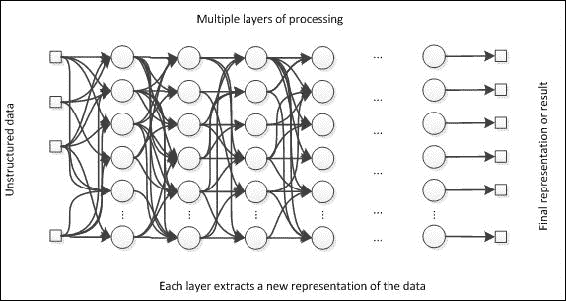
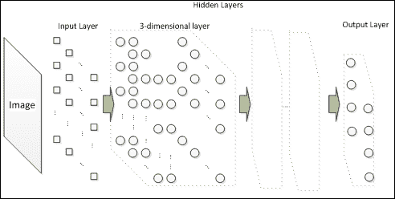
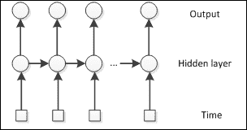
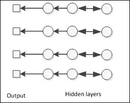
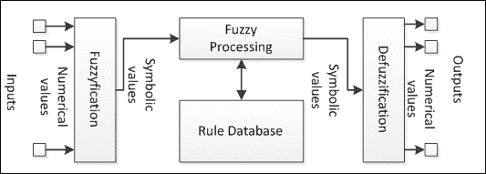
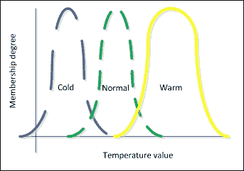
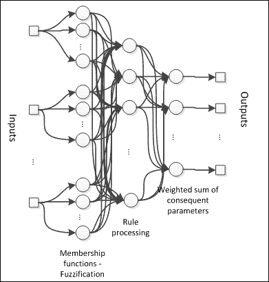
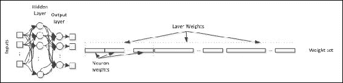
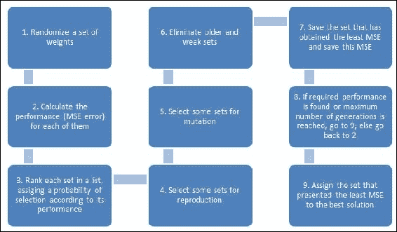

# 第10章：神经网络当前趋势

本章向读者展示了神经网络领域的最新趋势。尽管本书是入门级的，但了解最新的发展以及这一理论背后的科学走向总是很有用的。最新的进展之一是所谓的**深度学习**，这是许多数据科学家非常受欢迎的研究领域；这一类型的网络在本章中有所概述。卷积和认知架构也属于这一趋势，并在多媒体数据识别方面越来越受欢迎。结合不同架构的混合系统是解决更复杂问题以及涉及分析、数据可视化等应用的一种非常有趣的策略。由于更偏向理论，这些架构并没有实际的实现，尽管提供了一个混合系统实现的例子。本章涵盖的主题包括：

+   深度学习

+   卷积神经网络

+   长短期记忆网络

+   混合系统

+   神经模糊

+   神经遗传学

+   混合神经网络的实现

# 深度学习

神经网络领域最新的进展之一是所谓的深度学习。如今，如果不提及深度学习，几乎不可能谈论神经网络，因为最近在特征提取、数据表示和转换方面的研究已经发现，许多层的处理信息能够抽象并产生更好的数据表示以供学习。贯穿本书，我们看到了神经网络需要以数值形式输入数据，无论原始数据是分类的还是二元的，神经网络不能直接处理非数值数据。但现实世界中的大多数数据是非数值的，甚至是未结构化的，如图像、视频、音频、文本等。

在这种意义上，一个深度网络将会有许多层，这些层可以作为数据处理单元来转换这些数据，并将其提供给下一层以进行后续的数据处理。这与大脑中发生的过程类似，从神经末梢到认知核心；在这个漫长的过程中，信号被多层处理，最终产生控制人体的信号。目前，大多数深度学习研究集中在非结构化数据处理上，尤其是图像和声音识别以及自然语言处理。

### 小贴士

深度学习仍在发展中，自2012年以来已经发生了很大的变化。像谷歌和微软这样的大公司都有研究这个领域的团队，未来几年可能会有很多变化。

下一个图中展示了深度学习架构的方案：



另一方面，深度神经网络存在一些需要克服的问题。主要问题是过拟合。产生数据新表示的许多层对训练数据非常敏感，因为信号在神经网络层中的深度越深，对输入数据的转换就越具体。正则化方法和剪枝通常被用来防止过拟合。计算时间是训练深度网络时的另一个常见问题。标准的反向传播算法训练深度神经网络可能需要非常长的时间，尽管选择较小的训练数据集等策略可以加快训练时间。此外，为了训练深度神经网络，通常建议使用更快的机器并将训练尽可能并行化。

# 深度架构

虽然它们通常是前馈的，但存在各种具有前馈和反馈流的深度神经网络架构。主要架构包括但不限于：

**卷积神经网络**

在这个架构中，层可能具有多维组织。受到动物视觉皮层的启发，应用于层的典型维度是三维的。在**卷积神经网络**（**CNNs**）中，前一层的部分信号被输入到下一层中的一些神经元。这种架构是前馈的，非常适合图像和声音识别。这种架构与多层感知器的主要区别在于层之间的部分连接性。考虑到并非所有神经元都对下一层的某个神经元相关，连接性是局部的，并尊重神经元之间的相关性。这既防止了长时间训练，也防止了过拟合，因为当图像的维度增长时，完全连接的MLP会爆炸性地增加权重的数量。此外，层的神经元在维度上排列，通常是三维的，因此以宽度、高度和深度堆叠成数组。



在这种架构中，层可能具有多维组织。受动物视觉皮层的启发，应用于层的典型维度是三维的。在**卷积神经网络**（CNNs）中，前一层的部分信号被输入到下一层中的一些神经元。这种架构是前馈的，并且适用于图像和声音识别。这种架构与多层感知器的主要区别在于层之间的部分连接性。考虑到并非所有神经元都对下一层的某个神经元都相关，连接是局部的，并尊重神经元之间的相关性。这防止了长时间训练和过拟合，因为如果是一个全连接的MLP，随着图像维度的增长，权重数量会爆炸。此外，层的神经元在维度上排列，通常是三维的，因此以宽度、高度和深度堆叠在数组中。

**长短期记忆**：这是一种循环神经网络，它始终考虑隐藏层的最后一个值，就像一个**隐藏马尔可夫模型**（HMM）。**长短期记忆网络**（LSTM）使用LSTM单元而不是传统神经元，这些单元执行存储和忘记值等操作，以控制深度网络中的流动。这种架构由于能够保留长时间的信息，同时接收完全无结构的音频或文本文件等数据，因此在自然语言处理中得到了很好的应用。训练这种类型网络的一种方法是时间反向传播（BPTT）算法，但还有其他算法，如强化学习或进化策略。



**深度信念网络**：**深度信念网络**（DBN's）是一种概率模型，其中层被分类为可见和隐藏。这也是一种基于**受限玻尔兹曼机**（RBM）的循环神经网络。它通常用作**深度神经网络**（DNN）训练的第一步，然后通过其他监督算法如反向传播进一步训练。在这个架构中，每一层都像一个特征检测器，抽象出数据的新表示。可见层既作为输出也作为输入，最深层的隐藏层代表最高层次的抽象。这种架构的应用通常与卷积神经网络相同。



## 如何在Java中实现深度学习

由于这本书是入门级的，我们在这个章节中不会深入探讨深度学习的细节。然而，提供了一些关于深度架构的代码推荐。这里提供了一个关于卷积神经网络如何实现的例子。需要实现一个名为`ConvolutionalLayer`的类来表示多维层，以及一个名为`CNN`的类来表示卷积神经网络本身：

```py
public class ConvolutionalLayer extends NeuralLayer{
  int height,width, depth;
//…
  ArrayList<ArrayList<ArrayList<Neuron>>> neurons;
  Map<Neuron,Neuron> connections;
  ConvolutionalLayer previousLayer;

  //the method call should take into account the mapping 
  // between neurons from different layers
  @Override
  public void calc(){
    ArrayList<ArrayList<ArrayList<double>>> inputs;
    foreach(Neuron n:neurons){
      foreach(Neuron m:connections.keySet()){ 
  // here we get only the inputs that are connected to the neuron

      }
    }
  }

}

public class CNN : NeuralNet{
  int depth;
  ArrayList<ConvolutionalLayer> layers;
//…
  @Override
  public void calc(){
    //here we perform the calculation for each layer, 
    //taking into account the connections between layers
  }
}
```

在这个类中，神经元按维度和组织，并使用剪枝方法来使层之间的连接。请参阅文件`ConvolutionalLayer.java`和`CNN.java`以获取更多详细信息。

由于其他架构是循环的，而本书没有涵盖循环神经网络（为了入门书籍的简洁性），它们仅提供供读者参考。我们建议读者查看提供的参考文献，以了解更多关于这些架构的信息。

### 混合系统

在机器学习或甚至人工智能领域，除了神经网络之外，还有许多其他算法和技术。每种技术都有其优势和劣势，这激励了许多研究人员将它们结合成一个单一的结构。神经网络是人工智能连接主义方法的一部分，其中操作是在数值和连续值上进行的；但还有其他方法，包括认知（基于规则的系统）和进化计算。

| 连接主义 | 认知 | 进化 |
| --- | --- | --- |
| 数值处理 | 符号处理 | 数值和符号处理 |
| 大型网络结构 | 大型规则库和前提 | 大量解决方案 |
| 通过统计进行性能 | 通过专家/统计进行设计 | 每次迭代产生更好的解决方案 |
| 对数据高度敏感 | 对理论高度敏感 | 局部最小值证明 |

```py
Neuro-fuzzy
```

模糊逻辑是一种基于规则的加工方式，其中每个变量都根据隶属函数转换为符号值，然后所有变量的组合将针对一个*IF-THEN*规则数据库进行查询。



隶属函数通常具有高斯钟形形状，这告诉我们给定值属于该类有多少程度。以温度为例，它可能具有三个不同的类别（冷、正常和暖）。隶属值将随着温度越接近钟形中心而越高。



此外，模糊处理找出每个输入记录触发的规则以及产生的输出值。神经模糊架构对每个输入的处理方式不同，因此第一个隐藏层有一组神经元对应于每个隶属函数：



### 提示

在这个架构中，训练仅找到规则处理和后续参数加权的最优权重，第一隐藏层没有可调整的权重。

在模糊逻辑架构中，专家定义了一个规则数据库，随着变量数量的增加，这个数据库可能会变得很大。神经模糊架构释放了设计者定义规则的需求，并让神经网络来完成这项任务。神经模糊的训练可以通过梯度类型算法，如反向传播或矩阵代数，如最小二乘法，在监督模式下进行。神经模糊系统适用于动态系统的控制和诊断。

## 神经遗传

在进化人工智能方法中，一种常见的策略是遗传算法。这个名字的灵感来源于自然进化，它表明更能适应环境的生物能够产生新一代更适应环境的生物。在计算智能领域，*生物*或*个体*是能够解决优化问题的候选解或假设。由于存在一个我们希望通过调整神经网络权重来最小化的错误度量，因此监督神经网络用于优化。虽然训练算法能够通过梯度方法找到更好的权重，但它们往往陷入局部最小值。尽管一些机制，如正则化和动量，可能会改善结果，但一旦权重陷入局部最小值，找到更好的权重的可能性非常小，在这种情况下，遗传算法在这方面非常擅长。

将神经网络权重想象成遗传代码（或DNA）。如果我们能够生成有限数量的随机生成的权重集，并评估哪些产生最佳结果（较小的错误或其他性能度量），我们将选择前N个最佳权重，然后对它们进行设置和应用遗传操作，如繁殖（权重交换）和变异（随机改变权重）。



这个过程会重复进行，直到找到某个可接受的解决方案。

另一种策略是对神经网络参数使用遗传操作，例如神经元数量、学习率、激活函数等。考虑到这一点，我们总是需要调整参数或多次训练以确保我们找到了一个好的解决方案。因此，可以将所有参数编码在遗传代码（参数集）中，并为每个参数集生成多个神经网络。

遗传算法的方案如下所示：



### 小贴士

遗传算法被广泛用于许多优化问题，但在这本书中，我们坚持使用这两类问题，即权重和参数优化。

# 实现混合神经网络

现在，让我们实现一个可以在神经模糊和神经遗传网络中使用的简单代码。首先，我们需要定义激活函数的高斯函数，这些函数将是隶属函数：

```py
public class Gaussian implements ActivationFunction{
  double A=1.0,B=0.0,C=1.0;
  public Gaussian(double A){ ///…
  }
  public double calc(double x){
    return this.A*Math.exp(-Math.pow(x-this.B,2.0) / 2*Math.pow(this.C,2.0));
  }
}
```

模糊集和规则需要以一种神经网络可以理解和驱动执行的方式表示。这种表示包括每个输入的集合数量，因此包含有关神经元如何连接的信息；以及每个集合的隶属函数。表示数量的简单方法是一个数组。集合数组仅指示每个变量有多少个集合；规则数组是一个矩阵，其中每一行代表一个规则，每一列代表一个变量；每个集合可以在规则数组中分配一个数值整数作为参考。以下是一个包含三个变量，每个变量有三个集合的示例，以及相应的规则：

```py
int[] setsPerVariable = {3,3,3};
int[][] rules = {{0,0,0},{0,1,0},{1,0,1},{1,1,0},{2,0,2},{2,1,1}, {2,2,2}}; 
```

隶属函数可以参考一个序列化数组：

```py
ActivationFunction[] fuzzyMembership = {new Gausian(1.0),//… 
}};
```

我们还需要创建神经模糊架构层的类，例如`InputFuzzyLayer`和`RuleLayer`。它们可以是`NeuroFuzzyLayer`超类的子类，该超类可以继承自`NeuralLayer`。这些类是必要的，因为它们的工作方式与已经定义的神经网络层不同：

```py
public class NeuroFuzzyLayer extends NeuralLayer{
  double[] inputs;
  ArrayList<Neuron> neurons;
  Double[] outputs;
  NeuroFuzzyLayer previousLayer;
///…
}

public class InputFuzzyLayer extends NeuroFuzzyLayer{

  int[] setsPerVariable;
  ActivationFunction[] fuzzyMembership;
  //…
}

public class RuleLayer extends NeuroFuzzyLayer{
  int[][] rules;
//…
}
```

`NeuroFuzzy`类将继承自`NeuralNet`，并引用其他模糊层类。`NeuroFuzzyLayer`的`calc()`方法也将不同，考虑到隶属函数的中心：

```py
public class NeuroFuzzy extends NeuralNet{
  InputFuzzyLayer inputLayer;
  RuleLayer ruleLayer;
  NeuroFuzzyLayer outputLayer;
//…
}
```

更多细节，请参阅`edu.packt.neuralnet.neurofuzzy`包中的文件。

要为权重集编写神经遗传算法，需要定义遗传操作。让我们创建一个名为`NeuroGenetic`的类来实现繁殖和变异：

```py
public class NeuroGenetic{
  // each element ArrayList<double> is a solution, i.e. 
  // a set of weights
  ArrayList<ArrayList<double>> population;
  ArrayList<double> score;

  NeuralNet neuralNet;
  NeuralDataSet trainingDataSet;
  NeuralDataSet testDataSet;

  public ArrayList<ArrayList<double>> reproduction(ArrayList<ArrayList<double>> solutions){
    // a set of weights is passed as an argument
    // the weights are just swapped between them in groups of two
  }

  public ArrayList<ArrayList<double>> mutation(ArrayList<ArrayList<double>> solutions){
    // a random weight can suddenly change its value
  }

}
```

下一步是定义每次迭代的每个权重的评估：

```py
public double evaluation(ArrayList<double> solution){
  neuralNet.setAllWeights(solution);
  LearningAlgorithm la = new LearningAlgorithm(neuralNet,trainingDataSet);
  la.forward();
  return la.getOverallGeneralError();
}
```

最后，我们可以通过以下代码调用神经遗传算法：

```py
public void run{
  generatePopulation();
  int generation=0;
  while(generation<MaxGenerations && bestMSError>MinMSError){ 
    //evaluate all
    foreach(ArrayList<double> solution:population){
      score.set(i,evaluation(solution));
    }
    //make a rank
    int[] rank = rankAll(score);
    //check the best MSE
    if(ArrayOperations.min(score)<bestMSError){
      bestMSError = ArrayOperations.min(score);
      bestSolution = population.get(ArrayOperations.indexMin(score));
    }
    //perform a selection for reproduction
    ArrayList<ArrayList<double>> newSolutions = reproduction(
      selectionForReproduction(rank,score,population));
    //perform selection for mutation
    ArrayList<ArrayList<double>> mutated = mutation(selectionForMutation(rank,score,population));
    //perform selection for elimintation
    if(generation>5)
      eliminateWorst(rank,score,population);
    //add the new elements
    population.append(newSolutions);
    population.append(mutated);
  }
  System.out.println("Best MSE found:"+bestMSError);

}
```

# 摘要

在这一章的最后，我们向读者展示了在这个领域下一步应该做什么。由于更偏向理论，这一章更多地关注功能和信息，而不是实际实现，因为这将对于一个入门书籍来说过于复杂。在每种情况下，都提供了一个简单的代码示例，以提示如何进一步实现深度神经网络。然后鼓励读者修改前几章的代码，将它们适应混合神经网络，并比较结果。作为一个非常动态和新兴的研究领域，在每一个时刻都有新的方法和算法在开发中，我们在参考文献中提供了一份出版物列表，以保持对这个主题的最新了解。
