# 生成式 AI 简介

你好！欢迎来到 *《ChatGPT 的实用生成式 AI》*！在这本书中，我们将探索生成式**人工智能**（**AI**）的迷人世界及其突破性的应用，特别关注 ChatGPT。

生成式 AI 已经改变了我们与机器互动的方式，使计算机能够在没有明确的人类指令的情况下进行创作、预测和学习。自 2022 年 11 月 OpenAI 的 ChatGPT 发布以来，我们在自然语言处理、图像和视频合成等多个领域见证了前所未有的进步。无论你是好奇的新手还是经验丰富的从业者，这本指南都将为你提供所需的知识和技能，以有效地探索生成式 AI 的激动人心领域。那么，让我们深入其中，从我们所处环境的定义开始这本书。

在本章中，我们关注生成式 AI 在各个领域的应用，如图像合成、文本生成和音乐创作，通过具体的例子和最新发展，突出生成式 AI 有潜力通过革命性的方式改变各个行业。了解生成式 AI 当前研究进展，将帮助你理解最近发展的基础和最先进模型。

所有这些，我们将在以下主题中涵盖：

+   介绍生成式 AI

+   探索生成式 AI 的领域

+   ChatGPT 发布两年后的主要趋势和创新

+   生成式 AI 的法律和伦理环境

到本章结束时，你将熟悉生成式 AI 的激动人心世界，其应用，其背后的研究历史，以及可能——并且目前正在产生——对商业产生颠覆性影响的当前发展。

# 介绍生成式 AI

生成式 AI 是人工智能的一个令人兴奋的分支，专注于创建新的内容，如文本、图像、音乐，甚至视频，这些内容通常与人类制作的内容难以区分。

为了了解其适用范围，让我们将其分解：

+   **AI**：AI 是一个广泛的领域，它使机器能够模仿类似人类的行为，如决策或解决问题。

+   **机器学习**（**ML**）：在人工智能领域，机器学习指的是机器从数据中学习模式以进行预测或决策的技术，而不需要明确编程。学习过程是通过称为算法的复杂数学模型实现的。

+   **深度学习**（**DL**）：机器学习的一个子集，深度学习使用受人类大脑启发的复杂算法来处理大量数据并识别复杂的模式。由于它们的架构——受我们的大脑和神经连接的启发——这些算法被称为人工神经网络。

    **定义**

    人工神经网络是一种计算机程序，它通过模仿人脑处理信息的方式来学习模式。它不是遵循严格的、一步一步的规则，而是使用相互连接的“节点”（类似于虚拟脑细胞），这些节点共同工作并在时间中调整它们的连接。通过反复审查示例，它逐渐提高在识别图像、理解语音或预测结果等任务上的能力——所有这些都不需要为每一步提供明确的指令。

生成式 AI 源于深度学习（DL），并使用专门的算法根据从现有数据中学到的内容生成全新的东西。例如，一个在数千幅画作上训练的生成式 AI 模型可以创造出融合不同风格或主题的新艺术作品。

下图展示了这些研究领域之间是如何相互关联的：

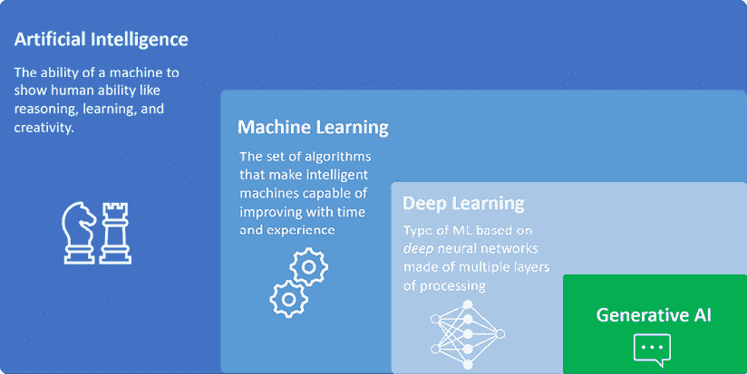

图 1.1：AI、ML、DL 和生成式 AI 之间的关系

生成式 AI 模型在大量数据上进行训练，然后可以根据用户请求生成新的示例。这里的变革性元素在于，这些请求是以最简单的方式提出的——使用我们的自然语言。这些模型被称为**大型语言模型**（**LLMs**）。

**定义**

大型语言模型（LLMs）是一种具有特定架构框架“Transformer”的人工神经网络。它们以数十亿个参数（数量级）为特征，并在数十亿个单词上进行训练。给定训练集，LLMs 能够从用户查询中推断语言模式和意图，并生成自然语言响应。

与大型语言模型（LLMs）进行自然语言交互的可能性具有颠覆性，围绕这一活动诞生了一门全新的科学。这门科学被称为“提示工程”，这个名字来源于“提示”这个词，我们将在*第三章*中进行介绍。

**定义**

提示是你提供给生成式 AI 模型的具体文本、问题或描述，以引导它产生你想要的结果——无论是有用的解释、一个创意故事，还是详细的解决方案。你如何措辞提示可以极大地影响 AI 的响应。这种精心设计和完善提示的做法，通常被称为“提示工程”，涉及对不同词汇选择、指令和格式的实验，以提高 AI 输出的质量和准确性。通过学习如何制作有效的提示，你帮助确保 AI 更一致地给出有用、吸引人且符合你目标的结果。

尽管文本理解和生成可能是生成式 AI 最突出的功能之一，但这个领域涵盖了众多领域，我们将在下一部分进行介绍。

# 生成式 AI 的领域

近年来，生成式人工智能取得了显著进步，并将其应用扩展到艺术、音乐、时尚和建筑等多个领域。在这些领域中，它确实正在改变我们创造、设计和理解周围世界的方式。在其他领域，它正在改进现有流程和操作，使其更加高效。

例如，在制药行业的背景下，生成式人工智能通过快速设计新型治疗分子，正在彻底改变药物发现，从而显著缩短开发周期和成本。通过分析大量的化学和生物信息数据集，生成式人工智能模型可以识别有希望的药物候选物并预测它们在人体内的相互作用。例如，Insilico Medicine 利用生成式人工智能开发了 ISM001-055，这是一种用于治疗特发性肺纤维化的药物候选物，于 2023 年进入 II 期临床试验（[Insilico Medicine 的博客：首个 II 期临床试验](https://insilico.com/blog/first_phase2)）。

另一个例子是生成式人工智能如何通过允许创建对玩家动作做出反应的动态和自适应环境，从而革命性地改变游戏开发。通过利用生成式人工智能，开发者可以程序性地生成庞大且不断变化的游戏世界，确保每次游玩都提供独特的体验。这项技术促进了具有适应玩家互动行为的真实**非玩家角色**（NPCs）的创建，使游戏叙事更加引人入胜。此外，生成式人工智能通过自动化资产创建简化了开发过程，从而减少了生产时间和成本。

因此，开发者可以更多地专注于创造创新的游戏玩法机制和丰富的叙事，最终提供更加个性化和吸引人的游戏体验（[生成式人工智能在游戏开发中的应用：创建动态和自适应环境](https://www.xcubelabs.com/blog/generative-ai-in-game-development-creating-dynamic-and-adaptive-environments/)）。

最后，生成式人工智能对广告和视觉资产生成也有重大影响。例如，2023 年 3 月，可口可乐推出了“创造真实魔法”平台（[可口可乐邀请全球数字艺术家使用新的 AI 平台创造真实魔法](https://www.coca-colacompany.com/media-center/coca-cola-invites-digital-artists-to-create-real-magic-using-new-ai-platform)），邀请全球数字艺术家使用其档案中的标志性品牌资产创作原创艺术品。该平台与 OpenAI 和 Bain & Company 合作开发，结合了 GPT-4 和 DALL-E 的能力，使用户能够生成融合可口可乐遗产与现代 AI 技术的独特作品。参与者有机会提交他们的作品，以获得在纽约时代广场和伦敦皮卡迪利广场的可口可乐数字广告牌上展示的机会，这体现了品牌通过尖端技术培养创造力的承诺。这些只是生成式人工智能如何重塑业务流程的几个例子。

现在，生成式 AI 在许多领域的应用也意味着其模型可以处理不同类型的数据，从自然语言到音频或图像。在下一节中，我们将探讨生成式 AI 模型如何处理不同类型的数据和领域。

## 文本生成

在 AI 中，文本生成的演变是一段从早期的理论概念到今天复杂语言模型的旅程。20 世纪 50 年代标志着人工智能作为一个领域的正式诞生，先驱如艾伦·图灵探索了机器智能。20 世纪 60 年代和 70 年代的早期**自然语言处理**（NLP）努力导致了 ELIZA 等程序的出现，这些程序通过模式匹配模拟对话。20 世纪 80 年代和 90 年代，统计模型的发展通过概率预测词序列来改进语言建模。在这一时期，机器学习算法的出现进一步提升了文本生成能力。

2017 年，随着 Transformer 架构的引入，发生了重大突破，正如之前所述，这是今天 LLMs 所采用的框架。

这一系列新模型中，以生成式 AI 的景观为特色的独特之处在于——一旦它们被训练——它们可以通过最简单的方式被消费、查询和指令。LLMs 的引入标志着 AI 领域的一个范式转变，因为不需要高级技能就能从中受益。

今天，生成式 AI 最伟大的应用之一——也是我们将在整本书中最多讨论的应用——是其能够在自然语言中生成新内容的能力。确实，生成式 AI 模型可以用于生成不同语言中新的连贯且语法正确的文本，如文章、诗歌和产品描述。它们还可以从文本中提取相关特征，如关键词、主题或完整摘要。

这里是一个使用 GPT-4o 的例子，这是 OpenAI 最新发布的模型之一，并通过 ChatGPT 提供：

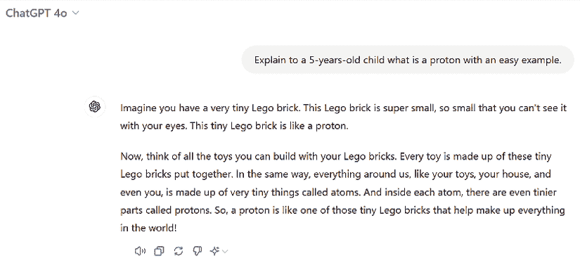

图 1.2：ChatGPT 以自然语言回应用户查询的示例

正如你所见，该模型不仅能够用解释质子是什么的方式来回答我的问题；它还能根据特定的目标受众调整其风格和术语——在我这个例子中，是一个 5 岁的孩子。这一点非常了不起，因为它为许多以前不可能的超个性化场景铺平了道路。在接下来的章节中，我们将探讨许多这样的例子。

ChatGPT 是本书的重点，在接下来的章节中，你将看到展示这一强大应用功能的示例。

现在，我们将转向图像生成。

## 图像生成

生成式 AI 在图像合成中最早的也是最著名的例子之一是 I. Goodfellow 等人在 2014 年发表的论文中引入的 **生成对抗网络（GAN**）架构，*Generative Adversarial Networks*。GANs 的目的是生成与真实图像难以区分的逼真图像。这种能力有几种有趣的应用，例如生成用于训练计算机视觉模型的合成数据集，生成逼真的产品图像，以及生成用于虚拟现实和增强现实应用的逼真图像。

然后，在 2021 年，OpenAI 在这个领域引入了一个新的生成式 AI 模型 **DALL-E**。与 GANs 不同，DALL-E 模型旨在从自然语言描述中生成图像，并且可以生成各种图像。这里的主要区别在于，虽然 GANs 通常用于创建或改进逼真的图像，但像 DALL-E 这样的模型非常适合视觉创造力，将任何自然语言描述转化为插图。

DALL-E 在广告、产品设计、时尚等创意产业中具有巨大的潜力，可以创建独特且富有创意的图像。

从其首次发布到撰写本书的时间（2024 年 12 月），DALL-E 的改进非常显著，以下是一些示例。以下是在 DALL-E 生命之初的艺术创作： 

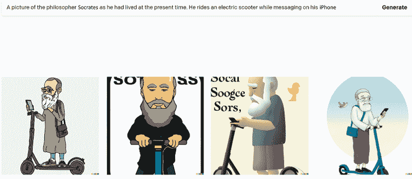

图 1.3：DALL-E 使用自然语言提示作为输入生成的图像

现在让我们看看在撰写本书时最新的模型版本 **DALL-E3** 可以产生什么（在这里，我们将使用由 DALL-E3 驱动的 Microsoft Image Creator，您可以在 https://copilot.microsoft.com/images/create 尝试）：

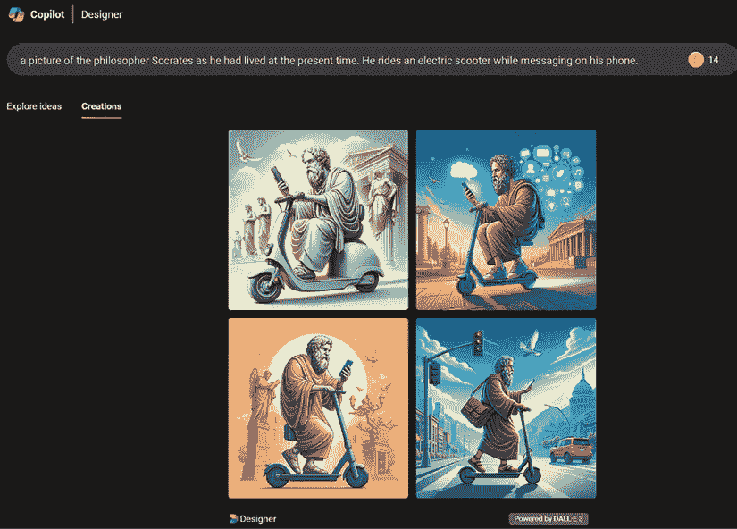

图 1.4：DALL-E3 使用自然语言提示作为输入生成的图像

在不到 2 年的时间里看到这个模型的改进水平令人印象深刻。我们只是触及了正在快速发生的巨大改进的表面。

## 音乐生成

生成式 AI 用于音乐生成的最初方法可以追溯到 1950 年代，该领域的研究是算法作曲，这是一种使用算法生成音乐作品的技术。在 1957 年，Lejaren Hiller 和 Leonard Isaacson 为 *String Quartet* 创建了 *Illiac Suite*（https://www.youtube.com/watch?v=n0njBFLQSk8），这是第一首完全由 AI 作曲的音乐作品。从那时起，生成式 AI 在音乐领域的应用一直是持续研究的主题。

在近年来的发展中，新的架构和框架在公众中变得普遍，例如 Google 在 2016 年引入的 WaveNet 架构，它能够生成高质量的音频样本，以及由 Google 开发的 Magenta 项目，该项目使用 **循环神经网络**（**RNNs**）和其他机器学习技术来生成音乐和其他艺术形式。

**定义**

**RNNs**是一种神经网络，通过循环结构保留先前输入的信息来处理序列数据。这使得它们能够识别随时间变化的模式和依赖关系，因此非常适合语言建模、时间序列预测和语音识别等任务。

2020 年，OpenAI 还宣布了 Jukebox，这是一个神经网络，当提供流派、艺术家和歌词作为输入时，可以生成音乐。

这些以及其他框架成为了许多音乐生成人工智能助手的基石。例如，索尼 CSL 研究开发的 Flow Machines。这个生成式人工智能系统在大量音乐作品数据库上进行了训练，以创作出多种风格的新音乐。法国作曲家本诺·卡雷（Benoît Carré）使用它创作了一张名为《Hello World*》（https://www.helloworldalbum.net/）的专辑，其中包含与多位人类音乐家的合作。

在这里，你可以看到一个完全由 Music Transformer 生成的曲目示例，它是 Magenta 项目中的一个模型：

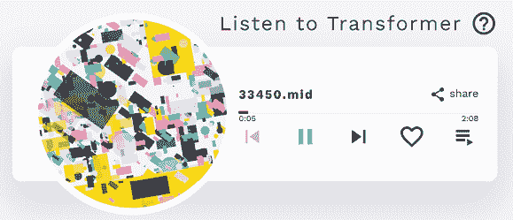

图 1.5：音乐 Transformer 允许用户聆听由 AI 生成的音乐表演（https://magenta.tensorflow.org/music-transformer）

生成式人工智能在音乐领域的另一个令人惊叹的应用是语音合成。这指的是能够根据文本输入创建音频的人工智能工具，并以知名歌手的声音输出。

例如，如果你一直想知道如果你的歌曲由 Lady Gaga 演唱会是什么样子，那么现在，你可以通过像 FakeYou *Text to Speech*（https://fakeyou.com/tts）或 UberDuck.ai（https://uberduck.ai/）这样的工具来实现你的梦想！

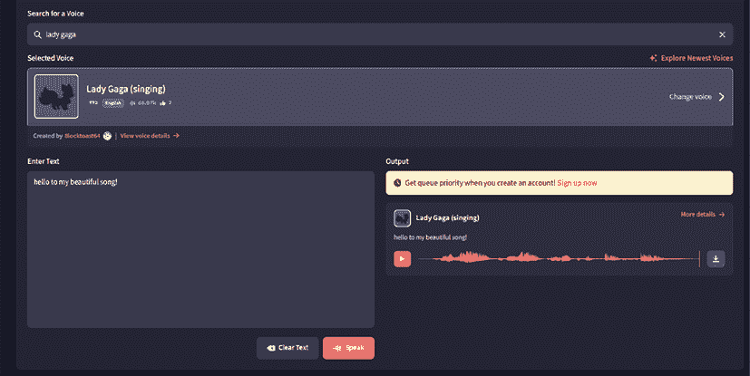

图 1.6：fakeyou.com 的文本到语音合成

结果非常令人印象深刻！如果你想找乐子，你还可以尝试你最喜欢的卡通中的声音，比如*维尼熊*。你需要做的只是输入你希望你最喜欢的声音大声唱出的歌曲文本。

让我们更进一步。如果我们能够从头开始生成一首歌，只需让生成式人工智能以自然语言为我们完成这项任务，那会怎么样呢？嗯，我们今天可以无缝地做到这一点，而且不需要任何音乐知识。在当今音乐市场上崛起的生成式人工智能产品中，Suno 就是其中之一，其使命是*“[...]构建一个任何人都可以创作出伟大音乐的未来。无论你是淋浴歌手还是排行榜上的艺术家，我们都打破了你们与梦想中的歌曲之间的障碍。无需乐器，只需想象力。从你的心中到音乐。”*（来源：https://suno.com/about）。

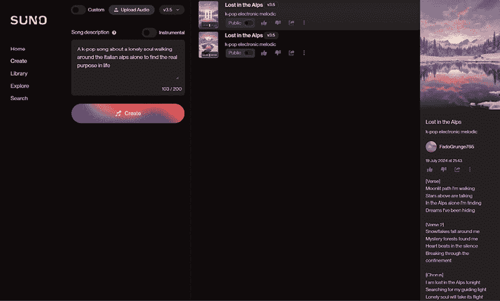

图 1.7：Suno.com 从自然语言描述中生成的整首歌曲的示例

如您所见，在图片的左侧，我提供了一个非常简短的用自然语言描述的歌曲——这就是我的提示。基于此，模型不仅能够生成歌曲的标题和歌词（在右侧），还能生成音乐！

你能相信它成为了我 2024 年夏天的热门歌曲吗？如果你想创作自己的夏日热门歌曲，你可以在 https://suno.com/create 免费尝试。

## 视频生成

视频生成领域的生成式 AI 与图像生成领域的发展时间线相似。视频生成领域的一个关键发展是 GANs（生成对抗网络）的发展。得益于它们在生成逼真图像方面的准确性，研究人员开始将这项技术应用于视频生成。基于 GANs 的视频生成的一个最显著的例子是 DeepMind 的 Veo，它可以从单个图像和一系列动作生成高质量的视频。另一个很好的例子是 NVIDIA 的**视频到视频合成**（**Vid2Vid**）基于 DL（深度学习）的框架，它使用 GANs 从输入视频中合成高质量的视频。

Vid2Vid 系统可以生成时间上一致的视频，这意味着它们在时间上保持平滑和逼真的运动。这项技术可以用于执行各种视频合成任务，例如以下任务：

+   将视频从一个领域转换为另一个领域（例如，将白天视频转换为夜间视频或草图转换为逼真图像）

+   修改现有的视频（例如，改变视频中对象的风格或外观）

+   从静态图像创建新的视频（例如，将一系列静态图像动画化）

2022 年 9 月，Meta 的研究人员宣布**Make-A-Video**（https://makeavideo.studio/）的通用版正式发布，这是一个新的 AI 系统，允许用户将他们的自然语言提示转换为视频片段。在这项技术背后，你可以认出许多我们在其他领域提到过的模型——用于提示的语言理解、使用图像生成进行图像和运动生成，以及由 AI 作曲家创作的背景音乐。

现在，我们上面提到的所有内容与最新的文本到视频模型相比都显得黯然失色。以其中一个为例，OpenAI 在 2024 年 2 月宣布了一种名为**SORA**的文本到视频模型，并发布了一些早期实验：

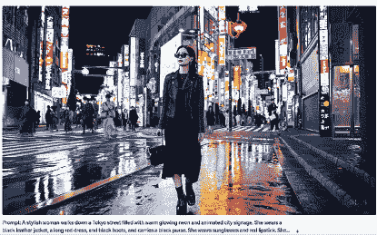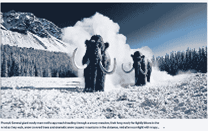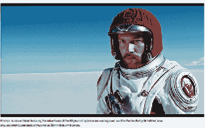 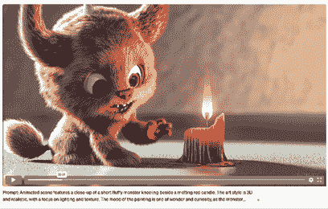

图 1.8：SORA 从自然语言提示中生成的视频。来源：https://openai.com/index/sora/

我确实鼓励您访问 SORA 网页，看看它创造的精彩视频。在撰写本文时，SORA 尚未公开发布，因为它正在通过 OpenAI 红队进行多项测试。

总体而言，生成式人工智能已经影响了多个领域多年，一些 AI 工具已经持续支持艺术家、组织和普通用户。尽管我们只用了两年时间在生成式人工智能上进行实验和构建应用，但已经有一些巩固的趋势和未来创新需要我们关注。让我们在下一节中探讨它们。

# 主要趋势和创新

从 2022 年 11 月至今，我们见证了生成式人工智能领域的大量创新。其中许多创新与公开推出的一系列全新模型有关，例如 OpenAI 的 GPT-4o 和 DALL-E3，还有 Google Gemini、Meta Llama 3、Microsoft Phi3 以及其他许多模型。

然而，最引人注目的成就可能在于我们与这些模型互动以及围绕这些模型构建应用的方式。在本节中，我们将探讨三个主要进展，这些进展标志着生成式人工智能应用中最受欢迎的参考架构。

## 检索增强生成

ChatGPT 以及一般而言的 LLM 的第一个局限性是知识库截止点。LLM 的知识仅限于它们训练的数据集，尽管这可能很全面，但并不更新（事实上，一旦模型训练完成，任何在此之后出现的新数据或信息都不会成为其知识的一部分，因为它们没有包含在原始训练集中）。此外，数据可能缺少对我们或我们的组织可能相关的专有知识库。例如，如果你问 ChatGPT，“我公司的员工医疗保险政策是什么？”模型将无法回答，因为它无法访问这些信息。

为了绕过这一限制，设计了一个新的框架，允许大型语言模型（LLM）在我们提供的定制文档中导航。这个框架被称为**检索增强生成**（**RAG**）。

RAG 背后的想法是通过添加外部信息源来增强 LLM 的知识，而无需对模型结构进行任何修改。

**定义**

嵌入是将复杂信息（如单词、句子或图像）转换为数字列表（向量）的一种方式。这使得计算机更容易理解这些单词或句子的含义。如果两段文本具有相似的含义，它们的向量在数值空间中将彼此靠近。换句话说，嵌入让计算机根据内容而不是精确措辞来衡量不同输入的相似程度。

例如，如果两个概念相似，那么它们的向量表示也应该相似。

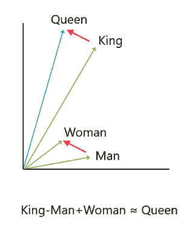

图 1.9：四个不同单词的向量表示示例

在这个例子中，我们可以看到“Queen”和“King”对应的两个向量之间的数学距离与“Woman”和“Man”之间的差异大致相同。从语义上讲，这是有道理的，因为我们正在谈论类似的关系。一个类似的例子可以应用于国家和首都之间的关系：一旦嵌入到向量空间中，“Italy”和“Rome”之间的距离应该与“France”和“Paris”之间的距离相似，因为它们映射的是相同的关系。

RAG 由三个阶段组成：

1.  **检索**：给定用户的查询及其对应的数值表示，检索出与用户查询向量最相似的文档片段（对应于与用户查询向量最近的向量），并将其用作 LLM 的基础上下文。

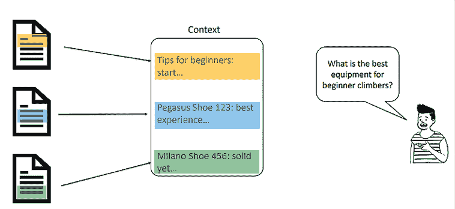

图 1.10：从不同文档中检索三个不同片段的示例，因为它们由最接近用户查询的向量表示

1.  **增强**：通过额外的指令、规则、安全护栏以及类似提示工程技术的典型做法，检索到的上下文得到丰富（我们将在*第三章*中介绍提示工程的主题）。

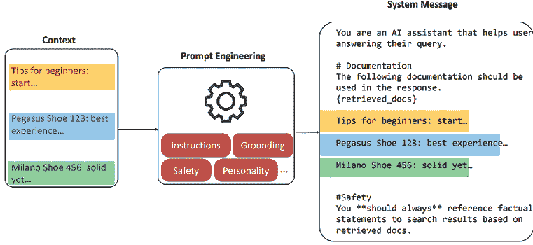

图 1.11：向检索到的文档片段添加更多上下文的示例

1.  **生成**：基于增强的上下文，LLM 生成对用户查询的响应。

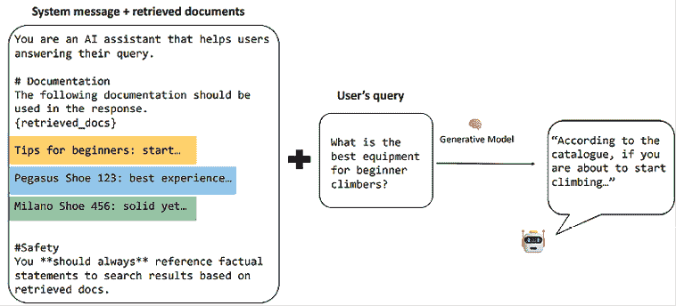

图 1.12：使用增强上下文作为系统消息的示例，以供模型生成最终答案

RAG 结合了生成模型和信息检索系统的优势，以增强生成内容的质和相关性。传统的生成模型完全依赖于其训练数据来生成响应，这有时会导致过时或不相关的信息。RAG 通过在生成过程中整合外部知识库来解决这一局限性。

## 多模态

在本章的早期，我们探讨了生成式 AI 的各个领域，从文本到图像，从视频到音乐。通常，大型基础模型倾向于特定于领域，正如我们在语言理解和生成案例中看到的 LLMs，或者在图像生成案例中的 DALL-E3。

然而，近年来生成式 AI 的进步使得**大型多模态模型**（LMMs）的开发成为可能，这些模型可以处理和生成不同类型的数据，如文本、图像、音频和视频。

LMMs 与**标准**LLMs 共享泛化和适应典型大型基础模型的能力。然而，LMMs 能够处理多样化的数据，其理念是模仿人类与周围生态系统互动的方式——也就是说，通过我们所有的感官。

多模态模型的一个很好的例子是 OpenAI 的 GPT-4o，它能够通过文本、图像和音频与用户进行交互。以下是一个例子：

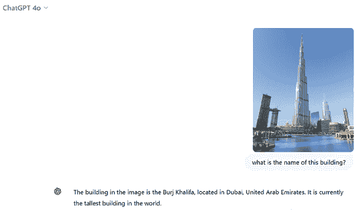

图 1.13：向 ChatGPT-4o 提供图片并要求它命名建筑物的示例

如你所见，该模型能够分析图像并对它进行推理。

现在我们来要求模型生成一幅插图：

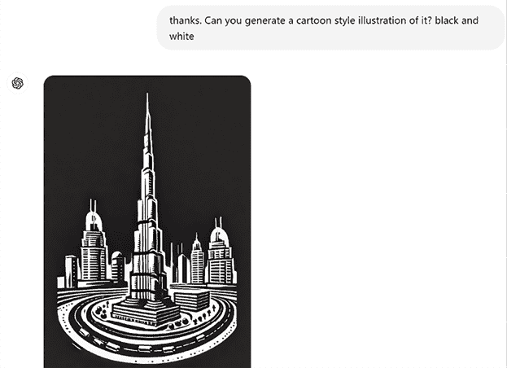

图 1.14：ChatGPT-4o 根据之前提供的图片生成插图的示例

LLM 与其他模型的不同之处在于它们保留高级推理能力，这使得它们特别适合在多样化的数据环境中处理复杂的推理任务，而传统的 AI 模型则不然。以传统的计算机视觉模型为例，它们是针对特定任务的，它们不会对图像进行推理，而是执行诸如检测对象或从图像中提取文本等任务。另一方面，LMMs 可以使用与 LLM 相同的推理能力，但它们可以将这些能力应用于除文本以外的数据。

让我们考虑这个最后的例子（只显示响应的前几行）：

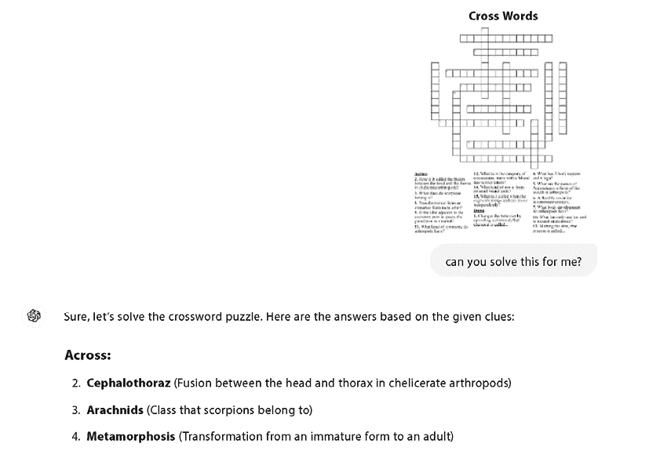

图 1.15：ChatGPT 4o 解决填字游戏的示例

如你所见，该模型能够：

+   阅读并理解图像所呈现的场景

+   对其进行推理并解决它所提供的复杂任务，即解决谜题

如你所想，这为各个行业的应用开辟了一片天地，我们将在接下来的章节中看到一些具体的例子。

## AI 代理

在前面的章节中，我们揭示了 LLM 在生成内容方面的强大能力。然而，它们缺少一种能力，那就是采取行动并与周围生态系统进行交互，这种交互超越了单个用户。例如，如果我们想让我们的 LLM 不仅能够生成一篇精彩的 LinkedIn 帖子，还能在我们页面上发布它呢？

AI 代理作为克服这一限制的关键角色出现。但它们究竟是什么呢？代理可以被看作是受 LLM 驱动的 AI 系统，在给定用户查询的情况下，能够与周围生态系统进行交互，直到我们允许它们做到的程度。生态系统的边界由我们提供给代理的工具（或插件）界定（在我们之前的例子中，我们可能给代理提供一个 LinkedIn 插件，以便它能够发布生成的内容）。

代理由以下成分构成：

+   一个 LLM，作为 AI 系统的推理引擎。

+   一个系统消息，指示代理以某种方式行为和思考。例如，你可以设计一个代理作为学生的教学助手，以下是一个系统消息：“你是一名教学助手。面对学生的查询，永远不要提供最终答案，而是提供一些提示来引导他们。”

+   一组代理可以利用的工具来与周围生态系统互动。

AI 代理是“LLM 作为应用程序推理引擎”这一含义的完美体现。实际上，代理的美丽之处在于它们可以选择最佳工具来完成用户的请求。例如，假设我们有一个 AI 代理来生成 LinkedIn 内容，我们向它提供两个工具：一个 LinkedIn 插件和一个网络搜索插件（每个都对其功能有正确的描述）。让我们探索代理在三个不同场景下的行为：

+   **生成一个关于一只小狗在山间漫步的故事**：代理将生成故事而不使用插件。

+   **生成一篇关于米兰当前天气的故事**：代理将调用网络搜索插件以获取米兰的当前天气。

+   **生成一篇关于米兰当前天气的 LinkedIn 帖子并发布在我的个人资料上**：代理将调用网络搜索插件以获取米兰的当前天气，并使用 LinkedIn 插件在我的个人资料上发布。

指令和一组插件的组合使 AI 代理极其灵活，你可以创建高度专业化的实体来应对特定场景。

这还不是全部。

如果你可以创建自己的代理团队，相互交谈并合作，为什么只有一个代理呢？想象一下多个代理，每个代理都有特定的专业知识和目标，通过沟通和互动来完成一项任务。这就是**多代理应用程序**的样子，在过去的几个月里，这种模式开始显示出非常有趣的结果。

让我们考虑以下例子。我们想要生成一个关于气候变化的电梯演讲。为此，我们需要最新的信息（最新趋势和研究、未来展望等），以及基于学术论文的扎实研究。此外，我们需要简洁而尖锐、有效，在非常短的演讲中传达所有关键信息。

现在，我们可以要求一个代理完成所有这些工作，向它提供所有必需的工具和长指令来完成这项任务。然而，如果任务变得非常复杂，单个代理可能不是最佳方法，因为它可能导致不准确的结果。相反，让我们采用多代理方法，创建一个由以下 AI 专业人士组成的团队：

+   一个能够搜索有关气候变化最新新闻的市场分析师：这将是一个具有网络搜索插件和特定搜索新闻指令的代理。

+   一个能够轻松浏览关于气候变化学术研究论文的专家研究者：这将是一个带有 Arxiv（一个精选的研究共享平台）插件和如何检索相关信息的具体指令的代理。

+   一个能够轻松将所有信息整合到一个电梯演讲中的公共演讲专家：这将是一个带有如何进行完美演讲的指令的代理。

+   一个将审查提案并对公共演讲专家提出一些修改意见的评论家（如果需要的话）：这将是一个带有如何通过识别陷阱和改进区域来审查和改进提案的指令的代理。

因此，当用户要求代理生成关于当前气候变化问题的电梯演讲时，所有代理都可以开始工作。

有许多框架可以帮助开发者处理多代理应用（包括 AutoGen、LangGraph 和 CrewAI），尤其是在我们希望代理遵循的*流程*方面。例如，我们可能希望强制执行特定的迭代次数；或者所有代理至少被调用一次；甚至可能涉及我们，作为用户，在每次迭代中提供进一步反馈以纳入即将到来的迭代。

在撰写本文时，多代理框架显示出有希望的发展，这是 LLMs 背后卓越推理能力的缩影，以及它们如何解锁新的问题解决方式。

## 小型语言模型

LLMs（大型语言模型）不出所料地很大。这意味着包含 LLMs 的**ANN（人工神经网络**）架构由数亿个参数组成。通常，大量的参数与性能更好的模型相关联，因为它能够处理更多的信息和示例，因此当用户提问时能够识别和推断出更多的模式。然而，大量的参数通常伴随着高昂的训练和托管成本，因为需要强大的 AI 基础设施。此外，这些模型的能耗引发了关于 LLM 训练的环境影响及其长期可持续性的严重问题。

这些较小的模型被称为**小型语言模型**（**SLMs**），除了在基础设施方面更轻、需求更低之外，它们还表现出令人惊讶的高性能。

现在，我们可能会认为 GPT-3.5-turbo 已经过时；然而，我们必须记住，它一年前曾是市场上最强大的模型，看到 7B 模型能够取得更好的结果是非常令人瞩目的。

SLMs（小型语言模型）绝对是一个值得关注的科研领域，尤其是在我们可能希望本地部署模型或通过微调对其进行定制（我们将在下一章介绍微调）的场景中。

# 生成式 AI 的法律和伦理格局

在开发和部署生成式 AI 系统时，必须仔细处理广泛的法律法规和伦理考量，以确保其负责任和可持续的使用。这些考量不仅限于合规性，还进入了一个道德责任、公众信任和技术问责相交的领域。

## 版权和知识产权问题

LLMs 通常在从互联网上抓取的大量语料库上进行训练，包括可能受版权保护的内容。因此，存在将受版权保护的文本、音乐、图像或视频片段直接嵌入 AI 输出的实际风险，当这些输出被共享或商业化时，可能会无意中产生侵权行为。

这种具体风险在 2024 年 11 月也加剧了，当时包括《环球邮报》和 CBC/Radio-Canada 在内的主要加拿大新闻机构（https://www.reuters.com/sustainability/boards-policy-regulation/major-canadian-news-media-companies-launch-legal-action-against-openai-2024-11-29/）对 OpenAI 提起了诉讼。他们声称 OpenAI 未经授权使用他们的版权内容来训练其 AI 模型，寻求赔偿和禁止进一步未经授权使用的禁令。

## 错误信息、幻觉和虚假新闻的风险

当前生成式 AI 模型的一个已知局限性是它们倾向于**产生幻觉**——产生听起来完全合理但实际上错误的信息。这可能导致无意中传播错误信息，尤其是在消费者、记者或公众官员将 AI 生成内容视为事实时。

例如，在 2024 年 12 月，虚假信息研究员杰夫·汉考克（https://www.theverge.com/2024/12/4/24313132/jeff-hancock-minnesota-deepfake-law-ai-hallucinations-citation）承认，他在准备法庭文件时，ChatGPT 捏造了细节，导致提交了不存在的引用。这一事件强调了 AI 生成内容在关键文件中引入不准确性的风险。

持续接触不可靠的 AI 输出可能导致对所有数字内容的广泛怀疑，损害合法来源的信誉，并减少对专家评论和信誉良好的新闻的信任。因此，组织必须投资于事实核查流程、人工介入验证和透明的模型评估方法。

## 深度伪造和欺骗性操纵

深度伪造技术，作为生成式 AI 的一个高级子集，能够合成高度逼真的图像、视频和语音录音，可以被用来模仿公众人物、编造丑闻事件或制作操纵性的政治宣传。

**定义**

深度伪造是一种使用深度学习算法创建的人工媒体，其中一个人的肖像、声音或动作被数字化操纵以创建逼真但虚假的内容。通常，深度伪造涉及修改视频或图像，使其看起来像某人说了或做了他们实际上从未做过的事情。

最近的一个例子发生在 2023 年，当时一家跨国公司香港分行的财务职员在骗子使用深度伪造音频模仿高级管理人员后，被骗转款超过 2500 万美元，指示未经授权的资金转账（https://www.secureworld.io/industry-news/hong-kong-deepfake-cybercrime）。

受深度伪造攻击的公司、政府和个人可能会遭受严重的声誉损害，导致公众尴尬、经济损失或信任度降低。建立检测工具、实施数字水印技术以及建立惩罚恶意深度伪造创作者的法律框架是减轻这些风险的关键步骤。

## 偏见、歧视和社会伤害

生成式 AI 模型可能会无意中复制和放大其训练数据中存在的现有社会偏见。例如，模型可能会持续描绘某些职业为男性主导，或以刻板印象描绘特定的文化群体。

这些有偏见的输出可能会影响招聘决策、产品推荐和政策制定过程，最终对代表性不足的群体造成不利。

在这方面，2023 年的一项研究，*文本到图像生成中的人口统计学刻板印象*（https://hai.stanford.edu/sites/default/files/2023-11/Demographic-Stereotypes.pdf），强调了文本到图像生成 AI 模型往往编码了大量的偏见和刻板印象。例如，请求专业人士图像的提示通常会导致与传统性别角色一致的描绘，如男性医生和女性护士，从而强化了过时和歧视性的观点。

另一项研究，*生成式人工智能的社会危险：综述和指南*（https://dl.acm.org/doi/fullHtml/10.1145/3657054.3664243），调查了这些技术可能加剧现有不平等的程度。例如，AI 生成的内容可能会通过代表性不足或负面描绘某些社区来边缘化它们，导致社会伤害和强化系统性歧视。

组织必须承诺进行全面偏见审计，定期更新训练数据集，实施公平约束，并让多元化的利益相关者参与模型开发和评估。

这些只是与生成式 AI 相关的潜在风险和问题的几个例子。此外，重要的是要认识到，类似的法律和伦理影响并不仅限于生成式 AI，而是适用于更广泛的 AI 领域，其应用始终引发一些担忧（例如，在人脸识别方面的隐私考虑）。

然而，生成式 AI 工具的极端快速发展和——更重要的是——采用，凸显了组织、政策制定者和开发者合作制定稳健治理框架的紧迫需求，以应对生成式 AI 带来的独特挑战。这包括采用透明数据来源的标准，获取版权内容的明确许可，实施严格的验证程序以对抗虚假信息，并与监管机构紧密合作建立法律界限。这也要求 AI 从业者持续保持警惕，更新模型，改进算法，并与跨学科专家合作，以确保生成式 AI 作为创新和积极社会影响的动力，而不是伤害或道德妥协的来源。

# 摘要

在本章中，我们探索了生成式 AI 的激动人心的世界及其各种应用领域，包括图像生成、文本生成、音乐生成和视频生成。我们学习了由 OpenAI 训练的生成式 AI 模型，如 ChatGPT 和 DALL-E，如何使用深度学习技术在大数据集中学习模式，并生成既新颖又连贯的新内容。我们还讨论了生成式 AI 的历史、起源以及当前的研究状况。

本章的目标是提供生成式 AI 基础知识的坚实基础，并激发您进一步探索这个迷人的领域。

在下一章中，我们将重点关注市场上最具有前景的技术之一，ChatGPT。我们将探讨其背后的研究和由 OpenAI 的开发，其模型的架构，以及截至今天它可以解决的主要用例。

# 参考文献

+   生成对抗网络：https://arxiv.org/abs/1406.2661

+   分析和改进 StyleGAN 的图像质量：https://arxiv.org/abs/1912.04958

+   视频到视频合成：https://arxiv.org/abs/1808.06601

+   深度生成模型三合一：三个旨在利用大规模力量的进展：https://www.microsoft.com/en-us/research/blog/a-deep-generative- model-trifecta-three-advances-that-work-towards-harnessing- large-scale-power/

+   Vid2Vid: https://tcwang0509.github.io/vid2vid/

+   LLaMA：开放和高效的基座语言模型：https://arxiv.org/pdf/2302.13971

+   介绍 Phi-3：https://azure.microsoft.com/en-us/blog/introducing-phi-3-redefining-whats-possible-with-slms/

# 加入我们的 Discord 和 Reddit 社区

对本书有任何疑问或想参与关于生成式 AI 和 LLMs 的讨论？加入我们的 Discord 服务器`packt.link/I1tSU`和 Reddit 频道`packt.link/jwAmA`，以连接、分享和与志同道合的爱好者合作。

 
