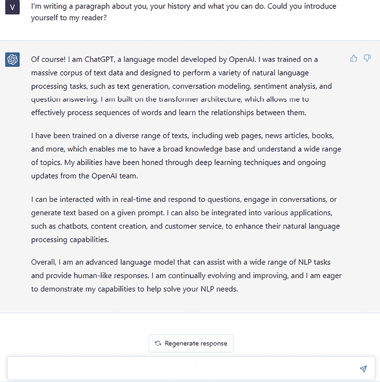
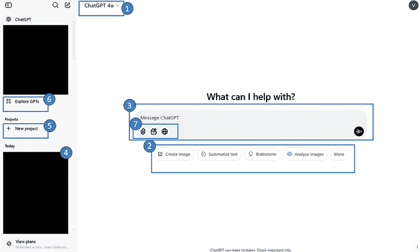
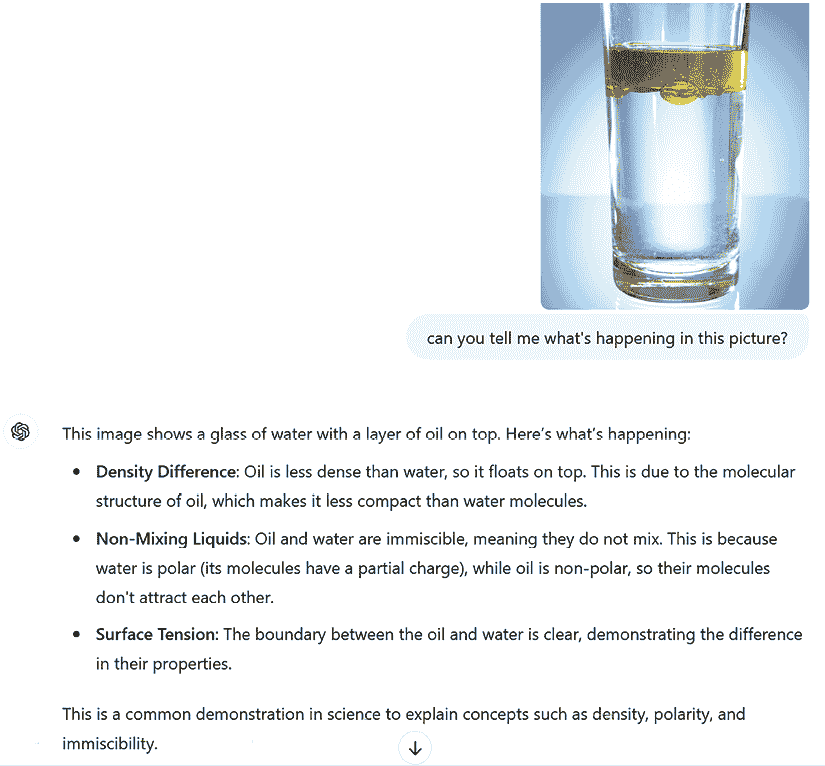
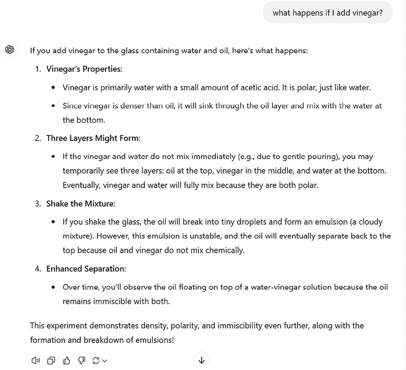
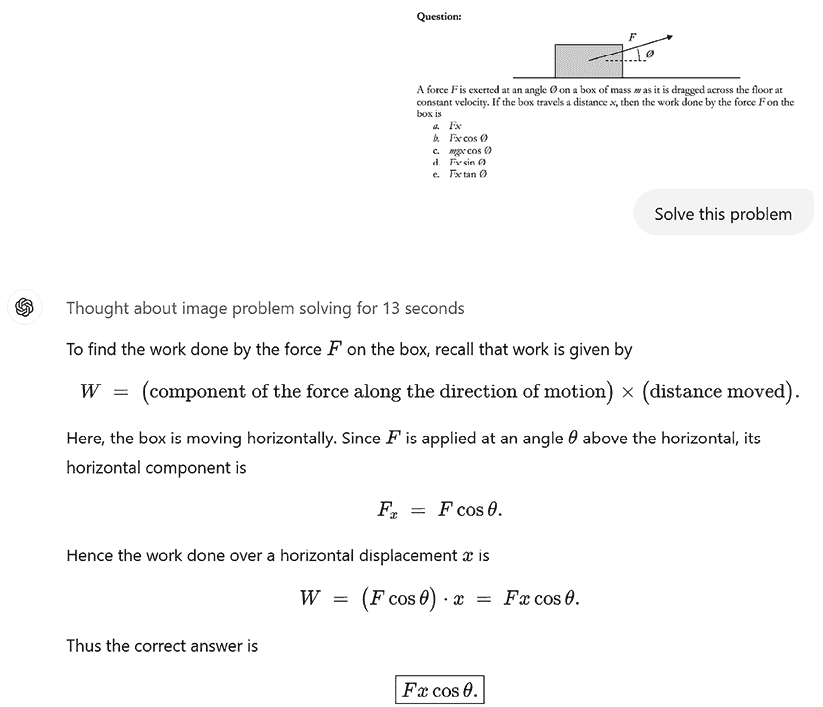
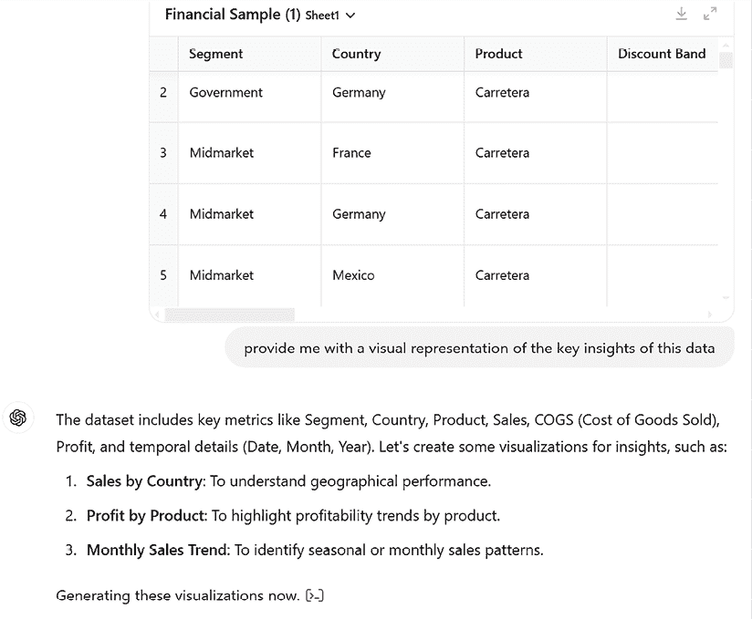
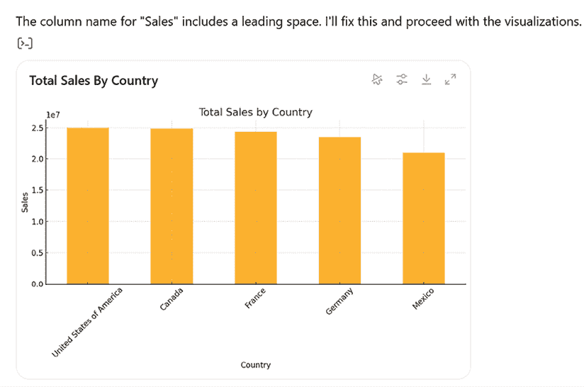
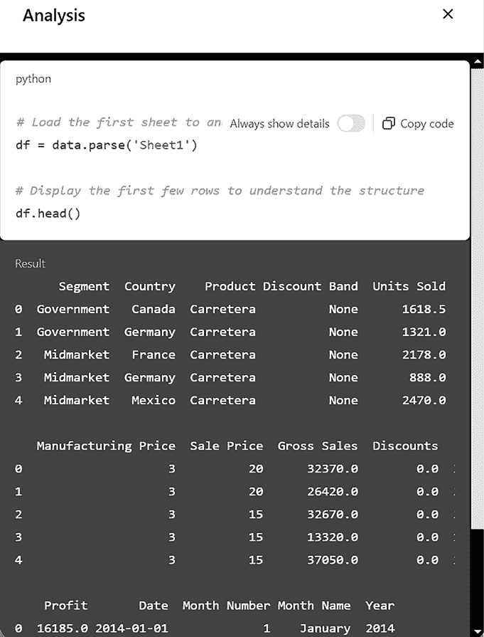

# OpenAI 和 ChatGPT：超越市场炒作

本章概述了 OpenAI 及其最显著的发展——ChatGPT，突出了其历史、技术和能力。

我们还将探讨 OpenAI 在生成 AI 领域的成就，超越 ChatGPT——从语音到文本模型到图像生成，这将为你提供对一些最先进的生成 AI 技术现状的更广泛认识。

更具体地说，我们将涵盖以下主题：

+   什么是 OpenAI？

+   OpenAI 模型家族概述

+   开始使用 ChatGPT

到本章结束时，你将拥有关于 ChatGPT 及其使用方法以及其技术能力的基础知识，以及 OpenAI 模型家族的深入理解。

# 技术要求

要测试本章中的示例，你需要一个 OpenAI 账户。

如果你需要任何帮助，可以参考“创建 OpenAI 账户”部分。

# 什么是 OpenAI？

OpenAI 是一个成立于 2015 年的研究组织，由埃隆·马斯克、山姆·奥特曼、格雷格·布罗克曼、伊利亚·苏茨克维、沃伊切赫·扎伦巴和约翰·舒尔曼共同创立。正如 OpenAI 网页上所述，其使命是“*确保通用人工智能（AGI）[...]造福全人类*” ([`openai.com/index/planning-for-agi-and-beyond/`](https://openai.com/index/planning-for-agi-and-beyond/))。近年来，OpenAI 已形成战略伙伴关系，以进一步推进其研究和部署工作。值得注意的是，微软对 OpenAI 进行了大量投资，为支持高级 AI 技术的发展提供了资源。OpenAI 继续在 AI 研究中处于领先地位，努力在创新与道德考量之间取得平衡，以确保 AI 技术的发展与社会的更广泛利益相一致。

**通用人工智能**（**AGI**）是一种概念性的 AI 类型，能够以与人类智能相当的专业水平理解和利用跨不同任务的知识。与针对特定目的定制的窄 AI 系统不同，AGI 将展现出类似人类的认知适应性，使其能够完成人类能够完成的任何智力任务。

## OpenAI 的起源

自成立以来，OpenAI 一直专注于**深度强化学习**（**DRL**），这是**机器学习**（**ML**）的一个子集，它将**强化学习**（**RL**）与**深度神经网络**（**DNNs**）相结合。

强化学习（RL）是一种机器学习（ML）范式，其中智能体通过与环境的交互来学习做出决策。智能体根据其行为获得反馈，形式为奖励或惩罚，并旨在最大化累积奖励。

深度强化学习（Deep RL）是强化学习（RL）和深度神经网络（DNNs）或深度神经网络（the latter is a type of artificial neural network with multiple layers between the input and output) 的结合。

在深度强化学习（DRL）中，深度神经网络（DNNs）被用来近似价值函数、策略或环境模型，使智能体能够处理复杂、高维的状态和动作空间。通过结合强化学习和 DNNs 的优势，DRL 已成功应用于诸如玩电子游戏、机器人控制和自动驾驶等任务，在这些任务中，传统方法在可扩展性和特征提取方面存在困难。

OpenAI 在该领域的首次贡献可以追溯到 2016 年，当时公司发布了 OpenAI Gym，这是一个用于研究人员开发和测试强化学习算法的工具包。

Gym（现称为 Gymnasium）的主要目标是标准化在人工智能研究环境中定义的方法，使得发表的研究更容易重现，并为用户提供一个简单的界面来与这些环境交互。OpenAI 在该领域持续研究和贡献，但其最显著的成就与生成模型——**生成预训练 Transformer**（**GPTs**）相关。

**GPT**是一种高级人工智能模型，旨在处理和生成类似人类的文本。它通过在训练阶段从大量书面语言数据中学习模式、结构和上下文来运行。这种训练使 GPT 能够预测和生成连贯且上下文相关的文本，允许它以高度自然的方式理解和回应提示。

“预训练”这一方面指的是它在广泛的语言数据上的初始训练，使其具备对语法、句法、语义和不同沟通风格的普遍理解。而“生成”能力意味着它可以创建与给定输入相符合的新文本，而不仅仅是分析或分类数据。

“Transformer”这一方面指的是一种特定的架构设计，它包含一个高级机制——称为“注意力”——以高效地理解单词和短语之间的关系，使其能够以高精度处理复杂的语言任务。

## ChatGPT 的出现

OpenAI 在其论文《通过生成预训练改进语言理解》中介绍了他们的第一个 GPT 模型，并将其命名为**GPT-1**，旨在证明语言模型可以在大型文本语料库上预训练，然后针对特定任务进行微调，从而在各种**自然语言处理**（**NLP**）应用中实现显著的改进。

微调是将预训练模型适应新任务的过程。在微调过程中，预训练模型的参数被调整，要么通过调整现有参数，要么通过添加新参数，以便它们适合新任务的数据。这是通过在针对新任务的小型标记数据集上训练模型来完成的。微调背后的关键思想是利用从预训练模型中学到的知识，并将其微调到新任务，而不是从头开始训练模型。

之后不久，OpenAI 研究人员在 2019 年发布了其继任者 GPT-2。这个版本的 GPT 在一个称为 **WebText** 的语料库上进行了训练，当时包含略超过 800 万份文档，总共有 40 GB 的文本，这些文本来自 Reddit 提交中至少获得 3 个赞同的 URL。它有 12 亿个参数——是其前者的十倍。

在人工神经网络（包括 GPTs）的背景下，**参数**指的是模型在训练过程中学习和调整的内部变量。这些参数至关重要，因为它们定义了输入数据如何通过网络层进行处理以产生所需的输出。

然后，在 2020 年，OpenAI 首先宣布然后发布了 GPT-3，该模型拥有 1750 亿个参数（大约是地球人口的 21 倍），显著提高了 GPT-2 的基准测试结果。正是在 GPT-3 模型——更确切地说，是其经过微调的版本 GPT-3.5——的帮助下，我们在 2022 年 11 月进入了 ChatGPT 时代（在首次发布时，ChatGPT 由 GPT-3.5 驱动）。

从那时起直到今天，OpenAI 已经发布了其 GPT 系列的许多新版本：GPT-4、GPT-4 Turbo、GPT-4 Vision（第一个多模态模型）和 GPT-4o，其中“o”代表“Omni”，指的是其多模态能力。在撰写本书时（2025 年 1 月），最新的 OpenAI 聊天模型是 o1 家族的一部分，它们具有先进的推理能力，使其适合复杂任务或数学问题。

从下一节开始，在接下来的章节中，我们将主要关注 ChatGPT 中可用的 OpenAI 聊天模型，以及一些图像生成的示例。

# OpenAI 模型系列的概述

在过去几年中，OpenAI 在模型开发领域取得了巨大进步，以极高的速度发布了新的模型版本。在本节中，我们将按领域查看主要模型：

+   **语言模型**：OpenAI 的 GPTs 是高级语言模型，旨在根据给定的提示生成文本。它们功能多样，可用于各种 NLP 任务，如文本补全、翻译、摘要和编码。这是 OpenAI 展示卓越性能的领域，得益于其旗舰模型系列：GPTs。自 2022 年 11 月 ChatGPT 发布以来，OpenAI 已发布了以下模型：

    +   GPT-3.5-turbo，ChatGPT 第一版背后的模型

    +   GPT-4（第一个能够处理图像的模型）和 GPT-4 Turbo（针对聊天和助手进行了优化）

    +   GPT-4o 和 GPT-4o mini（在训练的参数数量上有所不同），其中字母“o”代表“Omni”，意味着模型可以接收各种数据作为输入（文本、图像、声音）

    +   o1 和 o1 mini（在参数数量上有所不同），这是一个代表重大进步的模型系列，特别是在增强推理能力方面

    +   基于 o1 系列的前一代能力（o3 系列），该系列在基准测试中表现出色（[`beebom.com/openai-unveils-o3-model-cracks-arc-agi-benchmark/`](https://beebom.com/openai-unveils-o3-model-cracks-arc-agi-benchmark/)），并且对未来应用前景非常乐观。

+   **图像模型**：OpenAI 的图像模型，如 DALL-E，旨在根据文字描述生成和操作图像。DALL-E 模型可以创建高度详细和富有想象力的视觉图像，使用户能够创作独特的艺术作品、设计概念等。例如，DALL-E 3（撰写本文时的最新版本）能够根据详细的提示创建复杂和富有创意的图像，推动人工智能在视觉艺术领域的边界。这些模型在创意产业、数字营销以及任何从高质量、定制视觉中受益的领域特别有用（我们将在 *第八章* 中详细介绍 DALL-E）。

+   **文本到语音和语音到文本模型**：OpenAI 的 Whisper 是一个 **语音到文本**（**STT**）系统。它于 2022 年 9 月 21 日推出。该系统在 68 万小时的多种语言和多任务数据上进行了训练，擅长跨语言转录语音，并能将非英语语音翻译成英语。除此之外，OpenAI 还开发了 **文本到语音**（**TTS**）模型，将书面文字转换为口语，提供清晰、富有表现力和自然的声音输出，使其适用于广泛的用途，从客户服务机器人到教育工具。

    +   **STT** 技术将口语转换为书面文字。它常用于转录服务、语音助手和辅助工具等应用中。例如，将口述的词语转换为电脑上的文字或转录会议录音。

    +   **TTS** 技术将书面文字转换为口语。它广泛应用于辅助工具（例如，为视障用户设计的屏幕阅读器）、交互式语音应答系统和内容朗读。例如，数字助手大声阅读消息或书籍。

这些模型有助于创建语音助手、提高视障用户的可访问性以及生成自动公告。

+   **文本到视频模型**：随着 Sora 的发布，OpenAI 展示了其尖端文本到视频模型，能够根据文字描述生成逼真和富有想象力的视频场景。通过采用 DALL-E 的技术和集成变压器，Sora 可以创建高达一分钟的逼真视频。它在保持 3D 一致性、物体持久性和模拟视频中的交互方面表现出色。尽管仍面临准确模拟复杂物理学的挑战，但 Sora 在创意产业中具有重大潜力，为视频制作和叙事提供了新的可能性。

+   **嵌入模型**：OpenAI 的嵌入模型将文本转换为称为向量（或嵌入）的数值表示，这些向量捕捉语义意义并在多维向量空间中进行投影。

在**第一章**中，我们探讨了嵌入在**检索增强生成**（**RAG**）场景中的作用，以及更广泛地，这种模式是如何重塑知识挖掘的。

OpenAI 的嵌入模型**text-embedding-ada-002**和**text-embedding-3-large**通过创建文本的密集向量表示，在文本相似度、文本搜索和代码搜索等任务中提供最先进的性能。这些嵌入允许对大型文本数据集进行高效和有效的比较，提高搜索的准确性和相关性。

+   **审查模型**：OpenAI 的审查模型旨在检测和过滤掉文本中的不适当、有害或不安全的内容。这些模型通过识别可能冒犯性或有害的语言，对于维护安全和尊重的在线环境至关重要。最新发布的审查模型，于 2024 年 9 月发布，名为**omni-moderation-latest**，建立在 GPT-4o 之上，并且能够过滤文本和图像。它帮助开发者和公司执行社区指南，防止有害内容的传播，从而促进更安全的数字互动。

其中一些模型——特别是语言、图像生成和 TTS/STT——可以在 ChatGPT 中使用，这可能是 OpenAI 作为消费应用发布的最受欢迎的产品。我们将在下一节中对其进行介绍。

# 开始使用 ChatGPT

2022 年 11 月，OpenAI 向公众发布了其对话式人工智能系统 ChatGPT 的网页预览。这在主题专家、组织和普通用户中引发了巨大的炒作——以至于在仅仅 5 天后，该服务就达到了 100 万用户！

在撰写关于 ChatGPT 的文章之前，我将先让它自我介绍，使用的是发布后几天拍摄的快照：

图 2.1：ChatGPT 于 2022 年 11 月自我介绍

需要注意的是，ChatGPT 本身不是一个**大型语言模型**（**LLM**），而是一个用户可以通过它来与底层模型交互的应用程序。实际上，ChatGPT 的核心是一个由人工智能驱动的聊天机器人，旨在模拟类似人类的对话。它支持各种任务，包括写作、编码以及提供关于各种主题的信息。由 OpenAI 开发的尖端语言模型提供支持，ChatGPT 通过 GPT-3、GPT-4、GPT-4o 和 o1 等迭代不断改进其理解和生成自然语言的能力。

除了集成最新的顶级模型外，ChatGPT 还通过整合外部工具（如网络搜索）并成为实际的开发者平台来构建自己的“GPTs”，但所有这些主题我们将在接下来的章节中详细讨论。

如前所述，ChatGPT 的第一个版本是在一个高级语言模型之上构建的——一个针对处理对话进行了优化的 GPT-3 的精调版本。这个精调版本被称为 GPT-3.5 Turbo。优化过程涉及**强化学习与人类反馈**（**RLHF**）([`arxiv.org/pdf/2009.01325`](https://arxiv.org/pdf/2009.01325))，这是一种利用人类输入来训练模型以展示期望的对话行为的技巧。

我们可以将 RLHF 定义为一种机器学习方法，其中算法通过接收来自人类的反馈来学习执行任务。该算法被训练做出决策，以最大化人类提供的奖励信号，并且人类提供额外的反馈以改进算法的性能。当任务过于复杂而无法使用传统编程或当期望的结果难以提前指定时，这种方法很有用。

这里的相关区别在于，ChatGPT 是在人类参与下进行训练的，以便与用户保持一致。通过结合 RLHF，ChatGPT 被设计成能够以自然和吸引人的方式更好地理解和回应人类语言。

现在我们来看看如何开始使用 ChatGPT。

## 创建 OpenAI 账户

ChatGPT 是一个任何人都可以使用的免费应用程序；然而，自 2023 年 2 月起，OpenAI 宣布了一系列付费计划，为订阅者提供了包括访问最新模型、最快响应时间、一套优秀的插件以及可能在 GPTs 游乐场中创建自己的助手等优势。您可以在[openai.com/chatgpt/pricing/](http://openai.com/chatgpt/pricing/)找到价格概览。在接下来的章节中，我将使用 Plus 版本，但大多数动手示例也可以使用免费版本复制。

无论您选择哪个版本，为了跟上接下来的部分，您需要一个 OpenAI 账户。要在 OpenAI 上创建账户，请按照以下步骤操作：

1.  打开网页浏览器并访问 OpenAI 网站[`platform.openai.com/signup/`](https://platform.openai.com/signup/)。

1.  提供您的电子邮件地址并创建一个密码。

1.  一旦您的账户创建完成，您就可以开始使用 ChatGPT 的免费版本。

## ChatGPT Plus 导览

让我们快速浏览一下撰写本文时的 ChatGPT 用户界面：

图 2.2：chatgpt.com 的 ChatGPT 着陆页

让我们探索*图 2.2*中的每个编号部分：

1.  您可以选择 ChatGPT 背后使用的模型。在我的情况下，我设置了 GPT-4o，这个模型只有付费订阅才能获得。这是我们将在整本书中使用的模型。

1.  提供了一系列预构建的提示，以帮助您熟悉该应用程序。

1.  文本框是您可以输入提示的地方。请注意，在右上角有一个小声音图标：它表示您可以使用语音而不是键入与模型进行交互的可能性。

1.  在左侧侧边栏中，您可以查看与 ChatGPT 之前的聊天记录（我的已被覆盖）。这是一个极其有用的工具，因为在每次聊天中，通过您与模型的各种互动回合，您创建了一个 ChatGPT 所了解的上下文。这意味着，如果您想继续之前开始的对话，您可以打开相关的聊天并开始与模型交谈，而无需再次描述整个场景。

1.  ChatGPT Plus 最近增加的一个不错的新功能是拥有项目，这提供了一种简化的方式来组织个人使用的文件和聊天，使其更容易管理跨越多个对话的任务。通过将聊天、文件和自定义指令都放在一个地方，项目有助于保持秩序和专注。

1.  ChatGPT Plus 提供了创建 GPT 的可能性，这些是您可以针对特定功能定制的个性化助手。您可以选择保持您的 GPT 私密或将其发布在 GPTs 商店中，任何人都可以使用并对其进行评分。我们将在 *第九章* 中介绍 GPTs。

1.  最后，ChatGPT 的 Plus 版本现在提供了一套工具，您可以在与模型交互时使用。

在撰写本书时（2025 年 1 月），提供的工具包括：

+   **附加文件** 以分析用户上传的自定义文件

+   **网络搜索** 将 ChatGPT 的模型知识与来自网络的最新信息相结合

+   DALL-E 根据自然语言查询创建图像

+   画布功能提供并排的工作空间，使用户能够与 ChatGPT 一起协作起草、编辑和接收写作和编码项目的反馈。

在整本书中，我们将利用 ChatGPT Plus 来展示最新模型和功能的能力；尽管如此，我们将涵盖的大多数示例也可以使用 ChatGPT 的免费版本实现（目前由 GPT-3.5 Turbo 驱动）。

ChatGPT 的架构和训练方法的持续发展和改进有望进一步推动语言处理领域的边界。

### ChatGPT 的可能性艺术

从 *第四章* 开始，我们将涵盖许多 ChatGPT 如何用于个人生产力和特定领域任务（如研究、营销和编码）的实际示例。然而，在到达那里之前，让我们先看看 ChatGPT 的可能性艺术，从一个 o1 模型的例子开始。o1 模型的独特特征是它们能够揭示它们的“思考”过程。当您提交查询时，会出现一个“思考”指示器，通过点击它，您可以查看模型到达其响应所采取的步骤。这对于深入了解模型如何处理复杂查询非常有帮助。

### 图像理解和生成

ChatGPT 中可用的最新模型是多模态的，这意味着它们能够接收多样化的数据（文本和图像）。

在生成式 AI 的背景下，**多模态**指的是 AI 系统处理、理解和生成各种形式数据或模态的能力，包括文本、图像、音频和视频。这种功能使得 AI 能够整合和解释多样化的输入，从而产生更全面和上下文相关的输出。

让我们考虑以下例子：

图 2.3：图像理解和文本生成

在这种情况下，我要求 ChatGPT 描述提供的图片，该模型能够生成一个详细且科学的解释，说明了两种液体不混合在一起的原因。这表明了模型对图片的深入理解，以及物理学的一般知识。

基于这次初步分析，我们也可以让它评估额外的场景：

图 2.4：深入评估

这些只是 ChatGPT 当前能力的一小部分例子。再次强调，ChatGPT 可以与不同的模型一起使用，其中一些模型并不展示所有可用功能（例如，GPT-3.5 不接收图像作为输入）。选择使用哪种模型高度取决于您希望 ChatGPT 解决的问题类型。

### 数学思维

最初，LLMs 在解决数学任务时遇到了困难。然而，OpenAI 在 2024 年 9 月推出的 o1 模型系列，与它的前辈 GPT-4o 相比，在数学推理方面取得了显著的进步。例如，o1 模型（尽管仍在预览中）在国际数学奥林匹克竞赛（IMO）的资格考试中取得了 83%的成功率（[`openai.com/index/introducing-openai-o1-preview/`](https://openai.com/index/introducing-openai-o1-preview/)），这比 GPT-4o 的 13%有大幅提升。

让我们考虑以下例子：

图 2.5：ChatGPT 的数学能力

如您所见，该模型不仅能够阅读和理解提供的图像，而且还能通过较小的推理步骤正确地解决问题。

### 分析能力

在之前的例子中，我们向模型提供了一个图像，但我们还可以进一步附加一个更复杂、结构化的文件进行定量分析。例如，我们可以向 ChatGPT（由 GPT-4o 驱动）附加一个`.xls`文件，并要求它进行一些财务分析（在我的案例中，我使用了这里可用的样本文件：[`learn.microsoft.com/en-us/power-bi/create-reports/sample-financial-download`](https://learn.microsoft.com/en-us/power-bi/create-reports/sample-financial-download)）。

图 2.6：ChatGPT 展现的分析能力

除了上述的文本格式答案外，ChatGPT 还可以生成图表：

图 2.7：使用 ChatGPT 生成图表

注意，为了执行这个特定的任务，ChatGPT 利用了一个名为 Code Interpreter 的功能，它允许它生成 Python 代码来分析数据并直接在上传的文件上运行。需要注意的是，你可以通过点击**[>_**]图标来可视化生成的代码：

图 2.8：Code Interpreter

当涉及到结构化数据时，Code Interpreter 功能非常强大且多功能，它还可以被用来导入和训练高级机器学习模型，然后对数据进行预测。

# 摘要

在本章中，我们回顾了 OpenAI 的历史、研究领域以及最新的发展，直到 ChatGPT。我们还通过 ChatGPT 一瞥了可能的技艺，从对复杂图像进行推理到执行分析任务。

在下一章中，我们将开始本书的**第二部分**，我们将看到 ChatGPT 在各个领域的应用以及如何释放其潜力。你将学习如何通过合理设计你的提示来获取 ChatGPT 的最高价值，如何提高你的日常生产力，以及它如何成为任何消费者的优秀项目助手。

# 参考文献

+   Radford, A. & Narasimhan, K. (2018). *Improving language understanding by generative pre-training*. [`cdn.openai.com/research-covers/language-unsupervised/language_understanding_paper.pdf`](https://cdn.openai.com/research-covers/language-unsupervised/language_understanding_paper.pdf)

+   Vaswani, A., Shazeer, N., Parmar, N., Uszkoreit, J., Jones, L., Gomez, A. N., Kaiser, L., & Polosukhin, I. (2017). *Attention Is All You Need*. arXiv. [`doi.org/10.48550/arXiv.1706.03762`](https://doi.org/10.48550/arXiv.1706.03762)

+   OpenAI. *Fine-Tuning Guide*. OpenAI 平台文档。https:// [platform.openai.com/docs/guides/fine-tuning](http://platform.openai.com/docs/guides/fine-tuning)

# 加入我们的 Discord 和 Reddit 社区

对本书有疑问或想参与关于生成式 AI 和 LLMs 的讨论？加入我们的 Discord 服务器`packt.link/I1tSU`和 Reddit 频道`packt.link/jwAmA`，以连接、分享和与志同道合的爱好者合作。

 
