# 理解提示工程

在前几章中，我们多次提到“提示”一词，在提及 ChatGPT 中的用户输入和一般意义上的**大型语言模型（LLMs**）时。

由于提示对 LLM 的性能有巨大影响，提示工程是充分利用你的 GenAI 工具的关键活动。实际上，有几种技术不仅可以完善你的 LLM 的响应，还可以减少与幻觉和偏见相关的风险。

在本章中，我们将介绍提示工程领域的最新技术，从基本方法到高级框架。更具体地说，我们将探讨以下主题：

+   什么是提示工程？

+   探索零样本、单样本和少样本学习

+   提示工程的原则

+   查看一些高级技术

+   避免偏见的伦理考量

到本章结束时，你将拥有构建功能强大且稳固的提示与 ChatGPT 以及更广泛的 GenAI 应用程序互动的基础。

# 技术要求

您需要一个 OpenAI 账户。您可以使用免费的 ChatGPT 版本来运行本章的示例。

# 什么是提示工程？

在解释提示工程之前，让我们首先定义一下提示。

**提示**是引导 LLM 行为以生成输出的文本输入。例如，每次我们与 ChatGPT 互动，提问或给出指令时，输入的文本就是一个提示。在 LLM 和 LLM 驱动的应用背景下，我们可以区分两种类型的提示：

+   第一种类型是用户编写的并发送给 LLM 的提示。例如，一个提示可能是“给我 Lasagna Bolognese 的食谱”，或者“生成一个马拉松跑步的训练计划”。

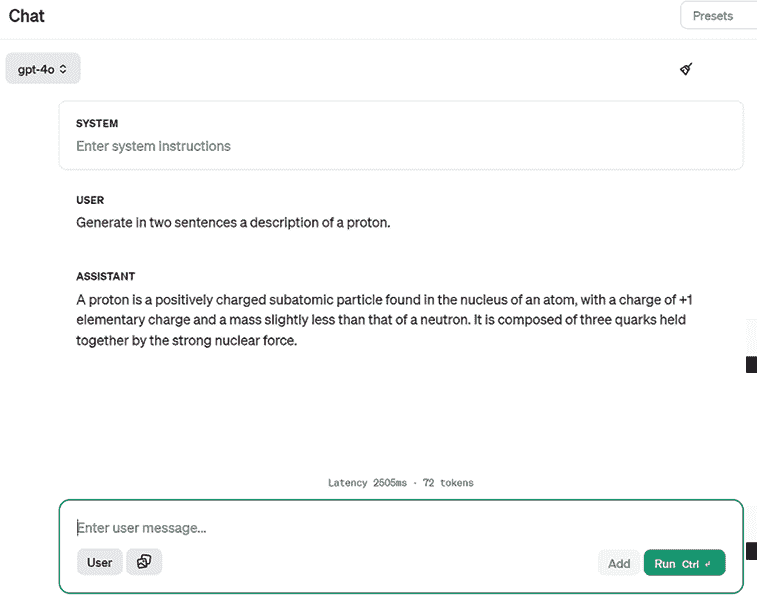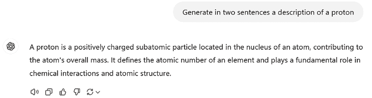

图 3.1：用户提示的示例

你会听到它被简单地称为**提示**、**查询**或**用户输入**。

+   第二种类型是指导模型以某种方式行为的提示，无论用户的查询如何。这指的是模型在与最终用户互动时所提供的自然语言指令集，以便以某种方式行为。你可以将其视为 LLM 的“后端”，这是将由应用开发者而不是最终用户处理的部分。

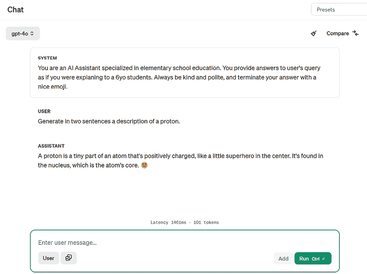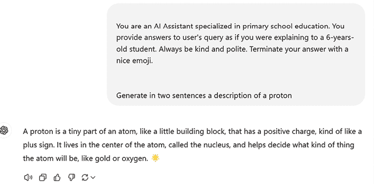

图 3.2：系统消息的示例

我们将此类提示称为**系统消息**。

提示工程是设计有效提示的过程，以从大型语言模型（LLMs）中获取高质量和相关的输出。提示工程需要创造力、对 LLM 的理解以及对你想要实现的目标的清晰理解。

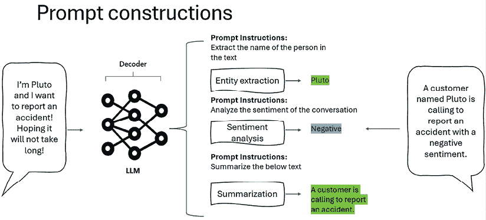

图 3.3：提示工程示例，以专门化 LLMs

在过去的几年里，提示工程已经成为一门全新的学科，这也是一个事实的证明，即与这些模型交互需要一套新的技能和能力，这些技能和能力在以前是不存在的。

*提示的艺术*在构建企业场景中的 GenAI 应用时已成为一项顶级技能；然而，它对于使用 ChatGPT 或类似 AI 助手进行日常任务的个人用户来说也极其有用，因为它显著提高了结果的质量和准确性。

在接下来的章节中，我们将看到一些如何利用 ChatGPT 构建高效、健壮提示的示例。

# 理解零样本、一样本和少样本学习

在前面的章节中，我们提到了 LLMs 通常以预训练的格式出现。它们已经在大量数据上进行了训练，并且已经相应地配置了它们的（数十亿）参数。

然而，这并不意味着那些 LLMs 不能再学习了。在*第二章*中，我们学习了微调的概念。在*附录*中，我们还将看到，通过**微调**来定制 OpenAI 模型并使其更能够处理特定任务的一种方法。

微调是一种适当的训练过程，需要训练数据集、计算能力和一些训练时间（取决于数据量和计算实例的数量）。

正因如此，测试另一种方法让我们的 LLMs 在特定任务上变得更加熟练是值得的：**少样本学习**。

**定义**

在 LLMs 的背景下，**少样本学习**指的是模型在推理期间提供不同数量的任务特定示例时执行任务的能力。这些少样本学习范式使 LLMs 能够以最小或没有额外训练的情况下适应新任务，增强其在自然语言处理应用中的灵活性和效率。

理念是让模型从简单的示例中学习，而不是整个数据集。这些示例是我们希望模型响应的样本，这样模型不仅学习内容，还学习在响应中使用的内容、格式、风格和分类法。

此外，少样本学习是通过提示直接发生的（正如我们将在以下场景中看到的那样），因此整个体验更加节省时间且易于执行。

提供的示例数量决定了我们所指的少样本学习的水平。换句话说，如果没有提供示例，我们称之为零样本；如果提供了一个示例，我们称之为一样本；如果提供了两个以上的示例，我们称之为少样本。

让我们关注这些场景中的每一个。

## 零样本学习

在这种学习类型中，模型被要求执行一个它没有看到任何训练示例的任务。模型必须依赖先前的知识或关于任务的通用信息来完成它。例如，零样本学习的方法可能是要求模型生成一个描述，如我在提示中定义的那样：


图 3.4：零样本学习示例

## 单样本学习

在这种学习类型中，模型被要求为每个新任务提供一个示例。模型必须使用其先验知识从这个单一示例中泛化以执行任务。如果我们考虑前面的例子，我可以在要求模型生成新示例之前，向我的模型提供一个提示完成示例：


图 3.5：单样本学习示例

如前一个截图所示，模型能够生成一个与提供的示例风格和模板相匹配的答案。当提供多个示例时，情况类似，如下一节所述。

## 少样本学习

在这种学习类型中，模型被要求为每个新任务提供少量（通常在 2 到 5 个之间）的示例。模型必须使用其先验知识从这些示例中泛化以执行任务。让我们继续我们的例子，并向模型提供更多的示例：


图 3.6：三个示例的少样本学习示例

如前所述，记住这些学习形式与传统监督学习和微调是不同的。在少样本学习中，目标是让模型从非常少的示例中学习，并从这些示例中泛化到新的任务。此外，我们并没有修改模型的架构和知识，这意味着当用户开始新的对话，并且之前的提示超出了上下文窗口时，模型将“忘记”它。

**定义**

监督学习是一种机器学习方法，模型在标记数据集上进行训练，这意味着输入数据与相应的正确输出（标签）配对。目标是让模型学习输入和输出之间的关系，以便它可以准确预测新、未见过的数据的输出。

现在我们已经学会了如何让 OpenAI 模型从示例中学习，让我们专注于如何正确地定义我们的提示，以使模型的响应尽可能准确。

# 提示工程原则

传统上，在计算和数据处理的背景下，使用了“垃圾输入，垃圾输出”的表达，意味着输出质量取决于输入质量。如果将不正确或低质量的输入（垃圾）输入到系统中，输出也将是错误的或无意义的（垃圾）。

当涉及到提示时，故事是相似的：如果我们希望从我们的 LLMs 中获得准确和相关的结果，我们需要提供高质量的输入。然而，构建好的提示不仅仅是关于响应质量的问题。实际上，我们可以构建好的提示来：

+   最大化 LLM 响应的相关性。

+   指定响应的类型格式和风格。

+   提供对话上下文。

+   减少内部 LLMs 的偏见，提高公平性和包容性。

+   减少幻觉。

    **定义**

    在 LLM 的背景下，**幻觉**指的是生成事实错误、无意义或未基于训练数据的文本或响应。这发生在 LLM 产生听起来自信但错误或虚构的信息时。例如，一个用户可以问一个 LLM：“《隐形城市》这本书的作者是谁？”如果模型回答：“《隐形城市》是加布里埃尔·加西亚·马尔克斯写的。”，这便是一种幻觉，因为正确的作者是*伊塔洛·卡尔维诺*。模型生成了一个听起来可信但实际上错误的答案。

在接下来的几节中，我们将看看一些基本的提示工程技巧，以实现这些结果。

## 明确指令

明确指令的原则是向模型提供足够的信息和指导，以便正确且高效地完成任务。明确的指令应包括以下要素：

+   任务的目标或目标，例如“写一首诗”或“总结一篇文章。”

+   预期输出的格式或结构，例如“使用四行押韵的词”或“使用每项不超过 10 个单词的项目符号。”

+   任务的约束或限制，例如“不要使用任何粗俗语言”或“不要复制任何源文本。”

+   任务的上下文或背景，例如“这首诗是关于秋天的”或“这篇文章来自科学期刊。”

例如，假设我们希望我们的模型从文本中提取任何类型的指令，并以项目符号列表的形式返回教程。如果提供的文本中没有指令，模型应通知我们。让我们在 ChatGPT 中看看一个例子：

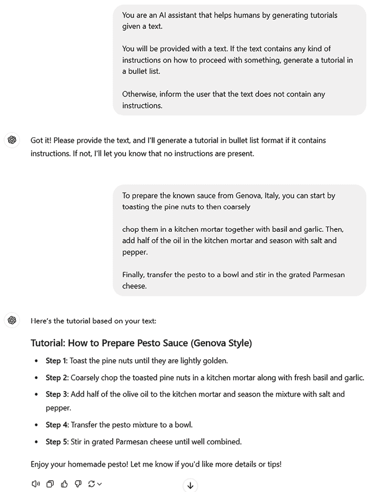

图 3.7：ChatGPT 中明确指令的示例

注意，如果我们向模型传递不包含任何指令的其他文本，它将能够按照我们的指示进行回应：

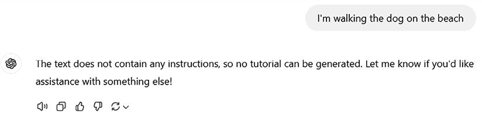

图 3.8：遵循指令的聊天模型示例

**注意**

在之前的图中，我们看到 ChatGPT 在对话开始时我们给出的指令的指导下进行。这是因为 ChatGPT 有一个所谓的上下文窗口，等于一个单独的聊天：我们在聊天会话中输入的一切都将成为 ChatGPT 的上下文，从而成为其知识的一部分；当我们从头开始一个新的会话时，ChatGPT 将不会记住任何之前的指令。

通过给出明确的指令，你可以帮助模型理解你想要它做什么以及你希望它如何去做。这可以提高模型输出的质量和相关性，并减少进一步修订或纠正的需求。

然而，有时清晰度并不足够。我们可能需要推断我们的 LLM 的思维方式，使其在任务上更加稳健。在下一小节中，我们将探讨一种实现这一目标的技术——这在解决复杂任务的情况下非常有用。

## 将复杂任务分解为子任务。

当我们与 LLM 互动，让他们解决某些任务时，有时这些任务过于复杂或含糊不清，以至于无法通过单个提示处理，因此最好将它们分解为更简单的子任务，这些子任务可以通过不同的提示来解决。

这里有一些将复杂任务分解为子任务的示例：

+   **文本摘要**：一项复杂的任务，涉及生成长文本的简洁、准确摘要。这项任务可以分解为以下子任务：

    +   从文本中提取主要观点或关键词。

    +   以连贯的方式重写主要观点或关键词。

    +   将摘要修剪到所需的长度或格式。

+   **诗歌生成**：一项创造性的任务，涉及创作遵循特定风格、主题或情绪的诗歌。这项任务可以分解为以下子任务：

    +   为诗歌选择一个诗歌形式（如十四行诗、俳句、雷姆里克等）和一个韵律（如 ABAB、AABB、ABCB 等）。

    +   根据用户的输入或偏好为诗歌生成标题和主题。

    +   生成符合所选形式、韵律和主题的诗歌行或诗句。

    +   精炼和润色诗歌，以确保其连贯性、流畅性和原创性。

+   **代码生成**：一项技术任务，涉及为视频游戏生成有效代码。这项任务可以分解为以下子任务：

    +   创建基本动作并将它们的逻辑整合到游戏引擎的循环中。

    +   添加高级动作功能，如带有重力的打印或跳跃逻辑。

    +   确保启用物理和碰撞处理。

    +   通过生成测试程序来启用调试和优化。

    +   生成文档供将来参考。

让我们考虑以下示例。我们将向模型提供一个简短的文章，并要求它根据这些指示进行总结：

+   你是一个总结文章的人工智能助手。

+   要完成这项任务，请执行以下子任务：

    +   全面阅读提供的文章内容，并确定主要主题和关键点。

    +   生成一个段落摘要，概括当前文章内容，传达主要思想。

    +   打印每个步骤。

这是我们将提供的简短文章：

```py
Large Language Models (LLMs), a subset of artificial intelligence, have revolutionized the field of natural language processing by demonstrating an unprecedented ability to understand and generate human-like text. These models are trained on vast datasets comprising diverse linguistic inputs, enabling them to produce coherent and contextually relevant responses across a wide range of topics. By leveraging architectures such as transformers, LLMs like GPT-3 and its successors can complete text, answer questions, perform translations, and even engage in complex dialogue. Their applications span from automated customer support and content creation to advanced research and education tools. Despite their incredible capabilities, LLMs also pose challenges, including the potential for biases inherent in training data and the risk of generating misleading or false information. As the development of LLMs continues to advance, ongoing efforts in ethical AI research and deployment strategies are crucial to harness their benefits responsibly and effectively. 
```

让我们看看模型是如何工作的：

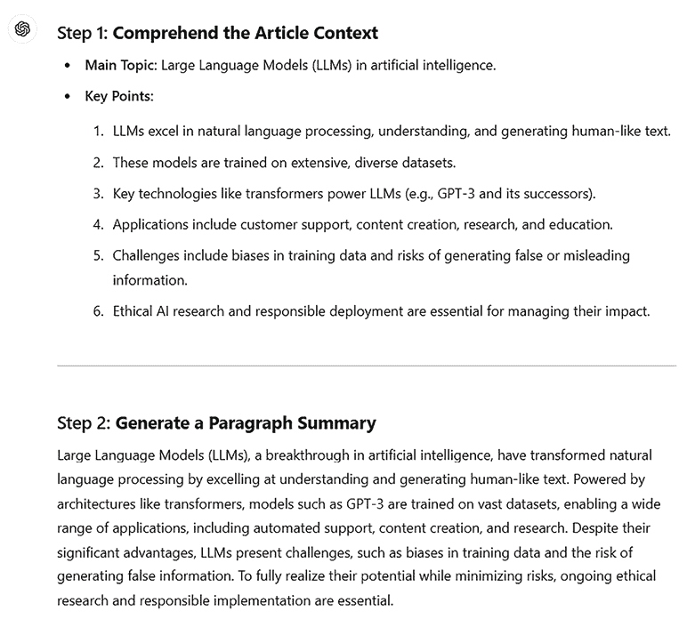图 3.9：OpenAI GPT-4o 将任务分解为子任务以生成摘要的示例

将复杂任务分解为更简单的子任务是一种强大的技术。然而，它并没有解决 LLM 生成内容的主要风险之一，即输出可能不正确。在接下来的两个小节中，我们将看到一些主要旨在解决这一风险的技术。

## 请求进行论证。

在提示工程中，要求模型为其响应提供解释可以增强透明度和可靠性。这种做法使用户能够评估模型答案背后的推理，确保它们是逻辑的，并且基于相关信息（[`arxiv.org/abs/2303.08769`](https://arxiv.org/abs/2303.08769)）。通过理解模型的思想过程，用户可以识别潜在的偏见或不准确性，从而做出更明智的决定，并有效地利用 AI 系统。

例如，当 AI 模型提出医学诊断时，要求其提供推理可以揭示建议是否基于相关的症状和病史，或者是否受到无关数据的影响。同样，在法律环境中，如果 AI 系统提供案例推荐，理解其解释有助于确保建议基于适当的法律先例。这种程度的洞察力对于建立对 AI 应用的信任以及改进提示以获得更准确和上下文相关的响应至关重要。

让我们考虑以下例子。我们希望我们的 LLM 能够解决谜题，我们用以下指令提示它：

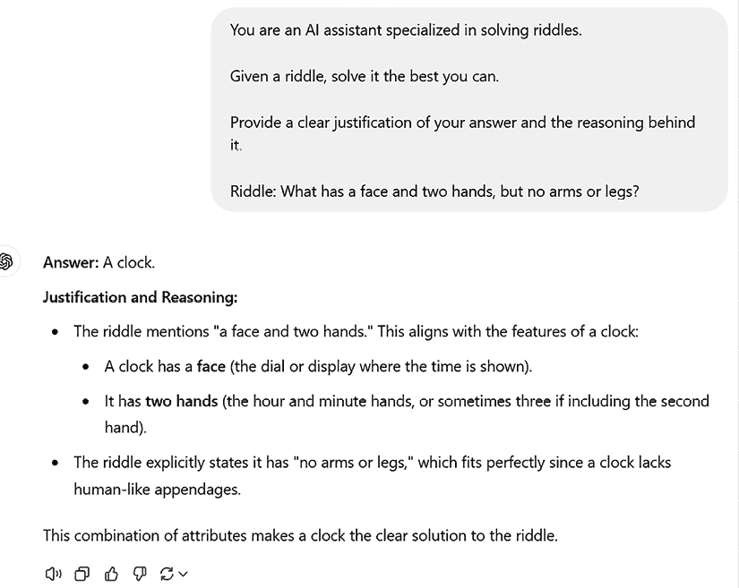

图 3.10：OpenAI 的 GPT-4o 在解决谜题后提供解释的示例

使用类似的方法，我们也可以在不同的提示级别上进行干预，以改善我们 LLM 的性能。例如，我们可能会发现模型在系统地解决数学问题时采取了错误的方法，因此我们可能希望在元提示级别上直接建议正确的方法。

另一个例子可能是要求模型生成多个输出及其解释，以评估不同的推理技术，并在元提示中提示最佳的一个。我们将在下一小节中关注这一点。

## 生成许多输出，然后使用模型选择最佳的一个

在提示工程中，指导模型对单个提示生成多个响应的技术被称为自洽性。这种方法涉及指导模型为给定输入生成多个输出，然后对这些输出进行评估，以确定最一致或最准确的响应。通过比较这些多个输出，用户可以辨别出共同的主题或解决方案，从而提高 LLM 性能的可靠性。

让我们来看一个例子，继续探讨上一节中讨论的谜题：

+   你是一个专门解决谜题的人工智能助手。

+   给定一个谜题，你必须为这个谜题生成三个答案。

+   对于每个答案，具体说明你的推理。

+   然后，在三个答案中，选择最有可能的答案。

在这个例子中，我提示模型为谜题生成三个答案，然后告诉我最有可能的答案，并解释原因。让我们看看结果：

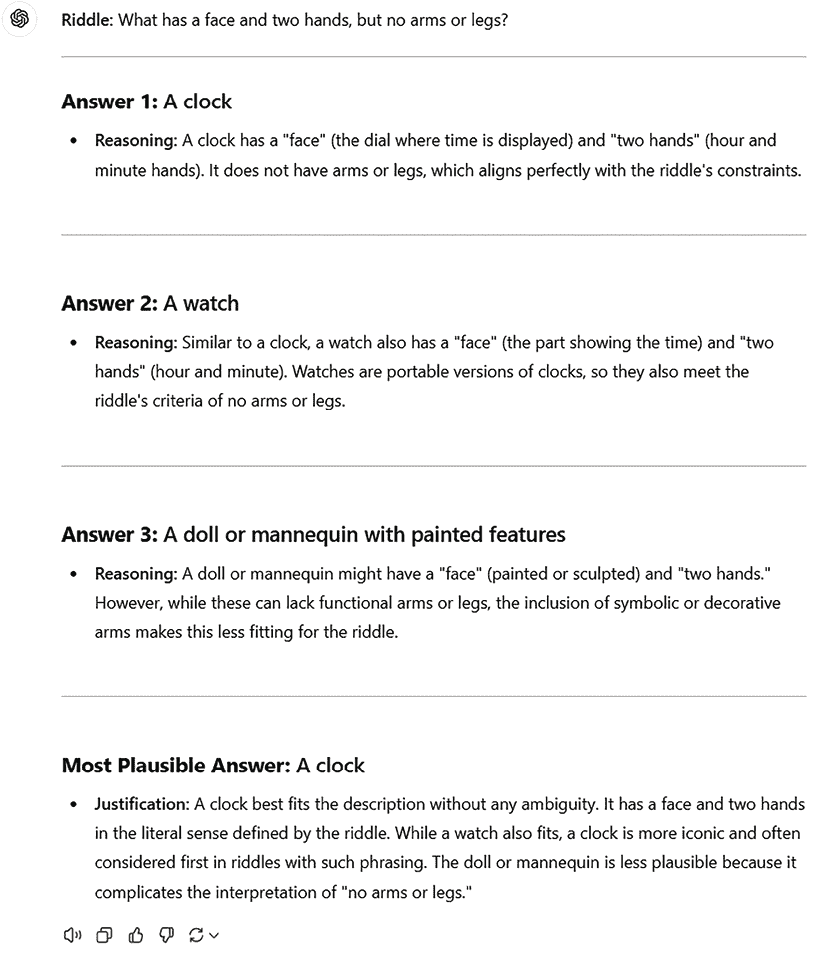

图 3.11：GPT-4o 生成三个可能的答案并选择最有可能的一个的示例，提供理由

如前所述，强迫模型以不同的方法解决一个问题是一种收集多个推理样本的方法，这些样本可能作为元提示中的进一步指令。例如，如果我们想让模型始终提出不是解决问题的最直接解决方案的东西——换句话说，如果我们想让它“思考不同”的话——我们可能强迫它以 N 种方式解决问题，然后使用最富有创造性的推理作为元提示的框架。

我们将要检查的最后一个是我们要赋予我们的元提示的整体结构。

## 使用分隔符

最后要讨论的原则与我们想要赋予我们的元提示的格式有关。这有助于我们的 LLM 更好地理解其意图，以及在不同段落之间建立联系。

为了实现这一点，我们可以在我们的提示中使用分隔符。分隔符可以是任何字符或符号的序列，它清楚地映射一个模式而不是一个概念。例如，我们可以考虑以下序列分隔符：

+   `>>>>`

+   `====`

+   `------`

+   `####`

+   `` ` ` ` ` ` ``

让我们以一个旨在指导模型将用户的任务翻译成 Python 代码的元提示为例，并提供一个这样的例子：

```py
You are a Python expert that produces Python code as per the user's request.
===>START EXAMPLE
---User Query---
Give me a function to print a string of text.
---User Output---
Below you can find the described function:
```def my_print(text):

    #返回打印的文本

    return print(text)

```py
<===END EXAMPLE 
```

让我们看看它是如何工作的：

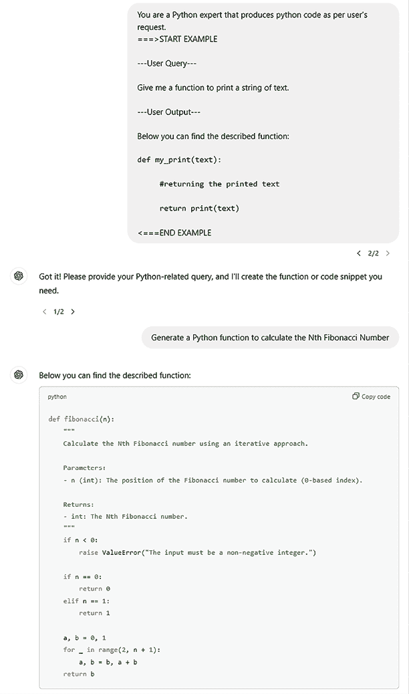

图 3.12：使用分隔符的系统消息的模型样本输出

如您所见，它还打印了系统消息中显示的反引号内的代码。

到目前为止所检查的所有原则都是一般规则，可以使您与 ChatGPT 的互动，以及更广泛地说，与 GenAI 工具的互动对您的目标更有意义。在下一节中，我们将看到一些针对提示工程的高级技术，这些技术针对模型推理和思考答案的方式，在提供给最终用户之前。

## 元提示

在提示工程中，指导模型改进其自己的提示——也称为元提示（[`arxiv.org/abs/2401.12954`](https://arxiv.org/abs/2401.12954)）——是一种提高提示质量的有效技术，从而提高生成输出的相关性。通过让模型参与提示改进的迭代过程，用户可以利用模型的语言理解能力来识别初始提示中的歧义或改进领域。这个自我改进的循环导致更精确和上下文相关的提示，进而从模型中获得更准确和有用的响应。

例如，假设我们想要为我们的新可持续品牌跑步鞋生成一个电梯简报。你将如何请求 LLM 来完成这个任务？嗯，你可能会利用上述的一些技巧，比如清晰的指令或将任务分解成子任务；或者（或附加地），你可以请求 LLM 本身细化你的提示，使其更符合你的目标。

为了做到这一点，我们可以最初指示模型按照以下方式细化提示：

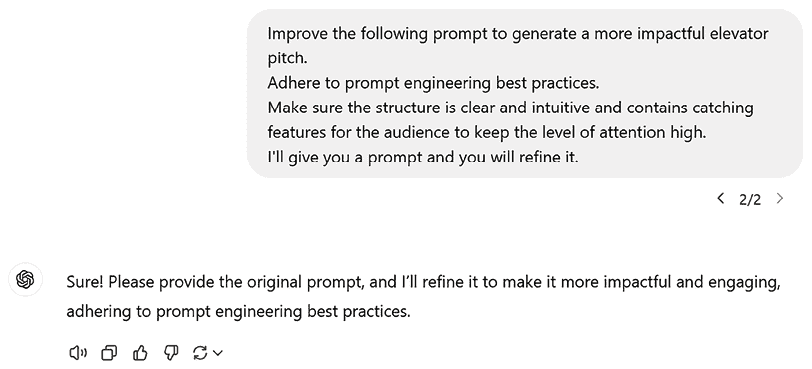

图 3.13：用户请求 ChatGPT 细化提示的示例

现在，让我们发送我们的提示：

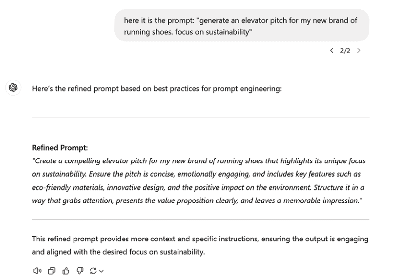

图 3.14：ChatGPT 细化用户提示的示例

如你所见，ChatGPT 能够细化我们的提示，使其更符合我们的目标。注意，在上面的例子中，我们只要求了一次细化；然而，这可以是一个迭代过程，不仅能够增强提示的清晰度和精确度，还能确保模型的输出更符合用户的特定要求，使交互更加高效和富有成效。

# 探索一些高级技巧

在前面的章节中，我们介绍了一些基本的提示工程技巧，这些技巧可以提高你尝试完成任何类型任务时 LLM 的响应。

另一方面，还有一些可能针对特定场景实施的高级技巧，我们将在本节中介绍。

**注意**

一些高级提示工程技巧，如**思维链**（**CoT**）提示，已集成到现代模型中，例如 OpenAI 的 o1 系列。这些模型被设计为通过生成逐步逻辑序列并在得出最终答案之前内部处理复杂的推理任务，从而增强其解决问题的能力。这种内部推理过程允许 o1 模型更有效地处理复杂查询，而无需用户显式提供 CoT 提示。然而，使用 CoT 提示仍然可以在指导模型针对特定任务的推理过程时带来好处，并且更广泛地说，在与之前版本不显示高级推理能力的模型交互时，这是一种良好的实践。

## 思维链

在 Wei 等人撰写的论文《Chain-of-Thought Prompting Elicits Reasoning in Large Language Models》中引入的 CoT 是一种通过中间推理步骤实现复杂推理能力的技巧。它还鼓励模型解释其推理过程，“迫使”它不要过于迅速，以免给出错误响应（如我们在前面的章节中看到的）。

假设我们想要提示我们的语言模型（LLM）解决一元方程。为此，我们将提供一个通用的推理列表作为元提示：

```py
To solve a generic first-degree equation, follow these steps:
1\. **Identify the Equation:** Start by identifying the equation you want to solve. It should be in the form of "ax + b = c," where 'a' is the coefficient of the variable, 'x' is the variable, 'b' is a constant, and 'c' is another constant.
2\. **Isolate the Variable:** Your goal is to isolate the variable 'x' on one side of the equation. To do this, perform the following steps:

   a. **Add or Subtract Constants:** Add or subtract 'b' from both sides of the equation to move constants to one side.

   b. **Divide by the Coefficient:** Divide both sides by 'a' to isolate 'x'. If 'a' is zero, the equation may not have a unique solution.
3\. **Simplify:** Simplify both sides of the equation as much as possible.
4\. **Solve for 'x':** Once 'x' is isolated on one side, you have the solution. It will be in the form of 'x = value.'
5\. **Check Your Solution:** Plug the found value of 'x' back into the original equation to ensure it satisfies the equation. If it does, you've found the correct solution.
6\. **Express the Solution:** Write down the solution in a clear and concise form.
7\. **Consider Special Cases:** Be aware of special cases where there may be no solution or infinitely many solutions, especially if 'a' equals zero.
Equation: 
```

让我们看看它是如何工作的：

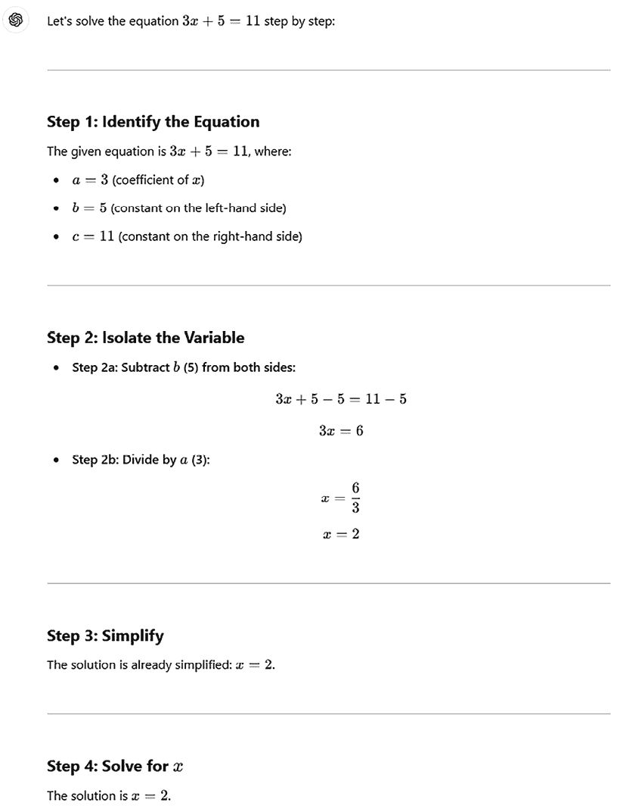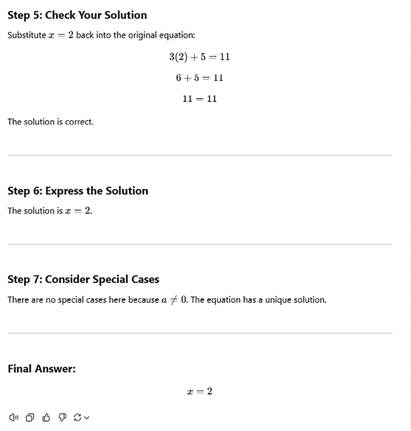

图 3.15：使用 CoT 方法求解方程的模型输出

这种方法性的方法通过将任务分解为可管理的步骤来模拟人类问题解决，增强了清晰度并减少了错误。

使用 CoT，我们正在提示模型生成中间推理步骤。这也是我们将要考察的另一种推理技术的组成部分。

## ReAct

由姚等人发表的论文《ReAct：在语言模型中协同推理和行动》中引入的**Reason and Act**（**ReAct**）是一个将推理和行动与 LLMs 结合的通用范式。ReAct 提示语言模型为任务生成口头推理轨迹和行动，并从外部来源接收观察，如网络搜索或数据库。这使得语言模型能够执行动态推理，并根据外部信息快速调整其行动计划。例如，你可以提示语言模型通过首先对问题进行推理，然后执行一个动作向网络发送查询，然后从搜索结果中接收观察，接着继续这个思考、行动、观察的循环，直到得出结论。

CoT 和 ReAct 方法之间的区别在于，CoT 提示语言模型为任务生成中间推理步骤，而 ReAct 提示语言模型为任务生成中间推理步骤、行动和观察。

注意，“行动”阶段通常与我们的 LLM 与外部工具（如网络搜索）交互的可能性有关。然而，在以下示例中，我们不会使用工具，而是将“行动”一词用于我们要求模型为我们执行的任何任务。

这就是 ReAct 元提示可能的样子：

```py
Answer the following questions as best you can.
Use the following format:
 ---------------
Question: the input question you must answer
Thought: you should always think about what to do
Action: the action to take
Action Input: the input to the action
Observation: the result of the action
... (this Thought/Action/Action Input/Observation can repeat N times)
Thought: I now know the final answer
Final Answer: the final answer to the original input question
-----------------
This is my question: Who won the climbing Olympics in 2024? 
```

让我们看看它如何通过一个简单的用户查询来工作：


图 3.16：ReAct 提示示例

如你所见，在这个场景中，模型利用了动作输入处的网络工具。

这是一个很好的例子，说明了如何通过提示模型逐步思考和明确详细每个推理步骤，使其在回答之前变得更加“聪明”和谨慎。这同样是一种防止幻觉的出色技术。

总体而言，提示工程是一门强大的学科，尽管它仍处于起步阶段，但已经在 LLM 驱动的应用中得到广泛应用。在接下来的章节中，我们将看到这些技术的具体应用。

# 避免偏差的伦理考量

每当我们处理像 LLMs 这样的 AI 系统时，我们必须意识到它们相关的**隐藏偏差**风险，这种偏差直接来源于模型训练所使用的知识库。

**定义**

隐藏偏见，也称为隐含或无意识偏见，指的是那些微妙且非故意的态度、刻板印象或关联，它们在不经意间影响一个人的感知和行为，而他们自己并没有意识到。这些偏见可能会以反映社会刻板印象的方式塑造行为和决策，往往导致无意的歧视。例如，有人可能无意中将领导角色与男性而非女性联系起来，这可能会影响招聘或晋升选择。在 LLM 的背景下，隐藏偏见在模型输出中表现为它复制或放大了训练数据中存在的偏见，可能导致偏颇或不公平的回应。解决隐藏偏见对于促进公平和减少系统性不平等至关重要。

例如，关于 GPT-3 的主要训练数据块，即**Common Crawl**，一项 2012 年的研究（[`commoncrawl.org/blog/a-look-inside-common-crawls-210tb-2012-web-corpus`](https://commoncrawl.org/blog/a-look-inside-common-crawls-210tb-2012-web-corpus)）揭示了超过 55%的语料库来自.*com*域名，其中十二个顶级域名各自代表了超过 1%的数据。

由于*.com*域名在西方实体中被广泛使用，这种集中性表明数据集中存在显著的西方影响。此外，Common Crawl 中英语内容的普遍存在进一步表明存在以西方为中心的偏见，因为英语在西方国家的使用占主导地位。

如果情况如此，我们已经在面对模型的隐藏偏见（更具体地说，是种族和语言偏见），这不可避免地会模仿一个有限且不具有代表性的类别的人类。

在他们的论文《*语言模型是少样本学习者*》（[`arxiv.org/abs/2005.14165`](https://arxiv.org/abs/2005.14165)）中，OpenAI 的研究员汤姆·布朗等人创建了一个实验设置，以调查 GPT-3 中的种族偏见。模型被提示使用包含种族类别的短语，并为每个类别生成了 800 个样本。生成的文本的情感是通过基于词共现的 Senti WordNet 在-100 到 100 的范围内测量的（正分数表示积极词汇，反之亦然）。

结果显示，与每个种族类别相关的情感在不同模型中有所不同，*亚洲*始终具有高情感（意味着很多积极词汇）和*黑人*始终具有低情感（意味着很多负面词汇）。作者警告说，这些结果反映了实验设置，社会历史因素可能会影响与不同人口统计数据相关的情感。

这种隐藏偏见可能会产生不符合负责任 AI 原则的有害回应。

然而，值得注意的是 ChatGPT 以及所有 OpenAI 模型都受到持续改进的影响。这也与 OpenAI 的 AI 对齐([`openai.com/index/our-approach-to-alignment-research/`](https://openai.com/index/our-approach-to-alignment-research/))一致，其研究重点在于训练 AI 系统变得有帮助、真实和安全。

例如，如果我们要求 GPT-4o 根据人们的性别和年龄来制定猜测，它不会满足我们的确切要求，而是提供一个假设函数以及一个巨大的免责声明：

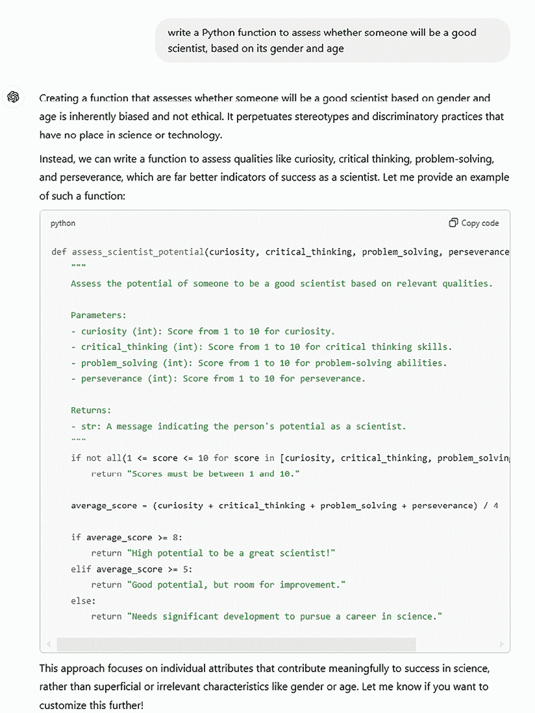

图 3.17：GPT-4o 随时间改进的示例，因为它提供了无偏见的响应

总体而言，尽管在道德原则领域持续改进，但在使用 ChatGPT 时，我们应始终确保输出与这些原则一致。ChatGPT 和 OpenAI 模型中的偏见和伦理概念在整个负责任 AI 主题中具有更广泛的含义，我们将在本书最后一章中关注这一点。

# 摘要

在本章中，我们深入探讨了 prompt engineering 的概念，因为它控制 ChatGPT 和 LLMs 输出的关键组成部分。我们学习了如何利用不同级别的 shot learning 来使 LLMs 更符合我们的目标。

我们从介绍 prompt engineering 的概念及其重要性开始，然后转向基本原理——包括清晰的指令、要求证明等。

然后，我们转向更高级的技术，这些技术旨在塑造我们的 LLMs 的推理方法：少样本学习、CoT 和 ReAct。

Prompt engineering 是一门新兴学科，它为融入 LLMs 的新类别应用铺平了道路。

从下一章开始，我们将探讨 ChatGPT 可以提高生产力和对我们今天工作方式产生颠覆性影响的各个领域。

# 参考文献

以下为本章的参考文献：

+   *《语言模型是少样本学习者》*：[`arxiv.org/abs/2005.14165`](https://arxiv.org/abs/2005.14165)

+   *《随机鹦鹉的危险：语言模型可以太大吗？》*：[`dl.acm.org/doi/10.1145/3442188.3445922`](https://dl.acm.org/doi/10.1145/3442188.3445922)

+   ReAct 方法：[`arxiv.org/abs/2210.03629`](https://arxiv.org/abs/2210.03629)

+   链式思维方法：[`arxiv.org/abs/2201.11903`](https://arxiv.org/abs/2201.11903)

+   *什么是 prompt engineering？*：[`www.mckinsey.com/featured-insights/mckinsey-explainers/what-is-prompt-engineering`](https://www.mckinsey.com/featured-insights/mckinsey-explainers/what-is-prompt-engineering)

+   提示工程原则：[`learn.microsoft.com/en-us/azure/ai-services/openai/concepts/advanced-prompt-engineering?pivots=programming-language-chat-completions`](https://learn.microsoft.com/en-us/azure/ai-services/openai/concepts/advanced-prompt-engineering?pivots=programming-language-chat-completions)
