# 使用 ChatGPT 视觉化释放创造力

在本章中，我们专注于 ChatGPT 的视觉能力，从传统的 DALL-E 图像生成到模型中嵌入的更复杂的设计和格式化活动。

在过去的几个月里，ChatGPT 的视觉能力有了显著提升，因为我们现在正进入多模态时代。事实上，ChatGPT 现在不仅能从自然语言描述中生成图像，还能对多模态数据进行推理并解决复杂查询。这种多模态思维使 ChatGPT 更接近我们大脑处理周围现实的方式，而周围现实主要由视觉输入构成。

在本章中，我们将涵盖以下主题：

+   使用 DALL-E 生成令人惊叹的插图

+   利用 ChatGPT 作为设计师助手

+   探索 GPT 商店中的高级插件

到本章结束时，你将能够通过在你的对话中结合视觉输入和输出，最大限度地发挥 ChatGPT 的作用。

# 什么是多模态？

在*第一章*中，在介绍最新趋势和创新时，我们将多模态作为大型多模态模型（大型基础模型的一个子集）的典型特征引入，它包括处理和生成不同类型的数据，如文本、图像、音频和视频。

**定义**

**大型语言模型**（**LLMs**）和**大型多模态模型**（**LMMs**）都是生成式 AI 领域的一部分，并具有 Transformer 架构。

大型语言模型（LLMs）在大量的文本数据上进行训练，这使得它们能够理解和生成类似人类的文本。它们被应用于内容创作、语言翻译和客户服务代理等应用中。

另一方面，大型多模态模型（LMMs）在 LLMs 的基础上，通过处理和整合多种数据类型，包括文本、图像、音频和视频。这使得它们能够从文本描述中生成图像，用文本上下文分析视频，并创建结合各种数据形式的内容。

LMMs 的附加值在于，它们能够全面地推理异构的周围环境，处理情境的潜在语义，而不是对每种“现实资产”类型进行孤立的推理。我知道这可能听起来过于抽象，所以让我给你举一个例子。

想象一下，你正坐在一个房间里，你能意识到周围发生的每一件事。你听到声音，看到物体，阅读一本好书。所有这些感官都是不同类型的输入进入你的大脑。但你的大脑并没有将它们分开；它将所有这些信息一起处理，让你能够整体地理解你的环境。例如，你可能会将你在书中读到的东西——比如说，一幅美丽的风景——与你从房间窗户看到的景象联系起来。

现在，将 LMM 想象成这个房间里的人。它不仅仅能理解文字（比如阅读一本书），还能“看到”图片（图像）、“听到”声音（语音），并在它们之间建立关联。所有这些信息同时流入，模型将它们结合起来理解整个环境，就像你的大脑将一切融合在一起帮助你理解正在发生的事情。

因此，就像你可以坐在一个房间里并把它当作一个整体体验来感知一样，LMM 可以一次性处理不同类型的数据，无论是图片、文本还是音频剪辑。它不会将这些输入分开处理，而是理解所有结合在一起的全局背景。

在接下来的章节中，我们将探讨在视觉创造力背景下单模态和多模态模型。

# 使用 DALL-E 生成令人惊叹的插图

在前面的章节中，我们学习了当涉及到生成相关结果时，编写良好的提示是多么关键。这对于生成的文本和图像来说同样适用。因此，当我们利用像 DALL-E 3（基模型 DALL-E 的最新版本）这样的模型时，它接收自然语言指令作为输入并生成图像作为输出，编写一个精心设计的提示至关重要。

**注意**

在撰写本书时（2024 年 10 月），DALL-E 3 已集成到 ChatGPT 应用程序中。这意味着：

+   在创建图像之前，你可以无缝地与 ChatGPT 交互，以便你可以想出更有创意的想法（我们将在下一节中看到这个场景）。

+   DALL-E 3 本身是建立在 ChatGPT 之上的，这意味着当用想法提示时，后者将在其后端自动生成一个更精细的提示，以在调用 DALL-E 3 时获得最佳结果。

为 DALL-E 3 设计提示是一个创造性的过程，涉及精心制作描述以产生视觉上令人惊叹且情境合适的图像。让我们探索一些设计提示的关键技术，从设定主题到调整技术细节，如长宽比。

## 定义主题和场景

主题是任何提示的核心。它是你希望 DALL-E 3 可视化的中心对象或概念。你对主题越具体和清晰，DALL-E 就越能准确地解释和创建图像。例如，与其只说“一只狗”，不如指定“一只在花园里玩耍的金毛猎犬。”添加元素，如*场景*，可以进一步细化图像，例如“在春天盛开的郁金香花园里玩耍。”

**示例提示**： “一只金毛猎犬在春天盛开的郁金香花园里玩耍。”

这告诉 DALL-E 不仅要知道主题是什么（小狗），还要知道它在哪里存在（花园）以及什么条件下（春天），为生成的图像提供更清晰的背景。

让我们在 ChatGPT 中嵌入的 DALL-E 3 中试试：

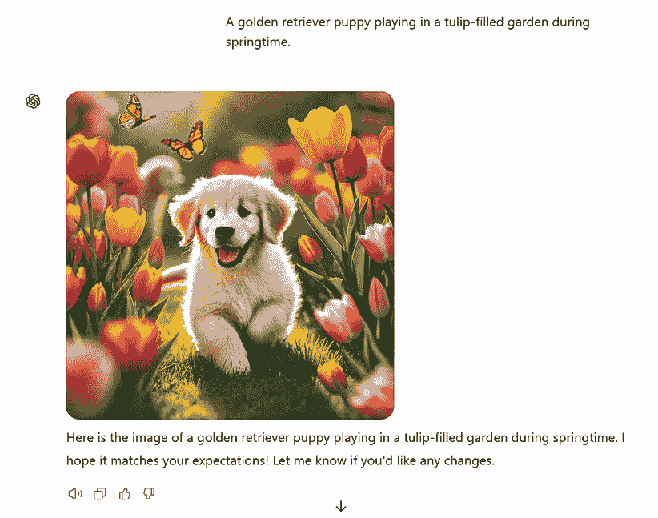

图 8.1：DALL-E 3 在 ChatGPT 中生成图像的示例

图片质量已经非常高；然而，我们可能希望更具体地说明最终产品应该是什么样子。

## 用色彩和光照设定氛围

一旦主题和场景确定，下一步就是通过控制**色彩调色板**和**光照条件**来塑造图像的氛围和气氛。图像的基调可以根据场景是明亮生动还是昏暗平静而大幅改变。颜色可以唤起特定的情绪，而像柔和的日光、强烈的正午光线或情绪化的阴影这样的光照条件可以影响图像的整体感觉。

**示例提示**：“一只金毛猎犬在春天郁金香盛开的花园中玩耍，在柔和的晨光下，花朵为柔和色调。”

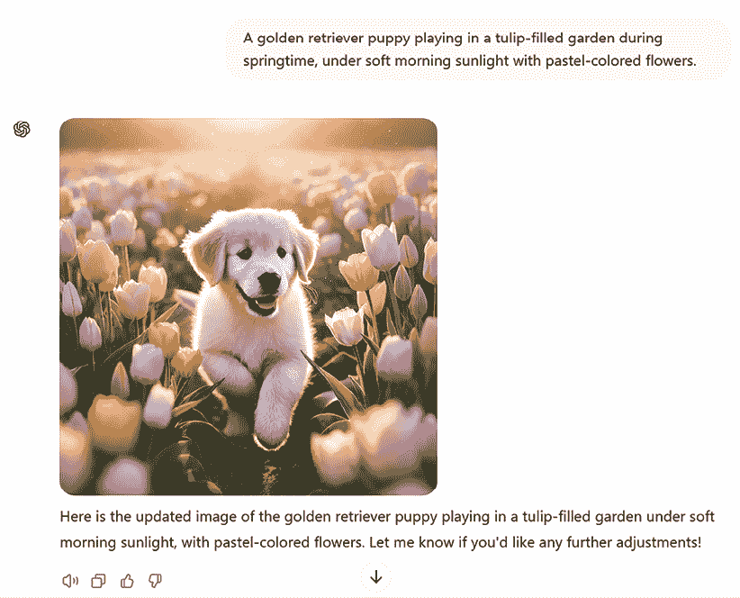

图 8.2：DALL-E 3 根据要求添加更多细节的示例

在这里，“柔和的晨光”营造出温暖宁静的氛围，而“柔和色调的花朵”则添加了特定的色彩调色板，增强了气氛。

## 介绍摄像机角度和材料

通过结合技术方面，如**摄像机视角**或使用的**材料**，可以将你的提示从简单转变为复杂。通过添加这些细节，你指导 DALL-E 以更有意或艺术的方式呈现图像。你可以指定拍摄类型——是特写、广角还是用于复杂细节的微距镜头。

此外，提及材料或纹理，如“画布”、“金属表面”或“木材”，为 DALL-E 提供了如何呈现特定细节的指示。

**示例提示**：“一只金毛猎犬在春天郁金香盛开的花园中玩耍，以特写角度拍摄，焦点柔和，突出花朵和毛发的纹理。”

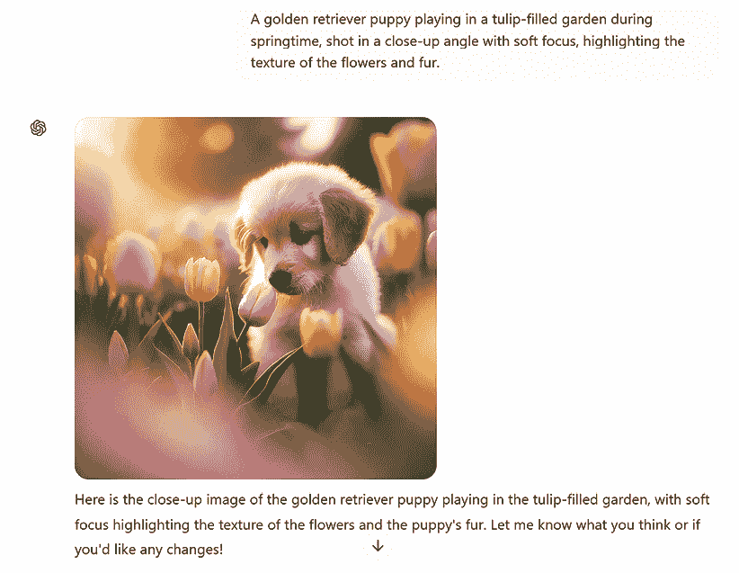

图 8.3：DALL-E 3 根据要求添加更多细节的示例

这告诉 DALL-E 专注于特写细节，增强纹理并创造亲密的拍摄效果。

## 植入艺术影响

另一种提高提示工程的技术是借鉴既定的艺术风格或特定艺术家。通过引用**特定艺术家**或**艺术运动**，你可以给图像注入独特的特征，如梵高的笔触或毕加索的抽象形状。或者，你可以指导 DALL-E 遵循更广泛的艺术运动，如印象派、超现实主义或写实主义，具体取决于你想要的风格。

**示例提示**：“一只金毛猎犬在春天郁金香盛开的花园中玩耍，以印象派风格绘制。场景中有柔和的斑驳阳光透过花朵，模糊而鲜艳的郁金香花瓣。”

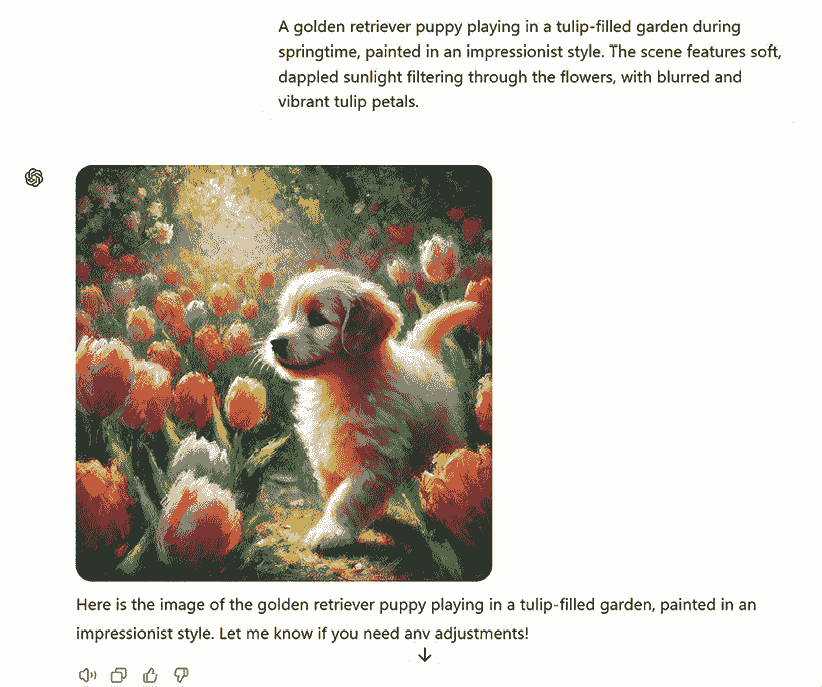

图 8.4：DALL-E 3 根据要求进一步添加细节的示例

这将引导 DALL-E 模仿印象派风格，其重点在于光、色和形状的柔和融合，为图像创造梦幻般的质感。

## 设置文化和历史背景

在你的提示中添加**文化**或**历史**背景可以加深意义并影响最终图像。无论你是在创作具有历史主题的作品，如“中世纪欧洲”，还是带有“科幻城市”的未来感，包括这些元素有助于 AI 模型理解时间段、建筑风格和场景风格。

**示例提示**： “一只金毛猎犬在 18 世纪欧洲的郁金香花园中玩耍，周围环绕着华丽的石制喷泉和巴洛克建筑。”

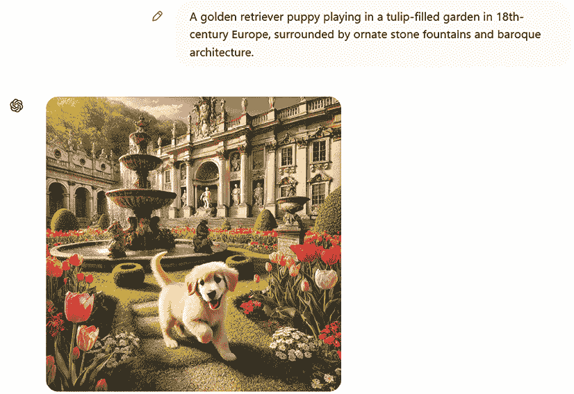

图 8.5：DALL-E 3 根据要求进一步添加细节的示例

这不仅确立了一个时间段，还提供了如巴洛克建筑这样的文化参考，为 DALL-E 提供了关于风格和细节的特定视觉提示。

## 选择媒介和形式

在提示工程中，另一个强大的技术是指定图像“创建”的**媒介**。这可以是摄影、绘画，甚至是雕塑。每种媒介都有自己的纹理、形式和视觉规则，DALL-E 可以模仿。同样，描述物体的**形式**或**形状**可以进一步引导构图。

**示例提示**： “一只金毛猎犬在春天的郁金香花园中玩耍，以柔和的笔触和鲜明的色彩对比捕捉成数字绘画。”

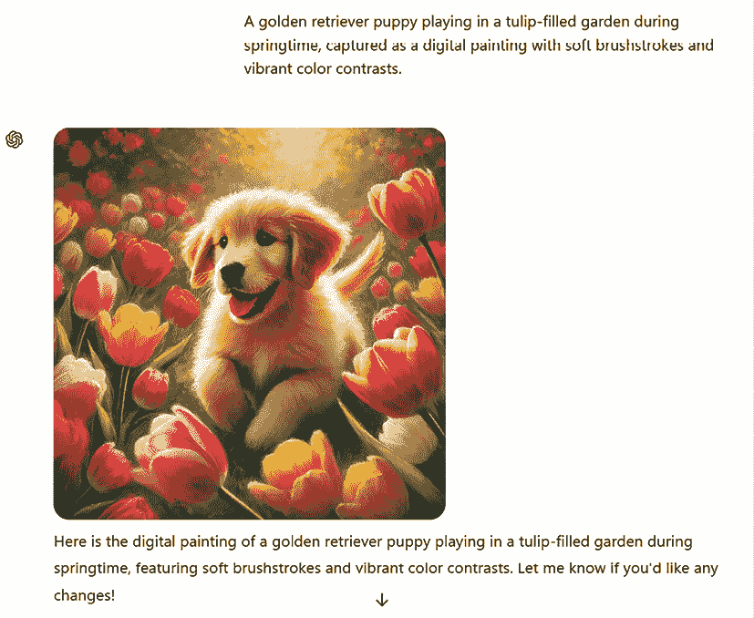

图 8.6：DALL-E 3 根据要求进一步添加细节的示例

在这里，媒介的选择——数字绘画——为 DALL-E 提供了如何构建图像的指示，确保它反映了与数字艺术常见的纹理和技术。

## 添加风格、技术和画幅比例

最后，一个精心制作的提示的完成细节通常来自于包括关于**风格**、**技术**或**画幅比例**的细节。无论你希望图像看起来像油画，以逼真的细节呈现，还是匹配特定的图像格式，如宽屏或方形，这些选择最终确定了美学方向。

例如，你可以指示 DALL-E 遵循特定的摄影风格，如“黑白肖像摄影”，或请求具有电影画幅比例的图像，如“16:9”，以创建宽屏风景。

**示例提示**： “一只金毛猎犬在春天的郁金香花园中玩耍，以生动的色彩捕捉成数字绘画，宽屏 16:9 的画幅比例，类似于全景风光画。”

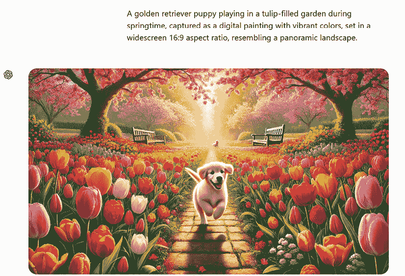

图 8.7：DALL-E 3 根据要求进一步添加细节的示例

这个最后的细节为 DALL-E 提供了如何构图和风格化图像的精确指令。

## 结合技术以实现最大影响

虽然上述每种技术都可以单独使用，但提示工程的实际力量在于将多个元素结合起来，以产生丰富、层次分明的描述。

**综合示例提示**：“一只金毛猎犬在春天郁金香盛开的花园中玩耍，以特写角度拍摄，焦点柔和。画面以印象派风格绘制，有柔和的阳光和柔和的彩色花朵。场景有松散的笔触，将小狗的毛发与精致的郁金香在梦幻般、温暖的氛围中融合在一起。画作以 16:9 的宽高比数字化呈现，以柔和、模糊的效果捕捉光与色的温柔游戏，让人联想到经典的印象派艺术。”

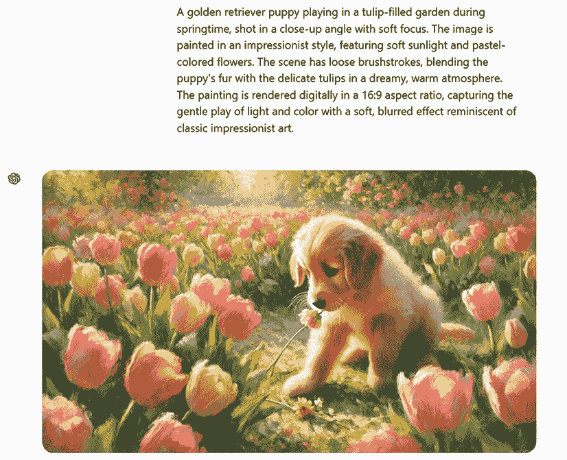

图 8.8：DALL-E 3 根据要求进一步添加细节的示例

通过结合主题、场景、氛围、艺术影响和技术细节，这个提示为 DALL-E 提供了详细的指令，这可能会产生一个高度准确、视觉上吸引人的图像。

DALL-E 3 的提示工程是一个需要平衡创造性和精确性的微妙过程。通过深思熟虑地结合诸如主题、场景、氛围、风格和技术参数等元素，您可以生成高度定制且视觉上引人入胜的图像。

然而，DALL-E 3 与 ChatGPT 的本地集成带来了更多的可能性。事实上，集成的真正价值在于这项服务提供的多模态能力，我们将在下一节中介绍这一点。

# 利用 ChatGPT 作为设计师助理

随着 GPT-4 Vision 和随后的 GPT-4o 的出现，我们在多模态领域见证了巨大的加速，因为这些模型能够处理图像和自然语言。然而，它们只能产生文本输出（当然包括代码）。随着 DALL-E 3 集成到 ChatGPT 体验中，我们现在有一个能够以图像和文本（以及为了完整性，还有音频）的形式与我们进行交互的 AI 系统。

让我们看看一些具体的应用。

## 时尚助理

假设我们身处时尚界，并被要求围绕最新趋势制作博客内容，以及提出新的时尚想法。我们最近参加了一个时尚活动并拍摄了一些照片作为可能的灵感来源。让我们看看 ChatGPT 如何帮助我们：

1.  首先，让我们要求模型生成一篇关于提供的服装的简短博客文章：

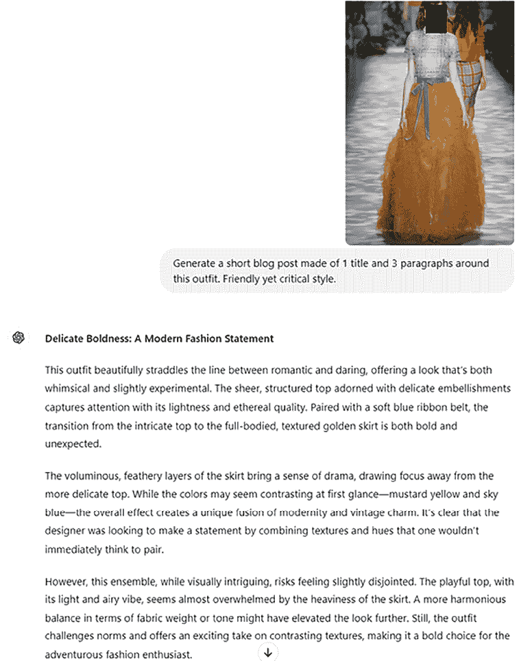

图 8.9：ChatGPT 理解图像并基于它生成文章的示例

1.  现在我们来提出一个更具体的问题，关于裙子的材质：

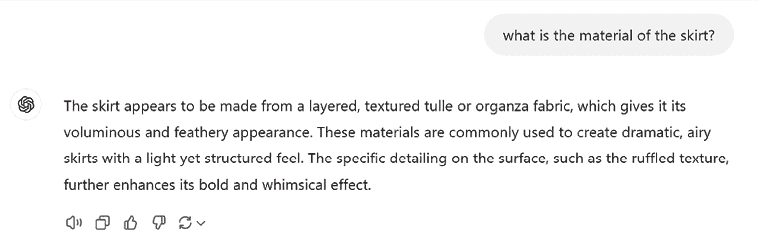

图 8.10：ChatGPT 分析图像中裙子材质的示例

1.  现在我们希望我们的模型生成一幅插图，以油画风格再现这套装扮：

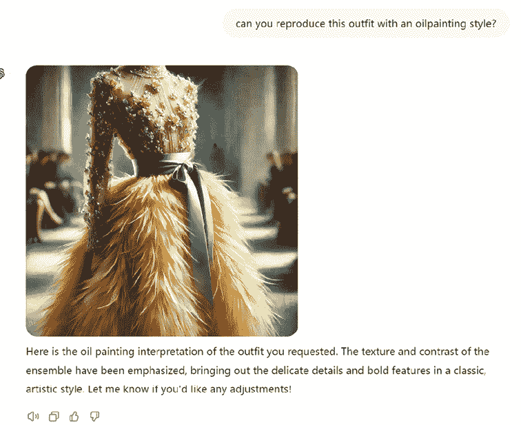

图 8.11：DALL-E 3 基于提供的图像生成插图的示例

1.  要求一些调整：

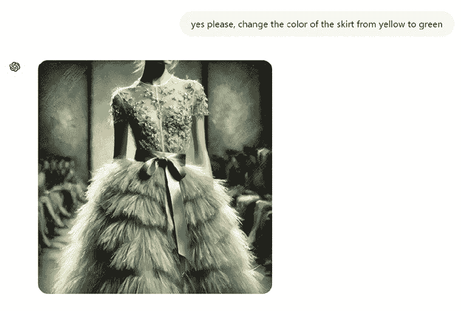

图 8.12：DALL-E 3 根据要求细化图像的示例

1.  现在让我们用一些配饰来扩展这套装扮：

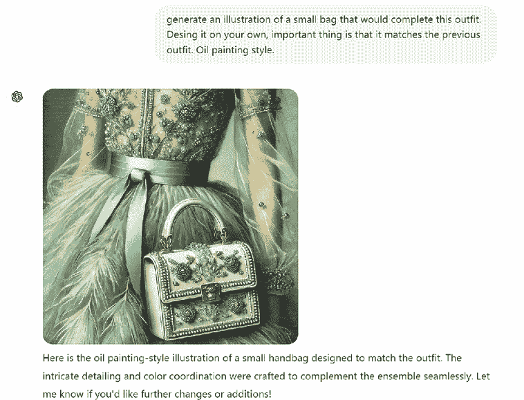

图 8.13：DALL-E 3 为图像添加细节的示例

1.  最后，让我们生成一套全新的装扮：

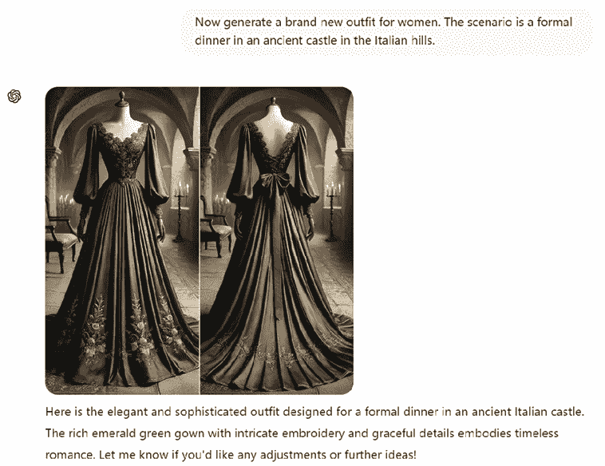

图 8.14：DALL-E 3 生成全新装扮的示例

在过去几个月里，该模型的图片质量和文本理解能力不断提高，你现在可以欣赏到 GPT-4o 和 DALL-E 3 在同一用户界面内的多模态协作。

注意，与之前章节中探讨的其他任务类似，上述示例可以是一个迭代过程，其中我们要求 ChatGPT 根据我们的要求进一步细化结果。

## UX 设计师

在*第五章*中，我们探讨了如何利用 ChatGPT 生成、优化和调试代码。当然，当涉及到我们想要构建的网站的**用户体验**（**UX**）设计时，这可以与更高级的辅助工具相结合。例如，在生成代码之前，我们可能想要询问 ChatGPT 如何组织 UX，使用哪种调色板，组件的整体风格等等。

假设我们想要开发我们的作品集着陆页，并与 ChatGPT 进行头脑风暴会议：

1.  我将首先要求 ChatGPT 为我技术作品集建议一些设计风格（截断输出）：

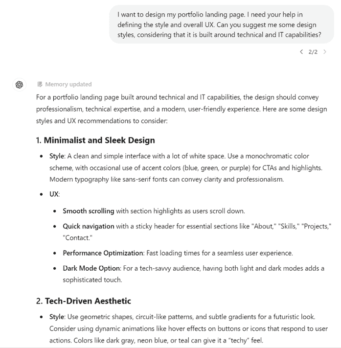

图 8.15：ChatGPT 为我网站建议不同风格的示例

1.  我们选择简约而时尚的设计。现在我想得到一些关于调色板的灵感（输出截断）：

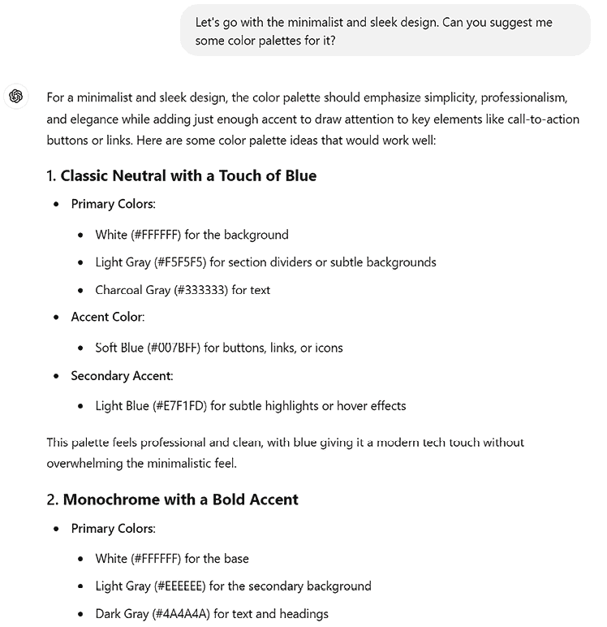

图 8.16：ChatGPT 为简约 UX 建议不同调色板的示例

1.  我们选择选项 1，并让模型建议一些我应该嵌入我的作品集（截断输出）的进一步用户体验（UX）功能：

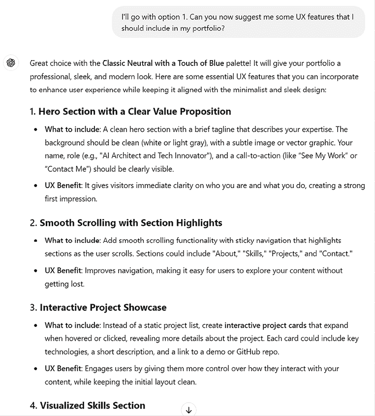

图 8.17：ChatGPT 建议在 UX 中包含的功能的示例

1.  现在我非常想看到我网站的草案。正如我们所学的，我们可以要求模型生成构建它的代码；然而，在此之前，我们可能想要有一个视觉表示，以便我们可以对我们要达到的最终产品有一个概念。让我们看看嵌入的 DALL-E 3 模型是否能够做到这一点：

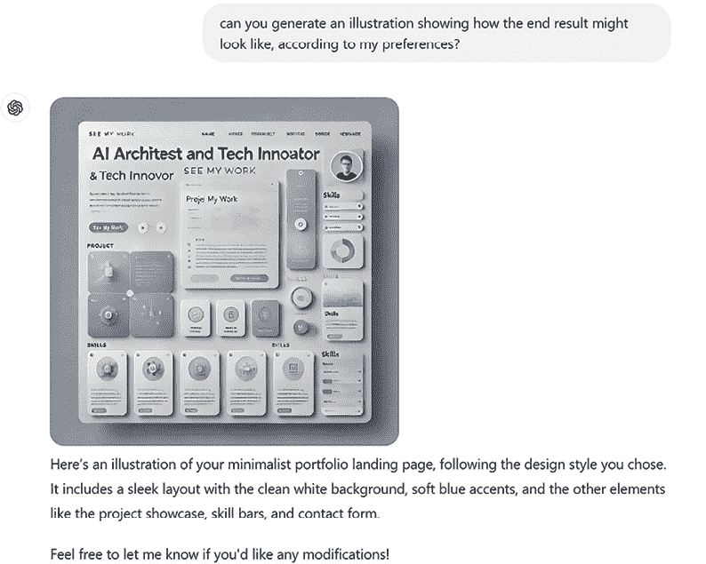

图 8.18：我们 UX 可能看起来如何的视觉草图示例

嗯，正如你可能已经注意到的，图像模型在生成文本方面仍然存在困难。然而，它仍然设法产生了一个符合我偏好的设计——一个简约、经典的色调，带有蓝色调，并提供了额外的 UX 功能。

在下一段中，我们将看到 ChatGPT UX 设计能力的更多示例，特别是当我们将它们纳入现有的网页设计平台（如 Wix 或 Canva）时。

## 样式迁移

我要展示的最后一个例子是如何将一个插图的风格迁移到另一个。如果你正在开发一套具有一致风格的插图，然后你非常欣赏你想要加入列表中的某个视觉元素，但这个视觉元素与之前一直应用于所有插图的风格不匹配，这可能很有用。然而，这个视觉元素并不符合你一直应用于所有插图的风格。如果是这种情况，你可以向 ChatGPT 提供一个你风格的示例以及你想要应用该风格的插图，并请求进行样式迁移。

让我们看看实际效果。想象一下，我们正在使用以下草图风格的插图：

图 8.19：草图风格插图示例

然后你发现了一个非常棒的插图，你希望将其包含在你的集合中：

图 8.20：你想要以不同风格展示的插图示例

让我们看看如果要求 ChatGPT 进行样式迁移会发生什么：

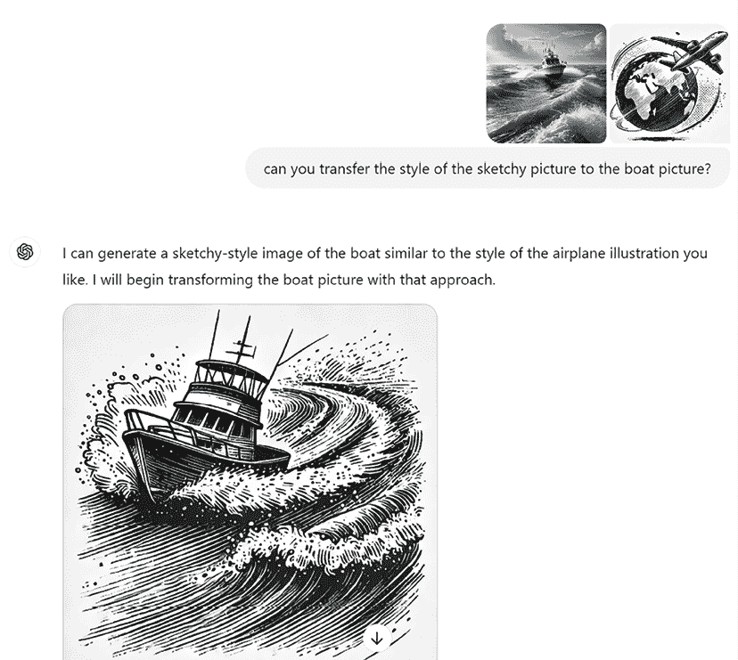

图 8.21：使用 DALL-E 3 的样式迁移示例

太棒了！正如你所见，新的插图完美地符合我正在应用于插图集中的草图风格。

样式迁移的酷之处在于，即使你没有参考图片，你仍然可以应用它。例如，假设你想要将表现主义风格应用于你的插图。

让我们要求 ChatGPT 将这种风格迁移到船的插图上，而不提供上述参考图像：

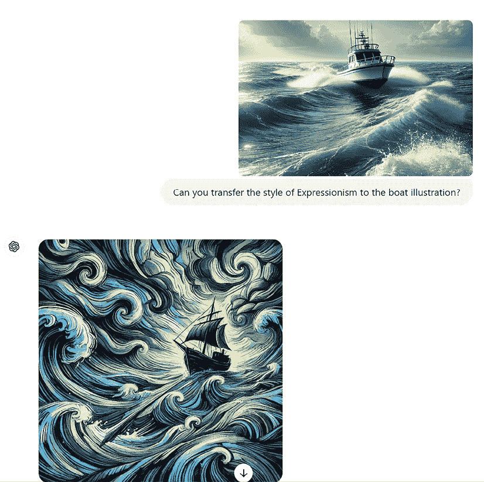

图 8.22：使用 DALL-E 3 的样式迁移示例

现在，所有这些视觉助手都可以作为独立的聊天机器人使用；然而，如果它们与我们在之前活动中通常使用的软件（如用于图像编辑的 Photoshop 或用于视觉设计的 Canva）集成，将会更加无缝。

另一种实现这种进一步整合的方法是利用插件，并从 GPT 商店构建自己的 GPT。我们将在下一章中介绍 GPT，所以不会深入探讨它们是什么以及如何从头开始创建自己的 GPT；然而，在下一节中，我将向你展示一些预先构建并公开可用的 GPT，它们正好提供这种与第三方服务的无缝集成，并可以提升你的视觉创造力。

# 探索 GPT 商店中的高级插件

2024 年 1 月，OpenAI 推出了 GPTs，这些可以被定义为 ChatGPT 的专用和定制版本。用户可以通过指定系统消息、一系列动作、语气和其他我们将要介绍的功能来创建自己的 GPT。一旦你创建了你的 GPT，你就可以通过 GPT 商店将其公开，这是一个对所有拥有 ChatGPT Plus 的用户开放的优质市场。

你可以通过[`chatgpt.com/gpts`](https://chatgpt.com/gpts)访问商店，并从那里浏览由消费者和公司开发的许多 GPT。在本节中，我们将介绍一些由在视觉设计领域工作的公司开发的有趣 GPT，这些公司通过插件（在 GPT 术语中，这些插件被称为“动作”）整合生成式 AI（我们将在下一章中介绍这个话题）。

## Canva

**Canva**是一个于 2013 年在澳大利亚推出的图形设计平台。它的目标是使设计民主化，让每个人都能使用，无论他们的技能水平如何。Canva 提供了一系列工具和模板，用于创建从社交媒体图形和演示文稿到海报、促销物品，甚至网站的一切。

Canva 的一个关键特性是其直观的拖放界面，它使用户能够轻松地自定义他们的设计。无论你是在使用电脑还是移动设备，Canva 都通过其网页和移动应用提供无缝体验。此外，Canva 还包含强大的照片和视频编辑功能，使其成为满足所有设计需求的综合工具。

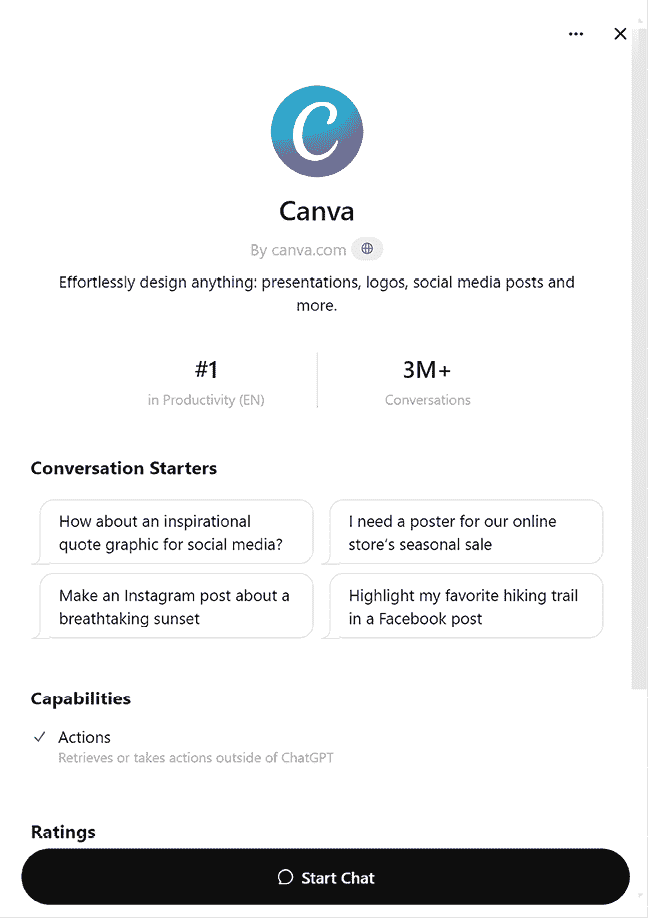

图 8.23：Canva 插件

让我们测试一下：

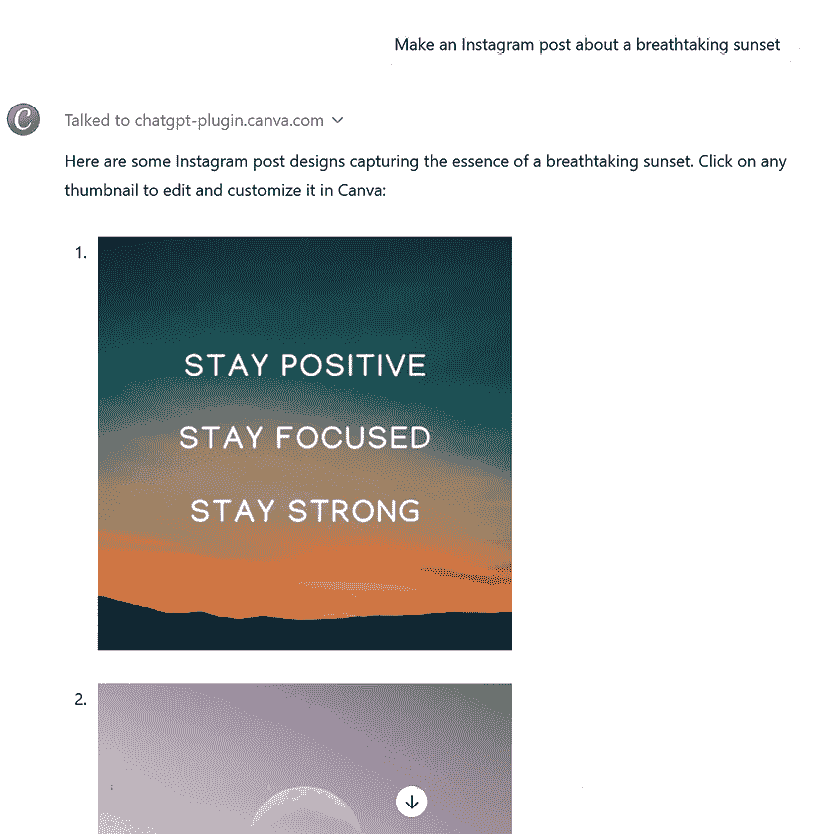

图 8.24：ChatGPT 利用 Canva 插件的示例

你还可以展开**Talked to chatgpt-plugin.canva.com**标签页来查看 API 调用的配置（正如我们将在下一章中看到的，GPT 动作本质上都是 REST API 调用）。

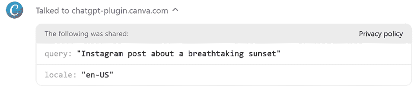

图 8.25：Canva 插件 API 调用的细节

Canva GPT 所做的是根据你的自然语言请求从 Canva 的模板中检索一些选项供你选择，并且还会添加一个标题使其与你的主题相关。一旦你确定了一个符合你需求的提案，你就可以点击它，并在 Canva 中直接进行编辑：

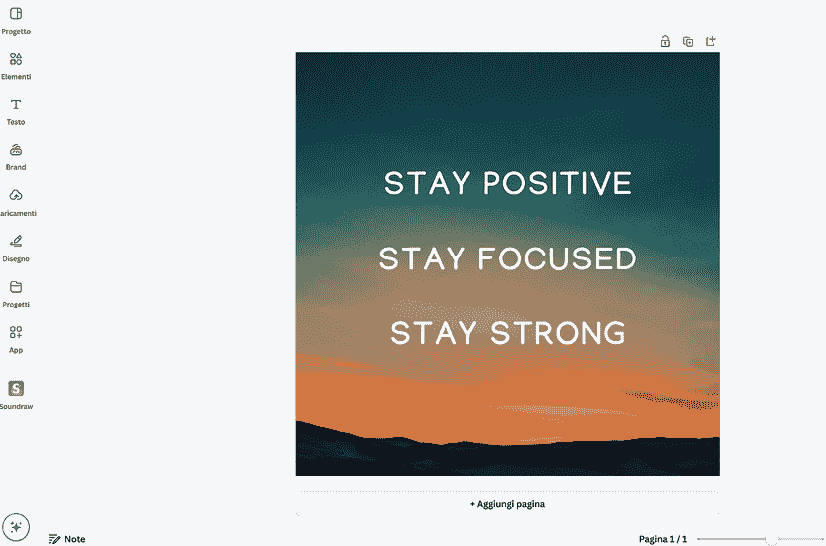

图 8.26：Canva 插件的输出示例

Canva GPT 是一个非常实用的工具，可以帮助你用自然语言起草你的视觉设计，并且它与 Canva 平台的无缝集成允许你在不同平台之间保持流畅，不会丢失想法。

## Wix

**Wix**是一个领先的基于云的网站开发平台，它使用户能够轻松地创建令人惊叹的专业网站。成立于 2006 年，Wix 彻底改变了人们构建和管理在线存在的方式。凭借其直观的拖放界面，用户可以设计网站而无需任何编码技能。

Wix 提供了一系列可定制的模板和高级功能，包括电子商务功能、SEO 工具和集成营销解决方案。无论你是小企业主、艺术家、博主还是企业家，Wix 都提供了你需要的工具，让你的愿景变为现实，并有效地触及你的受众。

图 8.27：Wix 插件

利用 ChatGPT 背后的对话模型，Wix 允许客户与 ChatGPT 协同设计他们的网站，同时直接在 Wix 中创建后端。一旦对话和协同创作结束，用户可以直接跳转到最终网站，并在 Wix 中继续编辑它。

假设，例如，我们想要设计一个展示我们作品的组合：

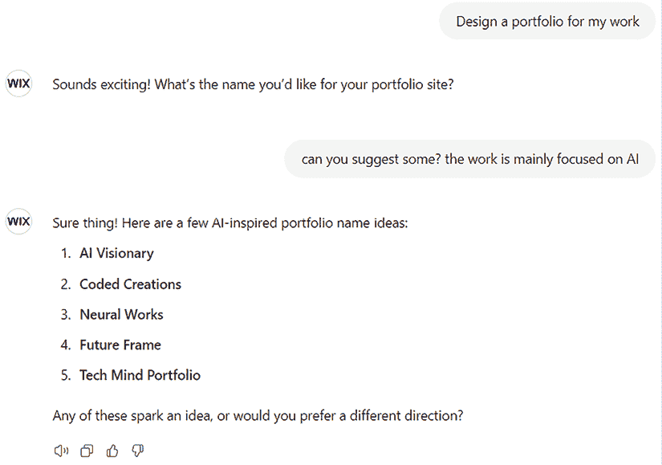

图 8.28：Wix 插件的交互示例

自从这些最初的互动以来，我已经为与我的 GPT 进行协同设计会议做好了准备，在这个案例中，GPT 被定制得可以继续向我提出有用的问题，以构建最终产品。在提出的名字中，我认为我会选择 Coded Creations。

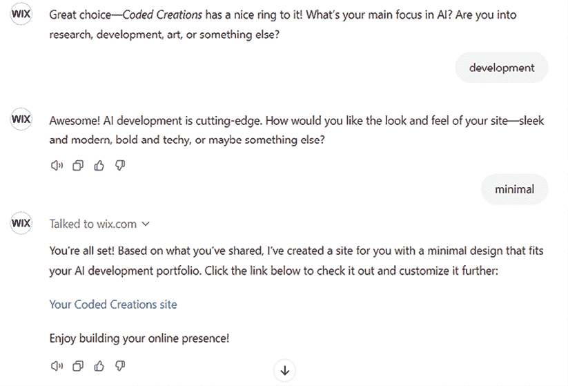

图 8.29：Wix 插件生成网站的示例

一旦它收集了一些更多信息，GPT 就在 Wix 上为我生成了网站，并提供了链接。在这种情况下，你还可以展开**与 wix.com 交谈**选项卡来查看通话的配置（正如我们将在下一章中看到的，GPT 操作本质上都是 REST API 调用）。

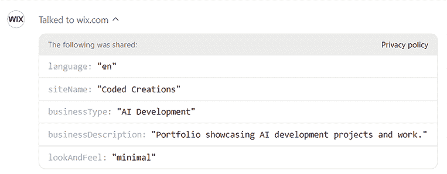

图 8.30：Wix 插件 API 调用的详细信息

让我们看看结果：

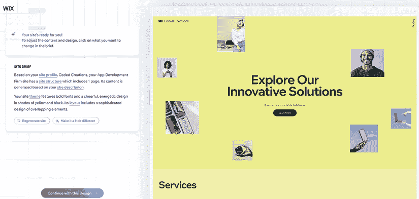

图 8.31：Wix 插件的最终输出示例

就这样！现在你可以继续进行这个设计，或者让嵌入在 Wix 中的 AI 进行一些轻微的修改后重新生成它。或者，你可以直接通过 ChatGPT 进行修改，如下所示：

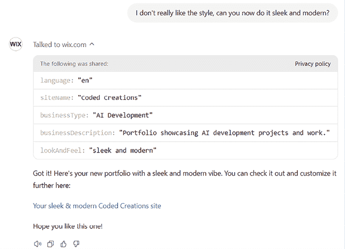

图 8.32：Wix 插件根据用户请求调整 API 调用示例

如 API 调用参考所示，**lookAndFeel**字段已更改为我们所要求的。让我们看看结果：

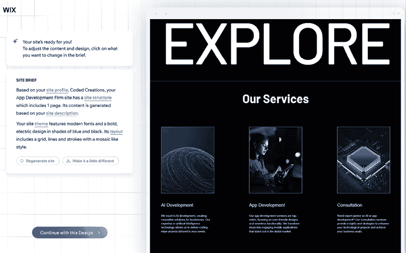

图 8.33：Wix 插件调整输出的示例

就这样！仅仅通过几次交互，我们就创建和修改了我们的着陆页的第一稿。再次强调，你总是有进一步定制的可能性，但从一个非空白页面开始通常会更加高效。

## Veed.io

**Veed.io**是一个创新的在线视频编辑平台，让所有技能水平的创作者都能制作出专业质量的视频。成立于 2017 年，总部位于英国伦敦，Veed.io 迅速在数字内容创作领域树立了声誉。该平台旨在通过一系列用户友好的工具和功能简化视频编辑过程。从自动字幕和文本转视频功能到屏幕录制和背景噪音消除，Veed.io 提供了将创意愿景变为现实所需的资源。Veed.io 专注于易用性和可访问性，正在改变视频的制作方式，使高质量的制作对每个人来说都变得可行。

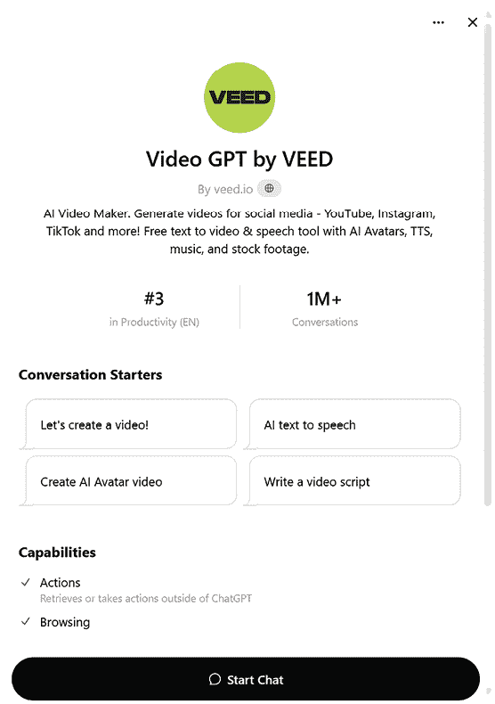

图 8.34：Veed.io 插件

让我们测试一下：

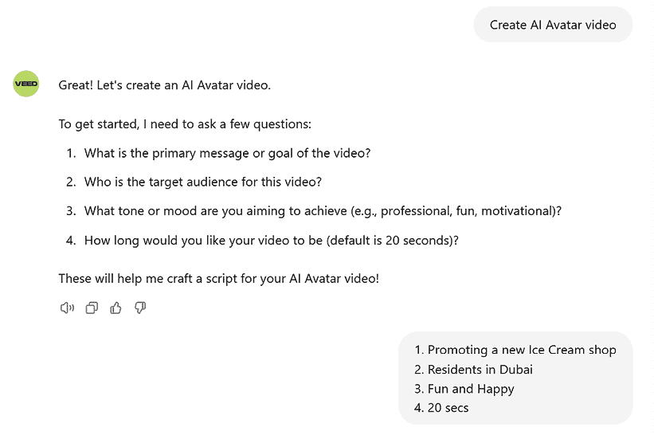

图 8.35：Veed.io 插件请求进一步详情以进行 API 调用示例

如你所见，GPT 要求我提供更多详情以确保它能完成任务。一旦提供了所需的信息，GPT 就会继续生成最终的视频：

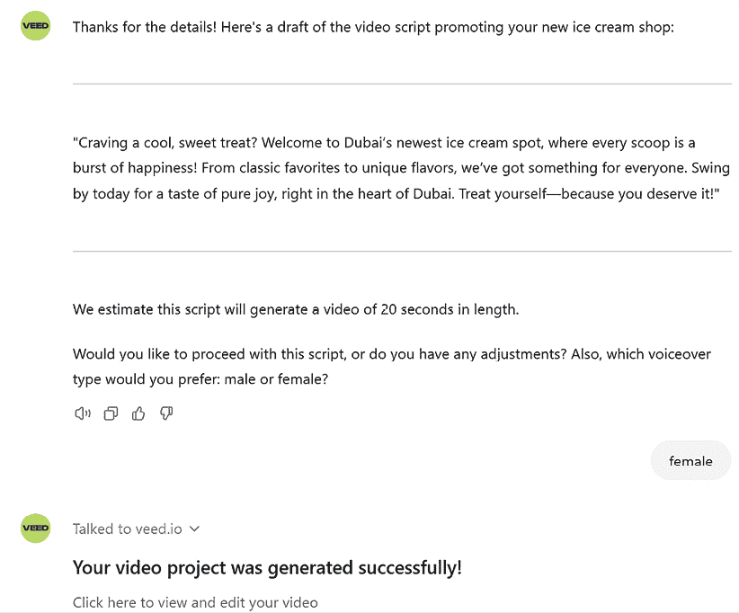

图 8.36：Veed.io 插件生成最终输出的示例

让我们检查 API 调用：

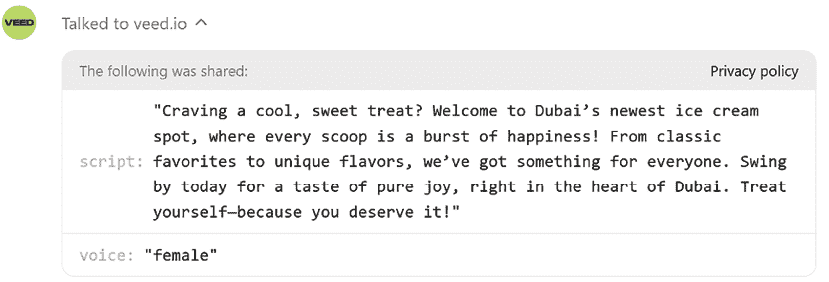

图 8.37：Veed.io 插件 API 调用详情

让我们看看结果：

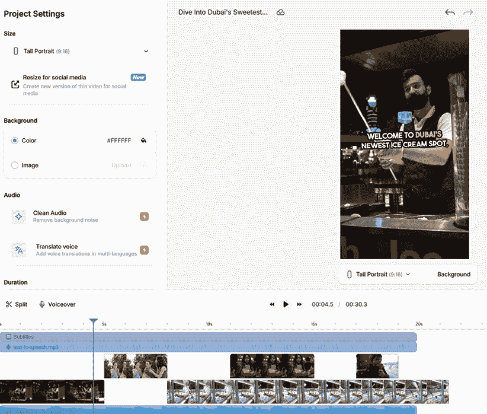

图 8.38：Veed.io 插件输出的示例

一旦点击链接，你将被引导到新视频的编辑页面。旁白是我们向 GPT 指示的女性头像，你可以看到视频已经包含了多个不同的场景和视觉效果。

这些只是市场上众多视觉 GPT 中的三个例子。许多公司正在发布他们自己的 GPT，以允许与他们的平台无缝集成，它们值得探索！

# 摘要

利用 ChatGPT 作为视觉助手可以提高你的生产力，同时保持你的创造力。

通过掌握提示设计，你可以生成令人惊叹的、量身定制的插图，满足你的确切需求。无论你是在进行品牌建设、内容创作还是艺术项目，ChatGPT 都充当一个可靠的设计助手，简化复杂任务同时实现高质量的输出。

此外，探索 GPT 商店中的高级插件可以提升体验，提供更广泛创造可能性的专业工具。实际上，ChatGPT 设计和其视觉能力（以及其一般能力）的真实价值在于我们能够将它们整合到我们自己的工具和流程中，解锁无缝的生产力流程。正如本章所展示的，这可以通过 GPT 的行为实现，更广泛地说，通过 GPT——这是我们将在下一章更详细讨论的主题。

# 参考文献

+   点赞的作用：在线反馈如何影响用户的心理健康：[`arxiv.org/abs/2312.11914`](https://arxiv.org/abs/2312.11914)

+   在线心理健康支持中促进同理心对话：一种强化学习方法：[`arxiv.org/abs/2101.07714`](https://arxiv.org/abs/2101.07714)

+   第二次机器时代：在辉煌技术时代的工作、进步和繁荣：[`psycnet.apa.org/record/2014-07087-000`](https://psycnet.apa.org/record/2014-07087-000)

+   技术压力对角色压力和生产率的影响：[`www.tandfonline.com/doi/abs/10.2753/MIS0742-1222240109`](https://www.tandfonline.com/doi/abs/10.2753/MIS0742-1222240109)

+   关于工作未来的大辩论，解释说明：[`www.youtube.com/watch?v=TUmyygCMMGA`](https://www.youtube.com/watch?v=TUmyygCMMGA)
