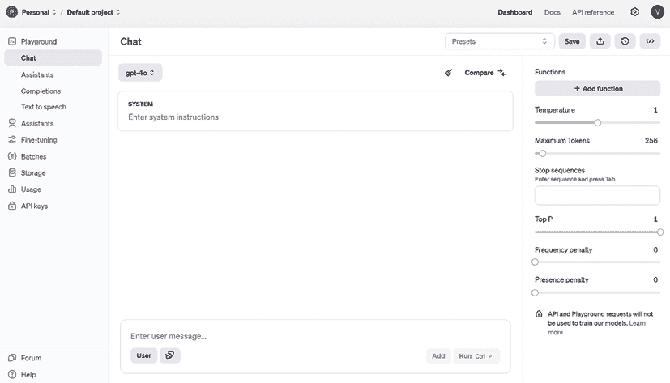
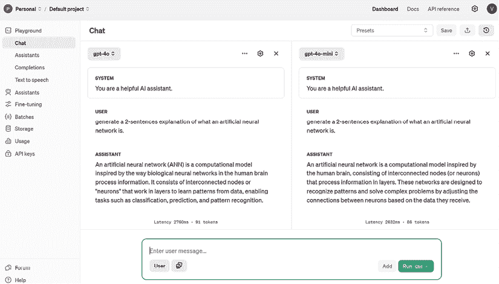
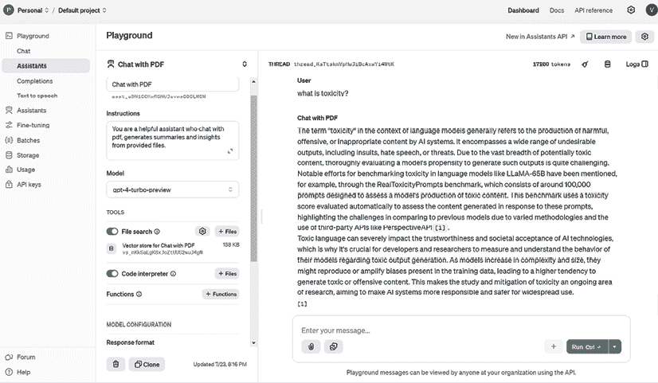
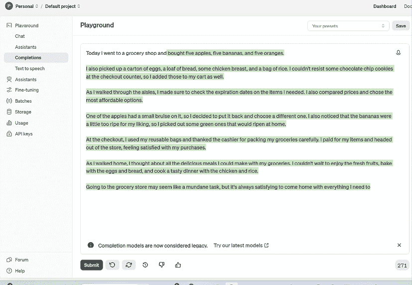
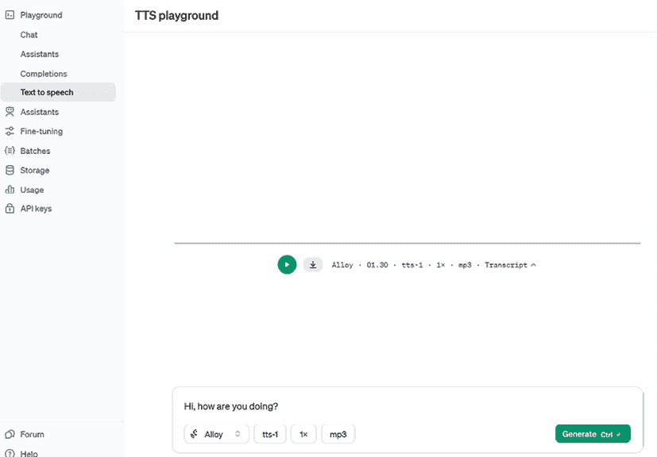
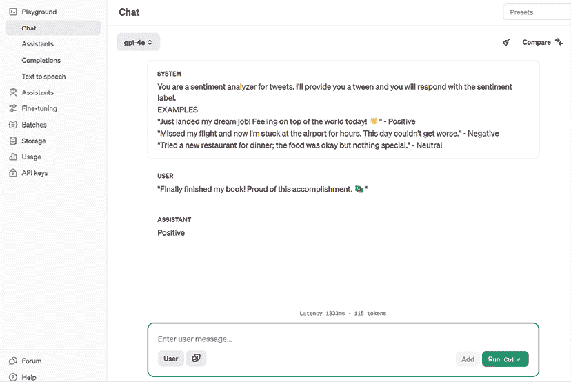
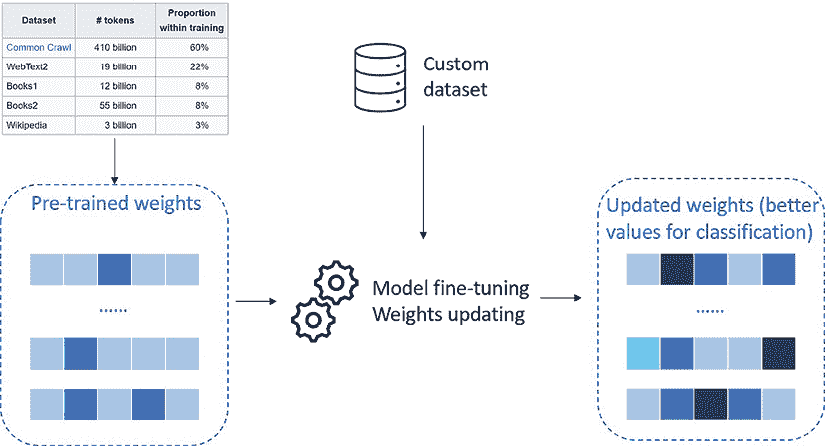

# 附录

在本书的主要章节中，我们通过 ChatGPT 的视角探索了 OpenAI 模型的力量，深入其对话界面，并理解了它如何改变我们与 AI 互动的方式。然而，OpenAI 的世界远不止 ChatGPT 熟悉的基于聊天的体验。为了充分利用这些模型的能力，了解 OpenAI 提供的更广泛工具和界面至关重要。

本附录致力于探索这样一个工具：**OpenAI 游乐场**。游乐场提供了一个灵活的环境，可以用来实验 OpenAI 的模型，允许用户对参数、输出和行为有更多的控制。无论您是想微调响应、测试不同的用例，还是仅仅想更深入地了解模型的能力，游乐场都是一个无价的资源。

在本附录中，我们将：

+   演示游乐场界面及其关键特性。

+   展示如何从游乐场直接与 OpenAI 模型交互。

+   提供使用游乐场时最大化结果的技巧和最佳实践。

到本附录结束时，您将具备使用 OpenAI 的游乐场及其模型的知识和信心，超越 ChatGPT。

# 在游乐场中尝试 OpenAI 模型

要访问 OpenAI 游乐场，您需要创建一个 OpenAI 账户并导航到[`platform.openai.com/playground`](https://platform.openai.com/playground)。这是着陆页的样貌：



图 1：OpenAI 游乐场，位于 https://platform.openai.com/playground

如您从*图 1*中看到的，游乐场提供了一个用户界面，用户可以从中开始与模型交互，您可以在聊天界面的顶部选择模型。请注意，无论何时通过 OpenAI 游乐场使用模型，您都将根据交互量支付费用。您可以在 https://openai.com/api/pricing/找到定价页面。

在深入探讨游乐场的主要部分之前，让我们首先定义一些您在本章中会看到的术语：

+   **标记**：标记可以被认为是 API 用于处理输入提示的词片段或段。与完整单词不同，标记可能包含尾随空格甚至单词片段。一般来说，一个英文标记大约相当于四个字符，或者是一个单词的三分之四（您可以在以下链接中参考如何将单词转换为 OpenAI 模型中的标记：https://platform.openai.com/tokenizer）。

+   **提示词**：在自然语言处理（NLP）和生成式 AI 的背景下，提示词指的是作为输入提供给 AI 语言模型以生成响应或输出的文本片段。提示词可以是一个问题、一个陈述或一个句子，它被用来为语言模型提供上下文和方向。

+   **上下文**：在 GPT 领域，上下文指的是用户提示之前的单词和句子。这个上下文被语言模型用来根据训练数据中发现的模式和关系生成最可能的下一个单词或短语。

+   **模型置信度**：模型置信度是指 AI 模型对特定预测或输出的确定性或概率水平。在 NLP 的背景下，模型置信度通常用于表示 AI 模型对其生成的针对给定输入提示的响应的正确性或相关性的信心程度。

+   **工具**：通过工具，我们为模型提供额外的技能，使其能够调用以完成用户的任务。一个函数总会有自然语言描述，以便模型知道何时调用它。

在 Playground 中，有四个主要部分可以与模型交互。让我们在下一节中探讨它们。

## 聊天

在这里，你可以测试今天所有可用的聊天模型，包括仅文本模型（如 GPT-3.5）和多模态模型（如 GPT-4o）。你可以提供系统消息——你提供给模型的指令集——全部使用自然语言。

**定义**

在 LLMs 的背景下，系统消息是在对话开始时提供的指令，用于确立模型的角色、行为和响应指南。这条消息设定了总体上下文，指导模型的交互以符合特定的目标或约束。例如，系统消息可能指定模型应充当友好的旅行顾问或保持正式的语气。这种配置可以在 AI 开发者后端级别设置，这样最终用户将无法访问它，因此无法“强迫”模型以不同的方式行事。

你还可以比较对同一问题的两个不同模型的输出。以下是如何做到这一点的示例：



图 2：两个模型之间比较的示例

对于每个模型，你还可以调整一些你可以配置的参数。以下是一个列表：

+   **温度**（范围从 0 到 2）：这控制着模型响应的随机性。低温度使模型更加确定，意味着它倾向于对相同的问题给出相同的输出。例如，如果我将温度设置为 0 多次询问我的模型“什么是 OpenAI？”的话，它大多数时候会给出相同的答案。另一方面，如果我用大于 0 的温度做同样的事情，它将尝试每次修改其答案，包括措辞和风格。

+   **最大令牌数**：这控制着模型对用户提示的响应长度（以令牌为单位）。

+   **停止序列**（用户输入）：这使响应在期望的点结束，例如句子的结尾或列表的结尾。

+   **最高概率**（范围从 0 到 1）：这控制了模型在生成响应时将考虑哪些标记。这意味着模型将从累积概率总和达到分布 90%的最小标记集中进行选择。

+   **频率惩罚**（范围从 0 到 1）：这控制了在生成的响应中相同标记的重复。惩罚越高，同一响应中看到相同标记超过一次的概率越低。惩罚会根据标记到目前为止在文本中出现的频率成比例地减少（这是与以下参数的关键区别）。

+   **存在惩罚**（范围从 0 到 2）：这与之前的参数类似，但更严格。它减少了重复任何到目前为止已出现在文本中的标记的机会。由于比频率惩罚更严格，存在惩罚还增加了在响应中引入新主题的可能性。

## 助手

**OpenAI 助手**可以被视为一种更快、更简单地开发 AI 代理的方法。实际上，助手可以被定义为由 LLM 驱动的实体，具有要遵循的指令和要使用的工具或插件集。

在 OpenAI 助手的案例中，它们附带三个预构建的工具：

+   **文件搜索**：这允许用户上传自定义文档，以便助手可以导航这些文档以完成用户的查询。它使用基于 RAG 的框架。

+   **函数调用**：这允许用户定义一组自定义函数，这些函数可以被助手调用以完成特定任务。

+   **代码解释器**：这指的是助手运行代码的能力，无论是针对提供的文档（例如，在需要数学计算的电子表格或分析论文的情况下）还是简单地解决用户提供的复杂任务（例如，复杂的数学问题）。

在以下屏幕截图中，您可以看到一个名为**与 PDF 聊天**的助手示例，该助手专门用于响应提供的文档（在我的情况下，我上传了 Hugo Touvron 等人撰写的论文《LLaMA：开放和高效的基座语言模型》）。



图 3：OpenAI 助手的示例

如您从前面的屏幕截图中所见，助手能够回答我的问题，从提供的文档中检索知识。实际上，我的问题相当模糊，因为“毒性”一词可以指多个领域；尽管如此，助手知道要监视提供的文档作为主要信息来源。

## 完成内容

本节涉及一类称为**基础模型**的模型，如 GPT-3。它们是所谓“助手模型”（或聊天模型，如我们之前所看到的）的基础。例如，聊天模型 GPT-3.5 Turbo（ChatGPT 背后的模型）是基础模型 GPT-3 的微调版本。

**定义**

完成模型（基础模型）旨在生成对提示的单个响应，这使得它们适合像文本生成和摘要这样的任务，而不需要在多次交互中保持上下文。另一方面，聊天（助手）模型针对交互式对话进行了优化，能够在多个回合中保持上下文，非常适合聊天机器人和虚拟助手等应用。

下面您可以看到游乐场中一个典型的完成任务的示例：



图 4：OpenAI 游乐场中完成任务的示例

如您所见，使用我的话“今天我去了一家杂货店和”，模型用最可能出现的词语完成了这个句子。

今天，完成模型很少使用，因为它们在聊天模型面前表现不佳，但它们可以被进一步微调以适应特定的用例（我们将在本节稍后讨论微调）。

## 文本转语音

除了上述的语音识别模型 *Whisper* 之外，OpenAI 还发布了一个 **文本转语音**（**TTS**）模型，该模型可以直接在游乐场中测试。

让我们看看一个例子：



图 5：在游乐场中使用 OpenAI 的 TTS 模型的示例

如您从上面的截图中所见，您可以选择声音、模型、速度和生成的音频格式。

所有的前述模型都是预先构建的，也就是说，它们已经在庞大的知识库上进行了预训练。

然而，有一些方法可以使你的模型更加定制化，更适合你的用例。

## 定制你的模型

定制你的模型的第一个方法嵌入在模型的设计方式中，它涉及到在少量样本学习方法中向模型提供上下文。

例如，你可以要求模型生成一篇文章，其模板和词汇库回忆起你之前已经写过的另一篇文章。为此，你可以向模型提供生成文章的查询，以及前述文章作为参考或上下文，这样模型就能更好地准备你的请求。

这里有一个例子：



图 6：使用 OpenAI 游乐场中的少量样本学习方法的对话示例

在前面的例子中，我指示模型只输出推文情感的标签，并提供了三个如何做到这一点的示例。

定制你的模型的第二种方法更为复杂，被称为 **微调**。微调是将预训练模型适应新任务的过程。

在微调中，预训练模型的参数被调整，无论是通过调整现有参数还是添加新参数，以更好地适应新任务的数据。这是通过在针对新任务的小型标记数据集上训练模型来完成的。微调背后的关键思想是利用从预训练模型中学到的知识，并将其微调到新任务，而不是从头开始训练模型。看看下面的图：



图 7：模型微调

在前面的图中，你可以看到一个关于如何在 OpenAI 预构建模型上执行微调的架构。想法是，你有一个带有通用权重或参数的预训练模型可用。然后，你用自定义数据（通常是*键值*提示和完成）来喂养你的模型，如下所示：

```py
{"prompt": "<prompt text>", "completion": "<ideal generated text>"}
{"prompt": "<prompt text>", "completion": "<ideal generated text>"}
{"prompt": "<prompt text>", "completion": "<ideal generated text>"} 
```

一旦完成训练，你将拥有一个针对特定任务表现特别出色的定制模型，例如，对你公司文档的分类。

微调的好处在于，你可以根据你的用例定制预构建模型，而无需从头开始重新训练它们，同时利用较小的训练数据集，因此需要更少的训练时间和计算。同时，模型保留了通过原始训练学习到的生成能力和准确性，这是在大量数据集上进行的。

# 摘要

OpenAI 游乐场提供了一个强大的工具，通过零样本或少量样本学习和微调技术进行高级 AI 模型的实验。游乐场允许用户直接与预训练模型互动，使其更容易为特定任务（如情感分析或文档分类）进行定制和增强。

对于希望利用 OpenAI API 构建 AI 应用的开发者来说，掌握这些技术对于确定特定模型的配置是否满足特定应用的需求至关重要。

尽管本书的重点主要在 ChatGPT 上，但在企业级场景（我们在*第十章*中讨论过）中，当涉及到 AI 用例时需要更多定制的方法；这就是为什么熟悉游乐场和 OpenAI 模型 API 的概念对于拥抱这一波 AI 驱动应用开发的新思维非常有价值。

# 加入我们的 Discord 和 Reddit 社区

对本书有任何疑问或想参与关于生成式 AI 和 LLMs 的讨论？加入我们的 Discord 服务器`packt.link/I1tSU`和 Reddit 频道`packt.link/jwAmA`，以连接、分享和与志同道合的爱好者合作。

 


[packt.com](http://packt.com)

订阅我们的在线数字图书馆，全面访问超过 7,000 本书和视频，以及领先的行业工具，帮助您规划个人发展并推进职业生涯。欲了解更多信息，请访问我们的网站。

# 为什么订阅？

+   使用来自 4,000 多位行业专业人士的实用电子书和视频，减少学习时间，增加编码时间

+   通过为您量身定制的技能计划提高学习效果

+   每月免费获得一本电子书或视频

+   完全可搜索，便于轻松访问关键信息

+   复制粘贴，打印和收藏内容

在 [www.packt.com](http://www.packt.com)，您还可以阅读一系列免费的技术文章，订阅各种免费通讯，并享受 Packt 书籍和电子书的独家折扣和优惠。

# 您可能还会喜欢的其他书籍

如果您喜欢这本书，您可能会对 Packt 的以下其他书籍感兴趣：


**使用 DALL-E 3 生成创意图像**

Holly Picano

ISBN: 9781835087718

+   掌握 DALL-E 3 的架构和训练方法

+   以精确的方式创建精细印刷和其他 AI 生成的艺术作品

+   无缝融合人工智能与传统艺术

+   解决人工智能艺术中的伦理困境

+   探索数字创造力的未来

+   为您的艺术追求实施实用的优化技术


**使用 OpenAI API 构建人工智能应用**

Martin Yanev

ISBN: 9781835884003

+   在使用 OpenAI API 进行自然语言处理任务方面打下坚实的基础

+   构建、部署并将支付集成到各种桌面和 SaaS 人工智能应用中

+   将 ChatGPT 与 Flask、Django 和 Microsoft Office API 等框架集成

+   通过集成 DALL-E API 到您的桌面应用程序中，释放您的创造力，生成令人惊叹的 AI 艺术

+   体验 Whisper API 的语音识别和文本到语音功能

+   了解如何针对您的特定用例微调 ChatGPT 模型

+   掌握 AI 嵌入技术以衡量文本字符串的相关性

# Packt 正在寻找像您这样的作者

如果您有兴趣成为 Packt 的作者，请访问 [authors.packtpub.com](http://authors.packtpub.com) 并今天申请。我们已与成千上万的开发者和技术专业人士合作，就像您一样，帮助他们将见解与全球技术社区分享。您可以提交一般申请，申请我们正在招募作者的特定热门话题，或提交您自己的想法。

# 分享您的想法

您已经完成了《Practical Generative AI with ChatGPT, Second Edition》，我们很乐意听听您的想法！如果您在亚马逊购买了这本书，请[点击此处直接进入亚马逊评论页面](https://packt.link/r/1836647859)并分享您的反馈或在该购买网站上留下评论。

您的评论对我们和科技社区都非常重要，并将帮助我们确保我们提供高质量的内容。
