# 4

# 使用 ChatGPT 提升日常生产力

在本章中，我们将介绍 ChatGPT 可以为普通用户在日常生活中执行的主要活动，以提升他们的生产力。本章将侧重于写作辅助、决策和信息检索的具体示例，并提供建议和提示，以便你可以自行实施。

到本章结束时，你将学会如何将 ChatGPT 用作以下活动的助推器：

+   每日活动，如安排日程、准备餐食和购物

+   生成全新的文本内容

+   提高你的写作技能并适应不同的受众

+   检索用于研究和竞争情报的文档和信息

# 技术要求

对于本章，你需要一个 ChatGPT 账户。请参阅*第二章*了解如何开设 ChatGPT 账户。

# ChatGPT 作为日常助手

ChatGPT 可以作为有价值的日常助手，帮助你管理任务和优化工作流程。通过提供个性化帮助，它可以优化你的日常日程，从而节省你的时间并提高你的效率。

在撰写本书时，ChatGPT 的响应附带了一系列功能：

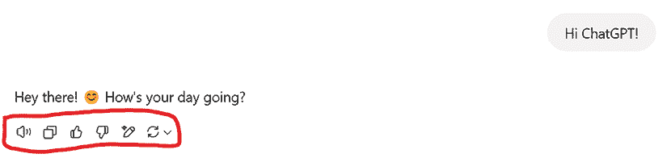

图 4.1：ChatGPT 用户界面上的图标

让我们逐一检查它们：

+   图标将允许 ChatGPT 大声朗读其响应。

+   图标允许你复制 ChatGPT 的输出。

+   图标允许你为 ChatGPT 的响应提供反馈，以供未来改进。

+   图标允许你使用 ChatGPT 的新功能“在画布上编辑”。它允许你在白色画布上编辑 ChatGPT 的响应，以便进一步调整以满足你的需求。

+   图标允许你即时更改模型并使用新选定的模型重新生成响应。

这些功能使得整个 ChatGPT 的用户体验更加互动和灵活。让我们从如何使我的日子更加高效的一般建议开始：

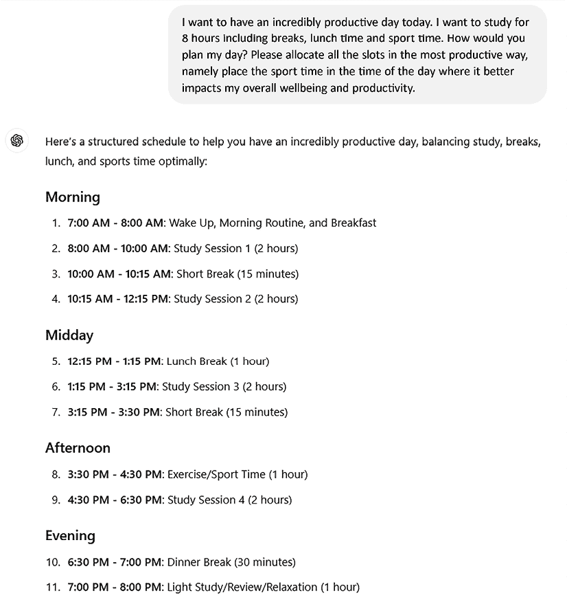

图 4.2：ChatGPT 生成的一个高效例程示例

在组织我的周计划时，ChatGPT 的另一个有趣用途是，我可以将其用作餐食准备助手。请注意，在这里我也要求了特定的表格格式：

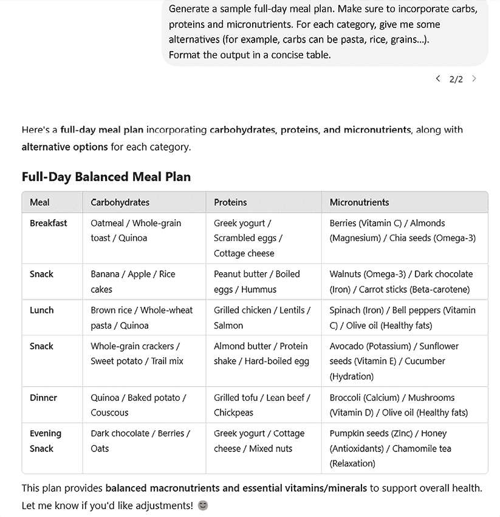

图 4.3：ChatGPT 为我工作周生成的餐食准备

除了准备餐食，ChatGPT 还可以根据我的要求生成锻炼计划：

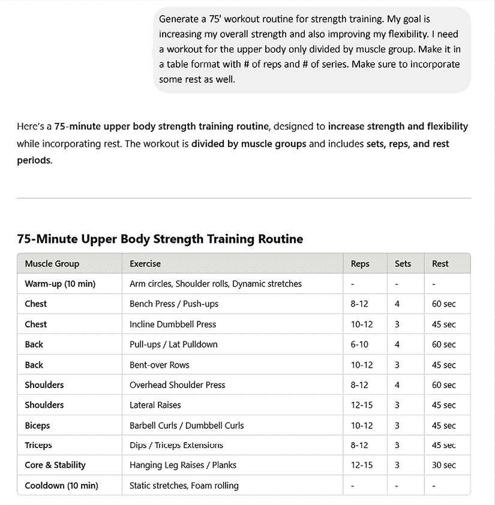

图 4.4：ChatGPT 生成的锻炼计划

ChatGPT 还可以成为忠诚且自律的学习伙伴。例如，它可以帮你总结长篇论文，让你对讨论的主题有一个概述，或者帮助你准备考试。

假设你正在使用由 Lorenzo Peccati 等人撰写的《经济学与商业数学》这本书准备你的数学考试。在深入阅读之前，你可能想了解内容概述和讨论的主要主题，以及是否有先决条件——最重要的是，如果我正在准备考试——学习它需要多长时间。你可以向 ChatGPT 询问这些信息：

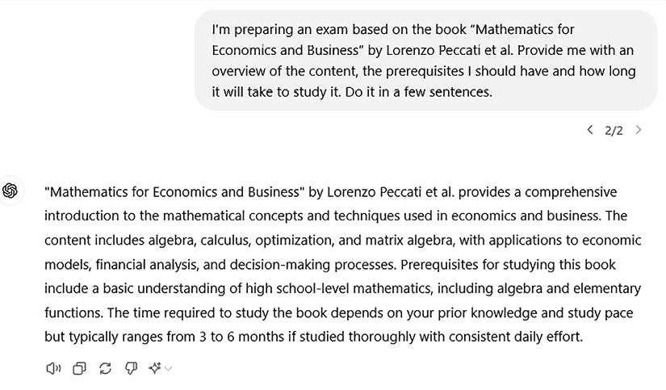

图 4.5：ChatGPT 提供大学书籍概述

注意

总是记住，如果生成式 AI 模型如 ChatGPT 没有提供特定上下文，它们可能会生成基于平均的结果。例如，这样一本书的学习时间可能因学生而异。这就是提示工程——如角色提示或迭代提示——可以大有帮助的时刻，这样你就可以根据你自己的独特个人资料缩小模型的专长。

重要的是要记住，当涉及到关于特定资产或个人信息的问题时，我们正在增加 ChatGPT 产生幻觉的风险。

事实上，在前面的例子中，模型能够回答问题，是因为书籍的摘要明显是训练集的一部分，然而模型并不知道书籍的具体内容，因为它在互联网上免费提供。如果这种情况发生，启用网络搜索工具可能是一个好习惯，这样 ChatGPT 就可以在网络上导航。

让我们看看这个例子：

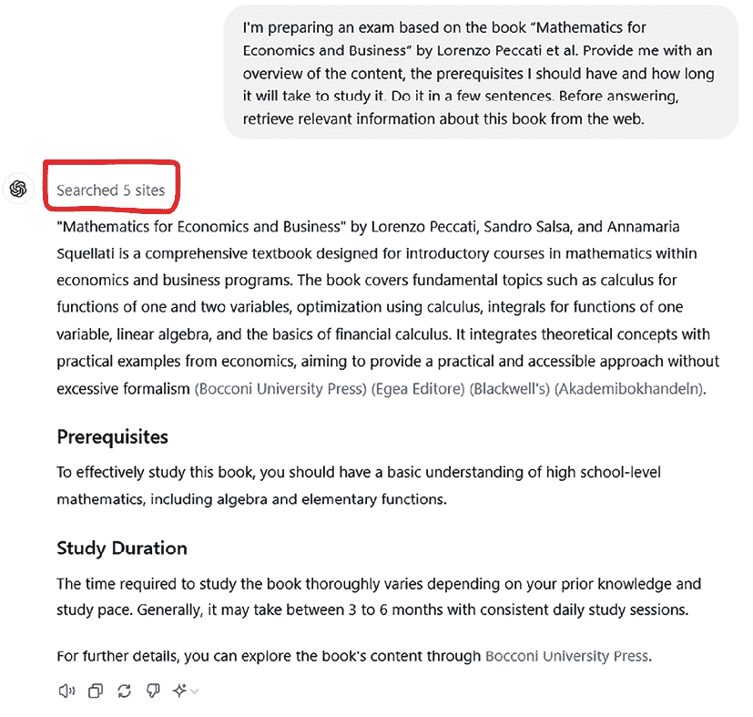

图 4.6：ChatGPT 调用网络插件示例

正如你所见，ChatGPT 现在已经调用了网络插件，搜索了五个网站，并提供它导航过的链接。

你也可以要求 ChatGPT 就你刚刚学习的材料问你一些问题：

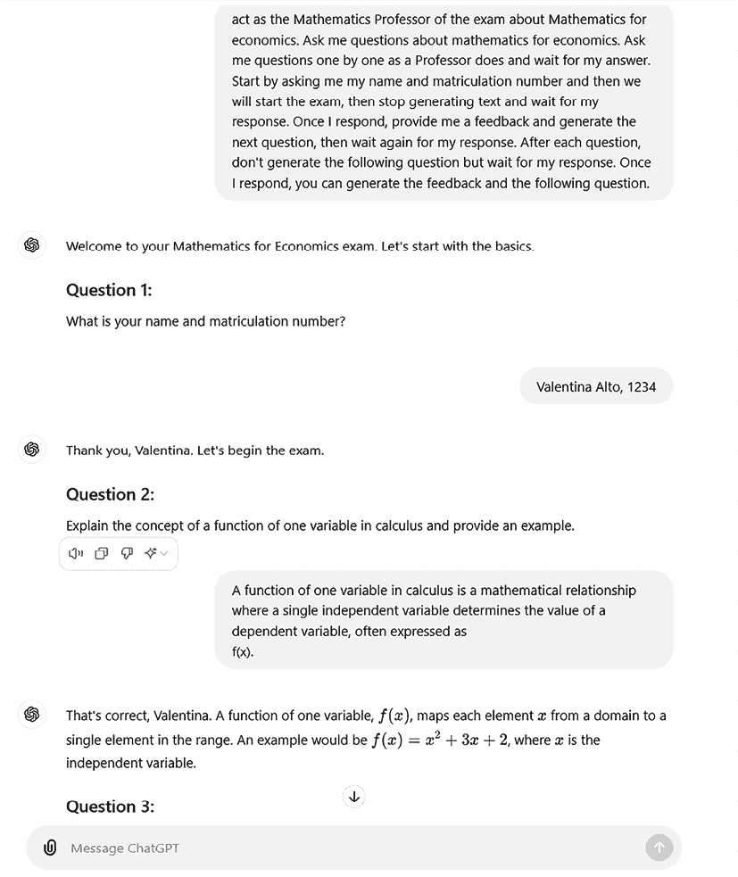

图 4.7：ChatGPT 扮演教授的示例

注意

“扮演……”的技术是高效提示技术的绝佳例子，它可以在第三章描述的例子中列出。

现在，让我们看看更多使用 ChatGPT 进行更具体任务的示例，包括文本生成、写作辅助和信息检索。

# 文本生成

作为一种语言模型，ChatGPT 特别适合根据用户的指示生成文本。例如，你可以要求 ChatGPT 生成针对特定受众的电子邮件、草稿或模板：


图 4.8：ChatGPT 生成的电子邮件示例

另一个例子可能是要求 ChatGPT 为你必须准备的演示文稿创建一个提案结构（这里仅作为示例提供第一张幻灯片）：

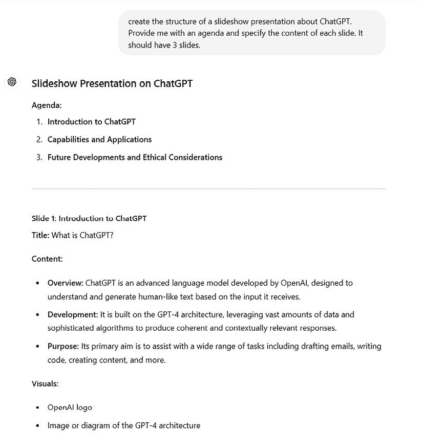

图 4.9：ChatGPT 生成的幻灯片议程和结构

你也可以用这种方法生成关于热门话题的博客文章或文章。这里有一个例子：

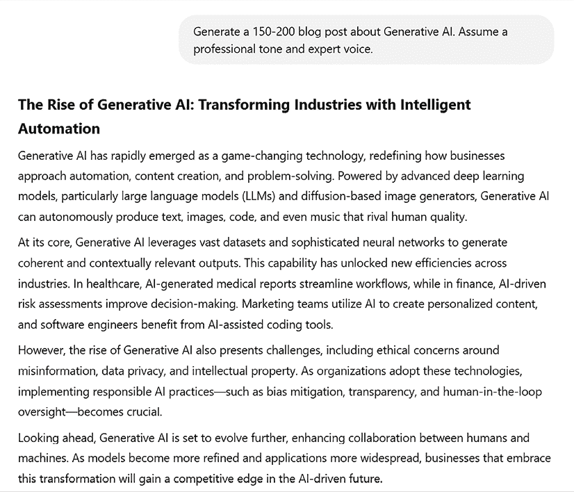

图 4.10：ChatGPT 生成的带有相关标签和 SEO 关键词的博客文章示例

我们甚至可以让 ChatGPT 缩小文章的大小，使其适合推文。这就是我们如何做到这一点的：

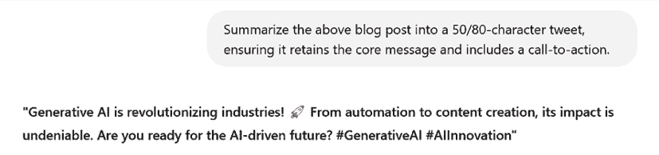

图 4.11：ChatGPT 将文章缩小为 Twitter/X 帖子

最后，ChatGPT 还可以生成视频或戏剧剧本，包括场景设计和建议的编辑。在这种情况下，我们可能希望结合前一章中介绍的一些提示工程技巧，如上下文、期望的结果和结构。例如，让我们考虑以下提示：

```py
Write a short, humorous theatre dialogue for a 3-minute comedy sketch.
Context:
Setting: A coffee shop.
Characters:
Alex – Sarcastic, quick-witted, unimpressed.
Jamie – Overly dramatic, easily flustered, indecisive.
Scenario: Jamie attempts to order a simple black coffee but overcomplicates it with unnecessary details and existential crises. Alex, unimpressed, tries to keep things simple but unintentionally escalates the absurdity.
Desired Outcome:
A fast-paced and snappy comedic dialogue.
Filled with witty comebacks, misunderstandings, and exaggerated reactions.
Ends with an unexpected and absurd twist that makes the audience laugh.
Structure of Output:
Title: A catchy title that reflects the comedic theme.
Cast: List the characters.
Scene Description: Briefly describe the setting and mood.
Dialogue Format: Clearly labeled lines with stage directions in brackets (e.g., [Alex sighs]).
Ending: A punchy, unexpected comedic twist. 
```

让我们看看结果：

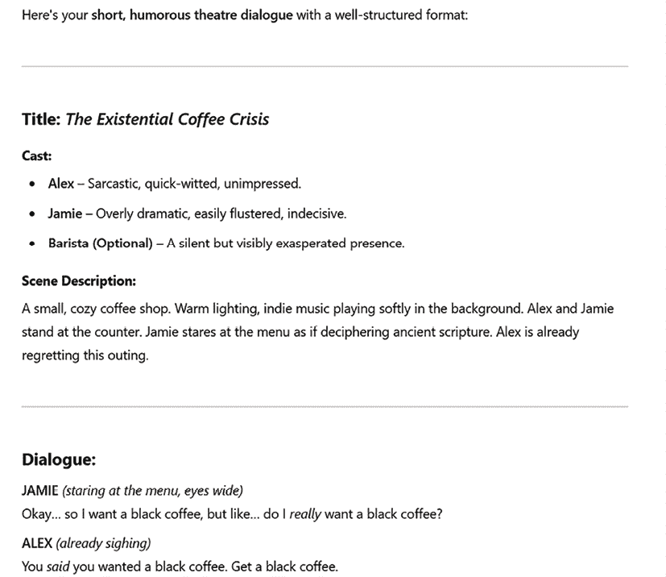

图 4.12：ChatGPT 生成的带有场景设计的戏剧对话

我只提供了 ChatGPT 生成的四个场景中的一个，以保持你对结局的好奇心…

总体而言，每当需要从头开始生成新内容时，ChatGPT 都能很好地提供一个初稿，这可以作为进一步改进的起点。

然而，ChatGPT 也可以通过提供写作辅助和翻译来支持现有内容，正如我们将在下一节中看到的。

# 提高写作技能和翻译

有时候，与其生成新的内容，你可能会想回顾现有的文本。这可能是为了改进风格、改变受众、语言翻译、语气等等。

让我们看看一些例子。想象一下，我草拟了一封电子邮件，邀请我的一个客户参加一个网络研讨会。我写了两个简短的句子。在这里，我希望 ChatGPT 改进这封电子邮件的格式和风格，因为目标受众将是管理层：

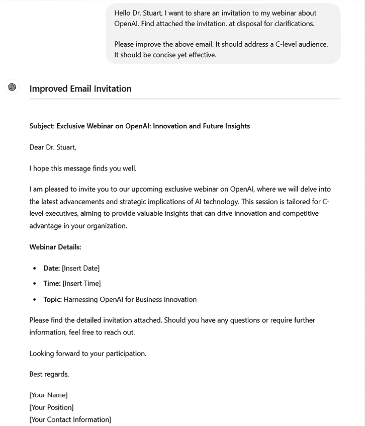

图 4.13：ChatGPT 重新审视的电子邮件示例，以针对管理层

现在，让我们用不同的目标受众来提出同样的问题：

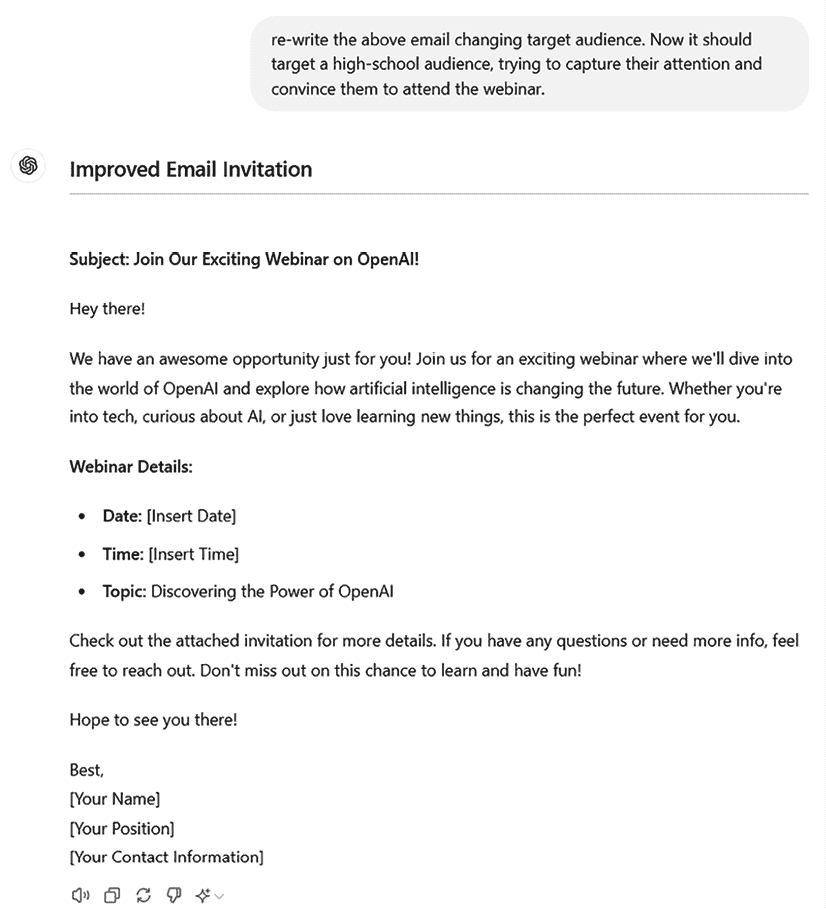

图 4.14：ChatGPT 为不同受众生成的相同电子邮件示例

ChatGPT 还可以就你的写作风格和结构给你一些反馈。

例如，假设你为名为*自然语言处理的历史*的论文写了一个摘要：

**自然语言处理**（**NLP**）从 20 世纪 50 年代的基于规则的模型发展到今天的深度学习驱动的 AI 系统。早期方法依赖于符号方法，后来被隐马尔可夫模型和 n-gram 等统计模型所取代。21 世纪，随着神经网络、词嵌入（Word2Vec、GloVe）和转换器架构（BERT、GPT）的出现，语言理解得到了极大的提升。NLP 现在为聊天机器人、翻译和 AI 驱动的通信提供动力。本文追溯了 NLP 的演变，突出了塑造其在现代技术和 AI 中角色的关键突破。

现在，你想要一些关于写作风格及其与标题一致性的反馈（输出截断）：

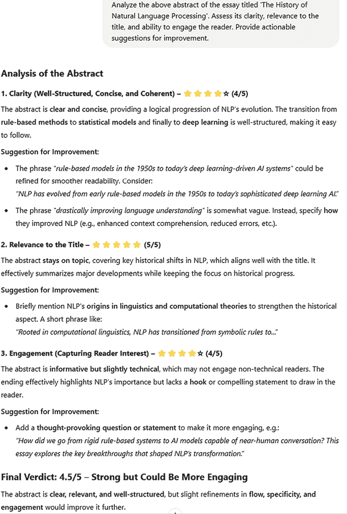

图 4.15：ChatGPT 对一个论文引言的反馈示例

如你所见，ChatGPT 不仅提供了关于整体论文的反馈和建议，而且还根据提示要求进行了模块化分析（与标题的相关性、清晰度和参与度）。

现在，让我们揭示本章的最后一个 ChatGPT 技能。ChatGPT 也是一个出色的翻译工具。它至少知道 95 种语言（如果你对所需语言是否受支持有疑问，你总是可以直接询问 ChatGPT）。然而，这里有一个可能出现的考虑：当我们已经拥有像 Google Translate 这样的尖端工具时，ChatGPT 在翻译方面的附加值是什么？

要回答这个问题，我们必须考虑一些关键的区别因素以及我们如何利用 ChatGPT 内置的翻译功能：

+   ChatGPT 可以捕捉到意图。这意味着你也可以绕过翻译阶段，因为这是 ChatGPT 可以在后台完成的。例如，如果你写一个提示来生成一篇法语社交媒体帖子，你可以用任何你想要的语言来写这个提示——ChatGPT 会自动检测它（无需事先指定）并理解你的意图：

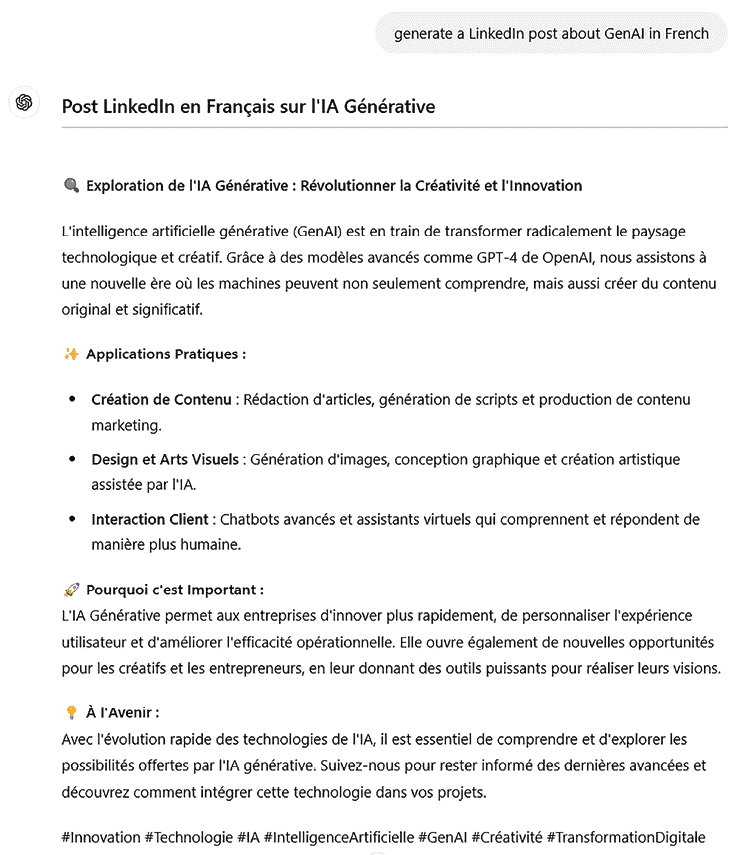

图 4.16：ChatGPT 生成不同输入语言的输出示例

+   ChatGPT 可以捕捉到俚语或习语的更精细含义。这使得翻译不再是字面意义上的，从而可以保留其深层含义。例如，让我们考虑英国的表达方式*It’s not my cup of tea*，这表示某物不是某人喜欢或偏好的。让我们让 ChatGPT 和 Google Translate 将其翻译成意大利语：

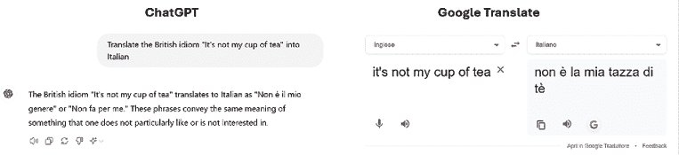

图 4.17：ChatGPT 和 Google Translate 在将英语翻译成意大利语时的比较

如你所见，ChatGPT 可以提供与原始表达等价的几个意大利习语，包括它们的俚语格式。另一方面，Google Translate 进行了直译，遗忘了习语的真正含义。

+   就像任何其他任务一样，你总是可以向 ChatGPT 提供上下文。因此，如果你想让你的翻译具有特定的俚语或风格，你可以在提示中使用分隔符来突出上下文占位符（正如我们在*第三章*中探讨的那样）。或者，甚至更有趣，你可以要求 ChatGPT 用讽刺的语气翻译你的提示。在以下示例中，我用以下文本的意大利语版本提示了 ChatGPT：

**OpenAI 是一个专注于人工智能的非营利研究组织，其目标是以造福人类的方式促进和开发友好型人工智能。**

**成立于 2015 年底，该组织位于旧金山，旨在通过使专利和研究公开可用，与其他机构和研究人员“自由合作”。**

**创始人（包括埃隆·马斯克和山姆·奥特曼）部分受到通用人工智能带来的存在风险所激励。**

并要求 ChatGPT 用讽刺的语气将其翻译成英文：

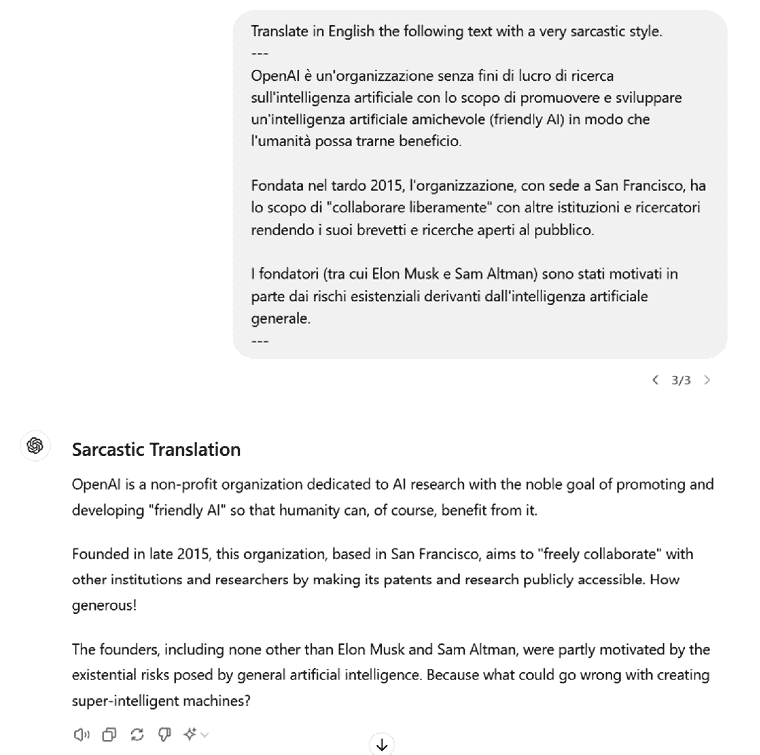

图 4.18：ChatGPT 用讽刺的语气翻译提示的示例。提示的原内容来自 OpenAI 的维基百科页面：https://it.wikipedia.org/wiki/OpenAI

所有这些场景都突出了 ChatGPT 和 OpenAI 模型的一般关键特性。正如我们所见，这些特性并非旨在针对单一任务进行专门化（即约束）。相反，它们旨在动态服务于多种场景，以便你可以使用单个模型解决广泛的使用案例。

总之，ChatGPT 不仅能够生成新的文本，还能够操纵现有材料以适应你的需求。它还证明在翻译语言之间非常精确，同时保持术语和特定语言的表达方式不变。

在下一节中，我们将看到 ChatGPT 如何帮助我们检索信息和竞争情报。

# 快速信息检索和竞争情报

信息检索和竞争情报是 ChatGPT 带来变革的更多领域。

然而，当我们谈论信息检索时，我们需要区分三种主要场景：

+   在 ChatGPT 的知识层面上发生的检索，意味着用户请求的特定信息是模型训练集的一部分

+   当使用 ChatGPT 中可用的 WebSearch 插件进行检索时发生的检索，该插件使模型能够浏览网络并检索最新信息

+   当我们使用上传到 ChatGPT 的外部知识源进行检索时发生的检索

在本节中，我们将重点关注前两种场景。

一个例子是要求 ChatGPT 提供一本我们可能感兴趣的书籍的快速总结或评论（在这种情况下，*哈利·波特*系列是模型训练集的一部分，因此它在第一个检索场景中被使用）：

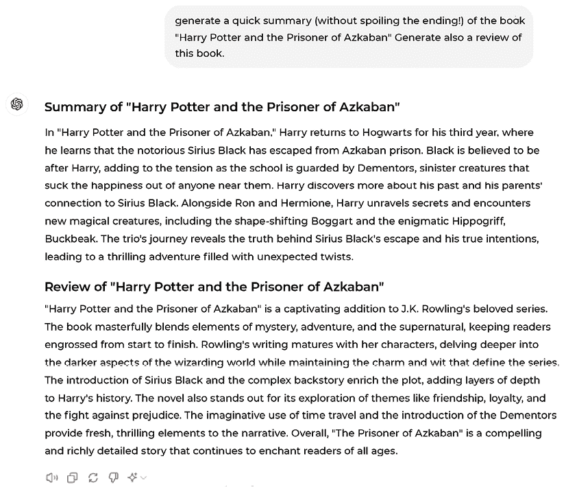

图 4.19：ChatGPT 提供书籍总结和评论的示例

或者，我们可以根据我们的偏好要求一些我们希望阅读的新书的建议：

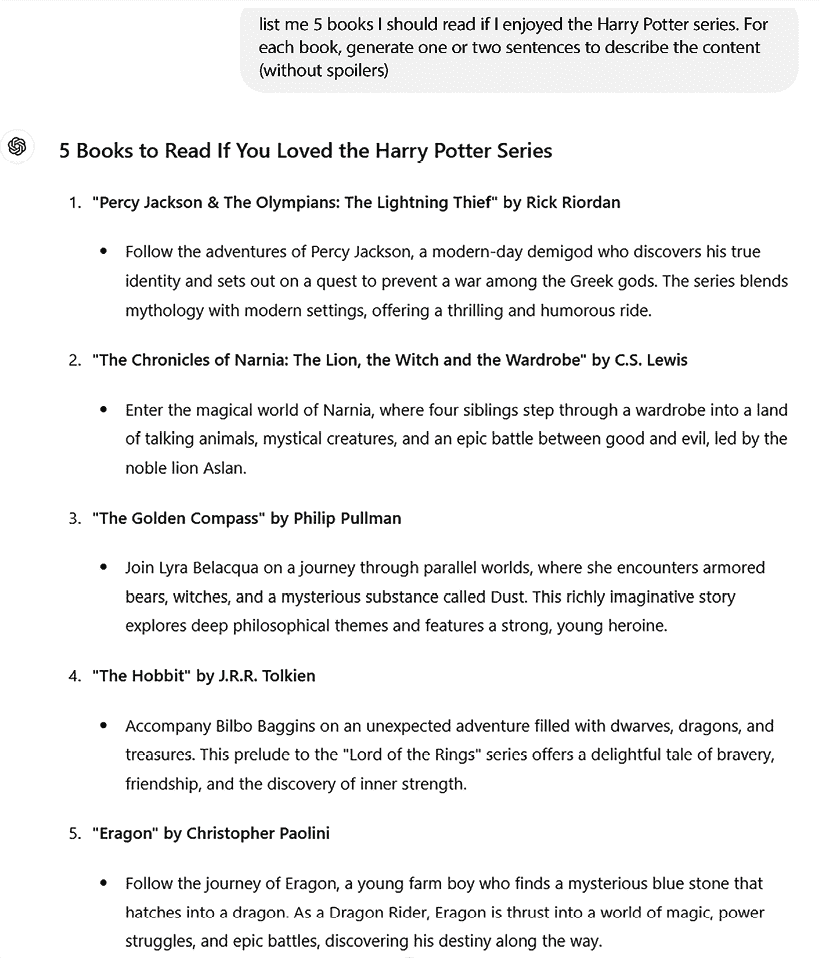

图 4.20：ChatGPT 根据我的偏好推荐书籍列表的示例

现在，让我们更进一步，考虑一个你可能需要最新信息的场景。

你可能想要快速检索一些关于你想要了解更多信息的主题的参考文献——例如，前馈神经网络。如果是这种情况，你可以启用网络搜索工具，并查看 ChatGPT 的信息来源中的实时超链接：

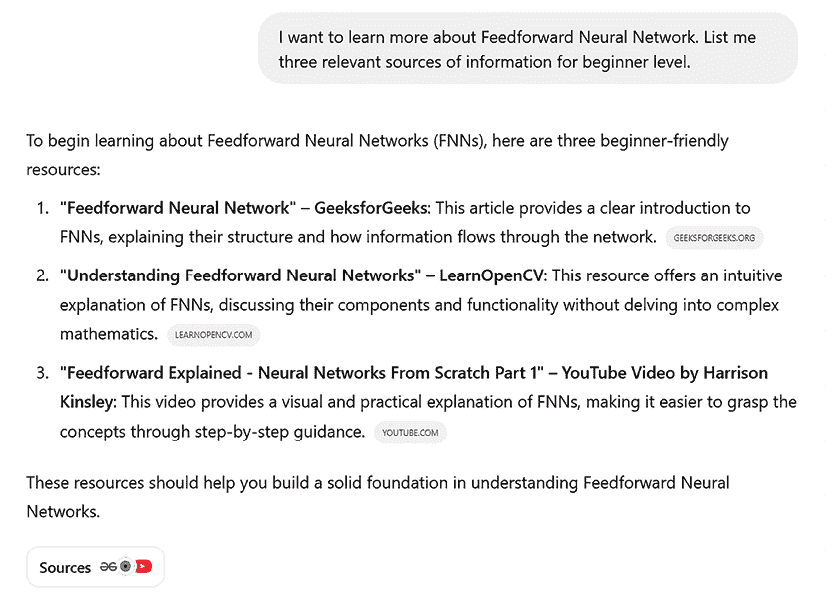

图 4.21：ChatGPT 列出相关参考文献的示例

如你所见，ChatGPT 能够为我提供相关参考文献，以便开始研究这个主题。此外，如果你点击 **来源** 按钮，你可以进一步展开更多链接的推荐以供参考：

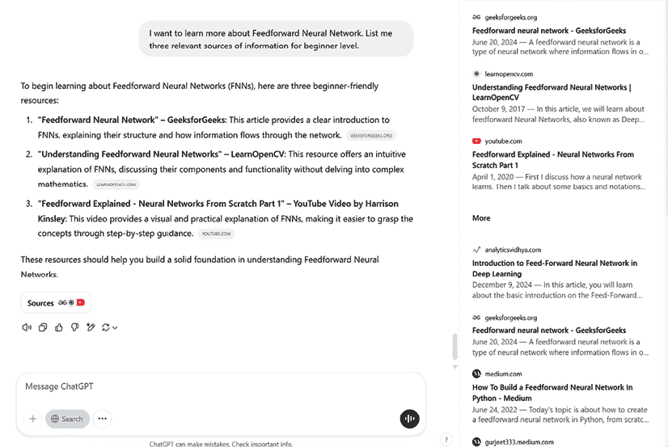

图 4.22：来源按钮揭示的附加链接

让我们在竞争情报方面更进一步。

让我们考虑编写一本名为 *卷积神经网络入门 – 使用 Python 实现* 的书籍。我想对市场上可能存在的竞争对手进行一些研究。首先我想调查的是，是否已经有一些具有相同内容的竞争性标题，这样我就可以让 ChatGPT 生成一份现有书籍的列表：

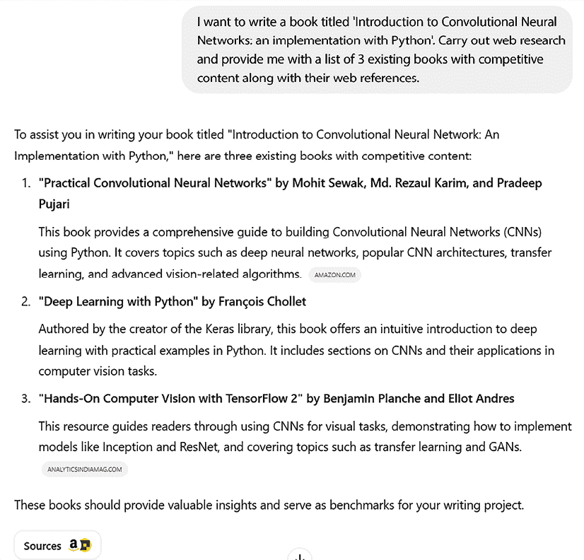

图 4.23：ChatGPT 提供竞争性书籍列表的示例

你也可以要求关于你想要出版的市场的饱和度的反馈：

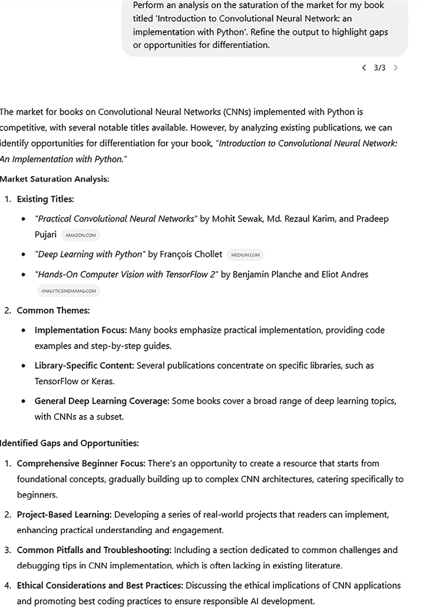

图 4.24：ChatGPT 关于如何在市场上保持竞争力的建议

总体而言，ChatGPT 可以成为信息检索和竞争情报的有价值助手。然而，重要的是要记住知识库的截止日期是 2021 年。这意味着，无论何时我们需要检索实时信息，或者在进行今天的竞争市场分析时，我们可能无法依赖 ChatGPT。

尽管如此，这个工具仍然提供了可以应用的最佳实践和建议，无论知识库的截止日期是什么。

# 摘要

本章中我们看到的所有示例都是 ChatGPT 能帮助你提高生产力的简单展示。这些小技巧可以极大地帮助你处理可能重复（如创建回复模板或制定日常日程）或繁重（如查找文档或竞争情报）的活动。

注意，在本章中，我们仅通过文本与 ChatGPT 进行交互：在整个书中，我们还将看到如何结合视觉交互。

在下一章中，我们将深入探讨 ChatGPT 正在改变游戏规则的主要三个领域——开发、营销和研究。

# 加入我们的 Discord 和 Reddit 社区

对这本书有疑问或想参与关于生成式 AI 和 LLMs 的讨论？加入我们的 Discord 服务器`packt.link/I1tSU`和 Reddit 频道`packt.link/jwAmA`，与志同道合的爱好者连接、分享和协作。

 
