# 5

# 与 ChatGPT 一起开发未来

在本章中，我们将讨论开发者如何利用 ChatGPT。本章重点介绍了 ChatGPT 在开发者领域解决的主要用例，包括代码审查和优化、文档生成和代码生成。本章将提供示例，并使您能够尝试在自己的设备上使用提示。

在对开发者为什么应该将 ChatGPT 作为日常助手的原因进行一般介绍之后，我们将重点关注 ChatGPT 以及它能够执行以下任务：

+   开发者为什么应该使用 ChatGPT？

+   生成、优化和调试代码

+   生成与代码相关的文档并调试您的代码

+   解释**机器学习**（**ML**）模型，以帮助数据科学家和业务用户进行模型可解释性

+   翻译不同的编程语言

+   在画布上与代码一起工作

到本章结束时，您将能够利用 ChatGPT 进行编码活动，并使用它作为助手来提高您的编码生产力。

# 技术要求

您可以在本书配套的 GitHub 仓库中找到本章的完整代码：[`github.com/PacktPublishing/Practical-GenAI-with-ChatGPT-Second-Edition`](https://github.com/PacktPublishing/Practical-GenAI-with-ChatGPT-Second-Edition)。

**免责声明**

虽然本章探讨了 ChatGPT 如何生成和与代码一起工作，但我想要强调的是，欣赏其潜力并不需要深厚的技术背景。与其仅仅关注编码的机制，我鼓励您考虑生成式 AI 如何弥合软件开发者与不具备编码专业知识的人之间的差距。

# 开发者为什么应该使用 ChatGPT？

个人而言，我认为 ChatGPT 最令人惊叹的能力之一在于处理代码——任何类型的代码。我们在前面的章节中已经看到了 ChatGPT 生成 Python 代码的一些例子。然而，ChatGPT 为开发者提供的功能远不止这些示例。它可以成为代码生成、解释和调试的日常助手。

无论您是后端/前端开发者、数据科学家还是数据工程师，只要您使用编程语言工作，ChatGPT 都可以成为游戏规则的改变者；我们将在下一节中的几个示例中看到这一点。

从下一节开始，我们将更深入地探讨 ChatGPT 与代码一起工作时可以实现的具体例子。我们将看到涵盖不同领域的端到端用例，以便我们熟悉使用 ChatGPT 作为代码助手。

# 生成、优化和调试代码

您应该利用的主要功能是 ChatGPT 代码生成。您有多少次寻找一个现成的代码片段作为起点？或者寻找可以生成函数、样本数据集、SQL 模式等的代码？ChatGPT 能够根据自然语言输入生成代码：

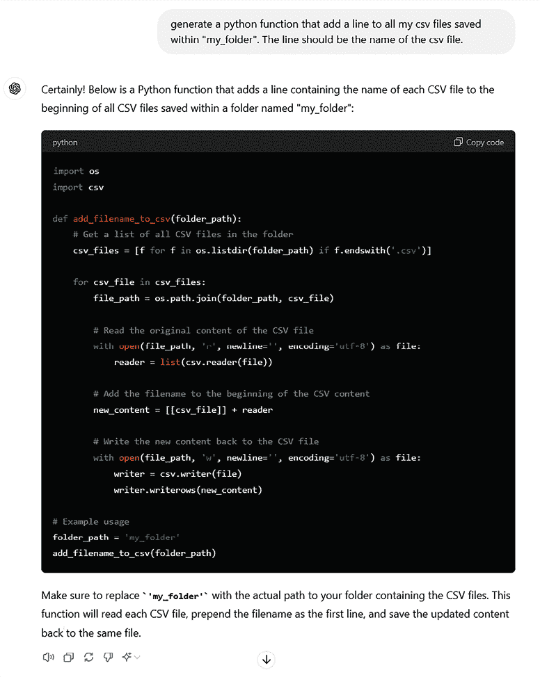

图 5.1：ChatGPT 生成用于写入 CSV 文件的 Python 函数的示例

如您所见，ChatGPT 不仅能够生成函数，还能够解释函数的功能、如何使用它以及如何在通用占位符，如`my_folder`中进行替换。

现在让我们提高难度。如果 ChatGPT 能够生成 Python 函数，它能否生成整个视频游戏呢？让我们试试。我想做的是向 ChatGPT 提供一个我想开发的类型游戏的插图，并要求它用代码进行复制。以下是我想要的游戏的插图（你能猜到名字吗？）


图 5.2：《吃豆人》游戏的插图

现在让我们让 ChatGPT 重现它：

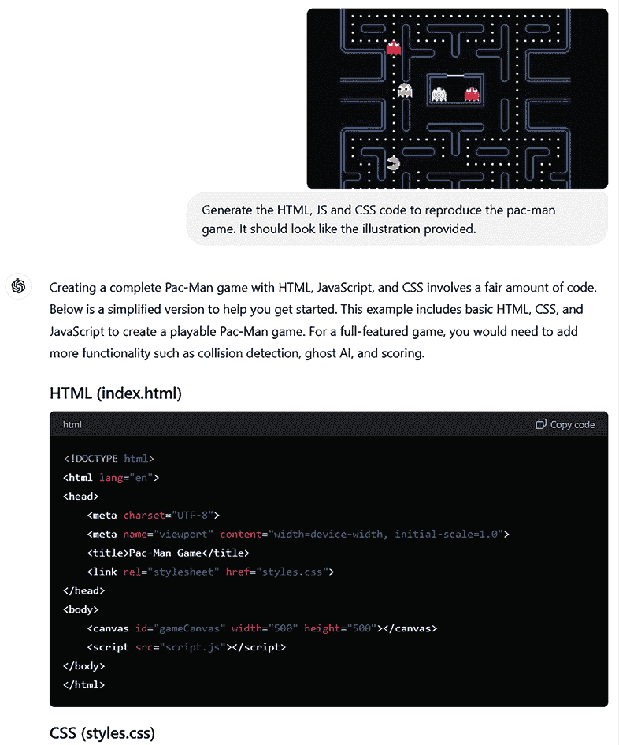

图 5.3：ChatGPT 生成 HTML、CSS 和 JS 代码的示例

如 ChatGPT 的免责声明所示，完整的游戏需要大量的代码；然而，让我们看看生成的代码目前的工作情况（为了运行代码，我使用了在线工具*codepen.io*）：

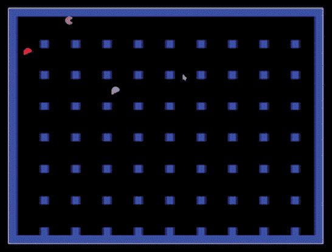

图 5.4：ChatGPT 生成的《吃豆人》游戏

如您所见，草案产品已经非常接近我想要的效果！这是生成式 AI 如何帮助您克服从头开始的*困难*的一个例子；实际上，从一张白纸开始有时可能会阻碍进程，而有一个草案产品作为起点不仅可以加快整体过程，还可以激发创造力并提高结果的质量。

ChatGPT 也可以成为代码优化的优秀助手。实际上，它可能通过优化我们输入的脚本来节省一些运行时间或计算能力。这种能力在自然语言领域可能类似于我们在*第四章*的*提高写作和翻译技能*部分中看到的写作辅助功能。

例如，假设你想从一个列表中创建一个以另一个列表为起始点的奇数列表。为了达到这个结果，你将编写以下 Python 脚本（为了这个练习，我还会使用`timeit`和`datetime`库来跟踪执行时间）：

```py
from timeit import default_timer as timer
from datetime import timedelta
start = timer()
elements = list(range(1_000_000)) data = []
for el in elements: if not el % 2: # if even number
data.append(el)
end = timer() print(timedelta(seconds=end-start)) 
```

让我们看看运行它需要多长时间：

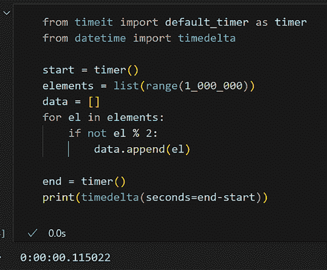

图 5.5：Python 函数的执行速度

执行时间为`00.115022`秒。如果我们让 ChatGPT 优化这个脚本会怎样呢？

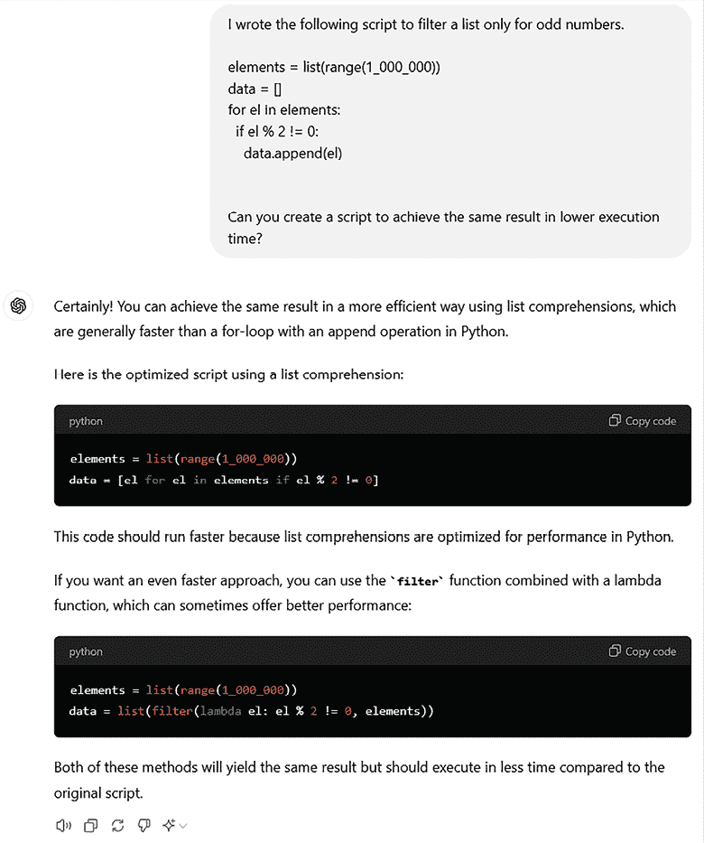

图 5.6：ChatGPT 生成 Python 脚本的优化替代方案

ChatGPT 给我提供了两个示例，以更低的执行时间达到相同的结果。

让我们在 Jupyter 笔记本中测试这两个示例：

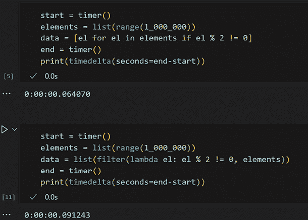

图 5.7：ChatGPT 生成的两个替代函数的执行速度

如您所见，这两种方法分别将时间减少了 44.30%和 20.68%。

除了代码生成和优化之外，ChatGPT 还可以用于*错误*解释和调试。有时，错误很难解释；因此，自然语言解释对于识别问题和引导您走向解决方案非常有用。

例如，当我从命令行运行`.py`文件时，我得到了以下错误：

```py
File "C:\Users\vaalt\Anaconda3\lib\site-packages\streamlit\elements\text_widgets.py", line 266, in _text_input text_input_proto.value = widget_state.value
TypeError: [] has type list, but expected one of: bytes, Unicode 
```

让我们看看 ChatGPT 是否能够让我理解错误的本质。为此，我只需向 ChatGPT 提供错误文本，并要求它给我一个解释：

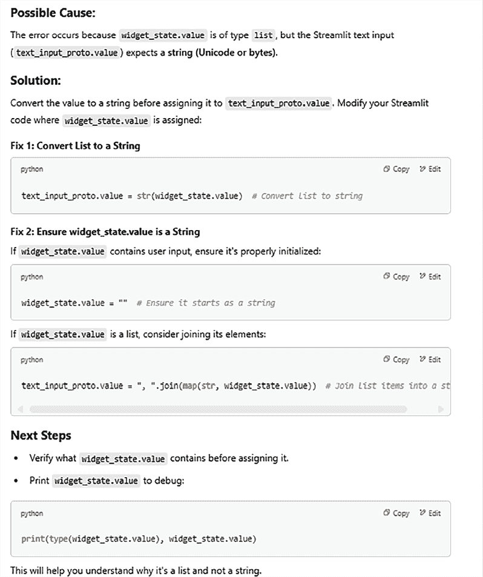

图 5.8：ChatGPT 用自然语言解释 Python 错误

最后，让我们假设我写了一个 Python 函数，它接受一个字符串作为输入，并在每个字母后返回一个带有下划线的相同字符串。

在前面的例子中，我预期看到`g_p_t_`的结果；然而，这段代码只返回了`t_`：

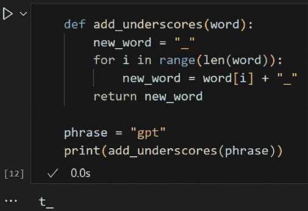

图 5.9：存在错误的 Python 函数

让我们请 ChatGPT 为我们调试这个函数：

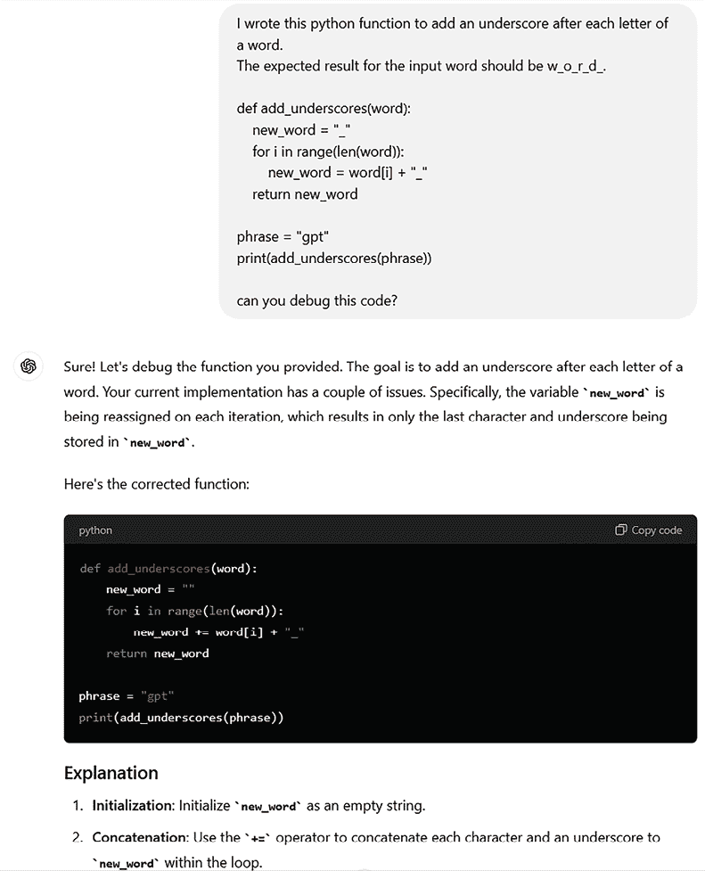

图 5.10：ChatGPT 调试 Python 函数的示例

非常令人印象深刻，不是吗？再次，ChatGPT 提供了正确的代码版本，并帮助解释了错误所在以及为什么会导致错误的结果。现在让我们看看它是否有效：

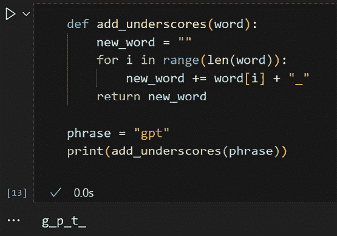

图 5.11：ChatGPT 调试后的 Python 函数

好吧，显然是的！

这些以及许多其他与代码相关的功能确实可以大大提高您的生产力，缩短执行许多任务的时间。

然而，ChatGPT 的功能不仅限于纯调试。得益于 GPT 模型的非凡语言理解能力，这个生成式 AI 工具能够与代码一起生成适当的文档，并准确解释代码串将执行的操作，我们将在下一节中看到。

# 生成文档和代码可解释性

无论您正在处理新的应用程序或项目，将代码与文档相关联总是一个好的做法。这可能是一个可以嵌入到您的函数或类中的 docstring，以便其他人可以直接在开发环境中调用它们。

例如，让我们考虑上一节中开发的相同函数，并将其制作成一个 Python 类：

```py
class UnderscoreAdder:
def __init__(self, word):
    self.word = word
def add_underscores(self):
    return "_".join(self.word)  # More efficient 
```

我们可以这样测试：

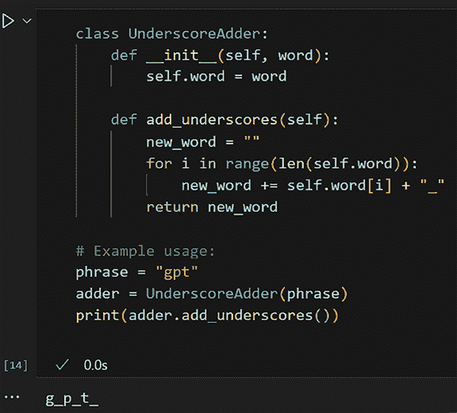

图 5.12：测试 UnderscoreAdder 类

现在，假设我想能够使用`UnderscoreAdder?`约定检索 docstring 文档。通过使用 Python 包、函数和方法，我们可以获得特定对象的完整文档，如下（以`pandas` Python 库为例）：

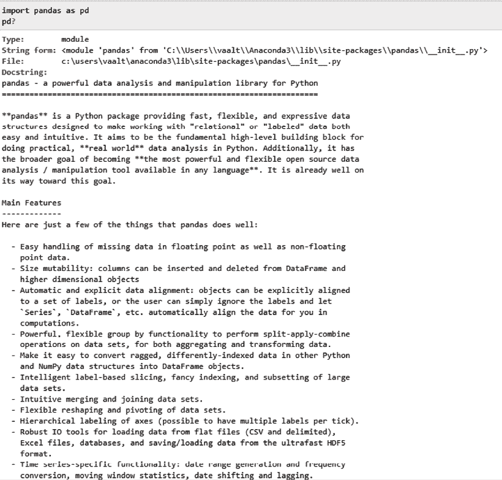

图 5.13：pandas 库文档示例

因此，现在让我们让 ChatGPT 为我们`UnderscoreAdder`类生成相同的结果。

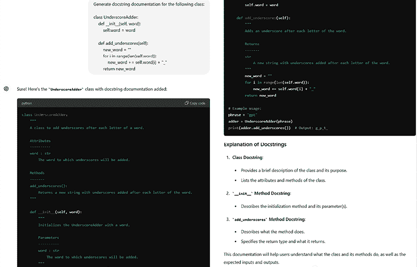

图 5.14：ChatGPT 更新带有文档的代码

因此，如果我们像前面代码中那样使用`UnderscoreAdder?`更新我们的类，我们将得到以下输出：

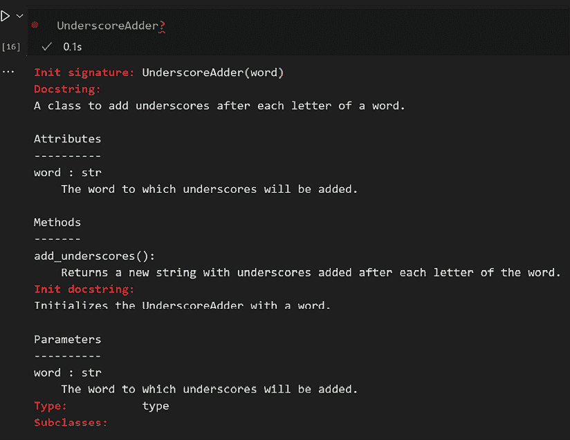

图 5.15：新的 UnderscoreAdder 类文档

最后，ChatGPT 还可以用来用自然语言解释脚本、函数、类或其他类似事物的作用。我们已经看到了许多 ChatGPT 通过清晰的解释丰富其与代码相关的响应的例子。然而，我们可以通过就代码理解提出具体问题来增强这一能力。

例如，让我们让 ChatGPT 向我们解释以下 Python 脚本的功能：

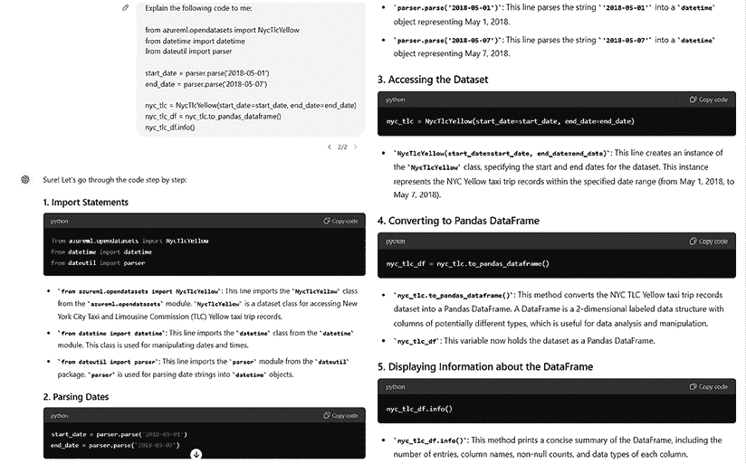

图 5.16：ChatGPT 解释 Python 脚本的示例

代码可解释性也可以是前面提到的文档的一部分，或者它可以在想要更好地理解其他团队复杂代码的开发者之间使用。（有时这也发生在我身上）记住他们之前写的内容。

多亏了 ChatGPT 和本节中提到的功能，开发者可以轻松地用自然语言跟踪项目生命周期，这样新团队成员和非技术用户就能更容易地理解到目前为止完成的工作。

在下一节中，我们将看到代码可解释性是如何在数据科学项目中成为 ML 模型可解释性的关键步骤。

# 理解 ML 模型可解释性

**模型可解释性**指的是人类理解 ML 模型预测背后逻辑的难易程度。本质上，这是理解模型如何做出决策以及哪些变量对其预测有贡献的能力。

让我们看看使用深度学习**卷积神经网络**（**CNN**）进行图像分类的模型可解释性的一个例子。我用 Python 和 Keras 构建了我的模型。为此，我将直接从`keras.datasets`下载 CIFAR-10 数据集；它包含 10 个类别（飞机、汽车、鸟、猫、鹿、狗、青蛙、马、船和卡车）的 60,000 个 32x32 彩色图像（因此是 3 通道图像），每个类别有 6,000 个图像。在这里，我将仅分享模型的主体部分；你可以在书籍的 GitHub 仓库中找到所有相关的代码，该代码位于[`github.com/PacktPublishing/Modern-Generative-AI-with-ChatGPT-and-OpenAI-Models/tree/main/Chapter%206%20-%20ChatGPT%20for%20Developers/code`](https://github.com/PacktPublishing/Modern-Generative-AI-with-ChatGPT-and-OpenAI-Models/tree/main/Chapter%206%20-%20ChatGPT%20for%20Developers/code)的数据准备和预处理部分。

```py
model=tf.keras.Sequential()
model.add(tf.keras.layers.Conv2D(32,kernel_ size=(3,3),activation='relu',input_shape=
(32,32,1)))
model.add(tf.keras.layers.MaxPooling2D(pool_size=(2,2))) model.add(tf.keras.layers.Flatten()) model.add(tf.keras.layers.Dense(1024,activation='relu')) model.add(tf.keras.layers.Dense(10,activation='softmax')) 
```

上述代码由多个执行不同操作的层级组成。我可能对模型结构的解释以及每一层的用途感兴趣。让我们向 ChatGPT 寻求一些帮助（以下是你可以看到的响应摘录）：

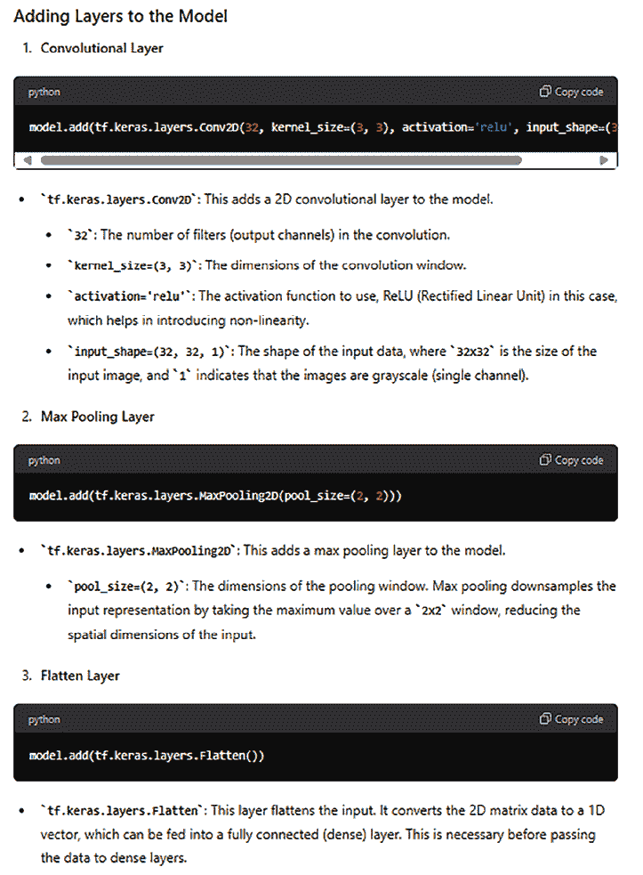

图 5.17：使用 ChatGPT 进行模型可解释性

如前图所示，ChatGPT 能够为我们清晰地解释我们 CNN 的结构和层级。它还添加了一些注释和提示，例如使用最大池化层有助于降低输入的维度。

在验证阶段，我也可以得到 ChatGPT 在解释模型结果方面的支持。因此，在将数据分为训练集和测试集并在训练集上训练模型之后，我想看看它在测试集上的表现：

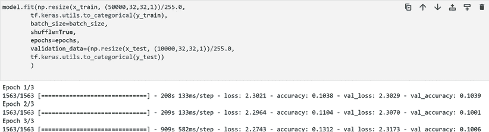

图 5.18：评估指标

让我们也请 ChatGPT 详细说明我们的验证指标（输出截断）：

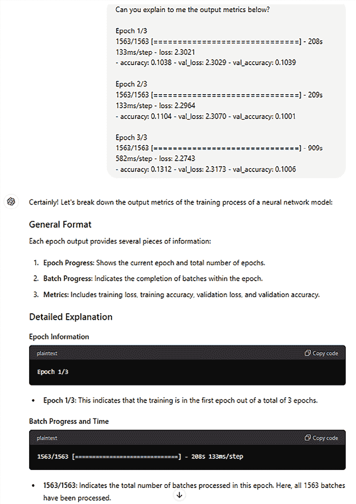

图 5.19：ChatGPT 解释评估指标示例

再次强调，结果非常令人印象深刻，它为如何设置基于训练集和测试集的机器学习实验提供了清晰的指导。它解释了模型足够泛化的重要性，这样它就不会过拟合，并且能够对它以前从未见过的数据进行准确预测。

模型可解释性之所以重要，有很多原因。一个关键因素是它缩小了业务用户与模型背后的代码之间的差距。这对于使业务用户能够理解模型的行为以及将其转化为有用的商业想法至关重要。

此外，模型可解释性使得负责任和道德 AI 的一个关键原则——模型背后 AI 系统思考和行为的透明度——成为可能。解锁模型可解释性意味着检测模型在生产过程中可能存在的潜在偏差或有害行为，并防止其发生。

总体而言，ChatGPT 可以在模型可解释性的背景下提供有价值的支持，在行级别生成见解，正如我们在前面的例子中看到的。

接下来，我们将探索 ChatGPT 的下一个也是最后一个能力，这将进一步提高开发者的生产力，尤其是在同一项目中使用多种编程语言的情况下。

# 不同编程语言之间的翻译

在**第四章**中，我们看到了 ChatGPT 在不同语言之间翻译的强大能力。真正令人难以置信的是，自然语言并不是它的唯一翻译对象。实际上，ChatGPT 能够在保持相同输出和风格（即，如果存在，它保留文档字符串文档）的情况下，在不同编程语言之间进行翻译。

有许多场景中，这可能会成为变革者。

例如，你可能必须学习一种你以前从未见过的新的编程语言或统计工具，因为你需要快速交付一个基于它的项目。借助 ChatGPT，你可以开始用你喜欢的语言编程，然后让它翻译成你想要的语言，你将在翻译过程中学习这种语言。

想象一下，项目需要用 MATLAB（MathWorks 开发的专有数值计算和编程软件）交付，而你一直使用 Python 编程。该项目包括从**修改后的国家标准与技术研究院**（**MNIST**）数据集（原始数据集描述和相关论文可在[`yann.lecun.com/exdb/mnist/`](http://yann.lecun.com/exdb/mnist/)找到）中分类图像。该数据集包含许多手写数字，常用于教授各种图像处理系统。

首先，我编写了以下 Python 代码来初始化一个用于分类的深度学习模型：

```py
from tensorflow.keras import layers
# Load the MNIST dataset
(x_train, y_train), (x_test, y_test) = keras.datasets.mnist.load_ data()
# Preprocess the data
x_train = x_train.reshape(-1, 28*28) / 255.0 x_test = x_test.reshape(-1, 28*28) / 255.0 y_train = keras.utils.to_categorical(y_train) y_test = keras.utils.to_categorical(y_test)
# Define the model architecture model = keras.Sequential([
layers.Dense(256, activation='relu', input_shape=(28*28,)), layers.Dense(128, activation='relu'),
layers.Dense(10, activation='softmax')
])
# Compile the model
model.compile(optimizer='adam', loss='categorical_crossentropy', metrics=['accuracy'])
# Train the model
history = model.fit(x_train, y_train, validation_split=0.2, epochs=10, batch_size=128)
# Evaluate the model
test_loss, test_acc = model.evaluate(x_test, y_test, verbose=0) print('Test accuracy:', test_acc) 
```

现在我们来看看，如果我们将前面的代码作为上下文提供给 ChatGPT 并要求它将其翻译成 MATLAB 会发生什么：

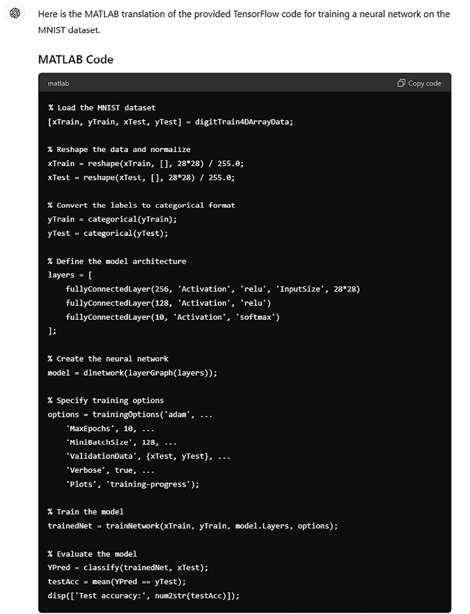

图 5.20：ChatGPT 将 Python 代码翻译成 MATLAB

代码翻译还可以缩小新技术与当前编程能力之间的技能差距。

代码翻译的另一个关键含义是**应用现代化**。确实，想象一下，您想刷新您的应用程序堆栈，即迁移到云端。您可以选择从简单的提升和迁移到**基础设施即服务**（**IaaS**）实例（如 Windows 或 Linux **虚拟机**（**VM**））开始。然而，在第二阶段，您可能希望重构、重新设计或甚至重建您的应用程序。

下图展示了应用程序现代化的各种选项：

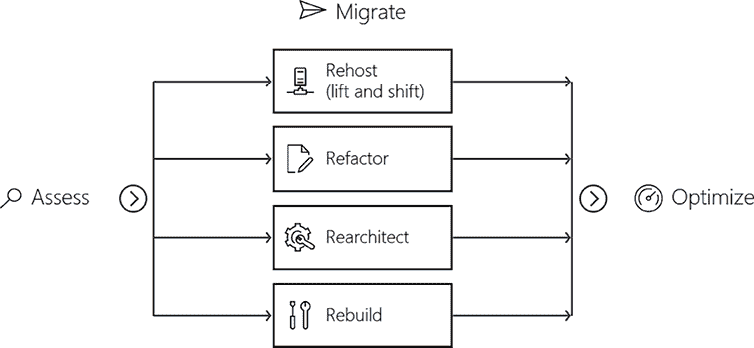

图 5.21：四种将您的应用程序迁移到公有云的方法

ChatGPT 和 OpenAI Codex 模型可以帮助您进行迁移。以大型机为例。

大型机是主要由大型组织使用来执行如人口普查、消费者和行业统计、企业资源规划和大规模交易处理等关键任务的计算机。大型机环境的应用程序编程语言是**通用商业面向语言**（**COBOL**）。尽管它是在 1959 年发明的，但 COBOL 仍然在使用中，并且是现存最古老的编程语言之一。

随着技术的不断进步，存在于大型机领域中的应用程序一直受到一个持续的过程的影响，旨在通过在接口、代码、成本、性能和可维护性等方面增强现有的遗留大型机基础设施。

当然，这暗示了将 COBOL 翻译成更现代的编程语言，如 C# 或 Java。问题是 COBOL 对大多数新一代程序员来说都是未知的；因此，在这个领域存在巨大的技能差距。

让我们考虑一个 COBOL 脚本，该脚本读取一个输入数字，将其加 10，然后打印结果：

```py
 IDENTIFICATION DIVISION.
       PROGRAM-ID. AddTen.
       DATA DIVISION.
       WORKING-STORAGE SECTION.
       01  INPUT-NUMBER    PIC 9(5).
       01  RESULT-NUMBER   PIC 9(5).
       PROCEDURE DIVISION.
           DISPLAY 'Enter a number: '.
           ACCEPT INPUT-NUMBER.
           COMPUTE RESULT-NUMBER = INPUT-NUMBER + 10.
           DISPLAY 'Result after adding 10: ' RESULT-NUMBER.
           STOP RUN. 
```

我随后将之前的 COBOL 脚本传递给 ChatGPT，以便它可以用作上下文来制定其响应。现在让我们让 ChatGPT 将该脚本翻译成 C#：

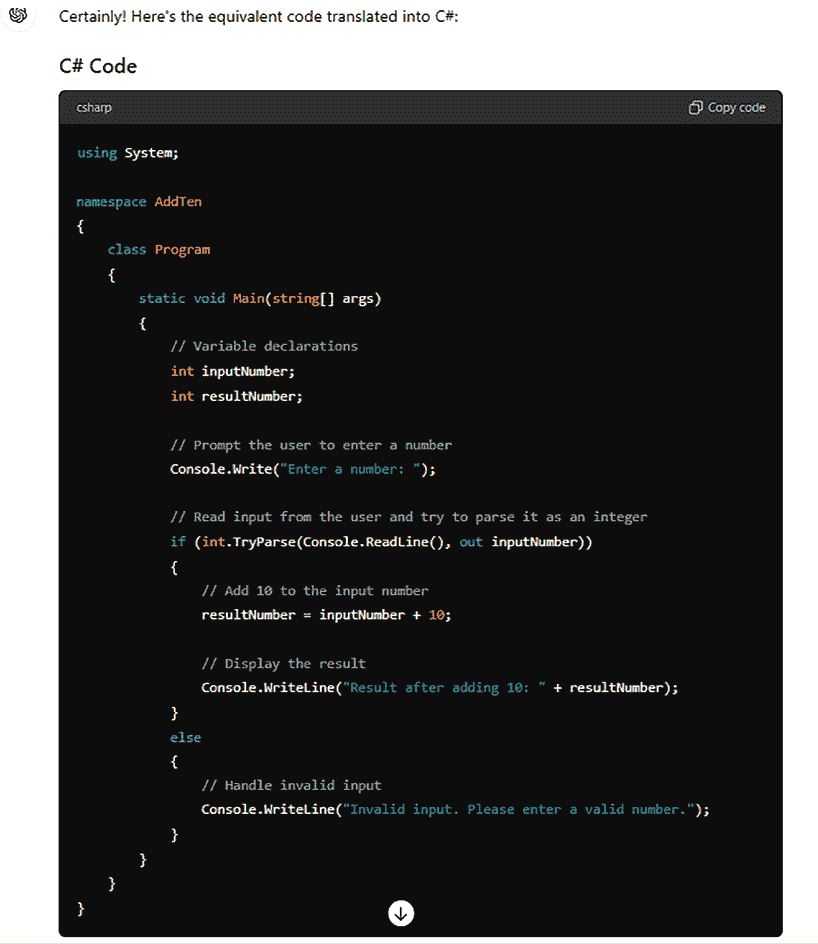

图 5.22：ChatGPT 将 COBOL 翻译成 C# 的示例

如 ChatGPT 这样的工具可以通过引入一个了解编程过去和未来的层来帮助减少在这个和类似场景中的技能差距。

总之，ChatGPT 可以成为应用现代化的一种有效工具，除了提供宝贵的见解和建议来增强遗留系统外，它还能提供代码升级。凭借其先进的语言处理能力和广泛的知识库，ChatGPT 可以帮助组织简化现代化工作，使过程更快、更高效、更有效。

# 在画布上与代码一起工作

在 *第四章* 中，我们提到了新的 ChatGPT 画布功能，它允许用户在协作工作区中动态修改模型的响应。然而，当涉及到代码开发时，这个功能真正闪耀。

实际上，它提供了一个代码开发、执行和调试的环境。

让我们看看一个例子。我们将从一个简单的查询开始：

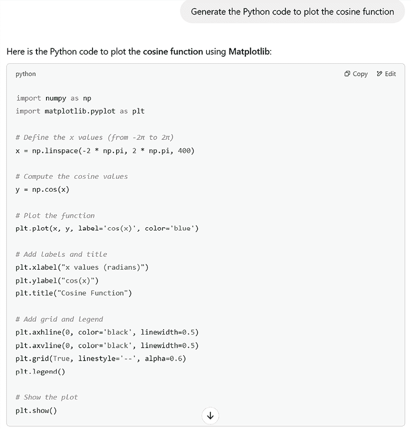

图 5.23：使用 ChatGPT 生成代码

如预期的那样，ChatGPT 能够生成所需的代码。现在，如果我们点击**编辑**图标，我们将能够访问画布工作区，在那里我们可以：

+   修改代码：

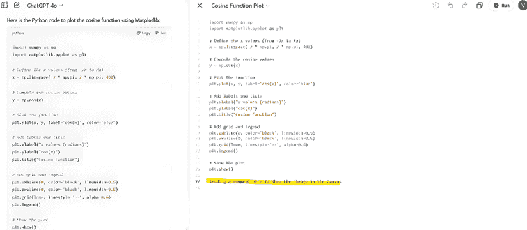

图 5.24：使用画布工作区修改代码

+   运行代码并在控制台中查看结果：

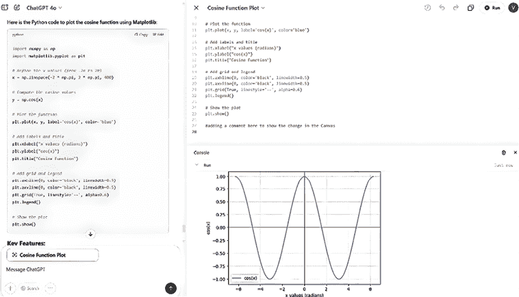

图 5.25：无缝测试和修改代码

这对软件开发来说是一个颠覆性的变革；这意味着在交互 ChatGPT 的同时无缝测试和执行代码，而无需从该应用程序移动到您的开发环境。

让我们更进一步。与画布交互的另一种方式是通过将其作为工具调用：

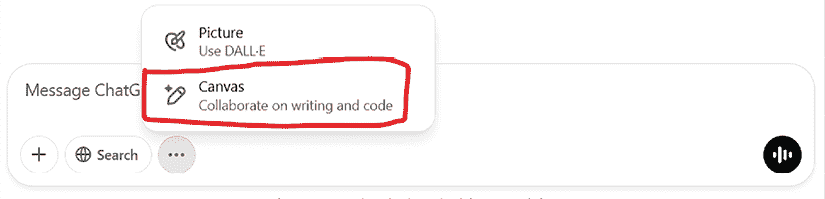

图 5.26：直接调用画布

通过这样做，ChatGPT 将自动**进入代码工作的状态**。让我们提出与之前相同的问题，但这次直接利用画布工具。

在这种情况下，ChatGPT 将直接为我们打开一个画布工作区，提供额外的编码工具：

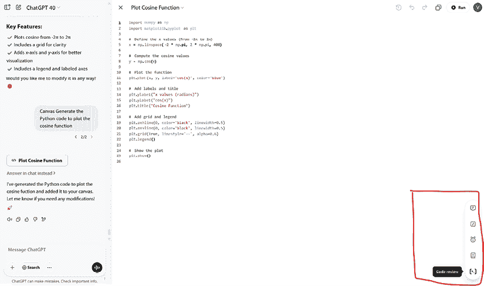

图 5.27：画布工作区

使用这些工具，您有四个主要功能：

+   **添加注释**功能向 ChatGPT 提供指令，在您正在工作的同一画布中修改您的代码

+   **添加日志**功能将打印语句或日志机制插入到您的代码中，有助于跟踪执行流程和诊断问题

+   通过选择**修复错误**快捷方式，ChatGPT 分析您的代码以识别和纠正错误，提高代码可靠性

+   **转换为其他语言**功能可以无缝地将您的代码翻译成另一种编程语言

通过整合这些功能，ChatGPT 的画布提供了一个全面的代码开发、执行和调试环境，提高了生产力并简化了编码工作流程。

# 摘要

ChatGPT 对于希望提高技能和简化工作流程的开发者来说是一个宝贵的资源。我们首先看到 ChatGPT 如何生成、优化和调试您的代码，但我们还涵盖了其他能力，例如在代码旁边生成文档、解释您的机器学习模型以及在不同编程语言之间进行翻译以实现应用现代化。

不论您是经验丰富的开发者还是刚开始，ChatGPT 都提供了一个强大的学习和成长工具，缩小了代码和自然语言之间的差距。

在下一章中，我们将深入探讨另一个应用领域，ChatGPT 在这里可能成为颠覆性的变革：市场营销。

# 加入我们的 Discord 和 Reddit 社区

对本书有任何疑问或想参与关于生成式 AI 和大型语言模型（LLMs）的讨论？加入我们的 Discord 服务器`packt.link/I1tSU`，以及我们的 Reddit 频道`packt.link/jwAmA`，与志同道合的爱好者们连接、分享和协作。

 
