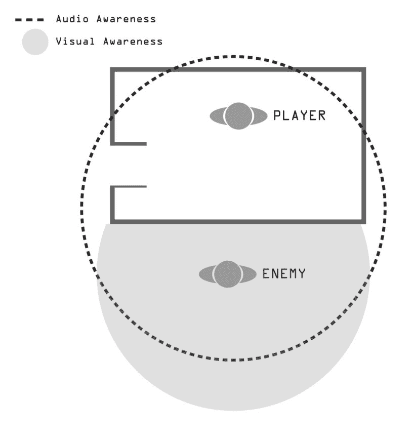

# 不同的问题需要不同的解决方案

# 游戏人工智能的简要历史及其解决方案

为了更好地理解如何克服游戏开发者目前面临的问题，我们需要稍微深入了解一下电子游戏开发的历史，并看看当时那些重要的问题及其解决方案。其中一些解决方案如此前卫，以至于它们实际上改变了电子游戏设计本身的历史，而今天我们仍然使用相同的方法来创造独特且令人愉悦的游戏。

在谈论游戏人工智能时，首先值得提到的相关标志之一是编程用于与人类竞争的计算机象棋。这是一款非常适合开始尝试人工智能实验的游戏，因为象棋通常需要大量的思考和提前规划，这在当时是计算机无法做到的，因为为了成功地玩游戏并赢得比赛，计算机必须具备人类特征。因此，第一步是让计算机能够处理游戏规则并自行思考，以便对计算机应该采取的下一步做出良好的判断，以达到最终目标，即通过将军获胜。问题是象棋有无数种可能性；所以，即使计算机有一个完美的策略来击败游戏，每次第一个策略出现问题时，都必须重新计算那个策略，适应它，改变它，甚至创造一个新的策略。

人类可以每次都玩得不同；这使得程序员将所有可能的数据输入计算机以赢得游戏成为一项巨大的任务。因此，写下所有可能存在的情况并不是一个可行的解决方案，正因为如此，程序员需要再次思考这个问题。然后，有一天，他们终于提出了一个更好的解决方案，那就是让计算机在每个回合自行决定，选择每个回合最可能的选项；这样，计算机就能适应游戏中的任何可能性。然而，这又带来了另一个问题——计算机只会考虑短期移动，而不会为未来移动制定击败人类的计划；因此，对抗它很容易，但至少我们开始有所进展。几十年后，有人通过解决第一个问题来定义了“人工智能”（**AI**）这个词，即通过尝试创造一个能够击败人类玩家的计算机来解决许多研究人员的问题。亚瑟·塞缪尔是负责创建能够自行学习和记住所有可能组合的计算机的人。这样，就不一定需要任何人类干预，计算机实际上可以独立思考，这是一个巨大的进步，即使在今天也仍然令人印象深刻。

# 电子游戏中的敌人人工智能

现在，让我们转向视频游戏行业，分析最初的游戏敌人和游戏障碍是如何编程的；这与我们现在所做的是否有很大不同？让我们找出答案。

单人游戏与人工智能敌人相结合的游戏始于 20 世纪 70 年代，很快，一些游戏开始提升对定义视频游戏人工智能的质量和期望。其中一些例子是为街机发布的，例如来自 *Taito* 的赛车游戏 *Speed Race*，或者使用光枪的鸭子狩猎游戏 *Qwak*，以及来自 Atari 的飞机战斗机 *Pursuit*。其他值得注意的例子是针对第一台个人电脑发布的基于文本的游戏，如 *Hunt the Wumpus* 和 *Star Trek*，它们也拥有敌人。这些游戏之所以如此有趣，正是因为它们的人工智能敌人不像之前的任何其他游戏那样反应，因为它们将随机元素与传统存储模式混合在一起，使其不可预测，从而在每次玩游戏时都提供独特的体验。然而，这一切都得益于微处理器的引入，它扩大了当时程序员的编程能力。太空侵略者带来了运动模式，而 *Galaxian* 则改进并增加了更多变化，使人工智能变得更加复杂。*PAC-MAN* 之后将运动模式引入了迷宫游戏类型。

*PAC-MAN* 中的人工智能设计所产生的影响与游戏本身的影响一样显著。这款经典的街机游戏让玩家相信游戏中的敌人正在追赶他，但并非以粗俗的方式。幽灵以不同的方式追赶玩家（或躲避玩家），仿佛它们具有个性。这给人们一种错觉，他们实际上是在与四个或五个具有个性的幽灵而不是同一台计算机敌人的复制品进行对抗。

之后，*空手道冠军* 引入了第一个人工智能战斗角色，而 *龙之谷* 引入了角色扮演游戏类型的战术系统；多年来，探索人工智能并利用它创造独特游戏概念的游戏列表不断扩展，所有这些都源于一个简单的问题：我们如何让计算机在游戏中击败人类？

上文提到的所有游戏都属于不同的类型，它们在风格上都是独特的，但它们都使用了相同的 AI 方法，称为**有限状态机**（**FSM**）。在这里，程序员输入了所有必要的计算机行为，以便挑战玩家，就像第一个下棋的计算机一样。程序员精确地定义了计算机在不同场合应该如何行动，以便移动、躲避、攻击或执行任何其他行为来挑战玩家，这种方法甚至被用于今天最新的大型预算游戏中。

# 从简单到智能、类似人类的 AI

在开发人工智能角色时，程序员面临着许多挑战，其中最大的挑战之一是使人工智能的动作和行为适应玩家当前的行为，或未来可能的行为。这种困难存在的原因是因为人工智能被编程为具有预定的状态，使用概率或可能性图来根据玩家的行为调整其动作和行为。如果程序员扩展了人工智能决策的可能性，这种技术可能会变得非常复杂，就像具有游戏中可能出现的所有可能情况的棋机一样。

对于程序员来说，这是一个巨大的任务，因为需要确定玩家可以做什么，以及人工智能将如何对玩家的每个动作做出反应，这需要大量的 CPU 功率。为了克服这个挑战，程序员开始将可能性图与概率混合，并执行其他让人工智能根据玩家的动作自行决定如何反应的技术。在开发能够提高游戏质量的人工智能时，这些因素是需要考虑的，正如我们即将发现的。

游戏不断进化，玩家对视觉质量以及人工智能敌人的能力和盟友角色的要求也越来越高。为了满足玩家的期望，程序员开始为每个角色编写更多的状态，创造新的可能性，并创造更具吸引力的敌人，实施重要的盟友角色，这意味着玩家有更多的事情要做，并创造了更多帮助重新定义不同类型并创造新类型的特性。当然，这也得益于技术的不断进步，使得开发者能够探索更多视频游戏中的人工智能。一个值得提到的例子是 *Metal Gear Solid*，这款游戏通过实施潜行元素，而不是流行的直接射击，为视频游戏行业带来了一种新的类型。然而，由于当时的硬件限制，这些元素无法完全按照小岛秀夫的意图进行探索。从第三代跳到第五代游戏机，科乐美和小岛秀夫推出了同样的标题，但这次游戏中的 AI 元素有了更多的交互、可能性和行为，使其在视频游戏历史上如此成功和重要，以至于我们可以很容易地看到它在 *Metal Gear Solid* 之后的大量游戏中的影响：

Metal Gear Solid - 索尼 PlayStation 1

# 视觉和听觉意识

前一张截图中的游戏实现了敌对 AI 的视觉和听觉感知功能，这是一个我们将在本书中详细探讨的特性。这个特性确立了我们现在所知的潜行游戏类型。因此，游戏使用了路径查找和有限状态机（FSM），这些特性在视频游戏行业的早期就已经为人所知；但为了创造新事物，他们也创造了新的特性，例如与环境交互、导航行为、视觉/听觉感知以及 AI 交互；许多当时不存在但现在在不同游戏类型中广泛使用的事物，如体育、赛车、格斗或 FPS 游戏，也被引入：

在游戏设计迈出巨大的一步之后，开发者仍然面临其他问题，或者说，这些新的可能性带来了更多的问题，因为它们并不完美。AI 仍然没有像真实的人那样反应，还有许多其他元素需要实现，不仅是在潜行游戏中，在所有其他类型中，特别是有一个特别需要改进其 AI 以使游戏感觉更真实。

我们在谈论体育游戏，尤其是那些试图模拟现实世界团队行为的游戏，如篮球或足球。与玩家的交互并不是我们需要关注的唯一事情；我们已经远离了棋类游戏，那里是 1 对 1 的对决。现在，我们想要更多，看到其他游戏中的 AI 具有真实的行为，体育迷们开始要求在自己的游戏中拥有同样的特性。

最喜欢的游戏；毕竟，那些游戏是基于现实世界事件，因此，AI 应尽可能真实地反应。

在这个阶段，开发者和游戏设计师开始考虑人工智能之间的交互，就像来自 *PAC-MAN* 的敌人一样，玩家应该有印象，游戏中的每个角色都在独立思考，并且对其他角色有不同的反应。如果我们仔细分析，体育游戏中的 AI 结构类似于 FPS 或 RTS 游戏，使用不同的动画状态、一般动作、交互、个体决策，最终是战术和集体决策。因此，体育游戏能够达到与其他已经在大规模 AI 发展中取得巨大进步的游戏类型相同的真实感水平并不令人惊讶。然而，当时只有体育游戏存在一些问题：如何在同一屏幕上让这么多角色有不同的反应，同时又能协同工作以实现相同的目标。带着这个问题，开发者开始改进每个角色的个体行为，这不仅是为了与玩家对抗的 AI，也是为了与玩家一起玩的 AI。再次强调，有限状态机是人工智能的一个关键部分，但帮助在体育游戏中创造现实主义方法的是潜行游戏中使用的预判和意识。计算机需要计算玩家的行为、球的方向，并协调所有这些，同时还要给团队对同一计划的思维留下一个假象。将潜行游戏新类型中使用的功能与同一屏幕上的大量角色相结合，通过创建一种体育模拟类型的游戏，这种游戏在多年中获得了巨大的流行度。这有助于我们理解，我们可以为任何类型的游戏使用几乎相同的方法，即使它们看起来完全不同；我们在 30 年前发布的体育游戏中看到的计算机的核心原则仍然是有价值的。

让我们继续到最后一个例子，这个例子在如何使人工智能角色更加逼真方面也具有很高的价值：这个游戏是 Monolith Productions 开发的《F.E.A.R.》。在人工智能方面，这个游戏之所以特别，是因为敌对角色的对话。虽然从技术角度来看并没有改进，但它确实有助于展示投入角色人工智能开发的所有努力，这是至关重要的，因为如果人工智能没有说出来，那么它就没有发生。这是在创建逼真的人工智能角色时需要考虑的重要因素，给人们造成它是真实的错觉；这意味着计算机的反应像人类一样，人类如何互动，所以人工智能也应该这样做。对话不仅有助于营造类似人类的氛围，还帮助释放了所有投入角色中的开发，否则玩家不会注意到这些。当人工智能第一次发现玩家时，它会大声喊出它找到了玩家；当人工智能失去对玩家的视线时，它会表达这一点。当人工智能小队试图找到玩家或伏击他时，他们会谈论这件事，让玩家想象敌人真的能够对他进行思考和计划。为什么这如此重要？因为如果我们只有角色的数字和数学方程式，它们会那样反应，没有任何人类特征，只有数学，为了使其看起来更人性化，有必要将错误、错误和对话输入到角色人工智能中，以分散玩家对他正在与机器对战的这一事实的注意力。

电子游戏人工智能的历史仍然远未完善，可能需要数十年的时间才能从 20 世纪 50 年代初到今天我们所取得的成就中再提高一点，所以不要害怕探索你即将学习、结合、更改或删除一些东西以找到不同结果的内容，因为过去的大游戏就是这样做的，并且它们在这方面取得了很大的成功。

# 摘要

在本章中，你了解了人工智能对电子游戏历史的影响，从最初简单地将计算机用于与人类在传统游戏中竞争的想法开始，以及它是如何自然地发展到电子游戏世界的。你还了解了从第一天起就存在的挑战和困难，以及程序员偶然面对并仍然面临相同的问题。在下一章中，我们将从那个精确的点开始，即最常用的技术，以及在过去、现在和未来的游戏中引起了很多争议和演变的技术。
