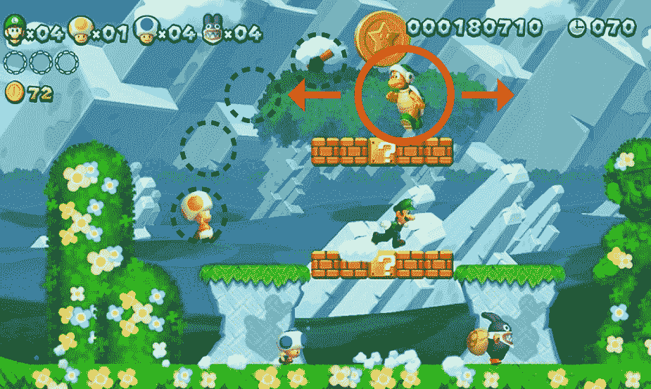

# 生产系统

在本章中，我们将讨论如何完善我们的 AI 角色以及如何将这些相同的技巧应用于我们想要创建的不同类型的游戏。我们还将讨论以下主题：

+   自动有限状态机（AFSMs）

+   计算概率

+   基于效用函数

+   动态游戏 AI 平衡

在探索可能性图和概率图之后，我们需要了解如何结合其他技术和策略使用它们来创建一个平衡且类似人类的 AI 角色。可能性图甚至概率图可以单独使用来创建有趣且具有挑战性的游戏；事实上，许多电子游戏只依赖于地图，并保持相同的方法来创建它们的 AI 敌人，并且它们这样做非常成功。一个完美的例子就是任天堂的通用平台游戏，例如*超级马里奥兄弟*。他们不需要创建复杂的 AI 系统来使敌人具有挑战性，这就是为什么几十年来他们一直使用相同的公式来创建敌人，因为这对游戏类型来说效果完美。因此，我们也应该记住，根据我们正在创建的游戏，某些技术可能比其他技术更有效，而决定使用哪些技术以及何时使用它们取决于我们。现在，同样的原则也应该应用于我们正在创建的角色，它应该知道在游戏的每一秒应该做什么以及何时去做。

让我们继续以*超级马里奥兄弟*为例，分析一些常见敌人的行为：


截图中的敌人被称为 Goomba。一旦他在游戏中出现，你就会注意到他向左移动，只有当他碰到某个东西（不包括玩家）时，他才会改变方向并向右移动。如果他在一个更高的平台上，他会继续向左移动，直到他掉下来；在较低的平台，他会继续向左移动。这个敌人永远不会试图击败玩家，并且他的行为非常可预测。因此，我们可以确定他只有一个目标，那就是移动，并且可以把他放在舞台的任何地方，因为他在位置上的行为将完全相同。现在让我们转向我们的下一个敌人：



在这个第二个例子中，敌人被称作锤子兄弟（Hammer Bro），它和之前的敌人功能不同。这个 AI 可以左右移动，始终面向玩家，并且朝玩家的方向投掷锤子。因此，他在游戏中的主要目标是击败玩家。和之前的敌人一样，这个敌人也可以被放置在游戏的任何位置，并且会根据他的目标行动。现在，假设我们拾起了上一章中开发的敌人 AI，并将其放置在游戏的不同位置或阶段。他不会做出反应，因为我们没有提供关于如果放置在另一个位置时他应该做什么的指示。根据我们正在创建的游戏，我们需要开发一个 AI 角色，使其能够按照我们的意图做出反应。有时他会被固定在单个位置，但大多数时候，需要同一个 AI 在游戏的不同位置以相同的方式做出反应。想象一下，如果《超级马里奥兄弟》（*Super Mario Bros*）的制作者每次将 AI 角色插入游戏时都必须重新定义他们的 AI 角色，这将花费大量的时间和精力。所以，让我们学习如何使用有限状态机（FSMs）来使我们的角色能够适应游戏的每一种情况。

# 自动有限状态机（AFSMs）

正如我们在《超级马里奥兄弟》（*Super Mario Bros*）的例子中所观察到的，敌人无论被放置在什么位置都知道如何做出反应。显然，他们不需要执行复杂的任务或提前计划他们将要做什么，但这作为一个例子非常完美，尤其是在与其他不同类型的视频游戏进行比较时。例如，我们可以在《光环》（Halo）中看到相同的原理被应用于小敌人（Grunts）。他们只是从一个侧面移动到另一个侧面，如果他们发现玩家，就会开始射击。这是同样的原理，他们只是给他们的角色添加了一个个性，每次在与玩家战斗失败后都会逃跑。为此，他们使用了一个语句，每次角色的生命值（HP）低于一定数值时，他们就开始逃跑。有限状态机（FSMs）是我们用来创建可能性和概率图的东西；这也是角色在面临不同情况时应做的事情。现在，让我们创建**自动有限状态机**（**AFSMs**），其中角色将根据他能计算出的因素（位置、玩家 HP、当前武器等）选择最佳选项。如果我们计划在不同的阶段或涉及开放世界的游戏中使用同一个角色，这种方法非常有用。

在规划 AFSM（有限状态机）时，如果我们能够将动作分解为两到三个主要列，那是一个很好的开始；在一侧的列中，我们放置主要信息，例如方向、速度或目标，而在另一列中，我们放置可以在第一列动作上执行的动作，例如移动、射击、充电、寻找掩护、隐藏、使用物品等等。通过这样做，我们可以确保我们的角色可以独立于他当前所在的位置根据第一列的反应。想象一下，分配给 AI 的目标是守卫我们定义的位置。这个目标是主要目标，因此它将被放置在第一列。现在想象一下，角色开始游戏时离他应该守卫的位置很远。在那个时刻，他将使用第二列的动作来实现第一列的目标。我们应该在第二列中放置什么，以便使这一点成为可能，这很大程度上取决于我们想要创建的游戏类型。所以让我们创建一个示例，并选择最佳选项。

我们将继续使用 FPS（第一人称射击）游戏类型作为示例的主要舞台，但同样的原则几乎可以应用于任何视频游戏。这就是我们选择《超级马里奥兄弟》作为参考的原因，以展示无论我们想要创建的游戏类型如何，人工智能的开发往往遵循相同的创作过程：


因此，在我们的示例中，地图将有六个建筑，玩家和敌人都不可以进入其中，但他们可以在其他任何地方移动。这个游戏的主要目标是尽可能多地在有限的时间内击败对手；子弹和生命值会在游戏中偶尔出现。现在让我们开发一个能够在任何地图上以相同方式反应的人工智能。为此，我们需要将主要目标分配给角色，并让他了解实现该目标所需的可能性，同时确保他在游戏的每一秒都在做些什么。

在基本形式上，我们为这个 AI 角色设定了两个主要目标：**击败玩家**和**生存**。我们需要确保当我们有机会时能够杀死玩家，而在没有机会时能够生存。目前，让我们简化这个公式，通过考虑我们角色的当前生命值来定义目标。如果他总生命值的 20%以上，主要目标将是击败玩家；另一方面，如果他总生命值的 20%以下，主要目标将切换为生存：


一旦我们定义了这一点，我们就可以移动到第二列，并写下我们的 AI 将选择的次要目标，以便完成第一列的目标。所以在这个例子中，我们将给我们的角色三个次要目标：**找到玩家**、**找到掩护**和**找到得分点**。通过使用这三个目标，我们的 AI 将能够实现主要目标，将始终有事情可做，并且不会等待玩家采取行动，如下所示：


现在，我们已经定义了次要目标，我们将写下游戏中所有可能采取的行动，例如**移动到**、**开火**、**使用物品**和**蹲下**，如下所示。再次强调，当我们在思考游戏设计时，所有玩家或敌人 AI 能够执行的动作都应该被定义，并且所有这些都应该在这一栏中。这也是分析游戏中角色的所有可用动作是否与主要或次要目标相关的重要策略。这将节省我们未来的时间，因为没有必要编写复杂的动作，如果这些动作不会对主要目标的成功做出贡献，就像在*超级马里奥兄弟*中，他们选择不将复杂的动作分配给敌人，因为这对他们所创建的游戏类型来说并不必要。在这个例子中，角色有自由移动、开火、使用物品（重新装填武器或使用生命值）和蹲下的可能性：


现在，我们已经填满了三列，包含了我们 AI 选择最佳选项所需的所有信息。正如我们很快就会看到的，这与我们在上一章中使用的方法不同，因为那时我们使用地图来给他指示他应该做什么，并且我们根据那个位置只分配给他命令。在这个例子中，我们希望我们的角色无论处于地图上的哪个位置，都能为自己决定最佳选项。这将推动我们进入开发 AI 角色的下一阶段，因为如果我们观察人类行为，我们很少根据单一标准做出决定。

同样的过程将应用于我们当前的敌人：他们将会根据不同的标准选择最佳选项，我们将确保他们基于自己的决定选择最佳选项。例如，健康值降至 1%比弹药量降至仅剩 1%或完成游戏的主要目标更为紧急。

一旦我们准备好了三列，我们就可以进行下一步，将第三列中的每个动作链接到第二列，并将第二列中的所有行为链接到第一列的目标。在这样做的时候，我们需要考虑如果 AI 想要找到玩家、找到掩护位置或找到点数，他应该做什么。同时，我们需要定义他应该在什么时候寻找点数、掩护位置或玩家。为了找到玩家，我们需要使用“移动到”动作，因此我们的角色将四处走动，直到找到玩家，然后最终向他开火。然后是寻找掩护；再次使用“移动到”动作，因此我们的角色将走到靠近可以作为掩护位置的一堵墙，然后我们可以根据他想要达到的目标选择他是蹲下还是不蹲下。最后，为了找到点数，我们将使用“移动到”，然后，我们将让 AI 决定他是否使用点数（使用对象）。现在，让我们考虑当他在试图击败玩家和试图生存时，他应该选择什么样的行为或行为。为了击败玩家，我们的 AI 角色需要找到他，所以我们将使用“找到玩家”行为来实现这个目标；此外，如果他已经找到玩家并且他们靠近一堵墙，我们将让他选择“找到掩护”行为。对于“生存”目标，我们将选择“找到掩护”，以防他被玩家攻击，并选择“找到点数”，以恢复更多的 HP 点数。

# 计算概率

现在我们已经一切准备就绪，我们可以将所有这些信息输入到我们的代码中。我们将使用布尔值来定义主要目标，然后创建语句，让角色 AI 在所有其他选项之间进行选择。我们已经定义了将目标从击败玩家切换到仅仅生存的主要语句，但现在我们将因为这个问题添加更多细节到我们的 AI 行为中；如果敌人有足够的 HP 面对玩家，但没有足够的子弹会发生什么？如果他有很多子弹，但之前的射击目标尝试都失败了怎么办？角色需要优先考虑他的选择，并且对于他们将要做出的每一个选择，他们需要将其与其他替代方案进行比较，并选择在那个目标中成功机会更大的一个。

让我们从击中玩家的概率开始：想象一下我们的 AI 已经发射了十发子弹，但只有四发击中了玩家。我们可以说他下一次射击击中玩家的概率是 40%。现在想象一下，他枪中只剩下两发子弹；他应该怎么做？以不太有利的成功概率向玩家射击，然后变得毫无防备？或者直接跑向可以重新装填武器的位置？为了帮助做出决定，角色还将计算被玩家击中的概率；如果玩家击中角色的概率更低，我们的 AI 将冒险向玩家射击，否则它将尝试重新装填武器。我们将开始将此信息添加到我们的代码中。以下是如何呈现的示例：

```py
Private int currentHealth = 100; 
Private int currentBullets = 0; 
private int firedBullets = 0; 
private int hitBullets = 0; 
private int pFireBullets = 0; 
private int pHitBullets = 0; 
private int chanceFire = 0; 
private int chanceHit = 0; 
public GameObject Bullet;  
private bool findPlayer;  
private bool findCover;  
private bool findPoints;  
```

这些是我们目前将使用的变量。`firedBullets` 表示角色在整个游戏中已经发射了多少发子弹；`hitBullets` 表示其中有多少发子弹击中了目标；`pFireBullets` 和 `pHitBullets` 与此相同，但考虑了玩家的子弹。我们可以继续计算击中目标或被击中的概率。`chanceFire` 将表示击中目标的子弹百分比，而 `chanceHit` 则表示被击中的百分比：

```py
void Update () 
{ 
 chanceFire = ((hitBullets / firedBullets) * 100) = 0; 
 chanceHit = ((pHitBullets / pFiredBullets) * 100) = 0; 
 if(currentHealth > 20 && currentBullets > 5) 
 { 
  Fire(); 
 } 
 if(currentHealth > 20 && currentBullets < 5 && chanceFire < 80) 
 { 
  MoveToPoint(); 
 } 
 if(currentHealth > 20 && currentBullets < 5 &&chanceFire>80) 
 { 
  Fire(); 
 } 
 if(currentHealth > 20 && currentBullets > 5 && chanceFire < 30&&
 chanceHit > 30) 
 { 
  MoveToCover(); 
 } 
 if(currentHealth < 20 && currentBullets > 0 && chanceFire > 90 && 
 chanceHit < 50) 
 { 
  Fire(); 
 } 
} 
```

我们已经使用击中或被击中的概率来确定 AI 在特定情况下应该做什么。如果他拥有超过 20 点生命值并且枪中有超过五发子弹，他可以自由地向玩家射击，直到这两个条件中的任何一个不再符合。一旦他只剩下五发子弹，就是考虑下一步行动的时候了，所以在这个例子中，如果他成功击中玩家的概率低于 80%，他将决定不射击，并移动到可以重新装填武器的位置。如果他成功击中的概率超过 80%，这意味着他正在取得成功，他可以自由地尝试运气。如果在战斗过程中，AI 击中玩家的概率低于 30%，而玩家击中 AI 的概率超过 30%，角色应该立即寻找掩护。最后，如果 AI 角色剩余的总生命值低于 20%，但他有 90%的概率击中玩家，且被击中的概率低于 50%，他将选择开火。

如果我们想要对百分比更加精确，我们可以将时间变量添加到这个方程中，其中 AI 将考虑最后两分钟或更短的时间，而不是整个时间，或者比较这两个百分比，分析他在最后两分钟内与整个游戏相比成功或失败的程度：

```py
if(recentPercentage > wholePercentage)  
```

通过计算概率，我们给我们的 AI 足够的计算下一步的方法，他可以自由地决定在那个特定时刻哪个目标更重要，并根据那个目标选择他的行动。这样做也将使 AI 能够在两个或更多可用的选项之间进行选择。我们开始开发一个更智能的角色，他可以自己思考，我们可以通过简单地改变百分比值来定义个性，使他更愿意冒险或谨慎地选择他的可能性。

# 基于效用函数

现在我们已经知道了如何计算概率并使用自动有限状态机（AFSM），是时候更深入地探索它们，并让我们的角色看起来更聪明了。这次，我们将使用一个设置为在模拟游戏如《模拟人生》中自主行为的 AI 角色。这是一个测试人工智能的完美环境，因为它模仿了现实生活中的需求和选择。

在视频游戏《模拟人生》中，玩家有机会控制一个类似人类的角色，游戏的主要目标是确保这个角色始终处于良好的状况，并且他们的个人和职业生活始终处于积极的状态。与此同时，时间就像在现实生活中一样流逝，角色会逐渐变老，直到最终死亡。玩家负责这个角色的生活，但如果玩家不对角色下达任何指令，他将会自主地反应以满足自己的需求。一个 AI 角色在视频游戏中的行为方式是革命性的；人们可以与这个虚拟角色产生共鸣，就像看待一个独立的生物一样。秘密在于我们早已知道如何创建一个可以像《模拟人生》中的角色一样行为的角色。

不再拖延，让我们直接跳到下一个例子：


让我们给这个例子中的角色起个名字，叫她 Sophie。她是一个虚拟的人类。她有一个家，拥有所有必要的生活用品：沙发、淋浴、电视、床、烤箱等等。就像人类一样，她有类似人类的需求，如饥饿、能量、舒适、卫生和乐趣。随着时间的推移，她需要满足她的需求以保持健康。现在我们有了问题，让我们着手解决它，让 Sophie 完全自主，能够自己决定需要做什么：


我们可以将目标简化并分为两列：在左侧，我们放置游戏的主要目标，在右侧，放置角色执行的动作。例如，如果她饿了，她需要走向厨房并与冰箱互动。这正是我们在 FPS 示例中创建自动化有限状态机所使用的原理。但这次我们将更深入地探索这个概念。

让我们稍微思考一下饥饿感。假设当我们吃早餐时，我们满足了饥饿需求，不再感到饥饿。在这个时候，我们可以说我们的饥饿需求是 100%，对吧？想象一下，几分钟过去了，现在我们处于 98%；为什么我们不立即去满足那缺失的 2%呢？我们可以这样说，感到饥饿是一种我们不再感到饱胀的状态，并不一定意味着我们感到空虚，因此我们调整我们的优先级，转向其他需求。所以，在开发一个自主 AI 角色时，重要的是要记住这一点：当他失去 1%的食物时，他不应该立即去吃东西。这样看起来不像人类行为；我们倾向于平衡一切，否则我们可能会睡五分钟，工作五分钟，这可能不够健康或高效，因为不足以入睡，也不足以开始工作。所以，我们睡足够多的时间来补偿我们醒着的时间，我们吃足够多的食物来保持满足感几个小时。我们可以做出判断决策，决定我们有点饿，但我们需要先完成工作。此外，我们还会做出比较判断，例如，我饿了，但我更累。在创造像索菲这样的虚拟人类时，理解我们的行为是很重要的，否则它将表现得像机器人。

为了帮助索菲在任何特定时刻确定什么更重要，我们将使用百分比，然后她将能够比较并决定她想要做什么。在我们过于复杂化之前，让我们先在我们的代码中写下基本信息：

```py
Private float Hunger = 0f; 
Private float Energy = 0f; 
Private float Comfort = 0f; 
Private float Hygiene = 0f; 
Private float Fun = 0f; 
private float Overall = 0f; 
public Transform Fridge; 
public Transform Oven; 
public Transform Sofa; 
public Transform Bed; 
public Transform TV; 
public Transform Shower; 
public Transform WC; 
void Start () 
{ 
   Hunger = 100f; 
   Energy = 100f; 
   Comfort = 100f; 
   Hygiene = 100f; 
   Fun = 100f; 
} 
void Update () 
{ 
 Overall = ((Hunger + Energy + Comfort + Hygiene + Fun)/5); 
   Hunger -= Time.deltaTime / 9; 
   Energy -= Time.deltaTime / 20; 
   Comfort -= Time.deltaTime / 15; 
   Hygiene -= Time.deltaTime / 11; 
   Fun -= Time.deltaTime / 12; 
}
```

我们记录了我们正在创造的角色所需的基本变量。随着时间的推移，这些值将会减少，不同的属性值取决于需求。此外，我们还有一个`总体`变量，用于计算角色的整体情况，并且可以完美地代表我们虚拟人类的情绪。这将成为一个重要因素，并帮助索菲决定什么是对她最好的选择。

现在，让我们为每个需求进行个性化处理，并为它们创建一个决策树。为了做到这一点，我们需要规划索菲在选择任何行动之前会思考的决策过程。让我们从饥饿需求开始：


如果索菲感到饥饿并且认为这是一个优先事项，她将遵循以下步骤。首先，她感到饥饿，然后问自己是否有足够的食物；为了回答这个问题，她走向冰箱并检查是否有。如果答案是肯定的，她将继续前进，做饭，最后吃饭。如果任何一段无法完成，过程将被中断，她将转向不同的优先事项。比如说，如果她去上班，冰箱里才有食物，而且她每工作一天，比如，可以得到两天的食物。所以，如果她想要保持健康和活着，她很快就会把去上班变成一个优先事项：

```py
Private float Hunger = 0f; 
Private float Energy = 0f; 
Private float Comfort = 0f; 
Private float Hygiene = 0f; 
Private float Fun = 0f; 
private float Overall = 0f; 
public Transform Fridge; 
public Transform Oven; 
public Transform Sofa; 
public Transform Bed; 
public Transform TV; 
public Transform Shower; 
public Transform WC; 
private int foodQuantity; 
public float WalkSpeed; 
public static bool atFridge; 
void Start () 
{ 
   Hunger = 100f; 
   Energy = 100f; 
   Comfort = 100f; 
   Hygiene = 100f; 
   Fun = 100f; 
} 
void Update () 
{ 
   Overall = ((Hunger + Energy + Comfort + Hygiene + Fun)/5); 
   Hunger -= Time.deltaTime / 9; 
   Energy -= Time.deltaTime / 20; 
   Comfort -= Time.deltaTime / 15; 
   Hygiene -= Time.deltaTime / 11; 
   Fun -= Time.deltaTime / 12; 
} 
void Hungry () 
{ 
   transform.LookAt(Fridge); // Face the direction of the Fridge
   transform.position vector3.MoveTowards(transform.position.
   Fridge.position, walkSpeed); 
   //checks if already triggered the fridge position 
   if(atFridge == true) 
   { 
    //interact with fridge 
    if(foodQuantity > 1) 
    { 
     Cook(); 
    } 
    else() 
    { 
     // calculate next priority 
    } 
 } 
} 
```

在前面的代码中，我们有一个例子说明如何在我们的代码中表示决策树。我们将继续编写她将进行的每个需求，一旦完成，我们就可以确定她将如何优先排序，并决定哪个需求需要首先处理：


列表中的下一个是能量：


如果索菲感到困倦并且认为这是一个优先事项，她将遵循以下步骤。首先，她感到困倦，然后问自己是否需要工作。如果她有空闲时间，她将做出最终判断，决定是否需要在睡觉前去洗手间。一旦所有状态都得到批准，她最终可以完成目标并去睡觉。我们可以看到以下代码中如何表示这个过程：

```py
void Sleepy () 
{ 
   if(hoursToWork > 3&&Energy < Hygiene) 
{ 
       transform.LookAt(Bed); // Face the direction of the Bed 
       transform.position = vector3.MoveTowards(transform.position.Bed.
       position, walkSpeed); 
         //checks if already triggered the bed position 
         if(atBed == true) 
          { 
          //interact with the bed 
          }  

 } 
if(hoursToWork > 3 && Energy > Hygiene) 
{ 
  useWC(); //Go to the bathroom 
} 
 if(hoursToWork < 3) 
{ 
   //choose another thing to do 
} 
} 
```

假设，对于索菲每睡一小时，她获得+10 点的能量，但失去 10 点的卫生。她首先需要确认她不会在睡眠中需要使用洗手间，为此我们比较她需要的能量点和卫生点：


让我们继续到舒适需求。这个需求有一点特别，因为我们可以在获得舒适点的同时同时设定两个目标。例如，她将能够决定是否想坐在椅子上吃饭。同样的情况也适用于她看电视时。这是一个重要的例子，可以在许多游戏中应用，当角色有机会同时做两件事并且理解这样做的重要性时。在接下来的例子中，我们将考虑这一点：


如果索菲感到不舒服，她首先会检查在那个时刻她是否正在做某事。这个问题只能有两个答案：是或否。如果答案是是，她需要思考是否有可能坐着继续做这件事。否则，她会完成当时正在做的事情，然后开始提出同样的问题。如果可能或可行，她最终会坐下并感到舒适。以下代码示例展示了它应该如何看起来：

```py
private bool isEating; 
private bool isWatchingTV; 
private bool Busy; 
... 
void Uncomfortable () 
{ 
   if(isEating == true || isWatchingTV == true) 
    { 
         transform.LookAt(Sofa); // Face the direction of the Sofa 
         transform.position = vector3.MoveTowards(transform.position.
         Sofa.position, walkSpeed); 
         //checks if already triggered the bed position 
         if(atSofa == true) 
         {  
         //interact with the sofa 
         }  
     } 
else 
{ 
  if(Comfort < Overall&& Busy == false) 
{ 
    transform.LookAt(Sofa); // Face the direction of the
    Sofa 
    transform.position =
    vector3.MoveTowards(transform.position.Sofa.position, walkSpeed); 
               //checks if already triggered the bed position 

           if(atSofa == true) 
           { 
           //interact with the sofa 
           }  
    } 
   if(Busy == true && isEating == false && isWatchingTV == false) 
    { 
     //Keep doing what she is doing at that moment 
    } 
} 
} 
```

我们增加了三个变量：`isEating`、`isWatchingTV`和`Busy`。这将帮助她根据这三个值决定最佳选项。如果她感到不舒服但正在吃饭或看电视，她可以同时执行这两个动作。否则，她需要比较其他需求，并判断是否比坐着做其他事情更重要。如果她当时正在做某事且无法坐下——比如说，她正在洗澡或工作——她会忽略自己感到不舒服的事实，一旦索菲有机会，她会坐下并获得舒适度分数：


还剩下两个必要条件来完成这个示例，不久我们就会有一个可以独立生活的 AI 角色，无需有人控制并决定对她最好的事情。我们正在开发一个基于模拟游戏的 AI 系统，但这种方法也可以用于不同类型的游戏。想象一下实时策略游戏，其中工人会做出自主决定，而不是无所事事地等待命令，而是立即开始处理他们认为当时更重要的事情，一旦其他优先事项出现，就切换到另一项工作。

让我们继续下一个目标，卫生。为了简化起见，我们将使用这个需求来代表所有与洗手间相关的事情：


卫生需求比之前的简单；只是问她是否有时间洗澡的问题。我们将在这个问题上使用的一个额外因素是，无论情况如何，去洗手间是最重要的，她会立即暂停正在做的事情，直接走向洗手间。

在洗澡时，她可能做的唯一事情是刷牙或任何其他与卫生标准相关的子段。但就目前而言，让我们尽量减少选项以测试 AI；一旦基本功能正常工作，我们就可以开始添加更多动作。为了原型设计的目的，这也是一种好的方法：首先让基本功能正常工作，然后我们可以继续并逐步添加更多细节。现在让我们看看`Hygiene`函数的一个示例：

```py
void useBathroom () 
{ 
if(Hygiene<10) 
{
       transform.LookAt(Bathroom); // Face the direction of the
       Bathroom 
       transform.position = vector3.MoveTowards(transform.position.
       Bathroom.position, walkSpeed); 
       //checks if already triggered the bed position 
if(atBathroom == true) 

{ 

   //choose randomly what to do in the bathroom 

}  

} 

} 
```


让我们直接跳到下一个也是最后一个必要条件：乐趣。这个条件将有机会成为最灵活的一个，因为我们可以在吃饭和看电视的同时进行，我们可以坐着看电视，我们可以在看电视的同时坐着吃饭。我们给我们的 AI 提供同时做三件事的选择。乍一看，允许我们的角色在三个不同的必要条件中提高她的分数似乎是理想的，但我们稍后会讨论这个问题。现在，让我们只关注乐趣因素，并规划她将使用的步骤来判断她是否需要并且可以看电视：


如果索菲感到无聊，她会开始问自己是否可以看电视。首先，如果她有空闲时间，她可以自由地看电视，在默认状态下，她坐着看电视。但如果她那时正忙，她需要问自己是否可以在她做任何事的同时看电视（在这个例子中，这代表吃饭、坐着或同时进行）。再次为了简单起见，让我们假设她不需要走到电视前才能打开它。我们可以看到以下是如何在我们的代码中表示这个例子：

```py
private bool isSeat; 
private bool televisionOn; 
void Bored () 
{ 
if(Fun<Overall&& Busy == false) 
{ 
   televisionOn = true; // turns on the television 
         transform.LookAt(TV); // Face the direction of the television 
         transform.position = vector3.MoveTowards(transform.position.
         Sofa.position, walkSpeed); 
         //checks if already triggered the bed position 
         if(atSofa == true) 
         { 
          //interact with the sofa 
         } 
 } 
if(Fun < Overall && Busy == true) 
{ 
   f(isEating == true) { 
         televisionOn = true; // turns on the television 
               transform.LookAt(TV); // Face the direction of the
         television 

      } 
if(isSeat == true) 
  { 
         televisionOn = true; // turns on the television 
         transform.LookAt(TV); // Face the direction of the television 

   } 
if(isSeat == true && isEating == true) 
{ 
         televisionOn = true; // turns on the television 
         transform.LookAt(TV); // Face the direction of the television 
         } 
} 
else() 
{ 
   //continue doing what she is doing 
}  
} 
```

最后，我们使用不同的方法对每个必要行为进行总结。这样做，我们可以确保她知道在游戏的不同情况下应该做什么，并且总是寻求采取行动。AI 设计中存在一些缺陷，我们需要完善；例如，即使她感到饥饿或疲倦，她也不能决定继续看电视。为了实现这一点，我们只需简单地添加一个概率图，并使用`Overall`变量来定义她是否快乐；比如说，如果她的快乐度超过 50%，即使她感到疲倦，她也可以决定看电视。所有这些限制现在都可以分配给代码，我们可以不断地为我们的角色行为添加更多细节。但，目前，我们只关注两个额外的细节：AI 平衡和动态问题解决。


# 动态游戏 AI 平衡

另一个关于人工智能发展非常有趣且实用的主题是游戏难度。如果我们与人类玩家对战，游戏的难度将完全取决于与我们对抗的玩家的经验。如果他们在特定的电子游戏中非常熟练，显然他们将对刚开始游戏的玩家拥有更大的优势。通常，电子游戏会逐步增加难度，这样玩家就可以适应它，不会过早地感到沮丧，或者因为游戏没有提供挑战而感到无聊。动态游戏难度平衡被用来解决这个问题，为每位玩家创造有趣的体验。为了使用这种方法平衡 AI 角色，我们考虑一些可以根据玩家经验调整的动态游戏元素；这些属性可以是以下几种：

+   速度

+   生命值

+   魔法

+   力量

通常，我们使用这些属性来定义 AI 角色的难度，调整它们以达到所需的难度。另一种平衡难度的方式是通过调整玩家在游戏中遇到的武器和敌人的数量。在调整难度时，我们还需要小心不要创建出像橡皮筋一样行为的敌人；例如，如果 AI 汽车在玩家后面，它会显著加速以保持对玩家的挑战。当玩家在对手汽车后面时，那辆车会减慢速度，如果不加以调节，这种方法可能会变得乏味。

在一款通用的格斗游戏中，开发者通常这样定义 AI 战斗：如果玩家可触及，AI 使用踢或拳；如果不可触及，它就会朝玩家移动。然后通过使用攻击之间的百分比和时间间隔来调整难度。

例如，在一款 FPS 射击游戏中，游戏 AI 的调整会考虑到开发阶段玩家的表现，那时程序员输入所有与人类玩家整体表现相匹配的 AI 统计数据和战术。例如，如果玩家的射击率约为 70%，AI 角色将使用这个值来保持相对接近人类玩家的表现。

*《 Crash Bandicoot》* 并没有直接在 AI 角色的行为中使用动态游戏难度平衡，而是在动画速度上，如果玩家在通过关卡时遇到困难，它会减慢速度。这种难度调整是根据玩家死亡次数来进行的。这是一种智能且简单的方法来调整 AI 角色的难度，通过考虑玩家尝试通关时死亡次数。

2005 年由卡普空发布的 *《生化危机 4》* 基于同样的难度调整原则，但采用了更复杂的系统。调整考虑了玩家的表现，并且玩家在不知情的情况下被游戏从一到十进行评级，其中一表示他们在游戏中不太成功，而十表示他们非常熟练。考虑到这些评级，敌人的行为会有所不同，攻击性更强或更弱，受到的伤害更多或更少。评级会不断更新，许多因素都会被考虑来确定玩家的表现如何，例如他们需要多少子弹来杀死一个僵尸，他们受到了多少次打击，等等。

*《左 4 死》* 也考虑了玩家的表现情况，但不是仅仅通过增加敌人 AI 的难度，而是决定改变敌人出现的位置，每次玩家选择玩同一关卡时都创造不同的挑战。如果玩家刚开始游戏，敌人会出现在较容易的地方；如果玩家已经通过了那个关卡，敌人会出现在更困难的位置。

为了总结游戏开发者调整角色 AI 难度时所做的选择，我们需要提到，难度并不总是意味着要调整或根据玩家的表现来增加或减少。一个很好的例子是模拟游戏，在这些游戏中，至关重要的是要达到现实生活中的难度，而不是使它们更难或更容易，否则就不会有模拟的感觉。其他例子可以是像《鬼怪猎人》或更近期的《黑暗之魂》这样的游戏，开发者明确选择从始至终使游戏难度很高，而不改变 AI 行为以适应难度。

# 摘要

在本章中，我们发现了如何使用有限状态机（AFSM）创建能够自主做出决定的 AI 角色。然后我们学习了如何计算概率以及如何结合之前的技术使用它来创建一个能够为其下一步计算更好选择的角色。使用所有这些技术，我们继续讨论如何使用基于效用的函数来创建一个类似人类的角色，使其能够自主行动。最后，我们讨论了调整我们输入角色中的值的多种方法，以使它们与玩家的表现相比保持平衡。在下一章中，我们将深入探讨环境和 AI，考虑到不同类型的视频游戏和不同类型的 AI，AI 应该如何使用地图上的可用空间来为玩家创造挑战，如何与环境互动，如何利用环境来为自己谋利，以及更多。
