# 第四章：环境与 AI

在为视频游戏创建 AI 时，最重要的方面之一是其位置。正如我们之前所发现的，AI 角色的位置可以完全改变其行为和未来的决策。在本章中，我们将探讨游戏环境如何影响我们的 AI，以及他应该如何正确地使用它，深入探讨。这将涵盖具有不同地图结构（如开放世界、街机游戏和赛车）的广泛游戏类型。

作为玩家，我们喜欢有一个生动的世界去探索，有很多事情可以做，可以与之互动。作为游戏开发者或游戏设计师，这通常意味着大量的工作，因为玩家能够与之互动的每一件事都必须仔细规划并正确执行，以避免游戏中的错误或其他不幸的干扰。对于我们所创建的 AI 角色也是如此。如果我们允许角色与环境互动，那需要大量的工作、思考、规划和编码才能使其正常工作。玩家或 AI 可用的选项数量通常等于可能发生的问题数量，因此在我们创建游戏时，我们需要特别关注环境。

并非每个游戏都必然包含地图或地形，但也许当时发生行动的位置对于游戏玩法仍然具有重要意义，AI 应该考虑到这一点。此外，有时环境或定位对游戏角色的微妙影响是我们玩游戏时没有注意到的，但大多数时候，这些微妙的变化有助于良好的游戏体验。这就是为什么在创建视频游戏时，与环境互动是一个重要方面，因为它负责赋予角色生命，没有它，他们就会仅仅停留在简单的 3D 或 2D 模型。

另一方面，我们也不能忘记相反的情况，即游戏角色与环境之间的互动。如果我们的人生可以以视频游戏的形式呈现，我们对环境的影响应该是游戏涉及的一个方面。例如，如果我们把一支烟扔进森林，它有很大概率烧毁一些树叶并引发火灾，导致栖息在那片森林的所有动物都生病，后果会不断加剧。因此，了解环境应该如何根据游戏中的情况做出反应也是非常有趣的。在游戏设计过程中，我们有选择这种互动是否与游戏玩法相关的机会，或者它只是出于视觉目的而存在，但无论如何，它确实为每个人所喜爱的丰富环境做出了贡献。在本章中，我们将有机会深入探讨上述所有选项，并开始探索那些不会改变游戏玩法的基

# 视觉互动

视觉交互是基本交互，它们不会直接影响游戏玩法，但有助于润色我们的视频游戏和角色，使它们成为我们正在创造的环境的一部分，对玩家的沉浸感有显著贡献。这个主题有无数例子，我们几乎可以在任何类型的游戏中找到它们。这表明环境作为游戏的一部分，而不仅仅是用来填充屏幕的存在，其重要性。在游戏中看到这些类型的交互变得越来越普遍，玩家们也期待着它们。如果游戏中有物体，它应该做些什么，无论重要与否。这使得我们正在创造的环境更加生动和真实，这无疑是件好事。

我们可以在 1986 年发布的原始版《恶魔城》中找到环境交互的第一个例子，这款游戏是为任天堂娱乐系统发布的。从一开始，玩家就可以使用鞭子来摧毁原本作为背景一部分的蜡烛和火坑。

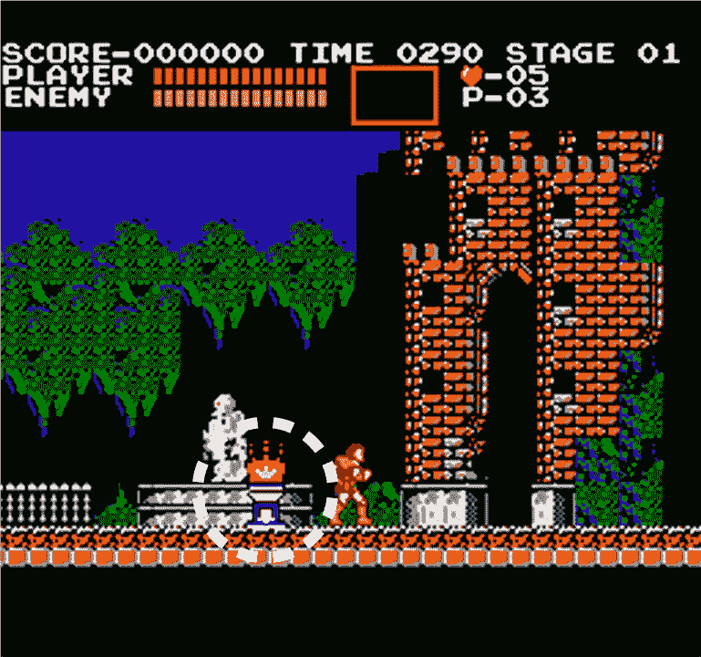

这款游戏和当时发布的几款其他游戏，在关于游戏角色周围背景或环境的感知方面打开了众多大门和可能性。显然，由于这一代游戏机的硬件限制，要创建我们现在视为常见的简单事物变得非常困难。但每一代游戏机都带来了更多的功能，我们这样的创作者也一直在利用这些功能来创造惊人的游戏。

因此，我们第一个视觉交互的例子是背景中可以被摧毁的物体，而不会直接干扰游戏玩法。这种交互可以在多个游戏中看到，它就像编写一个在受到攻击时可以动画化的物体一样简单。然后，我们可以决定物体是否掉落一些分数或可收集物品，以此来奖励玩家探索游戏。现在，我们将转向下一个例子，即游戏中那些在角色经过时动画化或移动的资产。这与可摧毁的物体原理相同，但这次是一种更微妙的交互，需要角色移动到资产所在的位置附近。这可以应用于游戏中的各种事物，从草的移动到灰尘或水，飞走的鸟，或者做出滑稽手势的人；可能性无穷无尽。当我们分析这些交互时，我们可以很容易地确定它们不一定背后有人工智能，大多数时候，它们只是根据某些预定的动作激活的布尔函数。但它们构成了环境的一部分，因此，当我们想要环境与人工智能之间有良好的整合时，我们需要考虑它们。

# 基本环境交互

正如我们之前所看到的，环境成为了视频游戏体验的一部分，这激发了许多关于未来游戏标题的新概念和想法。下一步是将这些细微的变化整合到游戏玩法中，并利用它们来塑造角色在游戏中的行为方式。这无疑对视频游戏历史做出了积极的贡献，场景中的每一件事物开始获得生命，玩家也开始意识到那些丰富的环境。使用环境来实现游戏中的目标开始成为游戏体验的一部分。

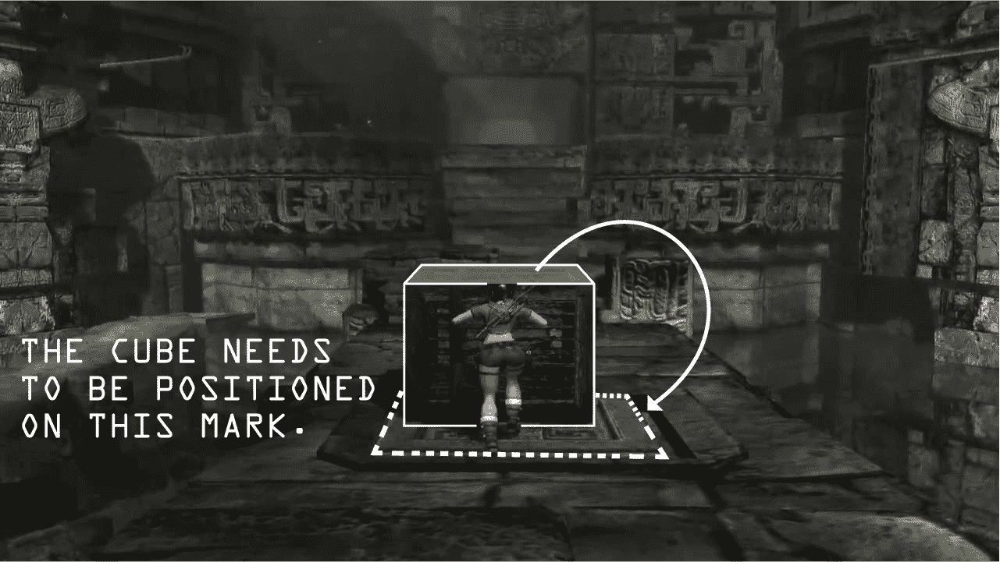

为了展示一个环境对象如何直接影响游戏玩法的例子，我们可以看看《古墓丽影》系列，它完美地展示了这一点。在这个例子中，我们的角色劳拉·克劳馥需要推动立方体，直到它放置在标记区域上方。这将改变环境并解锁一条新路径，允许玩家在关卡中前进。我们可以在许多游戏中找到这种类型的挑战，其中需要触发地图上的特定位置，以便在游戏的另一部分发生某些事情，这可以用来完成游戏中的特定目标。通常，我们需要改变环境，以便在该级别上前进。因此，当我们规划地图或舞台时，我们会考虑这些交互，然后为每个交互创建所有相关的规则。例如：

```py
if(cube.transform.position == mark.transform.position) 
{ 
   openDoor = true; 
} 
```

现在让我们想象一下，劳拉·克劳馥有一个盟友角色，其主要任务是帮助她将那个盒子放置到位？这正是我们将在本章中探讨的一种交互类型，其中 AI 角色理解环境是如何运作的以及如何使用它。

# 移动环境对象

让我们直接进入那个场景，尝试重现我们有一个能够帮助玩家实现目标的 AI 角色的情景。为了这个例子，让我们假设我们的玩家被困在一个位置，无法访问释放他的交互式对象。我们将创建的角色需要能够找到立方体并将其推向目标位置。

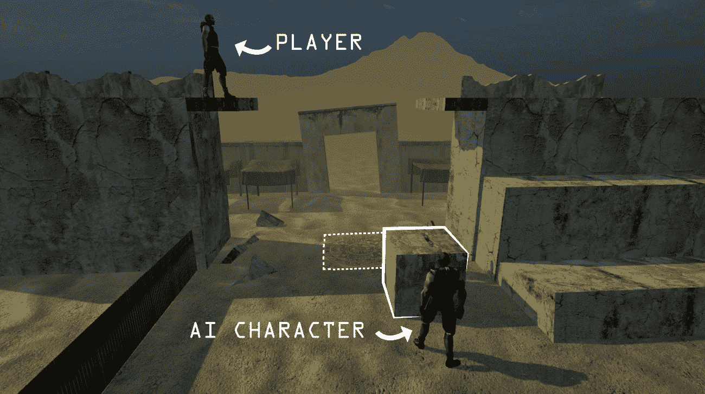

因此，现在我们已经在我们的环境示例中设置了所有角色和对象，让我们计划 AI 角色在这个情况下的行为。首先，他需要看到玩家在附近，这样他就可以开始搜索并将立方体移动到正确的位置。让我们假设，如果立方体在那个标记上，一块新的方块将从沙子中升起，允许玩家在关卡中前进。AI 角色可以将立方体推向四个不同的方向，左、右、前和后，确保它与位置标记完美对齐。


人工智能角色需要质疑和验证在行为树中之前展示的每一个动作。为了继续执行目标，最重要的是角色必须确信玩家已经站在他的标记位置上。如果玩家还没有到达，我们的角色需要等待并保持位置。如果玩家已经到达，人工智能角色将继续前进并自问自己是否靠近立方体对象。如果不是，我们的角色需要走向立方体，一旦该动作得到验证，他将会再次提出相同的问题。一旦答案是肯定的，并且角色靠近立方体，他需要计算立方体需要首先推向哪个方向。然后他将朝着**Y**轴或**X**轴推立方体，直到立方体与标记位置对齐，目标得以完成。

```py
 public GameObject playerMesh;
 public Transform playerMark;
 public Transform cubeMark;
 public Transform currentPlayerPosition;
 public Transform currentCubePosition;

 public float proximityValueX;
 public float proximityValueY;
 public float nearValue;

 private bool playerOnMark;

 void Start () {

 }
void Update () {

 // Calculates the current position of the player
 currentPlayerPosition.transform.position = playerMesh.transform.position;

 // Calculates the distance between the player and the player mark of the X axis
 proximityValueX = playerMark.transform.position.x - currentPlayerPosition.transform.position.x;

 // Calculates the distance between the player and the player mark of the Y axis
 proximityValueYplayerMark.transform.position.y - currentPlayerPosition.transform.position.y;

 // Calculates if the player is near of his MARK POSITION
 if((proximityValueX + proximityValueY) < nearValue)
 {
    playerOnMark = true;
 } 
}  
```

我们开始将信息添加到我们的代码中，允许角色验证玩家是否靠近他的标记位置。为此，我们创建了所有必要的变量来计算玩家和需要到达的位置的距离。`playerMesh`指的是玩家的 3D 模型，我们将从中提取位置并用作`currentPlayerPosition`。为了知道玩家是否靠近他的标记，我们需要一个表示标记位置的变量，在这个例子中，我们创建了`playerMark`变量，我们可以写下我们希望玩家所在的位置。然后我们添加了三个变量，使我们能够知道玩家是否靠近。`proximityValueX`将计算玩家在 X 轴上与标记之间的距离。`proximityValueY`将计算玩家在 Y 轴上与标记之间的距离。然后我们有`nearValue`，我们可以定义玩家离标记位置多远，这样我们的 AI 角色就可以开始处理目标。一旦玩家靠近他的标记，`playerOnMark`布尔值将变为 true。

为了计算玩家和他的标记之间的距离，我们使用了以下公式：玩家和他的标记之间的距离等于（标记位置 - 玩家位置）。

现在，为了发现人工智能角色是否靠近立方体，我们将执行相同的方程，计算人工智能与立方体之间的距离。此外，我们已经完成了以下代码，其中包含了两个标记（玩家和立方体标记）的位置：

```py
 public GameObject playerMesh;
 public Transform playerMark;
 public Transform cubeMark;
 public Transform currentPlayerPosition;
 public Transform currentCubePosition;

 public float proximityValueX;
 public float proximityValueY;
 public float nearValue;

 public float cubeProximityX;
 public float cubeProximityY;
 public float nearCube;

 private bool playerOnMark;
 private bool cubeIsNear;

 void Start () {

    Vector3 playerMark = new Vector3(81.2f, 32.6f, -31.3f);
    Vector3 cubeMark = new Vector3(81.9f, -8.3f, -2.94f);
    nearValue = 0.5f;
    nearCube = 0.5f;
 }

 void Update () {

 // Calculates the current position of the player
 currentPlayerPosition.transform.position = playerMesh.transform.position;

 // Calculates the distance between the player and the player mark of the X axis
 proximityValueX = playerMark.transform.position.x - currentPlayerPosition.transform.position.x; 

 // Calculates the distance between the player and the player mark of the Y axis
 proximityValueY = playerMark.transform.position.y - currentPlayerPosition.transform.position.y;

 // Calculates if the player is near of his MARK POSITION
 if((proximityValueX + proximityValueY) < nearValue)
 {
    playerOnMark = true;
 }

 cubeProximityX = currentCubePosition.transform.position.x - this.transform.position.x;
 cubeProximityY = currentCubePosition.transform.position.y - this.transform.position.y;

 if((cubeProximityX + cubeProximityY) < nearCube)
 {
    cubeIsNear = true;
 }

else
 {
    cubeIsNear = false;
 }
}  
```

现在，我们的 AI 角色知道他是否靠近立方体，这将回答问题并确定他是否可以继续到我们计划中的下一个分支。但是，当我们的角色不靠近立方体时会发生什么？他将需要走向立方体。因此，我们将这一点添加到我们的代码中：

```py
 public GameObject playerMesh;
 public Transform playerMark;
 public Transform cubeMark;
 public Transform cubeMesh;
 public Transform currentPlayerPosition;
 public Transform currentCubePosition;

 public float proximityValueX;
 public float proximityValueY;
 public float nearValue;

 public float cubeProximityX;
 public float cubeProximityY;
 public float nearCube;

 private bool playerOnMark;
 private bool cubeIsNear;

 public float speed;
 public bool Finding;

 void Start () {

  Vector3 playerMark = new Vector3(81.2f, 32.6f, -31.3f);
  Vector3 cubeMark = new Vector3(81.9f, -8.3f, -2.94f);
  nearValue = 0.5f;
  nearCube = 0.5f;
  speed = 1.3f;
}

 void Update () {

 // Calculates the current position of the player
 currentPlayerPosition.transform.position = playerMesh.transform.position;

 // Calculates the distance between the player and the player mark of the X axis
 proximityValueX = playerMark.transform.position.x - currentPlayerPosition.transform.position.x; 

 // Calculates the distance between the player and the player mark of the Y axis
 proximityValueY = playerMark.transform.position.y - currentPlayerPosition.transform.position.y;

 // Calculates if the player is near of his MARK POSITION
 if((proximityValueX + proximityValueY) < nearValue)
 {  
     playerOnMark = true;
 }

 cubeProximityX = currentCubePosition.transform.position.x - this.transform.position.x;
 cubeProximityY = currentCubePosition.transform.position.y - this.transform.position.y;

 if((cubeProximityX + cubeProximityY) < nearCube)
 {
     cubeIsNear = true;
 }

 else
 {
     cubeIsNear = false;
 }

 if(playerOnMark == true && cubeIsNear == false && Finding == false)
 {
    PositionChanging();
 }

 if(playerOnMark == true && cubeIsNear == true)
 {
    Finding = false;
 }

 }

 void PositionChanging () {

 Finding = true;
 Vector3 positionA = this.transform.position;
 Vector3 positionB = cubeMesh.transform.position;
 this.transform.position = Vector3.Lerp(positionA, positionB, Time.deltaTime * speed);
 }
```

到目前为止，我们的 AI 角色能够计算出自己与立方体之间的距离；如果它们相距太远，他就会向立方体移动。一旦这个任务完成，他就可以进入下一阶段，开始推动立方体。他最后需要计算的是立方体与标记位置的距离，然后根据每个侧面距离的远近决定先推动哪一侧。

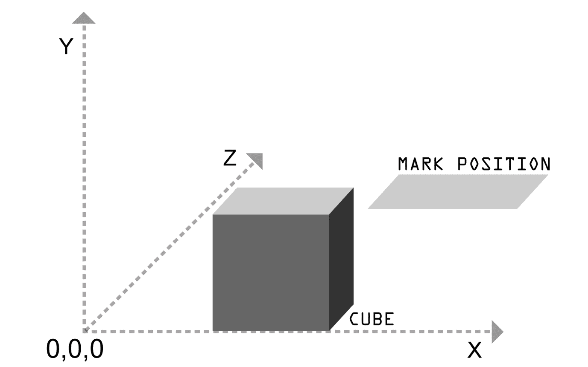

立方体只能在**X**轴或**Z**轴上推动，并且目前旋转并不相关，因为按钮在立方体位于其上方时被激活。考虑到这一点，我们的角色 AI 需要计算出立方体与**X 标记位置**和**Z 标记位置**的距离。然后，他将比较两个不同的轴值，并选择离期望位置更远的那一侧开始推动。角色将朝这个方向推动，直到立方体与标记位置对齐，然后切换到另一侧，并推动它直到完全位于**标记位置**上方：

```py
 public GameObject playerMesh;
 public Transform playerMark;
 public Transform cubeMark;
 public Transform cubeMesh;
 public Transform currentPlayerPosition;
 public Transform currentCubePosition;

 public float proximityValueX;
 public float proximityValueY;
 public float nearValue;

 public float cubeProximityX;
 public float cubeProximityY;
 public float nearCube;

 public float cubeMarkProximityX;
 public float cubeMarkProximityZ;

 private bool playerOnMark;
 private bool cubeIsNear;

 public float speed;
 public bool Finding;

 void Start () {

         Vector3 playerMark = new Vector3(81.2f, 32.6f, -31.3f);
         Vector3 cubeMark = new Vector3(81.9f, -8.3f, -2.94f);
         nearValue = 0.5f;
         nearCube = 0.5f;
         speed = 1.3f;
 }

 void Update () {

 // Calculates the current position of the player
 currentPlayerPosition.transform.position = playerMesh.transform.position;

 // Calculates the distance between the player and the player mark of the X axis
 proximityValueX = playerMark.transform.position.x - currentPlayerPosition.transform.position.x; 

 // Calculates the distance between the player and the player mark of the Y axis
 proximityValueY = playerMark.transform.position.y - currentPlayerPosition.transform.position.y;

 // Calculates if the player is near of his MARK POSITION
 if((proximityValueX + proximityValueY) < nearValue)
 {
    playerOnMark = true;
 }

 cubeProximityX = currentCubePosition.transform.position.x - this.transform.position.x;
 cubeProximityY = currentCubePosition.transform.position.y - this.transform.position.y;

 if((cubeProximityX + cubeProximityY) < nearCube)
 {
    cubeIsNear = true;
 }

 else
 {
    cubeIsNear = false;
 }

 if(playerOnMark == true && cubeIsNear == false && Finding == false)
 {
     PositionChanging();
 }

 if(playerOnMark == true && cubeIsNear == true)
 {
     Finding = false;
   }

  cubeMarkProximityX = cubeMark.transform.position.x - currentCubePosition.transform.position.x;
  cubeMarkProximityZ = cubeMark.transform.position.z - currentCubePosition.transform.position.z;

  if(cubeMarkProximityX > cubeMarkProximityZ)
  {
    PushX();
  }

  if(cubeMarkProximityX < cubeMarkProximityZ)
  {
    PushZ();
  }

 }

 void PositionChanging () {

 Finding = true;
 Vector3 positionA = this.transform.position;
 Vector3 positionB = cubeMesh.transform.position;
 this.transform.position = Vector3.Lerp(positionA, positionB, Time.deltaTime * speed);

} 
```

在将最终动作添加到我们的代码后，我们的 AI 角色应该能够完成其目标，并找到并推动立方体到期望的位置，这样玩家就可以继续前进并完成关卡。在这个例子中，我们关注了如何计算场景中物体与角色之间的距离。这将有助于创建需要将物体放置在游戏中的特定位置以产生类似类型的交互。

该示例演示了一个协助玩家的盟军 AI 角色，但如果想要产生相反的效果（成为敌人），角色则需要尽可能快地找到立方体以阻止玩家。

# 阻碍性环境物体

如我们之前所看到的，我们可以使用或移动游戏中的物体来实现目标，但如果角色被物体阻挡了道路怎么办？这个物体可能是玩家放置的，或者简单地设计成在地图的该位置，无论哪种情况，AI 角色都应该能够确定在这种情况下应该做什么。

我们可以在 Ensemble Studios 开发的策略游戏《帝国时代 II》中观察到这种行为。每次游戏中的角色因为被包围的加固城墙而无法进入敌方领土时，AI 角色就会集中精力开始摧毁城墙的一部分，以便进入。这种交互方式非常聪明且很重要，因为否则它们只会围绕城墙寻找入口，这看起来并不智能。由于加固城墙是由玩家创建的，它可以放置在任何地方，具有任何形状或形式，因此，在开发 AI 对手时，有必要考虑这一点。

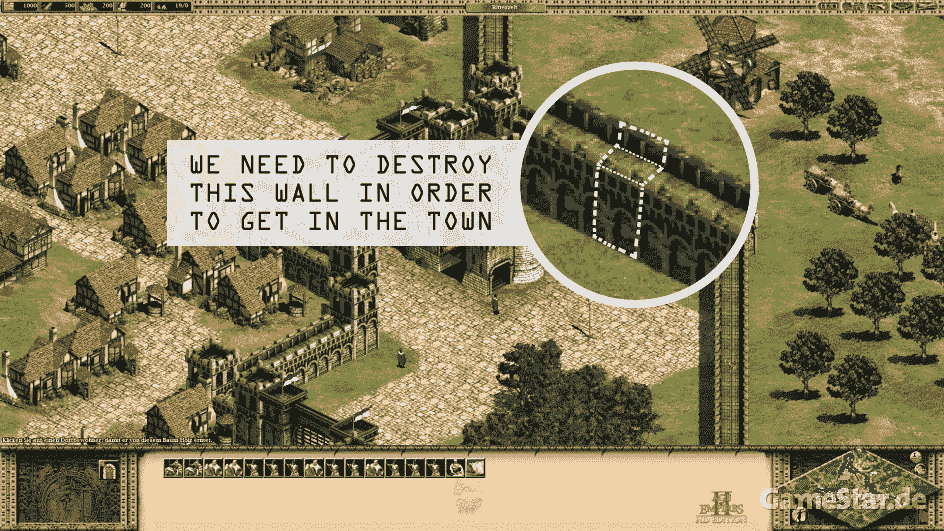

这个例子也很有意义，因为在规划阶段，当我们创建行为树时，我们需要考虑如果有什么东西挡在角色面前，他无法完成他的目标会发生什么。这将在本书的下一章中深入探讨，但到目前为止，我们将简化这种情况，并分析如果环境对象干扰了角色的目标，AI 角色应该如何表现。

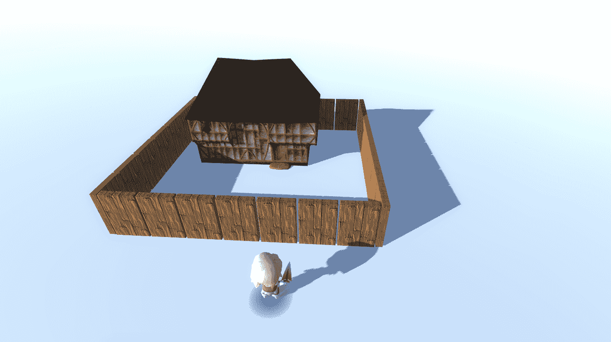

在我们的例子中，AI 角色需要进入房子，但当他到达附近时，意识到它被木栅栏包围，他无法通过。在那个时刻，我们希望角色选择一个目标并开始攻击，直到栅栏的这一部分被摧毁，这样他才能找到进入房子的方法。

对于这个例子，我们需要计算角色需要攻击哪个栅栏，考虑到距离和栅栏当前的健康状态。HP 低的栅栏应该比满 HP 的栅栏有更高的优先级被首先攻击，因此我们将将其包含在我们的计算中。


我们希望定义一个围绕角色的圆周，最近的栅栏将向 AI 提供信息，以便他可以决定哪个是最容易摧毁的。这可以通过不同的方法完成，要么通过使用由玩家触发的栅栏上的碰撞检测，要么让它们计算栅栏/对象与玩家之间的距离；我们定义一个距离值，玩家可以感知栅栏的条件。对于这个例子，我们将计算距离并使用它来提醒角色栅栏的 HP。

让我们先创建将在`fence`对象上实现的代码；所有这些都将使用以下相同的脚本：

```py
 public float HP;
 public float distanceValue;
 private Transform characterPosition;
 private GameObject characterMesh;

 private float proximityValueX;
 private float proximityValueY;
 private float nearValue;

 // Use this for initialization
 void Start () {

 HP = 100f;
 distanceValue = 1.5f;

 // Find the Character Mesh
 characterMesh = GameObject.Find("AICharacter");
 }

 // Update is called once per frame
 void Update () {

 // Obtain the Character Mesh Position
 characterPosition = characterMesh.transform;

 //Calculate the distance between this object and the AI Character
 proximityValueX = characterPosition.transform.position.x - this.transform.position.x;
 proximityValueY = characterPosition.transform.position.y - this.transform.position.y;

 nearValue = proximityValueX + proximityValueY;
 } 
```

在这个脚本中，我们添加了关于 HP 和距离的基本信息，这些信息将用于连接 AI 角色。这次，我们将计算距离的脚本添加到`environment`对象中，而不是角色中；这为对象增加了更多动态性，并允许我们用它创建更多事物。例如，如果游戏中的角色负责创建栅栏，它们将具有不同的状态，如目前正在建造、已完成和损坏；然后角色将接收这些信息并利用它来达到自己的目的。

让我们继续并定义我们的 AI 角色，以便与`environment`对象交互。他的主要目标是进入房子，但当他到达附近时，他意识到他无法进入，因为房子被木栅栏包围。在分析情况后，我们希望我们的角色摧毁一个栅栏，这样他最终可以完成他的目标并进入房子。

在角色脚本中，我们将添加一个`static`函数，围栏可以输入它们当前的健康信息；这将帮助 AI 角色选择一个更好的围栏来摧毁。

```py
 public static float fenceHP;
 public static float lowerFenceHP;
 public static float fencesAnalyzed;
 public static GameObject bestFence;

 private Transform House;

 private float timeWasted;
 public float speed;

 void Start () {

         fenceHP = 100f;
         lowerFenceHP = fenceHP;
         fencesAnalyzed = 0;
         speed = 0.8;

         Vector3 House = new Vector3(300.2f, 83.3f, -13.3f);

 }

 void Update () {

         timeWasted += Time.deltaTime;

         if(fenceHP > lowerFenceHP)
         {
             lowerFenceHP = fenceHP;
         }

         if(timeWasted > 30f)
         {
             GoToFence();   
         }
 }

 void GoToFence() {

         Vector3 positionA = this.transform.position;
         Vector3 positionB = bestFence.transform.position;
         this.transform.position = Vector3.Lerp(positionA, positionB, Time.deltaTime * speed);
 } 
```

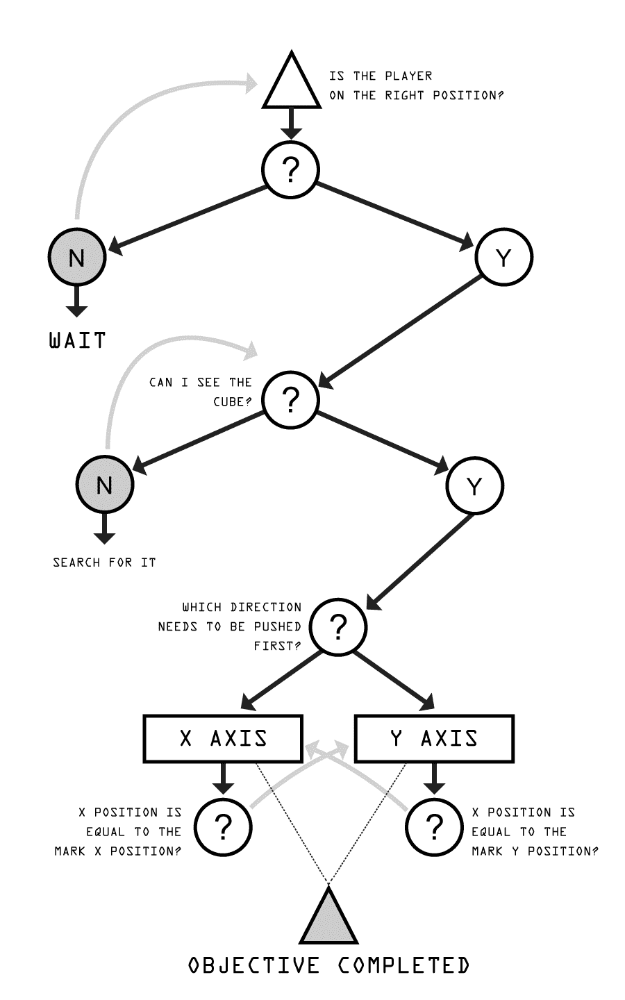

我们已经将基本信息添加到了我们的角色中。`fenceHP`将是一个静态变量，其中每个由角色触发的围栏都会提供它们当前 HP 的信息。然后 AI 角色分析收集到的信息，并将其与表示为`lowerFenceHP`的最低 HP 围栏进行比较。角色有一个`timeWasted`变量，表示他已经花费在寻找一个好的围栏来攻击上的秒数。`fencesAnalyzed`将用来知道代码中是否已经存在围栏，如果没有，它将添加他找到的第一个围栏；如果围栏具有相同的 HP 值，角色将首先攻击它们。现在让我们更新我们的围栏代码，以便它们可以访问角色脚本并输入一些有用的信息。

```py
 public float HP;
 public float distanceValue;
 private Transform characterPosition;
 private GameObject characterMesh;

 private float proximityValueX;
 private float proximityValueY;
 private float nearValue;
 void Start () {

         HP = 100f;
         distanceValue = 1.5f;

         // Find the Character Mesh
         characterMesh = GameObject.Find("AICharacter");
 }

 void Update () {

         // Obtain the Character Mesh Position
         characterPosition = characterMesh.transform;

         //Calculate the distance between this object and the AI Character
         proximityValueX = characterPosition.transform.position.x - this.transform.position.x;
         proximityValueY = characterPosition.transform.position.y - this.transform.position.y;

         nearValue = proximityValueX + proximityValueY;

         if(nearValue <= distanceValue){
             if(AICharacter.fencesAnalyzed == 0){
                 AICharacter.fencesAnalyzed = 1;
                 AICharacter.bestFence = this.gameObject;
             }

             AICharacter.fenceHP = HP;

             if(HP < AICharacter.lowerFenceHP){
                 AICharacter.bestFence = this.gameObject;
             }
         }
 } 
```

我们最终完成了这个例子，其中围栏将它们当前的 HP 与角色拥有的数据（`lowerFenceHP`）进行比较，如果它们的 HP 低于角色拥有的最低值，那么这个围栏将被认为是`bestFence`。

这个例子展示了如何使 AI 角色适应游戏中的不同动态对象；同样的原则可以扩展并用于与几乎任何对象交互。同时，使用对象与角色交互也是相关且有用的，这有助于在两者之间建立信息联系。

# 按区域分解环境

当我们创建地图时，通常会有两个或更多不同的区域可以用来改变游戏玩法，这些区域可能包含水域、流沙、飞行区域、洞穴等等。如果我们希望创建一个可以在游戏任何级别和任何地方使用的 AI 角色，我们需要考虑这一点并使 AI 意识到地图的不同区域。通常这意味着我们需要将更多信息输入到角色的行为中，包括如何根据他当前所在的位置做出反应，或者他可以选择去往何处的情境。

他应该避免某些区域吗？他应该更喜欢其他区域吗？这类信息是相关的，因为它使角色意识到周围环境，选择或适应并考虑他的位置。如果没有正确规划，可能会导致一些不自然的决策；例如，在 Bethesda Softworks 工作室开发的《上古卷轴 V：天际》游戏中，我们可以看到一些游戏 AI 角色在不知道如何在地图的某些部分（尤其是山脉或河流）行为时，会简单地转身返回。

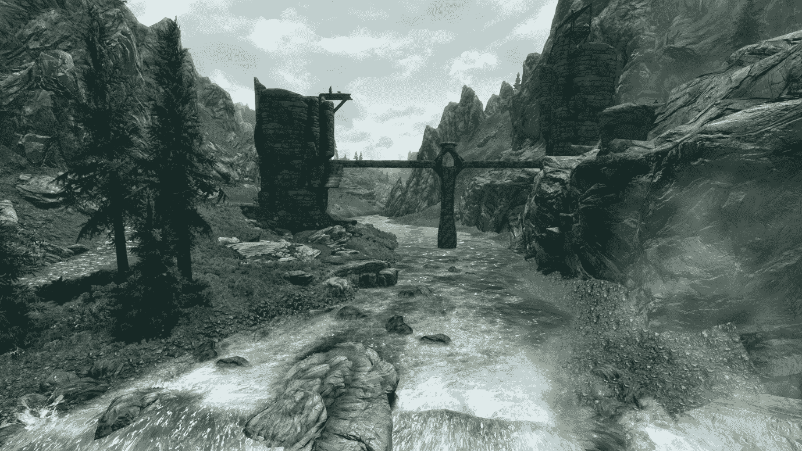

根据角色发现的区域，他可能会有不同的反应或更新他的行为树以适应环境。我们之前创建了一个士兵，他会根据健康状况、瞄准成功率和玩家健康状况改变他的反应方式，现在我们正在探索环境，以便角色可以利用它来更好地定义应该做什么。我们也可以用这个来更新我们之前的例子，即现实生活模拟。如果 Sofie 角色进入房子的一个特定区域，她可以利用这些信息来更新她的优先级，并补充与该部分房屋相关的一切必需品。比如说，她如果在厨房，一旦她准备好了早餐，她就会趁机把垃圾拿出来。正如我们所见，围绕我们的角色的环境可以重新定义他们的优先级或完全改变他们的行为。

这与让-雅克·卢梭关于人性的说法有些相似：“*我们天生善良，但被社会腐蚀。*”作为人类，我们是周围环境的代表，因此，人工智能应该遵循同样的原则。

让我们选择一个我们已经创建的之前的角色，并更新他的代码以适应不同的场景。这个例子中我们选择的是士兵，我们希望根据三个不同的区域——海滩、河流和森林——来改变他的行为。因此，我们将创建三个名为`Beach`、`Forest`和`River`的公共静态布尔函数；然后我们定义地图上的区域，这些区域将开启或关闭这些区域。

```py
 public static bool Beach;
 public static bool River;
 public static bool Forest;
```

因为在这个例子中，一次只能有一个选项为真，所以我们将添加一行简单的代码来禁用其他选项，一旦其中一个被激活。

```py
if(Beach == true) 
{
 Forest = false;
 River = false;
 }

 if(Forest == true){
 Beach = false;
  River = false;
 }

 if(River == true){
 Forest = false;
  Beach = false;
 }
```

一旦完成这些，我们就可以开始定义每个区域的不同行为。例如，在海滩区域，角色没有地方可以躲避，所以这个选项需要被移除并更新为一个新的选项。河流区域可以用来穿越到另一边，因此角色可以隐藏在玩家视线之外并从那个位置发起攻击。总结来说，我们可以定义角色更加小心，并利用树木来作为掩护。根据不同的区域，我们可以调整值以更好地适应环境，或者创建新的功能，以便我们可以利用该区域的一些特定特性。

```py
if (Forest == true)
 {// The AI will remain passive until an interaction with the player occurs
 if (Health == 100 && triggerL == false && triggerR == false && triggerM == false)
 {
 statePassive = true;
 stateAggressive = false;
 stateDefensive = false;
 }

 // The AI will shift to the defensive mode if player comes from the right side or if the AI is below 20 HP
 if (Health <= 100 && triggerR == true || Health <= 20)
 {
 statePassive = false;
 stateAggressive = false;
 stateDefensive = true;
 }

 // The AI will shift to the aggressive mode if player comes from the left side or it's on the middle and AI is above 20HP
 if (Health > 20 && triggerL == true || Health > 20 && triggerM == true)
 {
 statePassive = false;
 stateAggressive = true;
 stateDefensive = false;
 }

 walk = speed * Time.deltaTime;
 walk = speedBack * Time.deltaTime;
 } 
```

这个部分将在讨论人工智能规划与决策以及战术和意识时进行深入探讨。

# 高级环境交互

随着视频游戏行业及其相关技术的不断发展，新的游戏玩法理念出现，并且游戏角色与环境之间的互动变得更有趣，尤其是在使用物理引擎时。这意味着环境的结果可能是完全随机的，这就要求 AI 角色能够不断适应不同的情况。在这方面值得特别一提的是由 Team17 开发的视频游戏*Worms*，在该游戏中，地图可以被完全摧毁，游戏中的 AI 角色能够适应并保持明智的决策。

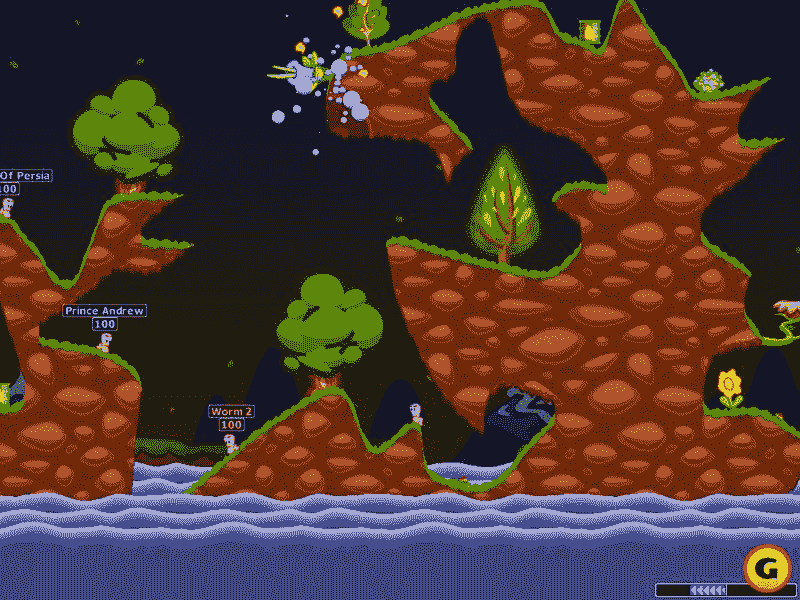

本游戏的目的是通过杀死所有对手的虫子来摧毁对手团队，最后存活下来的玩家获胜。从游戏开始，角色可以在地图上找到一些额外的生命值或弹药，并且时不时地从天空掉落更多的点数。因此，角色的两个主要目标就是生存和杀敌。为了生存，他需要保持足够的生命值并远离敌人，另一部分则是选择最佳的射击目标并尽可能多地从他那里获取生命值。同时，地图被炸弹和角色使用的所有火力摧毁，这对人工智能来说是一个挑战。

# 适应不稳定地形

让我们分解这个例子，并创建一个可以用于这个游戏的角色。我们首先从查看地图开始。底部是水，它会自动杀死虫子。然后，我们有地形，虫子可以在上面行走或根据需要摧毁。最后，是地形的缺失，具体来说，是空旷的空间，无法在上面行走。然后是角色（虫子），它们在游戏开始时被放置在随机的位置，并且可以行走、跳跃和射击。

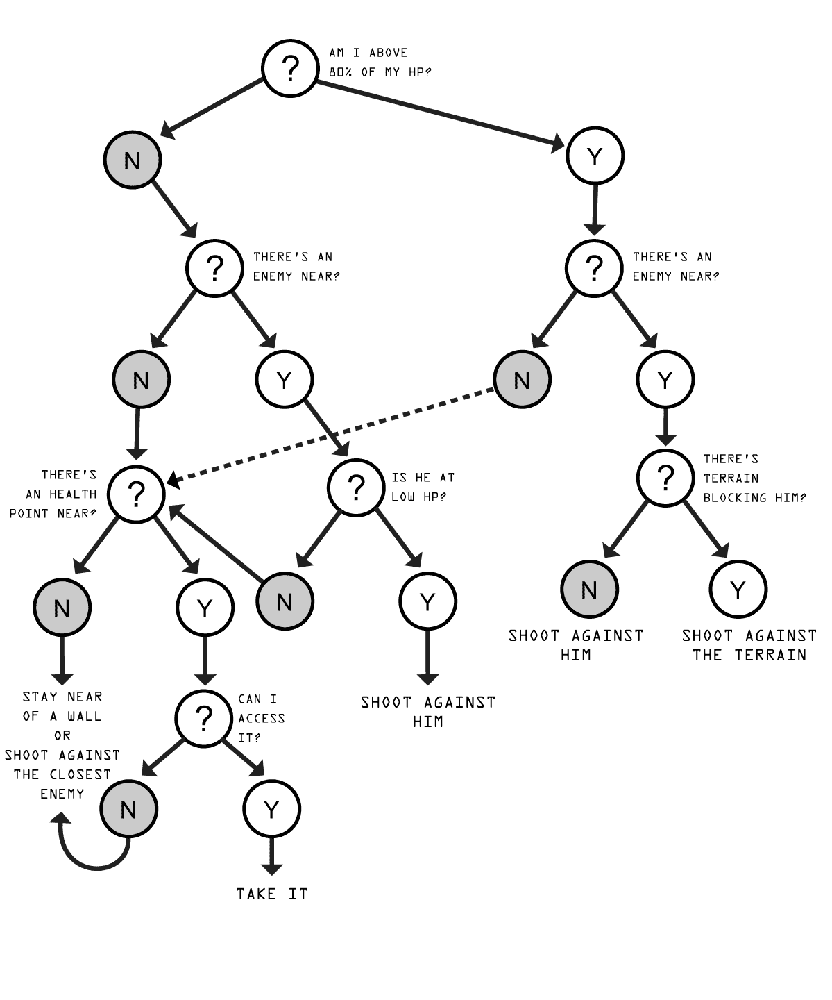

游戏角色的特性应该能够不断适应地形的不稳定性，因此我们需要利用这一点并将其作为行为树的一部分。如图上所示，角色需要了解他当前所在的位置，以及对手的位置、健康状况和物品。

由于地形可能会阻挡他们，AI 角色有可能处于无法攻击或获取物品的情况。因此，我们为他提供了在这些情况下以及他可能遇到的其他情况下的行动选项，但最重要的是定义如果他无法成功完成任何一项行动会发生什么。因为地形可以形成不同的形状，在游戏过程中，有时几乎不可能做任何事情，这就是为什么我们需要提供在这些情况下可以采取的行动选项。


例如，在这种情况下，虫子没有足够的空间移动，没有可以捡起的东西，或者没有可以正确攻击的敌人，他应该怎么办？有必要让周围的信息对我们角色可用，以便他可以对那种情况做出良好的判断。在这种情况下，我们定义了我们的角色无论如何都要射击，对抗最近的敌人，或者靠近墙壁。因为他离最近的敌人攻击可能发生的爆炸太近，所以他应该决定待在角落里，直到下一回合。

# 使用射线投射评估决策

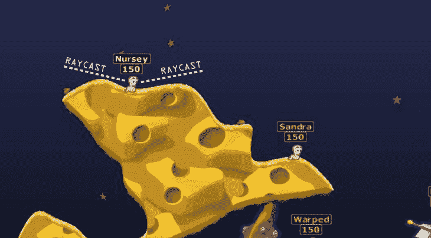

理想情况下，在回合开始时，角色有两个射线投射，一个用于他的左侧，另一个用于右侧。这将检查是否有墙壁阻挡了其中一个方向。这可以用来确定如果角色想要保护自己免受攻击，他应该朝哪个方向移动。然后，我们会使用另一个射线投射在瞄准方向，以查看当角色准备射击时是否有东西阻挡了道路。如果中间有东西，角色应该计算两者之间的距离，以确定是否仍然安全射击。

因此，每个角色都应该有一个共享的列表，列出游戏中当前所有的虫子；这样他们可以比较它们之间的距离，并选择哪个最近并射击它们。此外，我们添加了两个射线投射来检查是否有东西阻挡了两侧，并且我们有了基本的信息来使角色适应地形的持续修改。

```py
 public int HP;
 public int Ammunition;

 public static List<GameObject> wormList = new List<GameObject>(); 
 //creates a list with all the worms
 public static int wormCount; //Amount of worms in the game
 public int ID; //It's used to differentiate the worms

 private float proximityValueX;
 private float proximityValueY;
 private float nearValue;
 public float distanceValue; //how far the enemy should be

 private bool canAttack;

 void Awake ()
 {
         wormList.Add(gameObject); //add this worm to the list
         wormCount++; //adds plus 1 to the amount of worms in the game
 }

 void Start ()
 {
         HP = 100;
         distanceValue = 30f;
 }

void Update ()
 {
         proximityValueX = wormList[1].transform.position.x - this.transform.position.x;
         proximityValueY = wormList[1].transform.position.y - this.transform.position.y;
         nearValue = proximityValueX + proximityValueY;

         if(nearValue <= distanceValue)
         {
             canAttack = true;
         }

         else
         {
             canAttack = false;
         }

         Vector3 raycastRight = transform.TransformDirection(Vector3.forward);

         if (Physics.Raycast(transform.position, raycastRight, 10)) 
             print("There is something blocking the Right side!");

         Vector3 raycastLEft = transform.TransformDirection(Vector3.forward);

         if (Physics.Raycast(transform.position, raycastRight, -10)) 
             print("There is something blocking the Left side!");
 } 
```

# 摘要

在本章中，我们探讨了与环境交互的不同方式。本章中展示的技术可以扩展到广泛的游戏类型，并用于实现 AI 角色与环境之间从基本到高级的交互。现在我们了解了如何创建 AI 角色可以使用的交互式和动态对象，这将使每次游戏都成为全新的体验。此外，我们还简要地触及了一些将在下一章深入探讨的相关主题，例如与其他游戏 AI 角色的交互和决策制定。

在我们下一章中，我们将讨论动画行为。动画构成了玩家对我们创建的人工智能角色视觉感知的一部分，并且使用它来展示我们的 AI 行为多么逼真是非常重要的。我们将讨论动画图、游戏和动画、动画行为和动画架构。
