# 第六章：导航行为和路径查找

在本章中，我们将详细解释人工智能角色如何移动以及如何理解他可以去哪里以及不能去哪里。对于不同类型的游戏，有不同解决方案，我们将在本章中讨论这些解决方案，探讨可以用来开发在地图上正确移动的角色的一些常用方法。此外，我们希望我们的角色能够计算出到达特定目的地的最佳轨迹，在移动过程中避开障碍物并完成目标。我们将介绍如何创建简单的导航行为，然后我们将继续探讨点到点移动，最后深入探讨如何创建更复杂的点到点移动（RTS/RPG 系统）。

# 导航行为

当我们谈论导航行为时，我们指的是角色面对需要计算去哪里或做什么的情况时的行动。地图上可能有多个点，在这些点上必须跳跃或爬楼梯才能到达最终目的地。角色应该知道如何使用这些动作来保持正确的移动；否则，他可能会掉进洞里或者继续走进他应该爬楼梯的墙。为了避免这种情况，我们需要在角色移动时规划所有可能的选择，确保他可以跳跃或执行任何其他必要的动作以保持正确的方向移动。

# 选择新的方向

AI 角色应该具备的一个重要方面是在面对阻挡他前进且无法穿过的物体时选择新的方向。角色应该意识到他面前有哪些物体，如果他无法继续在那个方向前进，他应该能够选择一个新的方向，避免与物体碰撞并继续远离它。

# 避免撞墙

如果我们的角色面对一堵墙，他需要知道他不能穿过那堵墙，应该选择另一个选项。除非我们允许角色爬墙或摧毁它，否则角色需要面对一个新的方向，这个方向没有被阻挡，然后在这个新的未阻挡方向上行走。

我们将从一个简单的方法开始，这种方法通常非常有用，也许是我们创建游戏时最好的选择。在我们将要演示的例子中，所讨论的角色需要像*吃豆人*敌人一样在关卡中不断移动。从一个基本示例开始，我们赋予我们的角色选择移动方向的权利，稍后我们将向角色的 AI 添加更多信息，使他能够使用这种方法在地图上追求特定的目标。

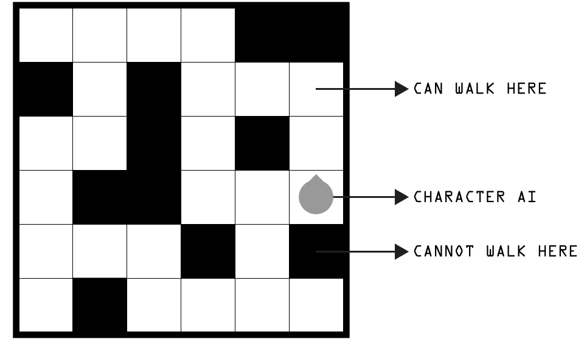

我们创建了一个网格，并将不允许角色 AI 行走的方块涂成黑色。现在我们将编写代码让角色向前移动，直到他发现前方有一个黑色方块；然后，他需要随机选择向左或向右转向，做出这个决定。这将允许我们的角色在地图上自由移动，没有任何特定的模式。相应的代码如下：

```py
     public float Speed;
     public float facingLeft;
     public float facingRight;
     public float facingBack;
     public static bool availableLeft;
     public static bool availableRight;

     public bool aLeft;
     public bool aRight;

     void Start ()
     {

     }

     void Update ()
     {

         aLeft = availableLeft;
         aRight = availableRight;

         transform.Translate(Vector2.up * Time.deltaTime * Speed);

         if(facingLeft > 270)
         {
             facingLeft = 0;
         }

         if(facingRight < -270)
         {
             facingRight = 0;
         }

     }

     void OnTriggerEnter2D(Collider2D other)
     {

         if(other.gameObject.tag == "BlackCube")
         {
             if(availableLeft == true && availableRight == false)
             {
                 turnLeft();
             }

             if(availableRight == true && availableLeft == false)
             {
                 turnRight();
             }

             if(availableRight == true && availableLeft == true)
             {
                 turnRight();
             }

             if(availableRight == false && availableLeft == false)
             {
                 turnBack();
             }
         }
     }

     void turnLeft ()
     {
         facingLeft = transform.rotation.eulerAngles.z + 90;
         transform.localRotation = Quaternion.Euler(0, 0, facingLeft);
     }

     void turnRight ()
     {
         facingRight = transform.rotation.eulerAngles.z - 90;
         transform.localRotation = Quaternion.Euler(0, 0, facingRight);
     }

     void turnBack ()
     {
         facingBack = transform.rotation.eulerAngles.z + 180;
         transform.localRotation = Quaternion.Euler(0, 0, facingBack);
     } 
```

在这个例子中，我们向黑色方块添加了碰撞器，让角色知道当他接触它们时。这样，他将一直移动，直到与一个黑色方块碰撞，此时将有三种选择：向左转，向右转，或返回。为了知道哪些方向是畅通的，我们创建了两个独立的碰撞器，并将它们添加到我们的角色上。每个碰撞器都有一个脚本，为角色提供信息，让他知道哪一侧是畅通的或不是。

`availableLeft`布尔值对应左侧，而`availableRight`对应右侧。如果左侧或右侧的碰撞器接触到黑色方块，则值设置为`false`。否则，它设置为`true`。我们使用`aLeft`和`aRight`只是简单地实时检查这些值是否工作正确。这样，我们可以看到是否存在任何问题：

```py
   public bool leftSide; 
   public bool rightSide; 

   void Start () 
   { 

        if(leftSide == true)
        { 
            rightSide = false; 
        } 

        if(rightSide == true)
        { 
            leftSide = false; 
        } 
   } 

   void Update () { 

   } 

    void OnTriggerStay2D(Collider2D other) 
    { 

        if(other.gameObject.tag == "BlackCube") 
        { 
            if(leftSide == true && rightSide == false) 
            { 
                Character.availableLeft = false; 
            } 

            if(rightSide == true && leftSide == false) 
            { 
                Character.availableRight = false; 
            } 
        } 
    } 

    void OnTriggerExit2D(Collider2D other) 
    { 

        if(other.gameObject.tag == "BlackCube") 
        { 
            if(leftSide == true) 
            { 
                Character.availableLeft = true; 
            } 

            if(rightSide == true) 
            { 
                Character.availableRight = true; 
            } 
        } 
} 

```

当我们开始游戏时，我们可以看到角色 AI 开始在白色方块上移动，并且每次面对黑色方块时都会向左或向右转向：

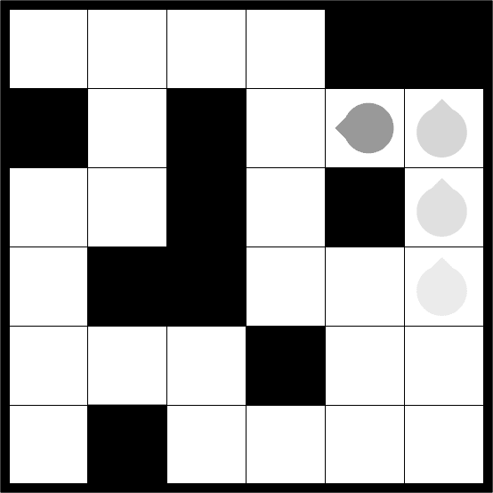

但如果我们让游戏运行几分钟，我们会意识到角色一直在做出相同的决定，因此他只会在这个地图的小部分区域里走来走去。这是因为他在与黑色方块碰撞时才会做出决定，而忽略了其他转向的机会：

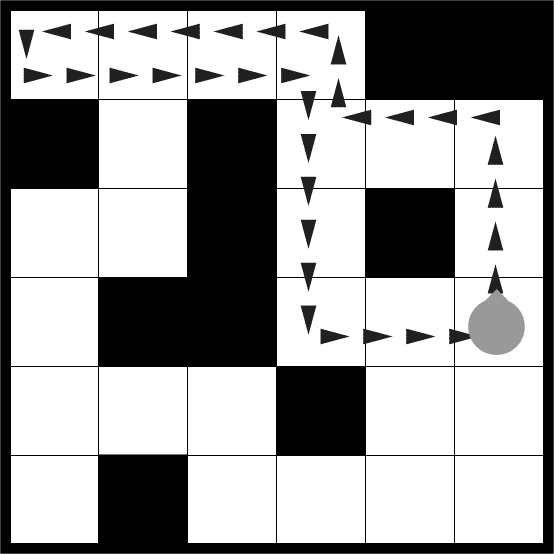

如前图所示，角色总是遵循相同的模式，如果我们希望他不断选择不同的路径，这并不是一个理想的情况。

# 选择替代路径

我们的字符每次接近墙壁时都会成功选择一个新的方向，现在我们希望他能够在整个地图上移动。为了实现这一点，我们将向角色添加更多信息，让他知道如果有一个可用的转向左或右的机会，即使前方路径是畅通的，角色也可以自由转向。我们可以使用概率来确定角色是否会转向，在这个例子中，我们选择如果有机会，有 90%的几率选择一个新的方向。这样，我们可以非常快速地看到结果：

```py
   public float Speed;
   public float facingLeft;
   public float facingRight;
   public float facingBack;
   public static bool availableLeft;
   public static bool availableRight;

   public static int probabilityTurnLeft;
   public static int probabilityTurnRight;public int probabilitySides;

   public bool forwardBlocked;

   public bool aLeft;
   public bool aRight;
```

在添加了变量之后，我们可以继续到`Start`方法，这是游戏第一帧上将被调用的所有内容。

```py
   void Start ()
   {
       availableLeft = false;
       availableRight = false;
       probabilityTurnLeft = 0;
       probabilityTurnRight = 0;
   }
```

然后我们可以继续到`Update`方法，这是游戏每一帧上将被调用的所有内容。

```py
   void Update ()
   {
       aLeft = availableLeft;
       aRight = availableRight;

       transform.Translate(Vector2.up * Time.deltaTime * Speed);

       if(facingLeft > 270)
       {
           facingLeft = 0;
       }

       if(facingRight < -270)
       {
           facingRight = 0;
       }

       if (forwardBlocked == false)
       {
           if (availableLeft == true && availableRight == false)
           {
              if (probabilityTurnLeft > 10)
              {
                   turnLeft();
              }
           }

           if (availableLeft == false && availableRight == true)
           {
              if (probabilityTurnRight > 10)
              {
                  turnRight();
              }
           }

           if (availableLeft == true && availableRight == true)
           {
              probabilityTurnLeft = 0;
              probabilityTurnRight = 0;
           }
       }

   }
```

在这里，我们添加了触发函数，当他在进入/碰撞到 2D 对象时会发生什么：

```py
   void OnTriggerEnter2D(Collider2D other)
   {

       if(other.gameObject.tag == "BlackCube")
       {
           forwardBlocked = true;

           if(availableLeft == true && availableRight == false)
           {
                turnLeft();
           }

           if(availableRight == true && availableLeft == false)
           {
               turnRight();
           }

           if(availableRight == true && availableLeft == true)
           {
               probabilitySides = Random.Range(0, 1);
               if(probabilitySides == 0)
               {
                   turnLeft();
               }

               if(probabilitySides == 1)
               {
                   turnRight();
               }

           }

           if(availableRight == false && availableLeft == false)
           {
               turnBack();
           }
       }
   }

   void OnTriggerExit2D(Collider2D other)
   {
       forwardBlocked = false;
   }

   void  turnLeft ()
   {
       probabilityTurnLeft = 0;
       facingLeft = transform.rotation.eulerAngles.z + 90;
       transform.localRotation = Quaternion.Euler(0, 0, facingLeft);
   }

   void turnRight ()
   {
       probabilityTurnRight = 0;
       facingRight = transform.rotation.eulerAngles.z - 90;
       transform.localRotation = Quaternion.Euler(0, 0, facingRight);
   }

   void turnBack ()
   {
       facingBack = transform.rotation.eulerAngles.z + 180;
       transform.localRotation = Quaternion.Euler(0, 0, facingBack);
   } 
```

我们已经为我们角色的 AI 脚本添加了四个新变量，即`probabilityTurnLeft`静态变量，它计算角色向左转的概率；`probabilityTurnRight`，它计算角色向右转的概率；一个新的概率生成器`probabilitySides`，当两者都可用且前方路径被阻塞时，将决定转向哪个方向；最后，一个布尔值`forwardBlocked`，用于检查前方路径是否被阻塞。角色需要检查前方路径是否被阻塞，以知道他是否可以转向。这将防止角色在面对黑色方块时多次转向。

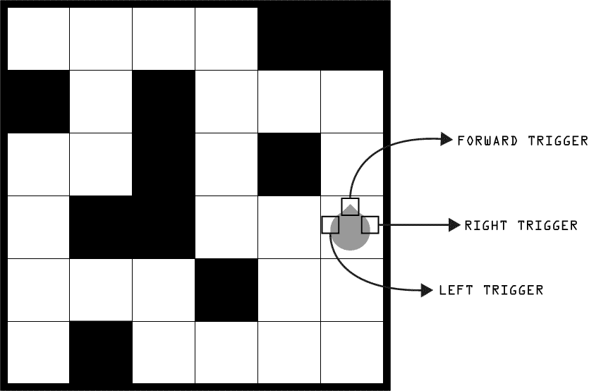

在控制侧面触发的脚本中，我们添加了一个名为`probabilityTurn`的新变量，它给角色提供关于概率的信息。每次触发器退出碰撞体时，它会计算概率并向角色发送消息，告诉它侧面是空的，他可以决定转向那个侧面：

```py
   public bool leftSide;
   public bool rightSide;
   public int probabilityTurn;

   void Start () 
   {
       if(leftSide == true)
      {
          rightSide = false;
       }

       if(rightSide == true)
       {
          leftSide = false;
       }
    }

    void Update () 
    {

    }

    void OnTriggerEnter2D(Collider2D other)
    {
       if(other.gameObject.tag == "BlackCube")
       {
           if(leftSide == true && rightSide == false)
           {
               Character.availableLeft = false;
               probabilityTurn = 0;
               Character.probabilityTurnLeft = probabilityTurn;
           }

           if(rightSide == true && leftSide == false)
           {
               Character.availableRight = false;
               probabilityTurn = 0;
               Character.probabilityTurnRight = probabilityTurn;
           }
        }
     }

     void OnTriggerStay2D(Collider2D other)
     {

           if(other.gameObject.tag == "BlackCube")
           {
               if(leftSide == true && rightSide == false)
               {
                   Character.availableLeft = false;
                   probabilityTurn = 0;
                   Character.probabilityTurnLeft = probabilityTurn;
               }

               if(rightSide == true && leftSide == false)
               {
                   Character.availableRight = false;
                   probabilityTurn = 0;
                   Character.probabilityTurnRight = probabilityTurn;
               }
           }
       }

       void OnTriggerExit2D(Collider2D other)
       {

           if(other.gameObject.tag == "BlackCube")
           {
               if(leftSide == true)
               {
                   probabilityTurn = Random.Range(0, 100);
                   Character.probabilityTurnLeft = probabilityTurn;
                   Character.availableLeft = true;
               }

               if(rightSide == true)
               {
                   probabilityTurn = Random.Range(0, 100);
                   Character.probabilityTurnRight = probabilityTurn;
                   Character.availableRight = true;
               }
           }
        } 
```

如果我们玩这个游戏，我们可以看到对角色实施的新变化。现在他不可预测，每次选择不同的路径，在地图上四处移动，与我们之前的情况相反。一旦完成，我们可以创建尽可能多的地图，因为角色总是会找到正确的路径并避开墙壁。

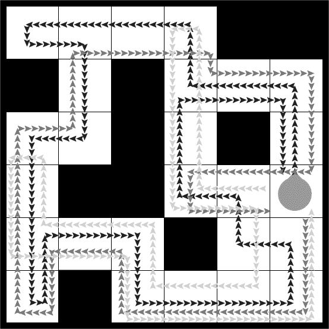

在更大的地图上进行测试，角色以相同的方式反应，在整个地图上移动。这意味着我们的主要目标已经完成，现在我们可以轻松地创建新的地图，并使用角色作为游戏的主要敌人，这样他总是会以不同的方式移动，不会遵循任何模式。

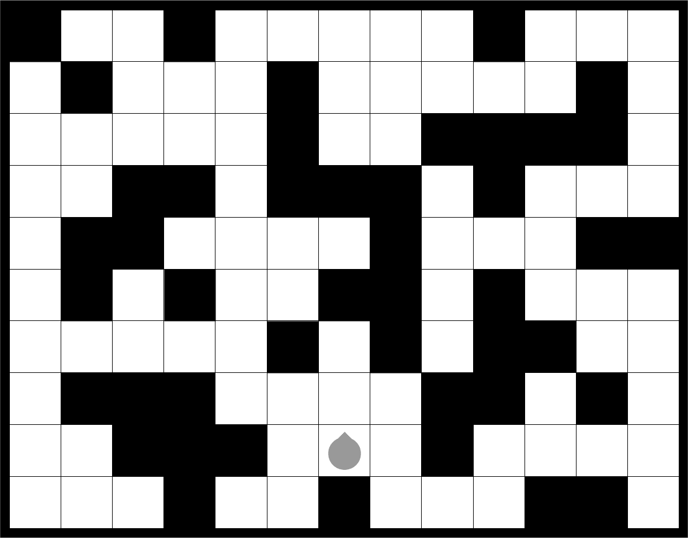

我们可以根据我们希望角色如何反应来调整百分比值，并且还可以实现更多变量，使其符合我们的游戏理念。

# 点对点移动

现在我们已经了解了如何在迷宫类游戏中创建一个可以自由移动的角色的基础，我们将看看相反的情况：如何从一点到另一点创建移动模式。这也是人工智能移动的一个重要方面，因为稍后我们可以结合这两种技术来创建一个从一个点到另一个点的角色，避开墙壁和障碍物。

# 塔防游戏类型

再次强调，我们将用于使我们的角色从一个点到另一个点移动的原则可以应用于 2D 和 3D 游戏。在这个例子中，我们将探讨如何创建塔防游戏的主要特征：敌人模式。目标是让敌人从起始点生成并沿着路径移动，以便它们可以到达终点。塔防游戏中的敌人通常只考虑这一点，因此它是测试如何创建点对点移动的完美例子。

一款 *塔防* 游戏通常由两个区域组成：敌人从起始位置走到最终位置的区域，以及玩家被允许建造攻击敌人的塔的区域，试图阻止他们到达最终位置。因为玩家不允许在敌人将通过的路径内部建造任何东西，所以 AI 不需要意识到其周围环境，因为它将始终可以自由通过，因此我们只需要关注角色的点对点移动。

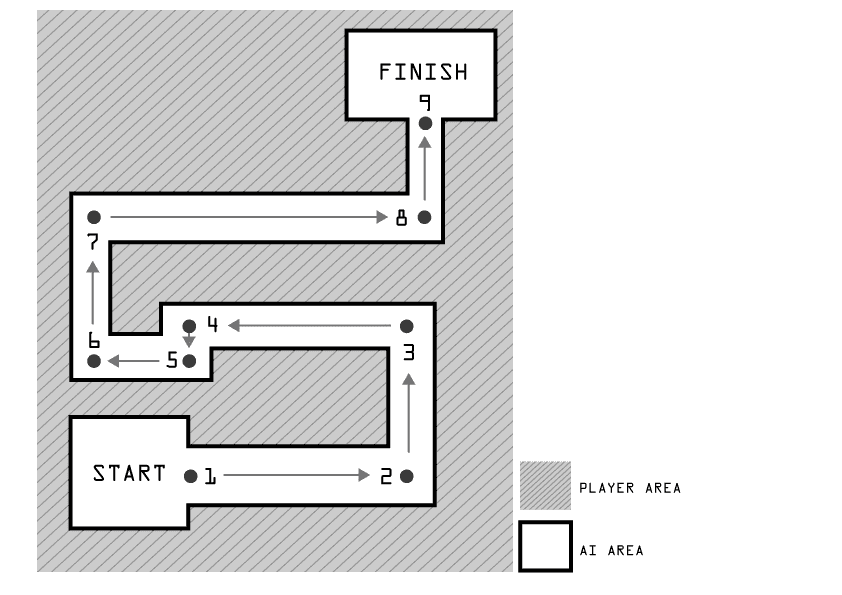

在导入我们将用于游戏的地图和角色之后，我们需要配置角色将使用的**航点**，以便它们知道它们需要去哪里。我们可以通过手动将坐标添加到我们的代码中来实现这一点，但为了简化过程，我们将创建场景中的对象作为航点，并删除 3D 网格，因为它将不再必要。

现在我们将所有创建的航点分组并命名为航点组。一旦我们将航点放置并分组，我们就可以开始创建代码，告诉我们的角色它需要跟随多少个航点。这段代码非常有用，因为我们可以使用我们需要的任意数量的航点创建不同的地图，而无需更新角色的代码：

```py
   public static Transform[] points;

   void Awake () 
   {
        points = new Transform[transform.childCount];
        for (int i = 0; i < points.Length; i++)
        {
             points[i] = transform.GetChild(i); 
         }
   }
```

这段代码将被分配到我们创建的组中，并计算它内部有多少个航点，并对它们进行排序。

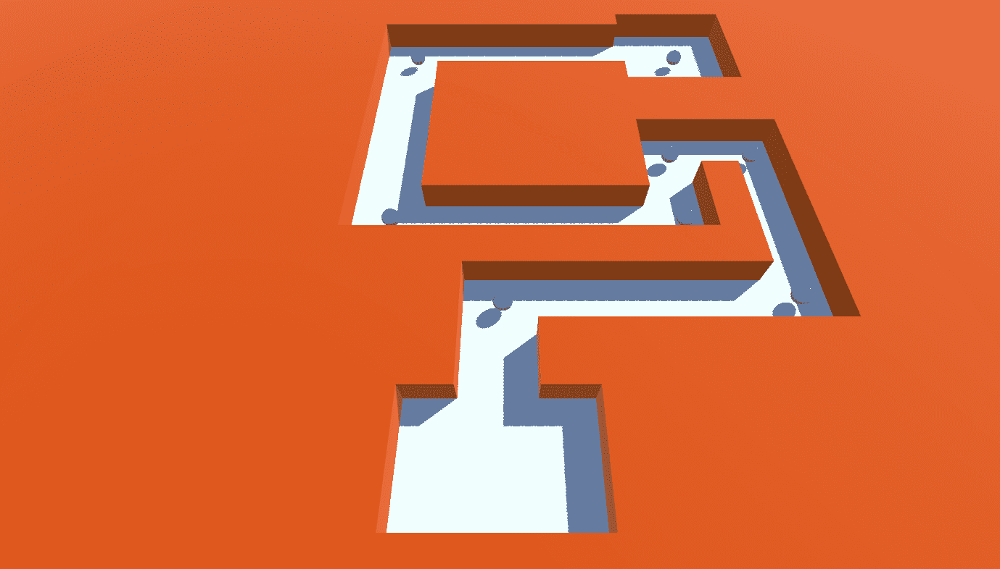

我们在前面的图像中可以看到的蓝色球体代表我们用作航点的 3D 网格。在这个例子中，角色将跟随八个点，直到完成路径。现在让我们继续到 AI 角色代码，看看我们如何使用我们创建的点使角色从一个点到另一个点移动。

我们首先创建角色的基本功能，即健康和速度。然后我们可以创建一个新的变量，告诉角色他需要移动到的下一个位置，以及另一个变量，将用于显示它需要跟随哪个航点：

```py
 public float speed;
 public int health;

 private Transform target;
 private int wavepointIndex = 0; 
```

现在我们有了制作敌人角色从点到点移动直到死亡或到达终点所需的基本变量。让我们看看如何使用这些变量使其可玩：

```py
 public float speed;
 public int health;

 private Transform target;
 private int wavepointIndex = 0;

 void Start ()
 {
      target = waypoints.points[0];  speed = 10f;
 }

 void Update ()
 {
      Vector3 dir = target.position - transform.position;
      transform.Translate(dir.normalized * speed * Time.deltaTime, 
         Space.World);

      if(Vector3.Distance(transform.position, target.position) <= 0.4f)
      {
          GetNextWaypoint();
      }
 }

 void GetNextWaypoint()
 {
      if(wavepointIndex >= waypoints.points.Length - 1)
      {
          Destroy(gameObject);
          return;
      }

      wavepointIndex++;
      target = waypoints.points[wavepointIndex];
 } 
```

在`Start`函数中，角色需要跟随的第一个航点是航点编号零，即我们在`waypoints`代码中创建的 Transform 列表中的第一个。此外，我们还确定了角色的速度，在这个例子中我们选择了`10f`。

然后在`Update`函数中，角色将计算下一个位置和当前位置之间的距离，使用 Vector 3 `dir`。角色将不断移动，因此我们创建了一行代码作为角色的移动，即`transform.Translate`。知道距离和速度信息后，角色将知道它距离下一个位置有多远，一旦他到达从该点期望的距离，他就可以继续移动到下一个点。为了实现这一点，我们创建了一个`if`语句，告诉角色，如果他距离他正在移动到的点的距离达到 0.4f（在这个例子中），这意味着他已经到达了那个目的地，可以开始移动到下一个点，调用`GetNextWaypoint()`。

在`GetNextWaypoint()`函数中，角色将尝试确认他是否已经到达了最终目的地。如果角色已经到达了最终航点，那么对象可以被销毁；如果没有，它可以继续到下一个航点。在这里，`waypointIndex++`会在角色到达一个航点时每次将一个数字加到索引上，从 0>1>2>3>4>5，依此类推。

现在我们将代码分配给我们的角色，并将角色放置在起始位置，测试游戏以查看它是否正常工作：

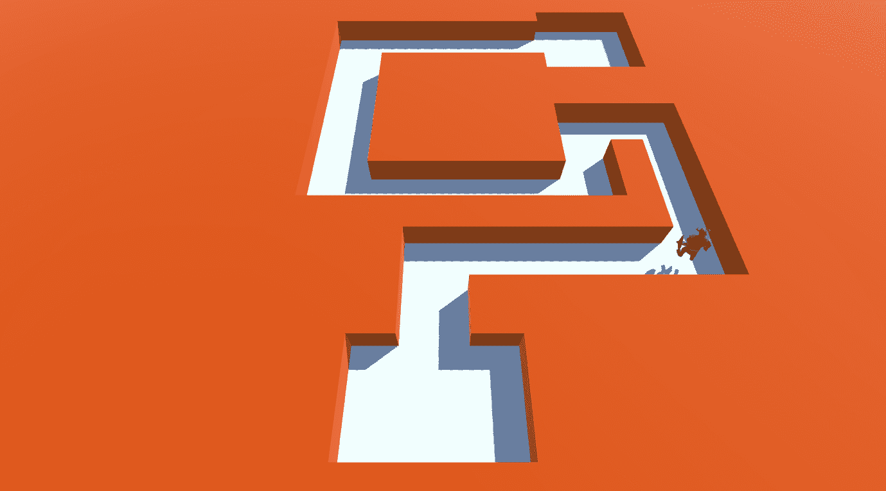

一切都按预期工作：角色将从一点移动到另一点，直到他到达最后一个点，然后他从游戏中消失。然而，我们仍然需要做一些改进，因为角色总是朝同一个方向；他在改变方向时不会旋转。让我们趁机也创建实例化代码，以便将敌人持续生成到地图中。

与我们创建对象来定义航点的方式相同，我们也将为起始位置做同样的事情，创建一个将仅作为位置的对象，这样我们就可以从那个点生成敌人。为了实现这一点，我们创建了一行简单的代码，仅用于测试游戏玩法，而不需要手动将角色添加到游戏中：

```py
 public Transform enemyPrefab;
 public float timeBetweenWaves = 3f;
 public Transform spawnPoint;

 private float countdown = 1f;
 private int waveNumber = 1;

 void Update ()
 {
      if(countdown <= 0f)
      {
          StartCoroutine(SpawnWave());
          countdown = timeBetweenWaves;
      }

      countdown -= Time.deltaTime;
 }

 IEnumerator SpawnWave ()
 {
      waveNumber++;

      for (int i = 0; i < waveNumber; i++)
      {
          SpawnEnemy();
          yield return new WaitForSeconds(0.7f);
      }
 }

 void SpawnEnemy()
 {
      Instantiate(enemyPrefab, spawnPoint.position, 
            spawnPoint.rotation);
 }
```

在此刻，我们已经有了一个正在工作的`wave spawner`，每三秒生成一波新的敌人。这将帮助我们可视化我们为我们的 AI 角色创建的游戏玩法。我们有五个变量。`enemyPrefab`是我们正在创建的角色，因此代码可以生成它。`timeBetweenWaves`表示生成新波前等待的时间。`spawnPoint`变量决定了角色将出现的位置，即起始位置。在这里，`countdown`是我们等待第一波出现的时间。`waveNumber`是最后一个变量，用于计算当前波次（通常，这用于区分一波和另一波敌人的难度）。

如果我们现在运行游戏，我们可以看到游戏中出现的角色数量远不止一个，每三秒增加。在我们开发 AI 角色时同时做这件事非常有用，因为如果我们的角色有特殊能力或速度不同，我们可以在开发它们时立即修复。因为我们只是在创建一个小的示例，所以期望它能平稳运行，没有任何错误。

让我们现在测试一下看看会发生什么：

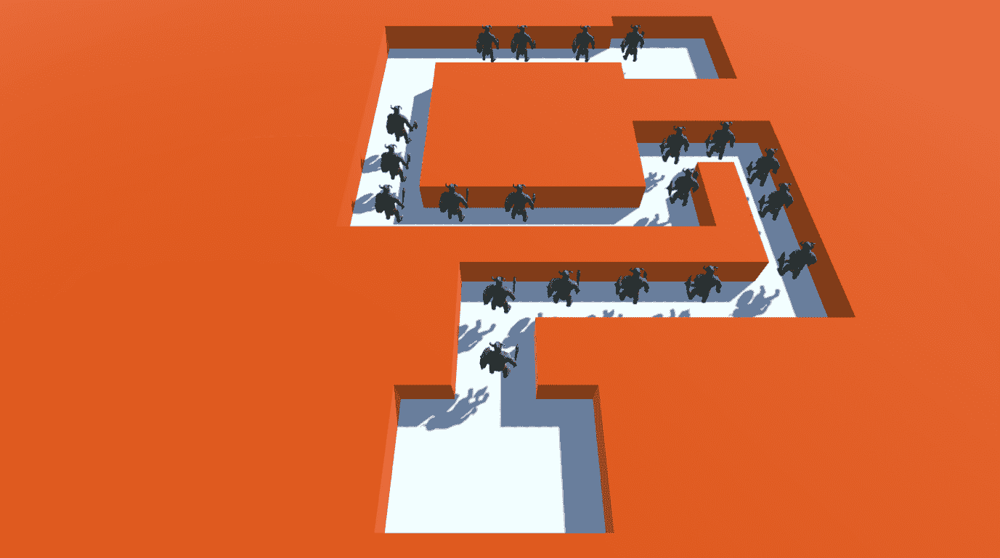

现在看起来更有趣了！我们可以看到点对点移动按预期工作，所有被生成到游戏中的角色都知道他们需要去哪里，并沿着正确的路径前进。

我们现在可以更新角色代码，使其在转弯时能够转向下一个点位置。为了创建这个，我们在敌人代码中添加了几行：

```py
 public float speed;
 public int health;
 public float speedTurn;

 private Transform target;
 private int wavepointIndex = 0;

 void Start ()
 {
      target = waypoints.points[0];
      speed = 10f;
      speedTurn = 0.2f;
 }

 void Update ()
 {
      Vector3 dir = target.position - transform.position;
      transform.Translate(dir.normalized * speed * Time.deltaTime, 
            Space.World);

      if(Vector3.Distance(transform.position, target.position) <= 0.4f)
      {
          GetNextWaypoint();
      }

      Vector3 newDir = Vector3.RotateTowards(transform.forward, dir, 
            speedTurn, 0.0F);

      transform.rotation = Quaternion.LookRotation(newDir);
 }

 void GetNextWaypoint()
 {
      if(wavepointIndex >= waypoints.points.Length - 1)
      {
          Destroy(gameObject);
          return;
      }

      wavepointIndex++;
      target = waypoints.points[wavepointIndex];
 } 
```

如前述代码所示，我们添加了一个名为`speedTurn`的新变量，它将代表角色转向时的速度，在`start`函数中，我们确定速度值为`0.2f`。然后，在`update`函数中，我们通过乘以`Time.deltaTime`来计算速度，无论玩家体验到的`FPS`数值是多少，都给出一个恒定的值。然后我们创建了一个新的`Vector3`变量，名为`newDir`，这将使我们的角色转向目标位置。

现在如果我们再次测试游戏，我们可以看到角色会转向他们的下一个点位置：

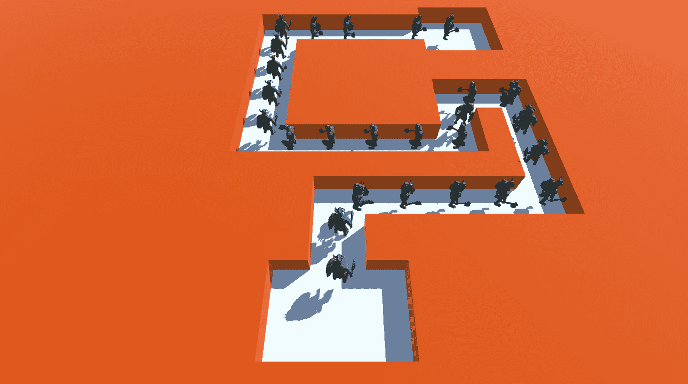

在这一点上，我们可以看到 AI 角色正在正确地反应，从一点移动到另一点，并转向他们的下一个位置。现在我们有了塔防游戏的基础，我们可以添加独特的代码来创建一个新颖且有趣的游戏。

# 赛车游戏类型

点对点移动是一种可以应用于几乎任何游戏类型的方法，并且在多年来被广泛使用。我们的下一个例子是一个赛车游戏，其中人工智能驾驶员使用点对点移动来与玩家竞争。为了创建这个，我们需要一条道路和一个驾驶员，然后我们将航点放置在道路上，并告诉我们的 AI 驾驶员跟随这条路径。这与我们之前所做的是非常相似的，但在我们的角色中会有一些行为上的差异，因为我们不希望它在转弯时看起来僵硬，而且同一张地图上还会有其他驾驶员，他们不能一个压在另一个上面。

不再拖延，让我们开始吧，首先我们需要建立地图，在这个例子中是赛道：

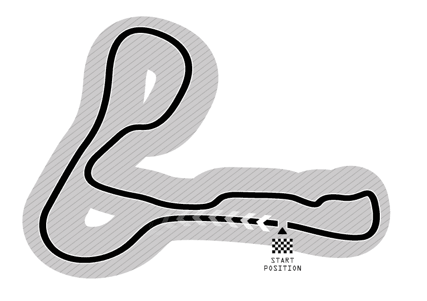

在设计完我们的赛道后，我们需要定义我们的驾驶员需要到达的每个点位置，因为我们有很多曲线，所以我们需要创建比之前更多的点位置，以便汽车能够平滑地跟随道路。

我们与之前一样进行了同样的过程，在游戏中创建对象，并将它们用作仅作为位置参考：


这是我们的地图，已经放置了航点，正如我们所见，曲线上有更多的点。如果我们想要从一个点到另一个点实现平滑过渡，这一点非常重要。

现在，让我们再次将所有航点分组，这次我们将创建不同的代码。我们不会创建一个管理航点的代码，而是将计算实现在我们的人工智能驾驶员代码中，并创建一个简单的代码应用于每个航点，以指定要跟随的下一个位置。

我们有很多方法可以开发我们的代码，根据我们的偏好或我们正在制作的游戏类型，有些方法可能比其他方法更有效。在这种情况下，我们发现我们为塔防角色开发的代码与这种游戏类型不匹配。

从人工智能驾驶员代码开始，我们使用了十个变量，如下面的代码块所示：

```py
 public static bool raceStarted = false;

 public float aiSpeed = 10.0f;
 public float aiTurnSpeed = 2.0f;
 public float resetAISpeed = 0.0f;
 public float resetAITurnSpeed = 0.0f;

 public GameObject waypointController;
 public List<Transform> waypoints;
 public int currentWaypoint = 0;
 public float currentSpeed;
 public Vector3 currentWaypointPosition; 
```

第一个，`raceStarted`，是一个静态布尔值，它将告诉我们的驾驶员比赛是否已经开始。这考虑到了比赛只有在绿灯亮起时才开始的事实；如果不是，`raceStarted`被设置为`false`。接下来，我们有`aiSpeed`，它代表汽车的速度。这是一个用于测试的简化版本；否则，我们需要速度函数来确定汽车根据设定的档位可以多快。`aiTurnSpeed`代表汽车在转弯时的速度，我们希望汽车在面向新方向时如何快速转向。接下来，我们有`waypointController`，它将被链接到航点组；以及`waypoints`列表，它将从该组中获取。

在这里，`currentWaypoint`将告诉我们的驾驶员他目前正在跟随哪个航点编号。`currentSpeed`变量将显示汽车当前的速度。最后，`currentWaypointPosition`是汽车将要跟随的航点的 Vector 3 位置：

```py
 void Start () 
 {
       GetWaypoints();
       resetAISpeed = aiSpeed;
       resetAITurnSpeed = aiTurnSpeed;
 }
```

在我们的`start`函数中，我们只有三行代码：`GetWaypoints()`，它将访问组内存在的所有航点，以及`resetAISpeed`和`resetAITurnSpeed`，它们将重置速度值，因为它们将影响放置在车上的刚体：

```py
  void Update () 
  {
       if(raceStarted)
       {
           MoveTowardWaypoints();    
       }
  }
```

在更新函数中，我们有一个简单的`if`语句，检查比赛是否已经开始。如果比赛已经开始，那么他可以继续到下一步，这对我们的 AI 驾驶员来说是最重要的，即`MoveTowardWaypoints()`。在这个例子中，当汽车等待绿灯时，我们没有做任何声明，但我们可以实现引擎启动和汽车的预加速，例如：

```py
  void GetWaypoints()
  {
    Transform[] potentialWaypoints = waypointController.
        GetComponentsInChildren<Transform>();

    waypoints = new List<Transform>();

    for each(Transform potentialWaypoint in potentialWaypoints)
     {
        if(potentialWaypoint != waypointController.transform)
        {
           waypoints.Add(potentialWaypoint);    
        }
     } 
  } 
```

接下来，我们有`GetWaypoints()`，它在`Start`函数中被实例化。在这里，我们访问`waypointController`组并检索其中存储的所有航点位置信息。因为我们将在不同的代码中按顺序排列航点，所以我们在这里不需要做那件事：

```py
  void MoveTowardWaypoints()
  {
     float currentWaypointX = waypoints[currentWaypoint].position.x;
     float currentWaypointY = transform.position.y;
     float currentWaypointZ = waypoints[currentWaypoint].position.z;

     Vector3 relativeWaypointPosition = transform.
        InverseTransformPoint (new Vector3(currentWaypointX,   
        currentWaypointY, currentWaypointZ));
     currentWaypointPosition = new Vector3(currentWaypointX, 
         currentWaypointY, currentWaypointZ);

     Quaternion toRotation = Quaternion.LookRotation
        (currentWaypointPosition - transform.position);
     transform.rotation = Quaternion.RotateTowards
        (transform.rotation, toRotation, aiTurnSpeed);

     GetComponent<Rigidbody>().AddRelativeForce(0, 0, aiSpeed);

     if(relativeWaypointPosition.sqrMagnitude < 15.0f)
     {
        currentWaypoint++;

        if(currentWaypoint >= waypoints.Count)
        {
           currentWaypoint = 0;    
        }
     }

     currentSpeed = Mathf.Abs(transform.
       InverseTransformDirection
      (GetComponent<Rigidbody>().velocity).z);

     float maxAngularDrag = 2.5f;
     float currentAngularDrag = 1.0f;
     float aDragLerpTime = currentSpeed * 0.1f;

     float maxDrag = 1.0f;
     float currentDrag = 3.5f;
     float dragLerpTime = currentSpeed * 0.1f;

     float myAngularDrag = Mathf.Lerp(currentAngularDrag, 
        maxAngularDrag, aDragLerpTime);
     float myDrag = Mathf.Lerp(currentDrag, maxDrag, dragLerpTime);

     GetComponent<Rigidbody>().angularDrag = myAngularDrag;
     GetComponent<Rigidbody>().drag = myDrag;
   } 
```

最后，我们有`MoveTowardsWaypoints()`函数。因为汽车在移动性方面比简单的 Tower Defense 角色更深入，我们决定扩展并在这个代码部分实现更多内容。

首先，我们检索当前正在使用的航点的 Vector 3 位置。我们选择分别检索这些信息并分配轴，因此我们有`currentWaypointX`用于 X 轴，`currentWaypointY`用于 Y 轴，`currentWaypointZ`用于 Z 轴。

然后我们创建一个新的 Vector 3 方向`relativeWaypointPosition`，它将计算航点和汽车当前位置之间的距离，并将从世界空间转换为局部空间，在这种情况下我们使用了`InverseTransformDirection`。


如前图所示，我们想要计算汽车和航点之间的局部空间距离。这将告诉我们的驾驶员航点是在他的右侧还是左侧。这是推荐的，因为车轮控制汽车速度，并且它们有一个独立的旋转值，如果我们继续开发这个游戏，这将是一个仍然需要开发的功能。

为了平滑从一个航点到另一个航点的旋转，我们使用了以下代码：

```py
   Quaternion toRotation = Quaternion.LookRotation
           (currentWaypointPosition - transform.position);
   transform.rotation = Quaternion.RotateTowards
           (transform.rotation, toRotation, aiTurnSpeed);
```

这是 Tower Defense 中我们使用的一个更新版本。它将使我们的汽车平滑地移动到汽车正在行驶的航点。这给出了汽车转弯的效果；否则，他将会直接向航点右转，这看起来不真实：

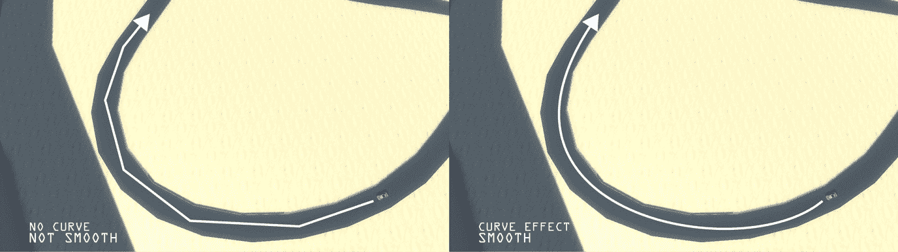

如我们所见，直线并不适合我们目前正在创作的游戏类型。它在其他类型，如塔防游戏中运行得非常完美，但对于赛车游戏来说，我们必须重新定义代码以适应我们正在创造的情况。

其余的代码正是如此，针对我们正在创造的情况进行的调整，即一辆在赛道上行驶的汽车。其中包含如`drag`这样的力元素，这是汽车与道路之间的摩擦力，在代码中得到了体现。当我们转向汽车时，它会根据那一刻汽车的速度滑动，这些细节在这里都被考虑到了，创造出一个更真实的点对点移动，我们可以看到汽车是按照物理规律反应的。

这是我们在示例中使用过的完整代码：

```py
 public static bool raceStarted = false;

 public float aiSpeed = 10.0f;
 public float aiTurnSpeed = 2.0f;
 public float resetAISpeed = 0.0f;
 public float resetAITurnSpeed = 0.0f;

 public GameObject waypointController;
 public List<Transform> waypoints;
 public int currentWaypoint = 0;
 public float currentSpeed;
 public Vector3 currentWaypointPosition;

 void Start () 
 {
      GetWaypoints();
      resetAISpeed = aiSpeed;
      resetAITurnSpeed = aiTurnSpeed;
 }

 void Update () 
 {
    if(raceStarted)
    {
        MoveTowardWaypoints();    
    }
 }

 void GetWaypoints()
  {
      Transform[] potentialWaypoints =  
        waypointController.GetComponentsInChildren<Transform>();

      waypoints = new List<Transform>();

      foreach(Transform potentialWaypoint in potentialWaypoints)
      {
          if(potentialWaypoint != waypointController.transform)
          {
              waypoints.Add(potentialWaypoint);    
          }
      }
 }

 void MoveTowardWaypoints()
 {
      float currentWaypointX = waypoints[currentWaypoint].position.x;
      float currentWaypointY = transform.position.y;
      float currentWaypointZ = waypoints[currentWaypoint].position.z;

      Vector3 relativeWaypointPosition = transform.
         InverseTransformPoint (new Vector3(currentWaypointX, 
         currentWaypointY, currentWaypointZ));
      currentWaypointPosition = new Vector3(currentWaypointX, 
         currentWaypointY, currentWaypointZ);

      Quaternion toRotation = Quaternion.
         LookRotation(currentWaypointPosition - transform.position);
      transform.rotation = Quaternion.RotateTowards
         (transform.rotation, toRotation, aiTurnSpeed);

      GetComponent<Rigidbody>().AddRelativeForce(0, 0, aiSpeed);

      if(relativeWaypointPosition.sqrMagnitude < 15.0f)
      {
          currentWaypoint++;

          if(currentWaypoint >= waypoints.Count)
          {
              currentWaypoint = 0;    
           }
      }

      currentSpeed = Mathf.Abs(transform.
          InverseTransformDirection
          (GetComponent<Rigidbody>().velocity).z);

      float maxAngularDrag = 2.5f;
      float currentAngularDrag = 1.0f;
      float aDragLerpTime = currentSpeed * 0.1f;

      float maxDrag = 1.0f;
      float currentDrag = 3.5f;
      float dragLerpTime = currentSpeed * 0.1f;

      float myAngularDrag    = Mathf.Lerp(currentAngularDrag, 
          maxAngularDrag, aDragLerpTime);
      float myDrag = Mathf.Lerp(currentDrag, maxDrag, dragLerpTime);

      GetComponent<Rigidbody>().angularDrag = myAngularDrag;
      GetComponent<Rigidbody>().drag = myDrag;
 } 
```

如果我们开始游戏并测试它，我们可以看到它运行得很好。汽车可以自行驾驶，转弯顺畅，并按照预期完成赛道。

现在我们已经完成了基本的点对点移动，我们可以为 AI 驾驶员实现更多功能，并开始按照我们的意愿开发游戏。在开发任何细节之前，始终建议先从游戏的主功能开始。这将帮助我们识别出那些我们原本以为会很好地工作的游戏想法，但实际上并不如预期。

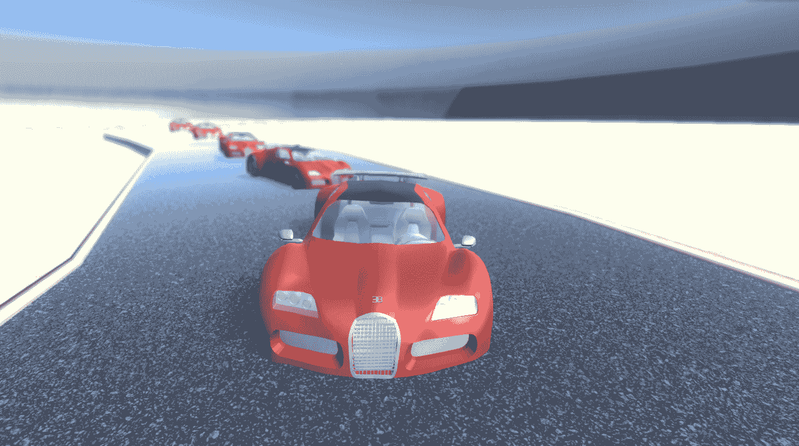

# MOBA 游戏类型

点对点移动是控制角色移动最常用的方法之一。为什么它被广泛使用，这一点不言而喻，因为角色从一个点移动到另一个点，通常这正是我们想要的；我们希望角色到达某个目的地或跟随另一个角色。另一种也需要这种移动类型的游戏类型是最近变得非常流行的多人在线战斗竞技场（MOBA）游戏。通常，NPC 角色会在起始位置生成，并沿着预定的路径向敌方塔楼移动，类似于塔防游戏中的敌人，但在这个情况下，AI 角色与玩家在相同的地图上移动，并且可以相互干扰。

地图被分为两个相等的部分，其中一边需要与另一边战斗，并且每个部分都会生成一个不同的连队，由被称为小兵或 creep 的小型敌人组成。当它们沿着路径移动时，如果一个连队遇到另一个，它们就会停止前进并开始攻击。战斗结束后，幸存者继续前进：

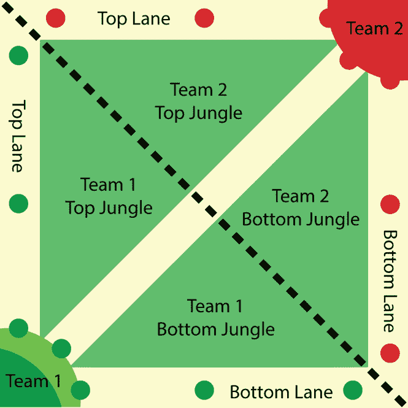

在这个例子中，我们将重新创建游戏的一部分，其中小队从起始位置出生，沿着路径前进，当它们找到敌人时停止，并继续向下一个方向移动，直到赢得战斗。然后我们将创建由玩家或计算机控制的英雄角色的基本移动：两者都有在地图上自由移动的自由，角色需要遵循玩家或计算机指示的方向，同时避开所有障碍。

我们将首先将地图导入到我们的游戏中。我们选择了一个通用的 MOBA 风格地图，就像我们在以下截图中所看到的那样：

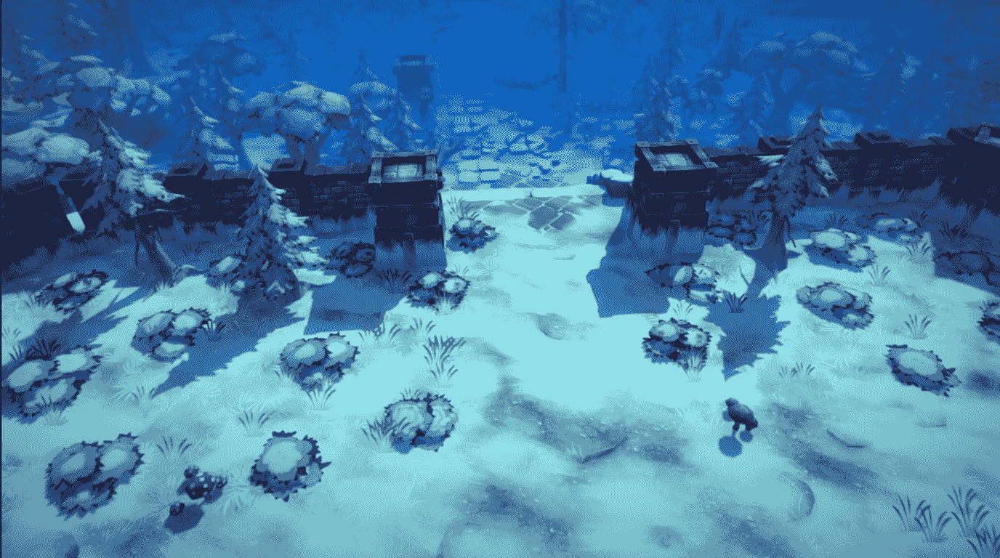

下一步是在地图中创建航点。这里我们将有六个不同的航点组，因为每个队伍有三条不同的路径，每个小队只能遵循一条路径。我们从基地位置开始，然后添加更多的航点，直到我们到达敌方基地。以下图像显示了我们所创建的示例。

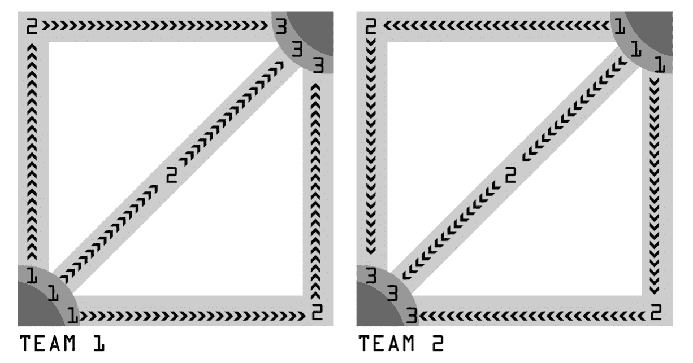

我们需要为每个队伍创建三个不同的航点组，因为也会有三个不同的出生点；它们将独立工作。设置航点后，我们可以将它们分组并分配用于收集位置信息和排应该遵循的顺序的代码。对于这个例子，我们可以使用我们之前用于塔防航点的相同代码，因为敌人跟随路径的方式是相似的：

```py
 public static Transform[] points;

 void Awake () 
 {
      points = new Transform[transform.childCount];
      for (int i = 0; i < points.Length; i++)
      {
          points[i] = transform.GetChild(i); 
      }
 }
```

由于我们有六个不同的航点组，有必要将相同的代码复制六次并相应地重命名。我们的“可出生”敌人将稍后访问它们正确的路径，因此建议重命名组和代码，以便我们可以轻松理解哪个组代表哪个路线，例如，1_Top/1_Middle/1_Bottom 和 2_Top/2_Middle/2_Bottom。数字代表他们的队伍，位置名称代表位置。在这种情况下，我们将代码中的`points`名称更改为代表每个路线的正确名称：

Lane Team 1 Top:

```py
 public static Transform[] 1_Top;

 void Awake () 
 {
      1_Top = new Transform[transform.childCount];
      for (int i = 0; i < 1_Top.Length; i++)
      {
          1_Top[i] = transform.GetChild(i); 
      }
 }
```

Lane Team 1 Middle:

```py
 public static Transform[] 1_Middle;

 void Awake () 
 {
      1_Middle = new Transform[transform.childCount];
      for (int i = 0; i < 1_Top.Length; i++)
      {
          1_Middle[i] = transform.GetChild(i); 
      }
 }
```

Lane Team 1 Bottom:

```py
 public static Transform[] 1_Bottom;

 void Awake () 
 {
      1_Bottom = new Transform[transform.childCount];
      for (int i = 0; i < 1_Top.Length; i++)
      {
          1_Bottom[i] = transform.GetChild(i); 
      }
 }
```

Lane Team 2 Top:

```py
 public static Transform[] 2_Top;

 void Awake () 
 {
      2_Top = new Transform[transform.childCount];
      for (int i = 0; i < 1_Top.Length; i++)
      {
          2_Top[i] = transform.GetChild(i); 
      }
 }
```

Lane Team 2 Middle:

```py
 public static Transform[] 2_Middle;

 void Awake () 
 {
      2_Middle = new Transform[transform.childCount];
      for (int i = 0; i < 2_Middle.Length; i++)
      {
          2_Middle[i] = transform.GetChild(i); 
      }
 }
```

Lane Team 2 Bottom:

```py
 public static Transform[] 2_Bottom;

 void Awake () 
 {
      2_Bottom = new Transform[transform.childCount];
      for (int i = 0; i < 2_Bottom.Length; i++)
      {
          2_Bottom[i] = transform.GetChild(i); 
      }
 }
```

现在我们已经为每个队伍创建了所有组和代码，我们可以继续到跟随路径向敌方基地前进的角色 AI。我们可以选择为每个队伍复制代码，或者将所有内容整合到同一代码中，使用`if`语句来决定角色应该遵循哪个路径。对于这个例子，我们选择将所有内容整合到同一代码中。这样，我们只需更新一次角色代码，它就会同时适用于两个队伍。再次提醒，我们可以从在塔防游戏中使用的相同代码开始。我们可以更改代码，使其适合我们目前正在创建的游戏：

```py
 public float speed;
 public int health;
 public float speedTurn;

 private Transform target;
 private int wavepointIndex = 0;

 void Start ()
 {
      target = waypoints.points[0];
      speed = 10f;
      speedTurn = 0.2f;
 }

 void Update ()
 {
      Vector3 dir = target.position - transform.position;
      transform.Translate(dir.normalized * speed * Time.deltaTime, 
         Space.World);

      if(Vector3.Distance(transform.position, target.position) <= 0.4f)
      {
          GetNextWaypoint();
      }

      Vector3 newDir = Vector3.RotateTowards(transform.forward, dir, 
         speedTurn, 0.0F);

      transform.rotation = Quaternion.LookRotation(newDir);
 }

 void GetNextWaypoint()
 {
      if(wavepointIndex >= waypoints.points.Length - 1)
      {
          Destroy(gameObject);
          return;
      }

      wavepointIndex++;
      target = waypoints.points[wavepointIndex];
 } 
```

使用这段代码，我们可以让角色沿着路径移动，并在从一个点到另一个点时平滑地转向。在这个阶段，我们只需要更改代码，使其适合我们正在创建的游戏类型。为此，我们首先需要考虑的是将点名称更改为我们之前创建的名称，并添加`if`语句来选择角色需要跟随的侧面。

让我们从添加区分一个团队角色与另一个团队角色的信息开始。为此，我们需要创建两个新的布尔变量：

```py
 public bool Team1;
 public bool Team2;
```

这将使我们能够决定角色是来自 Team1 还是 Team2，两者不能同时为真。现在我们可以将更多细节添加到角色代码中，让他知道他应该走哪条路线：

```py
 public bool Top;
 public bool Middle; 
 public bool Bottom; 
```

我们添加了三个额外的布尔值，将指示角色需要跟随的路线。在确定角色是从哪个团队出生后，我们将添加另一个`if`语句来确定角色将遵循的路线。

一旦我们添加了这些变量，我们需要根据角色将遵循的路线分配我们之前创建的航点组。我们可以在`start`函数中实现这一点：

```py
if(Team1 == true)
 {
          if(Top == true)
          {
              target = 1_Top.1_Top[0];
          }

          if(Middle == true)
          {
              target = 1_Middle.1_Middle[0];
          }

          if(Bottom == true)
          {
             target = 1_Bottom.1_Top[0];
          }
 }

 if(Team2 == true)
 {
          if(Top == true)
          {
             target = 2_Top.2_Top[0];
          }

          if(Middle == true)
          {
              target = 2_Middle.2_Middle[0];
          }

          if(Bottom == true)
          {
              target = 2_Bottom.2_Top[0];
          }
 } 
```

这允许角色询问它所代表的团队、它出生的路线以及他将遵循的路径。我们需要调整其余的代码，以便它适用于这个示例。下一个修改将在`GetNextWaypoint()`函数中。我们需要添加`if`语句，让角色知道他需要遵循的正确下一个航点，类似于我们在`Start`函数中所做的：

```py
void GetNextWaypoint()
{
    if(Team1 == true)
    {
       if(Top == true)
       {
          if(wavepointIndex >= 1_Top.1_Top.Length - 1)
          {
             Destroy(gameObject);
              return;
           }

           wavepointIndex++;
           target = 1_Top.1_Top[wavepointIndex];
         }

         if(Middle == true)
         {
            if(wavepointIndex >= 1_Middle.1_Middle.Length - 1)
            {
               Destroy(gameObject);
               return;
             }

             wavepointIndex++;
             target = 1_Middle.1_Middle[wavepointIndex];
           }

           if(Bottom == true)
           {
              if(wavepointIndex >= 1_Bottom.1_Bottom.Length - 1)
              {
                 Destroy(gameObject);
                 return;
               }

               wavepointIndex++;
               target = 1_Bottom.1_Bottom[wavepointIndex];
           }
       }

       if(Team2 == true)
       {
         if(Top == true)
         {
            if(wavepointIndex >= 2_Top.2_Top.Length - 1)
            {
                Destroy(gameObject);
                return;
             }

             wavepointIndex++;
             target = 2_Top.2_Top[wavepointIndex];
           }

           if(Middle == true)
           {
              if(wavepointIndex >= 2_Middle.2_Middle.Length - 1)
              {
                 Destroy(gameObject);
                 return;
               }

               wavepointIndex++;
               target = 2_Middle.2_Middle[wavepointIndex];
            }

            if(Bottom == true)
            {
               if(wavepointIndex >= 2_Bottom.2_Bottom.Length - 1)
               {
                 Destroy(gameObject);
                 return;
               }

               wavepointIndex++;
               target = 2_Bottom.2_Bottom[wavepointIndex];
             }
         }
     }  
```

在这个阶段，如果我们向游戏中添加一个角色并分配 AI 代码，它将遵循所选路径：

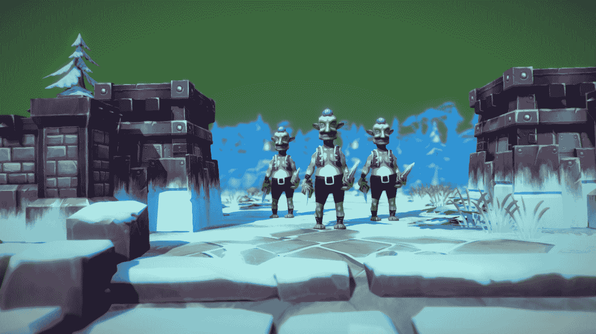

它正在正常工作，我们现在准备实现更多功能，以创建一个完美的连队，该连队沿着通往敌方塔楼的道路前进，并在必要时停下来与另一连队或英雄战斗。现在我们已经有了基本移动功能，我们可以添加任何我们想要添加到我们的连队中的细节或独特性。在这里，我们附上了连队 AI 角色的完整代码：

```py
  public float speed;
  public int health;
  public float speedTurn;

  public bool Team1;
  public bool Team2;

  public bool Top;
  public bool Middle;
  public bool Bottom;

  private Transform target;
  private int wavepointIndex = 0;
```

在更新前面代码中的变量之后，我们可以继续到`Start`方法，该方法将在第一帧被调用：

```py
  void Start ()
  {
     if(Team1 == true)
     {
        if(Top == true)
        {
            target = 1_Top.1_Top[0];
         }

         if(Middle == true)
         {
              target = 1_Middle.1_Middle[0];
          }

          if(Bottom == true)
          {
              target = 1_Bottom.1_Top[0];
          }
      }

      if(Team2 == true)
      {
          if(Top == true)
          {
             target = 2_Top.2_Top[0];
           }

          if(Middle == true)
          {
             target = 2_Middle.2_Middle[0];
          }

           if(Bottom == true)
           {
               target = 2_Bottom.2_Top[0];
            }
    }
    speed = 10f;
    speedTurn = 0.2f;
  }
```

这是每帧游戏都会调用的`Update`方法：

```py
  void Update ()
  {
     Vector3 dir = target.position - transform.position;
     transform.Translate(dir.normalized * speed * Time.deltaTime, 
        Space.World);

     if(Vector3.Distance(transform.position, target.position) <= 0.4f)
     {
         GetNextWaypoint();
     }

     Vector3 newDir = Vector3.RotateTowards(transform.forward, dir, 
        speedTurn, 0.0F);

     transform.rotation = Quaternion.LookRotation(newDir);
  }

  void GetNextWaypoint()
  {
      if(Team1 == true)
      {
        if(Top == true)
        {
          if(wavepointIndex >= 1_Top.1_Top.Length - 1)
          {
            Destroy(gameObject);
            return;
          }

          wavepointIndex++;
          target = 1_Top.1_Top[wavepointIndex];
        }

        if(Middle == true)
        {
          if(wavepointIndex >= 1_Middle.1_Middle.Length - 1)
          {
             Destroy(gameObject);
             return;
           }

           wavepointIndex++;
           target = 1_Middle.1_Middle[wavepointIndex];
        }

        if(Bottom == true)
        {
           if(wavepointIndex >= 1_Bottom.1_Bottom.Length - 1)
           {
                Destroy(gameObject);
                return;
            }

            wavepointIndex++;
            target = 1_Bottom.1_Bottom[wavepointIndex];
        }
      }

      if(Team2 == true)
      {
         if(Top == true)
         {
           if(wavepointIndex >= 2_Top.2_Top.Length - 1)
           {
                Destroy(gameObject);
                return;
            }

             wavepointIndex++;
             target = 2_Top.2_Top[wavepointIndex];
          }

          if(Middle == true)
          {
             if(wavepointIndex >= 2_Middle.2_Middle.Length - 1)
             {
                Destroy(gameObject);
                return;
              }

              wavepointIndex++;
              target = 2_Middle.2_Middle[wavepointIndex];
            }

            if(Bottom == true)
            {
              if(wavepointIndex >= 2_Bottom.2_Bottom.Length - 1)
              {
                 Destroy(gameObject);
                 return;
               }

               wavepointIndex++;
               target = 2_Bottom.2_Bottom[wavepointIndex];
             }
         }
     }  
```

MOBA 游戏的一个重要方面是英雄的移动。即使它由玩家控制，角色也有 AI 来决定他需要遵循的路径，以便到达所选目的地。为了完成这个任务，我们首先介绍点对点方法；然后我们将继续使用相同的方法，但使用一种更高级的方法，让我们的角色决定到达最终目的地的最佳路径，而不需要实现任何航点。

这个例子也将作为如何创建跟随玩家的角色的示例。为了做到这一点，我们需要设置所有角色允许跟随的可能路径。我们希望 AI 避免与物体碰撞或穿过墙壁，例如：

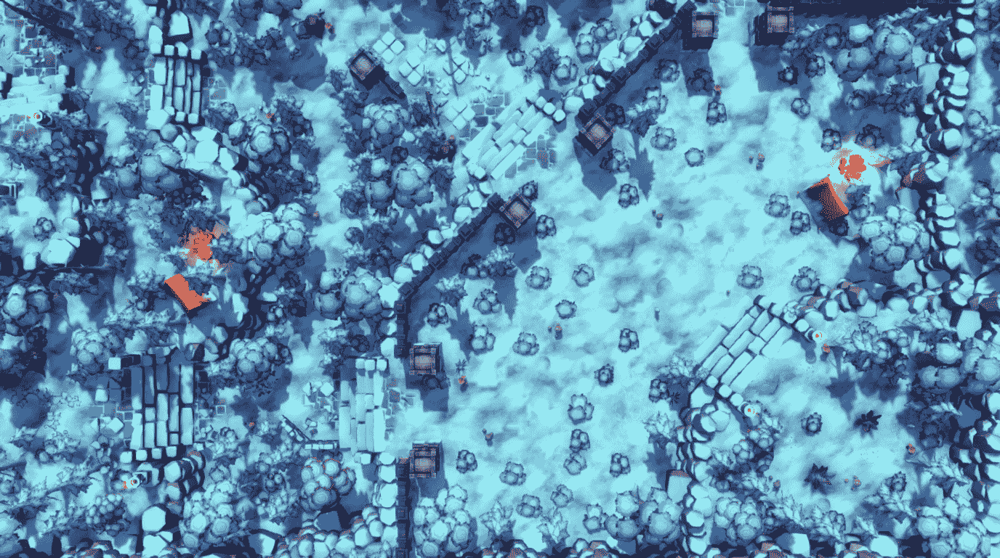

让我们关注地图的这个区域。正如我们所见，墙壁和树木阻挡了地图的一部分，角色不应被允许穿过它们。使用航点方法，我们将在地图上创建角色应该跟随以到达特定目的地的点。它不会有像之前例子中创建的任何特定顺序，因为角色可以朝任何方向移动，因此我们无法预测它将选择哪条路径。

我们首先将航点定位在可通行位置。这将防止角色在不可通行区域移动：

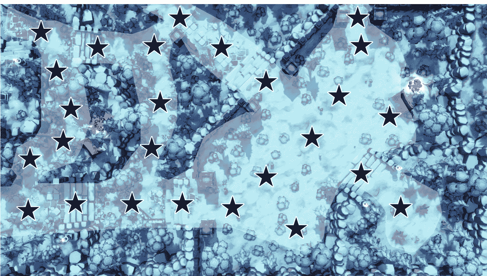

地图上我们看到的小星星代表我们创建的航点，因此我们应该只在角色能够行走的地方放置它们。如果角色想要从一个位置移动到另一个位置，它必须遵循航点，直到到达离目标目的地最近的航点。

在游戏机制中，我们可以选择角色为什么需要到达某个特定目的地，例如跟随玩家、前往基地恢复生命值、向敌方墙壁移动以摧毁它，以及许多其他选择。无论角色 AI 需要实现什么，它都需要在地图上正确移动，而这个航点系统在任何情况下都会起作用。

在这里，我们可以找到使这一切工作的完整代码。然后我们将详细解释，以便更好地理解如何复制此代码，使其能在不同的游戏类型中工作：

```py
  public float speed;
  private List <GameObject> wayPointsList;
  private Transform target;
  private GameObject[] wayPoints;

  void Start ()
  {

      target = GameObject.FindGameObjectWithTag("target").transform;
      wayPointsList = new List<GameObject>();

      wayPoints = GameObject.FindGameObjectsWithTag("wayPoint");

      for each(GameObject newWayPoint in wayPoints)
      {
         wayPointsList.Add(newWayPoint);
       }
   }

   void Update ()
   {
      Follow();
   }

   void Follow () 
   {
      GameObject wayPoint = null;

      if (Physics.Linecast(transform.position, target.position))
      {
         wayPoint = findBestPath();
       }

       else
       {
          wayPoint = GameObject.FindGameObjectWithTag("target");  
        }

        Vector3 Dir = (wayPoint.transform.position - 
                transform.position).normalized;
        transform.position += Dir * Time.deltaTime * speed;
        transform.rotation = Quaternion.LookRotation(Dir);
     }

     GameObject findBestPath()
     {
         GameObject bestPath = null;
         float distanceToBestPath = Mathf.Infinity;

         for each(GameObject go in wayPointsList)
         {
            float distToWayPoint = Vector3.
               Distance(transform.position, go.transform.position);
            float distWayPointToTarget = Vector3.
               Distance(go.transform.position, 
               target.transform.position);
            float distToTarget = Vector3.
               Distance(transform.position, target.position);
            bool wallBetween = Physics.Linecast
               (transform.position, go.transform.position);

            if((distToWayPoint < distanceToBestPath) 
                && (distToTarget > distWayPointToTarget) 
                    &&  (!wallBetween))
             {
                 distanceToBestPath = distToWayPoint;
                 bestPath = go;
             }

             else
             {
                 bool wayPointToTargetCollision = Physics.Linecast
                    (go.transform.position, target.position);
                 if(!wayPointToTargetCollision)
                 {
                      bestPath = go;        
                  }    
             }
         }
         return bestPath;
     } 
```

如果我们将此代码分配给我们的角色并按下播放按钮，我们可以测试游戏并看到我们所创建的内容工作得非常完美。角色应该使用航点位置在地图上移动，以达到目标目的地。这种方法同样适用于 NPC 角色和可玩角色，因为在这两种情况下，角色都需要避免与墙壁和障碍物碰撞：

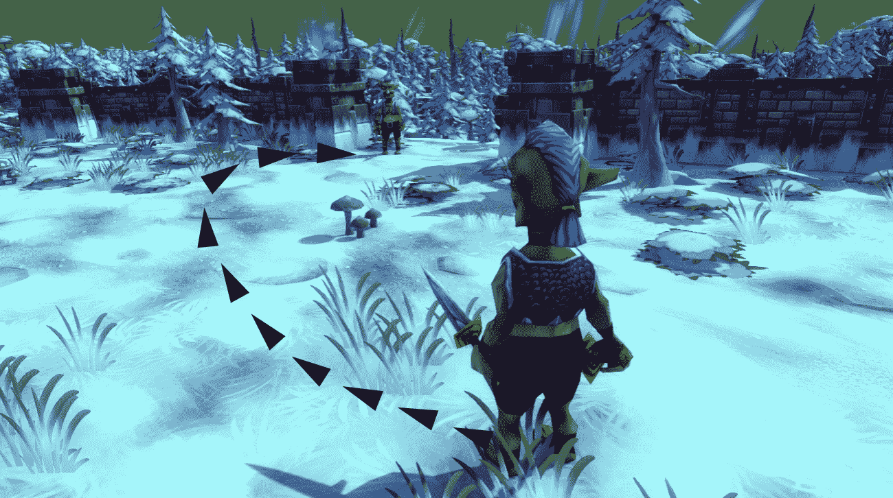

如果我们继续这个例子，并将航点扩展到整个地图上，我们就会有一个运行良好的基本 MOBA 游戏，每个基地都会生成一群怪物，它们会沿着正确的路径前进，同时英雄角色可以在地图上自由移动，不会撞到墙壁。

# 点对点移动和避免动态物体

现在我们有了能够跟随正确路径并避开静态物体的角色，我们准备进入下一个级别，让这些角色在从点到点移动时避开动态物体。我们将回顾本章中创建的三个不同示例，并看看我们如何将这些避免技术添加到示例中的 AI 角色中。

这三个方法几乎涵盖了所有使用点对点移动作为其主要移动方式的游戏类型，我们将能够根据这些示例作为指南来创造新的想法：

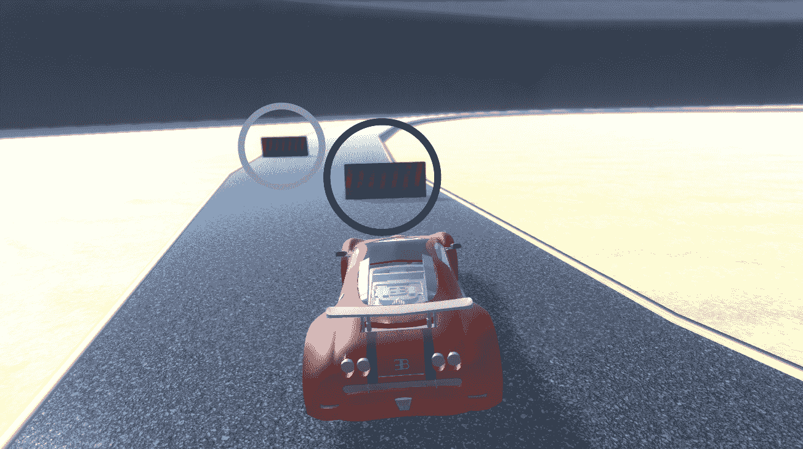

让我们从赛车游戏开始，在这个游戏中，我们有一辆在赛道上行驶直到完成比赛的汽车。如果汽车独自驾驶且路上没有障碍物，那么它就不需要避开任何障碍，但通常障碍物会使游戏更有趣或更具挑战性，尤其是在它们是突然出现且我们没有预料到的情况下。一个很好的例子是马里奥赛车游戏，在那里他们扔香蕉和其他物体来使对手不稳定，而这些物体没有预定义的位置，所以角色无法预测它们将出现在哪里。因此，对于驾驶员来说，拥有避免与这些物体碰撞的必要功能并在实时中做到这一点是非常重要的。

假设当 AI 角色正在跟随下一个航点时，道路上意外出现了两个物体，我们希望角色能够预测碰撞并转身避开物体。我们将使用的方法是航点移动与迷宫移动的结合。角色一次只能服从一个命令，他要么遵守航点移动，要么遵守迷宫移动，这正是我们需要添加到我们的代码中的，以便角色 AI 可以根据他当前面临的情况选择最佳选项：

```py
  public static bool raceStarted = false;

  public float aiSpeed = 10.0f;
  public float aiTurnSpeed = 2.0f;
  public float resetAISpeed = 0.0f;
  public float resetAITurnSpeed = 0.0f;

  public GameObject waypointController;
  public List<Transform> waypoints;
  public int currentWaypoint = 0;
  public float currentSpeed;
  public Vector3 currentWaypointPosition;

  public static bool isBlocked;
  public static bool isBlockedFront;
  public static bool isBlockedRight;
  public static bool isBlockedLeft;
```

在更新前面的变量之后，我们可以继续到`Start`方法。这将在第一帧被调用：

```py
   void Start () 
   {
         GetWaypoints();
         resetAISpeed = aiSpeed;
         resetAITurnSpeed = aiTurnSpeed;
    }

```

这里是每帧游戏都会调用的`Update`方法：

```py
   void Update () 
    {
       if(raceStarted && isBlocked == false)
       {
          MoveTowardWaypoints();    
        }

       if(raceStarted && isBlockedFront == true 
           && isBlockedLeft == false && isBlockedRight == false)
        {
            TurnRight();
        }

        if(raceStarted && isBlockedFront == false
             && isBlockedLeft == true && isBlockedRight == false)
        {
             TurnRight();
        }

        if(raceStarted && isBlockedFront == false 
              && isBlockedLeft == false && isBlockedRight == true)
        {
             TurnLeft();
        }
     }

     void GetWaypoints()
      {
            Transform[] potentialWaypoints = waypointController.
                GetComponentsInChildren<Transform>();

            waypoints = new List<Transform>();

            for each(Transform potentialWaypoint in potentialWaypoints)
             {
                 if(potentialWaypoint != waypointController.transform)
                 {
                      waypoints.Add(potentialWaypoint);    
                  }
              }
     }

     void MoveTowardWaypoints()
     {
        float currentWaypointX = waypoints[currentWaypoint].position.x;
        float currentWaypointY = transform.position.y;
        float currentWaypointZ = waypoints[currentWaypoint].position.z;

        Vector3 relativeWaypointPosition = transform.
           InverseTransformPoint (new Vector3(currentWaypointX, 
           currentWaypointY, currentWaypointZ));
        currentWaypointPosition = new Vector3(currentWaypointX, 
           currentWaypointY, currentWaypointZ);

        Quaternion toRotation = Quaternion.
           LookRotation(currentWaypointPosition - transform.position);
        transform.rotation = Quaternion.
           RotateTowards(transform.rotation, toRotation, aiTurnSpeed);

         GetComponent<Rigidbody>().AddRelativeForce(0, 0, aiSpeed);

         if(relativeWaypointPosition.sqrMagnitude < 15.0f)
         {
               currentWaypoint++;

               if(currentWaypoint >= waypoints.Count)
               {
                        currentWaypoint = 0;    
                }
           }

           currentSpeed = Mathf.Abs(transform.
               InverseTransformDirection(GetComponent<Rigidbody>().
               velocity).z);

           float maxAngularDrag = 2.5f;
           float currentAngularDrag = 1.0f;
           float aDragLerpTime = currentSpeed * 0.1f;

           float maxDrag = 1.0f;
           float currentDrag = 3.5f;
           float dragLerpTime = currentSpeed * 0.1f;

           float myAngularDrag = Mathf.Lerp(currentAngularDrag, 
                 maxAngularDrag, aDragLerpTime);
           float myDrag = Mathf.Lerp(currentDrag, maxDrag, 
                 dragLerpTime);

           GetComponent<Rigidbody>().angularDrag = myAngularDrag;
           GetComponent<Rigidbody>().drag = myDrag;
     }

     void TurnLeft()
     {
         //turning left function here
     }

     void TurnRight()
     {
         //turning right function here
     } 
```

我们在我们的代码中添加了四个新的静态变量：`isBlocked`、`isBlockedFront`、`isBlockedRight`和`isBlockedLeft`。这将检查汽车前方的路径是否没有障碍物。汽车将继续沿着航点路径行驶，直到出现某些东西，汽车需要左转或右转以通过障碍物。为了使这一点生效，我们需要在汽车前方至少添加三个传感器。当它们与某个物体交互时，传感器将信息传递给 AI 驾驶员，此时它将根据该信息选择最佳选项：

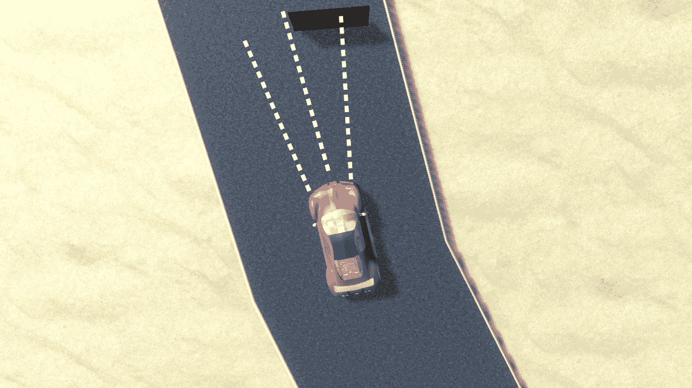

正如我们在前面的图像中所看到的，汽车现在有三个传感器附着在其上。在这个例子中，右边的传感器将报告它被障碍物阻挡，驾驶员将向左转直到那一边再次畅通。一旦三个传感器报告说没有东西阻挡驾驶员的路径，汽车将返回到之前移动的航点。如果我们注意到驾驶员没有识别某些障碍物，建议增加传感器的数量以覆盖更大的区域。

现在让我们继续到我们为 MOBA 示例创建的编队角色。在这里，我们需要创建一个不同的方法，因为角色将移动到下一个航点，直到他们找到某个东西，但这次我们不希望他们离开。相反，我们希望角色向他们找到的角色移动。

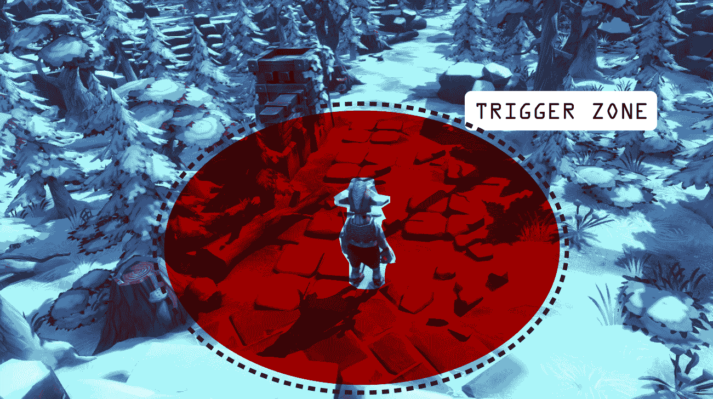

为了创建这个功能，我们将为我们的角色添加一个圆形或球形的碰撞器。这将作为检测器使用。如果某个物体触发了该区域，角色将停止向其航点移动，并使用触发碰撞器的英雄的位置作为航点来追击：

```py
  public float speed; 
  public int health; 
  public float speedTurn; 

  public bool Team1; 
  public bool Team2; 

  public bool Top; 
  public bool Middle; 
  public bool Bottom; 

  private Transform target; 
  private int wavepointIndex = 0; 

  static Transform heroTarget; 
  static bool heroTriggered; 

```

在更新前面的变量之后，我们可以继续到`Start`方法，它将在第一帧被调用：

```py
   void Start () 
   { 
         if(Team1 == true) 
         { 
            if(Top == true) 
            { 
                  target = 1_Top.1_Top[0]; 
             } 

              if(Middle == true) 
              { 
                    target = 1_Middle.1_Middle[0]; 
              } 

               if(Bottom == true) 
               { 
                   target = 1_Bottom.1_Top[0]; 
                } 
         } 

          if(Team2 == true) 
          { 
            if(Top == true) 
            { 
              target = 2_Top.2_Top[0]; 
            } 

             if(Middle == true) 
             { 
                target = 2_Middle.2_Middle[0]; 
             } 

              if(Bottom == true) 
              { 
                  target = 2_Bottom.2_Top[0]; 
               } 
          } 
          speed = 10f; 
          speedTurn = 0.2f; 
        } 

```

这里是每帧游戏都会调用的`Update`方法：

```py
        void Update () 
        { 
           Vector3 dir = target.position - transform.position; 
           transform.Translate(dir.normalized * speed * Time.deltaTime, 
              Space.World); 

           if(Vector3.Distance(transform.position, target.position) <=
                 0.4f && heroTriggered == false) 
            { 
                GetNextWaypoint(); 
             } 

             if(heroTriggered == true) 
             { 
                  GetHeroWaypoint(); 
              } 

              Vector3 newDir = Vector3.RotateTowards(transform.
                     forward, dir, speedTurn, 0.0F); 

              transform.rotation = Quaternion.LookRotation(newDir); 
        } 

```

这个`GetNextWaypoint`方法用于收集角色需要跟随的下一个航点的相关信息：

```py
        void GetNextWaypoint() 
        { 
           if(Team1 == true) 
           { 
              if(Top == true) 
              { 
                 if(wavepointIndex >= 1_Top.1_Top.Length - 1) 
                 { 
                      Destroy(gameObject); 
                      return; 
                  } 

                  wavepointIndex++; 
                  target = 1_Top.1_Top[wavepointIndex]; 
                } 

                if(Middle == true) 
                { 
                  if(wavepointIndex >= 1_Middle.1_Middle.Length - 1) 
                  { 
                    Destroy(gameObject); 
                    return; 
                   } 

                   wavepointIndex++; 
                   target = 1_Middle.1_Middle[wavepointIndex]; 
                } 

                if(Bottom == true) 
                { 
                   if(wavepointIndex >= 1_Bottom.1_Bottom.Length - 1) 
                   { 
                      Destroy(gameObject); 
                      return; 
                   } 

                    wavepointIndex++; 
                    target = 1_Bottom.1_Bottom[wavepointIndex]; 
                  } 
            } 

            if(Team2 == true) 
            { 
               if(Top == true) 
               { 
                  if(wavepointIndex >= 2_Top.2_Top.Length - 1) 
                  { 
                     Destroy(gameObject); 
                     return; 
                  } 

                  wavepointIndex++; 
                  target = 2_Top.2_Top[wavepointIndex]; 
                } 

                if(Middle == true) 
                { 
                    if(wavepointIndex >= 2_Middle.2_Middle.Length - 1) 
                    { 
                       Destroy(gameObject); 
                       return; 
                     } 

                     wavepointIndex++; 
                     target = 2_Middle.2_Middle[wavepointIndex]; 
                  } 

                  if(Bottom == true) 
                  { 
                     if(wavepointIndex >= 2_Bottom.2_Bottom.Length - 1) 
                      { 
                         Destroy(gameObject); 
                         return; 
                       } 

                       wavepointIndex++; 
                       target = 2_Bottom.2_Bottom[wavepointIndex]; 
                    } 
               } 
    }

```

在`GetHeroWaypoint`方法中，我们设置当角色需要跟随英雄方向时发生的情况，例如攻击或其他功能：

```py
    void GetHeroWaypoint() 
    { 
        target = heroTarget.transform; 
    } 
```

我们已经为角色添加了一个球形碰撞器，它向角色提供触发信息，以便知道是否有英雄角色进入了该区域。如果没有英雄触发该区域，角色将继续跟随航点，否则它将集中注意力在英雄身上，并使用他作为目标点。

通过这个例子，我们学习了 MOBA 游戏中可以找到的人工智能移动的核心功能，现在我们可以重新创建这种流行的游戏类型。从这一章开始，我们可以创建从简单到复杂的导航系统，并使用它们使我们的 AI 角色在游戏中更加活跃，不断追求目标，即使这个目标是移动。

# 摘要

在本章中，我们介绍了点对点移动，这是一种在许多游戏中广泛使用的方法，并且我们可以将我们创建的代码适应到几乎任何游戏中。到目前为止，我们能够重新创建许多流行的游戏，并给它们添加我们个人的特色。在下一章中，我们将继续讨论移动，但我们将关注一个称为 Theta 算法的高级方面。这将作为本章所学内容的延续，我们将能够创建一个角色 AI，它无需任何先前的信息或位置，就能为自己找到到达特定目的地的最佳路径。
