# 群体互动

在理解了如何开发一个可以在地图上自由移动的 AI 角色，并寻找到达特定目的地的最佳路径之后，我们可以开始着手角色之间的互动。在本章中，我们将探讨现实中的群体互动，如何开发可信的群体行为，以及角色应该如何感知其他群体成员。本章的目标是继续向我们的 AI 角色提供关于环境的信息，在这个特定案例中，关于游戏中的其他智能代理。在本章中，我们将讨论 AI 协调、通信和群体碰撞避免。

# 什么是群体互动

群体互动是一个现实生活中的主题，通常指的是多个生物共享同一空间。一个很大的例子是人类生活，人类如何与其他人类和其他物种互动。我们大多数时候所做的决定都涉及其他人，从简单的决定到最先进和复杂的决定。让我们假设我们想要买一张电影票，电影在下午 3 点开始。如果我们是唯一对看这部电影感兴趣的人，我们可以在电影开始前 2 分钟到达电影院买票，这样我们就能准时看电影。但如果超过 100 人对看同一部电影感兴趣，我们就需要提前做好预测，并更早地到达电影院，以便有时间买票。一旦我们到达电影院，就有关于我们如何等待直到轮到我们买票的规则。通常我们会排在最后一个人的后面。这种行为是群体互动的一个例子。我们生活在其他人类周围，因此我们需要相应地调整我们的目标。

在视频游戏中，我们也可以找到这种类型的互动，并且可以从简单的行为到高级和复杂的行为。如果我们游戏中有多于一个 AI 角色，并且它们共享同一空间，那么有时一个角色可能会与另一个角色发生碰撞。这取决于创作者思考，如果两个角色试图同时做同一件事会发生什么，这是否合理，或者它会导致错误。为了解决这些问题，我们需要思考并实施帮助角色共享同一空间、避免错误并更真实地行为的决策。

# 视频游戏和群体互动

正如我们之前所发现的，群体互动是现实生活中的问题，但它也可以在视频游戏中找到，尤其是在那些依赖于类似人类方面的游戏中。由于开放世界地图的流行，群体互动在游戏开发中成为一个非常重要的方面，因为游戏中的 AI 代理始终共享同一空间。这意味着几乎每个开放世界游戏都有必要规划一个群体互动系统。

# 刺客信条

在视频游戏中，一个非常流行的群体互动系统案例可以在《刺客信条》系列中找到。非玩家角色成群结队地在地图上行走，以简单的方式避免碰撞并与环境互动。这有助于为游戏创造一种真实氛围，这是一个至关重要的点，可以使游戏可信并让玩家沉浸于虚拟世界：

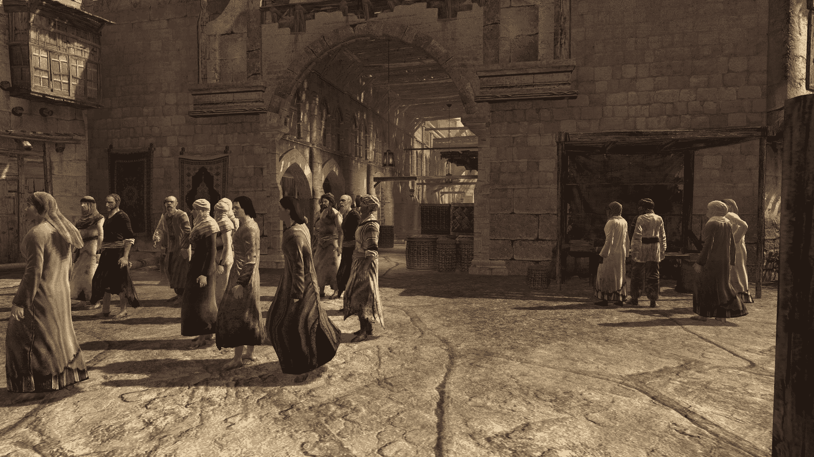

我们不仅能在游戏的一般人群中看到群体互动，还能在守卫和尤其是在战斗中看到。时不时地，玩家需要与几个守卫战斗，通常不止一个守卫准备攻击玩家。一个有趣的观点是守卫不会同时攻击；他们会评估情况，等待更好的攻击机会。

这个概念给多个非玩家角色之间的互动带来了一种感觉：

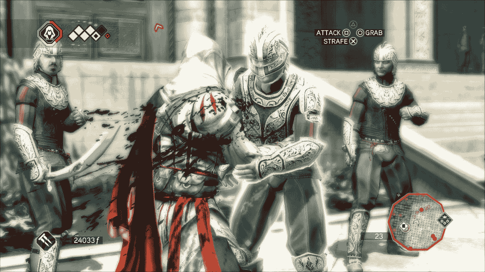

# 《侠盗猎车手》（GTA）

《侠盗猎车手》游戏系列是我们可以从中学到许多有趣教训的源泉。不断寻求通过尝试使其更加真实和可信来改进游戏，改变了玩家的关注点，从简单地关注主要角色转向周围环境。为了使环境更具吸引力和真实感，游戏的创作者开始花更多时间开发人工智能代理，如何移动，如何反应，以及如何互动。当时人工智能角色的互动具有开创性。

玩家可以看到角色停止交谈，在更戏剧性的事件中身体对抗，所有这些都使得环境更加生动：

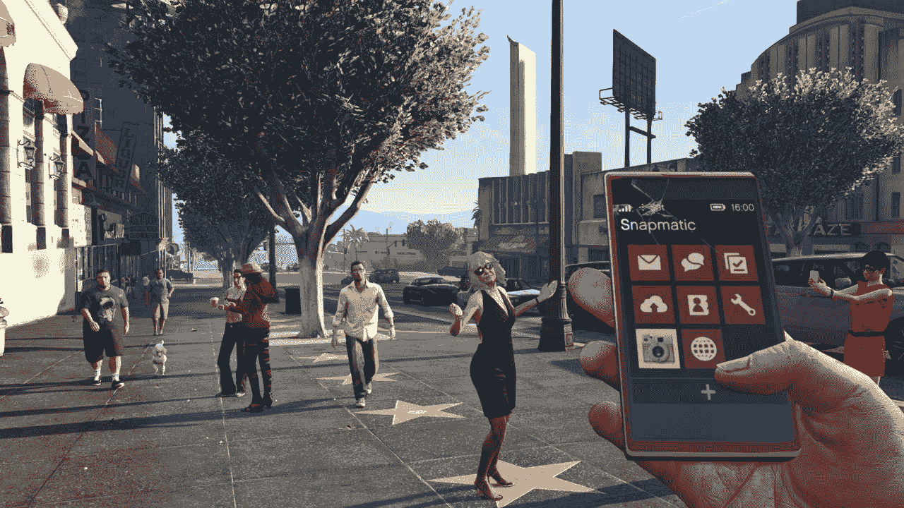

如前述截图所示，游戏中的街道上挤满了不同的个体，他们正在相互互动。我们可以看到一个男人带着他的狗散步，两个女孩在交谈，一个年轻女人在给另一个女人拍照，所有这些都不以任何方式对游戏玩法做出贡献，但它们使体验更加生动和真实。

# 《模拟人生》

另一个群体互动的绝佳例子可以在现实生活模拟游戏《模拟人生》中找到。再次提到这款游戏是因为它塑造了开发者创造游戏的方式，在人工智能方面，他们对此做出了很多贡献。

非玩家角色并不意味着他们只需要处于闲置位置，等待事情发生。在这里我们可以看到所有角色都有独特的个性，并且它们相互互动。即使玩家放下控制器，只是观看游戏，也会有许多有趣的事情发生，所有这些都来自人工智能角色：


在本书之前的部分，我们已经分析了《模拟人生》角色的优先级，我们知道如果当时有更重要的事情，他们可以决定不做某件事。而现在我们知道了路径查找的工作原理，我们甚至可以给角色实现一个更高级的系统，例如，让他们根据自己的优先级进行组织，考虑他们到达特定目的地所需的时间，以便完成特定任务。但所有这些将在稍后进行探讨。

# FIFA/职业进化足球

另一个需要特别提到的例子是多款体育游戏中可以找到的 AI 角色。即使从外表上看，它不是一个复杂的游戏类型，但体育游戏在 AI 开发方面可能是最先进的。

原因是这些游戏基于现实生活中的体育项目，其中许多是团队运动。开发一个真实且功能齐全的团队体育游戏存在许多困难，因此它是一个很好的案例研究：


上一张截图显示了 FIFA 17 的游戏画面。在这里我们可以看到，只有一名角色拥有球权，而其他所有人则分散开来，要么等待角色传球，要么预测角色的位置，试图从他那里赢得球。总共，游戏中 22 个角色（每边 11 个）只有一个球。这就是为什么体育游戏需要高度发展的 AI 角色，因为他们即使没有球也在不断工作。个别来看，他们都有自己的位置/角色，扮演防守或进攻，左边、右边或中间位置，等等。在团队中，他们都需要共同遵循策略并遵守游戏规则。如果我们的队友有球并且在向前跑，我们可以通过朝同一方向跑来支持他，这样他传球就会更容易，或者我们可以留在后面，因为如果那个球员失去球，就需要有人去捡回来。

其他角色的互动是持续发生的，不仅关乎追逐球以看谁能先拿到球，还关乎他们之间共享大量信息并试图赢得比赛。

# 规划人群互动

有时候我们在制作游戏的过程中会忽略规划阶段，认为只要有一个好点子，一切就会从我们的脑海中顺畅地流淌出来。成功的游戏之所以成功，是因为每个开发步骤都被计划到了最细节的程度，我们在创建自己的游戏时也应该记住这一点。目前，我们拥有强大的技术知识，可以开发出具有丰富 AI 功能的挑战性和有趣的游戏，因此我们的下一步是将创建游戏的能力与使它们看起来更好的计划相结合。

现在我们已经分析了一些视频游戏中流行的群体交互系统示例，我们可以看看如何规划这些类型的交互。我们将遵循之前的例子，看看我们如何将这些类似的群体交互规划到我们的游戏中。

# 群体斗争

让我们创建一个场景，在这个场景中，我们有多个 AI 角色在与玩家战斗。我们首先将战斗功能实现到角色代码中，比如单手攻击、双手攻击、防御、追击玩家等等。一旦我们实现了这些功能，角色就能与玩家战斗，这就是起点。如果我们没有做任何计划，而有四个角色在与玩家战斗，他们都会同时攻击以击败玩家。

这样做可能会有一些小错误，但如果我们没有时间创建一个更好的系统，它也能完成任务。我们想要的是让 AI 角色之间有一些互动，这样他们就不会在未分析情况的情况下同时攻击玩家，看起来很愚蠢：

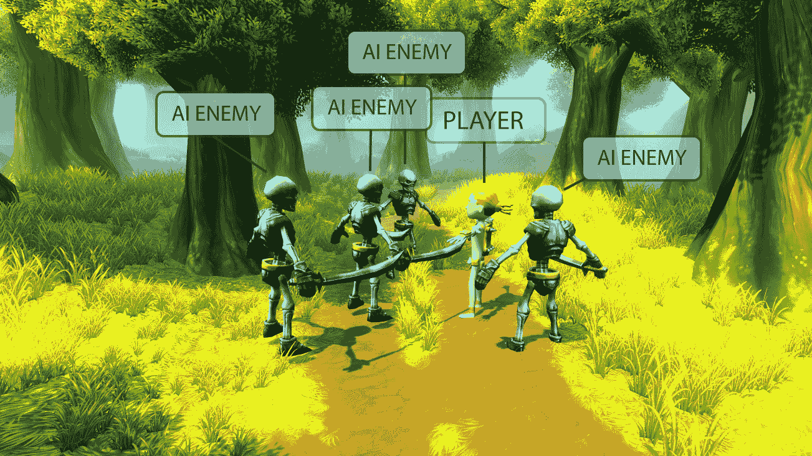

因此，现在游戏已经运行，我们也拥有了跟随玩家并攻击他的敌人角色，我们想要规划 AI 角色之间的交互，让它们决定谁应该先攻击以及何时其他角色也可以发起攻击。

我们可以从众多因素中选择，这些因素将决定角色的特性，以便做出这个决定，而且我们计划得越多，AI 角色就越发达、越具挑战性：

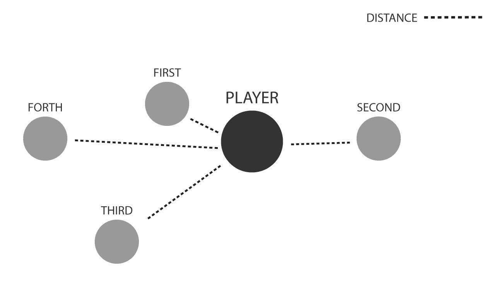

在这个例子中，我们使用了 AI 角色与玩家之间的距离来确定哪个角色将先攻击。我们希望距离最近的角色先攻击，其他所有角色将等待直到那个角色的生命值变低。一旦那个角色的生命值变低，第二个最近的角色将介入战斗并攻击玩家。

现在我们已经为角色设定了第一个标准来决定哪个角色应该首先攻击，我们可以继续确定其他角色在等待时会发生什么。我们还需要考虑玩家可以随时决定攻击任何其他角色，我们不希望 AI 角色因为不是他的攻击时间而停留在闲置位置。所以，想法是考虑可能发生的情况，并计划 AI 在这些情况下的行为，特别是，特别是它们将如何相互交互：

```py
 public static int attackOrder;
 public bool nearPlayer;
 public float distancePlayer;
 public static int charactersAttacking;
 private bool Attack;
 private bool Defend;
 private bool runAway;
 private bool surpriseAttack;

 void Update () 
 {

     if(distancePlayer < 30f)
     {
          nearPlayer = true;
     } 

     if(distancePlayer > 30f) 
     { 
         nearPlayer = false; 
      }

      if(nearPlayer == true && attackOrder == 1)
      {
          Attack = true;
      }

      else 
      {
         Defend = true;
      } 

 }  
```

我们可以从一个简单的代码开始，仅为了确定角色根据我们正在处理的情况的行为，然后我们可以根据需要继续添加更多内容，使其按我们的意愿工作。在这个例子中，我们创建了一个静态整数`attackOrder`，它将包含每个角色的攻击顺序，这样他们就知道是否是他们的攻击时间。之后，我们有一个公共布尔值`nearPlayer`，它将检查玩家是否靠近玩家角色。地图上可以有 30 个角色，但我们只想让最近的那几个攻击角色。在这个例子中，其他角色将简单地忽略玩家。为了确定 AI 角色是否靠近，我们有一个公共浮点值`distancePlayer`，它将是 AI 角色和玩家之间的距离。然后我们添加了一个公共静态整数`charactersAttacking`，其数值将在每个新角色靠近玩家时增加。我们可以使用这个信息来向其他角色提供有多少骨骼正在攻击玩家的信息。

就像这样的一个小而简单的代码可以为我们在进行的群体互动带来巨大的变化，因为我们可以使用关于有多少角色正在攻击玩家的信息来决定他们的行为。例如，我们可以确定如果只有两个角色在攻击，一个将不断防御玩家的攻击，而另一个进行攻击，当玩家从一个角色切换到另一个角色时，他们将做同样的事情并交换他们的角色，这使得玩家更难击败敌人：

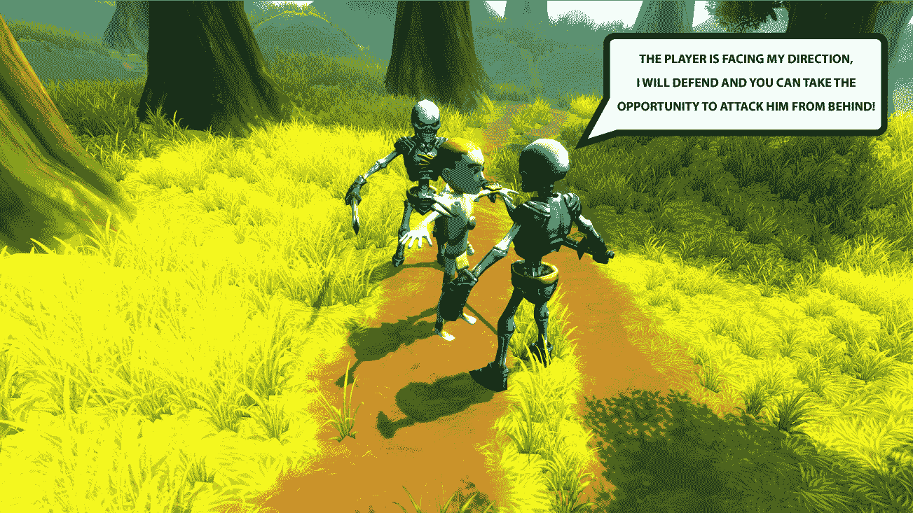

这在前面的截图中可以体现出来，其中一个骨骼角色告诉另一个角色它将进行防御，而另一个角色可以从背后攻击玩家。这正是群体互动的本质，一个角色向另一个角色提供关于它能做什么或应该如何表现的信息。角色之间共享的信息越多，他们能做的选择就越多，他们的互动看起来就越真实，因为他们不是在单独行动。

如我们所见，即使使用简单的代码，我们也能实现复杂的结果，但思考并提前规划一切是必要的，并且显然，每次我们添加更多细节和选项时，代码都会变得更长。

# 通信（注意区域）

继续以同样的例子为例，我们地图上有几个骨骼，如果玩家靠近他们，他们就会开始攻击玩家，我们可以添加一个额外的功能，使他们之间的交互更加紧密。另一个能让角色像一群人而不是游戏中的单个角色一样行动的因素是沟通。例如，这里我们有骨骼，只有当玩家靠近时才会攻击，但如果靠近玩家的一个骨骼大声呼喊他看到了玩家角色，会发生什么呢？我们可以假设该区域周围的所有 AI 角色都会听到呼喊，并开始朝那个方向奔跑，以帮助他们的朋友。

一次又一次，我们可以使用简单的代码行来实现这一点，但如果我们没有计划交互以及角色应该如何作为一个群体行动，这种类型的元素将缺失在 AI 角色中，它们将独立行动，这会使它们不够智能。

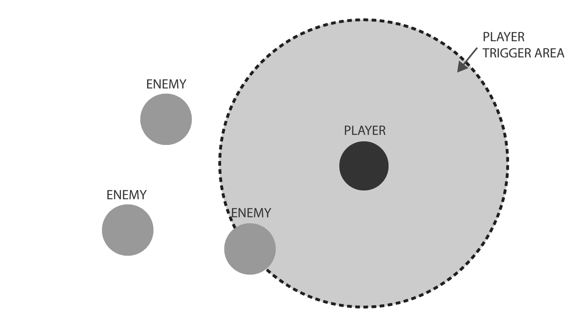

如我们所见，这是我们目前拥有的系统。AI 角色之间没有沟通，所以只有足够靠近玩家的骨骼才知道玩家的位置。如果我们试图创建一个群体系统，我们需要计划类似这种情况。仅仅因为其他人看不到玩家角色，并不意味着他们必须像什么都没发生一样反应。

让我们思考一个现实生活中的场景。例如，我们有一个人在房子里，另一个人在外面。外面的人看到了一只令人难以置信的美丽的鸟，而房子里的人却看不到，所以它将留在房子里。如果看到鸟的人不与另一个人沟通，房子里的人将永远不知道这件事。所以，通常会发生的情况是，看到鸟的人会叫另一个人出来，这样他也能看到这只美丽的鸟。这是可以在我们的群体交互系统中实现的一种现实行为。

要将这种非交互情况转变为更现实版本，我们需要给我们的角色添加一个额外的功能，使他们能够相互沟通。在这个阶段，我们只需要简单的沟通，我们可以使用与之前用来确定角色是否可以看到玩家相似的代码：


因此现在我们有一个 AI 角色进入了玩家的触发区域，因此他会大声喊叫，让附近的 AI 角色也意识到玩家的位置。在先前的图中，我们可以看到现在不仅玩家有一个触发区域，被玩家发现的敌人也有一个。这个新的触发区域将用于警告其他角色，它代表的是一声喊叫。所以当我们玩游戏时，如果敌人发现了我们，我们会听到一声喊叫，这会给 AI 角色之间的交流带来一种感觉：

```py
 public static int attackOrder;
 public bool nearPlayer;
 public bool nearEnemyAttacked;
 public float distancePlayer;
 public static int charactersAttacking;
 private bool Attack;
 private bool Defend;
 private bool runAway;
 private bool surpriseAttack;

 void Update () 
{

    if(distancePlayer < 30f)
    {
          nearPlayer = true;
    }

    if(distancePlayer > 30f)
    {
           nearPlayer = false;
    }

            if(nearPlayer == true && attackOrder == 1)
                 {
                     Attack = true;
                 }

             else 
                 {
                     Defend = true;
                 }

         if(nearEnemyAttacked == true)
         {
             runPlayerDirection();
         }
     }
```

要实现这一点，我们简单地添加了一个新的布尔值`nearEnemyAttacked`。与此相结合，我们添加了一个触发检测来检查是否有发现玩家的近处骨骼。如果触发，布尔值变为真；否则，它将保持为假。

一旦触发，该 AI 角色就需要呼叫周围的其他角色：

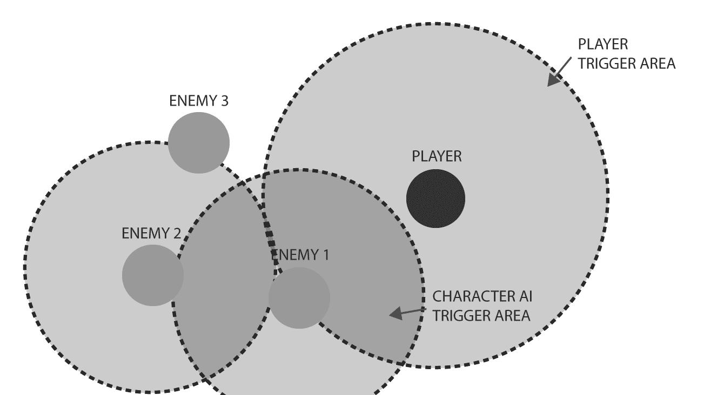

如前图所示，由于我们实施的交流系统，现在有三个角色完全清楚玩家的位置。最后一个角色也会喊叫，试图告诉其他人玩家的位置，但如果触发区域没有与 AI 角色重叠，则不会发生任何事情：

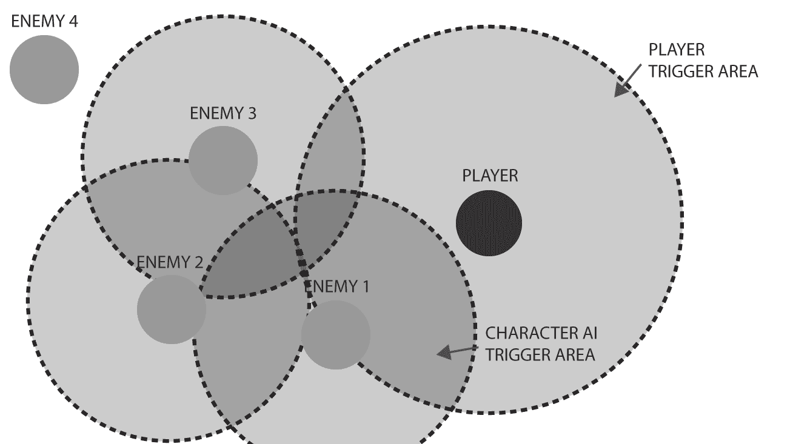

例如，敌人 4 离得太远，无法受到触发区域的影响，所以它会保持在那个位置，直到玩家接近他的位置；否则，他不会知道发生了什么。

这个例子中的技巧是让角色之间进行交谈，大声喊叫或试图引起附近角色的注意。这将使交流变得简单，将个体行为转化为更具吸引力的群体互动。

# 交流（与其他 AI 角色交谈）

在交流方面，可以展示的例子还有很多，因为总有可能找到新的方法在角色之间进行交流；就像在现实生活中，我们总是在寻找新的交流方式。但就目前而言，我们将坚持基本的交流形式，即谈话。

如果我们计划在游戏中拥有很多 AI 角色，这将会迅速占据游戏的大部分内容，玩家的焦点将直接或间接地集中到他们身上。可能我们不会创建的每个游戏都会有对玩家出现立即做出反应的角色，也许玩家在游戏中只是另一个角色，因此可能会被忽略。所以在这个部分，我们将排除玩家部分，并将专门规划 AI 角色的交互：

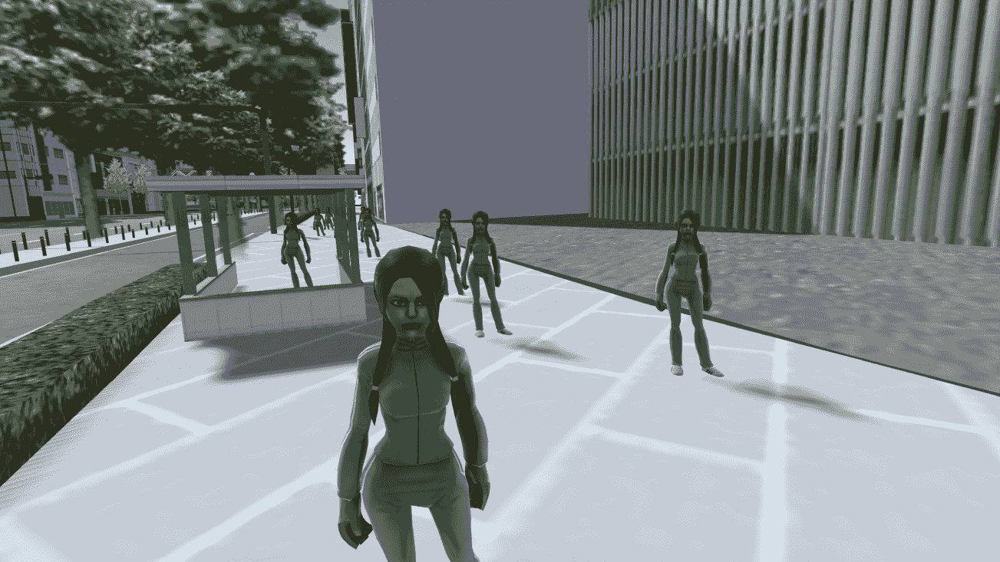

让我们创建一个拥有大量人群的城市，并为其中的一些人分配一些细节，使他们能够像真实的人群一样行动。我们可以从在我们的角色中添加基本的移动信息开始，比如行走、跑步、闲置和路径查找。在我们的角色中实现这一点后，我们就有一个可以在城市中四处走动、避免碰撞建筑并在人行道上行走的人物。

对于这个例子，我们首先的建议是添加一个简单的触发检测，使角色意识到当另一个角色经过附近时：


在为角色添加触发区域之后，我们可以进入下一步，并着手处理它们之间的交互。我们的计划是使用一个概率图来确定找到可以开始对话的已知人物的概率：

```py
If(probabilityFriendly > 13) 
{  
  // We have 87% of chance
  talkWith(); 
}   
```

为了使这个系统能够工作，我们添加了一个整数函数，在这个例子中我们称之为`probabilityFriendly`。这指的是找到友好人物的概率。当一个新角色进入触发区域时，计算将随机进行，如果数字符合我们的百分比，两个角色将停止四处走动并开始交谈。之后，我们可以继续添加更多细节到这个场景中，比如当他们的对话结束时，我们可以让他们边走边聊，还有无数其他可能从这个小的触发检测和概率图中派生出来的选项。

这个想法的背后的目的是拥有可以相互随机交互的角色。从玩家的角度来看，这看起来就像角色们是朋友，他们只是因为彼此认识而停下来聊天。这有助于创造一个逼真的氛围，这更多是关于规划角色之间所有可能的交互，而不是技术点。

# 团队运动

正如我们之前在解释一些流行的游戏中的群体交互系统时所见，体育游戏有一个高度发展的 AI 系统，在团队运动中特别有效。现在我们将深入探讨一些团队体育视频游戏的核心功能，看看它们是如何取得一些有趣的结果，使得这些游戏的 AI 角色既具有挑战性又逼真。

如果我们分析现实生活中的足球运动，我们会看到有两个队伍，每个队伍由十一个单独的球员组成。为了赢得比赛，球队需要比对手进更多的球，因此比赛可以分为两种基本形式：进攻，重点是进球；防守，重点是避免失球。比赛中只有一个球，所以球员的大部分时间都是在没有球权的情况下度过的，而这段时间对比赛的结果可能非常重要。球员要么试图从对手那里抢球，要么找到一个好的位置来接球。这就是当球员没有球权时的两种基本形式。

电子游戏试图模仿体育的每一个细节，由于它是一项团队运动，因此在人工智能群体交互的开发上投入了大量的工作。人工智能角色的心态需要更多地关注团队合作，而不是简单的个人表现。因此，他们只会做出某些决定，如果这些决定符合团队目标的话。

如果我们观看一场足球比赛，我们可以听到球员之间互相交谈，传递球，向前移动，向后移动等等。想法是在电子游戏中也有这种类型的交流。这并不一定需要是口头交流，而是关于使游戏更加逼真的动作。

让我们逐步分析角色在游戏中做出的基本人工智能决策。我们将从查看角色在场地的组织结构开始，如下面的图表所示：

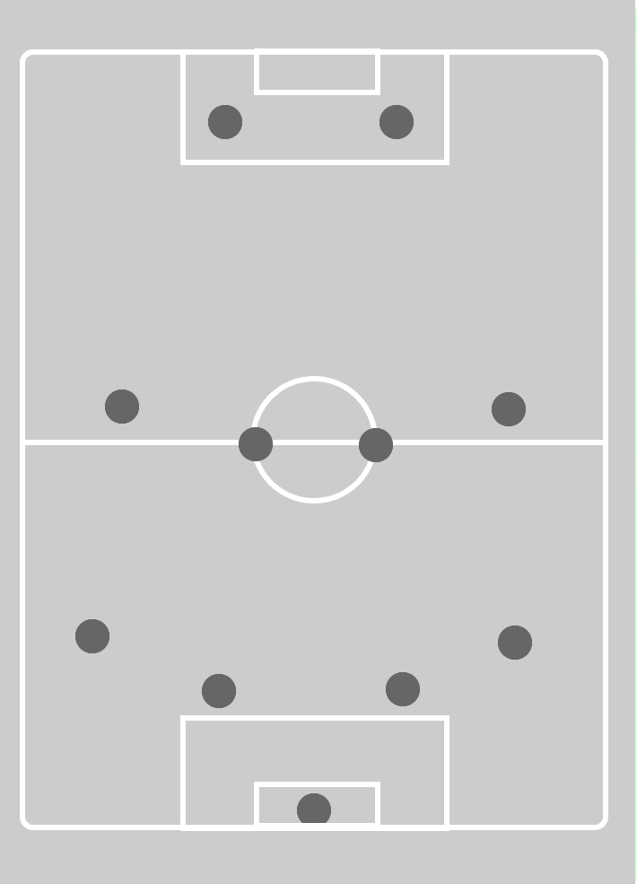

这是在场地上足球队简单阵型的例子之一。在底部，我们可以看到一个圆圈，它代表守门员，负责防守球门。这个角色是唯一一个始终围绕这个区域的人；其他人如果愿意的话可以自由移动。现在我们已经有了足球队在场地上分布的视觉表示，我们可以继续这个例子。

游戏中的每个角色都有一个个人目标。这可能包括将球传给进攻球员，尽可能多地射门以尝试进球，简单地留在后面防守等等。虽然他们有这些个人目标，但他们也需要考虑团队目标，并决定在某个时刻哪个目标更重要，以及他们所做的决定是否有助于成功实现目标。

让我们继续创建单个球员。我们从基础开始，跟随球跑。为了创建这个，我们可以使用书中之前解释过的技术，例如走向一个物体的位置：

```py
  public float speed;
  public Transform ball;
  public bool hasBall;

  void Start ()
 {
     speed = 1f;
  }

  void Update ()
 {

     if(hasBall == false)
     {
        Vector3 positionA = this.transform.position;
        Vector3 positionB = ball.transform.position;
        this.transform.position = Vector3.Lerp(positionA, positionB, 
          Time.deltaTime * speed);
     }

     if(hasBall == true)
     {

     }
 } 
```

在这里，我们有使角色追球的代码。在这个时候，我们将只处理一个角色，然后我们将逐步添加团队互动，以便至少有一个基本的我们可以在完全开发的游戏中看到的形式。所以如果我们只使用这段代码玩游戏，我们可以看到角色会朝向球的位置移动，这就是足球游戏的基本原则，即达到球：

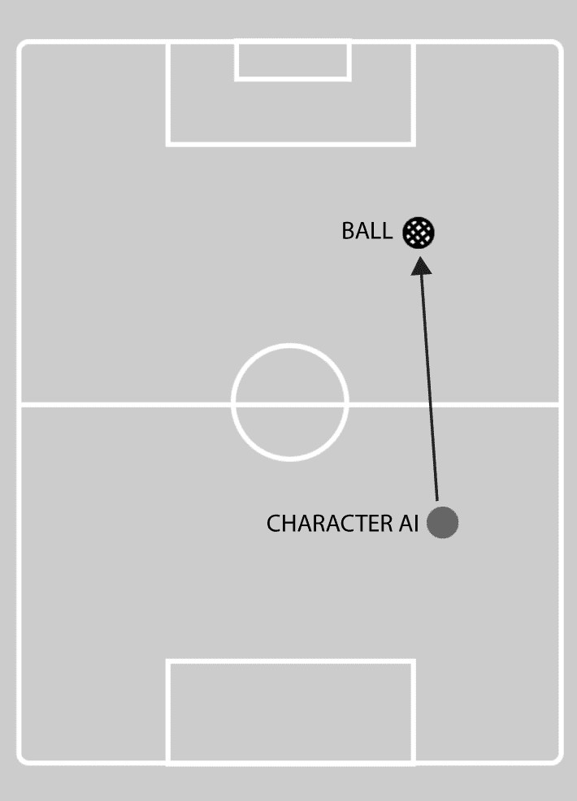

目前，我们有一个单独的玩家正在正常工作，这是我们目前所期望的。如果我们向游戏中添加更多角色，他们都会朝向球移动，忽略其他一切，所以在游戏中不会发生任何沟通或互动：

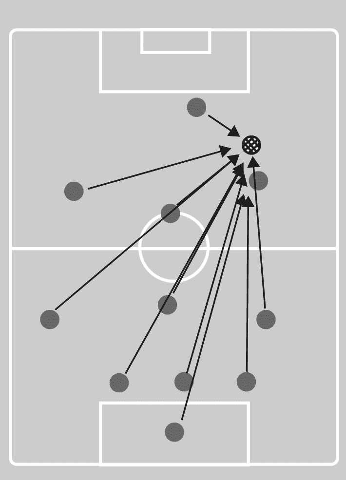

如果游戏中的所有角色都朝向球的位置移动，就像我们在前面的图中看到的那样，那么这些角色就好像没有意识到周围的其他角色一样。为了避免这种情况，我们可以让离球最近的角色将这一信息传达给其他角色，这样他们就不需要为球而奔跑了。为了实现这一点，我们可以在每个角色与球之间的距离上进行一个恒定的计算：

```py
 public float speed;
 public Transform ball;
 public bool hasBall;
 public float ballDistance;

 void Start () 
 {
     speed = 1f;
 }

  void Update () 
{

      if(hasBall == false)
      {
          Vector3 positionA = this.transform.position;
          Vector3 positionB = ball.transform.position;
          this.transform.position = Vector3.Lerp(positionA, 
             positionB, Time.deltaTime * speed);
      }

      if(hasBall == true)
      {

      }

      ballDistance =Vector3.Distance(transform.position,ball.position); 

} 
```

为了实现这一点，我们使用了在书中之前探索过的距离计算方法。因此，现在代码中有三个新的变量，`ballDistance`是一个浮点数，它将测量角色与球之间的距离。

现在我们有了这个设定，我们需要让角色验证自己是否是所有人中最接近球的人，如果是的话，他就可以继续前进并朝向球的位置奔跑：

```py
  public float speed;
  public Transform ball;
  public bool hasBall;
  public float ballDistance;
  public static float teamDistance;

  void Start () 
  {
     speed = 1f;
  }

  void Update () 
 {

     if(hasBall == false)
     {
         Vector3 positionA = this.transform.position;
         Vector3 positionB = ball.transform.position;
         this.transform.position = Vector3.Lerp(positionA, positionB, 
            Time.deltaTime * speed);
     }

     if(hasBall == true)
     {

     }

     ballDistance =Vector3.Distance(transform.position,ball.position); 

     if(teamDistance < ballDistance)
     {
          teamDistance = ballDistance;
     }

 } 
```

对于这个例子，我们决定简单地添加一个变量，这个变量将被所有角色共享，所以我们添加了一个静态浮点变量，称为`teamDistance`。这个变量将存储离球最近的角色的值。在这个时候，角色将知道他们是否是离球最近的人。从这个点开始，简单地移动到下一步，让角色检查自己是否是最接近球的人，如果是的话，它就可以朝向球的位置奔跑。这将是我们将添加到我们的 AI 角色中的第一个团队元素。他们将与其他角色核对，看看哪个角色应该得到球，正如我们计划的那样，离球最近的角色更有意义，但我们可以进一步分解，让他们检查哪个角色会先到达球。然而，对于这个例子，我们将坚持所有角色以相同速度移动的原则：

```py
   public float speed;
   public Transform ball;
   public bool hasBall;
   public float ballDistance;
   public static float teamDistance;
   public bool nearTheBall;

   public float teamdist;

   void Start () 
   {
        speed = 0.1f;
        teamDistance = 10;
   }

   void Update () 
  {
      teamdist = teamDistance;

      if(hasBall == false && nearTheBall == true)
      {
          Vector3 positionA = this.transform.position;
          Vector3 positionB = ball.transform.position;
          this.transform.position = Vector3.Lerp(positionA, positionB, 
             Time.deltaTime * speed);
      }

      if(hasBall == true)
      {

      }

      ballDistance =Vector3.Distance(transform.position,ball.position);

      if(teamDistance > ballDistance)
      {
          teamDistance = ballDistance;
      }

      if(teamDistance == ballDistance)
      {
          nearTheBall = true;
      }

      if(teamDistance < ballDistance)
      {
         nearTheBall = false;    
      }

 } 
```

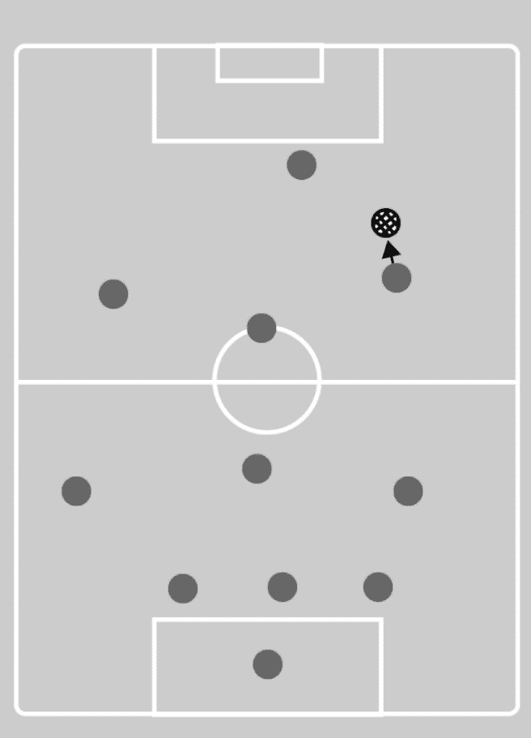

如此一来，我们可以看到只有一名角色在追球。其他所有角色都有一种感觉，即他们的某个队友离球更近，所以那个队友会得到球。在这个时刻，我们已经有了一种简单的群体互动形式，并且我们正在正确的道路上。

我们接下来需要处理的问题是球将在整个游戏中移动，而我们的代码是在静态场景中工作的，但如果球被移动，团队距离检查应该重置。原因是当角色 AI 靠近球时，这个值会降低，而这个值永远不会增加，所以我们需要更新它。我们首先为球创建一个新的脚本：

```py
  public Vector2 curPos;
  public Vector2 lastPos;

  public bool ballMoving;

  void Update () 
 {

     curPos = transform.position;

     if(curPos == lastPos)
     {
          ballMoving = false;
     }

     else
     {
          ballMoving = true;
          characterAI.teamDistance = 10;
     }

     lastPos = curPos;
 } 
```

将这个脚本添加到球上后，每当球被移动时，球员的距离检查都会更新。现在让我们确保球可以移动。为了实现这一点，我们需要允许角色踢球。

首先，我们将更新我们刚刚创建的球脚本。我们想要添加一个变量来存储角色射击后球将落下的位置：

```py
   public Vector2 curPos;
   public Vector2 lastPos;
   public static Transform characterPos;
   public float speed;

   public bool ballMoving;

   void Start () 
   {

      characterPos = this.transform;
      speed = 2f;
   }

   void Update () 
   {

       curPos = transform.position;

       if(curPos == lastPos)
       {
           ballMoving = false;
       }

       else
       {
           ballMoving = true;
           characterAI.teamDistance = 10;
       }

       lastPos = curPos;

       Vector2 positionA = this.transform.position;
       Vector2 positionB = characterPos.transform.position;
       this.transform.position = Vector2.Lerp(positionA, positionB, 
          Time.deltaTime * speed);
 } 
```

因此，我们在这里提供的是关于球落点位置的信息。为了实现这一点，我们添加了一个名为`characterPos`的`public static Transform`变量。我们选择在这里使用角色位置进行测试，因为我们希望角色传球而不是简单地踢球：

```py
 public float speed;
 public Transform ball;
 public bool hasBall;
 public float ballDistance;
 public static float teamDistance;
 public bool nearTheBall;
 public List<Transform> teamCharacters;
 public int randomChoice;
 public float teamdist;  
```

然后我们更新了角色 AI 脚本的变量。在这里，我们有一个列表，将包含所有球员的坐标。想法是让角色选择一个友好的队友传球并朝那个方向射击。

因此，在这个例子中，我们选择使用角色的坐标作为球的航点。为了使这个特性更加逼真，我们可以添加更多关于球轨迹的细节，比如球受到重力或风的影响：

```py
void Update () 
{
     teamdist = teamDistance;

     if(hasBall == false && nearTheBall == true)
     {
         Vector3 positionA = this.transform.position;
         Vector3 positionB = ball.transform.position;
         this.transform.position = Vector3.Lerp(positionA, positionB, 
            Time.deltaTime * speed);
     }

     if(ballDistance < 0.1)
     {
         hasBall = true;
     }

     if(hasBall == true)
     {
          passBall();
          hasBall = false;
     }

     ballDistance =Vector3.Distance(transform.position,ball.position);

     if(teamDistance > ballDistance)
     {
         teamDistance = ballDistance;
     }

     if(teamDistance == ballDistance)
     {
         nearTheBall = true;
     }

     if(teamDistance < ballDistance)
     {
          nearTheBall = false;    
     }

}

void passBall ()
{
      randomChoice = Random.Range(0, 9);
      ballScript.characterPos = teamCharacters[randomChoice];
} 
```

然后，我们使用刚刚添加到代码中的变量，在角色 AI 足够接近球时将新的方向发送给球。`void passBall()`是我们创建的函数，每次角色想要传球时都会调用它。在这个时候，我们只想让角色互相传球，所以我们给列表中的角色分配了一个随机数来选择一个角色。

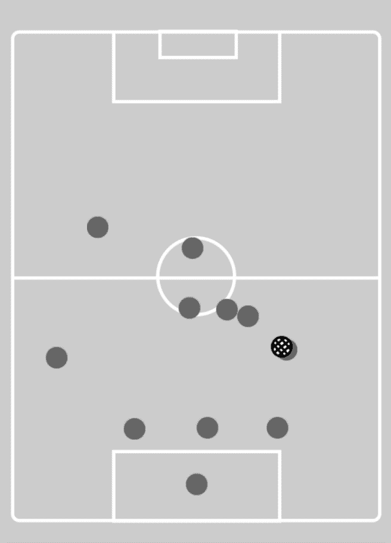

如果我们测试游戏，我们可以看到有更多的移动和交互正在进行。所以我们可以看到的是，最近的角色会靠近球，当这种情况发生时，他会将球传给另一个角色。球会朝向角色移动，角色会靠近球，以便他将球传给另一个角色。目前，这将在循环中无限发生，一个角色得到球，传球，另一个角色得到球并传球，如此循环。

现在我们有了简单足球游戏的基础，我们可以简单地继续添加更多像我们刚刚创建的功能，使它们能够沟通，看看谁将得到球并将球传给队友。

# 群体碰撞避免

为了完成这一章，我们将讨论人群避碰。在同一个地图上有许多角色的想法正在成为开放世界游戏的标准。但这也常常带来一个问题，即避碰：

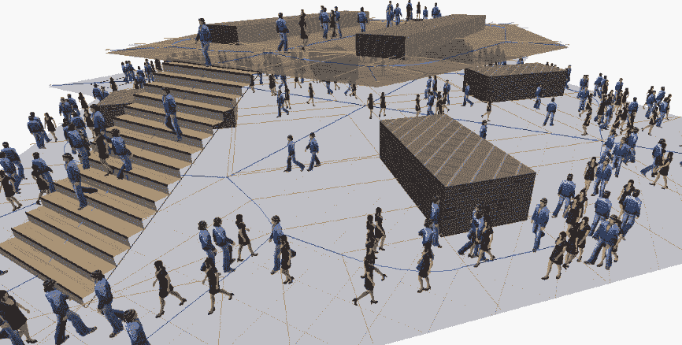

我们已经发现了路径查找是如何工作的，我们知道这是一个在开发人工智能移动时非常强大的系统。但是，如果我们有很多角色同时试图到达同一个位置，它们可能会相互碰撞，并且可能会阻塞通往那个目的地的必经之路。正如我们在前面的截图中所看到的，一切都在顺利运行，没有任何异常情况，因为角色们正在遵循不同的方向，很少会相互干扰。

但是，如果所有角色都试图同时访问同一个位置，比如试图进入房子，那么一次只能有一个角色通过门，这意味着许多其他角色将排队等待进入。

对于这个问题，解决方案仍在探索中，还没有一个确定的答案，但有一些方法可以绕过这个问题。

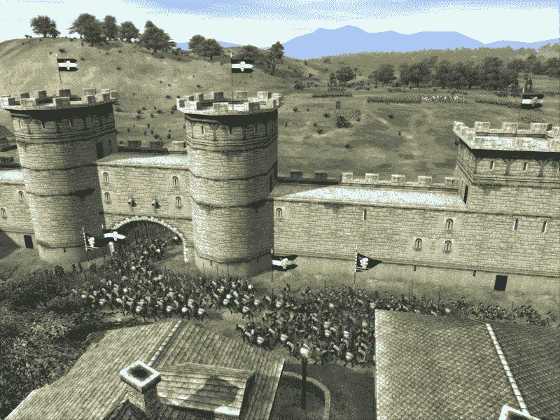

目前，人群动态解决方案通常涉及两个不同的层次，一个用于路径查找，另一个用于局部避碰。使用这种方法，我们有几个好处，它将产生高质量的移动，并且它将在小范围内进行避碰，这是在多个游戏中非常常见的方法。

有不同的方法可以达到这个目的并获得令人满意的结果。许多游戏的一个流行选择是将 Theta 算法 A*与速度障碍结合使用。这使我们能够计算我们的角色与其他将要与我们碰撞的角色之间的距离。

在高密度人群情况下，仅仅依靠局部避碰和理想化的路径查找会导致代理在流行的、共享的路径航点上堆积。避碰算法仅有助于在追求理想路径的过程中避免局部碰撞。通常，游戏依赖于这些算法在高密度情况下将代理引导到不太拥挤、不太直接的路线。在某些情况下，避碰可以导致这种期望的行为，尽管这始终是系统的一个副作用，而不是一个有意的考虑。

已经有人研究了将聚合人群移动和人群密度整合到路径查找计算中的方法。通过人群密度增强路径的方法没有考虑到人群的整体移动或移动方向，这会导致对这种现象的过度纠正，这在以下图像中可以观察到：

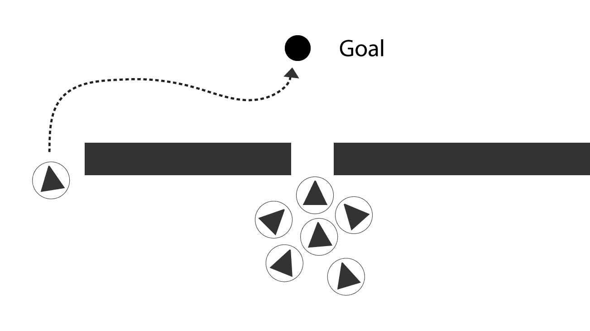

拥挤地图在很多方面与现有的合作路径查找算法类似，例如方向图（DMs），但在一些关键方面有所不同。DMs 使用随时间变化的平均群体运动来鼓励代理与群体一起移动。正因为如此，拥挤地图方法中存在的许多振荡都得到了平滑解决。相反，这种时间平滑阻止了 DMs 快速准确地对外界环境和群体行为的变化做出反应。拥挤地图和 DMs 都以类似的方式将群体移动信息汇总应用于路径规划过程；然而，拥挤地图处理不同大小和形状的代理，而 DMs 传统上假设同质性。

DMs 和拥挤地图之间最后的重大区别在于，拥挤地图根据群体的密度来权衡移动惩罚。如果不考虑密度，DMs 会表现出过于悲观的路径查找行为，鼓励代理绕过稀疏的代理群体来避开理想路径。

# 摘要

在本章中，我们探讨了在流行视频游戏中使用的流行群体交互系统的几个示例，并看到了为什么计划我们所能想到的每一个交互是多么重要，因为这正是将几行简单的代码变成看起来逼真的游戏的关键。为了结束本章，我们回顾了高级路径查找系统，并看到了游戏中的多个角色如何可以共享同一个最终目的地，采取替代路径以避免碰撞，并在其他角色前进时排队等待。

在下一章中，我们将探讨人工智能规划和决策。我们将看到人工智能如何能够预测事物，提前知道它在到达某个位置或面对某个问题时将做什么。
