# 第九章：AI 规划和避障

在本章中，我们将介绍一些有助于提高 AI 角色复杂性的主题。本章的目的是赋予角色规划和决策的能力。我们已经在之前的章节中探索了一些实现这一目标所需的技术知识，现在我们将详细探讨创建一个能够提前规划决策的 AI 角色的过程。

# 搜索

我们将从视频游戏中的搜索开始讨论。搜索可能是我们的角色做出的第一个决策，因为在大多数情况下，我们希望角色去寻找某物，无论是寻找玩家还是其他能引导角色走向胜利的东西。

让我们的角色能够成功找到某物非常有用，并且可能非常重要。这是一个可以在大量视频游戏中找到的功能，因此我们很可能也需要使用它。

正如我们在之前的例子中所看到的，大多数情况下，我们有一个在地图上四处走动的玩家，当他们遇到敌人时，那个敌人会从闲置状态变为攻击状态。现在，我们希望敌人能够主动出击，不断寻找玩家而不是等待他。在我们的脑海中，我们可以开始思考敌人开始寻找玩家的过程。我们脑海中已有的这个过程需要被规划，而这个计划需要存储在 AI 角色的脑海中。基本上，我们希望 AI 的思考过程与我们的思考过程相同，因为这样看起来更真实，这正是我们想要的。

有时，我们可能希望搜索成为次要任务，此时角色的主要优先事项是其他事情。这在实时策略游戏中非常常见，AI 角色开始探索地图，并在某个时刻发现敌人的基地。搜索并不是他们的首要任务，但即便如此，它仍然是游戏的一部分——探索地图和获取对手的位置。在发现玩家的位置后，AI 角色可以决定是否将探索更多区域作为优先事项，以及他们的下一步行动。

此外，我们还可以为狩猎游戏创建逼真的动物，例如，动物的主要目标是进食和饮水，因此它们必须不断寻找食物或水源，如果它们不再饥饿或口渴，它们可以寻找一个温暖的地方休息。然而，与此同时，如果动物发现捕食者，它们的优先级会立即改变，动物将开始寻找一个安全的地方休息。

许多决策都可能取决于搜索系统，这是一个模仿现实生活中人类或动物行为的特征。我们将介绍视频游戏中最常见的搜索类型，目标是使 AI 角色能够搜索并成功找到任何东西。

# 攻击性搜索

我们将要创建的第一种搜索类型是攻击性搜索。通过攻击性搜索，我们指的是这是设置为 AI 角色的主要目标。想法是游戏中的角色由于某种原因需要找到玩家，类似于捉迷藏游戏，其中一名玩家需要藏起来，而另一名玩家需要找到他们。

我们有一个角色可以自由走动的地图，只需考虑他们必须避免的碰撞（树木、山丘和岩石）：

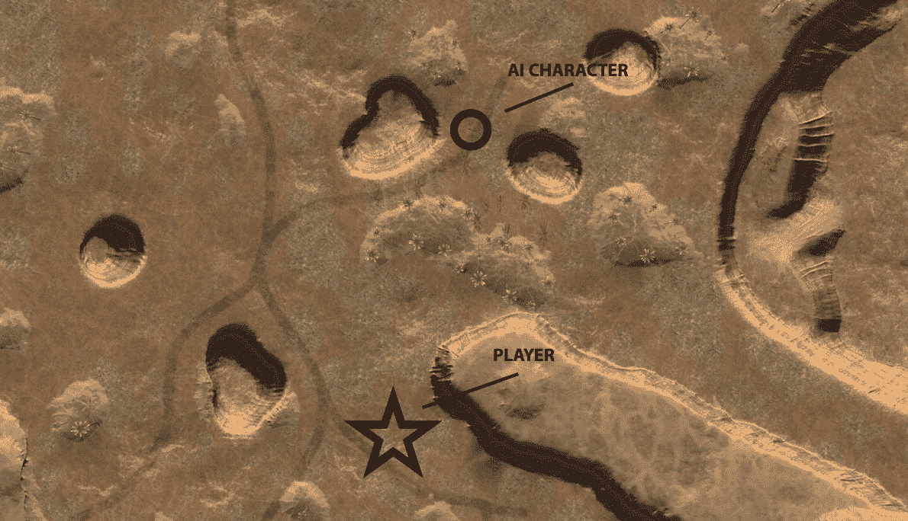

因此，第一步是创建一个系统，让角色可以在地图上四处走动。在这个例子中，我们选择创建一个`waypoint`系统，角色可以从一个点到另一个点移动并探索整个地图。

在导入游戏中所使用的地图和角色之后，我们需要配置角色将使用的`waypoint`，以便知道他们需要去哪里。我们可以手动将坐标添加到我们的代码中，但为了简化过程，我们将在场景中创建作为`waypoint`的对象，并删除 3D 网格，因为它将不再必要。

现在，我们将我们创建的所有`waypoint`分组，并将该组命名为**waypoints**。一旦我们将`waypoint`放置并分组，我们就可以开始创建代码，告诉我们的角色他们需要遵循多少个`waypoint`。这段代码非常有用，因为这样我们可以创建不同的地图，使用我们需要的任意数量的`waypoint`，而不必更新角色代码：

```py
public static Transform[] points;

     void Awake () 
     {
         points = new Transform[transform.childCount];
         for (int i = 0; i < points.Length; i++)
         {
             points[i] = transform.GetChild(i); 
         }
     } 
```

这段代码将被分配到我们创建的组中，并计算组内包含的`waypoint`数量并对它们进行排序。

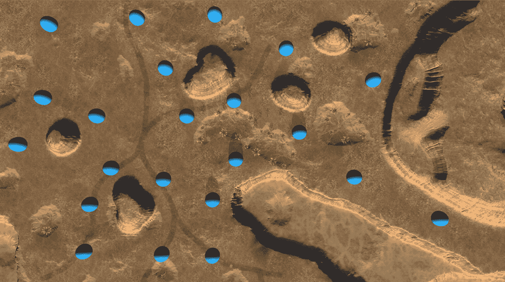

我们在前面的图像中可以看到的蓝色球体代表我们用作`waypoint`的 3D 网格。在这个例子中，角色将跟随八个点直到完成路径。现在，让我们继续到 AI 角色代码，看看我们如何使用我们创建的点让 AI 角色从一点移动到另一点。

我们将首先创建角色的基本功能——健康和速度——然后我们将创建一个新的变量，它将给出他们的下一个位置，另一个变量将用于知道他们需要遵循哪个`waypoint`：

```py
 public float speed;
 public int health;

 private Transform target;
 private int wavepointIndex = 0; 
```

现在，我们有了制作敌人角色从一点移动到另一点直到找到玩家的基本变量。让我们看看如何使用这些变量来使其现在可玩：

```py
 private float speed;
 public int health;

 private Transform target;
 private int wavepointIndex = 0;

 void Start ()
 {
      target = waypoints.points[0];  speed = 10f;
 }

 void Update ()
 {
      Vector3 dir = target.position - transform.position;
      transform.Translate(dir.normalized * speed * Time.deltaTime, Space.World);

      if(Vector3.Distance(transform.position, target.position) <= 0.4f)
      {
          GetNextWaypoint();
      }
 }

 void GetNextWaypoint()
 {
      if(wavepointIndex >= waypoints.points.Length - 1)
      {
          Destroy(gameObject);
          return;
      }

      wavepointIndex++;
      target = waypoints.points[wavepointIndex];
 } 
```

在`Start`函数中，我们分配了角色需要遵循的第一个`waypoint`，即`waypoint`编号零，也就是我们在`waypoint`代码中之前创建的变换列表中的第一个。此外，我们还确定了角色的速度，在这个例子中，我们选择了`10f`。

然后，在`Update`函数中，角色将计算下一个位置与当前位置之间的距离，使用`Vector3 dir`。角色将不断移动，因此我们创建了一行代码，作为角色移动的代码`transform.Translate`。知道距离和速度信息后，角色将知道他们距离下一个位置有多远，一旦他们到达从该点期望的距离，他们就可以移动到下一个点。为了实现这一点，我们将创建一个`if`语句，告诉角色当他们接近他们正在移动进入的点`0.4f`（在这个例子中）时，这意味着他们已经到达了那个目的地，并且可以开始移动到下一个点`GetNextWaypoint()`。

在`GetNextWaypoint()`函数中，角色将开始确认他们是否已经到达了最终目的地；如果是，则可以销毁该物体，如果不是，则可以跟随下一个航标点。每次角色到达航标位置时，`wavepointIndex++`将向索引添加一个数字，从而从*`0>1>2>3>4>5`* 等等继续。

现在，我们将代码分配给我们的角色，并将角色放置在起始位置，测试游戏以检查它是否正常工作：

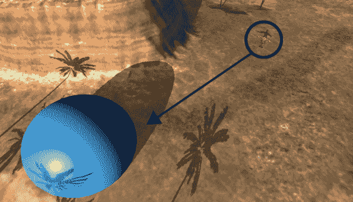

现在，角色从一个点到另一个点移动，这是开发搜索系统的第一步和必要步骤——角色需要在地图上移动。现在，我们只需要让它转向他们面对的方向，然后我们就可以开始关注搜索功能了：

```py
 public float speed;
 public int health;
 public float speedTurn;

 private Transform target;
 private int wavepointIndex = 0;

 void Start ()
 {
      target = waypoints.points[0];
      speed = 10f;
      speedTurn = 0.2f;
 }

 void Update ()
 {
      Vector3 dir = target.position - transform.position;
      transform.Translate(dir.normalized * speed * Time.deltaTime, Space.World);

      if(Vector3.Distance(transform.position, target.position) <= 0.4f)
      {
          GetNextWaypoint();
      }

      Vector3 newDir = Vector3.RotateTowards(transform.forward, dir, speedTurn,
      0.0F);

      transform.rotation = Quaternion.LookRotation(newDir);
 }

 void GetNextWaypoint()
 {
      if(wavepointIndex >= waypoints.points.Length - 1)
      {
          Destroy(gameObject);
          return;
      }

      wavepointIndex++;
      target = waypoints.points[wavepointIndex];
 } 
```

现在，角色面向他们移动的方向，我们准备添加搜索系统。

因此，我们有一个在地图上从一点走到另一点的角色，在这个时候，即使他们找到了玩家，他们也不会停止行走，什么也不会发生。所以，这就是我们现在要做的。

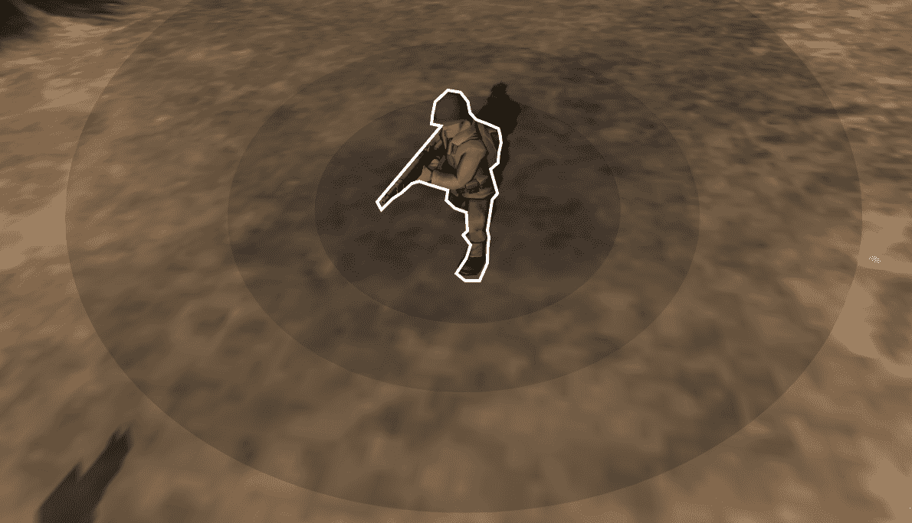

我们选择添加一个触发区域来实现预期结果，这个触发区域是以角色为中心的圆形，正如我们在前面的截图中所看到的。角色将在地图上行走，当触发区域检测到玩家时，角色就找到了主要目标。让我们将这个功能添加到我们的角色代码中：

```py
     public float speed;
     public int health;
     public float speedTurn;
     private Transform target;
     private int wavepointIndex = 0;
     private bool Found;

     void Start ()
     {
         target = waypoints.points[0];
         speed = 10f;
         speedTurn = 0.2f;
     }

     void Update ()
     {
         Vector3 dir = target.position - transform.position;
         transform.Translate(dir.normalized * speed * Time.deltaTime,
         Space.World);

         if(Vector3.Distance(transform.position, target.position) <= 0.4f)
         {
             GetNextWaypoint();
         }

         Vector3 newDir = Vector3.RotateTowards(transform.forward, dir,
         speedTurn, 0.0F);

         transform.rotation = Quaternion.LookRotation(newDir);
     }

     void GetNextWaypoint()
     {
         if(wavepointIndex >= waypoints.points.Length - 1)
         {
             Destroy(gameObject);
             return;
         }

         wavepointIndex++;
         target = waypoints.points[wavepointIndex];
     }

     void OnTriggerEnter(Collider other)
     {
         if(other.gameObject.tag =="Player")
         {
             Found = true;
         }
     } 
```

因此，我们现在添加了一个`void OnTriggerEnter`函数，用于验证触发区域是否与其他物体接触。为了检查进入触发区域的物体是否是玩家，我们有一个 if 语句，它会检查游戏中的物体是否有`Player`标签。如果是这样，布尔变量`Found`会被设置为 true。这个布尔变量在接下来会非常有用。

让我们测试一下游戏，看看角色是否能够穿过玩家，并且在这个时候变量`Found`是否从 false 变为 true：

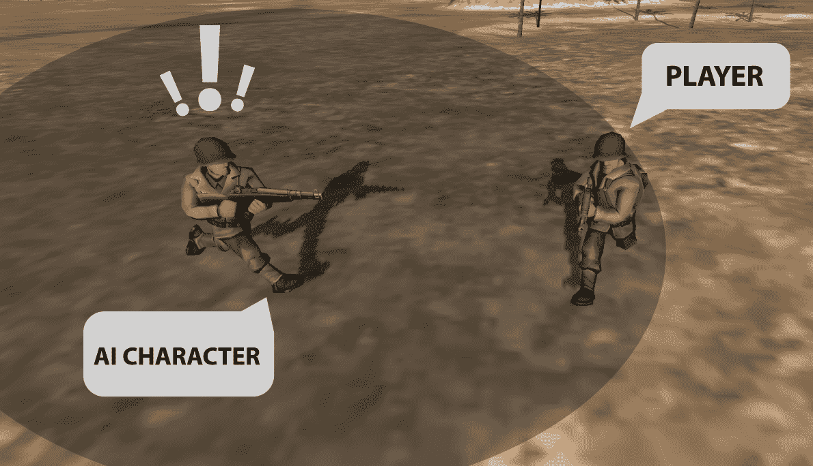

我们刚刚实现的搜索系统效果很好；角色将在地图上四处走动寻找玩家，并且可以毫无问题地找到玩家。下一步是告诉角色，当他们已经找到玩家时，停止搜索。

```py
     public float speed;
     public int health;
     public float speedTurn;
     private Transform target;
     private int wavepointIndex = 0;
     public bool Found;

     void Start ()
     {
         target = waypoints.points[0];
         speed = 40f;
         speedTurn = 0.2f;
     }

     void Update ()
     {
         if (Found == false)
         {
             Vector3 dir = target.position - transform.position;
             transform.Translate(dir.normalized * speed *
             Time.deltaTime,
             Space.World);

             if (Vector3.Distance(transform.position, target.position)
             <= 0.4f)
             {
                 GetNextWaypoint();
             }

             Vector3 newDir = Vector3.RotateTowards(transform.forward,
             dir,
             speedTurn, 0.0F);

             transform.rotation = Quaternion.LookRotation(newDir);
         }
     }

     void GetNextWaypoint()
     {
         if(wavepointIndex >= waypoints.points.Length - 1)
         {
             Destroy(gameObject);
             return;
         }

         wavepointIndex++;
         target = waypoints.points[wavepointIndex];
     }

     void OnTriggerEnter(Collider other)
     {
         if(other.gameObject.tag == "Player")
         {
             Found = true;
         }
     } 
```

经过这些最后的修改，我们得到了一个 AI 角色，它在地图上四处走动，直到找到玩家。当他们最终找到玩家时，他们停止四处走动，并准备计划下一步的行动。

我们在这里所做的是使用`Found`布尔值来确定玩家是否应该搜索玩家。

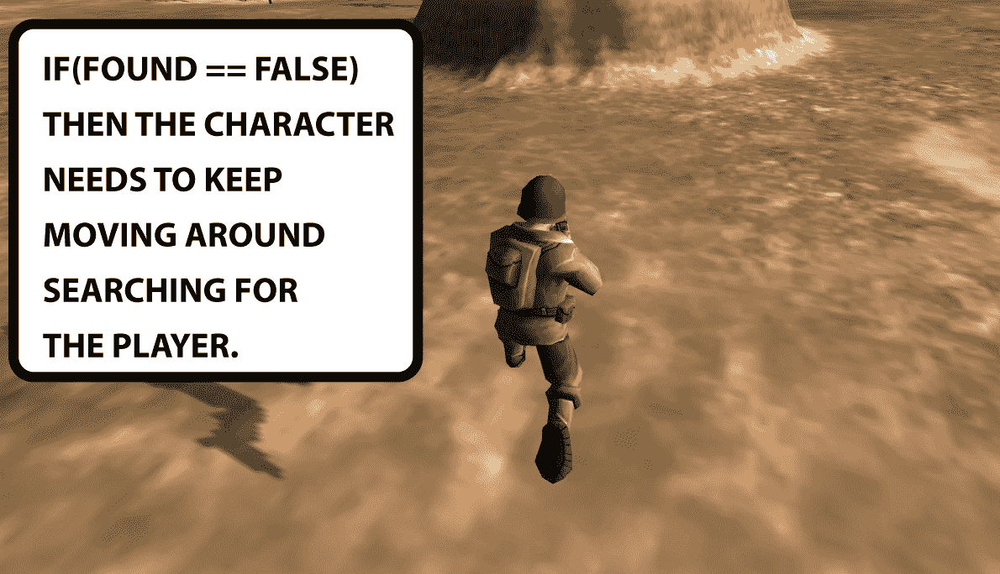

前面的图像代表了我们的角色当前的状态，我们准备在它上面实现更多功能，使其能够计划和做出最佳决策。

这个搜索系统可以应用于许多不同的游戏类型，并且我们可以相当快速地设置它，这使得它成为规划 AI 角色的完美方式。现在，让我们继续工作，并着手实现玩家角色的预期功能。

# 预测对手行动

现在，让我们让角色在对抗玩家之前就预期将要发生的事情。这是角色 AI 开始计划实现目标的最佳选项的部分。

让我们看看如何将预期系统集成到角色 AI 中。我们将继续使用前面提到的例子，其中有一个士兵在地图上寻找另一个士兵。目前，我们有一个在地图上移动并在找到玩家时停止的角色。

如果我们的角色 AI 找到了玩家，最可能的情况是玩家也会找到角色 AI，这样两个角色都会意识到对方的存在。玩家攻击角色 AI 的可能性有多大？玩家是否有足够的子弹射击角色？所有这些都是非常主观的和不可预测的。然而，我们希望我们的角色能够考虑到这一点，并预期玩家的可能行动。

因此，让我们从一个简单的问题开始：玩家是否面对着角色？让角色检查这一点将帮助他们判断可能的后果。为了达到这个结果，我们将在角色的后面添加一个触发器`Collider`，并在每个游戏角色的前面也添加一个，包括玩家，正如我们在下面的截图中所看到的：

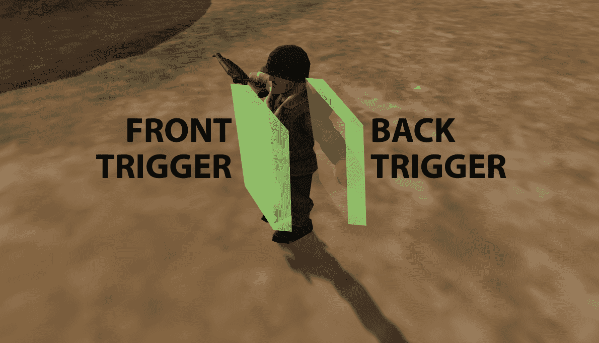

在每个角色上放置两个额外的`Collider`的目的是帮助其他角色识别他们是否在查看角色的背面或正面。因此，让我们将这个功能添加到游戏中的每个角色，并将触发器`Collider`命名为`back`和`front`。

现在，让我们让角色区分背面和正面触发器。这可以通过两种不同的方式实现——第一种方式是在角色前方添加一个拉伸的触发器碰撞器，代表观察范围：

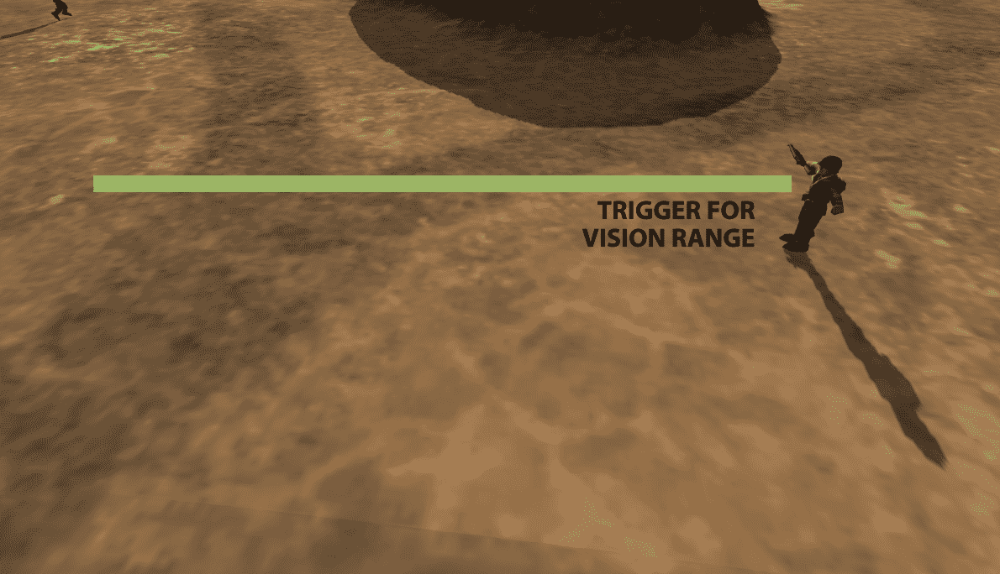

或者，我们可以从角色的位置创建一个射线投射，直到我们认为可能是角色视野范围的距离，如下面的截图所示：


这两种方法都有其优缺点，而且我们并不一定需要不断使用最复杂的方法来取得好结果。所以，这里的建议是使用我们更熟悉的方法，而对于这个例子来说，使用触发器`Collider`来代表角色的视野范围是一个不错的选择。

让我们在角色前方添加触发器`Collider`，然后我们可以开始编写代码，使其检测角色的正面或背面。我们需要在代码中做的第一件事是在他们看到玩家时让角色面向玩家的方向。如果他们没有看着玩家，角色将无法预测任何事情，所以让我们先解决这个问题：

```py
void Update ()
     {
         if (Found == false)
         {
             Vector3 dir = target.position - transform.position;
             transform.Translate(dir.normalized * speed *
             Time.deltaTime,
             Space.World);

             if (Vector3.Distance(transform.position, target.position)
             <= 0.4f)
             {
                 GetNextWaypoint();
             }

             Vector3 newDir = Vector3.RotateTowards(transform.forward,
             dir,
             speedTurn, 0.0F);

             transform.rotation = Quaternion.LookRotation(newDir);
         }

         if (Found == true)
         {
             transform.LookAt(target);
         }
     }

     void GetNextWaypoint()
     {
         if(wavepointIndex >= waypoints.points.Length - 1)
         {
             Destroy(gameObject);
             return;
         }

         wavepointIndex++;
         target = waypoints.points[wavepointIndex];
     }

     void OnTriggerEnter(Collider other)
     {
         if(other.gameObject.tag == "Player")
         {
             Found = true; 
             target = other.gameObject.transform;  

         }
     } 
```

现在，当我们的 AI 角色看到玩家时，他们会始终面对玩家。为了使这起作用，我们在`if (Found == true)`内部添加了我们的第一行代码。在这里，我们使用了`transform.LookAt`，这使得 AI 面对玩家角色。当我们的 AI 角色发现玩家时，它自动成为目标：

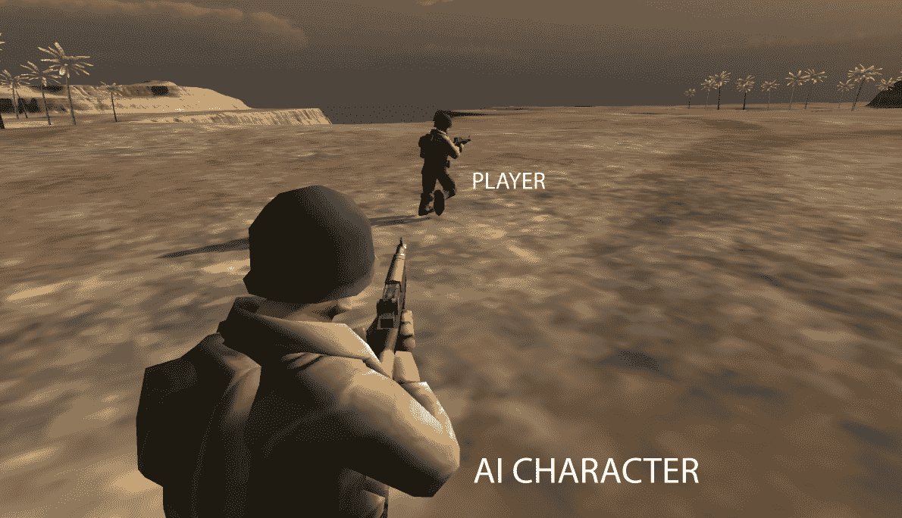

现在，我们的 AI 角色面对着玩家，我们可以检查他们是否在看着玩家的背面或正面。

对于我们来说，认为角色不知道区别可能看起来不太合逻辑，但在开发 AI 角色时，所有内容都需要写入代码中，尤其是像这种可能对预测、计划和最终做出决策产生巨大影响的细节。

因此，现在我们必须使用之前添加的触发器`Collider`来检查我们的 AI 角色是否面对着他们前面的玩家的正面或背面。让我们先添加以下两个新变量：

```py
 public bool facingFront;
 public bool facingBack; 
```

我们添加的变量是布尔值`facingFront`和`facingBack`。触发器将其中一个值设置为 true，这样角色 AI 就会知道他们正在看哪一侧。所以，让我们配置触发器：

```py
void Update ()
     {
         if (Found == false)
         {
             Vector3 dir = target.position - transform.position;
             transform.Translate(dir.normalized * speed * 
             Time.deltaTime,
             Space.World);

             if (Vector3.Distance(transform.position, target.position)
             <= 0.4f)
             {
                 GetNextWaypoint();
             }

             Vector3 newDir = Vector3.RotateTowards(transform.forward,
             dir,
             speedTurn, 0.0F);

             transform.rotation = Quaternion.LookRotation(newDir);
         }

         if (Found == true)
         {
             transform.LookAt(target);
         }
     }

     void GetNextWaypoint()
     {
         if(wavepointIndex >= waypoints.points.Length - 1)
         {
             Destroy(gameObject);
             return;
         }

         wavepointIndex++;
         target = waypoints.points[wavepointIndex];
     }

     void OnTriggerEnter(Collider other)
     {
         if(other.gameObject.tag == "Player")
         {
             Found = true;
             target = other.gameObject.transform;
         }

         if(other.gameObject.name == "frontSide")
         {
             facingFront = true;
             facingBack = false;
         }

         if(other.gameObject.name == "backSide")
         {
             facingFront = false;
             facingBack = true;
         }
     } 
```

因此，我们所做的是设置触发器来检查是否与另一个角色的背面或正面发生碰撞。为了达到这个结果，我们让触发器询问它检测到的碰撞是`frontSide`对象还是`backSide`对象。一次只能有一个为真。

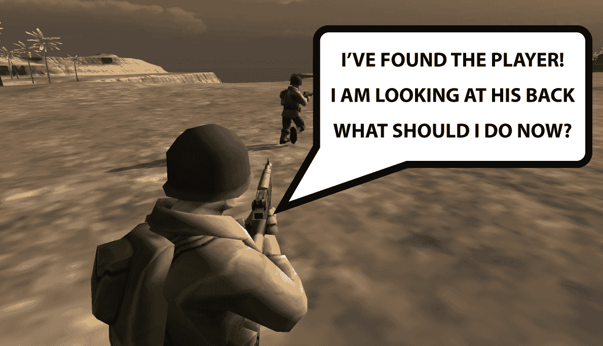

现在，我们的角色已经能够区分玩家的背面和正面，我们希望他能够分析这两种情况的风险。所以，我们首先要做的是让角色在发现玩家背对或面对他时，情况有非常明显的区别。当面对正面时，玩家准备向我们的人工智能角色开枪，所以这是一个更加危险的情况。我们将创建一个危险计分器，并将这种状况纳入等式中：

```py
 public float speed;
 public int health;
 public float speedTurn;
 private Transform target;
 private int wavepointIndex = 0;
 public bool Found;

 public bool facingFront;
 public bool facingBack;

 public int dangerMeter;
```

在变量部分，我们添加了一个新的整数变量，称为`dangerMeter`。现在，我们将添加一些值，以帮助我们确定我们的 AI 角色面临的情况是高风险还是低风险：

```py
void OnTriggerEnter(Collider other)
     {
         if(other.gameObject.tag == "Player")
         {
             Found = true;
             target = other.gameObject.transform;
         }

         if(other.gameObject.name == "frontSide")
         {
             facingFront = true;
             facingBack = false;
             dangerMeter += 50;
         }

         if(other.gameObject.name == "backSide")
         {
             facingFront = false;
             facingBack = true;
             dangerMeter += 5;
         }
     } 
```

因此，根据具体情况，我们可以添加一个小的数值来代表小的风险，或者添加一个大的数值来代表大的风险。如果危险值很高，AI 角色需要预见到可能危及生命的情况，因此可能会做出戏剧性的决定。另一方面，如果我们的角色面临的是低风险情况，他们可以开始制定更精确和有效的计划。

可以将许多因素添加到`dangerMeter`中，例如我们的角色相对于玩家的位置。为了做到这一点，我们需要将地图划分为不同的区域，并为每个区域分配一个风险等级。例如，如果角色位于森林中央，它可以被认为是一个中等风险区域，而如果他们在开阔地带，它可以被认为是一个高风险区域。角色的子弹数量、剩余的生命线等等都可以添加到我们的`dangerMeter`等式中。将这一功能实现到角色中，将帮助他预见到可能发生的情况。

# 碰撞避免

预测碰撞是我们 AI 角色应该具备的非常有用的功能，也可以用于人群系统中，以便在一个人物向另一个人物行进的方向上时，使人群移动得更自然。现在，让我们看看实现这一功能的一种简单方法：

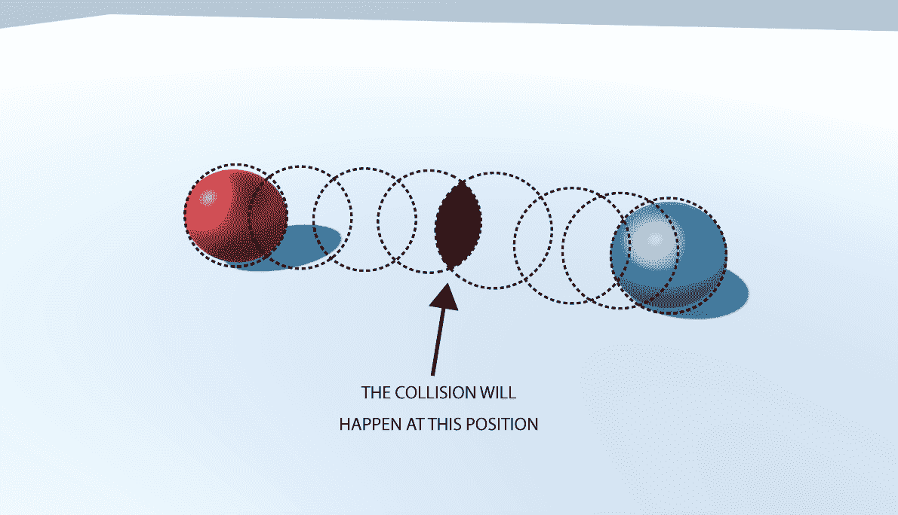

为了预测碰撞，我们需要至少两个物体或角色。在上面的图像中，我们有两个代表两个角色的球体，虚线代表它们的移动。如果蓝色球体向红色球体移动，在某个时刻，它们将相互碰撞。这里的主要目标是预测何时会发生碰撞，并调整球体的轨迹，使其能够避免碰撞。

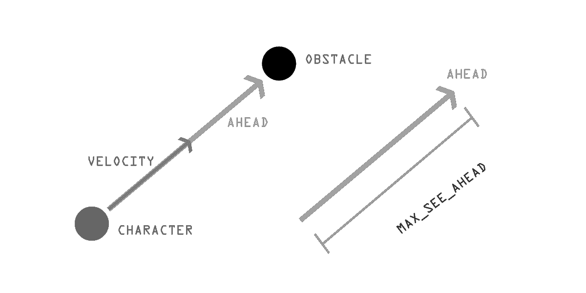

在前面的图像中，我们可以看到如果我们想让我们的角色避开障碍物碰撞，我们需要做什么。我们需要一个速度向量来指示角色的方向。这个相同的向量也将被用来产生一个新的向量，称为`ahead`，它是速度向量的一个副本，但长度更长。这意味着`ahead`向量代表了角色的视线，一旦他们看到障碍物，他们就会调整方向以避开它。这就是我们计算`ahead`向量的方式：

```py
ahead = transform.position + Vector3.Normalize(velocity) * MAX_SEE_AHEAD;
```

`ahead`是一个`Vector3`变量，`velocity`是一个`Vector3`变量，`MAX_SEE_AHEAD`是一个浮点变量，它将告诉我们我们能看到多远。如果我们增加`MAX_SEE_AHEAD`的值，角色将更早地开始调整方向，如下面的图所示：

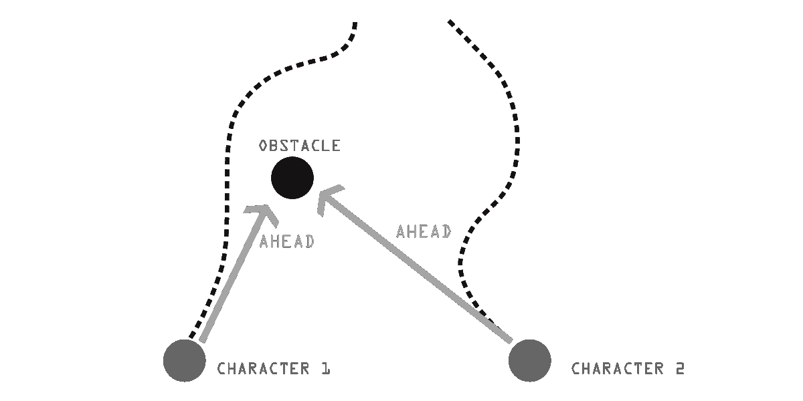

为了检查碰撞，一个可以使用的解决方案是线-球相交，其中线是`ahead`向量，球是障碍物。这种方法是有效的，但我们将使用一个简化版本，它更容易理解并且具有相同的结果。因此，`ahead`向量将被用来产生另一个向量，这个向量将是其长度的一半：

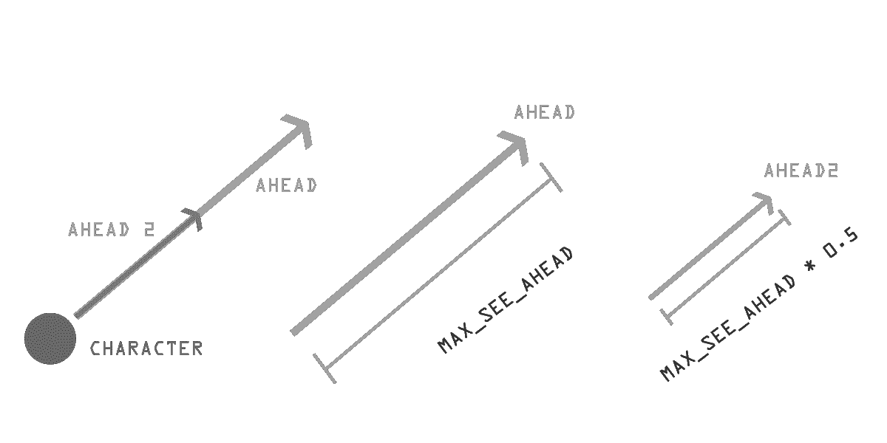

在前面的图像中，我们可以看到`ahead`和`ahead2`指向同一方向，它们之间的唯一区别是长度：

```py
ahead = transform.position + Vector3.Normalize(velocity) * MAX_SEE_AHEAD;
ahead2 = transform.position + Vector3.Normalize(velocity) * (MAX_SEE_AHEAD * 0.5);
```

我们需要检查碰撞，以确定这两个向量中的任何一个是否在**障碍区域**内。为了计算这一点，我们可以比较向量与障碍物中心之间的距离。如果距离小于或等于**障碍区域**，那么这意味着我们的向量在**障碍区域**内，并且检测到了碰撞。

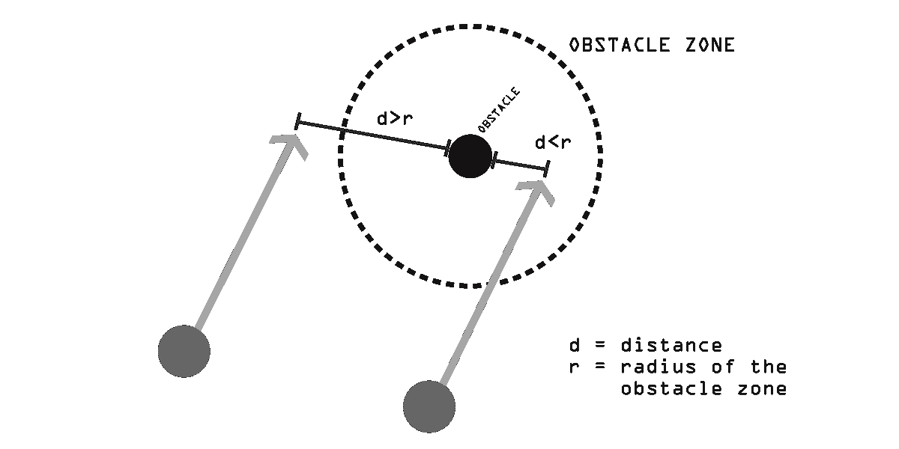

`ahead2`向量在先前的图中没有显示，只是为了简化它。

如果两个`ahead`向量中的任何一个进入**障碍区域**，这意味着障碍物阻挡了路径，为了解决我们的问题，我们将计算两点之间的距离：

```py
 public Vector3 velocity; 
 public Vector3 ahead;
 public float MAX_SEE_AHEAD;
 public Transform a;
 public Transform b;

 void Start (){

     ahead = transform.position + Vector3.Normalize(velocity) * MAX_SEE_AHEAD;
     }

 void Update ()
 {

     float distA = Vector3.Distance(a.position, transform.position);
     float distB = Vector3.Distance(b.position, transform.position);

     if(distA > distB)
     {
         avoidB();
     }

     if(distB > distA)
     {
         avoidA();
     }
     }

     void avoidB()
     {

     }

     void avoidA()
     {

     } 
} 
```

如果有多于一个障碍物阻挡路径，我们需要检查哪个离我们的角色更近，然后我们可以先避开较近的障碍物，然后再处理第二个障碍物：

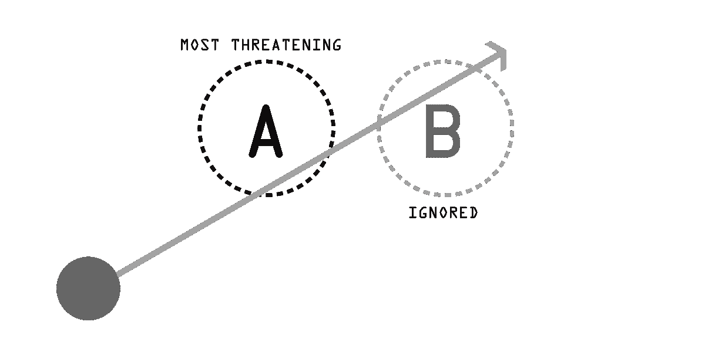

最接近的障碍物，最危险的障碍物，将被选中进行计算。现在，让我们看看我们如何计算和执行避开操作：

```py
 public Vector3 velocity;
 public Vector3 ahead;
 public float MAX_SEE_AHEAD;
 public float MAX_AVOID;
 public Transform a;
 public Transform b;
 public Vector3 avoidance;

 void Start () {

     ahead = transform.position + Vector3.Normalize(velocity) * MAX_SEE_AHEAD;
 }

 void Update ()
 {

     float distA = Vector3.Distance(a.position, transform.position);
     float distB = Vector3.Distance(b.position, transform.position);

     if(distA > distB)
     {
         avoidB();
     }

     if(distB > distA)
     {
         avoidA();
     }
 }

 void avoidB()
 {
     avoidance = ahead - b.position;
     avoidance = Vector3.Normalize(avoidance) * MAX_AVOID;
 }

 void avoidA()
 {
     avoidance = ahead - a.position;
     avoidance = Vector3.Normalize(avoidance) * MAX_AVOID;
 } 
}  
```

在计算避开后，它会被`MAX_AVOID`归一化和缩放，`MAX_AVOID`是一个用来定义避开长度的数字。`MAX_AVOID`的值越高，避开的效果越强，将我们的角色推离障碍物。

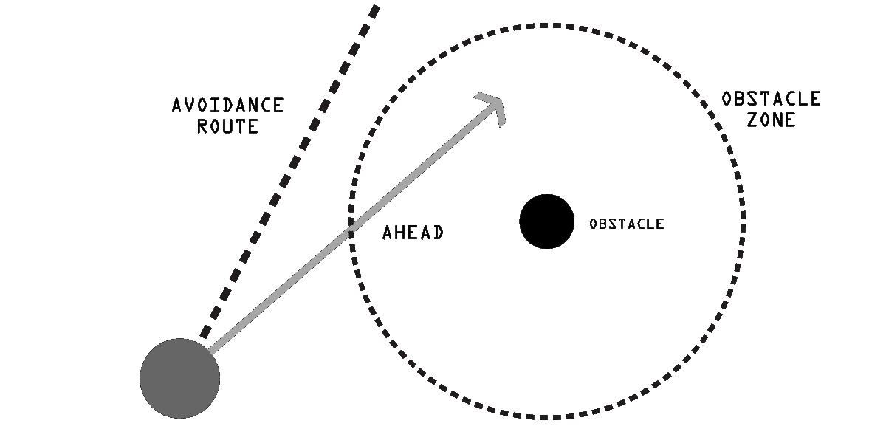

任何实体的位置都可以设置为向量，因此它们可以用于与其他向量和力的计算。

现在，我们已经有了让我们的角色预测并避开障碍物位置的基础，避免与之碰撞。结合路径查找，我们可以让我们的角色在游戏中自由移动并享受结果。

# 摘要

在本章中，我们探讨了如何让我们的 AI 角色创建并遵循一个计划以执行一个确定的目标。这个想法是提前思考将要发生的事情，并为这种情况做好准备。为了完成这个目标，我们还探讨了如何让我们的 AI 角色预测与物体或另一个角色的碰撞。这不仅对于让我们的角色在地图上自由移动是基本的，而且它也作为在规划要做什么时需要考虑的新方程。在我们下一章中，我们将讨论意识，如何发展潜行游戏中最具标志性的特征，并让我们的 AI 角色通过真实的视野范围意识到周围发生的事情。
