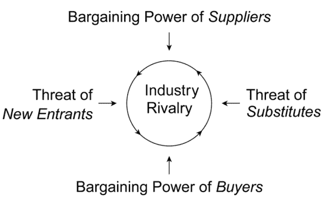
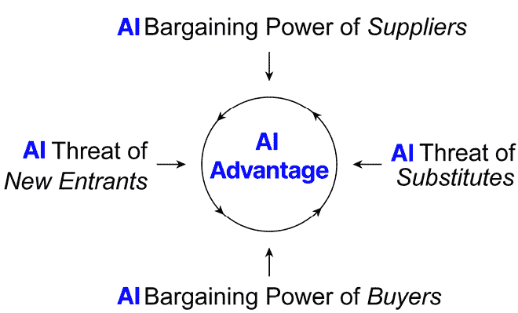

# 1

# 理解 AI 革命

你是否曾检查过你最喜欢的社交媒体应用，却发现你的动态被像以下这样的标题充斥：

+   *产品设计师，再见。*

+   *这个 AI 副业每天能赚 1,579 美元。*

+   *这个新的 AI 将取代软件工程师。*

至少在我的 AI 泡沫中，我的动态每天看起来都是这样。这里有一个新模型，那里又有一个革命。鉴于网上的热议，你可能会打赌 AI 革命正在进行中。

然而，我过去几年在 AI 咨询中的经历告诉我，现实情况完全不同。AI 的采用仍然是一个挑战，绝大多数的商业领袖都难以将他们的（昂贵的）AI 原型带入（更加昂贵的）生产场景。

这就是典型中等规模、成熟 B2B 公司的典型 AI 项目是如何运行的。

公司了解到 AI 在优化特定流程方面的潜力，并决定投资 AI 解决方案。他们聘请了一家 IT 咨询公司，该公司向他们收取了 15,000 美元的*AI 战略*提案费用。提案用模糊的语言概述了 AI 如何在未来 10 年内改变他们的业务。CEO 被这个愿景所鼓舞，批准了一个原型项目。咨询公司又收取了 20,000 美元，使用一些历史数据（或甚至可能是虚构的数据）开发一个基本的验证概念。原型显示出有希望的结果，现在每个人都非常兴奋。

但接下来是现实检查。要将这个原型投入生产，公司需要将其 AI 解决方案与其现有的系统景观集成，这需要重大的定制和新数据管道。他们还需要培训员工如何使用和解读 AI 预测。最后，他们还需要建立治理流程来监控和维护 AI 系统。考虑到所有这些要求，咨询公司为这次生产实施提供的报价大约是原型的 10 倍。

CEO 不再批准项目。相反，他们想要看到一个详细的回报率分解，并证明解决方案实际上会按预期工作。这两者都没有发生；项目停滞不前，成为我所说的*原型陷阱*的另一个受害者。

这种情况太常见了。Gartner 的一项调查显示，只有 53%的 AI 原型能够进入生产阶段。其余的都陷入了这种*创新剧场*，公司可以将他们的 AI 实验作为其数字化转型努力的证据，但无法将这些实验转化为实际的商业价值。

因此，当公司在试图弄清楚这一切时，围绕人工智能的炒作让大型 IT 咨询公司的口袋鼓了起来。埃森哲预测，仅一个季度内，人工智能将带来 9 亿美元的收入。BCG 预计**生成式人工智能（GenAI）**将在 2024 年贡献其 20%的收入。对于麦肯锡来说，人工智能是 2024 年业务增长的主要驱动力。这些公司利用了人工智能淘金热，向公司提供（通常价格昂贵）的服务，帮助他们导航人工智能应用的复杂领域。

但对于许多公司来说，人工智能应用的现实情况是一次令人清醒的经历。当 ChatGPT 在 2022 年底推出时，感觉人工智能的发展突然以难以想象的速度加速。2023 年 3 月 GPT-4 的发布，对即将到来的事物设定了极高的期望。许多人预计，更强大的模型将迅速出现，人工智能的发展将变得不可阻挡，人工智能将迅速改变每个行业。这种炒作创造了一种既兴奋又恐惧的氛围，许多人感觉他们正处于一个他们无法控制的变化的边缘。（还有谁记得暂停人工智能发展的那次重大呼吁？）

但人工智能影响的现实情况与这些巨大的期望相去甚远。我们所承诺的人工智能革命与实际正在展开的革命之间存在显著的差距，理解这个差距对于导航真实的人工智能领域至关重要。

当我们深入挖掘人工智能应用的状态时，我们发现了一个悖论。

根据麦肯锡的数据，2023 年企业中的人工智能应用从 33%激增到 2024 年的 65%。从表面上看，这似乎是一个令人印象深刻的飞跃。但当我们观察应用的深度时，我们看到的是另一幅景象。只有 8%的公司在超过五个业务功能中应用了人工智能。绝大多数公司只是触及了人工智能潜力的表面。

这种浅层应用在很大程度上是由于我上面概述的**原型陷阱**。它使公司陷入人工智能的实验阶段。他们投资了试点项目和概念验证，但难以将这些用例扩展到生产阶段。即使成功导航（或通过购买方式摆脱）原型陷阱的公司也不是没有遭遇挫折。

麦当劳推出了一款自动聊天机器人，2024 年因一个在 TikTok 上引发病毒的视频而不得不撤回，该视频突出了错误，例如将培根加到冰淇淋中，错误地订购了价值数百美元的鸡块，以及将焦糖冰淇淋与多层黄油混淆。

加拿大航空也遭遇了类似的情况，该公司在需要为聊天机器人向客户提供的错误答案承担法律责任后，决定撤回其 AI 客户支持聊天机器人。

而这不仅仅是聊天机器人。回溯到 2021 年，房地产平台 Zillow 在其 AI 驱动的服务**Zillow Offers**因预测失误导致 5 亿美元损失和 2000 名员工被裁后，关闭了这项服务。

这样的案例研究导致了人们对人工智能项目的日益怀疑，在某些情况下，甚至削减了人工智能项目的预算。Gartner 将其称为*幻灭的低谷*——这个阶段，最初的炒作让位于失望，因为技术未能满足膨胀的期望。

这些挑战源于几个因素。我们将在本书中进一步探讨这些因素。但造成期望与现实之间差距的最重要原因之一是，组织缺乏有效采用人工智能的成熟度。他们在技术层面，如数据质量和基础设施准备，以及非技术层面，特别是在文化和技能方面，都面临着障碍。IBM 的一项调查显示，技能差距是人工智能采用的主要障碍，有 33%的受访者提到了这一点。除此之外，围绕人工智能的监管环境正在开始形成，并且已经开始影响实施，尤其是在欧盟等地区。例如，欧盟的人工智能法案将某些人工智能系统归类为*高风险*，并对其透明度、人工监督和风险管理提出了严格的要求。这给人工智能的采用增加了另一层复杂性和成本。

最后，衡量人工智能项目进展和影响仍然是一个挑战。与传统的软件项目不同，人工智能的回报率很难量化，尤其是在短期内。这使得公司难以证明在人工智能上的大规模投资是合理的。

那么，AI 项目注定要失败吗？

绝对不是！但真正的 AI 进步往往以不会成为头条新闻的形式出现。例如，生物技术公司 Moderna 公开披露，其组织中有超过 80%的 5000 名员工使用了超过 750 个 AI 助手，以实现如果没有采用旧式生物制药方式将需要 10 万个团队才能达到的影响——这是一个巨大的成就，与媒体报道的其他 AI*突破*相比，相对被忽视。

我们将在本书中探讨更多这样的案例研究。

但首先让我们来谈谈**为什么人工智能对非技术型商业领袖很重要？**

正如你所看到的，你将继续发现——人工智能的采用并不像购买一个新的 IT 工具那样简单。成功采用人工智能是一次旅程，这次旅程必须由商业领袖拥有和推动，而不是 IT 部门。在接下来的章节中，我们将探讨 IT 如何成为 AI 驱动的业务转型的推动者，而不是关键驱动因素。

相反，企业领导者必须亲自掌握他们的 AI 路线图。*AI 将如何影响他们部门的日常工作？哪些流程会受到冲击？他们如何确保每位员工都参与其中？* *利润在哪里？* 这适用于组织中的每位领导者。AI 路线图将需要应用于市场营销、法律、制造、运营等领域。除非企业领导者亲自制定，否则没有人会为这些团队构建这些路线图。企业领导者了解他们责任领域的核心需求——无论是大型业务单元、小型团队还是公司的特定产品。虽然 IT 和工程部门通常关注实施而不是愿景，但企业领导者必须弥合这一差距，以确保 AI 项目与战略目标和业务的实际需求保持一致。

这需要对路线图进行关键评估和持续迭代。这本书将指导你创建和执行这样的路线图。如果没有掌握你的 AI 路线图，你的公司可能会陷入*花哨玩具*阶段——购买 AI 工具和启动小型项目，这些项目至多对业务产生轻微影响。

掌握你的 AI 路线图或未能做到这一点——将显著影响你在市场上的竞争地位。你周围的世界正在快速发展，所以仅仅维持现状是不够的。如果你不采取行动，即使你的表现没有改变，你实际上也在落后。

这就是 AI 对竞争力影响的隐蔽性质。它并不总是关于戏剧性的颠覆性创新。通常，它是在整个组织中积累大量较小的收益，以这种方式它们会累积成更大的利益，从而在拥有 AI 和没有 AI 的企业之间形成越来越大的差距。

我们将在本章的以下部分中探讨所有这些内容：

+   AI 对竞争力的影响

+   AI 优势：一种新的力量

# AI 对竞争力的影响

为了了解 AI 对竞争动态的影响，让我们来谈谈经典的**五力框架**（*图 1.1*），这是一个很好的视角，可以用来审视这些变化。

由哈佛商学院教授迈克尔·波特于 1979 年开发，五力框架是一个通过考虑五个关键力量来分析行业竞争强度的工具：新进入者的威胁、供应商的议价能力、买家的议价能力、替代产品或服务的威胁以及现有竞争者之间的总体竞争。力量越多，在特定市场中生存就越困难。

图 1.1：波特五力分析示意图，维基百科 ([`en.wikipedia.org/wiki/Porter%27s_five_forces_analysis`](https://en.wikipedia.org/wiki/Porter%27s_five_forces_analysis))

通过理解人工智能如何改变这些力量中的每一个，我们可以更清楚地了解人工智能如何重塑各行业的竞争格局，以及推动你（甚至更好的，你的竞争对手）退出市场的潜力。

## 力量 1：新进入者的威胁

当谈到新进入者的威胁时，人工智能是一把双刃剑。一方面，像 GPT-4 这样的强大人工智能服务和开源替代品的广泛可用性降低了新进入者的进入壁垒。初创公司现在可以在几周内开发出复杂的 AI 解决方案，这在几年前是无法想象的，这使得它们能够在更加公平的竞争环境中与更成熟的公司竞争。

然而，人工智能的成功应用往往需要不仅仅是获得正确的工具。在许多行业中，人工智能的真实价值来自于高质量、专有数据与能够将数据转化为有价值的见解和产品的熟练人员的结合。这在许多 B2B 领域，如医疗保健、金融和先进制造领域尤为如此，这些领域的数据通常是敏感的、受监管的或技术复杂的。

对于这些行业的新进入者来说，获取必要的数据和人才可能是一个重大的挑战。现有玩家在数据收集方面通常有先发优势，并且可能拥有对某些数据流的独家访问权。他们还倾向于有更深的口袋来聘请稀缺的人工智能人才。因此，尽管人工智能降低了某些进入壁垒，但它也提高了其他壁垒。

## 力量 2：替代品的威胁

在某些行业中，人工智能不仅使新的竞争对手出现，而且还产生了全新的替代品类别。这在创意产业中尤为明显，其中人工智能生成的内容开始与人类创作的作品竞争。从 AI 撰写的文章和剧本到 AI 生成的图像和视频，人工智能可以处理的创造性任务范围正在迅速扩大。

我们在服务行业也看到了类似的趋势，其中人工智能驱动的聊天机器人和虚拟助手正在增强以前完全由人类工人完成的工作流程。这些 AI 代理可以处理客户咨询，提供推荐，甚至完成交易，通常成本仅为人类同行的一小部分。

这种趋势可能会对众多行业的中介产生特别重大的影响。无论是旅行社、保险经纪人、房地产经纪人，还是甚至不连接买家和卖家的代理商业模式，但连接人才和客户，所有这些都可能被全新的 AI 解决方案所颠覆。如果你的公司目前占据这些中间人位置之一，你将处于一个高度风险的人工智能颠覆的市场中。

## 力量 3：供应商的议价能力

当一家公司在关键人工智能服务中获得类似垄断的地位时，人工智能对供应商权力的影响可能是巨大的。以一个开发人工智能驱动的供应链物流优化系统的初创公司为例，通过利用多个行业的专有数据、顶级人工智能人才和定制算法，这家公司可以提供一种显著优于传统物流优化的服务。随着越来越多的企业意识到这种人工智能服务的效率提升，该初创公司迅速成为市场的主导者，通过持续的反馈循环增加其优势。他们拥有独家访问数据、人才和技术，这使得他们的产品极具吸引力，为潜在竞争者设置了很高的进入壁垒。在这个级别的市场力量下，人工智能物流公司对定价有重大控制权。他们可以收取高额费用，因为他们知道客户很少有其他可以匹配其性能水平的替代方案。如果客户无法吸收这些高成本而不损害其竞争力，他们的利润率将受到影响。这种动态使人工智能提供商获得了巨大的议价能力，可能使他们能够捕获他们创造的大部分价值。

如果你现在认为这听起来像是一个幻想，那么考虑一下德国最有价值的 AI 初创公司之一 Celonis 的故事。Celonis 通过提供人工智能驱动的流程挖掘服务，帮助公司优化其运营，实现了快速增长和高估值。

随着人工智能在各个行业竞争中的核心地位日益凸显，管理人工智能服务提供商的议价能力将成为一个关键的战略挑战。

## 力量 4：买家的议价能力

让我们将焦点从供应商转移到买家。在 B2C 领域，我们已经看到了像比较网站这样的工具如何通过帮助消费者轻松找到从保险到酒店的一切最佳交易来赋予消费者权力。

人工智能有可能将类似的透明度带到更加复杂的 B2B 交易世界。通过分析不同供应商及其产品的大量数据，人工智能工具可以帮助企业快速识别满足其需求的最佳供应商，并在最佳的价格点上。

这可能会对传统的采购流程产生重大颠覆，这些流程通常涉及漫长的 RFP 周期和不同供应商之间的手动比较。有了人工智能，这些流程可以很大程度上实现自动化，人工智能系统分析数百个潜在供应商及其细微的产品提供，以推荐最佳选择——使买家能够比较更多的供应商，从而有效地确保更好的交易并简化他们的采购流程。这也意味着供应商需要更加努力地工作，以在价格和基本功能集之外区分他们的产品。

## 力量 5：现有竞争者之间的竞争

人工智能对现有竞争对手之间竞争的影响可能是所有五种力量中最深刻和最复杂的。人工智能从根本上重塑了许多行业中的竞争性质，引领着一个由人工智能驱动的商业战略新时代。

在一个层面上，人工智能正在使公司能够实现前所未有的运营效率和客户理解水平。这正在给市场中的所有参与者施加压力，必须采用人工智能，否则可能会被落下。

然而，人工智能的竞争优势往往不均衡地积累在那些最能充分利用人工智能并避免最大陷阱的公司——这通常包括获得最佳数据和人才。这导致了许多行业中人工智能领先者和落后者之间的差距不断扩大。人工智能的领跑者能够不断改进他们的产品和服务，使竞争对手更难赶上。

同时，人工智能的高成本和复杂性正在驱使许多公司寻求合作伙伴关系和合作，甚至与传统的竞争对手。我们在汽车行业（公司合作开发自动驾驶技术）和医疗保健行业（竞争对手共享数据以改善患者结果）中看到了这一点。这些合作使公司能够分享人工智能发展的风险和回报。

结果是一个复杂且动态的竞争格局，公司必须平衡人工智能驱动的竞争的必要性（快速创新、专有数据和算法、顶级人工智能人才）与人工智能驱动的合作可能带来的潜在好处（共享成本和风险、更大的数据集和综合专业知识）。在这个格局中导航需要深入了解每个行业和市场的具体竞争动态——以及彻底了解人工智能如何为他们提供最大的竞争优势，他们可能需要与谁合作，以及他们如何构建内部能力和外部关系以在人工智能驱动的世界中取得成功。

因此，构建一个健全的人工智能战略非常重要。这不仅仅是采用人工智能工具或雇佣人工智能人才；这还涉及到制定一个全面的路线图，利用人工智能来重塑公司的价值主张、运营模式和竞争定位。

# 人工智能优势：一种新的力量

考虑到其对前一部分中我们看到现有力量的影响，将人工智能称为一种新的力量是合理的。有效地利用人工智能的能力正成为竞争优势的关键决定因素，跨越所有其他力量——人工智能优势。这是人工智能革命的精髓。

图 1.2：人工智能作为推动人工智能革命的新力量

公司现在必须将他们的 AI 优势视为其战略定位的核心部分，确保在各自的市场中保持或恢复竞争力。这意味着不是等待大爆炸和科技巨头来解决问题，而是随着时间的推移构建技术和非技术准备，以有效地利用新 AI 技术带来的机会。普华永道估计，到 2030 年，AI 将为世界经济增加 15 万亿美元。为了更直观地理解这一点，这意味着另一个欧盟将进入世界经济产出地图。

AI 可以通过成本节约、提高质量、加快流程和新的扩展机会来提高你的底线。它减少了开支和浪费，增加了利润和客户忠诚度，加速了决策和交易，并实现了以前难以触及的增长。真正的力量在于将这些效果结合起来，产生指数级的结果。我们将深入探讨每个方面，并展示如何将它们转化为可衡量的商业影响。

要非常明确：这是一个变革。AI 不仅仅是另一个技术进步；它是一个重塑我们世界的根本性转变。

我们以前见过变革。你可能已经听过“变革”这个词太多次，以至于现在它听起来就像另一个时髦词汇。但事实并非如此。

到目前为止，世界见证了三次主要的工业变革，每次都是由颠覆性技术驱动的：

+   1760 年代的蒸汽动力。

+   20 世纪初的电力和大规模生产。

+   20 世纪末的计算机化。

今天，我们正处于由 AI 驱动的第四次工业革命中。

人工智能变革不仅仅是优化流程和削减成本；它正在重新书写工作的规则。如果你没有为它做准备，那么你已经在落后了。但为 AI 做准备并不意味着解雇你的员工并用机器人取代他们。这也不意味着投资数百万美元的基础设施并祈祷回报率。

事实上，在人工智能时代繁荣的关键是加大对人才的投入，赋权他们，并将他们置于领导地位。

利用 AI：

+   给你的销售团队提供他们需要的洞察力，以便更快地达成更多交易。

+   为你的市场营销人员配备预测技能，以制作出转化率极高的营销活动。

+   利用预测需求并超越期望的能力来超级提升你的客户服务。

你可以不雇佣一支数据科学家大军并将他们锁在房间里两年时间就实现所有这些。正如我们将在整本书中了解到的那样，通过 AI 增强现有工作流程是进入这个领域并建立你自己的、独特的 AI 优势的理想策略，这种优势属于你的业务。

# 摘要

人工智能革命并非如人们所承诺的那样突然、剧烈的变革。它是一个更加渐进、不均衡的技术扩散和组织适应过程。它更多地关乎各行各业企业日常运营的战壕，而不是机器人霸主或科技巨头的炫目演示。正如 Moderna 公司的首席信息官布拉德·米勒所说：

90% 的公司都希望进行通用人工智能（GenAI）的开发，但其中只有 10% 的公司取得了成功，它们失败的原因在于它们没有建立起将劳动力转变为适应新技术和新能力的机制。

人工智能的潜力是巨大的，而我们仅仅只是触及了表面。但要实现这一潜力，我们需要超越炒作，设定现实的期望。最重要的是，这意味着认识到人工智能革命不仅仅是关于技术。它是关于人——那些开发和部署人工智能系统的人，以及那些他们的生活和工作受到人工智能影响的人。这就是真正的人工智能革命正在发生的地方——不是在硅谷的实验室里，而是在像您这样的企业的日常决策和行动中。

未来商业的成功将取决于你理解你所在行业由人工智能驱动的变化的能力、制定稳健的人工智能战略以及有效地实施人工智能解决方案的能力，这从增强合适的流程开始。虽然变化的步伐可能有所不同，但人工智能对竞争动态的长期影响是深刻且广泛的。

在下一章中，我们将探讨您如何从正确的角度接近这场革命。

|

#### 现在解锁这本书的独家优惠

扫描此二维码或访问 `packtpub.com/unlock`，然后通过书名搜索此书。 |  |

| **注意**：在开始之前，请准备好您的购买发票。* |
| --- |
