# 2

# 理解现代人工智能

在我们探索现代人工智能之前，让我们简要回顾一下人工智能成为话题之前的历史。那是 1891 年，电气革命正在进行中。爱迪生通用电气公司被要求在白宫安装第一条电力线路。电线被埋在石膏中，每个房间都有方便的圆形开关来开关灯。然而，它们大部分未被使用。结果，当时的总统本杰明·哈里森和他的家人甚至不敢触摸它们，害怕电线中看不见的电力会电击他们。因此，他们让他们的工作人员来操作开关。后来被提升为白宫首席招待员的电工 Irwin “Ike” Hoover 在他的书中回忆道，([`www.amazon.com/Forty-Two-42-Years-White-House/dp/B001RHWC7Y`](https://www.amazon.com/Forty-Two-42-Years-White-House/dp/B001RHWC7Y))，“*我会在晚上打开走廊和客厅的灯，直到第二天早上我回来熄灭它们*。”

现在，我们可以看到与人工智能非常相似的情况。当大型 IT 咨询公司报告创纪录的利润，向犹豫不决的企业出售*人工智能专业知识*时，高管们却将人工智能保持距离，害怕真正深入其中并理解它。因此，企业对人工智能的采用仅停留在表面，其潜力被广泛未挖掘。

你不需要成为 AI 工程师，就像不是每个人都需要成为电工来在夜间保持灯光一样。但如果你仅仅依赖外部知识，从未深入到一些基本原理中，你就永远无法独立操作开关，因此你将不得不在黑暗中坐着，用煤油灯，或者支付巨额费用来获得白手套服务。

本书的核心目标是通过你自己识别和利用有利可图的 AI 机会，而不需要过度依赖外部顾问。这就是为什么这一章如此关键，因为它为理解人工智能实际上是什么以及支撑它的基本机制奠定了基础，这样你就可以理解其能力和局限性。

本章我们将探讨以下主题：

+   理解人工智能的基石：术语

+   与 AI 技能框架和五种 AI 商业模式合作

+   理解大型语言模型（LLMs）

如果你已经熟悉 AI 概念，可以随意浏览本章。然而，我仍然建议阅读关于五种 AI 商业模式的章节，因为它为后续内容奠定了基础。它将为即将到来的整本书奠定基础。否则，让我们从一些术语开始。

# 理解人工智能的基石：术语

就像 19 世纪 90 年代的电气革命一样，人工智能革命也带来了一套自己的术语和概念，一开始可能会让人感到 daunting。但别慌张——理解这些术语是你在业务中自信地*操作人工智能开关*的第一步。

首先，让我们吞下这个真理的苦药：人工智能术语令人困惑，即使是该领域的资深专家也是如此。说实话，没有人真正弄清楚，每个人都有自己的词汇表。这种术语的困惑源于三个主要因素：

+   人工智能技术的复杂性和不断发展的性质。

+   人工智能实践者的多种观点。

+   在特定行业、领域和组织中使用的不同术语和行话。

后者尤其重要。你可能根据你是在与研究人员、数据科学家还是商业高管交谈而听到对同一术语的不同解释。这种可变性是我们需要接受的。记住，目标不是成为术语的吹毛求疵者，而是掌握这些术语所代表的概念和思想。把它看作是学习一门新语言——细微差别可能不同，但核心意义保持不变。

现在，让我们构建一个理解人工智能的框架，从最广泛的概念开始，逐步缩小到具体的应用。

我们将使用以下广泛接受的临界人工智能术语及其层次结构的表示方法（*图 2.1*）：

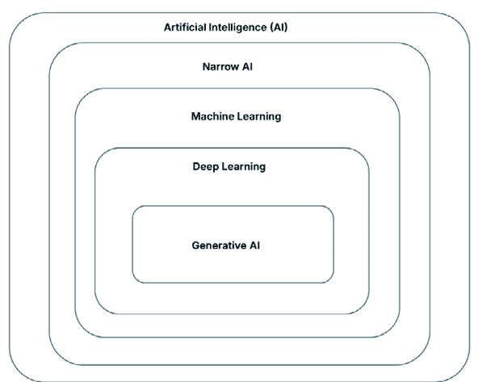

图 2.1：人工智能术语概述

在最高层次上，我们有**人工智能**（**AI**）。这个术语已经成为表示表现出**智能**行为系统或机器的通用术语。当我们在这个语境中说*智能*时，我们指的是执行认知复杂任务的能力，如学习、解决问题和决策，这是一个相当广泛的领域。

人工智能的概念并不新鲜。它可以追溯到 20 世纪 50 年代，其根源在于军事研究。你可能听说过艾伦·图灵——他的工作为我们现在称之为人工智能奠定了基础。从那时起，人工智能已经发展并扩展，在众多行业中找到应用。

在人工智能的广泛领域中，已经出现了两个主要的研究领域：强人工智能和窄人工智能。

**强人工智能**，也称为**通用人工智能**（**AGI**），是两者中更雄心勃勃的一个。它旨在创建能够在所有方面与人类智能相匹配甚至超越的系统。想象一下一台可以解决人类可以解决的任何问题——甚至更多——的机器。这是科幻小说的常见主题，如有感知的机器人或无所不知的计算机系统。然而，尽管几十年的研究，强人工智能仍然是一个遥远的目标。许多研究人员争论它是否甚至可以实现。

另一方面，**窄人工智能**是我们日常生活中遇到的东西，它为今天所有的实用商业人工智能应用提供动力。这些是为特定工作设计的特定任务系统。当你使用语言翻译应用或你的手机通过面部识别解锁时，你正在与窄人工智能互动。与强人工智能不同，窄人工智能并不旨在完全复制人类智能。相反，它专注于高效地执行特定任务。

在商业世界中，当我们谈论人工智能应用时，我们几乎总是指窄人工智能。这些系统正在改变今天的行业，从金融到医疗保健到制造业。这就是为什么我们现在将重点转向窄人工智能方法——可以在现实世界中应用的人工智能技术。

这些窄人工智能系统实际上是如何工作的呢？创建*智能*系统有两种主要方法。第一种是基于预先编程的决策规则，通常称为**基于规则的系统**。这些系统不从数据中学习；它们只是遵循它们被赋予的规则。通常，它们也被称为**专家系统**，因为专家定义了规则。

第二种方法，**机器学习**（**ML**），是推动我们今天看到的绝大多数人工智能进步的动力。

让我们更深入地探讨一下机器学习。

## 机器学习

机器学习系统从数据中学习，通过最小化人工干预来识别模式和做出决策。想象一下，教一台计算机识别猫，不是通过告诉它，“猫有尖耳朵和胡须”，而是通过展示成千上万张猫的图片，并让它自己找出模式。

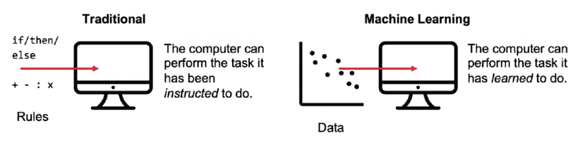

图 2.2：传统编程与机器学习

重要的是要注意，尽管机器学习具有能力，但它并不意味着自我意识或情感。当你听到机器学习时，不要想象一个有感情的感知计算机。相反，把它想象成一个高度复杂的模式识别系统。它本质上是一种自动数据分析的统计方法。

机器学习背后的核心概念是推动当今大多数人工智能应用的核心。几十年来，公司一直在应用机器学习，尤其是在结构化表格数据上，以大规模运行预测算法，如线性回归或决策树。常见的用例包括需求预测、欺诈检测和客户流失预测。

然而，并非所有数据都是表格化的——事实上，今天产生的绝大多数数据都是非结构化或半结构化的，如文本、图像或文档。传统的机器学习算法通常难以处理这类数据，因为它们通常需要手动特征提取和领域特定的工程。

这就是**深度学习**（**DL**），作为机器学习的一个子领域，发挥作用的地方。

## 深度学习

你可以将深度学习想象成机器学习的一个高级子集。虽然*非深度*，有时也称为*浅层*机器学习，它可以应用于相对较小的数据集，甚至可以放入表格式的 Excel 电子表格中。真正的*深度学习*通常需要更复杂和更大的数据结构，如文本、图像或音频数据。

为了给你一个大致的概念，考虑一张 5 兆像素的彩色图像，这是你每天用智能手机拍摄的东西，它会被表示为一个表格。这个表格将有 500 万行和 3 列——一个图像就有 1500 万个数据点。如果你有一个包含 1000 张图片的数据集，这在深度学习领域被认为相当小，你可以做一下数学计算。

这是一大批数据。

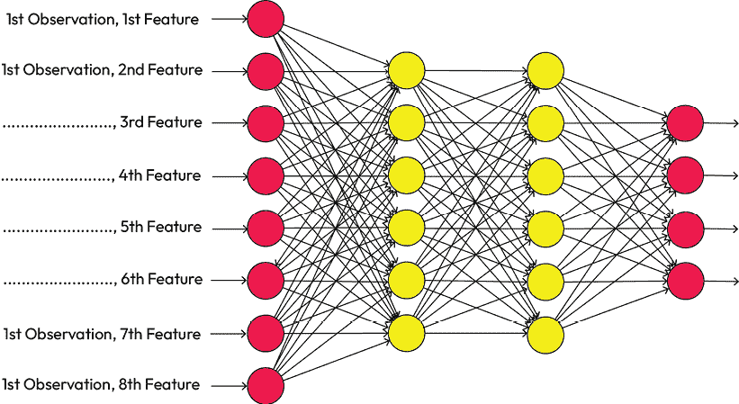

图 2.3：人工神经网络（AI in a Nutshell：关键术语实用指南）的示例架构（[`blog.tobiaszwingmann.com/p/demystifying-ai-practical-guide-key-terminology`](https://blog.tobiaszwingmann.com/p/demystifying-ai-practical-guide-key-terminology)）

对于这些庞大而复杂的数据结构，一种称为**人工神经网络**（**ANNs**）的机器学习架构，具有许多层，证明非常有效（参见*图 2.3*中的视觉表示）。由于这些 ANN 通常具有许多层（左边的输入层和右边的输出层之间的黑色点），我们称它们为*深度*——因此有了*深度学习*这个术语。

虽然这些神经网络受到了人类大脑的启发，但它们的实际操作与生物过程相当不同。它们本质上是非常复杂的数学模型，旨在进行模式识别。

深度学习在近年来许多最令人印象深刻的 AI 成就中发挥了作用，从在复杂游戏中击败世界冠军到根据描述生成类似人类的文本和创建逼真的图像。

接下来，我们将讨论**生成式 AI**（**GenAI**），它改变了终端用户在日常活动中使用 AI 的方式。

## 生成式 AI

生成式 AI 是深度学习的一个子领域——你可能已经接触过了，无论你是否意识到。如果你曾经让 ChatGPT 帮你写邮件，玩过将涂鸦变成照片的工具，或者在你的动态中看到过 AI 生成的图片，那么你就已经看到了生成式 AI 的应用。

生成式 AI 背后的核心思想简单但强大：这些系统不仅仅是*分析*数据，它们还能*生成*新的数据。它们的具体任务是生成或修改原始内容——无论是文本、图像、视频还是基于它们从大量数据集中学习到的模式。重要的是，它们这样做*并不真正理解*内容，就像人类那样。没有意识，没有常识，也没有现实世界的根基。这些系统擅长的是发现统计模式，并利用这些模式来生成看起来聪明、有创意，甚至有洞察力的输出。但不要被这种缺乏*理解*所欺骗——生成式 AI 的能力非常强大。事实上，缺乏理解往往是这些系统如此灵活和可扩展的原因。

今天 GenAI 繁荣的中心是**大型语言模型**（**LLMs**）。这些模型经过训练，可以从提示中生成类似人类的文本。它们在令人震惊的参数数量上运行——例如，GPT-4 使用了数百亿个参数——来预测序列中接下来可能出现的单词（甚至整个段落）。结果是通常连贯、流畅且上下文适当的文本，感觉就像是由人类所写。对于好奇的读者，我们在本章末尾有一个专门的技术深入探讨部分，介绍 LLMs 是如何工作的。

你可能听说过 ChatGPT——可以说是现代 GenAI 的标志性产品。它以一种用户友好的方式将 LLMs 的力量带给公众，允许任何人几秒钟内生成电子邮件、头脑风暴想法、写诗、调试代码或总结长文档。但远不止如此。现在市场上已有数十种 LLMs 和生成系统，既有来自商业提供商如 Anthropic 或 Grok，也有开源模型如 Meta 的 Llama 系列或 DeepSeek 的模型。

在 GenAI 领域最近最令人兴奋的发展之一是**多模态模型**的兴起。与仅处理文本的传统 LLMs 不同，这些新系统在多种类型的输入上进行了训练——文本、图像、音频，甚至视频。这意味着它们可以跨不同媒体理解和响应。例如，你可以向一个多模态模型展示一张照片，并要求它写一个关于它所看到的故事，或者给它一张图表，让它用简单的英语解释数据。更令人印象深刻的是，我们现在有了真正的多模态系统，可以从文本或其他图像中直接生成图像——无需经过仅文本的步骤。

这种跨模态的直接输入到输出的映射标志着模型能力的一个重大飞跃，并开辟了全新的创造性和分析可能性。

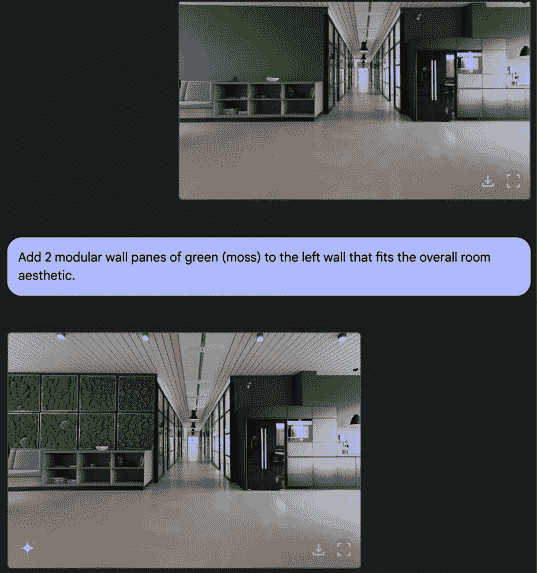

图 2.4：谷歌的 Gemini 根据原生图像和文本输入创建新图像

就像电的早期时代一样，我们仍在探索如何最好地使用这些工具。但有一点很清楚：GenAI 不仅仅是一个趋势，它是在内容和消费方式上的一个基础性转变。而且，它才刚刚开始。

但与打开开关不同，人们很容易被 GenAI 的纯粹新颖性和力量所吸引。在如此多的炒作、如此多的演示以及每周似乎都有新的突破的情况下，更难的问题往往变成了：*我如何真正以有意义的方式在我的业务中使用它？*

在我的客户工作中，我发现仅从技术角度接近 AI 很少能导致可操作的结果。相反，真正的突破往往发生在我们翻转镜头的时候：不是*技术能做什么*，而是*它解锁了哪些新的与业务相关的技能和能力*。这种从工具到能力的转变——是 AI 开始变得实用的地方。

正因如此，我开发了一个简单但强大的框架，我称之为**AI 技能**。它将嘈杂、快速发展的 AI 世界分解为五种实用的价值创造模式，每位商业领袖都可以在今天掌握并付诸行动。

让我们更深入地了解它们。

# 与 AI 技能框架和五种 AI 商业模式一起工作

为了穿透噪音并使 AI 实用，我们需要一个新的视角。不是技术视角，而是一个*与业务相关的*视角。

与其试图记住每一个算法、供应商或缩写，不如问一个更好的问题：*这项技术实际上能为我做什么？* 更具体地说，*它为我的团队、产品或运营解锁了哪些能力？*

为了使这种转变更容易，我在全球范围内使用**AI 技能框架**与我的客户合作——这是一种简单但强大的方法，可以分类 AI 工具可以提供的与业务相关的技能。

为了做到这一点，我将现代 AI 分解为五种核心模式，这些模式基于这些系统所启用的商业技能类型。这些是领导者和管理团队可以今天应用的实际能力，无论行业或技术背景如何。每种模式都反映了 AI 在真实商业环境中增加价值的不同方式。

这里是一个简要概述：

+   **预测模式**：通过使用历史数据来预测趋势、估计结果、模拟场景和预测接下来会发生什么，来预测未来的 AI。

+   **感知模式**：能够感知世界的 AI——能够看到、听到、阅读并从非结构化来源（如图像、文档和音频流）中提取信息的 AI。

+   **创作模式**：产生内容的 AI——代码、设计、文本、视觉或音乐。这关乎速度、规模以及降低想法与实际输出之间的障碍。

+   **思考模式**：基于上下文进行推理、连接、总结或个性化的 AI。它为复杂或模糊的任务带来洞察力和智慧。

+   **代理模式**：能够行动的 AI。这些系统发送消息、触发工作流程、执行任务并动态适应——自主地推动事物前进。

这些模式中的每一个都包含一系列技能类型，这些技能类型反映了人们在工作中的日常行为——AI 可以帮助人们更快、更好、更便宜或以规模的方式完成任务。

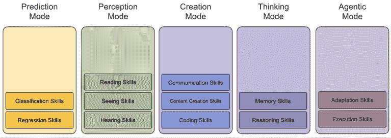

图 2.5：五种 AI 商业模式概述

在接下来的章节中，我将逐一介绍这五种模式。我会强调它们可以支持的任务类型、驱动它们的技术（如 ML、DL 或 GenAI），以及通常使用的工具或方法。

你不需要学习神经网络背后的数学。但到本章结束时，你将能够识别与你的商业目标相一致的关键 AI 能力，并了解如何将它们转化为实际行动。

让我们从第一个模式开始：*预测*。

## AI 的预测模式

预测是现代人工智能中最古老且最被证明的使用案例之一——并且仍然是最有价值的之一。这种模式完全关乎*预测*、*分类*和*理解复杂性*，这一切都基于数据。你可能已经看到了它的实际应用，却并未意识到：当 Netflix 推荐一部剧集，当银行检测到欺诈，或者当仓库及时补充库存时。预测模式是这一切背后的安静引擎。它并不总是成为头条新闻，但它经常推动最清晰的回报率。

在本章的剩余部分，我们将使用术语*技能*来指代 AI 可以执行的一种技能。

预测模式包括三种关键的 AI 技能集：

+   **回归技能**：这些系统根据历史数据预测未来的值或结果。把它们看作是 AI 的估计、预测或评分的等价物——无论是下个月的销售额还是贷款申请人的风险概况。

+   **分类技能**：这些技能对信息进行排序、标记、分组和匹配。它们帮助结构化混乱的输入，例如将类别分配给文档或根据紧急程度标记电子邮件。

这些技能共同帮助企业在结构化和评分现实方面实现超越人工努力的方式。

**是什么推动了这些技能？**

大多数预测模式由传统的机器学习技术驱动，利用线性回归、决策树或聚类方法等统计算法来处理结构化、表格化的数据。XGBoost、Facebook Prophet 和 Azure AutoML 等自动化机器学习平台在这里被广泛使用。


图 2.6：Microsoft Azure AutoML 比较 62 个机器学习模型以识别最适合航班延误预测任务的模型截图

然而，生成式 AI，尤其是 LLM，也可以在这种模式中发挥作用，尤其是在处理非结构化或基于文本的输入时。例如，LLM 可以将电子邮件分类为垃圾邮件或非垃圾邮件，检测评论中的情感，或将混乱的、开放的文本地址字段中的国家代码进行映射。在这些场景中，生成式模型更像高级分类器，帮助结构化数据而不是生成原始内容。

**它在商业中出现在哪里？**

对于这类图像或音频分析，平台如 Google Cloud Vision、Azure Document AI 或 OpenAI Whisper（用于语音）就会发挥作用。甚至 ChatGPT 也可以用于此。

虽然许多现代平台提供预构建的模型或无代码界面——允许业务团队在没有需要大量数据科学家的情况下开始使用 AI——但许多预测场景需要你从头开始训练自己的模型，或者至少根据你自己的数据进行模型微调。预测模式在业务功能中深度嵌入，有几种商业用途。以下是一些你可能会遇到的常见用例：

+   **营销**使用它来评估潜在客户、预测活动表现以及根据行为分组客户。

+   **金融**领域将其应用于风险建模、欺诈检测和需求预测。

+   **客户支持**团队依赖它来优先处理工单、将查询与帮助内容相匹配以及检测支持量中的模式。

+   **运营**使用它来估算库存需求、检测异常情况以及自动化质量检查。

我们现在来谈谈感知的世界。在这个模式下，人工智能超越了干净、表格化的数据。

## 人工智能的感知模式

当预测模式有助于理解结构化数据时，感知模式允许人工智能解释*非结构化*的世界——特别是通过阅读、观看和聆听。这种模式扩展了人工智能的触角，使其能够访问以前只有人类才能访问的格式：文档、图像、语音等。

将感知模式视为赋予人工智能理解感官输入的能力。这就是机器开始以类似人类的方式开始*感知*世界——处理现实世界的信号并将它们转化为可用的商业信息。无论是扫描收据、解释语音备忘录还是从 PDF 中提取数据，感知模式是解锁原始输入洞察力的基础。

**感知模式的核心技能类别**

感知模式包括人工智能技能的三个核心类别：

+   **阅读技能**：这些能力允许人工智能处理和解释书面或印刷语言，尤其是在扫描文档、PDF、手写笔记或长篇文本等非结构化格式中。**光学字符识别**（**OCR**）、布局检测和文档解析属于此类。

+   **视觉技能**：这些视觉感知技能帮助人工智能系统解释图像、视频、图表甚至物理环境。从检测制造线上的缺陷到在照片中分类产品，识别面部或理解 PDF 中的复杂布局——这些技能赋予人工智能视觉理解。

+   **听觉技能**：这些系统将音频输入进行转换和分析——如转录口语、识别说话者、检测情绪和语调。或者只是识别你最喜欢的歌曲。听觉技能从音频数据中释放出巨大的潜力。

这些技能共同使人工智能能够*感知*现实，将以前无法访问的格式带入结构化处理和决策的领域。

**是什么赋予了这些技能力量？**

感知模式越来越多地依赖于深度学习技术，特别是用于视觉的**卷积神经网络**（**CNNs**）和用于语言和音频的**转换器模型**。与浅层机器学习不同，这些模型在处理复杂、高维输入（如像素或波形）方面表现出色。但 GenAI 也在这里取得了巨大的突破。基于转换器的架构，如 OpenAI Whisper 或 GPT-4o 背后的架构，使人工智能能够具有跨模态的上下文意识来*阅读*、*观看*或*聆听*。

现代 AI 平台通常通过用户友好的工具和 API 来抽象这种复杂性——因此即使是非技术团队也可以利用感知能力，而无需从头开始训练模型。

**它在商业中体现在哪里？**

感知模式在各个行业中广泛应用：

+   **操作**使用它来检查产品质量，通过摄像头监控安全，或从发票和运输标签中提取文本。

+   **客户体验**团队使用它来转录和分析支持电话，或自动分类收到的文件。

+   **法律和合规**使用它来阅读合同、提取条款或在扫描的协议中检测异常。

+   **医疗保健**将其应用于分析 X 射线、数字化手写笔记或解释患者语音输入。

通过赋予 AI 阅读、观看和听的能力，感知模式将模拟世界转化为数字燃料——使在曾经完全手动的情况下实现更深入的洞察和更高的自动化。

接下来，让我们进入创建模式的世界。在这种模式下，AI 停止分析并开始构建。

## 人工智能的创建模式

如果预测模式和感知模式帮助你理解“是什么”或“可能是什么”，那么创建模式就是 AI 开始“构建”的地方。这是内容生成、想法变为现实、执行速度显著加快的地方——机器承担起曾经需要专家人工手法的创造性和技术任务。如果你曾经要求 ChatGPT 撰写电子邮件，使用 Copilot 创建社交媒体图像，或者看到工具将提示转换为可工作的代码，那么你已经接触到了创建模式在实际中的应用。

创建模式包括人工智能技能的三个核心类别：

+   **编程技能**：AI 可以根据简单的语言提示生成、解释、调试或转换代码。这些技能在想法和实施之间架起桥梁——特别是对于非技术用户或精简团队。

+   **内容创建技能**：这些是生成性能力，可以产生原始输出——文本、图像、视频、音频，甚至是交互式设计。结果不仅仅是模板化的，通常是从零开始生成或带有轻微的参考方向。

+   **沟通技能**：AI 可以撰写、回复、翻译、解释或进行自然流畅的对话，使企业能够简化内部工作流程和面向客户的沟通。

这些技能共同赋予个人和团队以创造更多、更快的能力，同时减少开销，并且通常减少对特定技能的瓶颈。

**这些技能的动力是什么？**

大多数的创建模式由旨在生成新原创内容而非仅仅重复现有数据的 GenAI 系统驱动。这包括以下模型：

+   **LLMs**如 GPT-4 或 Claude，可以从提示中生成类似人类的文本。

+   **扩散模型**如 Midjourney 或 Flux，可以从

    文本输入。

+   **多模态模型**可以在文本、图像、音频甚至视频格式（如 GPT-4o 或谷歌的 Gemini）中生成或转换内容。

在技术方面，创造模式建立在深度神经网络架构之上——特别是转换模型和卷积网络。但从用户的角度来看，大多数工具现在*极其易于访问*。许多使用拖放界面或基于提示的输入，根本不需要任何技术技能。

**它在业务中的体现？**

创造模式正在迅速重塑创意、技术和沟通工作流程。以下是各种企业如何利用创造模式 AI 的力量的例子：

+   **营销**团队使用它来生成活动文案、视觉内容和视频资产。

+   **产品和设计**团队使用它来构建原型、提案演示文稿和文档。

+   **销售**团队使用它来撰写大规模的拓展电子邮件、跟进邮件和价值主张。

+   **工程**团队使用它来加速原型设计、代码转换和错误修复。

+   **客户体验**团队使用它来起草回复、翻译消息或用通俗易懂的语言解释产品功能。

创造模式下的 AI 增强了创意专业人士的工作，显著提高了他们的速度，并减少了初稿、重复编辑或简单生产任务的负担。

接下来，我们将进入一个更注重认知的空间。让我们探讨人工智能如何*思考*、*推理*和*解释*。

## AI 的思考模式

一些商业问题不能通过猜测下一个标记来解决——它们需要*推理*、*解释*和*连接点*。这就是思考模式的作用。在这种模式下，当答案不明显或需要提取、转换或解释信息才能采取任何行动时，这种模式变得特别强大。

想象一下这样的任务：总结一份 40 页的研究报告、将产品功能映射到客户痛点，或者根据多个变量决定如何路由支持工单。这些问题不仅仅是内容问题，它们是*思考*问题。

思考模式包括两个关键技能领域：

+   **推理技能**：这些系统分析、连接、解释、总结并基于数据或非结构化输入做出决策。它们非常适合综合、洞察生成和智能优先级排序。

+   **记忆技能**：这些能力使 AI 能够访问和应用存储的信息——无论是来自其自身的训练、知识库还是最近的交互。它们提高了响应准确性、个性化以及上下文相关性。

这些技能让 AI 更像是一个分析伙伴——不仅仅是响应提示，而且通过利用内部或外部信息，让它们能够通过*思考*来处理这些提示。

**是什么赋予了这些技能力量？**

在底层，思考模式仍然由 LLM 提供动力，但有一个重要的转折：这里使用的许多前沿 AI 模型，如 GPT-5 和后续模型、Gemini 或 Claude——允许你在推理时间额外进行计算，以速度换取准确性。这通常被市场宣传为**推理**或**思考**功能；确切的机制和影响此过程的方式因提供商而异。

这种更慢、更谨慎的方法是为那些简单文本补全无法满足的任务设计的。例如，证明数学定理、解释法律语言，或者甚至只是计算*strawberry*中*r*的数量。这些任务需要逐步逻辑，而不仅仅是流畅性。

因此，推理模型可能需要更长的时间——有时是几分钟——来生成响应。但它们被设计用于那些准确性、深度或复杂性比快速响应生成更重要的场合。

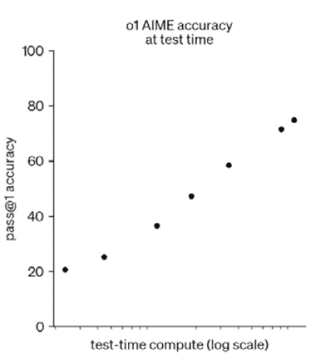

图 2.7：通过更长的测试时间计算（“思考时间”）提高准确性。来源：https://openai.com/index/learning-to-reason-with-llms

你也可能会在这个模式中听到**检索增强生成**（**RAG**）这样的术语，其中模型在运行时拉入相关的文档或数据。

**快速提示**：需要查看此图像的高分辨率版本吗？在下一代 Packt Reader 中打开此书或在其 PDF/ePub 副本中查看。

**下一代 Packt Reader**随本书免费赠送。扫描二维码或访问[`packtpub.com/unlock`](https://packtpub.com/unlock)，然后使用搜索栏通过名称查找此书。双检查显示的版本，以确保您获得正确的版本。


高级 RAG 架构在*图 2.8*中展示：

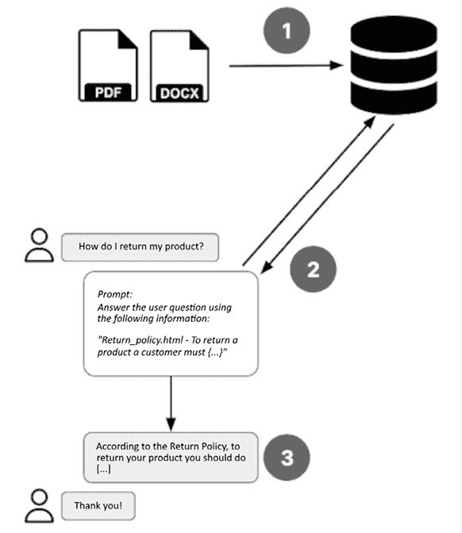

图 2.8：高级 RAG 架构

简单来说，RAG 的工作原理如下：

1.  一组文档存储在可搜索的数据库中——通常是一个向量存储，它将内容的语义意义编码成数值表示。

1.  当用户提出问题时，系统会实时搜索这个数据库以识别最相关的信息片段，并将它们与用户的查询一起注入提示中。

1.  这个增强提示随后被传递给语言模型，使其能够生成一个基于检索内容的响应。

1.  结果是一个更准确、具有上下文意识的答案，反映了最当前和特定领域的知识。

这样，RAG 能够将 LLM 的回应与外部数据相结合。通过**接地**其回应在外部数据上而不是仅仅依赖预训练的知识，RAG 系统可以显著减少幻觉并增强 AI 生成输出的可靠性。

**它在商业中体现在哪里？**

思考模式在知识密集型、洞察力驱动的任务中具有巨大潜力：

+   **客户体验**团队使用它来解释客户反馈或决定下一步的最佳行动。

+   **产品和战略**团队使用它来绘制洞察力或根据复杂标准优先排序功能。

+   **法律、合规和人力资源**团队使用它来提取相关条款、解释文件或跨部门协调政策。

+   **分析师和研究人员**使用它来生成结构化摘要、得出结论或综合开放式调查回应。

思考模式并不取代人类的洞察力，但它加速了团队获取洞察力的速度，尤其是在处理复杂性时。

**注意**

这些模式不是相互排斥的——它们在现实世界的 AI 解决方案中经常结合使用。例如，思考模式可以与创造模式结合，基于复杂推理生成高质量、结构化的输出。你可能会使用非推理模型如 GPT-4o-mini 来快速起草功能文档，或者引入具有推理能力的模型如 Grok - 3 来智能地重构整个代码库。深度（思考）和输出（创造）的结合是许多高级商业用例得以实现的地方。你将在本书的后面部分了解更多关于如何结合这些技能来设计自己的解决方案概念。

结合所有这些模式——预测、感知、创造和思考——现代人工智能系统已经变得极其强大。但现代人工智能的能力并不止于此。

让我们来看看人工智能的代理模式。

## 人工智能的代理模式

今天的大多数人工智能系统都是反应性的——它们分析、生成或解释，但只有当它们被指示这样做时。但如果人工智能能够采取行动呢？代理模式是人工智能从被动助手转变为主动操作者的地方。在这种模式下，人工智能系统不仅产生输出，还采取行动、触发工作流程，并在工具、系统和环境中协调任务。

代理模式包括两大类技能：

+   **执行技能**：这些是人工智能的操作臂。它们发送消息、触发流程、执行任务，并在系统间编排多步骤流程，使人工智能系统能够与真实世界互动并收集反馈。

+   **适应技能**：这些技能允许人工智能根据反馈、性能数据或环境变化随着时间的推移调整其行为，只需最小程度的人类干预。

这些能力将人工智能从你*询问*的工具转变为基于推导逻辑、触发器或学习行为的*主动执行*的工具。

**是什么赋予了这些技能力量？**

代理模式是通过一系列技术的组合实现的：

+   **LLMs** 作为推理层，解释意图并做出动态决策。

+   **函数调用框架**（例如 OpenAI Functions 或 LangChain）让 AI 触发操作或外部工具。

+   **工作流程自动化平台**（例如 Zapier、N8N 或自定义 API）处理任务执行。

+   **自主代理和编排框架**（例如 LangGraph 或 CrewAI）通过记忆和反馈循环管理更长、多步骤的任务。

+   **强化学习和基于反馈的系统**支持适应性，使代理能够从性能中学习并随着时间的推移而发展。

虽然执行技能可以通过低代码平台获得，但适应性技能更为高级，通常需要更深入的集成、监控和限制。

**快速现实检查**

代理模式是五种 AI 模式中最复杂和最具技术挑战性的。虽然自运行的 AI 代理的想法听起来是终极解决方案，但它很少是一个好的起点。这些系统需要仔细配置、监控，并且通常需要深入定制才能在生产中可靠地运行。

在这本书中，你将学习如何以现实和可持续的方式扩展你的 AI 之旅——从低自动化到高自动化。现在，只需记住：代理 AI 可能听起来是每个问题的答案，但现实往往大相径庭。

**它在业务中出现在哪里？**

代理模式仍在兴起——但它已经改变了工作完成的方式：

+   **销售和营销**团队使用它来发送跟进、自动生成报告，并更新 CRM 而无需动手。

+   **支持和成功**团队使用它来解决客户工单、升级问题，并随着时间的推移调整基于知识的响应。

+   **跨职能团队**使用代理来编排多系统交接、协调交付成果或自动驱动端到端流程。

代理模式是 AI 有点像“活过来”的地方——连接洞察力和行动，以自动驱动实际成果。

这五种 AI 模式——预测、感知、创造、思考和代理——以及背后的 AI 技能类别，将是你在这本书中映射 AI 机会和设计 AI 解决方案概念时的限制因素。为了方便你访问这些模式，我创建了一个你可以随时使用的电子表格：[`github.com/PacktPublishing/The-Profitable-AI-Advantage/blob/main/ch02/AI_Skills.xlsx`](https://github.com/PacktPublishing/The-Profitable-AI-Advantage/blob/main/ch02/AI_Skills.xlsx)。

在我们结束这一章之前，让我们更深入地探讨一下 LLMs 的工作原理。LLMs 现在是现代 AI 的一个组成部分，因此简要了解它们是如何工作的至关重要。如果你知道 LLMs 的工作原理，可以跳过这一节。

# 理解 LLMs

我知道这本书不应该是一本超级技术性的书，但鉴于 LLM 可以在现代 AI 系统的许多交互点找到，并且经常用于所有五种 AI 模式中，了解它们在高级别上是如何工作的很有价值，这样你就不会陷入最常见的陷阱。LLM 可以像你在舞台上看到的那些魔术师一样。如果你不知道他们的**技巧**是如何工作的，你可能会轻易高估他们的能力。当然，他们不能让真正的咖啡桌飞起来，但幻觉是完美的。所以，让我们揭开幕布看看。

在本质上，LLM，如 ChatGPT 中使用的 LLM，执行一个主要任务：根据它们所提供的上下文，预测序列中的下一个单词（或者更准确地说，一个标记，它可能只是一个单词的一部分，但为了简单起见，我们将谈论单词）。这个看似简单的机制推动了从日常对话到深入战略洞察的一切。

考虑这个例子：你将短语`The sky is`输入到 LLM 中。幕后，模型为可能的下一个单词分配概率：`blue`可能高度可能，而`usually`或`the`的得分会低得多。你可以在**图 2.9**中看到这个例子：

](img/B31200_02_09.png)

图 2.9：LLM 工作原理的示意图。来源：Annie Surla/NVIDIA 博客[`developer.nvidia.com/blog/how-to-get-better-outputs-from-your-large-language-model/`](https://developer.nvidia.com/blog/how-to-get-better-outputs-from-your-large-language-model/)

所以，LLM 并不真正**知道**天空是蓝色的——它只是根据在训练数据中频繁看到这个短语并学习到统计模式而推断出来的。

但 AI 究竟是如何知道预测哪个单词的呢？

2017 年，谷歌发表的《**Attention is All You Need**》论文([`en.wikipedia.org/wiki/Attention_Is_All_You_Need`](https://en.wikipedia.org/wiki/Attention_Is_All_You_Need))是一个转折点。这篇论文引入了**注意力机制**的概念——一种帮助模型决定关注句子中哪些部分以更准确地预测下一个单词的方法。这样，输入`The sky is`很可能会返回`blue`，但输入序列`The sky is not always`可能会产生`clear`或`predictable`，因为模型现在也在关注单词`not`。本质上，注意力使模型能够根据上下文权衡每个单词的重要性，而不是平等地对待所有前面的单词。这种被称为注意力的方法，现在仍然是所有现代 LLM 的核心组件。

你可能会把这个当作一个技术细节，但理解这种注意力机制的力量和局限性，当与 LLM 一起工作时至关重要。如果你清楚地告诉 LLM 你想要什么，你会得到更好的响应。另一方面，指令中的一个小错误可能会导致模型返回完全不同的输出。这就是为什么你给 LLM 的指令——称为**提示**——如此重要。制作强大的提示不仅是一种技术技巧，而且是一种解锁更好结果的实际技能。

一个常见的误解是，LLM 使用得越多，就会变得越好。实际上，它们**每次会话都是从零开始**，除非经过微调或明确设计为记住上下文（例如，通过定制解决方案或具有记忆功能的设置，如 ChatGPT 中的个性化）。

因此，临时提高 LLM 性能更多的是关于**训练模型**，而不是适应你的输入——这是一种称为**提示工程**的技能。

要立即获得更好的输出，你必须适应 LLM，而不是反过来！

让我们通过一个例子来看看 LLM 是如何**思考**的。

假设你用类似以下的方式提示模型：

```py
What are the best practices in digital marketing? 
```

在内部，LLM 首先生成一个关于下一个可能单词的概率分布：

一些可能的后续词汇可能包括 *It*、*The* 或 *Typically*。模型根据概率分布选择下一个标记，这意味着如果你多次运行相同的输入，你可能会得到相同的响应或不同的响应。这完全取决于每个选项的可能性以及模型如何从该分布中进行采样。

这种内置的随机性是有意为之的。它允许输出中的变化和创造力，而不仅仅是重复相同的措辞或鹦鹉学舌训练数据。这就是 LLM *生成性*的原因——它们不仅仅是检索答案，而是根据概率逐词创建响应。

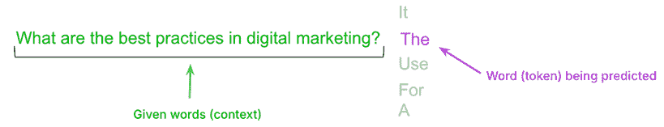

图 2.10：LLM 考虑几种可能的完成

假设模型选择了单词 *The*。

因此，在采样一个完成之后，LLM 将把它添加到输入上下文中，如下所示：

```py
What are the best practices in digital marketing? `The` 
```

模型随后根据这个更新的上下文预测下一个单词。

它会逐词继续下去。关键点是，一旦选择了单词，它就会锁定在序列中。无法回退。没有内置的修订。

在观察到输入序列末尾的单词 *The* 后，模型现在被迫计算以下概率分布：

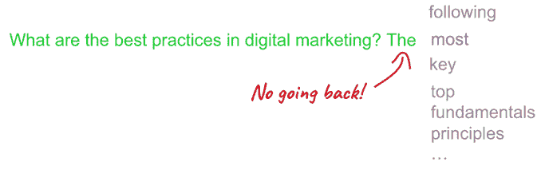

图 2.11：LLM 将完成添加到输入提示并继续完成过程（第二个单词）

这个过程会继续进行，LLM 逐词（或技术上，逐标记）产生输出句子：

```py
`What are the best practices in digital marketing? The most` `effective` 
```

以此类推…

```py
`What are the best practices in digital marketing? The most effective` `practice` 
```

以此类推…

```py
`What are the best practices in digital marketing? The most effective practice` `is` 
```

直到

```py
`What are the best practices in digital marketing? The most effective practice is` `ads`. 
```

模型决定预测是否完成或达到预测的最大标记数。当你看到 ChatGPT*实时*输入响应时，你会看到这种行为。这就是 LLM 的基本工作方式。**下一词预测**。你可以在 ChatGPT 中观察到这种行为。

这也是为什么当要求工具如 ChatGPT 双检其输出时，它们可以发现自己错误的原因。

例如，你可能在先前的例子中看到模型*决定*最佳的数字营销实践是*广告*。由于对单词*实践*而不是*实践们*的不幸采样，限制了模型只建议一个*最佳实践*而不是多个。当大型语言模型（LLMs）生成输出时，它们只能向前看，不能向后看。要*审查*它们的工作，你必须明确地要求它们，它们很可能会捕捉到它们的错误（尽管这并不保证）。

有一种秘密的调料使得整个过程如此有效，产生了令人惊叹的结果，这些结果扩展了*花哨的自动完成*的定义。为了理解它，让我们看看一个刚刚在大量数据（例如，互联网、整个图书馆的书籍等）上完成训练的大型语言模型（LLM）。这就是 AI 人所说的**基础模型**或**基础模型**。

如果你给这个基础模型两个问题，它会返回第三个问题，因为它被训练去预测/重复输入序列的模式。

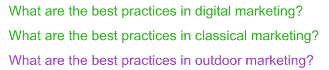

图 2.12：基础模型的文本生成

最初的 GPT 模型直到 GPT-3 都是这样工作的。但这并不很有用。当我们向 LLM 提出两个问题时，我们希望得到两个（理想情况下是正确）答案。因此，OpenAI 的研究人员想出了一个技巧。他们使用了一个较小的问答对数据集，并用它来微调他们的基础模型。它不会给出另一个问题，而是给出一个答案。在此基础上，为了提高答案，他们雇佣了人们手动投票选择最佳回应。结果，OpenAI 生成了一个**指令微调**模型——一个不仅自动完成，而且真正遵循指令的 LLM。所以，如果我们问两个问题，我们会得到两个答案：

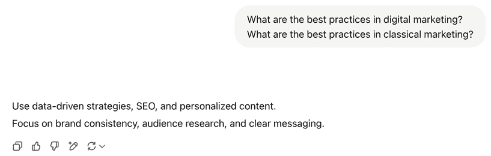

图 2.13：指令微调后的文本生成

这就是 ChatGPT 的突破性时刻。它工作得如此之好，以至于人们常常忘记他们正在与一个进行下一词预测的 AI 互动。这就是魔法发生的地方——也是许多人关于 AI 系统产生错误观念的地方。因为 ChatGPT 遵循指令如此之好，表现得如此自信，你可能会认为它知道自己在做什么。实际上，这可能导致失望和陷阱。ChatGPT 或任何其他基于 LLM 的聊天机器人实际上并不*知道*任何事情。它没有自我意识或意识。这一点非常重要需要记住。因此，相反，你应该将模型视为*愚蠢的*，但同时在应用于正确的事情时却极其有用。

核心观点：LLM 预测序列中的下一个单词。你对输出的主要控制是提示。正如你接下来可以看到的，当我们提供更多上下文，而不仅仅是询问营销最佳实践时，ChatGPT 的回答会调整以适应那个上下文——这是一个强大且难以掌握的概念：

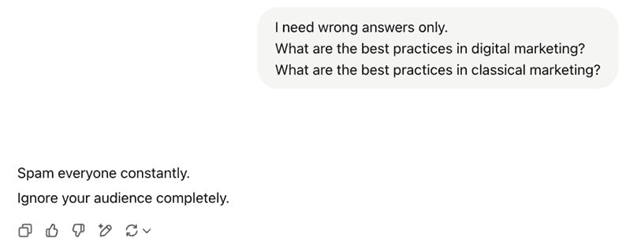

图 2.14：上下文（提示）影响 LLM 的响应

这就是提示工程的核心。对你想要的东西要非常具体。控制 LLM 行为的方式是控制你给出的提示。

# 摘要

在我们结束本章对现代 AI 的理解时，有一点应该是明确的：这个领域广阔、快速移动，并且充满了复杂性。从 AI 这样的高级概念到 GPT-5 这样的实用工具，每一层都引入了新的能力，也带来了新的挑战。

通过理解五种 AI 模式——预测、感知、创造、思考和代理——你现在有一个实用的框架来导航这个空间。这些模式不仅反映了技术*是什么*，还反映了它*能做什么*——以及这些能力如何转化为你业务的价值。

记住，就像美国总统曾经害怕触摸电灯开关一样，对新事物感到谨慎是很正常的。但这里的目的是不是要成为一名 AI 工程师，而是要自信地在你自己的组织中切换正确的开关。

在下一章中，我们将从理解转向应用。你将学习如何发现和设计符合你业务背景的 AI 解决方案，而不会迷失在技术细节中。

|

#### 现在解锁这本书的独家优惠

扫描此二维码或访问[`packtpub.com/unlock`](https://packtpub.com/unlock)，然后通过书名搜索此书。 |  |

| **注意**：在开始之前准备好您的购买发票。* |
| --- |
