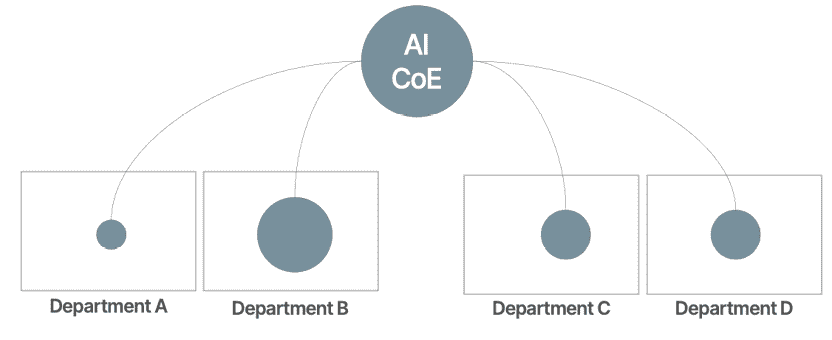
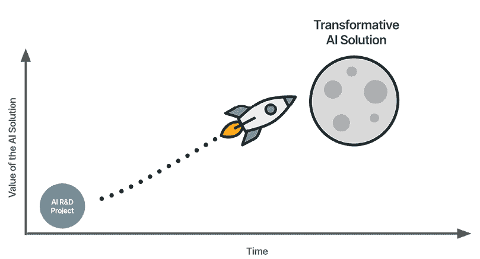
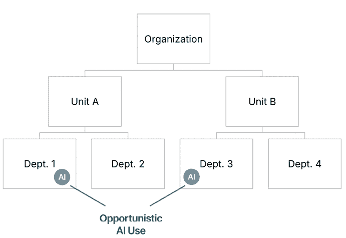

# 3

# 成功采用人工智能的方法

我与的大部分公司都难以理解成功采用人工智能的真实样子。他们常常陷入两个阵营之一。首先，是那些理想主义者，他们梦想着人工智能机器人做所有的工作，这样他们就可以终于花整天时间在海滩上喝玛格丽塔酒。另一方面，你还有那些认为人工智能就像《黑客帝国》一样高深莫测的代码，他们认为这是由 IT 部门完全负责的事情，希望*专家们*知道他们在做什么。然而，这两种观点都是错误的，它们不会让你更接近成功采用人工智能的目标。

为了找到成功采用人工智能的答案，商业领袖和 IT 专业人士常常转向现代人工智能的发明者，即硅谷的大科技公司。“*他们发明了这项技术，所以他们一定知道如何使用它*”是这里的一般想法。但正如我们将学习的，复制硅谷的人工智能策略对于大多数*普通*企业来说是一定会失败的。

本章将解释为什么成功采用人工智能的答案不在于湾区，以及你需要在何处寻找与你的组织环境相一致的人工智能策略。

事实上，我将介绍四种不同的方法，这些方法在许多行业和业务中都非常有效，无论规模大小。它们都有现实世界的成功作为支撑。本章将为你成功开启自己的 AI 之旅提供一个坚实的基础。

让我们开始吧！

在本章中，我们将涵盖以下主要内容：

+   模仿大科技公司的陷阱

+   人工智能分而治之方法

+   人工智能的月度射击方法

+   产品驱动 AI 方法

+   机会主义 AI 方法

+   寻找你的 AI 方法：你在哪里，你想去哪里，以及为什么这很重要

# 模仿大科技公司的陷阱

商业界存在着一种奇怪且持续的现象，即公司——尤其是那些具有高遗产和低技术含量的公司——常常试图模仿那些相对年轻、高科技公司，如谷歌、Meta 或亚马逊的实践。现在，这种趋势并非新鲜事，也不仅限于人工智能。以**目标与关键成果（OKR）**为例。OKR 是一种由谷歌开创的旨在帮助实现大目标同时保持敏捷和灵活的目标设定框架。许多组织纷纷登上 OKR 列车，认为对谷歌有效的方法对他们也会有效。然而，他们常常发现这个框架并不符合他们的运营现实，因此他们对这种技术所能带来的结果感到失望。通常，真正从中受益的只有那些销售 OKR 培训的顾问。

现在，人工智能正被同样的错误逻辑所淹没。全球许多公司都认为，如果他们简单地模仿那些在现代人工智能创新前沿的公司——大科技公司——所采用的 AI 策略，他们也能实现人工智能的成功。然而，大多数人未能意识到的是，这些科技巨头正在玩一个完全不同的游戏。

想想看：你的公司是否有 400 亿美元用于人工智能研发，就像 Meta 一样？你能像亚马逊那样，分配 30 亿美元用于实验性技术吗？你的组织是否拥有超过 24,000 项专利，并且免费提供核心技术，就像谷歌一样？现实是，这些举措只有极少数公司——可能只有 0.0001%的公司——能够做到。但这并不意味着我们其他人离实现人工智能成功还很远。关键是要玩好自己的游戏。利用这些巨头开发的工具和技术，将它们适应到你的具体需求和能力。

为了找到适合你的方法，你不必从头开始。多年来，我已确定了四种独特的**人工智能方法**，你的公司可以采用——特别是如果你是一家在科技泡沫之外运营的普通企业。这些策略已被不同行业和规模的各种公司成功采用，证明在人工智能领域获胜不止一种方式。

让我们探索这些方法，并了解每个类别中的成功是什么样的。

# 人工智能分而治之方法

**人工智能分而治之**的方法常被寻求在可能被人工智能颠覆的行业大规模利用人工智能的公司所采用。这些行业特别数据密集和知识密集，如金融、保险、法律、生物技术和制药，还包括市场营销、销售和客户服务等职能。这些领域处理大量数据，并且高度依赖信息进行决策，因此它们是人工智能转型的理想候选者。

受到古罗马军事战略的启发，商业世界的 AI 分而治之方法涉及通过将其分解为更小、更易于管理的组件，并在明确定义的轨道下展示高度自我控制，来管理大型组织的 AI 转型。这种策略允许组织内的不同单位独立追求自己的 AI 项目，同时遵守一个共同的总目标。

通过多个较小的项目广泛推广人工智能的采用，可以防止“烧尽海洋”的问题，即公司因一个庞大的单一人工智能项目的规模而变得瘫痪。许多企业通常遵循这种方法来管理它们的更广泛的数字化转型，通常由一个中心枢纽领导，通常是**人工智能卓越中心（AICoE）**。

看一下*图 3.1*。AICoE 协调努力，但允许在部门层面保持灵活性和创新，而不对各个业务单位行使最终指令权。

图 3.1：人工智能分而治之方法

如果你仔细观察这张图片，你会发现人工智能项目的大小根据每个部门的需求而有所不同。例如，部门 B 可能有几个 AI 用例，而部门 A 可能只有少数可以用 AI 驱动的用例。因此，这种方法允许根据需求采用人工智能，作为更小、更易于管理的项目。

让我们谈谈这种方法如何在组织中应用。

在实践中，人工智能分而治之的方法需要赋予组织内部的不同部门或单位独立运作的权力，同时保持与共同的人工智能驱动目标的协调一致。这通常从创建一个全面的 AI 用例清单开始——有时数量达到数百个——每个部门可以根据其特定的需求和能力进行优先排序和追求。这些用例可能从人力资源中自动化常规行政任务到在营销部门部署高级预测分析。

AICoE 在这个过程中发挥着关键作用。它不仅整理和优先考虑这些用例，还提供了必要的资源、专业知识和最佳实践支持。这确保了虽然每个部门都有创新的自由，但他们的努力仍然与更广泛的组织战略保持一致。AICoE 可能会组织定期的跨部门会议、研讨会或黑客马拉松，以分享见解、促进合作，并确保人工智能项目朝着有利于整个公司的方向发展。

随着这些人工智能项目的推出，它们的累积效应可能是变革性的。单个项目可能看起来微不足道，但集体来看，它们可以在效率、创新和整体组织绩效方面带来显著的改进。通过让所有层级的员工参与这些项目，组织培养了一种持续学习和改进的文化，提升员工技能，并为他们准备未来的工作。

这种方法有几个优点和缺点。让我们来谈谈它们。

在垂直和团队中独立整合人工智能的分而治之方法提供了几个好处：

+   **组织范围内的赋能**：使组织内的不同团队能够尝试人工智能可以自下而上地促进创新，发现可能无法通过其他方式发现的新成本节约和能力。

+   **更高的员工参与度**：参与人工智能项目可以通过展示他们的工作如何受到人工智能的影响，并理想情况下得到改善，从而激发员工的工作动力。

+   **可扩展性和适应性**：由于每个部门都在进行较小、可管理的项目，因此大规模失败的风险较低，这使得根据需要更容易调整或迭代策略。项目可以并行处理，这进一步加速了 AI 的采用。

但这种方法也带来了一些限制：

+   **对齐挑战**：确保所有部门都朝着相同的整体 AI 战略前进可能具有挑战性。如果没有仔细的协调，存在部门各自为政的风险，导致一种碎片化的方法，这会削弱 AI 项目的效果。

+   **衡量影响**：量化众多小型项目的整体影响很困难。虽然个别项目可能产生可衡量的结果，但将这些结果汇总以了解 AI 采用的全部价值可能很复杂。

+   **预算限制**：由于没有总体业务案例，项目通常需要从现有的部门预算中拨款，这可能会限制它们的范围。如果受预算限制的约束，部门可能会优先考虑短期收益而不是长期创新。

+   **不一致的数据实践**：由于不同部门或单位独立进行 AI 项目，数据收集、处理和分析的方式可能存在不一致。如果没有标准化的数据管理方法，这些不一致可能导致数据孤岛，其中有价值的信息没有在整个组织中共享。这可能会阻碍获得全面见解的能力，降低 AI 项目的整体有效性，并使维护统一的数据战略变得困难，这最终可能解锁更高的 AI 用例价值。

让我们将重点转移到 Moderna 如何成功地在公司不同功能中采用 AI 分而治之的方法。

## 案例研究：Moderna

生物技术创新者 Moderna 通过战略性地将 AI 整合到公司各种功能中，展示了*AI 分而治之*的方法。从法律和研发到制造和商业运营，AI 工具已经嵌入到 Moderna 超过 80%的员工日常工作中。

这次转型的核心是 Moderna 的内部 AI 平台*mChat*，这是一个使用 OpenAI 的 API 构建的 ChatGPT 专有实例。最初于 2023 年初推出，mChat 引发了对 AI 采用的文化的转变，导致 ChatGPT Enterprise 在整个组织中的推广。这种企业级实施包括高级数据分析、图像生成以及针对特定部门需求定制的 GPT 功能。

Moderna 报告称已部署超过 750 个专门定制的 GPT，作为数字助手，支持员工在从总结合同到评估临床试验数据等任务中。例如，在研发部门，剂量 ID GPT 分析数千页的临床数据，以推荐最佳疫苗剂量。它不仅提供理由和可视化，还允许研究人员与模型进行对话，从多个角度探索发现，这显著加速了药物开发中的数据驱动决策。

意想不到的是，法律部门是第一个全面采用 AI 的部门，早期就实现了 100%的使用率。像 Contract Companion GPT 这样的工具允许法律团队上传合同，生成摘要，并查询特定条款，从而为更高影响力的法律策略工作腾出时间。这种早期采用创造了内部动力和对 AI 的信任，这可能是这些工具在其他部门顺利扩展的原因。

在制造业，AI 提高了精度和效率，在需求高峰期（如 COVID-19 大流行期间）能够实现快速扩展。商业团队也受益于 AI 驱动的洞察力和自动化，这些都有助于提高生产力。

Moderna 在 AI 方面的成功提供了几个可操作的启示：

1.  **从强大的数据基础开始**：Moderna 已经是一家以数字为先、机器学习原生公司，这使得 AI 集成更加无缝。

1.  **投资于内部工具**：而不是等待一刀切解决方案，Moderna 内部开发了 mChat，并为不同的功能开发了数百个定制的 GPT。

1.  **关注劳动力转型，而不仅仅是工具**：Moderna 不仅安装了软件，还重新设计了工作流程，并培训员工与 AI 一起工作，将其视为他们能力的延伸。

1.  **以高回报率部门为领导**：法律团队的早期采用证明了其明确的价值，并帮助为更广泛的推广建立了组织动力。

1.  **利用 AI 进行扩展，而不增加劳动力规模**：Moderna 计划在 5 年内推出 15 个产品，员工人数少于 6,000 人——这只有通过自动化和 AI 增强才能实现。

通过这种战略性的分割和征服方法，Moderna 不仅提高了内部生产力，还加强了其在医疗保健领域扩大影响力的能力，提供了一个值得学习的优秀案例研究。

我们接下来要讨论的方法是**AI moonshot**方法，这种方法的目标不是广泛地改变组织，而是旨在构建一个针对极高商业影响的中心核心 AI 解决方案。

# AI moonshot 方法

AImoonshot 策略的核心在于专注于一个单一、具有变革性的 AI 项目，该项目有可能彻底改变公司的运营，甚至整个行业。这种策略与**AI 分而治之**的方法形成鲜明对比，后者将精力分散到多个较小的项目中。在这里，公司将其资源、人才和关注点集中在单个高影响力倡议上——一个可能重新定义公司市场地位并在其行业内设定新标准的月球计划项目。

图 3.2：AI 月球计划方法

通常，在月球计划方法中，产品会随着时间的推移不断进化，最终通过 AI 实现完全转型（见 *图 3.2*）。但究竟什么才算是 AI 月球计划？它不仅仅是 AI 的成功应用；它是一个能够从根本上改变公司运营或向客户交付价值的项目，从而改变或扩展其核心商业模式。想象一下，一个呼叫中心开发了一个能够用超过 10 种语言、24/7 无休、始终提供最新信息的自主语音机器人，其成本仅为人工客服中心的一小部分。这将颠覆整个外包行业。或者想象一下，一个在线大学提供所有学科的 1:1 学习体验，针对每个学生进行定制，以实现最佳学习效果。这些用例，如果做得正确，不仅会 *改善* 业务，还会将其颠覆。

让我们看看这种方法如何在实践中得到实施。

实施 AI 月球计划策略需要在组织内部进行深度垂直整合，并需要超越大多数 AI 项目中典型的承诺水平。月球计划项目通常由中央资金支持。公司必须准备分配大量资源——无论是资本还是人力人才——以确保这一单一倡议的成功。这通常涉及对研发的重大投资、获取或开发尖端技术，甚至可能需要引入外部专业知识来补充内部能力。

被选定的 AI 应用案例成为公司 AI 策略的核心，需要高层管理层的持续关注。为确保成功，组织可能需要进行结构性的变革，例如创建新的专门负责项目的角色或部门，或者重新调整现有团队以更好地支持该倡议。跨部门合作也是必不可少的；虽然该项目可能由特定团队领导，但它很可能需要来自公司各个领域的输入和专业知识，包括 IT、运营、营销和法律。

尽管月球计划方法风险较大，但也带来了一些好处：

+   **行业领导力**：成功执行一个杀手级 AI 应用案例可以使公司在其领域成为无与伦比的领导者，并为公司构建巨大的护城河，使其能够捕获更大的市场份额。

+   **转型影响**：正确的 AI 应用案例可以改变公司的运营，可能开辟全新的商业模式或收入来源，甚至可能创造全新的行业类别。

但在采用这种方法时，你需要意识到一些相当多的局限性：

+   **失败高风险**：专注于单一项目固有的风险。如果项目未能按预期交付，可能会使公司变得脆弱，面临巨大的沉没成本和错失的机会。

+   **高额前期投资**：这种方法需要大量的资本、人才和时间投入。资源有限的小公司可能会难以维持所需的承诺水平。

+   **沉没成本谬误**：由于需要巨额前期投资和长期目标，总是很难说你是否只需要继续推动，还是到了停止项目的时候。项目进行的时间越长，你继续推动的可能性就越高，因为你已经在其中投入了大量的资源。

+   **监管挑战**：根据行业不同，公司可能会面临重大的监管障碍。例如，在医疗保健或金融领域，关于数据隐私和安全的严格法规可能会使 AI 解决方案的开发和部署复杂化，尤其是在它们触及新的业务领域时。

+   **组织阻力**：对单一转型项目的关注可能会在组织内部遇到阻力，特别是如果它需要重大改变既定工作流程或威胁到现有的权力结构。

AI 长征战略的一个典范例子是特斯拉对自动驾驶的雄心勃勃的追求，我们将在下一部分进行讨论。

## 案例研究：特斯拉

特斯拉致力于实现完全自动驾驶能力，这不仅仅是一个副项目；它是公司从传统汽车制造商转型为共享出行服务全球领导者的长期愿景的核心。

特斯拉在 AI 研究和开发上投入了大量资金，包括创建定制的 AI 芯片、开发从数百万辆特斯拉车辆收集的大量数据集，以及聘请顶级 AI 人才。这一举措需要公司工程、软件和硬件团队之间的深度整合，以及持续投资于支持自动驾驶功能 AI 模型的基础设施。

特斯拉的方法独特之处在于其在整个 AI 栈中的垂直整合——即使在最先进的技术公司中，这也是一项罕见的成就。在硬件方面，特斯拉设计了其自己的**完全自动驾驶（FSD）**计算机，配备了定制的神经网络推理芯片，专门针对实时驾驶决策进行优化。这些芯片直接在车辆上处理大量视觉数据，减少延迟并提高安全性。

特斯拉也控制着从端到端的数据管道。每辆在路上的特斯拉汽车都充当一个传感器中心，为可能是有史以来为驾驶场景收集的最大视频数据集做出贡献。凭借数十亿英里的行驶里程和 PB 级真实世界影像，特斯拉拥有巨大的训练优势。公司的自动标注系统使用 AI 大规模标注视频数据，从而实现模型训练的快速迭代。

在软件方面，特斯拉构建了自己的 AI 训练基础设施，包括其专有的 Dojo 超级计算机，专为基于视频的神经网络训练而设计。这使得特斯拉能够推动仅视觉自主性的边界，避免依赖昂贵的激光雷达，而是加倍投入计算机视觉的基础研究。为此，特斯拉拥有一支在世界级水平上运作的 AI 团队。

这项 AI 雄心勃勃的目标的潜在回报是巨大的。虽然特斯拉尚未实现完全自动驾驶，但他们过去十年取得的进步——从完全依赖 AI 来*观察*图像数据（计算机视觉）而不是在汽车上配备专用、昂贵的传感器，从 0 级到 SAE Level 2——是显著的。成功实现完全自动驾驶可能会为特斯拉开辟新的收入渠道，例如自动驾驶出租车服务，并通过提供竞争对手难以匹敌的功能，显著加强其市场地位。然而，风险同样巨大——如果在合理的时间内未能实现完全自动驾驶，可能会危及特斯拉更广泛的企业模式，尤其是在竞争对手推进他们自己的自动驾驶技术的情况下。

特斯拉的历程展示了 AI 雄心勃勃战略的高风险、高回报特性。这是一个大胆的方法，如果成功，可以重新定义一个行业——但它需要坚定不移的承诺、大量的资源，以及直面重大挑战的意愿。

其他追求突破性 AI 产品的组织可以从特斯拉的方法中学习：

1.  **控制全栈**: 特斯拉不仅依赖现成的解决方案——它还构建了自己的芯片，收集了自己的数据，并开发了自身的训练基础设施。这种紧密的集成使公司拥有无与伦比的灵活性和创新速度。

1.  **利用规模创造数据优势**: 随着数百万辆汽车在道路上作为数据收集器，特斯拉创造了一个反馈循环，其中真实世界的性能不断推动模型改进。

1.  **针对您的特定用例进行构建**：特斯拉的 Dojo 超级计算机和定制 AI 芯片并非为通用 AI 设计——它们针对实时、基于视频的感知进行了优化，展示了在专注的 AI 用例中定制基础设施的价值。

1.  **投资于基础研究**：特斯拉为驾驶定制了新颖的计算机视觉技术，这不仅使其在实施上具有优势，而且在推动其模型的核心科学上也具有优势。

1.  **将风险视为策略的一部分**：特斯拉对单一 AI 应用进行大赌注，这可能定义其未来。这需要持续的投资和应对延迟、技术挑战和监管障碍的韧性。

特斯拉的 AI 策略强调，有时最大的回报可能不是将 AI 广泛地应用于每个部门，而是对单一、变革性的用例进行大赌注，并构建实现它的所有必要条件。

接下来，我们将讨论**以产品为中心的 AI**方法。

# 以产品为中心的 AI 方法

以产品为中心的 AI 策略的核心是增强——不一定重新定义——现有产品的人工智能功能，从而提高功能、用户体验和整体价值。这种方法特别适合那些希望在拥挤的市场中保持竞争力同时维持其核心商业模式的公司。AI 不是主要的卖点，而是巧妙地融入产品中，以增强其功能并确保它们继续满足并超越客户期望。

图 3.3：以产品为中心的 AI 说明

区分以产品为中心的 AI 方法的特点是其关注渐进式改进而非彻底变革。AI 被用来微调产品，使它们更智能、更直观，并能更好地满足用户需求。这种策略允许公司利用 AI 的潜力，而无需进行全面商业模式的重塑，这可能是风险和资源密集型的。

这里有一个关于如何将产品为中心的 AI 方法付诸实践的入门指南。

对于采用产品为中心的 AI 策略的公司来说，目标是以一种增强产品而不掩盖其核心价值主张的方式集成 AI。这通常涉及将 AI 技术嵌入产品中，以添加新功能、提高性能或提供更好的用户体验。例如，在技术行业，AI 可以用来改进软件算法，实现更个性化的推荐或更快的处理时间。在消费品领域，AI 可以通过语音识别或基于用户行为的自动调整等功能来提高产品的可用性。

这种方法的一个关键方面是，人工智能本身并不是营销或客户互动的重点。相反，重点仍然在产品及其提供的利益上。这需要产品开发团队、人工智能工程师和市场营销专业人士之间的紧密合作，以确保人工智能功能能够无缝集成并提升整体用户体验。

在以产品为导向的人工智能战略中，人工智能最终成为实现产品待办事项中功能目标的另一种手段。

让我们来看看这种方法的某些好处：

+   **增强用户体验**：通过将人工智能集成到产品中，公司可以提供新的功能和改进的功能，从而提升用户体验。这反过来可以提高客户满意度和忠诚度，因为用户会发现产品更有价值且更易于使用。

+   **竞争差异化**：在竞争激烈的市场中，人工智能增强可以帮助产品在竞争中脱颖而出。即使是诸如更快响应时间或更准确预测等的小幅改进，也可能成为重要的差异化因素。

+   **渐进式创新**：这种方法允许公司在无需对其商业模式进行重大改变的情况下持续创新。通过关注产品级改进，公司可以保持领先地位，同时避免与大规模转型相关的风险。

+   **低风险**：由于人工智能功能作为功能增强推出，通常不太可能在没有看到任何回报的情况下投入大量资源。功能通常被范围化以允许敏捷交付，因此人工智能开发增量需要很小。这允许你更好地控制成本并监控持续的过程。

以产品为导向的人工智能方法也带来了一系列挑战，以下列出了一些：

+   **可复制性**：由于人工智能的改进通常是渐进的，因此存在竞争对手会迅速复制它们的风险，从而降低竞争优势。如果模仿者能够找到从早期采用者的用户体验中学习的方法，他们甚至可能提供比先行者更好的体验。

+   **组织学习减少**：专注于产品级人工智能集成可能不会导致对人工智能的更广泛组织理解。这可能会限制公司跨组织扩展人工智能解决方案或探索未来更多变革性人工智能机会的能力。

+   **错失重大创新**：如果你的产品在人工智能创新方面领先，那么创新的范围本质上会受到产品范围的限制。这可能导致你将产品改进到完美，却错过了使你的产品过时的更大趋势（例如，计算机制造商错过了移动热潮）。

+   **创新压力**：对持续产品改进的依赖可能会给研发团队带来压力，迫使他们不断进行创新，专注于短期改进，而忽视了长期创新。

让我们看看以产品为导向的 AI 方法如何推动苹果的成功。

## 案例研究：苹果

苹果将 AI 巧妙而强大地集成到其产品中，体现了以产品为导向的 AI 策略。尽管苹果很少在其营销中强调 AI，但这项技术深深植根于其许多产品中，增强了功能性和用户体验。

以**FaceID**为例。这个由先进 AI 算法驱动的面部识别系统，彻底改变了用户与设备互动的方式。它提供了一种无缝、安全且高度直观的方法来解锁手机、授权支付和访问敏感信息。通过将这一 AI 驱动的功能集成到其设备中，苹果不仅提高了安全性，还增强了便利性，巩固了品牌在创新和以用户为中心的设计方面的声誉。

另一个例子是机器学习在苹果相机系统中的应用。得益于 AI，您的智能手机可以分析和优化图像中的每一个像素，生成更清晰、更详细、更逼真的照片。这些增强功能并非作为 AI 特性本身进行营销；相反，它们被视为整体摄影体验的一部分，这是苹果设备的关键卖点。

苹果策略的独特之处在于其**深度嵌入**、**垂直整合**的 AI 架构，最近被命名为**Apple Intelligence**。苹果没有专注于单一杀手级应用或部门范围内的推广，而是选择让 AI 悄然提升其旗舰产品——iPhone、iPad 和 Mac——的核心体验，这些体验是用户每天都会依赖的。

随着 2025 年 iOS 18、iPadOS 18 和 macOS Sequoia 中 Apple Intelligence 的推出，苹果推出了一系列生成式 AI 功能，旨在增强语言、图像创作、个人上下文和任务自动化。这包括以下工具：

+   智能文本处理，用于跨应用写作、重写和校对。

+   清理照片中的杂项元素。

+   使用设备上的模型进行通知摘要和邮件分类，以简化通信。

+   视觉智能，利用摄像头进行物体识别、文本翻译和上下文感知操作。

在幕后，这一功能由一个高度集成的 AI 堆栈提供支持：

+   **苹果硅**：配备专用神经引擎的 M 系列芯片专为在设备上高效且安全地处理 AI 工作负载而设计。

+   **设备上处理**：大多数 Apple Intelligence 功能在本地运行，在不牺牲速度的同时保护隐私。

+   **私有云计算**：对于更复杂的工作任务，苹果将数据传输到加密服务器——仅在需要时，并且仅得到用户同意——确保即使在规模上也不会牺牲隐私。

苹果公司还根据每个设备的形态和优势定制 AI 功能。例如，在 iPad 上，iPadOS 18 中的新功能如数学笔记和智能脚本使手写更加互动和实用。用户可以使用 Apple Pencil 实时解决方程式，或像输入文本一样流畅地编辑手写笔记。

值得注意的是，苹果很少将这些功能作为“AI”本身进行营销。相反，它们无缝地融入产品叙事中：智能就是如此简单。这使得苹果能够专注于取悦用户，而不是用技术术语让他们眼花缭乱。

苹果的方法为那些希望将 AI 融入其产品线而不会让用户感到不知所措或疏远的公司提供了明确的教训：

1.  **以用户体验为中心设计 AI，而非流行词汇**：苹果公司不是以 AI 为起点；它以易用性为起点。只有当 AI 功能使某物更快、更简单或更令人愉悦时，才会展示这些功能。

1.  **控制技术堆栈**：从芯片设计（苹果硅）到保护隐私的云计算（私有云计算），苹果公司确保其 AI 生态系统安全、高效，并针对其产品进行优化。

1.  **在最重要的地方无形地部署 AI**：如 FaceID、智能脚本或照片清理等特性都是 AI 驱动的，但苹果将其定位为核心产品功能的增强 - 而不是独立的工具。

1.  **默认优先考虑隐私**：苹果公司致力于尽可能在设备上运行模型，并加密在云中使用的任何数据，这有助于建立长期的用户信任 - 尤其是在消费技术领域至关重要。

1.  **利用特定形态的智能**：无论是 iPad 上的实时手写增强还是 iPhone 上的照片清理，苹果确保每个 AI 应用都符合设备的上下文。

通过以增强产品价值而不掩盖其价值的方式整合 AI，苹果成功地在竞争激烈的市场中保持了其领导地位。这种方法允许苹果不断改进其产品，为用户提供新的、有价值的功能，使他们忠于品牌，同时也为竞争对手在产品质量和创新方面设定了标准。

# 第 4 种方法：机会主义 AI

**机会主义 AI**方法适合那些在 AI 采用上偏好谨慎、风险规避策略的公司。这里的普遍态度是：“除非你证明我错了，否则我们不需要 AI”。虽然这听起来可能有些天真，但许多行业面临的最紧迫挑战与 AI 无关。以贸易、建筑或任何其他实体业务为例。机会主义 AI 方法涉及仅在出现引人注目、定义明确的用例时才整合 AI - 这种用例为特定的业务功能或流程提供即时的、有形的益处。而不是在企业的各个层面追求 AI 创新，采用这种策略的公司专注于符合其现有运营目标的实用、经过验证的应用。

当公司希望改善特定功能中的一个单一工作，而这些功能有通过 AI 改善的可靠记录时，这种方法效果最佳。想想客户服务或营销中的工作。

图 3.4：机会主义人工智能采用说明

通过在这些领域有选择地部署 AI，公司可以在不进行大规模转型或承担重大风险的情况下实现效率和成本节约。与 AI 的分割和征服方法不同，这些领域的采用不是由高管层*推动*的，而通常是业务专业人士发现 AI 可以改善他们日常工作的*拉动*。

实施**机会主义人工智能**方法通常是由工具驱动的。一款新的软件或供应商吸引了商业专业人士或中级业务领导者的注意，他们*奋斗*以获得资源来实施该工具。由于默认决策是*我们不需要它*，希望从人工智能技术中受益的业务用户必须为该工具制定一个明确的商业案例。这导致定义明确、范围明确的用例，但也可能导致实施周期更长，这取决于工具的成本和复杂性以及组织的规模。

这种方法的一个关键方面是强调效率和快速胜利。选定的 AI 应用通常是低风险的，并且有很高的可能性带来即时的好处，例如降低运营成本或提高客户满意度。这确保了公司可以在不破坏现有流程或对其整体商业模式进行重大改变的情况下看到可衡量的结果。

以下是你的组织如何从机会主义人工智能方法中受益：

+   **风险降低**：通过专注于特定、经过验证的 AI 实施，公司最小化了与未经测试或实验性应用相关的风险。这使得他们能够在不承担广泛、针对性较低的项目的高成本或潜在失败的情况下，利用 AI 的好处。

+   **即时回报**：这种方法的选性确保了 AI 集成与特定的商业目标紧密一致，导致效率、成本节约或客户满意度方面的快速和可衡量的改进。

+   **利用已证实的成功**：公司可以采用已经在类似功能或流程中得到其他人验证的人工智能技术，减少不确定性，并允许使用最佳实践。

在采用这种方法之前，你需要了解一些局限性：

+   **错失更广泛的机会**：通过只关注特定功能或流程，公司可能会忽视更广泛、变革性的 AI 机会，这些机会可能会彻底改变业务的其它部分。这种选性方法也可能限制公司快速适应或应对市场条件变化或竞争对手进步的能力。

+   **落后于竞争对手的风险**：那些只在少数领域选择性地采用 AI 的公司可能会落后于实施全面 AI 战略的更具侵略性的竞争对手。这可能导致失去先发优势，可能影响市场份额并削弱公司在行业中的领导地位。

+   **自满导致停滞**：公司可能会对其现有流程过于舒适，导致停滞。随着时间的推移，这可能会限制组织进行创新或适应未来中断的能力。公司需要通过持续监控技术进步和尝试新的 AI 机会来保持竞争力，以防止这种情况发生。

+   **集成挑战**：机会主义 AI 采用往往会导致集成挑战，其中 AI 系统可能无法无缝连接到现有的工作流程或彼此之间，导致效率低下或碎片化的方法。这可能会复杂化在整个组织中扩展 AI 的努力，并降低 AI 倡议的整体有效性。

家得宝——在这里是一个典型的零售商——是关注经过验证、高影响 AI 应用的**机会主义 AI**方法的一个好例子。让我们深入了解。

## 案例研究：家得宝

家得宝（The Home Depot）利用监督式机器学习和计算机视觉来优化库存流程，确保产品在正确的时间和地点。这种有针对性的 AI 应用已经带来了成本节约和客户满意度提升，无论是在店内还是在线。

它还通过 AI 驱动的搜索和产品推荐系统有选择性地增强了其电子商务体验。这些工具提高了参与度并推动了转化，但仅在投资回报清晰且可衡量的情况下。

公司采取的一些关键举措包括：

+   **Sidekick 应用**：一款内部开发的移动应用程序，使用机器学习和计算机视觉帮助店员通过实时库存管理进行补货。

+   **魔法围裙**：一套生成式 AI 工具，旨在为顾客提供在线专家建议和产品推荐——特别有助于 DIY 项目。

+   **增强搜索功能**：由 AI 驱动的算法提高了站内搜索结果的相关性，导致点击率提高和更高的转化率。

虽然许多现代零售商都有类似的应用，但家得宝因其对 AI 部署的关注和纪律性而脱颖而出。

下面是这个策略的一些关键要点：

+   **识别高影响区域**：关注 AI 能够带来明确、可衡量价值的领域，例如库存管理或客户服务。

+   **利用现有专业知识**：使用内部知识和运营数据来设计相关、特定领域的应用程序。

+   **保持操作简单**：避免不必要的复杂性。优先考虑增强现有工作流程的技术，而不是破坏它们。

+   **监控和评估结果**：持续衡量 AI 工具的影响，并根据需要调整，以确保长期有效性。

家得宝的机会主义 AI 策略为那些想要拥抱 AI 而不需要彻底改变其运营的公司——无论是零售业还是其他行业——提供了一个范例。它表明，AI 不需要花哨才能有效。一种专注且深思熟虑的方法可以带来实质性的商业成果——而不需要实施 AI 的任何成本或风险。

现在我们已经探讨了 AI 采用的多种方法，我们将讨论如何确定哪种方法最适合你的组织。

# 找到你的 AI 方法：你在哪里，你想去哪里，以及为什么这很重要

那么，这四种方法——AI 分而治之、AI 月球计划、产品主导 AI 或机会主义 AI——你应该如何为你的组织选择？这就像问，“最好的车是什么？”却没有任何关于谁在驾驶、你要去哪里或你为什么要旅行的背景信息。正确的 AI 策略，就像正确的车辆一样，取决于你的**当前状态**、你的**目标未来状态**以及你为什么需要到达那里的重大原因。

我们将讨论关键考虑因素，帮助你弄清楚这一点。

## 评估你组织的 AI 准备情况

在你一头扎进这四种方法中的任何一种之前，你需要清楚地了解你现在的位置。你以前是否真正在规模上处理过数据？你是否有 AI 人才，或者你将需要依赖外部合作伙伴和供应商？是否有为数字化转型计划预留的预算，或者你已经处于紧缩状态？你的组织文化是否欢迎用新技术“失败中前进”的想法，或者你是否在每个部门门口都面临着怀疑的堡垒？

这些问题并非微不足道。你组织的**AI 成熟度**将指导你是否准备好进行高强度的、研发密集型的**月球计划**，或者一个低风险的、渐进式的**机会主义 AI**试点是否更现实。如果你没有强大的数据基础设施或足够的内部 AI 专业知识，启动一个大规模的、AI 驱动的月球计划（方法 2）可能就像把车钥匙交给一个 14 岁的孩子一样。结果不会好。

确定你的 AI 成熟度最简单的方法是将你的当前状态映射到四种采用方法上。你目前对 AI 做了什么？你是否已经陷入了一个大型的 AI 项目？你可能正在实施产品主导或月球计划方法。你完全没有使用过 AI 吗？那么，你似乎处于机会主义领域——除非有说服力，否则不会使用 AI。

那么——如果你必须简化它——当前的哪种 AI 采用方法最能反映你当前的商业现实？

## 定义你的未来状态

一旦你确定了你的位置，就是时候问自己了：**一年后，两年后，五年后，我们想要处于什么位置？**更重要的是，**为什么？**这是理解 AI 如何影响你的市场动态变得至关重要的地方——回想一下我们在*第一章*中引入的**AI 作为新力量**的概念。我们讨论的每一种方法都可以帮助你至少推动一个竞争杠杆：

+   **新进入者的威胁**：如果你的行业面临来自新进入者的 AI 颠覆风险很高（比如银行面对金融科技新贵或零售商与电商纯玩家竞争），你可能需要一个更大的 AI 策略来保持领先。*AI 分而治之*或*AI 登月计划*可能让你在竞争者涌入之前建立起护城河。

+   **替代品的威胁**：如果你的产品或服务面临 AI 驱动替代品的真实风险，你可能需要一个变革性的方法——比如，加大一个杀手级 AI 用例的投入或将 AI 深度集成到你的产品套件中——以避免过时。

+   **供应商的议价能力**：在数据密集型行业，考虑是否可以通过**AI 分而治之**的方法来普及知识并减少对单一 AI 供应商的依赖。

+   **买家的议价能力**：如果你的客户可以轻松比较并切换到 AI 熟练的竞争对手，那么**产品驱动的 AI**方法可能是区分自己并保持他们忠诚的最简单方式。

+   **现有竞争对手之间的竞争**：如果你的市场非常残酷，你真的有时间进行渐进式改变吗？如果没有，你可能会选择一个大胆的*登月用例*，重新定义整个竞技场。

你的未来状态基本上是你回顾过去时所处的立足点，你说：“**我们解决了 AI 难题，而且我们比竞争对手做得更快（或更聪明）**。”

### 你选择的大理由

一个令人信服的**为什么**是推动你 AI 之旅继续的变革性必要性，即使你遇到障碍（你肯定会遇到障碍）。如果你的**为什么**不明确，你将难以证明 AI 采用的成本、资源分配和潜在风险是合理的。无论你选择哪种方法，都要将其与一个明确、以业务为导向的理由联系起来。例如：

+   通过成本节约或收入增长**提高投资回报率**。

+   通过构建优越的 AI 驱动功能或体验**确保竞争优势**。

+   **开拓新的市场**或产品线，这些在缺乏 AI 的情况下根本不可能实现。

+   **对抗五力模型**的**增强弹性**：例如，通过降低供应商的权力或减少买家的流失。

根据你开始的地方，你的未来状态可能实际上与现在相同（例如，如果你的行业中的竞争动态不需要 AI 的即时变化，那么你完全可以继续像现在一样采取非常机会主义的人工智能采用方法）。或者，也许你的未来状态是你正在做的事情（例如，分而治之）加上在某些垂直领域的一些额外关注（例如，为特定业务领域的产品驱动人工智能）的组合。

明确这一最终目标不仅可以帮助你自信地规划你的 AI 之旅并分配预算。它还将帮助你传达 AI 如何融入你组织的愿景，并获得你的团队、高管和股东的支持。

### 平衡人工智能 ROI 和人工智能研发：了解你在玩什么游戏

我看到的最大陷阱之一是，当公司**认为**他们正在玩一个以投资回报率（ROI）为先的游戏，但实际上却在资助研发的“月亮射击”项目——**或者**反之亦然。这种不匹配导致失望、挫败感，以及令人讨厌的“人工智能被高估了”的论调。以下是如何区分驱动你 ROI 的因素：

+   **以 ROI 为导向的人工智能**：如果你的行业进展较慢，或者你根本还没有准备好大规模的颠覆，那么明智的做法可能是**从小处着手**并快速迭代。**机会主义人工智能**或**产品驱动人工智能**可以提供即时的回报，风险最小。但如果你试图将它们包装成改变游戏规则的重大变革，当结果未能令高层管理层满意时，你只会显得愚蠢。在本书的后续内容中，我们将主要使用这个视角来构建你的 AI 路线图。

+   **以研发为导向的人工智能**：如果你所在的行业中的 AI 颠覆可能是生存性的（例如自动驾驶或高端制造），你可能需要一种“月亮射击”用例方法来确保长期的竞争优势，即使回报不确定且需要数年才能实现。只是不要承诺短期 ROI 来证明这些大赌注。相反，公开沟通这是为未来可能的品类领导地位而进行的战略研发投资。

这里的教训是要对你在玩什么游戏保持残酷的诚实。相应地调整你的预算、时间表和关键绩效指标（KPI）。如果你选择 ROI 路线，衡量短期成功可以通过节省或赚取的美元来衡量。如果你选择研发路线，围绕研究突破、原型或专利设定里程碑，而不是立即的收益。

让我们把这些都放在一起。以下是如何将你的组织现实（当前状态）、你的最终目标（未来状态）以及你的大**原因**（必要性）与四种方法相匹配：

| **方法** | **最适合** | **原因** | **ROI 与 R&D** |
| --- | --- | --- | --- |
| **AI 分而治之** | 具有中等到高 AI 准备度、广泛数据可用性和可能看到广泛 AI 驱动的颠覆的行业组织。 | 您需要通过在多个功能中嵌入 AI 来超越竞争对手。考虑大规模转型，但以小而可管理的块来处理。 | 混合型。每个部门都有一些渐进式的投资回报率，从中央 AICoE 获得适度的研发角度。 |
| **AI moonshot** | 致力于在具有高风险行业的游戏规则中改变游戏规则的公司。 | 您希望获得巨大的先发优势，并且您拥有（或可以获取）实现这一目标所需资源和人才。 | 重大的研发投入。高风险，高潜在回报。预期在看到回报之前需要更长的时间线。 |
| **产品驱动 AI** | 拥有成熟产品和忠实客户的公司，希望在无需彻底变革的情况下保持领先。 | 您希望持续取悦客户并在竞争激烈的市场中区分您的产品。 | 主要以投资回报率为驱动，进行渐进式改进。低到中等风险。 |
| **机会主义 AI** | 在低技术或发展缓慢的行业（或更大行业中的某些部分）中的组织，将 AI 视为锦上添花而非生存必需。 | 只有在存在明确、定义良好的商业案例时，您才会承诺采用 AI。您更喜欢快速胜利和最小程度的干扰。 | 极度关注投资回报率。几乎无研发需求 - 风险最低，行业颠覆性创新的潜力最小。 |

表 3.1：比较四种 AI 采用方法

您可以混合搭配这些方法吗？当然可以，但尽量不要陷入细节。选择您的首要关注点，让它成为您的指南针。您可以随意添加其他元素，但始终保持您的核心目标清晰。在考虑您的下一步行动时，问问自己：这四种方法中哪一种与您最为契合？为什么？在这个关键交叉路口做出正确的选择对于您的未来 AI 和商业成功至关重要。无论您选择哪种方法，请记住**AI 是一个旅程，而不是一次性的项目**。您的市场环境、能力和战略目标应保持持续对话。关注不断变化的五力模型。随着您在 AI 方面获得更多成熟度，重新评估您的策略。始终专注于“为什么”，因为这将引导您在内部政治、预算限制或技术故障威胁到您的计划时。

当然，您可能需要在旅途中调整您的策略。也许您从机会主义 AI 方法开始，证明一些投资回报率，然后随着内部团队获得信心，升级到产品驱动 AI。或者，您可能只是尝试产品驱动 AI 以获得稳定性，并最终决定加大赌注，因为您的市场突然被一个资金充足的竞争对手颠覆。

无论您选择哪条道路，有意识地选择一种方法总比偶然陷入一种不符合您组织需求的*意外 AI 策略*要好。AI 太重要了，不能留给运气。因此，弄清楚您目前的位置，大胆地确定您想去的地方，并关注推动您前进的宏伟目标。其余的只是执行。

# 摘要

了解您想要玩哪种 AI 游戏对于您组织在采用和利用 AI 方面的成功至关重要。正如本章所展示的，盲目模仿硅谷巨头的策略对于大多数公司来说都是失败的配方。相反，成功采用 AI 的关键在于认识到您的独特环境和能力，并选择与您的商业目标和运营现实相一致的正确方法。

在本章中，您已经看到了一些不同行业和不同规模的公司的例子，它们通过玩自己的游戏已经找到了自己的获胜策略。不要将它们视为严格的蓝图，而应将其视为遵循的灵感，并最终构建自己的定制 AI 之旅，这将为您带来独特的 AI 优势。

在接下来的章节中，我将为您提供所需的资源来实现这一点。我们将探讨您如何*确切地*开始您的 AI 之旅，使用实用的工具和经过验证的框架来消除猜测，并帮助您自信地迈出建立自己 AI 优势的第一步。

|

#### 现在解锁本书的独家优惠

扫描此二维码或访问[`packtpub.com/unlock`](https://packtpub.com/unlock)，然后通过书名搜索此书。 |  |

| **注意**：在开始之前，请准备好您的购买发票。* |
| --- |

# 请保持关注

为了跟上生成式 AI 和 LLMs 领域的最新发展，请订阅我们的每周通讯，AI_Distilled，[`packt.link/8Oz6Y`](https://packt.link/8Oz6Y)。

