# 6

# 设计人工智能用例

您现在正处于人工智能旅程的关键阶段。在前一章中，您探讨了如何利用您新获得的人工智能知识来映射组织内部的高级人工智能机会。但从高级映射到有利可图的 AI 路线图还有很长的路要走。这就是为什么本章将深入探讨设计可操作用例的要素，这些用例不仅会明确告诉您该做什么，而且还会为在人工智能实施旅程中进一步优先排序和驱动回报率铺平道路。这里的目的是不仅仅识别人工智能的潜在应用（如我们在上一章中所做的那样），而是深入理解每个用例的结构和影响，并确保您的人工智能倡议与您的商业目标一致，并准备好取得成功。到本章结束时，您将拥有评估潜在人工智能项目的详细蓝图，帮助您就如何集中精力以及如何实现有意义的结果做出明智的决定。

在本章中，我们将涵盖以下主要内容：

+   为什么需要设计用例？

+   用例事实表

+   人工智能解决方案的集成-自动化框架

+   用例事实表的维度

# 为什么需要设计用例？

您可能渴望直接根据您的高级映射开始人工智能实施。但请注意——对每个用例的详细分析对于避免代价高昂的错误是必不可少的。

实际上，设计和构思您的用例是有效实施人工智能的基础。它作为防止常见陷阱的保障，例如过度扩展资源或使人工智能项目与您的战略目标不一致。

第一个原因是，尽管人工智能具有令人印象深刻的性能，但它并不是万能的解决方案。有时，用例设计的微小变化可能需要完全不同的方法。例如，考虑一家希望构建支持聊天机器人以使现场服务人员更容易解决问题的制造公司。您的脑海中可能会浮现出“聊天机器人”，但这真的是他们想要的吗？事实上，大多数服务人员可能并不想与机器人聊天；他们只想提出一个具体问题（或上传一个特定图像）并立即得到他们想要的答案，而不需要与人工智能服务来回过多交流。这一需求将使您的用例远离“人工智能聊天机器人”并更多地进入“增强搜索”领域，这对技术解决方案维度和用户体验都有一些非常不同的含义。界面将不再是聊天界面，而是一个简单的搜索提示。考虑到您的具体需求、挑战和目标，以及彻底的分析，将确保在投入资源到特定用例之前，您清楚地了解范围、需求和潜在障碍。

除了明确你实际上想要构建的内容外，详细的使用案例概念还将帮助你更好地评估项目的影響力和可行性。并非所有 AI 项目都能带来相同的价值。通过详细分析用例，你可以确定哪些与你的业务目标最为契合，并具有提供最大投资回报的潜力。

但让我们在这里更具体一些。

在我们之前的章节中，我们将 RFP 过程中的各种元素识别为高级 AI 机会。现在，我们将这些分解为具体的用例，并学习如何彻底分析每个用例，以了解其潜在影响和可行性。

# 用例事实表

为了结构化你的分析，我们将使用一个名为**用例事实表**的框架。这个工具旨在捕捉用例的所有关键维度，使你能够进行比较、优先排序，并最终决定哪些项目值得追求。目标是为你提供一个单页概览，说明用例试图实现什么，以及需要什么来实现它。

下图展示了一个示例用例事实表：

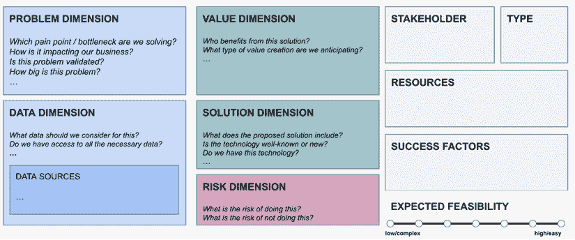

图 6.1：用例事实表模板

你可以在以下链接中找到这份事实表的模板版本（[`github.com/PacktPublishing/The-Profitable-AI-Advantage/blob/main/ch06/Use_Case_Fact_Sheet_Template.pptx`](https://github.com/PacktPublishing/The-Profitable-AI-Advantage/blob/main/ch06/Use_Case_Fact_Sheet_Template.pptx)）。在较高层次上，以下是使用案例事实表所涉及的内容：

1.  **问题维度**：总结 AI 用例旨在解决的具体痛点或瓶颈。

1.  **价值维度**：阐述预期的 10K 影响以及价值杠杆（速度、成本、质量和规模）。

1.  **数据维度**：列出用例的高层次数据需求。

1.  **解决方案维度**：描述提出的 AI 解决方案，包括相关的 AI 模式。

1.  **风险维度**：识别与用例相关的潜在风险，并提出缓解策略。

1.  **利益相关者参与维度**：列出参与项目的关键利益相关者和他们在项目中的角色。

1.  **类型**：根据自动化和集成的程度，这个项目属于哪种用例类型（我们将在稍后了解更多）。

1.  **资源**：概述所需的资源，包括人力、技术和财务资源。

1.  **成功因素**：定义将决定用例成功与否的关键绩效指标（KPIs）。

1.  **预期可行性**：评估用例的整体可行性，考虑复杂性、成本和与战略目标的契合度。

通过系统地填写每个潜在用例的事实表，你确保了项目的每个方面都得到了充分考虑，减少了意外挑战的风险，并增加了成功实施的可能性。

本章的大部分内容将探讨这些用例事实表的不同维度，但在我们深入探讨之前，了解你首先应该考虑哪些用例是很重要的。

在创建用例事实表之前，让我们简要讨论两个你需要考虑的关键因素。

+   **你应该创建多少个用例事实表？**

当然，这里的明显答案是，*这取决于你*。你组织的规模和你人工智能路线图的雄心壮志实际上定义了这里可能实现的内容。如果你是一个中等规模的组织，采用分而治之的方法来采用人工智能（*第三章*），最终得到一个包含 100 多个潜在用例的列表，甚至可能在一个部门内，这并不罕见。另一方面，如果你是刚开始，你不应该花太多时间去思考和规划用例，而应该达到一个可以快速开始行动的位置。

对于大多数从某个地方开始的组织，比如说在某个流程或产品中识别第一个 AI 机会，我通常建议寻找 8-10 个用例。为什么是这个数字？因为这给你足够的空间去实验和迭代不同的项目，同时，你也不会被*分析瘫痪*所淹没，这会让你比开始时更加困惑。

从这里开始，在你继续人工智能之旅的过程中，你可以自由地添加更多的用例。但不要过度劳累。每个流程、部门或产品有 10 个 AI 用例的**待办事项**清单是一个坚实的开始！

+   **你应该考虑哪些类型的用例？**

当从*AI 可以帮助我预测赢得提案的可能性*这个高层次的想法转移到更具体、可操作的形式时，人们常常**用自动化代替复杂性**（通常在他们还不能完全描述解决方案时）.*例如，AI 将*自动*分析收到的提案并*自动*推荐合适的联系人。但事实是，你在初始用例描述中找到的自动化用例越多，这些用例实际上永远不会工作的可能性就越大。这是因为，对于大多数 AI 用例，你需要在 AI 真正为你大规模执行之前，明确告诉 AI 它应该做什么。

为了强调这一点，让我们看看用例如何增长复杂度以及如何有意地管理这种复杂度。

# 人工智能解决方案的集成-自动化框架

人工智能解决方案的**集成-自动化框架**（**IA-AI 框架**）基于一个简单的原则：我们根据两个标准对人工智能解决方案进行分类——它们集成和自动化的程度。

**集成**指的是人工智能解决方案与你的现有系统景观或业务工作流程融合或协同工作的程度。

**自动化**指的是人工智能解决方案在最小化人工干预的情况下执行任务的程度。

想想看。大多数人会认为集成推动自动化，反之亦然。但这并不一定正确。例如，你可以创建一个包含一些自动化但并未完全集成到你的系统环境中的用例。

根据 IA-AI 框架，你会找到四种高级人工智能用例类型——人工智能解决方案可以交付的不同方式。在实践中，当然，这些之间的转换可以是流畅的，但深刻理解这四种类型将帮助你做出更有意图、更明智的设计决策。

*图 6.2* 以矩阵的形式展示了 IA-AI 框架的四个象限中的这四种类型，以及根据集成和自动化程度属于每个象限的一些示例工具。

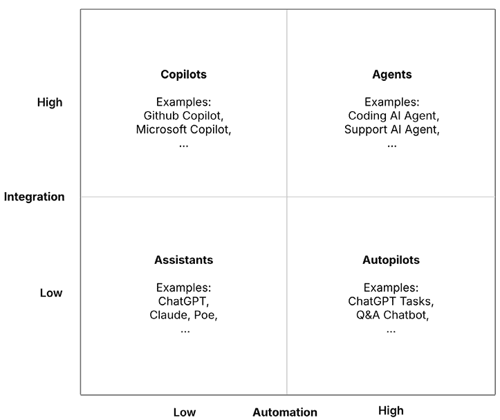

图 6.2：包含一些示例工具的 IA-AI 矩阵

让我通过遍历 IA-AI 矩阵的不同象限来展示如何做到这一点。

## 解决方案类型 1：助手

第一种用例类型是我所说的 **助手**。

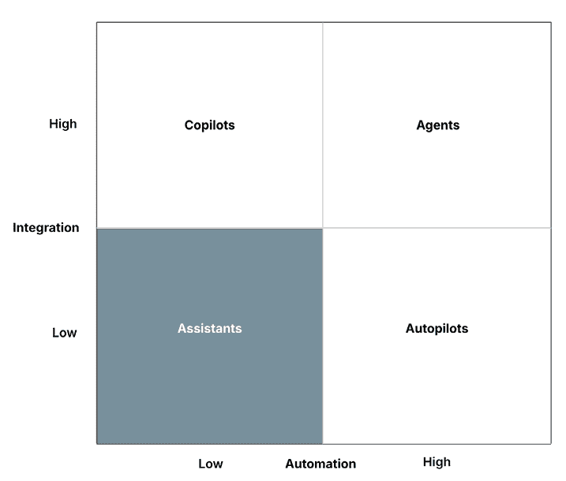

图 6.3：IA-AI 框架的第一象限，人工智能助手

在这些解决方案中，你通常与一个需要你手动处理输入和输出的外部人工智能应用程序合作（例如复制/粘贴文本或上传/下载文件）。典型的集成程度较低，自动化程度也较低。ChatGPT 是这一类型的典型例子。

不要误解——这些应用程序可以越来越强大。ChatGPT 可能是你可能会遇到的最强大的外部人工智能助手。其他例子包括：Poe.com、谷歌的 Gemini 应用程序和微软的 AI 驱动的 Bing 搜索。

助手非常适合通用、临时的生产力任务，例如撰写营销文案、翻译商业文本，或者只是通过口头指导帮助你的人工智能。

## 解决方案类型 2：副驾驶

与助手类似，**副驾驶**需要你承担繁重的工作（即它们的自动化程度较低），但它们更紧密地集成到你的系统景观或业务流程中。

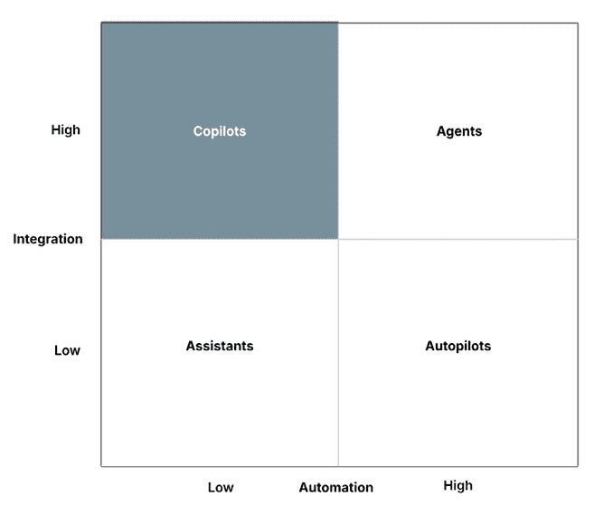

图 6.4：IA-AI 框架的第二象限，副驾驶

这目前是人工智能领域最热门的领域，你可以想到的每家软件公司都在寻求将这 **c**opilot 功能纳入其产品。一些例子包括 GitHub Copilot、Microsoft 365 Copilot、Google Workspace 中的 Gemini AI、Slack 中的 AI 功能、Notion 等。

共同飞行员很棒，因为它们知道你此刻在做什么。例如，如果你使用 Outlook 共同飞行员来回复电子邮件，它将已经知道该电子邮件线程中的先前对话历史。无需复制/粘贴。它还消除了注册新应用的摩擦。然而——这是与下一个用例类型相比最大的区别——没有你的批准，AI 建议 cannot be implemented。因此，你有能力（和责任）根据需要审查和纠正 AI 输出。这就是为什么这种用例类型现在如此受欢迎。即使 AI 模型不是 100% 完美（它们可能永远都不会是），它也提供了巨大的价值。

## 解决方案类型 3：自动驾驶仪

**自动驾驶仪**展示了高度自动化，但集成度相对较低。

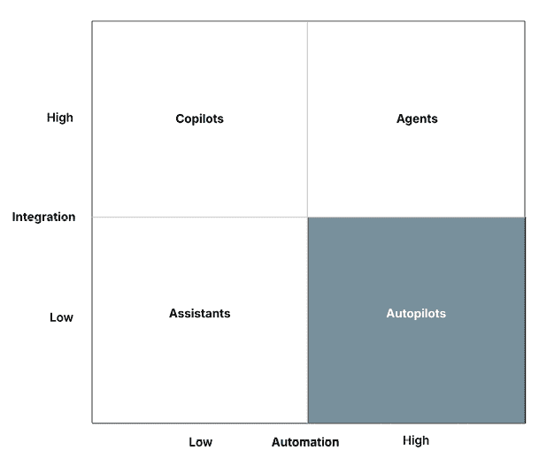

图 6.5：IA-AI 框架的第三象限，自动驾驶仪

```py
I need to reset my password, it would be able to guide you through the process verbally, telling you where to click and what to do, but it won’t be able to reset the password for you itself. If you want to do that (which is technically feasible), you’d need to increase the degree of integration. This would move the project up to an agent use case.
```

但在我们更详细地讨论智能体之前，让我们回顾一些更多关于**自动驾驶仪**用例的例子，这些例子可以在许多不同的领域找到。例如，许多公司使用社交媒体监控工具，这些工具会自动扫描负面情绪，并在发生关键事件时提醒人工管理员，而无需在社交平台上采取直接行动。另一个案例是 ChatGPT 中的**任务**功能，其中 AI 可以定期运行预定义的提示，例如进行竞争对手研究。虽然系统可靠地执行任务，但结果通常只是简单地返回给用户，而不是与下游工作流程连接。同样，自动监控系统可以实时分析视频流，并在检测到特定对象或运动时触发电子邮件警报，但它们不会自动采取下一步行动，例如锁定门或派遣安保人员。即使在物理世界，机器人吸尘器也作为自动驾驶仪运行：它们可以自主导航家庭并根据日程安排清洁，但它们没有与更广泛的智能家居系统集成，例如，可以根据家庭活动调整清洁模式或与其他设备协调。

## 解决方案类型 4：智能体

智能体是人工智能项目的圣杯。每个人都想要它们。

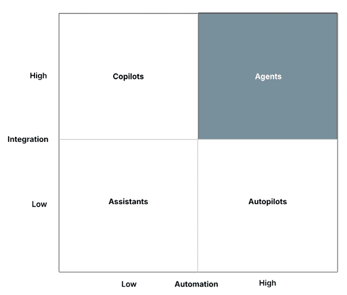

图 6.6：IA-AI 框架的第四象限，智能体

想象一下拥有一个能够回答常见问题并执行某些任务（例如，当用户无法访问其账户时发送密码重置电子邮件）的客户支持聊天机器人，甚至更多。

例如，支付服务提供商 Paddle（[`www.paddle.com/billing/billing-support`](https://www.paddle.com/billing/billing-support)）提供了一种 AI 支持聊天机器人，它可以自动处理和解决与客户相关的典型客户查询，这些客户查询涉及他们的**软件即服务（SaaS）**产品，例如无需人工监督处理退款或取消订阅，降低支持成本，并加快票务解决速度至实时。明确地说，这些用例确实存在，但它们是最难解决的问题之一。因为在这一阶段，你不仅要应对 AI 固有的挑战（如不准确、幻觉、性能问题等），还要处理涉及大量遗留应用程序的传统的 IT 集成问题——当然，还有安全问题。

其他**代理**用例的例子展示了这种集成水平可以带来多么大的变革。想象一下，一个 AI 系统不仅扫描传入的合同，而且实际上提取关键条款，将它们归档到你的文档管理系统，并自动启动正确的审批工作流程。或者想象一下，在你网站上的一款购物助手，它不仅建议产品，而且主动捆绑个性化优惠，应用折扣，甚至代表客户完成结账流程。在制造业中，代理可以超越标记潜在缺陷：它们可以在实时中停止机器，调整参数以防止未来的错误，并通过完整的诊断报告通知工程师——所有这些都不需要等待人工干预。

虽然作为组织，你的目标应该是最终达到这个阶段，但这绝对不是开始的最佳方式。这就是为什么新接触 AI 的公司会陷入多年未完成的项目和数百万美元的沉没成本中。那么，你应该从哪里开始你的 AI 之旅呢？

## 按照 IA-AI 框架逐步推进

*图 6.7*展示了 IA-AI 框架中的两个驱动力。

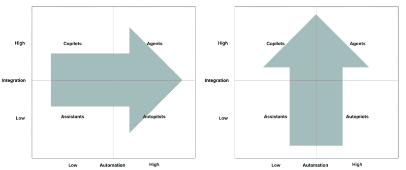

图 6.7：IA-AI 矩阵中的过渡路径

在 IA-AI 框架中，你可以从**左到右**（低自动化到高自动化）前进，通过更多自动化来增加用例的复杂性，或者从**底部到顶部**（低集成到高集成）前进，其中主要挑战是将你拥有的东西进一步集成到你的系统或工作流程中。

通常来说，**同时进行这两件事并不是一个好主意**（即，同时进行对角移动和提升集成与自动化的水平——所以不要直接从助手跳到代理。）

根据我在多个领域与不同 AI 项目合作的经验，最佳的方法通常是按照我在本章中介绍它们的顺序来处理用例：

**助手** **→** **共飞行员** **→** **自动驾驶仪** **→** **代理**

关键真的是首先从所谓的*增强型*用例（助手和共飞行员）开始，因为它们总是将人类纳入循环中。

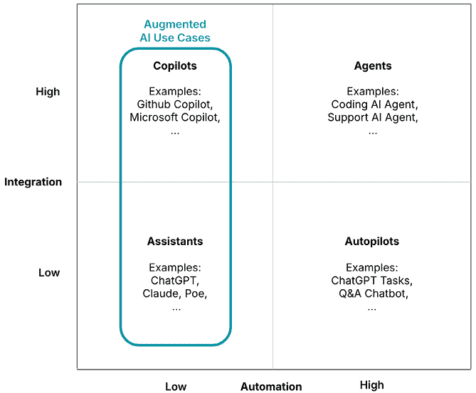

图 6.8：IA-AI 框架中的增强型 AI 用例

这给你带来了两个主要优势：

+   你可以控制 AI 输出并确保结果质量

+   你会随着时间的推移更多地了解 AI 如何适用于你的组织用例。

这两个因素是确保长期 AI 成功的关键组成部分。它们将随着时间的推移提高你的 AI 流利度。这些增强型用例的美丽之处在于，它们通常是最简单的，这使得它们成为快速原型设计和快速迭代的绝佳候选者。

增强型 AI 用例还让你能够应用我们在*第五章*中提到的有效工作流程增强的 TRICUS 原则。构建更先进的 AI 解决方案将允许你逐步将它们更无缝地集成到你的业务流程中，而不是花费数月（或数年）时间试图构建完美的集成。

这个框架在创建你的用例事实表时很有用。在填写你的用例事实表时，确保最初坚持助手和共飞行员用例。如果你发现自己处于自动驾驶或代理场景中，那么请三思。这真的是你想要的吗？你有能力让这些用例起飞吗？一个好的中间步骤可能是什么？

考虑到这一点，让我们开始着手我们的用例事实表。

# 用例事实表的维度

如我们在本章开头所讨论的，有十个维度将帮助你创建你的用例事实表。我们将逐步介绍这些维度。

## 问题维度

**问题维度** 是你用例分析的基础。它定义了 AI 解决方案旨在解决的具体商业问题。由于你已经在之前的一步中考虑了该维度，因此填写这部分应该很容易。问问自己：

+   **我们正在解决哪个痛点或瓶颈？** 确定 AI 解决方案旨在解决的具体问题，以及它是一个当前问题（痛点）还是未来问题（瓶颈），可能会阻碍增长。

+   **这对我们的业务有何影响？** 尝试描述问题的影响。例如，无法在一级支持中服务更多客户可能是一个痛点。影响可能是客户满意度下降和客户流失增加。其他影响可能是成本增加或销售额下降，例如。

+   **这个问题是否得到验证？** 你有多确定这个问题确实存在？你自己经历过这个问题吗？还是有其他证据表明这个问题是真实的？验证可能来自数据分析、客户反馈或与行业标准进行基准测试。

+   **这个问题有多大？** 使用您的$10K 阈值作为参考点，评估对核心业务指标（如收入、客户满意度或运营效率）的影响。问问自己：解决这个问题是否始终能带来超过阈值的增值，偶尔超过它，还是超过它几个倍数？以这种方式界定影响有助于您快速将问题分类为高、中或低优先级类别。

让我们回到上一章中的 RFP 示例，并定义问题维度（*图 6.9*）。

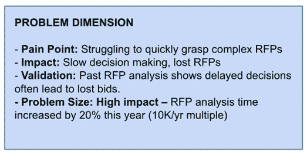

图 6.9：RFP 用例事实表的问题维度

在*分析 RFP*的过程步骤中，我们确定快速消化复杂的 RFP 很困难，这会导致决策延迟。我们的问题维度可能如下所示：

我们的项目团队现在在前期 RFP 分析上花费的时间显著增加，仅今年就增加了 20%。这种额外的努力减缓了是/否决策，留给准备实际提案的时间更少。因此，投标要么仓促且不完整，要么完全放弃。这种模式在过去的项目中很明显，延迟的决策直接导致了 RFP 的丢失。随着分析所需时间的增加而成功率下降，财务影响很容易超过每年$10K 的阈值，并被视为一个高影响瓶颈。

## 价值维度

**价值维度** 探索解决问题的潜在好处（借助 AI）。这可以使用*第五章*中的**价值杠杆**来回答——价值将如何创造？您的流程将运行得更快（速度杠杆）、更便宜（成本杠杆）、更高保真度（质量杠杆），还是您将能够做更多的事情（可扩展性杠杆）？有时，一个解决方案拉动多个这些杠杆，有时只是拉动一个。然而，如果您无法识别这些中的任何一个，那么这是一个强烈的迹象，表明价值维度并不清晰。例如，如果您的问题是客户流失，并且您构建了一个客户流失预测器，那么预测器本身并不会产生太多价值。使用这些信息来触发更好的（更有效的）保留活动，确实拉动了质量杠杆。

在分析价值维度时，考虑以下因素：

+   **谁将从这个解决方案中受益？** 识别将直接或间接从 AI 解决方案中受益的利益相关者，无论他们是客户、员工还是特定的业务单元。

+   **这个价值是如何实现的？** 这尤其适用于分析解决方案。更好的洞察力或预测是如何转化为商业价值的？谁将做出更好的决策，为了实现这一点必须发生什么？

+   **这些价值如何与我们的业务目标一致？**确保创造的价值支持你的更广泛战略目标。例如，如果你的业务不寻求进一步扩大客户群，那么推动客户增长的用例可能并不那么吸引人。

在 RFP 分析示例中，一个 AI 驱动的 RFP 聊天机器人（让我们称它为**RFP 聊天机器人分析器**）可以带来几个优势。以下是此用例的价值维度事实表：

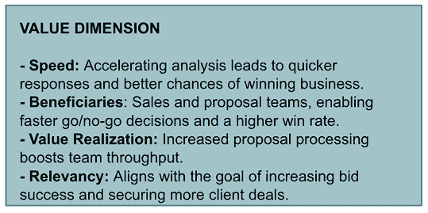

图 6.10：RFP 用例的价值维度示例

通过加快分析 RFPs 所需的时间，销售和提案团队可以更快地做出是/否的决定，减少瓶颈，并确保有更多时间来制定强有力的提案。直接受益者是团队本身，他们不仅提高了效率，而且通过提交更高质量、及时的回应，提高了赢得合同的机会。真正的价值在于吞吐量：而不是花费数天进行分析，团队可以用同样的资源处理更多的提案，从而有效地扩大其容量而不需要增加人员。同样重要的是，这一改进与更广泛的企业目标战略一致，即提高投标成功率并捕获更多客户交易，因此其影响既具体又高度相关。

## 数据维度

分析**数据维度**通常是所有任务中最具挑战性的。为什么？因为通常你对你的数据了解不多。即使你知道，关于你的数据未来可能的样子，总会有一些不确定性。因此，除了描述你有哪些数据外，你还应该制定出你的用例需要哪些数据。一些 AI 系统对数据需求非常庞大，尤其是如果你想训练自己的模型。对于其他人来说，数据需求相对较低，因为你可以利用预训练的现成模型。

在分析数据维度时，请考虑以下因素：

+   **我们应该考虑哪些数据？**确定 AI 解决方案所需的数据类型和来源。这可能包括结构化数据，如交易记录，或非结构化数据，如客户反馈。对于更广泛的项目，请保留一个单独的数据需求清单。

+   **我们是否有权访问所有必要的数据？**评估组织目前是否可以访问所需数据。如果是，谁负责这些数据资产？如果不是，确定如何获取或生成这些数据。

+   **这些数据的质量如何？**评估现有数据的准确性、完整性和与当前问题的相关性。

在 RFP 分析示例中，数据维度可能看起来如图*图 6.11*所示：

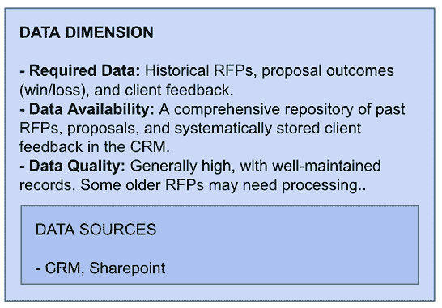

图 6.11：RFP 用例的数据维度示例

提高 RFP 分析的数据需求相对明确。核心上，该解决方案依赖于访问历史 RFP 文件、过去的提案以及相应的胜负结果，这些结果为哪些有效、哪些无效提供了事实依据。如果可用，客户反馈通过突出过去提交中的差距或优势，增加了一个额外的洞察层面。大部分这些数据可能已经通过内部存储库（如 CRM 和 SharePoint）可用，其中提案和客户记录是有系统性地存储的。因此，如果最近记录维护良好，整体质量可能相当高，而一些较旧的 RFP 可能在使用前需要预处理或归一化。通过结合这些数据源，组织将有一个坚实的起点来开发这个用例。

## 解决方案维度

**解决方案维度**详细描述了所提出的 AI 解决方案，包括其组成部分、技术是否为众所周知或新颖，以及您的组织是否准备好实施它。以下是一些需要考虑的关键点：

+   **解决方案是如何工作的？**用简单、非技术性的语言描述解决方案正在做什么以及它将如何工作。

小贴士：使用 AI 模式中的动作动词从高层次描述 AI 解决方案的工作方式。

+   **所提出的解决方案包含什么？**描述 AI 解决方案的高层次组成部分，包括任何软件、硬件或与现有系统的集成。如果这些组件还不明确，请说明软件需要评估。

+   **这项技术是众所周知的还是新的？**评估 AI 技术是否已经确立并得到验证，或者是否是前沿的且可能更具风险。

+   **我们是否有这项技术？**确定您的组织是否已经拥有必要的这项技术，或者是否需要新的投资。这是否是一个商品 AI 服务？

对于 AI 驱动的 RFP 分析解决方案，解决方案维度可能描述如下：

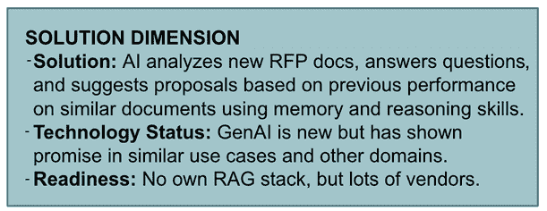

图 6.12：RFP 用例的解决方案维度示例

AI 将承担分析新 RFP 文档的任务，通过阅读和理解提案要求，然后应用记忆和推理技能从过去的提案和结果中提取见解。在此基础上，系统将使用沟通技巧总结关键点并回答澄清问题，使提案团队能够更快、更有信心地做出是/否的决定。底层技术基于生成式 AI (GenAI) 和 **检索增强生成** (**RAG**)，尽管这些技术相对较新，但已经在其他领域的文档分析和问答任务中展示了强大的性能。目前，该组织没有运营自己的 RAG 堆栈，但鉴于供应商产品和服务以及商品 AI 服务的广泛可用性，采用不需要完全在内部构建能力。

## 类型维度

使用 **类型维度**，您可以根据我们在上一节中讨论的 IA-AI 框架将您的用例分类为助手、协同驾驶者、自动驾驶仪或代理类别。为了定义用例类型，查看此用例所需的 **最小** 自动化和集成程度，以跨越 $10K 阈值：

+   **集成程度**：此用例如何集成到您的系统景观中？它是否需要深度集成？

+   **自动化程度**：在此用例中，人类参与是必要的吗？如果没有人类参与，用例会运行吗？

+   **类型**：您将如何根据此用例进行分类？

我们的 AI 驱动的 RFP 聊天机器人分析器可以展示以下特征：

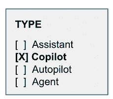

图 6.13：RFP 用例的类型维度示例

在集成方面，该用例至少需要访问现有的 CRM 数据以及历史提案和新收到的提案数据，例如通过 SharePoint 访问数据。除此之外，自动化需求相对较低，因为当有人需要从一系列提案文档中获得即席见解或答案时，流程将手动触发。没有人为干预，就不会创造价值。这可能会使此用例作为一个协同驾驶者的类型工作得很好。例如，它可以通过 SharePoint 或 Microsoft Teams 内的定制聊天机器人提供，或者基本上，任何提案团队每天已经与之互动的应用程序，以保持工作流程增强与 **TRICUS** 原则的一致性。

## 风险维度

**风险维度**考察与 AI 用例相关的潜在风险，并概述缓解策略。理解风险涉及对执行和不执行 AI 解决方案进行推理，因为两者都可能具有风险：

+   **这样做有哪些风险？** 识别实施人工智能解决方案相关的风险，例如技术挑战、数据隐私问题、可能对现有流程的干扰、合规性（例如，GDPR、欧盟人工智能法案等）、变革管理或内部阻力。

+   **不这样做有哪些风险？** 考虑不实施解决方案的风险，例如错失机会、竞争劣势或持续的低效率。例如，如果所有竞争对手都使用人工智能来编写他们的 RFP，而你却坚持使用传统方法，这将对你的业务产生怎样的影响？

+   **我们如何减轻这些风险？** 你将应用哪些策略来管理已识别的风险？这些风险是否可以管理？

这里是针对我们 RFP 示例的风险维度用例事实表：

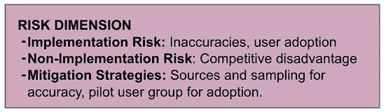

图 6.14：RFP 用例的风险维度示例

在 RFP 分析人工智能解决方案的背景下，实施人工智能驱动的 RFP 分析工具的关键风险在于对需求解释的不准确性和可能对自动化洞察持怀疑态度的用户产生的阻力。不实施的最大风险在于落后于采用此类工具的竞争对手，并继续在速度和胜率上表现优异。这些风险可以通过仔细的数据抽样来降低准确性，并通过从试点组开始建立用户信任和验证可行性，然后在扩展之前进行验证来减轻。

## 利益相关者参与维度

许多人工智能项目失败，并不是因为技术本身不工作，而是因为人们不希望解决方案有效，并产生内部阻力。想象一下，实施一个旨在取代客户支持人员的客户支持聊天机器人系统，同时要求同一批人评估该聊天机器人的准确性。这些指标可能看起来并不理想，因为谁会愿意实施夺走他们工作的技术呢？在这个简单的场景中看似微不足道的事情，实际上在大规模应用案例中很难察觉。通常，涉及许多不同的观点，每个观点都有其独特的利益。虽然不可能总是满足所有人的需求，但你至少应该了解谁参与了该项目，以及他们在项目中的角色是什么，特别是他们为项目成功做出的贡献。

从以下问题开始：

+   **谁是关键的利益相关者？** 识别对人工智能项目有既得利益的个人或团体，例如业务部门领导、IT 团队和最终用户。根据用例考虑内部和外部利益相关者。

+   **他们的角色是什么？** 定义每个利益相关者在项目中的具体角色和责任。

+   **他们将如何参与？** 概述每个利益相关者如何参与项目，包括他们的影响力水平和决策权，例如，使用结构化工具，如责任、问责、咨询、知情（RACI）矩阵（[`www.cio.com/article/287088/project-management-how-to-designa-successful-raci-project-plan.html`](https://www.cio.com/article/287088/project-management-how-to-designa-successful-raci-project-plan.html)）。

这个维度的用例事实表可能看起来像*图 6.15*所示。

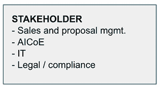

图 6.15：RFP 用例的利益相关者维度示例

对于人工智能 RFP 解决方案，几个利益相关者群体发挥着关键作用。销售和提案团队负责人是主要用户；他们定义需求、验证输出并在测试期间提供反馈。IT 部门确保技术实施和现有工作流程的集成顺利进行，而**卓越人工智能中心（AICoE**）则负责模型的部署并确保用例与更广泛的 AI 战略保持一致。法律和合规团队保护数据隐私和遵守法规，鉴于 RFP 中包含的客户信息的敏感性。这些群体需要通过结构化的参与来介入——通过研讨会来捕捉需求、测试阶段来验证功能，以及审查会议来解决担忧。然而，仅仅参与是不够的。为了确保真正的承诺，利益相关者必须将解决方案视为一种促进因素，而不是一种威胁。例如，提案团队应该亲身体验工具如何节省他们的时间并提高胜率，而不是担心被取代。透明地沟通项目目标、尽早纳入反馈循环以及明显的快速胜利是确保利益相关者不仅被咨询，而且完全支持采用的关键策略。

## 资源维度

**资源维度** 帮助你了解需要计划哪些投资才能使这个用例得以实施。这并不是要创建一个详细的企业计划，而是要了解这个用例的主要资源驱动因素将是什么，例如内部劳动时间、外部承包商、软件许可等。由于这通常很难提前估计，因此咨询内部或外部人工智能专家是个好主意。

在分析资源维度时，请考虑以下问题：

+   **需要哪些人力资源？** 确定实施人工智能解决方案所需的技能和专业知识，例如数据科学家、人工智能专家和项目经理。你有哪些？你需要从市场上获得哪些？

+   **需要哪些技术资源？** 确定所需的技术基础设施，例如硬件、软件和集成能力。

+   **需要哪些财务资源？**估算项目所需的预算，包括技术、人员和持续维护的成本。

对于人工智能 RFP 分析解决方案，资源维度可能包括以下资源：

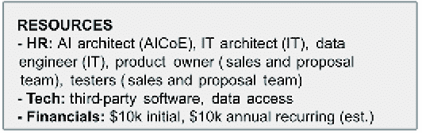

图 6.16：RFP 用例资源维度的示例

RFP 分析解决方案将需要跨职能资源，包括来自人工智能、IT 和其他部门的员工，以及来自受影响提案团队的某个人来指导和测试系统。技术需要以第三方人工智能软件为中心，并与 CRM 和 SharePoint 集成。从财务角度来看，项目的前期成本不得超过 10K 美元，年度成本不得超过 10K 美元，以实现盈利，考虑到每年 10K 美元的定义阈值，不考虑支持持续协作的内部劳动时间。为了保持用例的可行性，资源必须非常精简且具有成本效益，或者价值阈值必须调整到一个更雄心勃勃的目标，例如每季度 10K 美元的影响，以证明更高的运营成本是合理的。

## 成功因素维度

**成功因素维度**定义了将决定人工智能用例成功的 KPIs。最终，你需要有明确的验收标准来确定你的用例是否成功。许多用例失败，因为你永远无法确定它们是否真正实现了目标，因为那些目标从未被定义。因此，一开始就明确它们是个好主意。问问自己：

+   **KPIs 是什么？**确定将用于衡量人工智能项目成功的具体指标，例如客户满意度评分、响应时间或成本节约。

注意：这些关键绩效指标（KPIs）可以通过定量（直接测量）和定性方法（调查、观察等）得出。

+   **如何衡量成功？**确定如何衡量这些 KPIs，包括用于跟踪它们的数据来源和工具。

+   **实现成功的时间表是什么？**定义实现预期成果的时间表，包括任何里程碑或检查点。

*图 6.17* 强调了 RFP 用例的一些成功因素。

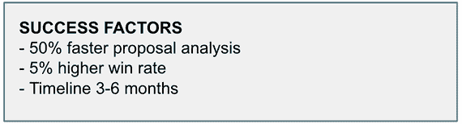

图 6.17：RFP 用例成功因素维度的示例

对于人工智能 RFP 分析解决方案，成功因素可能包括：

+   **KPIs**：分析 RFP 所需时间减少 50%（主要）和胜率提高 5%（次要）。

+   **测量工具**：对使用和不使用解决方案的用户进行 A/B 测试。

+   **时间表**：前三个月内获得初步结果，六个月内完成全面部署并实现关键绩效指标（KPIs）。

## 预期可行性维度

最后但同样重要的是，**预期可行性维度**是你对实现这个用例的可能性所做的总结性评估。如果你现在不知道如何给出一个数字，不要担心！下一章将为你提供一些简单的启发式方法。现在，最好从排名的角度来考虑预期可行性，而不是试图给出一个完美的分数。这涉及到为所有候选用例开发单页文档，然后在审查每个用例后按可行性进行排名。

实现这一排名的最佳方式是通过面对面比较。将两个用例并排比较，并根据实施难度判断哪一个更有可能成功。将这种比较扩展到所有用例中。最终，你将得到一个从最可行到最不可行的排名列表。

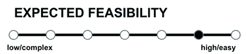

图 6.18：RFP 用例预期可行性维度的示例

根据我们从之前维度所了解的一切，我们的 RFP 聊天机器人分析器在可行性方面排名很高。这是因为它对技术的需求相对较低，我们预计在采用这个用例时组织或文化挑战将是最小的——尤其是在与其他同一 RFP 流程中的潜在人工智能应用相比时。

例如，让我们将这个用例与另一个用例进行比较，这个用例可能源自我们的人工智能机会筛选，即第五章中的 RFP Team Matcher。RFP Team Matcher 用例的要求如下：Expert Finder 旨在通过一个集成的 Outlook 插件快速组装合适的**主题专家**（SMEs），该插件建议在 RFP 输入中包含哪些人（CC）。从数据来源和利益相关者来看，很明显这个用例将涉及更多的人，并处理更多的敏感数据，因此我们肯定会将其排名为比 RFP Chatbot Analyzer 更不可行（更复杂）。

这是这个用例的事实表：

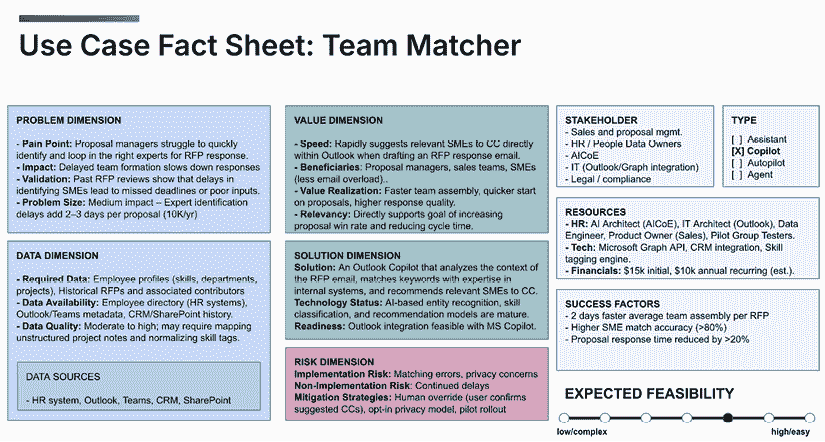

图 6.19：RFP Team Matcher 用例的完整用例事实表

为了比较，以下是我们的 RFP 聊天机器人分析器的完整用例事实表可能看起来如何：

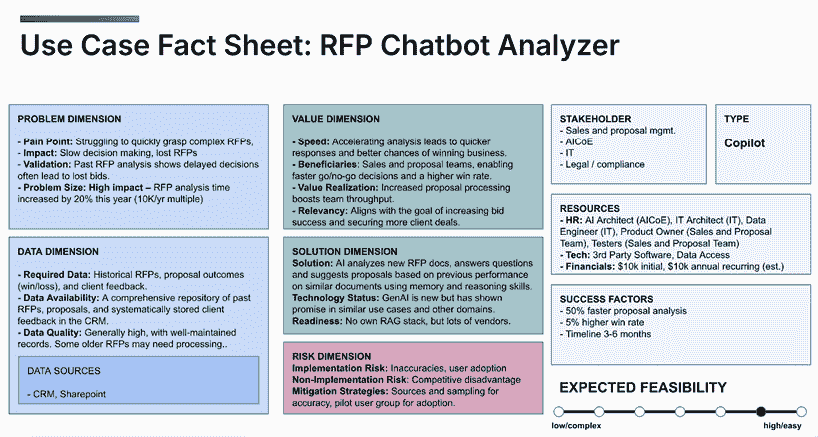

图 6.20：RFP Chatbot Analyzer 用例的完整用例事实表

当你查看这些用例事实表时，十个维度——问题、数据、价值、解决方案、风险、利益相关者、资源、成功因素、类型和预期可行性——为你提供了一个鸟瞰图，让你可以轻松地浏览用例。这不仅对你自己或任何管理用例管道的人来说很有用，而且对于清晰地传达每个用例的大局观和背后的*原因*也很有帮助。格式是灵活的：当你需要快速解释时，它可以简化为仅包含解决方案维度；当需要更多细节时，可以扩展到包含如**状态**等额外字段。我个人喜欢将其用作每个用例的一页总结——一种我可以在任何需要放大并统一我们对实际目标看法的时候调用的东西，即使在实施阶段也是如此。

# 摘要

在本章中，我们探索了一种实用方法，这种方法有效地平衡了在 AI 路线图早期决策阶段进行彻底用例分析的需求与实际现实。专注于那些可以实现的项目，这些项目可以带来快速胜利并为你的 AI 倡议建立势头是至关重要的，尤其是在开始阶段。

通过应用用例事实表模板，你可以确保每个潜在的人工智能项目都得到了彻底的理解，从它解决的问题到它所需的资源，再到它创造的价值。确保从增强型用例开始，随着你获得经验和信心，再逐步过渡到高级自动驾驶和代理用例。

在下一章中，我们将专注于优先考虑分析过的用例并将它们整合到战略人工智能路线图中。这个路线图将指导你的 AI 之旅，确保每一步都是深思熟虑的，与你的商业目标一致，并定位在成功的位置。

|

#### 现在解锁这本书的独家优惠

扫描此二维码或访问[`packtpub.com/unlock`](https://packtpub.com/unlock)，然后按书名搜索。 |  |

| **注意**：在开始之前，请准备好您的购买发票。* |
| --- |
