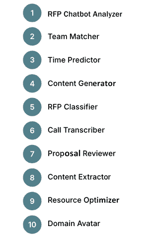
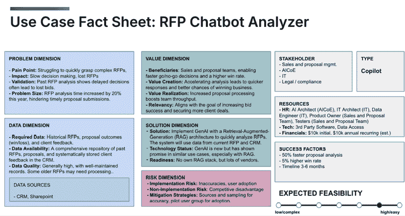
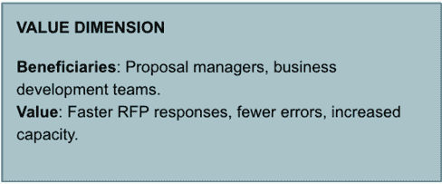
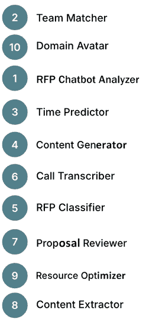
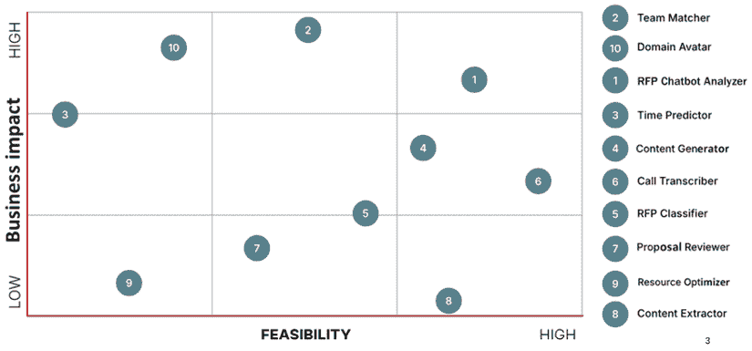
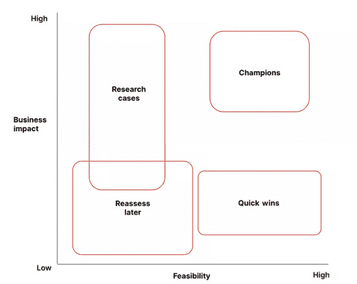
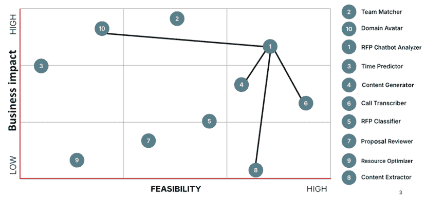
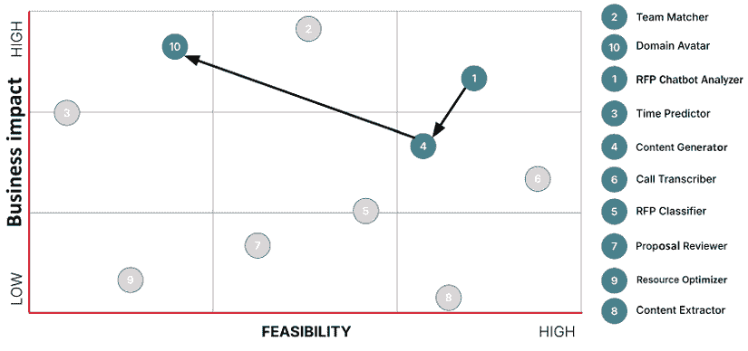

# 7

# 构建您的人工智能路线图

现在您已经创建了您的**用例事实表或事实表**——理想情况下，有很多个——下一步是将它们放入人工智能路线图中。或者更好：人工智能路线图。本章的标题可能暗示我们正在构建一个**人工智能路线图**，但事实上，大多数组织需要构建多个人工智能路线图。每个部门或业务单元都将拥有其独特的人工智能用例、策略和目标。这些各种路线图必须协同工作，形成一个与更广泛的企业目标相一致的战略，并确保长期成功。

在本书中我使用的人工智能路线图是一个相当战术性的元素。虽然您的整体人工智能采用方法（见*第三章*）告诉您您的组织应该如何应对人工智能时代，但人工智能路线图告诉您如何在较短的时间内使用人工智能实现一组特定的业务目标。虽然“较短的时间”没有确切的数字，但我发现规划六个月的时间间隔非常有帮助。六个月给您足够的时间来提前规划人工智能倡议，但它也足够短，可以适应整体人工智能领域的变革。

您的路线图基础是您在上章中学到的用例事实表。要将一系列用例事实表组织成一个连贯的路线图，我们必须做以下几件事：按共同因素组织事实表；优先排序事实表，以了解要解决的问题并识别事实表之间的联系，以了解哪些协同效应存在。

基于这些信息，您可以将您的用例放入一个项目计划中，该计划以结构化的方式执行，同时允许您保持灵活性，并在收集更多反馈、优先级转移或出现新机会时循环选择。

在本章中，我们将探讨如何在整个组织中构建多个人工智能路线图，这些路线图共同致力于一个更大的商业目标。虽然这里的重点是技术和战术

元素，记住，真正的成功也取决于培养一个人工智能准备就绪的文化，我们将在*第十章*中进一步讨论。

我们将涵盖以下主题：

+   组织人工智能用例

+   优先排序人工智能用例

+   连接点：在用例之间寻找协同效应

+   为最大影响排序用例

+   在整个组织中协调路线图

# 组织人工智能用例

有三种主要方式来组织您的用例，以实现分散的所有权同时允许战略决策：按部门、按产品团队或按业务目标。每种分组方法都根据您组织的结构和您的人工智能倡议重点提供独特的优势。

## 方法 A：按部门分组

您可以根据生成用例的部门或团队进行分组。这种方法通常按业务功能对用例进行分类，将人工智能项目与特定部门目标对齐。例如：

+   市场营销团队可能会专注于客户细分、个性化接触和活动优化，利用人工智能更好地理解客户行为并提高目标定位。

+   运营团队可能会优先考虑流程自动化、预测性维护或通过人工智能解决方案提高客户支持效率。

通过这种方式分组用例，确保每个部门对其人工智能机会有清晰的了解，并且这些机会直接与**核心业务流程**相联系。这种方法在机会主义人工智能采用和部门相对独立运作的组织中效果良好，在这些组织中，人工智能被视为提高特定部门效率和绩效的工具。

## 方法 B：按产品团队分组

如果您的组织以产品为中心，您可能会更喜欢根据人工智能如何支持每个产品来分组您的用例事实表，承认每个产品生命周期中的细微差别以及背后的客户旅程。

例如，如果您的组织运营多个电子商务渠道，如 B2B 和 B2C 商店，人工智能用例可以根据每种类型进行分组：

+   **B2C 商店**：人工智能用例可能集中在个性化推荐、动态定价和人工智能驱动的营销自动化上，以增强客户体验并推动转化。

+   **B2B 商店**：人工智能倡议可能包括批量订单预测、供应链优化和自动化的客户账户管理，解决 B2B 交易的较长的销售周期和运营效率需求。

这种方法在产品开发和客户体验是核心的行业中特别有效，例如电子商务、技术和消费品行业。

## 方法 C：按业务目标分组

另一种分组人工智能用例的方法是按其对更广泛业务目标的贡献，这种方法与分而治之的方法相得益彰。这种方法确保所有人工智能倡议都与公司的战略优先事项保持一致，例如增加收入、提高客户满意度或提高运营效率。

例如：

+   如果组织的首要目标是提高客户保留率，可以将来自多个部门的人工智能用例——如市场营销、客户服务和产品开发——归入这一目标。用例可能包括个性化营销推荐、人工智能驱动的客户支持聊天机器人和改进产品推荐引擎。

+   如果业务目标是降低运营成本，来自运营、物流和财务等部门的用例可能会分组在一起，包括简化订单交付、改进需求预测和供应链优化的人工智能项目。

这种分类确保了 AI 项目始终战略性地关注对业务最重要的方面，无论哪个部门负责执行。

在实践中，你可能会发现这些方法的组合效果最好。例如，以产品为中心的组织可能会按产品分组 AI 用例，但也会将某些倡议与更广泛的企业目标对齐，例如提高客户保留率或提高运营效率。最终，你可能会拥有这些不同因素的混合，这是完全可以接受的，因为这反映了你自己的组织的独特性。

## 构建用例待办事项

让我们通过部门来探讨构建路线图的一个实际例子。在前一章中，我们探讨了*AI RFP 响应流程*用例。在我们的销售部门，我们还确定了以下潜在的人工智能用例，这些用例可以添加到部门的**待办事项**中：

图 7.1：AI RFP 响应流程待办事项

此待办事项包括如下条目：

+   **RFP 聊天机器人分析器**：由 AI 驱动的聊天机器人，能够快速且准确地回答与 RFP 相关的问题。

+   **团队匹配器**：基于技能和经验，AI 系统建议处理特定 RFP 的最佳内部团队。

+   **时间预测器**：根据历史数据和项目复杂性预测完成 RFP 所需的时间。

+   **内容生成器**：通过利用 AI 起草基于以往成功提案的章节，自动生成提案内容。

+   **RFP 分类器**：AI 系统，用于对传入的 RFP 进行分类，并将它们路由到适当的部门或团队。

+   **通话转录器**：转录和分析与 RFP 相关的销售通话，帮助识别关键见解和行动点。

+   **提案审查员**：AI 工具，用于审查和提供对 RFP 草稿的反馈，确保合规性并提高质量。

+   **内容提取器**：从 RFP 文档中提取相关信息，以便更容易分析和更快地响应。

+   **资源优化器**：根据项目需求和可用性优化内部资源的分配。

+   **领域化身**：由 AI 驱动的*化身*，可以模拟内部领域专家，快速收集提交 RFP 所需的正确知识。

对于这些用例中的每一个，部门都创建了一个**用例事实表**。

RFP 聊天机器人分析器的用例事实表如图 7.2 所示：

图 7.2：用例事实表示例

当待办事项中填充了事实表时，组织更容易快速识别高优先级用例，在必要时重新分配资源，即使在某些项目遇到障碍时也能保持势头。用例事实表还确保了一致性，因为每个 AI 项目都可以使用同一套标准进行评估、比较和改进。

用例的积压不是一个一次性练习——它是一个活文档。随着新技术的出现和业务需求的发展，您的积压应该持续更新以反映这些变化。例如，由于人工智能技术的进步或数据可用性的变化，一年前不可行的用例现在可能已经触手可及。

这个持续审查过程还允许您根据需要重新优先排序用例。例如，如果一个部门通过一个低复杂度的用例（一个**快速胜利**）取得了成功，他们可以立即转向积压中已经存在的更高复杂度的项目。通过不断循环积压，您确保您的 AI 努力始终与当前的业务优先级和外部机会保持一致。

您的 AI**用例积压**（*图 7.1*）是您路线图过程的基础。它提供了一个结构化、全面的组织 AI 机会视图，确保每个业务目标背后的部门、产品团队或跨职能团队都清楚了解 AI 如何创造价值。积压展示了多个 AI 倡议的稳健示例，当它们被正确优先排序和定位时，可以成为一个组织良好的路线图。

这个部门现在可以通过按业务影响和可行性优先排序这些用例，并找到它们之间存在的协同效应来继续前进。

那正是我们接下来要做的！

# 优先排序 AI 用例

在您的用例收集到积压中后，下一步合乎逻辑的步骤是将它们按优先级排序。在深入研究用例之间的依赖关系或重叠之前，我们首先需要根据它们的**业务影响**和**可行性**来评估它们。这将帮助您专注于那些能带来最大价值且短期内最实用的用例。

在优先排序 AI 用例时，有两个关键维度需要考虑：业务影响和用例的可行性。

## 商业影响

这个维度评估一个用例可以为组织带来的潜在价值。在早期步骤中，您已经检查了一个用例是否通过了您的 10K 美元门槛，因此值得考虑。在这个阶段，重点转向两个问题：用例在门槛之上能带来多少价值，以及这种价值在实践中将如何衡量。您可以从用例事实表中的**价值维度**字段收集这个维度的见解。

图 7.3：评估项目商业价值的价值维度

请记住，在这个早期阶段，由于许多未知因素，量化影响可能很困难。您现在不需要一个完美的财务模型，但您确实需要一个关于价值创造的规模和可追溯性的可信感觉。

因此，与其使用像*T 恤尺码*这样的任意评分系统或模糊的分类，不如采取更直接的方法，将用例相互排序。这允许你在开始时优先考虑，而不会使事情过于复杂。

简单地将每个用例与其他用例进行面对面的比较，并问自己：哪一个更有可能在上面的 10,000 美元阈值以上产生可衡量的价值？你可以从以下四个**价值杠杆**的角度思考：

+   **成本**：这个用例能否让我们更有效地运营？

+   **质量**：这个用例能否让我们做得更好？

+   **速度**：这个用例能否让我们做得更快？

+   **数量**：这个用例能否让我们做更多？

一些用例可能只影响一个价值杠杆——而其他用例可能影响所有价值杠杆。然而，重要的是整体业务影响。如果一个用例仅仅通过允许你每月节省 50,000 美元的成本杠杆——这比一个可以更快、更便宜地做更多事情的用例更有价值，但整体影响可能仅为每月 20,000 美元。

对所有用例都这样做。当你逐个比较它们时，你将得到一个排序列表——从最高影响到底部——无需过多关注中间的确切数字或指标。

请记住，在实践中，你不需要将每个用例与其他每个用例进行比较。例如，如果我们知道*用例 1*比*用例 2*更有价值，那么如果*用例 3*比*用例 2*价值低，我们就不需要将*用例 3*与*用例 1*进行比较。

在我们的 RFP 示例（*图 7.3*）中，我们可能会发现**领域化身**比**RFP 聊天机器人****分析器**具有更高的预期业务影响。然而，当比较**团队匹配器**和**领域化身**时，**团队匹配器**在潜在业务价值方面可能排名更高。将**RFP 聊天机器人****分析器**与**时间预测器**进行比较可能会导致**RFP 聊天机器人****分析器**优先考虑。通过这种方法进行面对面的比较，你将得到一个基于业务影响的用例大致排序，这是一个向前推进的绝佳起点。

图 7.4：AI RFP 响应过程的用例排序

记住，这个排序只是一个粗略的启发式方法——使用它来快速建立优先级顺序，同时知道随着你进展和获得更多洞察，它可能会改变。

## 可行性

一旦你根据业务影响对用例进行了大致的排序，接下来要评估的维度是可行性。这个维度评估每个用例根据可用资源、数据、技术和组织准备情况实施的实际性——本质上，这是一个衡量价值实现速度和容易程度的指标。

在你的用例事实表中，你已经对可行性（参考*第六章*）进行了初步猜测。现在，根据*第六章*中的**数据维度**、**风险维度**、**资源**和**利益相关者**（*图 6.20*），对这次初步评估进行细化。

一些用例可能需要在数据收集、集成或基础设施方面进行大量投资，而其他用例可能使用现有的工具相对容易实现。

我使用一个系统，无论是否满足标准，都会给一个特定的用例分配**复杂性分数**：

| **检查？** | **问题** | **复杂性分数** |
| --- | --- | --- |
| [ ] | 这是否需要高度自动化？ | 2 |
| [ ] | 这是否需要高度集成？ | 2 |
| [ ] | 这项用例的数据是否不可用？ | 3 |
| [ ] | 我们是否需要为这个用例训练一个 AI 模型？ | 3 |
| [ ] | 我们是否缺乏必要的专业知识？ | 1 |
| [ ] | 这个用例是否在监管领域？ | 1 |

表 7.1：不同用例的复杂性分数

每当你勾选这些条目之一时，将复杂性分数加到你的总分中。

然后，你可以将这个用例大致匹配到以下类别之一：

+   **0-2 分数**：高可行性

+   **3-4 分数**：中可行性

+   **5+ 分数**：低可行性

随意调整这些问题和复杂性分数系统以适应你的组织。

在考虑这些信息的基础上，根据可行性进行面对面比较，就像你为业务影响所做的那样，但这次是在每个可行性类别（低/中/高）内进行，并且通过问自己每个项目可以多容易执行来审视。

当你进行可行性面对面比较时，你的用例将垂直展开，形成一个二维视图。第一个维度是影响，第二个维度是可行性。以下是如何在我们的当前示例中看起来：

图 7.5：比较用例 – 可行性与业务影响

例如，在评估可行性之后，你可能会意识到构建一个**呼叫转录器（6）**比实现更复杂的**RFP 聊天机器人分析器（1）**要容易。同样，**RFP 聊天机器人分析器（1）**可能比开发**自动内容生成器（4）**更容易，这可能需要大量的资源和高级能力。

考虑这两个维度，我们将探讨一个更结构化的方法来优先考虑你的用例。

## 创建用例优先级矩阵

如果你已经完成了这个练习，恭喜你，你刚刚创建了你的**用例优先级矩阵**（*图 7.5*）的第一稿。这个矩阵让你能够快速确定重点，并为决定优先考虑哪些用例提供了一种结构化的方法。

图 7.6：用例优先级矩阵

**优先级矩阵**是一个优秀的视觉工具，它提供了一种清晰、客观的方式来协调利益相关者，确定要追求哪些用例，并确保资源被引导到能带来最大商业价值的项目。它还有助于将用例分类为四种不同的类型：

+   **倡导者**：影响大、可行性高的项目。这些项目应优先考虑，因为它们提供了最直接的价值。

+   **快速胜利**：影响较小但可行性高的项目。这些项目可以快速实施以展示早期成功并建立势头。

+   **研究案例**：影响大但可行性较低的项目。这些是长期战略赌注，将需要更多资源和开发时间。

+   **重新评估**：影响较小、可行性较低的项目。这些项目应被降级，但可能会在情况改变后重新审视。

随着您的前进，这个优先级矩阵将至关重要，确保您的 AI 路线图专注于最有价值和最可行的用例，同时保持对需要长期承诺的更具雄心项目清晰的视野。它还将作为有效的利益相关者沟通工具，帮助每个人保持一致。

为了明确，您需要为每个部门、产品团队或业务目标中的每个用例待办事项运行此流程——具体取决于您如何分组它们。这就是为什么范围界定是关键。一个良好的平衡点是每个组大约有**5-15**个用例。这个范围为您提供了足够的迭代空间，同时防止您被过多的竞争优先事项所压倒。

最后，跟踪所有不同的路线图并确保整个组织的一致性是中央 AI 单位，如**AI 负责人**或**AI 卓越中心**（**AI CoE**）的任务。我们将在本章后面更深入地探讨这个话题。

目前，最后缺失的部分是确定不同的用例之间如何相关联，以及它们是否可以结合起来利用额外的协同效应。

# 连接点：在用例之间寻找协同效应

在实践中，许多*AI 路线图*流程在*优先级矩阵*后就停止了，团队直接跳入开发*快速胜利*用例或开始为更具雄心但可行性较低的项目建立资源。然而，他们忽略了一个关键步骤：*连接点*。

**连接点**意味着在不同的用例之间寻找重叠并识别协同效应。目标是利用一个用例的见解来惠及其他用例，跨项目转移学习（包括成功和失败）。它还使组织能够实现复利增长，即一个领域的进步导致其他领域的改进。

此过程可以发生：

+   在单个组内（无论按部门、产品团队还是业务目标分组）。

+   在所有路线图中的不同群体之间，确保整个组织内的对齐。

虽然像 AI 中心或 AI 负责人这样的中央单位将确保多个路线图之间的对齐，但不同群体中的业务领导者和部门负责人负责维护他们自己路线图内的对齐。AI 专家应协助此过程，但业务领导者也必须培养对不同用例之间关系的认识。这有助于他们根据需要调整方向，即时调整路线图，并做出更明智的决策。

让我们来看看一些常见的重叠。

## 常见的数据来源和技术重叠

连接点的一种最直接的方式是识别用例之间的共享数据来源和技术重叠。许多 AI 项目需要相同类型的数据或依赖于类似的技术基础设施。通过识别这些共享需求，您可以集中精力并减少冗余。

例如，在我们的 RFP 示例中，**RFP 聊天机器人分析器**和**内容生成器**都需要访问客户提交的原始 RFP 文件。这两个用例可能共享类似的数据管道，该管道处理这些文件并确保数据格式正确。简化这一数据管道同时有利于这两个用例。

如果从技术角度来看，**RFP 聊天机器人分析器**和**领域化身**都是**与您的文档聊天**的用例，由**大型语言模型**（**LLMs**）提供支持。这两个用例共享类似的技术堆栈，这意味着一个（例如，改进 LLM 交互）的进步或改进可以轻易地惠及另一个。

当数据或技术在用例中得到标准化时，好处会成倍增加。增强数据质量或 AI 技术堆栈的改进可以同时提升多个项目。

## 部门或团队之间的类似流程

由流程驱动的协同效应通常在群体内部出现，但也可以在部门之间出现。不同的团队可能正在解决类似的问题，即使表面上的具体用例看起来不同。

例如，虽然销售部门正在构建 RFP 聊天机器人来自动化对客户投标的响应，但内部采购部门可能从相反的角度面临类似的挑战——比较收到的报价和已发送的 RFP。这两个部门都处理文档比较，并可能从共享的 AI 平台上受益，该平台简化了文档处理。

识别这些流程重叠确保了类似的 AI 工具可以在部门间利用，减少重复并提高整体效率。

## 共享的产品功能或客户接触点

一些用例可能针对类似的产品功能或客户互动。认识到这些联系确保了一个用例的改进可以直接增强客户旅程或产品体验的其他部分。

考虑一个电子商务环境，其中不同的用例，如个性化推荐或购物车放弃恢复，可能会影响在线商店的结账流程。简化这些功能背后的底层技术确保客户旅程的多个部分都能从 AI 驱动的改进中受益。

在产品导向的用例之间连接点，可以提供更一致的用户体验，并有助于在整个组织中最大化 AI 的价值。

在你连接这些点时，你确保你的 AI 路线图不仅仅是一系列孤立的项目，而是一个紧密集成的计划，共同推动更大的商业价值。

但在实际操作中，你如何找到并协调这些重叠点呢？你可以使用一个实用的框架——**3S 框架**。让我们看看你如何使用它。

## 3S 框架：Spot（发现）、Size（评估）、Seize（抓住）

从**发现重叠点**开始，这涉及到扫描你的 AI 用例中任何共享的数据源、技术、工作流程或客户接触点。创建一个重叠点的简短列表，这些重叠点位于你的待办事项中。

小贴士：使用思维导图聚类用例重叠点！

接下来，**评估重叠点**以决定哪些共同点真正重要。并非每个共享元素都值得统一——一些可能只提供有限的好处或需要过多的额外努力。对每个重叠点的潜在商业价值、可行性和成本节约进行快速评估，使你能够专注于将产生最大影响的集成。

最后，**抓住重叠点**并将这些洞察转化为具体行动。一旦你知道了可以巩固努力和投资的地方，就是时候将这些项目统一到一个共享的架构或平台下，以及一个避免重复工作、允许更平滑的未来集成并加快扩展路径的时间表。

为了说明应用此框架和连接点的实际效果，让我们回顾一下我们之前优先考虑的 RFP 流程。

### 回顾 RFP 响应流程示例

我们应该连接哪些点——我们如何找到它们？让我们运行 3S 框架：

1.  **发现重叠点**：在 AI 项目中寻找共享需求：

    +   **数据**：多个用例是否依赖于相同的数据集或来源？

    +   **技术**：不同的 AI 用例需要类似模型、API 或基础设施吗？

    +   **流程**：不同的用例本质上是否试图以不同的方式解决相同类型的问题？

    +   **接触点**：哪些新的 AI 功能会影响相同的客户/用户旅程？

在我们的 RFP 场景中，例如，**聊天机器人分析器**、**内容生成器**和**领域化身**都依赖于相同的 RFP 文档数据库和基于 LLM 的文本生成。

1.  **评估重叠点**：不是每个点（连接）对我们来说都相关。因此，让我们简要评估哪些重叠点真正值得追求，方法是询问：

    +   **更高的商业影响**：合并努力是否会创造显著更好的结果？

    +   **更好的可行性**：合并是否会使得执行更容易而不是更难？

    +   **节省成本潜力**：我们将减少重复的 AI 工作并节省资源吗？

示例：由于**RFP 聊天机器人**分析器、**领域化身**和**内容生成器**都具有很高的商业价值，因此将它们捆绑在一起以降低成本并构建技术能力，以便在实施过程中解锁最复杂的用例（**领域化身**）是有意义的。

1.  **抓住重叠部分**：既然我们知道哪些协同效应存在，以及实现它们是否有意义，我们将根据实施计划定义相应的护栏。

在我们的例子中，我们不是独立开发单独的 AI 工具，而是将**RFP 聊天机器人**分析器、**领域化身**和**内容生成器**合并成一个名为**智能 RFP AI 套件**的单个项目。虽然每个用例仍然独立存在（并且单独实施），但我们确保基础设施、AI 模型和战略决策是整体规划的，消除重复的开发努力和基础设施成本。

具体来说，我们不是购买现成的“与您的数据聊天”工具，这种工具只能解决即时的聊天机器人用例，而是选择一个灵活的 AI 平台：

+   满足聊天机器人的即时需求，实现快速部署。

+   提供内置支持（或易于扩展）以支持额外的 AI 用例，例如内容生成和领域专业知识模拟。

+   通过允许无缝的模型更新和与未来 AI 计划的集成，确保长期的可扩展性。

*图 7.7* 展示了如何连接和排序 RFP 聊天机器人分析项目的用例。

图 7.7：RFP 响应过程的连接点

这种方法减少了技术碎片化，避免了供应商锁定，并通过确保每个 AI 投资在一段时间内服务于多个用例来最大化投资回报率。它还有助于优化资源，并放大部门内 AI 实施的商业价值。

在对 AI 用例进行分组、优先排序和连接点之后，最后一步是确定实施的最佳顺序。我们将在下一节中更详细地讨论这个问题。

# 为最大影响排序用例

对用例进行排序确保您的路线图中的 AI 计划按正确的顺序解决，平衡快速胜利、战略赌注和用例之间的依赖关系。

一个经过深思熟虑的顺序可以让您的组织：

+   通过跨相关项目重用能力和基础设施来最大化资源效率。

+   在为更复杂的项目奠定基础的同时，实现短期胜利。

+   通过早期解决基础问题（例如，数据准备）来降低风险，使更大的项目在未来更具可行性。

在决定实施用例的顺序时，应考虑以下因素：

+   **用例之间的依赖关系**：某些用例将自然依赖于其他用例。您需要确定哪些用例必须首先完成，以释放后续项目的价值。

    例如，在我们的 RFP 示例中，**RFP 聊天机器人** **分析器**可能需要一个成熟的文档处理流程。如果该部门还有一个使用相同文档输入的**内容生成器**，那么按顺序实施两者是有意义的，这样为聊天机器人创建的文档流程也可以为生成器提供动力。在这种情况下，聊天机器人可能需要优先考虑，因为它有助于建立其他基础设施。

    通过对具有共享依赖关系的用例进行排序，您确保了更平稳的实施和更有效率的资源利用。

+   **快速胜利** **与** **战略赌注**：您还应该平衡快速胜利和更具雄心、长期的项目。快速胜利展示了即时的价值，有助于建立势头和利益相关者的支持。另一方面，战略赌注是更复杂的倡议，需要更长的时间来实现，但提供更大的回报。

    在**RFP 聊天机器人** **分析器**是一个可行的快速胜利，可以在几个月内实施的情况下，应优先考虑。另一方面，**领域化身**可能是一个更雄心勃勃的项目，需要先进的 AI 能力和更长的时间框架。虽然两者都很重要，但首先解决快速胜利可以帮助建立组织支持并产生早期价值，同时为更复杂的项目奠定基础。

    通过战略性地安排这两种类型的项目，您可以保持势头，在整个路线图中持续交付价值。

+   **数据和基础设施准备**：在实施某些 AI 用例之前，组织需要确保必要的数据和基础设施已经到位。如果需要进行基础工作，例如清理数据、集成系统或改进数据治理，则应优先考虑这些任务，以释放未来的 AI 能力。

    让我们考虑一个案例，您的路线图中包括一个依赖过去提案高质量、结构化数据的 AI 驱动的**提案审查员**。第一步可能涉及数据管道和确保历史数据已清理并可供使用。一旦数据准备就绪，提案审查员就可以更容易地开发。

    早期解决数据准备问题可以确保后续项目不会因为基础问题而延迟。

+   **雄心勃勃项目的分阶段方法**：对于大型、复杂的 AI 项目（我们之前称之为战略赌注），将其分解为更小、更易于管理的阶段通常很有帮助。这种分阶段方法允许您逐步取得进展，同时最大限度地降低风险。

    对于像 **领域化身** 这样雄心勃勃的项目，您可能从实现一个处理基本查询的简单版本开始，然后逐渐扩展其功能以处理更复杂的任务。这种渐进式方法允许持续学习和改进，同时确保团队不会因为一开始就面临一个庞大而复杂的项目而感到不堪重负。

让我们回到我们的 RFP 示例，看看序列化在实际中是如何发挥作用的。

## 序列化 RFP 用例

在连接了 **RFP 聊天机器人分析器**、**领域化身** 和 **内容生成器** 之间的点之后，团队确定了以下顺序：

1.  **RFP 聊天机器人分析器**：这个用例是一个可行的快速胜利，可以展示即时的价值。它还建立了其他用例所依赖的必要文档处理管道。

1.  **内容生成器**：一旦文档处理管道就绪，内容生成器可以利用这个基础设施来自动化 RFP 创建过程中的部分环节。

1.  **领域化身**：这是一个更雄心勃勃的用例，需要更多的时间来开发。通过在聊天机器人和内容生成器之后进行序列化，团队确保了关键基础设施已经到位，从而降低了实施风险。

*图 7.8* 展示了基于两个优先维度——业务影响和可行性——的序列化。

图 7.8：RFP 响应流程的序列化用例

通过序列化快速胜利和战略赌注，您的组织可以在构建基础设施和为更复杂的项目做好准备的同时，产生即时影响。将雄心勃勃的用例分阶段实施，允许持续学习，并防止路线图被大型、缓慢移动的倡议拖累。有了良好的序列化路线图，您的团队将能够通过 AI 交付即时的结果和长期转型。

接下来，让我们总结一下，了解我们如何同步跨部门、流程和优先级的 AI 路线图，以在组织中获得最大的影响。

# 在组织内对齐路线图

对齐多个部门或产品特定的路线图确保每个 AI 初始化项目都对公司的主要目标做出贡献，同时解决其范围内的具体挑战。

## AI 路线图的去中心化所有权

成功 AI 路线图的一个关键要素是所有权。虽然 AI CoE 或中央 AI 团队在协调和战略对齐中扮演着至关重要的角色，但构建和执行 AI 路线图的责任应该是去中心化的，并由个别业务领导者或部门负责人拥有。

每个业务单元或部门都需要对其人工智能倡议负责，确保用例与其特定的目标、流程和挑战直接对齐。这种去中心化的所有权模式允许每个团队以自己的节奏前进，并对其独特的流程进行定制化的人工智能解决方案的实验。业务领导者必须具备开发其人工智能路线图所需的工具和支持。这意味着要了解人工智能如何融入其运营目标，并就哪些用例应优先考虑做出明智的决定。通过将人工智能路线图的所有权交给部门，可以培养责任感——同时也允许技术部门如 IT 部门，以及来自 AI CoE 的人工智能专家最有效地介入并提供帮助。

## 人工智能核心团队（AI CoE）的作用：推动协同和协调

虽然每个部门拥有自己的路线图，但人工智能核心团队（如果可用）确保这些路线图在整个组织内协调一致，使部门能够协作并利用共享的人工智能基础设施和学习成果。这种去中心化所有权和集中式协调之间的平衡确保了人工智能倡议既符合每个业务单元的需求，又与整体人工智能战略保持一致。

人工智能核心团队（AI CoE）作为协调组织内所有人工智能努力的中心枢纽。虽然各个部门拥有并管理自己的路线图，但人工智能核心团队确保：

+   最佳实践和学习成果在部门之间共享，以避免重复劳动。

+   数据和基础设施得到统一，使不同部门能够从共享资源中受益，例如数据管道、人工智能模型和云服务。

+   人工智能项目与更广泛的企业目标保持一致，确保每个倡议都对公司的整体目标做出贡献。

通过建立一个协调的结构，人工智能核心团队确保人工智能的采用不会在孤岛中发生，而是通过协作和共享见解使整个组织受益。去中心化所有权使团队能够以自己的节奏前进，并实施针对其独特挑战和目标的解决方案。然而，战略对齐确保了，尽管部门拥有自主权，但他们的努力仍然有助于公司的更大目标。

这种平衡确保了每个部门能够解决其即时需求，同时保持与组织长期目标的对齐。

## 人工智能成功的 KPI

最后，为了确保路线图能够推动预期的成果，人工智能核心团队和部门负责人必须建立**关键绩效指标（KPIs）**，这些指标反映了个人部门目标和更广泛的企业目标。这些 KPIs 为人工智能的成功提供了明确的衡量标准，并有助于保持路线图与整体公司战略之间的对齐。示例 KPI 可能包括成本降低、提高客户保留率或增加收入等指标，具体取决于正在实施的具体人工智能用例的目标。

在实践中，使用高级 KPI 跟踪人工智能项目成功往往过于简单，因为人工智能的影响经常跨越多个复杂的维度。然而，没有可衡量的标准也是不可行的，因为你将无法了解项目是否提供了有形的价值。

一个更现实、更可行的做法是为每个人工智能用例定义*两个简单的门槛*：

+   **价值门槛**：这是在每个定义的周期内（通常是每年）期望的最小业务价值或影响。它反映了具体的运营效益，例如节省时间、增量收入、提高客户保留率或降低成本。

+   **成本上限**：对于人工智能项目，包括所有因素（软件许可、基础设施、维护、数据标注和内部资源分配）的年度成本或成本分担的明确上限。

通过明确设置这两个门槛，你创建了一个直观的基准：只要你的*价值门槛超过成本上限*，你的人工智能用例就被认为是*净正的*、合理的，并且提供了有意义的价值。它是盈利的。

让我们通过我们的 RFP 聊天机器人分析器示例具体说明这种方法。

假设你聊天机器人的主要好处是节省销售代表的宝贵工作时间。你决定将你的价值门槛设定如下：

+   **价值门槛**：每个销售人员每周至少节省 1 小时。

如果有 10 名销售人员使用聊天机器人，这会迅速增加：

+   每周节省 10 小时 × 每年 52 周 = 每年 520 小时

+   每小时价值约为*60 美元*，这意味着每年对企业的影响约为 31,200 美元。

+   **成本上限**：那么，假设你开发、部署和维护这个 RFP 聊天机器人的年度总成本上限是 10,000*.* 由于你的年度价值（约 31K）显著超过你的年度成本（10K），你的聊天机器人实际上在四个月内就能实现回报。作为一个经验法则，对于中等到高可行性的用例，优先考虑 12 个月内能收回成本的项目。

将这些简化但有效的门槛纳入你的人工智能路线图评估中，确保你对人工智能项目的价值和可行性有清晰的了解。这种方法还减少了过度简单或过于复杂的指标带来的复杂性和不切实际性。它还支持明智的决策、战略调整和有效的资源分配——这些是推动大规模人工智能成功的关键因素。

随着人工智能在整个组织中的扩展，将人工智能路线图视为活着的、不断发展的文件变得至关重要——根据实际性能洞察、技术进步和不断变化的企业优先级，定期完善价值门槛和成本上限。

## 人工智能路线图的迭代性质：学习和调整

人工智能路线图不是静态的文档，而是需要根据新信息、新兴技术和不断变化的企业优先级持续更新和迭代的活计划。

与可能具有固定时间和目标的传统项目路线图不同，人工智能路线图必须具有适应性，因为人工智能领域发展迅速。技术突破，如新的机器学习模型或更高效的数据处理技术，可能会开辟在路线图最初创建时不存在的机会。同样，企业优先级可能会根据市场趋势、客户需求或竞争压力而改变。

+   其中一些变化可能是外部的。如果发布了一个新的、高度智能的人工智能模型，极大地改善了语言处理能力，那么一个正在开发内部文档分析人工智能系统的公司可能会决定从其原始解决方案转向采用这个新模型，从而提高性能并减少开发时间。

+   基于不断发展的商业和战略目标进行的内部变化也可能影响人工智能路线图。例如，一家公司可能专注于人工智能驱动的客户支持聊天机器人。然而，如果早期的试验表明聊天机器人难以理解客户查询，该组织可能会转向基于文本的推荐引擎，同时他们致力于完善聊天机器人的功能。

人工智能路线图需要具有动态性，以便允许这些转变——适应内部学习和外部技术进步。

因此，对您的 AI 路线图保持灵活性是至关重要的。我们将在下一节中进一步讨论。

## 以敏捷方式处理人工智能项目

维护灵活路线图的关键是采用敏捷方法进行人工智能开发。在**敏捷项目管理**中，工作以小型的、迭代的周期（**冲刺**）进行，使团队能够持续测试、学习和适应。这一原则在人工智能领域特别有效，因为在人工智能过程中，试错往往是其中的一部分。

小型且快速的迭代使人工智能项目能够分解成更小、更易于管理的阶段，使团队能够更快地取得进展，同时降低风险。通过开发小增量，如概念验证或原型，团队能够快速测试人工智能用例并在早期收集反馈。您将在*第九章*中了解更多关于此内容。

例如：而不是一次性构建一个复杂的基于人工智能的客户语音机器人，一家公司可以从推出一个用于内部使用的基于文本的聊天机器人开始。通过随着时间的推移收集见解并改进聊天机器人的性能，公司可以进一步转向更复杂的迭代，例如面向外部客户的机器人或语音界面。

# 摘要

在本章中，我们探讨了人工智能路线图如何提供构建和适应所需的结构和灵活性，以指导盈利的人工智能采用，从构建全面的用例清单到适应内部和外部变化。如果做得正确，人工智能路线图将不仅仅是一个规划工具——它们将成为盈利转型的引擎。为了实现这一点，它们必须被拥有、对齐，并针对明确的价值阈值和成本上限进行衡量。

然而，即使是设计得最好的路线图，也只有在有效的执行下才能成功。关键因素是赋予组织内各团队权力。每个部门都必须对其解决特定挑战和目标的人工智能倡议负责。拥有自己路线图的部门更有可能进行创新和适应，而人工智能核心团队（AI CoE）则确保与公司的整体战略保持一致，防止孤岛效应，并优化资源。赋予团队权力不仅超越了工具和数据。它需要培养跨职能沟通的环境、持续技能发展以及定期的路线图审查，以确保每个部门都能迅速应对成功和挑战。当团队建立了正确的支持结构时，他们可以快速而自信地行动，知道他们正在为短期胜利和长期商业目标做出贡献。

在我们的路线图就位后，我们现在处于一个很好的位置开始构建我们的用例。这就是下一章我们将要讨论的内容！

|

#### 现在解锁这本书的独家优惠

扫描此二维码或访问`packtpub.com/unlock`，然后通过书名搜索此书。 |  |

| **注意**：在开始之前，请准备好您的购买发票。* |
| --- |

# 请保持关注

为了跟上生成式人工智能和大型语言模型领域的最新发展，请订阅我们的每周通讯，AI_Distilled，在`packt.link/8Oz6Y`。

